# 数据可视化 {#ggplot2-visualization}


David Robinson 给出为何使用 ggplot2 [^why-ggplot2] 当然也有 Jeff Leek 指出在某些重要场合不适合 ggplot2 [^why-not-ggplot2] 并且给出强有力的 [证据](http://motioninsocial.com/tufte/)，其实不管怎么样，适合自己的才是好的。也不枉费 Garrick Aden-Buie 花费 160 页幻灯片逐步分解介绍 [优雅的ggplot2](https://pkg.garrickadenbuie.com/gentle-ggplot2)，[Malcolm Barrett](https://malco.io/) 也介绍了 [ggplot2 基础用法](https://malco.io/slides/hs_ggplot2)，还有 Selva Prabhakaran 精心总结给出了 50 个 ggplot2 数据可视化的 [例子](https://r-statistics.co/Top50-Ggplot2-Visualizations-MasterList-R-Code.html) 以及 Victor Perrier 为小白用 ggplot2 操碎了心地开发 RStudio 插件 [esquisse](https://github.com/dreamRs/esquisse) 包，Claus O. Wilke 教你一步步创建出版级的图形 <https://github.com/clauswilke/practical_ggplot2>。

GGplot2 是十分方便的统计作图工具，相比 Base R，为了一张出版级的图形，不需要去调整每个参数，实现快速出图。集成了很多其它统计计算的 R 包，支持丰富的统计分析和计算功能，如回归、平滑等，实现了作图和模型的无缝连接。比如图\@ref(fig:awesome-ggplot2)，使用 loess 局部多项式平滑得到数据的趋势，不仅仅是散点图，代码量也非常少。


```r
library(ggplot2)
ggplot(mpg, aes(displ, hwy)) +
  geom_point(aes(color = class)) +
  geom_smooth(se = TRUE, method = "loess") +
  labs(
    title = "Fuel efficiency generally decreases with engine size",
    subtitle = "Two seaters (sports cars) are an exception because of their light weight",
    caption = "Data from fueleconomy.gov"
  )
```

<div class="figure" style="text-align: center">
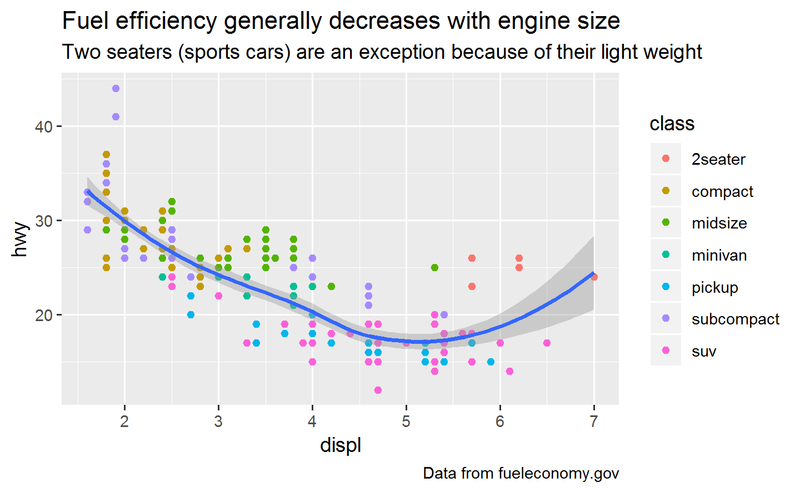
<p class="caption">(\#fig:awesome-ggplot2)简洁美观</p>
</div>

故事源于一幅图片，我不记得第一次见到这幅图是什么时候了，只因多次在多个场合中见过，所以留下了深刻的印象，后来才知道它出自于一篇博文 --- [Using R packages and education to scale Data Science at Airbnb](https://medium.com/airbnb-engineering/using-r-packages-and-education-to-scale-data-science-at-airbnb)，作者 Ricardo Bion 还在其 Github 上传了相关代码^[<https://github.com/ricardo-bion/medium_visualization>]。除此之外还有几篇重要的参考资料：

1. Pablo Barberá 的 [Data Visualization with R and ggplot2](https://github.com/pablobarbera/Rdataviz)
2. Kieran Healy 的新书 [Data Visualization: A Practical Introduction](https://kieranhealy.org/publications/dataviz/)
3. Matt Leonawicz 的新作 [mapmate](https://github.com/leonawicz/mapmate), 可以去其主页欣赏系列作品^[<https://leonawicz.github.io/>]
1. [bbplot](https://github.com/bbc/bbplot)
1. [tidytuesday 可视化挑战官方项目](https://github.com/rfordatascience/tidytuesday) 还有 [tidytuesday](https://github.com/abichat/tidytuesday)

[^why-ggplot2]: http://varianceexplained.org/r/why-I-use-ggplot2/
[^why-not-ggplot2]: https://simplystatistics.org/2016/02/11/why-i-dont-use-ggplot2/

## 基础语法 {#intro-ggplot2}

以数据集 airquality 为例介绍GGplot2 图层、主题、配色、坐标、尺度、注释和组合等

### 图层 {#ggplot2-layer}


```r
ls("package:ggplot2", pattern = "^geom_")
#>  [1] "geom_abline"     "geom_area"       "geom_bar"        "geom_bin2d"     
#>  [5] "geom_blank"      "geom_boxplot"    "geom_col"        "geom_contour"   
#>  [9] "geom_count"      "geom_crossbar"   "geom_curve"      "geom_density"   
#> [13] "geom_density_2d" "geom_density2d"  "geom_dotplot"    "geom_errorbar"  
#> [17] "geom_errorbarh"  "geom_freqpoly"   "geom_hex"        "geom_histogram" 
#> [21] "geom_hline"      "geom_jitter"     "geom_label"      "geom_line"      
#> [25] "geom_linerange"  "geom_map"        "geom_path"       "geom_point"     
#> [29] "geom_pointrange" "geom_polygon"    "geom_qq"         "geom_qq_line"   
#> [33] "geom_quantile"   "geom_raster"     "geom_rect"       "geom_ribbon"    
#> [37] "geom_rug"        "geom_segment"    "geom_sf"         "geom_sf_label"  
#> [41] "geom_sf_text"    "geom_smooth"     "geom_spoke"      "geom_step"      
#> [45] "geom_text"       "geom_tile"       "geom_violin"     "geom_vline"
```

生成一个散点图


```r
ggplot(airquality, aes(x = Temp, y = Ozone)) + geom_point()
#> Warning: Removed 37 rows containing missing values (geom_point).
```


### 主题 {#ggplot2-theme}


```r
ls("package:ggplot2", pattern = "^theme_")
#>  [1] "theme_bw"       "theme_classic"  "theme_dark"     "theme_get"     
#>  [5] "theme_gray"     "theme_grey"     "theme_light"    "theme_linedraw"
#>  [9] "theme_minimal"  "theme_replace"  "theme_set"      "theme_test"    
#> [13] "theme_update"   "theme_void"
```

这里只展示 `theme_bw()` `theme_void()` `theme_minimal() ` 和 `theme_void()` 等四个常见主题，更多主题参考 [ggthemes](https://github.com/jrnold/ggthemes) 、[hrbrthemes](https://github.com/hrbrmstr/hrbrthemes) 和 [ggthemr](https://github.com/cttobin/ggthemr) 包


```r
ggplot(airquality, aes(x = Temp, y = Ozone)) + geom_point() + theme_bw()
#> Warning: Removed 37 rows containing missing values (geom_point).
ggplot(airquality, aes(x = Temp, y = Ozone)) + geom_point() + theme_void()
#> Warning: Removed 37 rows containing missing values (geom_point).
ggplot(airquality, aes(x = Temp, y = Ozone)) + geom_point() + theme_minimal()
#> Warning: Removed 37 rows containing missing values (geom_point).
ggplot(airquality, aes(x = Temp, y = Ozone)) + geom_point() + theme_void()
#> Warning: Removed 37 rows containing missing values (geom_point).
```

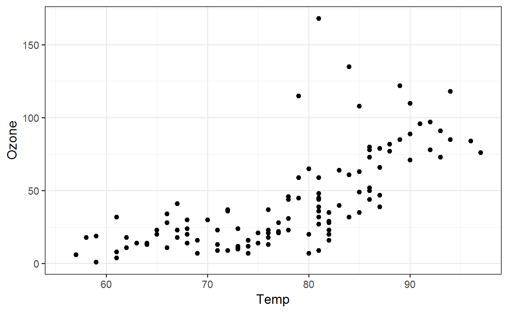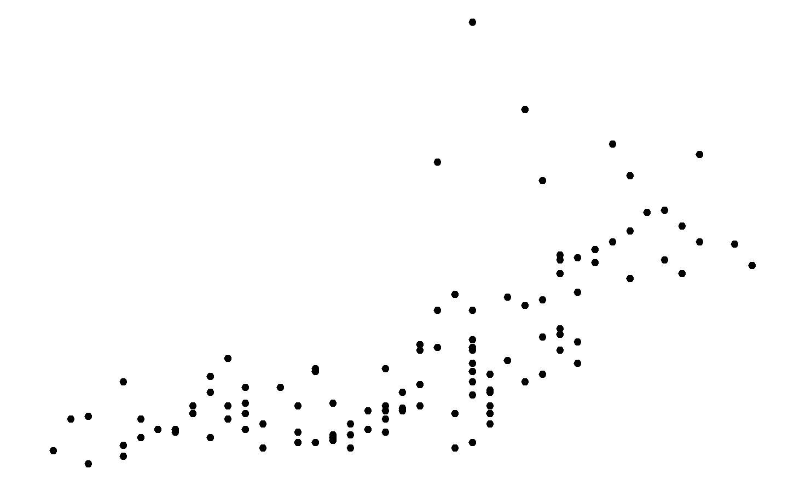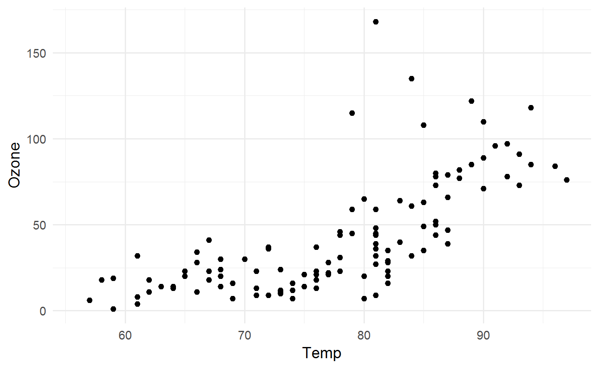

### 配色 {#ggplot2-color}


```r
ls("package:ggplot2", pattern = "^scale_(color|fill)_")
#>  [1] "scale_color_brewer"     "scale_color_continuous" "scale_color_discrete"  
#>  [4] "scale_color_distiller"  "scale_color_gradient"   "scale_color_gradient2" 
#>  [7] "scale_color_gradientn"  "scale_color_grey"       "scale_color_hue"       
#> [10] "scale_color_identity"   "scale_color_manual"     "scale_color_viridis_c" 
#> [13] "scale_color_viridis_d"  "scale_fill_brewer"      "scale_fill_continuous" 
#> [16] "scale_fill_date"        "scale_fill_datetime"    "scale_fill_discrete"   
#> [19] "scale_fill_distiller"   "scale_fill_gradient"    "scale_fill_gradient2"  
#> [22] "scale_fill_gradientn"   "scale_fill_grey"        "scale_fill_hue"        
#> [25] "scale_fill_identity"    "scale_fill_manual"      "scale_fill_ordinal"    
#> [28] "scale_fill_viridis_c"   "scale_fill_viridis_d"
```


```r
ggplot(airquality, aes(x = Temp, y = Ozone, color = as.factor(Month))) +
  geom_point()
#> Warning: Removed 37 rows containing missing values (geom_point).
ggplot(airquality, aes(x = Temp, y = Ozone, color = as.ordered(Month))) +
  geom_point()
#> Warning: Removed 37 rows containing missing values (geom_point).
```

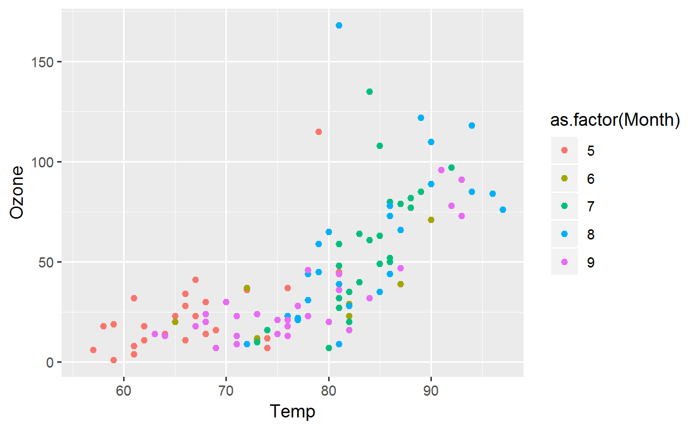


### 刻度 {#ggplot2-scale}


```r
ls("package:ggplot2", pattern = "^scale_(x|y)_")
#>  [1] "scale_x_continuous" "scale_x_date"       "scale_x_datetime"  
#>  [4] "scale_x_discrete"   "scale_x_log10"      "scale_x_reverse"   
#>  [7] "scale_x_sqrt"       "scale_x_time"       "scale_y_continuous"
#> [10] "scale_y_date"       "scale_y_datetime"   "scale_y_discrete"  
#> [13] "scale_y_log10"      "scale_y_reverse"    "scale_y_sqrt"      
#> [16] "scale_y_time"
```


```r
range(airquality$Temp, na.rm = TRUE)
#> [1] 56 97
range(airquality$Ozone, na.rm = TRUE)
#> [1]   1 168
ggplot(airquality, aes(x = Temp, y = Ozone)) + geom_point() +
  scale_x_continuous(breaks = seq(50, 100, 5)) +
  scale_y_continuous(breaks = seq(0, 200, 20))
#> Warning: Removed 37 rows containing missing values (geom_point).
```

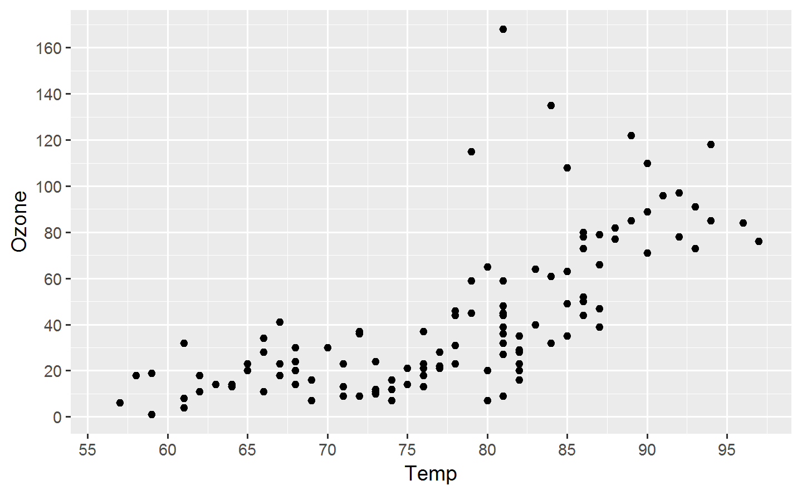

### 注释 {#ggplot2-annotate}


```r
ls("package:ggplot2", pattern = "^annotation_")
#> [1] "annotation_custom"   "annotation_logticks" "annotation_map"     
#> [4] "annotation_raster"
```


```r
ggplot(airquality, aes(x = Temp, y = Ozone)) + geom_point()
#> Warning: Removed 37 rows containing missing values (geom_point).
```

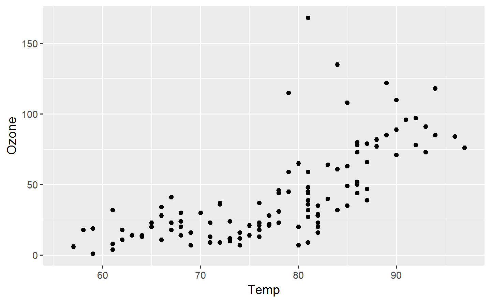


```r
ggplot(airquality, aes(x = Temp, y = Ozone)) + geom_point() +
  labs(title = substitute(paste(d *
    bolditalic(x)[italic(t)] == alpha * (theta - bolditalic(x)[italic(t)]) *
    d * italic(t) + lambda * d * italic(B)[italic(t)]), list(lambda = 4)))
#> Warning: Removed 37 rows containing missing values (geom_point).
```

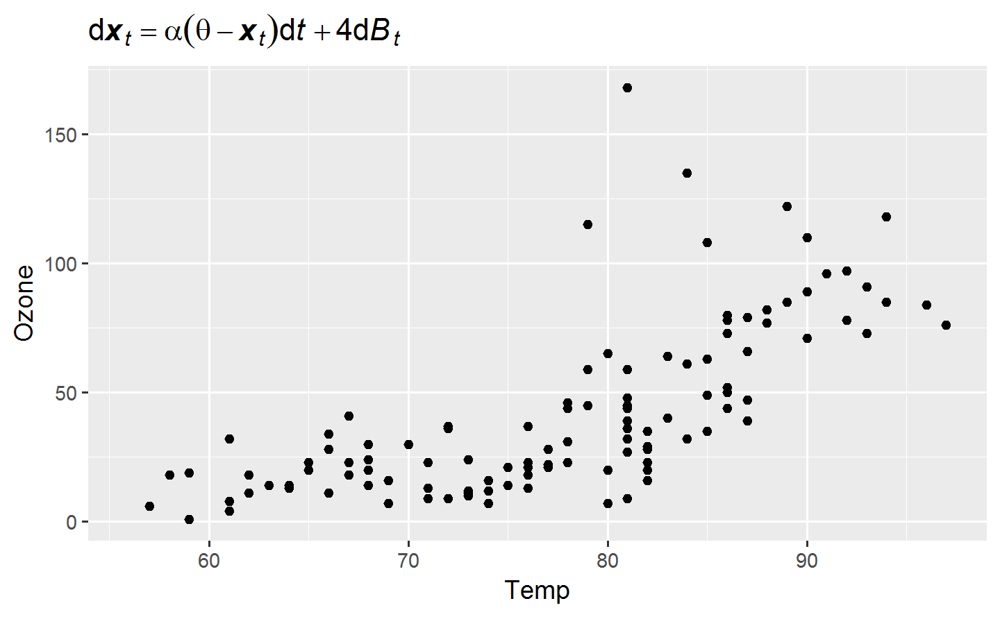

### 图例 {#ggplot2-legend}

### 组合 {#ggplot2-grid}


```r
ggplot(airquality) + geom_point(aes(x = Temp, y = Ozone)) + facet_wrap(~ as.ordered(Month))
#> Warning: Removed 37 rows containing missing values (geom_point).
ggplot(airquality) + geom_point(aes(x = Temp, y = Ozone)) + facet_wrap(~ as.ordered(Month), nrow = 1)
#> Warning: Removed 37 rows containing missing values (geom_point).
```


gridExtra 和 patchwork


### 坐标系 {#ggplot2-coord}

极坐标，直角坐标


```r
ls("package:ggplot2", pattern = "^coord_")
#>  [1] "coord_cartesian" "coord_equal"     "coord_fixed"     "coord_flip"     
#>  [5] "coord_map"       "coord_munch"     "coord_polar"     "coord_quickmap" 
#>  [9] "coord_sf"        "coord_trans"
```

### 坐标轴 {#ggplot2-axes}

坐标轴标签位置、大小、字体

## 统计图形 {#ggplot2-gallary}

### 散点图 {#ggplot2-scatter}

下面以 diamonds 数据集为例展示 ggplot2 的绘图过程，首先加载 diamonds 数据集，查看数据集的内容


```r
data(diamonds)
str(diamonds)
#> Classes 'tbl_df', 'tbl' and 'data.frame':	53940 obs. of  10 variables:
#>  $ carat  : num  0.23 0.21 0.23 0.29 0.31 0.24 0.24 0.26 0.22 0.23 ...
#>  $ cut    : Ord.factor w/ 5 levels "Fair"<"Good"<..: 5 4 2 4 2 3 3 3 1 3 ...
#>  $ color  : Ord.factor w/ 7 levels "D"<"E"<"F"<"G"<..: 2 2 2 6 7 7 6 5 2 5 ...
#>  $ clarity: Ord.factor w/ 8 levels "I1"<"SI2"<"SI1"<..: 2 3 5 4 2 6 7 3 4 5 ...
#>  $ depth  : num  61.5 59.8 56.9 62.4 63.3 62.8 62.3 61.9 65.1 59.4 ...
#>  $ table  : num  55 61 65 58 58 57 57 55 61 61 ...
#>  $ price  : int  326 326 327 334 335 336 336 337 337 338 ...
#>  $ x      : num  3.95 3.89 4.05 4.2 4.34 3.94 3.95 4.07 3.87 4 ...
#>  $ y      : num  3.98 3.84 4.07 4.23 4.35 3.96 3.98 4.11 3.78 4.05 ...
#>  $ z      : num  2.43 2.31 2.31 2.63 2.75 2.48 2.47 2.53 2.49 2.39 ...
```

数值型变量 carat 作为 x 轴


```r
ggplot(diamonds, aes(x = carat))
ggplot(diamonds, aes(x = carat, y = price))
ggplot(diamonds, aes(x = carat, color = cut))
ggplot(diamonds, aes(x = carat), color = "steelblue")
```

<div class="figure" style="text-align: center">
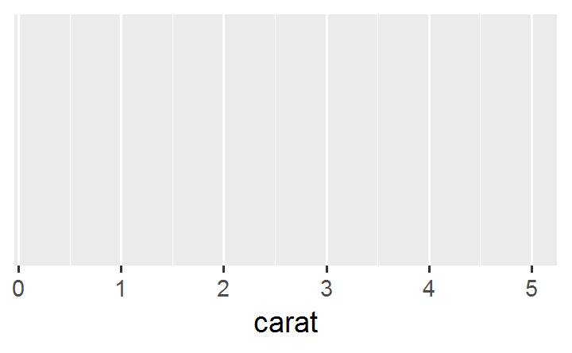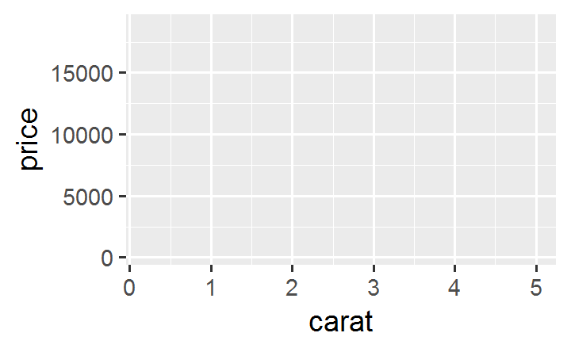
<p class="caption">(\#fig:diamonds-axis)指定统一颜色</p>
</div>

图 \@ref(fig:diamonds-axis) 的基础上添加数据图层


```r
ggplot(diamonds, aes(x = carat, y = price)) +
  geom_point()
```

<div class="figure" style="text-align: center">

<p class="caption">(\#fig:scatter)添加数据图层</p>
</div>

给散点图\@ref(fig:scatter)上色


```r
ggplot(diamonds, aes(x = carat, y = price)) +
  geom_point(color = "steelblue")
```

<div class="figure" style="text-align: center">
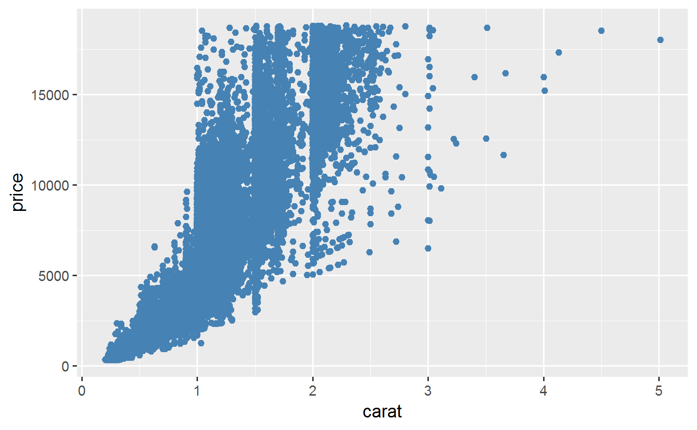
<p class="caption">(\#fig:scatter-color-1)散点图配色</p>
</div>


```r
ggplot(diamonds, aes(x = carat, y = price)) +
  geom_point(color = "steelblue") +
  scale_y_continuous(
    labels = scales::unit_format(unit = "k", scale = 1e-3),
    breaks = seq(0, 20000, 4000)
  )
```

<div class="figure" style="text-align: center">
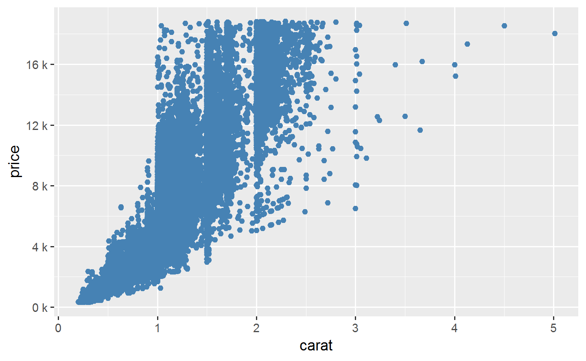
<p class="caption">(\#fig:scatter-scale-1)格式化坐标轴刻度标签</p>
</div>

让另一变量 cut 作为颜色分类指标


```r
ggplot(diamonds, aes(x = carat, y = price, color = cut)) +
  geom_point()
```

<div class="figure" style="text-align: center">
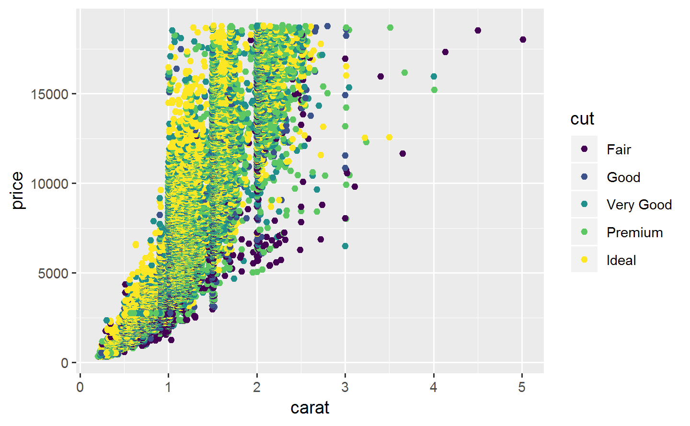
<p class="caption">(\#fig:scatter-color-2)分类散点图</p>
</div>

当然还有一种类似的表示就是分组，默认情况下，ggplot2将所有观测点视为一组，以分类变量 cut 来分组


```r
ggplot(diamonds, aes(x = carat, y = price, group = cut)) +
  geom_point()
```

<div class="figure" style="text-align: center">
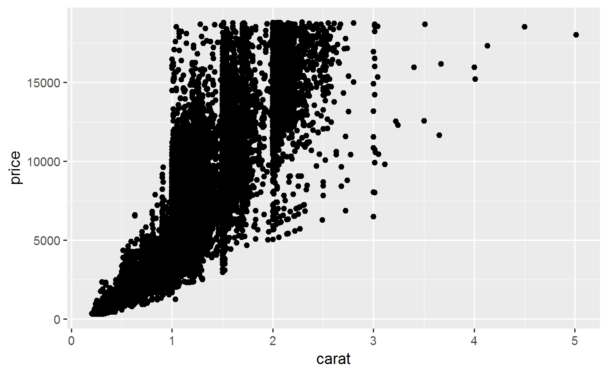
<p class="caption">(\#fig:scatter-group)分组</p>
</div>

在图\@ref(fig:scatter-group) 上没有体现出来分组的意思，下面以 cut 分组线性回归为例


```r
ggplot(diamonds, aes(x = carat, y = price)) +
  geom_point() +
  geom_smooth(method = "lm")
ggplot(diamonds, aes(x = carat, y = price, group = cut)) +
  geom_point() +
  geom_smooth(method = "lm")
```

<div class="figure" style="text-align: center">
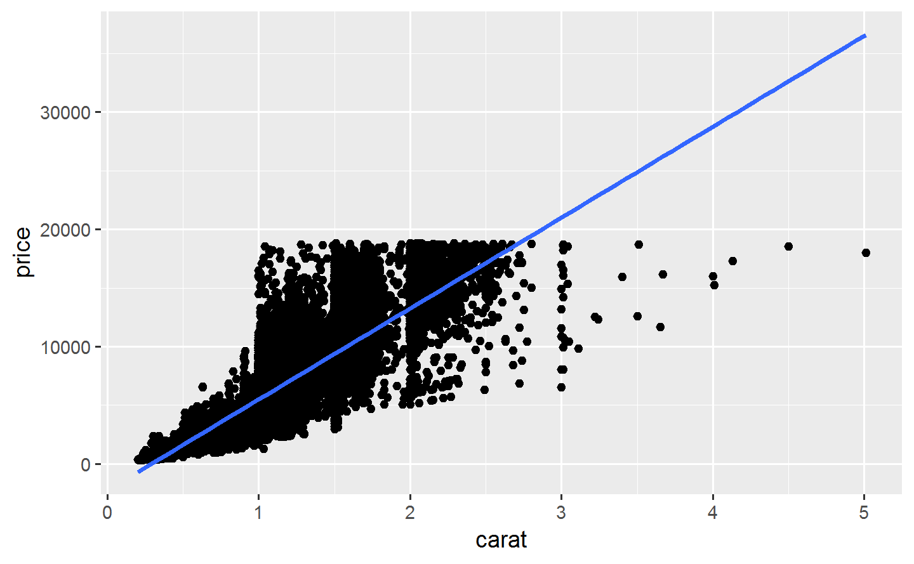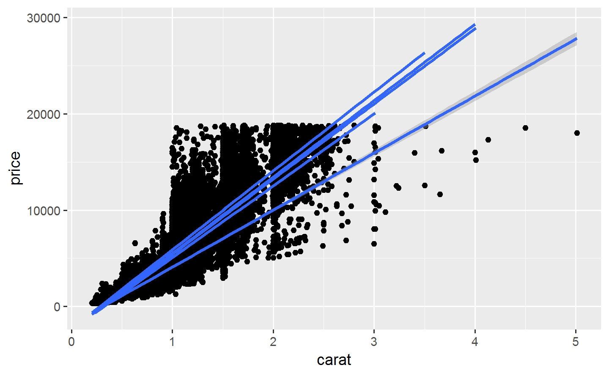
<p class="caption">(\#fig:group-lm)分组线性回归</p>
</div>

我们当然可以选择更加合适的拟合方式，如局部多项式平滑 `loess` 但是该方法不太适用观测值比较多的情况，因为它会占用比较多的内存，建议使用广义可加模型作平滑拟合


```r
ggplot(diamonds, aes(x = carat, y = price, group = cut)) +
  geom_point() +
  geom_smooth(method = "loess")
```

```r
ggplot(diamonds, aes(x = carat, y = price, group = cut)) +
  geom_point() +
  geom_smooth(method = "gam", formula = y ~ s(x, bs = "cs"))
```

<div class="figure" style="text-align: center">
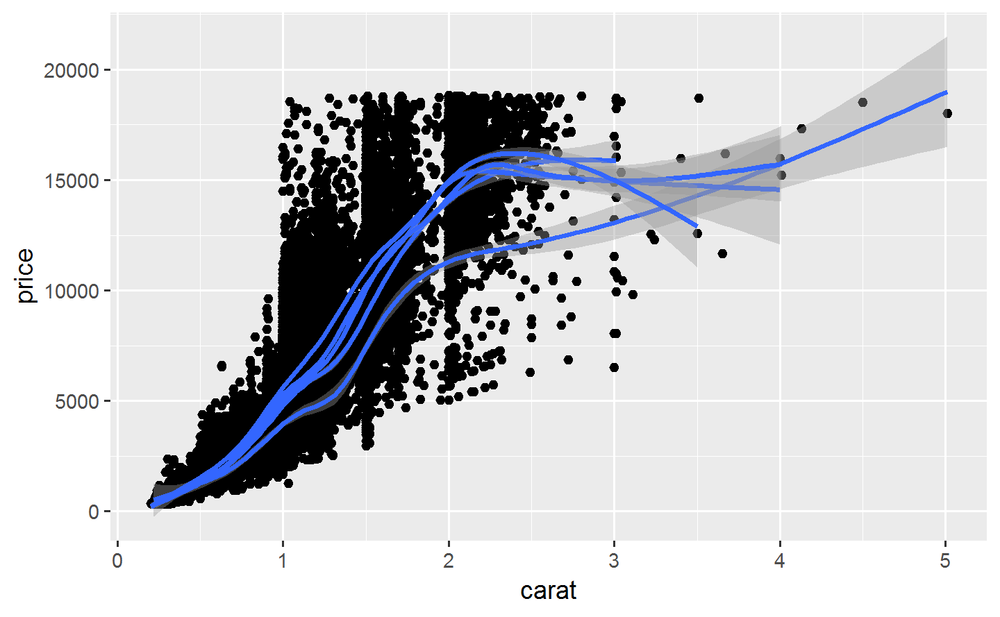
<p class="caption">(\#fig:group-gam)数据分组应用广义可加平滑</p>
</div>

::: sidebar
[ggfortify](https://github.com/sinhrks/ggfortify) 包支持更多的统计分析结果的可视化
:::

为了更好地区分开组别，我们在图\@ref(fig:group-gam)的基础上分面或者配色


```r
ggplot(diamonds, aes(x = carat, y = price, group = cut)) +
  geom_point() +
  geom_smooth(method = "gam", formula = y ~ s(x, bs = "cs")) +
  facet_grid(~cut)
ggplot(diamonds, aes(x = carat, y = price, group = cut, color = cut)) +
  geom_point() +
  geom_smooth(method = "gam", formula = y ~ s(x, bs = "cs"))
```

<div class="figure" style="text-align: center">
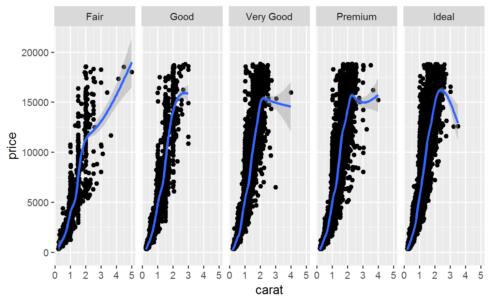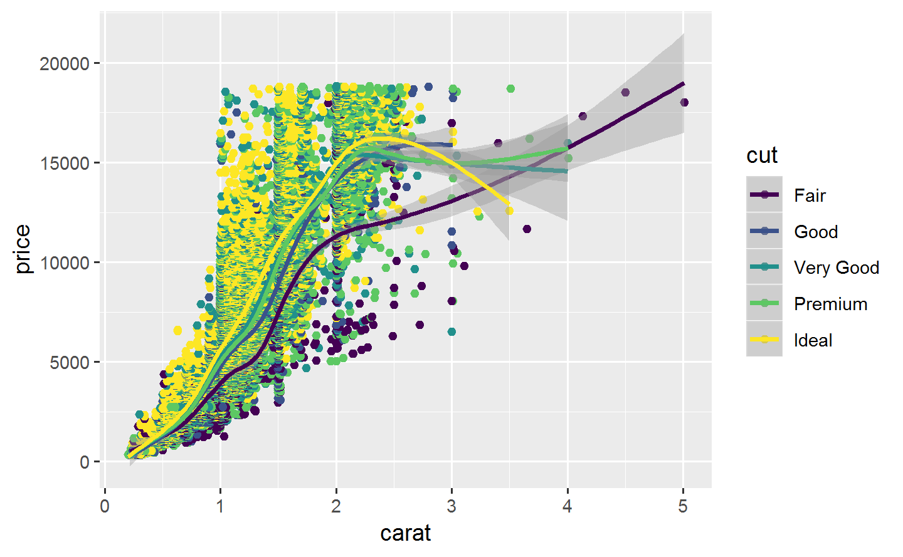
<p class="caption">(\#fig:group-facet)分组配色</p>
</div>

在分类散点图的另一种表示方法就是分面图，以 cut 变量作为分面的依据


```r
ggplot(diamonds, aes(x = carat, y = price)) +
  geom_point() +
  facet_grid(~cut)
```

<div class="figure" style="text-align: center">
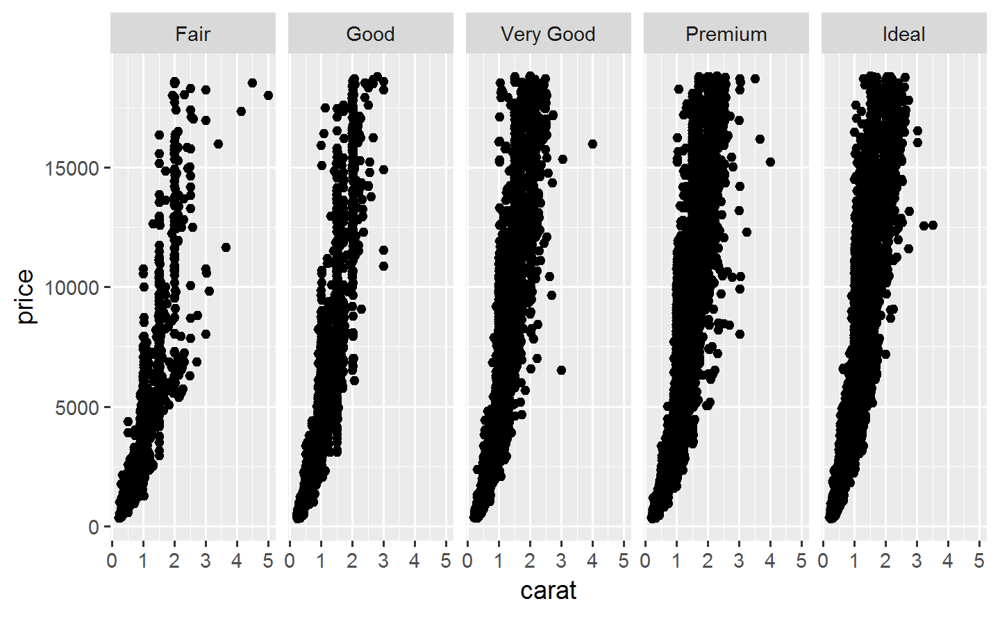
<p class="caption">(\#fig:scatter-facet)分面散点图</p>
</div>

给图 \@ref(fig:scatter-facet) 上色


```r
ggplot(diamonds, aes(x = carat, y = price)) +
  geom_point(color = "steelblue") +
  facet_grid(~cut)
```

<div class="figure" style="text-align: center">
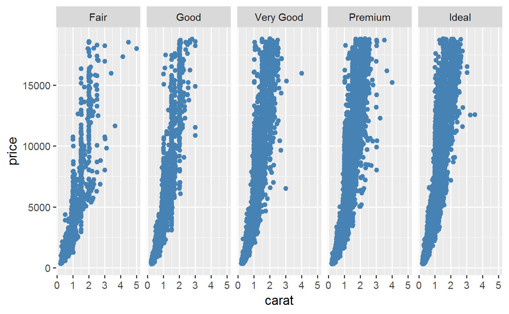
<p class="caption">(\#fig:scatter-facet-color-1)给分面散点图上色</p>
</div>

在图\@ref(fig:scatter-facet-color-1)的基础上，给不同的类上不同的颜色


```r
ggplot(diamonds, aes(x = carat, y = price, color = cut)) +
  geom_point() +
  facet_grid(~cut)
```

<div class="figure" style="text-align: center">
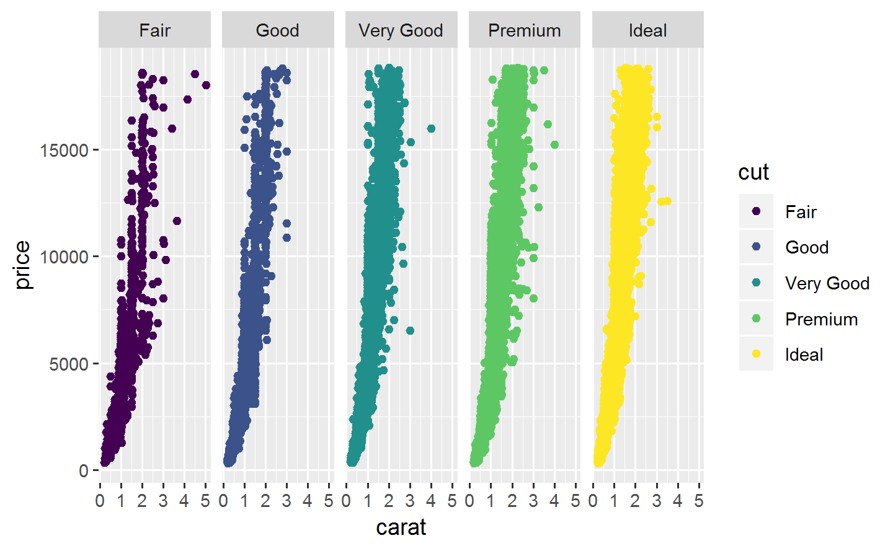
<p class="caption">(\#fig:scatter-facet-color-2)给不同的类上不同的颜色</p>
</div>

去掉图例，此时图例属于冗余信息了


```r
ggplot(diamonds, aes(x = carat, y = price, color = cut)) +
  geom_point(show.legend = FALSE) +
  facet_grid(~cut)
```

<div class="figure" style="text-align: center">
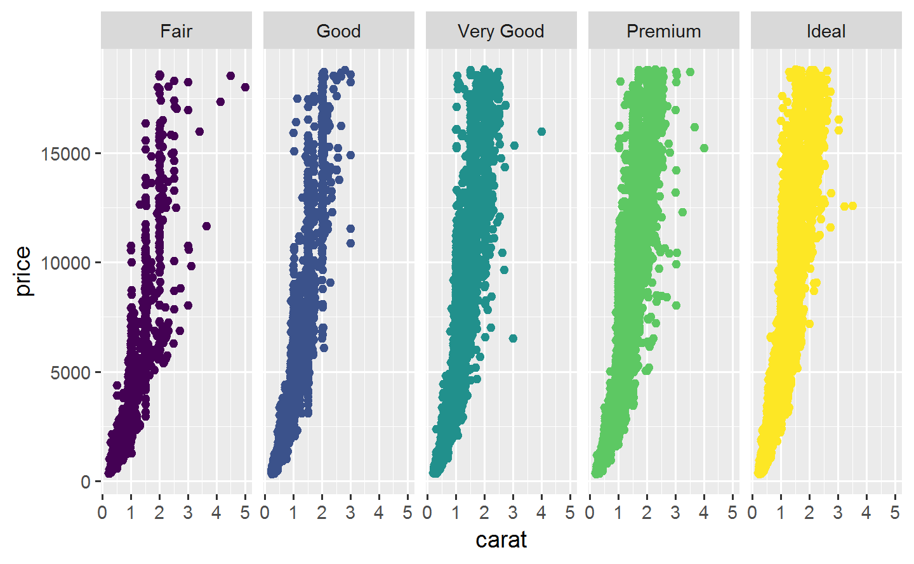
<p class="caption">(\#fig:scatter-facet-color-3)去掉图例</p>
</div>

四块土地，所施肥料不同，肥力大小顺序 4 < 2 < 3 < 1 小麦产量随肥力的变化


```r
library(nlme)
data(Wheat2) # Wheat Yield Trials
library(colorspace)
ggplot(Wheat2, aes(longitude, latitude)) +
  geom_point(aes(size = yield, colour = Block)) +
  scale_color_discrete_sequential(palette = "Viridis") +
  scale_x_continuous(breaks = seq(0, 30, 5)) +
  scale_y_continuous(breaks = seq(0, 50, 10))
```

<div class="figure" style="text-align: center">
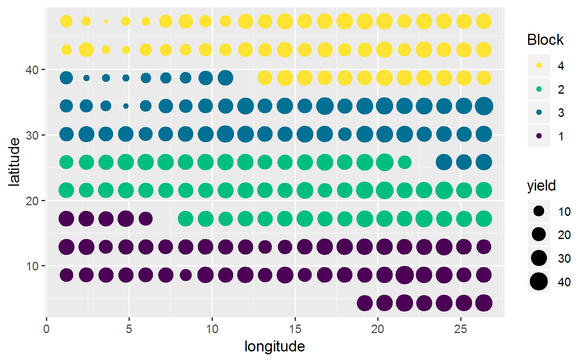
<p class="caption">(\#fig:unnamed-chunk-16)多个图例</p>
</div>
  

```r
ggplot(mtcars, aes(x = hp, y = mpg, color = factor(am))) +
  geom_point() +
  theme_bw()
```

<div class="figure" style="text-align: center">
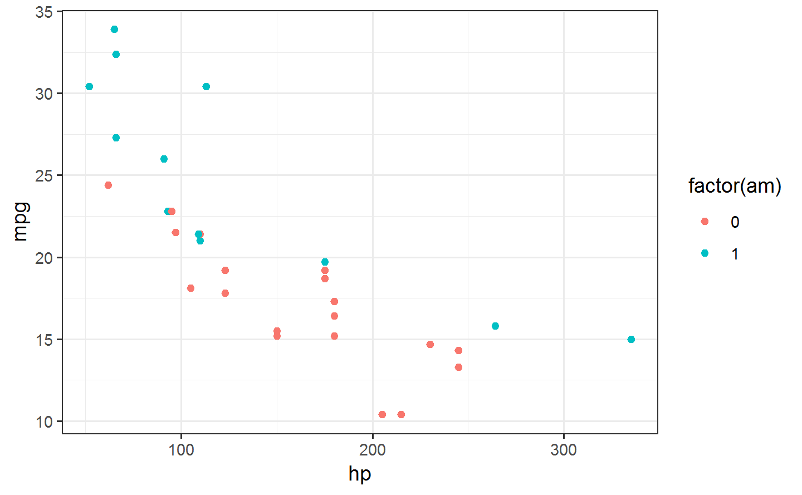
<p class="caption">(\#fig:category-ggplot)分类散点图</p>
</div>

图层、分组、分面和散点图介绍完了，接下来就是其它统计图形，如箱线图，小提琴图和条形图


```r
dat <- as.data.frame(cbind(rep(1948 + seq(12), each = 12), rep(seq(12), 12), AirPassengers))
colnames(dat) <- c("year", "month", "passengers")

ggplot(data = dat, aes(x = as.factor(year), y = as.factor(month))) +
  stat_sum(aes(size = passengers), colour = "lightblue") +
  scale_size(range = c(1, 10), breaks = seq(100, 650, 50)) +
  labs(x = "Year", y = "Month", colour = "Passengers") +
  theme_minimal()
```

<div class="figure" style="text-align: center">
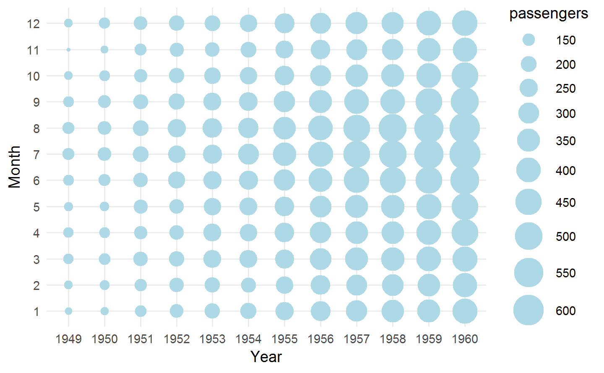
<p class="caption">(\#fig:unnamed-chunk-17)1948年至1960年航班乘客人数变化</p>
</div>

### 箱线图 {#ggplot2-boxplot}

以 PlantGrowth 数据集为例展示箱线图，在两组不同实验条件下，植物生长的情况，纵坐标是干燥植物的量，横坐标表示不同的实验条件。这是非常典型的适合用箱线图来表达数据的场合，Y 轴对应数值型变量，X 轴对应分类变量，在 R 语言中，分类变量的类型是 factor


```r
data("PlantGrowth")
str(PlantGrowth)
#> 'data.frame':	30 obs. of  2 variables:
#>  $ weight: num  4.17 5.58 5.18 6.11 4.5 4.61 5.17 4.53 5.33 5.14 ...
#>  $ group : Factor w/ 3 levels "ctrl","trt1",..: 1 1 1 1 1 1 1 1 1 1 ...
```


```r
ggplot(data = PlantGrowth, aes(x = group, y = weight)) + geom_boxplot()
```

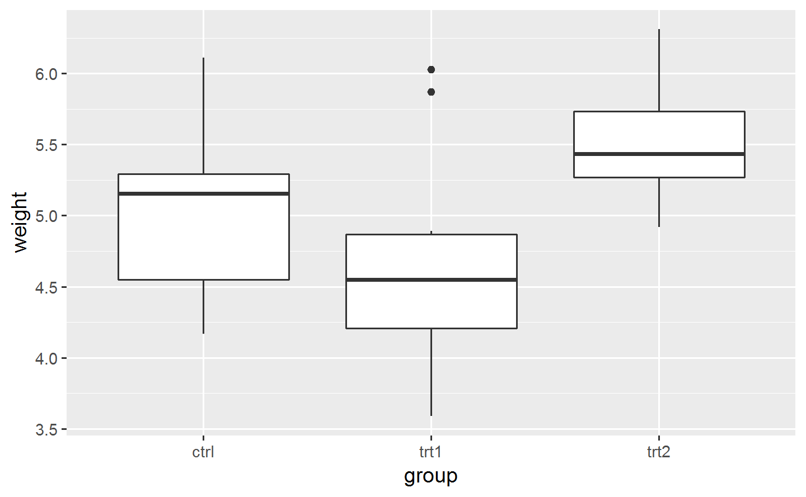

PlantGrowth 数据量比较小，此时比较适合采用抖动散点图，抖动是为了避免点之间相互重叠，为了增加不同类别之间的识别性，我们可以用不同的点的形状或者不同的颜色来表示类别


```r
ggplot(data = PlantGrowth, aes(x = group, y = weight, shape = group)) + geom_jitter()
ggplot(data = PlantGrowth, aes(x = group, y = weight, color = group)) + geom_jitter()
```

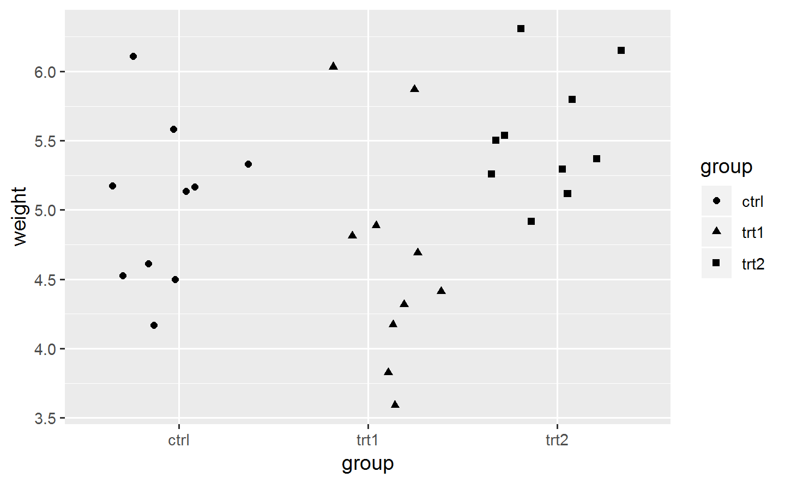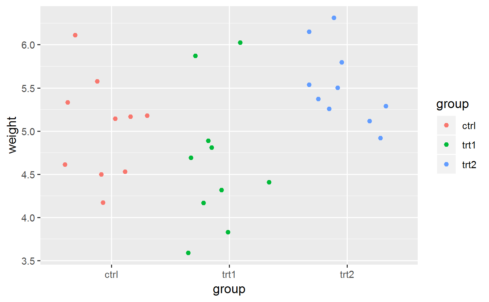

::: base

```r
boxplot(weight ~ group,
  data = PlantGrowth,
  ylab = "Dried weight of plants", col = "lightgray",
  notch = FALSE, varwidth = TRUE
)
```

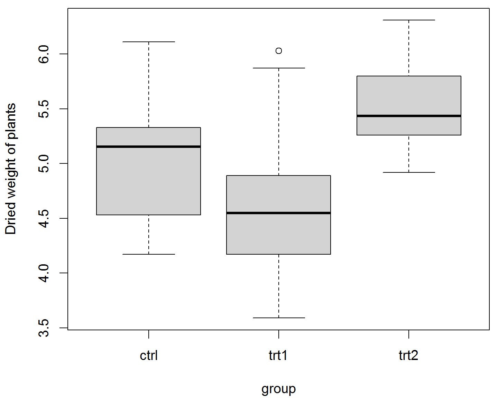
:::

以钻石切割质量 cut 为分面依据，以钻石颜色类别 color 为 x 轴，钻石价格为 y 轴，绘制箱线图\@ref(fig:boxplot-facet-color)


```r
ggplot(diamonds, aes(x = color, y = price, color = cut)) +
  geom_boxplot(show.legend = FALSE) +
  facet_grid(~cut)
```

<div class="figure" style="text-align: center">
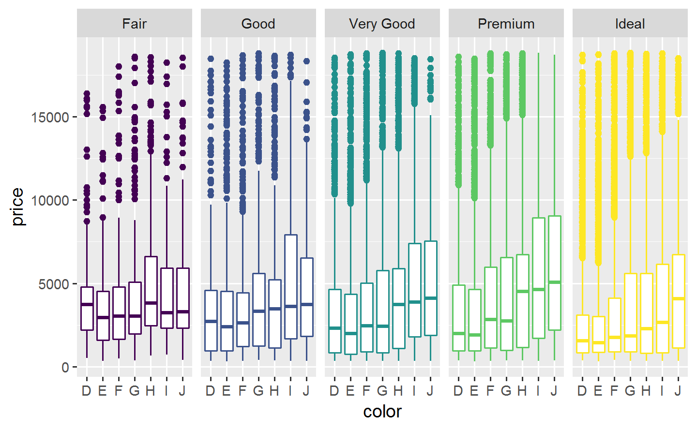
<p class="caption">(\#fig:boxplot-facet-color)箱线图</p>
</div>

我们当然还可以添加钻石的纯净度 clarity 作为分面依据，那么箱线图可以为图 \@ref(fig:boxplot-facet-color-clarity-1)，但是经过观察，我们发现水平分类过多，考虑用切割质量 cut 替换钻石颜色 color 绘图，但是由于分类过细，图信息展示不简练，反而不好，如图 \@ref(fig:boxplot-facet-color-clarity-2)


```r
ggplot(diamonds, aes(x = color, y = price, color = cut)) +
  geom_boxplot(show.legend = FALSE) +
  facet_grid(clarity ~ cut)
```

<div class="figure" style="text-align: center">
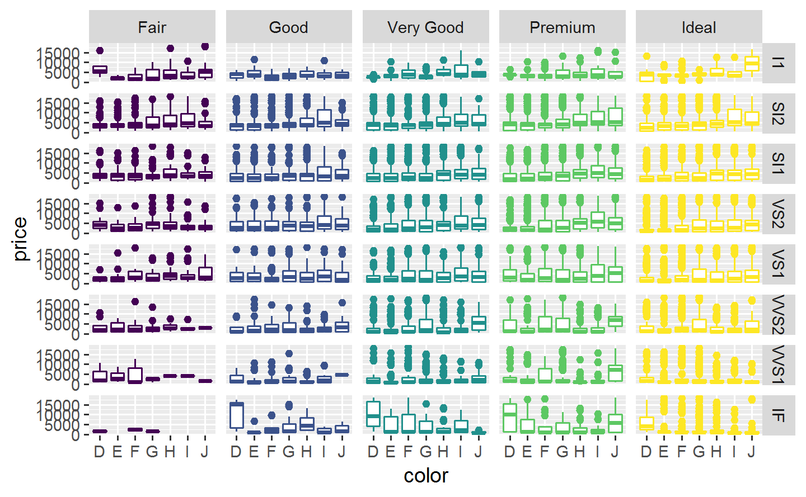
<p class="caption">(\#fig:boxplot-facet-color-clarity-1)复合分面箱线图</p>
</div>


```r
ggplot(diamonds, aes(x = cut, y = price, color = cut)) +
  geom_boxplot(show.legend = FALSE) +
  facet_grid(clarity ~ color)
ggplot(diamonds, aes(x = cut, y = price, color = color)) +
  geom_boxplot(show.legend = FALSE) +
  facet_grid(clarity ~ color)
```

<div class="figure" style="text-align: center">
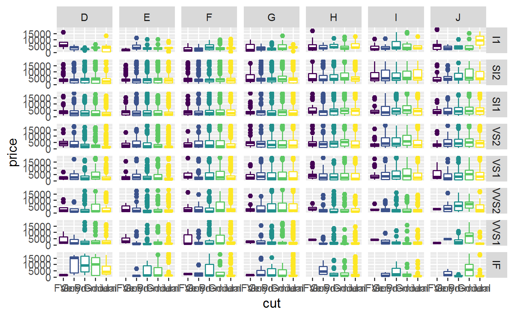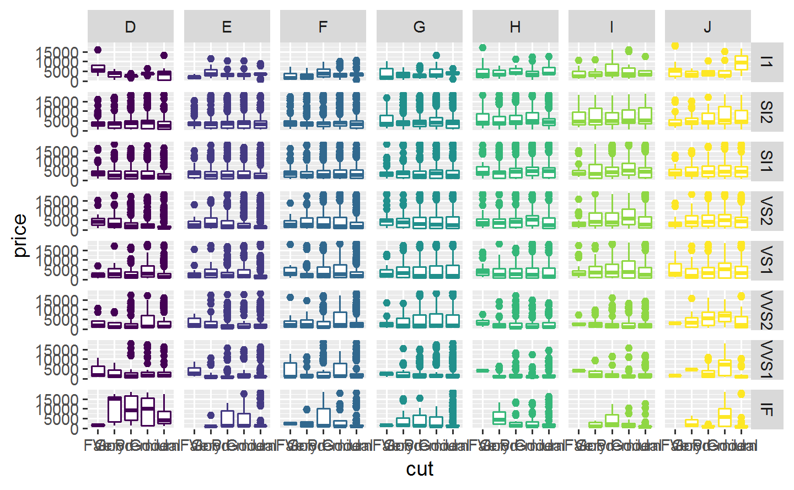
<p class="caption">(\#fig:boxplot-facet-color-clarity-2)钻石颜色配色</p>
</div>

### 条形图 {#ggplot2-barplot}

条形图特别适合分类变量的展示，我们这里展示钻石切割质量 cut 不同等级的数量，当然我们可以直接展示各类的数目，在图层 `geom_bar` 中指定 `stat="identity"`


```r
# 需要映射数据框的两个变量，相当于自己先计算了每类的数量
with(diamonds, table(cut))
cut_df <- as.data.frame(table(diamonds$cut))
ggplot(cut_df, aes(x = Var1, y = Freq)) + geom_bar(stat = "identity")
```

```r
ggplot(diamonds, aes(x = cut)) + geom_bar()
```

<div class="figure" style="text-align: center">
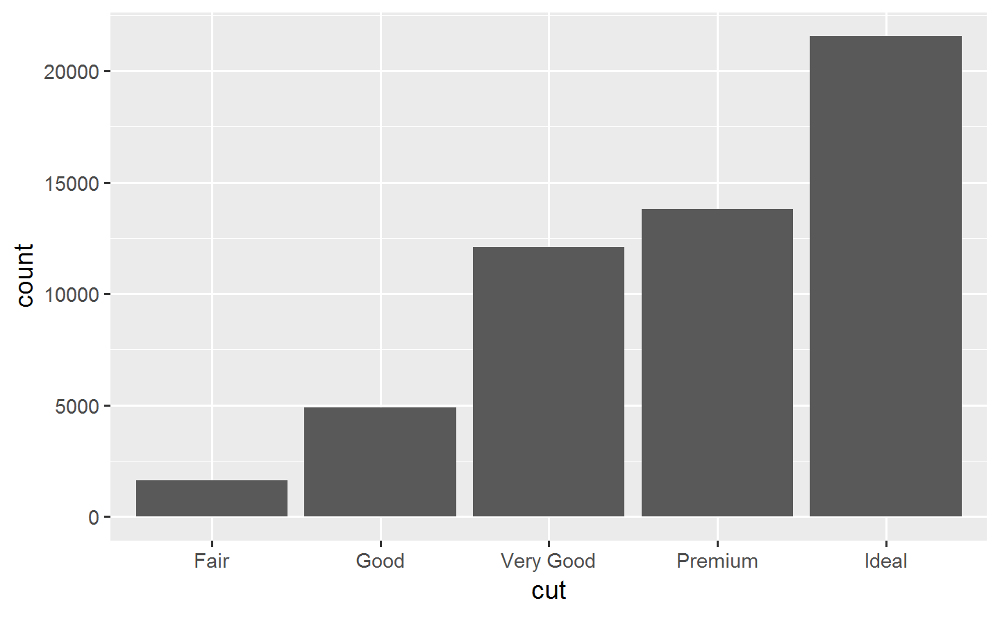
<p class="caption">(\#fig:diamonds-barplot-1)频数条形图</p>
</div>

还有另外三种表示方法


```r
ggplot(diamonds, aes(x = cut)) + geom_bar(stat = "count")
ggplot(diamonds, aes(x = cut, y = ..count..)) + geom_bar()
ggplot(diamonds, aes(x = cut, y = stat(count))) + geom_bar()
```

我们还可以在图 \@ref(fig:diamonds-barplot-1) 的基础上再添加一个分类变量钻石的纯净度 clarity，形成堆积条形图


```r
ggplot(diamonds, aes(x = cut, fill = clarity)) + geom_bar()
```

<div class="figure" style="text-align: center">
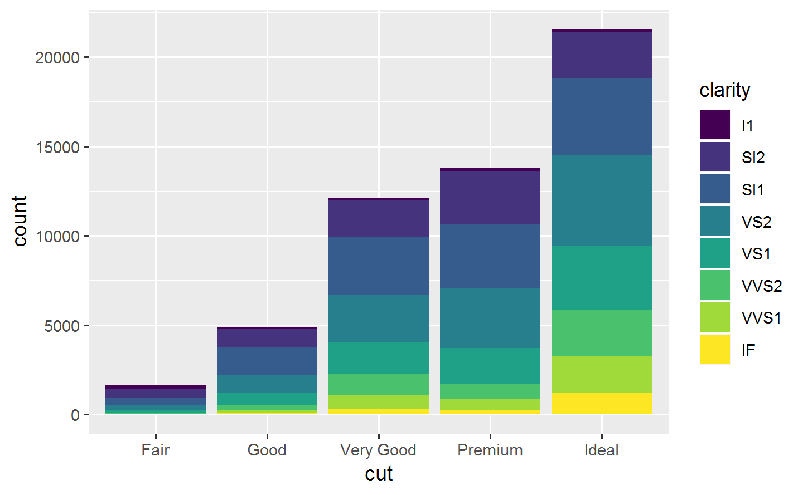
<p class="caption">(\#fig:diamonds-barplot-2)堆积条形图</p>
</div>

再添加一个分类变量钻石颜色 color 比较好的做法是分面


```r
ggplot(diamonds, aes(x = color, fill = clarity)) +
  geom_bar() +
  facet_grid(~cut)
```

<div class="figure" style="text-align: center">

<p class="caption">(\#fig:diamonds-barplot-3)分面堆积条形图</p>
</div>

实际上，绘制图\@ref(fig:diamonds-barplot-3)包含了对分类变量的分组计数过程，如下


```r
with(diamonds, table(cut, color))
#>            color
#> cut            D    E    F    G    H    I    J
#>   Fair       163  224  312  314  303  175  119
#>   Good       662  933  909  871  702  522  307
#>   Very Good 1513 2400 2164 2299 1824 1204  678
#>   Premium   1603 2337 2331 2924 2360 1428  808
#>   Ideal     2834 3903 3826 4884 3115 2093  896
```

还有一种堆积的方法是按比例，而不是按数量，如图\@ref(fig:diamonds-barplot-4)


```r
ggplot(diamonds, aes(x = color, fill = clarity)) +
  geom_bar(position = "fill") +
  facet_grid(~cut)
```

<div class="figure" style="text-align: center">
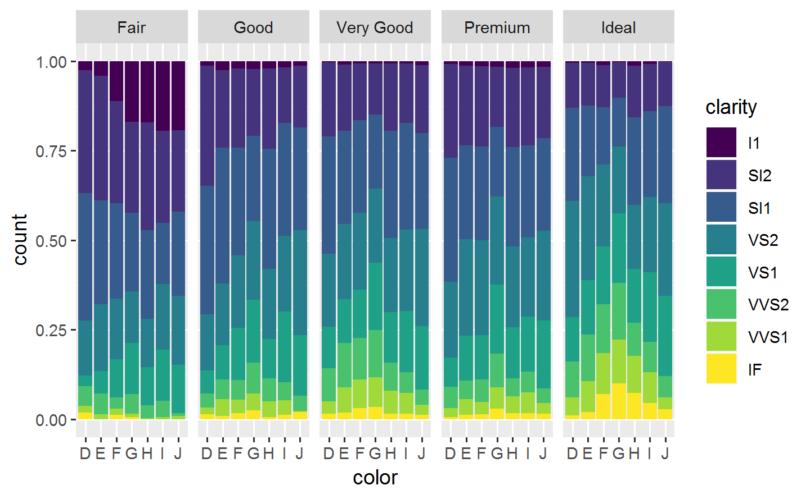
<p class="caption">(\#fig:diamonds-barplot-4)比例堆积条形图</p>
</div>

接下来就是复合条形图


```r
ggplot(diamonds, aes(x = color, fill = clarity)) +
  geom_bar(position = "dodge")
```

<div class="figure" style="text-align: center">
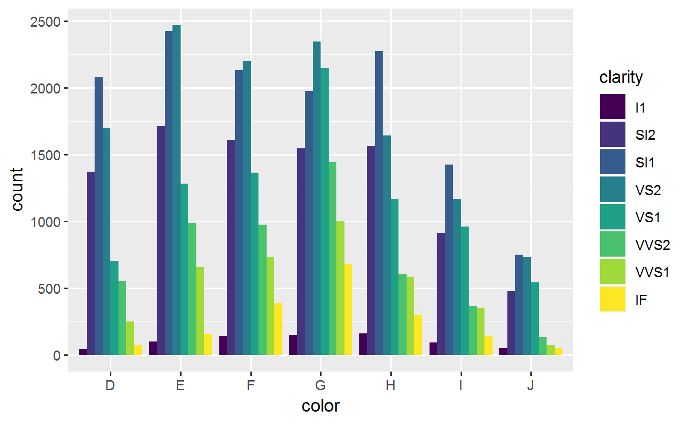
<p class="caption">(\#fig:diamonds-barplot-5)复合条形图</p>
</div>

再添加一个分类变量，就是需要分面大法了，图 \@ref(fig:diamonds-barplot-5) 展示了三个分类变量，其实我们还可以再添加一个分类变量用作分面的列依据


```r
ggplot(diamonds, aes(x = color, fill = clarity)) +
  geom_bar(position = "dodge") +
  facet_grid(rows = vars(cut))
```

<div class="figure" style="text-align: center">
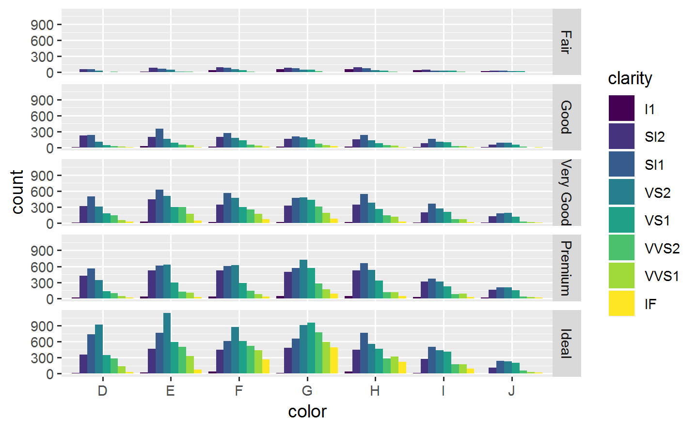
<p class="caption">(\#fig:diamonds-barplot-6)分面复合条形图</p>
</div>

图 \@ref(fig:diamonds-barplot-6) 展示的数据如下


```r
with(diamonds, table(color, clarity, cut))
#> , , cut = Fair
#> 
#>      clarity
#> color   I1  SI2  SI1  VS2  VS1 VVS2 VVS1   IF
#>     D    4   56   58   25    5    9    3    3
#>     E    9   78   65   42   14   13    3    0
#>     F   35   89   83   53   33   10    5    4
#>     G   53   80   69   45   45   17    3    2
#>     H   52   91   75   41   32   11    1    0
#>     I   34   45   30   32   25    8    1    0
#>     J   23   27   28   23   16    1    1    0
#> 
#> , , cut = Good
#> 
#>      clarity
#> color   I1  SI2  SI1  VS2  VS1 VVS2 VVS1   IF
#>     D    8  223  237  104   43   25   13    9
#>     E   23  202  355  160   89   52   43    9
#>     F   19  201  273  184  132   50   35   15
#>     G   19  163  207  192  152   75   41   22
#>     H   14  158  235  138   77   45   31    4
#>     I    9   81  165  110  103   26   22    6
#>     J    4   53   88   90   52   13    1    6
#> 
#> , , cut = Very Good
#> 
#>      clarity
#> color   I1  SI2  SI1  VS2  VS1 VVS2 VVS1   IF
#>     D    5  314  494  309  175  141   52   23
#>     E   22  445  626  503  293  298  170   43
#>     F   13  343  559  466  293  249  174   67
#>     G   16  327  474  479  432  302  190   79
#>     H   12  343  547  376  257  145  115   29
#>     I    8  200  358  274  205   71   69   19
#>     J    8  128  182  184  120   29   19    8
#> 
#> , , cut = Premium
#> 
#>      clarity
#> color   I1  SI2  SI1  VS2  VS1 VVS2 VVS1   IF
#>     D   12  421  556  339  131   94   40   10
#>     E   30  519  614  629  292  121  105   27
#>     F   34  523  608  619  290  146   80   31
#>     G   46  492  566  721  566  275  171   87
#>     H   46  521  655  532  336  118  112   40
#>     I   24  312  367  315  221   82   84   23
#>     J   13  161  209  202  153   34   24   12
#> 
#> , , cut = Ideal
#> 
#>      clarity
#> color   I1  SI2  SI1  VS2  VS1 VVS2 VVS1   IF
#>     D   13  356  738  920  351  284  144   28
#>     E   18  469  766 1136  593  507  335   79
#>     F   42  453  608  879  616  520  440  268
#>     G   16  486  660  910  953  774  594  491
#>     H   38  450  763  556  467  289  326  226
#>     I   17  274  504  438  408  178  179   95
#>     J    2  110  243  232  201   54   29   25
```


### 折线图 {#ggplot2-line}

时间序列数据的展示，时序图


```r
ggplot(economics, aes(date, unemploy)) + geom_line()
```

<div class="figure" style="text-align: center">
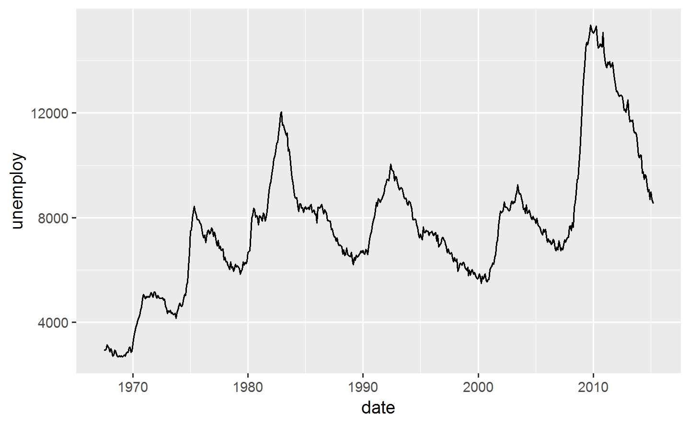
<p class="caption">(\#fig:unnamed-chunk-24)时序图</p>
</div>


### 直方图 {#ggplot2-histogram}

直方图用来查看连续变量的分布


```r
ggplot(diamonds, aes(price)) + geom_histogram(bins = 30)
```

<div class="figure" style="text-align: center">
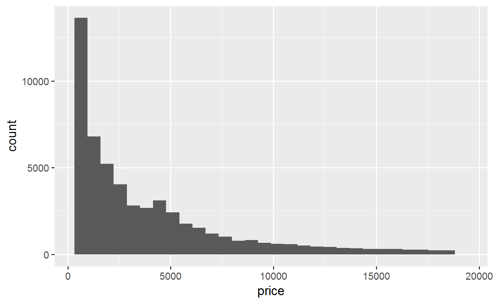
<p class="caption">(\#fig:unnamed-chunk-25)钻石价格的分布</p>
</div>

堆积直方图


```r
ggplot(diamonds, aes(x = price, fill = cut)) + geom_histogram(bins = 30)
```

<div class="figure" style="text-align: center">
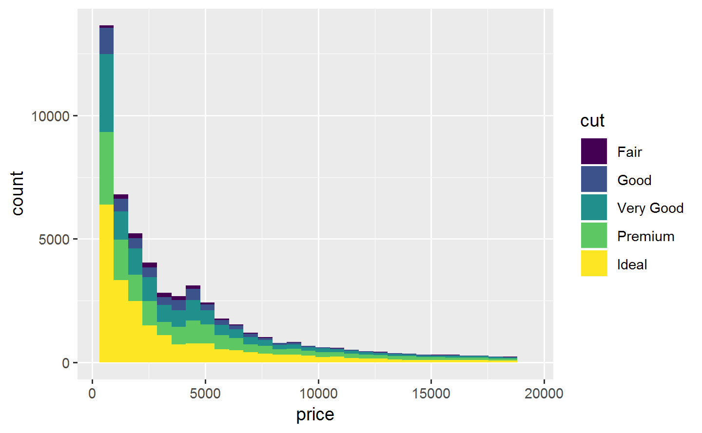
<p class="caption">(\#fig:unnamed-chunk-26)钻石价格随切割质量的分布</p>
</div>

基础 R 包与 Ggplot2 包绘制的直方图的对比，Base R 绘图速度快，代码更加稳定，Ggplot2 代码简洁，更美观


```r
par(mar = c(2.1, 2.1, 1.5, 0.5))
plot(c(50, 350), c(0, 10),
  type = "n", font.main = 1,
  xlab = "", ylab = "", frame.plot = FALSE, axes = FALSE,
  # xlab = "hp", ylab = "Frequency",
  main = paste("Histogram with Base R", paste(rep(" ", 60), collapse = ""))
)
axis(
  side = 1, at = seq(50, 350, 50), labels = seq(50, 350, 50),
  tick = FALSE, las = 1, padj = 0, mgp = c(3, 0.1, 0)
)
axis(
  side = 2, at = seq(0, 10, 2), labels = seq(0, 10, 2),
  # col = "white", 坐标轴的颜色
  # col.ticks 刻度线的颜色
  tick = FALSE, # 取消刻度线
  las = 1, # 水平方向
  hadj = 1, # 右侧对齐
  mgp = c(3, 0.1, 0) # 纵轴边距线设置为 0.1
)
abline(h = seq(0, 10, 2), v = seq(50, 350, 50), col = "gray90", lty = "solid")
abline(h = seq(1, 9, 2), v = seq(75, 325, 50), col = "gray95", lty = "solid")
hist(mtcars$hp,
  col = "#56B4E9", border = "white",
  freq = TRUE, add = TRUE
  # labels = TRUE, axes = TRUE, ylim = c(0, 10.5),
  # xlab = "hp",main = "Histogram with Base R"
)
mtext("hp", 1, line = 1.0)
mtext("Frequency", 2, line = 1.0)

ggplot(mtcars) +
  geom_histogram(aes(x = hp), fill = "#56B4E9", color = "white", breaks = seq(50, 350, 50)) +
  scale_x_continuous(breaks = seq(50, 350, 50)) +
  scale_y_continuous(breaks = seq(0, 12, 2)) +
  labs(x = "hp", y = "Frequency", title = "Histogram with Ggplot2") +
  theme_minimal(base_size = 12)
```

<div class="figure" style="text-align: center">
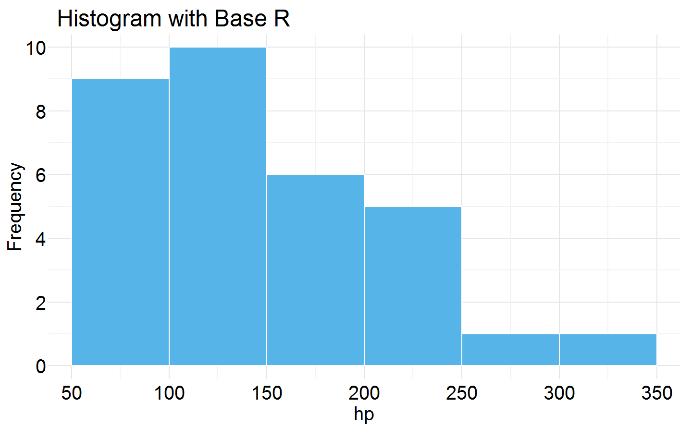
<p class="caption">(\#fig:unnamed-chunk-27)直方图</p>
</div>


### 提琴图 {#ggplot2-violin}

提琴图


```r
ggplot(diamonds, aes(x = cut, y = price)) + geom_boxplot()
ggplot(diamonds, aes(x = cut, y = price)) + geom_violin()
```

<div class="figure" style="text-align: center">
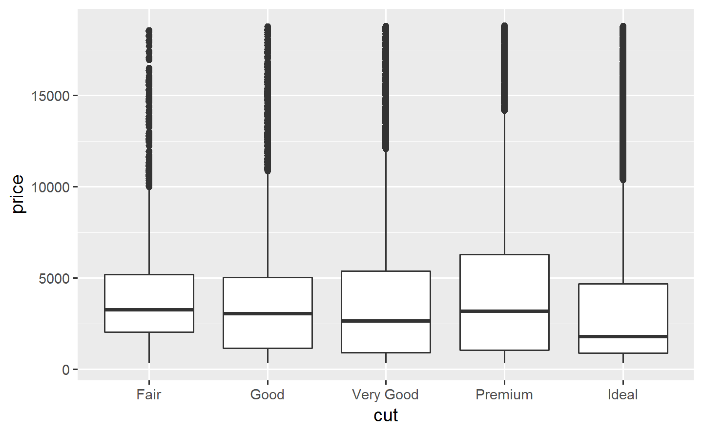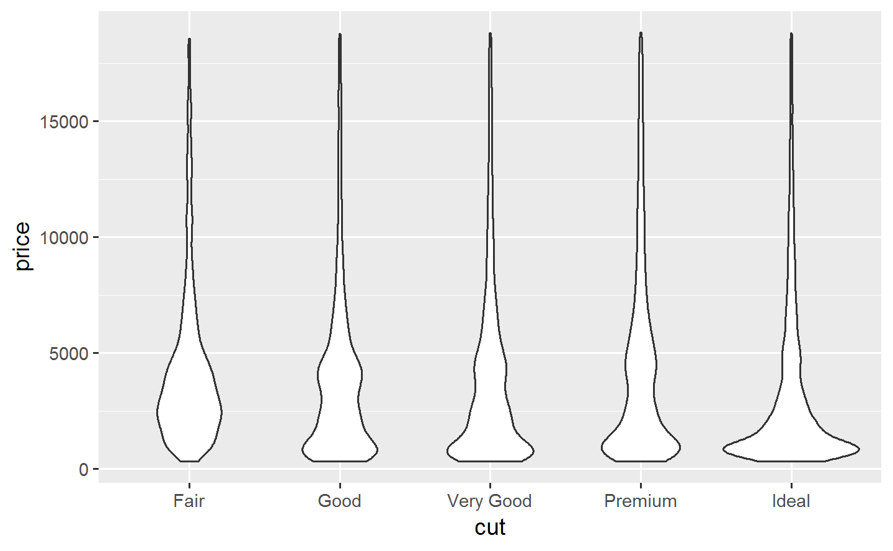
<p class="caption">(\#fig:violin)小提琴图</p>
</div>


```r
ggplot(mpg, aes(class, cty)) +
  geom_violin() +
  labs(
    title = "Violin plot",
    subtitle = "City Mileage vs Class of vehicle",
    caption = "Source: mpg",
    x = "Class of Vehicle",
    y = "City Mileage"
  ) +
  theme_minimal()
```

<div class="figure" style="text-align: center">
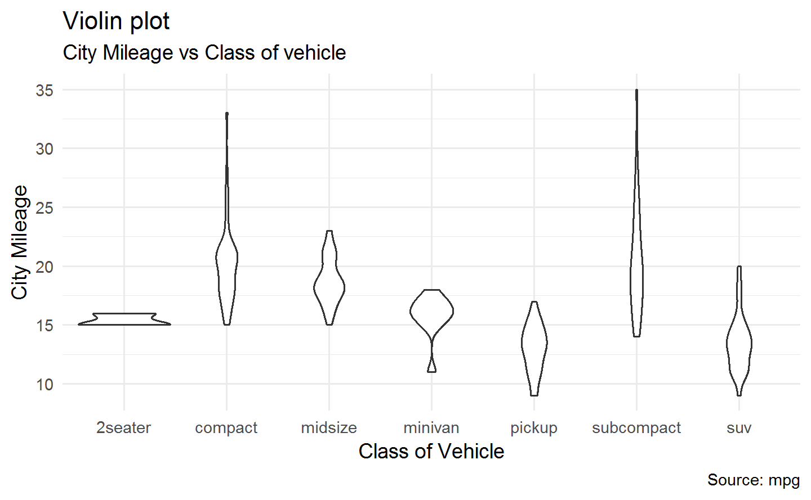
<p class="caption">(\#fig:violin-mpg)城市里程与车辆类别</p>
</div>

蜂群图 [ggbeeswarm](https://github.com/eclarke/ggbeeswarm) 是分类散点图加箱线图的合体


```r
ggplot(mpg, aes(x = class, y = hwy, color = class)) + ggbeeswarm::geom_quasirandom()
```

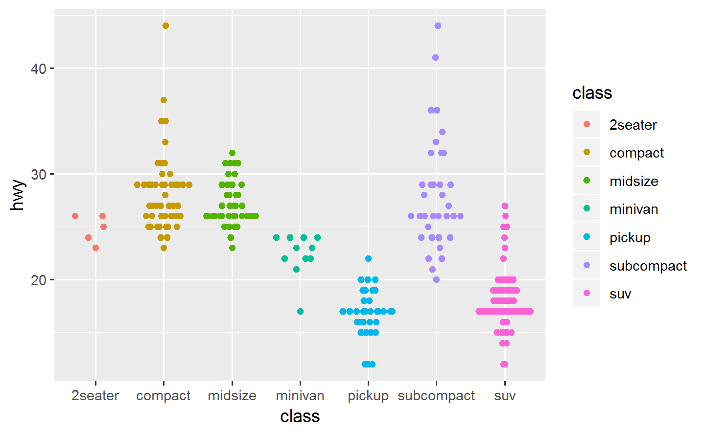


### 抖动图 {#ggplot2-jitter}


抖动图适合数据量比较小的情况


```r
ggplot(mpg, aes(x = class, y = hwy, color = class)) + geom_jitter()
```

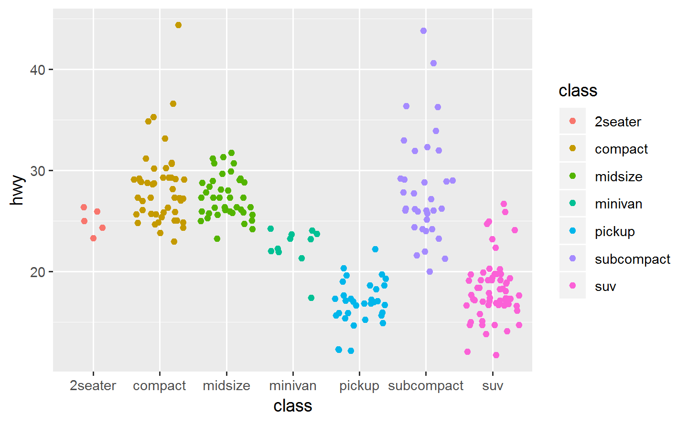

在数据量比较大的时候，可以用箱线图、密度图、提琴图


```r
ggplot(diamonds, aes(x = cut, y = price)) + geom_jitter()
```

<div class="figure" style="text-align: center">
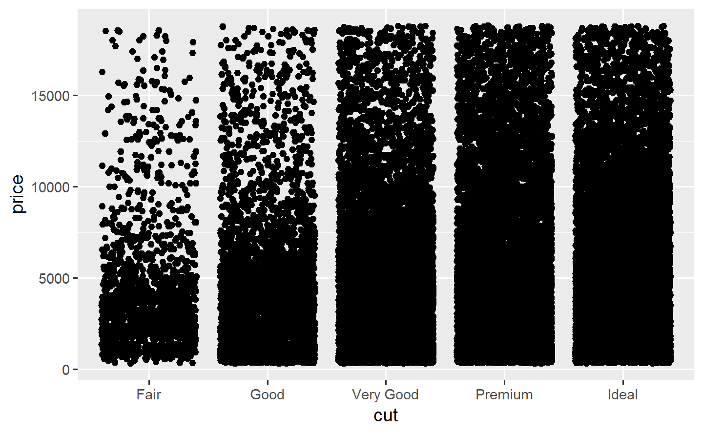
<p class="caption">(\#fig:unnamed-chunk-30)抖动图的反例</p>
</div>

上色和分面都不好使的抖动图，因为区分度变小


```r
ggplot(diamonds, aes(x = color, y = price, color = color)) +
  geom_jitter() +
  facet_grid(clarity ~ cut)
```

<div class="figure" style="text-align: center">
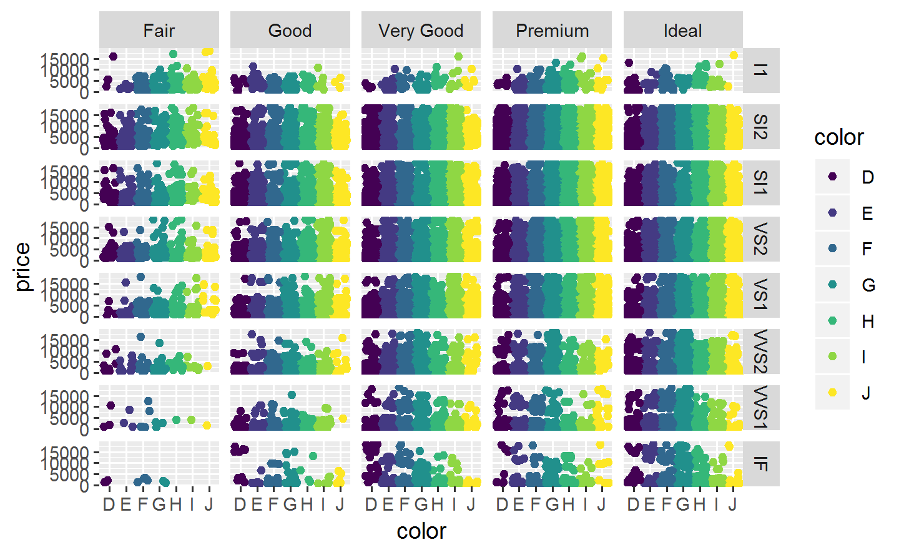
<p class="caption">(\#fig:unnamed-chunk-31)根据钻石颜色上色</p>
</div>

箱线图此时不宜分的过细


```r
ggplot(diamonds, aes(x = color, y = price, color = color)) +
  geom_boxplot() +
  facet_grid(cut ~ clarity)
```

<div class="figure" style="text-align: center">
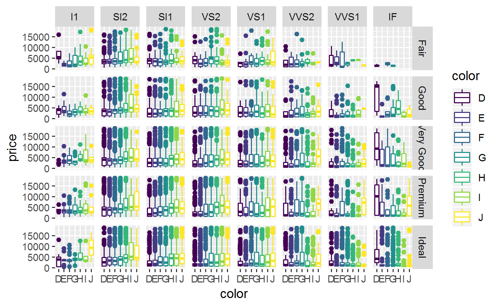
<p class="caption">(\#fig:unnamed-chunk-32)箱线图</p>
</div>


```r
ggplot(diamonds, aes(x = color, y = price, color = color)) +
  geom_boxplot() +
  facet_grid(~clarity)
```

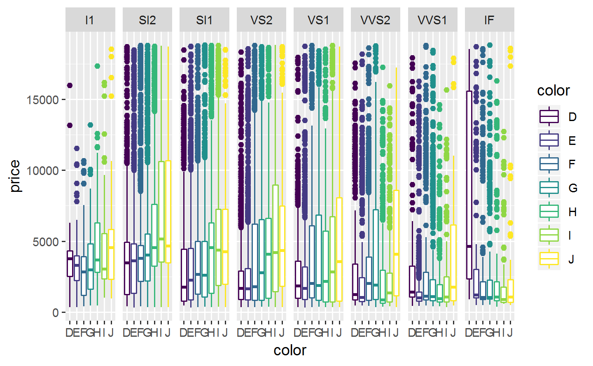

最好只比较一个维度


```r
ggplot(diamonds, aes(x = color, y = price, color = color)) +
  geom_boxplot()
```

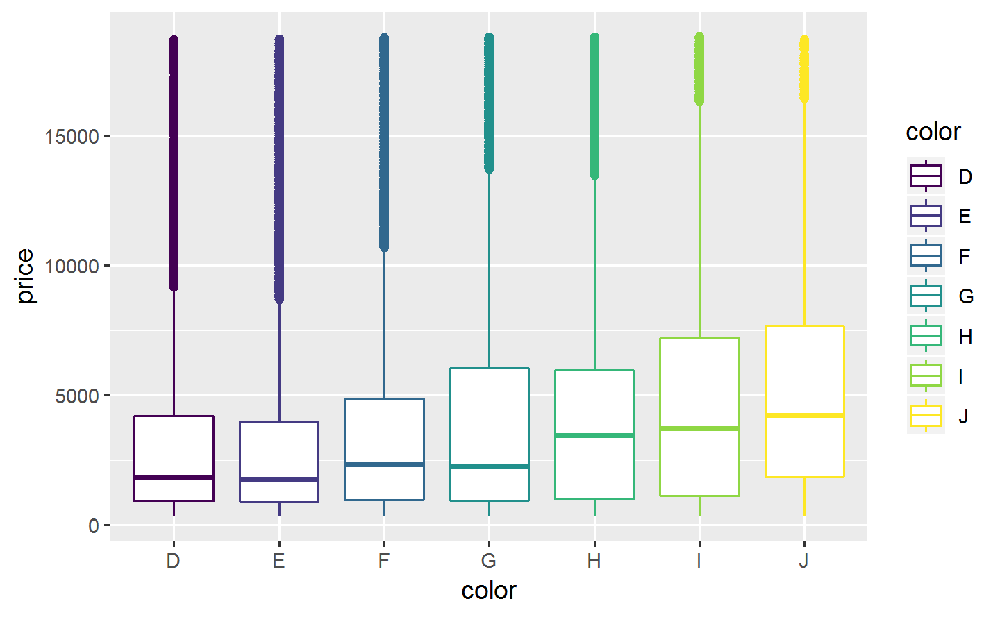


```r
ggplot(diamonds) +
  ggridges::geom_density_ridges(aes(y = color, x = price, fill = color))
#> Picking joint bandwidth of 535
```

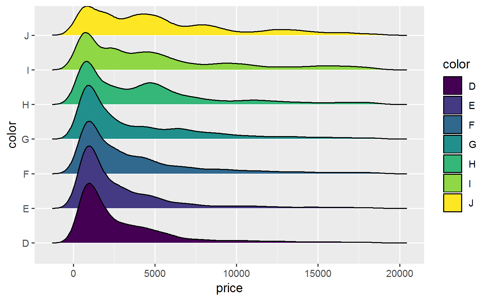

### 密度图 {#ggplot2-ridge}


```r
ggplot(mpg, aes(cty)) +
  geom_density(aes(fill = factor(cyl)), alpha = 0.8) +
  labs(
    title = "Density plot",
    subtitle = "City Mileage Grouped by Number of cylinders",
    caption = "Source: mpg",
    x = "City Mileage",
    fill = "# Cylinders"
  )
```

<div class="figure" style="text-align: center">

<p class="caption">(\#fig:unnamed-chunk-36)按汽缸数分组的城市里程</p>
</div>

添加透明度，解决遮挡


```r
ggplot(diamonds, aes(x = price, fill = cut)) + geom_density()
ggplot(diamonds, aes(x = price, fill = cut)) + geom_density(alpha = 0.5)
```

<div class="figure" style="text-align: center">
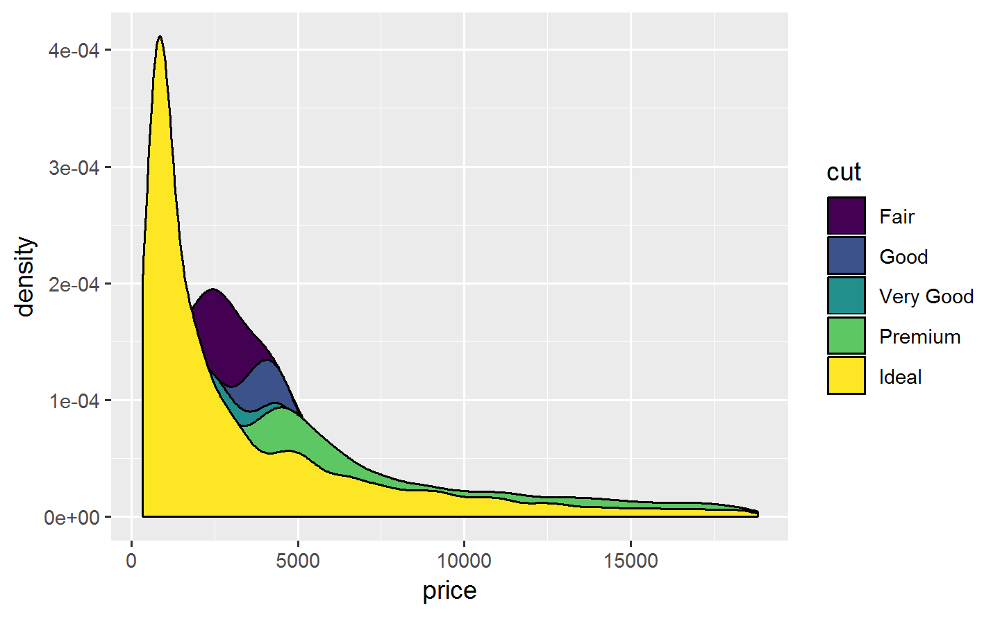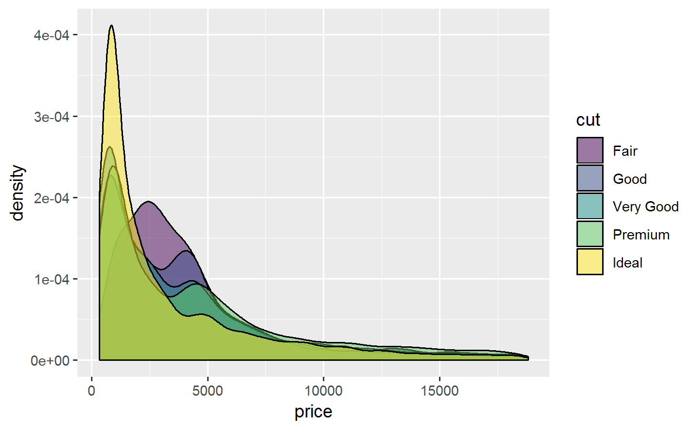
<p class="caption">(\#fig:density)添加透明度的密度图</p>
</div>

堆积密度图


```r
ggplot(diamonds, aes(x = price, fill = cut)) + geom_density(position = "stack")
```

<div class="figure" style="text-align: center">
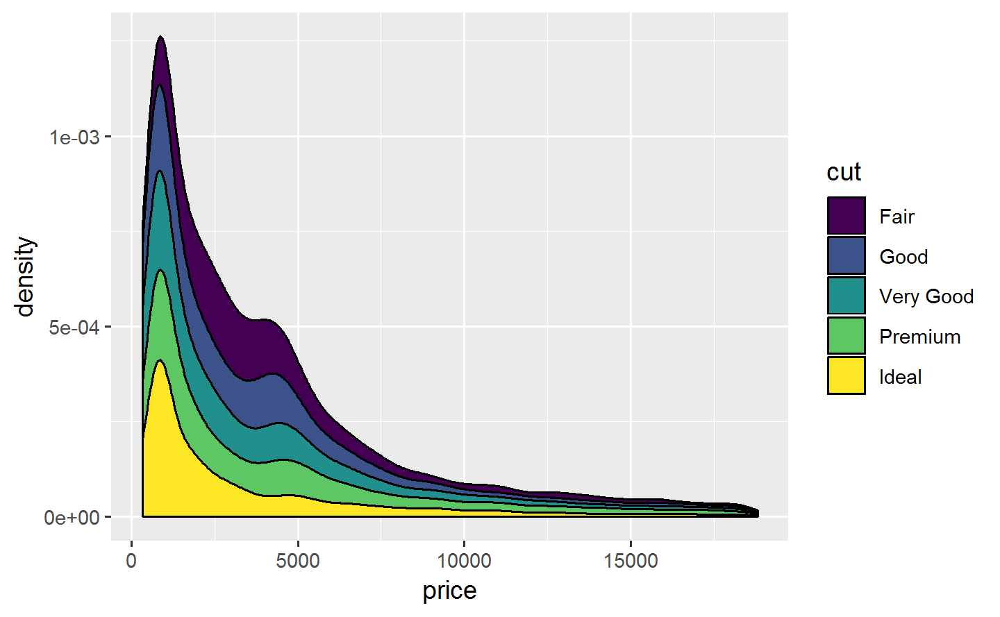
<p class="caption">(\#fig:stack-density)堆积密度图</p>
</div>

条件密度估计


```r
# You can use position="fill" to produce a conditional density estimate
ggplot(diamonds, aes(carat, stat(count), fill = cut)) +
  geom_density(position = "fill")
```

<div class="figure" style="text-align: center">
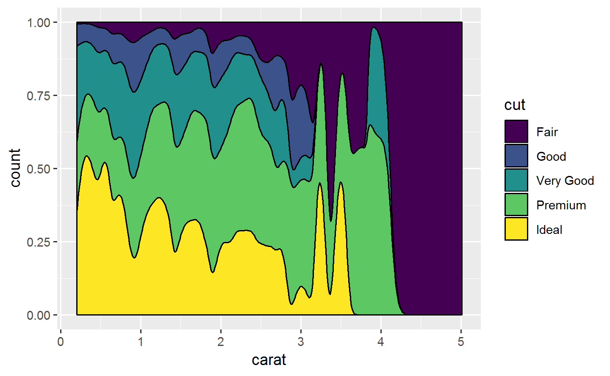
<p class="caption">(\#fig:unnamed-chunk-37)条件密度估计图</p>
</div>


岭线图是密度图的一种变体，可以防止密度曲线重叠在一起


```r
ggplot(diamonds) +
  ggridges::geom_density_ridges(aes(x = price, y = color, fill = color))
#> Picking joint bandwidth of 535
```


二维的密度图又是一种延伸


```r
ggplot(diamonds, aes(x = carat, y = price)) +
  geom_density_2d(aes(color = cut)) +
  facet_grid(~cut) +
  scale_fill_viridis_d()
```

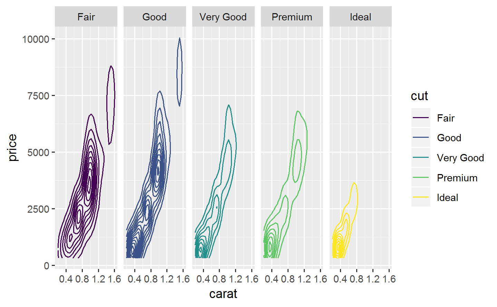

`stat` 函数，特别是 nlevel 参数，在密度曲线之间填充我们又可以得到热力图


```r
ggplot(diamonds, aes(x = carat, y = price)) +
  stat_density_2d(aes(fill = stat(nlevel)), geom = "polygon") +
  facet_grid(. ~ cut) + scale_fill_viridis_c()
#> Warning in validDetails.polygon(x): NAs introduced by coercion

#> Warning in validDetails.polygon(x): NAs introduced by coercion

#> Warning in validDetails.polygon(x): NAs introduced by coercion

#> Warning in validDetails.polygon(x): NAs introduced by coercion

#> Warning in validDetails.polygon(x): NAs introduced by coercion
```


`gemo_hex` 也是二维密度图的一种变体，特别适合数据量比较大的情形


```r
ggplot(diamonds, aes(x = carat, y = price)) + geom_hex() +
  scale_fill_viridis_c()
```

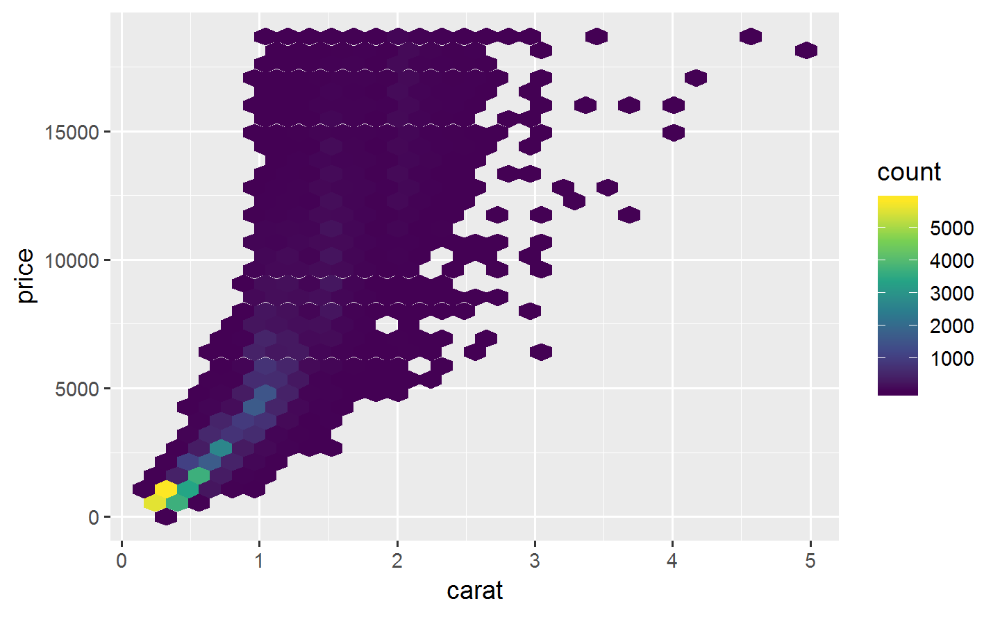

### 玫瑰图 {#ggplot2-rose}

南丁格尔风玫瑰图[^nightingale-rose] 可以作为堆积条形图，分组条形图


```r
ggplot(diamonds, aes(x = color, fill = clarity)) +
  geom_bar()
ggplot(diamonds, aes(x = color, fill = clarity)) +
  geom_bar() +
  coord_polar()
```

<div class="figure" style="text-align: center">
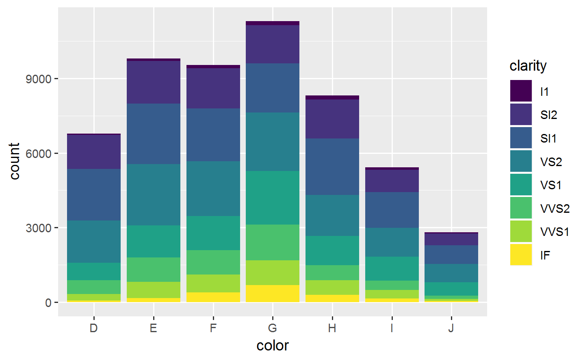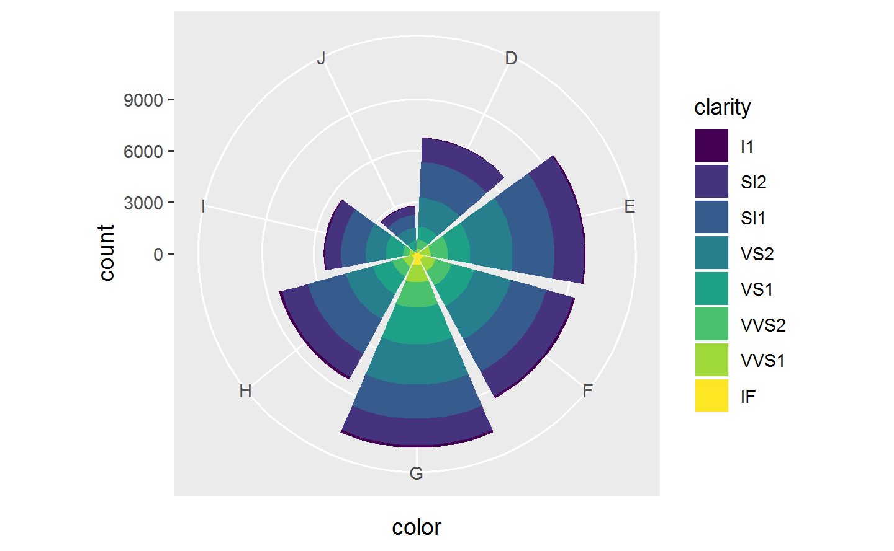
<p class="caption">(\#fig:stack-to-rose)堆积条形图转风玫瑰图</p>
</div>


```r
# 风玫瑰图 http://blog.csdn.net/Bone_ACE/article/details/47624987
library(ggplot2)
set.seed(2018)
# 随机生成100次风向，并汇集到16个区间内
direction <- cut_interval(runif(100, 0, 360), n = 16)
# 随机生成100次风速，并划分成4种强度
mag <- cut_interval(rgamma(100, 15), 4)
dat <- data.frame(direction = direction, mag = mag)
# 将风向映射到X轴，频数映射到Y轴，风速大小映射到填充色，生成条形图后再转为极坐标形式即可
p <- ggplot(dat, aes(x = direction, y = ..count.., fill = mag))
p + geom_bar(colour = "white") +
  coord_polar() +
  theme_minimal() +
  theme(axis.ticks = element_blank(), axis.text.y = element_blank()) +
  labs(x = "", y = "", fill = "Magnitude")

# p + geom_bar(position = "stack") +
#   coord_polar() +
#   theme_minimal() +
#   theme(axis.ticks = element_line(colour = "white"))
```

<div class="figure" style="text-align: center">

<p class="caption">(\#fig:wind-rose)风玫瑰图</p>
</div>

[^nightingale-rose]: https://mbostock.github.io/protovis/ex/crimea-rose-full.html


词云 [ggwordcloud](https://github.com/lepennec/ggwordcloud)


## 空间数据 {#ggplot2-spatial}

课程案例学习

1. [2018-Introduction to Geospatial Raster and Vector Data with R](https://datacarpentry.org/r-raster-vector-geospatial/) 空间数据分析课程
1. [Peter Ellis](http://freerangestats.info) 新西兰大选和普查数据 [More cartograms of New Zealand census data: district and city level](http://freerangestats.info/blog/nz.html)
1. [2017-Mapping oil production by country in R](http://sharpsightlabs.com/blog/map-oil-production-country-r/) 石油产量在全球的分布
1. [2017-How to highlight countries on a map](https://www.sharpsightlabs.com/blog/highlight-countries-on-map/) 高亮地图上的国家
1. [2017-Mapping With Sf: Part 3](https://ryanpeek.github.io/2017-11-21-mapping-with-sf-part-3/) 

美国各州的犯罪率数据 USArrests

准备数据集


```r
crimes <- data.frame(state = tolower(rownames(USArrests)), USArrests)
crimesm <- reshape2::melt(crimes, id = 1)
head(crimesm)
#>        state variable value
#> 1    alabama   Murder  13.2
#> 2     alaska   Murder  10.0
#> 3    arizona   Murder   8.1
#> 4   arkansas   Murder   8.8
#> 5 california   Murder   9.0
#> 6   colorado   Murder   7.9
```

添加地图数据


```r
library(maps)
states_map <- map_data("state")
head(states_map)
#>    long  lat group order  region subregion
#> 1 -87.5 30.4     1     1 alabama      <NA>
#> 2 -87.5 30.4     1     2 alabama      <NA>
#> 3 -87.5 30.4     1     3 alabama      <NA>
#> 4 -87.5 30.3     1     4 alabama      <NA>
#> 5 -87.6 30.3     1     5 alabama      <NA>
#> 6 -87.6 30.3     1     6 alabama      <NA>
```

绘图


```r
ggplot(crimes, aes(map_id = state)) +
  geom_map(aes(fill = Murder), map = states_map) +
  expand_limits(x = states_map$long, y = states_map$lat) +
  coord_map()
```

<div class="figure" style="text-align: center">
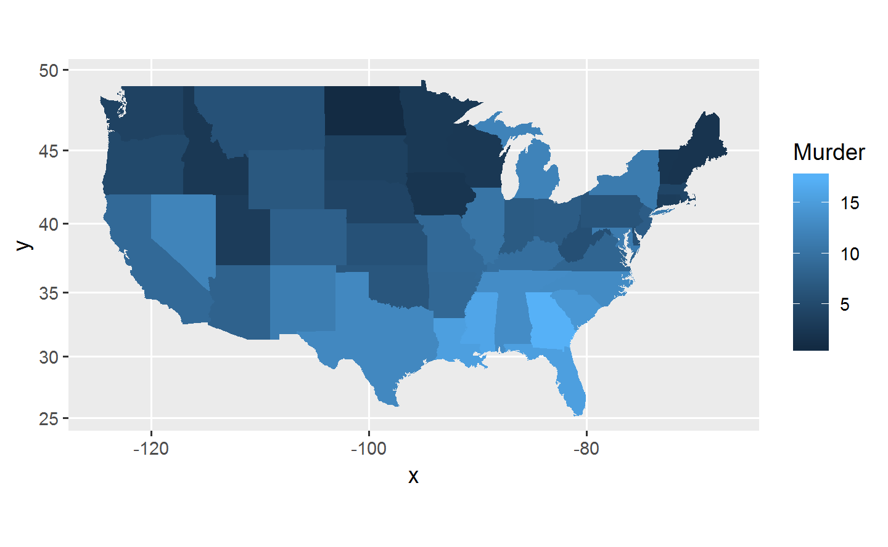
<p class="caption">(\#fig:unnamed-chunk-44)1973年美国各州的犯罪率数据</p>
</div>


```r
ggplot(crimesm, aes(map_id = state)) +
  geom_map(aes(fill = value), map = states_map) +
  expand_limits(x = states_map$long, y = states_map$lat) +
  facet_wrap(~variable)
```

<div class="figure" style="text-align: center">
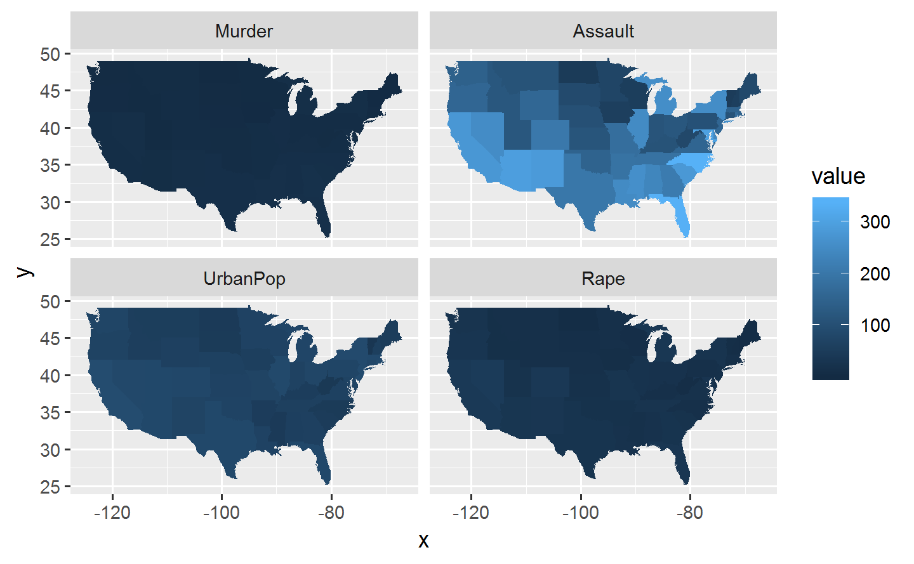
<p class="caption">(\#fig:unnamed-chunk-45)四类犯罪在各州的分布</p>
</div>

比较 viridis 和 Spectral 两块调色板，如图 \@ref(fig:pickcolor) 所示，可见 Spectral 的可识别性高些


```r
dat <- as.data.frame(cbind(rep(1948 + seq(12), each = 12), rep(seq(12), 12), AirPassengers))
colnames(dat) <- c("year", "month", "passengers")
library(colormap)
ggplot(data = dat, aes(as.factor(year), as.factor(month))) +
  geom_point(aes(colour = passengers), pch = 15, size = 8) +
  scale_colour_distiller(palette = "Spectral") +
  labs(x = "Year", y = "Month") +
  theme_minimal()
```

<div class="figure" style="text-align: center">
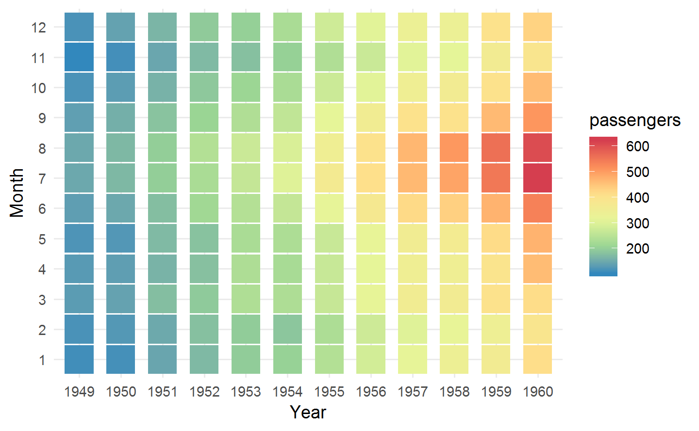
<p class="caption">(\#fig:pickcolor)viridis 和 Spectral对比</p>
</div>

再举栗子，图\@ref(fig:faithfuld)是正负例对比，其中好在哪里呢？这张图要表达美国黄石国家公园的老忠实泉间歇喷发的时间规律，那么好的标准就是层次分明，以突出不同颜色之间的时间差异。这个差异，还要看起来不那么费眼睛，越一目了然越好。


```r
library(gridExtra)
erupt <- ggplot(faithfuld, aes(waiting, eruptions, fill = density)) +
  geom_raster() +
  scale_x_continuous(NULL, expand = c(0, 0)) +
  scale_y_continuous(NULL, expand = c(0, 0)) +
  theme(legend.position = "none")
erupt1 <- erupt + scale_fill_gradientn(colours = gray.colors(7))
erupt2 <- erupt + scale_fill_distiller(palette = "Spectral")
erupt3 <- erupt + scale_fill_gradientn(colours = terrain.colors(7))
erupt4 <- erupt + scale_fill_colormap(colormap = colormaps$RdBu)
grid.arrange(erupt1, erupt2, erupt3, erupt4, ncol = 2)
```

<div class="figure" style="text-align: center">
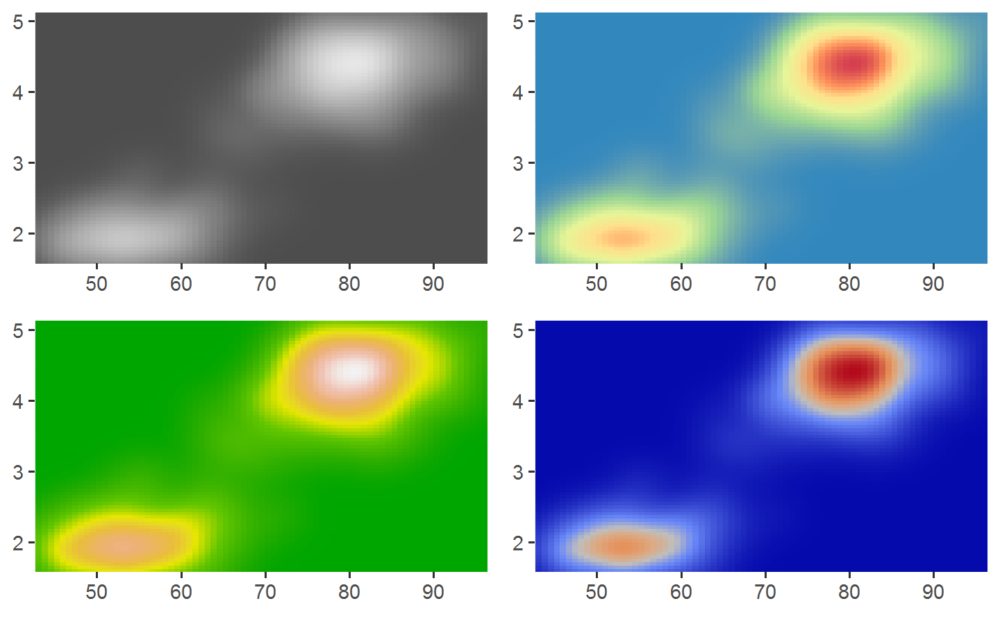
<p class="caption">(\#fig:faithfuld)美国黄石国家公园的老忠实泉</p>
</div>


此处调用 RColorBrewer 中 Spectral 调色板，它本来只有11中颜色，通过 `scale_colour_distiller` 却可以把它映射到连续型数值变量 `mag` 上，发散型调色板本身的对比性也可以起到很好的区分度，如图 \@ref(fig:fiji-map) 所示


```r
library(mapdata)
FijiMap <- map_data("worldHires", region = "Fiji")
ggplot(FijiMap, aes(x = long, y = lat)) +
  geom_map(map = FijiMap, aes(map_id = region), size = .2) +
  geom_point(data = quakes, aes(x = long, y = lat, colour = mag), pch = 16) +
  xlim(160, 195) +
  scale_colour_distiller(palette = "Spectral") +
  scale_y_continuous(breaks = (-18:18) * 5) +
  coord_map("ortho", orientation = c(-10, 180, 0)) +
  labs(colour = "Magnitude", x = "Longitude", y = "Latitude") +
  theme_bw()
```

<div class="figure" style="text-align: center">
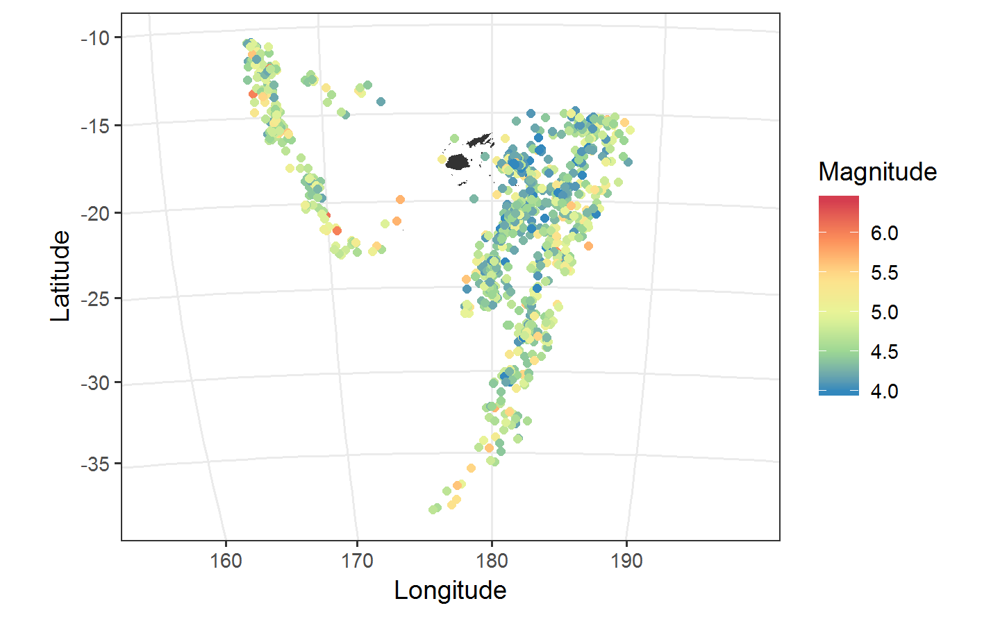
<p class="caption">(\#fig:fiji-map)斐济地震带</p>
</div>

此外， colormap 包提供更加丰富的调色板，通过 `scale_color_colormap` 支持 ggplot2 绘图风格


```r
# 数据来源 http://datasets.flowingdata.com/unemployment09.csv
unemp <- read.csv(
  file = "http://datasets.flowingdata.com/unemployment09.csv",
  header = FALSE, stringsAsFactors = FALSE
)
names(unemp) <- c(
  "id", "state_fips", "county_fips", "name", "year",
  "?", "?", "?", "rate"
)
unemp$county <- tolower(gsub(" County, [A-Z]{2}", "", unemp$name))
unemp$state <- gsub("^.*([A-Z]{2}).*$", "\\1", unemp$name)

county_df <- map_data("county")
names(county_df) <- c("long", "lat", "group", "order", "state_name", "county")
county_df$state <- state.abb[match(county_df$state_name, tolower(state.name))]
county_df$state_name <- NULL

state_df <- map_data("state")
# Combine together
choropleth <- merge(county_df, unemp, by = c("state", "county"))
choropleth <- choropleth[order(choropleth$order), ]
choropleth$rate_d <- cut(choropleth$rate, breaks = c(seq(0, 10, by = 2), 35))

library(ggthemes)
ggplot(choropleth, aes(long, lat, group = group)) +
  geom_polygon(aes(fill = rate_d), colour = alpha("white", 1 / 4), size = 0.2) +
  geom_polygon(data = state_df, colour = "white", fill = NA) +
  scale_fill_brewer(palette = "PuRd") +
  labs(
    fill = "ratio of unemployment", title = "unemployment by county, 2009",
    caption = "data source: http://datasets.flowingdata.com/unemployment09.csv"
  ) +
  coord_map("polyconic") +
  theme_map()
```

<div class="figure" style="text-align: center">
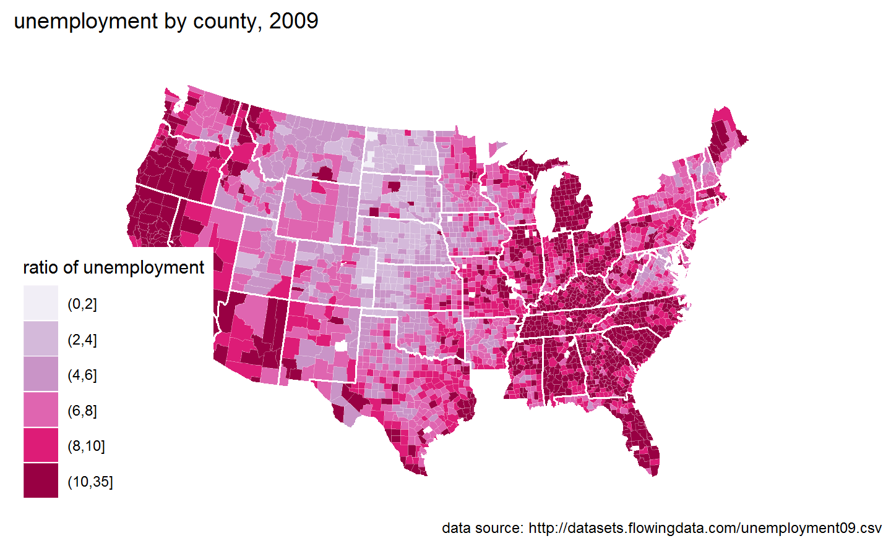
<p class="caption">(\#fig:unemploymentGG)2009年美国各城镇失业率</p>
</div>

美国各地区失业率地图，配不同颜色， [colormap](https://github.com/bhaskarvk/colormap) 适合给静态图配色

[sp-gallery]: https://edzer.github.io/sp/

### raster {#ggplot2-raster}

raster 包定义了获取和操作空间 raster 类型数据集的类和方法，rasterVis 补充加强了 raster 包在数据可视化和交互方面的功能。可视化是基于 lattice 的

[rastervis-gh]: https://github.com/oscarperpinan/rastervis
[rastervis-web]: https://oscarperpinan.github.io/rastervis/
[rastervis-faq]: https://oscarperpinan.github.io/rastervis/FAQ.html

[raster](https://github.com/rspatial/raster) 包的开发已经被作者 [Robert J. Hijmans](https://desp.ucdavis.edu/people/robert-j-hijmans) 迁移到 Github 上啦，官方文档 <https://www.rspatial.org/>

星号 * 标记的是 S3 方法


```r
methods(plot)
#>  [1] plot,ANY,ANY-method                       
#>  [2] plot,color,ANY-method                     
#>  [3] plot,hexbin,missing-method                
#>  [4] plot,Spatial,missing-method               
#>  [5] plot,SpatialGrid,missing-method           
#>  [6] plot,SpatialGridDataFrame,missing-method  
#>  [7] plot,SpatialLines,missing-method          
#>  [8] plot,SpatialMultiPoints,missing-method    
#>  [9] plot,SpatialPixels,missing-method         
#> [10] plot,SpatialPixelsDataFrame,missing-method
#> [11] plot,SpatialPoints,missing-method         
#> [12] plot,SpatialPolygons,missing-method       
#> [13] plot.acf*                                 
#> [14] plot.ACF*                                 
#> [15] plot.augPred*                             
#> [16] plot.bclust*                              
#> [17] plot.classIntervals*                      
#> [18] plot.compareFits*                         
#> [19] plot.correspondence*                      
#> [20] plot.data.frame*                          
#> [21] plot.decomposed.ts*                       
#> [22] plot.default                              
#> [23] plot.dendrogram*                          
#> [24] plot.density*                             
#> [25] plot.ecdf                                 
#> [26] plot.factor*                              
#> [27] plot.formula*                             
#> [28] plot.function                             
#> [29] plot.ggplot*                              
#> [30] plot.gls*                                 
#> [31] plot.gtable*                              
#> [32] plot.hcl_palettes*                        
#> [33] plot.hclust*                              
#> [34] plot.histogram*                           
#> [35] plot.HoltWinters*                         
#> [36] plot.ica*                                 
#> [37] plot.intervals.lmList*                    
#> [38] plot.isoreg*                              
#> [39] plot.lda*                                 
#> [40] plot.lm*                                  
#> [41] plot.lme                                  
#> [42] plot.lmList*                              
#> [43] plot.mca*                                 
#> [44] plot.medpolish*                           
#> [45] plot.mlm*                                 
#> [46] plot.nffGroupedData*                      
#> [47] plot.nfnGroupedData*                      
#> [48] plot.nls*                                 
#> [49] plot.nmGroupedData*                       
#> [50] plot.pdMat*                               
#> [51] plot.ppr*                                 
#> [52] plot.prcomp*                              
#> [53] plot.princomp*                            
#> [54] plot.profile*                             
#> [55] plot.profile.nls*                         
#> [56] plot.R6*                                  
#> [57] plot.ranef.lme*                           
#> [58] plot.ranef.lmList*                        
#> [59] plot.raster*                              
#> [60] plot.ridgelm*                             
#> [61] plot.sf*                                  
#> [62] plot.sfc_CIRCULARSTRING*                  
#> [63] plot.sfc_GEOMETRY*                        
#> [64] plot.sfc_GEOMETRYCOLLECTION*              
#> [65] plot.sfc_LINESTRING*                      
#> [66] plot.sfc_MULTILINESTRING*                 
#> [67] plot.sfc_MULTIPOINT*                      
#> [68] plot.sfc_MULTIPOLYGON*                    
#> [69] plot.sfc_POINT*                           
#> [70] plot.sfc_POLYGON*                         
#> [71] plot.sfg*                                 
#> [72] plot.shingle*                             
#> [73] plot.simulate.lme*                        
#> [74] plot.SOM*                                 
#> [75] plot.somgrid*                             
#> [76] plot.spec*                                
#> [77] plot.stars*                               
#> [78] plot.stars_proxy*                         
#> [79] plot.stepfun                              
#> [80] plot.stft*                                
#> [81] plot.stl*                                 
#> [82] plot.svm*                                 
#> [83] plot.table*                               
#> [84] plot.trellis*                             
#> [85] plot.ts                                   
#> [86] plot.tskernel*                            
#> [87] plot.TukeyHSD*                            
#> [88] plot.tune*                                
#> [89] plot.units*                               
#> [90] plot.Variogram*                           
#> see '?methods' for accessing help and source code
```

查看函数的定义


```r
getAnywhere(plot.raster)
#> A single object matching 'plot.raster' was found
#> It was found in the following places
#>   registered S3 method for plot from namespace graphics
#>   namespace:graphics
#> with value
#> 
#> function (x, y, xlim = c(0, ncol(x)), ylim = c(0, nrow(x)), xaxs = "i", 
#>     yaxs = "i", asp = 1, add = FALSE, ...) 
#> {
#>     if (!add) {
#>         plot.new()
#>         plot.window(xlim = xlim, ylim = ylim, asp = asp, xaxs = xaxs, 
#>             yaxs = yaxs)
#>     }
#>     rasterImage(x, 0, 0, ncol(x), nrow(x), ...)
#> }
#> <bytecode: 0x00000000336a66f8>
#> <environment: namespace:graphics>
```

rasterImage 函数来绘制图像，如果想知道 `rasterImage` 的内容可以继续看 `getAnywhere(rasterImage)`


```r
getAnywhere(rasterImage)
#> A single object matching 'rasterImage' was found
#> It was found in the following places
#>   package:graphics
#>   namespace:graphics
#> with value
#> 
#> function (image, xleft, ybottom, xright, ytop, angle = 0, interpolate = TRUE, 
#>     ...) 
#> {
#>     .External.graphics(C_raster, if (inherits(image, "nativeRaster")) image else as.raster(image), 
#>         as.double(xleft), as.double(ybottom), as.double(xright), 
#>         as.double(ytop), as.double(angle), as.logical(interpolate), 
#>         ...)
#>     invisible()
#> }
#> <bytecode: 0x0000000034395960>
#> <environment: namespace:graphics>
```

通过查看函数的帮助 `?rasterImage` ，我们需要重点关注一下
参数 *image* 传递的 raster 对象


```r
plot(c(100, 250), c(300, 450), type = "n", xlab = "", ylab = "")
image <- as.raster(matrix(0:1, ncol = 5, nrow = 3))
rasterImage(image, 100, 300, 150, 350, interpolate = FALSE)
rasterImage(image, 100, 400, 150, 450)
rasterImage(image, 200, 300, 200 + xinch(.5), 300 + yinch(.3),
  interpolate = FALSE
)
rasterImage(image, 200, 400, 250, 450, angle = 15, interpolate = FALSE)
```

<div class="figure" style="text-align: center">

<p class="caption">(\#fig:unnamed-chunk-49)raster 图像</p>
</div>

Edzer Pebesma 开发了 stars 包


```r
# https://resources.rstudio.com/rstudio-conf-2019/spatial-data-science-in-the-tidyverse
library(abind)
library(sf)
library(stars)
x <- system.file("tif/L7_ETMs.tif", package = "stars") %>%
  read_stars()
ggplot() +
  geom_stars(data = x) +
  coord_equal() +
  facet_wrap(~band) +
  theme_void() +
  scale_fill_viridis_c() +
  scale_x_discrete(expand = c(0, 0)) +
  scale_y_discrete(expand = c(0, 0))
```


### sp {#ggplot2-sp}

空间数据对象，以类 sp 方式存储 [@Pebesma_2005_sp]


```r
library(sp)
data(meuse)
coords <- SpatialPoints(meuse[c("x", "y")])
meuse <- SpatialPointsDataFrame(coords, meuse)
plot(meuse, pch = 1, cex = .05 * sqrt(meuse$zinc))
```

<div class="figure" style="text-align: center">
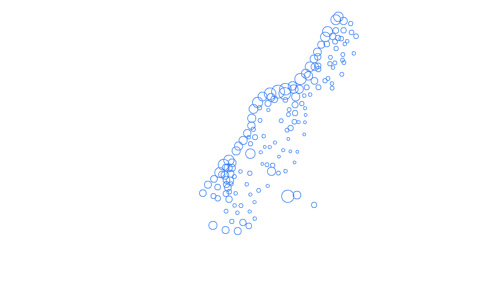
<p class="caption">(\#fig:unnamed-chunk-51)气泡图</p>
</div>


```r
library(maptools)
fname <- system.file("shapes/sids.shp", package = "maptools")
p4s <- CRS("+proj=longlat +datum=NAD27")
nc <- readShapePoly(fname, proj4string = p4s)
#> Warning: readShapePoly is deprecated; use rgdal::readOGR or sf::st_read
plot(nc, axes = TRUE, col = grey(1 - nc$SID79 / 57))
```

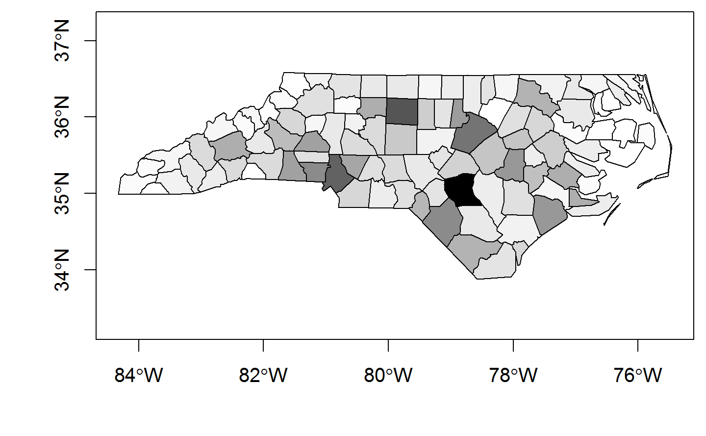


```r
# Trellis maps
arrow <- list("SpatialPolygonsRescale",
  layout.north.arrow(2),
  offset = c(-76, 34), scale = 0.5, which = 2
)
spplot(nc, c("SID74", "SID79"),
  as.table = TRUE,
  scales = list(draw = T), sp.layout = arrow
)
```


::: warning
maptools 提供的 `readShapePoly` 函数去读取 shp 文件的方式已经过时，推荐使用 `rgdal::readOGR` 或者 `sf::st_read` 方式读取
:::

### sf {#ggplot2-sf}

- maps
- mapdata
- maptools
- mapproj

- rgeos
- rgdal
- sp

- ggmap
- sf


```r
nc <- system.file("gpkg/nc.gpkg", package = "sf") %>% read_sf()
nc2 <- nc %>%
  select(SID74, SID79) %>%
  gather(VAR, SID, -geom)
ggplot() +
  geom_sf(data = nc2, aes(fill = SID)) +
  facet_wrap(~VAR, ncol = 1)
```


```r
library(GADMTools)
data("Corsica")
# basefile 文件存放路径
# FRA Corse 的国家代码
map <- gadm_sf_loadCountries("FRA", basefile = "./")
gadm_plot(map) + theme_minimal()
```


```r
library(maps) # For map data
library(mapdata)
library(ggplot2)
east_asia <- map_data("worldHires", region = c("Japan", "China", "North Korea", "South Korea"))

# Map region to fill color
ggplot(east_asia, aes(x = long, y = lat, group = group, fill = region)) +
  geom_polygon(colour = "black") +
  scale_fill_brewer(palette = "Set2")
```

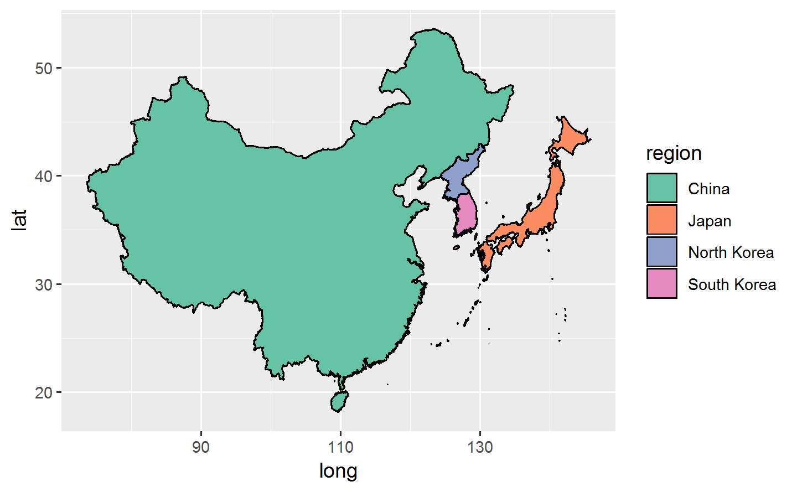

## 网络数据 {#ggplot2-network}

[igraph](https://igraph.org/) 提供了 R 和 Python 接口 <https://github.com/igraph>。 [qgraph](https://github.com/SachaEpskamp/qgraph) 开发者 [Sacha Epskamp](http://sachaepskamp.com) 在个人主页上提供了很多网络数据分析的学习资料， [Rgraphviz](https://www.bioconductor.org/packages/release/bioc/html/Rgraphviz.html) 基于 [Graphviz](https://www.graphviz.org/)


```r
BiocManager::install("Rgraphviz", version = "3.8")
```

Gephi [@ICWSM_2009_Gephi] 和 igraph 能处理的最大网络，R 包和作者依赖关系图 14000+ 包和 7000+ 作者，CRAN 是全球R包开发者之网，自发布 R 1.0.0 (February, 2000) 距今19年

案例学习

1. [2017-Help Us Map TrumpWorld](https://www.buzzfeed.com/johntemplon/help-us-map-trumpworld)
1. [2017-Trumpworld Analysis: Ownership Relations in his Business Network](https://lucidmanager.org/trumpworld-analysis/)
1. [2017-Social Network Analysis and Topic Modeling of codecentric’s Twitter friends and followers](https://shirinsplayground.netlify.com/2017/07/twitter-analysis-codecentric/)


```r
library(DiagrammeR)
library(DiagrammeRsvg)
svg <- export_svg(
  grViz("
digraph neato {

graph [layout = neato]

node [shape = circle,
      style = filled,
      color = grey,
      label = '']

node [fillcolor = red]
yihui_pkgs$Package

node [fillcolor = green]
unique(unlist(ctb))

node [fillcolor = orange]

edge [color = grey]
yihui_pkgs$Package[1] -> ctb[[1]]
yihui_pkgs$Package[2] -> ctb[[2]]
yihui_pkgs$Package[3] -> ctb[[3]]
yihui_pkgs$Package[4] -> ctb[[4]]
}")
)
# this can then be used with htmltools and can save significantly
# on size of output using svg rather than unrendered grViz
library(htmltools)
HTML(svg) # 将输出结果保存在svg格式矢量文件 即可
html_print(HTML(svg))
```

- [igraph 使用](https://smallstats.blogspot.com/search/label/igraph)


```r
# https://smallstats.blogspot.jp/2012/12/loading-huge-graphs-with-igraph-and-r.html
# Loading huge graphs with igraph and R
df <- data.frame(
  src = sample(1:1000, 1000000, replace = TRUE),

  dst = sample(1:1000, 1000000, replace = TRUE)
)

library(igraph)
cat("--- Creating data.frame ---")
start <- proc.time()
df <- data.frame(
  src = sample(1:1000, 10000000, replace = TRUE),
  dst = sample(1:1000, 10000000, replace = TRUE)
)

cat(sprintf("— elapsed time: %fs ", (proc.time() - start)[1]))
cat("— Creating graph… ")
start <- proc.time()
G <- graph.data.frame(df, directed = TRUE)
cat(sprintf("---elapsed user-time: %fs ", (proc.time() - start)[1]))


cat("...Creating graph...")

start <- proc.time()

vertex.attrs <- list(name = unique(c(df$src, df$dst)))
edges <- rbind(
  match(df$src, vertex.attrs$name),
  match(df$dst, vertex.attrs$name)
)

G <- graph.empty(n = 0, directed = T)
G <- add.vertices(G, length(vertex.attrs$name), attr = vertex.attrs)
G <- add.edges(G, edges)

remove(edges)
remove(vertex.attrs)

cat(sprintf("--- elapsed user-time: %fs ", (proc.time() - start)[1]))
```

## CRAN 分析 {#analysis-cran}

> ggraph 和 igraph 可视化

首先我们从 CRAN 官网下载 R 包描述信息[^download-cran-metadata] 


```r
# CRAN R 包 metadata 信息
if (file.exists("data/packages.rds")) {
  pdb <- readRDS("data/packages.rds")
} else {
  pdb <- readRDS(file = file(sprintf("%s/web/packages/packages.rds", getOption("repos")["CRAN"])))
}
```

接着，我们可以看看CRAN 上发布的 R 包数量


```r
pdb[, "Package"] %>% length()
#> [1] 14339
```

经过与官网发布的数据来对比，我们发现这里计算的结果与实际不符，多出来了几十个R包，所以我们再观察一下是否有重复的 R 包描述信息


```r
pdb[, "Package"][duplicated(pdb[, "Package"])]
#>  [1] "boot"       "class"      "cluster"    "codetools"  "foreign"   
#>  [6] "KernSmooth" "lattice"    "MASS"       "Matrix"     "mgcv"      
#> [11] "nlme"       "nnet"       "rpart"      "spatial"    "survival"
```

不难发现，果然有！所以去掉重复的 R 包信息，就是 CRAN 上实际发布的 R 包数量


```r
subset(pdb, subset = !duplicated(pdb[, "Package"]), select = c("Package")) %>% length()
#> [1] 14324
```

接下来，我们再来查看一些比较高产的 R 包开发者谢益辉都维护了哪些R包，如表 \@ref(tab:rmarkdown-eco) 所示


```r
yihui_pkg <- subset(pdb,
  subset = grepl("Yihui Xie", pdb[, "Maintainer"]),
  select = c("Package", "Maintainer", "Title")
)
yihui_pkg[, "Title"] <- gsub("(\\\n)", " ", yihui_pkg[, "Title"])

yihui_pkg %>%
  knitr::kable(caption = "谢益辉维护的 R Markdown 生态", booktabs = TRUE)
```


Table: (\#tab:rmarkdown-eco)谢益辉维护的 R Markdown 生态

Package      Maintainer                   Title                                                                                       
-----------  ---------------------------  --------------------------------------------------------------------------------------------
animation    Yihui Xie <xie@yihui.name>   A Gallery of Animations in Statistics and Utilities to Create Animations                    
blogdown     Yihui Xie <xie@yihui.name>   Create Blogs and Websites with R Markdown                                                   
bookdown     Yihui Xie <xie@yihui.name>   Authoring Books and Technical Documents with R Markdown                                     
DT           Yihui Xie <xie@yihui.name>   A Wrapper of the JavaScript Library 'DataTables'                                            
evaluate     Yihui Xie <xie@yihui.name>   Parsing and Evaluation Tools that Provide More Details than the Default                     
formatR      Yihui Xie <xie@yihui.name>   Format R Code Automatically                                                                 
fun          Yihui Xie <xie@yihui.name>   Use R for Fun                                                                               
highr        Yihui Xie <xie@yihui.name>   Syntax Highlighting for R Source Code                                                       
knitr        Yihui Xie <xie@yihui.name>   A General-Purpose Package for Dynamic Report Generation in R                                
markdown     Yihui Xie <xie@yihui.name>   'Markdown' Rendering for R                                                                  
mime         Yihui Xie <xie@yihui.name>   Map Filenames to MIME Types                                                                 
MSG          Yihui Xie <xie@yihui.name>   Data and Functions for the Book Modern Statistical Graphics                                 
pagedown     Yihui Xie <xie@yihui.name>   Paginate the HTML Output of R Markdown with CSS for Print                                   
printr       Yihui Xie <xie@yihui.name>   Automatically Print R Objects to Appropriate Formats According to the 'knitr' Output Format 
Rd2roxygen   Yihui Xie <xie@yihui.name>   Convert Rd to 'Roxygen' Documentation                                                       
rmarkdown    Yihui Xie <xie@yihui.name>   Dynamic Documents for R                                                                     
rticles      Yihui Xie <xie@yihui.name>   Article Formats for R Markdown                                                              
servr        Yihui Xie <xie@yihui.name>   A Simple HTTP Server to Serve Static Files or Dynamic Documents                             
testit       Yihui Xie <xie@yihui.name>   A Simple Package for Testing R Packages                                                     
tinytex      Yihui Xie <xie@yihui.name>   Helper Functions to Install and Maintain 'TeX Live', and Compile 'LaTeX' Documents          
tufte        Yihui Xie <xie@yihui.name>   Tufte's Styles for R Markdown Documents                                                     
xaringan     Yihui Xie <xie@yihui.name>   Presentation Ninja                                                                          
xfun         Yihui Xie <xie@yihui.name>   Miscellaneous Functions by 'Yihui Xie'                                                      

接下来，我们想看看 R 包维护者数量有多少


```r
subset(pdb,
  subset = !duplicated(pdb[, "Package"]),
  select = "Maintainer"
) %>%
  unique() %>%
  length()
#> [1] 8448
```

可实际上没有这么多的开发者，因为存在这样的情况，以 R 包维护者 Hadley Wickham 为例，由于他曾使用过不同的邮箱，所以在维护者字段出现了不一致的情况，实际却是同一个人。


```r
subset(pdb,
  subset = grepl("Hadley Wickham", pdb[, "Maintainer"]),
  select = c("Package", "Maintainer")
)
#>       Package         Maintainer                              
#>  [1,] "assertthat"    "Hadley Wickham <hadley@rstudio.com>"   
#>  [2,] "babynames"     "Hadley Wickham <hadley@rstudio.com>"   
#>  [3,] "bigrquery"     "Hadley Wickham <hadley@rstudio.com>"   
#>  [4,] "classifly"     "Hadley Wickham <h.wickham@gmail.com>"  
#>  [5,] "clusterfly"    "Hadley Wickham <h.wickham@gmail.com>"  
#>  [6,] "conflicted"    "Hadley Wickham <hadley@rstudio.com>"   
#>  [7,] "dbplyr"        "Hadley Wickham <hadley@rstudio.com>"   
#>  [8,] "dplyr"         "Hadley Wickham <hadley@rstudio.com>"   
#>  [9,] "ellipsis"      "Hadley Wickham <hadley@rstudio.com>"   
#> [10,] "feather"       "Hadley Wickham <hadley@rstudio.com>"   
#> [11,] "forcats"       "Hadley Wickham <hadley@rstudio.com>"   
#> [12,] "fueleconomy"   "'Hadley Wickham' <h.wickham@gmail.com>"
#> [13,] "ggplot2"       "Hadley Wickham <hadley@rstudio.com>"   
#> [14,] "ggplot2movies" "Hadley Wickham <hadley@rstudio.com>"   
#> [15,] "gtable"        "Hadley Wickham <hadley@rstudio.com>"   
#> [16,] "haven"         "Hadley Wickham <hadley@rstudio.com>"   
#> [17,] "hflights"      "Hadley Wickham <h.wickham@gmail.com>"  
#> [18,] "httr"          "Hadley Wickham <hadley@rstudio.com>"   
#> [19,] "lazyeval"      "Hadley Wickham <hadley@rstudio.com>"   
#> [20,] "lvplot"        "Hadley Wickham <hadley@rstudio.com>"   
#> [21,] "meifly"        "Hadley Wickham <h.wickham@gmail.com>"  
#> [22,] "modelr"        "Hadley Wickham <hadley@rstudio.com>"   
#> [23,] "nasaweather"   "'Hadley Wickham' <h.wickham@gmail.com>"
#> [24,] "nycflights13"  "Hadley Wickham <hadley@rstudio.com>"   
#> [25,] "pkgdown"       "Hadley Wickham <hadley@rstudio.com>"   
#> [26,] "plyr"          "Hadley Wickham <hadley@rstudio.com>"   
#> [27,] "productplots"  "Hadley Wickham <hadley@rstudio.com>"   
#> [28,] "profr"         "Hadley Wickham <hadley@rstudio.com>"   
#> [29,] "proto"         "Hadley Wickham <hadley@rstudio.com>"   
#> [30,] "pryr"          "Hadley Wickham <hadley@rstudio.com>"   
#> [31,] "rappdirs"      "Hadley Wickham <hadley@rstudio.com>"   
#> [32,] "reshape"       "Hadley Wickham <hadley@rstudio.com>"   
#> [33,] "reshape2"      "Hadley Wickham <h.wickham@gmail.com>"  
#> [34,] "rggobi"        "Hadley Wickham <h.wickham@gmail.com>"  
#> [35,] "roxygen2"      "Hadley Wickham <hadley@rstudio.com>"   
#> [36,] "rvest"         "Hadley Wickham <hadley@rstudio.com>"   
#> [37,] "scales"        "Hadley Wickham <hadley@rstudio.com>"   
#> [38,] "sloop"         "Hadley Wickham <hadley@rstudio.com>"   
#> [39,] "stringr"       "Hadley Wickham <hadley@rstudio.com>"   
#> [40,] "testthat"      "Hadley Wickham <hadley@rstudio.com>"   
#> [41,] "tidyr"         "Hadley Wickham <hadley@rstudio.com>"   
#> [42,] "tidyverse"     "Hadley Wickham <hadley@rstudio.com>"   
#> [43,] "vctrs"         "Hadley Wickham <hadley@rstudio.com>"
```

因此，有必要先把 Maintainer 字段中的邮箱部分去掉


```r
clean_maintainer <- function(x) {
  # 去掉邮箱
  x <- gsub("<([^<>]*)>", "", x)
  # 去掉 \n \t \' \" 和 '
  x <- gsub("(\\\n)|(\\\t)|(\\\")|(\\\')|(')", "", x)
  # 去掉末尾空格
  x <- gsub(" +$", "", x)
}
```

这样我们可以得到比较靠谱的R包维护者数量了！


```r
# 去重之后
cran_maintainers <- subset(pdb,
  subset = !duplicated(pdb[, "Package"]),
  select = "Maintainer"
) %>%
  lapply(clean_maintainer) %>% # 清理 Maintainer 字段
  unlist() # 列表转成字符串向量
cran_maintainers %>%
  unique() %>% # 去重
  length()
#> [1] 7828
```

接下来，我们还想把 R 包维护者，按照其维护的R包数量排个序，用条形图\@ref(fig:top-maintainers) 表示


```r
myData <- cran_maintainers %>%
  table() %>% # 按照维护者分组计数
  sort(decreasing = T) %>% # 降序排列
  head(20) # 取 Top 20
par(mar = c(2, 7, 1, 1))
barCenters <- barplot(myData,
  col = "lightblue", axes = FALSE,
  axisnames = FALSE, horiz = TRUE, border = "white"
)
text(
  y = barCenters, x = par("usr")[3],
  adj = 1, labels = names(myData), xpd = TRUE
)
axis(1,
  labels = seq(0, 90, by = 10), at = seq(0, 90, by = 10),
  las = 1, col = "gray"
)
grid()
```

<div class="figure" style="text-align: center">
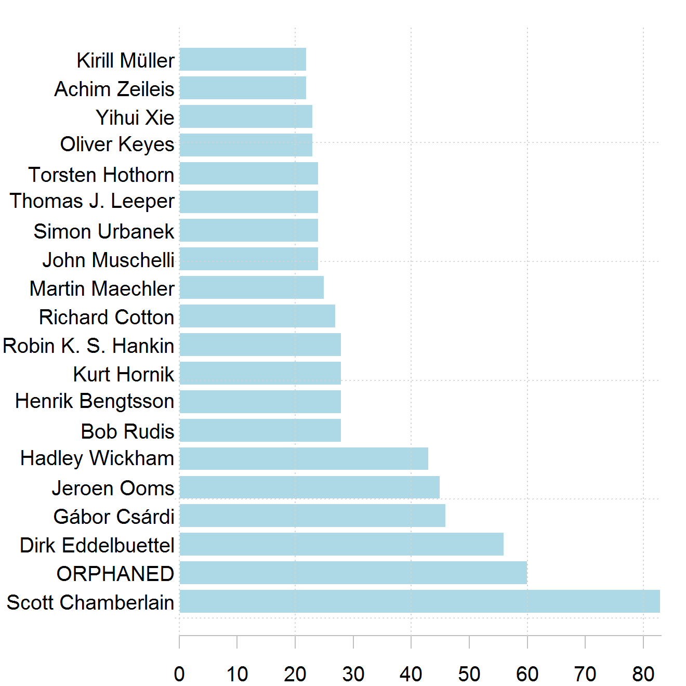
<p class="caption">(\#fig:top-maintainers)(ref:top-maintainers)</p>
</div>

调用 ggplot2 包绘图要求输入的数据类型是 data.frame，所以我们首先将 myData 转化为数据框类型


```r
myData <- as.data.frame(myData)
colnames(myData) <- c("Maintainer", "Freq")
ggplot(myData) +
  geom_bar(aes(x = Maintainer, y = Freq), stat = "identity") +
  coord_flip() +
  xlab("Maintainer") +
  ylab("Numbers of Package")
```

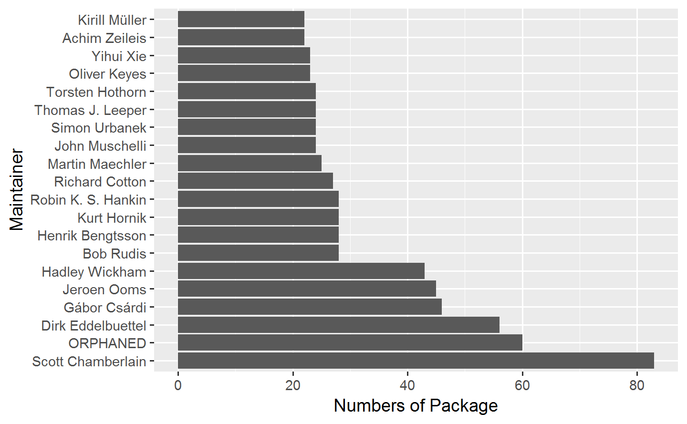

条形图在柱子很多的情况下，点线图是一种更加简洁的替代方式


```r
ggplot(myData, aes(x = Freq, y = Maintainer)) +
  geom_segment(aes(x = 20, xend = Freq, yend = Maintainer), colour = "grey50") +
  geom_point(size = 2, colour = "red") +
  labs(x = " # of Packages ", y = " Maintainer ")
```

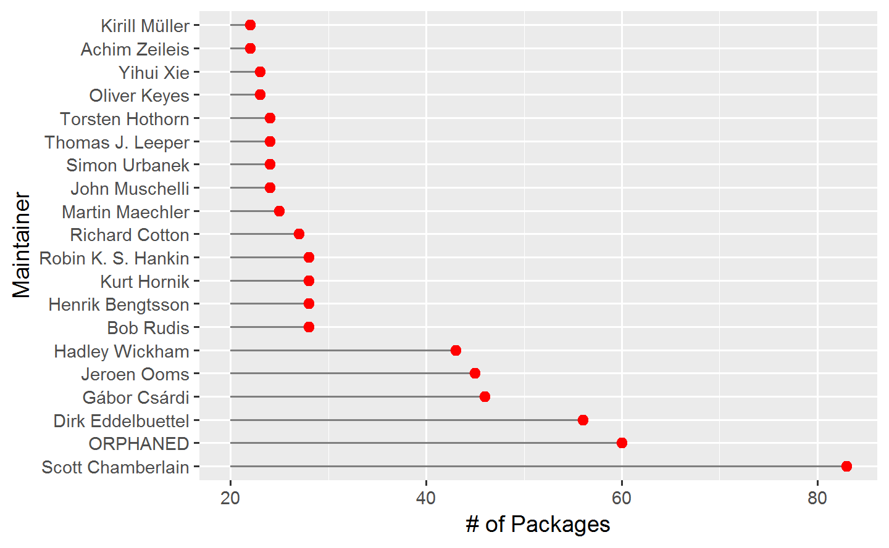

接下来，我们想看看开发者维护的 R 包数量的分布，仅从上图，我们知道有的人能维护 80 多个 R 包，总体的分布情况又是如何呢？如图所示，我们将纵轴刻度设置为 log 模式，随着开发的R包数量的增加，开发者人数是指数级递减，可见开发R包依然是一个门槛很高的工作！


```r
cran_maintainers %>%
  table() %>% 
  table %>% 
  barplot(col = "lightblue", log = "y", border = "white", 
          xlab = "# of Packages", ylab = "# of Maintainers (log)",
          panel.first = grid())
```

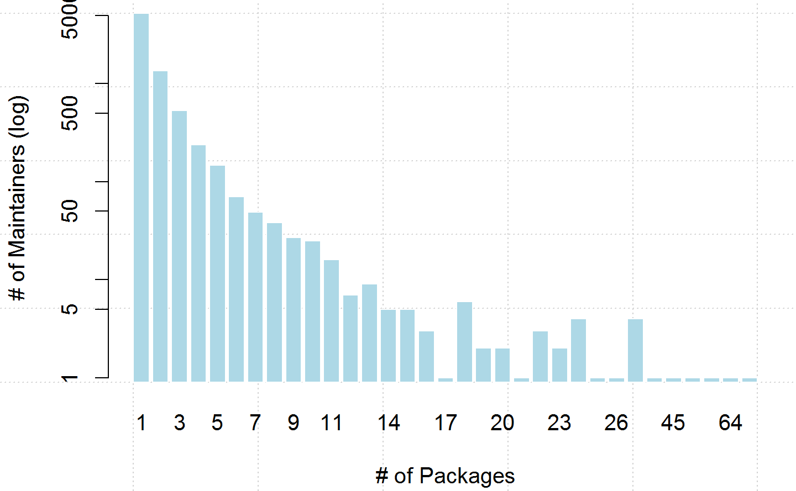

只开发一个 R 包的人数达到 5276 人，占开发者总数的 67.31\%，约为2/3。我们还想进一步了解这些人是不是就自己开发自己维护，没有其他人参与，而且他们也不参与其它 R 包的贡献？如果是，则他们对社区的贡献非常有限，仅限于为社区带来数量上的堆积！那么社区的主要推动者是余下的 1/3，他们相互之间的合作应该比较多，我们接下来想分析一下他们之间的贡献网络。


(ref:top-maintainers) 维护R包数量最多的20个人[^orphaned]

[^orphaned]: 其中 Orphaned 表示之前的R包维护者不愿意继续维护了，后来有人接手维护，Orphaned 表示这一类接盘侠
[^download-cran-metadata]: 现在有更加方便的方式获取 R 包元数据 `pdb <- tools::CRAN_package_db()` 返回一个 data.frame 


```r
# 为这张图寻求一个完美的解释
# 每天更新的 R包数量随日期的分布，发布数量最多的日期，好好想想是不是这样
largest_update_num <- sort(table(pdb$Published), decreasing = T)[1]
smallest_update_num <- sort(table(pdb$Published), decreasing = F)[1]
pdb_df <- as.data.frame(pdb)
ggplot(pdb_df[, c("Package", "Published")], aes(as.Date(Published))) +
  geom_bar(color = "firebrick") +
  geom_line(
    data = data.frame(
      date = as.Date(c("2011-01-01", "2012-10-20")),
      count = c(130, 155)
    ), aes(x = date, y = count),
    arrow = arrow(angle = 15, length = unit(0.15, "inches"))
  ) +
  annotate("text", x = as.Date("2010-11-01"), y = 128, label = "(2012-10-29,172)") +
  scale_x_date(date_breaks = "1 year", date_labels = "%Y") +
  labs(x = "Published Date", y = "Count") +
  theme_minimal()
```


## 软件信息  {#ggplot2-session-info}


```r
sessionInfo()
#> R version 3.6.0 (2019-04-26)
#> Platform: x86_64-w64-mingw32/x64 (64-bit)
#> Running under: Windows 8.1 x64 (build 9600)
#> 
#> Matrix products: default
#> 
#> locale:
#> [1] LC_COLLATE=Chinese (Simplified)_China.936 
#> [2] LC_CTYPE=Chinese (Simplified)_China.936   
#> [3] LC_MONETARY=Chinese (Simplified)_China.936
#> [4] LC_NUMERIC=C                              
#> [5] LC_TIME=Chinese (Simplified)_China.936    
#> 
#> attached base packages:
#> [1] stats     graphics  grDevices utils     datasets  methods   base     
#> 
#> other attached packages:
#>  [1] hexbin_1.27.3    maptools_0.9-5   sp_1.3-1         stars_0.3-1     
#>  [5] sf_0.7-4         abind_1.4-5      ggthemes_4.2.0   mapdata_2.3.0   
#>  [9] gridExtra_2.3    colormap_0.1.4   maps_3.3.0       colorspace_1.4-1
#> [13] nlme_3.1-140     forcats_0.4.0    stringr_1.4.0    dplyr_0.8.1     
#> [17] purrr_0.3.2      readr_1.3.1      tidyr_0.8.3      tibble_2.1.2    
#> [21] ggplot2_3.1.1    tidyverse_1.2.1 
#> 
#> loaded via a namespace (and not attached):
#>  [1] Rcpp_1.0.1         lubridate_1.7.4    lattice_0.20-38   
#>  [4] class_7.3-15       assertthat_0.2.1   digest_0.6.19     
#>  [7] V8_2.2             R6_2.4.0           cellranger_1.1.0  
#> [10] plyr_1.8.4         backports_1.1.4    evaluate_0.14     
#> [13] e1071_1.7-1        highr_0.8          httr_1.4.0        
#> [16] pillar_1.4.1       rlang_0.3.4        lazyeval_0.2.2    
#> [19] curl_3.3           readxl_1.3.1       rstudioapi_0.10   
#> [22] rmarkdown_1.13     foreign_0.8-71     munsell_0.5.0     
#> [25] broom_0.5.2        compiler_3.6.0     modelr_0.1.4      
#> [28] xfun_0.7           pkgconfig_2.0.2    htmltools_0.3.6   
#> [31] tidyselect_0.2.5   bookdown_0.11      codetools_0.2-16  
#> [34] crayon_1.3.4       withr_2.1.2        grid_3.6.0        
#> [37] jsonlite_1.6       gtable_0.3.0       DBI_1.0.0         
#> [40] magrittr_1.5       units_0.6-3        scales_1.0.0      
#> [43] KernSmooth_2.23-15 cli_1.1.0          stringi_1.4.3     
#> [46] xml2_1.2.0         generics_0.0.2     tools_3.6.0       
#> [49] glue_1.3.1         hms_0.4.2          parallel_3.6.0    
#> [52] yaml_2.2.0         classInt_0.3-3     rvest_0.3.4       
#> [55] knitr_1.23         haven_2.1.0
```

