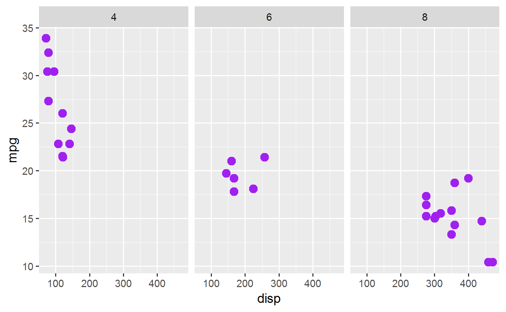
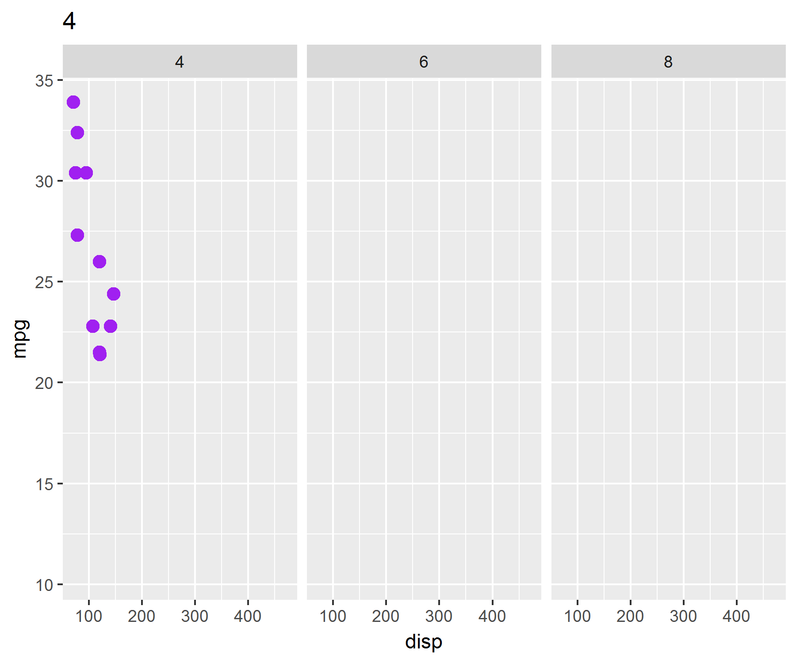
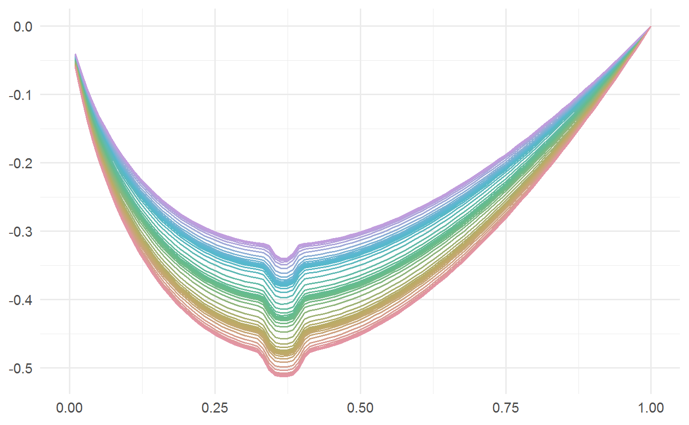

# 交互式图形 {#interactive-graphics}

这里的动态图形覆盖的范围是各种 JS 库，还包含 tcltk、 rgl 和 svg 里面的动图，包括由静态图形转化过来的图形如 animation 或者 magick 和 gganimate 制作的图形 

[htmlwidgets](http://www.htmlwidgets.org/) 将基于 JavaScript 的图形渲染库引入 R， [svgViewR](https://github.com/aaronolsen/svgViewR) 包制作基于 SVG 和 WebGL 的 3D 动画， [mapmate](https://github.com/leonawicz/mapmate) 制作地图方面的三维可视化图形和 [gganimate 案例合集](https://github.com/ropenscilabs/learngganimate)

## gganimate


```r
library(ggplot2)
library(gganimate)
```

生成静态图片


```r
ggplot(mtcars, aes(disp, mpg)) +
  geom_point(colour = "purple", size = 3) +
  facet_wrap(~cyl)
```



用来分面的变量 cyl 作为转场的帧


```r
base_pic <- ggplot(mtcars, aes(disp, mpg)) +
  geom_point(colour = "purple", size = 3) +
  facet_wrap(~cyl) +
  transition_manual(cyl) +
  labs(title = "{current_frame}")
animate(base_pic, nframes = 100, fps = 50)
#> nframes and fps adjusted to match transition
```



## magick

由一帧帧静态图片合并转化为 GIF 图


```r
library(gapminder)
library(magick)
img <- image_graph(res = 96)
datalist <- split(gapminder, gapminder$year)
out <- lapply(datalist, function(data) {
  p <- ggplot(data, aes(gdpPercap, lifeExp, size = pop, color = continent)) +
    scale_size("population", limits = range(gapminder$pop)) +
    scale_x_log10(limits = range(gapminder$gdpPercap)) +
    geom_point() + ylim(20, 90) + ggtitle(data$year) + theme_classic()
  print(p)
})
dev.off()
gapminder <- image_animate(img, fps = 2)
image_write(gapminder, "data/gapminder.gif")
```


tweenr 用于中间过渡，插值。

这个栗子叫 3D 版邪恶的曲线，源于 Y 叔的博客^[<https://guangchuangyu.github.io/cn/2017/09/3d-breast/>]。

$$f(x;\theta,\phi) = \theta x\log(x)-\frac{1}{\phi}\mathit{e}^{-\phi^4(x-\frac{1}{\mathit{e}})^4}$$

其中 $\theta \in (2,3), \phi \in (30,50), x \in (0,1)$


```r
f <- function(a, b) {
  function(y) {
    a * y * log(y, base = 10) - 1 / b * exp(-(b * y - b / exp(1))^4)
  }
}

y <- seq(0, 1, length.out = 100)
cols <- colorspace::rainbow_hcl(5)
d5 <- data.frame(x = f(3, 30)(y), y = y, color = cols[1])
d4 <- data.frame(x = f(2.8, 33)(y), y = y, color = cols[2])
d3 <- data.frame(x = f(2.5, 36)(y), y = y, color = cols[3])
d2 <- data.frame(x = f(2.2, 40)(y), y = y, color = cols[4])
d1 <- data.frame(x = f(2, 50)(y), y = y, color = cols[5])

df <- list(d5, d4, d3, d2, d1)

library(tweenr)
df2 <- tween_states(df,
  tweenlength = 2, statelength = 1,
  ease = rep("cubic-in-out", 4), nframes = 100
)

ggplot(data = df2, aes(x, y, color = I(color), frame = .frame)) +
  geom_path() +
  coord_flip() +
  theme_minimal() +
  labs(x = NULL, y = NULL)
#> Warning: Removed 52 rows containing missing values (geom_path).
```

<div class="figure" style="text-align: center">

<p class="caption">(\#fig:unnamed-chunk-6)tweenr 添加过渡效果</p>
</div>

## plotly

[plotly](https://plotly-r.com) 类似 GGplot2 提供了各种交互图形的绘制函数，其中 `plot_ly` 函数提供了两种风格的绘图方式，一种是 Base R 另一种是 GGplot2，我们主要考虑使用 GGplot2 这种风格的 

### 直方图 {#plotly-histogram}


```r
library(plotly, warn.conflicts = FALSE)
# 生成一些随机数
days <- abs(rnorm(1000, 80, 125))

p1 <- plot_ly(as.data.frame(days), x = ~days) %>% add_histogram(name = "plotly.js")

# hist 的默认方法是 Sturges
price_hist <- function(method = "FD") {
  h <- hist(diamonds$price, breaks = method, plot = FALSE)
  plot_ly(x = h$mids, y = h$counts) %>% add_bars(name = method)
}

subplot(
  p1, price_hist(), price_hist("Sturges"),  price_hist("Scott"),
  nrows = 1, shareX = TRUE
)
```

<!--html_preserve--><div id="htmlwidget-cb81ed842b6134298e79" style="width:70%;height:1112.4px;" class="plotly html-widget"></div>
<script type="application/json" data-for="htmlwidget-cb81ed842b6134298e79">{"x":{"data":[{"x":[27.1270020793635,113.734770216528,71.9463351325065,113.860169073636,296.91045819122,46.9110985906325,342.433837783675,187.918902454393,3.67660684292994,159.631950827748,0.379336918531322,48.753591644367,169.060158582191,24.2784882465309,111.12245594229,54.2742438800848,148.407714536982,81.9364879586229,130.545168098834,105.55844329746,237.98295710435,111.274738759669,112.274427063881,303.191769647475,72.4632204144725,49.9847192064819,52.3327236319511,132.426134575092,46.1304193899736,1.02189724302384,51.4485091966838,227.334965741202,46.7159175738878,146.017603633926,141.082398621666,18.7761455707057,256.315193765199,54.4079453741222,116.5493387947,54.1669398409699,35.0697099902113,82.4420394151527,28.7337587713353,211.795290164208,61.4200507036874,207.259572171407,10.1983140515992,17.3472671723183,2.72919593262357,280.650564397077,6.5696595762561,14.0695414557432,154.502645049797,78.9140504170677,54.8431820415232,136.954239018729,36.8533657229541,421.039787827927,123.330608588936,0.286286081840629,184.397871861558,153.627821116674,101.261721688451,25.3535513167677,69.9739924225267,35.9428451763349,269.858393373581,90.7163064423324,349.099344406412,90.7414368972476,123.238278183142,150.64758743666,79.237770376254,25.1523668029498,166.111387062049,17.5726006195413,153.576828684736,172.928173609811,68.8531339333418,215.145460365449,90.5755881044989,286.126381811445,17.4070493428817,202.887977098876,143.222944031332,132.464373913537,404.682852756412,27.1679905868047,11.6921291213138,114.493172819919,42.8152822957285,161.845770601797,264.260897222378,106.622737126789,113.671257632006,114.646703323959,202.901268628599,174.923501140033,2.16934637932815,195.362967988697,126.36352340856,164.167141771165,10.3191220802911,8.64065912761833,46.2981766553158,180.541297148611,72.6385995058727,214.282529376118,161.487460043322,101.222800424106,9.55560844617862,181.968367654751,141.25037921082,152.369956034412,25.081761515592,107.71674112498,140.824209414183,35.8083900934184,449.493144376139,110.659708266714,60.3089229169539,98.0771380137805,104.271990993038,99.6094233694769,81.3012916503123,16.15544635263,19.7580177084972,18.9966254406501,418.874842955427,78.1186546135021,101.361030278212,89.5674825408111,110.094950486217,143.273280771443,49.6372666970254,192.066793128447,131.360749192811,73.3354131349686,36.9461041161988,171.300973033028,250.540998828717,47.537361373929,77.9029118742373,87.4096120403705,123.651041447576,268.623772367437,173.42971593967,92.2795408323562,292.338001064965,124.747755469854,100.591754019737,123.09180974101,364.802114878671,219.40969619908,152.462109902479,28.5030198767853,236.031402342794,110.961608077049,163.755211125093,89.8317316971137,23.2758041990854,183.354573516946,302.080963307983,253.153184595593,115.883603153664,73.0519540555519,206.876321010323,180.107440241979,62.7958842038333,151.248039378903,273.911788720579,123.87325431459,11.4630489509962,227.40035871217,6.01646215171326,126.159235767999,36.7895661754044,138.11420068477,40.0966447508742,16.7269245068813,229.937606048052,26.0014523848629,68.5948616308826,24.2247959250808,376.121309016777,97.0646999530741,43.3672518509863,182.074625472456,116.889237006307,212.803403316436,74.9963691885333,8.91164625594439,113.337570706249,210.921127728803,128.971120304965,298.790197079813,99.8568364079064,96.5951622857716,59.3172479427196,192.406284152785,157.041843408777,122.883098213621,238.774626729567,211.249406054928,136.344351062443,317.113409176107,73.3987052247783,152.314952592507,106.444532817001,51.6977593533541,2.74605097300602,86.7347127628495,165.826752577835,102.687602374245,117.086424332239,290.639111049588,230.566139888524,138.471539587808,97.0049563995049,122.316214512401,37.6897337249063,95.8846959310187,169.022328105389,89.5251204132127,198.620638583407,191.137000218286,74.786290391682,52.1481652448575,163.113078389685,50.2793244315805,200.430012080485,180.356456307773,35.1039627742897,59.1258623822836,300.769210467249,81.449310398916,154.729681474478,154.312153237056,264.431408488884,25.2915237805625,43.4344703810156,86.5534069496039,51.8855676577797,407.267509682575,85.290371807259,122.702323723701,325.780441681202,24.6828107184193,212.379838367438,31.606982485209,278.450267579643,210.820154873337,230.781206720723,31.8198991962165,185.075861180028,219.695885029753,85.098776205095,126.456364751196,71.5863742298552,164.247346618416,31.8556574379185,99.9205184958792,168.982780070592,223.626827684262,32.320712210979,208.035837315045,134.534807733109,244.140725552394,63.5633661015147,157.019077363245,201.975426775761,85.3826983340743,81.1110212753011,94.9495186076047,139.469151987972,245.810120014184,80.5340589523058,249.321200931702,179.016603774229,259.998631748928,69.4674619879884,97.8594107392484,162.426861909571,300.852346575063,34.6543939852786,58.9581864669113,231.182659967243,238.877541720189,157.923460576062,147.296092172248,37.9786210612574,62.904309663752,30.8925809063904,26.8072274436139,71.1114991985296,45.2106738159942,144.900449796623,81.7713752111789,16.0316744404082,118.591147015915,103.287261050855,64.0228466066736,142.592603135199,76.975680421226,47.0415515801592,221.303272562599,85.3914504900297,81.4754283690071,99.0110260109509,10.863447300319,211.129470770988,192.111351891338,115.589368341429,46.3040402497214,22.1243180755121,2.40471022785957,102.796587529739,14.550801888675,251.187058374473,30.1469525805209,195.106186166545,219.221100472594,170.694046286532,198.402126647159,4.99155086594391,70.5111922753641,228.347177671537,102.034625547655,64.4095110681642,160.291462849296,2.76121750906515,100.414911502552,330.786408968777,65.1277763400607,51.969126925132,231.213755593284,274.681833439142,12.8168704571229,214.699342824178,184.894267891797,51.0748826310506,84.0238941105282,129.229961032589,139.24527069202,83.7222796608359,229.301347912924,161.289593362045,72.4492964812025,84.5299580739638,130.671191906624,96.4097196343678,93.8769053280242,136.529150379255,350.854113903434,88.5172441448821,10.7544563720766,28.5304186022919,227.923427318029,134.608205765505,24.6903293023377,44.2522097151837,46.7691362684087,119.75142009713,59.7236201651033,109.717320071836,93.7563366486295,255.62755606493,24.5866053296786,15.7534353466426,70.5765219235104,4.61545784820993,73.6314909474238,110.101059511736,93.5684519877511,70.1417915239177,32.6015785134853,206.864692773988,24.2936209380655,106.157468949966,106.836745058158,65.7676975271659,10.0128351450945,18.7683598834363,95.7432726712586,155.770945080942,38.9166348320768,264.597900593799,191.781108317278,393.973859578777,231.337759802026,201.182687162575,106.6636702454,128.821530988981,40.1060965367049,14.7027106244357,165.908715740876,101.092259853926,114.110223858009,56.5290927416188,68.8318499542285,72.850488609822,1.45348549525978,84.3320186347863,5.09111111275412,155.872364692875,70.7693077978232,134.642865364994,116.115099203051,53.0079589220695,162.360981179478,60.924199090917,336.575143288029,120.528205172527,143.301645005165,323.442955692523,17.8277909688048,109.508160848492,22.817401099304,92.8630695849596,162.541496916766,113.205558678922,44.2962084797651,85.1445155593516,38.1059186096576,82.2962440280921,140.438187289352,226.986973910036,183.449181595533,0.184346015643783,91.3275696990741,185.414375166175,206.328883970849,79.4379011161113,230.454098812489,220.15779315548,171.240009241343,207.061270303975,31.6467406425349,55.6814189014687,47.1587198442829,156.950920799108,49.767911200931,214.969557335861,130.774580200398,54.4028206583092,114.152440328993,89.4586478003731,123.54579580659,268.754984485135,54.1032732772166,201.451950368023,198.489673044413,118.394203724022,83.7621782048189,102.168024486408,48.4273323137354,38.170192258144,192.131162426304,88.5835874670665,306.266816195175,286.023467210307,107.186086031104,118.394658536644,265.642910939895,131.275101436306,175.227303422905,103.685976970546,98.7000244880284,60.965262797433,99.3137944283824,36.1951017425127,38.4314897985465,87.1287211682695,37.4407795316018,211.935766045738,262.341309865445,58.6759594545243,148.113011505373,154.013411762395,19.2692059843719,67.3502918282863,25.4940341145744,85.0950060339632,42.427318886769,185.176672703783,104.350882568957,264.92765960861,36.4969562913169,138.838687546728,115.886602772886,10.1440047152868,12.2787190969016,35.1259706801594,23.8907360659822,11.3094095360596,101.676631612895,79.4338805461315,166.147495685845,53.5012990724345,116.997982388737,212.030285013689,21.9215791357022,58.3819725771673,15.9504225368105,77.071977299614,127.110516850302,130.61931297307,89.8606096908315,66.1321229431545,59.1306891462382,163.959441582168,96.8080282576784,135.778426206648,12.7438914186311,27.7026528151424,141.429931410688,24.0670576186803,118.828814894617,119.861218370668,15.511749798356,214.354350782653,147.942283066981,22.6088713332038,149.16548805724,177.443510842744,272.920361423545,96.571571750961,29.9197392229497,123.388944546746,29.5813415685642,262.592560874222,71.8703513562696,276.814387256249,89.1013654984723,112.32305364048,177.740534788396,83.6409225767401,210.576377617812,130.412473050721,32.795939802356,27.0141118856164,163.206772000132,87.9491564118456,46.1158057165541,248.407549676088,148.923403546721,151.081089757486,54.0181027494188,59.7764336013814,28.0399259436467,100.474923583014,43.8475820501241,92.8500395306997,9.52019595914379,3.17612548445439,28.4082189614906,146.038421000441,25.0446185642816,113.743212846138,255.04053656358,166.846053902494,5.67281864606809,54.8670990118978,69.1592663297401,62.1087690458013,271.764896331636,225.745362887774,25.8630459446974,7.23637607701693,81.8998926332731,266.846423556769,70.5298916715102,83.310113956036,64.2757806529361,191.747181742853,132.998623762074,74.5025407467087,32.5474056324955,81.5640774490509,111.932326467657,338.929512809242,43.3527671428394,409.359094338451,83.7555550964416,41.3686457897404,66.1241752648896,64.2955282096194,65.479986560718,62.2836976834907,184.596192013328,113.290154542111,5.9728711005355,169.219711963264,96.9614449703066,98.764150390317,67.6125230514715,174.994101479497,15.0956917460171,119.48709214666,168.610895741263,370.705267952298,59.6477647674027,59.2808954145187,393.21756594708,132.491736534435,18.4567845028007,198.463395435782,62.6296089208849,147.15195475107,176.743189220452,156.109239022068,263.223373930571,263.19181687816,281.123720163753,89.273232512025,162.004347573532,95.743849939346,285.643670182667,29.5089500983078,228.730533333165,144.064156812074,225.44878161751,113.278549646111,96.3895835166975,201.249268393715,56.2742175249854,81.3313722462135,93.3228972245176,254.046317590893,58.6983102234874,170.436711360239,1.3635668206738,64.4110092226745,119.242240779502,134.18086287945,71.5742692771603,28.2899284488795,35.1963237874401,156.427340507821,219.656363904071,59.53442605477,272.617247710068,56.0001060182346,278.46011900281,110.668050569628,257.720512815737,188.142146007165,97.7990853457092,103.664094852005,61.8995448862545,97.2963509949429,126.164049688655,123.481588672842,49.0063170013009,175.041076213593,224.79332056523,3.81166701802343,241.013429015007,12.6999392708462,162.567026327911,5.93810828392648,190.920336169533,95.4123854971713,61.7119422407749,66.203535508929,128.935287379712,12.1779510645722,0.905256402308439,25.9810662796921,49.5906256879731,185.864753083453,102.375000775503,16.6652588047842,224.409381248576,119.932727229187,36.3768902614856,107.005904957743,14.8377845778033,185.292091702582,30.3561664681431,115.3171323736,89.2063888917739,56.3599675802645,39.1813023081773,91.3955746807219,367.393700453099,45.2052086803438,69.5533246567724,71.494151448332,55.6736266751547,178.150572756843,131.604374191386,43.7340337792943,86.313791172504,206.618412360554,191.495815096509,72.6048734619524,49.3705038722361,65.2224464955482,112.02904177673,220.418741646631,259.243133672654,42.7440428281482,50.6597103044473,25.7973716616351,133.95813671096,162.769670324497,240.292854318735,62.9405935939972,177.18908274832,170.603617368395,168.249078575474,145.281402897801,132.305895984403,42.6968475937153,99.7762929340282,107.914028049211,101.96792532405,2.24176705240059,190.782889242682,357.591251255058,46.8463991765921,38.7741639235259,4.36104609488304,273.741138284988,190.726414363945,127.833324642799,135.364577384038,157.183498043837,117.257202260687,66.9583968287131,187.811643980599,121.580191854783,89.4927057612026,36.8579547296057,173.027479303827,316.382638944955,250.794526780698,161.412216105883,164.988981682099,114.495747971934,130.966416554332,229.839112836657,332.490326604015,89.5755844687657,196.792655003276,260.273062979761,130.126841293314,85.0675446521812,47.7397467791463,78.8757828227952,189.561400751893,86.9709877841914,83.8719530099398,201.697833681073,227.599411022423,173.846519061906,158.227711130003,15.3814866285585,23.9231389026277,214.775242533954,70.8573027625935,60.6729276822563,136.699975699991,20.0615206728964,230.766098311683,158.247100197124,25.6377756808143,122.471408759489,98.5570941237449,63.4610841529006,110.391126966866,20.4893616670786,51.9990877285999,64.3979204420697,77.9794156263973,114.66123565532,176.786223846066,168.992602688191,243.731146675685,400.743630000842,228.704664002926,9.82144191779483,6.8759836312491,138.440932137877,24.8610772157668,199.2166802092,63.0840083321884,43.9923085402737,59.6045173062193,162.132181431275,14.7132447605014,313.899667492897,141.288313015305,34.81283120803,2.86963866838121,109.27842634237,26.6554717803177,75.9408033322759,65.4312743401279,40.89974197946,290.380419893783,91.8010555082468,23.2024076785711,297.342931941282,19.1992561532319,85.003357233606,17.3701132606525,103.501715163281,161.178266669996,152.002167105882,75.432400371339,251.776057532576,70.6382202962647,48.440716492062,40.6883797661092,258.486682927615,133.208110052439,175.469778417148,256.339924437796,151.713839654733,113.922188651726,46.2148603715413,76.1180018251835,49.3117103483845,22.6000666853854,46.0332058984258,131.452593683662,55.3456477069335,60.612365647316,208.75666323488,108.175479547309,23.5705681428708,171.405643782716,444.35834134538,117.634751851006,206.823335519302,4.83875222766305,11.2194214294214,8.40418680057421,335.259619251085,232.612683440485,149.622525931978,115.751383901662,242.578560033705,172.789005830168,32.5098825395865,127.851268487581,45.6318355810319,189.594099999742,2.46756339044465,47.5634448620353,92.4400367028045,326.05959760366,138.002042482514,41.00853291005,164.963691536486,121.096990266887,236.623664104027,268.917540395017,198.822825887893,63.1696630262957,17.7204925284911,0.317259757428019,14.3466315776701,200.11114536038,80.8855401193766,82.1565301751713,135.030981290844,193.312507733628,38.073574992792,170.526237562125,91.0410346787217,147.193545523496,21.6741026290171,1.78909422669305,171.092262829001,125.703983009714,219.161885485698,40.0279492168429,126.154942514637,66.4157808899758,244.25648876945,10.3466851284707,55.5736845513543,130.980616341103,139.502926962976,44.7571229589623,17.1664231046516,30.1282900493925,18.3768769217812,17.0591067793713,18.078924091294,25.4843361672303,131.325777310516,206.457051283645,127.116925649598,204.267386659079,57.652683262372,173.044465669129,134.134535311411,72.8555278320367,72.643885251365,161.94948190931,91.2842131748231,111.395915696133,1.68105728877197,40.8582822892293,147.712905747888,23.0372320771713,70.8456401762459,104.829296814313,202.372740575948,176.058340459697,35.2388959035344,15.2907863857119,34.8814453434639,91.8082325529907,129.973034616396,184.905667880062,220.731305924893,84.2372757008465,48.421676849058,307.219147569502,325.744134692318,79.9699800934561,117.222637331099,164.103317065503,325.916311279224,186.004223094338,14.9297103515438,293.094185946392,228.37149823945,142.148364578256,158.762474912547,64.1314599560072,184.354895012614,124.456641870974,74.490476080621,105.59379634563,124.955559681078,15.3670504526338,34.9657936956326,39.8913334140039,92.9224589432043,133.972268399233,72.1452135331512,126.356976650354,51.4162156282197,228.405789403551,180.506260140768,292.932449223861,106.867644019584,143.98729598093,94.0666417280913,182.032913236653,273.333103447327,70.8895600525853,196.228597190087,118.334330915175,18.8657470381196,242.834878014332,173.806680264,135.002724658193,239.422254872331,143.380436223915,165.270382618826,196.248335310398,34.3014321043666,33.4343570271696,294.348580807615,1.3323815183152,63.1289691152024,165.852882440271,43.0952954880751,115.264801220669,57.1510877229466,231.208664321954,168.655138281363,41.4002183014668,63.5406394773356,81.1467352110797,46.2535924616631,117.76432006049,184.524440634691,540.470271908981,77.7718014149952,75.4716395268644,57.1795846546672,1.17088659178903,74.2734013058702,228.348228737709,393.50979515172,197.364308615618,218.197036591865,226.829210792973,84.4711521884983,148.723160991316,173.654847696758,140.363985268886],"type":"histogram","name":"plotly.js","marker":{"color":"rgba(31,119,180,1)","line":{"color":"rgba(31,119,180,1)"}},"error_y":{"color":"rgba(31,119,180,1)"},"error_x":{"color":"rgba(31,119,180,1)"},"xaxis":"x","yaxis":"y","frame":null},{"x":[300,500,700,900,1100,1300,1500,1700,1900,2100,2300,2500,2700,2900,3100,3300,3500,3700,3900,4100,4300,4500,4700,4900,5100,5300,5500,5700,5900,6100,6300,6500,6700,6900,7100,7300,7500,7700,7900,8100,8300,8500,8700,8900,9100,9300,9500,9700,9900,10100,10300,10500,10700,10900,11100,11300,11500,11700,11900,12100,12300,12500,12700,12900,13100,13300,13500,13700,13900,14100,14300,14500,14700,14900,15100,15300,15500,15700,15900,16100,16300,16500,16700,16900,17100,17300,17500,17700,17900,18100,18300,18500,18700,18900],"y":[251,3885,5668,4720,3051,1866,1049,2029,1688,1274,1478,1196,1080,1101,888,867,778,865,827,954,995,975,928,813,766,696,614,558,529,513,486,463,449,367,363,349,367,307,282,264,237,248,286,272,223,234,229,195,195,201,190,175,197,171,212,157,173,141,142,132,152,124,156,137,126,131,106,124,116,98,116,110,98,82,105,105,85,89,129,81,93,78,102,71,102,82,77,68,76,93,75,77,62,5],"type":"bar","name":"FD","marker":{"color":"rgba(255,127,14,1)","line":{"color":"rgba(255,127,14,1)"}},"error_y":{"color":"rgba(255,127,14,1)"},"error_x":{"color":"rgba(255,127,14,1)"},"xaxis":"x2","yaxis":"y2","frame":null},{"x":[500,1500,2500,3500,4500,5500,6500,7500,8500,9500,10500,11500,12500,13500,14500,15500,16500,17500,18500],"y":[14524,9683,6129,4225,4665,3163,2278,1668,1307,1076,934,825,701,603,504,513,425,405,312],"type":"bar","name":"Sturges","marker":{"color":"rgba(44,160,44,1)","line":{"color":"rgba(44,160,44,1)"}},"error_y":{"color":"rgba(44,160,44,1)"},"error_x":{"color":"rgba(44,160,44,1)"},"xaxis":"x3","yaxis":"y3","frame":null},{"x":[250,750,1250,1750,2250,2750,3250,3750,4250,4750,5250,5750,6250,6750,7250,7750,8250,8750,9250,9750,10250,10750,11250,11750,12250,12750,13250,13750,14250,14750,15250,15750,16250,16750,17250,17750,18250,18750],"y":[1749,12775,5486,4197,3335,2794,2164,2061,2474,2191,1759,1404,1223,1055,891,777,618,689,564,512,488,446,453,372,349,352,303,300,276,228,254,259,212,213,224,181,210,102],"type":"bar","name":"Scott","marker":{"color":"rgba(214,39,40,1)","line":{"color":"rgba(214,39,40,1)"}},"error_y":{"color":"rgba(214,39,40,1)"},"error_x":{"color":"rgba(214,39,40,1)"},"xaxis":"x4","yaxis":"y4","frame":null}],"layout":{"xaxis":{"domain":[0,0.23],"automargin":true,"title":"days","anchor":"y"},"xaxis2":{"domain":[0.27,0.48],"automargin":true,"title":[],"anchor":"y2"},"xaxis3":{"domain":[0.52,0.73],"automargin":true,"title":[],"anchor":"y3"},"xaxis4":{"domain":[0.77,1],"automargin":true,"title":[],"anchor":"y4"},"yaxis4":{"domain":[0,1],"automargin":true,"anchor":"x4"},"yaxis3":{"domain":[0,1],"automargin":true,"anchor":"x3"},"yaxis2":{"domain":[0,1],"automargin":true,"anchor":"x2"},"yaxis":{"domain":[0,1],"automargin":true,"anchor":"x"},"annotations":[],"shapes":[],"images":[],"margin":{"b":40,"l":60,"t":25,"r":10},"hovermode":"closest","showlegend":true},"attrs":{"10cc70ea6933":{"x":{},"alpha_stroke":1,"sizes":[10,100],"spans":[1,20],"type":"histogram","name":"plotly.js","inherit":true},"10ccb501f55":{"x":[300,500,700,900,1100,1300,1500,1700,1900,2100,2300,2500,2700,2900,3100,3300,3500,3700,3900,4100,4300,4500,4700,4900,5100,5300,5500,5700,5900,6100,6300,6500,6700,6900,7100,7300,7500,7700,7900,8100,8300,8500,8700,8900,9100,9300,9500,9700,9900,10100,10300,10500,10700,10900,11100,11300,11500,11700,11900,12100,12300,12500,12700,12900,13100,13300,13500,13700,13900,14100,14300,14500,14700,14900,15100,15300,15500,15700,15900,16100,16300,16500,16700,16900,17100,17300,17500,17700,17900,18100,18300,18500,18700,18900],"y":[251,3885,5668,4720,3051,1866,1049,2029,1688,1274,1478,1196,1080,1101,888,867,778,865,827,954,995,975,928,813,766,696,614,558,529,513,486,463,449,367,363,349,367,307,282,264,237,248,286,272,223,234,229,195,195,201,190,175,197,171,212,157,173,141,142,132,152,124,156,137,126,131,106,124,116,98,116,110,98,82,105,105,85,89,129,81,93,78,102,71,102,82,77,68,76,93,75,77,62,5],"alpha_stroke":1,"sizes":[10,100],"spans":[1,20],"type":"bar","name":"FD","inherit":true},"10cce3949db":{"x":[500,1500,2500,3500,4500,5500,6500,7500,8500,9500,10500,11500,12500,13500,14500,15500,16500,17500,18500],"y":[14524,9683,6129,4225,4665,3163,2278,1668,1307,1076,934,825,701,603,504,513,425,405,312],"alpha_stroke":1,"sizes":[10,100],"spans":[1,20],"type":"bar","name":"Sturges","inherit":true},"10cc1adc6ad2":{"x":[250,750,1250,1750,2250,2750,3250,3750,4250,4750,5250,5750,6250,6750,7250,7750,8250,8750,9250,9750,10250,10750,11250,11750,12250,12750,13250,13750,14250,14750,15250,15750,16250,16750,17250,17750,18250,18750],"y":[1749,12775,5486,4197,3335,2794,2164,2061,2474,2191,1759,1404,1223,1055,891,777,618,689,564,512,488,446,453,372,349,352,303,300,276,228,254,259,212,213,224,181,210,102],"alpha_stroke":1,"sizes":[10,100],"spans":[1,20],"type":"bar","name":"Scott","inherit":true}},"source":"A","config":{"showSendToCloud":false},"highlight":{"on":"plotly_click","persistent":false,"dynamic":false,"selectize":false,"opacityDim":0.2,"selected":{"opacity":1},"debounce":0},"subplot":true,"shinyEvents":["plotly_hover","plotly_click","plotly_selected","plotly_relayout","plotly_brushed","plotly_brushing","plotly_clickannotation","plotly_doubleclick","plotly_deselect","plotly_afterplot"],"base_url":"https://plot.ly"},"evals":[],"jsHooks":[]}</script><!--/html_preserve-->

### 地图 {#plotly-map}


```r
library(maps)
map_data("world", "canada") %>%
  group_by(group) %>%
  plot_geo(x = ~long, y = ~lat) %>%
  add_markers(size = I(1))
```

<!--html_preserve--><div id="htmlwidget-347575681c5bcb87785b" style="width:70%;height:1112.4px;" class="plotly html-widget"></div>
<script type="application/json" data-for="htmlwidget-347575681c5bcb87785b">{"x":{"visdat":{"1a6c71023957":["function () ","plotlyVisDat"]},"cur_data":"1a6c71023957","attrs":{"1a6c71023957":{"x":{},"y":{},"alpha_stroke":1,"sizes":[10,100],"spans":[1,20],"type":"scatter","mode":"markers","size":[1],"inherit":true}},"layout":{"margin":{"b":40,"l":60,"t":25,"r":10},"mapType":"geo","geo":{"domain":{"x":[0,1],"y":[0,1]}},"hovermode":"closest","showlegend":false},"source":"A","config":{"showSendToCloud":false},"data":[{"type":"scattergeo","mode":"markers","marker":{"color":"rgba(31,119,180,1)","size":[1,1,1,1,1,1,1,1,1,1,1,1,1,1,1,1,1,1,1,1,1,1,1,1,1,1,1,1,1,1,1,1,1,1,1,1,1,1,1,1,1,1,1,1,1,1,1,1,1,1,1,1,1,1,1,1,1,1,1,1,1,1,1,1,1,1,1,1,1,1,1,1,1,1,1,1,1,1,1,1,1,1,1,1,1,1,1,1,1,1,1,1,1,1,1,1,1,1,1,1,1,1,1,1,1,1,1,1,1,1,1,1,1,1,1,1,1,1,1,1,1,1,1,1,1,1,1,1,1,1,1,1,1,1,1,1,1,1,1,1,1,1,1,1,1,1,1,1,1,1,1,1,1,1,1,1,1,1,1,1,1,1,1,1,1,1,1,1,1,1,1,1,1,1,1,1,1,1,1,1,1,1,1,1,1,1,1,1,1,1,1,1,1,1,1,1,1,1,1,1,1,1,1,1,1,1,1,1,1,1,1,1,1,1,1,1,1,1,1,1,1,1,1,1,1,1,1,1,1,1,1,1,1,1,1,1,1,1,1,1,1,1,1,1,1,1,1,1,1,1,1,1,1,1,1,1,1,1,1,1,1,1,1,1,1,1,1,1,1,1,1,1,1,1,1,1,1,1,1,1,1,1,1,1,1,1,1,1,1,1,1,1,1,1,1,1,1,1,1,1,1,1,1,1,1,1,1,1,1,1,1,1,1,1,1,1,1,1,1,1,1,1,1,1,1,1,1,1,1,1,1,1,1,1,1,1,1,1,1,1,1,1,1,1,1,1,1,1,1,1,1,1,1,1,1,1,1,1,1,1,1,1,1,1,1,1,1,1,1,1,1,1,1,1,1,1,1,1,1,1,1,1,1,1,1,1,1,1,1,1,1,1,1,1,1,1,1,1,1,1,1,1,1,1,1,1,1,1,1,1,1,1,1,1,1,1,1,1,1,1,1,1,1,1,1,1,1,1,1,1,1,1,1,1,1,1,1,1,1,1,1,1,1,1,1,1,1,1,1,1,1,1,1,1,1,1,1,1,1,1,1,1,1,1,1,1,1,1,1,1,1,1,1,1,1,1,1,1,1,1,1,1,1,1,1,1,1,1,1,1,1,1,1,1,1,1,1,1,1,1,1,1,1,1,1,1,1,1,1,1,1,1,1,1,1,1,1,1,1,1,1,1,1,1,1,1,1,1,1,1,1,1,1,1,1,1,1,1,1,1,1,1,1,1,1,1,1,1,1,1,1,1,1,1,1,1,1,1,1,1,1,1,1,1,1,1,1,1,1,1,1,1,1,1,1,1,1,1,1,1,1,1,1,1,1,1,1,1,1,1,1,1,1,1,1,1,1,1,1,1,1,1,1,1,1,1,1,1,1,1,1,1,1,1,1,1,1,1,1,1,1,1,1,1,1,1,1,1,1,1,1,1,1,1,1,1,1,1,1,1,1,1,1,1,1,1,1,1,1,1,1,1,1,1,1,1,1,1,1,1,1,1,1,1,1,1,1,1,1,1,1,1,1,1,1,1,1,1,1,1,1,1,1,1,1,1,1,1,1,1,1,1,1,1,1,1,1,1,1,1,1,1,1,1,1,1,1,1,1,1,1,1,1,1,1,1,1,1,1,1,1,1,1,1,1,1,1,1,1,1,1,1,1,1,1,1,1,1,1,1,1,1,1,1,1,1,1,1,1,1,1,1,1,1,1,1,1,1,1,1,1,1,1,1,1,1,1,1,1,1,1,1,1,1,1,1,1,1,1,1,1,1,1,1,1,1,1,1,1,1,1,1,1,1,1,1,1,1,1,1,1,1,1,1,1,1,1,1,1,1,1,1,1,1,1,1,1,1,1,1,1,1,1,1,1,1,1,1,1,1,1,1,1,1,1,1,1,1,1,1,1,1,1,1,1,1,1,1,1,1,1,1,1,1,1,1,1,1,1,1,1,1,1,1,1,1,1,1,1,1,1,1,1,1,1,1,1,1,1,1,1,1,1,1,1,1,1,1,1,1,1,1,1,1,1,1,1,1,1,1,1,1,1,1,1,1,1,1,1,1,1,1,1,1,1,1,1,1,1,1,1,1,1,1,1,1,1,1,1,1,1,1,1,1,1,1,1,1,1,1,1,1,1,1,1,1,1,1,1,1,1,1,1,1,1,1,1,1,1,1,1,1,1,1,1,1,1,1,1,1,1,1,1,1,1,1,1,1,1,1,1,1,1,1,1,1,1,1,1,1,1,1,1,1,1,1,1,1,1,1,1,1,1,1,1,1,1,1,1,1,1,1,1,1,1,1,1,1,1,1,1,1,1,1,1,1,1,1,1,1,1,1,1,1,1,1,1,1,1,1,1,1,1,1,1,1,1,1,1,1,1,1,1,1,1,1,1,1,1,1,1,1,1,1,1,1,1,1,1,1,1,1,1,1,1,1,1,1,1,1,1,1,1,1,1,1,1,1,1,1,1,1,1,1,1,1,1,1,1,1,1,1,1,1,1,1,1,1,1,1,1,1,1,1,1,1,1,1,1,1,1,1,1,1,1,1,1,1,1,1,1,1,1,1,1,1,1,1,1,1,1,1,1,1,1,1,1,1,1,1,1,1,1,1,1,1,1,1,1,1,1,1,1,1,1,1,1,1,1,1,1,1,1,1,1,1,1,1,1,1,1,1,1,1,1,1,1,1,1,1,1,1,1,1,1,1,1,1,1,1,1,1,1,1,1,1,1,1,1,1,1,1,1,1,1,1,1,1,1,1,1,1,1,1,1,1,1,1,1,1,1,1,1,1,1,1,1,1,1,1,1,1,1,1,1,1,1,1,1,1,1,1,1,1,1,1,1,1,1,1,1,1,1,1,1,1,1,1,1,1,1,1,1,1,1,1,1,1,1,1,1,1,1,1,1,1,1,1,1,1,1,1,1,1,1,1,1,1,1,1,1,1,1,1,1,1,1,1,1,1,1,1,1,1,1,1,1,1,1,1,1,1,1,1,1,1,1,1,1,1,1,1,1,1,1,1,1,1,1,1,1,1,1,1,1,1,1,1,1,1,1,1,1,1,1,1,1,1,1,1,1,1,1,1,1,1,1,1,1,1,1,1,1,1,1,1,1,1,1,1,1,1,1,1,1,1,1,1,1,1,1,1,1,1,1,1,1,1,1,1,1,1,1,1,1,1,1,1,1,1,1,1,1,1,1,1,1,1,1,1,1,1,1,1,1,1,1,1,1,1,1,1,1,1,1,1,1,1,1,1,1,1,1,1,1,1,1,1,1,1,1,1,1,1,1,1,1,1,1,1,1,1,1,1,1,1,1,1,1,1,1,1,1,1,1,1,1,1,1,1,1,1,1,1,1,1,1,1,1,1,1,1,1,1,1,1,1,1,1,1,1,1,1,1,1,1,1,1,1,1,1,1,1,1,1,1,1,1,1,1,1,1,1,1,1,1,1,1,1,1,1,1,1,1,1,1,1,1,1,1,1,1,1,1,1,1,1,1,1,1,1,1,1,1,1,1,1,1,1,1,1,1,1,1,1,1,1,1,1,1,1,1,1,1,1,1,1,1,1,1,1,1,1,1,1,1,1,1,1,1,1,1,1,1,1,1,1,1,1,1,1,1,1,1,1,1,1,1,1,1,1,1,1,1,1,1,1,1,1,1,1,1,1,1,1,1,1,1,1,1,1,1,1,1,1,1,1,1,1,1,1,1,1,1,1,1,1,1,1,1,1,1,1,1,1,1,1,1,1,1,1,1,1,1,1,1,1,1,1,1,1,1,1,1,1,1,1,1,1,1,1,1,1,1,1,1,1,1,1,1,1,1,1,1,1,1,1,1,1,1,1,1,1,1,1,1,1,1,1,1,1,1,1,1,1,1,1,1,1,1,1,1,1,1,1,1,1,1,1,1,1,1,1,1,1,1,1,1,1,1,1,1,1,1,1,1,1,1,1,1,1,1,1,1,1,1,1,1,1,1,1,1,1,1,1,1,1,1,1,1,1,1,1,1,1,1,1,1,1,1,1,1,1,1,1,1,1,1,1,1,1,1,1,1,1,1,1,1,1,1,1,1,1,1,1,1,1,1,1,1,1,1,1,1,1,1,1,1,1,1,1,1,1,1,1,1,1,1,1,1,1,1,1,1,1,1,1,1,1,1,1,1,1,1,1,1,1,1,1,1,1,1,1,1,1,1,1,1,1,1,1,1,1,1,1,1,1,1,1,1,1,1,1,1,1,1,1,1,1,1,1,1,1,1,1,1,1,1,1,1,1,1,1,1,1,1,1,1,1,1,1,1,1,1,1,1,1,1,1,1,1,1,1,1,1,1,1,1,1,1,1,1,1,1,1,1,1,1,1,1,1,1,1,1,1,1,1,1,1,1,1,1,1,1,1,1,1,1,1,1,1,1,1,1,1,1,1,1,1,1,1,1,1,1,1,1,1,1,1,1,1,1,1,1,1,1,1,1,1,1,1,1,1,1,1,1,1,1,1,1,1,1,1,1,1,1,1,1,1,1,1,1,1,1,1,1,1,1,1,1,1,1,1,1,1,1,1,1,1,1,1,1,1,1,1,1,1,1,1,1,1,1,1,1,1,1,1,1,1,1,1,1,1,1,1,1,1,1,1,1,1,1,1,1,1,1,1,1,1,1,1,1,1,1,1,1,1,1,1,1,1,1,1,1,1,1,1,1,1,1,1,1,1,1,1,1,1,1,1,1,1,1,1,1,1,1,1,1,1,1,1,1,1,1,1,1,1,1,1,1,1,1,1,1,1,1,1,1,1,1,1,1,1,1,1,1,1,1,1,1,1,1,1,1,1,1,1,1,1,1,1,1,1,1,1,1,1,1,1,1,1,1,1,1,1,1,1,1,1,1,1,1,1,1,1,1,1,1,1,1,1,1,1,1,1,1,1,1,1,1,1,1,1,1,1,1,1,1,1,1,1,1,1,1,1,1,1,1,1,1,1,1,1,1,1,1,1,1,1,1,1,1,1,1,1,1,1,1,1,1,1,1,1,1,1,1,1,1,1,1,1,1,1,1,1,1,1,1,1,1,1,1,1,1,1,1,1,1,1,1,1,1,1,1,1,1,1,1,1,1,1,1,1,1,1,1,1,1,1,1,1,1,1,1,1,1,1,1,1,1,1,1,1,1,1,1,1,1,1,1,1,1,1,1,1,1,1,1,1,1,1,1,1,1,1,1,1,1,1,1,1,1,1,1,1,1,1,1,1,1,1,1,1,1,1,1,1,1,1,1,1,1,1,1,1,1,1,1,1,1,1,1,1,1,1,1,1,1,1,1,1,1,1,1,1,1,1,1,1,1,1,1,1,1,1,1,1,1,1,1,1,1,1,1,1,1,1,1,1,1,1,1,1,1,1,1,1,1,1,1,1,1,1,1,1,1,1,1,1,1,1,1,1,1,1,1,1,1,1,1,1,1,1,1,1,1,1,1,1,1,1,1,1,1,1,1,1,1,1,1,1,1,1,1,1,1,1,1,1,1,1,1,1,1,1,1,1,1,1,1,1,1,1,1,1,1,1,1,1,1,1,1,1,1,1,1,1,1,1,1,1,1,1,1,1,1,1,1,1,1,1,1,1,1,1,1,1,1,1,1,1,1,1,1,1,1,1,1,1,1,1,1,1,1,1,1,1,1,1,1,1,1,1,1,1,1,1,1,1,1,1,1,1,1,1,1,1,1,1,1,1,1,1,1,1,1,1,1,1,1,1,1,1,1,1,1,1,1,1,1,1,1,1,1,1,1,1,1,1,1,1,1,1,1,1,1,1,1,1,1,1,1,1,1,1,1,1,1,1,1,1,1,1,1,1,1,1,1,1,1,1,1,1,1,1,1,1,1,1,1,1,1,1,1,1,1,1,1,1,1,1,1,1,1,1,1,1,1,1,1,1,1,1,1,1,1,1,1,1,1,1,1,1,1,1,1,1,1,1,1,1,1,1,1,1,1,1,1,1,1,1,1,1,1,1,1,1,1,1,1,1,1,1,1,1,1,1,1,1,1,1,1,1,1,1,1,1,1,1,1,1,1,1,1,1,1,1,1,1,1,1,1,1,1,1,1,1,1,1,1,1,1,1,1,1,1,1,1,1,1,1,1,1,1,1,1,1,1,1,1,1,1,1,1,1,1,1,1,1,1,1,1,1,1,1,1,1,1,1,1,1,1,1,1,1,1,1,1,1,1,1,1,1,1,1,1,1,1,1,1,1,1,1,1,1,1,1,1,1,1,1,1,1,1,1,1,1,1,1,1,1,1,1,1,1,1,1,1,1,1,1,1,1,1,1,1,1,1,1,1,1,1,1,1,1,1,1,1,1,1,1,1,1,1,1,1,1,1,1,1,1,1,1,1,1,1,1,1,1,1,1,1,1,1,1,1,1,1,1,1,1,1,1,1,1,1,1,1,1,1,1,1,1,1,1,1,1,1,1,1,1,1,1,1,1,1,1,1,1,1,1,1,1,1,1,1,1,1,1,1,1,1,1,1,1,1,1,1,1,1,1,1,1,1,1,1,1,1,1,1,1,1,1,1,1,1,1,1,1,1,1,1,1,1,1,1,1,1,1,1,1,1,1,1,1,1,1,1,1,1,1,1,1,1,1,1,1,1,1,1,1,1,1,1,1,1,1,1,1,1,1,1,1,1,1,1,1,1,1,1,1,1,1,1,1,1,1,1,1,1,1,1,1,1,1,1,1,1,1,1,1,1,1,1,1,1,1,1,1,1,1,1,1,1,1,1,1,1,1,1,1,1,1,1,1,1,1,1,1,1,1,1,1,1,1,1,1,1,1,1,1,1,1,1,1,1,1,1,1,1,1,1,1,1,1,1,1,1,1,1,1,1,1,1,1,1,1,1,1,1,1,1,1,1,1,1,1,1,1,1,1,1,1,1,1,1,1,1,1,1,1,1,1,1,1,1,1,1,1,1,1,1,1,1,1,1,1,1,1,1,1,1,1,1,1,1,1,1,1,1,1,1,1,1,1,1,1,1,1,1,1,1,1,1,1,1,1,1,1,1,1,1,1,1,1,1,1,1,1,1,1,1,1,1,1,1,1,1,1,1,1,1,1,1,1,1,1,1,1,1,1,1,1,1,1,1,1,1,1,1,1,1,1,1,1,1,1,1,1,1,1,1,1,1,1,1,1,1,1,1,1,1,1,1,1,1,1,1,1,1,1,1,1,1,1,1,1,1,1,1,1,1,1,1,1,1,1,1,1,1,1,1,1,1,1,1,1,1,1,1,1,1,1,1,1,1,1,1,1,1,1,1,1,1,1,1,1,1,1,1,1,1,1,1,1,1,1,1,1,1,1,1,1,1,1,1,1,1,1,1,1,1,1,1,1,1,1,1,1,1,1,1,1,1,1,1,1,1,1,1,1,1,1,1,1,1,1,1,1,1,1,1,1,1,1,1,1,1,1,1,1,1,1,1,1,1,1,1,1,1,1,1,1,1,1,1,1,1,1,1,1,1,1,1,1,1,1,1,1,1,1,1,1,1,1,1,1,1,1,1,1,1,1,1,1,1,1,1,1,1,1,1,1,1,1,1,1,1,1,1,1,1,1,1,1,1,1,1,1,1,1,1,1,1,1,1,1,1,1,1,1,1,1,1,1,1,1,1,1,1,1,1,1,1,1,1,1,1,1,1,1,1,1,1,1,1,1,1,1,1,1,1,1,1,1,1,1,1,1,1,1,1,1,1,1,1,1,1,1,1,1,1,1,1,1,1,1,1,1,1,1,1,1,1,1,1,1,1,1,1,1,1,1,1,1,1,1,1,1,1,1,1,1,1,1,1,1,1,1,1,1,1,1,1,1,1,1,1,1,1,1,1,1,1,1,1,1,1,1,1,1,1,1,1,1,1,1,1,1,1,1,1,1,1,1,1,1,1,1,1,1,1,1,1,1,1,1,1,1,1,1,1,1,1,1,1,1,1,1,1,1,1,1,1,1,1,1,1,1,1,1,1,1,1,1,1,1,1,1,1,1,1,1,1,1,1,1,1,1,1,1,1,1,1,1,1,1,1,1,1,1,1,1,1,1,1,1,1,1,1,1,1,1,1,1,1,1,1,1,1,1,1,1,1,1,1,1,1,1,1,1,1,1,1,1,1,1,1,1,1,1,1,1,1,1,1,1,1,1,1,1,1,1,1,1,1,1,1,1,1,1,1,1,1,1,1,1,1,1,1,1,1,1,1,1,1,1,1,1,1,1,1,1,1,1,1,1,1,1,1,1,1,1,1,1,1,1,1,1,1,1,1,1,1,1,1,1,1,1,1,1,1,1,1,1,1,1,1,1,1,1,1,1,1,1,1,1,1,1,1,1,1,1,1,1,1,1,1,1,1,1,1,1,1,1,1,1,1,1,1,1,1,1,1,1,1,1,1,1,1,1,1,1,1,1,1,1,1,1,1,1,1,1,1,1,1,1,1,1,1,1,1,1,1,1,1,1,1,1,1,1,1,1,1,1,1,1,1,1,1,1,1,1,1,1,1,1,1,1,1,1,1,1,1,1,1,1,1,1,1,1,1,1,1,1,1,1,1,1,1,1,1,1,1,1,1,1,1,1,1,1,1,1,1,1,1,1,1,1,1,1,1,1,1,1,1,1,1,1,1,1,1,1,1,1,1,1,1,1,1,1,1,1,1,1,1,1,1,1,1,1,1,1,1,1,1,1,1,1,1,1,1,1,1,1,1,1,1,1,1,1,1,1,1,1,1,1,1,1,1,1,1,1,1,1,1,1,1,1,1,1,1,1,1,1,1,1,1,1,1,1,1,1,1,1,1,1,1,1,1,1,1,1,1,1,1,1,1,1,1,1,1,1,1,1,1,1,1,1,1,1,1,1,1,1,1,1,1,1,1,1,1,1,1,1,1,1,1,1,1,1,1,1,1,1,1,1,1,1,1,1,1,1,1,1,1,1,1,1,1,1,1,1,1,1,1,1,1,1,1,1,1,1,1,1,1,1,1,1,1,1,1,1,1,1,1,1,1,1,1,1,1,1,1,1,1,1,1,1,1,1,1,1,1,1,1,1,1,1,1,1,1,1,1,1,1,1,1,1,1,1,1,1,1,1,1,1,1,1,1,1,1,1,1,1,1,1,1,1,1,1,1,1,1,1,1,1,1,1,1,1,1,1,1,1,1,1,1,1,1,1,1,1,1,1,1,1,1,1,1,1,1,1,1,1,1,1,1,1,1,1,1,1,1,1,1,1,1,1,1,1,1,1,1,1,1,1,1,1,1,1,1,1,1,1,1,1,1,1,1,1,1,1,1,1,1,1,1,1,1,1,1,1,1,1,1,1,1,1,1,1,1,1,1,1,1,1,1,1,1,1,1,1,1,1,1,1,1,1,1,1,1,1,1,1,1,1,1,1,1,1,1,1,1,1,1,1,1,1,1,1,1,1,1,1,1,1,1,1,1,1,1,1,1,1,1,1,1,1,1,1,1,1,1,1,1,1,1,1,1,1,1,1,1,1,1,1,1,1,1,1,1,1,1,1,1,1,1,1,1,1,1,1,1,1,1,1,1,1,1,1,1,1,1,1,1,1,1,1,1,1,1,1,1,1,1,1,1,1,1,1,1,1,1,1,1,1,1,1,1,1,1,1,1,1,1,1,1,1,1,1,1,1,1,1,1,1,1,1,1,1,1,1,1,1,1,1,1,1,1,1,1,1,1,1,1,1,1,1,1,1,1,1,1,1,1,1,1,1,1,1,1,1,1,1,1,1,1,1,1,1,1,1,1,1,1,1,1,1,1,1,1,1,1,1,1,1,1,1,1,1,1,1,1,1,1,1,1,1,1,1,1,1,1,1,1,1,1,1,1,1,1,1,1,1,1,1,1,1,1,1,1,1,1,1,1,1,1,1,1,1,1,1,1,1,1,1,1,1,1,1,1,1,1,1,1,1,1,1,1,1,1,1,1,1,1,1,1,1,1,1,1,1,1,1,1,1,1,1,1,1,1,1,1,1,1,1,1,1,1,1,1,1,1,1,1,1,1,1,1,1,1,1,1,1,1,1,1,1,1,1,1,1,1,1,1,1,1,1,1,1,1,1,1,1,1,1,1,1,1,1,1,1,1,1,1,1,1,1,1,1,1,1,1,1,1,1,1,1,1,1,1,1,1,1,1,1,1,1,1,1,1,1,1,1,1,1,1,1,1,1,1,1,1,1,1,1,1,1,1,1,1,1,1,1,1,1,1,1,1,1,1,1,1,1,1,1,1,1,1,1,1,1,1,1,1,1,1,1,1,1,1,1,1,1,1,1,1,1,1,1,1,1,1,1,1,1,1,1,1,1,1,1,1,1,1,1,1,1,1,1,1,1,1,1,1,1,1,1,1,1,1,1,1,1,1,1,1,1,1,1,1,1,1,1,1,1,1,1,1,1,1,1,1,1,1,1,1,1,1,1,1,1,1,1,1,1,1,1,1,1,1,1,1,1,1,1,1,1,1,1,1,1,1,1,1,1,1,1,1,1,1,1,1,1,1,1,1,1,1,1,1,1,1,1,1,1,1,1,1,1,1,1,1,1,1,1,1,1,1,1,1,1,1,1,1,1,1,1,1,1,1,1,1,1,1,1,1,1,1,1,1,1,1,1,1,1,1,1,1,1,1,1,1,1,1,1,1,1,1,1,1,1,1,1,1,1,1,1,1,1,1,1,1,1,1,1,1,1,1,1,1,1,1,1,1,1,1,1,1,1,1,1,1,1,1,1,1,1,1,1,1,1,1,1,1,1,1,1,1,1,1,1,1,1,1,1,1,1,1,1,1,1,1,1,1,1,1,1,1,1,1,1,1,1,1,1,1,1,1,1,1,1,1,1,1,1,1,1,1,1,1,1,1,1,1,1,1,1,1,1,1,1,1,1,1,1,1,1,1,1,1,1,1,1,1,1,1,1,1,1,1,1,1,1,1,1,1,1,1,1,1,1,1,1,1,1,1,1,1,1,1,1,1,1,1,1,1,1,1,1,1,1,1,1,1,1,1,1,1,1,1,1,1,1,1,1,1,1,1,1,1,1,1,1,1,1,1,1,1,1,1,1,1,1,1,1,1,1,1,1,1,1,1,1,1,1,1,1,1,1,1,1,1,1,1,1,1,1,1,1,1,1,1,1,1,1,1,1,1,1,1,1,1,1,1,1,1,1,1,1,1,1,1,1,1,1,1,1,1,1,1,1,1,1,1,1,1,1,1,1,1,1,1,1,1,1,1,1,1,1,1,1,1,1,1,1,1,1,1,1,1,1,1,1,1,1,1,1,1,1,1,1,1,1,1,1,1,1,1,1,1,1,1,1,1,1,1,1,1,1,1,1,1,1,1,1,1,1,1,1,1,1,1,1,1,1,1,1,1,1,1,1,1,1,1,1,1,1,1,1,1,1,1,1,1,1,1,1,1,1,1,1,1,1,1,1,1,1,1,1,1,1,1,1,1,1,1,1,1,1,1,1,1,1,1,1,1,1,1,1,1,1,1,1,1,1,1,1,1,1,1,1,1,1,1,1,1,1,1,1,1,1,1,1,1,1,1,1,1,1,1,1,1,1,1,1,1,1,1,1,1,1,1,1,1,1,1,1,1,1,1,1,1,1,1,1,1,1,1,1,1,1,1,1,1,1,1,1,1,1,1,1,1,1,1,1,1,1,1,1,1,1,1,1,1,1,1,1,1,1,1,1,1,1,1,1,1,1,1,1,1,1,1,1,1,1,1,1,1,1,1,1,1,1,1,1,1,1,1,1,1,1,1,1,1,1,1,1,1,1,1,1,1,1,1,1,1,1,1,1,1,1,1,1,1,1,1,1,1,1,1,1,1,1,1,1,1,1,1,1,1,1,1,1,1,1,1,1,1,1,1,1,1,1,1,1,1,1,1,1,1,1,1,1,1,1,1,1,1,1,1,1,1,1,1,1,1,1,1,1,1,1,1,1,1,1,1,1,1,1,1,1,1,1,1,1,1,1,1,1,1,1,1,1,1,1,1,1,1,1,1,1,1,1,1,1,1,1,1,1,1,1,1,1,1,1,1,1,1,1,1,1,1,1,1,1,1,1,1,1,1,1,1,1,1,1,1,1,1,1,1,1,1,1,1,1,1,1,1,1,1,1,1,1,1,1,1,1,1,1,1,1,1,1,1,1,1,1,1,1,1,1,1,1,1,1,1,1,1,1,1,1,1,1,1,1,1,1,1,1,1,1,1,1,1,1,1,1,1,1,1,1,1,1,1,1,1,1,1,1,1,1,1,1,1,1,1,1,1,1,1,1,1,1,1,1,1,1,1,1,1,1,1,1,1,1,1,1,1,1,1,1,1,1,1,1,1,1,1,1,1,1,1,1,1,1,1,1,1,1,1,1,1,1,1,1,1,1,1,1,1,1,1,1,1,1,1,1,1,1,1,1,1,1,1,1,1,1,1,1,1,1,1,1,1,1,1,1,1,1,1,1,1,1,1,1,1,1,1,1,1,1,1,1,1,1,1,1,1,1,1,1,1,1,1,1,1,1,1,1,1,1,1,1,1,1,1,1,1,1,1,1,1,1,1,1,1,1,1,1,1,1,1,1,1,1,1,1,1,1,1,1,1,1,1,1,1,1,1,1,1,1,1,1,1,1,1,1,1,1,1,1,1,1,1,1,1,1,1,1,1,1,1,1,1,1,1,1,1,1,1,1,1,1,1,1,1,1,1,1,1,1,1,1,1,1,1,1,1,1,1,1,1,1,1,1,1,1,1,1,1,1,1,1,1,1,1,1,1,1,1,1,1,1,1,1,1,1,1,1,1,1,1,1,1,1,1,1,1,1,1,1,1,1,1,1,1,1,1,1,1,1,1,1,1,1,1,1,1,1,1,1,1,1,1,1,1,1,1,1,1,1,1,1,1,1,1,1,1,1,1,1,1,1,1,1,1,1,1,1,1,1,1,1,1,1,1,1,1,1,1,1,1,1,1,1,1,1,1,1,1,1,1,1,1,1,1,1,1,1,1,1,1,1,1,1,1,1,1,1,1,1,1,1,1,1,1,1,1,1,1,1,1,1,1,1,1,1,1,1,1,1,1,1,1,1,1,1,1,1,1,1,1,1,1,1,1,1,1,1,1,1,1,1,1,1,1,1,1,1,1,1,1,1,1,1,1,1,1,1,1,1,1,1,1,1,1,1,1,1,1,1,1,1,1,1,1,1,1,1,1,1,1,1,1,1,1,1,1,1,1,1,1,1,1,1,1,1,1,1,1,1,1,1,1,1,1,1,1,1,1,1,1,1,1,1,1,1,1,1,1,1,1,1,1,1,1,1,1,1,1,1,1,1,1,1,1,1,1,1,1,1,1,1,1,1,1,1,1,1,1,1,1,1,1,1,1,1,1,1,1,1,1,1,1,1,1,1,1,1,1,1,1,1,1,1,1,1,1,1,1,1,1,1,1,1,1,1,1,1,1,1,1,1,1,1,1,1,1,1,1,1,1,1,1,1,1,1,1,1,1,1,1,1,1,1,1,1,1,1,1,1,1,1,1,1,1,1,1,1,1,1,1,1,1,1,1,1,1,1,1,1,1,1,1,1,1,1,1,1,1,1,1,1,1,1,1,1,1,1,1,1,1,1,1,1,1,1,1,1,1,1,1,1,1,1,1,1,1,1,1,1,1,1,1,1,1,1,1,1,1,1,1,1,1,1,1,1,1,1,1,1,1,1,1,1,1,1,1,1,1,1,1,1,1,1,1,1,1,1,1,1,1,1,1,1,1,1,1,1,1,1,1,1,1,1,1,1,1,1,1,1,1,1,1,1,1,1,1,1,1,1,1,1,1,1,1,1,1,1,1,1,1,1,1,1,1,1,1,1,1,1,1,1,1,1,1,1,1,1,1,1,1,1,1,1,1,1,1,1,1,1,1,1,1,1,1,1,1,1,1,1,1,1,1,1,1,1,1,1,1,1,1,1,1,1,1,1,1,1,1,1,1,1,1,1,1,1,1,1,1,1,1,1,1,1,1,1,1,1,1,1,1,1,1,1,1,1,1,1,1,1,1,1,1,1,1,1,1,1,1,1,1,1,1,1,1,1,1,1,1,1,1,1,1,1,1,1,1,1,1,1,1,1,1,1,1,1,1,1,1,1,1,1,1,1,1,1,1,1,1,1,1,1,1,1,1,1,1,1,1,1,1,1,1,1,1,1,1,1,1,1,1,1,1,1,1,1,1,1,1,1,1,1,1,1,1,1,1,1,1,1,1,1,1,1,1,1,1,1,1,1,1,1,1,1,1,1,1,1,1,1,1,1,1,1,1,1,1,1,1,1,1,1,1,1,1,1,1,1,1,1,1,1,1,1,1,1,1,1,1,1,1,1,1,1,1,1,1,1,1,1,1,1,1,1,1,1,1,1,1,1,1,1,1,1,1,1,1,1,1,1,1,1,1,1,1,1,1,1,1,1,1,1,1,1,1,1,1,1,1,1,1,1,1,1,1,1,1,1,1,1,1,1,1,1,1,1,1,1,1,1,1,1,1,1,1,1,1,1,1,1,1,1,1,1,1,1,1,1,1,1,1,1,1,1,1,1,1,1,1,1,1,1,1,1,1,1,1,1,1,1,1,1,1,1,1,1,1,1,1,1,1,1,1,1,1,1,1,1,1,1,1,1,1,1,1,1,1,1,1,1,1,1,1,1,1,1,1,1,1,1,1,1,1,1,1,1,1,1,1,1,1,1,1,1,1,1,1,1,1,1,1,1,1,1,1,1,1,1,1,1,1,1,1,1,1,1,1,1,1,1,1,1,1,1,1,1,1,1,1,1,1,1,1,1,1,1,1,1,1,1,1,1,1,1,1,1,1,1,1,1,1,1,1,1,1,1,1,1,1,1,1,1,1,1,1,1,1,1,1,1,1,1,1,1,1,1,1,1,1,1,1,1,1,1,1,1,1,1,1,1,1,1,1,1,1,1,1,1,1,1,1,1,1,1,1,1,1,1,1,1,1,1,1,1,1,1,1,1,1,1,1,1,1,1,1,1,1,1,1,1,1,1,1,1,1,1,1,1,1,1,1,1,1,1,1,1,1,1,1,1,1,1,1,1,1,1,1,1,1,1,1,1,1,1,1,1,1,1,1,1,1,1,1,1,1,1,1,1,1,1,1,1,1,1,1,1,1,1,1,1,1,1,1,1,1,1,1,1,1,1,1,1,1,1,1,1,1,1,1,1,1,1,1,1,1,1,1,1,1,1,1,1,1,1,1,1,1,1,1,1,1,1,1,1,1,1,1,1,1,1,1,1,1,1,1,1,1,1,1,1,1,1,1,1,1,1,1,1,1,1,1,1,1,1,1,1,1,1,1,1,1,1,1,1,1,1,1,1,1,1,1,1,1,1,1,1,1,1,1,1,1,1,1,1,1,1,1,1,1,1,1,1,1,1,1,1,1,1,1,1,1,1,1,1,1,1,1,1,1,1,1,1,1,1,1,1,1,1,1,1,1,1,1,1,1,1,1,1,1,1,1,1,1,1,1,1,1,1,1,1,1,1,1,1,1,1,1,1,1,1,1,1,1,1,1,1,1,1,1,1,1,1,1,1,1,1,1,1,1,1,1,1,1,1,1,1,1,1,1,1,1,1,1,1,1,1,1,1,1,1,1,1,1,1,1,1,1,1,1,1,1,1,1,1,1,1,1,1,1,1,1,1,1,1,1,1,1,1,1,1,1,1,1,1,1,1,1,1,1,1,1,1,1,1,1,1,1,1,1,1,1,1,1,1,1,1,1,1,1,1,1,1,1,1,1,1,1,1,1,1,1,1,1,1,1,1,1,1,1,1,1,1,1,1,1,1,1,1,1,1,1,1,1,1,1,1,1,1,1,1,1,1,1,1,1,1,1,1,1,1,1,1,1,1,1,1,1,1,1,1,1,1,1,1,1,1,1,1,1,1,1,1,1,1,1,1,1,1,1,1,1,1,1,1,1,1,1,1,1,1,1,1,1,1,1,1,1,1,1,1,1,1,1,1,1,1,1,1,1,1,1,1,1,1,1,1,1,1,1,1,1,1,1,1,1,1,1,1,1,1,1,1,1,1,1,1,1,1,1,1,1,1,1,1,1,1,1,1,1,1,1,1,1,1,1,1,1,1,1,1,1,1,1,1,1,1,1,1,1,1,1,1,1,1,1,1,1,1,1,1,1,1,1,1,1,1,1,1,1,1,1,1,1,1,1,1,1,1,1,1,1,1,1,1,1,1,1,1,1,1,1,1,1,1,1,1,1,1,1,1,1,1,1,1,1,1,1,1,1,1,1,1,1,1,1,1,1,1,1,1,1,1,1,1,1,1,1,1,1,1,1,1,1,1,1,1,1,1,1,1,1,1,1,1,1,1,1,1,1,1,1,1,1,1,1,1,1,1,1,1,1,1,1,1,1,1,1,1,1,1,1,1,1,1,1,1,1,1,1,1,1,1,1,1,1,1,1,1,1,1,1,1,1,1,1,1,1,1,1,1,1,1,1,1,1,1,1,1,1,1,1,1,1,1,1,1,1,1,1,1,1,1,1,1,1,1,1,1,1,1,1,1,1,1,1,1,1,1,1,1,1,1,1,1,1,1,1,1,1,1,1,1,1,1,1,1,1,1,1,1,1,1,1,1,1,1,1,1,1,1,1,1,1,1,1,1,1,1,1,1,1,1,1,1,1,1,1,1,1,1,1,1,1,1,1,1,1,1,1,1,1,1,1,1,1,1,1,1,1,1,1,1,1,1,1,1,1,1,1,1,1,1,1,1,1,1,1,1,1,1,1,1,1,1,1,1,1,1,1,1,1,1,1,1,1,1,1,1,1,1,1,1,1,1,1,1,1,1,1,1,1,1,1,1,1,1,1,1,1,1,1,1,1,1,1,1,1,1,1,1,1,1,1,1,1,1,1,1,1,1,1,1,1,1,1,1,1,1,1,1,1,1,1,1,1,1,1,1,1,1,1,1,1,1,1,1,1,1,1,1,1,1,1,1,1,1,1,1,1,1,1,1,1,1,1,1,1,1,1,1,1,1,1,1,1,1,1,1,1,1,1,1,1,1,1,1,1,1,1,1,1,1,1,1,1,1,1,1,1,1,1,1,1,1,1,1,1,1,1,1,1,1,1,1,1,1,1,1,1,1,1,1,1,1,1,1,1,1,1,1,1,1,1,1,1,1,1,1,1,1,1,1,1,1,1,1,1,1,1,1,1,1,1,1,1,1,1,1,1,1,1,1,1,1,1,1,1,1,1,1,1,1,1,1,1,1,1,1,1,1,1,1,1,1,1,1,1,1,1,1,1,1,1,1,1,1,1,1,1,1,1,1,1,1,1,1,1,1,1,1,1,1,1,1,1,1,1,1,1,1,1,1,1,1,1,1,1,1,1,1,1,1,1,1,1,1,1,1,1,1,1,1,1,1,1,1,1,1,1,1,1,1,1,1,1,1,1,1,1,1,1,1,1,1,1,1,1,1,1,1,1,1,1,1,1,1,1,1,1,1,1,1,1,1,1,1,1,1,1,1,1,1,1,1,1,1,1,1,1,1,1,1,1,1,1,1,1,1,1,1,1,1,1,1,1,1,1,1,1,1,1,1,1,1,1,1,1,1,1,1,1,1,1,1,1,1,1,1,1,1,1,1,1,1,1,1,1,1,1,1,1,1,1,1,1,1,1,1,1,1,1,1,1,1,1,1,1,1,1,1,1,1,1,1,1,1,1,1,1,1,1,1,1,1,1,1,1,1,1,1,1,1,1,1,1,1,1,1,1,1,1,1,1,1,1,1,1,1,1,1,1,1,1,1,1,1,1,1,1,1,1,1,1,1,1,1,1,1,1,1,1,1,1,1,1,1,1,1,1,1,1,1,1,1,1,1,1,1,1,1,1,1,1,1,1,1,1,1,1,1,1,1,1,1,1,1,1,1,1,1,1,1,1,1,1,1,1,1,1,1,1,1,1,1,1,1,1,1,1,1,1,1,1,1,1,1,1,1,1,1,1,1,1,1,1,1,1,1,1,1,1,1,1,1,1,1,1,1,1,1,1,1,1,1,1,1,1,1,1,1,1,1,1,1,1,1,1,1,1,1,1,1,1,1,1,1,1,1,1,1,1,1,1,1,1,1,1,1,1,1,1,1,1,1,1,1,1,1,1,1,1,1,1,1,1,1,1,1,1,1,1,1,1,1,1,1,1,1,1,1,1,1,1,1,1,1,1,1,1,1,1,1,1,1,1,1,1,1,1,1,1,1,1,1,1,1,1,1,1,1,1,1,1,1,1,1,1,1,1,1,1,1,1,1,1,1,1,1,1,1,1,1,1,1,1,1,1,1,1,1,1,1,1,1,1,1,1,1,1,1,1,1,1,1,1,1,1,1,1,1,1,1,1,1,1,1,1,1,1,1,1,1,1,1,1,1,1,1,1,1,1,1,1,1,1,1,1,1,1,1,1,1,1,1,1,1,1,1,1,1,1,1,1,1,1,1,1,1,1,1,1,1,1,1,1,1,1,1,1,1,1,1,1,1,1,1,1,1,1,1,1,1,1,1,1,1,1,1,1,1,1,1,1,1,1,1,1,1,1,1,1,1,1,1,1,1,1,1,1,1,1,1,1,1,1,1,1,1,1,1,1,1,1,1,1,1,1,1,1,1,1,1,1,1,1,1,1,1,1,1,1,1,1,1,1,1,1,1,1,1,1,1,1,1,1,1,1,1,1,1,1,1,1,1,1,1,1,1,1,1,1,1,1,1,1,1,1,1,1,1,1,1,1,1,1,1,1,1,1,1,1,1,1,1,1,1,1,1,1,1,1,1,1,1,1,1,1,1,1,1,1,1,1,1,1,1,1,1,1,1,1,1,1,1,1,1,1,1,1,1,1,1,1,1,1,1,1,1,1,1,1,1,1,1,1,1,1,1,1,1,1,1,1,1,1,1,1,1,1,1,1,1,1,1,1,1,1,1,1,1,1,1,1,1,1,1,1,1,1,1,1,1,1,1,1,1,1,1,1,1,1,1,1,1,1,1,1,1,1,1,1,1,1,1,1,1,1,1,1,1,1,1,1,1,1,1,1,1,1,1,1,1,1,1,1,1,1,1,1,1,1,1,1,1,1,1,1,1,1,1,1,1,1,1,1,1,1,1,1,1,1,1,1,1,1,1,1,1,1,1,1,1,1,1,1,1,1,1,1,1,1,1,1,1,1,1,1,1,1,1,1,1,1,1,1,1,1,1,1,1,1,1,1,1,1,1,1,1,1,1,1,1,1,1,1,1,1,1,1,1,1,1,1,1,1,1,1,1,1,1,1,1,1,1,1,1,1,1,1,1,1,1,1,1,1,1,1,1,1,1,1,1,1,1,1,1,1,1,1,1,1,1,1,1,1,1,1,1,1,1,1,1,1,1,1,1,1,1,1,1,1,1,1,1,1,1,1,1,1,1,1,1,1,1,1,1,1,1,1,1,1,1,1,1,1,1,1,1,1,1,1,1,1,1,1,1,1,1,1,1,1,1,1,1,1,1,1,1,1,1,1,1,1,1,1,1,1,1,1,1,1,1,1,1,1,1,1,1,1,1,1,1,1,1,1,1,1,1,1,1,1,1,1,1,1,1,1,1,1,1,1,1,1,1,1,1,1,1,1,1,1,1,1,1,1,1,1,1,1,1,1,1,1,1,1,1,1,1,1,1,1,1,1,1,1,1,1,1,1,1,1,1,1,1,1,1,1,1,1,1,1,1,1,1,1,1,1,1,1,1,1,1,1,1,1,1,1,1,1,1,1,1,1,1,1,1,1,1,1,1,1,1,1,1,1,1,1,1,1,1,1,1,1,1,1,1,1,1,1,1,1,1,1,1,1,1,1,1,1,1,1,1,1,1,1,1,1,1,1,1,1,1,1,1,1,1,1,1,1,1,1,1,1,1,1,1,1,1,1,1,1,1,1,1,1,1,1,1,1,1,1,1,1,1,1,1,1,1,1,1,1,1,1,1,1,1,1,1,1,1,1,1,1,1,1,1,1,1,1,1,1,1,1,1,1,1,1,1,1,1,1,1,1,1,1,1,1,1,1,1,1,1,1,1,1,1,1,1,1,1,1,1,1,1,1,1,1,1,1,1,1,1,1,1,1,1,1,1,1,1,1,1,1,1,1,1,1,1,1,1,1,1,1,1,1,1,1,1,1,1,1,1,1,1,1,1,1,1,1,1,1,1,1,1,1,1,1,1,1,1,1,1,1,1,1,1,1,1,1,1,1,1,1,1,1,1,1,1,1,1,1,1,1,1,1,1,1,1,1,1,1,1,1,1,1,1,1,1,1,1,1,1,1,1,1,1,1,1,1,1,1,1,1,1,1,1,1,1,1,1,1,1,1,1,1,1,1,1,1,1,1,1,1,1,1,1,1,1,1,1,1,1,1,1,1,1,1,1,1,1,1,1,1,1,1,1,1,1,1,1,1,1,1,1,1,1,1,1,1,1,1,1,1,1,1,1,1,1,1,1,1,1,1,1,1,1,1,1,1,1,1,1,1,1,1,1,1,1,1,1,1,1,1,1,1,1,1,1,1,1,1,1,1,1,1,1,1,1,1,1,1,1,1,1,1,1,1,1,1,1,1,1,1,1,1,1,1,1,1,1,1,1,1,1,1,1,1,1,1,1,1,1,1,1,1,1,1,1,1,1,1,1,1,1,1,1,1,1,1,1,1,1,1,1,1,1,1,1,1,1,1,1,1,1,1,1,1,1,1,1,1,1,1,1,1,1,1,1,1,1,1,1,1,1,1,1,1,1,1,1,1,1,1,1,1,1,1,1,1,1,1,1,1,1,1,1,1,1,1,1,1,1,1,1,1,1,1,1,1,1,1,1,1,1,1,1,1,1,1,1,1,1,1,1,1,1,1,1,1,1,1,1,1,1,1,1,1,1,1,1,1,1,1,1,1,1,1,1,1,1,1,1,1,1,1,1,1,1,1,1,1,1,1,1,1,1,1,1,1,1,1,1,1,1,1,1,1,1,1,1,1,1,1,1,1,1,1,1,1,1,1,1,1,1,1,1,1,1,1,1,1,1,1,1,1,1,1,1,1,1,1,1,1,1,1,1,1,1,1,1,1,1,1,1,1,1,1,1,1,1,1,1,1,1,1,1,1,1,1,1,1,1,1,1,1,1,1,1,1,1,1,1,1,1,1,1,1,1,1,1,1,1,1,1,1,1,1,1,1,1,1,1,1,1,1,1,1,1,1,1,1,1,1,1,1,1,1,1,1,1,1,1,1,1,1,1,1,1,1,1,1,1,1,1,1,1,1,1,1,1,1,1,1,1,1,1,1,1,1,1,1,1,1,1,1,1,1,1,1,1,1,1,1,1,1,1,1,1,1,1,1,1,1,1,1,1,1,1,1,1,1,1,1,1,1,1,1,1,1,1,1,1,1,1,1,1,1,1,1,1,1,1,1,1,1,1,1,1,1,1,1,1,1,1,1,1,1,1,1,1,1,1,1,1,1,1,1,1,1,1,1,1,1,1,1,1,1,1,1,1,1,1,1,1,1,1,1,1,1,1,1,1,1,1,1,1,1,1,1,1,1,1,1,1,1,1,1,1,1,1,1,1,1,1,1,1,1,1,1,1,1,1,1,1,1,1,1,1,1,1,1,1,1,1,1,1,1,1,1,1,1,1,1,1,1,1,1,1,1,1,1,1,1,1,1,1,1,1,1,1,1,1,1,1,1,1,1,1,1,1,1,1,1,1,1,1,1,1,1,1,1,1,1,1,1,1,1,1,1,1,1,1,1,1,1,1,1,1,1,1,1,1,1,1,1,1,1,1,1,1,1,1,1,1,1,1,1,1,1,1,1,1,1,1,1,1,1,1,1,1,1,1,1,1,1,1,1,1,1,1,1,1,1,1,1,1,1,1,1,1,1,1,1,1,1,1,1,1,1,1,1,1,1,1,1,1,1,1,1,1,1,1,1,1,1,1,1,1,1,1,1,1,1,1,1,1,1,1,1,1,1,1,1,1,1,1,1,1,1,1,1,1,1,1,1,1,1,1,1,1,1,1,1,1,1,1,1,1,1,1,1,1,1,1,1,1,1,1,1,1,1,1,1,1,1,1,1,1,1,1,1,1,1,1,1,1,1,1,1,1,1,1,1,1,1,1,1,1,1,1,1,1,1,1,1,1,1,1,1,1,1,1,1,1,1,1,1,1,1,1,1,1,1,1,1,1,1,1,1,1,1,1,1,1,1,1,1,1,1,1,1,1,1,1,1,1,1,1,1,1,1,1,1,1,1,1,1,1,1,1,1,1,1,1,1,1,1,1,1,1,1,1,1,1,1,1,1,1,1,1,1,1,1,1,1,1,1,1,1,1,1,1,1,1,1,1,1,1,1,1,1,1,1,1,1,1,1,1,1,1,1,1,1,1,1,1,1,1,1,1,1,1,1,1,1,1,1,1,1,1,1,1,1,1,1,1,1,1,1,1,1,1,1,1,1,1,1,1,1,1,1,1,1,1,1,1,1,1,1,1,1,1,1,1,1,1,1,1,1,1,1,1,1,1,1,1,1,1,1,1,1,1,1,1,1,1,1,1,1,1,1,1,1,1,1,1,1,1,1,1,1,1,1,1,1,1,1,1,1,1,1,1,1,1,1,1,1,1,1,1,1,1,1,1,1,1,1,1,1,1,1,1,1,1,1,1,1,1,1,1,1,1,1,1,1,1,1,1,1,1,1,1,1,1,1,1,1,1,1,1,1,1,1,1,1,1,1,1,1,1,1,1,1,1,1,1,1,1,1,1,1,1,1,1,1,1,1,1,1,1,1,1,1,1,1,1,1,1,1,1,1,1,1,1,1,1,1,1,1,1,1,1,1,1,1,1,1,1,1,1,1,1,1,1,1,1,1,1,1,1,1,1,1,1,1,1,1,1,1,1,1,1,1,1,1,1,1,1,1,1,1,1,1,1,1,1,1,1,1,1,1,1,1,1,1,1,1,1,1,1,1,1,1,1,1,1,1,1,1,1,1,1,1,1,1,1,1,1,1,1,1,1,1,1,1,1,1,1,1,1,1,1,1,1,1,1,1,1,1,1,1,1,1,1,1,1,1,1,1,1,1,1,1,1,1,1,1,1,1,1,1,1,1,1,1,1,1,1,1,1,1,1,1,1,1,1,1,1,1,1,1,1,1,1,1,1,1,1,1,1,1,1,1,1,1,1,1,1,1,1,1,1,1,1,1,1,1,1,1,1,1,1,1,1,1,1,1,1,1,1,1,1,1,1,1,1,1,1,1,1,1,1,1,1,1,1,1,1,1,1,1,1,1,1,1,1,1,1,1,1,1,1,1,1,1,1,1,1,1,1,1,1,1,1,1,1,1,1,1,1,1,1,1,1,1,1,1,1,1,1,1,1,1,1,1,1,1,1,1,1,1,1,1,1,1,1,1,1,1,1,1,1,1,1,1,1,1,1,1,1,1,1,1,1,1,1,1,1,1,1,1,1,1,1,1,1,1,1,1,1,1,1,1,1,1,1,1,1,1,1,1,1,1,1,1,1,1,1,1,1,1,1,1,1,1,1,1,1,1,1,1,1,1,1,1,1,1,1,1,1,1,1,1,1,1,1,1,1,1,1,1,1,1,1,1,1,1,1,1,1,1,1,1,1,1,1,1,1,1,1,1,1,1,1,1,1,1,1,1,1,1,1,1,1,1,1,1,1,1,1,1,1,1,1,1,1,1,1,1,1,1,1,1,1,1,1,1,1,1,1,1,1,1,1,1,1,1,1,1,1,1,1,1,1,1,1,1,1,1,1,1,1,1,1,1,1,1,1,1,1,1,1,1,1,1,1,1,1,1,1,1,1,1,1,1,1,1,1,1,1,1,1,1,1,1,1,1,1,1,1,1,1,1,1,1,1,1,1,1,1,1,1,1,1,1,1,1,1,1,1,1,1,1,1,1,1,1,1,1,1,1,1,1,1,1,1,1,1,1,1,1,1,1,1,1,1,1,1,1,1,1,1,1,1,1,1,1,1,1,1,1,1,1,1,1,1,1,1,1,1,1,1,1,1,1,1,1,1,1,1,1,1,1,1,1,1,1,1,1,1,1,1,1,1,1,1,1,1,1,1,1,1,1,1,1,1,1,1,1,1,1,1,1,1,1,1,1,1,1,1,1,1,1,1,1,1,1,1,1,1,1,1,1,1,1,1,1,1,1,1,1,1,1,1,1,1,1,1,1,1,1,1,1,1,1,1,1,1,1,1,1,1,1,1,1,1,1,1,1,1,1,1,1,1,1,1,1,1,1,1,1,1,1,1,1,1,1,1,1,1,1,1,1,1,1,1,1,1,1,1,1,1,1,1,1,1,1,1,1,1,1,1,1,1,1,1,1,1,1,1,1,1,1,1,1,1,1,1,1,1,1,1,1,1,1,1,1,1,1,1,1,1,1,1,1,1,1,1,1,1,1,1,1,1,1,1,1,1,1,1,1,1,1,1,1,1,1,1,1,1,1,1,1,1,1,1,1,1,1,1,1,1,1,1,1,1,1,1,1,1,1,1,1,1,1,1,1,1,1,1,1,1,1,1,1,1,1,1,1,1,1,1,1,1,1,1,1,1,1,1,1,1,1,1,1,1,1,1,1,1,1,1,1,1,1,1,1,1,1,1,1,1,1,1,1,1,1,1,1,1,1,1,1,1,1,1,1,1,1,1,1,1,1,1,1,1,1,1,1,1,1,1,1,1,1,1,1,1,1,1,1,1,1,1,1,1,1,1,1,1,1,1,1,1,1,1,1,1,1,1,1,1,1,1,1,1,1,1,1,1,1,1,1,1,1,1,1,1,1,1,1,1,1,1,1,1,1,1,1,1,1,1,1,1,1,1,1,1,1,1,1,1,1,1,1,1,1,1,1,1,1,1,1,1,1,1,1,1,1,1,1,1,1,1,1,1,1,1,1,1,1,1,1,1,1,1,1,1,1,1,1,1,1,1,1,1,1,1,1,1,1,1,1,1,1,1,1,1,1,1,1,1,1,1,1,1,1,1,1,1,1,1,1,1,1,1,1,1,1,1,1,1,1,1,1,1,1,1,1,1,1,1,1,1,1,1,1,1,1,1,1,1,1,1,1,1,1,1,1,1,1,1,1,1,1,1,1,1,1,1,1,1,1,1,1,1,1,1,1,1,1,1,1,1,1,1,1,1,1,1,1,1,1,1,1,1,1,1,1,1,1,1,1,1,1,1,1,1,1,1,1,1,1,1,1,1,1,1,1,1,1,1,1,1,1,1,1,1,1,1,1,1,1,1,1,1,1,1,1,1,1,1,1,1,1,1,1,1,1,1,1,1,1,1,1,1,1,1,1,1,1,1,1,1,1,1,1,1,1,1,1,1,1,1,1,1,1,1,1,1,1,1,1,1,1,1,1,1,1,1,1,1,1,1,1,1,1,1,1,1,1,1,1,1,1,1,1,1,1,1,1,1,1,1,1,1,1,1,1,1,1,1,1,1,1,1,1,1,1,1,1,1,1,1,1,1,1,1,1,1,1,1,1,1,1,1,1,1,1,1,1,1,1,1,1,1,1,1,1,1,1,1,1,1,1,1,1,1,1,1,1,1,1,1,1,1,1,1,1,1,1,1,1,1,1,1,1,1,1,1,1,1,1,1,1,1,1,1,1,1,1,1,1,1,1,1,1,1,1,1,1,1,1,1,1,1,1,1,1,1,1,1,1,1,1,1,1,1,1,1,1,1,1,1,1,1,1,1,1,1,1,1,1,1,1,1,1,1,1,1,1,1,1,1,1,1,1,1,1,1,1,1,1,1,1,1,1,1,1,1,1,1,1,1,1,1,1,1,1,1,1,1,1,1,1,1,1,1,1,1,1,1,1,1,1,1,1,1,1,1,1,1,1,1,1,1,1,1,1,1,1,1,1,1,1,1,1,1,1,1,1,1,1,1,1,1,1,1,1,1,1,1,1,1,1,1,1,1,1,1,1,1,1,1,1,1,1,1,1,1,1,1,1,1,1,1,1,1,1,1,1,1,1,1,1,1,1,1,1,1],"sizemode":"area","line":{"color":"rgba(31,119,180,1)"}},"textfont":{"size":1},"line":{"color":"rgba(31,119,180,1)","width":1},"geo":"geo","lat":[43.9396018981934,43.9039077758789,43.9066429138184,43.9391136169434,43.953369140625,43.9396018981934,43.9471702575684,44.0028305053711,43.9396018981934,44.2922859191895,44.25732421875,44.2916030883789,44.3790054321289,44.3920440673828,44.2922859191895,44.6817855834961,44.62890625,44.763916015625,44.8053703308105,44.7914085388184,44.7098121643066,44.6817855834961,45.4899406433105,45.4817390441895,45.4960441589355,45.5373039245605,45.5578117370605,45.5773429870605,45.5672874450684,45.5155258178711,45.4899406433105,45.5854988098145,45.5648918151855,45.5735816955566,45.6718254089355,45.6944808959961,45.5854988098145,45.4690933227539,45.4491195678711,45.4676284790039,45.4419403076172,45.44140625,45.5157203674316,45.5614242553711,45.701171875,45.7047386169434,45.5464363098145,45.4898452758789,45.4690933227539,46.8729476928711,46.8648452758789,46.8995628356934,46.96142578125,46.99609375,46.995361328125,46.9195289611816,46.8729476928711,45.9447250366211,45.9371109008789,45.9855461120605,45.9834976196289,45.9486312866211,45.9106941223145,45.8822250366211,45.8558120727539,45.8379859924316,45.7950172424316,45.7483901977539,45.703369140625,45.7477073669434,45.7480964660645,45.7380867004395,45.7514190673828,45.7733383178711,45.946533203125,45.9687004089355,45.9329109191895,45.9565925598145,46.0614280700684,46.1166534423828,46.203857421875,46.255615234375,46.2845687866211,46.3112297058105,46.2701148986816,46.195556640625,46.2060089111328,46.1909675598145,46.1595230102539,46.1414070129395,46.1129379272461,46.0616226196289,46.0194358825684,45.9651374816895,45.9415512084961,45.8804664611816,45.8188972473145,45.7430152893066,45.6546363830566,45.5908203125,45.5908203125,45.6106910705566,45.6061515808105,45.5823745727539,45.5850105285645,45.572509765625,45.5738754272461,45.5984878540039,45.6690940856934,45.7162132263184,45.9414558410645,46.0597648620605,46.1703605651855,46.2438468933105,46.3025398254395,46.6504898071289,46.7294425964355,46.7967796325684,46.8633804321289,46.9757804870605,46.9988288879395,47.0097160339355,47.0035133361816,46.9629402160645,46.9231948852539,46.767822265625,46.7370109558105,46.6133308410645,46.4135246276855,46.3033676147461,46.270263671875,46.2145500183105,46.1721687316895,46.0926742553711,46.0741195678711,46.0445785522461,45.9447250366211,46.4687004089355,46.4546394348145,46.4805183410645,46.5619163513184,46.5406265258789,46.50390625,46.5120086669922,46.5082550048828,46.460205078125,46.4222183227539,46.427734375,46.4502944946289,46.4594230651855,46.478271484375,46.4872055053711,46.4657211303711,46.4457015991211,46.4215812683105,46.3553695678711,46.2783203125,46.202880859375,46.1659164428711,46.0979499816895,46.0286636352539,46.02294921875,45.9997062683105,45.977294921875,45.9668922424316,45.9731941223145,46.0013694763184,46.0682640075684,46.0584487915039,46.0666007995605,46.1235847473145,46.1951637268066,46.18994140625,46.2239265441895,46.2698249816895,46.2921409606934,46.3163566589355,46.2953605651855,46.2528305053711,46.2367210388184,46.2000007629395,46.1883316040039,46.1598625183105,46.1532707214355,46.209228515625,46.23046875,46.2890625,46.3673324584961,46.370361328125,46.3843765258789,46.3976097106934,46.4081535339355,46.4048347473145,46.4254417419434,46.5621109008789,46.5997085571289,46.6314468383789,46.640869140625,46.6916007995605,46.7692375183105,46.8357391357422,46.9012680053711,46.9548835754395,47.0615692138672,46.9817390441895,46.9129867553711,46.7754402160645,46.6391105651855,46.6089859008789,46.5723609924316,46.5386734008789,46.5087890625,46.493896484375,46.4687004089355,47.2845230102539,47.2655258178711,47.267578125,47.2598152160645,47.2226066589355,47.218994140625,47.2342796325684,47.4251441955566,47.4690895080566,47.5938491821289,47.6317863464355,47.6467781066895,47.6376457214355,47.56396484375,47.5600090026855,47.4987297058105,47.4308128356934,47.3920402526855,47.3446273803711,47.2845230102539,47.4413566589355,47.4065437316895,47.4081039428711,47.4385261535645,47.4976577758789,47.5399932861328,47.5655250549316,47.5851097106934,47.6070823669434,47.6468276977539,47.5730972290039,47.4413566589355,47.88671875,47.8137702941895,47.7519035339355,47.7476081848145,47.7536125183105,47.7935562133789,47.863037109375,47.8724594116211,47.8662605285645,47.88671875,47.9588851928711,47.9072265625,47.9849624633789,48.0050811767578,48.0137672424316,48.0069351196289,47.9588851928711,48.7544441223145,48.728759765625,48.732177734375,48.7501487731934,48.92578125,48.9220695495605,48.8673858642578,48.845703125,48.7933578491211,48.7560539245605,48.7544441223145,48.8861312866211,48.8751945495605,48.9459495544434,49.0386238098145,49.0951156616211,48.9546890258789,48.9082527160645,48.8861312866211,45.0038566589355,45.0415992736816,45.1882820129395,45.2414093017578,45.3954582214355,45.4250984191895,45.458984375,45.5867691040039,45.63232421875,45.7578125,45.8636703491211,46.0100593566895,46.1036148071289,46.1818351745605,46.3526878356934,46.40478515625,46.4420890808105,46.5115203857422,46.5512199401855,46.6319351196289,46.6537590026855,46.7207527160645,46.7562522888184,46.819091796875,46.8521995544434,47.0325202941895,47.116943359375,47.2898445129395,47.3777847290039,47.471435546875,47.6234397888184,47.8236846923828,47.96728515625,48.0470199584961,48.2750015258789,48.3660125732422,48.3764152526855,48.4573249816895,48.5416984558105,48.6264152526855,48.7309112548828,48.85595703125,48.9641609191895,49.1263694763184,49.213134765625,49.2256813049316,49.2661628723145,49.2620582580566,49.1917495727539,49.1047859191895,48.921875,48.8736343383789,48.8062019348145,48.8389625549316,48.8411102294922,48.8036155700684,48.6911125183105,48.5503921508789,48.4231948852539,48.3605003356934,48.3105964660645,48.2280731201172,48.1964836120605,48.1598625183105,48.1062469482422,48.021240234375,48.0111351013184,48.031494140625,48.1116714477539,48.1888656616211,48.1466789245605,48.1026878356934,48.1173324584961,48.097900390625,48.11962890625,48.0224609375,48.0110816955566,48.0669441223145,48.0606422424316,47.9885749816895,47.9110336303711,47.8597679138184,47.6961441040039,47.6700210571289,47.68701171875,47.7679176330566,47.811279296875,47.8468284606934,47.7930183410645,47.7972183227539,47.724853515625,47.6734886169434,47.5698738098145,47.36865234375,47.2337913513184,47.1012191772461,47.0692367553711,47.049560546875,47.0888214111328,47.086181640625,47.060791015625,46.9578132629395,46.887939453125,46.8228530883789,46.6986846923828,46.6714363098145,46.5123023986816,46.4255828857422,46.35595703125,46.3114242553711,46.2403335571289,46.22021484375,46.19287109375,46.1658172607422,46.1461906433105,46.107177734375,46.0213356018066,45.959228515625,45.8580055236816,45.8779296875,45.8747062683105,45.811279296875,45.7798843383789,45.751953125,45.7579574584961,45.7824249267578,45.7763671875,45.7405738830566,45.6859855651855,45.6482391357422,45.6606941223145,45.621826171875,45.6405258178711,45.6646461486816,45.7308578491211,45.8681640625,45.8511734008789,45.7991180419922,45.7142105102539,45.6556129455566,45.6421852111816,45.68701171875,45.6482925415039,45.5736808776855,45.4760246276855,45.4410629272461,45.4105949401855,45.36669921875,45.3486328125,45.3301773071289,45.291748046875,45.2528305053711,45.2334480285645,45.256103515625,45.2355003356934,45.18505859375,45.1570320129395,45.15380859375,45.1305160522461,45.094482421875,45.0844230651855,44.9944839477539,44.9364738464355,44.8436508178711,44.7851066589355,44.7147979736328,44.7085418701172,44.7113265991211,44.642578125,44.6519050598145,44.6399421691895,44.6550750732422,44.6832046508789,44.610595703125,44.5437507629395,44.5144538879395,44.47998046875,44.4864273071289,44.5106468200684,44.5463371276855,44.6038589477539,44.6449203491211,44.587890625,44.54541015625,44.4874496459961,44.586669921875,44.5503425598145,44.4448738098145,44.4147453308105,44.3340835571289,44.2919921875,44.3035659790039,44.1851577758789,44.1420402526855,44.0213394165039,43.9293441772461,43.8678703308105,43.7271957397461,43.7313957214355,43.7267570495605,43.6681137084961,43.5496101379395,43.5652809143066,43.5614280700684,43.5242195129395,43.51806640625,43.5532722473145,43.5340347290039,43.5607452392578,43.734375,43.7952156066895,43.8148422241211,43.7781257629395,43.7421875,43.8138198852539,44.0796890258789,44.1438484191895,44.3674812316895,44.5687980651855,44.5755348205566,44.4359359741211,44.4697265625,44.5049324035645,44.5617179870605,44.6150894165039,44.6461906433105,44.6509284973145,44.680419921875,44.732666015625,44.7604026794434,44.728515625,44.6971206665039,44.73828125,44.7603034973145,45.1208000183105,45.1802253723145,45.2560539245605,45.3057136535645,45.3374519348145,45.309326171875,45.2682113647461,45.2382316589355,45.187255859375,45.1382293701172,45.1143074035645,45.0230445861816,45.1470222473145,45.2170867919922,45.3108863830566,45.3210945129395,45.3647956848145,45.3941421508789,45.378173828125,45.410888671875,45.3895492553711,45.4100570678711,45.3829612731934,45.3243637084961,45.3502426147461,45.3545913696289,45.3748054504395,45.4755363464355,45.62548828125,45.755859375,45.783203125,45.835693359375,45.826904296875,45.8063468933105,45.8666038513184,45.9466323852539,45.913330078125,45.8136711120605,45.638427734375,45.6259765625,45.5442390441895,45.4730949401855,45.3373031616211,45.222900390625,45.2224617004395,45.3166007995605,45.3594703674316,45.4175796508789,45.4008293151855,45.3756332397461,45.335205078125,45.2569313049316,45.2275848388672,45.1890144348145,45.1332054138184,45.0958976745605,45.1433601379395,45.0833969116211,45.0672836303711,45.09765625,45.1456069946289,45.1571769714355,45.1439437866211,45.16943359375,45.1819801330566,45.1925315856934,45.2007827758789,45.1867179870605,45.1679229736328,45.15380859375,45.1737785339355,45.2101554870605,45.2476577758789,45.27587890625,45.3086929321289,45.3403816223145,45.3779296875,45.4212379455566,45.4458999633789,45.4740715026855,45.5010261535645,45.5139656066895,45.5304183959961,45.5655746459961,45.6031227111816,45.618408203125,45.612548828125,45.6207542419434,45.6441917419434,45.6711921691895,45.6864776611328,45.6864776611328,45.7017059326172,45.7275390625,45.769775390625,45.7955589294434,45.81787109375,45.842529296875,45.8601570129395,45.8741683959961,45.8917999267578,45.927001953125,45.9527816772461,46.0421371459961,46.2093276977539,46.33740234375,46.4983863830566,46.6156234741211,46.7798843383789,46.9357414245605,47.0828132629395,47.1676254272461,47.2748527526855,47.345947265625,47.3544921875,47.3445320129395,47.316162109375,47.2857933044434,47.2534675598145,47.2033195495605,47.2028312683105,47.2112312316895,47.2364273071289,47.2736320495605,47.338134765625,47.4266090393066,47.4447746276855,47.4629898071289,47.4020004272461,47.3506355285645,47.2386703491211,47.0813484191895,46.994873046875,46.8429183959961,46.7089347839355,46.5714378356934,46.4410667419434,46.3418464660645,46.2508773803711,46.1500015258789,46.057373046875,45.9798316955566,45.9391593933105,45.9061050415039,45.8680686950684,45.8019027709961,45.7382316589355,45.7068367004395,45.6439933776855,45.5513687133789,45.4989242553711,45.4553718566895,45.4283180236816,45.4094696044922,45.4106941223145,45.40478515625,45.3661613464355,45.3106918334961,45.2707023620605,45.262451171875,45.2907218933105,45.3331069946289,45.3372573852539,45.3091316223145,45.2628402709961,45.2603492736816,45.2900848388672,45.2003402709961,45.007568359375,45.007080078125,45.006591796875,45.006103515625,45.005615234375,45.0051765441895,45.0046882629395,45.0041999816895,45.00390625,45.0038566589355,49.35400390625,49.2636222839355,49.2781257629395,49.295654296875,49.3390617370605,49.3797836303711,49.3650398254395,49.35400390625,49.5888671875,49.5306625366211,49.5077629089355,49.4961433410645,49.5144538879395,49.5760726928711,49.5965805053711,49.599365234375,49.5912094116211,49.5720672607422,49.5623512268066,49.5621566772461,49.6220703125,49.6314926147461,49.6199722290039,49.5888671875,49.7444343566895,49.6794929504395,49.6619644165039,49.5916519165039,49.5870132446289,49.5953636169434,49.6608390808105,49.7114753723145,49.718994140625,49.6885261535645,49.7511749267578,49.7444343566895,49.5311508178711,49.5103492736816,49.5881843566895,49.6342315673828,49.66748046875,49.6863288879395,49.7356910705566,49.7583465576172,49.7751007080078,49.7649421691895,49.727783203125,49.6672859191895,49.5311508178711,49.6058082580566,49.6013679504395,49.6134757995605,49.64208984375,49.7184562683105,49.7356910705566,49.75048828125,49.7627906799316,49.7829093933105,49.8377456665039,49.8723640441895,49.8436508178711,49.8084945678711,49.7458000183105,49.6751480102539,49.6268043518066,49.6058082580566,49.0938987731934,49.0791015625,49.140869140625,49.1707038879395,49.2249526977539,49.3993148803711,49.4599151611328,49.5343246459961,49.6020011901855,49.65771484375,49.8277320861816,49.886962890625,49.9259262084961,49.9443855285645,49.941650390625,49.875244140625,49.8168449401855,49.772705078125,49.7054672241211,49.6239280700684,49.4070777893066,49.3897933959961,49.2835426330566,49.2037620544434,49.1390151977539,49.1057624816895,49.0938987731934,50.0295867919922,50.020751953125,50.1340827941895,50.1751937866211,50.1958503723145,50.2171401977539,50.1659202575684,50.1315422058105,50.083984375,50.0712890625,50.0295867919922,50.0971183776855,50.0443344116211,50.1300315856934,50.3115234375,50.3539543151855,50.4140625,50.4178237915039,50.3897438049316,50.3396949768066,50.3202629089355,50.2677726745605,50.2206535339355,50.1634788513184,50.0971183776855,50.7196769714355,50.7086906433105,50.7090301513672,50.7207984924316,50.7401847839355,50.7807159423828,50.8012237548828,50.79638671875,50.7759284973145,50.7421379089355,50.7196769714355,50.640380859375,50.5155296325684,50.453857421875,50.3808097839355,50.3585433959961,50.3424797058105,50.3167991638184,50.254638671875,50.106689453125,50.01220703125,49.8481941223145,49.7316436767578,49.6853523254395,49.6704559326172,49.6431655883789,49.5300750732422,49.4286613464355,49.3802719116211,49.3005867004395,49.2240219116211,49.1708030700684,49.1191902160645,49.08349609375,48.9512214660645,48.8240242004395,48.5820808410645,48.602294921875,48.6744155883789,48.6904792785645,48.6981925964355,48.6702117919922,48.6064453125,48.4551734924316,48.4110336303711,48.406494140625,48.42724609375,48.4000968933105,48.344970703125,48.3228034973145,48.3335418701172,48.3865737915039,48.4364280700684,48.5152320861816,48.5973167419434,48.6536140441895,48.7114753723145,48.7607917785645,48.8026390075684,48.8224105834961,48.9563484191895,49.0282745361328,49.0833015441895,49.1415519714355,49.212646484375,49.2071266174316,49.1390609741211,49.0785140991211,49.031005859375,49.0142097473145,48.9910163879395,48.9982414245605,48.9410629272461,48.9337882995605,48.9528350830078,49.0291519165039,49.0918464660645,49.1072273254395,49.1392097473145,49.185791015625,49.1932106018066,49.1903800964355,49.1998519897461,49.2602043151855,49.2766609191895,49.24951171875,49.248046875,49.2878913879395,49.3797836303711,49.4014625549316,49.3680152893066,49.3790016174316,49.4087905883789,49.4212875366211,49.4151840209961,49.4426727294922,49.431884765625,49.3921890258789,49.3820304870605,49.4490242004395,49.4511222839355,49.3999519348145,49.3967781066895,49.4189453125,49.5432624816895,49.57861328125,49.5904808044434,49.6192855834961,49.650146484375,49.6723136901855,49.6608390808105,49.677734375,49.72021484375,49.7195816040039,49.7333984375,49.7641143798828,49.87646484375,49.9049301147461,49.9228019714355,49.9441413879395,49.9347190856934,49.9026870727539,49.8828125,49.8715362548828,49.8797378540039,49.9104499816895,49.9491691589355,49.992431640625,50.05029296875,50.0731430053711,50.0999031066895,50.1214866638184,50.1379890441895,50.1293487548828,50.0955581665039,50.0708503723145,50.0519523620605,50.0850105285645,50.130859375,50.1634254455566,50.163330078125,50.1211433410645,50.1177253723145,50.1277351379395,50.1500968933105,50.21142578125,50.293212890625,50.313720703125,50.3262214660645,50.3459968566895,50.4452171325684,50.4639663696289,50.4710426330566,50.4790992736816,50.4649429321289,50.4046363830566,50.4273452758789,50.4957542419434,50.5367660522461,50.5831069946289,50.5966796875,50.6073760986328,50.5777359008789,50.5357437133789,50.4988784790039,50.4926261901855,50.4984855651855,50.5205574035645,50.6092758178711,50.6965827941895,50.7442398071289,50.7941398620605,50.8281745910645,50.8577613830566,50.8605461120605,50.8207550048828,50.640380859375,51.5365219116211,51.4369621276855,51.3885726928711,51.3728981018066,51.3586921691895,51.343017578125,51.328369140625,51.2618637084961,51.2269020080566,51.1992683410645,51.19140625,51.2079086303711,51.205078125,51.191162109375,51.1661643981934,51.1314468383789,51.0870590209961,51.0333023071289,50.9073753356934,50.8376960754395,50.7809562683105,50.75927734375,50.7337875366211,50.6509742736816,50.5847663879395,50.4169921875,50.3800277709961,50.3504867553711,50.2708473205566,50.2067413330078,50.0596694946289,50.0077133178711,49.966552734375,49.9084968566895,49.8829116821289,49.833740234375,49.7877464294434,49.7653312683105,49.724609375,49.7103996276855,49.67333984375,49.6134757995605,49.651611328125,49.7876930236816,49.86962890625,49.8974113464355,49.9336929321289,50.0137710571289,50.090087890625,50.114990234375,50.100341796875,50.0628395080566,50.01513671875,49.957275390625,49.9401359558105,49.9826164245605,50.0177726745605,50.0131340026855,49.96044921875,49.966552734375,49.9971694946289,49.983154296875,49.936767578125,49.8923835754395,49.8290023803711,49.7046852111816,49.619140625,49.6217269897461,49.6583976745605,49.6781234741211,49.6808586120605,49.670166015625,49.6459465026855,49.5802764892578,49.4519538879395,49.4568367004395,49.5152816772461,49.4346160888672,49.4624977111816,49.48974609375,49.472900390625,49.4376945495605,49.380859375,49.3729019165039,49.3919410705566,49.4127426147461,49.5138168334961,49.52392578125,49.5081558227539,49.4820327758789,49.4084968566895,49.3346672058105,49.2669906616211,49.1681137084961,49.1255874633789,49.0794448852539,49.077880859375,49.1208953857422,49.1385726928711,49.1796417236328,49.1998062133789,49.2444343566895,49.29736328125,49.3053703308105,49.2930183410645,49.2603530883789,49.2681159973145,49.3162612915039,49.3454093933105,49.35546875,49.3885765075684,49.4445304870605,49.4908180236816,49.52734375,49.52978515625,49.4693336486816,49.4005393981934,49.3417472839355,49.3294448852539,49.3921356201172,49.4150390625,49.4241180419922,49.4192886352539,49.4418487548828,49.4263191223145,49.3853034973145,49.3216285705566,49.26416015625,49.1916999816895,49.1412086486816,49.0775375366211,49.035400390625,48.993408203125,48.9513664245605,48.9254417419434,48.88916015625,48.7876968383789,48.7847671508789,48.8067855834961,48.8113288879395,48.7966766357422,48.767822265625,48.7388687133789,48.7249031066895,48.7066917419434,48.6846656799316,48.6954116821289,48.6798324584961,48.655517578125,48.5763206481934,48.5263671875,48.4845695495605,48.4188499450684,48.3936042785645,48.3883781433105,48.4366226196289,48.4488258361816,48.44921875,48.4958000183105,48.51123046875,48.4817848205566,48.5621566772461,48.5726051330566,48.5633316040039,48.577880859375,48.632568359375,48.6590309143066,48.6566429138184,48.6347160339355,48.5716285705566,48.515869140625,48.4803237915039,48.40185546875,48.3743629455566,48.364013671875,48.3681640625,48.35595703125,48.2943344116211,48.2318878173828,48.2077140808105,48.173828125,48.1084480285645,48.0880851745605,48.0679206848145,48.0568351745605,48.0423812866211,48.0196800231934,48.0097160339355,48.0257339477539,48.0146484375,47.9686508178711,47.9211921691895,47.7992706298828,47.7870140075684,47.7272453308105,47.6820335388184,47.6500968933105,47.6482429504395,47.6623077392578,47.7438468933105,47.9978485107422,48.0685043334961,48.1470680236816,48.1311531066895,48.1129913330078,48.0939483642578,48.029296875,47.9759292602539,47.8119163513184,47.7345695495605,47.6529808044434,47.5121116638184,47.48779296875,47.4551277160645,47.4831047058105,47.5528335571289,47.6194343566895,47.7278785705566,47.7694358825684,47.7689476013184,47.7453155517578,47.6930198669434,47.6217765808105,47.5494155883789,47.4698257446289,47.4263191223145,47.1032218933105,47.0458526611328,47.0110855102539,46.97412109375,46.8194351196289,46.7227516174316,46.6812477111816,46.6558113098145,46.646484375,46.6604995727539,46.6977081298828,46.717041015625,46.7183609008789,46.71142578125,46.6325187683105,46.6282691955566,46.6388664245605,46.6802711486816,46.8884773254395,46.957275390625,47.0103530883789,47.0994148254395,47.1332511901855,47.14599609375,47.1376953125,47.0929222106934,47.0118179321289,46.939453125,46.839599609375,46.8199691772461,46.8249015808105,46.8385772705078,46.88037109375,46.9171867370605,46.9674835205078,47.0862312316895,47.261962890625,47.3870124816895,47.4403305053711,47.4635734558105,47.5093269348145,47.6446762084961,47.7562026977539,47.8056144714355,47.8598136901855,47.8467292785645,47.7716789245605,47.555908203125,47.4623031616211,47.4275856018066,47.4038581848145,47.3751945495605,47.4250984191895,47.5362319946289,47.5470695495605,47.457763671875,47.408203125,47.3954582214355,47.3986320495605,47.385009765625,47.1739273071289,47.1035614013672,47.0459480285645,46.9417495727539,46.9057121276855,46.8992691040039,46.9172859191895,46.9140167236328,46.8814468383789,46.8672332763672,46.8738288879395,46.88720703125,46.9276847839355,46.9563980102539,46.9732437133789,47.0168952941895,47.0716323852539,47.0920867919922,47.11962890625,47.16064453125,47.2214813232422,47.2585945129395,47.448974609375,47.5161628723145,47.5708999633789,47.6403312683105,47.6647453308105,47.6294898986816,47.620849609375,47.6338844299316,47.6575698852539,47.6500511169434,47.6610832214355,47.6428718566895,47.5503921508789,47.5012664794922,47.4847679138184,47.4750518798828,47.4652366638184,47.498291015625,47.516357421875,47.5300788879395,47.4999504089355,47.5028305053711,47.5245094299316,47.5923347473145,47.787841796875,47.8191909790039,47.7918968200684,47.7637214660645,47.7718772888184,47.7891616821289,47.7745132446289,47.67138671875,47.658447265625,47.6544914245605,47.616943359375,47.59228515625,47.5649909973145,47.574462890625,47.631103515625,47.6253890991211,47.6600074768066,47.6749000549316,47.6688461303711,47.6768531799316,47.7198715209961,47.7308578491211,47.6833992004395,47.652587890625,47.626220703125,47.5804672241211,47.5707015991211,47.6025390625,47.6341781616211,47.7369117736816,47.8656768798828,47.8889656066895,47.9336433410645,47.9955596923828,48.1593742370605,48.3250503540039,48.4113273620605,48.4420394897461,48.513671875,48.5221176147461,48.5130386352539,48.5328636169434,48.5407218933105,48.5217781066895,48.5217781066895,48.5584945678711,48.627685546875,48.7464332580566,48.746826171875,48.6915512084961,48.6501960754395,48.6227073669434,48.6053237915039,48.5980453491211,48.6220703125,48.7494125366211,48.8968734741211,49.0032234191895,49.0843238830566,49.0965347290039,49.0813484191895,49.0619163513184,48.987548828125,48.9812507629395,48.9879417419434,49.009765625,49.0447273254395,49.0774383544922,49.1799812316895,49.20947265625,49.2296371459961,49.2300758361816,49.2587394714355,49.3051261901855,49.3866691589355,49.4353981018066,49.4997062683105,49.54248046875,49.5315399169922,49.4738273620605,49.489990234375,49.508544921875,49.6003913879395,49.6684074401855,49.7008323669434,50.02490234375,50.1987800598145,50.4636726379395,50.5058097839355,50.5839347839355,50.6051750183105,50.6053695678711,50.6148452758789,50.6493682861328,50.6733894348145,50.69873046875,50.7252960205078,50.7449226379395,50.7874031066895,50.8573265075684,50.9396514892578,50.9677238464355,50.9956550598145,51.0108413696289,51.0279769897461,51.125732421875,51.1444854736328,51.27490234375,51.332763671875,51.3624534606934,51.3993148803711,51.4886245727539,51.568359375,51.5639152526855,51.50830078125,51.4713401794434,51.5110359191895,51.5594253540039,51.5789070129395,51.5963859558105,51.58984375,51.5623054504395,51.5365219116211,51.473876953125,51.4571762084961,51.4572296142578,51.4740219116211,51.5111312866211,51.626708984375,51.6465797424316,51.6667938232422,51.7083969116211,51.7038078308105,51.673583984375,51.60546875,51.58544921875,51.5061988830566,51.473876953125,51.8896484375,51.8888168334961,51.9000511169434,51.9384765625,51.9828605651855,51.9951667785645,51.9299812316895,51.8896484375,51.9519538879395,51.9448738098145,51.9529304504395,51.97802734375,52.0100593566895,52.09814453125,52.0868186950684,52.0710945129395,52.02392578125,51.9922828674316,51.9683113098145,51.9519538879395,51.9616203308105,51.959716796875,51.9804191589355,52.0138664245605,52.1010246276855,52.1365737915039,52.150634765625,52.0952644348145,51.9616203308105,52.40087890625,52.3875007629395,52.4411125183105,52.4728546142578,52.5027351379395,52.5603523254395,52.6963882446289,52.7818832397461,52.7843742370605,52.7412109375,52.5482406616211,52.458984375,52.4260749816895,52.40087890625,52.510009765625,52.4642562866211,52.5743675231934,52.6053199768066,52.72216796875,52.7723655700684,52.80078125,52.8112297058105,52.8038558959961,52.791259765625,52.6617164611816,52.6007308959961,52.510009765625,52.9921875,52.9842300415039,52.9976081848145,53.0237312316895,53.0977554321289,53.12890625,53.1793937683105,53.1883277893066,53.1830101013184,53.1747055053711,53.0527839660645,52.9921875,52.7472648620605,52.7339859008789,52.7606430053711,52.7798843383789,52.8520011901855,52.9579086303711,53.010498046875,53.0499000549316,53.1322250366211,53.1655731201172,53.186279296875,53.2242660522461,53.205810546875,53.0371589660645,52.9232444763184,52.8315925598145,52.7873992919922,52.7472648620605,53.195556640625,53.1029777526855,53.0200691223145,52.9221687316895,52.8850593566895,52.9146461486816,52.9091300964355,52.8798332214355,52.86669921875,52.8186988830566,52.7563934326172,52.7452125549316,52.7017097473145,52.6233406066895,52.5782241821289,52.4533195495605,52.422119140625,52.4157218933105,52.4258308410645,52.4159164428711,52.3900413513184,52.3175277709961,52.3030738830566,52.2916526794434,52.2911109924316,52.2190895080566,52.1536140441895,52.2379875183105,52.3220710754395,52.3999519348145,52.4439964294434,52.5416984558105,52.7527847290039,52.7833023071289,52.8667984008789,52.906982421875,52.9338874816895,52.9480934143066,52.9574737548828,52.9993171691895,53.0718727111816,53.0867195129395,53.1375007629395,53.1449241638184,53.1360855102539,53.1604995727539,53.1791496276855,53.2019500732422,53.2314453125,53.229736328125,53.195556640625,52.9397430419922,52.6207046508789,52.5186042785645,52.4518051147461,52.3398933410645,52.2896461486816,52.3565406799316,52.4677238464355,52.5560569763184,52.598388671875,52.7633781433105,52.751220703125,52.6788063049316,52.673828125,52.7559585571289,52.8224601745605,52.891845703125,52.9649391174316,52.9906730651855,53.0179176330566,53.0906753540039,53.1396980285645,53.2406234741211,53.2799339294434,53.2743644714355,53.2285652160645,53.1788558959961,53.1124992370605,52.9397430419922,53.1178741455078,53.1107406616211,53.1109352111816,53.1211433410645,53.1421394348145,53.1739768981934,53.2123031616211,53.2854995727539,53.3166999816895,53.330078125,53.293212890625,53.2591323852539,53.1178741455078,53.3041534423828,53.2742652893066,53.2800788879395,53.2971687316895,53.3240737915039,53.3442878723145,53.3644523620605,53.3522453308105,53.3041534423828,53.1679191589355,53.1645011901855,53.1766586303711,53.345703125,53.4073715209961,53.4908218383789,53.5442352294922,53.6311492919922,53.6204109191895,53.5496597290039,53.4811019897461,53.4363784790039,53.2447738647461,53.21728515625,53.1679191589355,53.9585456848145,53.922607421875,53.8662605285645,53.8439445495605,53.8555183410645,53.8617668151855,53.9178733825684,53.9402809143066,53.94140625,53.921142578125,53.89404296875,53.8600082397461,53.8445281982422,53.8475570678711,53.8634757995605,53.8922386169434,53.9214859008789,53.9512672424316,53.9912605285645,54.0741691589355,54.0890121459961,54.085693359375,54.0469245910645,54.03564453125,53.9585456848145,54.1274909973145,54.0686531066895,54.1060523986816,54.098876953125,54.0763168334961,54.0284194946289,53.9552268981934,53.8751945495605,53.8465347290039,53.8147468566895,53.6876449584961,53.6753883361816,53.6639671325684,53.6517105102539,53.6533203125,53.684814453125,53.7068367004395,53.8069839477539,53.8601570129395,53.9002952575684,53.995849609375,54.0342788696289,54.0419921875,54.0773429870605,54.1431655883789,54.141357421875,54.0228042602539,53.9863777160645,53.8415031433105,53.7139625549316,53.587890625,53.3791999816895,53.3086891174316,53.2651863098145,53.189208984375,53.1940422058105,53.26318359375,53.3104972839355,53.3678703308105,53.3705558776855,53.3592796325684,53.337890625,53.3369636535645,53.3504409790039,53.4585914611816,53.5077171325684,53.5626945495605,53.6053695678711,53.6291999816895,53.7781257629395,53.8370132446289,53.9202613830566,54.005615234375,54.14404296875,54.158935546875,54.1578140258789,54.1407699584961,54.1274909973145,54.4790534973145,54.477783203125,54.4986801147461,54.5418472290039,54.6148910522461,54.6317863464355,54.618896484375,54.61376953125,54.5997047424316,54.5767097473145,54.5438003540039,54.4790534973145,54.7696800231934,54.8341789245605,54.9459495544434,55.02587890625,54.947021484375,54.8145484924316,54.7487297058105,54.7696800231934,56.039306640625,56.01513671875,56.0325698852539,56.0478515625,56.0639190673828,56.0889625549316,56.1183624267578,56.1408233642578,56.1292495727539,56.0988311767578,56.0804176330566,56.039306640625,56.1453132629395,56.1314430236816,56.1328125,56.1663551330566,56.2320785522461,56.2898445129395,56.3396492004395,56.38330078125,56.4207038879395,56.439208984375,56.4386215209961,56.3173828125,56.260498046875,56.212890625,56.1745109558105,56.1453132629395,56.20703125,56.1994132995605,56.2138671875,56.287353515625,56.3179168701172,56.3484344482422,56.3671875,56.3765144348145,56.3765144348145,56.4039535522461,56.4588394165039,56.4663581848145,56.3865242004395,56.3268089294434,56.20703125,56.2660636901855,56.1649894714355,56.06787109375,55.8850593566895,55.8785171508789,55.9224624633789,56.1364250183105,56.1602554321289,56.1807136535645,56.212158203125,56.1759757995605,55.9348640441895,55.8961906433105,55.874755859375,55.8706550598145,55.8756828308105,55.8067893981934,56.0931625366211,56.114990234375,56.1283721923828,56.1209449768066,55.9405784606934,55.8710479736328,55.8921394348145,55.9110336303711,55.9320793151855,56.1141586303711,56.2444839477539,56.3265151977539,56.40380859375,56.4603500366211,56.5226097106934,56.5397453308105,56.5365715026855,56.5130348205566,56.4474601745605,56.3128395080566,56.24658203125,56.1919937133789,56.1800765991211,56.2110824584961,56.2764663696289,56.3763198852539,56.4630889892578,56.6004371643066,56.5956535339355,56.5682601928711,56.5489273071289,56.53759765625,56.5199699401855,56.4739265441895,56.45361328125,56.4364242553711,56.4217262268066,56.3714370727539,56.3449211120605,56.3279266357422,56.3204116821289,56.2660636901855,56.6566886901855,56.6438484191895,56.6449203491211,56.7334938049316,56.7648468017578,56.7809562683105,56.7957038879395,56.7987289428711,56.7714347839355,56.74267578125,56.7144050598145,56.6865234375,56.6672859191895,56.6566886901855,56.7745628356934,56.7571296691895,56.7767562866211,56.826904296875,56.8652839660645,56.863525390625,56.8431167602539,56.8160171508789,56.7745628356934,57.5545883178711,57.5249519348145,57.4160652160645,57.4224586486816,57.4954109191895,57.5484886169434,57.5576133728027,57.5667457580566,57.5541038513184,57.5731468200684,57.5793495178223,57.5545883178711,57.5155258178711,57.5075225830078,57.5144538879395,57.4485855102539,57.4424324035645,57.4830093383789,57.5177268981934,57.5415992736816,57.5592727661133,57.5987319946289,57.6079597473145,57.6045913696289,57.5550270080566,57.5155258178711,59.0402374267578,58.9675788879395,58.9766120910645,58.9616203308105,58.9607391357422,59.0289535522461,59.0748062133789,59.1212425231934,59.1448745727539,59.1461448669434,59.0927734375,59.0727081298828,59.0635757446289,59.0402374267578,59.6241226196289,59.6210441589355,59.6332015991211,59.6741676330566,59.6791534423828,59.724609375,59.7088851928711,59.6834983825684,59.6449203491211,59.6241226196289,59.7708015441895,59.7638702392578,59.8231964111328,59.8518562316895,59.8701667785645,59.8769569396973,59.8531265258789,59.8099098205566,59.7708015441895,60.3670883178711,60.2978515625,60.3232421875,60.3756332397461,60.410400390625,60.4484367370605,60.5010223388672,60.5096168518066,60.5146026611328,60.4414024353027,60.4302215576172,60.3670883178711,60.2409172058105,60.23291015625,60.2540512084961,60.3147430419922,60.360595703125,60.4555702209473,60.56201171875,60.5878410339355,60.5704116821289,60.5398445129395,60.4888191223145,60.4495086669922,60.3916511535645,60.3398933410645,60.3046417236328,60.2409172058105,60.7285652160645,60.7168922424316,60.7313499450684,60.7723121643066,60.8081092834473,60.8186531066895,60.7838897705078,60.7563972473145,60.7285652160645,61.3660659790039,61.3544425964355,61.3570785522461,61.410400390625,61.4320335388184,61.4529800415039,61.5628433227539,61.6110382080078,61.6495132446289,61.6682624816895,61.6856918334961,61.6851043701172,61.6622085571289,61.6376495361328,61.5930213928223,61.5393562316895,61.4714851379395,61.4384269714355,61.4132843017578,61.3660659790039,61.8440895080566,61.8417015075684,61.8927230834961,61.9185523986816,61.9350090026855,61.8896980285645,61.8674774169922,61.8440895080566,61.8790550231934,61.8702659606934,61.8806114196777,61.8716773986816,61.8433609008789,61.82373046875,61.7981452941895,61.7798805236816,61.7615203857422,61.7332992553711,61.7325210571289,61.7976531982422,61.864013671875,61.8977088928223,61.9283676147461,61.9432106018066,61.9422340393066,61.926025390625,61.8790550231934,62.4117202758789,62.384521484375,62.293701171875,62.2476539611816,62.1859817504883,62.103515625,62.0260734558105,61.9677734375,61.8940963745117,61.8080062866211,61.7096176147461,61.6444320678711,61.612548828125,61.5959510803223,61.5946311950684,61.630126953125,61.7025337219238,61.7468299865723,61.7772445678711,61.8182106018066,61.8585929870605,61.9894981384277,62.0546379089355,62.1090354919434,62.1526870727539,62.2127914428711,62.3429679870605,62.3928680419922,62.4043426513672,62.39501953125,62.3982925415039,62.4132308959961,62.4117202758789,62.5587425231934,62.5479965209961,62.5518074035645,62.5359344482422,62.4874000549316,62.4178695678711,62.3914070129395,62.3835945129395,62.40625,62.4210433959961,62.4583511352539,62.4850082397461,62.494140625,62.5049819946289,62.5254364013672,62.5433120727539,62.5587425231934,62.618408203125,62.6096649169922,62.6219749450684,62.6687965393066,62.7127418518066,62.726318359375,62.7332992553711,62.7265090942383,62.69580078125,62.6803245544434,62.6626968383789,62.6360855102539,62.618408203125,62.5487289428711,62.5448226928711,62.5523414611816,62.5731925964355,62.5968742370605,62.6480941772461,62.704345703125,62.7877922058105,62.81591796875,62.8739280700684,62.8779754638672,62.8653335571289,62.8400917053223,62.8070335388184,62.7337913513184,62.6658172607422,62.6159629821777,62.5780754089355,62.5615768432617,62.5487289428711,62.9542007446289,62.9262199401855,62.8840370178223,62.82763671875,62.7763175964355,62.7300758361816,62.6522445678711,62.5191383361816,62.4465827941895,62.4032249450684,62.2099075317383,62.2003898620605,62.2041053771973,62.2329597473145,62.2381324768066,62.1602554321289,62.1735877990723,62.2571754455566,62.3035163879395,62.4024925231934,62.425537109375,62.4541511535645,62.4764633178711,62.56884765625,62.9049301147461,62.9215812683105,62.8841323852539,62.8720703125,62.8739280700684,62.9445304870605,62.9361839294434,62.9774398803711,62.9776840209961,62.9705619812012,62.9542007446289,63.4705581665039,63.4278335571289,63.4308586120605,63.3959999084473,63.2870559692383,63.2689437866211,63.2336463928223,63.1884307861328,63.1646003723145,63.1295890808105,63.1144027709961,63.1388702392578,63.2398414611816,63.3579063415527,63.4237289428711,63.4511260986328,63.469970703125,63.4895515441895,63.4789505004883,63.4705581665039,63.3939437866211,63.384033203125,63.4063453674316,63.4497528076172,63.5883293151855,63.6820335388184,63.5735855102539,63.5035667419434,63.3939437866211,63.9918937683105,63.9457054138184,63.9620094299316,63.9760246276855,63.9929161071777,64.0147933959961,64.03564453125,64.0372085571289,64.0304183959961,64.0220642089844,63.9918937683105,65.2610855102539,65.2489776611328,65.2559051513672,65.3052749633789,65.4473190307617,65.4606399536133,65.4584503173828,65.3672409057617,65.3163070678711,65.2454605102539,65.2178192138672,65.1812438964844,65.1689910888672,65.1317901611328,65.1039047241211,64.9679641723633,64.9596710205078,64.9041061401367,64.7803192138672,64.7619171142578,64.7211456298828,64.690673828125,64.644287109375,64.5594253540039,64.4259796142578,64.212646484375,64.1705093383789,64.1455612182617,64.118896484375,64.03125,64.0164031982422,64.0218734741211,64.0757827758789,64.037109375,64.0310592651367,64.0333023071289,64.1004867553711,64.0899429321289,64.0247573852539,63.9720726013184,63.9319381713867,63.9092254638672,63.9014663696289,63.8629379272461,63.8019523620605,63.76220703125,63.6737823486328,63.5963897705078,63.4802780151367,63.4625473022461,63.4615707397461,63.4832000732422,63.5380859375,63.6644515991211,63.6911582946777,63.706787109375,63.7365264892578,63.9269523620605,63.960693359375,64.0004348754883,64.0232391357422,64.0614242553711,64.1269989013672,64.1590347290039,64.1575164794922,64.143798828125,64.0992202758789,64.05810546875,64.013427734375,63.9178237915039,63.8726081848145,63.8133773803711,63.6598625183105,63.6137199401855,63.6004867553711,63.5857887268066,63.5290985107422,63.3900375366211,63.3499984741211,63.3092269897461,63.2469215393066,63.1972198486328,63.1393051147461,63.1196784973145,63.1391105651855,63.2708969116211,63.657958984375,63.6841316223145,63.7003402709961,63.7065391540527,63.6567878723145,63.6623077392578,63.5752906799316,63.5689926147461,63.5717811584473,63.5856475830078,63.5951194763184,63.6328163146973,63.6722679138184,63.7148933410645,63.8304214477539,63.9016571044922,63.9237327575684,64.0515594482422,64.0936584472656,64.1368637084961,64.1812515258789,64.238037109375,64.3765106201172,64.5029830932617,64.5658187866211,64.662353515625,64.8963394165039,65.0102996826172,65.4172821044922,65.5338363647461,65.6402816772461,65.7042465209961,65.8319320678711,65.8831481933594,65.9186553955078,65.91455078125,65.8997039794922,65.8455581665039,65.7955093383789,65.7468719482422,65.6929244995117,65.6227035522461,65.5920867919922,65.5457534790039,65.5262222290039,65.5103073120117,65.4374008178711,65.2610855102539,65.5749969482422,65.563720703125,65.570068359375,65.5989761352539,65.6505355834961,65.6891632080078,65.7373504638672,65.7561950683594,65.8208541870117,65.8853530883789,65.9437484741211,65.972412109375,66.015380859375,66.0254821777344,66.008544921875,65.9970245361328,65.9720764160156,65.9414978027344,65.8589401245117,65.7931594848633,65.6573715209961,65.6314926147461,65.6040573120117,65.5749969482422,65.7967300415039,65.7574691772461,65.7351989746094,65.7232894897461,65.7150421142578,65.6965866088867,65.6678237915039,65.6310577392578,65.6299819946289,65.6559600830078,65.669189453125,65.6986312866211,65.7013626098633,65.6915054321289,65.6785202026367,65.662353515625,65.6577606201172,65.6688919067383,65.6783218383789,65.7100143432617,65.7561950683594,65.7704086303711,65.7874984741211,65.7584457397461,65.7515106201172,65.7717742919922,65.87744140625,65.9159698486328,65.942138671875,65.9697799682617,65.9906234741211,66.0118179321289,66.0644073486328,66.0882797241211,66.1062545776367,66.1310043334961,66.0778350830078,66.0274963378906,65.9657669067383,65.9201126098633,65.890380859375,65.8607406616211,65.8311538696289,65.7967300415039,66.2828140258789,66.2706527709961,66.2719268798828,66.25732421875,66.2084426879883,66.1992645263672,66.2342300415039,66.2770462036133,66.302978515625,66.33154296875,66.3364791870117,66.2828140258789,67.0051727294922,66.9972610473633,66.9985809326172,66.9213409423828,66.8718719482422,66.8578109741211,66.8848571777344,66.9468765258789,67.0051727294922,67.0562973022461,67.02880859375,67.0625915527344,67.0721130371094,67.112548828125,67.1482391357422,67.1769561767578,67.1900405883789,67.1884765625,67.1783218383789,67.1342315673828,67.0562973022461,67.4018096923828,67.3182144165039,67.3260269165039,67.3659133911133,67.3850631713867,67.429443359375,67.5248107910156,67.5681686401367,67.6285629272461,67.6648941040039,67.6221160888672,67.5493621826172,67.5135726928711,67.4764633178711,67.467041015625,67.4372100830078,67.4018096923828,67.9823760986328,67.9718780517578,67.979736328125,67.9394073486328,67.8985366821289,67.8844680786133,67.8788070678711,67.9240264892578,67.9517059326172,67.9749984741211,67.9823760986328,67.7838363647461,67.7825164794922,67.7895965576172,67.8048782348633,67.8286590576172,67.9055633544922,67.9848175048828,68.0184631347656,68.0487823486328,68.0670928955078,68.0934524536133,68.0605926513672,68.0219192504883,68.0153274536133,68.0006332397461,67.9898986816406,67.9700164794922,67.8787155151367,67.8299331665039,67.7930603027344,67.7838363647461,67.9908752441406,67.9876022338867,68.0470199584961,68.0979995727539,68.0458450317383,68.0133285522461,67.9908752441406,67.7359390258789,67.73486328125,67.7501525878906,67.8105010986328,67.8365707397461,67.8670425415039,67.9019470214844,67.9380874633789,68.01025390625,68.0675735473633,68.1002426147461,68.1186981201172,68.1628875732422,68.1905288696289,68.2296905517578,68.3056106567383,68.2876968383789,68.2254867553711,68.1834487915039,68.1387176513672,68.0739288330078,67.9889221191406,67.9272994995117,67.8889694213867,67.8169860839844,67.7835998535156,67.752197265625,67.7359390258789,68.322509765625,68.2340316772461,68.201904296875,68.1731414794922,68.1412124633789,68.0753860473633,68.0490264892578,67.9852523803711,67.9652328491211,67.7514114379883,67.634765625,67.5373077392578,67.4591827392578,67.4004364013672,67.36669921875,67.2835464477539,67.2620086669922,67.2581024169922,67.23583984375,67.240478515625,67.2502975463867,67.2669372558594,67.3196258544922,67.4083557128906,67.5082015991211,67.6851043701172,67.7061004638672,67.85009765625,67.9470672607422,68.0909652709961,68.2312469482422,68.25439453125,68.2789535522461,68.3187026977539,68.3087921142578,68.3138198852539,68.3323287963867,68.3368148803711,68.322509765625,68.1928176879883,68.1817932128906,68.2349624633789,68.2644577026367,68.3352584838867,68.35302734375,68.310302734375,68.2681655883789,68.1928176879883,68.4059066772461,68.4021987915039,68.4182662963867,68.4539489746094,68.4917526245117,68.5315399169922,68.5590362548828,68.57421875,68.581787109375,68.5767135620117,68.5615234375,68.5035171508789,68.470703125,68.4495162963867,68.43115234375,68.4059066772461,68.3486785888672,68.3422393798828,68.4041519165039,68.4744644165039,68.5254821777344,68.5501480102539,68.5888214111328,68.6360855102539,68.687744140625,68.6960983276367,68.6847152709961,68.6476058959961,68.5446319580078,68.4944381713867,68.4579620361328,68.4407196044922,68.4237747192383,68.413330078125,68.3940887451172,68.365966796875,68.3486785888672,68.5863265991211,68.5849609375,68.6028289794922,68.6636734008789,68.6819839477539,68.7075729370117,68.740478515625,68.7740249633789,68.8253936767578,68.7989730834961,68.7746124267578,68.75341796875,68.72412109375,68.6521530151367,68.6368637084961,68.5863265991211,68.8066940307617,68.7750473022461,68.7660675048828,68.7288055419922,68.7238235473633,68.74755859375,68.7861785888672,68.792236328125,68.7906723022461,68.7660675048828,68.7664031982422,68.7829055786133,68.81591796875,68.8652801513672,68.9413528442383,68.9690933227539,68.9901809692383,69.0094223022461,69.0268096923828,69.0350570678711,69.028076171875,68.99755859375,68.9576644897461,68.9261703491211,68.9039077758789,68.8066940307617,69.0135192871094,68.9540023803711,68.9699249267578,68.991455078125,69.0403823852539,69.0527801513672,69.0714797973633,69.114013671875,69.1294937133789,69.1114730834961,69.0865707397461,69.047119140625,69.0135192871094,69.2210922241211,69.2094268798828,69.2509231567383,69.2594680786133,69.2871627807617,69.2925796508789,69.3359909057617,69.3573303222656,69.3741683959961,69.3678283691406,69.3246078491211,69.2904281616211,69.2466278076172,69.2210922241211,68.845458984375,68.8387222290039,68.857666015625,68.8901824951172,68.9230499267578,68.93994140625,68.9559097290039,68.9923324584961,69.0492630004883,69.0874557495117,69.1229019165039,69.1353988647461,69.235107421875,69.252197265625,69.2623519897461,69.2751922607422,69.2997512817383,69.3250961303711,69.3512191772461,69.37060546875,69.3895034790039,69.3860321044922,69.3787155151367,69.3612365722656,69.3145980834961,69.3040008544922,69.2626953125,69.1991653442383,69.1460418701172,69.128662109375,69.1062469482422,69.0790481567383,69.013671875,68.9504852294922,68.9156723022461,68.8829116821289,68.845458984375,69.4190902709961,69.3570785522461,69.2728958129883,69.2578125,69.252197265625,69.2625961303711,69.3287048339844,69.369873046875,69.3904800415039,69.4162063598633,69.4287109375,69.4179153442383,69.43603515625,69.4190902709961,69.1437454223633,69.1321258544922,69.1380844116211,69.1616668701172,69.193603515625,69.2740249633789,69.3115234375,69.378662109375,69.4038619995117,69.4163055419922,69.4400863647461,69.4374008178711,69.4117736816406,69.4040069580078,69.3804168701172,69.3661651611328,69.3485870361328,69.3276824951172,69.2667541503906,69.224853515625,69.1746597290039,69.1437454223633,69.3970718383789,69.3884811401367,69.3905792236328,69.4178237915039,69.4314956665039,69.4412612915039,69.4629440307617,69.4798355102539,69.4928207397461,69.5174331665039,69.5397033691406,69.5592269897461,69.5760803222656,69.5735397338867,69.540771484375,69.4954605102539,69.4619140625,69.4569320678711,69.443359375,69.4147033691406,69.3970718383789,69.5736312866211,69.506591796875,69.4740753173828,69.4197769165039,69.3784637451172,69.35009765625,69.3358383178711,69.335693359375,69.3475570678711,69.3895492553711,69.4020004272461,69.43896484375,69.5002899169922,69.5380401611328,69.5596160888672,69.5605010986328,69.5405731201172,69.4998016357422,69.447021484375,69.3822326660156,69.3517608642578,69.3671417236328,69.3918914794922,69.4327087402344,69.4696731567383,69.5088424682617,69.5670394897461,69.6060104370117,69.625732421875,69.6243209838867,69.601806640625,69.5736312866211,69.576904296875,69.539306640625,69.5785598754883,69.5978546142578,69.6496124267578,69.6476593017578,69.616943359375,69.5896987915039,69.576904296875,69.5409698486328,69.5348663330078,69.5804214477539,69.6167526245117,69.6570281982422,69.6787643432617,69.6818389892578,69.6749954223633,69.6314392089844,69.5917434692383,69.5409698486328,69.7148971557617,69.6648864746094,69.6389617919922,69.6083984375,69.5518112182617,69.5025329589844,69.4915542602539,69.5026397705078,69.479736328125,69.4828109741211,69.5231399536133,69.6388168334961,69.650634765625,69.6748046875,69.6671371459961,69.6871566772461,69.7168502807617,69.739501953125,69.7392120361328,69.7148971557617,69.7877960205078,69.7304153442383,69.7123565673828,69.6851577758789,69.630859375,69.6086883544922,69.6343231201172,69.5563430786133,69.5234832763672,69.5096664428711,69.5138702392578,69.5359344482422,69.5624008178711,69.5931625366211,69.6000061035156,69.5828628540039,69.5867691040039,69.6326141357422,69.6497039794922,69.677001953125,69.6892623901367,69.7103500366211,69.7404327392578,69.7505874633789,69.7371139526367,69.7447738647461,69.78271484375,69.797607421875,69.7937927246094,69.8019485473633,69.7824249267578,69.7372589111328,69.7455062866211,69.7389602661133,69.7555236816406,69.7957000732422,69.8104934692383,69.7877960205078,69.6426773071289,69.6307601928711,69.640869140625,69.6734924316406,69.6796340942383,69.6734924316406,69.614990234375,69.5536117553711,69.510009765625,69.4710922241211,69.3443832397461,69.2586898803711,69.1254425048828,69.0237350463867,68.9535675048828,68.8976516723633,68.8351135253906,68.880615234375,68.8921356201172,68.8731994628906,68.8260726928711,68.8050308227539,68.7783737182617,68.7472686767578,68.7450180053711,68.73583984375,68.6864700317383,68.6272506713867,68.6072769165039,68.5079116821289,68.470703125,68.4608383178711,68.5386734008789,68.5277328491211,68.543701171875,68.6259307861328,68.6724624633789,68.7393569946289,68.749267578125,68.7718734741211,68.8071746826172,68.8307571411133,68.8427276611328,68.8417053222656,68.818359375,68.7982406616211,68.8027801513672,68.8167419433594,68.838623046875,68.8643569946289,68.893798828125,68.9164581298828,68.9324188232422,68.932861328125,68.9176712036133,68.8988800048828,68.8765640258789,68.8633346557617,68.8631820678711,68.8762664794922,68.9176712036133,68.9595718383789,69.0341262817383,69.0542984008789,69.099609375,69.1312026977539,69.1497573852539,69.1675796508789,69.2191390991211,69.3082962036133,69.3346710205078,69.3540573120117,69.375,69.4263153076172,69.46142578125,69.47802734375,69.4795379638672,69.4993667602539,69.5274429321289,69.5449752807617,69.5728988647461,69.5790557861328,69.5650405883789,69.4845199584961,69.4688491821289,69.4566345214844,69.51220703125,69.6290054321289,69.6692886352539,69.6916961669922,69.7544403076172,69.780029296875,69.7969741821289,69.8330535888672,69.8582534790039,69.8616180419922,69.8412628173828,69.8022003173828,69.7384796142578,69.71240234375,69.7002410888672,69.6827163696289,69.6667938232422,69.6426773071289,70.1132278442383,70.1052703857422,70.1150436401367,70.105712890625,70.0772476196289,70.0476531982422,70.0170440673828,69.9953155517578,69.976318359375,69.9857482910156,70.0111312866211,69.9998550415039,70.0185546875,70.0439453125,70.0801239013672,70.1022491455078,70.1272430419922,70.1466751098633,70.1132278442383,70.4958038330078,70.4876937866211,70.5250015258789,70.5469284057617,70.5631332397461,70.5962448120117,70.6461868286133,70.6703109741211,70.6686096191406,70.6494140625,70.5946273803711,70.578369140625,70.5424346923828,70.5083999633789,70.4958038330078,45.0038566589355,44.9990730285645,45.00390625,44.9701156616211,44.8993644714355,44.7722663879395,44.4970703125,44.468017578125,44.4169921875,44.3625984191895,44.303955078125,44.2422370910645,44.214111328125,44.0576171875,43.92431640625,43.7848167419434,43.6288108825684,43.6268577575684,43.6274909973145,43.6286125183105,43.6295394897461,43.6306648254395,43.6314926147461,43.6249504089355,43.5833473205566,43.5271492004395,43.466552734375,43.3313980102539,43.278076171875,43.1061019897461,43.0873069763184,43.061767578125,43.017333984375,42.9970207214355,42.9806137084961,42.9613304138184,42.9352035522461,42.9091300964355,42.8637199401855,42.8023452758789,42.74853515625,42.6514663696289,42.5389633178711,42.4414520263672,42.3660125732422,42.2997550964355,42.2471694946289,42.2091789245605,42.1034698486328,41.98681640625,41.8887214660645,41.7787094116211,41.6748542785645,41.6751937866211,41.7530288696289,41.8329582214355,41.9758796691895,42.1419410705566,42.2506828308105,42.30029296875,42.3317375183105,42.3852043151855,42.4934577941895,42.5580558776855,42.6247062683105,42.739501953125,43.0173835754395,43.0726547241211,43.2632293701172,43.4740715026855,43.5708999633789,43.8222160339355,44.0153350830078,44.1922340393066,44.3915557861328,44.572998046875,44.7439460754395,44.91552734375,45.083740234375,45.2043952941895,45.3473625183105,45.4477081298828,45.5179672241211,45.6327629089355,45.7290534973145,45.817138671875,45.9946784973145,46.0237312316895,46.0586891174316,46.1168479919434,46.1227531433105,46.1090812683105,46.0729026794434,46.0849113464355,46.1470222473145,46.2265167236328,46.2886238098145,46.3708000183105,46.4447746276855,46.4835929870605,46.5029296875,46.5272445678711,46.5427742004395,46.549560546875,46.5185050964355,46.515625,46.4981460571289,46.4618682861328,46.4573707580566,46.5432624816895,46.6373023986816,46.766845703125,46.89990234375,46.9799346923828,47.0599632263184,47.1399421691895,47.219970703125,47.2999992370605,47.3800277709961,47.4600563049316,47.5400886535645,47.5666007995605,47.6364288330078,47.7352066040039,47.8484878540039,47.9617652893066,48.060546875,48.13037109375,48.1568832397461,48.2253913879395,48.3030776977539,48.2640113830566,48.1557121276855,48.0937995910645,48.0474128723145,48.0199699401855,47.9962425231934,47.9999008178711,48.0153312683105,47.9954605102539,48.0153312683105,48.0781745910645,48.1181144714355,48.0991706848145,48.1125984191895,48.1045875549316,48.1310539245605,48.2005348205566,48.2091331481934,48.1937026977539,48.1045875549316,48.0585479736328,48.0583000183105,48.1045875549316,48.1975593566895,48.3018531799316,48.33837890625,48.3289070129395,48.276611328125,48.276611328125,48.3658714294434,48.4353523254395,48.465087890625,48.5318374633789,48.5677757263184,48.61181640625,48.619873046875,48.6253433227539,48.6288566589355,48.6165504455566,48.561279296875,48.5369148254395,48.5254402160645,48.5489273071289,48.6072769165039,48.6590309143066,48.7041015625,48.7426261901855,48.7744140625,48.8084983825684,48.8629875183105,48.8634300231934,49.0029296875,49.1191902160645,49.2585945129395,49.3045921325684,49.3190422058105,49.3494148254395,49.3696746826172,49.2030792236328,48.9917488098145,48.9931640625,48.9931640625,48.9931640625,48.9931640625,48.9931640625,48.9931640625,48.9931640625,48.9931640625,48.9931640625,48.9931144714355,48.9931144714355,48.9931144714355,48.9931144714355,48.9931144714355,48.9931144714355,48.9931144714355,48.9931144714355,48.9931144714355,48.9931144714355,48.9931144714355,48.9931144714355,48.9931144714355,48.9931144714355,48.9931144714355,48.9931144714355,48.9931144714355,48.9931144714355,48.9931144714355,48.9931144714355,48.9931144714355,48.9931144714355,48.9931144714355,48.9931144714355,48.9930648803711,48.9930648803711,48.9930648803711,48.9930648803711,48.9930648803711,48.9930648803711,48.9930648803711,48.9930648803711,48.9930648803711,48.9930648803711,48.9930648803711,48.9930648803711,48.9930648803711,48.9930648803711,48.9930648803711,48.9930648803711,48.9930648803711,48.9930648803711,48.9930648803711,48.9930648803711,48.9930648803711,48.9930648803711,48.9930648803711,48.9930648803711,48.9930191040039,48.9930191040039,48.9930191040039,48.9930191040039,48.9930191040039,48.9930191040039,48.9930191040039,48.9930191040039,48.9930191040039,49.0284194946289,49.0746574401855,49.0746078491211,49.0608901977539,49.0385246276855,48.9930191040039,48.9777374267578,48.980224609375,48.9930191040039,49.0563468933105,49.0846176147461,49.1183586120605,49.130615234375,49.1210441589355,49.1294937133789,49.147705078125,49.2195320129395,49.260498046875,49.2777366638184,49.2915534973145,49.2932624816895,49.3231925964355,49.39892578125,49.329345703125,49.3221702575684,49.3481903076172,49.3439483642578,49.3594703674316,49.3749542236328,49.3904762268066,49.4430198669434,49.5904808044434,49.644287109375,49.6735343933105,49.6803245544434,49.5776863098145,49.5451164245605,49.5169944763184,49.4591789245605,49.44189453125,49.4513168334961,49.4024391174316,49.3973159790039,49.4828643798828,49.4947280883789,49.5347175598145,49.6028785705566,49.6617164611816,49.7113304138184,49.7361793518066,49.7361793518066,49.717529296875,49.6366691589355,49.5865707397461,49.5935554504395,49.6575698852539,49.6812477111816,49.6569328308105,49.6584968566895,49.6851539611816,49.73681640625,49.7954597473145,49.9811515808105,50.0170402526855,50.043701171875,50.0879859924316,50.1067390441895,50.1442375183105,50.1736335754395,50.1882820129395,50.1839370727539,50.1025848388672,50.0720672607422,49.9927749633789,49.9695320129395,49.8920440673828,49.8755836486816,49.8536643981934,49.7926750183105,49.7721176147461,49.7781257629395,49.8082008361816,49.9576683044434,50.0201187133789,50.0728034973145,50.258056640625,50.2978973388672,50.3556137084961,50.36376953125,50.4186515808105,50.5374031066895,50.6373062133789,50.6686515808105,50.7173347473145,50.8256340026855,50.8724136352539,50.8105964660645,50.7646980285645,50.7184066772461,50.6656723022461,50.5919418334961,50.5138664245605,50.476318359375,50.4971656799316,50.5072746276855,50.5341300964355,50.6490211486816,50.6348648071289,50.5736351013184,50.4860382080078,50.4662132263184,50.4645538330078,50.4785652160645,50.5082054138184,50.5106468200684,50.4873542785645,50.4967308044434,50.4976081848145,50.5232925415039,50.5298843383789,50.5497093200684,50.5877456665039,50.6069831848145,50.6238288879395,50.664306640625,50.6843757629395,50.7049293518066,50.7113800048828,50.666748046875,50.672119140625,50.6793975830078,50.7244606018066,50.7672882080078,50.8070793151855,50.8373527526855,50.8501930236816,50.8418464660645,50.8660659790039,50.9604988098145,51.0568351745605,50.9654769897461,50.9151344299316,50.8936996459961,50.8667945861816,50.8675308227539,50.9160652160645,50.945556640625,50.9894027709961,51.0875473022461,51.1511688232422,51.2686538696289,51.3434562683105,51.4272956848145,51.6080551147461,51.6423835754395,51.6541023254395,51.669921875,51.692626953125,51.7034187316895,51.7167015075684,51.7073745727539,51.678955078125,51.5629386901855,51.5140609741211,51.4784660339355,51.4775886535645,51.4901885986328,51.5055160522461,51.5435562133789,51.6039047241211,51.6731948852539,51.7752456665039,51.82080078125,51.8790016174316,51.9932136535645,51.9902839660645,52.0864753723145,52.1910171508789,52.2529296875,52.297607421875,52.3561515808105,52.3951187133789,52.3148422241211,52.2906761169434,52.2545394897461,52.1883316040039,52.1251449584961,52.06494140625,52.0606918334961,52.1123504638672,52.2254867553711,52.2653312683105,52.30859375,52.3709449768066,52.3948745727539,52.4576644897461,52.4982414245605,52.5376968383789,52.6579093933105,52.7212409973145,52.7510261535645,52.78466796875,52.8425788879395,52.8424797058105,52.7545928955078,52.719970703125,52.6817359924316,52.6526870727539,52.6328125,52.3592758178711,52.3432121276855,52.3185043334961,52.2893562316895,52.2509765625,52.15087890625,51.9505386352539,51.7884254455566,51.998291015625,52.1588859558105,52.3181648254395,52.3424835205078,52.4275398254395,52.4533195495605,52.4906730651855,52.545166015625,52.5507354736328,52.5311508178711,52.4079132080078,52.3682632446289,52.3629913330078,52.4354972839355,52.623291015625,52.8058128356934,52.8580551147461,52.9106903076172,52.9068832397461,52.8257827758789,52.8766098022461,53.1406745910645,53.2438468933105,53.328125,53.3672866821289,53.4422874450684,53.5335960388184,53.64111328125,53.692138671875,53.7151870727539,53.7045402526855,53.6651840209961,53.559326171875,53.5494155883789,53.420654296875,53.4103050231934,53.4598159790039,53.4578628540039,53.4177703857422,53.3694343566895,53.2747077941895,53.329833984375,53.4459457397461,53.4832038879395,53.4903793334961,53.4708976745605,53.4765625,53.506103515625,53.5545921325684,53.6608390808105,53.710205078125,53.7468757629395,53.7801742553711,53.8100090026855,53.8316421508789,53.8450698852539,53.8581047058105,53.9188499450684,53.9186019897461,53.8297882080078,53.8228034973145,53.8400382995605,53.8414573669434,53.7974624633789,53.7777862548828,53.6416015625,53.576416015625,53.4790534973145,53.41796875,53.3931617736816,53.3465805053711,53.25146484375,53.3335456848145,53.4127464294434,53.5513687133789,53.5756340026855,53.6541519165039,53.7239265441895,53.867431640625,53.9757804870605,54.1056632995605,54.133544921875,54.165771484375,54.2302742004395,54.2361297607422,54.2263679504395,54.181396484375,54.2703590393066,54.3516616821289,54.4209976196289,54.4796371459961,54.5393524169922,54.6200180053711,54.6553230285645,54.7002944946289,54.7302703857422,54.82275390625,54.8872566223145,55.0810546875,55.1646461486816,55.2804679870605,55.4625511169434,55.4522476196289,55.4366722106934,55.4385719299316,55.4580078125,55.4982414245605,55.5595703125,55.5326156616211,55.4175758361816,55.319091796875,55.2506332397461,55.1114730834961,55.0572738647461,55.1077613830566,55.1947746276855,55.2640609741211,55.3588371276855,55.471923828125,55.5628890991211,55.6318359375,55.6947746276855,55.751708984375,55.813720703125,55.8807640075684,55.8882293701172,55.9505348205566,56.0144996643066,56.0652351379395,56.1092758178711,56.0828132629395,56.1225090026855,56.2305679321289,56.263671875,56.3408203125,56.3786163330078,56.4048309326172,56.44921875,56.501220703125,56.5567398071289,56.5988273620605,56.5960960388184,56.5899887084961,56.684814453125,56.7421379089355,56.7928199768066,56.8187026977539,56.8567848205566,56.953369140625,57.0265655517578,57.0481910705566,57.0794448852539,57.1453628540039,57.1985359191895,57.2763175964355,57.4067344665527,57.4999008178711,57.6451148986816,57.772705078125,57.8770027160645,57.9489784240723,58.0777320861816,58.2228546142578,58.3370628356934,58.410888671875,58.5034675598145,58.59716796875,58.7050323486328,58.7578620910645,58.7955055236816,58.8498992919922,58.8984832763672,58.939697265625,58.9687538146973,59.0091819763184,59.0562477111816,59.0853500366211,59.1553192138672,59.1992645263672,59.25,59.2711944580078,59.2882804870605,59.4414558410645,59.4960441589355,59.5506858825684,59.5786590576172,59.6950187683105,59.7433090209961,59.7932586669922,59.728759765625,59.6626434326172,59.6383781433105,59.6048355102539,59.5329132080078,59.4803199768066,59.4560508728027,59.4590835571289,59.2799301147461,59.1522445678711,59.1500473022461,59.1061019897461,59.0409698486328,58.9881858825684,58.9031295776367,58.9153823852539,58.9912109375,59.1194343566895,59.2262725830078,59.2811508178711,59.3735847473145,59.4429168701172,59.5419425964355,59.6111335754395,59.6833953857422,59.7782745361328,59.9013175964355,59.9457511901855,59.9932594299316,60.0835952758789,60.1727027893066,60.2794456481934,60.3437042236328,60.3397483825684,60.3336906433105,60.3283233642578,60.2528839111328,60.1831550598145,60.2374992370605,60.2997093200684,60.2183570861816,60.2591323852539,60.3002433776855,60.5924301147461,60.8846664428711,61.1768569946289,61.4690437316895,61.7612838745117,62.0534629821777,62.3456993103027,62.6378898620605,62.9300765991211,63.2222671508789,63.5144538879395,63.8066902160645,64.098876953125,64.39111328125,64.6832962036133,64.9755325317383,65.2677230834961,65.5599136352539,65.8521499633789,66.1443405151367,66.4365234375,66.728759765625,67.0209426879883,67.3131332397461,67.6053695678711,67.8975601196289,68.1897430419922,68.4819869995117,68.774169921875,69.0663604736328,69.3585968017578,69.6507797241211,69.63525390625,69.6024932861328,69.6217269897461,69.5155258178711,69.3167953491211,69.2190399169922,69.1519546508789,69.0928192138672,68.964111328125,68.9508743286133,68.88916015625,68.8973159790039,68.8822250366211,68.8326187133789,68.6964340209961,68.684326171875,68.6942825317383,68.8289566040039,68.8419952392578,68.8922348022461,68.9169921875,68.9267120361328,68.9741668701172,68.9926300048828,69.0010223388672,69.0006332397461,69.0082473754883,69.0269470214844,69.0313034057617,69.0494155883789,69.0813903808594,69.1114730834961,69.3111801147461,69.291015625,69.337158203125,69.307861328125,69.3238296508789,69.4252014160156,69.4496078491211,69.4678268432617,69.4858932495117,69.4679183959961,69.4776306152344,69.5453109741211,69.5719223022461,69.6328125,69.6654739379883,69.6817855834961,69.6688461303711,69.6388168334961,69.5872573852539,69.557861328125,69.5282211303711,69.5077133178711,69.4294967651367,69.3884811401367,69.2805709838867,69.2528305053711,69.3013229370117,69.368408203125,69.4053726196289,69.4121627807617,69.4338836669922,69.4706497192383,69.5082550048828,69.629638671875,69.6506805419922,69.6432571411133,69.6469268798828,69.6587448120117,69.674072265625,69.69287109375,69.6981430053711,69.7066879272461,69.7265625,69.7380828857422,69.7518005371094,69.7081527709961,69.7049865722656,69.7534637451172,69.8821334838867,69.9179229736328,69.9241714477539,69.9007873535156,69.9068832397461,69.9794921875,70.0181121826172,70.0516052246094,70.1270446777344,70.1431655883789,70.1292495727539,70.0979995727539,70.0858917236328,70.0950698852539,70.0909194946289,70.1061553955078,70.1920928955078,70.1929626464844,70.1676254272461,70.1051788330078,70.0739212036133,69.9977493286133,69.7799758911133,69.6859893798828,69.6514587402344,69.6320266723633,69.6157760620117,69.5966262817383,69.5794906616211,69.5493621826172,69.5347137451172,69.5176239013672,69.40234375,69.3646926879883,69.3079605102539,69.2731475830078,69.2598571777344,69.2057647705078,69.1014099121094,69.0287628173828,68.9671401977539,68.8866729736328,68.8442840576172,68.7884750366211,68.7698745727539,68.7398452758789,68.74658203125,68.7765121459961,68.8197326660156,68.8352508544922,68.847412109375,68.8148956298828,68.8478012084961,68.8756332397461,68.8899459838867,68.8958969116211,68.9224624633789,68.9724578857422,69.0121536254883,69.0416030883789,69.0792007446289,69.140625,69.1669387817383,69.20166015625,69.2344741821289,69.29052734375,69.3359909057617,69.3712844848633,69.3888702392578,69.401611328125,69.4319839477539,69.4590835571289,69.4613800048828,69.4354019165039,69.4150924682617,69.3611755371094,69.3637161254883,69.4321823120117,69.4549789428711,69.45947265625,69.45068359375,69.4287109375,69.3628921508789,69.2532653808594,69.2090835571289,69.2848663330078,69.3200225830078,69.4813003540039,69.5696792602539,69.6558151245117,69.7200698852539,69.8267135620117,69.8554153442383,69.8819351196289,69.9049758911133,69.9334487915039,69.9661636352539,69.9634780883789,69.8948669433594,69.875,69.83251953125,69.8001022338867,69.7500457763672,69.717041015625,69.7010726928711,69.71240234375,69.7510223388672,69.8101577758789,69.9601593017578,69.9875946044922,70.1081085205078,70.1613311767578,70.2218780517578,70.2603530883789,70.2929229736328,70.3153305053711,70.3287582397461,70.3631362915039,70.3973693847656,70.41845703125,70.4797897338867,70.5238265991211,70.56640625,70.5738296508789,70.549072265625,70.5171432495117,70.3687515258789,70.296142578125,70.2393569946289,70.0617141723633,69.9590835571289,69.8533706665039,69.777099609375,69.7303237915039,69.5452651977539,69.4670867919922,69.4185562133789,69.3799819946289,69.3515625,69.3492202758789,69.427978515625,69.4797821044922,69.566162109375,69.6259765625,69.6624526977539,69.7323760986328,69.7567367553711,69.8288040161133,69.8150405883789,69.8178253173828,69.8442840576172,69.8943862915039,69.935791015625,69.968505859375,69.9900436401367,70.0055160522461,70.0055694580078,70.0125961303711,70.026611328125,70.041748046875,70.0801773071289,70.1169967651367,70.1414566040039,70.1512222290039,70.14111328125,70.110595703125,70.0619125366211,69.9825668334961,69.9185104370117,69.7674331665039,69.7345275878906,69.6899948120117,69.6531753540039,69.4938507080078,69.454833984375,69.4251403808594,69.4000473022461,69.3794403076172,69.3648452758789,69.35888671875,69.3728485107422,69.37744140625,69.3893508911133,69.4200210571289,69.4966278076172,69.52001953125,69.54150390625,69.6324768066406,69.7381362915039,69.782470703125,69.8100128173828,69.81884765625,69.8084487915039,69.8173828125,69.8084487915039,69.816162109375,69.7975082397461,69.7757797241211,69.7415542602539,69.660400390625,69.6168441772461,69.4205551147461,69.3805618286133,69.3423309326172,69.2571792602539,69.2342758178711,69.1448745727539,69.0927276611328,69.0429229736328,68.9999008178711,68.9349136352539,68.9134292602539,68.9071273803711,68.9159698486328,68.8788070678711,68.880615234375,68.8736343383789,68.8468246459961,68.8370132446289,68.8554153442383,68.9579086303711,68.9740676879883,68.975341796875,68.9581069946289,68.9873046875,68.9866180419922,68.9725646972656,68.94091796875,68.891845703125,68.8500518798828,68.74609375,68.6595687866211,68.5520553588867,68.4773483276367,68.4354019165039,68.4146499633789,68.4149932861328,68.3990707397461,68.3064956665039,68.2833938598633,68.2667999267578,68.2478485107422,68.2702102661133,68.1952667236328,68.1320343017578,68.1043930053711,68.0841827392578,68.0185546875,67.9984436035156,67.9235305786133,67.90234375,67.8716812133789,67.8191909790039,67.806396484375,67.8135757446289,67.7952117919922,67.751220703125,67.7311553955078,67.7350082397461,67.7269058227539,67.7068862915039,67.699951171875,67.7017593383789,67.6866683959961,67.6798782348633,67.6819381713867,67.6847610473633,67.7195739746094,67.7311096191406,67.7317352294922,67.75732421875,67.7568359375,67.7761688232422,67.8152313232422,67.8225555419922,67.7982406616211,67.7876434326172,67.7908248901367,67.8323211669922,67.9542007446289,67.9540023803711,67.9922409057617,67.992919921875,67.9771957397461,67.8878936767578,67.87353515625,67.8658218383789,67.8201141357422,67.7517623901367,67.7327194213867,67.7297897338867,67.7107391357422,67.691162109375,67.6371078491211,67.5323715209961,67.4939498901367,67.4380874633789,67.4219741821289,67.4375,67.5828094482422,67.606201171875,67.5980453491211,67.5908660888672,67.4832992553711,67.4034194946289,67.2563934326172,67.2024917602539,67.1625442504883,67.1268081665039,67.0951690673828,67.0697708129883,67.0505905151367,67.0575180053711,67.0904312133789,67.09228515625,67.06298828125,66.9412536621094,66.8926239013672,66.8603515625,66.8443374633789,66.8180160522461,66.7813034057617,66.6836929321289,66.6371078491211,66.4917984008789,66.4346694946289,66.4018096923828,66.3985366821289,66.4249038696289,66.6184997558594,66.7400360107422,66.7691879272461,66.8137741088867,66.9614715576172,66.984130859375,67.0031280517578,66.9361801147461,66.9267578125,66.9307098388672,66.947998046875,66.9319839477539,66.882568359375,66.8817367553711,66.9763717651367,67.0225524902344,67.0547866821289,67.103271484375,67.1277847290039,67.1991271972656,67.2730484008789,67.384765625,67.42822265625,67.4742126464844,67.5112762451172,67.5868682861328,67.6392059326172,67.7000045776367,67.7320251464844,67.818603515625,67.8563461303711,67.9068298339844,67.9588394165039,68.0125045776367,68.0369110107422,68.0321807861328,68.0591354370117,68.0496597290039,68.0611801147461,68.0937957763672,68.1084442138672,68.1063003540039,68.1141586303711,68.1286163330078,68.1448211669922,68.206787109375,68.2160186767578,68.2092742919922,68.1956558227539,68.2005844116211,68.2884750366211,68.3193359375,68.3832015991211,68.389892578125,68.4073257446289,68.443115234375,68.4751434326172,68.5265655517578,68.59228515625,68.6111373901367,68.6365203857422,68.6233444213867,68.5765609741211,68.5164566040039,68.4605941772461,68.3889617919922,68.3573760986328,68.3873062133789,68.3868179321289,68.3743667602539,68.3468246459961,68.30419921875,68.2964324951172,68.3235397338867,68.3310546875,68.2857437133789,68.2520523071289,68.2029266357422,68.1737289428711,68.1629409790039,68.1692886352539,68.14990234375,68.1540985107422,68.1775436401367,68.27734375,68.2974624633789,68.3785095214844,68.5978012084961,68.6107940673828,68.64892578125,68.6888732910156,68.8094711303711,68.8194808959961,68.8994674682617,68.9198760986328,68.9060592651367,68.8647918701172,68.8281707763672,68.7824249267578,68.7186508178711,68.5780792236328,68.458251953125,68.413818359375,68.3303756713867,68.2979965209961,68.2878875732422,68.3074264526367,68.310546875,68.3030242919922,68.25048828125,68.2452621459961,68.2517547607422,68.2300796508789,68.2139205932617,68.1487808227539,68.1214828491211,68.0631866455078,68.0412139892578,68.0311965942383,68.0410690307617,68.069091796875,68.1150360107422,68.0638198852539,67.9402313232422,67.8527297973633,67.8115692138672,67.76220703125,67.7356414794922,67.7327194213867,67.7533187866211,67.7453155517578,67.7086410522461,67.6931610107422,67.7623519897461,67.7656707763672,67.7989807128906,67.80908203125,67.8082504272461,67.8184127807617,67.8394546508789,67.8385696411133,67.8148422241211,67.7840805053711,67.7453155517578,67.7236328125,67.7188491821289,67.7257766723633,67.7444305419922,67.7797393798828,67.7978973388672,67.8071823120117,67.8264617919922,67.8558120727539,67.9114227294922,67.9657211303711,68.0001983642578,68.0419921875,68.0661163330078,68.0725631713867,68.046630859375,67.9884262084961,67.7696762084961,67.7386169433594,67.7107925415039,67.6310577392578,67.6169967651367,67.666259765625,67.6969223022461,67.7264175415039,67.7548370361328,67.7962417602539,67.8219299316406,67.8550796508789,67.9013671875,67.9607467651367,67.9781723022461,67.9535675048828,67.9030303955078,67.9230041503906,68.064697265625,68.11767578125,68.1322784423828,68.1153335571289,68.1324691772461,68.2007827758789,68.2236328125,68.3311538696289,68.363525390625,68.370849609375,68.3833999633789,68.3821258544922,68.3174285888672,68.3463363647461,68.3875961303711,68.4495162963867,68.5104522705078,68.523681640625,68.5327682495117,68.4819869995117,68.4749450683594,68.4951629638672,68.4965286254883,68.4791488647461,68.4529266357422,68.3779830932617,68.3328628540039,68.2649383544922,68.2554168701172,68.2502975463867,68.3105926513672,68.2900924682617,68.2428207397461,68.0612335205078,68.0387725830078,68.0484390258789,68.0631332397461,68.0849609375,68.1358413696289,68.15087890625,68.2365188598633,68.2491226196289,68.1577606201172,67.8316879272461,67.7178192138672,67.67919921875,67.5538558959961,67.509765625,67.404296875,67.3755874633789,67.2889709472656,67.2718276977539,67.2708969116211,67.2984924316406,67.3167953491211,67.2987289428711,67.1937942504883,67.1846160888672,67.2115783691406,67.2152862548828,67.2091751098633,67.1555709838867,67.1155776977539,67.0561065673828,67.0132293701172,66.9894485473633,66.9798812866211,66.9727478027344,66.9756774902344,66.9666976928711,66.9781723022461,67.0108871459961,67.0187530517578,66.9935531616211,66.9977111816406,67.0700225830078,67.063232421875,67.0517578125,67.0361862182617,66.9894027709961,66.7413558959961,66.6901397705078,66.6165466308594,66.6167984008789,66.6904296875,66.72607421875,66.8704605102539,66.9231414794922,66.9375,66.9522476196289,66.916259765625,66.9241180419922,66.949462890625,66.980712890625,67.1524963378906,67.2625503540039,67.3610305786133,67.517822265625,67.6102066040039,67.703857421875,67.7374496459961,68.0213928222656,68.0452575683594,68.0555648803711,68.0597152709961,68.0832977294922,68.05029296875,68.0416488647461,68.0708999633789,68.1900863647461,68.2269973754883,68.2968215942383,68.3994140625,68.4738311767578,68.5431137084961,68.598876953125,68.618896484375,68.6236801147461,68.6331100463867,68.6859893798828,68.7837448120117,68.8381881713867,68.8872604370117,68.9310531616211,68.9695816040039,68.99267578125,69.0003433227539,68.996826171875,68.982177734375,68.8890609741211,68.8206024169922,68.7847671508789,68.7605438232422,68.7427749633789,68.7755355834961,68.80322265625,68.9116668701172,68.9581604003906,69.0497589111328,69.1231002807617,69.1358337402344,69.1363754272461,69.1514663696289,69.2416000366211,69.2752380371094,69.3137741088867,69.3417434692383,69.3763656616211,69.4169921875,69.40283203125,69.2809143066406,69.2526321411133,69.2261276245117,69.296875,69.3551788330078,69.3750534057617,69.38232421875,69.4064407348633,69.45068359375,69.4809036254883,69.51904296875,69.4978485107422,69.4576721191406,69.4467239379883,69.4459457397461,69.4551315307617,69.4742660522461,69.5170440673828,69.5834503173828,69.649658203125,69.6568832397461,69.6494140625,69.58544921875,69.5777816772461,69.6673812866211,69.7176284790039,69.7557144165039,69.7782211303711,69.7851104736328,69.8027877807617,69.8311538696289,69.8718719482422,69.9249496459961,69.9917984008789,70.1249008178711,70.2103042602539,70.2430191040039,70.3272476196289,70.4701614379883,70.5113754272461,70.5417022705078,70.5612258911133,70.5670928955078,70.5489730834961,70.5932159423828,70.6168441772461,70.6942901611328,70.69775390625,70.6382827758789,70.6422805786133,70.6786575317383,70.8087387084961,70.8897476196289,71.0023422241211,71.0697250366211,71.1270523071289,71.1431579589844,71.1592254638672,71.1764678955078,71.2398910522461,71.2736282348633,71.339111328125,71.3963851928711,71.4138717651367,71.41064453125,71.39306640625,71.361083984375,71.3281707763672,71.3188018798828,71.3367691040039,71.4600601196289,71.4916534423828,71.50537109375,71.5040588378906,71.5142593383789,71.5260772705078,71.5731430053711,71.5982437133789,71.6854019165039,71.7768020629883,71.9037094116211,71.96337890625,71.9829635620117,71.9868698120117,71.9789581298828,71.91552734375,71.8485870361328,71.764892578125,71.7584457397461,71.7711410522461,71.7662582397461,71.7428283691406,71.7166519165039,71.67431640625,71.6380386352539,71.5687026977539,71.5206985473633,71.4608383178711,71.335693359375,71.3003463745117,71.2621078491211,71.1223602294922,71.0693359375,70.9160614013672,70.8871078491211,70.8522415161133,70.838134765625,70.7981414794922,70.7188034057617,70.6932144165039,70.6504364013672,70.63427734375,70.6075210571289,70.492919921875,70.3896484375,70.3673782348633,70.3187484741211,70.3033218383789,70.2855529785156,70.2947769165039,70.3311538696289,70.3416519165039,70.3262710571289,70.2992172241211,70.2329559326172,70.1782760620117,70.1615753173828,70.1478500366211,70.1326675415039,70.1432113647461,70.169921875,70.197509765625,70.2398452758789,70.2353515625,70.2008285522461,70.1504440307617,70.1038589477539,70.0831604003906,70.0845260620117,70.0714340209961,70.0386734008789,69.9839859008789,69.8921356201172,69.7139205932617,69.668212890625,69.6548843383789,69.6514587402344,69.6592788696289,69.6832046508789,69.6729049682617,69.6533660888672,69.6343231201172,69.6033248901367,69.53125,69.5456085205078,69.6150360107422,69.6494598388672,69.644775390625,69.6371612548828,69.6203079223633,69.581298828125,69.5379409790039,69.5256805419922,69.543212890625,69.5154800415039,69.5085983276367,69.5155258178711,69.5044937133789,69.4754409790039,69.4569778442383,69.4451141357422,69.4453125,69.427734375,69.3924789428711,69.3467254638672,69.2904815673828,69.2672805786133,69.277099609375,69.2930221557617,69.3152313232422,69.3184051513672,69.3025894165039,69.3021011352539,69.2855453491211,69.1059036254883,68.9468765258789,68.8811569213867,68.86376953125,68.819580078125,68.7859878540039,68.6888732910156,68.6112823486328,68.4747085571289,68.4322280883789,68.3947296142578,68.3467330932617,68.330322265625,68.2916564941406,68.2674331665039,68.2574691772461,68.2702102661133,68.3055191040039,68.3385772705078,68.3980484008789,68.4907760620117,68.5215301513672,68.5943908691406,68.6255874633789,68.7359390258789,68.8124465942383,68.9315948486328,69.0146026611328,69.0849151611328,69.2269973754883,69.2554702758789,69.2694854736328,69.26611328125,69.2204055786133,69.1358947753906,69.058837890625,68.9544448852539,68.9150390625,68.8117141723633,68.7092819213867,68.564697265625,68.4776382446289,68.4480972290039,68.4041519165039,68.345703125,68.2999496459961,68.2668914794922,68.2481460571289,68.2420425415039,68.2511672973633,68.2660140991211,68.3348617553711,68.3390579223633,68.2882766723633,68.2598648071289,68.165771484375,67.98876953125,67.9503402709961,67.7658157348633,67.6256790161133,67.3553237915039,67.3246078491211,67.2141647338867,67.1910629272461,67.17724609375,67.1728515625,67.183837890625,67.2677764892578,67.3562545776367,67.4023895263672,67.4061050415039,67.4223098754883,67.4508285522461,67.4821319580078,67.5161590576172,67.6494674682617,67.713134765625,67.8000946044922,67.8248062133789,68.0453643798828,68.0724563598633,68.3280334472656,68.4450149536133,68.5154800415039,68.5782699584961,68.630126953125,68.6709442138672,68.69970703125,68.7288055419922,68.7698211669922,68.7739715576172,68.7742691040039,68.7462921142578,68.7413635253906,68.7733383178711,68.7903823852539,68.8440475463867,68.8709487915039,68.9079055786133,68.94921875,68.9622573852539,68.988525390625,69.02099609375,69.073974609375,69.0927734375,69.1658706665039,69.1627426147461,69.1723175048828,69.2318801879883,69.3184051513672,69.3538589477539,69.410888671875,69.4267578125,69.4524917602539,69.4882354736328,69.5199203491211,69.5477523803711,69.5806655883789,69.6187515258789,69.6515197753906,69.7481460571289,69.7777862548828,69.8190383911133,69.8350601196289,69.8452606201172,69.8495101928711,69.8361282348633,69.8051300048828,69.8047866821289,69.8350601196289,69.8497085571289,69.8437042236328,69.8350067138672,69.745361328125,69.69970703125,69.7039489746094,69.6858825683594,69.6951217651367,69.6910629272461,69.6417999267578,69.6008758544922,69.5322265625,69.5181198120117,69.494384765625,69.4583969116211,69.4100112915039,69.3325653076172,69.2970199584961,69.2649917602539,69.2488784790039,69.2488784790039,69.2760772705078,69.2581024169922,69.1981430053711,69.1856460571289,69.138916015625,69.1199264526367,69.0030212402344,68.9567337036133,68.9090805053711,68.8836364746094,68.8789520263672,68.8655700683594,68.8500518798828,68.8279800415039,68.7806091308594,68.7431640625,68.6924285888672,68.6572265625,68.5559539794922,68.5243682861328,68.4868698120117,68.4587860107422,68.462646484375,68.49853515625,68.5062484741211,68.4775848388672,68.4786148071289,68.4686050415039,68.4464874267578,68.3824234008789,68.357177734375,68.3383331298828,68.3065872192383,68.2965850830078,68.2852554321289,68.145263671875,68.1344223022461,68.1396942138672,68.1796875,68.1959457397461,68.1939010620117,68.1733856201172,68.0514602661133,68.0188980102539,67.9898376464844,67.9281692504883,67.8620147705078,67.802490234375,67.7223663330078,67.6369094848633,67.5953598022461,67.4974136352539,67.4599151611328,67.3569793701172,67.1885681152344,67.0928726196289,67.0698776245117,67.0020065307617,66.986083984375,66.9879379272461,66.9747009277344,66.92041015625,66.8250961303711,66.7646484375,66.7391128540039,66.7094268798828,66.6213836669922,66.5875015258789,66.5508270263672,66.4314956665039,66.3921356201172,66.3712463378906,66.3687515258789,66.3878402709961,66.460693359375,66.484619140625,66.5343780517578,66.6790542602539,66.728515625,66.739501953125,66.731689453125,66.736328125,66.7817840576172,66.8111343383789,66.8225631713867,66.8392028808594,66.8627471923828,66.9274368286133,66.9613342285156,66.9728088378906,67.0166015625,67.0287094116211,66.9560546875,66.9069366455078,66.8909149169922,66.8720703125,66.8812561035156,66.9265670776367,66.940673828125,66.93359375,66.90234375,66.8751449584961,66.8566436767578,66.7118148803711,66.6824645996094,66.6478500366211,66.5902328491211,66.5262222290039,66.4205551147461,66.2899932861328,66.2384796142578,66.2135772705078,66.2117614746094,66.231201171875,66.2917938232422,66.2906723022461,66.2587432861328,66.1862335205078,66.1792907714844,66.2077178955078,66.2713394165039,66.3253479003906,66.3696823120117,66.4403305053711,66.537353515625,66.5682601928711,66.532958984375,66.5203628540039,66.5313491821289,66.5230407714844,66.5108871459961,66.4574737548828,66.4427719116211,66.432861328125,66.4170837402344,66.3604049682617,66.3219223022461,66.2699203491211,66.2252960205078,66.1868133544922,66.1544494628906,66.1190414428711,66.0484924316406,66.0225601196289,65.6705551147461,65.5282745361328,65.4408187866211,65.383056640625,65.3548355102539,65.3389587402344,65.3353500366211,65.3489303588867,65.3945770263672,65.5162124633789,65.587646484375,65.611572265625,65.6787567138672,65.691650390625,65.7030258178711,65.7389678955078,65.8607864379883,65.9093246459961,65.93603515625,65.9408187866211,65.93359375,65.8722610473633,65.8685531616211,65.882568359375,65.8824234008789,65.9263687133789,65.9205017089844,65.9293441772461,65.953857421875,65.9657211303711,65.9645538330078,65.9593734741211,65.9478988647461,65.8944320678711,65.829833984375,65.8855514526367,65.89990234375,65.9192428588867,65.8848190307617,65.8126983642578,65.8056182861328,65.7802734375,65.7367172241211,65.6477584838867,65.4463882446289,65.3956069946289,65.3482894897461,65.2798843383789,65.2803268432617,65.2605438232422,65.2248001098633,65.1980972290039,65.1085968017578,65.0636215209961,64.9268112182617,64.826171875,64.4004364013672,64.302490234375,64.2439498901367,64.1833038330078,64.0892562866211,64.0093765258789,63.9922332763672,64.01123046875,64.034423828125,64.11376953125,64.1054229736328,63.9811019897461,63.968505859375,63.9841346740723,64.0399932861328,64.0296936035156,64.0145034790039,64.0147933959961,64.0306091308594,64.0769577026367,64.0995101928711,64.1682586669922,64.1805725097656,64.140869140625,64.1277389526367,64.1001968383789,64.0806198120117,63.9788055419922,63.9569816589355,63.9435539245605,63.9819831848145,63.9787559509277,63.8774948120117,63.829345703125,63.8042945861816,63.6896476745605,63.6418914794922,63.6244125366211,63.6361808776855,63.6654281616211,63.6612777709961,63.623779296875,63.596923828125,63.5809059143066,63.5878372192383,63.6178245544434,63.7255821228027,63.7422332763672,63.7570762634277,63.7723159790039,63.7868156433105,63.8005867004395,63.8124504089355,63.8224143981934,63.8130378723145,63.784423828125,63.7759742736816,63.7876472473145,63.8295402526855,63.9376449584961,64.02880859375,64.1471710205078,64.0405807495117,64.0044937133789,63.9728012084961,63.9414024353027,63.8652801513672,63.8379859924316,63.8408699035645,63.8533210754395,63.8722686767578,63.9000473022461,63.9412117004395,63.948486328125,63.9269027709961,63.9017601013184,63.76123046875,63.7349128723145,63.7078094482422,63.6916999816895,63.6567878723145,63.5694313049316,63.5550804138184,63.5629920959473,63.6399955749512,63.6756324768066,63.6975593566895,63.6597213745117,63.5622062683105,63.5068321228027,63.4758796691895,63.4427719116211,63.3515625,63.3040504455566,63.1105461120605,63.0638656616211,63.0174827575684,62.9716339111328,62.9459457397461,62.9404335021973,62.9215812683105,62.8188972473145,62.8040542602539,62.8347129821777,62.8634300231934,62.8617210388184,62.8390655517578,62.8288078308105,62.8193893432617,62.8008766174316,62.7724113464355,62.7338409423828,62.711669921875,62.6836433410645,62.665283203125,62.644775390625,62.5923881530762,62.5754890441895,62.5405235290527,62.5440902709961,62.5853500366211,62.5869636535645,62.5646018981934,62.5572242736816,62.5648460388184,62.5467262268066,62.5028839111328,62.4700698852539,62.4182090759277,62.3799819946289,62.3499488830566,62.3282203674316,62.279052734375,62.2022933959961,62.1684074401855,62.1773414611816,62.207763671875,62.2597160339355,62.3062019348145,62.3668479919434,62.3649406433105,62.3495597839355,62.2859344482422,62.2449684143066,62.2151336669922,62.1497573852539,62.1278305053711,62.1086463928223,62.0926742553711,62.060546875,62.0336418151855,62.02978515625,62.0145530700684,61.9815902709961,61.9610862731934,61.9329109191895,61.928955078125,61.9420433044434,61.8716316223145,61.8469276428223,61.8121109008789,61.77978515625,61.7672843933105,61.7395477294922,61.7058067321777,61.6025428771973,61.4814414978027,61.4436492919922,61.3640670776367,61.3440475463867,61.3080101013184,61.3178253173828,61.3036575317383,61.2661628723145,61.2112808227539,61.1388664245605,61.0254402160645,60.8709945678711,60.7307167053223,60.6045417785645,60.5419921875,60.5376930236816,60.4982452392578,60.4775428771973,60.4533195495605,60.4164047241211,60.3010749816895,60.1073722839355,59.9533157348633,59.4781265258789,59.2678718566895,59.1513175964355,59.0879859924316,59.06884765625,59.0503387451172,59.0206069946289,58.9754409790039,58.9033203125,58.8701171875,58.875732421875,58.8684577941895,58.8483924865723,58.7455062866211,58.7160148620605,58.658935546875,58.339111328125,58.2973670959473,58.3780288696289,58.6263694763184,58.7367172241211,58.760009765625,58.7725639343262,58.7444839477539,58.7410125732422,58.7563934326172,58.7256317138672,58.694580078125,58.5644035339355,58.4898452758789,58.2245140075684,58.0758743286133,57.8440437316895,57.7777862548828,57.4686050415039,57.3848648071289,57.3203125,57.2750511169434,57.2052726745605,57.1109390258789,57.0390129089355,56.9895515441895,56.95263671875,56.9283218383789,56.9219741821289,56.9335441589355,56.9583015441895,57.0223159790039,57.0367164611816,57.0458488464355,57.0227546691895,56.9751472473145,56.9706039428711,57.0089836120605,57.0637664794922,57.2412109375,57.2569313049316,57.2244606018066,57.1490745544434,57.0519027709961,56.9813499450684,56.9154319763184,56.8838386535645,56.851318359375,56.8142585754395,56.7250480651855,56.6086883544922,56.5356903076172,56.46728515625,56.3416023254395,56.0563468933105,56.0212898254395,55.9746551513672,55.91455078125,55.7732429504395,55.7178726196289,55.6958999633789,55.6569328308105,55.60107421875,55.5401840209961,55.4742660522461,55.43115234375,55.38330078125,55.3489723205566,55.2974624633789,55.095458984375,55.0792961120605,55.224365234375,55.2662124633789,55.28564453125,55.2833480834961,55.2592277526855,55.2588882446289,55.2825202941895,55.2931137084961,55.2908210754395,55.2978019714355,55.3141593933105,55.3146476745605,55.2645034790039,55.2618179321289,55.214599609375,55.2313957214355,55.2222175598145,55.1606941223145,55.1559066772461,55.16552734375,55.1487312316895,55.0678215026855,54.9981460571289,54.8559112548828,54.8134765625,54.4834976196289,54.3558082580566,54.2445793151855,54.1804695129395,54.072998046875,54.0448265075684,53.8856964111328,53.817626953125,53.7395477294922,53.6109352111816,53.5128402709961,53.3646011352539,53.26416015625,53.2114715576172,53.1598129272461,53.0661125183105,53.0307121276855,52.9611320495605,52.9216804504395,52.8773918151855,52.8116188049316,52.6514129638672,52.5636215209961,52.4326171875,52.3672866821289,52.3240699768066,52.2938957214355,52.2536125183105,52.2242202758789,52.2171897888184,52.2390632629395,52.2367668151855,52.2044906616211,52.1422348022461,52.0892066955566,52.04541015625,51.9722175598145,51.79833984375,51.7583503723145,51.667236328125,51.5250968933105,51.4322242736816,51.3885726928711,51.3446769714355,51.2647476196289,51.125,51.1318359375,51.1908683776855,51.3073272705078,51.3298835754395,51.3163604736328,51.2828598022461,51.2351531982422,51.17333984375,51.0078125,50.8755874633789,50.7626457214355,50.8345184326172,50.9172859191895,51.0490264892578,51.1175765991211,51.1504859924316,51.186279296875,51.2516593933105,51.3465805053711,51.4135246276855,51.4524383544922,51.4938468933105,51.5376930236816,51.5699234008789,51.628173828125,51.622802734375,51.552001953125,51.5373039245605,51.5262184143066,51.501708984375,51.4637680053711,51.4253425598145,51.3863792419434,51.2591323852539,51.2002944946289,51.2716789245605,51.3839378356934,51.4299774169922,51.4974594116211,51.526611328125,51.5657691955566,51.7337875366211,51.7745628356934,51.798828125,51.8451194763184,51.9134254455566,51.9629859924316,52.03271484375,52.1396980285645,52.2132835388184,52.2520980834961,52.2613754272461,52.2911109924316,52.3106956481934,52.399169921875,52.4918975830078,52.5351066589355,52.6277351379395,52.6553688049316,52.7600593566895,52.8124008178711,52.8564453125,52.8989753723145,52.97607421875,53.0433578491211,53.2061996459961,53.4103507995605,53.5605010986328,53.6566429138184,53.7171859741211,53.7422866821289,53.8179702758789,53.8365707397461,53.8315925598145,53.8402328491211,53.8810539245605,53.932373046875,53.951416015625,54.0024909973145,54.0239753723145,54.0519523620605,54.098876953125,54.116943359375,54.1572265625,54.1692352294922,54.1856956481934,54.2168464660645,54.2633819580078,54.3366203308105,54.394775390625,54.4915542602539,54.6016578674316,54.6291046142578,54.6468276977539,54.6549797058105,54.6718254089355,54.6974639892578,54.8814964294434,54.9080085754395,55.0110359191895,55.0685539245605,55.1513175964355,55.2364273071289,55.291259765625,55.3441886901855,55.5555191040039,55.6635246276855,55.7562980651855,55.8672370910645,55.9964332580566,56.1072273254395,56.1995620727539,56.3587913513184,56.4999504089355,56.7069816589355,56.8917961120605,57.1811981201172,57.2722663879395,57.3805694580078,57.5985832214355,57.657958984375,57.7581100463867,58.0188980102539,58.1953163146973,58.2396011352539,58.2913551330566,58.3507308959961,58.399169921875,58.5806617736816,58.6024436950684,58.6491203308105,58.6823768615723,58.7690925598145,58.8291015625,58.8732948303223,58.9017562866211,59.0350608825684,59.1417465209961,59.2001914978027,59.2455062866211,59.3050308227539,59.3800315856934,59.410400390625,59.4435043334961,59.4757843017578,59.5581550598145,59.5809555053711,59.6585006713867,59.6758804321289,59.6805191040039,59.5692367553711,59.5789527893066,59.6096229553223,59.6845703125,59.7156753540039,59.7966346740723,59.8334007263184,59.8843727111816,59.9250946044922,60.0220222473145,60.0423812866211,60.0611305236816,60.0881843566895,60.1009788513184,60.1334991455078,60.1457977294922,60.3624992370605,60.4271011352539,60.5067405700684,60.5427207946777,60.5631866455078,60.56689453125,60.5777816772461,60.6398468017578,60.6790504455566,60.6969757080078,60.7895050048828,60.80859375,60.8251991271973,60.7858428955078,60.8182106018066,60.8096199035645,60.8191375732422,60.8521957397461,61.0026397705078,61.0840339660645,61.1575202941895,61.2063980102539,61.2306632995605,61.3930206298828,61.4373550415039,61.4786643981934,61.5563011169434,61.6264114379883,61.6947746276855,61.7287101745605,61.7618637084961,61.8320770263672,61.9233894348145,62.1073760986328,62.2086944580078,62.2822761535645,62.3181114196777,62.3554191589355,62.4265632629395,62.5313987731934,62.572509765625,62.5499496459961,62.525390625,62.4656715393066,62.3158645629883,62.24951171875,62.1934089660645,62.1795883178711,62.2864265441895,62.3070831298828,62.3121109008789,62.270751953125,62.2644538879395,62.2300300598145,62.1156730651855,62.1251945495605,62.1834487915039,62.2111320495605,62.2718238830566,62.3213844299316,62.3700218200684,62.4343757629395,62.4687538146973,62.47314453125,62.4541969299316,62.3688468933105,62.3250465393066,62.2791481018066,62.1982421875,62.1804237365723,62.1253929138184,62.131103515625,62.1245574951172,62.1138687133789,62.0766105651855,62.0527801513672,62.0272445678711,61.955322265625,61.8404312133789,61.8386192321777,61.8632278442383,61.9071273803711,61.9226608276367,61.8877906799316,61.8315925598145,61.8018074035645,61.7532234191895,61.728271484375,61.6802749633789,61.6646957397461,61.6414070129395,61.60205078125,61.5872573852539,61.6119613647461,61.6362762451172,61.6769485473633,61.6885261535645,61.6171836853027,61.5923843383789,61.5728988647461,61.5509262084961,61.5267601013184,61.4660148620605,61.4397926330566,61.4211921691895,61.4131355285645,61.3987274169922,61.3720703125,61.3372573852539,61.2132835388184,61.158935546875,61.1489753723145,61.1465301513672,61.1255340576172,61.05517578125,61.04248046875,61.0639686584473,61.0686531066895,61.04052734375,61.0206565856934,60.9811019897461,60.9218254089355,60.8802757263184,60.8564949035645,60.860107421875,60.9066886901855,60.9146461486816,60.9495620727539,61.01416015625,61.0495147705078,61.0596694946289,61.0404319763184,61.0109367370605,60.9224586486816,60.8828582763672,60.8467750549316,60.8142547607422,60.7795944213867,60.7427215576172,60.6897964477539,60.5674324035645,60.4874534606934,60.4402351379395,60.3885231018066,60.332275390625,60.2859420776367,60.2203636169434,60.1985816955566,60.1454582214355,60.1221199035645,60.0758781433105,60.0297317504883,60.017822265625,60.0151863098145,60.0262222290039,59.9842796325684,59.9708518981934,59.9713897705078,59.9448738098145,59.9180183410645,59.8707542419434,59.8218307495117,59.7223129272461,59.6750946044922,59.6227035522461,59.5650901794434,59.4884262084961,59.3925323486328,59.3417472839355,59.3377952575684,59.3030776977539,59.2771987915039,59.1800308227539,59.1524429321289,59.0868682861328,59.0682144165039,59.0491714477539,59,58.920654296875,58.8692359924316,58.8294906616211,58.8208045959473,58.8313484191895,58.9396018981934,58.9557151794434,58.945556640625,58.9287605285645,58.9053688049316,58.8811569213867,58.8561515808105,58.8163566589355,58.7894058227539,58.7605972290039,58.7451667785645,58.6969718933105,58.6893081665039,58.7282676696777,58.8507347106934,58.8839340209961,58.8966331481934,58.8982429504395,58.888916015625,58.904541015625,58.8928680419922,58.8659172058105,58.823486328125,58.7827110290527,58.7435073852539,58.5954055786133,58.556640625,58.5281715393066,58.4845657348633,58.3992156982422,58.2269058227539,58.1632347106934,58.0763206481934,58.0368690490723,57.9998550415039,57.9687995910645,57.9260292053223,57.9024925231934,57.9758262634277,58.0116729736328,58.0517578125,58.0907249450684,58.1776885986328,58.4025917053223,58.4733390808105,58.4853057861328,58.4612274169922,58.3293914794922,58.2957534790039,58.2672386169434,58.1389656066895,58.1520538330078,58.2726058959961,58.3102531433105,58.3654747009277,58.4045906066895,58.3854484558105,58.2437973022461,58.1402359008789,58.1070289611816,58.0087432861328,57.9911117553711,58.0761222839355,58.1403312683105,58.1861343383789,58.2134780883789,58.3000030517578,58.370361328125,58.4329109191895,58.4627914428711,58.4910163879395,58.5489273071289,58.6366195678711,58.6973152160645,58.7309112548828,58.7911605834961,58.7945289611816,58.7722702026367,58.7271003723145,58.6590309143066,58.6056175231934,58.5667953491211,58.4308128356934,58.4312019348145,58.5350570678711,58.5719718933105,58.6109390258789,58.6498527526855,58.7347640991211,58.7878875732422,58.8206520080566,58.8392105102539,58.8466300964355,58.8605003356934,58.8956069946289,58.9146499633789,58.97705078125,58.9804649353027,58.9706039428711,59.0025901794434,59.0237770080566,59.0320358276367,59.0118637084961,59.0362281799316,59.0384254455566,59.0602073669434,59.0913047790527,59.1107444763184,59.1277313232422,59.1527862548828,59.2133293151855,59.2293930053711,59.2296867370605,59.213134765625,59.2449722290039,59.3197288513184,59.3503875732422,59.3149871826172,59.3302268981934,59.44775390625,59.4703140258789,59.4788093566895,59.4641609191895,59.3780250549316,59.3878936767578,59.4114723205566,59.4622535705566,59.4954643249512,59.5110359191895,59.5393524169922,59.6167945861816,59.6486854553223,59.6902313232422,59.7765121459961,59.7952117919922,59.8090858459473,59.8180656433105,59.8095207214355,59.7527847290039,59.7707061767578,59.8016128540039,59.8301277160645,59.8666496276855,59.9080047607422,59.9934120178223,60.0622024536133,60.2520027160645,60.2865219116211,60.3083038330078,60.3310546875,60.3361358642578,60.2682647705078,60.2281227111816,60.1713829040527,60.0945320129395,60.0371589660645,60.0121116638184,59.9975547790527,60.0434074401855,60.0647926330566,60.0640602111816,59.9729461669922,59.8465347290039,59.7412109375,59.7936019897461,59.8225593566895,59.7537117004395,59.6976089477539,59.6449203491211,59.5744132995605,59.5125999450684,59.4477996826172,59.4090805053711,59.3801765441895,59.3492698669434,59.3186492919922,59.2771492004395,59.2773399353027,59.3414535522461,59.3328628540039,59.1943893432617,59.1151847839355,59.0789031982422,59.0634727478027,59.0655784606934,59.0538101196289,59.0273895263672,59.0270004272461,59.0470199584961,59.0796394348145,59.0815925598145,59.0683097839355,59.0571746826172,59.034423828125,59.0264663696289,59.0031776428223,58.9279747009277,58.9110374450684,58.8673858642578,58.8577613830566,58.8781700134277,58.8554191589355,58.7650413513184,58.6724586486816,58.5457534790039,58.51953125,58.4525413513184,58.3988265991211,58.3299331665039,58.3306617736816,58.4412078857422,58.4669456481934,58.46044921875,58.4417495727539,58.4108428955078,58.414794921875,58.4793968200684,58.4921913146973,58.4963912963867,58.4740219116211,58.3191871643066,58.2003898620605,58.1271018981934,58.0841827392578,58.0146980285645,58.0021514892578,58.0933151245117,58.1292457580566,58.1581039428711,58.154052734375,57.9722671508789,57.9546394348145,57.9641151428223,57.9117660522461,57.8613243103027,57.8250503540039,57.8033180236816,57.7694320678711,57.6685562133789,57.6119155883789,57.5619125366211,57.5365715026855,57.5287590026855,57.4845237731934,57.4779815673828,57.4892120361328,57.4619636535645,57.4481964111328,57.440673828125,57.45458984375,57.4528312683105,57.4207992553711,57.3813018798828,57.3704147338867,57.3478546142578,57.2743682861328,57.2479476928711,57.2281265258789,57.1975593566895,57.1862297058105,57.1961936950684,57.1831512451172,57.0105934143066,56.9215812683105,56.8529777526855,56.7758331298828,56.6808090209961,56.6545867919922,56.6990737915039,56.7669944763184,56.7876968383789,56.8328132629395,56.836181640625,56.8184585571289,56.8017082214355,56.7300262451172,56.6668472290039,56.5908203125,56.5842781066895,56.5705108642578,56.5260238647461,56.5107421875,56.5054206848145,56.453857421875,56.423583984375,56.3970718383789,56.3903312683105,56.3606452941895,56.3275871276855,56.2887191772461,56.23095703125,56.2078132629395,56.2218284606934,56.2160148620605,56.0762214660645,56.0471687316895,56.0223617553711,55.9957046508789,55.9736785888672,55.9553718566895,55.9302749633789,55.8885726928711,55.8663558959961,55.8623542785645,55.9142112731934,55.9578628540039,55.9414558410645,55.886962890625,55.8250007629395,55.8148460388184,55.7270011901855,55.8051300048828,55.78857421875,55.78466796875,55.7090835571289,55.6495590209961,55.6123542785645,55.5569839477539,55.4809112548828,55.4443855285645,55.3663101196289,55.2427711486816,55.199951171875,55.1290054321289,55.0602035522461,55.0674819946289,55.1939468383789,55.2364273071289,55.2594223022461,55.2948722839355,55.3095703125,55.2691383361816,55.1963348388672,55.17333984375,55.1973648071289,55.1759262084961,55.1301765441895,54.9425773620605,54.8672370910645,54.81396484375,54.8870124816895,55.0555191040039,55.0807113647461,55.15283203125,55.199951171875,55.1832542419434,55.1494636535645,55.0550765991211,54.9522476196289,54.83837890625,54.7831077575684,54.7741203308105,54.8126945495605,54.8659210205078,54.8822250366211,54.875732421875,54.7731437683105,54.7186546325684,54.6737327575684,54.6503410339355,54.6402854919434,54.5908699035645,54.5704116821289,54.5174789428711,54.4404296875,54.3865737915039,54.3840827941895,54.3504371643066,54.3199729919434,54.2864723205566,54.2533187866211,54.2281265258789,54.1029777526855,54.049560546875,54.0394058227539,54.0444831848145,54.0331077575684,54.01025390625,53.9762687683105,53.963623046875,53.9291000366211,53.8341827392578,53.8312530517578,53.84228515625,53.8344230651855,53.8077621459961,53.7615737915039,53.7333526611328,53.7010231018066,53.6342277526855,53.610107421875,53.5961418151855,53.6100578308105,53.6533203125,53.6074714660645,53.5299835205078,53.4869613647461,53.4498062133789,53.3914566040039,53.360107421875,53.3435554504395,53.3170890808105,53.2890129089355,53.2774429321289,53.26611328125,53.3065414428711,53.392822265625,53.4800758361816,53.5045394897461,53.5368156433105,53.5747566223145,53.6437492370605,53.7439460754395,53.8752937316895,53.9778823852539,54.0518035888672,54.0895004272461,54.0911636352539,54.1035652160645,54.1267585754395,54.1312980651855,54.1144523620605,54.1544952392578,54.1719245910645,54.20166015625,54.2281761169434,54.1911125183105,54.1627426147461,53.9243621826172,53.8477058410645,53.7918434143066,53.7568855285645,53.7154808044434,53.6331024169922,53.6114234924316,53.5999031066895,53.583251953125,53.560546875,53.4690895080566,53.5285186767578,53.672607421875,53.7394523620605,53.7576675415039,53.7664566040039,53.7650413513184,53.7183113098145,53.6244659423828,53.60009765625,53.5875968933105,53.4711418151855,53.3908195495605,53.3438987731934,53.312255859375,53.2858390808105,53.2457504272461,53.2119598388672,53.1346664428711,53.0004425048828,52.87841796875,52.8233871459961,52.7356910705566,52.6771469116211,52.6431655883789,52.6233406066895,52.5747566223145,52.5737800598145,52.5445327758789,52.5359878540039,52.5374031066895,52.5076141357422,52.4745597839355,52.4282722473145,52.3915023803711,52.3642578125,52.3695793151855,52.3944854736328,52.3704109191895,52.3104019165039,52.2799301147461,52.2416000366211,52.1901397705078,52.1377906799316,51.9292945861816,51.7970695495605,51.6810035705566,51.4576644897461,51.44677734375,51.4425277709961,51.478271484375,51.4690933227539,51.4259300231934,51.3995132446289,51.3220710754395,51.3109855651855,51.2952156066895,51.305908203125,51.2950706481934,51.2571258544922,51.237060546875,51.1716766357422,50.8791007995605,50.7798805236816,50.6754417419434,50.4920883178711,50.4182586669922,50.31640625,50.2545890808105,50.2388648986816,50.2211418151855,50.2498054504395,50.2054214477539,50.1915054321289,50.2019500732422,50.1040496826172,50.1969718933105,50.2328605651855,50.2389183044434,50.2772941589355,50.2845230102539,50.3016586303711,50.3014640808105,50.2913551330566,50.2937965393066,50.2425765991211,50.2582015991211,50.3046379089355,50.3143577575684,50.303955078125,50.2694358825684,50.3089370727539,50.2754898071289,50.2978973388672,50.3200187683105,50.25927734375,50.2941436767578,50.2010269165039,50.2203636169434,50.2066421508789,50.2242660522461,50.2118644714355,50.1611824035645,50.1554222106934,50.0655250549316,49.9937019348145,49.6017608642578,49.451171875,49.3484382629395,49.3346214294434,49.332275390625,49.2567863464355,49.1971664428711,49.149658203125,49.1143569946289,49.0995101928711,49.05615234375,49.0071792602539,48.9394989013672,48.8289527893066,48.5736312866211,48.3864250183105,48.2507820129395,48.1991691589355,48.191162109375,48.2073745727539,48.2709465026855,48.2779808044434,48.3665008544922,48.4556159973145,48.4223136901855,48.3673820495605,48.3532218933105,48.3543434143066,48.2435569763184,48.2057609558105,48.1722640991211,48.0980949401855,47.9525871276855,47.8322296142578,47.7398948669434,47.5030250549316,47.4234390258789,47.1397933959961,47.0066909790039,46.9249496459961,46.7959480285645,46.6983909606934,46.673583984375,46.6868171691895,46.607421875,46.5588874816895,46.4850578308105,46.2873039245605,46.2624015808105,46.209716796875,46.1202659606934,46.0663108825684,46.0250015258789,45.8998565673828,45.7382316589355,45.711181640625,45.6549301147461,45.5641593933105,45.5018577575684,45.5310554504395,45.4928703308105,45.433349609375,45.3451156616211,45.3240203857422,45.2063941955566,45.0038566589355,72.9366226196289,72.9267120361328,72.9969253540039,73.0624008178711,73.0984878540039,73.1301727294922,73.1572723388672,73.1888198852539,73.1654815673828,73.1373062133789,73.1262664794922,73.1019058227539,73.0738296508789,73.0415496826172,72.992431640625,72.9609375,72.9469757080078,72.9366226196289,72.5929183959961,72.5803680419922,72.5907745361328,72.6240692138672,72.6514663696289,72.6728057861328,72.6468276977539,72.652099609375,72.6944351196289,72.7222671508789,72.753662109375,72.8220672607422,72.8632354736328,72.9497985839844,72.9810104370117,72.9952621459961,72.9860382080078,72.9366226196289,72.8880386352539,72.7659225463867,72.7137222290039,72.6685562133789,72.5721206665039,72.4356002807617,72.3863296508789,72.3561019897461,72.3352584838867,72.3001480102539,72.3509292602539,72.40771484375,72.454833984375,72.4590301513672,72.4490737915039,72.4248504638672,72.401123046875,72.3779754638672,72.3638687133789,72.3566436767578,72.3653335571289,72.4319839477539,72.5338821411133,72.5997085571289,72.6333541870117,72.6612777709961,72.6810531616211,72.7588806152344,72.7920379638672,72.8614273071289,72.9445266723633,73.0082092285156,72.9989242553711,72.9921417236328,72.983642578125,72.8756790161133,72.8084487915039,72.7750473022461,72.7264099121094,72.6868667602539,72.6707992553711,72.6540985107422,72.6368179321289,72.5960006713867,72.5828628540039,72.5675277709961,72.5510787963867,72.499267578125,72.4120101928711,72.3173294067383,72.1387710571289,71.900390625,71.7511749267578,71.7237854003906,71.7049331665039,71.677490234375,71.638671875,71.6261749267578,71.6296920776367,71.6630325317383,71.7161102294922,71.8192443847656,71.8352508544922,71.8589859008789,71.8751449584961,71.8860778808594,71.8946838378906,72.0253448486328,72.1493148803711,72.3026351928711,72.3474578857422,72.4427795410156,72.4678192138672,72.4907684326172,72.5204086303711,72.556640625,72.5877456665039,72.6526870727539,73.1058120727539,73.14990234375,73.1830596923828,73.2020568847656,73.2067413330078,73.2171401977539,73.2331008911133,73.2813949584961,73.3037109375,73.3487319946289,73.3290557861328,73.2883834838867,73.192138671875,73.1974105834961,73.2453079223633,73.2760238647461,73.2659149169922,73.1961898803711,73.0719223022461,73.0106430053711,72.927490234375,72.8489761352539,72.788330078125,72.7646484375,72.7403793334961,72.708740234375,72.6697311401367,72.6348114013672,72.5604476928711,72.4635772705078,72.4150848388672,71.97998046875,71.9031753540039,71.8675765991211,71.69921875,71.5769500732422,71.4951171875,71.4716796875,71.4339828491211,71.382080078125,71.3375473022461,71.30029296875,71.2479019165039,71.1324234008789,71.1040496826172,71.0642623901367,70.9272003173828,70.7626419067383,70.7337875366211,70.630859375,70.5724563598633,70.5473175048828,70.51025390625,70.5088348388672,70.5158233642578,70.5259323120117,70.5409622192383,70.6190948486328,70.6497039794922,70.6550750732422,70.5218734741211,70.4688415527344,70.4132308959961,70.2850570678711,70.2745590209961,70.286376953125,70.2782669067383,70.2655792236328,70.2483367919922,70.1724166870117,70.135009765625,70.1509704589844,70.1476058959961,70.1356964111328,70.1107940673828,70.0294952392578,69.8691864013672,69.8117218017578,69.71533203125,69.6798858642578,69.668701171875,69.6796340942383,69.7102584838867,69.749267578125,69.8338928222656,69.8501968383789,69.8331527709961,69.7556610107422,69.7212905883789,69.6985321044922,69.7041473388672,69.7380828857422,69.8246078491211,69.845947265625,69.8422393798828,69.81298828125,69.7582015991211,69.7179183959961,69.6921920776367,69.6598129272461,69.6208038330078,69.5920867919922,69.5735855102539,69.551513671875,69.5477523803711,69.5646514892578,69.5946731567383,69.67431640625,69.6853561401367,69.6676788330078,69.6444778442383,69.6114196777344,69.5684509277344,69.4972610473633,69.4833526611328,69.4849166870117,69.4717788696289,69.4334945678711,69.3675765991211,69.2359848022461,69.20458984375,69.2120132446289,69.34130859375,69.3775863647461,69.4344711303711,69.476318359375,69.4876937866211,69.46484375,69.4250946044922,69.4070281982422,69.3604507446289,69.3371124267578,69.3076171875,69.2811508178711,69.2576675415039,69.2360382080078,69.2455062866211,69.2399444580078,69.2170867919922,69.181640625,69.1322708129883,69.0239715576172,68.988525390625,68.9228515625,68.888916015625,68.864990234375,68.833251953125,68.8236389160156,68.8287124633789,68.8085403442383,68.8479995727539,68.8655700683594,68.9281692504883,68.9123992919922,68.8721160888672,68.92041015625,68.9553680419922,68.9781188964844,69.052490234375,69.0680694580078,69.0812530517578,69.093994140625,69.133544921875,69.1531753540039,69.1476058959961,69.1620101928711,69.194580078125,69.224365234375,69.251220703125,69.2806167602539,69.3396530151367,69.3810577392578,69.4137725830078,69.4430694580078,69.4395980834961,69.4071273803711,69.3473129272461,69.1807632446289,69.1522979736328,69.0316925048828,69.0021514892578,68.954345703125,68.9347610473633,68.8974075317383,68.8274383544922,68.7598114013672,68.6767120361328,68.6302719116211,68.6100082397461,68.5784225463867,68.5941925048828,68.5883331298828,68.5420379638672,68.5330581665039,68.5162124633789,68.4852523803711,68.4770965576172,68.4813461303711,68.494140625,68.535400390625,68.5987777709961,68.767578125,68.8384780883789,68.9598617553711,69.0301742553711,69.1819839477539,69.1950225830078,69.2513122558594,69.2691421508789,69.2727584838867,69.2647399902344,69.282958984375,69.3035659790039,69.337158203125,69.4246139526367,69.4335479736328,69.4626922607422,69.5120086669922,69.5762176513672,69.7193908691406,69.8042449951172,69.8258743286133,69.8881378173828,69.9910659790039,70.0540542602539,70.0924835205078,70.1001434326172,70.175048828125,70.2571258544922,70.3124542236328,70.3074645996094,70.2815399169922,70.2696762084961,70.2638168334961,70.2252426147461,70.2285614013672,70.2546920776367,70.2755813598633,70.2729034423828,70.2857437133789,70.308837890625,70.35205078125,70.4468765258789,70.6163558959961,70.6523895263672,70.6907196044922,70.6961975097656,70.6742706298828,70.6752471923828,70.6422348022461,70.6213912963867,70.6011734008789,70.5862808227539,70.5906753540039,70.6164016723633,70.6237335205078,70.6036682128906,70.6295394897461,70.8883285522461,70.9677200317383,71.0000457763672,71.0347213745117,71.1346664428711,71.158447265625,71.2121124267578,71.2769546508789,71.3379821777344,71.3591766357422,71.3616714477539,71.3817901611328,71.4010772705078,71.423095703125,71.4542999267578,71.4692916870117,71.485107421875,71.4658203125,71.472412109375,71.4936981201172,71.5108947753906,71.54638671875,71.4441909790039,71.4346160888672,71.3906707763672,71.39208984375,71.4359359741211,71.4490737915039,71.4670867919922,71.5257339477539,71.5608444213867,71.6593246459961,71.6610336303711,71.6399383544922,71.6490249633789,71.686767578125,71.7317428588867,71.7642593383789,71.8030242919922,71.9130859375,71.9722137451172,71.9855499267578,72.16748046875,72.2054672241211,72.2628860473633,72.2869110107422,72.31103515625,72.3695297241211,72.3992233276367,72.4276885986328,72.4725112915039,72.5338821411133,72.6328125,72.8311080932617,72.9144058227539,72.9593276977539,73.054931640625,73.2134704589844,73.3726577758789,73.3307113647461,73.2977981567383,73.2698211669922,73.230712890625,73.1802749633789,73.0709991455078,73.0146026611328,72.9580612182617,72.9068298339844,72.8609848022461,72.8050765991211,72.7390594482422,72.6258773803711,72.5929183959961,72.919921875,72.9148941040039,72.93798828125,72.9893035888672,73.0933074951172,73.1963882446289,73.2581024169922,73.3041000366211,73.4133834838867,73.4577178955078,73.4798278808594,73.5103530883789,73.5990753173828,73.669921875,73.6956024169922,73.7185974121094,73.7657699584961,73.7671356201172,73.7444305419922,73.6472625732422,73.6362762451172,73.6144027709961,73.5780792236328,73.5411148071289,73.465576171875,73.3539123535156,73.3111343383789,73.1676330566406,73.0886764526367,73.0375518798828,72.9970169067383,72.9473114013672,72.919921875,73.6544952392578,73.641357421875,73.6658248901367,73.6476516723633,73.5366744995117,73.4995651245117,73.4504852294922,73.373046875,73.3560562133789,73.3100128173828,73.2542037963867,73.225341796875,73.1592788696289,73.121826171875,73.1004867553711,73.0810012817383,72.9979019165039,72.959228515625,72.9123992919922,72.8811950683594,72.8430633544922,72.8206558227539,72.843994140625,72.8968276977539,72.8818359375,72.8577194213867,72.7716293334961,72.7577133178711,72.7559509277344,72.8263168334961,72.8636245727539,72.8924789428711,72.9769973754883,73.0782241821289,73.1613235473633,73.2246551513672,73.24560546875,73.2707977294922,73.3054733276367,73.3341751098633,73.3806610107422,73.428955078125,73.4715347290039,73.4819793701172,73.4831008911133,73.53466796875,73.5914077758789,73.6705551147461,73.7212371826172,73.7434539794922,73.7577667236328,73.767333984375,73.7654266357422,73.7070770263672,73.7015151977539,73.6544952392578,71.0107955932617,70.98876953125,71.0167999267578,71.0489730834961,71.125732421875,71.1524429321289,71.1519546508789,71.137451171875,71.0915985107422,71.07861328125,71.0586929321289,71.03173828125,71.0018005371094,71.0286102294922,71.09326171875,71.3586883544922,71.4387741088867,71.5146026611328,71.5861358642578,71.6314468383789,71.6586456298828,71.654052734375,71.6612319946289,71.67529296875,71.697265625,71.72705078125,71.8165512084961,71.8664016723633,71.9564437866211,71.9865264892578,72.02197265625,72.0627899169922,72.1015625,72.21484375,72.233154296875,72.2181625366211,72.1294937133789,72.0526351928711,72.0444793701172,72.0584487915039,72.0944366455078,72.1895523071289,72.2587890625,72.3081512451172,72.3295364379883,72.3514175415039,72.3765640258789,72.40625,72.4056091308594,72.3843765258789,72.3829116821289,72.4215316772461,72.4439926147461,72.5105895996094,72.568603515625,72.6046371459961,72.6332015991211,72.72216796875,72.7744598388672,72.8191909790039,72.8563995361328,72.9251480102539,72.9450225830078,72.9540023803711,72.9198684692383,72.7967300415039,72.83642578125,73.0026397705078,73.04541015625,73.10546875,73.3354949951172,73.3895492553711,73.4564895629883,73.4593734741211,73.4169006347656,73.428466796875,73.5083999633789,73.5283203125,73.5758743286133,73.6316833496094,73.676025390625,73.6991195678711,73.7154312133789,73.7295913696289,73.7364730834961,73.7298355102539,73.6959991455078,73.634521484375,73.5977554321289,73.4795455932617,73.3140106201172,73.2452163696289,73.2071762084961,73.1658172607422,73.1211929321289,73.06494140625,72.9971694946289,72.9276885986328,72.8565902709961,72.8162536621094,72.7701644897461,72.7455596923828,72.7174758911133,72.6789093017578,72.5586395263672,72.4262161254883,72.3117218017578,72.2779312133789,72.4571838378906,72.4508285522461,72.42578125,72.3382797241211,72.26025390625,72.2101516723633,72.1912612915039,72.1034622192383,72.0890121459961,72.09619140625,72.0882797241211,72.0723114013672,72.0482406616211,72.0143508911133,71.970703125,71.9380874633789,71.9165496826172,71.9076614379883,71.9114303588867,71.92919921875,71.9881286621094,72.1487808227539,72.2087860107422,72.2140579223633,72.1749496459961,72.1772003173828,72.3008804321289,72.3321762084961,72.3783187866211,72.3942413330078,72.4281692504883,72.4462890625,72.438720703125,72.3759307861328,72.3321762084961,72.3146514892578,72.3373031616211,72.3908157348633,72.355712890625,72.2720184326172,72.188232421875,72.1043472290039,72.0429229736328,71.9303665161133,71.8810043334961,71.880615234375,71.8975067138672,71.9349594116211,71.972412109375,72.0302734375,72.100830078125,72.2654266357422,72.3514175415039,72.329345703125,72.27978515625,72.275146484375,72.2803192138672,72.1799774169922,72.1777877807617,72.21875,72.2384338378906,72.2938537597656,72.3598175048828,72.4352111816406,72.4706115722656,72.5087432861328,72.5423355102539,72.571533203125,72.6001968383789,72.6875991821289,72.7247543334961,72.7368621826172,72.7358856201172,72.7206573486328,72.695068359375,72.6333541870117,72.5722122192383,72.5613250732422,72.562744140625,72.5765075683594,72.571533203125,72.4808578491211,72.4342346191406,72.3777313232422,72.3228530883789,72.2695846557617,72.2263717651367,72.039794921875,72.0079574584961,71.9371566772461,71.8030776977539,71.7312927246094,71.7172393798828,71.7137222290039,71.7458953857422,71.8385772705078,71.91845703125,71.984375,72.06298828125,72.1004867553711,72.096923828125,72.0856475830078,72.0665588378906,72.0505828857422,72.0376968383789,71.9786682128906,71.9386749267578,71.8936462402344,71.8426742553711,71.7862777709961,71.7419891357422,71.7255401611328,71.7091293334961,71.6915969848633,71.66748046875,71.6755905151367,71.6469192504883,71.5708923339844,71.5047378540039,71.4505920410156,71.4065856933594,71.3140563964844,71.2305221557617,71.2181167602539,71.338134765625,71.4694366455078,71.5848617553711,71.6483917236328,71.6725082397461,71.6822280883789,71.7496109008789,71.7710494995117,71.7714385986328,71.746337890625,71.7198791503906,71.599365234375,71.4041519165039,71.4264678955078,71.4728546142578,71.5191421508789,71.5875930786133,71.5255355834961,71.479248046875,71.3734359741211,71.3224639892578,71.2828598022461,71.349853515625,71.4842758178711,71.5379867553711,71.5648880004883,71.6777801513672,71.64013671875,71.6067886352539,71.6156234741211,71.6109848022461,71.5927734375,71.5612335205078,71.5162582397461,71.4637222290039,71.4034652709961,71.36181640625,71.3387680053711,71.2787170410156,71.2388153076172,71.1468734741211,71.1051254272461,71.0863723754883,71.1047821044922,71.0942840576172,71.0653305053711,70.9388122558594,70.8840789794922,70.8492202758789,70.8307647705078,70.83251953125,70.8701629638672,70.940673828125,71.013427734375,71.046875,70.9751434326172,70.97802734375,71.0499954223633,71.0990219116211,71.1087341308594,71.1033248901367,71.0522003173828,71.006591796875,70.9024353027344,70.8708953857422,70.792236328125,70.6741180419922,70.6297836303711,70.60595703125,70.5658645629883,70.5335464477539,70.4876937866211,70.45703125,70.4315414428711,70.3941879272461,70.3952178955078,70.4175796508789,70.5056686401367,70.5440444946289,70.5521011352539,70.5484390258789,70.5311508178711,70.5002899169922,70.4251937866211,70.1277847290039,70.128662109375,70.2093276977539,70.51904296875,70.5810546875,70.6436004638672,70.73828125,70.787841796875,70.8295364379883,70.8450164794922,70.8345718383789,70.785888671875,70.7771453857422,70.7892532348633,70.783447265625,70.76416015625,70.7280807495117,70.6871109008789,70.6102600097656,70.5940933227539,70.5649948120117,70.5228958129883,70.4812469482422,70.4399871826172,70.4148483276367,70.4056625366211,70.3832015991211,70.3244094848633,70.314453125,70.2891616821289,70.2768096923828,70.2531280517578,70.1893081665039,70.0708465576172,70.0426254272461,70.029052734375,70.0469207763672,70.1287612915039,70.1600570678711,70.1851043701172,70.2069854736328,70.2035675048828,70.1991653442383,70.1798324584961,70.1456527709961,70.1010284423828,70.0799331665039,69.9789581298828,69.9527359008789,69.94140625,69.9684600830078,70.0304718017578,70.0648422241211,70.0716247558594,70.08740234375,70.1122055053711,70.12841796875,70.1605987548828,70.18017578125,70.228271484375,70.281494140625,70.3145980834961,70.3172378540039,70.2817840576172,70.2198257446289,70.034423828125,69.9984359741211,69.8606948852539,69.7994689941406,69.7568359375,69.730712890625,69.7212905883789,69.7209930419922,69.7773895263672,69.7700653076172,69.7542953491211,69.7306137084961,69.7007827758789,69.6646957397461,69.6443862915039,69.6436538696289,69.62353515625,69.5745162963867,69.5474090576172,69.5119171142578,69.5181198120117,69.564208984375,69.5772933959961,69.4758758544922,69.4601058959961,69.4747009277344,69.479248046875,69.4725112915039,69.4601058959961,69.4211883544922,69.336669921875,69.3118667602539,69.2857360839844,69.2584457397461,69.1910629272461,69.168212890625,69.1527328491211,69.170654296875,69.1847152709961,69.1669921875,69.1731948852539,69.2002487182617,69.2481460571289,69.2026824951172,69.2322235107422,69.2060012817383,69.0979995727539,69.079345703125,69.1720733642578,69.1664123535156,69.1326217651367,69.0659637451172,69.0386734008789,68.933837890625,68.8633346557617,68.7839889526367,68.794677734375,68.8440475463867,68.850830078125,68.8427734375,68.8113250732422,68.8102111816406,68.872802734375,68.8757858276367,68.869384765625,68.8569793701172,68.7599563598633,68.7493667602539,68.7325668334961,68.7029800415039,68.6810531616211,68.6161117553711,68.5507354736328,68.524169921875,68.52294921875,68.5470199584961,68.5507354736328,68.5339813232422,68.4978942871094,68.48779296875,68.4658737182617,68.4614715576172,68.4716262817383,68.457763671875,68.4457015991211,68.4246597290039,68.3741683959961,68.3260803222656,68.2635269165039,68.2156295776367,68.1798858642578,68.0984878540039,68.0657272338867,68.0630874633789,68.1290054321289,68.1205596923828,68.0292510986328,68.034423828125,68.1100082397461,68.2106475830078,68.2503433227539,68.2804183959961,68.1227111816406,68.040771484375,67.904296875,67.8602981567383,67.8511734008789,67.8338394165039,67.8319320678711,67.853271484375,67.958740234375,68.0685501098633,68.0709457397461,68.0311965942383,67.9574279785156,67.9228515625,67.9570846557617,67.9866714477539,67.9823226928711,67.96826171875,67.9356918334961,67.7993698120117,67.765625,67.6748504638672,67.6802749633789,67.7240676879883,67.8323211669922,67.8792495727539,67.9394989013672,68.0262222290039,68.0434112548828,68.0316390991211,67.989990234375,67.9651336669922,67.9391098022461,67.8920364379883,67.8238296508789,67.7875518798828,67.7842788696289,67.8402328491211,67.8126907348633,67.7399368286133,67.6230010986328,67.6548843383789,67.5660629272461,67.49560546875,67.3473129272461,67.3534622192383,67.3418502807617,67.3551712036133,67.3505325317383,67.3155288696289,67.3010787963867,67.2561569213867,67.2572784423828,67.2659149169922,67.2641143798828,67.315673828125,67.3451156616211,67.3775405883789,67.3583526611328,67.3363265991211,67.2350082397461,67.1743621826172,67.1170349121094,67.0685043334961,67.024658203125,66.9944839477539,66.8223648071289,66.82080078125,66.8624038696289,66.92431640625,66.9492721557617,66.9327087402344,66.9319839477539,66.9541015625,66.9286117553711,66.9053726196289,67.0467300415039,67.01904296875,66.9317321777344,66.7784652709961,66.689208984375,66.6487350463867,66.6088409423828,66.5665969848633,66.55810546875,66.6377944946289,66.6781234741211,66.6737823486328,66.64306640625,66.6259307861328,66.5031280517578,66.4124984741211,66.3729019165039,66.3128433227539,66.309326171875,66.3379898071289,66.3915023803711,66.4108352661133,66.4171905517578,66.4068374633789,66.31591796875,66.28857421875,66.2709045410156,66.2270050048828,66.14794921875,66.0675354003906,66.0353012084961,66.0113754272461,66.005859375,66.0174789428711,66.034423828125,66.0162582397461,65.9740295410156,65.9455108642578,65.90576171875,65.8683090209961,65.8333053588867,65.8044967651367,65.7236328125,65.6399383544922,65.6319808959961,65.647705078125,65.6223602294922,65.6573257446289,65.695556640625,65.85302734375,65.8353500366211,65.7558059692383,65.7085952758789,65.67431640625,65.6609878540039,65.6360321044922,65.6167449951172,65.543212890625,65.229736328125,65.1184539794922,65.021240234375,64.9280776977539,64.9891128540039,65.0513687133789,65.0833053588867,65.1092758178711,65.1214828491211,65.1219253540039,65.066162109375,65.1143035888672,65.1724166870117,65.3245544433594,65.4007797241211,65.4001922607422,65.3641586303711,65.2527313232422,65.1166000366211,65.1689453125,65.2340850830078,65.299560546875,65.3750915527344,65.4637680053711,65.5681610107422,65.5896530151367,65.6766586303711,65.7015151977539,65.7097702026367,65.7640151977539,65.8220672607422,65.8906707763672,65.93994140625,65.988525390625,66.0159149169922,66.0785598754883,66.1927261352539,66.2721633911133,66.317138671875,66.3254852294922,66.2870101928711,66.2309112548828,66.1374053955078,66.0777359008789,66.0084457397461,65.9945755004883,65.9872055053711,65.9969177246094,66.0202102661133,66.08642578125,66.2047348022461,66.2130813598633,66.1711959838867,66.1422348022461,66.12744140625,66.1327133178711,66.2063980102539,66.2291030883789,66.2544937133789,66.2797393798828,66.46044921875,66.5084991455078,66.5556640625,66.5953140258789,66.6274948120117,66.6222152709961,66.5818862915039,66.5471649169922,66.5254898071289,66.5330123901367,66.5697250366211,66.5203628540039,66.4327621459961,66.3217315673828,66.3102569580078,66.3037643432617,66.3174819946289,66.4004440307617,66.4582061767578,66.4901351928711,66.4674301147461,66.3673324584961,66.2686080932617,66.1872100830078,66.0902862548828,66.034423828125,65.95556640625,65.9297332763672,65.9217300415039,65.921630859375,65.9651870727539,66.0138168334961,66.1298370361328,66.249267578125,66.2486343383789,66.2000503540039,66.1922378540039,66.188720703125,66.1731948852539,66.078857421875,66.0389709472656,65.9945755004883,65.9386291503906,65.8709945678711,65.8277816772461,65.7972717285156,65.7932586669922,65.773681640625,65.6231002807617,65.5819320678711,65.5648880004883,65.5634765625,65.6253356933594,65.6404266357422,65.6435546875,65.626220703125,65.58837890625,65.5493698120117,65.5091781616211,65.48291015625,65.4403839111328,65.4205093383789,65.3566360473633,65.3465881347656,65.3419418334961,65.3038101196289,65.2440948486328,65.1729965209961,65.1380386352539,65.1048355102539,65.0849151611328,65.0813446044922,65.093994140625,65.0915985107422,65.0741729736328,65.0196762084961,64.8600540161133,64.815185546875,64.8136749267578,64.9738311767578,65.0003433227539,64.9719696044922,64.9096145629883,64.8541030883789,64.828125,64.7777328491211,64.7553253173828,64.722412109375,64.7349166870117,64.7912063598633,64.8465805053711,64.8857421875,64.8535614013672,64.770751953125,64.7423324584961,64.7064971923828,64.7264175415039,64.6315460205078,64.5885238647461,64.5259780883789,64.5047836303711,64.5096206665039,64.5097122192383,64.4845657348633,64.4366683959961,64.3032760620117,64.3150863647461,64.3183135986328,64.3111343383789,64.2938461303711,64.2323226928711,64.181640625,64.1298370361328,64.087158203125,64.0675277709961,64.0379867553711,64.0281753540039,64.0088348388672,64.0261764526367,64.0327606201172,64.0279769897461,64.0095672607422,63.9609375,63.9159660339355,63.9054222106934,63.9183578491211,63.8973617553711,63.7903327941895,63.7063484191895,63.6870613098145,63.6796836853027,63.5725593566895,63.4627914428711,63.3575668334961,63.2639656066895,63.2431678771973,63.2453575134277,63.2688484191895,63.5487289428711,63.5992660522461,63.6433601379395,63.7642555236816,63.7448234558105,63.6890602111816,63.6059608459473,63.4401359558105,63.3334007263184,63.2928237915039,63.2828636169434,63.2634811401367,63.2346229553223,63.1256332397461,63.0600090026855,62.9917945861816,62.94580078125,62.9219703674316,62.9023933410645,62.8871574401855,62.8798828125,62.8891563415527,62.9523429870605,62.9326171875,62.7014656066895,62.6461410522461,62.6264610290527,62.6494598388672,62.7150917053223,62.7881813049316,62.8689002990723,62.9319839477539,62.9302749633789,62.9115753173828,62.9085426330566,62.921142578125,62.968505859375,63.0006828308105,63.107177734375,63.1082496643066,63.0763206481934,63.0062484741211,62.9909706115723,62.9966773986816,63.0271949768066,63.0972671508789,63.2188987731934,63.2647438049316,63.2349090576172,63.1190414428711,63.0801315307617,63.0695304870605,63.0801773071289,63.111083984375,63.1622581481934,63.2011184692383,63.2276840209961,63.2555618286133,63.3051300048828,63.3165016174316,63.3050270080566,63.3407211303711,63.4814453125,63.6339340209961,63.7145538330078,63.7337379455566,63.6350059509277,63.4892578125,63.4227523803711,63.4197273254395,63.44921875,63.6370620727539,63.7254867553711,63.7411155700684,63.7518577575684,63.7032203674316,63.5951194763184,63.5136680603027,63.4589385986328,63.3521957397461,63.2146987915039,63.1723175048828,63.1136741638184,63.0980949401855,63.0935592651367,63.0726585388184,63.03369140625,63.0095672607422,62.9482383728027,62.9141616821289,62.8575668334961,62.843505859375,62.7008285522461,62.6780776977539,62.6317901611328,62.60205078125,62.5099601745605,62.4631309509277,62.3519020080566,62.3026847839355,62.2463912963867,62.2302780151367,62.2088851928711,62.1583023071289,62.13720703125,62.1023941040039,62.0539093017578,61.9674797058105,61.9138679504395,61.8930625915527,61.8682632446289,61.8702659606934,61.8907203674316,61.9255905151367,62.0125999450684,62.0728530883789,62.1050300598145,62.1340789794922,62.1512718200684,62.2351531982422,62.255615234375,62.2812995910645,62.3189926147461,62.4051780700684,62.4239730834961,62.5718765258789,62.7445831298828,62.7677230834961,62.7904739379883,62.7761726379395,62.7572250366211,62.7633819580078,62.7915077209473,62.8691864013672,62.9104957580566,62.978271484375,63.0022468566895,63.0196762084961,63.1207008361816,63.1192893981934,63.0425300598145,63.0661163330078,63.1264190673828,63.1872062683105,63.3552703857422,63.4161605834961,63.4298820495605,63.4354515075684,63.4302253723145,63.444091796875,63.5122566223145,63.5550270080566,63.5803260803223,63.5865745544434,63.5988273620605,63.6267585754395,63.6625938415527,63.7061500549316,63.7249488830566,63.7088890075684,63.7279815673828,63.7569808959961,63.8387184143066,63.8716812133789,63.8898887634277,63.8934059143066,63.891357421875,63.8181190490723,63.823486328125,63.9007835388184,63.9890632629395,64.02001953125,64.0304718017578,64.1171875,64.2818908691406,64.33349609375,64.3795852661133,64.3992614746094,64.4234848022461,64.5602493286133,64.58251953125,64.5741729736328,64.6025390625,64.5682678222656,64.5662078857422,64.5853500366211,64.578125,64.4658203125,64.437744140625,64.4226608276367,64.4246597290039,64.4437026977539,64.4699249267578,64.6078109741211,64.6281204223633,64.6334915161133,64.6446838378906,64.670166015625,64.7173309326172,64.7861785888672,64.8239288330078,64.8306655883789,64.8251495361328,64.8073196411133,64.7962417602539,64.7919921875,64.7655258178711,64.7168960571289,64.6473617553711,64.5570755004883,64.49658203125,64.4657211303711,64.4566879272461,64.4693832397461,64.4904251098633,64.540771484375,64.5243682861328,64.3919448852539,64.3846664428711,64.3880844116211,64.3763122558594,64.3031692504883,64.29296875,64.3016128540039,64.283935546875,64.2420425415039,64.2376480102539,64.2708511352539,64.2850570678711,64.2803726196289,64.2998962402344,64.34375,64.3634719848633,64.3601531982422,64.3670883178711,64.4610824584961,64.499267578125,64.6177215576172,64.6646423339844,64.7147445678711,64.7518081665039,64.8077163696289,64.9392623901367,64.98291015625,65.0226058959961,65.0729446411133,65.1615676879883,65.196533203125,65.2197723388672,65.3281707763672,65.3559112548828,65.3721160888672,65.4354553222656,65.453125,65.462890625,65.4308624267578,65.4180145263672,65.4138717651367,65.3697280883789,65.2854461669922,65.22705078125,65.1408157348633,65.0560073852539,65.0130844116211,64.947021484375,64.9276809692383,64.905029296875,64.8792037963867,64.8415985107422,64.8558578491211,64.9007797241211,64.9385223388672,64.9690475463867,65.0087432861328,65.0575637817383,65.0997085571289,65.1351547241211,65.2570343017578,65.2975082397461,65.3157196044922,65.2748031616211,65.283935546875,65.3314437866211,65.3639678955078,65.3814468383789,65.3890609741211,65.366943359375,65.3636703491211,65.3716812133789,65.3975601196289,65.48388671875,65.5034713745117,65.5169906616211,65.5188522338867,65.4843292236328,65.4852523803711,65.5429153442383,65.6532211303711,65.7666931152344,65.80517578125,65.8770523071289,66.0127487182617,66.0969696044922,66.1390151977539,66.1670913696289,66.2081527709961,66.3580551147461,66.5069351196289,66.5831527709961,66.6362838745117,66.6749572753906,66.6991653442383,66.7281723022461,66.765380859375,66.8285140991211,66.8832550048828,67.0306167602539,67.0704574584961,67.0980987548828,67.1333999633789,67.2542953491211,67.284423828125,67.3072738647461,67.3418960571289,67.6586456298828,67.8116226196289,67.9447784423828,68.1069869995117,68.2667541503906,68.3089828491211,68.3569869995117,68.3678207397461,68.2977523803711,68.2945251464844,68.3249969482422,68.3629379272461,68.4293975830078,68.4641571044922,68.4970703125,68.5780258178711,68.6192855834961,68.6586380004883,68.6859893798828,68.7013702392578,68.7109832763672,68.7149429321289,68.700927734375,68.5787582397461,68.5486297607422,68.5354537963867,68.5412063598633,68.5560531616211,68.5799331665039,68.70751953125,68.7555694580078,68.790283203125,68.808349609375,68.7967300415039,68.7958984375,68.8081512451172,68.8231430053711,68.89208984375,68.9133758544922,68.9361267089844,68.9407272338867,68.9610900878906,68.9828643798828,69.0206527709961,69.0455093383789,69.0642547607422,69.0658187866211,69.0246047973633,68.9405746459961,68.9093780517578,68.9482955932617,68.9612808227539,68.9527359008789,68.8877410888672,68.8401870727539,68.72802734375,68.6923294067383,68.69873046875,68.7213897705078,68.7598648071289,68.7915573120117,68.8163070678711,68.8466796875,68.9744567871094,69.0094757080078,69.0304183959961,69.0524444580078,69.0261688232422,69.0308074951172,69.060302734375,69.1029281616211,69.1588439941406,69.2125473022461,69.299560546875,69.3186569213867,69.3863754272461,69.4109878540039,69.421630859375,69.4411163330078,69.4694290161133,69.5166015625,69.5486831665039,69.5909194946289,69.6199645996094,69.6534729003906,69.662109375,69.6868133544922,69.6839294433594,69.65625,69.5912628173828,69.5728988647461,69.6111831665039,69.6168441772461,69.6351089477539,69.6527328491211,69.6707534790039,69.6890640258789,69.7451629638672,69.775390625,69.8248519897461,69.8361282348633,69.8545913696289,69.8362350463867,69.8456039428711,69.9004440307617,69.9657287597656,70.04150390625,70.1707992553711,70.238525390625,70.2470703125,70.2191390991211,70.2187957763672,70.2291488647461,70.3155746459961,70.34619140625,70.3534240722656,70.4453125,70.4631805419922,70.508544921875,70.5813522338867,70.6035614013672,70.5752487182617,70.5347137451172,70.4818801879883,70.437255859375,70.4007339477539,70.372314453125,70.3251953125,70.293701171875,70.2418975830078,70.1785583496094,70.1036148071289,70.0476531982422,70.0104522705078,69.9774856567383,69.9253387451172,69.8948211669922,69.8875961303711,69.8947296142578,69.9959945678711,69.9967727661133,70.0104522705078,70.0521011352539,70.056640625,70.0911636352539,70.1112289428711,70.0946350097656,70.0480499267578,70.0246124267578,70.0243606567383,69.9828186035156,69.9000015258789,69.8505859375,69.7916488647461,69.7713851928711,69.7309112548828,69.9427185058594,69.8687515258789,69.8412094116211,69.8369140625,69.865966796875,69.9681625366211,70.00390625,70.0090866088867,69.9647979736328,69.9627380371094,70.0052261352539,70.0336456298828,70.0633316040039,70.0782241821289,70.0782241821289,70.1113815307617,70.0366744995117,70.1051330566406,70.1454086303711,70.1730499267578,70.28857421875,70.3503875732422,70.40625,70.4445266723633,70.46533203125,70.4012680053711,70.3907241821289,70.3882827758789,70.4119644165039,70.3998489379883,70.37744140625,70.3448181152344,70.3250961303711,70.3097152709961,70.32568359375,70.3187484741211,70.309814453125,70.2582473754883,70.24658203125,70.2519073486328,70.3686065673828,70.4424819946289,70.4708557128906,70.4944839477539,70.5228958129883,70.7597122192383,70.8106918334961,70.9961395263672,71.0356979370117,71.0617218017578,71.0671920776367,71.0446319580078,71.0456085205078,71.0305633544922,70.9843292236328,70.9513168334961,70.9443817138672,70.9565963745117,70.987548828125,71.0116195678711,71.0528335571289,71.1075668334961,71.1785125732422,71.2085494995117,71.2272491455078,71.2402801513672,71.2879409790039,71.3521957397461,71.4234848022461,71.4623031616211,71.4922866821289,71.5857467651367,71.7427215576172,71.8480453491211,71.9018020629883,71.9487838745117,72.0490188598633,72.157958984375,72.175048828125,72.1801300048828,72.2078094482422,72.2483444213867,72.3126449584961,72.3671875,72.4119186401367,72.4677276611328,72.5680694580078,72.6898422241211,72.8041458129883,72.841552734375,72.9429702758789,73.0169448852539,73.0689926147461,73.1080551147461,73.1821746826172,73.2524871826172,73.3124008178711,73.3345718383789,73.3652801513672,73.38818359375,73.4032745361328,73.5953140258789,73.67333984375,73.722900390625,73.7594223022461,73.833984375,73.8547897338867,73.8501434326172,73.8081512451172,73.7786102294922,73.7637176513672,73.7216339111328,73.6947784423828,73.6035690307617,73.5276794433594,73.4614791870117,73.3125457763672,73.26025390625,72.9602508544922,72.9105453491211,72.8708038330078,72.7625503540039,72.7240219116211,72.6611328125,72.524658203125,72.4608383178711,72.4021530151367,72.2622528076172,72.1913070678711,72.1231918334961,72.0257797241211,71.8991165161133,71.7709426879883,71.641357421875,71.555419921875,71.4921340942383,71.3984909057617,71.3532257080078,71.3034210205078,71.2267532348633,71.1939468383789,71.1626510620117,71.0958938598633,71.0426254272461,71.0107955932617,73.9458923339844,73.7315902709961,73.749267578125,73.7605438232422,73.7920837402344,73.8182144165039,73.8657684326172,73.8793411254883,73.8877410888672,73.8875427246094,73.8618621826172,73.8437957763672,73.8248519897461,73.7903289794922,73.7061462402344,73.6749038696289,73.66650390625,73.61474609375,73.5921859741211,73.5707550048828,73.564208984375,73.526611328125,73.53662109375,73.5022964477539,73.4813461303711,73.4711456298828,73.4735794067383,73.4882354736328,73.48095703125,73.4584426879883,73.4212875366211,73.3868179321289,73.3392105102539,73.2853012084961,73.1157760620117,73.044677734375,73.0225067138672,73.000244140625,72.9580612182617,72.9410171508789,72.9341354370117,72.9930648803711,73.0205078125,73.0355987548828,73.0366668701172,73.0276412963867,72.9922866821289,72.9378433227539,72.9180221557617,72.8981475830078,72.8781280517578,72.8649444580078,72.8374481201172,72.7628402709961,72.7175750732422,72.6727523803711,72.6427688598633,72.6275863647461,72.6368179321289,72.68701171875,72.7131805419922,72.7102508544922,72.69873046875,72.6298828125,72.5524444580078,72.4873046875,72.4343719482422,72.3931121826172,72.342041015625,72.3226089477539,72.3224105834961,72.3137664794922,72.271240234375,72.2372589111328,72.2044906616211,72.1728515625,72.1459045410156,72.0459518432617,72.0316848754883,72.025146484375,71.9675827026367,71.8338394165039,71.7918930053711,71.7607421875,71.7108383178711,71.6734848022461,71.6342239379883,71.6296920776367,71.6624526977539,71.6814956665039,71.7155227661133,71.7645034790039,71.8030776977539,71.8311080932617,71.8475570678711,71.8523406982422,71.8242645263672,71.773193359375,71.7164993286133,71.5589370727539,71.4912109375,71.4624557495117,71.4408721923828,71.3488235473633,71.317626953125,71.3021011352539,71.3136672973633,71.3523406982422,71.3694763183594,71.3671875,71.3871078491211,71.4242172241211,71.5571823120117,71.6515579223633,71.7572326660156,71.9115219116211,72.0038528442383,72.15234375,72.1859436035156,72.1994171142578,72.2100601196289,72.2285690307617,72.279052734375,72.3169937133789,72.32177734375,72.3128433227539,72.2778778076172,72.3148956298828,72.3409194946289,72.3850631713867,72.4092788696289,72.4310531616211,72.4861373901367,72.5947265625,72.7194290161133,72.7645034790039,72.7829132080078,72.8428192138672,72.9107971191406,72.978271484375,73.0059127807617,73.0641098022461,73.0772933959961,73.0699234008789,73.0569839477539,73.0180130004883,72.9730987548828,72.9428176879883,72.9097137451172,72.883056640625,72.821044921875,72.7462921142578,72.7216796875,72.7132797241211,72.7259292602539,72.77294921875,72.77880859375,72.8068389892578,72.9769973754883,72.9777374267578,72.89892578125,72.8902816772461,72.9066925048828,72.9449691772461,72.963134765625,73.0553207397461,73.0954055786133,73.1203079223633,73.1284637451172,73.1205596923828,73.1382827758789,73.1637191772461,73.1978530883789,73.2339401245117,73.2545928955078,73.2651824951172,73.2546844482422,73.2110824584961,73.201416015625,73.2138671875,73.239501953125,73.3402328491211,73.3590316772461,73.3158187866211,73.299560546875,73.2784729003906,73.2753448486328,73.4309539794922,73.4458541870117,73.4863739013672,73.5050277709961,73.5338363647461,73.5719680786133,73.5958480834961,73.5997543334961,73.5712890625,73.4942932128906,73.4493103027344,73.4654769897461,73.5097198486328,73.5753936767578,73.5933609008789,73.6129379272461,73.6580581665039,73.69140625,73.7272033691406,73.7653350830078,73.7914047241211,73.8053741455078,73.843505859375,73.80126953125,73.795166015625,73.8470230102539,73.8571319580078,73.8437957763672,73.8440933227539,73.8725128173828,73.8891067504883,73.9288558959961,73.9458923339844,73.8684997558594,73.847412109375,73.8564987182617,73.828857421875,73.817138671875,73.8120574951172,73.8619613647461,73.8792953491211,73.8954086303711,73.910888671875,73.9257354736328,73.9482955932617,73.9649353027344,73.9881820678711,74.0068817138672,74.02099609375,74.0345230102539,74.1046905517578,74.1146469116211,74.1086959838867,74.0901336669922,74.0716323852539,74.0530242919922,74.0055160522461,73.9684524536133,73.8888168334961,73.8684997558594,74.1609878540039,74.1137237548828,74.0827178955078,74.0620651245117,73.9923782348633,73.9723663330078,74.0127868652344,74.0277862548828,74.00927734375,73.9517059326172,73.9084014892578,73.86865234375,73.8247528076172,73.7538604736328,73.6864242553711,73.5806198120117,73.5276794433594,73.5022964477539,73.4670944213867,73.41552734375,73.3040008544922,73.284912109375,73.236083984375,73.2142105102539,73.1948776245117,73.1453628540039,73.02587890625,72.9153823852539,72.8493118286133,72.7538070678711,72.726806640625,72.7184524536133,72.8018493652344,72.800537109375,72.7569274902344,72.7356491088867,72.703369140625,72.668212890625,72.5586395263672,72.5313034057617,72.4994583129883,72.43701171875,72.421142578125,72.2526397705078,72.1299819946289,72.0287551879883,72.0008316040039,72.0436096191406,72.0423355102539,72.0127944946289,72.0274353027344,72.1800308227539,72.3447799682617,72.501953125,72.7815475463867,72.8311538696289,72.8844680786133,72.9415969848633,72.9990768432617,73.1152801513672,73.1741714477539,73.3277359008789,73.5574722290039,73.6385269165039,73.6707992553711,73.6954574584961,73.7281799316406,73.7516555786133,73.755126953125,73.6857376098633,73.6625518798828,73.66357421875,73.6714401245117,73.6860809326172,73.7160186767578,73.8050765991211,73.8812484741211,73.9063949584961,73.9327621459961,73.9603042602539,73.9850616455078,74.0238723754883,74.0414123535156,74.0859909057617,74.1131362915039,74.131591796875,74.1183547973633,74.1671371459961,74.1787567138672,74.1609878540039,74.1126480102539,74.1084442138672,74.2012252807617,74.2062454223633,74.197998046875,74.1861801147461,74.1678695678711,74.1275863647461,74.0278778076172,74.0155258178711,74.0211944580078,74.0447311401367,74.1920928955078,74.2325210571289,74.24462890625,74.2667541503906,74.2660675048828,74.2523422241211,74.2317352294922,74.171142578125,74.1014175415039,74.0271453857422,73.7479476928711,73.66552734375,73.6187515258789,73.5846710205078,73.5418930053711,73.501953125,73.4647979736328,73.4388732910156,73.416748046875,73.3232421875,73.2945861816406,73.2532272338867,73.1072769165039,73.0377502441406,72.9021911621094,72.6841354370117,72.6403350830078,72.6088409423828,72.3603973388672,72.3026885986328,72.2438430786133,72.2291488647461,72.212646484375,72.1267547607422,71.9840774536133,71.8880310058594,71.6308135986328,71.6050796508789,71.5574188232422,71.5057601928711,71.4462356567383,71.4149856567383,71.3890151977539,71.4067840576172,71.4476089477539,71.451171875,71.4447784423828,71.2659225463867,71.1935577392578,71.128173828125,71.0974578857422,71.0879898071289,71.0938034057617,71.1234359741211,71.169189453125,71.2188491821289,71.4231948852539,71.4931106567383,71.5280303955078,71.6524887084961,71.6774368286133,71.8351516723633,71.9236373901367,71.9547882080078,71.9730529785156,71.9608383178711,71.9656219482422,71.9786682128906,72.0250015258789,72.0542449951172,72.0829162597656,72.129150390625,72.1374969482422,72.1830596923828,72.1925277709961,72.2103042602539,72.2365264892578,72.2548370361328,72.2652893066406,72.3077163696289,72.382080078125,72.423828125,72.4507293701172,72.5226058959961,72.5516128540039,72.5879821777344,72.6043930053711,72.6169967651367,72.644775390625,72.7314453125,72.7760772705078,72.8133239746094,72.8433151245117,72.8631820678711,72.9259262084961,72.9441375732422,72.9650421142578,72.9887161254883,73.0053253173828,73.0189437866211,73.022705078125,73.0587921142578,73.0762710571289,73.1256866455078,73.2044448852539,73.2433090209961,73.418701171875,73.5273895263672,73.6442413330078,73.7681655883789,73.7853012084961,73.8275909423828,73.8568878173828,73.9020080566406,73.9532699584961,74.2481460571289,74.27001953125,74.3043441772461,74.3269958496094,74.3481903076172,74.4361343383789,74.4641647338867,74.5406265258789,74.5451126098633,74.5299758911133,74.490234375,74.4207534790039,74.3529281616211,74.2537155151367,74.2328109741211,74.1536636352539,74.1299285888672,74.1126480102539,74.5263214111328,74.4656753540039,74.4892120361328,74.5105438232422,74.6024856567383,74.6265640258789,74.5979995727539,74.5763702392578,74.5596694946289,74.5263214111328,74.5054168701172,74.5003890991211,74.506103515625,74.5507278442383,74.5690383911133,74.5824661254883,74.5986862182617,74.615966796875,74.6369094848633,74.6367721557617,74.585693359375,74.53955078125,74.5191879272461,74.5054168701172,75.0363311767578,75.0309600830078,75.061279296875,75.1197280883789,75.1477584838867,75.1604995727539,75.1730499267578,75.2110366821289,75.3207015991211,75.3497619628906,75.4130401611328,75.429931640625,75.4245071411133,75.391845703125,75.3708038330078,75.3455123901367,75.2890625,75.25244140625,75.210693359375,75.1865692138672,75.1629409790039,75.1390609741211,75.114990234375,75.0797348022461,75.0363311767578,75.0279235839844,74.9519577026367,74.9213333129883,74.8564987182617,74.77197265625,74.7564926147461,74.7493133544922,74.7275390625,74.6910629272461,74.6688537597656,74.660888671875,74.6441879272461,74.6474075317383,74.63671875,74.6421890258789,74.6601104736328,74.699951171875,74.7940902709961,74.79736328125,74.8304214477539,74.9325180053711,74.9507827758789,74.9203109741211,74.9271926879883,74.9477081298828,74.98193359375,74.9994659423828,74.9903793334961,75.0018539428711,75.0317840576172,75.057861328125,75.0987319946289,75.2113800048828,75.2192916870117,75.2400894165039,75.3009262084961,75.3583068847656,75.4437942504883,75.4690399169922,75.5286636352539,75.621826171875,75.6300277709961,75.623046875,75.5933609008789,75.5440902709961,75.4225082397461,75.3490219116211,75.2735366821289,75.230224609375,75.1368637084961,75.100341796875,75.0511703491211,75.0279235839844,75.5101013183594,75.4772415161133,75.4748077392578,75.5059585571289,75.4942398071289,75.4312973022461,75.3941879272461,75.3807601928711,75.369140625,75.3796920776367,75.4126434326172,75.4680633544922,75.5098190307617,75.5379409790039,75.5836486816406,75.6063461303711,75.6307144165039,75.6468276977539,75.6546401977539,75.613525390625,75.5857925415039,75.5543441772461,75.5418472290039,75.5101013183594,75.7452621459961,75.7406234741211,75.7518539428711,75.7774963378906,75.8475112915039,75.8675308227539,75.8838424682617,75.9029769897461,75.9274444580078,75.9375,75.927978515625,75.9066925048828,75.8445281982422,75.814453125,75.7887725830078,75.7657241821289,75.7452621459961,75.7493209838867,75.7488708496094,75.7696762084961,75.7914047241211,75.8211898803711,75.8589859008789,75.8892059326172,75.911865234375,75.9307632446289,75.9459457397461,75.9544448852539,75.9572296142578,75.9964370727539,75.9921875,75.971435546875,75.9170913696289,75.8848648071289,75.8259735107422,75.7880859375,75.7763214111328,75.7659149169922,75.7493209838867,75.5796890258789,75.5154342651367,75.5221176147461,75.5693359375,75.5853500366211,75.6010284423828,75.6173324584961,75.6625442504883,75.6986312866211,75.7695846557617,75.90625,75.9579620361328,75.9944839477539,76.0760726928711,76.1124496459961,76.1150894165039,76.0994110107422,76.0771942138672,75.9659652709961,75.921142578125,75.8054656982422,75.6111831665039,75.5796890258789,75.9258804321289,75.8669967651367,75.8696823120117,75.8311538696289,75.8256301879883,75.8429183959961,75.8832550048828,75.9583511352539,76.0108413696289,76.0923843383789,76.1458969116211,76.1346740722656,76.1063003540039,76.0254440307617,75.9851608276367,75.9258804321289,76.014892578125,75.9535140991211,75.9393997192383,75.927734375,75.8951644897461,75.8691864013672,75.8084030151367,75.7802276611328,75.763427734375,75.7642059326172,75.8229446411133,75.9188537597656,75.95849609375,75.8923797607422,75.93310546875,76.0370101928711,76.0465316772461,76.0469741821289,76.1084976196289,76.1823272705078,76.2229995727539,76.2582015991211,76.3114776611328,76.3070297241211,76.2816390991211,76.1964340209961,76.0950698852539,76.08642578125,76.014892578125,76.5831069946289,76.5775909423828,76.5975112915039,76.60107421875,76.5634307861328,76.5388641357422,76.4774475097656,76.4498596191406,76.4314956665039,76.4051742553711,76.370849609375,76.3475570678711,76.3290481567383,76.3262710571289,76.3346176147461,76.3651351928711,76.4789505004883,76.5401840209961,76.5827178955078,76.6064910888672,76.63037109375,76.6661148071289,76.6661148071289,76.656982421875,76.6387634277344,76.6141662597656,76.5831069946289,76.4664993286133,76.4218292236328,76.3873977661133,76.3631362915039,76.3352508544922,76.3037109375,76.2242202758789,76.1815414428711,76.1387176513672,76.1094284057617,76.0526428222656,75.9791488647461,75.940185546875,75.8793411254883,75.85107421875,75.8025894165039,75.7603454589844,75.7380905151367,75.6845703125,75.6725158691406,75.5520935058594,75.4198226928711,75.417236328125,75.4586410522461,75.5077590942383,75.4161148071289,75.2603073120117,75.1908187866211,75.1511688232422,75.1272964477539,75.1166534423828,75.121826171875,75.1532669067383,75.2008361816406,75.1991653442383,75.1762161254883,75.1529846191406,75.1106948852539,75.0601577758789,75.0457992553711,75.03271484375,75.0321731567383,75.0093307495117,75.0058135986328,75.0181655883789,75.0210876464844,75.0157241821289,75.0257797241211,75.0494155883789,75.0437545776367,74.9837417602539,75.0028305053711,75.0077133178711,75.0277328491211,75.0667495727539,75.1884307861328,75.2190933227539,75.2356491088867,75.2461471557617,75.28955078125,75.3214340209961,75.3465347290039,75.3943328857422,75.4063491821289,75.4609909057617,75.5685043334961,75.6122589111328,75.6333999633789,75.6553726196289,75.6686096191406,75.6983871459961,75.6812515258789,75.6204147338867,75.5904312133789,75.60791015625,75.5136184692383,75.513671875,75.5436096191406,75.5996551513672,75.6387252807617,75.7128448486328,75.7777328491211,75.8127899169922,75.8750457763672,75.8838424682617,75.8326644897461,75.7819290161133,75.7582015991211,75.7628860473633,75.7984313964844,75.8023986816406,75.7836380004883,75.7891082763672,75.8458480834961,75.8819351196289,75.9180679321289,75.943603515625,75.9919967651367,76.0079116821289,76.0413589477539,76.0830993652344,76.1012725830078,76.1501007080078,76.21728515625,76.23583984375,76.234375,76.2431106567383,76.2848587036133,76.3311996459961,76.3990249633789,76.4390182495117,76.4512710571289,76.4510269165039,76.4249038696289,76.4104995727539,76.3451614379883,76.307861328125,76.2719268798828,76.2455596923828,76.2070770263672,76.0076599121094,75.96044921875,75.9395523071289,75.9242172241211,75.9273986816406,75.9414596557617,75.959716796875,76.0294952392578,76.0666046142578,76.1172332763672,76.133544921875,76.1392059326172,76.1326141357422,76.1462860107422,76.1675796508789,76.1958465576172,76.1972122192383,76.2425231933594,76.2566909790039,76.2711410522461,76.291259765625,76.2998962402344,76.3124542236328,76.3427734375,76.3592758178711,76.3959426879883,76.43701171875,76.4565887451172,76.4754867553711,76.5238723754883,76.5846176147461,76.6135787963867,76.634765625,76.6322326660156,76.6241226196289,76.5212860107422,76.4536590576172,76.465576171875,76.5365753173828,76.6145553588867,76.6431655883789,76.69384765625,76.6673812866211,76.5987243652344,76.5753402709961,76.5329132080078,76.518798828125,76.49609375,76.4664993286133,76.579345703125,76.5749969482422,76.5870132446289,76.6045913696289,76.6277389526367,76.6654281616211,76.7341766357422,76.74267578125,76.7524871826172,76.7503433227539,76.734130859375,76.649169921875,76.579345703125,76.05712890625,76.0542984008789,76.0652313232422,76.0577163696289,76.0353088378906,75.9954071044922,75.9740219116211,75.9556198120117,75.9402847290039,75.839599609375,75.8047866821289,75.7962875366211,75.8021469116211,75.8775863647461,75.9011764526367,75.9065933227539,75.8915481567383,75.8785629272461,75.8631820678711,75.8454132080078,75.7730941772461,75.6796340942383,75.6892623901367,75.7416458129883,75.7824249267578,75.8099670410156,75.8190383911133,75.8415985107422,75.8724136352539,75.9300765991211,75.9515609741211,75.9746627807617,76.0237274169922,76.0530319213867,76.0601043701172,76.0089797973633,75.9669876098633,75.9453582763672,75.929931640625,75.8806610107422,75.7456588745117,75.7022476196289,75.6323699951172,75.5013656616211,75.4124984741211,75.1915512084961,75.1314926147461,75.0894546508789,75.0154266357422,74.9400939941406,74.9281692504883,74.9271469116211,74.9521484375,75.0000457763672,74.9864730834961,74.951904296875,74.942626953125,74.9472122192383,74.9595718383789,74.991943359375,75.0067367553711,75.0232925415039,75.0403289794922,75.0648956298828,75.0103073120117,74.8827667236328,74.8399887084961,74.81396484375,74.7803726196289,74.752685546875,74.6876983642578,74.6387252807617,74.5851516723633,74.501953125,74.4168472290039,74.4019088745117,74.4300842285156,74.4530334472656,74.4889602661133,74.57373046875,74.6043472290039,74.6708526611328,74.715087890625,74.76611328125,74.8125534057617,74.8752899169922,74.9755859375,74.9944305419922,75.009765625,75.0003890991211,75.0056686401367,75.0194320678711,75.0556182861328,75.1277389526367,75.1952133178711,75.2267608642578,75.2563018798828,75.2604446411133,75.1911163330078,75.1677780151367,75.1661605834961,75.1424255371094,75.1329040527344,75.1336898803711,75.1999969482422,75.211669921875,75.2046890258789,75.1871566772461,75.13818359375,75.12060546875,75.1078109741211,75.09326171875,75.068603515625,75.0838394165039,75.1122055053711,75.1294937133789,75.187744140625,75.2109375,75.2593765258789,75.2963409423828,75.3217315673828,75.3966827392578,75.4161148071289,75.412109375,75.3754425048828,75.38818359375,75.4300765991211,75.4342727661133,75.4168930053711,75.3923797607422,75.2912139892578,75.239501953125,75.2499465942383,75.2811508178711,75.285400390625,75.2754898071289,75.2580108642578,75.1712875366211,75.1409683227539,75.087890625,74.999755859375,74.9761734008789,74.9852981567383,75.0094757080078,75.048828125,75.1015625,75.1133804321289,75.114990234375,75.1041030883789,75.0807113647461,75.0558624267578,75.0095672607422,74.9741668701172,74.9681167602539,75.0415573120117,75.1717758178711,75.1515121459961,75.1561050415039,75.203857421875,75.2333526611328,75.2716751098633,75.2925262451172,75.3140640258789,75.3567886352539,75.4214859008789,75.4423370361328,75.4595184326172,75.4729995727539,75.4805145263672,75.4829635620117,75.4929656982422,75.6180725097656,75.6385726928711,75.6785202026367,75.6950149536133,75.705810546875,75.606689453125,75.5853500366211,75.6015167236328,75.6171417236328,75.6448745727539,75.7184143066406,75.7457504272461,75.7715835571289,75.8082046508789,75.840576171875,75.84130859375,75.8669967651367,75.8963394165039,75.8948211669922,75.8810501098633,75.890625,75.9292907714844,75.9575729370117,75.9915542602539,76.016845703125,76.07373046875,76.0958023071289,76.1432189941406,76.1944351196289,76.2017059326172,76.1842269897461,76.1661148071289,76.172607421875,76.1948699951172,76.2114791870117,76.2398452758789,76.2525405883789,76.27001953125,76.2957992553711,76.329833984375,76.3647003173828,76.4375,76.4974594116211,76.5057144165039,76.5017623901367,76.4748077392578,76.4514617919922,76.4226608276367,76.3958511352539,76.3494567871094,76.3311996459961,76.3007354736328,76.2291564941406,76.2068405151367,76.2484359741211,76.2577667236328,76.2446746826172,76.2017059326172,76.0718765258789,75.9393081665039,75.9107437133789,75.8664093017578,75.847412109375,75.834228515625,75.8255386352539,75.8320770263672,75.8221206665039,75.8106918334961,75.7621612548828,75.6764678955078,75.6125030517578,75.5702133178711,75.5485382080078,75.5469284057617,75.5595245361328,75.5553207397461,75.5064926147461,75.5149917602539,75.5417938232422,75.5869674682617,75.6240768432617,75.6747512817383,75.698974609375,75.863037109375,75.9290542602539,76.021240234375,76.0425338745117,76.0718231201172,76.109130859375,76.1446762084961,76.2124557495117,76.22265625,76.2894592285156,76.3063507080078,76.3329544067383,76.369384765625,76.3974151611328,76.4169921875,76.4847640991211,76.5223693847656,76.691650390625,76.7599639892578,76.7919921875,76.8118667602539,76.8211441040039,76.758056640625,76.7541961669922,76.7376022338867,76.708251953125,76.6802749633789,76.6297378540039,76.6085433959961,76.5867233276367,76.5363235473633,76.5031280517578,76.4471664428711,76.4389114379883,76.3916473388672,76.330078125,76.2334518432617,76.2000503540039,76.154052734375,76.11572265625,76.0850524902344,76.0665512084961,76.05712890625,76.5074234008789,76.4938507080078,76.5008773803711,76.487548828125,76.4951171875,76.5235824584961,76.5794906616211,76.6627960205078,76.7345733642578,76.7542953491211,76.787841796875,76.8101577758789,76.8369674682617,76.8362350463867,76.7820281982422,76.763427734375,76.7411651611328,76.7198257446289,76.701171875,76.6596221923828,76.630615234375,76.6021957397461,76.5610885620117,76.533935546875,76.5208053588867,76.5074234008789,76.7432632446289,76.7105407714844,76.7588882446289,76.7740707397461,76.794677734375,76.8510284423828,76.8753433227539,76.8948669433594,76.8729553222656,76.8473129272461,76.8250427246094,76.7832489013672,76.7432632446289,76.9124526977539,76.9037551879883,76.9170913696289,76.9141616821289,76.8738250732422,76.8122024536133,76.7843246459961,76.770263671875,76.7546844482422,76.7080078125,76.6863784790039,76.6690902709961,76.62646484375,76.5736846923828,76.5271453857422,76.4920425415039,76.4477081298828,76.47412109375,76.6204147338867,76.6029739379883,76.6160125732422,76.67578125,76.6851119995117,76.6807632446289,76.6619110107422,76.5813446044922,76.54296875,76.5157775878906,76.4957580566406,76.4646987915039,76.4835891723633,76.500244140625,76.5105972290039,76.509765625,76.49853515625,76.4558639526367,76.4464797973633,76.4373016357422,76.3016128540039,76.2582015991211,76.239013671875,76.2177276611328,76.1891632080078,76.1580123901367,76.1856002807617,76.22998046875,76.2200698852539,76.159912109375,76.1415557861328,76.10595703125,76.076171875,76.053466796875,76.0302734375,75.9708938598633,75.96630859375,75.9248504638672,75.8536148071289,75.8440933227539,75.85693359375,75.7950668334961,75.7620086669922,75.7372589111328,75.698486328125,75.6457977294922,75.583740234375,75.5650405883789,75.5723648071289,75.5641098022461,75.4539566040039,75.4519500732422,75.4634780883789,75.5024871826172,75.53857421875,75.588623046875,75.6249008178711,75.6474609375,75.6586380004883,75.658447265625,75.6451187133789,75.5120086669922,75.5756301879883,75.5470657348633,75.49365234375,75.48486328125,75.59130859375,75.6177291870117,75.4913558959961,75.46337890625,75.436279296875,75.4063491821289,75.39501953125,75.4419479370117,75.5022430419922,75.5287094116211,75.5797882080078,75.5726089477539,75.6449203491211,75.6546859741211,75.6534729003906,75.7626419067383,75.7799301147461,75.8189468383789,75.8128356933594,75.7508239746094,75.7564392089844,75.8182601928711,75.8333511352539,75.8310546875,75.794921875,75.7560043334961,75.7355499267578,75.6843795776367,75.6692428588867,75.6581573486328,75.6431121826172,75.6421356201172,75.6290969848633,75.5811538696289,75.5620651245117,75.5421371459961,75.4903793334961,75.4794464111328,75.4674301147461,75.4614715576172,75.4495162963867,75.3848648071289,75.2953643798828,75.2598114013672,75.1993179321289,75.1186065673828,75.0515594482422,75.0341796875,75.0021514892578,74.9880905151367,74.9909210205078,75.0214385986328,75.0208511352539,74.9897003173828,74.9587936401367,74.9176254272461,74.880126953125,74.8336410522461,74.8948287963867,74.9083023071289,74.9029769897461,74.8761749267578,74.8276901245117,74.7957000732422,74.7801742553711,74.7494583129883,74.70361328125,74.6570358276367,74.58447265625,74.5815963745117,74.566650390625,74.5535125732422,74.5023422241211,74.4766082763672,74.4727096557617,74.4820785522461,74.5352020263672,74.5251998901367,74.5302734375,74.5655746459961,74.5834426879883,74.6297836303711,74.693115234375,74.7321319580078,74.7883758544922,74.8165512084961,74.8167419433594,74.8284149169922,74.8848114013672,74.9014663696289,74.8922882080078,74.8481903076172,74.8341369628906,74.8019027709961,74.7646026611328,74.670166015625,74.6549758911133,74.585693359375,74.56591796875,74.5643997192383,74.5151824951172,74.5081024169922,74.5195770263672,74.5419921875,74.5676727294922,74.6041946411133,74.60693359375,74.5276870727539,74.5174331665039,74.5186538696289,74.5433120727539,74.6005859375,74.600341796875,74.5669937133789,74.5451126098633,74.5347671508789,74.4989776611328,74.498779296875,74.5397491455078,74.5355911254883,74.5134811401367,74.555419921875,74.5570373535156,74.4891128540039,74.4786148071289,74.4803237915039,74.502197265625,74.4703598022461,74.4893569946289,74.494140625,74.5097122192383,74.5414505004883,74.5697250366211,74.6087875366211,74.6669006347656,74.744140625,74.7848587036133,74.8037109375,74.8289108276367,74.8317337036133,74.802001953125,74.7151870727539,74.6899871826172,74.7110824584961,74.7638168334961,74.7894973754883,74.7880859375,74.7740249633789,74.7472686767578,74.7375946044922,74.744873046875,74.7317810058594,74.6982421875,74.6668395996094,74.6375503540039,74.6091842651367,74.5679244995117,74.5547409057617,74.548583984375,74.5608825683594,74.6104507446289,74.6127471923828,74.6958999633789,74.715087890625,74.7451629638672,74.8010787963867,74.8177795410156,74.7362747192383,74.7102584838867,74.6498565673828,74.6455078125,74.667236328125,74.6506805419922,74.6555633544922,74.6991729736328,74.7435073852539,74.793212890625,74.9483871459961,75.0510711669922,75.072021484375,75.1009750366211,75.12353515625,75.1812515258789,75.2297897338867,75.2633285522461,75.2972640991211,75.3463821411133,75.3827133178711,75.40625,75.4794464111328,75.6106414794922,75.6344757080078,75.6579132080078,75.727294921875,75.7968292236328,75.8465347290039,75.9151382446289,75.9864730834961,76.1144561767578,76.2139587402344,76.35400390625,76.3660125732422,76.359619140625,76.3114318847656,76.2885284423828,76.2731475830078,76.2696762084961,76.2823257446289,76.2971649169922,76.2932586669922,76.2577133178711,76.264404296875,76.363037109375,76.4161605834961,76.4459991455078,76.4867172241211,76.5133285522461,76.5372085571289,76.5634307861328,76.5846710205078,76.56640625,76.5696334838867,76.7029266357422,76.7264175415039,76.7383270263672,76.7540054321289,76.7734832763672,76.8027877807617,76.7657699584961,76.7630310058594,76.7740707397461,76.7972183227539,76.8106918334961,76.8551712036133,76.888916015625,76.9134750366211,76.9482421875,76.9717788696289,76.9850082397461,76.9879379272461,77.0045928955078,77.050048828125,77.0662155151367,77.0637664794922,77.017333984375,76.9583511352539,76.9124526977539,77.36328125,77.3243179321289,77.3086471557617,77.2921447753906,77.2659225463867,77.17822265625,77.1370620727539,77.1016616821289,77.0299758911133,76.96923828125,76.9391098022461,76.908447265625,76.918212890625,76.9155731201172,76.9014129638672,76.8743209838867,76.7845230102539,76.7362365722656,76.7112808227539,76.6869125366211,76.6535110473633,76.611083984375,76.5771484375,76.5315933227539,76.49609375,76.4690933227539,76.4035110473633,76.3731002807617,76.3219223022461,76.2980041503906,76.2815399169922,76.2725601196289,76.272705078125,76.3167495727539,76.3448257446289,76.4058074951172,76.446533203125,76.4966812133789,76.5740203857422,76.653076171875,76.7339401245117,76.7842788696289,76.8041076660156,76.8050842285156,76.7723617553711,76.760498046875,76.7366714477539,76.7009735107422,76.6623001098633,76.5879898071289,76.54736328125,76.5251922607422,76.5255813598633,76.5129852294922,76.48583984375,76.4637680053711,76.4175262451172,76.3658676147461,76.3346633911133,76.277099609375,76.2578125,76.1676712036133,76.1448745727539,76.1240692138672,76.1265182495117,76.1594696044922,76.2217788696289,76.275390625,76.3203125,76.3402786254883,76.3265151977539,76.2798767089844,76.2436981201172,76.1898956298828,76.1566925048828,76.1177215576172,76.0999526977539,76.0520553588867,76.0305633544922,75.9972229003906,75.982177734375,75.9845733642578,75.9459915161133,75.9154281616211,75.8588409423828,75.8519592285156,75.8247604370117,75.8256301879883,75.8701629638672,75.9583511352539,76.0084457397461,76.0340347290039,76.1340866088867,76.1663055419922,76.1792984008789,76.1826629638672,76.1634292602539,76.020263671875,75.9836883544922,75.9770050048828,75.9811019897461,76.0203094482422,76.0347671508789,76.0182189941406,75.9598083496094,75.9442367553711,75.950927734375,75.9729995727539,76.0090866088867,76.031005859375,76.0386734008789,76.0805206298828,76.0973129272461,76.1214370727539,76.1402816772461,76.1529769897461,76.1620559692383,76.16748046875,76.1623992919922,76.1347198486328,76.164794921875,76.2276840209961,76.3531723022461,76.3900833129883,76.4012222290039,76.4414520263672,76.4534683227539,76.6221694946289,76.6607437133789,76.6914520263672,76.793212890625,76.8164520263672,76.8869171142578,76.9045867919922,76.9313507080078,77.0738754272461,77.1769027709961,77.2406768798828,77.3050765991211,77.3327102661133,77.3812026977539,77.3173828125,77.3133773803711,77.3314437866211,77.36083984375,77.3484878540039,77.3395538330078,77.3465881347656,77.3799285888672,77.3982391357422,77.431884765625,77.448974609375,77.4651336669922,77.5038604736328,77.5288543701172,77.547607421875,77.5428237915039,77.5160140991211,77.4606399536133,77.36328125,77.2676315307617,77.2103958129883,77.2124557495117,77.3294906616211,77.3873062133789,77.42626953125,77.4815444946289,77.5571823120117,77.6080551147461,77.625732421875,77.6438980102539,77.6549835205078,77.6486282348633,77.6283721923828,77.5946807861328,77.4914093017578,77.442138671875,77.3781280517578,77.3389663696289,77.3104019165039,77.2925796508789,77.2676315307617,77.1417465209961,77.1239776611328,77.1646041870117,77.1820831298828,77.2542495727539,77.3526382446289,77.4613800048828,77.525390625,77.5634307861328,77.6265106201172,77.7253875732422,77.7398376464844,77.75439453125,77.7359848022461,77.700927734375,77.64208984375,77.5482940673828,77.5067367553711,77.4496612548828,77.418701171875,77.4132308959961,77.3377456665039,77.3085479736328,77.2491149902344,77.2208023071289,77.162353515625,77.1417465209961,77.7919921875,77.7538070678711,77.7740707397461,77.7762145996094,77.7599105834961,77.770751953125,77.7643051147461,77.7397918701172,77.710205078125,77.66015625,77.6296920776367,77.4744110107422,77.4666519165039,77.4645462036133,77.4522476196289,77.4742202758789,77.484130859375,77.5034713745117,77.5945281982422,77.6305618286133,77.6725540161133,77.7005386352539,77.71435546875,77.7822799682617,77.7919921875,77.6965866088867,77.6873550415039,77.6921844482422,77.7281265258789,77.7701644897461,77.836669921875,77.8734893798828,77.880615234375,77.8893508911133,77.8996124267578,77.89208984375,77.8541488647461,77.8297882080078,77.8125991821289,77.77783203125,77.762451171875,77.735107421875,77.7290573120117,77.7183151245117,77.6965866088867,77.754638671875,77.720703125,77.7214889526367,77.7693328857422,77.9154281616211,77.967529296875,77.9769058227539,77.992919921875,78.0155258178711,78.0403366088867,78.0775375366211,78.0631790161133,78.03271484375,78.0042953491211,77.9982376098633,77.9779281616211,77.9155731201172,77.903564453125,77.889892578125,77.8689422607422,77.8324203491211,77.8134765625,77.7757797241211,77.754638671875,78.1032180786133,78.0792465209961,78.0747604370117,78.0568389892578,77.9993209838867,77.9574203491211,77.9048385620117,77.8572235107422,77.8341293334961,77.8203582763672,77.8031768798828,77.7814407348633,77.786376953125,77.7770004272461,77.762939453125,77.7423782348633,77.715576171875,77.6247024536133,77.5721206665039,77.5245132446289,77.4906234741211,77.4458999633789,77.4259796142578,77.4331512451172,77.4285125732422,77.3441848754883,77.34375,77.3641128540039,77.4437026977539,77.4749526977539,77.5107421875,77.5302734375,77.558837890625,77.5801773071289,77.5997543334961,77.6175308227539,77.6326217651367,77.6764602661133,77.7183151245117,77.7784194946289,77.8130416870117,77.8356475830078,77.8600616455078,77.9035186767578,77.912353515625,77.9191360473633,77.9416046142578,78.0067825317383,78.088134765625,78.0806121826172,78.0965805053711,78.1032180786133,78.1464309692383,78.1263656616211,78.1381378173828,78.150634765625,78.165771484375,78.1834945678711,78.245849609375,78.2672348022461,78.271240234375,78.2500457763672,78.2181625366211,78.1464309692383,78.650390625,78.5920944213867,78.59326171875,78.5824737548828,78.5671844482422,78.4928665161133,78.4560089111328,78.408447265625,78.36865234375,78.336669921875,78.31640625,78.3037643432617,78.3228073120117,78.2981948852539,78.2949676513672,78.3107452392578,78.3223114013672,78.3676300048828,78.3862762451172,78.3763198852539,78.3365707397461,78.287353515625,78.2747039794922,78.282958984375,78.3660659790039,78.3415069580078,78.2929229736328,78.2837905883789,78.2978973388672,78.3343734741211,78.352783203125,78.4084014892578,78.4668426513672,78.4998016357422,78.5478057861328,78.57470703125,78.6032257080078,78.64404296875,78.7083969116211,78.7350616455078,78.7578125,78.7566452026367,78.7044372558594,78.678466796875,78.650390625,78.5313034057617,78.505126953125,78.5166015625,78.49755859375,78.4302673339844,78.3905258178711,78.3604965209961,78.34521484375,78.3125991821289,78.2626419067383,78.2250518798828,78.1780776977539,78.1362762451172,78.1063995361328,78.0756301879883,77.9926223754883,77.9681701660156,77.9708023071289,77.9632339477539,77.9244613647461,77.8873977661133,77.8721694946289,77.8493118286133,77.8119125366211,77.8060073852539,77.8274459838867,77.8590850830078,77.8809585571289,77.9081039428711,77.9334945678711,77.9822769165039,78.0502471923828,78.0716323852539,78.0906219482422,78.1032180786133,78.116943359375,78.1390075683594,78.15185546875,78.1574249267578,78.2032241821289,78.2306137084961,78.2623596191406,78.325927734375,78.3863220214844,78.4030227661133,78.4292449951172,78.4378890991211,78.4768524169922,78.4981384277344,78.5174789428711,78.558349609375,78.586669921875,78.6923828125,78.751220703125,78.7735366821289,78.8045425415039,78.8052291870117,78.7957992553711,78.7829132080078,78.7576675415039,78.7202682495117,78.6871109008789,78.6651840209961,78.5953598022461,78.5731887817383,78.5511245727539,78.5313034057617,79.3156280517578,79.2953109741211,79.2311019897461,79.0950164794922,79.0775909423828,79.0549774169922,79.0271453857422,78.9910125732422,78.9693374633789,78.9429702758789,78.9301223754883,78.9009246826172,78.87939453125,78.9006881713867,78.9332046508789,78.9541015625,79.0102996826172,79.0383834838867,79.0792007446289,79.08837890625,79.0789031982422,78.982177734375,78.972900390625,78.9615249633789,78.9390182495117,78.9146957397461,78.8582992553711,78.823974609375,78.8016586303711,78.7829132080078,78.8203125,78.7286148071289,78.61962890625,78.5830535888672,78.5632781982422,78.544677734375,78.4935073852539,78.4553680419922,78.438232421875,78.3929672241211,78.3645477294922,78.3250961303711,78.302978515625,78.2793426513672,78.1175308227539,78.0723648071289,78.0159606933594,77.9968719482422,77.9656295776367,77.8771438598633,77.85693359375,77.8396530151367,77.8240737915039,77.7938003540039,77.8327178955078,77.8917999267578,77.9306640625,77.9776916503906,77.9960479736328,78.0716323852539,78.0877456665039,78.1302261352539,78.19384765625,78.1993713378906,78.2641143798828,78.279541015625,78.2750015258789,78.2489318847656,78.2559051513672,78.2752456665039,78.306884765625,78.3301773071289,78.3710479736328,78.319580078125,78.260009765625,78.2694778442383,78.2946319580078,78.3516616821289,78.4012680053711,78.468017578125,78.5185089111328,78.5526428222656,78.5728988647461,78.5793914794922,78.5397415161133,78.51953125,78.5398483276367,78.5939483642578,78.6230010986328,78.6349105834961,78.6633758544922,78.6926803588867,78.736328125,78.7516098022461,78.7691421508789,78.7640151977539,78.7813034057617,78.7956008911133,78.81396484375,78.9026870727539,78.9188003540039,78.9478530883789,78.985595703125,78.9898910522461,78.9561538696289,78.825927734375,78.8070755004883,78.8081588745117,78.8291549682617,78.8564910888672,78.8901901245117,78.9911117553711,79.027099609375,79.0511169433594,79.033203125,79.0325241088867,79.0609817504883,79.1142120361328,79.1642074584961,79.2424850463867,79.30224609375,79.3235855102539,79.3109893798828,79.34814453125,79.35205078125,79.3156280517578,79.9811019897461,79.8508834838867,79.785400390625,79.737060546875,79.7256851196289,79.7240753173828,79.7618637084961,79.7840805053711,79.8028793334961,79.8395462036133,79.8871536254883,79.8794937133789,79.884033203125,79.8982391357422,79.9186477661133,80.0012664794922,80.0304183959961,80.0811080932617,80.0933609008789,80.14013671875,80.1440963745117,80.1264190673828,80.1242218017578,80.1111297607422,80.081787109375,80.037353515625,79.9811019897461,81.1328582763672,81.04931640625,80.85009765625,80.7776794433594,80.6876983642578,80.6553192138672,80.6417007446289,80.5936965942383,80.575927734375,80.5482406616211,80.4984359741211,80.5012741088867,80.53076171875,80.538818359375,80.53173828125,80.5106430053711,80.4796371459961,80.4574203491211,80.4402389526367,80.4069366455078,80.39404296875,80.3785095214844,80.3603515625,80.2892532348633,80.26318359375,80.198486328125,80.1662139892578,80.1311492919922,80.1336898803711,80.1114730834961,80.1251983642578,80.16650390625,80.2251968383789,80.25537109375,80.2897491455078,80.3482894897461,80.3868637084961,80.4180221557617,80.4280700683594,80.4294967651367,80.4156265258789,80.3721237182617,80.3484420776367,80.3016128540039,80.2074737548828,80.1872100830078,80.1338882446289,80.0977020263672,80.0875015258789,80.0794448852539,80.0465316772461,80.043212890625,79.9669494628906,79.8942413330078,79.805419921875,79.6626510620117,79.6299285888672,79.5801696777344,79.5711441040039,79.5909652709961,79.5977096557617,79.646240234375,79.6349563598633,79.6224136352539,79.6054153442383,79.5512237548828,79.4794387817383,79.4859848022461,79.5730514526367,79.5945281982422,79.6152801513672,79.6114273071289,79.5303192138672,79.3872528076172,79.3281707763672,79.2845687866211,79.2337417602539,79.2083511352539,79.0999984741211,79.0386657714844,78.9913101196289,78.9754867553711,78.9828109741211,78.9748992919922,78.898681640625,78.8661117553711,78.8134765625,78.7181625366211,78.6763229370117,78.7068405151367,78.7513656616211,78.8516082763672,78.8931198120117,78.9150390625,78.9505844116211,79.0363235473633,79.0453186035156,79.0381851196289,78.9953079223633,78.9728088378906,78.9334945678711,78.867431640625,78.7455139160156,78.6963882446289,78.6719665527344,78.6530303955078,78.626953125,78.6155242919922,78.5947265625,78.5647506713867,78.5370635986328,78.4944305419922,78.4770965576172,78.4965362548828,78.6019058227539,78.5960922241211,78.5840301513672,78.5464401245117,78.4621124267578,78.3919906616211,78.333740234375,78.24169921875,78.1924285888672,78.1858825683594,78.1844253540039,78.209228515625,78.3702087402344,78.4388656616211,78.5730514526367,78.6006851196289,78.6068344116211,78.5491714477539,78.4957962036133,78.3702087402344,78.2789077758789,78.2032699584961,78.1719284057617,78.1596145629883,78.1666030883789,78.1930160522461,78.2375946044922,78.262451171875,78.291259765625,78.3130874633789,78.3280258178711,78.3309097290039,78.3217315673828,78.3077163696289,78.2685546875,78.2466812133789,78.21875,78.1847686767578,78.1632766723633,78.1498565673828,78.1584014892578,78.18798828125,78.2368698120117,78.3128967285156,78.3891143798828,78.4297409057617,78.4601135253906,78.4866638183594,78.5207977294922,78.5426712036133,78.5617141723633,78.6050262451172,78.6129379272461,78.6015625,78.6082992553711,78.6426773071289,78.7078170776367,78.7509231567383,78.7677688598633,78.77734375,78.7691879272461,78.775634765625,78.8080520629883,78.8722152709961,78.9289093017578,78.9510269165039,78.9728088378906,78.9941940307617,79.0374069213867,79.1395034790039,79.1553726196289,79.1563949584961,79.185791015625,79.2826156616211,79.3174285888672,79.3608932495117,79.3727035522461,79.36474609375,79.3734359741211,79.4392623901367,79.450439453125,79.4498977661133,79.4292449951172,79.3681640625,79.3539581298828,79.2907257080078,79.2952194213867,79.302734375,79.3150863647461,79.3570327758789,79.3856887817383,79.3955078125,79.4015655517578,79.4004364013672,79.3905258178711,79.3350601196289,79.2935485839844,79.2898864746094,79.354736328125,79.390380859375,79.418212890625,79.52734375,79.5497589111328,79.5680618286133,79.6671447753906,79.6861877441406,79.736328125,79.7256393432617,79.6771926879883,79.653076171875,79.6532211303711,79.66015625,79.6737823486328,79.7046890258789,79.8475036621094,79.9166488647461,79.9776840209961,80.024169921875,80.1357879638672,80.06640625,80.0532760620117,80.0487289428711,80.0555191040039,80.0736312866211,80.1029739379883,80.1255874633789,80.1414031982422,80.181640625,80.1948699951172,80.2015151977539,80.1343765258789,80.135009765625,80.23095703125,80.214111328125,80.2217254638672,80.2458953857422,80.2669906616211,80.2930679321289,80.3150405883789,80.3328628540039,80.352783203125,80.3804168701172,80.383056640625,80.3652801513672,80.3666000366211,80.396240234375,80.4708480834961,80.553466796875,80.69140625,80.7206497192383,80.7254409790039,80.6905746459961,80.685791015625,80.6464309692383,80.5708999633789,80.5723571777344,80.5580596923828,80.5591812133789,80.586181640625,80.6097183227539,80.640625,80.7512741088867,80.8083038330078,80.838134765625,80.8632278442383,81.0007858276367,81.0496597290039,81.0311965942383,81.0571746826172,81.105712890625,81.083251953125,81.0853500366211,81.1002960205078,81.1288604736328,81.1551284790039,81.1792526245117,81.2090835571289,81.2132797241211,81.2249984741211,81.2409210205078,81.2649383544922,81.2896957397461,81.3151397705078,81.3307647705078,81.3392639160156,81.3493118286133,81.3505859375,81.3644027709961,81.3462905883789,81.2782745361328,81.2436065673828,81.1855010986328,81.1328582763672,83.0167999267578,82.998779296875,83.0052719116211,82.961181640625,82.9560089111328,82.9644012451172,82.9539031982422,82.9440383911133,82.9268569946289,82.9061508178711,82.8612289428711,82.8179244995117,82.6768035888672,82.6533660888672,82.6459426879883,82.6524429321289,82.6681137084961,82.716064453125,82.7188491821289,82.7420959472656,82.80712890625,82.8424301147461,82.8269500732422,82.8023910522461,82.7996139526367,82.8185043334961,82.8701171875,82.888916015625,82.9022979736328,82.9008255004883,82.87646484375,82.818603515625,82.7784194946289,82.7777328491211,82.8231964111328,82.8291015625,82.8125915527344,82.7925720214844,82.771240234375,82.7487335205078,82.7293014526367,82.7129898071289,82.6940460205078,82.6534652709961,82.5652313232422,82.5328063964844,82.4668426513672,82.4501953125,82.5195770263672,82.4886245727539,82.4674301147461,82.44189453125,82.3997573852539,82.341064453125,82.2798309326172,82.1844253540039,82.1102523803711,82.0434036254883,82.0067901611328,81.8455047607422,81.7936553955078,81.7426223754883,81.7337417602539,81.7435073852539,81.7153778076172,81.6680679321289,81.6455535888672,81.6294403076172,81.6164016723633,81.5630416870117,81.5268020629883,81.4986877441406,81.485107421875,81.2933044433594,81.26123046875,81.2479934692383,81.26123046875,81.4942398071289,81.5096664428711,81.4928741455078,81.4386215209961,81.2847595214844,81.1461410522461,81.0409164428711,80.8594284057617,80.6787109375,80.5868682861328,80.4228515625,80.3832550048828,80.366943359375,80.373779296875,80.3976593017578,80.458984375,80.5275421142578,80.5395965576172,80.5055694580078,80.2777328491211,80.2335968017578,80.1870651245117,80.1458969116211,80.1359405517578,80.1433563232422,80.13916015625,80.1232452392578,80.1055679321289,80.086181640625,80.071044921875,80.122314453125,80.11865234375,80.0937042236328,80.0709991455078,79.9982452392578,79.9112777709961,79.9063491821289,79.8755416870117,79.8478012084961,79.7825622558594,79.7617645263672,79.7010726928711,79.6868209838867,79.6943893432617,79.8270950317383,79.8462905883789,79.8797836303711,79.8740692138672,79.8351593017578,79.8155746459961,79.7782211303711,79.77099609375,79.7564468383789,79.732177734375,79.6439971923828,79.5965805053711,79.552490234375,79.5215835571289,79.5040054321289,79.4951629638672,79.5014114379883,79.4905242919922,79.4647445678711,79.4535598754883,79.4586944580078,79.4210433959961,79.4141616821289,79.43115234375,79.4731903076172,79.4944305419922,79.5122985839844,79.4882354736328,79.4780731201172,79.4136276245117,79.3261260986328,79.3113327026367,79.2395553588867,79.2283248901367,79.2039031982422,79.2353515625,79.2294921875,79.052734375,79.0355453491211,79.0355453491211,79.0612258911133,79.0877456665039,79.1177749633789,79.1003952026367,79.1041488647461,79.0865249633789,79.087158203125,79.0572738647461,79.0569305419922,79.0762176513672,79.0821762084961,79.0749969482422,79.0545883178711,79.0483856201172,79.01513671875,78.9639129638672,78.9423828125,78.9545440673828,78.9784698486328,79.0178680419922,79.0242156982422,79.0068359375,78.9851531982422,78.9590377807617,78.8897399902344,78.8813018798828,78.8582992553711,78.7577133178711,78.7500991821289,78.72412109375,78.6592788696289,78.6203155517578,78.5448226928711,78.5228500366211,78.5298309326172,78.5210876464844,78.5115203857422,78.49169921875,78.4035186767578,78.355712890625,78.3277359008789,78.2210922241211,78.0098190307617,77.9931182861328,77.9873046875,77.9910125732422,77.9378890991211,77.92724609375,77.9471740722656,77.946044921875,77.9117202758789,77.8460922241211,77.7473602294922,77.615478515625,77.51904296875,77.4581069946289,77.4130859375,77.369384765625,77.3421401977539,77.33251953125,77.3310089111328,77.299560546875,77.3014678955078,77.3147964477539,77.3585891723633,77.4821319580078,77.5095672607422,77.5254440307617,77.4988327026367,77.4297866821289,77.3852005004883,77.3651809692383,77.3440475463867,77.3108444213867,77.2959442138672,77.2965316772461,77.2836456298828,77.2478561401367,77.214111328125,77.2040023803711,77.2144546508789,77.257080078125,77.2696304321289,77.2594757080078,77.2442932128906,77.1509246826172,77.1465835571289,77.193603515625,77.1960983276367,77.1584014892578,77.0851516723633,77.0257797241211,76.9803695678711,76.93603515625,76.8928680419922,76.8835906982422,76.9080047607422,76.9672393798828,76.9812545776367,76.9779815673828,76.9349060058594,76.8519515991211,76.7549819946289,76.64404296875,76.5712432861328,76.451171875,76.4039611816406,76.3547897338867,76.3105010986328,76.2512664794922,76.2401809692383,76.1764678955078,76.173583984375,76.1839370727539,76.2149963378906,76.2701644897461,76.321533203125,76.369140625,76.4086456298828,76.4700698852539,76.4984893798828,76.5127410888672,76.5044937133789,76.4876480102539,76.4844207763672,76.4949722290039,76.5208511352539,76.62939453125,76.6432113647461,76.6398010253906,76.6553726196289,76.6898880004883,76.7232894897461,76.6978073120117,76.6360321044922,76.57470703125,76.5137634277344,76.4658203125,76.4392547607422,76.453125,76.4950180053711,76.6753387451172,76.3565444946289,76.3045883178711,76.3133850097656,76.3490219116211,76.4349136352539,76.4918518066406,76.5486373901367,76.5796356201172,76.5848617553711,76.5165023803711,76.3766098022461,76.4127426147461,76.4480438232422,76.5858383178711,76.3862838745117,76.4127426147461,76.4052734375,76.580078125,76.7728500366211,76.65087890625,76.5472106933594,76.4208984375,76.4568405151367,76.4744644165039,76.491943359375,76.65966796875,76.8268051147461,76.9933624267578,77.0722198486328,77.1039581298828,77.1240234375,77.136474609375,77.1268615722656,77.13623046875,77.1658706665039,77.1744155883789,77.1849136352539,77.2002944946289,77.3077163696289,77.3321228027344,77.343017578125,77.3478012084961,77.3948287963867,77.4363784790039,77.4928207397461,77.5998077392578,77.7191925048828,77.7847137451172,77.8362274169922,77.8719253540039,77.8917999267578,77.8922348022461,77.8637161254883,77.80859375,77.7461471557617,77.6139221191406,77.5086441040039,77.4611358642578,77.3749542236328,77.3610382080078,77.3679733276367,77.3905258178711,77.4142074584961,77.4422378540039,77.4825668334961,77.5136260986328,77.5848159790039,77.7327194213867,77.8495101928711,77.8888168334961,77.9363327026367,77.9921417236328,77.96240234375,77.6737289428711,77.6212921142578,77.5326156616211,77.518310546875,77.522705078125,77.5619583129883,77.49951171875,77.515380859375,77.5590286254883,77.7638702392578,77.9276809692383,78.0105972290039,78.06201171875,78.1957015991211,78.1970672607422,78.176025390625,78.2063522338867,78.2513656616211,78.2396926879883,78.527587890625,78.3124008178711,78.1995086669922,78.1424331665039,78.1095733642578,78.0811996459961,78.1869659423828,78.3428726196289,78.2846145629883,78.197021484375,78.1510238647461,78.1268081665039,78.1326675415039,78.1766128540039,78.284423828125,78.4171905517578,78.4787063598633,78.5576171875,78.6639175415039,78.7743682861328,78.8236312866211,78.8437042236328,78.9020004272461,78.9122543334961,78.8845748901367,78.8391571044922,78.8044891357422,78.7793502807617,78.7703094482422,78.807861328125,78.8441390991211,78.8404312133789,78.8470687866211,78.8641128540039,78.8984832763672,78.9503402709961,78.9757843017578,78.974853515625,78.9618606567383,78.924072265625,78.9036636352539,78.9075241088867,78.9394989013672,78.9452667236328,78.9598159790039,78.9752883911133,78.99658203125,79.028564453125,79.0712890625,79.1012649536133,79.1185531616211,79.1221694946289,79.0986785888672,79.058837890625,79.0536575317383,79.0900421142578,79.1631393432617,79.22509765625,79.30126953125,79.3766098022461,79.4947280883789,79.6121597290039,79.6641082763672,79.6898422241211,79.721923828125,79.7428207397461,79.84521484375,80.0181655883789,80.12353515625,80.2582550048828,80.3193359375,80.2717742919922,80.2789077758789,80.261962890625,80.2289505004883,80.14697265625,80.0545883178711,79.9927749633789,79.9082565307617,79.7827606201172,79.7225646972656,79.685791015625,79.6541519165039,79.6142044067383,79.6010284423828,79.6062545776367,79.6352005004883,79.6694869995117,79.678955078125,79.6749496459961,79.693115234375,79.7334518432617,79.7877883911133,79.8902359008789,79.9571762084961,80.0663604736328,80.1749038696289,80.2778854370117,80.3226089477539,80.353759765625,80.3755340576172,80.4452667236328,80.528564453125,80.625244140625,80.6478500366211,80.7843780517578,80.8347625732422,80.8429183959961,80.8647918701172,80.878173828125,80.8964309692383,80.9054183959961,80.9048309326172,80.9214401245117,80.95166015625,81.0010681152344,81.04345703125,81.1143569946289,81.1676254272461,81.3210906982422,81.3856964111328,81.4302749633789,81.330810546875,81.2589416503906,81.1510314941406,81.1192398071289,81.1276321411133,81.1175842285156,81.0890655517578,81.036865234375,80.9609832763672,80.9093246459961,80.8817901611328,80.8419418334961,80.763916015625,80.6548843383789,80.627197265625,80.622802734375,80.5613327026367,80.5588836669922,80.5775375366211,80.6306610107422,80.7286605834961,80.7723159790039,80.7627944946289,80.7360305786133,80.7139663696289,80.674072265625,80.6017608642578,80.5562515258789,80.5377960205078,80.5267562866211,80.5211410522461,80.5259780883789,80.5811538696289,80.5621109008789,80.5657730102539,80.604736328125,80.6300277709961,80.6640167236328,80.72802734375,80.78955078125,80.9246063232422,80.9878921508789,81.0423812866211,81.1033172607422,81.14794921875,81.0980911254883,81.0350570678711,81.0119094848633,80.9500961303711,80.7262725830078,80.6697692871094,80.65625,80.6753845214844,80.7038040161133,80.7700653076172,80.8056182861328,80.8295364379883,80.8536605834961,80.8819351196289,80.914306640625,80.9413070678711,80.999755859375,80.9883804321289,81.0004348754883,81.0357437133789,81.1235809326172,81.2468795776367,81.2862319946289,81.2948684692383,81.2853012084961,81.2412109375,81.1226577758789,81.080810546875,81.0584945678711,81.0253372192383,81.032470703125,81.0648422241211,81.1247024536133,81.1726608276367,81.2264709472656,81.2390594482422,81.2500991821289,81.3020477294922,81.32861328125,81.387451171875,81.47412109375,81.5014190673828,81.518798828125,81.5093231201172,81.5258255004883,81.5586395263672,81.5646514892578,81.54150390625,81.401123046875,81.4053726196289,81.4295425415039,81.4642028808594,81.6116714477539,81.6348648071289,81.6315460205078,81.6385269165039,81.656005859375,81.6404800415039,81.5919952392578,81.5712432861328,81.5782241821289,81.6356887817383,81.683837890625,81.7442398071289,81.7877426147461,81.8274383544922,81.8772506713867,81.89404296875,81.89453125,81.916748046875,81.9554214477539,82.0180206298828,82.0610809326172,82.0964813232422,82.0850601196289,82.05419921875,82.0000991821289,81.958740234375,81.9921417236328,82.0333480834961,82.051025390625,82.0451202392578,82.0255355834961,81.9756851196289,81.9532775878906,81.9546432495117,81.9822311401367,81.9828186035156,81.9945297241211,82.0233840942383,82.0439910888672,82.1872100830078,82.2185516357422,82.2479476928711,82.2830581665039,82.2916030883789,82.3663101196289,82.4052200317383,82.4494094848633,82.4373474121094,82.3983383178711,82.3739242553711,82.3506851196289,82.3264617919922,82.1872100830078,82.1417007446289,82.0949172973633,82.0773010253906,82.0660171508789,82.0924835205078,82.1583023071289,82.1964340209961,82.2287063598633,82.2457504272461,82.2472686767578,82.2184600830078,82.1205596923828,82.0045928955078,81.9776382446289,81.9362335205078,81.8858871459961,81.8511199951172,81.8544387817383,81.9323272705078,82.0283660888672,82.1923828125,82.2782669067383,82.3363265991211,82.39501953125,82.4271011352539,82.4646530151367,82.494384765625,82.5062561035156,82.5186538696289,82.563232421875,82.6017608642578,82.628662109375,82.6492156982422,82.6430130004883,82.594482421875,82.571533203125,82.5863800048828,82.715576171875,82.7446746826172,82.76171875,82.779052734375,82.7690963745117,82.7061996459961,82.6746597290039,82.6793899536133,82.6939010620117,82.7327651977539,82.7849578857422,82.8164978027344,82.8589859008789,82.8942337036133,82.9111328125,82.9385223388672,82.9332046508789,82.89111328125,82.9063491821289,82.8958511352539,82.8831558227539,82.8372116088867,82.6708984375,82.6444320678711,82.6041030883789,82.5498504638672,82.53515625,82.5724105834961,82.6085433959961,82.6435089111328,82.7236328125,82.7579116821289,82.8158187866211,82.91943359375,82.967529296875,83.008544921875,83.0471725463867,83.0131378173828,82.989013671875,82.9553756713867,82.9041976928711,82.8518524169922,82.7715759277344,82.7216262817383,82.7556610107422,82.84423828125,82.9048385620117,82.9458541870117,82.9771499633789,82.998779296875,83.0811996459961,83.1060562133789,83.1014175415039,82.974853515625,82.9230422973633,82.9022445678711,82.9112777709961,82.9695816040039,83.0012741088867,83.0211410522461,83.0826644897461,83.09814453125,83.1161117553711,83.109619140625,83.092529296875,83.02490234375,83.0167999267578],"lon":[-59.78759765625,-59.9222679138184,-60.0377464294434,-60.1142578125,-60.1174812316895,-59.93603515625,-59.8663558959961,-59.7271499633789,-59.78759765625,-66.2737731933594,-66.3241195678711,-66.3119125366211,-66.25048828125,-66.2103500366211,-66.2737731933594,-66.7624969482422,-66.8970718383789,-66.8447265625,-66.8021469116211,-66.7454071044922,-66.7533721923828,-66.7624969482422,-60.9615707397461,-61.0028800964355,-61.0125007629395,-61.076171875,-61.0817413330078,-61.0259780883789,-60.9124526977539,-60.9530258178711,-60.9615707397461,-73.6953125,-73.81591796875,-73.8577194213867,-73.7246551513672,-73.5723648071289,-73.6953125,-73.5665054321289,-73.6435546875,-73.7753372192383,-73.9202117919922,-73.9605484008789,-73.8529281616211,-73.6874465942383,-73.5224609375,-73.47607421875,-73.5388641357422,-73.5516586303711,-73.5665054321289,-71.0257339477539,-71.1166534423828,-71.094970703125,-70.9708480834961,-70.879638671875,-70.8257827758789,-70.9134750366211,-71.0257339477539,-61.1051750183105,-61.0713386535645,-60.9365692138672,-60.8652381896973,-60.8684043884277,-60.9842796325684,-61.0375480651855,-60.9706039428711,-60.9715347290039,-61.0519523620605,-61.0920867919922,-61.0590362548828,-60.9303703308105,-60.8775863647461,-60.8060989379883,-60.7378883361816,-60.6990699768066,-60.4723625183105,-60.4605941772461,-60.7048835754395,-60.7332992553711,-60.5731925964355,-60.5857467651367,-60.5049285888672,-60.4308586120605,-60.3765144348145,-60.2979469299316,-60.2438468933105,-60.2264633178711,-60.0924835205078,-59.96142578125,-59.8650360107422,-59.8499984741211,-59.8487815856934,-59.8809089660645,-59.9340362548828,-59.8280258178711,-59.8421897888184,-60.0158195495605,-60.1144561767578,-60.205078125,-60.3860855102539,-60.6729469299316,-60.7637176513672,-60.87158203125,-60.9786109924316,-61.0836944580078,-61.1864242553711,-61.236328125,-61.2836875915527,-61.3234405517578,-61.4083518981934,-61.4498062133789,-61.4953155517578,-61.4806175231934,-61.4086380004883,-61.3021965026855,-61.2405281066895,-60.9825172424316,-60.9319801330566,-60.8701667785645,-60.7596702575684,-60.6166534423828,-60.571044921875,-60.4890632629395,-60.4081993103027,-60.4313468933105,-60.4254417419434,-60.3317375183105,-60.3329124450684,-60.3840827941895,-60.4824256896973,-60.5077171325684,-60.4945297241211,-60.534423828125,-60.5768585205078,-60.7448272705078,-60.83056640625,-60.9122085571289,-61.1051750183105,-63.8112831115723,-63.7842254638672,-63.7370109558105,-63.6814460754395,-63.5343704223633,-63.4564933776855,-63.4131355285645,-63.36865234375,-63.2860794067383,-63.12939453125,-62.9640159606934,-62.7120094299316,-62.6819305419922,-62.4230918884277,-62.16357421875,-62.0742683410645,-62.0408706665039,-62.0237312316895,-62.1717758178711,-62.3199691772461,-62.5260734558105,-62.5519981384277,-62.5392074584961,-62.5432624816895,-62.5025901794434,-62.4780769348145,-62.5313453674316,-62.7431640625,-62.8048820495605,-62.8783645629883,-62.9035148620605,-62.99462890625,-63.0220718383789,-62.8945350646973,-62.95263671875,-63.0150375366211,-63.0563468933105,-63.0529327392578,-62.9951133728027,-62.9784698486328,-63.0568885803223,-63.1169929504395,-63.1947288513184,-63.2708015441895,-63.1527824401855,-63.2134742736816,-63.2766151428223,-63.5688972473145,-63.6410179138184,-63.7317848205566,-63.800537109375,-63.7632293701172,-63.7505340576172,-63.7586402893066,-63.8605461120605,-64.0197219848633,-64.11083984375,-64.1065444946289,-64.1360397338867,-64.2356414794922,-64.3880386352539,-64.4031219482422,-64.3545913696289,-64.2799835205078,-64.2232437133789,-64.1569366455078,-63.9935531616211,-63.9972686767578,-63.9814949035645,-64.087890625,-63.9030227661133,-63.8792953491211,-63.8637237548828,-63.8756370544434,-63.9055671691895,-63.8335952758789,-63.8112831115723,-61.9141159057617,-61.8787117004395,-61.8154792785645,-61.7725601196289,-61.8337440490723,-61.9508323669434,-62.00830078125,-61.9247093200684,-61.8272972106934,-61.6278343200684,-61.5480499267578,-61.4740715026855,-61.3955039978027,-61.4755325317383,-61.5822296142578,-61.68408203125,-61.7508811950684,-61.8312492370605,-61.8866233825684,-61.9141159057617,-54.2271499633789,-54.2760734558105,-54.3259773254395,-54.3201141357422,-54.2586898803711,-54.2273902893066,-54.2262687683105,-54.2149391174316,-54.1683578491211,-54.128173828125,-54.1475563049316,-54.2271499633789,-64.5085983276367,-64.5338897705078,-64.6212844848633,-64.6646423339844,-64.6845703125,-64.6604995727539,-64.6632766723633,-64.5911102294922,-64.5648422241211,-64.5085983276367,-64.47607421875,-64.59130859375,-64.5407257080078,-64.5195770263672,-64.5001983642578,-64.4812469482422,-64.47607421875,-123.435394287109,-123.477249145508,-123.499610900879,-123.517524719238,-123.582328796387,-123.554695129395,-123.467864990234,-123.487548828125,-123.422744750977,-123.406791687012,-123.435394287109,-123.372367858887,-123.384811401367,-123.541015625,-123.645599365234,-123.689262390137,-123.482322692871,-123.3779296875,-123.372367858887,-74.7088928222656,-74.5663070678711,-74.26904296875,-74.0498046875,-73.7646484375,-73.55810546875,-73.518798828125,-73.4841842651367,-73.4652862548828,-73.3688507080078,-73.2530288696289,-73.1595687866211,-72.9899444580078,-72.7334518432617,-72.4961929321289,-72.3661651611328,-72.2401351928711,-72.1872024536133,-72.1092758178711,-71.9009323120117,-71.6712875366211,-71.439208984375,-71.2611770629883,-71.1520004272461,-70.9932632446289,-70.5194854736328,-70.3880844116211,-70.2177734375,-70.069580078125,-70.0171356201172,-69.80224609375,-69.5810546875,-69.4710388183594,-69.3063430786133,-68.987060546875,-68.815673828125,-68.7460479736328,-68.552001953125,-68.4314956665039,-68.2381896972656,-67.8890151977539,-67.5608901977539,-67.1174850463867,-66.5980911254883,-66.1781768798828,-65.8828125,-65.5233917236328,-65.3961410522461,-64.8363265991211,-64.5677261352539,-64.2618179321289,-64.2162094116211,-64.2087936401367,-64.3707504272461,-64.5137176513672,-64.41455078125,-64.24609375,-64.2537612915039,-64.3488311767578,-64.6331481933594,-64.7057647705078,-64.7645034790039,-64.8220672607422,-64.9599151611328,-65.0360870361328,-65.2594223022461,-65.3600158691406,-65.4758834838867,-65.7546920776367,-65.9267044067383,-66.0125503540039,-66.0831069946289,-66.2486343383789,-66.3242645263672,-66.448974609375,-66.7043914794922,-66.6315383911133,-66.4288101196289,-66.359619140625,-66.210205078125,-65.8494186401367,-65.7557144165039,-65.6664581298828,-65.6072235107422,-65.4834976196289,-65.3439483642578,-65.2281799316406,-65.0016632080078,-65.04638671875,-64.8739776611328,-64.7032241821289,-64.7663040161133,-64.8521499633789,-64.9122085571289,-65.0861282348633,-65.3188934326172,-65.2602005004883,-65.1920928955078,-65.0423812866211,-64.9424285888672,-64.8313980102539,-64.8658676147461,-64.90576171875,-64.8825225830078,-64.8166961669922,-64.7258758544922,-64.6894989013672,-64.641357421875,-64.6478500366211,-64.5568389892578,-64.54150390625,-64.2118148803711,-64.14501953125,-63.9159202575684,-63.8726577758789,-63.8319358825684,-64.056396484375,-63.8747062683105,-63.702880859375,-63.5676765441895,-63.5092315673828,-63.3580093383789,-63.3159141540527,-63.2927742004395,-63.2168922424316,-63.10791015625,-62.9107894897461,-62.7006874084473,-62.7183609008789,-62.7500953674316,-62.5856437683105,-62.4830551147461,-62.447265625,-62.4218788146973,-62.2177238464355,-61.9555206298828,-61.9235801696777,-61.91162109375,-61.8772468566895,-61.7765121459961,-61.6568832397461,-61.4922828674316,-61.4276351928711,-61.3504867553711,-61.2770500183105,-61.2819786071777,-61.3761215209961,-61.4609870910645,-61.1067390441895,-61.0707969665527,-61.0315437316895,-61.0676765441895,-61.10107421875,-61.1653327941895,-61.2837905883789,-61.3872528076172,-61.4979019165039,-61.5687522888184,-61.6474075317383,-61.7192344665527,-61.7938957214355,-62.0268058776855,-62.2649879455566,-62.5140151977539,-62.76806640625,-63.0318336486816,-63.0892066955566,-63.1557121276855,-63.3062973022461,-63.3808097839355,-63.4568367004395,-63.5443382263184,-63.60400390625,-63.5582504272461,-63.5448226928711,-63.5676765441895,-63.6097640991211,-63.7611351013184,-63.8206520080566,-63.8913116455078,-63.9236793518066,-63.9997062683105,-64.044921875,-64.0446243286133,-64.1008834838867,-64.1669921875,-64.2860794067383,-64.3385238647461,-64.312255859375,-64.2756881713867,-64.3345718383789,-64.3782196044922,-64.4687957763672,-64.5784683227539,-64.6916046142578,-64.8256301879883,-64.8623504638672,-65.0868225097656,-65.1720733642578,-65.2349090576172,-65.32958984375,-65.3442916870117,-65.3860855102539,-65.4285125732422,-65.450439453125,-65.481689453125,-65.564453125,-65.6619110107422,-65.7381286621094,-65.8353042602539,-65.8869171142578,-65.9784164428711,-66.0021438598633,-66.0376434326172,-66.125732421875,-66.1925277709961,-66.1930618286133,-66.0995559692383,-65.8680114746094,-65.9419479370117,-66.1463851928711,-66.1252975463867,-66.0906219482422,-66.0216827392578,-65.9170455932617,-65.7776870727539,-65.6818389892578,-65.6157684326172,-65.52001953125,-65.5022430419922,-65.587158203125,-65.7282180786133,-65.6920394897461,-65.65673828125,-64.9029312133789,-64.7512741088867,-64.4488220214844,-64.4068908691406,-64.4481430053711,-64.3307571411133,-64.3404312133789,-64.3588409423828,-64.36572265625,-64.354248046875,-64.2350158691406,-64.135498046875,-64.1827163696289,-64.0931625366211,-63.7483406066895,-63.4602508544922,-63.3680152893066,-63.6144561767578,-63.9064445495605,-64.087158203125,-64.33642578125,-64.6001968383789,-64.6811065673828,-64.7466812133789,-64.8319320678711,-64.8731460571289,-64.9128875732422,-64.827392578125,-64.56005859375,-64.3970718383789,-64.3511276245117,-64.3146438598633,-64.404052734375,-64.4822235107422,-64.5363235473633,-64.6327133178711,-64.6420440673828,-64.5936508178711,-64.7785186767578,-64.8979034423828,-65.0572814941406,-65.2823257446289,-65.5450210571289,-65.8844680786133,-65.9556121826172,-66.1097640991211,-66.066650390625,-66.0265655517578,-66.0648956298828,-66.0897445678711,-66.1827163696289,-66.1073226928711,-66.1437530517578,-66.2515640258789,-66.3519515991211,-66.4398422241211,-66.5109405517578,-66.7071762084961,-66.8724594116211,-66.908203125,-66.918701171875,-66.9765625,-67.0840835571289,-67.1248550415039,-67.1709976196289,-67.2132339477539,-67.2496109008789,-67.2707061767578,-67.2906723022461,-67.3152847290039,-67.366943359375,-67.3998107910156,-67.4525833129883,-67.4725570678711,-67.4619598388672,-67.4385299682617,-67.4279251098633,-67.4537582397461,-67.4772491455078,-67.49365234375,-67.48779296875,-67.4549331665039,-67.4244155883789,-67.4138641357422,-67.4326705932617,-67.4866180419922,-67.5312042236328,-67.5957489013672,-67.6579055786133,-67.698974609375,-67.7306594848633,-67.7553176879883,-67.78466796875,-67.80224609375,-67.7999038696289,-67.7916946411133,-67.7752914428711,-67.7741241455078,-67.7811508178711,-67.7822799682617,-67.7776336669922,-67.7670364379883,-67.78466796875,-67.7864685058594,-67.7899398803711,-67.7925338745117,-67.7957992553711,-67.7977066040039,-67.8003463745117,-67.8028335571289,-67.8067855834961,-67.9348678588867,-68.0967712402344,-68.2354965209961,-68.3108901977539,-68.3580093383789,-68.3768997192383,-68.4803695678711,-68.6685562133789,-68.8287124633789,-68.8874053955078,-68.9372100830078,-69.0031280517578,-69.048583984375,-69.0642547607422,-69.0501937866211,-69.1462860107422,-69.2428741455078,-69.3021469116211,-69.35888671875,-69.4714889526367,-69.6297836303711,-69.717529296875,-69.8717269897461,-70.0077209472656,-70.0382385253906,-70.0671844482422,-70.1796875,-70.248291015625,-70.2789001464844,-70.3044891357422,-70.3064422607422,-70.2871627807617,-70.2962417602539,-70.3334503173828,-70.4078674316406,-70.4210968017578,-70.4666061401367,-70.5963821411133,-70.7022476196289,-70.7074203491211,-70.692138671875,-70.6897964477539,-70.7109375,-70.7533187866211,-70.7991714477539,-70.8377914428711,-70.8368148803711,-70.8650360107422,-70.8979949951172,-70.9262237548828,-70.9601516723633,-70.9999084472656,-71.0602569580078,-71.1346664428711,-71.2016143798828,-71.3272933959961,-71.4190368652344,-71.5175323486328,-71.9336395263672,-72.3497543334961,-72.7659225463867,-73.1820373535156,-73.59814453125,-74.0142593383789,-74.4303741455078,-74.6632308959961,-74.7088928222656,-126.092094421387,-126.064010620117,-126.186813354492,-126.229644775391,-126.2314453125,-126.208549499512,-126.115280151367,-126.092094421387,-54.5543937683105,-54.7086906433105,-54.7438468933105,-54.7865257263184,-54.8185081481934,-54.8635711669922,-54.8554229736328,-54.8130836486816,-54.7887687683105,-54.7826194763184,-54.7640647888184,-54.7331047058105,-54.6187477111816,-54.5591773986816,-54.5376930236816,-54.5543937683105,-54.0937004089355,-54.0199203491211,-53.9806671142578,-54.2383766174316,-54.2692375183105,-54.2861328125,-54.2887687683105,-54.2776336669922,-54.2589836120605,-54.1993637084961,-54.1376953125,-54.0937004089355,-124.153663635254,-124.139793395996,-124.362312316895,-124.457221984863,-124.493942260742,-124.51781463623,-124.630950927734,-124.649856567383,-124.623291015625,-124.547172546387,-124.421485900879,-124.309127807617,-124.153663635254,-126.641212463379,-126.680419921875,-126.743408203125,-126.814208984375,-126.938575744629,-126.951263427734,-126.940032958984,-126.904884338379,-126.896865844727,-126.925827026367,-126.826080322266,-126.738136291504,-126.698150634766,-126.64990234375,-126.62816619873,-126.625778198242,-126.641212463379,-61.8011207580566,-62.2195320129395,-62.5526351928711,-62.7996063232422,-63.04150390625,-63.5658645629883,-63.6258773803711,-63.6762199401855,-63.776611328125,-63.8849105834961,-64.4400405883789,-64.4851989746094,-64.3729476928711,-64.2437515258789,-64.1314468383789,-63.7601585388184,-63.2919883728027,-63.0888175964355,-62.8585433959961,-62.6334495544434,-62.1330070495605,-62.0430679321289,-61.817138671875,-61.73583984375,-61.6961441040039,-61.7455101013184,-61.8011207580566,-124.977737426758,-125.001556396484,-125.025970458984,-124.995658874512,-124.987014770508,-124.990821838379,-124.937850952148,-124.916397094727,-124.907470703125,-124.908447265625,-124.977737426758,-125.184127807617,-125.195114135742,-125.259574890137,-125.358451843262,-125.345306396484,-125.301170349121,-125.260940551758,-125.195999145508,-125.139503479004,-125.126472473145,-125.091400146484,-125.074028015137,-125.112983703613,-125.184127807617,-55.5361328125,-55.5696792602539,-55.6007843017578,-55.6293449401855,-55.6338844299316,-55.6044921875,-55.5271987915039,-55.4692878723145,-55.4727554321289,-55.5038070678711,-55.5361328125,-127.197311401367,-126.700927734375,-126.20386505127,-125.839157104492,-125.615242004395,-125.534324645996,-125.482078552246,-125.420455932617,-125.313957214355,-125.233200073242,-125.06640625,-124.934661865234,-124.904640197754,-124.932426452637,-124.9306640625,-124.830612182617,-124.642868041992,-124.495948791504,-124.185882568359,-123.995803833008,-123.937156677246,-123.854499816895,-123.820022583008,-123.752288818359,-123.626564025879,-123.497016906738,-123.472854614258,-123.457962036133,-123.443061828613,-123.415481567383,-123.389892578125,-123.366302490234,-123.283790588379,-123.310653686523,-123.334518432617,-123.445899963379,-123.484573364258,-123.536468505859,-123.573150634766,-123.594619750977,-123.916938781738,-124.115234375,-124.37621307373,-124.689407348633,-124.868263244629,-125.017242431641,-125.120704650879,-125.140281677246,-125.135688781738,-124.934761047363,-124.849655151367,-124.817031860352,-124.800247192383,-124.812652587891,-124.820747375488,-124.838714599609,-124.868316650391,-124.904449462891,-124.927345275879,-125.168212890625,-125.362739562988,-125.460304260254,-125.489456176758,-125.543113708496,-125.660491943359,-125.828521728516,-125.811958312988,-125.702293395996,-125.644241333008,-125.654632568359,-125.693702697754,-125.728034973145,-125.79638671875,-125.835441589355,-125.918365478516,-125.951667785645,-125.983833312988,-125.937690734863,-125.935394287109,-126.020309448242,-126.04833984375,-126.074897766113,-126.099853515625,-126.168853759766,-126.243598937988,-126.269721984863,-126.279640197754,-126.304489135742,-126.418601989746,-126.444534301758,-126.499855041504,-126.519142150879,-126.548530578613,-126.563720703125,-126.557479858398,-126.541893005371,-126.442771911621,-126.157814025879,-126.134086608887,-126.347557067871,-126.403167724609,-126.462799072266,-126.525238037109,-126.558258056641,-126.592872619629,-126.683113098145,-126.744621276855,-126.84937286377,-126.9033203125,-126.926071166992,-126.947944641113,-126.977096557617,-127.048728942871,-127.114303588867,-127.16552734375,-127.195892333984,-127.20751953125,-127.179107666016,-127.179641723633,-127.192329406738,-127.215675354004,-127.249801635742,-127.268402099609,-127.271530151367,-127.2900390625,-127.349411010742,-127.397903442383,-127.429786682129,-127.467132568359,-127.674858093262,-127.770462036133,-127.816307067871,-127.863914489746,-127.873001098633,-127.828178405762,-127.839164733887,-127.850830078125,-127.946685791016,-127.962936401367,-127.905868530273,-127.8740234375,-127.83154296875,-127.641403198242,-127.578125,-127.486518859863,-127.489356994629,-127.524017333984,-127.528999328613,-127.465919494629,-127.526214599609,-127.75146484375,-127.749710083008,-127.731147766113,-127.864692687988,-127.963676452637,-128.058349609375,-128.135650634766,-128.267425537109,-128.349899291992,-128.346038818359,-128.300827026367,-128.241561889648,-128.101318359375,-127.918060302734,-127.713035583496,-127.197311401367,-55.458740234375,-55.5324211120605,-55.5834007263184,-55.6307601928711,-55.730712890625,-55.941162109375,-56.0311050415039,-56.0439453125,-56.0306663513184,-55.9999008178711,-55.9608383178711,-55.87353515625,-55.8411140441895,-55.8150863647461,-55.7955093383789,-55.7853507995605,-55.7847175598145,-55.7999992370605,-55.8713874816895,-55.9620094299316,-56.078125,-56.1065444946289,-56.1211929321289,-56.1356430053711,-56.1957550048828,-56.3824234008789,-56.454345703125,-56.4547843933105,-56.4839363098145,-56.5393562316895,-56.6939964294434,-56.7323226928711,-56.7495574951172,-56.7471694946289,-56.7541007995605,-56.7895011901855,-56.8388671875,-56.8486328125,-56.8292007446289,-56.8092269897461,-56.806884765625,-56.8221664428711,-56.7567901611328,-56.6106414794922,-56.5009269714355,-56.4275856018066,-56.3764152526855,-56.3218269348145,-56.2470703125,-56.1793937683105,-56.1483879089355,-56.1221694946289,-56.12744140625,-56.1641616821289,-56.1612777709961,-56.0750007629395,-55.927001953125,-55.8733367919922,-55.7647438049316,-55.6744651794434,-55.530029296875,-55.5029296875,-55.5270042419434,-55.5836906433105,-55.7176284790039,-56.0399894714355,-56.1401863098145,-56.1211929321289,-56.0516128540039,-55.978515625,-55.90185546875,-55.8698234558105,-55.88232421875,-55.8920440673828,-56.0873031616211,-56.0412101745605,-55.8152351379395,-55.6781234741211,-55.48974609375,-55.3759307861328,-55.379150390625,-55.3544921875,-55.3553695678711,-55.3438491821289,-55.2899398803711,-55.2801780700684,-55.2830085754395,-55.266357421875,-55.2295417785645,-55.20703125,-55.2002944946289,-55.2249984741211,-55.2593231201172,-55.3424835205078,-55.3319320678711,-55.3531761169434,-55.3347625732422,-55.2523422241211,-55.2473640441895,-55.2538108825684,-55.2445297241211,-55.1761207580566,-55.0631828308105,-55.0261726379395,-55.0104026794434,-55.0159187316895,-54.9826164245605,-54.9105491638184,-54.8436546325684,-54.7818832397461,-54.7176246643066,-54.65087890625,-54.5790519714355,-54.502197265625,-54.4691925048828,-54.4806137084961,-54.4654312133789,-54.4634780883789,-54.4482421875,-54.3890609741211,-54.3561515808105,-54.3167495727539,-54.2708015441895,-53.9577140808105,-53.8624534606934,-53.7549819946289,-53.6194343566895,-53.569580078125,-53.56005859375,-53.5734405517578,-53.671142578125,-53.758056640625,-53.809326171875,-53.8249015808105,-53.84521484375,-53.9032211303711,-54.1612777709961,-54.0995101928711,-53.95068359375,-53.8528785705566,-53.8477516174316,-53.8868141174316,-53.9615249633789,-53.9695816040039,-53.9660148620605,-53.8861312866211,-53.7840805053711,-53.6980438232422,-53.7063484191895,-53.7746086120605,-53.7946281433105,-53.8855476379395,-54.0677757263184,-54.1144523620605,-54.104248046875,-53.93701171875,-53.8527374267578,-53.79931640625,-53.7388648986816,-53.6444320678711,-53.5520515441895,-53.4113273620605,-53.361083984375,-53.2754364013672,-53.2202644348145,-53.1273422241211,-53.0572738647461,-53.0426750183105,-53.027587890625,-53.020751953125,-53.0373039245605,-53.0602035522461,-53.1357421875,-53.18212890625,-53.22509765625,-53.3011703491211,-53.3343276977539,-53.405517578125,-53.5312004089355,-53.6097640991211,-53.5602073669434,-53.5418472290039,-53.5694313049316,-53.7042961120605,-53.7101554870605,-53.7582015991211,-53.8695793151855,-53.7935562133789,-53.6530265808105,-53.6382331848145,-53.6576194763184,-53.6950187683105,-53.8616714477539,-53.8636703491211,-53.8377418518066,-53.8053703308105,-53.76513671875,-53.67236328125,-53.603759765625,-53.5037612915039,-53.28271484375,-53.08544921875,-52.9209938049316,-52.88330078125,-52.8660163879395,-52.8720245361328,-52.9549789428711,-52.9982414245605,-53.11083984375,-53.1538581848145,-53.175537109375,-53.1698265075684,-53.1576652526855,-53.1224632263184,-53.0568389892578,-52.9450225830078,-52.8731956481934,-52.8169441223145,-52.7824211120605,-52.7449226379395,-52.71142578125,-52.7032699584961,-52.6721687316895,-52.6536636352539,-52.6685066223145,-52.6836433410645,-52.9124031066895,-52.8881340026855,-52.882080078125,-52.8892059326172,-52.9617156982422,-53.0319366455078,-53.0697746276855,-53.1148414611816,-53.1669921875,-53.2136726379395,-53.2548828125,-53.2913093566895,-53.3230476379395,-53.3817405700684,-53.5361328125,-53.5677719116211,-53.5897941589355,-53.6163558959961,-53.5951652526855,-53.5813484191895,-53.6121597290039,-53.5796356201172,-53.5784645080566,-53.5973625183105,-53.6363754272461,-53.6953620910645,-53.7743148803711,-53.8600082397461,-54.0095710754395,-54.0760231018066,-54.1023941040039,-54.1328125,-54.1737289428711,-54.1732902526855,-54.1552238464355,-54.0926780700684,-53.9705085754395,-53.8690910339355,-53.8495101928711,-53.8778800964355,-53.9008293151855,-53.9397468566895,-53.989013671875,-54.0472679138184,-54.1918449401855,-54.2184066772461,-54.23388671875,-54.4046859741211,-54.4344749450684,-54.4559097290039,-54.4881362915039,-54.5625495910645,-54.5423851013184,-54.4632301330566,-54.4739227294922,-54.5745124816895,-54.6511726379395,-54.7446746826172,-54.801513671875,-54.8566398620605,-55.0904312133789,-55.0992164611816,-55.1396484375,-55.2549324035645,-55.3157196044922,-55.4012680053711,-55.4792976379395,-55.5307121276855,-55.65234375,-55.7885246276855,-55.8447265625,-55.880615234375,-55.9499015808105,-55.9582023620605,-55.9544906616211,-55.9192352294922,-55.83837890625,-55.7718276977539,-55.6100578308105,-55.4915046691895,-55.4012222290039,-55.3608894348145,-55.1908226013184,-54.9756355285645,-54.8695335388184,-54.7953605651855,-54.7846183776855,-54.8910179138184,-54.9459495544434,-55.0350112915039,-55.0745620727539,-55.1965827941895,-55.3663101196289,-55.3907699584961,-55.4126968383789,-55.4346694946289,-55.4606437683105,-55.4986343383789,-55.5761222839355,-55.7747077941895,-55.8113784790039,-55.862060546875,-56.0813484191895,-56.1272468566895,-56.0836906433105,-55.8670883178711,-55.8443832397461,-55.85791015625,-55.91845703125,-56.0201187133789,-56.0896453857422,-56.1214332580566,-56.1505851745605,-56.2212867736816,-56.2629852294922,-56.3257789611816,-56.4595680236816,-56.7223129272461,-56.7741203308105,-56.9524917602539,-57.4734382629395,-57.6598167419434,-57.8840827941895,-57.925537109375,-58.2393074035645,-58.3332023620605,-58.3269538879395,-58.3368644714355,-58.4280281066895,-58.5088882446289,-58.6131324768066,-58.9411659240723,-59.1169471740723,-59.2192840576172,-59.259765625,-59.3206558227539,-59.3624038696289,-59.362060546875,-59.3408660888672,-59.2720680236816,-58.9608421325684,-58.7105979919434,-58.6049842834473,-58.5026397705078,-58.3355445861816,-58.3302268981934,-58.4922370910645,-58.6061515808105,-58.7225570678711,-58.9438018798828,-59.1667938232422,-59.1676750183105,-59.0634269714355,-58.8418006896973,-58.8191909790039,-58.8871116638184,-58.9064483642578,-58.8772468566895,-58.8434104919434,-58.7164535522461,-58.6873550415039,-58.6416015625,-58.5456085205078,-58.4937477111816,-58.4036636352539,-58.3586921691895,-58.3187522888184,-58.1861343383789,-58.0496635437012,-58.0055656433105,-57.9905242919922,-58.0405769348145,-58.0818405151367,-58.0989265441895,-58.0490760803223,-57.9906768798828,-57.9800758361816,-58.0968704223633,-58.19091796875,-58.2188949584961,-58.2133827209473,-58.1827125549316,-58.1074256896973,-58.0158195495605,-57.9612312316895,-57.8560523986816,-57.7913093566895,-57.798828125,-57.8974571228027,-57.9290542602539,-57.9261703491211,-57.7125015258789,-57.6079597473145,-57.4655303955078,-57.4326171875,-57.3604469299316,-57.33056640625,-57.2374000549316,-57.1795921325684,-57.26416015625,-57.29443359375,-57.2980003356934,-57.27490234375,-57.2421379089355,-57.1316413879395,-57.0532684326172,-57.0056648254395,-57.0127449035645,-57.0373039245605,-57.0359382629395,-56.9763641357422,-56.8251457214355,-56.8054656982422,-56.7501945495605,-56.6824226379395,-56.6190452575684,-56.5179672241211,-56.2073707580566,-56.0255851745605,-55.902099609375,-55.8658218383789,-55.6904296875,-55.6595687866211,-55.7006340026855,-55.6664085388184,-55.5216293334961,-55.4964332580566,-55.4532241821289,-55.458740234375,-127.924659729004,-127.941261291504,-127.981246948242,-128.044525146484,-128.091796875,-128.148773193359,-128.142379760742,-128.122756958008,-128.03173828125,-127.998687744141,-127.98681640625,-127.932518005371,-127.916358947754,-127.916305541992,-127.924659729004,-55.3612327575684,-55.4088897705078,-55.4196281433105,-55.3998031616211,-55.3464851379395,-55.2740707397461,-55.2935523986816,-55.3612327575684,-79.38427734375,-79.4255828857422,-79.5206069946289,-79.5968704223633,-79.6437454223633,-79.3348617553711,-79.2712936401367,-79.2702102661133,-79.3166046142578,-79.3289489746094,-79.3515090942383,-79.38427734375,-131.029296875,-131.047256469727,-131.080520629883,-131.103424072266,-131.117340087891,-131.107131958008,-131.098083496094,-131.010650634766,-131.029296875,-128.368743896484,-128.445404052734,-128.419876098633,-128.412506103516,-128.42626953125,-128.435943603516,-128.439788818359,-128.364898681641,-128.247268676758,-128.248443603516,-128.298156738281,-128.323776245117,-128.343551635742,-128.368743896484,-128.936874389648,-128.968704223633,-129.102340698242,-129.151016235352,-129.25048828125,-129.267776489258,-129.263534545898,-129.245941162109,-129.215042114258,-129.186187744141,-128.994003295898,-128.940338134766,-128.936874389648,-129.313720703125,-129.328720092773,-129.370025634766,-129.409729003906,-129.477783203125,-129.500137329102,-129.514739990234,-129.501068115234,-129.471435546875,-129.450729370117,-129.343505859375,-129.313720703125,-80.731689453125,-80.8023452758789,-81.0098648071289,-81.0965881347656,-81.3522491455078,-81.8390579223633,-82.0050277709961,-82.0392608642578,-81.9511260986328,-81.9013671875,-81.8473129272461,-81.3353576660156,-81.1355972290039,-80.900390625,-80.7653350830078,-80.71044921875,-80.7095260620117,-80.731689453125,-131.753707885742,-131.65234375,-131.622177124023,-131.634674072266,-131.795257568359,-131.879684448242,-131.916366577148,-131.971786499023,-131.904388427734,-131.81005859375,-131.727294921875,-131.610595703125,-131.455230712891,-131.572799682617,-131.590576171875,-131.443908691406,-131.429977416992,-131.383010864258,-131.273620605469,-131.259719848633,-131.259963989258,-131.327056884766,-131.319915771484,-131.259170532227,-131.142623901367,-131.116165161133,-131.221542358398,-131.421875,-131.511123657227,-131.562072753906,-131.623687744141,-131.809677124023,-132.092239379883,-132.165084838867,-132.238571166992,-132.259963989258,-132.258102416992,-132.229537963867,-132.144927978516,-132.143753051758,-132.468704223633,-132.504837036133,-132.546768188477,-132.524215698242,-132.345413208008,-132.153900146484,-132.035949707031,-131.989501953125,-131.893112182617,-131.853469848633,-131.753707885742,-128.552444458008,-128.506546020508,-128.509918212891,-128.576812744141,-128.6240234375,-128.678955078125,-128.730911254883,-128.735534667969,-128.749420166016,-128.766448974609,-128.746337890625,-128.769622802734,-128.831207275391,-128.899810791016,-129.022842407227,-129.084716796875,-129.094879150391,-129.175918579102,-129.184326171875,-129.177688598633,-129.111083984375,-129.084091186523,-129.060348510742,-129.033248901367,-128.97021484375,-128.857727050781,-128.740371704102,-128.632659912109,-128.552444458008,-129.167724609375,-129.173248291016,-129.27685546875,-129.305709838867,-129.323883056641,-129.331237792969,-129.314361572266,-129.253082275391,-129.251159667969,-129.238189697266,-129.195220947266,-129.177001953125,-129.167724609375,-79.938232421875,-79.9393081665039,-80.0041046142578,-80.0393524169922,-80.06787109375,-80.0740203857422,-80.0497055053711,-79.9745635986328,-79.938232421875,-129.848587036133,-129.868560791016,-129.934371948242,-130.151412963867,-130.3056640625,-130.410736083984,-130.517578125,-130.451995849609,-130.394821166992,-130.195022583008,-130.035400390625,-129.944732666016,-129.754837036133,-129.768951416016,-129.848587036133,-130.236282348633,-130.267242431641,-130.337554931641,-130.384231567383,-130.4072265625,-130.470260620117,-130.537490844727,-130.58984375,-130.624603271484,-130.641845703125,-130.646286010742,-130.637893676758,-130.643707275391,-130.66357421875,-130.683441162109,-130.703170776367,-130.707275390625,-130.695693969727,-130.646926879883,-130.49462890625,-130.447998046875,-130.397308349609,-130.315872192383,-130.298477172852,-130.236282348633,-132.655517578125,-132.564071655273,-132.344436645508,-132.303375244141,-132.261627197266,-132.215927124023,-132.166107177734,-132.155136108398,-132.175109863281,-132.214492797852,-132.564880371094,-132.574127197266,-132.567138671875,-132.53466796875,-132.464401245117,-132.186965942383,-132.171676635742,-132.152252197266,-132.114013671875,-132.110595703125,-132.135879516602,-132.134414672852,-131.940826416016,-131.819625854492,-131.695953369141,-131.667633056641,-131.685409545898,-131.702529907227,-131.821151733398,-131.88916015625,-131.922317504883,-131.928085327148,-131.957427978516,-132.011322021484,-132.347259521484,-132.520462036133,-132.6748046875,-132.747512817383,-132.692581176758,-132.65478515625,-132.546234130859,-132.46240234375,-132.425003051758,-132.431350708008,-132.670166015625,-132.845016479492,-132.897994995117,-132.899566650391,-132.913375854492,-133.05224609375,-133.079483032227,-133.09765625,-133.097946166992,-133.063873291016,-133.048385620117,-132.991455078125,-132.89306640625,-132.655517578125,-130.927139282227,-130.950302124023,-130.959030151367,-130.953475952148,-130.921783447266,-130.906829833984,-130.777038574219,-130.757995605469,-130.75341796875,-130.763381958008,-130.805130004883,-130.927139282227,-130.575332641602,-130.493270874023,-130.312545776367,-130.214065551758,-130.203903198242,-130.349426269531,-130.535507202148,-130.575332641602,-60.9944839477539,-60.9827156066895,-61.1370086669922,-61.1913108825684,-61.1958503723145,-61.1881828308105,-61.1575698852539,-61.0869178771973,-61.0485382080078,-60.9664039611816,-60.9553680419922,-60.9944839477539,-78.8265151977539,-78.8772888183594,-78.913818359375,-78.9070281982422,-78.8568801879883,-78.8284149169922,-78.8215866088867,-78.7994155883789,-78.7618637084961,-78.7245178222656,-78.6687545776367,-78.6571731567383,-78.6728057861328,-78.7101593017578,-78.7613754272461,-78.8265151977539,-79.9775848388672,-80.0286178588867,-80.0888671875,-80.0574722290039,-80.0050811767578,-79.8744659423828,-79.8521499633789,-79.8104019165039,-79.7491760253906,-79.6810073852539,-79.6058578491211,-79.5797348022461,-79.632568359375,-79.6879425048828,-79.9775848388672,-78.9355926513672,-79.0179672241211,-79.0838851928711,-79.1754913330078,-79.2278289794922,-79.2736358642578,-79.1422805786133,-79.1360778808594,-79.1422805786133,-79.18212890625,-79.2218246459961,-79.4074249267578,-79.455322265625,-79.4951171875,-79.5267639160156,-79.605712890625,-79.7647476196289,-79.4974594116211,-79.4946823120117,-79.5447235107422,-79.5645523071289,-79.7811050415039,-79.9045867919922,-79.9874954223633,-80.0082550048828,-80.0007858276367,-79.7900390625,-79.5963439941406,-79.5152893066406,-79.4823684692383,-79.4679183959961,-79.4689407348633,-79.4588928222656,-79.4476547241211,-79.435302734375,-79.4320297241211,-79.4762725830078,-79.5118179321289,-79.55419921875,-79.5363311767578,-79.4583053588867,-79.3926315307617,-79.33935546875,-79.3053207397461,-79.2724151611328,-79.2611389160156,-79.2457504272461,-79.21044921875,-79.1551818847656,-79.12353515625,-79.1002426147461,-79.0777359008789,-78.9949722290039,-78.9631805419922,-78.9403381347656,-78.9424285888672,-78.9312057495117,-78.9066390991211,-78.9355926513672,-79.5181655883789,-79.553466796875,-79.577392578125,-79.5507354736328,-79.5817337036133,-79.5835494995117,-79.5701217651367,-79.5528793334961,-79.51123046875,-79.4910659790039,-79.482177734375,-79.4845733642578,-79.4965286254883,-79.5181655883789,-79.8669967651367,-79.8944854736328,-79.9436569213867,-79.9457015991211,-79.8981475830078,-79.8605422973633,-79.82666015625,-79.8350067138672,-79.8669967651367,-61.7436065673828,-61.6595191955566,-61.6374969482422,-61.7952613830566,-61.9754905700684,-62.0112342834473,-62.0072250366211,-61.9833030700684,-61.9375,-61.8930625915527,-61.8483390808105,-61.7436065673828,-79.7165069580078,-79.7322235107422,-79.7751922607422,-79.7920379638672,-79.8084487915039,-79.8382339477539,-79.81591796875,-79.8191375732422,-79.8108444213867,-79.7678756713867,-79.7425765991211,-79.7267074584961,-79.7134780883789,-79.7165069580078,-69.1600570678711,-69.2208557128906,-69.3017120361328,-69.330810546875,-69.3528289794922,-69.3163146972656,-69.3115234375,-69.3299789428711,-69.30322265625,-69.1951675415039,-69.1938018798828,-69.1806640625,-69.1551742553711,-69.1600570678711,-80.2852554321289,-80.3172378540039,-80.3246536254883,-80.2989730834961,-80.2566452026367,-80.2099609375,-80.167236328125,-80.1830520629883,-80.2405319213867,-80.2852554321289,-80.064208984375,-80.1670913696289,-80.1222152709961,-80.0836410522461,-80.0411605834961,-79.9558639526367,-79.8986282348633,-79.9496078491211,-80.064208984375,-64.4070281982422,-64.4419403076172,-64.5582046508789,-64.7379379272461,-64.8089904785156,-64.8337860107422,-64.83642578125,-64.7825698852539,-64.6462860107422,-64.5325241088867,-64.4998016357422,-64.4070281982422,-68.2337875366211,-68.3241271972656,-68.365234375,-68.3678741455078,-68.3382797241211,-68.2347640991211,-68.1418914794922,-68.0875930786133,-67.97802734375,-67.9142074584961,-67.8475646972656,-67.81884765625,-67.84423828125,-67.9223175048828,-68.0123062133789,-68.2337875366211,-78.5316467285156,-78.6688995361328,-78.6690979003906,-78.6120147705078,-78.3995590209961,-78.24169921875,-78.2788619995117,-78.3724594116211,-78.5316467285156,-64.8326187133789,-64.8568344116211,-64.8797836303711,-64.9542465209961,-65.0543975830078,-65.0915069580078,-65.3938980102539,-65.4268035888672,-65.43212890625,-65.3316421508789,-65.1297912597656,-64.9544448852539,-64.7896499633789,-64.75634765625,-64.6695861816406,-64.6909713745117,-64.6963882446289,-64.7323226928711,-64.78759765625,-64.8326187133789,-93.0439453125,-93.0848159790039,-93.1765594482422,-93.1966781616211,-93.0757827758789,-92.9930191040039,-92.9999542236328,-93.0439453125,-65.0305633544922,-65.008056640625,-64.9810562133789,-64.9605484008789,-64.9466781616211,-64.9235382080078,-64.8651351928711,-64.8455123901367,-64.8470764160156,-64.8965835571289,-64.927734375,-65.1659164428711,-65.2302703857422,-65.2353515625,-65.2105484008789,-65.1739273071289,-65.1256332397461,-65.068359375,-65.0305633544922,-79.5453109741211,-79.4662094116211,-79.3360366821289,-79.2864761352539,-79.2720260620117,-79.3064498901367,-79.3239288330078,-79.3722610473633,-79.462158203125,-79.5418472290039,-79.611328125,-79.6687469482422,-79.7142562866211,-79.7633285522461,-79.8161163330078,-79.8963394165039,-80.004150390625,-80.0919952392578,-80.2049331665039,-80.2651901245117,-80.2761688232422,-80.2798385620117,-80.2751007080078,-80.2600555419922,-80.2346725463867,-80.1785659790039,-80.0215835571289,-79.9267578125,-79.8680648803711,-79.7125473022461,-79.6495590209961,-79.59765625,-79.5453109741211,-64.8238296508789,-64.6318359375,-64.5153274536133,-64.4650421142578,-64.4180679321289,-64.4783172607422,-64.5464859008789,-64.6574172973633,-64.8373031616211,-64.9012222290039,-64.9564895629883,-64.9307632446289,-64.8419418334961,-64.8271026611328,-64.849853515625,-64.8487777709961,-64.8238296508789,-74.0004425048828,-74.0535659790039,-74.2535171508789,-74.49951171875,-74.62646484375,-74.6199722290039,-74.564208984375,-74.5009307861328,-74.394775390625,-74.1089324951172,-74.0167999267578,-73.9881820678711,-74.0004425048828,-70.3370590209961,-70.4063491821289,-70.54150390625,-70.6865692138672,-70.7660675048828,-70.8375549316406,-70.8512649536133,-70.9861373901367,-71.1369094848633,-71.2201156616211,-71.1348648071289,-71.013671875,-70.8346252441406,-70.67431640625,-70.442626953125,-70.3667907714844,-70.29150390625,-70.2688522338867,-70.28857421875,-70.3370590209961,-82.00048828125,-81.9605484008789,-81.9485855102539,-81.9644012451172,-81.9901885986328,-82.0258331298828,-82.1137237548828,-82.3880386352539,-82.490966796875,-82.5682601928711,-83.0158233642578,-83.0713806152344,-83.1296844482422,-83.2523880004883,-83.3768081665039,-83.6988830566406,-83.7144012451172,-83.7286148071289,-83.7609405517578,-83.9031219482422,-83.9124069213867,-83.9104995727539,-83.8992691040039,-83.7390594482422,-83.3764114379883,-83.2894515991211,-83.1109390258789,-83.0262680053711,-82.9657669067383,-82.7064437866211,-82.459716796875,-82.2347640991211,-82.1292495727539,-82.047607421875,-82.00048828125,-77.876708984375,-77.7920913696289,-77.7037048339844,-77.65478515625,-77.5384826660156,-77.5272979736328,-77.53271484375,-77.5939025878906,-77.6576690673828,-77.7914581298828,-77.9424285888672,-78.0244140625,-78.2559585571289,-78.46875,-78.5367660522461,-78.50732421875,-78.4172821044922,-78.2349090576172,-77.9339370727539,-77.876708984375,-76.6775894165039,-76.7831573486328,-76.921875,-77.0572280883789,-77.36474609375,-77.1336898803711,-76.7636184692383,-76.6524429321289,-76.6775894165039,-77.64208984375,-77.7140655517578,-77.9288101196289,-77.9579086303711,-77.9659652709961,-77.9313430786133,-77.7107925415039,-77.6172866821289,-77.5693893432617,-77.5636215209961,-77.64208984375,-84.9196243286133,-84.8851089477539,-84.8420867919922,-84.7712860107422,-84.6125030517578,-84.5679168701172,-84.5011291503906,-84.2664108276367,-84.1799774169922,-84.1334991455078,-84.0848617553711,-83.9001007080078,-83.7225570678711,-83.4907684326172,-83.4071273803711,-83.2222671508789,-83.2009811401367,-82.9905776977539,-82.6676330566406,-82.5857925415039,-82.2716751098633,-82.1588821411133,-82.0499954223633,-81.9289016723633,-81.7872085571289,-81.6761245727539,-81.6673812866211,-81.680908203125,-81.720947265625,-81.9026336669922,-81.8871078491211,-81.7161102294922,-81.3356475830078,-81.1040496826172,-81.0235824584961,-81.0050277709961,-80.921142578125,-80.8289566040039,-80.6942901611328,-80.6075668334961,-80.56884765625,-80.5792007446289,-80.6682662963867,-80.4505844116211,-80.2613296508789,-80.3020477294922,-80.5040512084961,-80.7117614746094,-80.9535140991211,-81.0138626098633,-81.04638671875,-81.1796875,-81.3717346191406,-81.9633255004883,-82.14599609375,-82.3781280517578,-82.4117202758789,-82.4670867919922,-82.5714797973633,-82.9296875,-83.0338821411133,-83.0386734008789,-83.0161590576172,-83.0651321411133,-83.185546875,-83.303955078125,-83.4943389892578,-83.5835952758789,-83.6170883178711,-83.6379852294922,-83.66162109375,-83.728271484375,-84.0221176147461,-84.1416015625,-84.2604522705078,-84.3076171875,-84.3874969482422,-84.5062026977539,-84.5545959472656,-84.6329116821289,-84.7955551147461,-84.9615249633789,-85.2381362915039,-85.3926315307617,-85.4955062866211,-85.5661087036133,-85.7141647338867,-85.7387237548828,-85.7689437866211,-85.8046875,-86.3015670776367,-86.57568359375,-86.8468704223633,-86.9152374267578,-87.0529327392578,-87.1519012451172,-87.1771469116211,-87.19384765625,-87.1889114379883,-87.1543960571289,-87.0319366455078,-86.9320297241211,-86.8860397338867,-86.4217300415039,-86.30859375,-86.2520980834961,-86.252197265625,-86.274169921875,-86.3544921875,-86.3749008178711,-86.374267578125,-86.3438491821289,-86.2276306152344,-86.1882781982422,-86.1142120361328,-86.0746078491211,-86.01708984375,-85.961669921875,-85.81396484375,-85.6990737915039,-85.5546875,-85.5230484008789,-85.4955062866211,-85.4424285888672,-85.2411193847656,-85.1762237548828,-85.13037109375,-85.1053695678711,-85.1303253173828,-85.226318359375,-85.2427749633789,-85.2399444580078,-85.0560531616211,-84.9196243286133,-84.6747589111328,-84.7269973754883,-84.7829132080078,-84.8302764892578,-84.8689422607422,-84.93115234375,-85.0719757080078,-85.0963363647461,-85.1362762451172,-85.14404296875,-85.1741638183594,-85.1756820678711,-85.1496124267578,-85.0313949584961,-84.9385757446289,-84.9198226928711,-84.8894500732422,-84.8695297241211,-84.7573776245117,-84.6917495727539,-84.6026382446289,-84.6022491455078,-84.6262664794922,-84.6747589111328,-83.7259750366211,-83.5975112915039,-83.4694366455078,-83.26318359375,-83.2337341308594,-83.2339324951172,-83.263671875,-83.3324203491211,-83.3814468383789,-83.4954071044922,-83.537109375,-83.5832061767578,-83.6065444946289,-83.6363754272461,-83.6443786621094,-83.6306686401367,-83.6495132446289,-83.7875518798828,-83.8092269897461,-83.7981872558594,-83.701904296875,-83.7865219116211,-83.8135757446289,-83.93896484375,-84.0084991455078,-84.1182632446289,-84.1299362182617,-84.1432113647461,-84.1932144165039,-84.2229461669922,-84.2709045410156,-84.3701171875,-84.4505844116211,-84.4673843383789,-84.4563446044922,-84.4071807861328,-84.1222610473633,-83.9503860473633,-83.7869644165039,-83.7013626098633,-83.6936569213867,-83.7148895263672,-83.76513671875,-83.7259750366211,-83.1234817504883,-83.0238800048828,-82.9481430053711,-82.9313507080078,-83.0108413696289,-83.0598602294922,-83.1479034423828,-83.2139129638672,-83.2325668334961,-83.2378387451172,-83.2222671508789,-83.1234817504883,-108.092720031738,-107.966453552246,-107.805519104004,-107.833343505859,-107.895164489746,-107.943946838379,-107.965133666992,-108.059722900391,-108.092720031738,-62.6815414428711,-62.805419921875,-62.8716316223145,-62.8250961303711,-62.7569808959961,-62.6644020080566,-62.6252937316895,-62.4697303771973,-62.4167976379395,-62.3963394165039,-62.484619140625,-62.6815414428711,-107.899848937988,-107.950248718262,-107.969535827637,-108.003959655762,-108.073341369629,-108.152244567871,-108.151123046875,-108.120849609375,-108.127532958984,-108.048973083496,-107.990867614746,-107.974899291992,-107.989356994629,-107.931793212891,-107.905174255371,-107.890968322754,-107.899848937988,-109.166404724121,-109.053909301758,-108.970504760742,-108.909622192383,-108.886032104492,-108.893852233887,-108.920166015625,-109.096244812012,-109.161521911621,-109.18359375,-109.166404724121,-73.6217269897461,-74.1090850830078,-74.3740768432617,-74.480712890625,-74.5733947753906,-74.6786117553711,-74.7459945678711,-74.749267578125,-74.7314453125,-74.70654296875,-74.37939453125,-74.1113739013672,-73.8807144165039,-73.5840301513672,-73.4937515258789,-73.459228515625,-73.4352569580078,-73.4015655517578,-73.398193359375,-73.4071807861328,-73.6217269897461,-109.323150634766,-109.36083984375,-109.497955322266,-109.469139099121,-109.341697692871,-109.323539733887,-109.323150634766,-86.5955581665039,-86.63818359375,-86.7059631347656,-86.861083984375,-86.8925247192383,-86.9083023071289,-86.908447265625,-86.8945846557617,-86.8470687866211,-86.937744140625,-86.9598159790039,-86.9491653442383,-86.898681640625,-86.8848648071289,-86.833984375,-86.7021026611328,-86.5699234008789,-86.4519500732422,-86.421142578125,-86.4303207397461,-86.4200210571289,-86.3903274536133,-86.3824234008789,-86.3964385986328,-86.4469223022461,-86.4896469116211,-86.5460433959961,-86.5955581665039,-75.6758804321289,-75.15380859375,-75.1031265258789,-75.078125,-75.0634765625,-75.0623550415039,-75.0728530883789,-75.1238784790039,-75.1273422241211,-75.0863800048828,-75.0905227661133,-75.1272964477539,-75.2019500732422,-75.3144989013672,-75.4001007080078,-75.7800827026367,-76.0489730834961,-76.332763671875,-76.6939468383789,-76.8588333129883,-76.9441909790039,-77.0048828125,-77.075927734375,-77.1570816040039,-77.2242126464844,-77.3043975830078,-77.305908203125,-77.2285690307617,-77.1258850097656,-76.9447250366211,-76.740234375,-76.688232421875,-76.5958023071289,-76.3644485473633,-76.1728057861328,-76.0882797241211,-75.9827575683594,-75.8665008544922,-75.6758804321289,-78.9827194213867,-79.0640640258789,-79.1740264892578,-79.1747512817383,-79.1534652709961,-78.9525909423828,-78.8686981201172,-78.8285140991211,-78.9827194213867,-104.540672302246,-104.595993041992,-104.699462890625,-104.851119995117,-104.965232849121,-105.041748046875,-105.051368713379,-104.993995666504,-104.907272338867,-104.700393676758,-104.602005004883,-104.472122192383,-104.444534301758,-104.440475463867,-104.457130432129,-104.540672302246,-74.880859375,-74.9593276977539,-75.072509765625,-75.3101577758789,-75.4002380371094,-75.4034194946289,-75.3961868286133,-75.3701705932617,-75.2873992919922,-75.1997528076172,-75.07470703125,-74.983642578125,-74.884765625,-74.8189468383789,-74.7982406616211,-74.8309555053711,-74.8279342651367,-74.8128890991211,-74.8185577392578,-74.844970703125,-74.880859375,-101.845901489258,-101.88720703125,-101.944633483887,-102.266357421875,-102.308151245117,-102.2705078125,-102.1533203125,-102.074363708496,-102.013374328613,-101.828369140625,-101.759330749512,-101.732955932617,-101.721633911133,-101.732032775879,-101.794281005859,-101.845901489258,-100.217231750488,-100.248779296875,-100.287940979004,-100.36572265625,-100.397315979004,-100.442573547363,-100.480659484863,-100.496925354004,-100.521041870117,-100.573387145996,-100.596534729004,-100.615966796875,-100.625396728516,-100.624656677246,-100.599899291992,-100.598335266113,-100.611572265625,-100.600631713867,-100.565475463867,-100.520309448242,-100.413963317871,-100.329933166504,-100.288963317871,-100.206886291504,-100.178466796875,-100.217231750488,-99.9946823120117,-100.018020629883,-100.141311645508,-100.195709228516,-100.241996765137,-100.247360229492,-100.237060546875,-100.186965942383,-100.153129577637,-100.072799682617,-100.035354614258,-100.005615234375,-99.9946823120117,-90.4925765991211,-90.5744171142578,-90.6257858276367,-90.6674346923828,-90.6858901977539,-90.7715835571289,-90.7656707763672,-90.7423858642578,-90.6627883911133,-90.5997085571289,-90.5398483276367,-90.5106506347656,-90.4853515625,-90.4925765991211,-79.2106475830078,-79.2797317504883,-79.3613739013672,-79.3904800415039,-79.40576171875,-79.3911590576172,-79.354736328125,-79.3052215576172,-79.24267578125,-79.1449737548828,-78.9304733276367,-78.9000015258789,-78.8041000366211,-78.7718276977539,-78.6620101928711,-78.6501922607422,-78.6890640258789,-78.6890640258789,-78.6501922607422,-78.5966796875,-78.4579086303711,-78.3325729370117,-78.3004913330078,-78.2724609375,-78.2340774536133,-78.2289581298828,-78.2870101928711,-78.43896484375,-78.5329055786133,-78.5517578125,-78.560302734375,-78.5956573486328,-78.7053680419922,-78.7791976928711,-78.8526840209961,-79.0536117553711,-79.2106475830078,-90.1998062133789,-90.1773910522461,-90.2672882080078,-90.2954559326172,-90.3302764892578,-90.3640670776367,-90.4646911621094,-90.4920425415039,-90.4551239013672,-90.3772506713867,-90.3220748901367,-90.2528305053711,-90.2285614013672,-90.1998062133789,-76.995361328125,-77.1216354370117,-77.2150344848633,-77.2755889892578,-77.3219223022461,-77.37939453125,-77.3580551147461,-77.3515167236328,-77.3409194946289,-77.3187026977539,-77.1875534057617,-77.1091842651367,-76.9940948486328,-76.7457046508789,-76.68408203125,-76.6688461303711,-76.6700210571289,-76.6874542236328,-76.810302734375,-76.8693389892578,-76.9112319946289,-76.995361328125,-101.171730041504,-101.253517150879,-101.268501281738,-101.261520385742,-101.267631530762,-101.289497375488,-101.2177734375,-101.207328796387,-101.230125427246,-101.328468322754,-101.356498718262,-101.351318359375,-101.312889099121,-101.244873046875,-101.098342895508,-101.031150817871,-101.000633239746,-101.049171447754,-101.086868286133,-101.126953125,-101.171730041504,-95.513671875,-95.3809051513672,-95.382080078125,-95.3994140625,-95.4374465942383,-95.4962387084961,-95.5785217285156,-95.6843719482422,-95.7301254272461,-95.6958923339844,-95.670166015625,-95.6658248901367,-95.6828155517578,-95.7041015625,-95.7636260986328,-95.8062057495117,-95.8177719116211,-95.79833984375,-95.8118209838867,-95.8582000732422,-95.8934555053711,-95.9560546875,-95.9859390258789,-95.9779281616211,-95.9947738647461,-95.9788589477539,-95.9362258911133,-95.8758316040039,-95.7977523803711,-95.7066421508789,-95.6024932861328,-95.513671875,-139.043121337891,-139.125732421875,-139.256988525391,-139.291412353516,-139.139602661133,-139.072647094727,-138.931533813477,-138.878845214844,-139.043121337891,-67.9146957397461,-67.9402847290039,-68.2023391723633,-68.2213821411133,-68.09326171875,-67.9891128540039,-67.9088363647461,-67.8291015625,-67.7545852661133,-67.8449249267578,-67.9146957397461,-78.0290985107422,-77.9778289794922,-77.9691467285156,-78.0399932861328,-78.3072204589844,-78.4700698852539,-78.5523910522461,-78.6620559692383,-78.7953109741211,-78.8481979370117,-78.789306640625,-78.5785675048828,-78.40185546875,-78.3441925048828,-78.2955093383789,-78.267333984375,-78.262451171875,-78.2007369995117,-78.1452102661133,-78.0290985107422,-79.4306640625,-79.3902816772461,-79.364990234375,-79.4024429321289,-79.5528335571289,-79.8816909790039,-80.0475082397461,-79.9711380004883,-79.9544982910156,-79.9778366088867,-80.046875,-80.1614761352539,-80.2273406982422,-80.2444839477539,-80.2686462402344,-80.2997055053711,-80.32958984375,-80.3978500366211,-80.4480438232422,-80.7782211303711,-80.7947692871094,-80.7775421142578,-80.7266159057617,-80.6525421142578,-80.4659194946289,-80.45068359375,-80.4383316040039,-80.4242172241211,-80.294921875,-80.2136764526367,-80.1688461303711,-80.1246109008789,-80.061767578125,-79.9708480834961,-79.8695831298828,-79.71484375,-79.593994140625,-79.4306640625,-97.439453125,-97.4086380004883,-97.3506851196289,-97.3057632446289,-97.2784652709961,-97.236083984375,-97.0963363647461,-96.9890594482422,-96.8751983642578,-96.6945266723633,-96.2999496459961,-96.1837387084961,-96.0609893798828,-95.9513626098633,-95.8548812866211,-95.7513732910156,-95.5855026245117,-95.4375534057617,-95.3741760253906,-95.3195343017578,-95.2677688598633,-95.295166015625,-95.3594741821289,-95.465576171875,-95.6142044067383,-95.6856460571289,-95.8021469116211,-95.8946228027344,-96.0240249633789,-96.2676315307617,-96.4015655517578,-96.5988235473633,-97.0083999633789,-97.263671875,-97.4720230102539,-97.7047805786133,-97.8853530883789,-98.2350616455078,-98.2579574584961,-98.2730484008789,-98.2801818847656,-98.2960433959961,-98.320556640625,-98.3755798339844,-98.4318389892578,-98.5396499633789,-98.7038116455078,-98.7752456665039,-98.8296432495117,-98.859130859375,-98.8637237548828,-98.8788604736328,-98.9044952392578,-98.9640121459961,-99.057373046875,-99.0938491821289,-99.0733871459961,-99.0906219482422,-99.2539978027344,-99.3179702758789,-99.4408645629883,-99.4946746826172,-99.5640640258789,-99.557373046875,-99.5132827758789,-99.4557113647461,-99.08544921875,-98.9122009277344,-98.7236328125,-98.5035095214844,-98.4559555053711,-98.4503860473633,-98.4666061401367,-98.5353469848633,-98.5585403442383,-98.5367202758789,-98.4483871459961,-98.494873046875,-98.5343704223633,-98.5482406616211,-98.5459976196289,-98.475830078125,-98.3893508911133,-98.2223129272461,-98.15576171875,-98.0413513183594,-98.1629867553711,-98.288818359375,-98.3044967651367,-98.3012237548828,-98.2682113647461,-98.2386703491211,-98.2004928588867,-98.0807571411133,-97.8889694213867,-97.7907180786133,-97.6912155151367,-97.6043472290039,-97.411376953125,-97.382568359375,-97.3856887817383,-97.4601516723633,-97.4694366455078,-97.439453125,-86.9130401611328,-86.7987823486328,-86.6912155151367,-86.6127395629883,-86.5633773803711,-86.5309066772461,-86.5152359008789,-86.5576705932617,-86.7343215942383,-86.8549346923828,-86.9839859008789,-87.0438003540039,-87.1908187866211,-87.263916015625,-87.3232421875,-87.3231430053711,-87.1681137084961,-87.1072769165039,-86.9130401611328,-100.308349609375,-100.321235656738,-100.537254333496,-100.620651245117,-100.647758483887,-100.666938781738,-100.678321838379,-100.635307312012,-100.537940979004,-100.433937072754,-100.276123046875,-100.321098327637,-100.3232421875,-100.305511474609,-100.308349609375,-74.7088928222656,-74.762451171875,-74.8566360473633,-74.9961395263672,-75.1793899536133,-75.4012756347656,-75.7919464111328,-75.8193359375,-75.8759307861328,-76.0202178955078,-76.1511688232422,-76.185791015625,-76.24853515625,-76.464599609375,-76.5861358642578,-76.6964874267578,-76.8199691772461,-77.0733337402344,-77.2667007446289,-77.5965347290039,-77.8792495727539,-78.2147979736328,-78.458251953125,-78.7204132080078,-78.8455581665039,-79.0024871826172,-79.171875,-79.0830612182617,-79.0592269897461,-79.0660629272461,-79.0479965209961,-79.029052734375,-79.0261688232422,-79.0116729736328,-78.9807662963867,-78.9459991455078,-78.9208450317383,-78.9150924682617,-78.9392547607422,-79.0367126464844,-79.1737289428711,-79.4462432861328,-79.7620162963867,-80.0357437133789,-80.24755859375,-80.6826171875,-81.0282211303711,-81.2776412963867,-81.50732421875,-81.7609329223633,-81.9741668701172,-82.2133255004883,-82.4390640258789,-82.6900405883789,-82.8662109375,-83.0299758911133,-83.1419448852539,-83.149658203125,-83.1095199584961,-83.0731430053711,-83.0037078857422,-82.8677749633789,-82.7441864013672,-82.6451187133789,-82.5453186035156,-82.4883346557617,-82.417236328125,-82.408203125,-82.3047866821289,-82.1903762817383,-82.1378402709961,-82.1965789794922,-82.2407684326172,-82.28125,-82.3268051147461,-82.3682632446289,-82.4073715209961,-82.4465866088867,-82.4850616455078,-82.5152359008789,-82.5510711669922,-82.7603988647461,-82.9193344116211,-83.1792907714844,-83.3973159790039,-83.5926742553711,-83.469482421875,-83.4801330566406,-83.5247573852539,-83.615966796875,-83.6692810058594,-83.76318359375,-83.9130325317383,-83.977783203125,-84.0291976928711,-84.08837890625,-84.1077651977539,-84.1151885986328,-84.1504821777344,-84.1281204223633,-84.1231918334961,-84.1251907348633,-84.1494598388672,-84.1921920776367,-84.3367156982422,-84.4017028808594,-84.4404830932617,-84.5015640258789,-84.561767578125,-84.665771484375,-84.7793960571289,-84.8270492553711,-84.8759765625,-85.070068359375,-85.2641143798828,-85.4581985473633,-85.6522445678711,-85.8463363647461,-86.0403747558594,-86.2344741821289,-86.4285659790039,-86.4955520629883,-86.6721725463867,-86.9218292236328,-87.2080078125,-87.4942398071289,-87.743896484375,-87.9205093383789,-87.9874496459961,-88.16064453125,-88.378173828125,-88.6117630004883,-88.898681640625,-89.0625991821289,-89.1856460571289,-89.273193359375,-89.4556655883789,-89.5505828857422,-89.775390625,-89.9010238647461,-89.99365234375,-90.0399398803711,-90.091796875,-90.3201217651367,-90.6070785522461,-90.744384765625,-90.7973175048828,-90.84033203125,-90.9160690307617,-91.04345703125,-91.2206497192383,-91.38720703125,-91.518310546875,-91.6473159790039,-91.8583984375,-92.0051727294922,-92.1717758178711,-92.2986831665039,-92.3484420776367,-92.4145965576172,-92.4608840942383,-92.5005798339844,-92.583251953125,-92.732666015625,-92.8367156982422,-92.9962463378906,-93.0517120361328,-93.1552200317383,-93.2579650878906,-93.3778762817383,-93.463623046875,-93.5642547607422,-93.7077178955078,-93.8035659790039,-93.8516159057617,-94.05517578125,-94.4141616821289,-94.6208953857422,-94.6753387451172,-94.705078125,-94.7125473022461,-94.7127914428711,-94.803466796875,-94.8425827026367,-94.8603973388672,-94.8543472290039,-94.8748016357422,-94.9393539428711,-95.1552734375,-95.1582489013672,-95.1620635986328,-95.3979034423828,-95.8243179321289,-96.2506866455078,-96.6770553588867,-97.1034698486328,-97.5298385620117,-97.9561996459961,-98.3826217651367,-98.8089828491211,-99.2353515625,-99.6617202758789,-100.088134765625,-100.514503479004,-100.940872192383,-101.367286682129,-101.793647766113,-102.220016479492,-102.646430969238,-103.072799682617,-103.499168395996,-103.925582885742,-104.351951599121,-104.7783203125,-105.204689025879,-105.631103515625,-106.057472229004,-106.483840942383,-106.910255432129,-107.336624145508,-107.762985229492,-108.189407348633,-108.615768432617,-109.042137145996,-109.468551635742,-109.894920349121,-110.3212890625,-110.747657775879,-111.174072265625,-111.600440979004,-112.026809692383,-112.453224182129,-112.879592895508,-113.305953979492,-113.732376098633,-114.158744812012,-114.585105895996,-115.011520385742,-115.437889099121,-115.8642578125,-116.290626525879,-116.71704864502,-117.143409729004,-117.569778442383,-117.996192932129,-118.422554016113,-118.848922729492,-119.275344848633,-119.701713562012,-120.128067016602,-120.554489135742,-120.980857849121,-121.4072265625,-121.833595275879,-122.26000213623,-122.686370849609,-122.788772583008,-122.826705932617,-122.924171447754,-122.962692260742,-123.002296447754,-123.027252197266,-123.049217224121,-123.063278198242,-123.077293395996,-123.08642578125,-123.117630004883,-123.109321594238,-123.077293395996,-123.079544067383,-123.15013885498,-123.181884765625,-123.196342468262,-123.191070556641,-123.229438781738,-123.183937072754,-123.067291259766,-122.947654724121,-122.912986755371,-122.879104614258,-122.964454650879,-123.015533447266,-123.174263000488,-123.276756286621,-123.29052734375,-123.286277770996,-123.264068603516,-123.247703552246,-123.222991943359,-123.190673828125,-123.179595947266,-123.1875,-123.324996948242,-123.336669921875,-123.322410583496,-123.335647583008,-123.398979187012,-123.436965942383,-123.508209228516,-123.530570983887,-123.858940124512,-123.891845703125,-123.948387145996,-124.028610229492,-124.053802490234,-124.024024963379,-123.992630004883,-123.959518432617,-123.922760009766,-123.847122192383,-123.817192077637,-123.739067077637,-123.612747192383,-123.582466125488,-123.708305358887,-123.762702941895,-123.818008422852,-123.874412536621,-123.90380859375,-123.904251098633,-123.884963989258,-123.823829650879,-123.78466796875,-123.787696838379,-123.825439453125,-123.880126953125,-123.93359375,-123.945899963379,-123.863037109375,-123.865730285645,-123.957412719727,-123.971389770508,-123.972114562988,-123.984916687012,-124.058792114258,-124.1416015625,-124.28125,-124.412590026855,-124.483261108398,-124.702285766602,-124.782379150391,-124.784278869629,-124.934173583984,-124.933349609375,-124.98558807373,-125.043609619141,-125.056694030762,-124.936805725098,-124.862648010254,-124.854248046875,-124.857521057129,-124.875434875488,-124.85986328125,-124.933601379395,-124.949264526367,-124.931060791016,-124.942535400391,-124.985397338867,-125.058784484863,-125.209869384766,-125.47631072998,-125.507171630859,-125.525978088379,-125.539352416992,-125.555572509766,-125.585838317871,-125.610153198242,-125.641304016113,-125.697555541992,-125.7412109375,-125.772415161133,-125.839599609375,-125.965042114258,-126.024124145508,-126.094337463379,-126.23656463623,-126.404495239258,-126.44995880127,-126.447456359863,-126.416122436523,-126.238914489746,-126.067230224609,-125.897613525391,-125.904098510742,-125.98070526123,-126.370315551758,-126.492973327637,-126.514350891113,-126.51732635498,-126.472221374512,-126.397117614746,-126.374603271484,-126.418212890625,-126.488174438477,-126.521781921387,-126.48462677002,-126.51732635498,-126.562889099121,-126.631790161133,-126.960403442383,-127.014060974121,-127.057571411133,-127.267471313477,-127.35693359375,-127.441207885742,-127.590873718262,-127.708106994629,-127.714302062988,-127.689155578613,-127.632713317871,-127.419677734375,-127.346580505371,-127.280654907227,-126.968124389648,-126.735404968262,-126.691459655762,-127.034088134766,-127.338729858398,-127.442726135254,-127.575736999512,-127.609573364258,-127.644866943359,-127.66870880127,-127.714057922363,-127.728713989258,-127.747512817383,-127.818946838379,-127.850540161133,-127.869148254395,-127.863227844238,-127.829978942871,-127.727638244629,-127.858795166016,-127.843315124512,-127.795364379883,-127.67333984375,-127.549713134766,-127.437942504883,-127.242233276367,-127.175735473633,-127.007957458496,-126.95947265625,-126.899993896484,-126.826309204102,-126.738571166992,-126.713966369629,-126.752639770508,-126.895217895508,-126.901420593262,-126.938179016113,-127.127044677734,-127.160598754883,-127.193992614746,-127.20825958252,-127.187110900879,-126.995208740234,-126.951316833496,-126.951370239258,-126.966400146484,-127.008255004883,-127.019332885742,-127.006401062012,-127.013229370117,-127.034866333008,-127.066215515137,-127.107070922852,-127.519233703613,-127.56029510498,-127.71337890625,-127.791893005371,-127.834327697754,-127.902191162109,-127.995407104492,-128.102249145508,-128.193557739258,-128.357620239258,-128.037490844727,-128.029144287109,-128.060302734375,-128.051559448242,-128.021301269531,-127.940231323242,-127.943359375,-128.038238525391,-128.183990478516,-128.240966796875,-128.271530151367,-128.275146484375,-128.19677734375,-128.132369995117,-128.108795166016,-128.053268432617,-128.10595703125,-128.365051269531,-128.451950073242,-128.524703979492,-128.65234375,-128.868560791016,-129.080902099609,-129.129531860352,-129.171585083008,-129.114456176758,-129.021438598633,-128.935592651367,-128.854598999023,-128.850433349609,-128.905609130859,-128.833053588867,-128.542144775391,-128.478622436523,-128.358047485352,-128.291061401367,-128.132705688477,-128.079208374023,-127.927833557129,-127.950042724609,-128.115142822266,-128.207229614258,-128.369140625,-128.469635009766,-128.511764526367,-128.600341796875,-128.675537109375,-128.750793457031,-128.767883300781,-128.763671875,-128.745956420898,-128.714752197266,-128.652877807617,-128.560440063477,-128.532119750977,-128.65087890625,-128.704772949219,-128.890197753906,-128.927825927734,-128.944000244141,-128.959381103516,-129.013961791992,-129.056396484375,-129.208114624023,-129.231735229492,-129.240341186523,-129.257858276367,-129.284286499023,-129.46240234375,-129.563720703125,-129.686721801758,-129.82177734375,-129.911865234375,-130.074371337891,-130.263275146484,-130.335250854492,-130.232849121094,-130.0859375,-130.063522338867,-130.043304443359,-129.790771484375,-129.626022338867,-129.794967651367,-129.8984375,-130.084228515625,-130.290328979492,-130.396774291992,-130.430282592773,-130.393463134766,-130.388626098633,-130.370025634766,-130.350479125977,-130.307220458984,-130.218948364258,-130.140869140625,-130.108642578125,-129.948532104492,-129.89013671875,-129.78076171875,-129.560638427734,-129.630126953125,-129.666641235352,-129.701324462891,-129.734176635742,-129.765472412109,-129.795166015625,-129.811904907227,-129.815628051758,-129.837738037109,-129.877151489258,-129.985214233398,-130.048477172852,-130.091796875,-130.058395385742,-129.995849609375,-129.985153198242,-130.044036865234,-130.079986572266,-130.092971801758,-130.094680786133,-130.085098266602,-130.060348510742,-130.020309448242,-130.025100708008,-130.014053344727,-130.022903442383,-130.055953979492,-130.097854614258,-130.214706420898,-130.413131713867,-130.477096557617,-130.649078369141,-130.74169921875,-130.930221557617,-131.082916259766,-131.199417114258,-131.335800170898,-131.471878051758,-131.575103759766,-131.651519775391,-131.824264526367,-131.833099365234,-131.885986328125,-131.866165161133,-131.962509155273,-132.104293823242,-132.062896728516,-132.031539916992,-132.157028198242,-132.337982177734,-132.279403686523,-132.232177734375,-132.301666259766,-132.442474365234,-132.550491333008,-132.691513061523,-132.815521240234,-132.916854858398,-133.001419067383,-133.120407104492,-133.275299072266,-133.422561645508,-133.401123046875,-133.54638671875,-133.673919677734,-133.820755004883,-133.965713500977,-134.069198608398,-134.218505859375,-134.296966552734,-134.329650878906,-134.363525390625,-134.39306640625,-134.410202026367,-134.440765380859,-134.621978759766,-134.67724609375,-134.802383422852,-134.9072265625,-134.943740844727,-135.0712890625,-135.050827026367,-135.036666870117,-135.051025390625,-135.260787963867,-135.367874145508,-135.475921630859,-135.702590942383,-135.934677124023,-136.09716796875,-136.321823120117,-136.247131347656,-136.277984619141,-136.347854614258,-136.466354370117,-136.466735839844,-136.578750610352,-136.813278198242,-136.939315795898,-137.126220703125,-137.277542114258,-137.438568115234,-137.520904541016,-137.484176635742,-137.543701171875,-137.593307495117,-137.696624755859,-137.870544433594,-138.001113891602,-138.187438964844,-138.317626953125,-138.45361328125,-138.632278442383,-138.705474853516,-138.868759155273,-139.04345703125,-139.185150146484,-139.136962890625,-139.079254150391,-139.079254150391,-139.234756469727,-139.467971801758,-139.676315307617,-139.830657958984,-139.973297119141,-140.196929931641,-140.452819824219,-140.525451660156,-140.762741088867,-141.002151489258,-141.002151489258,-141.002151489258,-141.002151489258,-141.002151489258,-141.002151489258,-141.002151489258,-141.002151489258,-141.002151489258,-141.002151489258,-141.002151489258,-141.002151489258,-141.002151489258,-141.002151489258,-141.002151489258,-141.002151489258,-141.002151489258,-141.002151489258,-141.002151489258,-141.002151489258,-141.002151489258,-141.002151489258,-141.002151489258,-141.002151489258,-141.002151489258,-141.002151489258,-141.002151489258,-141.002151489258,-141.002151489258,-141.002151489258,-141.002151489258,-141.002151489258,-141.002151489258,-140.860015869141,-140.405120849609,-139.976608276367,-139.181533813477,-138.689880371094,-138.291015625,-138.128356933594,-137.869430541992,-137.259963989258,-137.070404052734,-136.717330932617,-136.498687744141,-136.122360229492,-135.866653442383,-135.362167358398,-135.258834838867,-135.231201171875,-135.406936645508,-135.4345703125,-135.638000488281,-135.876312255859,-135.894729614258,-135.939010620117,-135.924758911133,-135.872863769531,-135.695220947266,-135.589996337891,-135.575546264648,-135.651275634766,-135.742630004883,-135.849700927734,-135.910202026367,-135.691467285156,-135.614929199219,-135.499557495117,-135.292831420898,-135.254989624023,-135.229782104492,-135.199020385742,-135.140823364258,-134.852874755859,-134.493835449219,-134.456832885742,-134.4912109375,-134.495361328125,-134.473678588867,-134.451461791992,-134.408935546875,-134.242034912109,-134.189895629883,-134.134033203125,-134.077484130859,-133.899963378906,-133.879776000977,-133.947448730469,-134.018402099609,-134.1650390625,-134.17431640625,-133.948043823242,-133.694046020508,-133.475921630859,-133.293655395508,-133.163131713867,-133.084411621094,-133.028274536133,-132.915328979492,-132.84033203125,-132.526809692383,-132.452346801758,-132.403900146484,-132.412734985352,-132.478942871094,-132.568359375,-132.570617675781,-132.537551879883,-132.488464355469,-132.333984375,-132.232421875,-132.163421630859,-131.934127807617,-131.581832885742,-131.44091796875,-131.318954467773,-131.215866088867,-131.136383056641,-131.031845092773,-130.990631103516,-130.926177978516,-130.665481567383,-130.498443603516,-130.396377563477,-130.274963378906,-130.174957275391,-130.043304443359,-129.944976806641,-129.898040771484,-129.730072021484,-129.675628662109,-129.623001098633,-129.538436889648,-129.538177490234,-129.648284912109,-130.458847045898,-130.708557128906,-130.832077026367,-130.960113525391,-131.207962036133,-131.306350708008,-131.472946166992,-131.86279296875,-131.937789916992,-131.98876953125,-132.128753662109,-132.196823120117,-132.330764770508,-132.481201171875,-132.686721801758,-132.817474365234,-132.967971801758,-133.089462280273,-133.228225708008,-133.378952026367,-133.418304443359,-133.373397827148,-133.348388671875,-133.196823120117,-133.138031005859,-133.192184448242,-133.319534301758,-133.336669921875,-133.304016113281,-132.705993652344,-132.57763671875,-132.532669067383,-132.542236328125,-132.704345703125,-132.739105224609,-132.764694213867,-132.770126342773,-132.755462646484,-132.718948364258,-132.545166015625,-132.358062744141,-132.213958740234,-132.134384155273,-131.919631958008,-131.833404541016,-131.786911010742,-131.781051635742,-131.820159912109,-131.788375854492,-131.631790161133,-131.562942504883,-131.342926025391,-131.303024291992,-131.32470703125,-131.293899536133,-131.209030151367,-131.161727905273,-131.112838745117,-131.063415527344,-131.013427734375,-130.986282348633,-130.981979370117,-130.970657348633,-130.914306640625,-130.875045776367,-130.660705566406,-130.515960693359,-130.353607177734,-130.117630004883,-129.572113037109,-129.264846801758,-129.109130859375,-129.032913208008,-128.984329223633,-128.89892578125,-128.883682250977,-128.916809082031,-128.938613891602,-129.138336181641,-129.157913208008,-129.13623046875,-129.101715087891,-129.054351806641,-128.971435546875,-128.85302734375,-128.705520629883,-128.38671875,-128.359191894531,-128.278610229492,-128.095855712891,-127.764945983887,-127.683792114258,-127.974014282227,-128.0341796875,-128.043655395508,-127.988922119141,-128.121475219727,-128.170104980469,-128.168060302734,-128.127304077148,-128.040481567383,-127.991012573242,-127.861618041992,-127.752830505371,-127.376853942871,-127.225975036621,-127.138481140137,-126.926811218262,-126.83349609375,-126.758697509766,-126.684913635254,-126.612159729004,-126.250442504883,-126.063819885254,-125.907417297363,-125.727783203125,-125.524955749512,-125.386772155762,-125.171875,-125.166847229004,-125.261573791504,-125.35693359375,-125.345512390137,-125.219390869141,-125.227882385254,-125.201179504395,-125.114013671875,-125.07958984375,-125.03101348877,-124.968254089355,-124.88916015625,-124.793647766113,-124.767929077148,-124.862594604492,-124.920021057129,-124.962600708008,-124.990386962891,-124.952438354492,-124.745109558105,-124.706344604492,-124.639938354492,-124.555030822754,-124.502586364746,-124.444473266602,-124.441497802734,-124.467193603516,-124.47191619873,-124.406936645508,-124.34937286377,-124.124603271484,-124.138465881348,-124.398384094238,-124.453903198242,-124.481346130371,-124.472068786621,-124.426170349121,-124.338088989258,-124.111724853516,-124.049659729004,-123.609130859375,-123.528427124023,-123.46044921875,-123.361480712891,-123.248977661133,-123.213676452637,-123.144485473633,-123.110404968262,-123.076606750488,-123.025779724121,-122.956680297852,-122.78539276123,-122.704879760742,-122.387496948242,-122.070068359375,-121.741851806641,-121.531097412109,-121.336235046387,-120.962448120117,-120.814651489258,-120.292526245117,-120.139991760254,-119.852828979492,-118.868705749512,-118.744873046875,-118.48560333252,-118.306976318359,-118.09521484375,-117.830322265625,-117.31128692627,-117.226943969727,-117.131736755371,-117.025726318359,-116.549949645996,-116.424560546875,-116.334075927734,-116.222702026367,-116.059478759766,-116.065238952637,-116.251609802246,-116.24341583252,-116.166748046875,-115.936080932617,-115.883255004883,-115.806350708008,-115.631156921387,-115.442283630371,-115.239837646484,-114.993751525879,-114.620162963867,-114.413864135742,-114.218162536621,-114.11083984375,-114.092041015625,-114.051116943359,-113.988182067871,-113.964401245117,-114.020797729492,-114.05322265625,-114.095947265625,-114.274757385254,-114.765281677246,-114.852195739746,-115.127044677734,-115.175926208496,-115.186767578125,-115.167083740234,-115.201850891113,-115.426849365234,-115.434471130371,-115.288467407227,-115.133209228516,-115.011177062988,-114.856735229492,-114.662895202637,-114.429397583008,-114.267044067383,-114.175727844238,-114.051071166992,-113.893211364746,-113.681938171387,-113.214988708496,-113.074951171875,-112.879440307617,-112.503028869629,-112.435157775879,-112.314552307129,-112.236724853516,-112.101318359375,-111.710884094238,-111.575729370117,-111.45068359375,-111.290824890137,-111.192184448242,-111.15478515625,-111.08740234375,-110.990043640137,-110.804878234863,-110.371971130371,-110.216262817383,-110.101951599121,-110.073928833008,-110.04248046875,-109.9365234375,-109.904243469238,-109.831344604492,-109.760154724121,-109.68603515625,-109.63037109375,-109.224311828613,-109.081253051758,-109.038032531738,-108.994483947754,-108.967674255371,-108.949905395508,-108.890968322754,-108.851997375488,-108.815185546875,-108.715133666992,-108.680221557617,-108.613327026367,-108.592918395996,-108.491500854492,-108.346969604492,-107.988716125488,-107.930519104004,-107.9091796875,-107.929443359375,-107.991310119629,-108.088424682617,-108.220802307129,-108.344329833984,-108.459083557129,-108.496047973633,-108.455276489258,-108.218162536621,-108.157661437988,-108.101463317871,-108.049613952637,-108.001754760742,-107.957954406738,-107.760940551758,-107.704887390137,-107.480323791504,-107.373680114746,-107.291358947754,-107.259475708008,-107.278076171875,-107.564453125,-107.710350036621,-107.730857849121,-107.740234375,-107.745994567871,-107.72509765625,-107.626174926758,-107.499221801758,-107.451271057129,-107.418846130371,-107.402099609375,-107.329193115234,-107.2001953125,-107.156494140625,-107.253753662109,-107.323341369629,-107.347846984863,-107.283157348633,-107.318458557129,-107.482368469238,-107.567481994629,-107.64404296875,-107.650924682617,-107.638381958008,-107.64990234375,-107.753028869629,-107.865089416504,-107.954048156738,-107.972122192383,-107.958396911621,-107.890914916992,-107.763084411621,-107.728614807129,-107.787452697754,-107.798294067383,-107.761032104492,-107.509376525879,-107.446189880371,-107.351119995117,-107.22412109375,-107.124801635742,-106.99365234375,-106.922561645508,-106.835647583008,-106.790725708008,-106.710990905762,-106.668411254883,-106.534866333008,-106.45947265625,-106.424263000488,-106.429489135742,-106.404396057129,-106.271240234375,-106.132133483887,-106.039306640625,-105.933059692383,-105.85693359375,-105.781204223633,-105.750190734863,-105.774314880371,-105.932228088379,-106.027153015137,-106.2373046875,-106.458053588867,-106.543304443359,-106.566650390625,-106.608497619629,-106.780418395996,-106.853713989258,-106.94580078125,-107.043312072754,-107.146186828613,-107.298149108887,-107.499114990234,-107.619338989258,-107.741500854492,-107.734230041504,-107.677635192871,-107.734176635742,-108.027191162109,-108.104583740234,-108.261032104492,-108.322807312012,-108.367919921875,-108.686576843262,-108.718116760254,-108.640922546387,-108.345756530762,-108.3134765625,-107.766357421875,-107.435935974121,-106.830657958984,-106.713478088379,-106.324272155762,-106.164451599121,-106.015678405762,-105.797950744629,-105.685592651367,-105.606056213379,-105.539840698242,-105.456932067871,-105.428611755371,-105.37744140625,-105.194976806641,-105.101318359375,-105.043601989746,-104.993797302246,-104.959815979004,-104.936714172363,-104.911964416504,-104.879440307617,-104.769630432129,-104.653175354004,-104.636375427246,-104.6611328125,-104.628173828125,-104.48681640625,-104.350738525391,-104.193550109863,-103.901557922363,-103.6572265625,-103.47412109375,-103.3232421875,-103.021781921387,-102.841552734375,-102.691986083984,-102.389114379883,-102.320358276367,-102.209762573242,-102.057228088379,-101.883644104004,-101.688865661621,-101.554985046387,-101.096389770508,-101.026412963867,-100.855621337891,-100.74560546875,-100.616111755371,-100.519630432129,-100.456108093262,-100.212936401367,-99.77294921875,-99.4722671508789,-99.2935562133789,-99.1468734741211,-99.0321731567383,-98.9204635620117,-98.8117218017578,-98.697265625,-98.4527816772461,-98.412109375,-98.4171371459961,-98.4678268432617,-98.6064910888672,-98.7035598754883,-98.7222137451172,-98.7200698852539,-98.6898422241211,-98.6315460205078,-98.5398406982422,-98.414794921875,-98.0625457763672,-97.9776382446289,-97.9307632446289,-97.607421875,-97.4549255371094,-97.2742691040039,-97.1944351196289,-97.1554183959961,-97.1571807861328,-97.1398468017578,-97.1580581665039,-97.20654296875,-97.3361282348633,-97.546630859375,-97.7391128540039,-97.913330078125,-98.1104965209961,-98.1925277709961,-98.4383773803711,-98.5002975463867,-98.500244140625,-98.3860778808594,-98.380859375,-98.4491729736328,-98.4912567138672,-98.6330032348633,-98.6504898071289,-98.562255859375,-98.522216796875,-98.4685592651367,-98.2185592651367,-98.0905227661133,-97.7942352294922,-97.9110336303711,-97.9388656616211,-97.9250946044922,-97.8285675048828,-97.6395492553711,-97.5480422973633,-97.4811019897461,-97.4103546142578,-97.3357925415039,-97.2659149169922,-97.135986328125,-97.07177734375,-96.9995574951172,-96.9767074584961,-96.628173828125,-96.4306640625,-96.4349594116211,-96.480224609375,-96.7251434326172,-96.7220687866211,-96.5921859741211,-96.5312957763672,-96.4937057495117,-96.461181640625,-96.4393539428711,-96.0755844116211,-95.9703140258789,-96.0360336303711,-96.1713409423828,-96.1988296508789,-96.2284622192383,-96.3713836669922,-96.369140625,-96.2128448486328,-96.1850128173828,-96.1692428588867,-96.1414566040039,-96.0125961303711,-95.8791046142578,-95.7199249267578,-95.6951675415039,-95.7825241088867,-95.7776870727539,-95.6264190673828,-95.5570297241211,-95.5287094116211,-95.4159164428711,-95.4045867919922,-95.406982421875,-95.4188995361328,-95.4569854736328,-95.5022430419922,-95.5593719482422,-95.6106491088867,-95.7686538696289,-95.86181640625,-95.9540557861328,-96.01953125,-96.095458984375,-96.215576171875,-96.3504409790039,-96.4042510986328,-96.4225616455078,-96.4202651977539,-96.3595199584961,-95.8852996826172,-95.8132781982422,-95.79736328125,-95.7875518798828,-95.7431640625,-95.7721176147461,-96.01611328125,-96.0453643798828,-96.036865234375,-95.9723587036133,-95.6250457763672,-95.4903793334961,-95.399658203125,-95.3540954589844,-95.3210983276367,-95.2587432861328,-95.2956085205078,-95.3895492553711,-95.46337890625,-95.6336898803711,-95.6504898071289,-95.460693359375,-95.426513671875,-95.3840866088867,-95.2347106933594,-95.1258850097656,-94.9552230834961,-94.8610382080078,-94.7444381713867,-94.4853057861328,-94.3838348388672,-94.2547836303711,-94.09814453125,-93.927734375,-93.6517105102539,-93.4830093383789,-93.4489288330078,-93.6058120727539,-93.6439437866211,-93.6761779785156,-93.6598663330078,-93.6627960205078,-93.6814498901367,-93.7157669067383,-93.7657241821289,-93.8113327026367,-93.8524398803711,-93.8807144165039,-93.8960952758789,-93.9380874633789,-93.9915542602539,-94.0648956298828,-94.2169418334961,-94.4783172607422,-94.5867691040039,-94.6004409790039,-94.5625457763672,-94.4756317138672,-94.2366180419922,-94.0836410522461,-94.0811462402344,-94.2218246459961,-94.25537109375,-94.2849655151367,-94.2767562866211,-94.2547378540039,-94.1563491821289,-93.8543930053711,-93.6194839477539,-93.6126480102539,-93.8009719848633,-93.8204650878906,-93.74853515625,-93.5674819946289,-93.4505844116211,-93.4309539794922,-93.5370635986328,-93.5428695678711,-93.5224151611328,-93.5322723388672,-93.6498031616211,-93.7943878173828,-93.9150848388672,-94.0152893066406,-94.1631774902344,-94.2708053588867,-94.338134765625,-94.419189453125,-94.513916015625,-94.6338348388672,-94.67626953125,-94.7126998901367,-94.7892532348633,-94.822509765625,-95.2920913696289,-95.4912643432617,-95.5875930786133,-95.7074279785156,-95.8506774902344,-95.9649429321289,-96.0501403808594,-96.1190948486328,-96.1717758178711,-96.2693862915039,-96.4923858642578,-96.5513687133789,-96.5595703125,-96.5456085205078,-96.3365707397461,-96.2977066040039,-96.2264175415039,-96.1227569580078,-96.0481414794922,-95.8786087036133,-95.9801712036133,-95.9881896972656,-95.8863296508789,-95.9063949584961,-96.1864242553711,-96.2580032348633,-96.35888671875,-96.5489273071289,-96.5510787963867,-96.4913024902344,-96.4704132080078,-96.5247573852539,-96.5044479370117,-96.4454574584961,-96.4207458496094,-96.4465789794922,-96.4056625366211,-96.2713394165039,-96.1396484375,-96.06201171875,-95.9944381713867,-95.924072265625,-95.8508758544922,-95.7253875732422,-95.632568359375,-95.5642547607422,-95.447509765625,-95.40625,-95.4454116821289,-95.6742172241211,-95.7733917236328,-95.8303680419922,-95.872314453125,-95.8377456665039,-95.6159210205078,-95.5116729736328,-95.2012176513672,-94.886962890625,-94.73486328125,-94.6111297607422,-94.5570755004883,-94.4910659790039,-94.4788131713867,-94.308349609375,-94.1712417602539,-94.0859832763672,-93.8102035522461,-93.7462844848633,-93.7508773803711,-93.7816390991211,-93.7628402709961,-93.5758819580078,-93.407470703125,-93.25634765625,-93.0313034057617,-92.9825668334961,-92.9486846923828,-92.8901824951172,-92.8827209472656,-92.9041976928711,-92.9219741821289,-92.9814453125,-92.9608917236328,-92.7830123901367,-92.6417007446289,-92.5674743652344,-92.3884811401367,-92.3558120727539,-92.3153839111328,-92.2144546508789,-92.0491180419922,-92.0372085571289,-92.0726089477539,-92.04736328125,-91.9835433959961,-91.9262161254883,-91.8755416870117,-91.8204116821289,-91.7608413696289,-91.7156219482422,-91.654052734375,-91.5640640258789,-91.5716323852539,-91.6161117553711,-91.8585891723633,-91.9949722290039,-92.1210403442383,-92.2086410522461,-92.2903289794922,-92.3205032348633,-92.36328125,-92.4546890258789,-92.5118637084961,-92.4457473754883,-92.1269989013672,-92.0577163696289,-91.9767074584961,-92.0690460205078,-92.2847595214844,-92.7509307861328,-92.8877944946289,-92.8545455932617,-92.8026351928711,-92.642822265625,-92.4934616088867,-92.3116760253906,-92.2307662963867,-92.25830078125,-92.2090835571289,-91.9119644165039,-91.72412109375,-91.5323791503906,-91.3842315673828,-91.2018051147461,-91.15087890625,-91.1703109741211,-91.3050231933594,-91.4268569946289,-91.43994140625,-91.2881317138672,-90.9501953125,-90.7857437133789,-90.6666488647461,-90.554931640625,-90.4505386352539,-90.4155807495117,-90.5132827758789,-90.6055679321289,-90.6839828491211,-90.74853515625,-90.7945785522461,-90.8221206665039,-90.8922882080078,-91.0049819946289,-91.0492248535156,-91.0248489379883,-91.0577697753906,-91.1478500366211,-91.2179718017578,-91.2372055053711,-90.7447738647461,-90.5873031616211,-90.47900390625,-90.4683609008789,-90.5389633178711,-90.5425338745117,-90.5101547241211,-90.5252456665039,-90.5736389160156,-90.5283203125,-90.4230422973633,-90.3600540161133,-90.3172378540039,-90.2852554321289,-90.2477569580078,-90.2047882080078,-90.1744079589844,-90.1568374633789,-90.1164093017578,-90.0053253173828,-89.897705078125,-89.8794937133789,-89.8965835571289,-89.8842315673828,-89.7831039428711,-89.7508316040039,-89.7201614379883,-89.6666030883789,-89.552001953125,-89.3519058227539,-89.279541015625,-89.198486328125,-89.0567398071289,-88.9535140991211,-88.8145446777344,-88.6377410888672,-88.3155288696289,-88.2235412597656,-88.0413589477539,-87.96435546875,-87.9115219116211,-87.865966796875,-87.8277359008789,-87.810302734375,-87.8135757446289,-87.8279266357422,-87.853271484375,-87.8926773071289,-87.990966796875,-88.1111373901367,-88.1458053588867,-88.2090759277344,-88.2352523803711,-88.3469772338867,-88.3606948852539,-88.3196258544922,-88.3250961303711,-88.3138198852539,-88.1958999633789,-87.9971618652344,-87.4991226196289,-87.4708023071289,-87.4179153442383,-87.3919448852539,-87.359375,-87.3202667236328,-87.2662582397461,-87.0832061767578,-86.9239273071289,-86.8127899169922,-86.7498474121094,-86.6820297241211,-86.609375,-86.560791015625,-86.5364303588867,-86.5035095214844,-86.4755325317383,-86.3980484008789,-86.3696746826172,-85.9844741821289,-85.9525909423828,-85.7888717651367,-85.7311096191406,-85.7228012084961,-85.744873046875,-85.7338409423828,-85.6897964477539,-85.6431579589844,-85.5624465942383,-85.5177764892578,-85.4910659790039,-85.425048828125,-85.3380813598633,-85.2750930786133,-84.8675765991211,-84.8674774169922,-85.1066436767578,-85.1043472290039,-85.0833969116211,-85.00830078125,-84.9160690307617,-84.8953094482422,-84.8927230834961,-84.8622055053711,-84.8900375366211,-85.113525390625,-85.2426223754883,-85.2754821777344,-85.3867721557617,-85.4275360107422,-85.4319305419922,-85.4164047241211,-85.4022445678711,-85.4091796875,-85.4372024536133,-85.4394989013672,-85.4159698486328,-85.4301300048828,-85.4820327758789,-85.50244140625,-85.4478988647461,-85.4460983276367,-85.4974594116211,-85.5348129272461,-85.5073699951172,-85.4151382446289,-85.3049774169922,-85.1768112182617,-85.0198211669922,-84.833984375,-84.6451187133789,-84.3188018798828,-84.2416458129883,-83.9171829223633,-83.6653289794922,-83.5517120361328,-82.9913558959961,-82.74560546875,-82.6183547973633,-82.3741683959961,-82.3902359008789,-82.4957046508789,-82.63330078125,-82.7548294067383,-82.6420440673828,-82.3098678588867,-82.2318344116211,-82.2081604003906,-82.2467727661133,-82.2275390625,-82.1505355834961,-81.9518051147461,-81.732177734375,-81.4123001098633,-81.3778305053711,-81.3215866088867,-81.3286590576172,-81.6114273071289,-81.7583465576172,-81.95166015625,-81.9579086303711,-81.6869125366211,-81.4760208129883,-81.3809127807617,-81.331298828125,-81.2635269165039,-81.2524871826172,-81.2591323852539,-81.2815475463867,-81.52685546875,-81.6395034790039,-81.8313980102539,-81.9148406982422,-82.0064926147461,-82.1063461303711,-82.2101593017578,-82.397216796875,-82.4987335205078,-82.5486373901367,-82.5526885986328,-82.4641571044922,-82.4129867553711,-82.3928756713867,-82.4306640625,-82.4227066040039,-82.3925323486328,-82.222412109375,-82.1865768432617,-82.1513137817383,-82.07763671875,-82.0338821411133,-82.0124969482422,-82.0133819580078,-82.0918960571289,-82.1021423339844,-82.1004867553711,-82.0625534057617,-81.9764633178711,-81.8693389892578,-81.7085952758789,-81.4927749633789,-81.4123001098633,-81.2943420410156,-81.2701187133789,-81.3010711669922,-81.38720703125,-81.4427261352539,-81.4675827026367,-81.6300735473633,-81.7223663330078,-81.8744583129883,-81.925537109375,-82.0050811767578,-82.1131820678711,-82.1983413696289,-82.2605438232422,-82.374755859375,-82.5536651611328,-82.6415023803711,-82.9488754272461,-83.1987838745117,-83.2983932495117,-83.4064483642578,-83.5231018066406,-83.5902786254883,-83.6283721923828,-83.6510772705078,-83.7392120361328,-83.9202117919922,-83.998046875,-84.0500030517578,-84.1544494628906,-84.2080078125,-84.3243713378906,-84.3662567138672,-84.361083984375,-84.2725601196289,-84.3103561401367,-84.466064453125,-84.5306701660156,-84.5384750366211,-84.6925735473633,-84.8457489013672,-85.0400390625,-85.1137161254883,-85.1112823486328,-85.0182571411133,-84.9779739379883,-84.8990249633789,-84.8573760986328,-84.7377471923828,-84.6385803222656,-84.6025390625,-84.5895004272461,-84.3189468383789,-84.2230453491211,-84.18310546875,-84.1527328491211,-84.09423828125,-83.9642105102539,-83.8258361816406,-83.7975540161133,-83.8690414428711,-83.9050750732422,-84.0116653442383,-84.2930679321289,-84.3242645263672,-84.3984375,-84.4593734741211,-84.4784164428711,-84.6280822753906,-84.9083938598633,-85.09619140625,-85.1914978027344,-85.3068389892578,-85.4422378540039,-85.6038589477539,-85.791748046875,-86.063232421875,-86.6332015991211,-86.7081527709961,-86.7371139526367,-86.6886215209961,-86.7001495361328,-86.7383804321289,-86.7469711303711,-86.6851043701172,-86.5847625732422,-86.301025390625,-86.1130828857422,-86.0008316040039,-85.9642562866211,-85.958740234375,-86.0122604370117,-86.0428695678711,-86.7019500732422,-86.9531707763672,-87.0811004638672,-87.1938018798828,-87.2914581298828,-87.452880859375,-87.6781311035156,-87.969970703125,-88.1209945678711,-88.3948745727539,-88.5867233276367,-88.6724624633789,-88.7439422607422,-88.8084945678711,-88.9461441040039,-89.0877456665039,-89.4203567504883,-89.5926742553711,-89.7494201660156,-89.8904800415039,-89.9439926147461,-89.8477478027344,-89.8896942138672,-90.0038070678711,-90.1166000366211,-90.3162612915039,-90.5132827758789,-90.6554718017578,-90.8257293701172,-91.009521484375,-91.3054733276367,-91.4115219116211,-91.42724609375,-91.28515625,-91.0411148071289,-91.0736312866211,-91.06494140625,-90.9834442138672,-90.5968246459961,-90.1586380004883,-90.0475616455078,-89.924072265625,-89.7879867553711,-89.6003875732422,-89.2417526245117,-89.1265640258789,-88.9740295410156,-88.1977996826172,-87.9295425415039,-87.3919448852539,-87.1080017089844,-87.0275421142578,-87.002685546875,-87.0285186767578,-87.1829147338867,-87.280517578125,-87.885009765625,-87.9635772705078,-87.99755859375,-88.1056137084961,-88.3789520263672,-88.6530303955078,-88.8177261352539,-88.9644012451172,-89.0596237182617,-89.2006301879883,-89.2094192504883,-89.107666015625,-89.1315460205078,-89.2145538330078,-89.4035186767578,-89.4647445678711,-89.5009307861328,-89.5513229370117,-89.6158218383789,-89.7327194213867,-89.7638244628906,-89.7920913696289,-89.8113250732422,-90.0416564941406,-90.0800323486328,-89.985595703125,-89.9535675048828,-89.860595703125,-89.855712890625,-89.921875,-90.1418914794922,-90.1681594848633,-90.0596160888672,-90.0179672241211,-90.013427734375,-90.1547317504883,-90.2453155517578,-90.3688430786133,-90.4462356567383,-90.5334930419922,-90.5963897705078,-90.635009765625,-90.7068405151367,-90.8119125366211,-90.9456558227539,-91.1080551147461,-91.538818359375,-91.6746520996094,-91.926025390625,-91.9560012817383,-91.9538040161133,-91.91943359375,-91.9289093017578,-91.9822235107422,-92.03759765625,-92.0948791503906,-92.1952133178711,-92.3384246826172,-92.5500946044922,-92.97021484375,-93.4296875,-93.6963348388672,-93.5967254638672,-93.6048812866211,-93.6558151245117,-93.6641616821289,-93.559814453125,-93.4155731201172,-93.2702178955078,-93.2662124633789,-93.3268585205078,-93.3802795410156,-93.4058609008789,-93.3785171508789,-93.2504425048828,-93.1659164428711,-92.5292510986328,-92.3392105102539,-92.1964797973633,-92.1568908691406,-92.2050247192383,-92.4610366821289,-92.465087890625,-92.28955078125,-92.0766143798828,-91.9568405151367,-91.8418426513672,-91.68603515625,-91.4893035888672,-91.330078125,-91.1030807495117,-90.9700698852539,-90.74658203125,-90.7112808227539,-90.6907272338867,-90.6985855102539,-90.7276382446289,-90.7778778076172,-90.8711929321289,-91.0077133178711,-91.1148910522461,-91.3494644165039,-91.448974609375,-91.86962890625,-92.0342330932617,-92.1100616455078,-92.152099609375,-92.1961441040039,-92.3612823486328,-92.3881378173828,-92.3777313232422,-92.3452606201172,-92.30517578125,-92.2431640625,-92.1491241455078,-91.9558639526367,-91.9358444213867,-91.9444351196289,-92.0078582763672,-92.0811538696289,-92.2072296142578,-92.26953125,-92.3240737915039,-92.4000015258789,-92.4973678588867,-92.5514144897461,-92.5622024536133,-92.594970703125,-92.7074203491211,-92.7679672241211,-92.7659683227539,-92.7014617919922,-92.62744140625,-92.5440444946289,-92.5279769897461,-92.5792007446289,-92.6480941772461,-92.7347640991211,-92.8658218383789,-93.1544418334961,-93.2053680419922,-93.1792526245117,-92.98779296875,-92.9144515991211,-92.905517578125,-93.0658721923828,-93.0702590942383,-93.0277328491211,-93.0162582397461,-93.0733871459961,-93.16748046875,-93.3497619628906,-93.3663558959961,-93.296875,-93.2734375,-93.3330612182617,-93.3720169067383,-93.581787109375,-93.5267105102539,-93.4942398071289,-93.429931640625,-93.3144073486328,-93.31201171875,-93.3523406982422,-93.4206008911133,-93.7096710205078,-93.9127426147461,-93.9408721923828,-93.8892593383789,-93.8888168334961,-93.9419937133789,-94.0607376098633,-94.0834426879883,-94.0552215576172,-94.0499496459961,-94.0677795410156,-94.154052734375,-94.3086929321289,-94.4271926879883,-94.5093765258789,-94.5688934326172,-94.6787567138672,-94.76171875,-94.7052688598633,-94.670654296875,-94.6467819213867,-94.67041015625,-94.7416000366211,-94.7857894897461,-94.7766647338867,-94.7882766723633,-94.8195343017578,-94.8702621459961,-94.9573287963867,-94.8465805053711,-94.7761688232422,-94.7437438964844,-94.71337890625,-94.6733856201172,-94.6237335205078,-94.5792007446289,-94.5396957397461,-94.4192352294922,-94.2870559692383,-94.2808074951172,-94.3326187133789,-94.3322296142578,-94.2721710205078,-94.2089385986328,-94.1231994628906,-94.0557632446289,-93.780029296875,-93.4861755371094,-93.3750534057617,-93.2781219482422,-93.1787567138672,-93.1545867919922,-93.1265182495117,-93.1001968383789,-92.9251480102539,-92.8417510986328,-92.7398452758789,-92.70166015625,-92.4896469116211,-92.4494171142578,-92.4328155517578,-92.4397964477539,-92.4783706665039,-92.5484848022461,-92.6141128540039,-92.6752471923828,-92.7379837036133,-92.8023986816406,-92.7981491088867,-92.7252960205078,-92.6509780883789,-92.5102996826172,-92.456298828125,-92.3033676147461,-92.2982940673828,-92.3721237182617,-92.355712890625,-92.2490234375,-92.0180130004883,-91.1112823486328,-90.8974609375,-90.5921859741211,-90.3448257446289,-90.0751953125,-89.7908248901367,-89.3423385620117,-89.2115707397461,-88.948486328125,-88.8264694213867,-88.6798858642578,-88.4470672607422,-88.2713394165039,-88.0750961303711,-87.8781204223633,-87.5608901977539,-87.482421875,-87.286865234375,-86.9193801879883,-86.376953125,-86.138671875,-85.9844741821289,-85.8305206298828,-85.6766586303711,-85.559326171875,-85.4784622192383,-85.4072723388672,-85.28271484375,-85.218017578125,-85.2120132446289,-85.3620071411133,-85.3652801513672,-85.2135772705078,-85.1288528442383,-85.0609359741211,-84.919921875,-84.7057571411133,-84.5179672241211,-84.3564987182617,-84.2189407348633,-84.1053695678711,-84.0230026245117,-83.9717788696289,-83.9105987548828,-83.6676712036133,-83.5694808959961,-83.21435546875,-82.9862823486328,-82.947021484375,-82.8677749633789,-82.8006820678711,-82.6875,-82.5774459838867,-82.3932647705078,-82.3082504272461,-82.2266082763672,-82.2193832397461,-82.37060546875,-82.4180679321289,-82.4241714477539,-82.3941421508789,-82.2635803222656,-82.2398910522461,-82.1626510620117,-82.1414566040039,-82.1500015258789,-82.1906204223633,-82.1803741455078,-82.1461944580078,-82.1591796875,-82.21923828125,-82.2599105834961,-82.2916030883789,-82.2915496826172,-82.2604522705078,-82.2026824951172,-82.1079559326172,-82.02001953125,-81.8592758178711,-81.7423324584961,-81.5994186401367,-81.5716781616211,-81.6115264892578,-81.6612319946289,-81.7763671875,-81.827880859375,-81.8145523071289,-81.6480026245117,-81.5495147705078,-81.4662170410156,-81.3980941772461,-81.2850570678711,-81.127197265625,-80.968505859375,-80.7055130004883,-80.657958984375,-80.5880355834961,-80.495849609375,-80.4476089477539,-80.4433135986328,-80.4955062866211,-80.6727066040039,-80.8512268066406,-80.7949676513672,-80.67724609375,-80.4783248901367,-80.3679656982422,-80.2656707763672,-80.1035614013672,-79.9604034423828,-79.8362274169922,-79.6515121459961,-79.4561538696289,-79.347900390625,-79.3807144165039,-79.45263671875,-79.6361770629883,-79.7144546508789,-79.7313919067383,-79.7374496459961,-79.7232437133789,-79.6888198852539,-79.6429672241211,-79.5857391357422,-79.5474624633789,-79.5280227661133,-79.49755859375,-79.3386688232422,-79.2969741821289,-79.2642593383789,-79.2261199951172,-79.1527328491211,-79.0908737182617,-79.04052734375,-79.0050277709961,-78.9843292236328,-78.9369125366211,-78.9031753540039,-78.8975067138672,-78.8580093383789,-78.8274383544922,-78.7313461303711,-78.7364273071289,-78.7763214111328,-78.9777374267578,-78.9816436767578,-78.9278869628906,-78.89111328125,-78.8712387084961,-78.8282241821289,-78.7020034790039,-78.5933151245117,-78.537353515625,-78.4916534423828,-78.4480972290039,-78.5130844116211,-78.5260772705078,-78.5291061401367,-78.5570755004883,-78.6005859375,-78.7237777709961,-78.744140625,-78.7657699584961,-78.7536087036133,-78.7216796875,-78.7398376464844,-78.8541030883789,-78.8982391357422,-78.9471206665039,-78.9920425415039,-79.0431137084961,-79.100341796875,-79.1131286621094,-79.0814437866211,-79.0403366088867,-79.003173828125,-78.9457015991211,-78.9443817138672,-79.0320281982422,-79.0751495361328,-79.0732879638672,-78.9960403442383,-79.0099105834961,-79.067138671875,-79.2417984008789,-79.1788101196289,-79.1388168334961,-79.146728515625,-79.2159652709961,-79.295654296875,-79.3561477661133,-79.4305648803711,-79.4759750366211,-79.5206527709961,-79.5979537963867,-79.6317443847656,-79.67041015625,-79.7139663696289,-79.7123489379883,-79.66552734375,-78.9092330932617,-78.8462448120117,-78.4750518798828,-78.3036117553711,-78.1288604736328,-77.89111328125,-77.7752990722656,-77.7021484375,-77.324951171875,-77.1650848388672,-77.0725555419922,-76.9380874633789,-76.7618179321289,-76.6504898071289,-76.6040573120117,-76.54638671875,-76.5298309326172,-76.5196304321289,-76.5255813598633,-76.5728530883789,-76.6014175415039,-76.6554183959961,-76.7862777709961,-76.809814453125,-76.8909149169922,-77.1567916870117,-77.4891586303711,-77.5524368286133,-77.68408203125,-77.8841247558594,-78.0135726928711,-78.3517074584961,-78.4629898071289,-78.5059051513672,-78.5150909423828,-78.5022964477539,-78.4826202392578,-78.4586868286133,-78.4305191040039,-78.2444305419922,-78.1402359008789,-78.0676727294922,-77.9876480102539,-77.8428192138672,-77.7606964111328,-77.7794418334961,-77.8446731567383,-77.8590316772461,-77.7490234375,-77.7334976196289,-77.7475128173828,-77.7261734008789,-77.5904312133789,-77.3966751098633,-77.3490676879883,-77.4110336303711,-77.4852981567383,-77.4745635986328,-77.3316421508789,-77.32763671875,-77.368408203125,-77.3729476928711,-77.2892150878906,-77.3118209838867,-77.5471649169922,-77.5858840942383,-77.5721664428711,-77.4613800048828,-77.452880859375,-77.6486282348633,-77.6814422607422,-77.59814453125,-77.5035629272461,-77.5155792236328,-77.6394500732422,-77.7149887084961,-77.7908172607422,-77.76123046875,-77.7342224121094,-77.66064453125,-77.5895462036133,-77.60302734375,-77.8715362548828,-77.9981460571289,-78.1224594116211,-78.1813507080078,-78.15966796875,-77.9341812133789,-77.8301315307617,-77.7650375366211,-77.7306137084961,-77.726806640625,-77.7496109008789,-77.7361755371094,-77.6488723754883,-77.5143585205078,-77.6984329223633,-77.8137664794922,-77.889892578125,-77.9475631713867,-78.0213851928711,-78.0774917602539,-78.1371612548828,-78.14697265625,-78.1333923339844,-78.1085968017578,-78.068115234375,-77.89990234375,-77.6039505004883,-77.3724136352539,-77.2052764892578,-76.87939453125,-76.6163558959961,-75.81689453125,-75.675537109375,-75.8092269897461,-75.7898406982422,-75.4888229370117,-75.4092330932617,-75.3412094116211,-75.114013671875,-75.0227584838867,-74.9075622558594,-74.632568359375,-74.6128921508789,-74.6898956298828,-74.6457977294922,-74.42919921875,-74.2054672241211,-74.0464859008789,-73.8778305053711,-73.7639694213867,-73.705078125,-73.6299819946289,-73.4283752441406,-73.2989730834961,-73.1951675415039,-73.0493621826172,-72.9923782348633,-72.8818359375,-72.7349548339844,-72.6869583129883,-72.6707992553711,-72.64599609375,-72.6331024169922,-72.6321258544922,-72.666015625,-72.7716293334961,-72.7273864746094,-72.66064453125,-72.5738754272461,-72.5055694580078,-72.3607482910156,-72.2261199951172,-72.178466796875,-72.1261215209961,-72.0814437866211,-72.0400390625,-72.04296875,-72.08203125,-72.2470703125,-72.2158737182617,-72.0230941772461,-71.9644012451172,-71.9222640991211,-71.8661193847656,-71.6382827758789,-71.6047897338867,-71.6194305419922,-71.6562042236328,-71.7557601928711,-71.8410186767578,-71.8543930053711,-71.7936553955078,-71.6453094482422,-71.6464385986328,-71.7321319580078,-71.7434616088867,-71.551513671875,-71.4227066040039,-71.3484344482422,-71.1751480102539,-71.0349578857422,-70.7232437133789,-70.540771484375,-70.3836441040039,-70.279296875,-70.1872100830078,-70.157958984375,-70.1441345214844,-70.1458969116211,-70.0953140258789,-69.992431640625,-69.9092254638672,-69.8004455566406,-69.7083969116211,-69.6775894165039,-69.6504364013672,-69.6236343383789,-69.5569763183594,-69.5033187866211,-69.471923828125,-69.4143600463867,-69.3983383178711,-69.4047317504883,-69.4334487915039,-69.4899444580078,-69.57421875,-69.6404800415039,-69.7213897705078,-69.7512741088867,-69.7594757080078,-69.7559127807617,-69.7405776977539,-69.70849609375,-69.6331024169922,-69.6287612915039,-69.6231460571289,-69.6297836303711,-69.6737289428711,-69.795654296875,-69.9628448486328,-70.5093231201172,-70.6548385620117,-70.6197280883789,-70.4666519165039,-70.3268585205078,-69.8056640625,-69.7339401245117,-69.6734313964844,-69.6302261352539,-69.58740234375,-69.5793991088867,-69.6023483276367,-69.6562042236328,-69.6923828125,-69.7108917236328,-69.681884765625,-69.4000015258789,-69.3440399169922,-69.3504409790039,-69.4504928588867,-69.4597625732422,-69.4141159057617,-69.4203109741211,-69.4480895996094,-69.4746551513672,-69.5000991821289,-69.5316390991211,-69.6082077026367,-69.6483917236328,-69.6773452758789,-69.7530288696289,-69.7841796875,-69.8136749267578,-69.8285140991211,-69.82861328125,-69.8415985107422,-69.8675765991211,-69.9791488647461,-70.1599655151367,-70.1543502807617,-70.0330123901367,-69.8785629272461,-69.7898864746094,-69.6505432128906,-69.3818359375,-69.2710952758789,-69.1734848022461,-69.0636215209961,-68.9415054321289,-68.6981964111328,-68.6372985839844,-68.5628967285156,-68.4748992919922,-68.414306640625,-68.3811492919922,-68.3264694213867,-68.2529830932617,-68.2351531982422,-68.2293930053711,-68.23388671875,-68.314697265625,-68.3565368652344,-68.4681625366211,-68.5968704223633,-68.8257827758789,-68.9453125,-69.0354461669922,-69.0408248901367,-68.7809524536133,-68.4950714111328,-68.41357421875,-68.3518524169922,-68.2891159057617,-68.175537109375,-68.1110382080078,-68.0210494995117,-67.9811553955078,-67.8877944946289,-67.8882827758789,-67.9114227294922,-68.0638656616211,-68.0089874267578,-67.8558578491211,-67.8233413696289,-67.8052291870117,-67.7559509277344,-67.737060546875,-67.689697265625,-67.6881866455078,-67.6805648803711,-67.6976623535156,-67.6782684326172,-67.6322250366211,-67.6171875,-67.5963363647461,-67.5696258544922,-67.3819808959961,-67.162841796875,-67.0194320678711,-66.900390625,-66.72216796875,-66.60791015625,-66.5577163696289,-66.5150375366211,-66.47998046875,-66.3624038696289,-66.2985382080078,-66.2374038696289,-66.168212890625,-66.0909194946289,-66.0446319580078,-66.029541015625,-66.0170440673828,-66.0023956298828,-65.9312515258789,-65.9229049682617,-65.9279327392578,-65.9496536254883,-66.0212936401367,-66.0493621826172,-66.0430679321289,-65.967041015625,-65.8548355102539,-65.8359375,-65.9184112548828,-65.9207000732422,-65.8414077758789,-65.7948226928711,-65.7035675048828,-65.721923828125,-65.7209930419922,-65.6952667236328,-65.5439910888672,-65.5263214111328,-65.396240234375,-65.383544921875,-65.4959945678711,-65.6062469482422,-65.6398468017578,-65.6656265258789,-65.6999969482422,-65.6917037963867,-65.6607360839844,-65.6071319580078,-65.5780258178711,-65.5453109741211,-65.5127944946289,-65.4117202758789,-65.4072799682617,-65.4893569946289,-65.47509765625,-65.3497085571289,-65.2737808227539,-65.0743103027344,-65.0382385253906,-65.06884765625,-65.1709442138672,-65.26318359375,-65.3455047607422,-65.4074249267578,-65.4751968383789,-65.4864730834961,-65.4808578491211,-65.4333953857422,-65.4061508178711,-65.35791015625,-65.2887649536133,-65.2122573852539,-65.0544891357422,-65.0281753540039,-65.11328125,-65.1592254638672,-65.181396484375,-65.1717224121094,-65.1048812866211,-65.0733947753906,-64.9312515258789,-64.8895492553711,-64.8450164794922,-64.8173370361328,-64.7058563232422,-64.4994125366211,-64.4363250732422,-64.4195785522461,-64.5277328491211,-64.7132797241211,-64.7684555053711,-64.7325744628906,-64.5591812133789,-64.40771484375,-64.2834930419922,-64.182861328125,-64.1688003540039,-64.226318359375,-64.1506881713867,-64.0560531616211,-63.9787101745605,-63.969482421875,-63.9288101196289,-63.8412590026855,-63.7501907348633,-63.8503913879395,-63.970703125,-63.9454612731934,-63.7808609008789,-63.7585945129395,-63.77587890625,-63.7520027160645,-63.6375007629395,-63.5398902893066,-63.4151382446289,-63.5062026977539,-63.6455039978027,-63.7563934326172,-63.9104957580566,-63.9711418151855,-63.9410133361816,-63.7936515808105,-63.5678749084473,-63.3989753723145,-63.3255386352539,-63.2484397888184,-63.2225112915039,-63.3037109375,-63.3098640441895,-63.2794418334961,-63.2164077758789,-63.221923828125,-63.2821273803711,-63.1853485107422,-63.0502967834473,-63.0083503723145,-62.9260749816895,-62.8738784790039,-63.1023406982422,-63.2186546325684,-63.3899421691895,-63.4379348754883,-63.5370635986328,-63.4736328125,-63.2964820861816,-63.2099571228027,-63.1455078125,-63.1195335388184,-63.1321296691895,-63.07568359375,-62.8373985290527,-62.7373008728027,-62.6078643798828,-62.5938491821289,-62.6743125915527,-62.8120574951172,-63.0627937316895,-63.1516609191895,-63.2615280151367,-63.2200202941895,-62.9809074401855,-62.8175315856934,-62.5880851745605,-62.4862327575684,-62.3056602478027,-62.2015151977539,-62.1174278259277,-61.9586410522461,-61.8990745544434,-61.9140586853027,-61.9677734375,-61.9949226379395,-61.9312515258789,-61.9679718017578,-62.0839805603027,-62.1668930053711,-62.2536163330078,-62.3385772705078,-62.3771476745605,-62.4955558776855,-62.4549827575684,-62.396484375,-62.30322265625,-62.1942405700684,-62.0880851745605,-61.921142578125,-61.8510704040527,-61.8498001098633,-61.8858375549316,-61.9388656616211,-61.9774436950684,-61.9445304870605,-61.86083984375,-61.7983436584473,-61.7163124084473,-61.6285171508789,-61.333740234375,-61.3457527160645,-61.3904762268066,-61.372802734375,-61.3716316223145,-61.5316925048828,-62.0625,-62.3661155700684,-62.3817367553711,-62.2957992553711,-62.3720245361328,-62.4602088928223,-62.4972686767578,-62.3955078125,-62.1165046691895,-61.9916038513184,-61.8549308776855,-61.8133773803711,-61.7377433776855,-61.7600593566895,-61.8994140625,-62.0096702575684,-61.9404296875,-61.6924819946289,-61.5146026611328,-61.42529296875,-61.4986801147461,-61.7071266174316,-61.7130889892578,-61.5585975646973,-61.4210891723633,-61.3646926879883,-61.3244171142578,-61.3011245727539,-61.4489250183105,-61.4495124816895,-61.3512725830078,-61.1878890991211,-61.1338882446289,-61.1230010986328,-61.08935546875,-60.9957542419434,-60.8926734924316,-60.8318367004395,-60.7432632446289,-60.7366256713867,-60.6309547424316,-60.5925750732422,-60.5621109008789,-60.4758262634277,-60.4126014709473,-60.3410110473633,-60.3654289245605,-60.4083023071289,-60.3519554138184,-60.3083038330078,-60.1923789978027,-60.2240257263184,-60.3609352111816,-60.43310546875,-60.4500961303711,-60.5205116271973,-60.6171379089355,-60.5565452575684,-60.3407745361328,-60.2125511169434,-59.9303207397461,-59.8621063232422,-59.7587852478027,-59.6955032348633,-59.6890640258789,-59.60546875,-59.5176734924316,-59.4378890991211,-59.48583984375,-59.74169921875,-59.81640625,-59.8377914428711,-59.7499008178711,-59.4285659790039,-59.3941917419434,-59.3241691589355,-59.2595672607422,-59.0863265991211,-58.9971199035645,-58.955810546875,-58.8857917785645,-58.7801780700684,-58.4999008178711,-58.3981437683105,-58.2228546142578,-58.1952590942383,-58.0584945678711,-57.9624519348145,-57.9292984008789,-57.8268547058105,-57.7248992919922,-57.6266136169434,-57.4830093383789,-57.4044876098633,-57.4044418334961,-57.4853515625,-57.5632286071777,-57.6992645263672,-57.8891105651855,-58.1513710021973,-58.1619148254395,-58.2197265625,-58.359130859375,-58.4352035522461,-58.5584030151367,-58.6332054138184,-58.7194366455078,-58.8408241271973,-58.9202156066895,-58.9784660339355,-59.0126419067383,-59.038818359375,-59.201416015625,-59.4965362548828,-59.6526870727539,-59.7494621276855,-59.8230438232422,-59.8733444213867,-60.01416015625,-60.0565414428711,-60.0813484191895,-60.1004867553711,-60.1172828674316,-60.1449241638184,-60.2633323669434,-60.3954086303711,-60.3695297241211,-60.1602516174316,-60.1002960205078,-60.1571311950684,-60.290283203125,-60.3057632446289,-60.2511749267578,-60.272705078125,-60.345703125,-60.3375015258789,-60.3294906616211,-60.1483383178711,-59.9871063232422,-59.8817367553711,-59.8290557861328,-59.6210975646973,-59.4981460571289,-59.3222618103027,-59.1293907165527,-58.9195823669434,-58.6520500183105,-58.3267059326172,-58.0880889892578,-57.9359855651855,-57.9282684326172,-58.0648460388184,-58.1774406433105,-58.3174819946289,-58.3607902526855,-58.3561515808105,-58.3099594116211,-58.1920928955078,-57.6149406433105,-57.4160652160645,-57.1988754272461,-57.1489753723145,-57.1349639892578,-57.1569328308105,-57.2439918518066,-57.4894561767578,-57.5240707397461,-57.52734375,-57.4202117919922,-57.3861274719238,-57.3317413330078,-57.2213859558105,-57.0121574401855,-56.8408699035645,-56.6965789794922,-56.5243148803711,-56.4649887084961,-56.4443359375,-56.35400390625,-56.2702178955078,-56.1101570129395,-55.9661140441895,-55.9112319946289,-55.859375,-55.8633804321289,-55.8547821044922,-55.81689453125,-55.7979507446289,-55.8082008361816,-55.892333984375,-55.8298835754395,-55.85791015625,-55.8725128173828,-55.8186531066895,-55.8028335571289,-55.8484382629395,-56.1669921875,-56.2923851013184,-56.3249015808105,-56.2284202575684,-56.0525856018066,-55.8401832580566,-55.7464828491211,-55.7059555053711,-55.7162094116211,-55.7771492004395,-55.8966789245605,-56.01171875,-56.004638671875,-55.8336448669434,-55.7834968566895,-55.6910629272461,-55.6728019714355,-55.6952133178711,-56.0174789428711,-56.2825698852539,-56.548583984375,-56.9759750366211,-57.0182609558105,-57.0956039428711,-57.2992210388184,-57.461669921875,-57.7695846557617,-57.853759765625,-58.0226554870605,-58.0894050598145,-58.2704620361328,-58.4422874450684,-58.5103492736816,-58.59326171875,-58.6147422790527,-58.6375961303711,-59.0549278259277,-59.1653785705566,-59.3780250549316,-59.6119155883789,-59.8153343200684,-59.8863258361816,-60.0801734924316,-60.4380836486816,-60.6082038879395,-60.8072280883789,-60.9562950134277,-61.1807174682617,-61.2897453308105,-61.7248573303223,-61.8353500366211,-61.9195289611816,-62.1652336120605,-62.3616676330566,-62.5409202575684,-62.7154312133789,-62.8302268981934,-62.9497566223145,-63.1356468200684,-63.2386245727539,-63.586669921875,-63.7335929870605,-63.8539581298828,-64.0158157348633,-64.17041015625,-64.5089340209961,-64.8678741455078,-65.180908203125,-65.2686080932617,-65.762451171875,-65.9553756713867,-66.1255340576172,-66.2421875,-66.3688430786133,-66.4110870361328,-66.4955062866211,-66.550048828125,-66.6217269897461,-66.7408676147461,-66.941162109375,-67.234375,-67.2619171142578,-67.3720245361328,-67.46923828125,-67.5492630004883,-68.0562515258789,-68.2819366455078,-68.2206039428711,-68.2945251464844,-68.4144058227539,-68.5438461303711,-68.6278839111328,-68.6690444946289,-68.9290542602539,-69.2307662963867,-69.3749465942383,-69.5500946044922,-69.6738815307617,-69.7619094848633,-69.8517074584961,-70.0010223388672,-70.1106414794922,-70.3836898803711,-71.0182647705078,-70.922607421875,-70.8387680053711,-70.6710968017578,-70.5006332397461,-70.1453094482422,-69.97119140625,-69.8655242919922,-69.7750015258789,-69.83984375,-69.9055633544922,-69.9944305419922,-70.3000946044922,-70.4480438232422,-70.7058563232422,-70.9727096557617,-71.1156234741211,-71.2677688598633,-71.624755859375,-71.7572784423828,-71.8795928955078,-72.0284652709961,-72.2046432495117,-72.2566375732422,-72.6801223754883,-72.8426742553711,-72.9810104370117,-73.0219192504883,-73.1454086303711,-73.1796875,-73.2835464477539,-73.4766159057617,-73.7118682861328,-73.7978515625,-73.8974151611328,-74.037841796875,-74.3150863647461,-74.2476501464844,-73.9996109008789,-73.9738311767578,-74.0980911254883,-74.3582992553711,-74.7088928222656,-96.7823257446289,-96.9438018798828,-97.0927734375,-97.09765625,-97.0876998901367,-97.0692443847656,-97.0149917602539,-96.8624038696289,-96.7931671142578,-96.7677688598633,-96.7444305419922,-96.64599609375,-96.5984878540039,-96.603515625,-96.6353988647461,-96.6706008911133,-96.709228515625,-96.7823257446289,-114.521537780762,-114.458106994629,-114.342437744141,-114.174461364746,-113.957809448242,-113.692436218262,-113.622169494629,-113.578071594238,-113.500045776367,-113.486137390137,-113.495903015137,-113.491409301758,-113.449851989746,-113.292381286621,-113.2080078125,-113.073532104492,-112.753616333008,-112.453758239746,-112.048095703125,-111.455421447754,-111.269721984863,-111.250389099121,-111.355514526367,-111.610893249512,-111.816017150879,-111.895164489746,-111.761619567871,-111.675094604492,-111.543556213379,-111.447364807129,-111.311180114746,-111.264793395996,-111.25341796875,-111.277145385742,-111.287254333496,-111.283737182617,-111.26806640625,-111.184616088867,-111.139892578125,-110.958984375,-110.781539916992,-110.512550354004,-110.439308166504,-110.205131530762,-110.207954406738,-110.197166442871,-110.279098510742,-110.553611755371,-110.689407348633,-110.660842895508,-110.50927734375,-110.094627380371,-110.008445739746,-109.609962463379,-109.469093322754,-109.357124328613,-109.121925354004,-109.043022155762,-108.987403869629,-108.968162536621,-108.985404968262,-108.994430541992,-108.950782775879,-108.7978515625,-108.754974365234,-108.698295593262,-108.627731323242,-108.566352844238,-108.469581604004,-108.276412963867,-108.210403442383,-108.188232421875,-108.144683837891,-108.020797729492,-107.925338745117,-107.812843322754,-107.785446166992,-107.757469177246,-107.687255859375,-107.346923828125,-107.329299926758,-107.369430541992,-107.381790161133,-107.376853942871,-107.306007385254,-107.542625427246,-107.695846557617,-107.794044494629,-107.809028625488,-107.82373046875,-107.855613708496,-107.909820556641,-107.932518005371,-107.923683166504,-107.934371948242,-107.997169494629,-108.238235473633,-108.237396240234,-108.204147338867,-108.118309020996,-107.979927062988,-107.936180114746,-107.987060546875,-108.077491760254,-108.089401245117,-108.029052734375,-107.720016479492,-107.496292114258,-107.113479614258,-107.074417114258,-107.032524108887,-106.950782775879,-106.828369140625,-106.482131958008,-106.081642150879,-105.812698364258,-105.624168395996,-105.495948791504,-105.415138244629,-105.411666870117,-105.430076599121,-105.411079406738,-105.354537963867,-105.323188781738,-105.297554016113,-105.246925354004,-105.234085083008,-104.878318786621,-104.810302734375,-104.766990661621,-104.518310546875,-104.385940551758,-104.373146057129,-104.355369567871,-104.349563598633,-104.355812072754,-104.384864807129,-104.436813354492,-104.487060546875,-104.563087463379,-104.569580078125,-104.514793395996,-104.166847229004,-103.953460693359,-103.853469848633,-103.584571838379,-103.294677734375,-103.197174072266,-103.10498046875,-103.077201843262,-103.021194458008,-103.005172729492,-103.001220703125,-103.082809448242,-103.088569641113,-103.049560546875,-102.75048828125,-102.589164733887,-102.368751525879,-101.989845275879,-101.937202453613,-101.732223510742,-101.676322937012,-101.641166687012,-101.626808166504,-101.618453979492,-101.562400817871,-101.239158630371,-101.148536682129,-101.090774536133,-101.042678833008,-100.973335266113,-100.909088134766,-100.905708312988,-100.935104370117,-100.982376098633,-101.043701171875,-101.216209411621,-101.337257385254,-101.400100708008,-101.456733703613,-101.483840942383,-101.508399963379,-101.565093994141,-101.602493286133,-101.647651672363,-101.733589172363,-101.860260009766,-102.097946166992,-102.18212890625,-102.234329223633,-102.348098754883,-102.523490905762,-102.595893859863,-102.565238952637,-102.544921875,-102.534858703613,-102.540916442871,-102.563133239746,-102.62109375,-102.743606567383,-102.919776916504,-103.059181213379,-103.30322265625,-103.359275817871,-103.434768676758,-103.464897155762,-103.418022155762,-103.294044494629,-103.142433166504,-103.101852416992,-103.062744140625,-103.048927307129,-103.031829833984,-103.039794921875,-103.112693786621,-103.120216369629,-103.09033203125,-102.884078979492,-102.777442932129,-102.546485900879,-102.44677734375,-102.151412963867,-102.045951843262,-101.978218078613,-101.975540161133,-102.052879333496,-102.06689453125,-102.070899963379,-102.064018249512,-102.046089172363,-101.992965698242,-101.899124145508,-101.872848510742,-101.822509765625,-101.789260864258,-101.787796020508,-101.857131958008,-101.980567932129,-102.358787536621,-102.488426208496,-102.738334655762,-102.834861755371,-102.895072937012,-103.162254333496,-103.468215942383,-103.820365905762,-104.067337036133,-104.352691650391,-104.460151672363,-104.571434020996,-105.105857849121,-105.169288635254,-105.148338317871,-105.021629333496,-105.013572692871,-105.019584655762,-105.262351989746,-105.533004760742,-105.804977416992,-106.008399963379,-106.140869140625,-106.270172119141,-106.341163635254,-106.353958129883,-106.355712890625,-106.34423828125,-106.361381530762,-106.419967651367,-106.539794921875,-106.659080505371,-106.759963989258,-106.855812072754,-107.033447265625,-107.122505187988,-107.353370666504,-107.439895629883,-107.863380432129,-108.364990234375,-108.552536010742,-108.730415344238,-108.945892333984,-109.472122192383,-109.958549499512,-110.467628479004,-110.848098754883,-110.957229614258,-111.127586364746,-111.310935974121,-111.51806640625,-112.304931640625,-112.666213989258,-112.8642578125,-113.01953125,-113.127731323242,-113.231391906738,-113.338081359863,-113.554832458496,-113.616844177246,-113.592529296875,-113.608543395996,-113.6806640625,-113.694137573242,-114.073432922363,-114.322944641113,-114.699066162109,-115.159034729004,-115.618110656738,-115.860748291016,-116.1015625,-116.513481140137,-116.536811828613,-116.568801879883,-116.609466552734,-116.712005615234,-116.992782592773,-117.10400390625,-117.121963500977,-117.148628234863,-117.184036254883,-117.195404052734,-117.162742614746,-117.135452270508,-116.553802490234,-115.529098510742,-114.592338562012,-114.1669921875,-113.916603088379,-113.66552734375,-113.210739135742,-112.637893676758,-112.522758483887,-112.265968322754,-112.189651489258,-111.78369140625,-111.704879760742,-111.632568359375,-111.725830078125,-112.114158630371,-113.1455078125,-113.397018432617,-113.757270812988,-113.966064453125,-114.232177734375,-114.331398010254,-114.592620849609,-114.840721130371,-115.311225891113,-115.990913391113,-116.086090087891,-116.225875854492,-116.327301025391,-116.992530822754,-117.587059020996,-118.264053344727,-118.376510620117,-118.352531433105,-118.269096374512,-117.93384552002,-117.814056396484,-117.31396484375,-116.815277099609,-116.421531677246,-116.228225708008,-116.042083740234,-115.891647338867,-115.922271728516,-116.045310974121,-116.0439453125,-115.980270385742,-115.733741760254,-115.471878051758,-115.341018676758,-115.303413391113,-115.33814239502,-115.58667755127,-116.780281066895,-117.337104797363,-117.723335266113,-117.935646057129,-118.188186645508,-118.221870422363,-118.226463317871,-118.148338317871,-117.878425598145,-117.742340087891,-117.887603759766,-118.371536254883,-118.583015441895,-118.868408203125,-118.952102661133,-118.987701416016,-118.993751525879,-118.984176635742,-118.959823608398,-118.944633483887,-118.58984375,-118.36865234375,-118.213470458984,-118.207473754883,-118.245903015137,-118.390480041504,-118.448638916016,-118.481300354004,-118.456588745117,-118.37451171875,-118.133110046387,-117.551712036133,-117.256439208984,-116.971672058105,-116.5732421875,-115.552200317383,-114.638236999512,-114.301902770996,-114.206398010254,-114.163963317871,-114.127052307129,-114.095458984375,-114.051704406738,-114.046142578125,-114.053756713867,-114.074752807617,-114.109176635742,-114.177680969238,-114.280319213867,-114.497848510742,-114.521537780762,-105.288917541504,-105.33935546875,-105.43408203125,-105.572998046875,-105.800148010254,-106.071044921875,-106.112640380859,-106.180030822754,-106.525733947754,-106.750389099121,-106.921539306641,-106.949653625488,-106.831008911133,-106.69482421875,-106.613967895508,-106.362106323242,-105.512306213379,-105.317970275879,-105.114456176758,-104.834671020508,-104.71826171875,-104.648780822754,-104.587493896484,-104.555084228516,-104.552345275879,-104.582862854004,-104.621726989746,-104.791015625,-104.968650817871,-105.002586364746,-105.074615478516,-105.200637817383,-105.288917541504,-79.5373077392578,-79.3667984008789,-78.2865219116211,-78.0629425048828,-77.3821258544922,-77.20654296875,-77.1197738647461,-77.04150390625,-77.0053253173828,-76.7586898803711,-76.6572723388672,-76.62158203125,-76.5697708129883,-76.4584503173828,-76.3311538696289,-76.28955078125,-76.3095703125,-76.2552719116211,-76.1350631713867,-76.0899887084961,-76.1833953857422,-76.4005355834961,-77.0135726928711,-77.8359375,-78.314208984375,-78.5540542602539,-79.1341857910156,-79.3193359375,-79.5005416870117,-79.8207015991211,-79.9368667602539,-79.9752960205078,-80.0516128540039,-80.1144485473633,-80.1464385986328,-80.1832962036133,-80.292724609375,-80.617919921875,-80.7268524169922,-80.7764205932617,-80.8241729736328,-80.8229446411133,-80.7979965209961,-80.7769546508789,-80.73583984375,-80.8270034790039,-80.8584976196289,-80.8607482910156,-80.848876953125,-80.8228530883789,-80.7627487182617,-80.6213912963867,-80.4123001098633,-80.1202621459961,-79.8893585205078,-79.5373077392578,-86.58935546875,-86.5496597290039,-86.3212890625,-86.1271514892578,-85.8245544433594,-85.6438522338867,-85.0948715209961,-85.0015640258789,-85.0427703857422,-85.0657730102539,-85.0476608276367,-84.9884719848633,-84.8703155517578,-84.82373046875,-84.7895965576172,-84.7085952758789,-84.67431640625,-84.6581039428711,-84.6599655151367,-84.6994171142578,-84.8401336669922,-85.0322265625,-85.1309127807617,-85.25048828125,-85.3390579223633,-85.3966827392578,-85.5115203857422,-85.59619140625,-85.8133316040039,-85.91162109375,-85.8621063232422,-85.664794921875,-85.5457992553711,-85.4059066772461,-85.3218765258789,-85.0187530517578,-84.6084976196289,-84.3516616821289,-84.2837448120117,-84.2823181152344,-84.3474578857422,-84.6429672241211,-84.7775344848633,-84.8419952392578,-84.81103515625,-84.6446762084961,-84.623046875,-84.8494110107422,-84.9641571044922,-85.0568389892578,-85.1563949584961,-85.3411102294922,-85.3913116455078,-85.4977569580078,-85.5537109375,-85.6155776977539,-85.6378860473633,-85.64990234375,-85.64453125,-85.6194305419922,-85.5746078491211,-85.4547882080078,-85.3875961303711,-85.2621154785156,-84.9895553588867,-84.2566375732422,-84.2742691040039,-85.0940399169922,-85.3838882446289,-85.4547348022461,-85.0184097290039,-84.6160659790039,-84.4160614013672,-84.0889663696289,-83.7818908691406,-83.7765121459961,-83.9149856567383,-83.904052734375,-83.7298355102539,-83.4103546142578,-83.0204544067383,-82.9432144165039,-82.8433074951172,-82.6596221923828,-82.2027816772461,-81.9461441040039,-81.6053695678711,-81.4061508178711,-81.3440933227539,-81.2383346557617,-81.1517562866211,-81.025146484375,-80.8217315673828,-80.68115234375,-80.6034622192383,-80.582763671875,-80.619140625,-80.5918960571289,-80.5009307861328,-80.4308090209961,-80.2772521972656,-80.2747116088867,-80.3226547241211,-80.42431640625,-80.6751022338867,-80.9987258911133,-81.2293395996094,-81.2405776977539,-80.7607955932617,-80.6114807128906,-80.6046905517578,-80.7024383544922,-80.8214874267578,-80.9412078857422,-80.9193344116211,-80.69140625,-80.7332534790039,-80.84326171875,-80.8883819580078,-80.9210968017578,-80.94140625,-80.9426727294922,-80.925048828125,-80.9268035888672,-80.9478988647461,-80.9251480102539,-80.8584518432617,-80.80224609375,-80.7054214477539,-80.3861389160156,-80.1819305419922,-80.1161117553711,-79.9283218383789,-79.8843765258789,-80.0909194946289,-80.1089401245117,-80.0669937133789,-80.0418014526367,-79.9267120361328,-79.831298828125,-79.7778778076172,-79.6933059692383,-79.6538543701172,-79.5836944580078,-79.4274444580078,-79.3233413696289,-79.1943817138672,-79.000244140625,-79.0179672241211,-79.0177764892578,-79.0078125,-78.7759246826172,-78.6144561767578,-78.5851135253906,-78.5888671875,-78.62255859375,-78.7111358642578,-78.7908248901367,-78.8627471923828,-78.8201141357422,-78.6992721557617,-78.5824737548828,-78.4288101196289,-78.3074722290039,-78.1163558959961,-77.7260208129883,-77.5165100097656,-77.5357437133789,-77.6944808959961,-77.9261779785156,-78.2872085571289,-78.4530792236328,-78.4842758178711,-78.4794921875,-78.4588394165039,-78.4224166870117,-78.3502502441406,-78.0010299682617,-77.7532196044922,-77.5667953491211,-77.25537109375,-76.8935012817383,-76.6979522705078,-76.4732437133789,-76.1887741088867,-76.0873031616211,-75.96875,-75.8332061767578,-75.7042922973633,-75.2942352294922,-75.185791015625,-75.1200637817383,-75.0714797973633,-75.0398483276367,-75.0526885986328,-75.3941421508789,-75.5427703857422,-75.6409606933594,-75.7874069213867,-75.9112854003906,-75.9228057861328,-75.8968200683594,-75.8220748901367,-75.693359375,-75.5998992919922,-75.4283676147461,-75.1476516723633,-74.9031753540039,-74.6949234008789,-74.5196762084961,-74.37744140625,-74.29296875,-74.266357421875,-74.2093276977539,-74.2126007080078,-74.2482376098633,-74.3157196044922,-74.6214828491211,-74.7890625,-74.8929672241211,-75.2047882080078,-75.1910629272461,-74.95947265625,-74.7007827758789,-74.7073745727539,-74.8289566040039,-74.8683090209961,-74.83447265625,-74.8407287597656,-74.9312973022461,-75.0353546142578,-74.9961929321289,-74.7589340209961,-74.6953125,-74.5995559692383,-74.4880828857422,-74.4040985107422,-74.1390609741211,-73.9920883178711,-73.8666076660156,-73.8140563964844,-73.7072296142578,-73.7135772705078,-73.8686065673828,-74.197265625,-74.0633239746094,-73.9725112915039,-73.8508834838867,-73.7128448486328,-73.6216812133789,-73.4815902709961,-73.3977966308594,-73.2624053955078,-73.1806106567383,-73.1921844482422,-73.3104476928711,-73.2782211303711,-73.1868133544922,-72.9019546508789,-72.7030258178711,-72.5806121826172,-72.519287109375,-72.3646011352539,-72.1165008544922,-71.8751907348633,-71.6406707763672,-71.4599151611328,-71.3329620361328,-71.2560577392578,-71.2293930053711,-71.1865234375,-71.2193832397461,-71.3965835571289,-71.4950180053711,-71.5930633544922,-71.8561477661133,-71.9379348754883,-72.0238723754883,-72.2976989746094,-72.4491195678711,-72.5980453491211,-72.6327133178711,-72.3125534057617,-72.2239227294922,-72.1500015258789,-72.0091781616211,-71.7425308227539,-71.370849609375,-71.1862335205078,-71.0453567504883,-70.8880386352539,-70.8260803222656,-70.79248046875,-70.6726608276367,-70.636474609375,-70.6391143798828,-70.6552276611328,-70.76171875,-71.0217742919922,-71.1918029785156,-71.3804702758789,-71.5859375,-71.658447265625,-71.7293930053711,-71.8001403808594,-71.8901824951172,-71.7723617553711,-71.7272415161133,-71.6836853027344,-71.5649871826172,-71.4766616821289,-71.4266586303711,-71.3750991821289,-71.3248519897461,-71.27587890625,-71.2795867919922,-71.429443359375,-71.4051284790039,-71.3130798339844,-71.0452651977539,-70.9797821044922,-70.8505325317383,-70.5609359741211,-70.3372573852539,-70.084716796875,-69.9498062133789,-69.7957000732422,-69.6955108642578,-69.5601043701172,-69.3953628540039,-69.2890625,-69.168701171875,-69.0657272338867,-68.8907241821289,-68.4957504272461,-68.4466781616211,-68.4008255004883,-68.3582534790039,-68.363525390625,-68.4166488647461,-68.4825744628906,-68.5613327026367,-68.642822265625,-68.7936553955078,-68.8429183959961,-69.0794372558594,-69.2987289428711,-69.4356994628906,-69.698974609375,-70.0614242553711,-70.0577163696289,-69.9130859375,-69.7958526611328,-69.6345672607422,-69.4830093383789,-69.2461929321289,-68.9185562133789,-68.7782211303711,-68.7529296875,-68.734619140625,-68.7232971191406,-68.7769546508789,-68.839111328125,-69.00830078125,-68.8970184326172,-68.7440414428711,-68.65673828125,-68.5778350830078,-68.4893493652344,-68.3912582397461,-68.3050842285156,-68.2306671142578,-68.21044921875,-68.318603515625,-68.3271942138672,-68.2831039428711,-68.2035140991211,-68.1206512451172,-68.05908203125,-67.8553237915039,-67.7160186767578,-67.3636703491211,-67.3184051513672,-67.1958999633789,-67.1726531982422,-67.1927719116211,-67.2216262817383,-67.25927734375,-67.3367156982422,-67.8061981201172,-68.0204162597656,-68.1139678955078,-68.189453125,-68.2481002807617,-68.289794921875,-68.3720703125,-68.669921875,-68.8371124267578,-69.12451171875,-69.2276840209961,-69.2507858276367,-69.0749053955078,-68.7852554321289,-68.5130386352539,-68.0581588745117,-67.9082565307617,-67.8248519897461,-67.7245101928711,-67.3609390258789,-67.2369613647461,-67.0526809692383,-66.7708511352539,-66.7167510986328,-66.6852569580078,-66.67626953125,-66.6792984008789,-66.7074279785156,-66.8028869628906,-67.2080078125,-67.3316421508789,-67.4837951660156,-67.6072235107422,-67.7650375366211,-67.9384765625,-68.1981964111328,-68.4062957763672,-68.618896484375,-69.0406265258789,-68.9934539794922,-68.41552734375,-68.303955078125,-68.1212844848633,-67.8326187133789,-67.751708984375,-67.7510223388672,-67.7951202392578,-67.8832015991211,-68.015625,-68.32421875,-68.4503936767578,-68.5427703857422,-68.6667022705078,-68.7252960205078,-69.2188415527344,-69.3297882080078,-69.3426742553711,-69.319091796875,-68.8714370727539,-68.5406265258789,-68.3331985473633,-68.2104034423828,-68.1524887084961,-68.1483459472656,-68.0379409790039,-67.9384765625,-67.8750457763672,-67.7660140991211,-67.6559524536133,-67.5669403076172,-67.4555130004883,-67.3207015991211,-67.2024917602539,-67.1111755371094,-66.8542022705078,-66.7427215576172,-66.7139129638672,-66.7623977661133,-66.9972610473633,-67.032958984375,-66.900390625,-66.8309555053711,-66.8343200683594,-66.9051284790039,-66.923095703125,-66.8998031616211,-66.72900390625,-66.7023468017578,-66.6845703125,-66.6626968383789,-66.60546875,-66.6309509277344,-66.53076171875,-66.21240234375,-66.2663116455078,-66.2747039794922,-66.4138717651367,-66.5299835205078,-66.5264663696289,-66.4439468383789,-66.3923797607422,-66.3429641723633,-66.2251968383789,-65.98583984375,-65.9423828125,-65.9439926147461,-65.9748992919922,-65.8643569946289,-65.7589340209961,-65.7017059326172,-65.5693359375,-65.5090789794922,-65.4911117553711,-65.552001953125,-65.5408706665039,-65.4012680053711,-65.3871078491211,-65.4134826660156,-65.4422378540039,-65.4153289794922,-65.3003463745117,-65.0643997192383,-64.9769058227539,-64.9223175048828,-64.83544921875,-64.862548828125,-64.9563980102539,-65.0260238647461,-65.0714340209961,-65.0210952758789,-64.8298797607422,-64.6377944946289,-64.5275344848633,-64.3964385986328,-64.15625,-64.0194320678711,-63.8501930236816,-64.0774917602539,-64.0079574584961,-64.3032760620117,-64.4692916870117,-64.5804672241211,-64.699951171875,-64.5892639160156,-64.3759231567383,-64.3564453125,-64.18896484375,-64.063232421875,-63.8362312316895,-63.8241233825684,-63.6764678955078,-63.5916023254395,-63.5210952758789,-63.3158187866211,-63.0401382446289,-63.16162109375,-63.1946792602539,-63.2355461120605,-63.2583961486816,-63.3067893981934,-63.7015609741211,-63.63623046875,-63.4691925048828,-63.1436996459961,-62.9623031616211,-62.8333473205566,-62.7681617736816,-62.7104454040527,-62.6028785705566,-62.3797340393066,-62.1235809326172,-61.9685592651367,-61.8241195678711,-61.5146980285645,-61.3534164428711,-61.2997055053711,-61.3072242736816,-61.4530754089355,-61.52783203125,-61.7241172790527,-61.9044914245605,-62.0142593383789,-62.1233367919922,-62.0893096923828,-61.6526336669922,-61.576416015625,-61.57080078125,-61.8626976013184,-61.9563446044922,-62.1584434509277,-62.2769050598145,-62.37451171875,-62.5098152160645,-62.5531272888184,-62.4056625366211,-62.4198226928711,-62.4959983825684,-62.5335922241211,-62.2420845031738,-62.0239219665527,-61.9916038513184,-62.138671875,-62.2443351745605,-62.4677772521973,-62.59033203125,-62.6241188049316,-62.4973640441895,-62.4483871459961,-62.4103012084961,-62.38818359375,-62.3819808959961,-62.4856452941895,-62.6102523803711,-62.6588859558105,-62.7717247009277,-62.8172836303711,-62.9688949584961,-63.1689414978027,-63.2406730651855,-63.458740234375,-63.46435546875,-63.4097671508789,-63.4208946228027,-63.6519546508789,-63.6510734558105,-63.5092315673828,-63.3374519348145,-63.3642578125,-63.3633766174316,-63.4018058776855,-63.4858360290527,-63.6065940856934,-63.7371597290039,-63.7893562316895,-63.8332061767578,-63.8956069946289,-63.9762725830078,-64.0614242553711,-64.15185546875,-64.2504425048828,-64.345703125,-64.3097610473633,-64.2696762084961,-64.2857437133789,-64.3399429321289,-64.4698181152344,-64.5550765991211,-64.6653366088867,-64.7647933959961,-64.846923828125,-64.9796371459961,-65.1084976196289,-65.1756896972656,-65.2069854736328,-65.2820358276367,-65.3114776611328,-65.33740234375,-65.401611328125,-65.3781280517578,-65.2769546508789,-65.1848678588867,-65.0322265625,-64.8537139892578,-64.7725067138672,-64.6729965209961,-64.56396484375,-64.4453582763672,-64.50439453125,-64.6551818847656,-64.7611389160156,-64.8872528076172,-65.0044937133789,-65.3053741455078,-65.4155731201172,-65.543701171875,-65.8257293701172,-65.8910675048828,-65.857177734375,-65.6563491821289,-65.6883850097656,-65.7589874267578,-65.85595703125,-65.9400405883789,-66.063720703125,-66.2085952758789,-66.2773895263672,-66.419189453125,-66.4769515991211,-66.7123031616211,-66.759765625,-66.7873992919922,-66.8628921508789,-66.986328125,-67.0147933959961,-66.9704055786133,-66.968994140625,-67.0768585205078,-67.1896514892578,-67.3073272705078,-67.3176727294922,-67.1917495727539,-67.1897430419922,-67.2253952026367,-67.3112258911133,-67.3688430786133,-67.5597610473633,-67.7407684326172,-67.8684539794922,-67.8833999633789,-67.8005828857422,-67.7044906616211,-67.5472183227539,-67.2967300415039,-67.1832046508789,-67.2726593017578,-67.3504409790039,-67.3987731933594,-67.55078125,-67.8280258178711,-67.9582061767578,-68.1472625732422,-68.4599151611328,-68.5277862548828,-68.7489242553711,-68.7142105102539,-68.5716781616211,-68.4670867919922,-68.2171936035156,-68.1983413696289,-68.2606887817383,-68.2568359375,-68.1867218017578,-68.1150360107422,-67.9680633544922,-67.8941879272461,-67.866455078125,-67.954345703125,-67.9618148803711,-67.936767578125,-67.9060516357422,-67.7171401977539,-67.6380844116211,-67.5696258544922,-67.4901351928711,-67.3997039794922,-67.3463897705078,-67.330322265625,-67.3034210205078,-67.1179656982422,-67.1349639892578,-67.3260726928711,-67.3365249633789,-67.29833984375,-67.1775894165039,-67.0665054321289,-66.9985809326172,-66.9849166870117,-66.9856491088867,-66.9703598022461,-66.9115219116211,-66.8875045776367,-66.8606491088867,-66.8309097290039,-66.7996139526367,-66.7327651977539,-66.6974105834961,-66.6771469116211,-66.6666946411133,-66.635498046875,-66.5177688598633,-66.34521484375,-66.2237319946289,-66.209716796875,-66.301513671875,-66.2821273803711,-66.2146453857422,-66.1524963378906,-66.1075210571289,-66.0301742553711,-65.9385223388672,-65.76806640625,-65.6267623901367,-65.6052703857422,-65.51318359375,-65.4319381713867,-65.2748031616211,-65.3493194580078,-65.5127944946289,-65.5293502807617,-65.489990234375,-65.1786117553711,-65.0945281982422,-65.0746078491211,-65.2129898071289,-65.3398895263672,-65.5074691772461,-65.5936508178711,-65.580322265625,-65.3478012084961,-65.281982421875,-65.1927795410156,-65.1496124267578,-65.150634765625,-65.1873016357422,-65.1698760986328,-65.0105972290039,-64.9118194580078,-64.7877960205078,-64.678466796875,-64.6697235107422,-64.6861801147461,-64.7981414794922,-64.7681655883789,-64.63671875,-64.5763168334961,-64.4984893798828,-64.4109344482422,-64.4822235107422,-64.5615692138672,-64.55029296875,-64.4986343383789,-64.4981002807617,-64.5143508911133,-64.5869140625,-64.6646423339844,-64.6956100463867,-64.8862762451172,-64.9333038330078,-64.9897003173828,-65.1918487548828,-65.1839370727539,-65.1338348388672,-65.0894012451172,-65.0313415527344,-65.0047836303711,-65.0167007446289,-65.0580596923828,-65.0689468383789,-65.04931640625,-64.8948211669922,-64.8201675415039,-64.7673873901367,-64.7181167602539,-64.67236328125,-64.6836395263672,-64.7518539428711,-64.8687057495117,-64.9232406616211,-65.1329574584961,-65.1627883911133,-65.0465850830078,-65.0501937866211,-65.1084976196289,-65.1803207397461,-65.2658157348633,-65.3965377807617,-65.5724105834961,-65.7403793334961,-65.7798843383789,-65.8056640625,-65.8336944580078,-65.8640594482422,-65.9202651977539,-65.9788589477539,-66.2240219116211,-66.2492218017578,-66.22607421875,-66.2010726928711,-66.2286605834961,-66.2927703857422,-66.4144515991211,-66.4963836669922,-66.6004867553711,-66.6549835205078,-66.6598129272461,-66.630859375,-66.6364288330078,-66.6974563598633,-66.7232437133789,-66.74853515625,-66.7732391357422,-66.8314437866211,-66.9232940673828,-66.9747009277344,-67.0001449584961,-67.0179214477539,-67.1797866821289,-67.2609329223633,-67.4950180053711,-67.709228515625,-67.84423828125,-67.8932647705078,-67.8214340209961,-67.7425231933594,-67.7225646972656,-67.7587890625,-67.837890625,-68.2435531616211,-68.4937515258789,-68.6328659057617,-68.8589324951172,-68.9110794067383,-68.7892608642578,-68.6705551147461,-68.5551300048828,-68.3739242553711,-68.2080612182617,-68.1412582397461,-67.9153289794922,-67.7974624633789,-67.6759796142578,-67.6648941040039,-67.7237777709961,-67.7369613647461,-67.4682159423828,-67.3666458129883,-67.2685012817383,-67.2126922607422,-66.9795379638672,-66.9215316772461,-66.7140197753906,-66.6448745727539,-66.530517578125,-66.458740234375,-66.3572769165039,-66.28125,-66.0950164794922,-66.015625,-65.9801712036133,-66.0043487548828,-66.0269546508789,-66.1331558227539,-66.1164093017578,-66.0564498901367,-66.0588836669922,-66.1238708496094,-66.2566909790039,-66.32373046875,-66.4245147705078,-66.5513229370117,-66.8031234741211,-67.1810607910156,-67.322021484375,-67.3689956665039,-67.4401321411133,-68.3786163330078,-68.535888671875,-68.6336441040039,-68.724365234375,-69.0823211669922,-69.1255874633789,-69.3660125732422,-69.545166015625,-69.604736328125,-69.7995147705078,-69.9621124267578,-70.0709457397461,-70.2361297607422,-70.3440399169922,-70.5713348388672,-70.8014144897461,-71.0021438598633,-71.1057586669922,-71.09619140625,-70.946044921875,-70.99267578125,-71.2537078857422,-71.3472671508789,-71.5012664794922,-71.6171340942383,-71.85546875,-71.9922332763672,-71.9730529785156,-71.8191833496094,-71.696533203125,-71.6142578125,-71.4558639526367,-71.3874053955078,-71.380859375,-71.5134735107422,-71.5418930053711,-71.5656204223633,-71.6267623901367,-71.7252883911133,-71.8375473022461,-72.2229461669922,-72.2901382446289,-72.2887649536133,-72.2134780883789,-72.1724548339844,-72.1593780517578,-72.1742706298828,-72.2264633178711,-72.4500045776367,-72.4984359741211,-72.5861358642578,-72.6393051147461,-72.6780776977539,-72.7295913696289,-72.9131851196289,-73.17431640625,-73.2703170776367,-73.3770980834961,-73.4545364379883,-73.4436492919922,-73.2781753540039,-73.2712936401367,-73.4130859375,-73.626953125,-73.7284164428711,-73.7927780151367,-73.8678741455078,-73.9103546142578,-73.9503860473633,-73.9811019897461,-74.0255813598633,-74.0647964477539,-74.0987243652344,-74.097900390625,-74.1304702758789,-74.205078125,-74.4158706665039,-74.4612350463867,-74.512451171875,-74.5562515258789,-74.5925750732422,-74.63427734375,-74.681396484375,-74.7191925048828,-74.7477493286133,-74.8134231567383,-74.916259765625,-74.91943359375,-74.8230514526367,-74.7298278808594,-74.6400375366211,-74.6947250366211,-74.8939437866211,-75.0673828125,-75.2150421142578,-75.3284149169922,-75.48779296875,-75.7150344848633,-75.7667007446289,-75.8152389526367,-76.0318374633789,-76.1180648803711,-76.4068298339844,-76.4947204589844,-76.5615234375,-76.6265106201172,-76.7238311767578,-76.8561477661133,-77.0235366821289,-77.1656723022461,-77.2825164794922,-77.4028778076172,-77.5267562866211,-77.6277847290039,-77.760498046875,-77.7911605834961,-77.98486328125,-78.0452117919922,-78.174560546875,-78.1975555419922,-78.2008743286133,-78.189697265625,-78.1446304321289,-78.0956039428711,-78.0552749633789,-77.9945755004883,-77.8761672973633,-77.4474639892578,-77.3608856201172,-77.3638687133789,-77.4614791870117,-77.4604034423828,-77.4276885986328,-77.3580017089844,-77.3267059326172,-77.2511749267578,-77.0941390991211,-76.9585952758789,-76.7789077758789,-76.481689453125,-76.0669937133789,-75.8283233642578,-75.6481399536133,-75.5199203491211,-75.5015563964844,-75.5609359741211,-75.5908737182617,-75.589111328125,-75.5557632446289,-75.4521026611328,-75.4271545410156,-75.4351577758789,-75.4136657714844,-75.36279296875,-75.3571319580078,-75.3966827392578,-75.44580078125,-75.5046844482422,-75.77294921875,-75.7986831665039,-75.7085952758789,-75.316650390625,-75.1663055419922,-75.1092758178711,-75.0477523803711,-74.9817428588867,-74.849853515625,-74.6654739379883,-74.5748977661133,-74.4947738647461,-74.3907241821289,-74.2368621826172,-74.1384811401367,-73.9896011352539,-73.8779296875,-73.6753921508789,-73.55078125,-73.5607376098633,-73.6434097290039,-73.74609375,-73.8260726928711,-74.0331039428711,-74.2761688232422,-74.4010696411133,-74.4339294433594,-74.4164047241211,-74.3749008178711,-73.9336929321289,-73.584228515625,-73.4309539794922,-73.3573760986328,-73.2808151245117,-73.2011260986328,-73.0332489013672,-72.9853515625,-72.974853515625,-72.94677734375,-72.788818359375,-72.667724609375,-72.4851608276367,-72.3649368286133,-72.2200241088867,-72.234130859375,-72.3010787963867,-72.3528823852539,-72.5764617919922,-72.7252960205078,-72.9039535522461,-73.0634307861328,-73.3282241821289,-73.3314437866211,-73.2844772338867,-73.306884765625,-73.5801696777344,-73.6444778442383,-73.7494659423828,-73.8205032348633,-73.8793411254883,-73.8733367919922,-73.8344268798828,-73.7825164794922,-73.7806091308594,-73.7984390258789,-73.8221206665039,-73.8515625,-73.9351577758789,-74.072998046875,-74.1179656982422,-73.966064453125,-73.9892578125,-74.1828155517578,-74.2701187133789,-74.3499984741211,-74.4224090576172,-74.64794921875,-74.69580078125,-74.6805191040039,-74.699951171875,-74.7459945678711,-74.808349609375,-74.8929672241211,-74.910400390625,-74.7523880004883,-74.7432556152344,-74.8161163330078,-74.9251022338867,-74.9540023803711,-74.9172821044922,-74.7693328857422,-74.7166976928711,-74.8054656982422,-74.8548812866211,-74.9544448852539,-75.104248046875,-75.2132797241211,-75.3627395629883,-75.4569778442383,-75.5226593017578,-75.623046875,-75.8422393798828,-76.2347183227539,-76.4034194946289,-76.5850601196289,-76.6194381713867,-76.6162567138672,-76.6036605834961,-76.5817413330078,-76.5745620727539,-76.5876998901367,-76.5572280883789,-76.4951705932617,-76.3809051513672,-76.0892105102539,-75.9537124633789,-75.8585968017578,-75.7633819580078,-75.66796875,-75.6477508544922,-75.7490692138672,-75.7871551513672,-76.0464859008789,-76.1897964477539,-76.3162078857422,-76.407958984375,-76.4649429321289,-76.5203628540039,-76.5249557495117,-76.51611328125,-76.4632797241211,-76.2311096191406,-76.2340850830078,-76.423828125,-76.5132827758789,-76.5900421142578,-76.6865234375,-76.7423324584961,-76.9155731201172,-77.0196304321289,-77.0899429321289,-77.1288146972656,-77.1050796508789,-77.0186996459961,-76.8685989379883,-76.8585968017578,-76.9622573852539,-77.0159683227539,-77.2324752807617,-77.4942855834961,-77.5916519165039,-77.6353073120117,-77.6629867553711,-77.6747589111328,-77.721923828125,-77.7740249633789,-77.842529296875,-78.1567916870117,-78.2314453125,-78.2828140258789,-78.49072265625,-78.5748062133789,-78.6214370727539,-78.7726516723633,-78.8308639526367,-78.89990234375,-78.9797897338867,-79.06640625,-79.1597671508789,-79.253173828125,-79.3466262817383,-79.3973159790039,-79.4052276611328,-79.347412109375,-79.0175323486328,-78.933837890625,-78.8628387451172,-78.809814453125,-78.7748565673828,-78.77783203125,-78.8188018798828,-78.8896484375,-79.0928726196289,-79.3033218383789,-79.5154266357422,-79.6159133911133,-80.162109375,-80.2603988647461,-80.3868179321289,-80.6703109741211,-80.8257827758789,-81.0982894897461,-81.5595703125,-81.6519546508789,-81.5292510986328,-81.4217300415039,-81.3294906616211,-81.1968231201172,-81.0237350463867,-80.9248046875,-80.8428726196289,-80.8402786254883,-80.9217300415039,-81.564697265625,-81.9577178955078,-82.1387176513672,-82.2938461303711,-82.4877471923828,-82.9253845214844,-83.0911636352539,-83.1499481201172,-83.53076171875,-83.8590850830078,-84.5218734741211,-84.76513671875,-84.8292007446289,-84.9090805053711,-85.0526351928711,-85.432373046875,-85.780029296875,-86.1981964111328,-86.322021484375,-86.3614273071289,-86.4831008911133,-86.4998016357422,-86.4653778076172,-86.4309997558594,-86.3968734741211,-86.6243209838867,-86.7041473388672,-86.8092803955078,-87.1224670410156,-87.1719665527344,-87.1558074951172,-87.0740280151367,-87.0632781982422,-87.2378845214844,-87.50244140625,-87.6177749633789,-87.6702117919922,-87.7894515991211,-87.838134765625,-87.9006805419922,-88.1783218383789,-88.402099609375,-88.6629867553711,-88.78271484375,-88.8484420776367,-89.2083053588867,-89.2575225830078,-89.3715362548828,-89.4097671508789,-89.4559097290039,-89.3655242919922,-89.025146484375,-88.6956558227539,-88.5166473388672,-88.30908203125,-88.03857421875,-87.8449172973633,-87.534423828125,-87.1815948486328,-87.1400833129883,-87.3686065673828,-87.5723114013672,-87.76025390625,-87.8724594116211,-88.0606460571289,-88.5895004272461,-89.079345703125,-89.4176712036133,-89.6933135986328,-89.8053665161133,-89.8457489013672,-89.8885269165039,-89.9336853027344,-89.9773483276367,-90.01953125,-90.0251922607422,-89.9314956665039,-89.663818359375,-89.6572799682617,-89.7105484008789,-89.8228988647461,-89.8586959838867,-89.8731002807617,-89.8740234375,-89.8615188598633,-89.8168411254883,-89.7015151977539,-89.5364227294922,-89.3577117919922,-89.3271026611328,-89.3113784790039,-89.2876968383789,-89.2632293701172,-89.225341796875,-89.11474609375,-88.976806640625,-88.7609405517578,-88.7425308227539,-88.7396011352539,-88.7271499633789,-88.7051773071289,-88.1700134277344,-87.9264221191406,-87.7197799682617,-87.4723587036133,-86.7687530517578,-86.4063949584961,-85.9507827758789,-85.1104965209961,-85.0093231201172,-84.9835891723633,-84.94677734375,-84.9745101928711,-85.2042922973633,-85.4935989379883,-85.681884765625,-86.0005340576172,-86.0864715576172,-86.4813995361328,-86.5746536254883,-86.6293487548828,-86.6677703857422,-86.6562957763672,-86.5946273803711,-86.3803253173828,-86.3225631713867,-86.3240203857422,-86.3480453491211,-86.3509750366211,-86.3413543701172,-86.2971649169922,-86.2184524536133,-86.0361328125,-85.7500915527344,-85.5371551513672,-85.3271942138672,-85.0787048339844,-85.0233917236328,-85.1375961303711,-85.4053649902344,-85.7572708129883,-85.9454116821289,-86.179443359375,-86.4732437133789,-86.58935546875,-100.001907348633,-99.157958984375,-99.0396499633789,-98.7845230102539,-98.5193405151367,-98.15185546875,-97.927734375,-97.8321838378906,-97.6699676513672,-97.5818328857422,-97.3270568847656,-97.2247543334961,-97.1705093383789,-97.1117172241211,-97.0112838745117,-96.99658203125,-97.001708984375,-97.0945816040039,-97.1563949584961,-97.2841796875,-97.394775390625,-97.4897994995117,-97.5969696044922,-97.6258850097656,-97.6146011352539,-97.5858459472656,-97.5318374633789,-97.4701156616211,-97.3502883911133,-97.287109375,-97.2303695678711,-97.2725067138672,-97.4840774536133,-97.7958984375,-98.1758270263672,-98.3755798339844,-98.4168472290039,-98.4369659423828,-98.430908203125,-98.4217758178711,-98.3666458129883,-98.1808166503906,-98.06103515625,-97.9394073486328,-97.7248001098633,-97.6363296508789,-97.4756851196289,-97.3287582397461,-97.2958450317383,-97.3099136352539,-97.3710021972656,-97.377685546875,-97.2376022338867,-97.0830078125,-97.0728988647461,-97.1404800415039,-97.158935546875,-97.1281280517578,-97.0518035888672,-96.8690414428711,-96.6712875366211,-96.5920944213867,-96.5420837402344,-96.4892044067383,-96.4456024169922,-96.4401397705078,-96.4728469848633,-96.5198745727539,-96.6382827758789,-96.7455139160156,-96.8014602661133,-96.7958984375,-96.6687545776367,-96.6155700683594,-96.5928726196289,-96.6005859375,-96.6181106567383,-96.7663116455078,-96.75830078125,-96.71728515625,-96.6243667602539,-96.6134262084961,-96.9464797973633,-97.024658203125,-97.11669921875,-97.2222137451172,-97.4612350463867,-97.582275390625,-98.1813430786133,-98.241943359375,-98.2838897705078,-98.3070831298828,-98.3133773803711,-98.3026885986328,-98.3058166503906,-98.3227005004883,-98.3893051147461,-98.4588394165039,-98.4207992553711,-98.2314453125,-98.1953125,-98.1901397705078,-98.1986312866211,-98.4123001098633,-98.5359344482422,-98.6628875732422,-98.7838363647461,-98.8987731933594,-98.9862289428711,-99.1671371459961,-99.2236328125,-99.2761688232422,-99.4036636352539,-99.5814437866211,-99.7347183227539,-100.124114990234,-100.32568359375,-100.594482421875,-100.706832885742,-100.800201416016,-100.983642578125,-101.026222229004,-101.093116760254,-101.208549499512,-101.250686645508,-101.318695068359,-101.498336791992,-101.723930358887,-101.774513244629,-101.804443359375,-101.832908630371,-101.909324645996,-101.973678588867,-102.402244567871,-102.657081604004,-102.708740234375,-102.713668823242,-102.6875,-102.628471374512,-102.551078796387,-102.503814697266,-102.336128234863,-102.204010009766,-102.019622802734,-101.922462463379,-101.835403442383,-101.798049926758,-101.754539489746,-101.617774963379,-101.543601989746,-101.434623718262,-101.3505859375,-101.273193359375,-101.087600708008,-100.896049499512,-100.484764099121,-100.468017578125,-100.442573547363,-100.395698547363,-100.367523193359,-100.227928161621,-100.188331604004,-100.128128051758,-100.092384338379,-100.096733093262,-100.184471130371,-100.236183166504,-100.282669067383,-100.334373474121,-100.446189880371,-100.531394958496,-100.550193786621,-100.536376953125,-100.489311218262,-100.438819885254,-100.340721130371,-100.225883483887,-100.066993713379,-99.9664077758789,-99.8251495361328,-100.005905151367,-100.257957458496,-100.366111755371,-100.497993469238,-100.587013244629,-100.755325317383,-100.889350891113,-101.450874328613,-101.482086181641,-101.523193359375,-101.518455505371,-101.463043212891,-101.323143005371,-101.114936828613,-100.975784301758,-100.854103088379,-100.676803588867,-100.521675109863,-100.508941650391,-100.536331176758,-100.607131958008,-100.657913208008,-100.78271484375,-100.898246765137,-100.952583312988,-100.981536865234,-100.985107421875,-100.962989807129,-100.915138244629,-100.483642578125,-100.182327270508,-99.9911117553711,-99.911865234375,-99.9394989013672,-100.040084838867,-100.15380859375,-100.224800109863,-100.22705078125,-100.138473510742,-100.001907348633,-98.2703628540039,-98.5582046508789,-98.6910629272461,-98.7613830566406,-98.8166046142578,-98.9739303588867,-99.2980499267578,-99.3851547241211,-99.4169921875,-99.40380859375,-99.3456039428711,-99.0968704223633,-99.0046844482422,-98.9667053222656,-98.9044952392578,-98.8181686401367,-98.5849609375,-98.06103515625,-97.8004379272461,-97.6982421875,-97.6674270629883,-97.6591339111328,-97.67333984375,-97.7547378540039,-97.861083984375,-98.14697265625,-98.2703628540039,-93.1708526611328,-92.7780227661133,-92.5868148803711,-92.4928207397461,-92.3138656616211,-92.2227020263672,-91.8741760253906,-91.6304168701172,-91.0879898071289,-90.62744140625,-90.4580078125,-90.3545913696289,-90.3813934326172,-90.4661636352539,-90.5655746459961,-90.7645568847656,-90.9336929321289,-90.9754867553711,-91.001953125,-91.067626953125,-91.2493209838867,-91.2977981567383,-91.5537109375,-91.4660110473633,-91.4259262084961,-91.4596176147461,-91.6209945678711,-91.788330078125,-91.9053268432617,-92.117919921875,-92.2349090576172,-92.3919448852539,-93.3406295776367,-93.5786590576172,-94.2113265991211,-94.1517105102539,-93.9200210571289,-93.7705535888672,-93.572265625,-93.5464859008789,-93.533935546875,-93.5415954589844,-93.55517578125,-93.87060546875,-93.9725570678711,-94.0375442504883,-94.1437454223633,-94.4971694946289,-94.6112289428711,-95.0078659057617,-95.1929702758789,-95.1667938232422,-95.1926727294922,-95.2510223388672,-95.547607421875,-95.580322265625,-95.6021499633789,-95.6131820678711,-95.6122055053711,-95.5915985107422,-95.5892562866211,-95.6041030883789,-95.6442413330078,-95.6479949951172,-95.645263671875,-95.6329040527344,-95.5694351196289,-95.4474105834961,-95.385986328125,-94.9961395263672,-94.8168411254883,-94.6976089477539,-94.6910171508789,-94.7971649169922,-94.8969268798828,-95.0594711303711,-95.1341323852539,-95.1490249633789,-95.152587890625,-95.144775390625,-95.1211929321289,-95.0398406982422,-94.9735336303711,-94.7289505004883,-94.4825668334961,-93.9388122558594,-93.7846145629883,-93.5492248535156,-93.4103012084961,-93.1708526611328,-119.736328125,-119.728561401367,-119.471084594727,-119.314842224121,-119.205955505371,-119.171432495117,-119.149604797363,-119.138771057129,-119.131889343262,-119.117965698242,-119.08251953125,-119.025680541992,-118.744132995605,-118.625289916992,-118.543998718262,-118.199661254883,-117.965866088867,-117.707466125488,-117.514839172363,-117.198837280273,-116.950393676758,-116.722358703613,-115.957717895508,-115.634323120117,-115.510696411133,-115.455657958984,-115.407524108887,-115.392822265625,-115.411575317383,-115.446876525879,-115.524467468262,-115.992279052734,-116.238616943359,-116.482521057129,-117.0654296875,-117.464462280273,-117.983200073242,-118.961570739746,-119.077980041504,-119.131546020508,-119.407760620117,-119.512847900391,-119.767478942871,-120.089752197266,-120.179885864258,-120.194435119629,-120.310012817383,-120.366264343262,-120.443161010742,-120.460929870605,-120.519668579102,-120.619338989258,-120.930313110352,-121.159812927246,-121.47216796875,-121.546821594238,-121.622169494629,-121.700675964355,-121.749366760254,-122.156639099121,-122.549507141113,-122.719772338867,-122.839942932129,-122.9365234375,-123.095649719238,-123.210601806641,-123.314750671387,-123.393363952637,-123.595169067383,-123.681831359863,-123.755569458008,-123.953277587891,-124.007766723633,-124.759963989258,-125.126129150391,-125.214645385742,-125.296676635742,-125.766899108887,-125.8291015625,-125.845306396484,-125.789657592773,-125.767730712891,-125.76050567627,-125.768600463867,-125.762596130371,-125.583793640137,-125.61279296875,-125.6337890625,-125.646781921387,-125.627304077148,-125.575485229492,-125.512405395508,-125.438087463379,-125.382766723633,-125.306007385254,-125.168312072754,-125.070213317871,-124.987106323242,-124.984664916992,-125.0185546875,-125.030220031738,-125.014739990234,-125.015426635742,-125.000381469727,-124.969673156738,-124.930854797363,-124.582565307617,-124.564949035645,-124.560836791992,-124.570220947266,-124.588279724121,-124.64331817627,-124.736427307129,-124.817092895508,-124.836418151855,-124.804054260254,-124.646919250488,-124.59398651123,-124.424217224121,-124.114151000977,-124.030166625977,-123.797264099121,-123.797805786133,-123.873046875,-124.088035583496,-124.191497802734,-124.2607421875,-124.575340270996,-124.629096984863,-124.645027160645,-124.709320068359,-124.696235656738,-123.468307495117,-122.623153686523,-121.747901916504,-121.504150390625,-121.315238952637,-121.128707885742,-120.881645202637,-120.554489135742,-119.94359588623,-119.562652587891,-119.715377807617,-119.736915588379,-119.736328125,-97.3555145263672,-97.6561050415039,-97.7215805053711,-97.75,-97.5163116455078,-97.41650390625,-97.3182144165039,-97.2913131713867,-97.3038558959961,-97.3555145263672,-95.306640625,-95.3524398803711,-95.4415054321289,-95.7771987915039,-95.8343811035156,-95.8507385253906,-95.7744140625,-95.74560546875,-95.6604461669922,-95.5102005004883,-95.3525390625,-95.2783737182617,-95.2744674682617,-95.306640625,-104.119926452637,-104.308685302734,-104.634323120117,-104.828125,-104.887405395508,-104.881637573242,-104.848098754883,-104.801315307617,-104.690383911133,-104.648826599121,-104.474166870117,-104.34619140625,-104.074661254883,-103.9169921875,-103.851165771484,-103.804100036621,-103.757911682129,-103.746482849121,-103.667236328125,-103.643501281738,-103.642135620117,-103.664260864258,-103.709716796875,-103.813919067383,-104.119926452637,-93.5425720214844,-93.478271484375,-93.4666061401367,-93.4634780883789,-93.4908676147461,-93.5091857910156,-93.53564453125,-93.5482940673828,-93.5471649169922,-93.5730895996094,-93.6261672973633,-93.9845733642578,-94.2060546875,-94.5345230102539,-94.697265625,-94.8038558959961,-94.958740234375,-95.2860870361328,-95.4512252807617,-95.8654251098633,-96.09423828125,-96.1817398071289,-96.2701187133789,-96.294189453125,-96.3185577392578,-96.3431625366211,-96.3863220214844,-96.5598678588867,-96.5911636352539,-96.599609375,-96.596923828125,-96.5657730102539,-96.3828659057617,-96.2923812866211,-96.1803741455078,-96.118408203125,-96.1249008178711,-95.9546356201172,-95.8531723022461,-95.6707992553711,-95.0495147705078,-94.878173828125,-94.6486358642578,-94.42724609375,-94.2566909790039,-93.9090805053711,-93.7508316040039,-93.6668472290039,-93.5912170410156,-93.49755859375,-93.53173828125,-93.5518112182617,-93.5425720214844,-96.0785598754883,-96.1563949584961,-96.2366180419922,-96.344482421875,-96.4616241455078,-96.6219711303711,-96.6790084838867,-96.7228469848633,-96.8571319580078,-96.9151382446289,-96.9696273803711,-97.0206527709961,-96.9828109741211,-96.8561553955078,-96.5229034423828,-96.4276885986328,-96.417236328125,-96.3972702026367,-96.3678207397461,-96.1454086303711,-96.0398406982422,-95.9598617553711,-95.9686050415039,-96.0785598754883,-121.076225280762,-121.154289245605,-121.240913391113,-121.221092224121,-121.026321411133,-121.015434265137,-121.018074035645,-121.042289733887,-120.993019104004,-120.913963317871,-120.887794494629,-120.878707885742,-120.896873474121,-120.921249389648,-120.954933166504,-121.006637573242,-121.076225280762,-94.5265579223633,-94.6243667602539,-94.75146484375,-94.787353515625,-94.8147430419922,-94.8336486816406,-94.860107421875,-94.8940963745117,-94.9012222290039,-94.88134765625,-94.8397903442383,-94.7448272705078,-94.5378952026367,-94.4986801147461,-94.4712905883789,-94.443359375,-94.4137649536133,-94.3322296142578,-94.2962875366211,-94.3040084838867,-94.3295440673828,-94.5265579223633,-118.328125,-118.613868713379,-118.817138671875,-119.086669921875,-119.306053161621,-119.383247375488,-119.394577026367,-119.320167541504,-119.22681427002,-119.003463745117,-118.626068115234,-118.379005432129,-118.136672973633,-117.889350891113,-117.752487182617,-117.633697509766,-117.512596130371,-117.499114990234,-117.626365661621,-117.715957641602,-117.890815734863,-118.226516723633,-118.328125,-79.0630874633789,-79.0517578125,-79.1244125366211,-79.3556671142578,-79.5445327758789,-79.6387710571289,-79.69873046875,-79.55126953125,-79.3817901611328,-79.1783218383789,-79.0093231201172,-78.9258804321289,-78.8451614379883,-78.9464340209961,-79.056640625,-79.0630874633789,-102.227348327637,-102.017868041992,-102.008010864258,-102.047462463379,-102.318115234375,-102.423439025879,-102.511375427246,-102.57958984375,-102.943550109863,-103.314743041992,-103.244728088379,-103.04150390625,-103.201560974121,-103.769775390625,-103.985252380371,-103.80078125,-103.984519958496,-104.242477416992,-104.406051635742,-104.350631713867,-104.012062072754,-103.571441650391,-103.098243713379,-102.72802734375,-102.584075927734,-102.5361328125,-102.490043640137,-102.425682067871,-102.227348327637,-104.022850036621,-103.973480224609,-103.821098327637,-103.722755432129,-103.613136291504,-103.584617614746,-103.190139770508,-103.051322937012,-103.033546447754,-103.082954406738,-103.199516296387,-103.311378479004,-103.472213745117,-104.270652770996,-104.357521057129,-104.407661437988,-104.506446838379,-104.576606750488,-104.60302734375,-104.585693359375,-104.500389099121,-104.205131530762,-104.074508666992,-103.992477416992,-103.959083557129,-103.969184875488,-104.022850036621,-97.700927734375,-97.6897430419922,-97.7018508911133,-97.7371139526367,-97.73876953125,-97.7068328857422,-97.5731430053711,-97.5306625366211,-97.5242691040039,-97.5310592651367,-97.6134796142578,-97.6500015258789,-97.6521530151367,-97.60302734375,-97.6016616821289,-97.6942367553711,-97.8905334472656,-97.86279296875,-97.4395523071289,-97.4075164794922,-97.4096145629883,-97.3360366821289,-97.3634796142578,-97.4652328491211,-97.6533203125,-97.8782196044922,-97.8527297973633,-97.7048873901367,-97.659912109375,-97.67431640625,-97.7993698120117,-97.8427276611328,-97.9708480834961,-98.0453109741211,-98.0687484741211,-98.0916976928711,-98.0767593383789,-97.989990234375,-97.9533233642578,-97.9917984008789,-98.1209487915039,-98.295166015625,-98.5686492919922,-98.7035140991211,-98.8348083496094,-99.0100631713867,-99.1558074951172,-99.2449264526367,-99.3261184692383,-99.4206008911133,-99.6268997192383,-99.9466323852539,-100.234375,-100.292282104492,-100.356636047363,-100.483497619629,-100.45947265625,-100.152053833008,-100.145698547363,-100.364112854004,-100.614898681641,-100.731155395508,-100.704246520996,-100.7119140625,-100.279640197754,-99.9652862548828,-99.7702102661133,-99.7560043334961,-99.5911560058594,-99.2094268798828,-99.194580078125,-99.9151382446289,-100.901756286621,-101.206832885742,-101.461326599121,-102.541404724121,-102.58740234375,-102.700393676758,-102.797508239746,-102.727836608887,-102.410697937012,-102.252052307129,-102.270652770996,-102.144729614258,-101.942817687988,-101.599655151367,-101.421241760254,-101.261428833008,-101.119384765625,-100.972801208496,-101.009910583496,-101.258834838867,-101.288040161133,-101.414993286133,-101.470314025879,-101.505905151367,-101.507858276367,-101.431350708008,-101.716796875,-101.823387145996,-101.872123718262,-101.861373901367,-101.771392822266,-101.528953552246,-101.557029724121,-101.909820556641,-101.987449645996,-102.137748718262,-102.104690551758,-101.964202880859,-101.858497619629,-101.787551879883,-101.67724609375,-101.415191650391,-101.339752197266,-101.139060974121,-101.087890625,-101.094192504883,-101.055809020996,-100.900093078613,-100.230659484863,-100.105712890625,-100.020118713379,-99.865478515625,-99.7748489379883,-99.7012710571289,-99.6889114379883,-99.9783248901367,-100.050971984863,-100.112838745117,-100.085792541504,-100.001754760742,-99.7901840209961,-99.5410690307617,-99.8172378540039,-99.9976119995117,-100.182762145996,-100.414207458496,-100.414352416992,-100.357612609863,-100.042724609375,-99.9831008911133,-99.9777374267578,-100.081886291504,-100.174652099609,-100.650688171387,-100.819877624512,-100.873626708984,-100.890769958496,-100.829742431641,-100.57373046875,-100.387939453125,-100.068695068359,-99.8140640258789,-99.6690444946289,-99.3294982910156,-99.1696243286133,-98.8903350830078,-98.9710006713867,-99.0236282348633,-98.9408721923828,-98.7108383178711,-98.527587890625,-98.2886657714844,-98.2361755371094,-97.9673385620117,-97.8083953857422,-97.7258834838867,-97.700927734375,-101.226119995117,-101.485206604004,-101.60498046875,-101.613082885742,-101.509475708008,-101.1650390625,-100.962158203125,-100.886474609375,-100.62158203125,-100.467231750488,-100.269134521484,-100.74658203125,-101.226119995117,-108.292381286621,-108.166313171387,-108.018753051758,-107.852294921875,-107.77685546875,-107.723487854004,-107.721290588379,-107.731834411621,-107.755172729492,-107.970405578613,-108.020706176758,-107.951072692871,-107.917526245117,-107.702590942383,-107.540916442871,-107.418258666992,-107.216209411621,-107.135688781738,-107.080421447754,-107.050384521484,-106.970947265625,-106.913528442383,-106.904205322266,-106.902778625488,-106.891700744629,-106.693115234375,-106.688087463379,-106.759376525879,-106.820068359375,-106.862060546875,-106.845649719238,-106.804100036621,-106.677001953125,-106.528617858887,-106.396583557129,-105.904838562012,-105.711326599121,-105.632667541504,-105.604446411133,-105.563278198242,-105.480903625488,-105.4814453125,-105.519485473633,-105.678413391113,-105.70263671875,-105.862594604492,-105.971969604492,-106.092628479004,-106.588233947754,-106.961128234863,-107.055610656738,-107.153411865234,-107.4619140625,-107.820068359375,-108.023635864258,-108.226608276367,-108.354438781738,-108.474754333496,-108.594184875488,-108.751319885254,-108.670265197754,-108.63330078125,-108.666015625,-108.831298828125,-109.002540588379,-109.503120422363,-110.17578125,-110.38671875,-110.543411254883,-110.624755859375,-110.749320983887,-110.940872192383,-111.287551879883,-111.728713989258,-112.519332885742,-113.016891479492,-113.514060974121,-113.671577453613,-113.836814880371,-114.174751281738,-114.268257141113,-114.376953125,-114.312698364258,-114.132469177246,-113.862892150879,-113.324310302734,-112.835990905762,-112.663032531738,-112.192825317383,-111.955764770508,-111.784225463867,-111.671096801758,-111.503265380859,-111.257957458496,-111.078910827637,-111.033493041992,-111.093460083008,-111.181205749512,-111.473922729492,-111.620849609375,-111.780860900879,-112.00048828125,-112.214164733887,-112.255516052246,-112.478073120117,-112.597068786621,-112.652389526367,-112.703125,-112.799613952637,-112.855323791504,-112.951362609863,-113.339645385742,-113.711769104004,-113.794624328613,-113.844970703125,-113.855377197266,-113.860939025879,-113.886032104492,-113.853317260742,-113.810890197754,-113.7587890625,-113.503021240234,-113.467094421387,-113.588958740234,-113.878517150879,-113.916358947754,-113.984130859375,-114.016502380371,-114.053413391113,-114.074905395508,-114.124664306641,-114.16845703125,-114.284957885742,-114.429008483887,-114.482818603516,-114.513816833496,-114.503952026367,-114.357765197754,-114.356101989746,-114.451759338379,-114.859176635742,-115.020111083984,-115.077049255371,-115.128318786621,-115.173835754395,-115.279632568359,-115.342620849609,-115.413192749023,-115.478073120117,-115.537307739258,-115.574066162109,-115.608985900879,-115.683158874512,-115.728851318359,-116.142623901367,-116.47607421875,-116.841011047363,-117.004829406738,-117.501960754395,-117.565231323242,-117.600090026855,-117.596733093262,-117.576080322266,-117.513130187988,-117.387794494629,-117.335548400879,-117.257614135742,-117.154205322266,-116.890777587891,-116.212745666504,-116.077156066895,-115.335350036621,-115.250686645508,-115.14183807373,-115.117240905762,-115.121871948242,-116.034324645996,-116.425628662109,-117.025199890137,-117.13793182373,-117.163619995117,-117.038566589355,-116.97265625,-116.802146911621,-116.3896484375,-115.838081359863,-115.476860046387,-115.173736572266,-114.991508483887,-115.602249145508,-116.337890625,-116.444236755371,-116.654304504395,-116.66455078125,-116.580467224121,-116.549667358398,-116.609771728516,-116.591300964355,-116.454246520996,-116.209861755371,-116.059135437012,-115.768264770508,-114.939407348633,-114.778610229492,-114.880172729492,-115.024566650391,-115.664459228516,-115.796867370605,-115.822166442871,-115.831741333008,-115.825584411621,-115.779304504395,-115.580665588379,-114.998489379883,-114.766845703125,-114.534767150879,-114.298973083496,-114.193946838379,-114.141258239746,-114.115768432617,-114.11279296875,-114.101463317871,-114.058837890625,-113.923294067383,-113.823486328125,-113.362983703613,-113.171287536621,-112.978469848633,-112.697608947754,-112.333885192871,-111.865234375,-111.867622375488,-112.047172546387,-112.080909729004,-112.056694030762,-111.877395629883,-111.709373474121,-111.549118041992,-111.513236999512,-111.454444885254,-111.372749328613,-111.275688171387,-111.163284301758,-111.052688598633,-110.889595031738,-110.7255859375,-110.459373474121,-109.086380004883,-109.005027770996,-108.947166442871,-108.91259765625,-108.899513244629,-108.918212890625,-108.944778442383,-109.796043395996,-109.870506286621,-109.454643249512,-109.424751281738,-109.416603088379,-109.430374145508,-109.48681640625,-109.710159301758,-109.907814025879,-110.200775146484,-110.247016906738,-110.284866333008,-110.314453125,-110.309471130371,-110.27001953125,-109.981590270996,-109.864845275879,-109.505027770996,-109.338531494141,-109.219535827637,-109.098243713379,-108.831642150879,-108.553901672363,-108.492385864258,-108.466987609863,-108.477783203125,-108.512451171875,-108.61181640625,-108.635154724121,-108.627632141113,-108.559516906738,-108.538627624512,-108.523536682129,-108.512496948242,-108.345458984375,-108.193557739258,-108.123191833496,-108.177932739258,-108.305809020996,-108.381889343262,-108.406150817871,-108.386817932129,-108.292381286621,-89.7264633178711,-89.7732849121094,-89.9241180419922,-89.97412109375,-90.0542984008789,-90.16455078125,-90.2935028076172,-90.4409637451172,-90.5562515258789,-90.5625,-90.5248031616211,-90.4095230102539,-90.1363296508789,-89.9487762451172,-89.7745590209961,-89.7252960205078,-89.6954116821289,-89.6944351196289,-89.7086410522461,-89.7875518798828,-89.8221206665039,-89.8219223022461,-89.8047790527344,-89.77294921875,-89.7263641357422,-89.7264633178711,-113.560691833496,-113.712455749512,-114.75146484375,-114.808296203613,-114.835258483887,-114.647071838379,-114.419876098633,-113.891647338867,-113.70751953125,-113.585403442383,-113.516502380371,-113.487594604492,-113.560691833496,-94.2949676513672,-94.1079559326172,-93.9480514526367,-93.8109359741211,-93.6083984375,-93.4207534790039,-93.2765579223633,-93.2300262451172,-93.2118682861328,-93.1892547607422,-93.1899871826172,-93.2005844116211,-93.263671875,-93.3167495727539,-93.42626953125,-93.4845657348633,-93.5345687866211,-93.421875,-92.995361328125,-92.7162628173828,-92.2970199584961,-91.7894515991211,-91.5484390258789,-91.3050231933594,-91.124267578125,-90.7384262084961,-90.6047897338867,-90.5546417236328,-90.5426254272461,-90.6216354370117,-90.8640594482422,-91.2630310058594,-91.3359909057617,-91.3980941772461,-91.4432601928711,-91.4150848388672,-91.3338851928711,-90.8547897338867,-89.2845230102539,-89.2190933227539,-89.2365264892578,-89.2920837402344,-89.4065856933594,-90.3120574951172,-90.8273468017578,-91.2603988647461,-91.4073257446289,-91.2794418334961,-91.019775390625,-90.8023910522461,-90.7121124267578,-90.2513656616211,-90.176025390625,-90.0327682495117,-89.9125518798828,-89.7934112548828,-89.6953125,-89.6500473022461,-89.51123046875,-89.277587890625,-89.2048797607422,-89.2045364379883,-89.2566375732422,-89.3612289428711,-89.6254425048828,-89.6460494995117,-89.3373031616211,-89.2804183959961,-88.9167022705078,-88.8688507080078,-88.8389205932617,-88.8041076660156,-88.8196334838867,-88.8640594482422,-88.8521499633789,-88.783935546875,-88.7148971557617,-88.6449661254883,-88.5690460205078,-88.2013168334961,-87.729736328125,-87.6436538696289,-87.5724105834961,-87.5391159057617,-87.3646469116211,-87.2569351196289,-86.814453125,-86.5447235107422,-86.4365234375,-86.236328125,-85.9514617919922,-85.904541015625,-86.0687484741211,-85.9729995727539,-85.5812530517578,-85.372314453125,-84.9867630004883,-84.7501983642578,-84.6048812866211,-84.1276397705078,-84.0142593383789,-83.9319839477539,-83.7445831298828,-83.2371139526367,-83.0934143066406,-82.553466796875,-82.3538589477539,-82.1536636352539,-81.6473617553711,-81.2685546875,-81.1507797241211,-81.1926803588867,-81.1735305786133,-81.1244125366211,-81.0007858276367,-80.5277328491211,-80.3219757080078,-80.1583480834961,-80.1191940307617,-80.125732421875,-80.28662109375,-80.2604446411133,-80.099609375,-79.7377014160156,-79.6602020263672,-79.5857391357422,-79.5078125,-79.5090866088867,-79.6344223022461,-79.9771499633789,-80.3575744628906,-80.3819808959961,-80.2606430053711,-80.13525390625,-80.0364227294922,-79.7330093383789,-79.6640625,-79.5248107910156,-79.4603958129883,-79.4014129638672,-79.5079574584961,-79.9444808959961,-80.2024459838867,-80.2892074584961,-80.3477554321289,-80.3145446777344,-80.1897506713867,-80.14892578125,-80.1922302246094,-80.2126998901367,-80.2102508544922,-80.2206039428711,-80.2627410888672,-80.2777328491211,-81.2262191772461,-81.3404769897461,-81.607177734375,-81.808837890625,-81.940185546875,-82.0685043334961,-82.4147415161133,-82.6454086303711,-82.7357864379883,-82.9310607910156,-82.9784164428711,-83.0576171875,-83.1169967651367,-83.1123046875,-83.0873031616211,-83.1026382446289,-83.1582946777344,-83.2203140258789,-83.4070358276367,-83.5220718383789,-83.5435562133789,-83.509765625,-83.4873046875,-83.3642044067383,-83.34130859375,-83.3936996459961,-83.4122085571289,-83.5318832397461,-83.6218795776367,-83.8680648803711,-84.2451629638672,-84.425537109375,-84.6670913696289,-84.8182601928711,-84.9163055419922,-85.0115280151367,-85.0614242553711,-85.0867691040039,-85.1334457397461,-85.2143096923828,-85.3392562866211,-85.4423370361328,-85.4744110107422,-85.4886703491211,-85.51171875,-85.5435104370117,-85.8080062866211,-85.9556121826172,-86.10986328125,-86.2109375,-86.340576171875,-86.6554260253906,-86.7307586669922,-86.6661148071289,-86.7701644897461,-86.9947280883789,-87.36376953125,-87.5925827026367,-88.005859375,-88.4230499267578,-88.500732421875,-88.5556640625,-88.557861328125,-88.5376434326172,-88.4766082763672,-88.3747024536133,-88.3395462036133,-88.4314422607422,-88.4881820678711,-88.5349578857422,-88.6820297241211,-88.77783203125,-88.85107421875,-88.8833999633789,-88.9078140258789,-88.9401321411133,-88.9803695678711,-89.0196304321289,-89.057861328125,-89.1152801513672,-89.1919403076172,-89.2191390991211,-89.1968231201172,-89.1890640258789,-89.19580078125,-89.2618637084961,-89.4500045776367,-89.5586929321289,-89.8443832397461,-90.0153274536133,-90.3616180419922,-90.5532684326172,-90.7840805053711,-90.966796875,-90.95751953125,-90.8776321411133,-90.8802261352539,-91.1298828125,-91.1637268066406,-91.1345748901367,-91.167724609375,-91.3394470214844,-91.5083465576172,-91.5491256713867,-91.665771484375,-91.8710403442383,-91.9615707397461,-92.1025390625,-92.1741714477539,-92.1652374267578,-92.0605010986328,-92.0763168334961,-92.2068328857422,-92.3474655151367,-92.3892593383789,-92.4083480834961,-92.4270935058594,-92.427978515625,-92.4110870361328,-92.3306579589844,-92.1104507446289,-92.0807113647461,-92.06884765625,-92.0991744995117,-92.141845703125,-92.1851119995117,-92.3065948486328,-92.4737319946289,-92.7088928222656,-92.88330078125,-93.0917510986328,-93.1922836303711,-93.30859375,-93.5599594116211,-93.6444320678711,-93.6651840209961,-93.8523483276367,-94.382568359375,-94.5853576660156,-94.7367172241211,-94.9966354370117,-95.2738800048828,-95.4474105834961,-95.8416519165039,-95.9592742919922,-96.0397033691406,-96.0130844116211,-95.7888641357422,-95.6957015991211,-95.6509704589844,-95.8731918334961,-95.9713363647461,-96.6396942138672,-96.8456573486328,-96.8807144165039,-96.8979949951172,-96.8975601196289,-96.8780288696289,-96.6793975830078,-96.5902786254883,-96.451171875,-96.4015655517578,-96.4331970214844,-96.6610336303711,-96.7711410522461,-96.8135223388672,-96.7698287963867,-96.75830078125,-96.6851043701172,-96.5501022338867,-96.3772964477539,-96.0612258911133,-95.8495101928711,-95.6382369995117,-95.1264114379883,-94.6161117553711,-94.2949676513672,-115.55126953125,-115.475593566895,-115.470207214355,-115.506637573242,-115.623931884766,-116.213714599609,-116.329200744629,-116.285743713379,-116.073097229004,-115.856834411621,-115.810066223145,-115.912887573242,-116.109756469727,-116.183250427246,-116.252731323242,-116.233985900879,-116.016212463379,-115.944580078125,-115.9462890625,-115.984809875488,-116.076225280762,-116.22046661377,-116.467620849609,-116.999214172363,-117.016792297363,-117.013282775879,-117.026168823242,-117.044486999512,-117.107757568359,-117.153907775879,-117.233596801758,-117.346923828125,-117.492378234863,-117.732421875,-117.841407775879,-117.992965698242,-118.020217895508,-118.005424499512,-117.965423583984,-117.899513244629,-117.807624816895,-117.780464172363,-117.817924499512,-117.880813598633,-118.076416015625,-118.202789306641,-118.300582885742,-118.369873046875,-118.409126281738,-118.430999755859,-118.468170166016,-118.573684692383,-118.731544494629,-118.791404724121,-118.820755004883,-118.79955291748,-118.643898010254,-118.62451171875,-118.643402099609,-118.811576843262,-118.851127624512,-118.955459594727,-118.993942260742,-119.080711364746,-119.168212890625,-119.249267578125,-119.36792755127,-119.447799682617,-119.488815307617,-119.523735046387,-119.580368041992,-119.648933410645,-119.650772094727,-119.635841369629,-119.639640808105,-119.739646911621,-119.725196838379,-119.549705505371,-119.527153015137,-119.526123046875,-119.537750244141,-119.607963562012,-119.667137145996,-119.734817504883,-119.912887573242,-120.160537719727,-120.365379333496,-120.408882141113,-120.458297729492,-120.513824462891,-120.563278198242,-120.637161254883,-120.728660583496,-120.771583557129,-120.813385009766,-120.84839630127,-120.900100708008,-121.019287109375,-121.213485717773,-121.320167541504,-121.427978515625,-121.694534301758,-121.908210754395,-122.057418823242,-122.302734375,-122.400489807129,-122.533058166504,-122.591117858887,-122.640472412109,-122.645950317383,-122.607376098633,-122.546241760254,-122.548194885254,-122.608642578125,-122.609474182129,-122.587890625,-122.592727661133,-122.623931884766,-122.684661865234,-122.902778625488,-122.878273010254,-122.774017333984,-122.519386291504,-122.423042297363,-122.365379333496,-121.61376953125,-121.561141967773,-121.203903198242,-121.101997375488,-120.997604370117,-120.485359191895,-120.437599182129,-120.35765838623,-120.310943603516,-120.200347900391,-119.831146240234,-119.494827270508,-119.32398223877,-119.090179443359,-118.820022583008,-118.005180358887,-117.418601989746,-117.279098510742,-117.210784912109,-117.148971557617,-117.061386108398,-116.843551635742,-116.795303344727,-116.703620910645,-116.766265869141,-117.02978515625,-117.045753479004,-117.039741516113,-116.947166442871,-116.835304260254,-116.511337280273,-116.362602233887,-116.208892822266,-116.008003234863,-115.55126953125,-89.833251953125,-90.0947265625,-90.228271484375,-90.9932174682617,-91.1472625732422,-91.1766128540039,-91.18505859375,-91.1826629638672,-91.1494598388672,-91.109130859375,-91.01904296875,-90.8425827026367,-90.6748504638672,-90.4227600097656,-90.1719284057617,-89.8389663696289,-89.719482421875,-89.6941909790039,-89.694580078125,-89.7120132446289,-89.7466812133789,-89.833251953125,-104.558151245117,-104.711380004883,-105.015579223633,-105.215087890625,-105.379928588867,-105.556343078613,-105.695114135742,-105.747215270996,-105.84814453125,-105.883155822754,-106.066108703613,-106.035591125488,-105.862983703613,-105.587890625,-105.456108093262,-105.289649963379,-105.073875427246,-105.007225036621,-104.994293212891,-104.955322265625,-104.770217895508,-104.542236328125,-104.500778198242,-104.453712463379,-104.456985473633,-104.493354797363,-104.558151245117,-95.484375,-95.2330551147461,-94.9599151611328,-94.6667938232422,-94.0147476196289,-93.5828628540039,-93.4710922241211,-93.3009796142578,-93.2107467651367,-93.1287155151367,-93.3391571044922,-93.5195770263672,-93.5439453125,-93.7401885986328,-93.836181640625,-94.4089889526367,-95.987060546875,-96.0561065673828,-96.2638702392578,-96.276611328125,-96.2391586303711,-96.194580078125,-96.1429748535156,-95.6839370727539,-95.484375,-101.693550109863,-101.8310546875,-102.079833984375,-102.377838134766,-102.458206176758,-102.475051879883,-102.471534729004,-102.447708129883,-102.26318359375,-101.917869567871,-101.639404296875,-101.322021484375,-101.193214416504,-101.127586364746,-101.046241760254,-101.019577026367,-101.002052307129,-101.397651672363,-101.584571838379,-101.693550109863,-113.832473754883,-114.105903625488,-114.287208557129,-114.608345031738,-114.980415344238,-115.029350280762,-114.890434265137,-114.789497375488,-114.726470947266,-114.606887817383,-114.330375671387,-114.296875,-114.302879333496,-114.279838562012,-114.180953979492,-114.087203979492,-113.897758483887,-113.768013000488,-113.721389770508,-113.696678161621,-113.617919921875,-113.619384765625,-113.725830078125,-113.832473754883,-110.458061218262,-109.656883239746,-109.622268676758,-109.619041442871,-109.679397583008,-109.771774291992,-110.199508666992,-110.751121520996,-110.865623474121,-110.856544494629,-110.811622619629,-110.719390869141,-110.292190551758,-110.189208984375,-110.152732849121,-110.130859375,-110.117576599121,-110.116897583008,-110.139450073242,-110.198486328125,-110.371536254883,-110.682861328125,-110.893997192383,-111.060447692871,-111.226219177246,-111.951950073242,-112.176513671875,-112.372657775879,-112.643798828125,-112.925636291504,-113.046043395996,-113.164360046387,-113.197120666504,-113.208549499512,-113.188621520996,-113.137405395508,-113.120658874512,-113.167770385742,-113.189498901367,-113.271293640137,-113.283447265625,-113.282958984375,-113.269340515137,-113.215187072754,-113.187057495117,-113.021636962891,-112.804542541504,-112.304595947266,-111.206588745117,-110.873245239258,-110.727348327637,-110.458061218262,-103.003372192383,-103.118217468262,-103.252243041992,-103.27099609375,-103.273590087891,-103.260055541992,-103.110450744629,-102.973289489746,-102.891799926758,-102.825538635254,-102.788284301758,-103.003372192383,-109.815963745117,-109.640968322754,-109.580856323242,-109.504150390625,-109.46728515625,-109.362205505371,-109.342140197754,-109.336036682129,-109.352104187012,-109.390525817871,-109.484466552734,-109.708786010742,-110.021873474121,-110.29345703125,-110.418357849121,-110.755073547363,-110.840034484863,-111.026763916016,-111.169189453125,-111.22900390625,-111.300483703613,-111.43505859375,-111.517478942871,-111.759712219238,-112.131248474121,-112.557815551758,-112.999900817871,-113.172515869141,-113.223045349121,-113.292579650879,-113.281692504883,-113.149955749512,-112.855857849121,-112.640823364258,-112.214012145996,-111.708786010742,-111.519874572754,-111.400344848633,-111.071487426758,-110.877586364746,-110.618072509766,-110.407814025879,-110.140480041504,-109.940872192383,-109.815963745117,-96.2044906616211,-95.9684524536133,-95.5611343383789,-95.4129409790039,-95.0312042236328,-94.9153823852539,-94.8877487182617,-94.8871612548828,-95.0138702392578,-95.2678680419922,-95.3292541503906,-95.1027374267578,-94.98779296875,-94.93603515625,-94.9342727661133,-95.0870132446289,-95.1991195678711,-95.3705062866211,-95.4515686035156,-95.6707992553711,-96.0115737915039,-96.4768524169922,-96.60302734375,-96.833984375,-96.9896469116211,-97.0404815673828,-97.0638198852539,-97.0519561767578,-97.0190963745117,-97.0933074951172,-97.4266586303711,-97.620849609375,-97.6483840942383,-97.6581573486328,-97.2266082763672,-97.0409164428711,-96.9583435058594,-96.9446792602539,-97.02734375,-97.3230438232422,-97.8190460205078,-97.8427276611328,-98.0495071411133,-98.0692901611328,-98.1143112182617,-98.2549285888672,-98.2756881713867,-98.3173370361328,-98.32373046875,-98.3156280517578,-98.0603485107422,-98.0959930419922,-98.2898941040039,-98.3408203125,-98.3326110839844,-98.2121124267578,-98.0428695678711,-97.5958938598633,-97.38232421875,-97.1693344116211,-96.935791015625,-96.5870590209961,-96.475341796875,-96.2652816772461,-96.2426223754883,-96.2565002441406,-96.2044906616211,-103.426025390625,-103.191650390625,-102.914352416992,-102.652290344238,-102.638969421387,-102.637603759766,-102.648193359375,-102.682861328125,-102.730522155762,-102.595603942871,-102.580757141113,-102.5927734375,-102.576171875,-102.494575500488,-102.4248046875,-102.407318115234,-102.393165588379,-102.188575744629,-101.9736328125,-101.872604370117,-101.703659057617,-101.299018859863,-101.144584655762,-101.088470458984,-101.037155151367,-101.03369140625,-101.115913391113,-101.1474609375,-101.128120422363,-100.9169921875,-100.435501098633,-100.014747619629,-99.7818374633789,-99.6094207763672,-99.5821304321289,-99.631103515625,-99.68017578125,-99.8183135986328,-99.8478012084961,-99.7741165161133,-99.7686538696289,-99.7782211303711,-99.7513656616211,-99.5624542236328,-99.1315383911133,-99.0531234741211,-99.0045928955078,-98.9996109008789,-99.0611877441406,-99.1283645629883,-99.1664047241211,-99.34130859375,-99.6591339111328,-99.9559020996094,-100.274658203125,-100.586036682129,-100.680274963379,-100.757911682129,-100.778228759766,-100.8095703125,-100.826171875,-100.957611083984,-101.074119567871,-101.297996520996,-101.829490661621,-102.056983947754,-102.284469604492,-102.606979370117,-102.667671203613,-102.722702026367,-102.772071838379,-102.784324645996,-102.731346130371,-103.67724609375,-103.946578979492,-104.32421875,-104.512641906738,-104.763572692871,-104.879341125488,-104.985404968262,-104.995552062988,-104.909622192383,-104.820121765137,-104.72705078125,-104.213966369629,-103.764358520508,-103.570510864258,-103.482566833496,-103.587989807129,-104.020851135254,-103.928512573242,-103.562698364258,-103.37158203125,-103.408401489258,-103.518363952637,-104.008743286133,-104.185005187988,-104.194580078125,-104.154983520508,-103.875633239746,-103.887153625488,-104.007225036621,-104.112747192383,-104.151947021484,-104.394821166992,-104.736030578613,-104.817428588867,-104.8955078125,-104.97021484375,-104.969528198242,-104.893409729004,-104.735252380371,-104.746780395508,-104.9013671875,-105.308792114258,-105.53564453125,-105.570747375488,-105.580177307129,-105.571044921875,-105.514549255371,-105.435691833496,-105.3876953125,-104.847366333008,-103.964599609375,-103.706398010254,-103.426025390625,-98.7916030883789,-98.7689514160156,-98.789794921875,-98.8406219482422,-98.8852081298828,-98.9452133178711,-99.2184524536133,-99.3017578125,-99.3062515258789,-99.3330078125,-99.515625,-99.8574676513672,-99.9999084472656,-100.056831359863,-100.092430114746,-100.126022338867,-100.120361328125,-100.078514099121,-100.053268432617,-99.8027877807617,-99.731201171875,-99.4248504638672,-99.1532211303711,-99.0166015625,-98.8946762084961,-98.8231964111328,-98.7916030883789,-91.8855438232422,-91.7549819946289,-91.2724609375,-91.0539093017578,-90.6829147338867,-90.63671875,-90.6324691772461,-90.6430206298828,-90.5372619628906,-90.2176284790039,-89.8618621826172,-89.7978515625,-89.673828125,-89.5248031616211,-89.3290557861328,-89.235595703125,-89.1669006347656,-89.1382751464844,-89.1341781616211,-89.2043914794922,-89.1965789794922,-89.1546859741211,-89.1472702026367,-89.2176742553711,-89.1983413696289,-89.0192337036133,-88.8573226928711,-88.5375518798828,-88.3292465209961,-88.1998977661133,-88.1968231201172,-88.25537109375,-88.3807601928711,-88.6124954223633,-88.646240234375,-88.6634292602539,-88.6436462402344,-88.5248031616211,-88.4243698120117,-88.125244140625,-87.9600067138672,-87.6750030517578,-87.6455078125,-87.6302719116211,-87.6183547973633,-87.62548828125,-87.869140625,-87.9223098754883,-87.8606948852539,-87.6513671875,-87.3285140991211,-87.2020492553711,-87.076171875,-86.9772033691406,-87.0495147705078,-87.1442413330078,-87.2202682495117,-87.295166015625,-87.2428741455078,-86.9252395629883,-86.8610382080078,-86.6488265991211,-86.3369674682617,-86.2322235107422,-86.1804733276367,-86.0855484008789,-86.0070343017578,-85.948974609375,-85.8038558959961,-85.7509307861328,-85.6786117553711,-85.6478500366211,-85.5013656616211,-85.1755905151367,-85.0637664794922,-85.0421371459961,-85.1813430786133,-85.2898406982422,-86.0916519165039,-86.4505386352539,-86.6294403076172,-86.7208023071289,-86.9134750366211,-86.9571838378906,-87.0164566040039,-87.0803680419922,-87.2463836669922,-87.478759765625,-87.6173782348633,-87.8614807128906,-87.9223098754883,-87.9562530517578,-87.9607391357422,-87.9531707763672,-87.922607421875,-87.8167495727539,-87.8293991088867,-87.8783645629883,-88.0401840209961,-88.1040496826172,-88.163818359375,-88.1902313232422,-88.1666030883789,-88.189697265625,-88.2537612915039,-88.2278823852539,-88.0370101928711,-88.0031204223633,-87.9819793701172,-87.9736328125,-87.9828643798828,-88.0402374267578,-88.1475601196289,-88.2845764160156,-88.5806655883789,-88.7092742919922,-88.7416000366211,-88.7139663696289,-88.623046875,-88.6064453125,-88.6483917236328,-88.7329635620117,-88.791015625,-88.8224105834961,-88.9696273803711,-89.095703125,-89.4700241088867,-89.6552734375,-89.9262237548828,-89.995361328125,-90.037109375,-90.0763168334961,-90.0010299682617,-89.7572784423828,-89.6116714477539,-89.5068359375,-89.4898452758789,-89.5256805419922,-89.5794982910156,-89.651123046875,-89.873046875,-89.9651794433594,-90.0254364013672,-90.1360855102539,-90.2972183227539,-90.4590301513672,-90.62158203125,-90.6523971557617,-90.4691848754883,-90.4054183959961,-90.3579559326172,-90.3267593383789,-90.386962890625,-90.6144027709961,-90.9181137084961,-91.4096145629883,-91.899169921875,-92.3512649536133,-92.6782684326172,-92.8076171875,-92.8482360839844,-92.7255859375,-92.2967300415039,-91.8668899536133,-91.9349594116211,-92.7155303955078,-92.9725112915039,-93.109375,-93.2666015625,-93.3894500732422,-93.5520477294922,-93.6344223022461,-93.6233444213867,-93.5614242553711,-93.2083435058594,-93.1598587036133,-93.3364715576172,-93.9022445678711,-94.1145935058594,-94.1536102294922,-94.169677734375,-94.1627883911133,-93.9501953125,-93.2938919067383,-93.0684585571289,-92.8415985107422,-92.6836471557617,-92.5472183227539,-91.8675842285156,-91.3436508178711,-91.2999038696289,-91.692626953125,-92.2479476928711,-92.4845733642578,-92.6447296142578,-92.8219223022461,-93.0281295776367,-93.380859375,-93.5504379272461,-93.9331512451172,-94.0398406982422,-94.0933609008789,-94.109375,-94.040283203125,-93.939697265625,-93.9602584838867,-94.1102981567383,-94.2841262817383,-94.4048767089844,-94.8460388183594,-95.043701171875,-95.1031723022461,-95.3166046142578,-95.6570281982422,-95.7330093383789,-95.6628952026367,-95.5634765625,-95.3023452758789,-94.5196762084961,-94.4755401611328,-94.40185546875,-94.5808563232422,-94.9730529785156,-95.2969741821289,-95.552490234375,-95.7393569946289,-95.8575210571289,-95.9996643066406,-96.4627380371094,-96.5890655517578,-96.6067352294922,-96.6392059326172,-96.7732391357422,-95.781982421875,-95.3938522338867,-94.6458969116211,-94.61083984375,-94.5998077392578,-94.6126937866211,-94.6069869995117,-94.5826187133789,-94.304443359375,-94.2626037597656,-94.5901336669922,-95.1923828125,-95.4050827026367,-95.646240234375,-95.9040069580078,-96.0256805419922,-96.215087890625,-96.3083038330078,-96.368408203125,-96.3940887451172,-96.3853530883789,-96.3343734741211,-96.1121597290039,-96.0118637084961,-95.7473602294922,-95.549072265625,-95.6144485473633,-95.9010772705078,-96.1518020629883,-96.1328125,-95.9269561767578,-95.713623046875,-95.5052719116211,-95.225830078125,-95.0257339477539,-94.892578125,-94.7344741821289,-94.4854049682617,-93.9279251098633,-94.0287170410156,-94.2021484375,-94.5962905883789,-94.7884750366211,-95.1958465576172,-95.5147476196289,-95.50927734375,-95.269775390625,-94.9805145263672,-94.5194396972656,-94.21630859375,-93.8259735107422,-93.4437484741211,-93.3451156616211,-93.2867202758789,-93.2356491088867,-93.2354049682617,-93.2859344482422,-93.4065475463867,-93.8944320678711,-94.1103515625,-94.1944351196289,-94.2186584472656,-94.2314987182617,-94.2329559326172,-94.2201156616211,-94.1793441772461,-94.0597152709961,-93.6048812866211,-93.332763671875,-93.03466796875,-92.41259765625,-92.2117691040039,-91.9978561401367,-91.8855438232422,-69.4888687133789,-68.6732406616211,-68.4090270996094,-68.1068801879883,-67.9246139526367,-67.6244583129883,-67.4056625366211,-66.5916519165039,-66.4225616455078,-66.4248046875,-66.6003875732422,-66.8363342285156,-68.3575744628906,-68.4693374633789,-68.1728515625,-67.7358856201172,-67.3970718383789,-66.9977111816406,-66.86572265625,-66.6118621826172,-66.1204605102539,-65.7274398803711,-65.5496139526367,-65.3999938964844,-65.2990264892578,-65.24658203125,-65.1623992919922,-65.1131820678711,-64.98388671875,-64.9048843383789,-64.7767562866211,-64.634765625,-64.5040054321289,-64.4333953857422,-64.1342239379883,-63.9835929870605,-63.6410179138184,-63.4987335205078,-63.4730453491211,-63.5640640258789,-63.6206016540527,-63.6425285339355,-63.5926742553711,-63.3853988647461,-63.0853500366211,-63.0870628356934,-63.2508316040039,-63.2467803955078,-62.4751930236816,-61.6971664428711,-61.47705078125,-61.3924789428711,-61.302490234375,-61.2072257995605,-61.2735366821289,-61.6153831481934,-61.9686546325684,-62.1767082214355,-62.4964828491211,-63.59228515625,-64.1279296875,-64.435791015625,-64.5740203857422,-65.2261657714844,-65.399169921875,-65.4954071044922,-65.7010726928711,-66.0047378540039,-66.625732421875,-66.7650375366211,-66.8005905151367,-66.8611297607422,-66.9140625,-68.6885299682617,-68.72119140625,-68.5425796508789,-68.3176727294922,-65.7356948852539,-65.239990234375,-64.7800750732422,-64.832763671875,-65.4839782714844,-66.3128433227539,-66.7268600463867,-67.7743606567383,-68.6304702758789,-68.9593734741211,-69.4001007080078,-69.5506820678711,-69.7337875366211,-69.9493179321289,-70.1435089111328,-70.4026412963867,-70.638671875,-70.7126007080078,-70.6678237915039,-70.2127914428711,-70.264892578125,-71.1002960205078,-71.4700698852539,-71.6608428955078,-71.7958984375,-71.9276351928711,-72.0559539794922,-72.06298828125,-71.9486770629883,-71.6161117553711,-70.8770523071289,-70.7584991455078,-70.5684051513672,-70.55908203125,-70.7575225830078,-71.3558120727539,-71.2776336669922,-71.1063461303711,-71.1101608276367,-71.298583984375,-71.3878402709961,-71.9645538330078,-72.2155303955078,-72.4365234375,-73.4481430053711,-73.8050765991211,-74.1442337036133,-74.3944854736328,-74.6602020263672,-74.5407257080078,-74.051025390625,-73.64208984375,-73.4724578857422,-73.4059066772461,-73.2293930053711,-73.2011260986328,-73.2401351928711,-73.2935562133789,-73.3615264892578,-73.466064453125,-73.865966796875,-74.015380859375,-74.1886749267578,-74.406005859375,-74.7979507446289,-75.2594680786133,-75.50341796875,-75.7738265991211,-76.06689453125,-76.3760757446289,-76.8988265991211,-76.8550796508789,-76.6708984375,-76.2957077026367,-76.1163558959961,-75.947509765625,-75.6027374267578,-75.3536605834961,-75.0936050415039,-74.7272491455078,-74.481201171875,-74.5323257446289,-74.6409149169922,-75.233154296875,-75.5146484375,-75.6389617919922,-75.9118118286133,-76.1575622558594,-76.38037109375,-76.5314407348633,-76.7711410522461,-77.3980407714844,-77.729248046875,-77.9737777709961,-78.2579116821289,-78.5816421508789,-78.5589828491211,-78.4217834472656,-78.2219696044922,-78.0368194580078,-77.8827590942383,-77.6982421875,-77.5103988647461,-76.8248062133789,-76.5241241455078,-76.255859375,-76.0773468017578,-75.9526901245117,-75.7950668334961,-75.3998489379883,-75.0985412597656,-74.618408203125,-74.486328125,-74.43310546875,-74.5350570678711,-74.5465850830078,-74.8786163330078,-75.3965835571289,-75.9658203125,-76.3734893798828,-76.4161148071289,-76.1365203857422,-75.4883804321289,-75.2372055053711,-75.1934585571289,-75.5506820678711,-75.865966796875,-75.9696273803711,-76.0775375366211,-76.3555679321289,-76.7081069946289,-76.9740295410156,-77.4559555053711,-78.0125961303711,-78.056396484375,-78.0841293334961,-78.0810546875,-78.0471649169922,-78.076171875,-78.16796875,-78.2837448120117,-78.4932098388672,-78.70849609375,-78.8695297241211,-79.1375961303711,-79.9063949584961,-80.2816848754883,-80.5730438232422,-80.8746109008789,-81.3768539428711,-81.519287109375,-81.6590881347656,-81.65380859375,-81.5035629272461,-81.378173828125,-81.2777328491211,-81.3013687133789,-81.52294921875,-81.767333984375,-82.0567855834961,-82.0660171508789,-81.9678192138672,-81.8402328491211,-81.75634765625,-81.5344772338867,-81.2774429321289,-81.1171875,-80.7981948852539,-80.6725616455078,-80.2742156982422,-80.2186965942383,-79.9237289428711,-79.4972686767578,-79.3408737182617,-79.2811050415039,-79.2738265991211,-79.3189468383789,-79.2207565307617,-78.9792022705078,-78.7918014526367,-78.6585388183594,-78.4559555053711,-78.3700180053711,-78.2888641357422,-78.1650848388672,-77.9987335205078,-77.9832992553711,-78.1187057495117,-78.2843322753906,-78.9342727661133,-79.1307144165039,-79.285888671875,-79.5110397338867,-79.9535675048828,-80.1868133544922,-80.6902847290039,-80.7997055053711,-80.9629364013672,-80.9966812133789,-80.9551696777344,-80.9012222290039,-80.8348159790039,-80.8323745727539,-80.9745101928711,-81.0743637084961,-81.1707077026367,-81.3647918701172,-81.4744644165039,-81.5919952392578,-81.7173767089844,-81.8229446411133,-82.0341796875,-82.1137237548828,-82.2179183959961,-82.3111343383789,-82.3934631347656,-82.5298309326172,-82.493408203125,-82.3569793701172,-82.261962890625,-82.2083511352539,-82.233154296875,-83.3889694213867,-83.8856887817383,-83.986328125,-84.2237777709961,-84.2753372192383,-85.1412582397461,-85.3436050415039,-85.6805648803711,-86.1158142089844,-86.2961883544922,-86.3668441772461,-86.41943359375,-86.4537124633789,-86.5619201660156,-86.6802215576172,-86.9776840209961,-87.3542022705078,-87.4897918701172,-87.49755859375,-88.1043472290039,-88.39599609375,-88.4816360473633,-88.495849609375,-88.6141128540039,-88.5625457763672,-88.5457992553711,-88.8037109375,-89.36962890625,-89.570068359375,-89.5443344116211,-89.499755859375,-88.7708969116211,-88.5562057495117,-88.3981475830078,-88.14794921875,-87.8284225463867,-87.6104965209961,-87.3617172241211,-87.064453125,-86.8521957397461,-86.812255859375,-86.873779296875,-87.1008834838867,-87.1824188232422,-87.265380859375,-87.4296875,-87.5891571044922,-87.6814498901367,-87.7801742553711,-87.9379425048828,-88.0946807861328,-88.0169906616211,-87.7571258544922,-87.4967803955078,-87.2360382080078,-87.0179672241211,-86.7550735473633,-86.3851013183594,-86.1729965209961,-85.9066390991211,-85.731201171875,-85.5884780883789,-84.9508819580078,-84.7386703491211,-84.4870071411133,-83.9735794067383,-83.7212905883789,-83.6080551147461,-83.5498046875,-83.4773406982422,-83.2502899169922,-82.9027328491211,-82.7103500366211,-82.6647033691406,-82.6263198852539,-82.5953140258789,-82.7035675048828,-83.3037567138672,-83.42822265625,-83.7793960571289,-83.9281768798828,-84.1678237915039,-84.48583984375,-84.8605422973633,-85.087890625,-85.2893600463867,-85.2920455932617,-85.5475616455078,-85.2653274536133,-85.031494140625,-84.6154327392578,-84.524169921875,-84.2227096557617,-84.3881378173828,-84.5499954223633,-84.9103469848633,-84.783203125,-85.0243225097656,-85.2701644897461,-85.4189910888672,-85.5859375,-86.2177734375,-86.0625991821289,-85.9200744628906,-86.0709533691406,-86.4270477294922,-86.693603515625,-86.9132385253906,-87.33935546875,-87.5517578125,-87.4911117553711,-87.4913101196289,-87.3612823486328,-87.164306640625,-86.9529342651367,-86.8079147338867,-86.2418975830078,-85.6910171508789,-85.2296905517578,-85.0037612915039,-84.7872543334961,-83.9079132080078,-83.5470275878906,-83.3887176513672,-83.2714309692383,-83.1474075317383,-82.9897994995117,-82.4417953491211,-82.2906723022461,-82.1510772705078,-81.9811019897461,-81.7808151245117,-81.7500991821289,-81.8891143798828,-82.0283203125,-82.2374038696289,-82.4387741088867,-82.6440963745117,-83.0585403442383,-83.7786178588867,-84.1457977294922,-84.3161087036133,-84.4120101928711,-84.495849609375,-84.5677719116211,-84.5302734375,-84.3835906982422,-84.2566375732422,-84.0530242919922,-83.8246078491211,-83.5758819580078,-83.6620101928711,-83.9781265258789,-84.1973571777344,-84.3810501098633,-84.5224075317383,-84.83642578125,-85.0897903442383,-85.2685012817383,-85.4569396972656,-86.031494140625,-86.1466293334961,-86.4207534790039,-86.4943313598633,-86.614501953125,-86.49853515625,-86.3071823120117,-85.1596145629883,-84.6754379272461,-84.0565414428711,-83.7236328125,-83.34375,-83.0042953491211,-82.677490234375,-82.3769989013672,-82.0487823486328,-81.855712890625,-81.6883773803711,-81.4630355834961,-81.0380859375,-80.6678161621094,-80.4759216308594,-80.2705993652344,-80.1244659423828,-80.2874526977539,-80.7140121459961,-81.0101547241211,-81.1790542602539,-81.3586959838867,-81.6442337036133,-81.8602523803711,-82.3323669433594,-82.6812973022461,-82.9611282348633,-82.9870071411133,-82.7848129272461,-82.5361328125,-80.9796371459961,-80.0510711669922,-79.6743698120117,-79.6293411254883,-78.3861846923828,-77.5071258544922,-77.1691360473633,-76.8629837036133,-76.850341796875,-77.1185531616211,-77.3894500732422,-78.0038070678711,-78.5509796142578,-78.7162094116211,-78.6819381713867,-78.6292953491211,-78.4639663696289,-78.2868118286133,-77.5360336303711,-77.0307159423828,-76.8851089477539,-77.9723587036133,-78.3521499633789,-78.73388671875,-78.9315414428711,-79.0724563598633,-79.1983413696289,-79.3091812133789,-79.4021530151367,-79.4772491455078,-79.54541015625,-79.6066436767578,-79.7613296508789,-80.133544921875,-81.0070343017578,-81.3009796142578,-81.5526809692383,-82.3682174682617,-82.613037109375,-82.8843231201172,-82.768310546875,-82.3367691040039,-82.2223663330078,-82.4984436035156,-82.7799835205078,-83.4014205932617,-83.6471176147461,-83.8853530883789,-84.0762710571289,-84.2197799682617,-84.4178237915039,-85.1458511352539,-85.3074264526367,-85.7262268066406,-86.09716796875,-86.2503433227539,-86.5315933227539,-86.6154327392578,-86.6030731201172,-86.4404754638672,-86.2520980834961,-85.6393127441406,-85.2462844848633,-84.679931640625,-83.3492202758789,-83.288818359375,-84.6354522705078,-85.7808609008789,-85.966796875,-86.2334442138672,-87.0802764892578,-87.3298797607422,-87.711669921875,-88.003662109375,-88.2319793701172,-88.6250991821289,-88.9214324951172,-89.0616683959961,-89.1445846557617,-89.2117614746094,-89.2632827758789,-89.1669006347656,-88.4130859375,-87.388671875,-86.9290084838867,-86.4767608642578,-85.8095703125,-85.0832977294922,-84.9412078857422,-85.206298828125,-85.4024963378906,-85.8750457763672,-86.6227569580078,-87.2751007080078,-88.8868179321289,-89.3983840942383,-89.623046875,-89.7922821044922,-89.98095703125,-89.9473114013672,-89.5633773803711,-89.2625503540039,-89.2086944580078,-89.6356964111328,-89.6736831665039,-89.427001953125,-88.8922805786133,-88.6219253540039,-88.1265182495117,-87.61669921875,-87.5970153808594,-88.1013641357422,-88.4790573120117,-88.9783706665039,-90.3035125732422,-90.4163131713867,-90.6090316772461,-90.5537567138672,-89.84521484375,-89.8216781616211,-90.3308563232422,-90.4803695678711,-90.6263198852539,-90.833740234375,-91.1027374267578,-91.2923812866211,-91.4027786254883,-91.68408203125,-91.6475601196289,-91.423828125,-91.219482421875,-90.9419403076172,-90.4901809692383,-90.1630401611328,-89.6333541870117,-89.3810043334961,-89.1563491821289,-88.875244140625,-88.5668411254883,-88.0631866455078,-87.638916015625,-87.4043960571289,-87.2181625366211,-87.0182113647461,-86.9992218017578,-86.8340301513672,-86.6268005371094,-86.3775329589844,-86.1583480834961,-85.8748092651367,-85.6456527709961,-85.5379867553711,-85.4031753540039,-85.0448226928711,-85.05224609375,-85.1692352294922,-85.3105926513672,-86.5806121826172,-86.6156234741211,-86.1875991821289,-85.9200134277344,-85.79443359375,-85.4808654785156,-85.2759780883789,-84.8968276977539,-84.7447280883789,-84.5533676147461,-84.3681182861328,-83.8236312866211,-83.5906753540039,-83.1756820678711,-83.0101547241211,-82.7742156982422,-82.6336898803711,-82.3560028076172,-82.3274383544922,-82.6570816040039,-82.7474594116211,-82.7085876464844,-82.6383743286133,-82.5369110107422,-82.2765579223633,-81.58447265625,-80.5499038696289,-80.1533660888672,-79.9086456298828,-79.685546875,-79.4656219482422,-79.4248580932617,-79.6294937133789,-80.1298294067383,-81.46826171875,-81.9976119995117,-82.253662109375,-82.4475631713867,-82.4513626098633,-82.2688980102539,-82.0232467651367,-81.7177734375,-81.68115234375,-81.9585952758789,-82.1225128173828,-82.1168441772461,-81.7853546142578,-81.5796890258789,-81.1888656616211,-80.8625030517578,-80.8096694946289,-81.1466293334961,-81.1780776977539,-81.128173828125,-81.0101547241211,-80.6571273803711,-80.0757751464844,-79.0350570678711,-78.748779296875,-78.7918014526367,-79.2072219848633,-79.6419906616211,-79.8337936401367,-79.9743194580078,-80.1411666870117,-80.1549301147461,-79.8863296508789,-79.1805648803711,-78.5249481201172,-77.9686508178711,-77.6180648803711,-77.4795913696289,-77.2258758544922,-76.4209976196289,-76.3355484008789,-76.2440414428711,-76.146484375,-76.0093765258789,-75.7443389892578,-75.5656280517578,-75.6428680419922,-76.0869598388672,-76.1877975463867,-76.4099578857422,-76.908447265625,-77.0412063598633,-77.1249084472656,-75.7449188232422,-74.4141616821289,-74.19775390625,-74.0558624267578,-73.91650390625,-73.703125,-73.2720260620117,-72.65869140625,-72.7759246826172,-73.2346649169922,-73.44189453125,-73.4407196044922,-73.40380859375,-73.3311538696289,-72.8116683959961,-72.0692367553711,-71.9832000732422,-71.4059600830078,-71.1320266723633,-70.9403839111328,-70.9330139160156,-71.1983413696289,-71.4023971557617,-71.4235305786133,-71.0848083496094,-70.8705520629883,-69.9699172973633,-69.86767578125,-69.7821273803711,-69.5693817138672,-69.4888687133789],"frame":null}],"highlight":{"on":"plotly_click","persistent":false,"dynamic":false,"selectize":false,"opacityDim":0.2,"selected":{"opacity":1},"debounce":0},"shinyEvents":["plotly_hover","plotly_click","plotly_selected","plotly_relayout","plotly_brushed","plotly_brushing","plotly_clickannotation","plotly_doubleclick","plotly_deselect","plotly_afterplot"],"base_url":"https://plot.ly"},"evals":[],"jsHooks":[]}</script><!--/html_preserve-->

### 热力图 {#plotly-heatmap}


```r
data(geyser, package = "MASS")
den <- MASS::kde2d(geyser$waiting, geyser$duration)

# 热力图
plot_ly(x = den$x, y = den$y, z = den$z) %>%
  add_heatmap()
```

<!--html_preserve--><div id="htmlwidget-57c67d1021eab17dc977" style="width:70%;height:1112.4px;" class="plotly html-widget"></div>
<script type="application/json" data-for="htmlwidget-57c67d1021eab17dc977">{"x":{"visdat":{"1a6c35b33aea":["function () ","plotlyVisDat"]},"cur_data":"1a6c35b33aea","attrs":{"1a6c35b33aea":{"x":[43,45.7083333333333,48.4166666666667,51.125,53.8333333333333,56.5416666666667,59.25,61.9583333333333,64.6666666666667,67.375,70.0833333333333,72.7916666666667,75.5,78.2083333333333,80.9166666666667,83.625,86.3333333333333,89.0416666666667,91.75,94.4583333333333,97.1666666666667,99.875,102.583333333333,105.291666666667,108],"y":[0.8333333,1.0256944125,1.218055525,1.4104166375,1.60277775,1.7951388625,1.987499975,2.1798610875,2.3722222,2.5645833125,2.756944425,2.9493055375,3.14166665,3.3340277625,3.526388875,3.7187499875,3.9111111,4.1034722125,4.295833325,4.4881944375,4.68055555,4.8729166625,5.065277775,5.2576388875,5.45],"z":[[9.06869124546326e-013,3.51635304168136e-012,1.07258624422105e-011,2.59639957983102e-011,5.49524736082633e-011,1.87094007838151e-010,1.68812870061498e-009,1.78828552411299e-008,1.57638724049512e-007,1.11064694486684e-006,6.23324343568818e-006,2.79097967178471e-005,0.00010010686911017,0.000289570704232227,0.000682114068101357,0.0013252908166784,0.00215584338825152,0.00298124410033542,0.00355026857398254,0.0036724557535631,0.00331454633636263,0.00261741467868555,0.00181747228715063,0.00112152896057989,0.000624704679737688],[1.95214281818328e-011,7.53112560277288e-011,2.28785190176609e-010,5.47581229383709e-010,1.04546802155456e-009,1.80716771045158e-009,5.53340948579309e-009,4.15014393525231e-008,3.41886131490845e-007,2.34042533844124e-006,1.28841246456796e-005,5.6853645451869e-005,0.000201417925676464,0.000575615760210804,0.00133800550713393,0.00256087971086371,0.00410054514391219,0.00559183257045474,0.00659993137051914,0.00681376541549049,0.0061758511215469,0.00491360739253147,0.00343839411095362,0.00213606367415085,0.00119749226487196],[3.09540659014012e-010,1.18430100005136e-009,3.57696153499453e-009,8.52062902857609e-009,1.60279094012443e-008,2.42739199796736e-008,3.53894789472275e-008,1.0355296950581e-007,6.52741677158514e-007,4.1884299649651e-006,2.22838811104409e-005,9.59475004551387e-005,0.000333480002046094,0.000937671653416043,0.0021462035919781,0.00404245357770717,0.00636490385584436,0.00853921564153393,0.00994492070515511,0.0101823222827794,0.00920064491933224,0.00732126647478909,0.0051258616175304,0.0031797097531676,0.00177459562608653],[3.65525333820489e-009,1.38030470418836e-008,4.1300016844138e-008,9.77456907935247e-008,1.82840149389974e-007,2.71060942160974e-007,3.29065419898502e-007,4.26126210231571e-007,1.25398174438541e-006,6.64360470535173e-006,3.33772742213474e-005,0.000138678376104639,0.000468813243917185,0.00128807430969339,0.00288762153517244,0.00533025852604477,0.00822248726428275,0.0108097208316572,0.0123608850971895,0.0124780820057244,0.011172263213773,0.00884156501328411,0.00616007525211957,0.00378971758389371,0.00208310216727509],[3.26075643380136e-008,1.20753906815546e-007,3.56123704093977e-007,8.34201275545867e-007,1.54958106941384e-006,2.28181689948893e-006,2.67982893276032e-006,2.66244402853259e-006,3.30889900660968e-006,9.98460476090469e-006,4.40215499513249e-005,0.000174401762520053,0.00057053405251482,0.00152562204165642,0.0033390988128819,0.00602647951732224,0.00909414540021088,0.0117008617509749,0.0131147178375558,0.0130179365026817,0.0115093573532425,0.00902554722008729,0.00623420653096964,0.0037842955014725,0.00202991937387558],[2.23528856445971e-007,8.0551877060992e-007,2.32721308189835e-006,5.36809717853037e-006,9.86424170486404e-006,1.44227301762923e-005,1.67966799319463e-005,1.58052404189291e-005,1.34514142069913e-005,1.77622844692611e-005,5.34714973578573e-005,0.000192934283340613,0.000606169721642979,0.00157597507501534,0.00337118035287465,0.00596440854027351,0.00884175895810346,0.0111974586694399,0.0123806305500997,0.0121539704233471,0.0106555538827174,0.00830211378394168,0.00569389625386364,0.00341091050620148,0.00178005741744473],[1.19948205099599e-006,4.17007830156668e-006,1.17295993370127e-005,2.64992023333823e-005,4.79430798784544e-005,6.93658468630597e-005,8.02666739599397e-005,7.46949100789603e-005,5.80192068258056e-005,4.69265588661941e-005,7.21544351514821e-005,0.000201549548716961,0.000582965043951829,0.0014552474885354,0.00303489493408562,0.00527812303300068,0.00773854969430812,0.00974855529696168,0.0107796138524085,0.0106270341958797,0.00937647984044477,0.00735254502212587,0.00506138414487367,0.0030206995545767,0.00154723963930808],[5.13421362819488e-006,1.70512922618974e-005,4.64694329895724e-005,0.00010239872131089,0.000181650939081496,0.000259078802124671,0.000297205504166659,0.000275372605472956,0.000210261687714334,0.00014626827420628,0.000135002940631481,0.000240672909832644,0.000575967104360222,0.00131724444568998,0.00261929741965005,0.00443466761437585,0.006416440901113,0.00806628804619753,0.00898861083634152,0.0089950755323281,0.0080834205615606,0.00645229970583181,0.00450359357501443,0.0027050534420755,0.00137791459066144],[1.78729260588725e-005,5.59845367141594e-005,0.000147398996837444,0.000316454298020465,0.000549495685511985,0.000770681264087129,0.000874339042810106,0.000806465501967681,0.000614749932269702,0.000412404215691391,0.000305970163812287,0.000371267571302968,0.000689666239930538,0.00137797950334567,0.00252962959100317,0.0040728477301818,0.0057026595788214,0.00701722541484053,0.00772305530692655,0.00769164015267736,0.00691734666076084,0.00553982606192784,0.00387728243158978,0.00232765386767178,0.00117852953585874],[5.16024608279476e-005,0.000149939753000976,0.000380714977952043,0.000798200153672911,0.00135931563918732,0.00187551139618643,0.00210221873549332,0.00192794299681344,0.00147115141741417,0.000980690419939669,0.000668213605511714,0.000646573688695474,0.000985193843043052,0.00176616833465866,0.00303253153469983,0.00464108719954807,0.00620200830393548,0.0072596542433471,0.00755910571383132,0.0071110114274818,0.0060696961903195,0.00465342955764108,0.00314371649490823,0.00183239111223975,0.000903892909324177],[0.000125335317893512,0.000332625770511614,0.000813178913549249,0.00167209873486847,0.00280607086373107,0.00382067735050991,0.00423437614659905,0.00385600974144215,0.00294115293297112,0.0019636148558557,0.00129339794417319,0.00109988753108851,0.00146085972894766,0.00245844899299216,0.00410360580422892,0.00612876904594857,0.00792041162286652,0.00881932113228772,0.00856088848891825,0.00738012730104195,0.00573212368201619,0.00401509443557221,0.00250315444190028,0.00136081108735124,0.000631834925931723],[0.000255986755054525,0.000618819094662631,0.00145652394333929,0.00294976711274707,0.00490259938839914,0.00661258529935681,0.00725682593762449,0.00655138895218969,0.00497473683963048,0.00332379952595593,0.00216662975066158,0.00172118370304081,0.00206700546631923,0.00330376295483919,0.00542905835957703,0.00802910601268722,0.0101960995643407,0.0109988344775348,0.0101542778682547,0.0081653617383378,0.00582738425899773,0.00372514121028134,0.00211964412271179,0.001054589429191,0.000449376949002879],[0.000432768775778219,0.00097168686601994,0.00221474350845059,0.00443294952161045,0.00731908969921142,0.00980267898256729,0.0106617639073117,0.00952545491138217,0.0071652354561567,0.00476734339987872,0.00310413366836951,0.00239872624175951,0.00268420771193732,0.00405560086741509,0.00650914236106112,0.00952881545317389,0.0119770759006398,0.0127053820828197,0.0114169568119539,0.008825157339818,0.00598176545507551,0.00359999520378055,0.0019189990146976,0.000891310140775694,0.00035297747768327],[0.000595590329139924,0.00129331315529623,0.00289617755321694,0.00574876935305383,0.00943597813695026,0.0125548293607437,0.0135355947711475,0.0119546477760155,0.00887710774302659,0.00585136748530151,0.00380905539386481,0.00292224767772645,0.003117918738238,0.00443880293467478,0.00688069207850294,0.00992207474497201,0.0123793919237287,0.0130433376830301,0.0116003588568881,0.00881517177187809,0.00582097385405389,0.00338151113865086,0.00172753906426881,0.000765508530795022,0.000288225541689806],[0.00066920977041207,0.00148029341963918,0.00332079121475959,0.00655576543596537,0.0106850082637406,0.0141094554629468,0.0150790448892173,0.0131727869485907,0.00965442096126774,0.00629036796132742,0.00408027377172711,0.00311395983843067,0.00319509519874243,0.00428684845888717,0.00638155394101301,0.00904265720024491,0.0112327886036113,0.0118533112115097,0.0105719735581266,0.00803134398082645,0.00525891247239055,0.0029933094062592,0.0014800812317145,0.000629150099969064,0.000226206780659904],[0.000637611475284897,0.00150578535612725,0.00343113550117082,0.00673380730426835,0.0108619030807313,0.0142020925134342,0.0150426025117149,0.013022989397985,0.00945111385380576,0.00609932064436853,0.00392679416296395,0.00294844904612445,0.00288768034643589,0.00364943565590317,0.00522959838480432,0.00731619846868164,0.00911136396882228,0.00971959685068477,0.00879716803638105,0.00677450982457269,0.00446315660277601,0.00252152886349369,0.00121751644155565,0.000498126425919327,0.00017072521564669],[0.000551301714749913,0.00141450666948794,0.00326975714695047,0.00634635076239903,0.0100783652836781,0.0129990437233197,0.0136257547648807,0.0117069233643987,0.0084482209562276,0.00542691311734879,0.00346510897199765,0.00252846859576464,0.00232820920744213,0.00275874232830293,0.0038335307582941,0.00535771186638288,0.00676330154177373,0.00736259331970769,0.00681955163761245,0.00536623954858144,0.00358686185930717,0.00203034248363737,0.000967080391354216,0.00038441838536077,0.000126441005964242],[0.000456147761107388,0.00124416839496715,0.00288259404996461,0.00549979386042695,0.00855797405562147,0.0108417068658656,0.011210146589337,0.00954625253402366,0.00686005616914009,0.004403387181043,0.00279881092753889,0.00198397502999645,0.00170678073578424,0.00188268729840881,0.00254527304067835,0.00358895533651134,0.00463051777043102,0.00516741013707395,0.00490438369125882,0.00394095315058261,0.00267110962395356,0.00151764504070257,0.000717103487811265,0.000279523702025118,8.92494268119815e-005],[0.000358353297927288,0.00100459231971707,0.00231176975824674,0.00432936856978374,0.00659226447364596,0.00817858408244968,0.00830601204726758,0.00697836229012016,0.00497507438821485,0.00318691213055635,0.00202484434028739,0.00141246723128456,0.00115175771328046,0.00118225358422922,0.00154425687563624,0.00219143609474598,0.0028860794272905,0.00329273145761207,0.00318847448240954,0.00260295551085684,0.0017807832715158,0.00101304155376138,0.000475139848911153,0.000182331615770193,5.68990373118422e-005],[0.00025454335022616,0.000720226896825709,0.00164641294956646,0.00303973431190065,0.00454340142479488,0.00551984878288474,0.00548671768215014,0.0045180082195927,0.00316777070929312,0.00200784576378136,0.00127269116875587,0.000885741583304407,0.000703372078138058,0.000681539412311767,0.000851973774856794,0.00120116384436154,0.00160057938013745,0.00185568893902761,0.00182498299258414,0.0015082349042414,0.00103898253617471,0.000591126310437728,0.000275286203374503,0.000104158893509121,3.18468207745696e-005],[0.000156168763915518,0.000445130819561221,0.00101719054660898,0.00186614406413326,0.0027560676252759,0.003290863956088,0.00319982499388018,0.00256808830821963,0.00175140925325574,0.00108172525355155,0.000675115434349377,0.000469253618144812,0.000370138334064395,0.000346005212256953,0.000414101233810715,0.000573880666004746,0.000767330782963005,0.000899973036071161,0.000897241657543073,0.000750645494649749,0.000521372248093566,0.000297387581622735,0.000137952020249196,5.16518459026955e-005,1.55290848368539e-005],[8.07322943668544e-005,0.000233201115645294,0.000537607691113248,0.000990068523143946,0.00145927708785794,0.00172721873709186,0.00165189403366987,0.00129237173693413,0.000850207703737421,0.000501434629223016,0.000299109763729929,0.000202955906523906,0.000158779916797688,0.000145322341433465,0.000168143305338593,0.000228807560574151,0.000306093077208599,0.000362706934274279,0.000366716304099597,0.000311110939755065,0.000218498126968961,0.000125446276249934,5.82590201732523e-005,2.17154513350694e-005,6.46253831713069e-006],[3.56697586487586e-005,0.000105870705398112,0.000250231209197928,0.000471042092868449,0.000706701541495639,0.000846458160405438,0.000812305561615896,0.000629460547180341,0.000401485216959376,0.000221678970726534,0.000119016562412932,7.28465502445527e-005,5.39142491934788e-005,4.7957141898825e-005,5.40993677325233e-005,7.26603088985388e-005,9.74099158358561e-005,0.000116719937636759,0.000119798315297299,0.000103200256519628,7.34309442032485e-005,4.25568745498432e-005,1.986702021977e-005,7.41176962352328e-006,2.19817687257142e-006],[1.51053177847715e-005,4.74969074660635e-005,0.00011888866874179,0.000236682127788591,0.000374486583492024,0.000470763914440824,0.000470340884038426,0.000374203575186474,0.000238638111497401,0.00012460656931285,5.68586757951245e-005,2.65042450378211e-005,1.54438512397218e-005,1.2262398681729e-005,1.33031778063253e-005,1.770169324717e-005,2.38564536151447e-005,2.89519977187997e-005,3.01879424022229e-005,2.6415234833786e-005,1.90502545650246e-005,1.1155538153412e-005,5.24468666320468e-006,1.96424296063191e-006,5.83060362092124e-007],[7.64281812325076e-006,2.60253460794507e-005,7.01711278824343e-005,0.000149576412671693,0.00025173670901773,0.000334164373894772,0.000349613686044959,0.00028822025025723,0.000187393081534073,9.65152777460783e-005,4.00401258085844e-005,1.4188351480495e-005,5.13378881416402e-006,2.68747049073477e-006,2.48805882325953e-006,3.23153121389019e-006,4.38481399565827e-006,5.39724897617417e-006,5.71889575148998e-006,5.08100156713506e-006,3.71179844787153e-006,2.19545991765448e-006,1.03972445122789e-006,3.91297585063479e-007,1.16470910996867e-007]],"alpha_stroke":1,"sizes":[10,100],"spans":[1,20],"type":"heatmap","inherit":true}},"layout":{"margin":{"b":40,"l":60,"t":25,"r":10},"xaxis":{"domain":[0,1],"automargin":true,"title":[]},"yaxis":{"domain":[0,1],"automargin":true,"title":[]},"scene":{"zaxis":{"title":[]}},"hovermode":"closest","showlegend":false,"legend":{"yanchor":"top","y":0.5}},"source":"A","config":{"showSendToCloud":false},"data":[{"colorbar":{"title":"","ticklen":2,"len":0.5,"lenmode":"fraction","y":1,"yanchor":"top"},"colorscale":[["0","rgba(68,1,84,1)"],["0.0416666666666667","rgba(70,19,97,1)"],["0.0833333333333333","rgba(72,32,111,1)"],["0.125","rgba(71,45,122,1)"],["0.166666666666667","rgba(68,58,128,1)"],["0.208333333333333","rgba(64,70,135,1)"],["0.25","rgba(60,82,138,1)"],["0.291666666666667","rgba(56,93,140,1)"],["0.333333333333333","rgba(49,104,142,1)"],["0.375","rgba(46,114,142,1)"],["0.416666666666667","rgba(42,123,142,1)"],["0.458333333333333","rgba(38,133,141,1)"],["0.5","rgba(37,144,140,1)"],["0.541666666666667","rgba(33,154,138,1)"],["0.583333333333333","rgba(39,164,133,1)"],["0.625","rgba(47,174,127,1)"],["0.666666666666667","rgba(53,183,121,1)"],["0.708333333333333","rgba(79,191,110,1)"],["0.75","rgba(98,199,98,1)"],["0.791666666666667","rgba(119,207,85,1)"],["0.833333333333333","rgba(147,214,70,1)"],["0.875","rgba(172,220,52,1)"],["0.916666666666667","rgba(199,225,42,1)"],["0.958333333333333","rgba(226,228,40,1)"],["1","rgba(253,231,37,1)"]],"showscale":true,"x":[43,45.7083333333333,48.4166666666667,51.125,53.8333333333333,56.5416666666667,59.25,61.9583333333333,64.6666666666667,67.375,70.0833333333333,72.7916666666667,75.5,78.2083333333333,80.9166666666667,83.625,86.3333333333333,89.0416666666667,91.75,94.4583333333333,97.1666666666667,99.875,102.583333333333,105.291666666667,108],"y":[0.8333333,1.0256944125,1.218055525,1.4104166375,1.60277775,1.7951388625,1.987499975,2.1798610875,2.3722222,2.5645833125,2.756944425,2.9493055375,3.14166665,3.3340277625,3.526388875,3.7187499875,3.9111111,4.1034722125,4.295833325,4.4881944375,4.68055555,4.8729166625,5.065277775,5.2576388875,5.45],"z":[[9.06869124546326e-013,3.51635304168136e-012,1.07258624422105e-011,2.59639957983102e-011,5.49524736082633e-011,1.87094007838151e-010,1.68812870061498e-009,1.78828552411299e-008,1.57638724049512e-007,1.11064694486684e-006,6.23324343568818e-006,2.79097967178471e-005,0.00010010686911017,0.000289570704232227,0.000682114068101357,0.0013252908166784,0.00215584338825152,0.00298124410033542,0.00355026857398254,0.0036724557535631,0.00331454633636263,0.00261741467868555,0.00181747228715063,0.00112152896057989,0.000624704679737688],[1.95214281818328e-011,7.53112560277288e-011,2.28785190176609e-010,5.47581229383709e-010,1.04546802155456e-009,1.80716771045158e-009,5.53340948579309e-009,4.15014393525231e-008,3.41886131490845e-007,2.34042533844124e-006,1.28841246456796e-005,5.6853645451869e-005,0.000201417925676464,0.000575615760210804,0.00133800550713393,0.00256087971086371,0.00410054514391219,0.00559183257045474,0.00659993137051914,0.00681376541549049,0.0061758511215469,0.00491360739253147,0.00343839411095362,0.00213606367415085,0.00119749226487196],[3.09540659014012e-010,1.18430100005136e-009,3.57696153499453e-009,8.52062902857609e-009,1.60279094012443e-008,2.42739199796736e-008,3.53894789472275e-008,1.0355296950581e-007,6.52741677158514e-007,4.1884299649651e-006,2.22838811104409e-005,9.59475004551387e-005,0.000333480002046094,0.000937671653416043,0.0021462035919781,0.00404245357770717,0.00636490385584436,0.00853921564153393,0.00994492070515511,0.0101823222827794,0.00920064491933224,0.00732126647478909,0.0051258616175304,0.0031797097531676,0.00177459562608653],[3.65525333820489e-009,1.38030470418836e-008,4.1300016844138e-008,9.77456907935247e-008,1.82840149389974e-007,2.71060942160974e-007,3.29065419898502e-007,4.26126210231571e-007,1.25398174438541e-006,6.64360470535173e-006,3.33772742213474e-005,0.000138678376104639,0.000468813243917185,0.00128807430969339,0.00288762153517244,0.00533025852604477,0.00822248726428275,0.0108097208316572,0.0123608850971895,0.0124780820057244,0.011172263213773,0.00884156501328411,0.00616007525211957,0.00378971758389371,0.00208310216727509],[3.26075643380136e-008,1.20753906815546e-007,3.56123704093977e-007,8.34201275545867e-007,1.54958106941384e-006,2.28181689948893e-006,2.67982893276032e-006,2.66244402853259e-006,3.30889900660968e-006,9.98460476090469e-006,4.40215499513249e-005,0.000174401762520053,0.00057053405251482,0.00152562204165642,0.0033390988128819,0.00602647951732224,0.00909414540021088,0.0117008617509749,0.0131147178375558,0.0130179365026817,0.0115093573532425,0.00902554722008729,0.00623420653096964,0.0037842955014725,0.00202991937387558],[2.23528856445971e-007,8.0551877060992e-007,2.32721308189835e-006,5.36809717853037e-006,9.86424170486404e-006,1.44227301762923e-005,1.67966799319463e-005,1.58052404189291e-005,1.34514142069913e-005,1.77622844692611e-005,5.34714973578573e-005,0.000192934283340613,0.000606169721642979,0.00157597507501534,0.00337118035287465,0.00596440854027351,0.00884175895810346,0.0111974586694399,0.0123806305500997,0.0121539704233471,0.0106555538827174,0.00830211378394168,0.00569389625386364,0.00341091050620148,0.00178005741744473],[1.19948205099599e-006,4.17007830156668e-006,1.17295993370127e-005,2.64992023333823e-005,4.79430798784544e-005,6.93658468630597e-005,8.02666739599397e-005,7.46949100789603e-005,5.80192068258056e-005,4.69265588661941e-005,7.21544351514821e-005,0.000201549548716961,0.000582965043951829,0.0014552474885354,0.00303489493408562,0.00527812303300068,0.00773854969430812,0.00974855529696168,0.0107796138524085,0.0106270341958797,0.00937647984044477,0.00735254502212587,0.00506138414487367,0.0030206995545767,0.00154723963930808],[5.13421362819488e-006,1.70512922618974e-005,4.64694329895724e-005,0.00010239872131089,0.000181650939081496,0.000259078802124671,0.000297205504166659,0.000275372605472956,0.000210261687714334,0.00014626827420628,0.000135002940631481,0.000240672909832644,0.000575967104360222,0.00131724444568998,0.00261929741965005,0.00443466761437585,0.006416440901113,0.00806628804619753,0.00898861083634152,0.0089950755323281,0.0080834205615606,0.00645229970583181,0.00450359357501443,0.0027050534420755,0.00137791459066144],[1.78729260588725e-005,5.59845367141594e-005,0.000147398996837444,0.000316454298020465,0.000549495685511985,0.000770681264087129,0.000874339042810106,0.000806465501967681,0.000614749932269702,0.000412404215691391,0.000305970163812287,0.000371267571302968,0.000689666239930538,0.00137797950334567,0.00252962959100317,0.0040728477301818,0.0057026595788214,0.00701722541484053,0.00772305530692655,0.00769164015267736,0.00691734666076084,0.00553982606192784,0.00387728243158978,0.00232765386767178,0.00117852953585874],[5.16024608279476e-005,0.000149939753000976,0.000380714977952043,0.000798200153672911,0.00135931563918732,0.00187551139618643,0.00210221873549332,0.00192794299681344,0.00147115141741417,0.000980690419939669,0.000668213605511714,0.000646573688695474,0.000985193843043052,0.00176616833465866,0.00303253153469983,0.00464108719954807,0.00620200830393548,0.0072596542433471,0.00755910571383132,0.0071110114274818,0.0060696961903195,0.00465342955764108,0.00314371649490823,0.00183239111223975,0.000903892909324177],[0.000125335317893512,0.000332625770511614,0.000813178913549249,0.00167209873486847,0.00280607086373107,0.00382067735050991,0.00423437614659905,0.00385600974144215,0.00294115293297112,0.0019636148558557,0.00129339794417319,0.00109988753108851,0.00146085972894766,0.00245844899299216,0.00410360580422892,0.00612876904594857,0.00792041162286652,0.00881932113228772,0.00856088848891825,0.00738012730104195,0.00573212368201619,0.00401509443557221,0.00250315444190028,0.00136081108735124,0.000631834925931723],[0.000255986755054525,0.000618819094662631,0.00145652394333929,0.00294976711274707,0.00490259938839914,0.00661258529935681,0.00725682593762449,0.00655138895218969,0.00497473683963048,0.00332379952595593,0.00216662975066158,0.00172118370304081,0.00206700546631923,0.00330376295483919,0.00542905835957703,0.00802910601268722,0.0101960995643407,0.0109988344775348,0.0101542778682547,0.0081653617383378,0.00582738425899773,0.00372514121028134,0.00211964412271179,0.001054589429191,0.000449376949002879],[0.000432768775778219,0.00097168686601994,0.00221474350845059,0.00443294952161045,0.00731908969921142,0.00980267898256729,0.0106617639073117,0.00952545491138217,0.0071652354561567,0.00476734339987872,0.00310413366836951,0.00239872624175951,0.00268420771193732,0.00405560086741509,0.00650914236106112,0.00952881545317389,0.0119770759006398,0.0127053820828197,0.0114169568119539,0.008825157339818,0.00598176545507551,0.00359999520378055,0.0019189990146976,0.000891310140775694,0.00035297747768327],[0.000595590329139924,0.00129331315529623,0.00289617755321694,0.00574876935305383,0.00943597813695026,0.0125548293607437,0.0135355947711475,0.0119546477760155,0.00887710774302659,0.00585136748530151,0.00380905539386481,0.00292224767772645,0.003117918738238,0.00443880293467478,0.00688069207850294,0.00992207474497201,0.0123793919237287,0.0130433376830301,0.0116003588568881,0.00881517177187809,0.00582097385405389,0.00338151113865086,0.00172753906426881,0.000765508530795022,0.000288225541689806],[0.00066920977041207,0.00148029341963918,0.00332079121475959,0.00655576543596537,0.0106850082637406,0.0141094554629468,0.0150790448892173,0.0131727869485907,0.00965442096126774,0.00629036796132742,0.00408027377172711,0.00311395983843067,0.00319509519874243,0.00428684845888717,0.00638155394101301,0.00904265720024491,0.0112327886036113,0.0118533112115097,0.0105719735581266,0.00803134398082645,0.00525891247239055,0.0029933094062592,0.0014800812317145,0.000629150099969064,0.000226206780659904],[0.000637611475284897,0.00150578535612725,0.00343113550117082,0.00673380730426835,0.0108619030807313,0.0142020925134342,0.0150426025117149,0.013022989397985,0.00945111385380576,0.00609932064436853,0.00392679416296395,0.00294844904612445,0.00288768034643589,0.00364943565590317,0.00522959838480432,0.00731619846868164,0.00911136396882228,0.00971959685068477,0.00879716803638105,0.00677450982457269,0.00446315660277601,0.00252152886349369,0.00121751644155565,0.000498126425919327,0.00017072521564669],[0.000551301714749913,0.00141450666948794,0.00326975714695047,0.00634635076239903,0.0100783652836781,0.0129990437233197,0.0136257547648807,0.0117069233643987,0.0084482209562276,0.00542691311734879,0.00346510897199765,0.00252846859576464,0.00232820920744213,0.00275874232830293,0.0038335307582941,0.00535771186638288,0.00676330154177373,0.00736259331970769,0.00681955163761245,0.00536623954858144,0.00358686185930717,0.00203034248363737,0.000967080391354216,0.00038441838536077,0.000126441005964242],[0.000456147761107388,0.00124416839496715,0.00288259404996461,0.00549979386042695,0.00855797405562147,0.0108417068658656,0.011210146589337,0.00954625253402366,0.00686005616914009,0.004403387181043,0.00279881092753889,0.00198397502999645,0.00170678073578424,0.00188268729840881,0.00254527304067835,0.00358895533651134,0.00463051777043102,0.00516741013707395,0.00490438369125882,0.00394095315058261,0.00267110962395356,0.00151764504070257,0.000717103487811265,0.000279523702025118,8.92494268119815e-005],[0.000358353297927288,0.00100459231971707,0.00231176975824674,0.00432936856978374,0.00659226447364596,0.00817858408244968,0.00830601204726758,0.00697836229012016,0.00497507438821485,0.00318691213055635,0.00202484434028739,0.00141246723128456,0.00115175771328046,0.00118225358422922,0.00154425687563624,0.00219143609474598,0.0028860794272905,0.00329273145761207,0.00318847448240954,0.00260295551085684,0.0017807832715158,0.00101304155376138,0.000475139848911153,0.000182331615770193,5.68990373118422e-005],[0.00025454335022616,0.000720226896825709,0.00164641294956646,0.00303973431190065,0.00454340142479488,0.00551984878288474,0.00548671768215014,0.0045180082195927,0.00316777070929312,0.00200784576378136,0.00127269116875587,0.000885741583304407,0.000703372078138058,0.000681539412311767,0.000851973774856794,0.00120116384436154,0.00160057938013745,0.00185568893902761,0.00182498299258414,0.0015082349042414,0.00103898253617471,0.000591126310437728,0.000275286203374503,0.000104158893509121,3.18468207745696e-005],[0.000156168763915518,0.000445130819561221,0.00101719054660898,0.00186614406413326,0.0027560676252759,0.003290863956088,0.00319982499388018,0.00256808830821963,0.00175140925325574,0.00108172525355155,0.000675115434349377,0.000469253618144812,0.000370138334064395,0.000346005212256953,0.000414101233810715,0.000573880666004746,0.000767330782963005,0.000899973036071161,0.000897241657543073,0.000750645494649749,0.000521372248093566,0.000297387581622735,0.000137952020249196,5.16518459026955e-005,1.55290848368539e-005],[8.07322943668544e-005,0.000233201115645294,0.000537607691113248,0.000990068523143946,0.00145927708785794,0.00172721873709186,0.00165189403366987,0.00129237173693413,0.000850207703737421,0.000501434629223016,0.000299109763729929,0.000202955906523906,0.000158779916797688,0.000145322341433465,0.000168143305338593,0.000228807560574151,0.000306093077208599,0.000362706934274279,0.000366716304099597,0.000311110939755065,0.000218498126968961,0.000125446276249934,5.82590201732523e-005,2.17154513350694e-005,6.46253831713069e-006],[3.56697586487586e-005,0.000105870705398112,0.000250231209197928,0.000471042092868449,0.000706701541495639,0.000846458160405438,0.000812305561615896,0.000629460547180341,0.000401485216959376,0.000221678970726534,0.000119016562412932,7.28465502445527e-005,5.39142491934788e-005,4.7957141898825e-005,5.40993677325233e-005,7.26603088985388e-005,9.74099158358561e-005,0.000116719937636759,0.000119798315297299,0.000103200256519628,7.34309442032485e-005,4.25568745498432e-005,1.986702021977e-005,7.41176962352328e-006,2.19817687257142e-006],[1.51053177847715e-005,4.74969074660635e-005,0.00011888866874179,0.000236682127788591,0.000374486583492024,0.000470763914440824,0.000470340884038426,0.000374203575186474,0.000238638111497401,0.00012460656931285,5.68586757951245e-005,2.65042450378211e-005,1.54438512397218e-005,1.2262398681729e-005,1.33031778063253e-005,1.770169324717e-005,2.38564536151447e-005,2.89519977187997e-005,3.01879424022229e-005,2.6415234833786e-005,1.90502545650246e-005,1.1155538153412e-005,5.24468666320468e-006,1.96424296063191e-006,5.83060362092124e-007],[7.64281812325076e-006,2.60253460794507e-005,7.01711278824343e-005,0.000149576412671693,0.00025173670901773,0.000334164373894772,0.000349613686044959,0.00028822025025723,0.000187393081534073,9.65152777460783e-005,4.00401258085844e-005,1.4188351480495e-005,5.13378881416402e-006,2.68747049073477e-006,2.48805882325953e-006,3.23153121389019e-006,4.38481399565827e-006,5.39724897617417e-006,5.71889575148998e-006,5.08100156713506e-006,3.71179844787153e-006,2.19545991765448e-006,1.03972445122789e-006,3.91297585063479e-007,1.16470910996867e-007]],"type":"heatmap","xaxis":"x","yaxis":"y","frame":null}],"highlight":{"on":"plotly_click","persistent":false,"dynamic":false,"selectize":false,"opacityDim":0.2,"selected":{"opacity":1},"debounce":0},"shinyEvents":["plotly_hover","plotly_click","plotly_selected","plotly_relayout","plotly_brushed","plotly_brushing","plotly_clickannotation","plotly_doubleclick","plotly_deselect","plotly_afterplot"],"base_url":"https://plot.ly"},"evals":[],"jsHooks":[]}</script><!--/html_preserve-->

```r

# 等高线图
plot_ly(x = den$x, y = den$y, z = den$z) %>%
  add_contour()
```

<!--html_preserve--><div id="htmlwidget-522ae3b0a6fe984fbe52" style="width:70%;height:1112.4px;" class="plotly html-widget"></div>
<script type="application/json" data-for="htmlwidget-522ae3b0a6fe984fbe52">{"x":{"visdat":{"1a6c4ab75a8":["function () ","plotlyVisDat"]},"cur_data":"1a6c4ab75a8","attrs":{"1a6c4ab75a8":{"x":[43,45.7083333333333,48.4166666666667,51.125,53.8333333333333,56.5416666666667,59.25,61.9583333333333,64.6666666666667,67.375,70.0833333333333,72.7916666666667,75.5,78.2083333333333,80.9166666666667,83.625,86.3333333333333,89.0416666666667,91.75,94.4583333333333,97.1666666666667,99.875,102.583333333333,105.291666666667,108],"y":[0.8333333,1.0256944125,1.218055525,1.4104166375,1.60277775,1.7951388625,1.987499975,2.1798610875,2.3722222,2.5645833125,2.756944425,2.9493055375,3.14166665,3.3340277625,3.526388875,3.7187499875,3.9111111,4.1034722125,4.295833325,4.4881944375,4.68055555,4.8729166625,5.065277775,5.2576388875,5.45],"z":[[9.06869124546326e-013,3.51635304168136e-012,1.07258624422105e-011,2.59639957983102e-011,5.49524736082633e-011,1.87094007838151e-010,1.68812870061498e-009,1.78828552411299e-008,1.57638724049512e-007,1.11064694486684e-006,6.23324343568818e-006,2.79097967178471e-005,0.00010010686911017,0.000289570704232227,0.000682114068101357,0.0013252908166784,0.00215584338825152,0.00298124410033542,0.00355026857398254,0.0036724557535631,0.00331454633636263,0.00261741467868555,0.00181747228715063,0.00112152896057989,0.000624704679737688],[1.95214281818328e-011,7.53112560277288e-011,2.28785190176609e-010,5.47581229383709e-010,1.04546802155456e-009,1.80716771045158e-009,5.53340948579309e-009,4.15014393525231e-008,3.41886131490845e-007,2.34042533844124e-006,1.28841246456796e-005,5.6853645451869e-005,0.000201417925676464,0.000575615760210804,0.00133800550713393,0.00256087971086371,0.00410054514391219,0.00559183257045474,0.00659993137051914,0.00681376541549049,0.0061758511215469,0.00491360739253147,0.00343839411095362,0.00213606367415085,0.00119749226487196],[3.09540659014012e-010,1.18430100005136e-009,3.57696153499453e-009,8.52062902857609e-009,1.60279094012443e-008,2.42739199796736e-008,3.53894789472275e-008,1.0355296950581e-007,6.52741677158514e-007,4.1884299649651e-006,2.22838811104409e-005,9.59475004551387e-005,0.000333480002046094,0.000937671653416043,0.0021462035919781,0.00404245357770717,0.00636490385584436,0.00853921564153393,0.00994492070515511,0.0101823222827794,0.00920064491933224,0.00732126647478909,0.0051258616175304,0.0031797097531676,0.00177459562608653],[3.65525333820489e-009,1.38030470418836e-008,4.1300016844138e-008,9.77456907935247e-008,1.82840149389974e-007,2.71060942160974e-007,3.29065419898502e-007,4.26126210231571e-007,1.25398174438541e-006,6.64360470535173e-006,3.33772742213474e-005,0.000138678376104639,0.000468813243917185,0.00128807430969339,0.00288762153517244,0.00533025852604477,0.00822248726428275,0.0108097208316572,0.0123608850971895,0.0124780820057244,0.011172263213773,0.00884156501328411,0.00616007525211957,0.00378971758389371,0.00208310216727509],[3.26075643380136e-008,1.20753906815546e-007,3.56123704093977e-007,8.34201275545867e-007,1.54958106941384e-006,2.28181689948893e-006,2.67982893276032e-006,2.66244402853259e-006,3.30889900660968e-006,9.98460476090469e-006,4.40215499513249e-005,0.000174401762520053,0.00057053405251482,0.00152562204165642,0.0033390988128819,0.00602647951732224,0.00909414540021088,0.0117008617509749,0.0131147178375558,0.0130179365026817,0.0115093573532425,0.00902554722008729,0.00623420653096964,0.0037842955014725,0.00202991937387558],[2.23528856445971e-007,8.0551877060992e-007,2.32721308189835e-006,5.36809717853037e-006,9.86424170486404e-006,1.44227301762923e-005,1.67966799319463e-005,1.58052404189291e-005,1.34514142069913e-005,1.77622844692611e-005,5.34714973578573e-005,0.000192934283340613,0.000606169721642979,0.00157597507501534,0.00337118035287465,0.00596440854027351,0.00884175895810346,0.0111974586694399,0.0123806305500997,0.0121539704233471,0.0106555538827174,0.00830211378394168,0.00569389625386364,0.00341091050620148,0.00178005741744473],[1.19948205099599e-006,4.17007830156668e-006,1.17295993370127e-005,2.64992023333823e-005,4.79430798784544e-005,6.93658468630597e-005,8.02666739599397e-005,7.46949100789603e-005,5.80192068258056e-005,4.69265588661941e-005,7.21544351514821e-005,0.000201549548716961,0.000582965043951829,0.0014552474885354,0.00303489493408562,0.00527812303300068,0.00773854969430812,0.00974855529696168,0.0107796138524085,0.0106270341958797,0.00937647984044477,0.00735254502212587,0.00506138414487367,0.0030206995545767,0.00154723963930808],[5.13421362819488e-006,1.70512922618974e-005,4.64694329895724e-005,0.00010239872131089,0.000181650939081496,0.000259078802124671,0.000297205504166659,0.000275372605472956,0.000210261687714334,0.00014626827420628,0.000135002940631481,0.000240672909832644,0.000575967104360222,0.00131724444568998,0.00261929741965005,0.00443466761437585,0.006416440901113,0.00806628804619753,0.00898861083634152,0.0089950755323281,0.0080834205615606,0.00645229970583181,0.00450359357501443,0.0027050534420755,0.00137791459066144],[1.78729260588725e-005,5.59845367141594e-005,0.000147398996837444,0.000316454298020465,0.000549495685511985,0.000770681264087129,0.000874339042810106,0.000806465501967681,0.000614749932269702,0.000412404215691391,0.000305970163812287,0.000371267571302968,0.000689666239930538,0.00137797950334567,0.00252962959100317,0.0040728477301818,0.0057026595788214,0.00701722541484053,0.00772305530692655,0.00769164015267736,0.00691734666076084,0.00553982606192784,0.00387728243158978,0.00232765386767178,0.00117852953585874],[5.16024608279476e-005,0.000149939753000976,0.000380714977952043,0.000798200153672911,0.00135931563918732,0.00187551139618643,0.00210221873549332,0.00192794299681344,0.00147115141741417,0.000980690419939669,0.000668213605511714,0.000646573688695474,0.000985193843043052,0.00176616833465866,0.00303253153469983,0.00464108719954807,0.00620200830393548,0.0072596542433471,0.00755910571383132,0.0071110114274818,0.0060696961903195,0.00465342955764108,0.00314371649490823,0.00183239111223975,0.000903892909324177],[0.000125335317893512,0.000332625770511614,0.000813178913549249,0.00167209873486847,0.00280607086373107,0.00382067735050991,0.00423437614659905,0.00385600974144215,0.00294115293297112,0.0019636148558557,0.00129339794417319,0.00109988753108851,0.00146085972894766,0.00245844899299216,0.00410360580422892,0.00612876904594857,0.00792041162286652,0.00881932113228772,0.00856088848891825,0.00738012730104195,0.00573212368201619,0.00401509443557221,0.00250315444190028,0.00136081108735124,0.000631834925931723],[0.000255986755054525,0.000618819094662631,0.00145652394333929,0.00294976711274707,0.00490259938839914,0.00661258529935681,0.00725682593762449,0.00655138895218969,0.00497473683963048,0.00332379952595593,0.00216662975066158,0.00172118370304081,0.00206700546631923,0.00330376295483919,0.00542905835957703,0.00802910601268722,0.0101960995643407,0.0109988344775348,0.0101542778682547,0.0081653617383378,0.00582738425899773,0.00372514121028134,0.00211964412271179,0.001054589429191,0.000449376949002879],[0.000432768775778219,0.00097168686601994,0.00221474350845059,0.00443294952161045,0.00731908969921142,0.00980267898256729,0.0106617639073117,0.00952545491138217,0.0071652354561567,0.00476734339987872,0.00310413366836951,0.00239872624175951,0.00268420771193732,0.00405560086741509,0.00650914236106112,0.00952881545317389,0.0119770759006398,0.0127053820828197,0.0114169568119539,0.008825157339818,0.00598176545507551,0.00359999520378055,0.0019189990146976,0.000891310140775694,0.00035297747768327],[0.000595590329139924,0.00129331315529623,0.00289617755321694,0.00574876935305383,0.00943597813695026,0.0125548293607437,0.0135355947711475,0.0119546477760155,0.00887710774302659,0.00585136748530151,0.00380905539386481,0.00292224767772645,0.003117918738238,0.00443880293467478,0.00688069207850294,0.00992207474497201,0.0123793919237287,0.0130433376830301,0.0116003588568881,0.00881517177187809,0.00582097385405389,0.00338151113865086,0.00172753906426881,0.000765508530795022,0.000288225541689806],[0.00066920977041207,0.00148029341963918,0.00332079121475959,0.00655576543596537,0.0106850082637406,0.0141094554629468,0.0150790448892173,0.0131727869485907,0.00965442096126774,0.00629036796132742,0.00408027377172711,0.00311395983843067,0.00319509519874243,0.00428684845888717,0.00638155394101301,0.00904265720024491,0.0112327886036113,0.0118533112115097,0.0105719735581266,0.00803134398082645,0.00525891247239055,0.0029933094062592,0.0014800812317145,0.000629150099969064,0.000226206780659904],[0.000637611475284897,0.00150578535612725,0.00343113550117082,0.00673380730426835,0.0108619030807313,0.0142020925134342,0.0150426025117149,0.013022989397985,0.00945111385380576,0.00609932064436853,0.00392679416296395,0.00294844904612445,0.00288768034643589,0.00364943565590317,0.00522959838480432,0.00731619846868164,0.00911136396882228,0.00971959685068477,0.00879716803638105,0.00677450982457269,0.00446315660277601,0.00252152886349369,0.00121751644155565,0.000498126425919327,0.00017072521564669],[0.000551301714749913,0.00141450666948794,0.00326975714695047,0.00634635076239903,0.0100783652836781,0.0129990437233197,0.0136257547648807,0.0117069233643987,0.0084482209562276,0.00542691311734879,0.00346510897199765,0.00252846859576464,0.00232820920744213,0.00275874232830293,0.0038335307582941,0.00535771186638288,0.00676330154177373,0.00736259331970769,0.00681955163761245,0.00536623954858144,0.00358686185930717,0.00203034248363737,0.000967080391354216,0.00038441838536077,0.000126441005964242],[0.000456147761107388,0.00124416839496715,0.00288259404996461,0.00549979386042695,0.00855797405562147,0.0108417068658656,0.011210146589337,0.00954625253402366,0.00686005616914009,0.004403387181043,0.00279881092753889,0.00198397502999645,0.00170678073578424,0.00188268729840881,0.00254527304067835,0.00358895533651134,0.00463051777043102,0.00516741013707395,0.00490438369125882,0.00394095315058261,0.00267110962395356,0.00151764504070257,0.000717103487811265,0.000279523702025118,8.92494268119815e-005],[0.000358353297927288,0.00100459231971707,0.00231176975824674,0.00432936856978374,0.00659226447364596,0.00817858408244968,0.00830601204726758,0.00697836229012016,0.00497507438821485,0.00318691213055635,0.00202484434028739,0.00141246723128456,0.00115175771328046,0.00118225358422922,0.00154425687563624,0.00219143609474598,0.0028860794272905,0.00329273145761207,0.00318847448240954,0.00260295551085684,0.0017807832715158,0.00101304155376138,0.000475139848911153,0.000182331615770193,5.68990373118422e-005],[0.00025454335022616,0.000720226896825709,0.00164641294956646,0.00303973431190065,0.00454340142479488,0.00551984878288474,0.00548671768215014,0.0045180082195927,0.00316777070929312,0.00200784576378136,0.00127269116875587,0.000885741583304407,0.000703372078138058,0.000681539412311767,0.000851973774856794,0.00120116384436154,0.00160057938013745,0.00185568893902761,0.00182498299258414,0.0015082349042414,0.00103898253617471,0.000591126310437728,0.000275286203374503,0.000104158893509121,3.18468207745696e-005],[0.000156168763915518,0.000445130819561221,0.00101719054660898,0.00186614406413326,0.0027560676252759,0.003290863956088,0.00319982499388018,0.00256808830821963,0.00175140925325574,0.00108172525355155,0.000675115434349377,0.000469253618144812,0.000370138334064395,0.000346005212256953,0.000414101233810715,0.000573880666004746,0.000767330782963005,0.000899973036071161,0.000897241657543073,0.000750645494649749,0.000521372248093566,0.000297387581622735,0.000137952020249196,5.16518459026955e-005,1.55290848368539e-005],[8.07322943668544e-005,0.000233201115645294,0.000537607691113248,0.000990068523143946,0.00145927708785794,0.00172721873709186,0.00165189403366987,0.00129237173693413,0.000850207703737421,0.000501434629223016,0.000299109763729929,0.000202955906523906,0.000158779916797688,0.000145322341433465,0.000168143305338593,0.000228807560574151,0.000306093077208599,0.000362706934274279,0.000366716304099597,0.000311110939755065,0.000218498126968961,0.000125446276249934,5.82590201732523e-005,2.17154513350694e-005,6.46253831713069e-006],[3.56697586487586e-005,0.000105870705398112,0.000250231209197928,0.000471042092868449,0.000706701541495639,0.000846458160405438,0.000812305561615896,0.000629460547180341,0.000401485216959376,0.000221678970726534,0.000119016562412932,7.28465502445527e-005,5.39142491934788e-005,4.7957141898825e-005,5.40993677325233e-005,7.26603088985388e-005,9.74099158358561e-005,0.000116719937636759,0.000119798315297299,0.000103200256519628,7.34309442032485e-005,4.25568745498432e-005,1.986702021977e-005,7.41176962352328e-006,2.19817687257142e-006],[1.51053177847715e-005,4.74969074660635e-005,0.00011888866874179,0.000236682127788591,0.000374486583492024,0.000470763914440824,0.000470340884038426,0.000374203575186474,0.000238638111497401,0.00012460656931285,5.68586757951245e-005,2.65042450378211e-005,1.54438512397218e-005,1.2262398681729e-005,1.33031778063253e-005,1.770169324717e-005,2.38564536151447e-005,2.89519977187997e-005,3.01879424022229e-005,2.6415234833786e-005,1.90502545650246e-005,1.1155538153412e-005,5.24468666320468e-006,1.96424296063191e-006,5.83060362092124e-007],[7.64281812325076e-006,2.60253460794507e-005,7.01711278824343e-005,0.000149576412671693,0.00025173670901773,0.000334164373894772,0.000349613686044959,0.00028822025025723,0.000187393081534073,9.65152777460783e-005,4.00401258085844e-005,1.4188351480495e-005,5.13378881416402e-006,2.68747049073477e-006,2.48805882325953e-006,3.23153121389019e-006,4.38481399565827e-006,5.39724897617417e-006,5.71889575148998e-006,5.08100156713506e-006,3.71179844787153e-006,2.19545991765448e-006,1.03972445122789e-006,3.91297585063479e-007,1.16470910996867e-007]],"alpha_stroke":1,"sizes":[10,100],"spans":[1,20],"type":"contour","inherit":true}},"layout":{"margin":{"b":40,"l":60,"t":25,"r":10},"xaxis":{"domain":[0,1],"automargin":true,"title":[]},"yaxis":{"domain":[0,1],"automargin":true,"title":[]},"scene":{"zaxis":{"title":[]}},"hovermode":"closest","showlegend":false,"legend":{"yanchor":"top","y":0.5}},"source":"A","config":{"showSendToCloud":false},"data":[{"colorbar":{"title":"","ticklen":2,"len":0.5,"lenmode":"fraction","y":1,"yanchor":"top"},"colorscale":[["0","rgba(68,1,84,1)"],["0.0416666666666667","rgba(70,19,97,1)"],["0.0833333333333333","rgba(72,32,111,1)"],["0.125","rgba(71,45,122,1)"],["0.166666666666667","rgba(68,58,128,1)"],["0.208333333333333","rgba(64,70,135,1)"],["0.25","rgba(60,82,138,1)"],["0.291666666666667","rgba(56,93,140,1)"],["0.333333333333333","rgba(49,104,142,1)"],["0.375","rgba(46,114,142,1)"],["0.416666666666667","rgba(42,123,142,1)"],["0.458333333333333","rgba(38,133,141,1)"],["0.5","rgba(37,144,140,1)"],["0.541666666666667","rgba(33,154,138,1)"],["0.583333333333333","rgba(39,164,133,1)"],["0.625","rgba(47,174,127,1)"],["0.666666666666667","rgba(53,183,121,1)"],["0.708333333333333","rgba(79,191,110,1)"],["0.75","rgba(98,199,98,1)"],["0.791666666666667","rgba(119,207,85,1)"],["0.833333333333333","rgba(147,214,70,1)"],["0.875","rgba(172,220,52,1)"],["0.916666666666667","rgba(199,225,42,1)"],["0.958333333333333","rgba(226,228,40,1)"],["1","rgba(253,231,37,1)"]],"showscale":true,"x":[43,45.7083333333333,48.4166666666667,51.125,53.8333333333333,56.5416666666667,59.25,61.9583333333333,64.6666666666667,67.375,70.0833333333333,72.7916666666667,75.5,78.2083333333333,80.9166666666667,83.625,86.3333333333333,89.0416666666667,91.75,94.4583333333333,97.1666666666667,99.875,102.583333333333,105.291666666667,108],"y":[0.8333333,1.0256944125,1.218055525,1.4104166375,1.60277775,1.7951388625,1.987499975,2.1798610875,2.3722222,2.5645833125,2.756944425,2.9493055375,3.14166665,3.3340277625,3.526388875,3.7187499875,3.9111111,4.1034722125,4.295833325,4.4881944375,4.68055555,4.8729166625,5.065277775,5.2576388875,5.45],"z":[[9.06869124546326e-013,3.51635304168136e-012,1.07258624422105e-011,2.59639957983102e-011,5.49524736082633e-011,1.87094007838151e-010,1.68812870061498e-009,1.78828552411299e-008,1.57638724049512e-007,1.11064694486684e-006,6.23324343568818e-006,2.79097967178471e-005,0.00010010686911017,0.000289570704232227,0.000682114068101357,0.0013252908166784,0.00215584338825152,0.00298124410033542,0.00355026857398254,0.0036724557535631,0.00331454633636263,0.00261741467868555,0.00181747228715063,0.00112152896057989,0.000624704679737688],[1.95214281818328e-011,7.53112560277288e-011,2.28785190176609e-010,5.47581229383709e-010,1.04546802155456e-009,1.80716771045158e-009,5.53340948579309e-009,4.15014393525231e-008,3.41886131490845e-007,2.34042533844124e-006,1.28841246456796e-005,5.6853645451869e-005,0.000201417925676464,0.000575615760210804,0.00133800550713393,0.00256087971086371,0.00410054514391219,0.00559183257045474,0.00659993137051914,0.00681376541549049,0.0061758511215469,0.00491360739253147,0.00343839411095362,0.00213606367415085,0.00119749226487196],[3.09540659014012e-010,1.18430100005136e-009,3.57696153499453e-009,8.52062902857609e-009,1.60279094012443e-008,2.42739199796736e-008,3.53894789472275e-008,1.0355296950581e-007,6.52741677158514e-007,4.1884299649651e-006,2.22838811104409e-005,9.59475004551387e-005,0.000333480002046094,0.000937671653416043,0.0021462035919781,0.00404245357770717,0.00636490385584436,0.00853921564153393,0.00994492070515511,0.0101823222827794,0.00920064491933224,0.00732126647478909,0.0051258616175304,0.0031797097531676,0.00177459562608653],[3.65525333820489e-009,1.38030470418836e-008,4.1300016844138e-008,9.77456907935247e-008,1.82840149389974e-007,2.71060942160974e-007,3.29065419898502e-007,4.26126210231571e-007,1.25398174438541e-006,6.64360470535173e-006,3.33772742213474e-005,0.000138678376104639,0.000468813243917185,0.00128807430969339,0.00288762153517244,0.00533025852604477,0.00822248726428275,0.0108097208316572,0.0123608850971895,0.0124780820057244,0.011172263213773,0.00884156501328411,0.00616007525211957,0.00378971758389371,0.00208310216727509],[3.26075643380136e-008,1.20753906815546e-007,3.56123704093977e-007,8.34201275545867e-007,1.54958106941384e-006,2.28181689948893e-006,2.67982893276032e-006,2.66244402853259e-006,3.30889900660968e-006,9.98460476090469e-006,4.40215499513249e-005,0.000174401762520053,0.00057053405251482,0.00152562204165642,0.0033390988128819,0.00602647951732224,0.00909414540021088,0.0117008617509749,0.0131147178375558,0.0130179365026817,0.0115093573532425,0.00902554722008729,0.00623420653096964,0.0037842955014725,0.00202991937387558],[2.23528856445971e-007,8.0551877060992e-007,2.32721308189835e-006,5.36809717853037e-006,9.86424170486404e-006,1.44227301762923e-005,1.67966799319463e-005,1.58052404189291e-005,1.34514142069913e-005,1.77622844692611e-005,5.34714973578573e-005,0.000192934283340613,0.000606169721642979,0.00157597507501534,0.00337118035287465,0.00596440854027351,0.00884175895810346,0.0111974586694399,0.0123806305500997,0.0121539704233471,0.0106555538827174,0.00830211378394168,0.00569389625386364,0.00341091050620148,0.00178005741744473],[1.19948205099599e-006,4.17007830156668e-006,1.17295993370127e-005,2.64992023333823e-005,4.79430798784544e-005,6.93658468630597e-005,8.02666739599397e-005,7.46949100789603e-005,5.80192068258056e-005,4.69265588661941e-005,7.21544351514821e-005,0.000201549548716961,0.000582965043951829,0.0014552474885354,0.00303489493408562,0.00527812303300068,0.00773854969430812,0.00974855529696168,0.0107796138524085,0.0106270341958797,0.00937647984044477,0.00735254502212587,0.00506138414487367,0.0030206995545767,0.00154723963930808],[5.13421362819488e-006,1.70512922618974e-005,4.64694329895724e-005,0.00010239872131089,0.000181650939081496,0.000259078802124671,0.000297205504166659,0.000275372605472956,0.000210261687714334,0.00014626827420628,0.000135002940631481,0.000240672909832644,0.000575967104360222,0.00131724444568998,0.00261929741965005,0.00443466761437585,0.006416440901113,0.00806628804619753,0.00898861083634152,0.0089950755323281,0.0080834205615606,0.00645229970583181,0.00450359357501443,0.0027050534420755,0.00137791459066144],[1.78729260588725e-005,5.59845367141594e-005,0.000147398996837444,0.000316454298020465,0.000549495685511985,0.000770681264087129,0.000874339042810106,0.000806465501967681,0.000614749932269702,0.000412404215691391,0.000305970163812287,0.000371267571302968,0.000689666239930538,0.00137797950334567,0.00252962959100317,0.0040728477301818,0.0057026595788214,0.00701722541484053,0.00772305530692655,0.00769164015267736,0.00691734666076084,0.00553982606192784,0.00387728243158978,0.00232765386767178,0.00117852953585874],[5.16024608279476e-005,0.000149939753000976,0.000380714977952043,0.000798200153672911,0.00135931563918732,0.00187551139618643,0.00210221873549332,0.00192794299681344,0.00147115141741417,0.000980690419939669,0.000668213605511714,0.000646573688695474,0.000985193843043052,0.00176616833465866,0.00303253153469983,0.00464108719954807,0.00620200830393548,0.0072596542433471,0.00755910571383132,0.0071110114274818,0.0060696961903195,0.00465342955764108,0.00314371649490823,0.00183239111223975,0.000903892909324177],[0.000125335317893512,0.000332625770511614,0.000813178913549249,0.00167209873486847,0.00280607086373107,0.00382067735050991,0.00423437614659905,0.00385600974144215,0.00294115293297112,0.0019636148558557,0.00129339794417319,0.00109988753108851,0.00146085972894766,0.00245844899299216,0.00410360580422892,0.00612876904594857,0.00792041162286652,0.00881932113228772,0.00856088848891825,0.00738012730104195,0.00573212368201619,0.00401509443557221,0.00250315444190028,0.00136081108735124,0.000631834925931723],[0.000255986755054525,0.000618819094662631,0.00145652394333929,0.00294976711274707,0.00490259938839914,0.00661258529935681,0.00725682593762449,0.00655138895218969,0.00497473683963048,0.00332379952595593,0.00216662975066158,0.00172118370304081,0.00206700546631923,0.00330376295483919,0.00542905835957703,0.00802910601268722,0.0101960995643407,0.0109988344775348,0.0101542778682547,0.0081653617383378,0.00582738425899773,0.00372514121028134,0.00211964412271179,0.001054589429191,0.000449376949002879],[0.000432768775778219,0.00097168686601994,0.00221474350845059,0.00443294952161045,0.00731908969921142,0.00980267898256729,0.0106617639073117,0.00952545491138217,0.0071652354561567,0.00476734339987872,0.00310413366836951,0.00239872624175951,0.00268420771193732,0.00405560086741509,0.00650914236106112,0.00952881545317389,0.0119770759006398,0.0127053820828197,0.0114169568119539,0.008825157339818,0.00598176545507551,0.00359999520378055,0.0019189990146976,0.000891310140775694,0.00035297747768327],[0.000595590329139924,0.00129331315529623,0.00289617755321694,0.00574876935305383,0.00943597813695026,0.0125548293607437,0.0135355947711475,0.0119546477760155,0.00887710774302659,0.00585136748530151,0.00380905539386481,0.00292224767772645,0.003117918738238,0.00443880293467478,0.00688069207850294,0.00992207474497201,0.0123793919237287,0.0130433376830301,0.0116003588568881,0.00881517177187809,0.00582097385405389,0.00338151113865086,0.00172753906426881,0.000765508530795022,0.000288225541689806],[0.00066920977041207,0.00148029341963918,0.00332079121475959,0.00655576543596537,0.0106850082637406,0.0141094554629468,0.0150790448892173,0.0131727869485907,0.00965442096126774,0.00629036796132742,0.00408027377172711,0.00311395983843067,0.00319509519874243,0.00428684845888717,0.00638155394101301,0.00904265720024491,0.0112327886036113,0.0118533112115097,0.0105719735581266,0.00803134398082645,0.00525891247239055,0.0029933094062592,0.0014800812317145,0.000629150099969064,0.000226206780659904],[0.000637611475284897,0.00150578535612725,0.00343113550117082,0.00673380730426835,0.0108619030807313,0.0142020925134342,0.0150426025117149,0.013022989397985,0.00945111385380576,0.00609932064436853,0.00392679416296395,0.00294844904612445,0.00288768034643589,0.00364943565590317,0.00522959838480432,0.00731619846868164,0.00911136396882228,0.00971959685068477,0.00879716803638105,0.00677450982457269,0.00446315660277601,0.00252152886349369,0.00121751644155565,0.000498126425919327,0.00017072521564669],[0.000551301714749913,0.00141450666948794,0.00326975714695047,0.00634635076239903,0.0100783652836781,0.0129990437233197,0.0136257547648807,0.0117069233643987,0.0084482209562276,0.00542691311734879,0.00346510897199765,0.00252846859576464,0.00232820920744213,0.00275874232830293,0.0038335307582941,0.00535771186638288,0.00676330154177373,0.00736259331970769,0.00681955163761245,0.00536623954858144,0.00358686185930717,0.00203034248363737,0.000967080391354216,0.00038441838536077,0.000126441005964242],[0.000456147761107388,0.00124416839496715,0.00288259404996461,0.00549979386042695,0.00855797405562147,0.0108417068658656,0.011210146589337,0.00954625253402366,0.00686005616914009,0.004403387181043,0.00279881092753889,0.00198397502999645,0.00170678073578424,0.00188268729840881,0.00254527304067835,0.00358895533651134,0.00463051777043102,0.00516741013707395,0.00490438369125882,0.00394095315058261,0.00267110962395356,0.00151764504070257,0.000717103487811265,0.000279523702025118,8.92494268119815e-005],[0.000358353297927288,0.00100459231971707,0.00231176975824674,0.00432936856978374,0.00659226447364596,0.00817858408244968,0.00830601204726758,0.00697836229012016,0.00497507438821485,0.00318691213055635,0.00202484434028739,0.00141246723128456,0.00115175771328046,0.00118225358422922,0.00154425687563624,0.00219143609474598,0.0028860794272905,0.00329273145761207,0.00318847448240954,0.00260295551085684,0.0017807832715158,0.00101304155376138,0.000475139848911153,0.000182331615770193,5.68990373118422e-005],[0.00025454335022616,0.000720226896825709,0.00164641294956646,0.00303973431190065,0.00454340142479488,0.00551984878288474,0.00548671768215014,0.0045180082195927,0.00316777070929312,0.00200784576378136,0.00127269116875587,0.000885741583304407,0.000703372078138058,0.000681539412311767,0.000851973774856794,0.00120116384436154,0.00160057938013745,0.00185568893902761,0.00182498299258414,0.0015082349042414,0.00103898253617471,0.000591126310437728,0.000275286203374503,0.000104158893509121,3.18468207745696e-005],[0.000156168763915518,0.000445130819561221,0.00101719054660898,0.00186614406413326,0.0027560676252759,0.003290863956088,0.00319982499388018,0.00256808830821963,0.00175140925325574,0.00108172525355155,0.000675115434349377,0.000469253618144812,0.000370138334064395,0.000346005212256953,0.000414101233810715,0.000573880666004746,0.000767330782963005,0.000899973036071161,0.000897241657543073,0.000750645494649749,0.000521372248093566,0.000297387581622735,0.000137952020249196,5.16518459026955e-005,1.55290848368539e-005],[8.07322943668544e-005,0.000233201115645294,0.000537607691113248,0.000990068523143946,0.00145927708785794,0.00172721873709186,0.00165189403366987,0.00129237173693413,0.000850207703737421,0.000501434629223016,0.000299109763729929,0.000202955906523906,0.000158779916797688,0.000145322341433465,0.000168143305338593,0.000228807560574151,0.000306093077208599,0.000362706934274279,0.000366716304099597,0.000311110939755065,0.000218498126968961,0.000125446276249934,5.82590201732523e-005,2.17154513350694e-005,6.46253831713069e-006],[3.56697586487586e-005,0.000105870705398112,0.000250231209197928,0.000471042092868449,0.000706701541495639,0.000846458160405438,0.000812305561615896,0.000629460547180341,0.000401485216959376,0.000221678970726534,0.000119016562412932,7.28465502445527e-005,5.39142491934788e-005,4.7957141898825e-005,5.40993677325233e-005,7.26603088985388e-005,9.74099158358561e-005,0.000116719937636759,0.000119798315297299,0.000103200256519628,7.34309442032485e-005,4.25568745498432e-005,1.986702021977e-005,7.41176962352328e-006,2.19817687257142e-006],[1.51053177847715e-005,4.74969074660635e-005,0.00011888866874179,0.000236682127788591,0.000374486583492024,0.000470763914440824,0.000470340884038426,0.000374203575186474,0.000238638111497401,0.00012460656931285,5.68586757951245e-005,2.65042450378211e-005,1.54438512397218e-005,1.2262398681729e-005,1.33031778063253e-005,1.770169324717e-005,2.38564536151447e-005,2.89519977187997e-005,3.01879424022229e-005,2.6415234833786e-005,1.90502545650246e-005,1.1155538153412e-005,5.24468666320468e-006,1.96424296063191e-006,5.83060362092124e-007],[7.64281812325076e-006,2.60253460794507e-005,7.01711278824343e-005,0.000149576412671693,0.00025173670901773,0.000334164373894772,0.000349613686044959,0.00028822025025723,0.000187393081534073,9.65152777460783e-005,4.00401258085844e-005,1.4188351480495e-005,5.13378881416402e-006,2.68747049073477e-006,2.48805882325953e-006,3.23153121389019e-006,4.38481399565827e-006,5.39724897617417e-006,5.71889575148998e-006,5.08100156713506e-006,3.71179844787153e-006,2.19545991765448e-006,1.03972445122789e-006,3.91297585063479e-007,1.16470910996867e-007]],"type":"contour","line":{"color":"rgba(31,119,180,1)"},"xaxis":"x","yaxis":"y","frame":null}],"highlight":{"on":"plotly_click","persistent":false,"dynamic":false,"selectize":false,"opacityDim":0.2,"selected":{"opacity":1},"debounce":0},"shinyEvents":["plotly_hover","plotly_click","plotly_selected","plotly_relayout","plotly_brushed","plotly_brushing","plotly_clickannotation","plotly_doubleclick","plotly_deselect","plotly_afterplot"],"base_url":"https://plot.ly"},"evals":[],"jsHooks":[]}</script><!--/html_preserve-->

Tal Galili 开发的 heatmaply 包[@Galili_2017_heatmaply] 层次聚类可视化


## leaflet {#leaflet}

leaflet 基于 leaflet.js 展示空间数据


```r
library(leaflet)
# a map with the default OSM tile layer
leaflet() %>% 
  addTiles() %>% 
  setView(-93.65, 42.0285, zoom = 17) %>% 
  addPopups(-93.65, 42.0285, 'Here is the <b>Department of Statistics</b>, ISU')
```

<!--html_preserve--><div id="htmlwidget-c7d94b917d778b1a18fc" style="width:70%;height:1112.4px;" class="leaflet html-widget"></div>
<script type="application/json" data-for="htmlwidget-c7d94b917d778b1a18fc">{"x":{"options":{"crs":{"crsClass":"L.CRS.EPSG3857","code":null,"proj4def":null,"projectedBounds":null,"options":{}}},"calls":[{"method":"addTiles","args":["//{s}.tile.openstreetmap.org/{z}/{x}/{y}.png",null,null,{"minZoom":0,"maxZoom":18,"tileSize":256,"subdomains":"abc","errorTileUrl":"","tms":false,"noWrap":false,"zoomOffset":0,"zoomReverse":false,"opacity":1,"zIndex":1,"detectRetina":false,"attribution":"&copy; <a href=\"http://openstreetmap.org\">OpenStreetMap<\/a> contributors, <a href=\"http://creativecommons.org/licenses/by-sa/2.0/\">CC-BY-SA<\/a>"}]},{"method":"addPopups","args":[42.0285,-93.65,"Here is the <b>Department of Statistics<\/b>, ISU",null,null,{"maxWidth":300,"minWidth":50,"autoPan":true,"keepInView":false,"closeButton":true,"className":""}]}],"setView":[[42.0285,-93.65],17,[]],"limits":{"lat":[42.0285,42.0285],"lng":[-93.65,-93.65]}},"evals":[],"jsHooks":[]}</script><!--/html_preserve-->

## highcharter

### 时序图 {#highcharter-ts}

可能需要研究下 highcharts.js 的 API <https://api.highcharts.com/highcharts/series>


```r
library(highcharter)
methods(hchart)
#>  [1] hchart.acf*        hchart.character*  hchart.data.frame*
#>  [4] hchart.data_frame* hchart.default*    hchart.density*   
#>  [7] hchart.dist*       hchart.ets*        hchart.factor*    
#> [10] hchart.forecast*   hchart.glm*        hchart.histogram* 
#> [13] hchart.igraph*     hchart.matrix*     hchart.mforecast* 
#> [16] hchart.mts*        hchart.numeric*    hchart.prcomp*    
#> [19] hchart.princomp*   hchart.stl*        hchart.survfit*   
#> [22] hchart.ts*         hchart.xts*       
#> see '?methods' for accessing help and source code
getAnywhere(hchart.mts)
#> A single object matching 'hchart.mts' was found
#> It was found in the following places
#>   registered S3 method for hchart from namespace highcharter
#>   namespace:highcharter
#> with value
#> 
#> function (object, ..., separate = TRUE, heights = rep(1, ncol(object))) 
#> {
#>     if (separate) {
#>         hc <- hchart.mts2(object, heights = heights, ...)
#>     }
#>     else {
#>         hc <- hchart.mts1(object, ...)
#>     }
#>     hc
#> }
#> <bytecode: 0x000000000c0e4df8>
#> <environment: namespace:highcharter>
class(EuStockMarkets)
#> [1] "mts"    "ts"     "matrix"
# hchart(EuStockMarkets) # 为何不能绘制
```


```r
hchart(AirPassengers)
```

<!--html_preserve--><div id="htmlwidget-e00b3c7ec6bbcc25ed30" style="width:100%;height:500px;" class="highchart html-widget"></div>
<script type="application/json" data-for="htmlwidget-e00b3c7ec6bbcc25ed30">{"x":{"hc_opts":{"title":{"text":null},"yAxis":{"title":{"text":null}},"credits":{"enabled":false},"exporting":{"enabled":false},"plotOptions":{"series":{"label":{"enabled":false},"turboThreshold":0},"treemap":{"layoutAlgorithm":"squarified"}},"xAxis":{"type":"datetime"},"series":[{"data":[[-662688000000,112],[-660009600000,118],[-657590400000,132],[-654912000000,129],[-652320000000,121],[-649641600000,135],[-647049600000,148],[-644371200000,148],[-641692800000,136],[-639100800000,119],[-636422400000,104],[-633830400000,118],[-631152000000,115],[-628473600000,126],[-626054400000,141],[-623376000000,135],[-620784000000,125],[-618105600000,149],[-615513600000,170],[-612835200000,170],[-610156800000,158],[-607564800000,133],[-604886400000,114],[-602294400000,140],[-599616000000,145],[-596937600000,150],[-594518400000,178],[-591840000000,163],[-589248000000,172],[-586569600000,178],[-583977600000,199],[-581299200000,199],[-578620800000,184],[-576028800000,162],[-573350400000,146],[-570758400000,166],[-568080000000,171],[-565401600000,180],[-562896000000,193],[-560217600000,181],[-557625600000,183],[-554947200000,218],[-552355200000,230],[-549676800000,242],[-546998400000,209],[-544406400000,191],[-541728000000,172],[-539136000000,194],[-536457600000,196],[-533779200000,196],[-531360000000,236],[-528681600000,235],[-526089600000,229],[-523411200000,243],[-520819200000,264],[-518140800000,272],[-515462400000,237],[-512870400000,211],[-510192000000,180],[-507600000000,201],[-504921600000,204],[-502243200000,188],[-499824000000,235],[-497145600000,227],[-494553600000,234],[-491875200000,264],[-489283200000,302],[-486604800000,293],[-483926400000,259],[-481334400000,229],[-478656000000,203],[-476064000000,229],[-473385600000,242],[-470707200000,233],[-468288000000,267],[-465609600000,269],[-463017600000,270],[-460339200000,315],[-457747200000,364],[-455068800000,347],[-452390400000,312],[-449798400000,274],[-447120000000,237],[-444528000000,278],[-441849600000,284],[-439171200000,277],[-436665600000,317],[-433987200000,313],[-431395200000,318],[-428716800000,374],[-426124800000,413],[-423446400000,405],[-420768000000,355],[-418176000000,306],[-415497600000,271],[-412905600000,306],[-410227200000,315],[-407548800000,301],[-405129600000,356],[-402451200000,348],[-399859200000,355],[-397180800000,422],[-394588800000,465],[-391910400000,467],[-389232000000,404],[-386640000000,347],[-383961600000,305],[-381369600000,336],[-378691200000,340],[-376012800000,318],[-373593600000,362],[-370915200000,348],[-368323200000,363],[-365644800000,435],[-363052800000,491],[-360374400000,505],[-357696000000,404],[-355104000000,359],[-352425600000,310],[-349833600000,337],[-347155200000,360],[-344476800000,342],[-342057600000,406],[-339379200000,396],[-336787200000,420],[-334108800000,472],[-331516800000,548],[-328838400000,559],[-326160000000,463],[-323568000000,407],[-320889600000,362],[-318297600000,405],[-315619200000,417],[-312940800000,391],[-310435200000,419],[-307756800000,461],[-305164800000,472],[-302486400000,535],[-299894400000,622],[-297216000000,606],[-294537600000,508],[-291945600000,461],[-289267200000,390],[-286675200000,432]]}]},"theme":{"chart":{"backgroundColor":"transparent"}},"conf_opts":{"global":{"Date":null,"VMLRadialGradientURL":"http =//code.highcharts.com/list(version)/gfx/vml-radial-gradient.png","canvasToolsURL":"http =//code.highcharts.com/list(version)/modules/canvas-tools.js","getTimezoneOffset":null,"timezoneOffset":0,"useUTC":true},"lang":{"contextButtonTitle":"Chart context menu","decimalPoint":".","downloadJPEG":"Download JPEG image","downloadPDF":"Download PDF document","downloadPNG":"Download PNG image","downloadSVG":"Download SVG vector image","drillUpText":"Back to {series.name}","invalidDate":null,"loading":"Loading...","months":["January","February","March","April","May","June","July","August","September","October","November","December"],"noData":"No data to display","numericSymbols":["k","M","G","T","P","E"],"printChart":"Print chart","resetZoom":"Reset zoom","resetZoomTitle":"Reset zoom level 1:1","shortMonths":["Jan","Feb","Mar","Apr","May","Jun","Jul","Aug","Sep","Oct","Nov","Dec"],"thousandsSep":" ","weekdays":["Sunday","Monday","Tuesday","Wednesday","Thursday","Friday","Saturday"]}},"type":"chart","fonts":[],"debug":false},"evals":[],"jsHooks":[]}</script><!--/html_preserve-->


```r
highchart() %>% 
  hc_chart(type = "line") %>% 
  hc_title(text = "Monthly Average Temperature") %>% 
  hc_subtitle(text = "Source: WorldClimate.com") %>% 
  hc_xAxis(categories = c("Jan", "Feb", "Mar", "Apr", "May", "Jun",
                          "Jul", "Aug", "Sep", "Oct", "Nov", "Dec")) %>% 
  hc_yAxis(title = list(text = "Temperature (C)")) %>% 
  hc_plotOptions(line = list(
    dataLabels = list(enabled = TRUE),
    enableMouseTracking = FALSE)
    ) %>% 
  hc_series(
    list(
      name = "Tokyo",
      data = c(7.0, 6.9, 9.5, 14.5, 18.4, 21.5, 25.2, 26.5, 23.3, 18.3, 13.9, 9.6)
    ),
    list(
      name = "London",
      data = c(3.9, 4.2, 5.7, 8.5, 11.9, 15.2, 17.0, 16.6, 14.2, 10.3, 6.6, 4.8)
    )
  )
```

<!--html_preserve--><div id="htmlwidget-a128fcbe234c64cff7da" style="width:100%;height:500px;" class="highchart html-widget"></div>
<script type="application/json" data-for="htmlwidget-a128fcbe234c64cff7da">{"x":{"hc_opts":{"title":{"text":"Monthly Average Temperature"},"yAxis":{"title":{"text":"Temperature (C)"}},"credits":{"enabled":false},"exporting":{"enabled":false},"plotOptions":{"series":{"label":{"enabled":false},"turboThreshold":0},"treemap":{"layoutAlgorithm":"squarified"},"line":{"dataLabels":{"enabled":true},"enableMouseTracking":false}},"chart":{"type":"line"},"subtitle":{"text":"Source: WorldClimate.com"},"xAxis":{"categories":["Jan","Feb","Mar","Apr","May","Jun","Jul","Aug","Sep","Oct","Nov","Dec"]},"series":[{"name":"Tokyo","data":[7,6.9,9.5,14.5,18.4,21.5,25.2,26.5,23.3,18.3,13.9,9.6]},{"name":"London","data":[3.9,4.2,5.7,8.5,11.9,15.2,17,16.6,14.2,10.3,6.6,4.8]}]},"theme":{"chart":{"backgroundColor":"transparent"}},"conf_opts":{"global":{"Date":null,"VMLRadialGradientURL":"http =//code.highcharts.com/list(version)/gfx/vml-radial-gradient.png","canvasToolsURL":"http =//code.highcharts.com/list(version)/modules/canvas-tools.js","getTimezoneOffset":null,"timezoneOffset":0,"useUTC":true},"lang":{"contextButtonTitle":"Chart context menu","decimalPoint":".","downloadJPEG":"Download JPEG image","downloadPDF":"Download PDF document","downloadPNG":"Download PNG image","downloadSVG":"Download SVG vector image","drillUpText":"Back to {series.name}","invalidDate":null,"loading":"Loading...","months":["January","February","March","April","May","June","July","August","September","October","November","December"],"noData":"No data to display","numericSymbols":["k","M","G","T","P","E"],"printChart":"Print chart","resetZoom":"Reset zoom","resetZoomTitle":"Reset zoom level 1:1","shortMonths":["Jan","Feb","Mar","Apr","May","Jun","Jul","Aug","Sep","Oct","Nov","Dec"],"thousandsSep":" ","weekdays":["Sunday","Monday","Tuesday","Wednesday","Thursday","Friday","Saturday"]}},"type":"chart","fonts":[],"debug":false},"evals":[],"jsHooks":[]}</script><!--/html_preserve-->

### 散点图 {#highcharter-scatter}


```r
data(diamonds, mpg, package = "ggplot2")
hchart(mpg, "scatter", hcaes(x = displ, y = hwy, group = class))
```

<!--html_preserve--><div id="htmlwidget-a2dd74aefac89c717f71" style="width:100%;height:500px;" class="highchart html-widget"></div>
<script type="application/json" data-for="htmlwidget-a2dd74aefac89c717f71">{"x":{"hc_opts":{"title":{"text":null},"yAxis":{"title":{"text":"hwy"},"type":"linear"},"credits":{"enabled":false},"exporting":{"enabled":false},"plotOptions":{"series":{"label":{"enabled":false},"turboThreshold":0,"showInLegend":true},"treemap":{"layoutAlgorithm":"squarified"},"scatter":{"marker":{"symbol":"circle"}}},"series":[{"name":"2seater","data":[{"manufacturer":"chevrolet","model":"corvette","displ":5.7,"year":1999,"cyl":8,"trans":"manual(m6)","drv":"r","cty":16,"hwy":26,"fl":"p","class":"2seater","x":5.7,"y":26},{"manufacturer":"chevrolet","model":"corvette","displ":5.7,"year":1999,"cyl":8,"trans":"auto(l4)","drv":"r","cty":15,"hwy":23,"fl":"p","class":"2seater","x":5.7,"y":23},{"manufacturer":"chevrolet","model":"corvette","displ":6.2,"year":2008,"cyl":8,"trans":"manual(m6)","drv":"r","cty":16,"hwy":26,"fl":"p","class":"2seater","x":6.2,"y":26},{"manufacturer":"chevrolet","model":"corvette","displ":6.2,"year":2008,"cyl":8,"trans":"auto(s6)","drv":"r","cty":15,"hwy":25,"fl":"p","class":"2seater","x":6.2,"y":25},{"manufacturer":"chevrolet","model":"corvette","displ":7,"year":2008,"cyl":8,"trans":"manual(m6)","drv":"r","cty":15,"hwy":24,"fl":"p","class":"2seater","x":7,"y":24}],"type":"scatter"},{"name":"compact","data":[{"manufacturer":"audi","model":"a4","displ":1.8,"year":1999,"cyl":4,"trans":"auto(l5)","drv":"f","cty":18,"hwy":29,"fl":"p","class":"compact","x":1.8,"y":29},{"manufacturer":"audi","model":"a4","displ":1.8,"year":1999,"cyl":4,"trans":"manual(m5)","drv":"f","cty":21,"hwy":29,"fl":"p","class":"compact","x":1.8,"y":29},{"manufacturer":"audi","model":"a4","displ":2,"year":2008,"cyl":4,"trans":"manual(m6)","drv":"f","cty":20,"hwy":31,"fl":"p","class":"compact","x":2,"y":31},{"manufacturer":"audi","model":"a4","displ":2,"year":2008,"cyl":4,"trans":"auto(av)","drv":"f","cty":21,"hwy":30,"fl":"p","class":"compact","x":2,"y":30},{"manufacturer":"audi","model":"a4","displ":2.8,"year":1999,"cyl":6,"trans":"auto(l5)","drv":"f","cty":16,"hwy":26,"fl":"p","class":"compact","x":2.8,"y":26},{"manufacturer":"audi","model":"a4","displ":2.8,"year":1999,"cyl":6,"trans":"manual(m5)","drv":"f","cty":18,"hwy":26,"fl":"p","class":"compact","x":2.8,"y":26},{"manufacturer":"audi","model":"a4","displ":3.1,"year":2008,"cyl":6,"trans":"auto(av)","drv":"f","cty":18,"hwy":27,"fl":"p","class":"compact","x":3.1,"y":27},{"manufacturer":"audi","model":"a4 quattro","displ":1.8,"year":1999,"cyl":4,"trans":"manual(m5)","drv":"4","cty":18,"hwy":26,"fl":"p","class":"compact","x":1.8,"y":26},{"manufacturer":"audi","model":"a4 quattro","displ":1.8,"year":1999,"cyl":4,"trans":"auto(l5)","drv":"4","cty":16,"hwy":25,"fl":"p","class":"compact","x":1.8,"y":25},{"manufacturer":"audi","model":"a4 quattro","displ":2,"year":2008,"cyl":4,"trans":"manual(m6)","drv":"4","cty":20,"hwy":28,"fl":"p","class":"compact","x":2,"y":28},{"manufacturer":"audi","model":"a4 quattro","displ":2,"year":2008,"cyl":4,"trans":"auto(s6)","drv":"4","cty":19,"hwy":27,"fl":"p","class":"compact","x":2,"y":27},{"manufacturer":"audi","model":"a4 quattro","displ":2.8,"year":1999,"cyl":6,"trans":"auto(l5)","drv":"4","cty":15,"hwy":25,"fl":"p","class":"compact","x":2.8,"y":25},{"manufacturer":"audi","model":"a4 quattro","displ":2.8,"year":1999,"cyl":6,"trans":"manual(m5)","drv":"4","cty":17,"hwy":25,"fl":"p","class":"compact","x":2.8,"y":25},{"manufacturer":"audi","model":"a4 quattro","displ":3.1,"year":2008,"cyl":6,"trans":"auto(s6)","drv":"4","cty":17,"hwy":25,"fl":"p","class":"compact","x":3.1,"y":25},{"manufacturer":"audi","model":"a4 quattro","displ":3.1,"year":2008,"cyl":6,"trans":"manual(m6)","drv":"4","cty":15,"hwy":25,"fl":"p","class":"compact","x":3.1,"y":25},{"manufacturer":"nissan","model":"altima","displ":2.4,"year":1999,"cyl":4,"trans":"manual(m5)","drv":"f","cty":21,"hwy":29,"fl":"r","class":"compact","x":2.4,"y":29},{"manufacturer":"nissan","model":"altima","displ":2.4,"year":1999,"cyl":4,"trans":"auto(l4)","drv":"f","cty":19,"hwy":27,"fl":"r","class":"compact","x":2.4,"y":27},{"manufacturer":"subaru","model":"impreza awd","displ":2.5,"year":2008,"cyl":4,"trans":"auto(s4)","drv":"4","cty":20,"hwy":25,"fl":"p","class":"compact","x":2.5,"y":25},{"manufacturer":"subaru","model":"impreza awd","displ":2.5,"year":2008,"cyl":4,"trans":"auto(s4)","drv":"4","cty":20,"hwy":27,"fl":"r","class":"compact","x":2.5,"y":27},{"manufacturer":"subaru","model":"impreza awd","displ":2.5,"year":2008,"cyl":4,"trans":"manual(m5)","drv":"4","cty":19,"hwy":25,"fl":"p","class":"compact","x":2.5,"y":25},{"manufacturer":"subaru","model":"impreza awd","displ":2.5,"year":2008,"cyl":4,"trans":"manual(m5)","drv":"4","cty":20,"hwy":27,"fl":"r","class":"compact","x":2.5,"y":27},{"manufacturer":"toyota","model":"camry solara","displ":2.2,"year":1999,"cyl":4,"trans":"auto(l4)","drv":"f","cty":21,"hwy":27,"fl":"r","class":"compact","x":2.2,"y":27},{"manufacturer":"toyota","model":"camry solara","displ":2.2,"year":1999,"cyl":4,"trans":"manual(m5)","drv":"f","cty":21,"hwy":29,"fl":"r","class":"compact","x":2.2,"y":29},{"manufacturer":"toyota","model":"camry solara","displ":2.4,"year":2008,"cyl":4,"trans":"manual(m5)","drv":"f","cty":21,"hwy":31,"fl":"r","class":"compact","x":2.4,"y":31},{"manufacturer":"toyota","model":"camry solara","displ":2.4,"year":2008,"cyl":4,"trans":"auto(s5)","drv":"f","cty":22,"hwy":31,"fl":"r","class":"compact","x":2.4,"y":31},{"manufacturer":"toyota","model":"camry solara","displ":3,"year":1999,"cyl":6,"trans":"auto(l4)","drv":"f","cty":18,"hwy":26,"fl":"r","class":"compact","x":3,"y":26},{"manufacturer":"toyota","model":"camry solara","displ":3,"year":1999,"cyl":6,"trans":"manual(m5)","drv":"f","cty":18,"hwy":26,"fl":"r","class":"compact","x":3,"y":26},{"manufacturer":"toyota","model":"camry solara","displ":3.3,"year":2008,"cyl":6,"trans":"auto(s5)","drv":"f","cty":18,"hwy":27,"fl":"r","class":"compact","x":3.3,"y":27},{"manufacturer":"toyota","model":"corolla","displ":1.8,"year":1999,"cyl":4,"trans":"auto(l3)","drv":"f","cty":24,"hwy":30,"fl":"r","class":"compact","x":1.8,"y":30},{"manufacturer":"toyota","model":"corolla","displ":1.8,"year":1999,"cyl":4,"trans":"auto(l4)","drv":"f","cty":24,"hwy":33,"fl":"r","class":"compact","x":1.8,"y":33},{"manufacturer":"toyota","model":"corolla","displ":1.8,"year":1999,"cyl":4,"trans":"manual(m5)","drv":"f","cty":26,"hwy":35,"fl":"r","class":"compact","x":1.8,"y":35},{"manufacturer":"toyota","model":"corolla","displ":1.8,"year":2008,"cyl":4,"trans":"manual(m5)","drv":"f","cty":28,"hwy":37,"fl":"r","class":"compact","x":1.8,"y":37},{"manufacturer":"toyota","model":"corolla","displ":1.8,"year":2008,"cyl":4,"trans":"auto(l4)","drv":"f","cty":26,"hwy":35,"fl":"r","class":"compact","x":1.8,"y":35},{"manufacturer":"volkswagen","model":"gti","displ":2,"year":1999,"cyl":4,"trans":"manual(m5)","drv":"f","cty":21,"hwy":29,"fl":"r","class":"compact","x":2,"y":29},{"manufacturer":"volkswagen","model":"gti","displ":2,"year":1999,"cyl":4,"trans":"auto(l4)","drv":"f","cty":19,"hwy":26,"fl":"r","class":"compact","x":2,"y":26},{"manufacturer":"volkswagen","model":"gti","displ":2,"year":2008,"cyl":4,"trans":"manual(m6)","drv":"f","cty":21,"hwy":29,"fl":"p","class":"compact","x":2,"y":29},{"manufacturer":"volkswagen","model":"gti","displ":2,"year":2008,"cyl":4,"trans":"auto(s6)","drv":"f","cty":22,"hwy":29,"fl":"p","class":"compact","x":2,"y":29},{"manufacturer":"volkswagen","model":"gti","displ":2.8,"year":1999,"cyl":6,"trans":"manual(m5)","drv":"f","cty":17,"hwy":24,"fl":"r","class":"compact","x":2.8,"y":24},{"manufacturer":"volkswagen","model":"jetta","displ":1.9,"year":1999,"cyl":4,"trans":"manual(m5)","drv":"f","cty":33,"hwy":44,"fl":"d","class":"compact","x":1.9,"y":44},{"manufacturer":"volkswagen","model":"jetta","displ":2,"year":1999,"cyl":4,"trans":"manual(m5)","drv":"f","cty":21,"hwy":29,"fl":"r","class":"compact","x":2,"y":29},{"manufacturer":"volkswagen","model":"jetta","displ":2,"year":1999,"cyl":4,"trans":"auto(l4)","drv":"f","cty":19,"hwy":26,"fl":"r","class":"compact","x":2,"y":26},{"manufacturer":"volkswagen","model":"jetta","displ":2,"year":2008,"cyl":4,"trans":"auto(s6)","drv":"f","cty":22,"hwy":29,"fl":"p","class":"compact","x":2,"y":29},{"manufacturer":"volkswagen","model":"jetta","displ":2,"year":2008,"cyl":4,"trans":"manual(m6)","drv":"f","cty":21,"hwy":29,"fl":"p","class":"compact","x":2,"y":29},{"manufacturer":"volkswagen","model":"jetta","displ":2.5,"year":2008,"cyl":5,"trans":"auto(s6)","drv":"f","cty":21,"hwy":29,"fl":"r","class":"compact","x":2.5,"y":29},{"manufacturer":"volkswagen","model":"jetta","displ":2.5,"year":2008,"cyl":5,"trans":"manual(m5)","drv":"f","cty":21,"hwy":29,"fl":"r","class":"compact","x":2.5,"y":29},{"manufacturer":"volkswagen","model":"jetta","displ":2.8,"year":1999,"cyl":6,"trans":"auto(l4)","drv":"f","cty":16,"hwy":23,"fl":"r","class":"compact","x":2.8,"y":23},{"manufacturer":"volkswagen","model":"jetta","displ":2.8,"year":1999,"cyl":6,"trans":"manual(m5)","drv":"f","cty":17,"hwy":24,"fl":"r","class":"compact","x":2.8,"y":24}],"type":"scatter"},{"name":"midsize","data":[{"manufacturer":"audi","model":"a6 quattro","displ":2.8,"year":1999,"cyl":6,"trans":"auto(l5)","drv":"4","cty":15,"hwy":24,"fl":"p","class":"midsize","x":2.8,"y":24},{"manufacturer":"audi","model":"a6 quattro","displ":3.1,"year":2008,"cyl":6,"trans":"auto(s6)","drv":"4","cty":17,"hwy":25,"fl":"p","class":"midsize","x":3.1,"y":25},{"manufacturer":"audi","model":"a6 quattro","displ":4.2,"year":2008,"cyl":8,"trans":"auto(s6)","drv":"4","cty":16,"hwy":23,"fl":"p","class":"midsize","x":4.2,"y":23},{"manufacturer":"chevrolet","model":"malibu","displ":2.4,"year":1999,"cyl":4,"trans":"auto(l4)","drv":"f","cty":19,"hwy":27,"fl":"r","class":"midsize","x":2.4,"y":27},{"manufacturer":"chevrolet","model":"malibu","displ":2.4,"year":2008,"cyl":4,"trans":"auto(l4)","drv":"f","cty":22,"hwy":30,"fl":"r","class":"midsize","x":2.4,"y":30},{"manufacturer":"chevrolet","model":"malibu","displ":3.1,"year":1999,"cyl":6,"trans":"auto(l4)","drv":"f","cty":18,"hwy":26,"fl":"r","class":"midsize","x":3.1,"y":26},{"manufacturer":"chevrolet","model":"malibu","displ":3.5,"year":2008,"cyl":6,"trans":"auto(l4)","drv":"f","cty":18,"hwy":29,"fl":"r","class":"midsize","x":3.5,"y":29},{"manufacturer":"chevrolet","model":"malibu","displ":3.6,"year":2008,"cyl":6,"trans":"auto(s6)","drv":"f","cty":17,"hwy":26,"fl":"r","class":"midsize","x":3.6,"y":26},{"manufacturer":"hyundai","model":"sonata","displ":2.4,"year":1999,"cyl":4,"trans":"auto(l4)","drv":"f","cty":18,"hwy":26,"fl":"r","class":"midsize","x":2.4,"y":26},{"manufacturer":"hyundai","model":"sonata","displ":2.4,"year":1999,"cyl":4,"trans":"manual(m5)","drv":"f","cty":18,"hwy":27,"fl":"r","class":"midsize","x":2.4,"y":27},{"manufacturer":"hyundai","model":"sonata","displ":2.4,"year":2008,"cyl":4,"trans":"auto(l4)","drv":"f","cty":21,"hwy":30,"fl":"r","class":"midsize","x":2.4,"y":30},{"manufacturer":"hyundai","model":"sonata","displ":2.4,"year":2008,"cyl":4,"trans":"manual(m5)","drv":"f","cty":21,"hwy":31,"fl":"r","class":"midsize","x":2.4,"y":31},{"manufacturer":"hyundai","model":"sonata","displ":2.5,"year":1999,"cyl":6,"trans":"auto(l4)","drv":"f","cty":18,"hwy":26,"fl":"r","class":"midsize","x":2.5,"y":26},{"manufacturer":"hyundai","model":"sonata","displ":2.5,"year":1999,"cyl":6,"trans":"manual(m5)","drv":"f","cty":18,"hwy":26,"fl":"r","class":"midsize","x":2.5,"y":26},{"manufacturer":"hyundai","model":"sonata","displ":3.3,"year":2008,"cyl":6,"trans":"auto(l5)","drv":"f","cty":19,"hwy":28,"fl":"r","class":"midsize","x":3.3,"y":28},{"manufacturer":"nissan","model":"altima","displ":2.5,"year":2008,"cyl":4,"trans":"auto(av)","drv":"f","cty":23,"hwy":31,"fl":"r","class":"midsize","x":2.5,"y":31},{"manufacturer":"nissan","model":"altima","displ":2.5,"year":2008,"cyl":4,"trans":"manual(m6)","drv":"f","cty":23,"hwy":32,"fl":"r","class":"midsize","x":2.5,"y":32},{"manufacturer":"nissan","model":"altima","displ":3.5,"year":2008,"cyl":6,"trans":"manual(m6)","drv":"f","cty":19,"hwy":27,"fl":"p","class":"midsize","x":3.5,"y":27},{"manufacturer":"nissan","model":"altima","displ":3.5,"year":2008,"cyl":6,"trans":"auto(av)","drv":"f","cty":19,"hwy":26,"fl":"p","class":"midsize","x":3.5,"y":26},{"manufacturer":"nissan","model":"maxima","displ":3,"year":1999,"cyl":6,"trans":"auto(l4)","drv":"f","cty":18,"hwy":26,"fl":"r","class":"midsize","x":3,"y":26},{"manufacturer":"nissan","model":"maxima","displ":3,"year":1999,"cyl":6,"trans":"manual(m5)","drv":"f","cty":19,"hwy":25,"fl":"r","class":"midsize","x":3,"y":25},{"manufacturer":"nissan","model":"maxima","displ":3.5,"year":2008,"cyl":6,"trans":"auto(av)","drv":"f","cty":19,"hwy":25,"fl":"p","class":"midsize","x":3.5,"y":25},{"manufacturer":"pontiac","model":"grand prix","displ":3.1,"year":1999,"cyl":6,"trans":"auto(l4)","drv":"f","cty":18,"hwy":26,"fl":"r","class":"midsize","x":3.1,"y":26},{"manufacturer":"pontiac","model":"grand prix","displ":3.8,"year":1999,"cyl":6,"trans":"auto(l4)","drv":"f","cty":16,"hwy":26,"fl":"p","class":"midsize","x":3.8,"y":26},{"manufacturer":"pontiac","model":"grand prix","displ":3.8,"year":1999,"cyl":6,"trans":"auto(l4)","drv":"f","cty":17,"hwy":27,"fl":"r","class":"midsize","x":3.8,"y":27},{"manufacturer":"pontiac","model":"grand prix","displ":3.8,"year":2008,"cyl":6,"trans":"auto(l4)","drv":"f","cty":18,"hwy":28,"fl":"r","class":"midsize","x":3.8,"y":28},{"manufacturer":"pontiac","model":"grand prix","displ":5.3,"year":2008,"cyl":8,"trans":"auto(s4)","drv":"f","cty":16,"hwy":25,"fl":"p","class":"midsize","x":5.3,"y":25},{"manufacturer":"toyota","model":"camry","displ":2.2,"year":1999,"cyl":4,"trans":"manual(m5)","drv":"f","cty":21,"hwy":29,"fl":"r","class":"midsize","x":2.2,"y":29},{"manufacturer":"toyota","model":"camry","displ":2.2,"year":1999,"cyl":4,"trans":"auto(l4)","drv":"f","cty":21,"hwy":27,"fl":"r","class":"midsize","x":2.2,"y":27},{"manufacturer":"toyota","model":"camry","displ":2.4,"year":2008,"cyl":4,"trans":"manual(m5)","drv":"f","cty":21,"hwy":31,"fl":"r","class":"midsize","x":2.4,"y":31},{"manufacturer":"toyota","model":"camry","displ":2.4,"year":2008,"cyl":4,"trans":"auto(l5)","drv":"f","cty":21,"hwy":31,"fl":"r","class":"midsize","x":2.4,"y":31},{"manufacturer":"toyota","model":"camry","displ":3,"year":1999,"cyl":6,"trans":"auto(l4)","drv":"f","cty":18,"hwy":26,"fl":"r","class":"midsize","x":3,"y":26},{"manufacturer":"toyota","model":"camry","displ":3,"year":1999,"cyl":6,"trans":"manual(m5)","drv":"f","cty":18,"hwy":26,"fl":"r","class":"midsize","x":3,"y":26},{"manufacturer":"toyota","model":"camry","displ":3.5,"year":2008,"cyl":6,"trans":"auto(s6)","drv":"f","cty":19,"hwy":28,"fl":"r","class":"midsize","x":3.5,"y":28},{"manufacturer":"volkswagen","model":"passat","displ":1.8,"year":1999,"cyl":4,"trans":"manual(m5)","drv":"f","cty":21,"hwy":29,"fl":"p","class":"midsize","x":1.8,"y":29},{"manufacturer":"volkswagen","model":"passat","displ":1.8,"year":1999,"cyl":4,"trans":"auto(l5)","drv":"f","cty":18,"hwy":29,"fl":"p","class":"midsize","x":1.8,"y":29},{"manufacturer":"volkswagen","model":"passat","displ":2,"year":2008,"cyl":4,"trans":"auto(s6)","drv":"f","cty":19,"hwy":28,"fl":"p","class":"midsize","x":2,"y":28},{"manufacturer":"volkswagen","model":"passat","displ":2,"year":2008,"cyl":4,"trans":"manual(m6)","drv":"f","cty":21,"hwy":29,"fl":"p","class":"midsize","x":2,"y":29},{"manufacturer":"volkswagen","model":"passat","displ":2.8,"year":1999,"cyl":6,"trans":"auto(l5)","drv":"f","cty":16,"hwy":26,"fl":"p","class":"midsize","x":2.8,"y":26},{"manufacturer":"volkswagen","model":"passat","displ":2.8,"year":1999,"cyl":6,"trans":"manual(m5)","drv":"f","cty":18,"hwy":26,"fl":"p","class":"midsize","x":2.8,"y":26},{"manufacturer":"volkswagen","model":"passat","displ":3.6,"year":2008,"cyl":6,"trans":"auto(s6)","drv":"f","cty":17,"hwy":26,"fl":"p","class":"midsize","x":3.6,"y":26}],"type":"scatter"},{"name":"minivan","data":[{"manufacturer":"dodge","model":"caravan 2wd","displ":2.4,"year":1999,"cyl":4,"trans":"auto(l3)","drv":"f","cty":18,"hwy":24,"fl":"r","class":"minivan","x":2.4,"y":24},{"manufacturer":"dodge","model":"caravan 2wd","displ":3,"year":1999,"cyl":6,"trans":"auto(l4)","drv":"f","cty":17,"hwy":24,"fl":"r","class":"minivan","x":3,"y":24},{"manufacturer":"dodge","model":"caravan 2wd","displ":3.3,"year":1999,"cyl":6,"trans":"auto(l4)","drv":"f","cty":16,"hwy":22,"fl":"r","class":"minivan","x":3.3,"y":22},{"manufacturer":"dodge","model":"caravan 2wd","displ":3.3,"year":1999,"cyl":6,"trans":"auto(l4)","drv":"f","cty":16,"hwy":22,"fl":"r","class":"minivan","x":3.3,"y":22},{"manufacturer":"dodge","model":"caravan 2wd","displ":3.3,"year":2008,"cyl":6,"trans":"auto(l4)","drv":"f","cty":17,"hwy":24,"fl":"r","class":"minivan","x":3.3,"y":24},{"manufacturer":"dodge","model":"caravan 2wd","displ":3.3,"year":2008,"cyl":6,"trans":"auto(l4)","drv":"f","cty":17,"hwy":24,"fl":"r","class":"minivan","x":3.3,"y":24},{"manufacturer":"dodge","model":"caravan 2wd","displ":3.3,"year":2008,"cyl":6,"trans":"auto(l4)","drv":"f","cty":11,"hwy":17,"fl":"e","class":"minivan","x":3.3,"y":17},{"manufacturer":"dodge","model":"caravan 2wd","displ":3.8,"year":1999,"cyl":6,"trans":"auto(l4)","drv":"f","cty":15,"hwy":22,"fl":"r","class":"minivan","x":3.8,"y":22},{"manufacturer":"dodge","model":"caravan 2wd","displ":3.8,"year":1999,"cyl":6,"trans":"auto(l4)","drv":"f","cty":15,"hwy":21,"fl":"r","class":"minivan","x":3.8,"y":21},{"manufacturer":"dodge","model":"caravan 2wd","displ":3.8,"year":2008,"cyl":6,"trans":"auto(l6)","drv":"f","cty":16,"hwy":23,"fl":"r","class":"minivan","x":3.8,"y":23},{"manufacturer":"dodge","model":"caravan 2wd","displ":4,"year":2008,"cyl":6,"trans":"auto(l6)","drv":"f","cty":16,"hwy":23,"fl":"r","class":"minivan","x":4,"y":23}],"type":"scatter"},{"name":"pickup","data":[{"manufacturer":"dodge","model":"dakota pickup 4wd","displ":3.7,"year":2008,"cyl":6,"trans":"manual(m6)","drv":"4","cty":15,"hwy":19,"fl":"r","class":"pickup","x":3.7,"y":19},{"manufacturer":"dodge","model":"dakota pickup 4wd","displ":3.7,"year":2008,"cyl":6,"trans":"auto(l4)","drv":"4","cty":14,"hwy":18,"fl":"r","class":"pickup","x":3.7,"y":18},{"manufacturer":"dodge","model":"dakota pickup 4wd","displ":3.9,"year":1999,"cyl":6,"trans":"auto(l4)","drv":"4","cty":13,"hwy":17,"fl":"r","class":"pickup","x":3.9,"y":17},{"manufacturer":"dodge","model":"dakota pickup 4wd","displ":3.9,"year":1999,"cyl":6,"trans":"manual(m5)","drv":"4","cty":14,"hwy":17,"fl":"r","class":"pickup","x":3.9,"y":17},{"manufacturer":"dodge","model":"dakota pickup 4wd","displ":4.7,"year":2008,"cyl":8,"trans":"auto(l5)","drv":"4","cty":14,"hwy":19,"fl":"r","class":"pickup","x":4.7,"y":19},{"manufacturer":"dodge","model":"dakota pickup 4wd","displ":4.7,"year":2008,"cyl":8,"trans":"auto(l5)","drv":"4","cty":14,"hwy":19,"fl":"r","class":"pickup","x":4.7,"y":19},{"manufacturer":"dodge","model":"dakota pickup 4wd","displ":4.7,"year":2008,"cyl":8,"trans":"auto(l5)","drv":"4","cty":9,"hwy":12,"fl":"e","class":"pickup","x":4.7,"y":12},{"manufacturer":"dodge","model":"dakota pickup 4wd","displ":5.2,"year":1999,"cyl":8,"trans":"manual(m5)","drv":"4","cty":11,"hwy":17,"fl":"r","class":"pickup","x":5.2,"y":17},{"manufacturer":"dodge","model":"dakota pickup 4wd","displ":5.2,"year":1999,"cyl":8,"trans":"auto(l4)","drv":"4","cty":11,"hwy":15,"fl":"r","class":"pickup","x":5.2,"y":15},{"manufacturer":"dodge","model":"ram 1500 pickup 4wd","displ":4.7,"year":2008,"cyl":8,"trans":"manual(m6)","drv":"4","cty":12,"hwy":16,"fl":"r","class":"pickup","x":4.7,"y":16},{"manufacturer":"dodge","model":"ram 1500 pickup 4wd","displ":4.7,"year":2008,"cyl":8,"trans":"auto(l5)","drv":"4","cty":9,"hwy":12,"fl":"e","class":"pickup","x":4.7,"y":12},{"manufacturer":"dodge","model":"ram 1500 pickup 4wd","displ":4.7,"year":2008,"cyl":8,"trans":"auto(l5)","drv":"4","cty":13,"hwy":17,"fl":"r","class":"pickup","x":4.7,"y":17},{"manufacturer":"dodge","model":"ram 1500 pickup 4wd","displ":4.7,"year":2008,"cyl":8,"trans":"auto(l5)","drv":"4","cty":13,"hwy":17,"fl":"r","class":"pickup","x":4.7,"y":17},{"manufacturer":"dodge","model":"ram 1500 pickup 4wd","displ":4.7,"year":2008,"cyl":8,"trans":"manual(m6)","drv":"4","cty":12,"hwy":16,"fl":"r","class":"pickup","x":4.7,"y":16},{"manufacturer":"dodge","model":"ram 1500 pickup 4wd","displ":4.7,"year":2008,"cyl":8,"trans":"manual(m6)","drv":"4","cty":9,"hwy":12,"fl":"e","class":"pickup","x":4.7,"y":12},{"manufacturer":"dodge","model":"ram 1500 pickup 4wd","displ":5.2,"year":1999,"cyl":8,"trans":"auto(l4)","drv":"4","cty":11,"hwy":15,"fl":"r","class":"pickup","x":5.2,"y":15},{"manufacturer":"dodge","model":"ram 1500 pickup 4wd","displ":5.2,"year":1999,"cyl":8,"trans":"manual(m5)","drv":"4","cty":11,"hwy":16,"fl":"r","class":"pickup","x":5.2,"y":16},{"manufacturer":"dodge","model":"ram 1500 pickup 4wd","displ":5.7,"year":2008,"cyl":8,"trans":"auto(l5)","drv":"4","cty":13,"hwy":17,"fl":"r","class":"pickup","x":5.7,"y":17},{"manufacturer":"dodge","model":"ram 1500 pickup 4wd","displ":5.9,"year":1999,"cyl":8,"trans":"auto(l4)","drv":"4","cty":11,"hwy":15,"fl":"r","class":"pickup","x":5.9,"y":15},{"manufacturer":"ford","model":"f150 pickup 4wd","displ":4.2,"year":1999,"cyl":6,"trans":"auto(l4)","drv":"4","cty":14,"hwy":17,"fl":"r","class":"pickup","x":4.2,"y":17},{"manufacturer":"ford","model":"f150 pickup 4wd","displ":4.2,"year":1999,"cyl":6,"trans":"manual(m5)","drv":"4","cty":14,"hwy":17,"fl":"r","class":"pickup","x":4.2,"y":17},{"manufacturer":"ford","model":"f150 pickup 4wd","displ":4.6,"year":1999,"cyl":8,"trans":"manual(m5)","drv":"4","cty":13,"hwy":16,"fl":"r","class":"pickup","x":4.6,"y":16},{"manufacturer":"ford","model":"f150 pickup 4wd","displ":4.6,"year":1999,"cyl":8,"trans":"auto(l4)","drv":"4","cty":13,"hwy":16,"fl":"r","class":"pickup","x":4.6,"y":16},{"manufacturer":"ford","model":"f150 pickup 4wd","displ":4.6,"year":2008,"cyl":8,"trans":"auto(l4)","drv":"4","cty":13,"hwy":17,"fl":"r","class":"pickup","x":4.6,"y":17},{"manufacturer":"ford","model":"f150 pickup 4wd","displ":5.4,"year":1999,"cyl":8,"trans":"auto(l4)","drv":"4","cty":11,"hwy":15,"fl":"r","class":"pickup","x":5.4,"y":15},{"manufacturer":"ford","model":"f150 pickup 4wd","displ":5.4,"year":2008,"cyl":8,"trans":"auto(l4)","drv":"4","cty":13,"hwy":17,"fl":"r","class":"pickup","x":5.4,"y":17},{"manufacturer":"toyota","model":"toyota tacoma 4wd","displ":2.7,"year":1999,"cyl":4,"trans":"manual(m5)","drv":"4","cty":15,"hwy":20,"fl":"r","class":"pickup","x":2.7,"y":20},{"manufacturer":"toyota","model":"toyota tacoma 4wd","displ":2.7,"year":1999,"cyl":4,"trans":"auto(l4)","drv":"4","cty":16,"hwy":20,"fl":"r","class":"pickup","x":2.7,"y":20},{"manufacturer":"toyota","model":"toyota tacoma 4wd","displ":2.7,"year":2008,"cyl":4,"trans":"manual(m5)","drv":"4","cty":17,"hwy":22,"fl":"r","class":"pickup","x":2.7,"y":22},{"manufacturer":"toyota","model":"toyota tacoma 4wd","displ":3.4,"year":1999,"cyl":6,"trans":"manual(m5)","drv":"4","cty":15,"hwy":17,"fl":"r","class":"pickup","x":3.4,"y":17},{"manufacturer":"toyota","model":"toyota tacoma 4wd","displ":3.4,"year":1999,"cyl":6,"trans":"auto(l4)","drv":"4","cty":15,"hwy":19,"fl":"r","class":"pickup","x":3.4,"y":19},{"manufacturer":"toyota","model":"toyota tacoma 4wd","displ":4,"year":2008,"cyl":6,"trans":"manual(m6)","drv":"4","cty":15,"hwy":18,"fl":"r","class":"pickup","x":4,"y":18},{"manufacturer":"toyota","model":"toyota tacoma 4wd","displ":4,"year":2008,"cyl":6,"trans":"auto(l5)","drv":"4","cty":16,"hwy":20,"fl":"r","class":"pickup","x":4,"y":20}],"type":"scatter"},{"name":"subcompact","data":[{"manufacturer":"ford","model":"mustang","displ":3.8,"year":1999,"cyl":6,"trans":"manual(m5)","drv":"r","cty":18,"hwy":26,"fl":"r","class":"subcompact","x":3.8,"y":26},{"manufacturer":"ford","model":"mustang","displ":3.8,"year":1999,"cyl":6,"trans":"auto(l4)","drv":"r","cty":18,"hwy":25,"fl":"r","class":"subcompact","x":3.8,"y":25},{"manufacturer":"ford","model":"mustang","displ":4,"year":2008,"cyl":6,"trans":"manual(m5)","drv":"r","cty":17,"hwy":26,"fl":"r","class":"subcompact","x":4,"y":26},{"manufacturer":"ford","model":"mustang","displ":4,"year":2008,"cyl":6,"trans":"auto(l5)","drv":"r","cty":16,"hwy":24,"fl":"r","class":"subcompact","x":4,"y":24},{"manufacturer":"ford","model":"mustang","displ":4.6,"year":1999,"cyl":8,"trans":"auto(l4)","drv":"r","cty":15,"hwy":21,"fl":"r","class":"subcompact","x":4.6,"y":21},{"manufacturer":"ford","model":"mustang","displ":4.6,"year":1999,"cyl":8,"trans":"manual(m5)","drv":"r","cty":15,"hwy":22,"fl":"r","class":"subcompact","x":4.6,"y":22},{"manufacturer":"ford","model":"mustang","displ":4.6,"year":2008,"cyl":8,"trans":"manual(m5)","drv":"r","cty":15,"hwy":23,"fl":"r","class":"subcompact","x":4.6,"y":23},{"manufacturer":"ford","model":"mustang","displ":4.6,"year":2008,"cyl":8,"trans":"auto(l5)","drv":"r","cty":15,"hwy":22,"fl":"r","class":"subcompact","x":4.6,"y":22},{"manufacturer":"ford","model":"mustang","displ":5.4,"year":2008,"cyl":8,"trans":"manual(m6)","drv":"r","cty":14,"hwy":20,"fl":"p","class":"subcompact","x":5.4,"y":20},{"manufacturer":"honda","model":"civic","displ":1.6,"year":1999,"cyl":4,"trans":"manual(m5)","drv":"f","cty":28,"hwy":33,"fl":"r","class":"subcompact","x":1.6,"y":33},{"manufacturer":"honda","model":"civic","displ":1.6,"year":1999,"cyl":4,"trans":"auto(l4)","drv":"f","cty":24,"hwy":32,"fl":"r","class":"subcompact","x":1.6,"y":32},{"manufacturer":"honda","model":"civic","displ":1.6,"year":1999,"cyl":4,"trans":"manual(m5)","drv":"f","cty":25,"hwy":32,"fl":"r","class":"subcompact","x":1.6,"y":32},{"manufacturer":"honda","model":"civic","displ":1.6,"year":1999,"cyl":4,"trans":"manual(m5)","drv":"f","cty":23,"hwy":29,"fl":"p","class":"subcompact","x":1.6,"y":29},{"manufacturer":"honda","model":"civic","displ":1.6,"year":1999,"cyl":4,"trans":"auto(l4)","drv":"f","cty":24,"hwy":32,"fl":"r","class":"subcompact","x":1.6,"y":32},{"manufacturer":"honda","model":"civic","displ":1.8,"year":2008,"cyl":4,"trans":"manual(m5)","drv":"f","cty":26,"hwy":34,"fl":"r","class":"subcompact","x":1.8,"y":34},{"manufacturer":"honda","model":"civic","displ":1.8,"year":2008,"cyl":4,"trans":"auto(l5)","drv":"f","cty":25,"hwy":36,"fl":"r","class":"subcompact","x":1.8,"y":36},{"manufacturer":"honda","model":"civic","displ":1.8,"year":2008,"cyl":4,"trans":"auto(l5)","drv":"f","cty":24,"hwy":36,"fl":"c","class":"subcompact","x":1.8,"y":36},{"manufacturer":"honda","model":"civic","displ":2,"year":2008,"cyl":4,"trans":"manual(m6)","drv":"f","cty":21,"hwy":29,"fl":"p","class":"subcompact","x":2,"y":29},{"manufacturer":"hyundai","model":"tiburon","displ":2,"year":1999,"cyl":4,"trans":"auto(l4)","drv":"f","cty":19,"hwy":26,"fl":"r","class":"subcompact","x":2,"y":26},{"manufacturer":"hyundai","model":"tiburon","displ":2,"year":1999,"cyl":4,"trans":"manual(m5)","drv":"f","cty":19,"hwy":29,"fl":"r","class":"subcompact","x":2,"y":29},{"manufacturer":"hyundai","model":"tiburon","displ":2,"year":2008,"cyl":4,"trans":"manual(m5)","drv":"f","cty":20,"hwy":28,"fl":"r","class":"subcompact","x":2,"y":28},{"manufacturer":"hyundai","model":"tiburon","displ":2,"year":2008,"cyl":4,"trans":"auto(l4)","drv":"f","cty":20,"hwy":27,"fl":"r","class":"subcompact","x":2,"y":27},{"manufacturer":"hyundai","model":"tiburon","displ":2.7,"year":2008,"cyl":6,"trans":"auto(l4)","drv":"f","cty":17,"hwy":24,"fl":"r","class":"subcompact","x":2.7,"y":24},{"manufacturer":"hyundai","model":"tiburon","displ":2.7,"year":2008,"cyl":6,"trans":"manual(m6)","drv":"f","cty":16,"hwy":24,"fl":"r","class":"subcompact","x":2.7,"y":24},{"manufacturer":"hyundai","model":"tiburon","displ":2.7,"year":2008,"cyl":6,"trans":"manual(m5)","drv":"f","cty":17,"hwy":24,"fl":"r","class":"subcompact","x":2.7,"y":24},{"manufacturer":"subaru","model":"impreza awd","displ":2.2,"year":1999,"cyl":4,"trans":"auto(l4)","drv":"4","cty":21,"hwy":26,"fl":"r","class":"subcompact","x":2.2,"y":26},{"manufacturer":"subaru","model":"impreza awd","displ":2.2,"year":1999,"cyl":4,"trans":"manual(m5)","drv":"4","cty":19,"hwy":26,"fl":"r","class":"subcompact","x":2.2,"y":26},{"manufacturer":"subaru","model":"impreza awd","displ":2.5,"year":1999,"cyl":4,"trans":"manual(m5)","drv":"4","cty":19,"hwy":26,"fl":"r","class":"subcompact","x":2.5,"y":26},{"manufacturer":"subaru","model":"impreza awd","displ":2.5,"year":1999,"cyl":4,"trans":"auto(l4)","drv":"4","cty":19,"hwy":26,"fl":"r","class":"subcompact","x":2.5,"y":26},{"manufacturer":"volkswagen","model":"new beetle","displ":1.9,"year":1999,"cyl":4,"trans":"manual(m5)","drv":"f","cty":35,"hwy":44,"fl":"d","class":"subcompact","x":1.9,"y":44},{"manufacturer":"volkswagen","model":"new beetle","displ":1.9,"year":1999,"cyl":4,"trans":"auto(l4)","drv":"f","cty":29,"hwy":41,"fl":"d","class":"subcompact","x":1.9,"y":41},{"manufacturer":"volkswagen","model":"new beetle","displ":2,"year":1999,"cyl":4,"trans":"manual(m5)","drv":"f","cty":21,"hwy":29,"fl":"r","class":"subcompact","x":2,"y":29},{"manufacturer":"volkswagen","model":"new beetle","displ":2,"year":1999,"cyl":4,"trans":"auto(l4)","drv":"f","cty":19,"hwy":26,"fl":"r","class":"subcompact","x":2,"y":26},{"manufacturer":"volkswagen","model":"new beetle","displ":2.5,"year":2008,"cyl":5,"trans":"manual(m5)","drv":"f","cty":20,"hwy":28,"fl":"r","class":"subcompact","x":2.5,"y":28},{"manufacturer":"volkswagen","model":"new beetle","displ":2.5,"year":2008,"cyl":5,"trans":"auto(s6)","drv":"f","cty":20,"hwy":29,"fl":"r","class":"subcompact","x":2.5,"y":29}],"type":"scatter"},{"name":"suv","data":[{"manufacturer":"chevrolet","model":"c1500 suburban 2wd","displ":5.3,"year":2008,"cyl":8,"trans":"auto(l4)","drv":"r","cty":14,"hwy":20,"fl":"r","class":"suv","x":5.3,"y":20},{"manufacturer":"chevrolet","model":"c1500 suburban 2wd","displ":5.3,"year":2008,"cyl":8,"trans":"auto(l4)","drv":"r","cty":11,"hwy":15,"fl":"e","class":"suv","x":5.3,"y":15},{"manufacturer":"chevrolet","model":"c1500 suburban 2wd","displ":5.3,"year":2008,"cyl":8,"trans":"auto(l4)","drv":"r","cty":14,"hwy":20,"fl":"r","class":"suv","x":5.3,"y":20},{"manufacturer":"chevrolet","model":"c1500 suburban 2wd","displ":5.7,"year":1999,"cyl":8,"trans":"auto(l4)","drv":"r","cty":13,"hwy":17,"fl":"r","class":"suv","x":5.7,"y":17},{"manufacturer":"chevrolet","model":"c1500 suburban 2wd","displ":6,"year":2008,"cyl":8,"trans":"auto(l4)","drv":"r","cty":12,"hwy":17,"fl":"r","class":"suv","x":6,"y":17},{"manufacturer":"chevrolet","model":"k1500 tahoe 4wd","displ":5.3,"year":2008,"cyl":8,"trans":"auto(l4)","drv":"4","cty":14,"hwy":19,"fl":"r","class":"suv","x":5.3,"y":19},{"manufacturer":"chevrolet","model":"k1500 tahoe 4wd","displ":5.3,"year":2008,"cyl":8,"trans":"auto(l4)","drv":"4","cty":11,"hwy":14,"fl":"e","class":"suv","x":5.3,"y":14},{"manufacturer":"chevrolet","model":"k1500 tahoe 4wd","displ":5.7,"year":1999,"cyl":8,"trans":"auto(l4)","drv":"4","cty":11,"hwy":15,"fl":"r","class":"suv","x":5.7,"y":15},{"manufacturer":"chevrolet","model":"k1500 tahoe 4wd","displ":6.5,"year":1999,"cyl":8,"trans":"auto(l4)","drv":"4","cty":14,"hwy":17,"fl":"d","class":"suv","x":6.5,"y":17},{"manufacturer":"dodge","model":"durango 4wd","displ":3.9,"year":1999,"cyl":6,"trans":"auto(l4)","drv":"4","cty":13,"hwy":17,"fl":"r","class":"suv","x":3.9,"y":17},{"manufacturer":"dodge","model":"durango 4wd","displ":4.7,"year":2008,"cyl":8,"trans":"auto(l5)","drv":"4","cty":13,"hwy":17,"fl":"r","class":"suv","x":4.7,"y":17},{"manufacturer":"dodge","model":"durango 4wd","displ":4.7,"year":2008,"cyl":8,"trans":"auto(l5)","drv":"4","cty":9,"hwy":12,"fl":"e","class":"suv","x":4.7,"y":12},{"manufacturer":"dodge","model":"durango 4wd","displ":4.7,"year":2008,"cyl":8,"trans":"auto(l5)","drv":"4","cty":13,"hwy":17,"fl":"r","class":"suv","x":4.7,"y":17},{"manufacturer":"dodge","model":"durango 4wd","displ":5.2,"year":1999,"cyl":8,"trans":"auto(l4)","drv":"4","cty":11,"hwy":16,"fl":"r","class":"suv","x":5.2,"y":16},{"manufacturer":"dodge","model":"durango 4wd","displ":5.7,"year":2008,"cyl":8,"trans":"auto(l5)","drv":"4","cty":13,"hwy":18,"fl":"r","class":"suv","x":5.7,"y":18},{"manufacturer":"dodge","model":"durango 4wd","displ":5.9,"year":1999,"cyl":8,"trans":"auto(l4)","drv":"4","cty":11,"hwy":15,"fl":"r","class":"suv","x":5.9,"y":15},{"manufacturer":"ford","model":"expedition 2wd","displ":4.6,"year":1999,"cyl":8,"trans":"auto(l4)","drv":"r","cty":11,"hwy":17,"fl":"r","class":"suv","x":4.6,"y":17},{"manufacturer":"ford","model":"expedition 2wd","displ":5.4,"year":1999,"cyl":8,"trans":"auto(l4)","drv":"r","cty":11,"hwy":17,"fl":"r","class":"suv","x":5.4,"y":17},{"manufacturer":"ford","model":"expedition 2wd","displ":5.4,"year":2008,"cyl":8,"trans":"auto(l6)","drv":"r","cty":12,"hwy":18,"fl":"r","class":"suv","x":5.4,"y":18},{"manufacturer":"ford","model":"explorer 4wd","displ":4,"year":1999,"cyl":6,"trans":"auto(l5)","drv":"4","cty":14,"hwy":17,"fl":"r","class":"suv","x":4,"y":17},{"manufacturer":"ford","model":"explorer 4wd","displ":4,"year":1999,"cyl":6,"trans":"manual(m5)","drv":"4","cty":15,"hwy":19,"fl":"r","class":"suv","x":4,"y":19},{"manufacturer":"ford","model":"explorer 4wd","displ":4,"year":1999,"cyl":6,"trans":"auto(l5)","drv":"4","cty":14,"hwy":17,"fl":"r","class":"suv","x":4,"y":17},{"manufacturer":"ford","model":"explorer 4wd","displ":4,"year":2008,"cyl":6,"trans":"auto(l5)","drv":"4","cty":13,"hwy":19,"fl":"r","class":"suv","x":4,"y":19},{"manufacturer":"ford","model":"explorer 4wd","displ":4.6,"year":2008,"cyl":8,"trans":"auto(l6)","drv":"4","cty":13,"hwy":19,"fl":"r","class":"suv","x":4.6,"y":19},{"manufacturer":"ford","model":"explorer 4wd","displ":5,"year":1999,"cyl":8,"trans":"auto(l4)","drv":"4","cty":13,"hwy":17,"fl":"r","class":"suv","x":5,"y":17},{"manufacturer":"jeep","model":"grand cherokee 4wd","displ":3,"year":2008,"cyl":6,"trans":"auto(l5)","drv":"4","cty":17,"hwy":22,"fl":"d","class":"suv","x":3,"y":22},{"manufacturer":"jeep","model":"grand cherokee 4wd","displ":3.7,"year":2008,"cyl":6,"trans":"auto(l5)","drv":"4","cty":15,"hwy":19,"fl":"r","class":"suv","x":3.7,"y":19},{"manufacturer":"jeep","model":"grand cherokee 4wd","displ":4,"year":1999,"cyl":6,"trans":"auto(l4)","drv":"4","cty":15,"hwy":20,"fl":"r","class":"suv","x":4,"y":20},{"manufacturer":"jeep","model":"grand cherokee 4wd","displ":4.7,"year":1999,"cyl":8,"trans":"auto(l4)","drv":"4","cty":14,"hwy":17,"fl":"r","class":"suv","x":4.7,"y":17},{"manufacturer":"jeep","model":"grand cherokee 4wd","displ":4.7,"year":2008,"cyl":8,"trans":"auto(l5)","drv":"4","cty":9,"hwy":12,"fl":"e","class":"suv","x":4.7,"y":12},{"manufacturer":"jeep","model":"grand cherokee 4wd","displ":4.7,"year":2008,"cyl":8,"trans":"auto(l5)","drv":"4","cty":14,"hwy":19,"fl":"r","class":"suv","x":4.7,"y":19},{"manufacturer":"jeep","model":"grand cherokee 4wd","displ":5.7,"year":2008,"cyl":8,"trans":"auto(l5)","drv":"4","cty":13,"hwy":18,"fl":"r","class":"suv","x":5.7,"y":18},{"manufacturer":"jeep","model":"grand cherokee 4wd","displ":6.1,"year":2008,"cyl":8,"trans":"auto(l5)","drv":"4","cty":11,"hwy":14,"fl":"p","class":"suv","x":6.1,"y":14},{"manufacturer":"land rover","model":"range rover","displ":4,"year":1999,"cyl":8,"trans":"auto(l4)","drv":"4","cty":11,"hwy":15,"fl":"p","class":"suv","x":4,"y":15},{"manufacturer":"land rover","model":"range rover","displ":4.2,"year":2008,"cyl":8,"trans":"auto(s6)","drv":"4","cty":12,"hwy":18,"fl":"r","class":"suv","x":4.2,"y":18},{"manufacturer":"land rover","model":"range rover","displ":4.4,"year":2008,"cyl":8,"trans":"auto(s6)","drv":"4","cty":12,"hwy":18,"fl":"r","class":"suv","x":4.4,"y":18},{"manufacturer":"land rover","model":"range rover","displ":4.6,"year":1999,"cyl":8,"trans":"auto(l4)","drv":"4","cty":11,"hwy":15,"fl":"p","class":"suv","x":4.6,"y":15},{"manufacturer":"lincoln","model":"navigator 2wd","displ":5.4,"year":1999,"cyl":8,"trans":"auto(l4)","drv":"r","cty":11,"hwy":17,"fl":"r","class":"suv","x":5.4,"y":17},{"manufacturer":"lincoln","model":"navigator 2wd","displ":5.4,"year":1999,"cyl":8,"trans":"auto(l4)","drv":"r","cty":11,"hwy":16,"fl":"p","class":"suv","x":5.4,"y":16},{"manufacturer":"lincoln","model":"navigator 2wd","displ":5.4,"year":2008,"cyl":8,"trans":"auto(l6)","drv":"r","cty":12,"hwy":18,"fl":"r","class":"suv","x":5.4,"y":18},{"manufacturer":"mercury","model":"mountaineer 4wd","displ":4,"year":1999,"cyl":6,"trans":"auto(l5)","drv":"4","cty":14,"hwy":17,"fl":"r","class":"suv","x":4,"y":17},{"manufacturer":"mercury","model":"mountaineer 4wd","displ":4,"year":2008,"cyl":6,"trans":"auto(l5)","drv":"4","cty":13,"hwy":19,"fl":"r","class":"suv","x":4,"y":19},{"manufacturer":"mercury","model":"mountaineer 4wd","displ":4.6,"year":2008,"cyl":8,"trans":"auto(l6)","drv":"4","cty":13,"hwy":19,"fl":"r","class":"suv","x":4.6,"y":19},{"manufacturer":"mercury","model":"mountaineer 4wd","displ":5,"year":1999,"cyl":8,"trans":"auto(l4)","drv":"4","cty":13,"hwy":17,"fl":"r","class":"suv","x":5,"y":17},{"manufacturer":"nissan","model":"pathfinder 4wd","displ":3.3,"year":1999,"cyl":6,"trans":"auto(l4)","drv":"4","cty":14,"hwy":17,"fl":"r","class":"suv","x":3.3,"y":17},{"manufacturer":"nissan","model":"pathfinder 4wd","displ":3.3,"year":1999,"cyl":6,"trans":"manual(m5)","drv":"4","cty":15,"hwy":17,"fl":"r","class":"suv","x":3.3,"y":17},{"manufacturer":"nissan","model":"pathfinder 4wd","displ":4,"year":2008,"cyl":6,"trans":"auto(l5)","drv":"4","cty":14,"hwy":20,"fl":"p","class":"suv","x":4,"y":20},{"manufacturer":"nissan","model":"pathfinder 4wd","displ":5.6,"year":2008,"cyl":8,"trans":"auto(s5)","drv":"4","cty":12,"hwy":18,"fl":"p","class":"suv","x":5.6,"y":18},{"manufacturer":"subaru","model":"forester awd","displ":2.5,"year":1999,"cyl":4,"trans":"manual(m5)","drv":"4","cty":18,"hwy":25,"fl":"r","class":"suv","x":2.5,"y":25},{"manufacturer":"subaru","model":"forester awd","displ":2.5,"year":1999,"cyl":4,"trans":"auto(l4)","drv":"4","cty":18,"hwy":24,"fl":"r","class":"suv","x":2.5,"y":24},{"manufacturer":"subaru","model":"forester awd","displ":2.5,"year":2008,"cyl":4,"trans":"manual(m5)","drv":"4","cty":20,"hwy":27,"fl":"r","class":"suv","x":2.5,"y":27},{"manufacturer":"subaru","model":"forester awd","displ":2.5,"year":2008,"cyl":4,"trans":"manual(m5)","drv":"4","cty":19,"hwy":25,"fl":"p","class":"suv","x":2.5,"y":25},{"manufacturer":"subaru","model":"forester awd","displ":2.5,"year":2008,"cyl":4,"trans":"auto(l4)","drv":"4","cty":20,"hwy":26,"fl":"r","class":"suv","x":2.5,"y":26},{"manufacturer":"subaru","model":"forester awd","displ":2.5,"year":2008,"cyl":4,"trans":"auto(l4)","drv":"4","cty":18,"hwy":23,"fl":"p","class":"suv","x":2.5,"y":23},{"manufacturer":"toyota","model":"4runner 4wd","displ":2.7,"year":1999,"cyl":4,"trans":"manual(m5)","drv":"4","cty":15,"hwy":20,"fl":"r","class":"suv","x":2.7,"y":20},{"manufacturer":"toyota","model":"4runner 4wd","displ":2.7,"year":1999,"cyl":4,"trans":"auto(l4)","drv":"4","cty":16,"hwy":20,"fl":"r","class":"suv","x":2.7,"y":20},{"manufacturer":"toyota","model":"4runner 4wd","displ":3.4,"year":1999,"cyl":6,"trans":"auto(l4)","drv":"4","cty":15,"hwy":19,"fl":"r","class":"suv","x":3.4,"y":19},{"manufacturer":"toyota","model":"4runner 4wd","displ":3.4,"year":1999,"cyl":6,"trans":"manual(m5)","drv":"4","cty":15,"hwy":17,"fl":"r","class":"suv","x":3.4,"y":17},{"manufacturer":"toyota","model":"4runner 4wd","displ":4,"year":2008,"cyl":6,"trans":"auto(l5)","drv":"4","cty":16,"hwy":20,"fl":"r","class":"suv","x":4,"y":20},{"manufacturer":"toyota","model":"4runner 4wd","displ":4.7,"year":2008,"cyl":8,"trans":"auto(l5)","drv":"4","cty":14,"hwy":17,"fl":"r","class":"suv","x":4.7,"y":17},{"manufacturer":"toyota","model":"land cruiser wagon 4wd","displ":4.7,"year":1999,"cyl":8,"trans":"auto(l4)","drv":"4","cty":11,"hwy":15,"fl":"r","class":"suv","x":4.7,"y":15},{"manufacturer":"toyota","model":"land cruiser wagon 4wd","displ":5.7,"year":2008,"cyl":8,"trans":"auto(s6)","drv":"4","cty":13,"hwy":18,"fl":"r","class":"suv","x":5.7,"y":18}],"type":"scatter"}],"xAxis":{"type":"linear","title":{"text":"displ"},"categories":null}},"theme":{"chart":{"backgroundColor":"transparent"}},"conf_opts":{"global":{"Date":null,"VMLRadialGradientURL":"http =//code.highcharts.com/list(version)/gfx/vml-radial-gradient.png","canvasToolsURL":"http =//code.highcharts.com/list(version)/modules/canvas-tools.js","getTimezoneOffset":null,"timezoneOffset":0,"useUTC":true},"lang":{"contextButtonTitle":"Chart context menu","decimalPoint":".","downloadJPEG":"Download JPEG image","downloadPDF":"Download PDF document","downloadPNG":"Download PNG image","downloadSVG":"Download SVG vector image","drillUpText":"Back to {series.name}","invalidDate":null,"loading":"Loading...","months":["January","February","March","April","May","June","July","August","September","October","November","December"],"noData":"No data to display","numericSymbols":["k","M","G","T","P","E"],"printChart":"Print chart","resetZoom":"Reset zoom","resetZoomTitle":"Reset zoom level 1:1","shortMonths":["Jan","Feb","Mar","Apr","May","Jun","Jul","Aug","Sep","Oct","Nov","Dec"],"thousandsSep":" ","weekdays":["Sunday","Monday","Tuesday","Wednesday","Thursday","Friday","Saturday"]}},"type":"chart","fonts":[],"debug":false},"evals":[],"jsHooks":[]}</script><!--/html_preserve-->

### 地图 {#highcharter-map}

美国失业率数据


```r
data(unemployment, package = "highcharter")
temp <- unlist(strsplit(unemployment[, 2], ",")) # 拆成两列
unique(temp[seq(from = 2, to = length(temp), by = 2)]) # 51 个州
# US Counties unemployment rate
# code: The county code.
#
# name: The county name.
#
# value: The unemployment.
# A data.frame with 3 variables and 3216 observations.
```


```r
data(unemployment)
hcmap("countries/us/us-all-all",
  data = unemployment,
  name = "Unemployment", value = "value", joinBy = c("hc-key", "code"),
  borderColor = "transparent"
) %>%
  hc_colorAxis(dataClasses = color_classes(c(seq(0, 10, by = 2), 50))) %>%
  hc_legend(
    layout = "vertical", align = "right",
    floating = TRUE, valueDecimals = 0, valueSuffix = "%"
  )
```

<!--html_preserve--><div id="htmlwidget-442f6e1a3ce7a61c508a" style="width:100%;height:500px;" class="highchart html-widget"></div>
<script type="application/json" data-for="htmlwidget-442f6e1a3ce7a61c508a">{"x":{"hc_opts":{"title":{"text":null},"yAxis":{"title":{"text":null}},"credits":{"enabled":true},"exporting":{"enabled":false},"plotOptions":{"series":{"label":{"enabled":false},"turboThreshold":0},"treemap":{"layoutAlgorithm":"squarified"}},"series":[{"mapData":{"title":"United States of America, admin2","version":"1.1.2","type":"FeatureCollection","copyright":"Copyright (c) 2015 Highsoft AS, Based on data from The United States Census Bureau","copyrightShort":"USA Census Bureau","copyrightUrl":"http://www.census.gov","crs":{"type":"name","properties":{"name":"urn:ogc:def:crs:EPSG:102004"}},"hc-transform":{"default":{"crs":"+proj=lcc +lat_1=33 +lat_2=45 +lat_0=39 +lon_0=-96 +x_0=0 +y_0=0 +datum=NAD83 +units=m +no_defs","scale":0.000151599359356,"jsonres":15.5,"jsonmarginX":-999,"jsonmarginY":9851,"xoffset":-2361356.09818,"yoffset":1398996.77886},"us-all-all-hawaii":{"xpan":190,"ypan":417,"hitZone":{"type":"Polygon","coordinates":[[[1747,3920],[3651,2950],[3651,-999],[1747,-999],[1747,3920]]]},"crs":"+proj=aea +lat_1=8 +lat_2=18 +lat_0=13 +lon_0=-157 +x_0=0 +y_0=0 +datum=NAD83 +units=m +no_defs","scale":0.000116472632222,"jsonres":15.5,"jsonmarginX":-999,"jsonmarginY":9851,"xoffset":-365193.346208,"yoffset":1028786.85895},"us-all-all-alaska":{"rotation":-0.0174532925199,"xpan":5,"ypan":357,"hitZone":{"type":"Polygon","coordinates":[[[-999,5188],[-707,5188],[1747,3920],[1747,-999],[-999,-999],[-999,5188]]]},"crs":"+proj=tmerc +lat_0=54 +lon_0=-142 +k=0.9999 +x_0=500000 +y_0=0 +ellps=GRS80 +towgs84=0,0,0,0,0,0,0 +units=m +no_defs","scale":5.83042536465e-005,"jsonres":15.5,"jsonmarginX":-999,"jsonmarginY":9851,"xoffset":-1572140.86369,"yoffset":2004519.34679}},"features":[{"type":"Feature","id":"US.CA.083","properties":{"hc-group":"admin2","hc-middle-x":0.21,"hc-middle-y":0.41,"hc-key":"us-ca-083","hc-a2":"SB","fips":"06083","name":"Santa Barbara"},"geometry":{"type":"MultiPolygon","coordinates":[[[[-643,5963],[-589,5943],[-622,5928],[-637,5953],[-643,5963]]],[[[-553,5955],[-500,5922],[-563,5932],[-569,5963],[-553,5955]]],[[[-421,6145],[-419,6145],[-415,6144],[-445,6032],[-457,6013],[-587,6074],[-659,6088],[-686,6132],[-660,6230],[-536,6232],[-421,6145]]]]}},{"type":"Feature","id":"US.FL.087","properties":{"hc-group":"admin2","hc-middle-x":0.34,"hc-middle-y":0.75,"hc-key":"us-fl-087","hc-a2":"MO","fips":"12087","name":"Monroe"},"geometry":{"type":"MultiPolygon","coordinates":[[[[8200,3254],[8149,3228],[8059,3398],[8116,3407],[8169,3416],[8189,3301],[8200,3254]]],[[[8046,3396],[8044,3393],[8042,3395],[8045,3395],[8046,3396]]],[[[8050,3396],[8054,3391],[8049,3396],[8049,3396],[8050,3396]]],[[[8207,3252],[8205,3252],[8204,3253],[8205,3253],[8207,3252]]],[[[8216,3247],[8212,3247],[8212,3252],[8216,3255],[8216,3247]]],[[[8222,3247],[8217,3250],[8216,3248],[8217,3251],[8222,3247]]],[[[8232,3248],[8231,3248],[8232,3248],[8232,3248]]],[[[8238,3250],[8251,3243],[8233,3249],[8228,3254],[8238,3250]]],[[[8239,3252],[8239,3252],[8239,3252],[8238,3251],[8239,3252]]],[[[8244,3257],[8241,3255],[8240,3253],[8241,3256],[8244,3257]]],[[[8250,3257],[8248,3255],[8245,3257],[8249,3258],[8250,3257]]],[[[8249,3262],[8249,3261],[8250,3260],[8247,3260],[8249,3262]]],[[[8254,3267],[8254,3267],[8254,3267],[8255,3267],[8254,3267]]],[[[8256,3267],[8256,3268],[8256,3268],[8256,3268],[8256,3267]]],[[[8261,3267],[8256,3266],[8258,3268],[8260,3269],[8261,3267]]],[[[8285,3274],[8277,3267],[8278,3277],[8280,3278],[8285,3274]]],[[[8285,3276],[8286,3275],[8286,3275],[8285,3275],[8284,3275],[8285,3276]]],[[[8286,3275],[8286,3275],[8286,3275],[8286,3275],[8286,3275]]],[[[8285,3278],[8295,3277],[8287,3276],[8286,3277],[8285,3278]]],[[[8285,3279],[8285,3280],[8285,3280],[8286,3280],[8285,3279]]],[[[8301,3285],[8305,3276],[8295,3285],[8297,3287],[8301,3285]]],[[[8333,3322],[8337,3321],[8337,3321],[8338,3321],[8278,3204],[8330,3320],[8333,3322]]],[[[8226,3252],[8225,3251],[8225,3251],[8226,3252]]],[[[8223,3249],[8224,3251],[8225,3251],[8225,3251],[8223,3249]]]]}},{"type":"Feature","id":"US.MI.033","properties":{"hc-group":"admin2","hc-middle-x":0.05,"hc-middle-y":0.08,"hc-key":"us-mi-033","hc-a2":"CH","fips":"26033","name":"Chippewa"},"geometry":{"type":"MultiPolygon","coordinates":[[[[6809,8560],[6814,8522],[6770,8520],[6780,8564],[6809,8560]]],[[[6712,8523],[6703,8522],[6692,8523],[6689,8522],[6661,8562],[6526,8545],[6500,8565],[6487,8675],[6484,8701],[6535,8712],[6524,8644],[6615,8626],[6693,8660],[6703,8591],[6750,8524],[6712,8521],[6712,8523]]]]}},{"type":"Feature","id":"US.AL.097","properties":{"hc-group":"admin2","hc-middle-x":0.68,"hc-middle-y":0.77,"hc-key":"us-al-097","hc-a2":"MO","fips":"01097","name":"Mobile"},"geometry":{"type":"MultiPolygon","coordinates":[[[[6353,4492],[6347,4363],[6275,4395],[6267,4454],[6263,4485],[6259,4519],[6255,4553],[6252,4572],[6251,4584],[6273,4593],[6352,4605],[6362,4576],[6353,4492]]],[[[6356,4481],[6355,4484],[6355,4487],[6357,4483],[6356,4481]]]]}},{"type":"Feature","id":"US.CO.014","properties":{"hc-group":"admin2","hc-middle-x":0.55,"hc-middle-y":0.54,"hc-key":"us-co-014","hc-a2":"BR","fips":"08014","name":"Broomfield"},"geometry":{"type":"MultiPolygon","coordinates":[[[[2734,6903],[2734,6903],[2735,6903],[2735,6903],[2734,6903]]],[[[2761,6919],[2761,6920],[2763,6920],[2762,6919],[2761,6919]]],[[[2728,6886],[2721,6887],[2725,6893],[2725,6893],[2725,6893],[2725,6893],[2728,6886]]],[[[2759,6914],[2764,6911],[2753,6907],[2744,6891],[2735,6888],[2725,6893],[2725,6893],[2740,6899],[2741,6903],[2739,6903],[2743,6906],[2746,6913],[2746,6913],[2759,6914]]],[[[2725,6893],[2725,6893],[2725,6893],[2725,6893]]]]}},{"type":"Feature","id":"US.WI.003","properties":{"hc-group":"admin2","hc-middle-x":0.44,"hc-middle-y":0.18,"hc-key":"us-wi-003","hc-a2":"AS","fips":"55003","name":"Ashland"},"geometry":{"type":"Polygon","coordinates":[[[5469,8568],[5490,8611],[5535,8573],[5539,8478],[5586,8458],[5589,8413],[5536,8410],[5520,8409],[5475,8406],[5473,8452],[5473,8452],[5466,8564],[5469,8568]]]}},{"type":"Feature","id":"US.MA.007","properties":{"hc-group":"admin2","hc-middle-x":0.53,"hc-middle-y":0.3,"hc-key":"us-ma-007","hc-a2":"DU","fips":"25007","name":"Dukes"},"geometry":{"type":"Polygon","coordinates":[[[9417,7882],[9484,7877],[9444,7862],[9427,7843],[9417,7882]]]}},{"type":"Feature","id":"US.MA.019","properties":{"hc-group":"admin2","hc-middle-x":0.3,"hc-middle-y":0.58,"hc-key":"us-ma-019","hc-a2":"NA","fips":"25019","name":"Nantucket"},"geometry":{"type":"Polygon","coordinates":[[[9564,7901],[9583,7880],[9551,7863],[9558,7878],[9564,7901]]]}},{"type":"Feature","id":"US.FL.037","properties":{"hc-group":"admin2","hc-middle-x":0.35,"hc-middle-y":0.95,"hc-key":"us-fl-037","hc-a2":"FR","fips":"12037","name":"Franklin"},"geometry":{"type":"Polygon","coordinates":[[[7180,4383],[7154,4332],[7073,4272],[7014,4287],[7055,4322],[7049,4364],[7052,4376],[7157,4388],[7164,4383],[7176,4387],[7175,4385],[7177,4385],[7177,4381],[7180,4383]]]}},{"type":"Feature","id":"US.OR.007","properties":{"hc-group":"admin2","hc-middle-x":0.52,"hc-middle-y":0.48,"hc-key":"us-or-007","hc-a2":"CL","fips":"41007","name":"Clatsop"},"geometry":{"type":"Polygon","coordinates":[[[-489,9110],[-459,9215],[-362,9194],[-355,9167],[-362,9141],[-383,9076],[-446,9094],[-489,9110]]]}},{"type":"Feature","id":"US.CO.031","properties":{"hc-group":"admin2","hc-middle-x":0.2,"hc-middle-y":0.5,"hc-key":"us-co-031","hc-a2":"DE","fips":"08031","name":"Denver"},"geometry":{"type":"MultiPolygon","coordinates":[[[[2731,6819],[2731,6820],[2731,6820],[2731,6819],[2731,6819]]],[[[2735,6824],[2735,6824],[2735,6824],[2735,6824],[2735,6824]]],[[[2735,6824],[2735,6824],[2735,6824],[2735,6823],[2735,6824]]],[[[2766,6813],[2766,6814],[2766,6814],[2766,6813],[2766,6813]]],[[[2735,6819],[2736,6818],[2736,6818],[2736,6818],[2736,6817],[2736,6817],[2736,6817],[2736,6817],[2736,6817],[2736,6817],[2736,6817],[2736,6817],[2736,6817],[2736,6817],[2736,6817],[2736,6817],[2736,6817],[2736,6817],[2736,6817],[2736,6817],[2735,6819]]],[[[2737,6827],[2740,6859],[2740,6859],[2828,6860],[2773,6843],[2775,6831],[2769,6829],[2768,6829],[2768,6828],[2769,6828],[2768,6828],[2768,6828],[2764,6813],[2736,6818],[2736,6818],[2736,6818],[2737,6827]]],[[[2736,6815],[2736,6815],[2736,6816],[2736,6817],[2736,6817],[2736,6817],[2736,6817],[2736,6817],[2736,6817],[2736,6817],[2736,6817],[2736,6816],[2736,6815]]],[[[2736,6817],[2736,6817],[2736,6817],[2736,6817],[2736,6817],[2736,6817],[2736,6817],[2736,6817],[2736,6817],[2736,6817]]],[[[2736,6817],[2736,6817],[2736,6817],[2736,6817],[2736,6817]]]]}},{"type":"Feature","id":"US.CO.005","properties":{"hc-group":"admin2","hc-middle-x":0.5,"hc-middle-y":0.48,"hc-key":"us-co-005","hc-a2":"AR","fips":"08005","name":"Arapahoe"},"geometry":{"type":"MultiPolygon","coordinates":[[[[2762,6826],[2764,6826],[2765,6822],[2763,6823],[2762,6826]]],[[[2761,6826],[2762,6826],[2762,6825],[2761,6825],[2761,6826]]],[[[2766,6828],[2766,6828],[2766,6828],[2766,6828],[2766,6828]]],[[[2736,6817],[2736,6818],[2736,6818],[2736,6818],[2736,6818],[2764,6813],[2768,6828],[2768,6828],[2769,6829],[2773,6843],[2871,6833],[3008,6821],[3005,6791],[3004,6776],[3003,6776],[3002,6776],[2860,6788],[2813,6793],[2769,6798],[2735,6801],[2734,6801],[2736,6815],[2736,6815],[2736,6816],[2736,6816],[2736,6816],[2736,6817],[2736,6817],[2736,6817],[2736,6817],[2736,6817],[2736,6817],[2736,6817],[2736,6817],[2736,6817],[2736,6817],[2736,6817],[2736,6817],[2736,6817]],[[2766,6813],[2766,6813],[2766,6814],[2766,6814],[2766,6813]]],[[[2760,6832],[2761,6835],[2763,6836],[2763,6834],[2762,6833],[2762,6833],[2762,6833],[2762,6833],[2762,6833],[2762,6833],[2762,6833],[2760,6832]]]]}},{"type":"Feature","id":"US.NY.085","properties":{"hc-group":"admin2","hc-middle-x":0.55,"hc-middle-y":0.5,"hc-key":"us-ny-085","hc-a2":"RI","fips":"36085","name":"Richmond"},"geometry":{"type":"Polygon","coordinates":[[[8844,7508],[8844,7487],[8820,7466],[8825,7506],[8844,7508]]]}},{"type":"Feature","id":"US.NJ.029","properties":{"hc-group":"admin2","hc-middle-x":0.46,"hc-middle-y":0.1,"hc-key":"us-nj-029","hc-a2":"OC","fips":"34029","name":"Ocean"},"geometry":{"type":"Polygon","coordinates":[[[8886,7376],[8894,7279],[8847,7218],[8845,7219],[8844,7221],[8836,7276],[8786,7346],[8808,7376],[8886,7376]]]}},{"type":"Feature","id":"US.SC.019","properties":{"hc-group":"admin2","hc-middle-x":0.21,"hc-middle-y":0.65,"hc-key":"us-sc-019","hc-a2":"CH","fips":"45019","name":"Charleston"},"geometry":{"type":"MultiPolygon","coordinates":[[[[8181,5379],[8088,5257],[8074,5279],[8116,5359],[8155,5390],[8178,5378],[8181,5379]]],[[[7993,5171],[7989,5178],[7987,5175],[7961,5226],[7965,5262],[8019,5261],[8012,5313],[8033,5311],[8066,5278],[8086,5244],[8012,5183],[8005,5182],[7993,5171]]],[[[8196,5373],[8194,5377],[8191,5379],[8197,5377],[8196,5373]]]]}},{"type":"Feature","id":"US.WA.033","properties":{"hc-group":"admin2","hc-middle-x":0.48,"hc-middle-y":0.53,"hc-key":"us-wa-033","hc-a2":"KI","fips":"53033","name":"King"},"geometry":{"type":"Polygon","coordinates":[[[-102,9412],[-84,9440],[-66,9527],[3,9506],[154,9464],[157,9443],[141,9417],[75,9388],[77,9313],[59,9301],[-50,9356],[-102,9412]]]}},{"type":"Feature","id":"US.WA.055","properties":{"hc-group":"admin2","hc-middle-x":0.46,"hc-middle-y":0.46,"hc-key":"us-wa-055","hc-a2":"SJ","fips":"53055","name":"San Juan"},"geometry":{"type":"Polygon","coordinates":[[[-77,9798],[-88,9710],[-136,9751],[-126,9785],[-77,9798]]]}},{"type":"Feature","id":"US.ME.015","properties":{"hc-group":"admin2","hc-middle-x":0.5,"hc-middle-y":0.47,"hc-key":"us-me-015","hc-a2":"LI","fips":"23015","name":"Lincoln"},"geometry":{"type":"Polygon","coordinates":[[[9490,8596],[9475,8543],[9430,8556],[9429,8576],[9412,8575],[9410,8575],[9411,8577],[9413,8582],[9409,8582],[9407,8591],[9408,8606],[9417,8647],[9438,8670],[9450,8671],[9457,8672],[9497,8611],[9490,8596]]]}},{"type":"Feature","id":"US.ME.009","properties":{"hc-group":"admin2","hc-middle-x":0.63,"hc-middle-y":0.68,"hc-key":"us-me-009","hc-a2":"HA","fips":"23009","name":"Hancock"},"geometry":{"type":"MultiPolygon","coordinates":[[[[9632,8726],[9651,8762],[9675,8734],[9641,8688],[9632,8726]]],[[[9548,8759],[9548,8763],[9548,8763],[9548,8763],[9548,8763],[9548,8763],[9548,8759]]],[[[9626,8977],[9662,8907],[9642,8896],[9699,8793],[9635,8764],[9619,8697],[9592,8670],[9548,8763],[9548,8763],[9548,8763],[9548,8763],[9548,8763],[9548,8763],[9548,8763],[9535,8776],[9536,8793],[9595,8833],[9569,8884],[9600,8927],[9585,8955],[9626,8977]]]]}},{"type":"Feature","id":"US.WA.035","properties":{"hc-group":"admin2","hc-middle-x":0.69,"hc-middle-y":0.57,"hc-key":"us-wa-035","hc-a2":"KI","fips":"53035","name":"Kitsap"},"geometry":{"type":"Polygon","coordinates":[[[-190,9494],[-77,9565],[-78,9525],[-119,9440],[-125,9442],[-133,9444],[-132,9445],[-133,9444],[-147,9449],[-161,9453],[-161,9453],[-152,9482],[-190,9494]]]}},{"type":"Feature","id":"US.WA.057","properties":{"hc-group":"admin2","hc-middle-x":0.32,"hc-middle-y":0.4,"hc-key":"us-wa-057","hc-a2":"SK","fips":"53057","name":"Skagit"},"geometry":{"type":"Polygon","coordinates":[[[-62,9700],[-17,9726],[-15,9750],[251,9672],[278,9669],[270,9662],[278,9634],[219,9641],[211,9589],[105,9620],[-22,9657],[-42,9684],[-52,9697],[-55,9697],[-60,9698],[-61,9698],[-61,9700],[-62,9700]]]}},{"type":"Feature","id":"US.NC.019","properties":{"hc-group":"admin2","hc-middle-x":0.83,"hc-middle-y":0.39,"hc-key":"us-nc-019","hc-a2":"BR","fips":"37019","name":"Brunswick"},"geometry":{"type":"MultiPolygon","coordinates":[[[[8425,5701],[8429,5622],[8309,5596],[8299,5603],[8290,5609],[8302,5665],[8360,5695],[8373,5735],[8378,5739],[8402,5734],[8424,5712],[8425,5701]]],[[[8442,5636],[8441,5635],[8442,5637],[8442,5637],[8442,5636]]]]}},{"type":"Feature","id":"US.GA.191","properties":{"hc-group":"admin2","hc-middle-x":0.47,"hc-middle-y":0.5,"hc-key":"us-ga-191","hc-a2":"MC","fips":"13191","name":"McIntosh"},"geometry":{"type":"MultiPolygon","coordinates":[[[[7831,4918],[7816,4855],[7831,4829],[7804,4826],[7757,4855],[7759,4860],[7745,4876],[7765,4889],[7776,4924],[7791,4911],[7831,4918]]],[[[7836,4826],[7834,4827],[7832,4828],[7837,4826],[7836,4826]]]]}},{"type":"Feature","id":"US.WA.053","properties":{"hc-group":"admin2","hc-middle-x":0.66,"hc-middle-y":0.78,"hc-key":"us-wa-053","hc-a2":"PI","fips":"53053","name":"Pierce"},"geometry":{"type":"MultiPolygon","coordinates":[[[[-102,9412],[-50,9356],[59,9301],[19,9255],[24,9229],[-45,9234],[-107,9261],[-149,9302],[-167,9371],[-132,9408],[-133,9444],[-125,9442],[-119,9440],[-131,9409],[-123,9417],[-102,9412]]],[[[-147,9449],[-133,9444],[-174,9394],[-164,9446],[-163,9448],[-161,9453],[-161,9453],[-147,9449]]]]}},{"type":"Feature","id":"US.VA.600","properties":{"hc-group":"admin2","hc-middle-x":0.55,"hc-middle-y":0.57,"hc-key":"us-va-600","hc-a2":"FA","fips":"51600","name":"Fairfax"},"geometry":{"type":"Polygon","coordinates":[[[8310,6913],[8322,6919],[8323,6913],[8314,6909],[8310,6913]],[[8314,6912],[8315,6911],[8316,6912],[8315,6912],[8314,6912]]]}},{"type":"Feature","id":"US.VA.059","properties":{"hc-group":"admin2","hc-middle-x":0.56,"hc-middle-y":0.51,"hc-key":"us-va-059","hc-a2":"FA","fips":"51059","name":"Fairfax"},"geometry":{"type":"MultiPolygon","coordinates":[[[[8314,6912],[8315,6912],[8316,6912],[8315,6911],[8314,6912]]],[[[8370,6909],[8374,6894],[8369,6888],[8368,6888],[8368,6887],[8352,6876],[8352,6860],[8351,6860],[8351,6860],[8346,6871],[8341,6868],[8312,6880],[8270,6903],[8288,6940],[8300,6965],[8321,6950],[8348,6943],[8347,6941],[8340,6930],[8337,6925],[8345,6926],[8355,6920],[8355,6920],[8352,6907],[8370,6909]],[[8310,6913],[8314,6909],[8323,6913],[8322,6919],[8310,6913]]]]}},{"type":"Feature","id":"US.NM.003","properties":{"hc-group":"admin2","hc-middle-x":0.51,"hc-middle-y":0.51,"hc-key":"us-nm-003","hc-a2":"CA","fips":"35003","name":"Catron"},"geometry":{"type":"Polygon","coordinates":[[[1929,5231],[1831,5244],[1702,5264],[1709,5307],[1723,5411],[1732,5468],[1753,5617],[1899,5597],[2035,5578],[2026,5496],[2001,5294],[1938,5302],[1929,5231]]]}},{"type":"Feature","id":"US.NM.017","properties":{"hc-group":"admin2","hc-middle-x":0.44,"hc-middle-y":0.28,"hc-key":"us-nm-017","hc-a2":"GR","fips":"35017","name":"Grant"},"geometry":{"type":"Polygon","coordinates":[[[1702,5264],[1831,5244],[1929,5231],[1953,5175],[1994,5065],[1855,5061],[1835,4891],[1767,4901],[1788,5070],[1722,5102],[1728,5147],[1686,5153],[1694,5208],[1702,5264]]]}},{"type":"Feature","id":"US.ND.019","properties":{"hc-group":"admin2","hc-middle-x":0.51,"hc-middle-y":0.5,"hc-key":"us-nd-019","hc-a2":"CA","fips":"38019","name":"Cavalier"},"geometry":{"type":"Polygon","coordinates":[[[4029,9180],[4211,9175],[4209,9103],[4212,9057],[4167,9058],[4144,9059],[4099,9060],[4030,9062],[4026,9108],[4029,9180]]]}},{"type":"Feature","id":"US.UT.003","properties":{"hc-group":"admin2","hc-middle-x":0.53,"hc-middle-y":0.55,"hc-key":"us-ut-003","hc-a2":"BE","fips":"49003","name":"Box Elder"},"geometry":{"type":"Polygon","coordinates":[[[1069,7659],[1075,7687],[1102,7680],[1273,7649],[1273,7649],[1273,7649],[1427,7622],[1432,7620],[1440,7540],[1460,7464],[1388,7453],[1326,7396],[1264,7387],[1024,7434],[1024,7434],[1024,7434],[1069,7659]]]}},{"type":"Feature","id":"US.NV.007","properties":{"hc-group":"admin2","hc-middle-x":0.49,"hc-middle-y":0.4,"hc-key":"us-nv-007","hc-a2":"EL","fips":"32007","name":"Elko"},"geometry":{"type":"Polygon","coordinates":[[[1069,7659],[1024,7434],[1024,7434],[1024,7434],[1024,7434],[1023,7434],[1024,7434],[993,7288],[977,7209],[719,7266],[629,7286],[597,7293],[597,7436],[616,7521],[534,7540],[487,7551],[452,7559],[466,7620],[511,7811],[657,7777],[885,7727],[930,7719],[1029,7696],[1071,7688],[1075,7687],[1069,7659]]]}},{"type":"Feature","id":"US.OR.037","properties":{"hc-group":"admin2","hc-middle-x":0.59,"hc-middle-y":0.77,"hc-key":"us-or-037","hc-a2":"LA","fips":"41037","name":"Lake"},"geometry":{"type":"Polygon","coordinates":[[[-50,7952],[-108,7967],[-214,7997],[-162,8185],[-248,8210],[-183,8427],[-9,8378],[79,8353],[12,8138],[119,8110],[70,7920],[-28,7947],[-50,7952]]]}},{"type":"Feature","id":"US.CA.049","properties":{"hc-group":"admin2","hc-middle-x":0.5,"hc-middle-y":0.5,"hc-key":"us-ca-049","hc-a2":"MO","fips":"06049","name":"Modoc"},"geometry":{"type":"Polygon","coordinates":[[[-214,7997],[-108,7967],[-50,7952],[-75,7858],[-105,7749],[-231,7783],[-356,7819],[-367,7822],[-378,7825],[-336,7973],[-320,8028],[-260,8011],[-214,7997]]]}},{"type":"Feature","id":"US.SD.121","properties":{"hc-group":"admin2","hc-middle-x":0.51,"hc-middle-y":0.5,"hc-key":"us-sd-121","hc-a2":"TO","fips":"46121","name":"Todd"},"geometry":{"type":"Polygon","coordinates":[[[3557,7732],[3648,7728],[3750,7723],[3747,7655],[3748,7621],[3678,7624],[3552,7631],[3552,7631],[3554,7674],[3557,7732]]]}},{"type":"Feature","id":"US.SD.095","properties":{"hc-group":"admin2","hc-middle-x":0.51,"hc-middle-y":0.5,"hc-key":"us-sd-095","hc-a2":"ME","fips":"46095","name":"Mellette"},"geometry":{"type":"Polygon","coordinates":[[[3750,7723],[3648,7728],[3557,7732],[3563,7836],[3595,7848],[3655,7810],[3730,7809],[3739,7804],[3750,7807],[3748,7746],[3750,7723]]]}},{"type":"Feature","id":"US.WA.047","properties":{"hc-group":"admin2","hc-middle-x":0.47,"hc-middle-y":0.34,"hc-key":"us-wa-047","hc-a2":"OK","fips":"53047","name":"Okanogan"},"geometry":{"type":"Polygon","coordinates":[[[285,9758],[624,9668],[602,9581],[553,9404],[535,9404],[531,9406],[530,9408],[531,9411],[531,9411],[531,9411],[531,9411],[519,9465],[426,9449],[406,9483],[379,9451],[349,9459],[277,9597],[278,9634],[270,9662],[278,9669],[297,9745],[285,9758]]]}},{"type":"Feature","id":"US.TX.371","properties":{"hc-group":"admin2","hc-middle-x":0.53,"hc-middle-y":0.47,"hc-key":"us-tx-371","hc-a2":"PE","fips":"48371","name":"Pecos"},"geometry":{"type":"MultiPolygon","coordinates":[[[[3053,4289],[2995,4344],[2868,4464],[2842,4488],[2837,4493],[2837,4493],[2921,4580],[2979,4640],[3018,4610],[3032,4616],[3106,4584],[3113,4556],[3225,4503],[3244,4441],[3245,4433],[3245,4433],[3245,4433],[3245,4433],[3245,4433],[3245,4433],[3114,4428],[3108,4346],[3058,4349],[3053,4289]]],[[[3245,4433],[3245,4433],[3245,4433],[3245,4433],[3245,4433],[3245,4433],[3245,4433]]]]}},{"type":"Feature","id":"US.TX.043","properties":{"hc-group":"admin2","hc-middle-x":0.31,"hc-middle-y":0.51,"hc-key":"us-tx-043","hc-a2":"BR","fips":"48043","name":"Brewster"},"geometry":{"type":"Polygon","coordinates":[[[2868,4464],[2995,4344],[3053,4289],[3072,4271],[3104,4241],[3085,4214],[3021,4210],[2960,4088],[2899,4019],[2848,4034],[2757,4108],[2769,4265],[2781,4405],[2781,4405],[2800,4418],[2868,4464]]]}},{"type":"Feature","id":"US.MI.141","properties":{"hc-group":"admin2","hc-middle-x":0.5,"hc-middle-y":0.41,"hc-key":"us-mi-141","hc-a2":"PI","fips":"26141","name":"Presque Isle"},"geometry":{"type":"Polygon","coordinates":[[[6708,8429],[6732,8399],[6844,8375],[6871,8339],[6809,8330],[6781,8326],[6756,8321],[6715,8316],[6699,8427],[6708,8429]]]}},{"type":"Feature","id":"US.MT.005","properties":{"hc-group":"admin2","hc-middle-x":0.58,"hc-middle-y":0.16,"hc-key":"us-mt-005","hc-a2":"BL","fips":"30005","name":"Blaine"},"geometry":{"type":"Polygon","coordinates":[[[2215,9345],[2430,9315],[2391,9168],[2380,9176],[2360,9054],[2278,9051],[2271,9002],[2264,9018],[2157,9020],[2163,9054],[2173,9123],[2195,9235],[2215,9345]]]}},{"type":"Feature","id":"US.MT.041","properties":{"hc-group":"admin2","hc-middle-x":0.53,"hc-middle-y":0.25,"hc-key":"us-mt-041","hc-a2":"HI","fips":"30041","name":"Hill"},"geometry":{"type":"Polygon","coordinates":[[[1999,9379],[2215,9345],[2195,9235],[2173,9123],[2140,9127],[2126,9176],[1991,9197],[1964,9178],[1995,9359],[1999,9379]]]}},{"type":"Feature","id":"US.MN.075","properties":{"hc-group":"admin2","hc-middle-x":0.95,"hc-middle-y":0.49,"hc-key":"us-mn-075","hc-a2":"LA","fips":"27075","name":"Lake"},"geometry":{"type":"Polygon","coordinates":[[[5436,8799],[5354,8699],[5305,8653],[5299,8808],[5289,8977],[5328,8943],[5383,8949],[5424,8982],[5430,8905],[5436,8799]]]}},{"type":"Feature","id":"US.NM.031","properties":{"hc-group":"admin2","hc-middle-x":0.52,"hc-middle-y":0.34,"hc-key":"us-nm-031","hc-a2":"MC","fips":"35031","name":"McKinley"},"geometry":{"type":"Polygon","coordinates":[[[1768,5715],[1782,5819],[1806,5983],[2006,5955],[2103,5942],[2103,5942],[2170,5933],[2151,5784],[2147,5754],[2147,5754],[2147,5754],[1902,5787],[1890,5697],[1768,5715]]]}},{"type":"Feature","id":"US.AZ.001","properties":{"hc-group":"admin2","hc-middle-x":0.56,"hc-middle-y":0.31,"hc-key":"us-az-001","hc-a2":"AP","fips":"04001","name":"Apache"},"geometry":{"type":"Polygon","coordinates":[[[1806,5983],[1782,5819],[1768,5715],[1762,5674],[1753,5617],[1732,5468],[1723,5411],[1659,5420],[1627,5402],[1622,5393],[1622,5393],[1622,5393],[1550,5360],[1534,5384],[1549,5437],[1621,5883],[1594,5926],[1647,6268],[1778,6249],[1844,6239],[1844,6239],[1820,6079],[1806,5983]]]}},{"type":"Feature","id":"US.TX.243","properties":{"hc-group":"admin2","hc-middle-x":0.53,"hc-middle-y":0.43,"hc-key":"us-tx-243","hc-a2":"JD","fips":"48243","name":"Jeff Davis"},"geometry":{"type":"Polygon","coordinates":[[[2758,4407],[2520,4486],[2524,4488],[2535,4494],[2682,4568],[2729,4591],[2729,4592],[2776,4548],[2837,4493],[2837,4493],[2842,4488],[2868,4464],[2800,4418],[2781,4405],[2781,4405],[2758,4407]]]}},{"type":"Feature","id":"US.TX.377","properties":{"hc-group":"admin2","hc-middle-x":0.45,"hc-middle-y":0.5,"hc-key":"us-tx-377","hc-a2":"PR","fips":"48377","name":"Presidio"},"geometry":{"type":"Polygon","coordinates":[[[2520,4486],[2758,4407],[2781,4405],[2781,4405],[2769,4265],[2757,4108],[2698,4130],[2597,4226],[2570,4301],[2576,4366],[2520,4486]]]}},{"type":"Feature","id":"US.TN.043","properties":{"hc-group":"admin2","hc-middle-x":0.48,"hc-middle-y":0.51,"hc-key":"us-tn-043","hc-a2":"DI","fips":"47043","name":"Dickson"},"geometry":{"type":"MultiPolygon","coordinates":[[[[6406,5951],[6407,5952],[6408,5952],[6409,5952],[6406,5951]]],[[[6374,5954],[6378,5956],[6378,5956],[6401,5957],[6406,5888],[6405,5870],[6404,5864],[6383,5865],[6334,5867],[6329,5892],[6322,5914],[6330,5933],[6330,5955],[6374,5954]]]]}},{"type":"Feature","id":"US.MT.019","properties":{"hc-group":"admin2","hc-middle-x":0.5,"hc-middle-y":0.5,"hc-key":"us-mt-019","hc-a2":"DA","fips":"30019","name":"Daniels"},"geometry":{"type":"Polygon","coordinates":[[[2796,9269],[2979,9250],[2973,9160],[2982,9136],[2870,9147],[2837,9151],[2800,9155],[2796,9269]]]}},{"type":"Feature","id":"US.OR.035","properties":{"hc-group":"admin2","hc-middle-x":0.55,"hc-middle-y":0.61,"hc-key":"us-or-035","hc-a2":"KL","fips":"41035","name":"Klamath"},"geometry":{"type":"Polygon","coordinates":[[[-476,8077],[-438,8199],[-401,8323],[-325,8372],[-341,8425],[-332,8454],[-304,8462],[-221,8438],[-183,8427],[-248,8210],[-162,8185],[-214,7997],[-260,8011],[-320,8028],[-452,8070],[-476,8077]]]}},{"type":"Feature","id":"US.OR.029","properties":{"hc-group":"admin2","hc-middle-x":0.5,"hc-middle-y":0.4,"hc-key":"us-or-029","hc-a2":"JA","fips":"41029","name":"Jackson"},"geometry":{"type":"Polygon","coordinates":[[[-401,8323],[-438,8199],[-476,8077],[-616,8118],[-651,8129],[-614,8247],[-597,8302],[-511,8297],[-401,8323]]]}},{"type":"Feature","id":"US.VA.750","properties":{"hc-group":"admin2","hc-middle-x":0.54,"hc-middle-y":0.52,"hc-key":"us-va-750","hc-a2":"RA","fips":"51750","name":"Radford"},"geometry":{"type":"MultiPolygon","coordinates":[[[[7751,6352],[7751,6352],[7751,6353],[7751,6352],[7751,6352]]],[[[7748,6352],[7749,6347],[7740,6339],[7735,6346],[7748,6352]]]]}},{"type":"Feature","id":"US.TN.105","properties":{"hc-group":"admin2","hc-middle-x":0.57,"hc-middle-y":0.7,"hc-key":"us-tn-105","hc-a2":"LO","fips":"47105","name":"Loudon"},"geometry":{"type":"MultiPolygon","coordinates":[[[[7013,5848],[7012,5850],[7013,5851],[7015,5849],[7013,5848]]],[[[6972,5852],[6972,5852],[6972,5853],[7007,5899],[7023,5918],[7046,5898],[7046,5897],[7058,5861],[7048,5847],[6997,5856],[6977,5841],[6970,5842],[6964,5845],[6965,5849],[6972,5852]]],[[[6972,5853],[6972,5853],[6972,5853],[6970,5852],[6972,5853]]],[[[6978,5840],[6978,5839],[6978,5837],[6974,5839],[6978,5840]]],[[[6972,5853],[6972,5853],[6972,5853],[6972,5853]]]]}},{"type":"Feature","id":"US.VA.580","properties":{"hc-group":"admin2","hc-middle-x":0.31,"hc-middle-y":0.53,"hc-key":"us-va-580","hc-a2":"CO","fips":"51580","name":"Covington"},"geometry":{"type":"Polygon","coordinates":[[[7826,6532],[7830,6543],[7835,6532],[7830,6529],[7826,6532]]]}},{"type":"Feature","id":"US.ND.023","properties":{"hc-group":"admin2","hc-middle-x":0.52,"hc-middle-y":0.5,"hc-key":"us-nd-023","hc-a2":"DI","fips":"38023","name":"Divide"},"geometry":{"type":"Polygon","coordinates":[[[3153,9234],[3345,9218],[3340,9146],[3347,9123],[3188,9135],[3145,9139],[3150,9201],[3153,9234]]]}},{"type":"Feature","id":"US.CO.097","properties":{"hc-group":"admin2","hc-middle-x":0.18,"hc-middle-y":0.45,"hc-key":"us-co-097","hc-a2":"PI","fips":"08097","name":"Pitkin"},"geometry":{"type":"Polygon","coordinates":[[[2254,6803],[2290,6799],[2317,6795],[2397,6785],[2454,6778],[2432,6729],[2415,6703],[2411,6700],[2409,6688],[2346,6694],[2275,6736],[2257,6774],[2245,6793],[2254,6803]]]}},{"type":"Feature","id":"US.CO.045","properties":{"hc-group":"admin2","hc-middle-x":0.65,"hc-middle-y":0.43,"hc-key":"us-co-045","hc-a2":"GA","fips":"08045","name":"Garfield"},"geometry":{"type":"Polygon","coordinates":[[[2317,6795],[2290,6799],[2254,6803],[2040,6832],[1930,6847],[1931,6849],[1935,6881],[1935,6881],[1941,6923],[2163,6901],[2168,6934],[2268,6922],[2300,6987],[2355,6980],[2352,6958],[2350,6936],[2335,6938],[2317,6795]]]}},{"type":"Feature","id":"US.CO.113","properties":{"hc-group":"admin2","hc-middle-x":0.51,"hc-middle-y":0.43,"hc-key":"us-co-113","hc-a2":"SM","fips":"08113","name":"San Miguel"},"geometry":{"type":"Polygon","coordinates":[[[1887,6535],[1989,6521],[2105,6505],[2114,6471],[2143,6435],[2143,6435],[2129,6416],[2114,6405],[2037,6447],[1877,6465],[1880,6486],[1887,6535]]]}},{"type":"Feature","id":"US.CO.085","properties":{"hc-group":"admin2","hc-middle-x":0.49,"hc-middle-y":0.48,"hc-key":"us-co-085","hc-a2":"MO","fips":"08085","name":"Montrose"},"geometry":{"type":"Polygon","coordinates":[[[2105,6505],[1989,6521],[1887,6535],[1888,6567],[1896,6625],[2034,6606],[2040,6649],[2116,6639],[2217,6625],[2205,6531],[2178,6535],[2078,6555],[2105,6505]]]}},{"type":"Feature","id":"US.VA.690","properties":{"hc-group":"admin2","hc-middle-x":0.38,"hc-middle-y":0.5,"hc-key":"us-va-690","hc-a2":"MA","fips":"51690","name":"Martinsville"},"geometry":{"type":"Polygon","coordinates":[[[7902,6257],[7902,6269],[7910,6268],[7908,6253],[7902,6257]]]}},{"type":"Feature","id":"US.LA.113","properties":{"hc-group":"admin2","hc-middle-x":0.65,"hc-middle-y":0.89,"hc-key":"us-la-113","hc-a2":"VE","fips":"22113","name":"Vermilion"},"geometry":{"type":"MultiPolygon","coordinates":[[[[5471,4197],[5404,4116],[5326,4127],[5322,4245],[5294,4244],[5312,4256],[5319,4259],[5365,4250],[5396,4277],[5432,4270],[5470,4251],[5465,4233],[5471,4197]]],[[[5459,4132],[5459,4135],[5468,4141],[5462,4133],[5459,4132]]]]}},{"type":"Feature","id":"US.CA.069","properties":{"hc-group":"admin2","hc-middle-x":0.5,"hc-middle-y":0.49,"hc-key":"us-ca-069","hc-a2":"SB","fips":"06069","name":"San Benito"},"geometry":{"type":"Polygon","coordinates":[[[-721,6770],[-712,6764],[-688,6780],[-635,6759],[-629,6723],[-591,6687],[-545,6606],[-575,6555],[-645,6589],[-724,6753],[-725,6766],[-725,6766],[-725,6766],[-721,6770]]]}},{"type":"Feature","id":"US.CA.053","properties":{"hc-group":"admin2","hc-middle-x":0.27,"hc-middle-y":0.71,"hc-key":"us-ca-053","hc-a2":"MO","fips":"06053","name":"Monterey"},"geometry":{"type":"Polygon","coordinates":[[[-725,6766],[-645,6589],[-575,6555],[-580,6513],[-526,6444],[-514,6433],[-514,6409],[-609,6436],[-745,6475],[-793,6598],[-819,6635],[-815,6707],[-762,6765],[-744,6776],[-727,6773],[-725,6767],[-725,6766],[-725,6766],[-725,6766],[-725,6766]]]}},{"type":"Feature","id":"US.MN.135","properties":{"hc-group":"admin2","hc-middle-x":0.5,"hc-middle-y":0.5,"hc-key":"us-mn-135","hc-a2":"RO","fips":"27135","name":"Roseau"},"geometry":{"type":"Polygon","coordinates":[[[4479,9172],[4668,9172],[4708,9154],[4709,9099],[4664,9098],[4665,9053],[4638,9052],[4619,9052],[4619,9052],[4619,9052],[4619,9052],[4549,9053],[4482,9054],[4479,9099],[4479,9172]]]}},{"type":"Feature","id":"US.TX.323","properties":{"hc-group":"admin2","hc-middle-x":0.47,"hc-middle-y":0.5,"hc-key":"us-tx-323","hc-a2":"MA","fips":"48323","name":"Maverick"},"geometry":{"type":"Polygon","coordinates":[[[3577,3769],[3480,3966],[3475,4008],[3540,4005],[3601,4002],[3595,3893],[3595,3887],[3595,3880],[3590,3769],[3587,3769],[3577,3769]]]}},{"type":"Feature","id":"US.NH.007","properties":{"hc-group":"admin2","hc-middle-x":0.14,"hc-middle-y":0.33,"hc-key":"us-nh-007","hc-a2":"CO","fips":"33007","name":"Coos"},"geometry":{"type":"Polygon","coordinates":[[[9033,8735],[9040,8806],[9087,8829],[9139,8679],[9172,8577],[9131,8554],[9104,8538],[9072,8541],[9028,8570],[9056,8625],[9028,8663],[9033,8735]]]}},{"type":"Feature","id":"US.TX.261","properties":{"hc-group":"admin2","hc-middle-x":0.4,"hc-middle-y":0.5,"hc-key":"us-tx-261","hc-a2":"KE","fips":"48261","name":"Kenedy"},"geometry":{"type":"MultiPolygon","coordinates":[[[[4144,3506],[4210,3506],[4181,3388],[4205,3328],[4106,3329],[4084,3333],[4077,3334],[4078,3378],[4079,3415],[4080,3491],[4115,3500],[4134,3509],[4134,3509],[4139,3507],[4141,3505],[4144,3506]]],[[[4232,3507],[4220,3494],[4223,3507],[4226,3507],[4232,3507]]],[[[4237,3327],[4223,3415],[4242,3327],[4238,3327],[4237,3327]]]]}},{"type":"Feature","id":"US.NC.029","properties":{"hc-group":"admin2","hc-middle-x":0.93,"hc-middle-y":0.78,"hc-key":"us-nc-029","hc-a2":"CA","fips":"37029","name":"Camden"},"geometry":{"type":"Polygon","coordinates":[[[8641,6373],[8692,6333],[8720,6326],[8727,6321],[8727,6320],[8728,6317],[8729,6315],[8729,6314],[8721,6295],[8680,6319],[8667,6331],[8606,6355],[8605,6356],[8594,6363],[8604,6365],[8621,6369],[8641,6373]]]}},{"type":"Feature","id":"US.NC.053","properties":{"hc-group":"admin2","hc-middle-x":0.58,"hc-middle-y":0.46,"hc-key":"us-nc-053","hc-a2":"CU","fips":"37053","name":"Currituck"},"geometry":{"type":"MultiPolygon","coordinates":[[[[8720,6326],[8692,6333],[8641,6373],[8665,6378],[8680,6382],[8694,6385],[8698,6386],[8775,6278],[8727,6320],[8720,6326]]],[[[8728,6317],[8729,6314],[8729,6315],[8728,6316],[8728,6317]]],[[[8711,6389],[8713,6387],[8716,6390],[8719,6391],[8723,6391],[8728,6378],[8702,6387],[8705,6387],[8711,6389]]],[[[8735,6394],[8764,6329],[8772,6318],[8770,6317],[8769,6317],[8749,6356],[8729,6393],[8732,6393],[8735,6394]]]]}},{"type":"Feature","id":"US.WY.001","properties":{"hc-group":"admin2","hc-middle-x":0.48,"hc-middle-y":0.66,"hc-key":"us-wy-001","hc-a2":"AL","fips":"56001","name":"Albany"},"geometry":{"type":"MultiPolygon","coordinates":[[[[2613,7563],[2712,7551],[2698,7520],[2743,7511],[2755,7547],[2764,7546],[2764,7546],[2764,7546],[2764,7546],[2764,7546],[2757,7457],[2745,7345],[2736,7259],[2728,7175],[2728,7175],[2635,7185],[2549,7194],[2537,7196],[2524,7198],[2535,7300],[2584,7294],[2613,7563],[2613,7563],[2613,7563],[2613,7563],[2613,7563]]],[[[2764,7546],[2764,7546],[2764,7546],[2764,7546],[2764,7546],[2764,7546],[2764,7546],[2764,7546],[2764,7546],[2764,7546]]]]}},{"type":"Feature","id":"US.WY.007","properties":{"hc-group":"admin2","hc-middle-x":0.5,"hc-middle-y":0.49,"hc-key":"us-wy-007","hc-a2":"CA","fips":"56007","name":"Carbon"},"geometry":{"type":"Polygon","coordinates":[[[2613,7563],[2584,7294],[2535,7300],[2524,7198],[2500,7201],[2419,7211],[2390,7214],[2329,7222],[2244,7232],[2212,7237],[2232,7406],[2313,7395],[2330,7551],[2333,7574],[2336,7596],[2508,7574],[2613,7563],[2613,7563],[2613,7563],[2613,7563],[2613,7563],[2613,7563]]]}},{"type":"Feature","id":"US.CA.027","properties":{"hc-group":"admin2","hc-middle-x":0.43,"hc-middle-y":0.54,"hc-key":"us-ca-027","hc-a2":"IN","fips":"06027","name":"Inyo"},"geometry":{"type":"MultiPolygon","coordinates":[[[[406,6183],[16,6275],[-44,6290],[-62,6292],[-54,6427],[-74,6550],[-70,6633],[-108,6665],[-112,6752],[3,6723],[77,6705],[129,6627],[182,6548],[290,6387],[393,6231],[418,6195],[425,6183],[425,6183],[407,6187],[406,6183]]],[[[425,6183],[425,6183],[425,6183],[425,6183]]]]}},{"type":"Feature","id":"US.CA.071","properties":{"hc-group":"admin2","hc-middle-x":0.47,"hc-middle-y":0.52,"hc-key":"us-ca-071","hc-a2":"SB","fips":"06071","name":"San Bernardino"},"geometry":{"type":"Polygon","coordinates":[[[16,6275],[406,6183],[425,6183],[425,6183],[425,6183],[425,6183],[425,6183],[533,6023],[593,5933],[625,5780],[660,5734],[629,5706],[586,5690],[399,5728],[397,5717],[-77,5825],[-111,5790],[-112,5792],[-130,5815],[-80,5895],[-51,6030],[-44,6029],[16,6275]]]}},{"type":"Feature","id":"US.VA.515","properties":{"hc-group":"admin2","hc-middle-x":0.5,"hc-middle-y":0.36,"hc-key":"us-va-515","hc-a2":"BE","fips":"51515","name":"Bedford"},"geometry":{"type":"Polygon","coordinates":[[[7937,6440],[7941,6445],[7952,6444],[7950,6436],[7937,6440]]]}},{"type":"Feature","id":"US.IN.033","properties":{"hc-group":"admin2","hc-middle-x":0.5,"hc-middle-y":0.5,"hc-key":"us-in-033","hc-a2":"DE","fips":"18033","name":"DeKalb"},"geometry":{"type":"MultiPolygon","coordinates":[[[[6688,7349],[6730,7355],[6731,7342],[6733,7328],[6736,7304],[6738,7288],[6702,7283],[6663,7277],[6659,7306],[6654,7345],[6654,7345],[6654,7345],[6688,7349]]],[[[6654,7345],[6654,7345],[6654,7345],[6654,7345],[6654,7345]]]]}},{"type":"Feature","id":"US.IN.151","properties":{"hc-group":"admin2","hc-middle-x":0.5,"hc-middle-y":0.5,"hc-key":"us-in-151","hc-a2":"ST","fips":"18151","name":"Steuben"},"geometry":{"type":"Polygon","coordinates":[[[6688,7349],[6654,7345],[6654,7345],[6654,7345],[6654,7345],[6654,7345],[6654,7345],[6654,7345],[6654,7345],[6654,7345],[6654,7345],[6654,7345],[6649,7388],[6647,7405],[6688,7410],[6718,7414],[6722,7414],[6724,7398],[6727,7376],[6730,7355],[6688,7349]]]}},{"type":"Feature","id":"US.WA.029","properties":{"hc-group":"admin2","hc-middle-x":0.18,"hc-middle-y":0.67,"hc-key":"us-wa-029","hc-a2":"IS","fips":"53029","name":"Island"},"geometry":{"type":"MultiPolygon","coordinates":[[[[-66,9662],[-43,9568],[-76,9588],[-73,9635],[-66,9662]]],[[[-61,9698],[-61,9698],[-62,9700],[-61,9700],[-61,9698]]],[[[-52,9697],[-56,9697],[-60,9698],[-55,9697],[-52,9697]]],[[[-31,9638],[-52,9652],[-29,9642],[-29,9641],[-31,9638]]]]}},{"type":"Feature","id":"US.VA.153","properties":{"hc-group":"admin2","hc-middle-x":0.45,"hc-middle-y":0.58,"hc-key":"us-va-153","hc-a2":"PW","fips":"51153","name":"Prince William"},"geometry":{"type":"Polygon","coordinates":[[[8292,6840],[8286,6829],[8286,6829],[8286,6829],[8235,6892],[8241,6923],[8264,6913],[8270,6903],[8312,6880],[8341,6868],[8336,6847],[8334,6826],[8320,6827],[8292,6840]],[[8286,6882],[8287,6881],[8287,6882],[8286,6882],[8286,6882]],[[8285,6889],[8278,6874],[8289,6887],[8297,6888],[8286,6889],[8286,6889],[8286,6889],[8286,6889],[8286,6889],[8286,6889],[8286,6889],[8286,6889],[8286,6889],[8286,6889],[8285,6889]]]}},{"type":"Feature","id":"US.VA.179","properties":{"hc-group":"admin2","hc-middle-x":0.57,"hc-middle-y":0.51,"hc-key":"us-va-179","hc-a2":"ST","fips":"51179","name":"Stafford"},"geometry":{"type":"Polygon","coordinates":[[[8292,6840],[8334,6826],[8334,6825],[8334,6824],[8333,6818],[8333,6816],[8333,6811],[8334,6807],[8334,6807],[8337,6802],[8330,6800],[8341,6793],[8341,6793],[8341,6793],[8345,6788],[8339,6784],[8339,6762],[8343,6759],[8339,6760],[8335,6758],[8335,6758],[8324,6758],[8317,6764],[8311,6772],[8299,6767],[8299,6767],[8286,6774],[8278,6778],[8277,6783],[8273,6788],[8270,6802],[8286,6829],[8286,6829],[8286,6829],[8292,6840]]]}},{"type":"Feature","id":"US.WA.065","properties":{"hc-group":"admin2","hc-middle-x":0.64,"hc-middle-y":0.13,"hc-key":"us-wa-065","hc-a2":"ST","fips":"53065","name":"Stevens"},"geometry":{"type":"Polygon","coordinates":[[[728,9641],[861,9609],[806,9531],[828,9525],[796,9392],[801,9367],[769,9306],[722,9326],[676,9330],[637,9366],[695,9452],[696,9507],[725,9550],[728,9641]]]}},{"type":"Feature","id":"US.GA.097","properties":{"hc-group":"admin2","hc-middle-x":0.53,"hc-middle-y":0.49,"hc-key":"us-ga-097","hc-a2":"DO","fips":"13097","name":"Douglas"},"geometry":{"type":"Polygon","coordinates":[[[7015,5369],[7027,5354],[7013,5337],[6983,5304],[6962,5302],[6956,5355],[6994,5362],[6993,5367],[6993,5367],[7015,5369]]]}},{"type":"Feature","id":"US.GA.067","properties":{"hc-group":"admin2","hc-middle-x":0.55,"hc-middle-y":0.5,"hc-key":"us-ga-067","hc-a2":"CO","fips":"13067","name":"Cobb"},"geometry":{"type":"Polygon","coordinates":[[[7015,5369],[6993,5367],[6993,5367],[6989,5403],[6982,5437],[6991,5438],[6999,5439],[7038,5443],[7050,5444],[7062,5417],[7027,5354],[7015,5369]]]}},{"type":"Feature","id":"US.MT.053","properties":{"hc-group":"admin2","hc-middle-x":0.6,"hc-middle-y":0.14,"hc-key":"us-mt-053","hc-a2":"LI","fips":"30053","name":"Lincoln"},"geometry":{"type":"Polygon","coordinates":[[[1094,9554],[1317,9506],[1316,9417],[1273,9425],[1257,9312],[1227,9319],[1218,9266],[1217,9264],[1217,9264],[1217,9264],[1217,9264],[1217,9265],[1217,9264],[1164,9242],[1123,9255],[1102,9356],[1050,9354],[1055,9379],[1066,9428],[1078,9483],[1094,9554]],[[1217,9265],[1217,9265],[1217,9265],[1217,9265],[1217,9265]]]}},{"type":"Feature","id":"US.ID.021","properties":{"hc-group":"admin2","hc-middle-x":0.87,"hc-middle-y":0.21,"hc-key":"us-id-021","hc-a2":"BO","fips":"16021","name":"Boundary"},"geometry":{"type":"Polygon","coordinates":[[[928,9593],[1094,9554],[1078,9483],[1066,9428],[940,9457],[961,9546],[919,9555],[921,9562],[928,9593]]]}},{"type":"Feature","id":"US.GA.145","properties":{"hc-group":"admin2","hc-middle-x":0.5,"hc-middle-y":0.53,"hc-key":"us-ga-145","hc-a2":"HA","fips":"13145","name":"Harris"},"geometry":{"type":"MultiPolygon","coordinates":[[[[6923,5113],[6994,5121],[6994,5122],[6994,5122],[6994,5122],[7014,5123],[7030,5119],[7032,5115],[7039,5052],[6993,5046],[6954,5047],[6947,5056],[6938,5082],[6929,5098],[6923,5113]]],[[[6994,5122],[6994,5122],[6994,5122],[6994,5122],[6994,5122],[6994,5122]]]]}},{"type":"Feature","id":"US.GA.285","properties":{"hc-group":"admin2","hc-middle-x":0.48,"hc-middle-y":0.51,"hc-key":"us-ga-285","hc-a2":"TR","fips":"13285","name":"Troup"},"geometry":{"type":"Polygon","coordinates":[[[6994,5121],[6923,5113],[6923,5113],[6905,5173],[6905,5174],[6904,5178],[6904,5178],[6904,5178],[6906,5179],[6935,5193],[6966,5211],[6982,5212],[6983,5204],[6990,5144],[6994,5122],[6994,5122],[6994,5121]]]}},{"type":"Feature","id":"US.WI.107","properties":{"hc-group":"admin2","hc-middle-x":0.11,"hc-middle-y":0.53,"hc-key":"us-wi-107","hc-a2":"RU","fips":"55107","name":"Rusk"},"geometry":{"type":"Polygon","coordinates":[[[5484,8249],[5485,8226],[5432,8223],[5372,8220],[5369,8284],[5367,8311],[5367,8311],[5367,8311],[5412,8313],[5525,8319],[5528,8281],[5529,8251],[5529,8251],[5484,8249]]]}},{"type":"Feature","id":"US.WI.119","properties":{"hc-group":"admin2","hc-middle-x":0.88,"hc-middle-y":0.46,"hc-key":"us-wi-119","hc-a2":"TA","fips":"55119","name":"Taylor"},"geometry":{"type":"Polygon","coordinates":[[[5484,8249],[5529,8251],[5570,8253],[5646,8260],[5647,8242],[5650,8191],[5650,8191],[5650,8191],[5650,8191],[5650,8191],[5650,8191],[5622,8190],[5623,8167],[5602,8166],[5580,8164],[5489,8158],[5488,8181],[5485,8226],[5484,8249]]]}},{"type":"Feature","id":"US.CO.107","properties":{"hc-group":"admin2","hc-middle-x":0.9,"hc-middle-y":0.31,"hc-key":"us-co-107","hc-a2":"RO","fips":"08107","name":"Routt"},"geometry":{"type":"Polygon","coordinates":[[[2442,7062],[2443,7035],[2431,6928],[2412,6929],[2350,6936],[2352,6958],[2355,6980],[2359,7015],[2280,7024],[2292,7106],[2317,7118],[2329,7222],[2390,7214],[2419,7211],[2455,7151],[2440,7071],[2442,7062],[2442,7062]]]}},{"type":"Feature","id":"US.CO.049","properties":{"hc-group":"admin2","hc-middle-x":0.5,"hc-middle-y":0.5,"hc-key":"us-co-049","hc-a2":"GR","fips":"08049","name":"Grand"},"geometry":{"type":"Polygon","coordinates":[[[2431,6928],[2443,7035],[2442,7062],[2480,7032],[2575,7022],[2600,7055],[2606,7038],[2634,6993],[2631,6935],[2620,6908],[2614,6898],[2615,6888],[2574,6878],[2564,6854],[2505,6916],[2469,6923],[2459,6924],[2431,6928]]]}},{"type":"Feature","id":"US.IN.025","properties":{"hc-group":"admin2","hc-middle-x":0.55,"hc-middle-y":0.54,"hc-key":"us-in-025","hc-a2":"CR","fips":"18025","name":"Crawford"},"geometry":{"type":"Polygon","coordinates":[[[6499,6460],[6453,6470],[6452,6481],[6449,6504],[6525,6512],[6524,6519],[6528,6520],[6535,6520],[6534,6463],[6526,6457],[6513,6435],[6501,6438],[6501,6438],[6499,6460]]]}},{"type":"Feature","id":"US.VA.820","properties":{"hc-group":"admin2","hc-middle-x":0.66,"hc-middle-y":0.56,"hc-key":"us-va-820","hc-a2":"WA","fips":"51820","name":"Waynesboro"},"geometry":{"type":"Polygon","coordinates":[[[8027,6649],[8043,6658],[8043,6645],[8034,6641],[8027,6649]]]}},{"type":"Feature","id":"US.VA.790","properties":{"hc-group":"admin2","hc-middle-x":0.56,"hc-middle-y":0.52,"hc-key":"us-va-790","hc-a2":"ST","fips":"51790","name":"Staunton"},"geometry":{"type":"Polygon","coordinates":[[[7998,6659],[7991,6673],[8008,6676],[8008,6663],[7998,6659]]]}},{"type":"Feature","id":"US.VA.540","properties":{"hc-group":"admin2","hc-middle-x":0.5,"hc-middle-y":0.51,"hc-key":"us-va-540","hc-a2":"CH","fips":"51540","name":"Charlottesville"},"geometry":{"type":"Polygon","coordinates":[[[8114,6654],[8120,6667],[8128,6666],[8126,6653],[8114,6654]]]}},{"type":"Feature","id":"US.MD.037","properties":{"hc-group":"admin2","hc-middle-x":0.35,"hc-middle-y":0.42,"hc-key":"us-md-037","hc-a2":"SM","fips":"24037","name":"St. Mary's"},"geometry":{"type":"MultiPolygon","coordinates":[[[[8460,6851],[8551,6775],[8448,6783],[8427,6816],[8439,6849],[8460,6851]]],[[[8427,6814],[8428,6812],[8427,6812],[8427,6813],[8427,6814]]],[[[8519,6738],[8529,6737],[8531,6735],[8529,6737],[8519,6738]]],[[[8500,6754],[8511,6750],[8515,6744],[8511,6749],[8500,6754]]],[[[8492,6764],[8495,6761],[8495,6760],[8494,6762],[8492,6764]]],[[[8491,6765],[8491,6765],[8491,6765],[8491,6765],[8491,6765]]],[[[8477,6765],[8477,6765],[8480,6765],[8479,6765],[8477,6765]]],[[[8439,6760],[8447,6760],[8455,6762],[8445,6759],[8439,6760],[8439,6760]]],[[[8433,6804],[8435,6801],[8436,6799],[8433,6801],[8433,6804]]],[[[8536,6731],[8557,6725],[8557,6725],[8542,6727],[8536,6731]]],[[[8558,6725],[8557,6725],[8557,6725],[8558,6725],[8558,6725]]],[[[8558,6725],[8575,6721],[8579,6716],[8558,6725],[8558,6725]]]]}},{"type":"Feature","id":"US.MT.101","properties":{"hc-group":"admin2","hc-middle-x":0.87,"hc-middle-y":0.28,"hc-key":"us-mt-101","hc-a2":"TO","fips":"30101","name":"Toole"},"geometry":{"type":"Polygon","coordinates":[[[1751,9422],[1909,9394],[1874,9193],[1851,9197],[1806,9205],[1812,9239],[1729,9288],[1732,9311],[1751,9422]]]}},{"type":"Feature","id":"US.NV.021","properties":{"hc-group":"admin2","hc-middle-x":0.55,"hc-middle-y":0.39,"hc-key":"us-nv-021","hc-a2":"MI","fips":"32021","name":"Mineral"},"geometry":{"type":"Polygon","coordinates":[[[-4,7156],[96,7130],[170,7112],[96,7089],[168,6953],[0,6839],[-15,6843],[-59,6910],[-126,7011],[-77,6998],[-38,7165],[-4,7156]]]}},{"type":"Feature","id":"US.NV.001","properties":{"hc-group":"admin2","hc-middle-x":0.45,"hc-middle-y":0.53,"hc-key":"us-nv-001","hc-a2":"CH","fips":"32001","name":"Churchill"},"geometry":{"type":"Polygon","coordinates":[[[170,7112],[96,7130],[-4,7156],[-55,7253],[-25,7335],[-51,7323],[-45,7364],[-36,7412],[154,7364],[290,7331],[299,7298],[274,7213],[208,7178],[189,7113],[181,7113],[170,7112]]]}},{"type":"Feature","id":"US.VA.595","properties":{"hc-group":"admin2","hc-middle-x":0.55,"hc-middle-y":0.5,"hc-key":"us-va-595","hc-a2":"EM","fips":"51595","name":"Emporia"},"geometry":{"type":"Polygon","coordinates":[[[8376,6357],[8387,6363],[8389,6354],[8379,6350],[8376,6357]]]}},{"type":"Feature","id":"US.TN.037","properties":{"hc-group":"admin2","hc-middle-x":0.56,"hc-middle-y":0.53,"hc-key":"us-tn-037","hc-a2":"DA","fips":"47037","name":"Davidson"},"geometry":{"type":"MultiPolygon","coordinates":[[[[6542,5925],[6542,5925],[6542,5926],[6542,5926],[6542,5925]]],[[[6454,5980],[6473,5973],[6486,5989],[6495,5975],[6524,5951],[6535,5924],[6545,5915],[6527,5890],[6527,5879],[6527,5879],[6459,5894],[6433,5890],[6443,5912],[6454,5980],[6454,5980]]]]}},{"type":"Feature","id":"US.WI.007","properties":{"hc-group":"admin2","hc-middle-x":0.07,"hc-middle-y":0.51,"hc-key":"us-wi-007","hc-a2":"BA","fips":"55007","name":"Bayfield"},"geometry":{"type":"Polygon","coordinates":[[[5359,8446],[5354,8537],[5351,8606],[5454,8659],[5491,8648],[5469,8568],[5466,8564],[5473,8452],[5473,8452],[5427,8450],[5359,8446]]]}},{"type":"Feature","id":"US.WI.031","properties":{"hc-group":"admin2","hc-middle-x":0.94,"hc-middle-y":0.48,"hc-key":"us-wi-031","hc-a2":"DO","fips":"55031","name":"Douglas"},"geometry":{"type":"Polygon","coordinates":[[[5351,8606],[5354,8537],[5359,8446],[5357,8446],[5268,8442],[5247,8441],[5224,8440],[5223,8465],[5221,8508],[5219,8565],[5219,8573],[5219,8573],[5219,8573],[5237,8588],[5254,8597],[5260,8590],[5262,8589],[5267,8585],[5269,8587],[5308,8588],[5351,8606]]]}},{"type":"Feature","id":"US.OH.065","properties":{"hc-group":"admin2","hc-middle-x":0.5,"hc-middle-y":0.52,"hc-key":"us-oh-065","hc-a2":"HA","fips":"39065","name":"Hardin"},"geometry":{"type":"Polygon","coordinates":[[[6943,7121],[6943,7123],[6941,7139],[6939,7150],[6936,7172],[6933,7195],[6983,7202],[7004,7204],[7013,7175],[7028,7173],[7031,7152],[7035,7127],[7018,7124],[7015,7123],[7015,7123],[6943,7121]]]}},{"type":"Feature","id":"US.OH.091","properties":{"hc-group":"admin2","hc-middle-x":0.5,"hc-middle-y":0.5,"hc-key":"us-oh-091","hc-a2":"LO","fips":"39091","name":"Logan"},"geometry":{"type":"Polygon","coordinates":[[[6943,7121],[7015,7123],[7015,7123],[7015,7120],[7018,7052],[6972,7050],[6926,7051],[6926,7061],[6921,7105],[6921,7119],[6943,7123],[6943,7121]]]}},{"type":"Feature","id":"US.VA.678","properties":{"hc-group":"admin2","hc-middle-x":0.4,"hc-middle-y":0.39,"hc-key":"us-va-678","hc-a2":"LE","fips":"51678","name":"Lexington"},"geometry":{"type":"Polygon","coordinates":[[[7936,6558],[7941,6561],[7944,6560],[7938,6553],[7936,6558]]]}},{"type":"Feature","id":"US.VA.530","properties":{"hc-group":"admin2","hc-middle-x":0.58,"hc-middle-y":0.54,"hc-key":"us-va-530","hc-a2":"BV","fips":"51530","name":"Buena Vista"},"geometry":{"type":"Polygon","coordinates":[[[7956,6540],[7961,6556],[7965,6550],[7961,6540],[7956,6540]]]}},{"type":"Feature","id":"US.VA.720","properties":{"hc-group":"admin2","hc-middle-x":0.59,"hc-middle-y":0.63,"hc-key":"us-va-720","hc-a2":"NO","fips":"51720","name":"Norton"},"geometry":{"type":"Polygon","coordinates":[[[7319,6228],[7329,6239],[7333,6234],[7329,6226],[7319,6228]]]}},{"type":"Feature","id":"US.ID.073","properties":{"hc-group":"admin2","hc-middle-x":0.53,"hc-middle-y":0.62,"hc-key":"us-id-073","hc-a2":"OW","fips":"16073","name":"Owyhee"},"geometry":{"type":"Polygon","coordinates":[[[610,8238],[643,8175],[682,8116],[700,8087],[717,8061],[763,8006],[861,7981],[849,7940],[927,7923],[891,7752],[885,7727],[657,7777],[511,7811],[510,7812],[510,7812],[547,7970],[555,8005],[577,8097],[610,8238],[610,8238]]]}},{"type":"Feature","id":"US.OR.045","properties":{"hc-group":"admin2","hc-middle-x":0.52,"hc-middle-y":0.5,"hc-key":"us-or-045","hc-a2":"MA","fips":"41045","name":"Malheur"},"geometry":{"type":"Polygon","coordinates":[[[610,8238],[577,8097],[555,8005],[510,7812],[396,7839],[289,7865],[341,8098],[412,8382],[423,8426],[425,8437],[484,8473],[553,8456],[563,8415],[612,8403],[653,8378],[662,8352],[647,8320],[630,8286],[622,8283],[610,8238],[610,8238]]]}},{"type":"Feature","id":"US.NY.057","properties":{"hc-group":"admin2","hc-middle-x":0.52,"hc-middle-y":0.55,"hc-key":"us-ny-057","hc-a2":"MO","fips":"36057","name":"Montgomery"},"geometry":{"type":"Polygon","coordinates":[[[8567,8087],[8611,8081],[8694,8100],[8696,8094],[8696,8093],[8702,8079],[8675,8045],[8640,8031],[8601,8036],[8588,8038],[8578,8040],[8574,8075],[8567,8087]]]}},{"type":"Feature","id":"US.NY.035","properties":{"hc-group":"admin2","hc-middle-x":0.49,"hc-middle-y":0.53,"hc-key":"us-ny-035","hc-a2":"FU","fips":"36035","name":"Fulton"},"geometry":{"type":"Polygon","coordinates":[[[8694,8100],[8611,8081],[8567,8087],[8571,8121],[8561,8149],[8598,8142],[8669,8167],[8677,8144],[8694,8100]]]}},{"type":"Feature","id":"US.ND.075","properties":{"hc-group":"admin2","hc-middle-x":0.52,"hc-middle-y":0.08,"hc-key":"us-nd-075","hc-a2":"RE","fips":"38075","name":"Renville"},"geometry":{"type":"Polygon","coordinates":[[[3595,9201],[3596,9083],[3665,9078],[3663,9059],[3663,9056],[3526,9064],[3531,9133],[3501,9158],[3504,9194],[3504,9206],[3595,9201]]]}},{"type":"Feature","id":"US.ND.009","properties":{"hc-group":"admin2","hc-middle-x":0.5,"hc-middle-y":0.5,"hc-key":"us-nd-009","hc-a2":"BO","fips":"38009","name":"Bottineau"},"geometry":{"type":"Polygon","coordinates":[[[3665,9078],[3596,9083],[3595,9201],[3823,9188],[3820,9116],[3824,9070],[3812,9071],[3801,9071],[3801,9071],[3780,9095],[3666,9101],[3665,9078]]]}},{"type":"Feature","id":"US.CA.011","properties":{"hc-group":"admin2","hc-middle-x":0.8,"hc-middle-y":0.6,"hc-key":"us-ca-011","hc-a2":"CO","fips":"06011","name":"Colusa"},"geometry":{"type":"Polygon","coordinates":[[[-714,7312],[-722,7382],[-757,7449],[-640,7415],[-593,7401],[-597,7390],[-602,7382],[-618,7353],[-616,7283],[-651,7294],[-714,7312]]]}},{"type":"Feature","id":"US.CA.033","properties":{"hc-group":"admin2","hc-middle-x":0.48,"hc-middle-y":0.51,"hc-key":"us-ca-033","hc-a2":"LA","fips":"06033","name":"Lake"},"geometry":{"type":"Polygon","coordinates":[[[-757,7449],[-722,7382],[-714,7312],[-726,7316],[-729,7300],[-754,7265],[-789,7265],[-802,7306],[-813,7322],[-849,7393],[-817,7428],[-810,7498],[-770,7507],[-741,7498],[-757,7449]]]}},{"type":"Feature","id":"US.AZ.017","properties":{"hc-group":"admin2","hc-middle-x":0.49,"hc-middle-y":0.57,"hc-key":"us-az-017","hc-a2":"NA","fips":"04017","name":"Navajo"},"geometry":{"type":"Polygon","coordinates":[[[1493,6294],[1550,6284],[1647,6268],[1594,5926],[1621,5883],[1549,5437],[1542,5438],[1534,5384],[1534,5384],[1519,5389],[1510,5390],[1527,5499],[1367,5524],[1378,5592],[1410,5787],[1493,6294]]]}},{"type":"Feature","id":"US.UT.037","properties":{"hc-group":"admin2","hc-middle-x":0.74,"hc-middle-y":0.49,"hc-key":"us-ut-037","hc-a2":"SJ","fips":"49037","name":"San Juan"},"geometry":{"type":"Polygon","coordinates":[[[1647,6268],[1550,6284],[1493,6294],[1384,6312],[1357,6317],[1455,6332],[1537,6428],[1600,6507],[1639,6504],[1708,6562],[1698,6619],[1702,6654],[1807,6638],[1896,6625],[1888,6567],[1887,6535],[1880,6486],[1877,6465],[1864,6375],[1862,6364],[1857,6336],[1844,6239],[1844,6239],[1778,6249],[1647,6268]]]}},{"type":"Feature","id":"US.CO.011","properties":{"hc-group":"admin2","hc-middle-x":0.08,"hc-middle-y":0.47,"hc-key":"us-co-011","hc-a2":"BE","fips":"08011","name":"Bent"},"geometry":{"type":"Polygon","coordinates":[[[3038,6435],[3139,6427],[3172,6425],[3164,6310],[3159,6263],[3140,6265],[3091,6269],[3091,6269],[3065,6271],[3024,6274],[3028,6320],[3038,6435]]]}},{"type":"Feature","id":"US.CO.061","properties":{"hc-group":"admin2","hc-middle-x":0.5,"hc-middle-y":0.48,"hc-key":"us-co-061","hc-a2":"KI","fips":"08061","name":"Kiowa"},"geometry":{"type":"Polygon","coordinates":[[[3172,6425],[3139,6427],[3038,6435],[3030,6435],[3017,6436],[3018,6456],[3022,6501],[3089,6498],[3091,6521],[3202,6512],[3320,6505],[3316,6445],[3314,6415],[3228,6421],[3172,6425]]]}},{"type":"Feature","id":"US.OR.049","properties":{"hc-group":"admin2","hc-middle-x":0.17,"hc-middle-y":0.38,"hc-key":"us-or-049","hc-a2":"MO","fips":"41049","name":"Morrow"},"geometry":{"type":"Polygon","coordinates":[[[318,8913],[296,8833],[342,8798],[304,8667],[260,8678],[213,8690],[192,8696],[197,8715],[171,8773],[210,8913],[217,8914],[235,8912],[271,8908],[318,8913]]]}},{"type":"Feature","id":"US.OR.059","properties":{"hc-group":"admin2","hc-middle-x":0.49,"hc-middle-y":0.29,"hc-key":"us-or-059","hc-a2":"UM","fips":"41059","name":"Umatilla"},"geometry":{"type":"Polygon","coordinates":[[[304,8667],[342,8798],[296,8833],[318,8913],[373,8902],[401,8913],[440,8903],[577,8869],[578,8868],[580,8868],[571,8832],[572,8832],[536,8795],[522,8739],[410,8734],[420,8637],[354,8655],[304,8667]]]}},{"type":"Feature","id":"US.MT.071","properties":{"hc-group":"admin2","hc-middle-x":0.67,"hc-middle-y":0.03,"hc-key":"us-mt-071","hc-a2":"PH","fips":"30071","name":"Phillips"},"geometry":{"type":"Polygon","coordinates":[[[2430,9315],[2612,9291],[2594,9165],[2548,9093],[2529,8956],[2477,8946],[2433,8905],[2434,8936],[2367,8949],[2288,8976],[2271,9002],[2278,9051],[2360,9054],[2380,9176],[2391,9168],[2430,9315]]]}},{"type":"Feature","id":"US.VA.660","properties":{"hc-group":"admin2","hc-middle-x":0.56,"hc-middle-y":0.55,"hc-key":"us-va-660","hc-a2":"HA","fips":"51660","name":"Harrisonburg"},"geometry":{"type":"Polygon","coordinates":[[[8017,6733],[8021,6759],[8031,6752],[8034,6744],[8017,6733]]]}},{"type":"Feature","id":"US.VA.683","properties":{"hc-group":"admin2","hc-middle-x":0.37,"hc-middle-y":0.47,"hc-key":"us-va-683","hc-a2":"MA","fips":"51683","name":"Manassas"},"geometry":{"type":"MultiPolygon","coordinates":[[[[8286,6882],[8286,6882],[8287,6882],[8287,6881],[8286,6882]]],[[[8285,6889],[8286,6889],[8286,6889],[8286,6889],[8286,6889],[8286,6889],[8286,6889],[8286,6889],[8289,6887],[8278,6874],[8285,6889]]]]}},{"type":"Feature","id":"US.UT.019","properties":{"hc-group":"admin2","hc-middle-x":0.47,"hc-middle-y":0.48,"hc-key":"us-ut-019","hc-a2":"GR","fips":"49019","name":"Grand"},"geometry":{"type":"Polygon","coordinates":[[[1896,6625],[1807,6638],[1702,6654],[1689,6752],[1740,6901],[1740,6901],[1740,6901],[1923,6873],[1935,6881],[1931,6849],[1930,6847],[1911,6721],[1896,6625]]]}},{"type":"Feature","id":"US.VA.840","properties":{"hc-group":"admin2","hc-middle-x":0.41,"hc-middle-y":0.51,"hc-key":"us-va-840","hc-a2":"WI","fips":"51840","name":"Winchester"},"geometry":{"type":"Polygon","coordinates":[[[8121,6961],[8122,6968],[8133,6965],[8129,6953],[8121,6961]]]}},{"type":"Feature","id":"US.MT.105","properties":{"hc-group":"admin2","hc-middle-x":0.53,"hc-middle-y":0.52,"hc-key":"us-mt-105","hc-a2":"VA","fips":"30105","name":"Valley"},"geometry":{"type":"Polygon","coordinates":[[[2612,9291],[2796,9269],[2800,9155],[2837,9151],[2828,9061],[2815,9007],[2720,9032],[2712,9004],[2624,8943],[2529,8956],[2548,9093],[2594,9165],[2612,9291]]]}},{"type":"Feature","id":"US.CA.099","properties":{"hc-group":"admin2","hc-middle-x":0.4,"hc-middle-y":0.58,"hc-key":"us-ca-099","hc-a2":"ST","fips":"06099","name":"Stanislaus"},"geometry":{"type":"MultiPolygon","coordinates":[[[[-422,6880],[-557,6855],[-625,6803],[-659,6818],[-649,6903],[-649,6903],[-649,6903],[-649,6903],[-649,6903],[-649,6903],[-580,6941],[-521,6936],[-498,7021],[-475,6973],[-461,6944],[-445,6918],[-422,6880],[-422,6880],[-422,6880],[-422,6880],[-422,6880]]],[[[-422,6880],[-422,6880],[-422,6880],[-422,6880]]]]}},{"type":"Feature","id":"US.CA.047","properties":{"hc-group":"admin2","hc-middle-x":0.46,"hc-middle-y":0.48,"hc-key":"us-ca-047","hc-a2":"ME","fips":"06047","name":"Merced"},"geometry":{"type":"Polygon","coordinates":[[[-625,6803],[-557,6855],[-422,6880],[-422,6880],[-422,6880],[-422,6880],[-422,6880],[-422,6880],[-422,6880],[-413,6827],[-407,6799],[-401,6768],[-386,6749],[-477,6751],[-494,6741],[-523,6725],[-591,6687],[-629,6723],[-635,6759],[-636,6776],[-625,6803]]]}},{"type":"Feature","id":"US.CO.033","properties":{"hc-group":"admin2","hc-middle-x":0.51,"hc-middle-y":0.62,"hc-key":"us-co-033","hc-a2":"DO","fips":"08033","name":"Dolores"},"geometry":{"type":"Polygon","coordinates":[[[2087,6373],[1893,6398],[1862,6364],[1864,6375],[1877,6465],[2037,6447],[2114,6405],[2089,6388],[2087,6373]]]}},{"type":"Feature","id":"US.CO.083","properties":{"hc-group":"admin2","hc-middle-x":0.5,"hc-middle-y":0.52,"hc-key":"us-co-083","hc-a2":"MO","fips":"08083","name":"Montezuma"},"geometry":{"type":"Polygon","coordinates":[[[1862,6364],[1893,6398],[2087,6373],[2029,6304],[1981,6220],[1896,6232],[1844,6239],[1844,6239],[1857,6336],[1862,6364]]]}},{"type":"Feature","id":"US.CO.067","properties":{"hc-group":"admin2","hc-middle-x":0.5,"hc-middle-y":0.47,"hc-key":"us-co-067","hc-a2":"LP","fips":"08067","name":"La Plata"},"geometry":{"type":"Polygon","coordinates":[[[1981,6220],[2029,6304],[2087,6373],[2133,6367],[2187,6360],[2182,6324],[2180,6304],[2170,6227],[2166,6196],[2059,6209],[1981,6220]]]}},{"type":"Feature","id":"US.AZ.027","properties":{"hc-group":"admin2","hc-middle-x":0.64,"hc-middle-y":0.43,"hc-key":"us-az-027","hc-a2":"YU","fips":"04027","name":"Yuma"},"geometry":{"type":"Polygon","coordinates":[[[742,5240],[726,5159],[719,5121],[421,5303],[453,5355],[497,5356],[513,5425],[566,5414],[589,5525],[651,5490],[785,5463],[785,5463],[753,5300],[742,5240]]]}},{"type":"Feature","id":"US.AZ.019","properties":{"hc-group":"admin2","hc-middle-x":0.58,"hc-middle-y":0.58,"hc-key":"us-az-019","hc-a2":"PI","fips":"04019","name":"Pima"},"geometry":{"type":"Polygon","coordinates":[[[719,5121],[726,5159],[742,5240],[906,5209],[987,5195],[1215,5154],[1370,5132],[1369,5126],[1366,5109],[1355,5038],[1337,4930],[1180,4954],[1171,4902],[1122,4886],[1094,4903],[719,5121]]]}},{"type":"Feature","id":"US.AZ.013","properties":{"hc-group":"admin2","hc-middle-x":0.3,"hc-middle-y":0.5,"hc-key":"us-az-013","hc-a2":"MA","fips":"04013","name":"Maricopa"},"geometry":{"type":"Polygon","coordinates":[[[987,5195],[906,5209],[742,5240],[753,5300],[785,5463],[785,5463],[791,5495],[816,5622],[941,5599],[1036,5550],[1067,5588],[1208,5551],[1249,5439],[1282,5397],[1166,5417],[1154,5350],[1046,5369],[1024,5396],[987,5195]]]}},{"type":"Feature","id":"US.NV.033","properties":{"hc-group":"admin2","hc-middle-x":0.47,"hc-middle-y":0.5,"hc-key":"us-nv-033","hc-a2":"WP","fips":"32033","name":"White Pine"},"geometry":{"type":"Polygon","coordinates":[[[561,7044],[578,7121],[604,7150],[629,7286],[719,7266],[977,7209],[971,7179],[967,7156],[959,7118],[948,7063],[946,7052],[903,6843],[773,6870],[714,6882],[617,6985],[561,7044]]]}},{"type":"Feature","id":"US.NV.011","properties":{"hc-group":"admin2","hc-middle-x":0.87,"hc-middle-y":0.66,"hc-key":"us-nv-011","hc-a2":"EU","fips":"32011","name":"Eureka"},"geometry":{"type":"Polygon","coordinates":[[[629,7286],[604,7150],[578,7121],[561,7044],[493,7060],[424,7075],[479,7305],[534,7540],[616,7521],[597,7436],[597,7293],[629,7286]]]}},{"type":"Feature","id":"US.MT.063","properties":{"hc-group":"admin2","hc-middle-x":0.51,"hc-middle-y":0.49,"hc-key":"us-mt-063","hc-a2":"MI","fips":"30063","name":"Missoula"},"geometry":{"type":"Polygon","coordinates":[[[1314,9009],[1380,9007],[1382,9119],[1434,9108],[1440,9107],[1464,9102],[1443,8994],[1471,8988],[1454,8899],[1418,8883],[1353,8873],[1292,8885],[1263,8891],[1238,8888],[1215,8894],[1215,8913],[1207,8923],[1230,8921],[1258,9001],[1214,9064],[1256,9051],[1314,9009]]]}},{"type":"Feature","id":"US.MT.047","properties":{"hc-group":"admin2","hc-middle-x":0.86,"hc-middle-y":0.5,"hc-key":"us-mt-047","hc-a2":"LA","fips":"30047","name":"Lake"},"geometry":{"type":"Polygon","coordinates":[[[1434,9108],[1382,9119],[1380,9007],[1314,9009],[1322,9065],[1298,9079],[1310,9134],[1269,9142],[1275,9191],[1304,9231],[1383,9216],[1414,9233],[1443,9182],[1434,9108]]]}},{"type":"Feature","id":"US.MT.089","properties":{"hc-group":"admin2","hc-middle-x":0.51,"hc-middle-y":0.5,"hc-key":"us-mt-089","hc-a2":"SA","fips":"30089","name":"Sanders"},"geometry":{"type":"Polygon","coordinates":[[[1275,9191],[1269,9142],[1310,9134],[1298,9079],[1322,9065],[1314,9009],[1256,9051],[1214,9064],[1141,9138],[1080,9149],[1077,9181],[1036,9293],[1044,9331],[1050,9354],[1102,9356],[1123,9255],[1164,9242],[1217,9264],[1217,9264],[1217,9264],[1217,9264],[1213,9227],[1280,9213],[1275,9191]]]}},{"type":"Feature","id":"US.CA.111","properties":{"hc-group":"admin2","hc-middle-x":0.45,"hc-middle-y":0.79,"hc-key":"us-ca-111","hc-a2":"VE","fips":"06111","name":"Ventura"},"geometry":{"type":"Polygon","coordinates":[[[-368,5901],[-416,5943],[-457,6013],[-445,6032],[-415,6144],[-380,6111],[-306,6085],[-287,5947],[-302,5917],[-368,5901]]]}},{"type":"Feature","id":"US.CA.075","properties":{"hc-group":"admin2","hc-middle-x":0.42,"hc-middle-y":0.54,"hc-key":"us-ca-075","hc-a2":"SF","fips":"06075","name":"San Francisco"},"geometry":{"type":"MultiPolygon","coordinates":[[[[-829,7049],[-832,7049],[-833,7048],[-832,7050],[-829,7049]]],[[[-808,7054],[-808,7053],[-809,7051],[-809,7052],[-808,7054]]],[[[-796,7027],[-797,7028],[-797,7029],[-796,7027]]],[[[-813,7013],[-814,7014],[-814,7013],[-830,7018],[-836,7020],[-833,7038],[-829,7049],[-823,7047],[-821,7049],[-822,7047],[-800,7042],[-812,7012],[-812,7012],[-813,7013]],[[-829,7049],[-828,7048],[-828,7048],[-829,7049],[-829,7049]],[[-828,7048],[-828,7047],[-827,7047],[-828,7048],[-828,7048]],[[-827,7047],[-827,7048],[-827,7048],[-827,7048],[-827,7047]]]]}},{"type":"Feature","id":"US.CA.041","properties":{"hc-group":"admin2","hc-middle-x":0.01,"hc-middle-y":0.14,"hc-key":"us-ca-041","hc-a2":"MA","fips":"06041","name":"Marin"},"geometry":{"type":"MultiPolygon","coordinates":[[[[-827,7048],[-827,7047],[-827,7047],[-828,7048],[-828,7048],[-828,7048],[-828,7048],[-829,7049],[-829,7049],[-829,7049],[-832,7050],[-833,7048],[-891,7124],[-890,7195],[-869,7194],[-805,7119],[-820,7073],[-821,7049],[-823,7047],[-823,7047],[-826,7048],[-827,7048],[-827,7048]]],[[[-809,7051],[-813,7053],[-808,7054],[-809,7052],[-809,7051]]]]}},{"type":"Feature","id":"US.RI.009","properties":{"hc-group":"admin2","hc-middle-x":0.51,"hc-middle-y":0.5,"hc-key":"us-ri-009","hc-a2":"WA","fips":"44009","name":"Washington"},"geometry":{"type":"Polygon","coordinates":[[[9282,7897],[9287,7820],[9221,7790],[9226,7817],[9216,7863],[9273,7880],[9282,7897]]]}},{"type":"Feature","id":"US.FL.086","properties":{"hc-group":"admin2","hc-middle-x":0.64,"hc-middle-y":0.76,"hc-key":"us-fl-086","hc-a2":"MD","fips":"12086","name":"Miami-Dade"},"geometry":{"type":"MultiPolygon","coordinates":[[[[8239,3252],[8238,3251],[8238,3250],[8228,3254],[8233,3249],[8232,3248],[8232,3248],[8231,3248],[8230,3248],[8229,3248],[8226,3252],[8225,3251],[8225,3251],[8225,3251],[8223,3249],[8223,3249],[8222,3247],[8217,3251],[8216,3248],[8216,3247],[8216,3255],[8212,3252],[8207,3252],[8205,3253],[8204,3253],[8201,3255],[8200,3254],[8189,3301],[8169,3416],[8165,3443],[8162,3462],[8208,3464],[8340,3492],[8309,3356],[8301,3285],[8297,3287],[8295,3285],[8291,3285],[8286,3280],[8285,3280],[8285,3279],[8285,3278],[8285,3278],[8286,3277],[8287,3276],[8286,3275],[8286,3275],[8286,3275],[8286,3275],[8285,3276],[8285,3275],[8286,3275],[8285,3274],[8280,3278],[8278,3277],[8264,3280],[8261,3267],[8260,3269],[8258,3268],[8256,3268],[8256,3268],[8256,3267],[8255,3267],[8254,3267],[8254,3267],[8249,3265],[8249,3262],[8247,3260],[8250,3260],[8251,3258],[8250,3257],[8249,3258],[8245,3257],[8244,3257],[8244,3257],[8241,3256],[8240,3253],[8239,3252],[8239,3252]]],[[[8338,3321],[8337,3321],[8337,3321],[8343,3361],[8338,3321]]],[[[8330,3320],[8332,3322],[8333,3322],[8330,3320]]]]}},{"type":"Feature","id":"US.FL.053","properties":{"hc-group":"admin2","hc-middle-x":0.03,"hc-middle-y":0.54,"hc-key":"us-fl-053","hc-a2":"HE","fips":"12053","name":"Hernando"},"geometry":{"type":"Polygon","coordinates":[[[7640,4036],[7641,4066],[7640,4106],[7689,4113],[7726,4111],[7742,4088],[7781,4070],[7737,4051],[7640,4036]]]}},{"type":"Feature","id":"US.MI.019","properties":{"hc-group":"admin2","hc-middle-x":0.49,"hc-middle-y":0.5,"hc-key":"us-mi-019","hc-a2":"BE","fips":"26019","name":"Benzie"},"geometry":{"type":"Polygon","coordinates":[[[6389,8166],[6417,8169],[6439,8171],[6442,8145],[6446,8103],[6420,8100],[6366,8096],[6358,8139],[6389,8166]]]}},{"type":"Feature","id":"US.MI.089","properties":{"hc-group":"admin2","hc-middle-x":0.13,"hc-middle-y":0.81,"hc-key":"us-mi-089","hc-a2":"LE","fips":"26089","name":"Leelanau"},"geometry":{"type":"Polygon","coordinates":[[[6439,8171],[6417,8169],[6389,8166],[6387,8203],[6428,8216],[6459,8281],[6477,8179],[6476,8175],[6439,8171]]]}},{"type":"Feature","id":"US.MI.163","properties":{"hc-group":"admin2","hc-middle-x":0.56,"hc-middle-y":0.55,"hc-key":"us-mi-163","hc-a2":"WA","fips":"26163","name":"Wayne"},"geometry":{"type":"Polygon","coordinates":[[[7022,7526],[7022,7527],[7022,7526],[7001,7539],[6955,7530],[6946,7586],[6940,7620],[6964,7624],[7029,7635],[7051,7639],[7069,7642],[7025,7578],[7025,7525],[7024,7526],[7022,7526]]]}},{"type":"Feature","id":"US.FL.017","properties":{"hc-group":"admin2","hc-middle-x":0.54,"hc-middle-y":0.51,"hc-key":"us-fl-017","hc-a2":"CI","fips":"12017","name":"Citrus"},"geometry":{"type":"Polygon","coordinates":[[[7640,4106],[7631,4147],[7601,4182],[7632,4188],[7648,4200],[7662,4204],[7703,4186],[7742,4147],[7726,4111],[7689,4113],[7640,4106]]]}},{"type":"Feature","id":"US.NY.103","properties":{"hc-group":"admin2","hc-middle-x":0.53,"hc-middle-y":0.4,"hc-key":"us-ny-103","hc-a2":"SU","fips":"36103","name":"Suffolk"},"geometry":{"type":"MultiPolygon","coordinates":[[[[8970,7537],[8998,7551],[8971,7533],[8970,7535],[8970,7537]]],[[[8943,7599],[8937,7610],[8938,7615],[8939,7614],[8939,7614],[8939,7614],[8940,7614],[8940,7614],[8942,7614],[8948,7614],[8948,7614],[8948,7614],[9102,7669],[9142,7720],[9180,7695],[9239,7728],[9148,7647],[9055,7583],[8967,7545],[8950,7590],[8943,7599]]]]}},{"type":"Feature","id":"US.NY.059","properties":{"hc-group":"admin2","hc-middle-x":0.4,"hc-middle-y":0.53,"hc-key":"us-ny-059","hc-a2":"NA","fips":"36059","name":"Nassau"},"geometry":{"type":"MultiPolygon","coordinates":[[[[8938,7615],[8939,7614],[8939,7614],[8938,7615],[8938,7615]]],[[[8939,7614],[8940,7614],[8940,7614],[8940,7614],[8939,7614]]],[[[8948,7614],[8948,7614],[8948,7614],[8948,7614],[8948,7614]]],[[[8967,7545],[8942,7534],[8909,7511],[8908,7556],[8896,7562],[8912,7596],[8943,7599],[8950,7590],[8967,7545]]],[[[8971,7533],[8944,7517],[8970,7537],[8970,7535],[8971,7533]]]]}},{"type":"Feature","id":"US.CO.069","properties":{"hc-group":"admin2","hc-middle-x":0.46,"hc-middle-y":0.51,"hc-key":"us-co-069","hc-a2":"LA","fips":"08069","name":"Larimer"},"geometry":{"type":"Polygon","coordinates":[[[2689,6987],[2634,6993],[2606,7038],[2600,7055],[2571,7141],[2549,7194],[2635,7185],[2728,7175],[2728,7175],[2728,7175],[2733,7175],[2793,7169],[2776,7001],[2752,6981],[2752,6981],[2689,6987]]]}},{"type":"Feature","id":"US.CO.013","properties":{"hc-group":"admin2","hc-middle-x":0.5,"hc-middle-y":0.51,"hc-key":"us-co-013","hc-a2":"BO","fips":"08013","name":"Boulder"},"geometry":{"type":"Polygon","coordinates":[[[2689,6987],[2752,6981],[2752,6981],[2746,6913],[2746,6913],[2746,6913],[2743,6906],[2739,6903],[2741,6903],[2740,6899],[2725,6893],[2725,6893],[2725,6893],[2725,6893],[2725,6893],[2725,6893],[2725,6893],[2725,6893],[2725,6893],[2725,6893],[2725,6893],[2707,6895],[2675,6898],[2676,6903],[2620,6908],[2631,6935],[2634,6993],[2689,6987]],[[2734,6903],[2735,6903],[2735,6903],[2734,6903],[2734,6903]]]}},{"type":"Feature","id":"US.CO.059","properties":{"hc-group":"admin2","hc-middle-x":0.58,"hc-middle-y":0.21,"hc-key":"us-co-059","hc-a2":"JE","fips":"08059","name":"Jefferson"},"geometry":{"type":"MultiPolygon","coordinates":[[[[2725,6893],[2728,6886],[2725,6893],[2725,6893],[2725,6893],[2725,6893],[2725,6893],[2735,6888],[2744,6891],[2742,6877],[2740,6859],[2740,6859],[2737,6827],[2736,6818],[2736,6818],[2736,6818],[2735,6819],[2736,6817],[2736,6818],[2736,6818],[2736,6818],[2736,6817],[2736,6817],[2736,6817],[2736,6817],[2736,6817],[2736,6817],[2736,6817],[2736,6817],[2736,6817],[2736,6817],[2736,6817],[2736,6817],[2736,6817],[2736,6817],[2736,6816],[2736,6816],[2736,6815],[2736,6815],[2734,6801],[2735,6801],[2684,6713],[2668,6694],[2668,6694],[2668,6694],[2668,6694],[2668,6694],[2668,6694],[2654,6695],[2665,6808],[2668,6826],[2671,6855],[2674,6884],[2675,6898],[2707,6895],[2725,6893],[2725,6893],[2725,6893]],[[2731,6819],[2731,6819],[2731,6820],[2731,6820],[2731,6819]],[[2735,6824],[2735,6824],[2735,6824],[2735,6824],[2735,6824]],[[2735,6824],[2735,6823],[2735,6824],[2735,6824],[2735,6824]],[[2736,6817],[2736,6817],[2736,6817],[2736,6817],[2736,6817]],[[2736,6817],[2736,6817],[2736,6817],[2736,6817],[2736,6817]]],[[[2725,6893],[2725,6893],[2725,6893],[2725,6893]]]]}},{"type":"Feature","id":"US.NC.049","properties":{"hc-group":"admin2","hc-middle-x":0.77,"hc-middle-y":0.78,"hc-key":"us-nc-049","hc-a2":"CR","fips":"37049","name":"Craven"},"geometry":{"type":"Polygon","coordinates":[[[8575,5894],[8557,5961],[8472,5986],[8472,5986],[8472,5986],[8472,5986],[8481,5996],[8474,6006],[8484,6018],[8511,6026],[8521,6047],[8576,6027],[8592,6018],[8592,6018],[8578,5989],[8592,5968],[8597,5946],[8653,5952],[8655,5929],[8576,5895],[8575,5894],[8575,5894]]]}},{"type":"Feature","id":"US.NC.031","properties":{"hc-group":"admin2","hc-middle-x":0.91,"hc-middle-y":0.47,"hc-key":"us-nc-031","hc-a2":"CA","fips":"37031","name":"Carteret"},"geometry":{"type":"Polygon","coordinates":[[[8575,5894],[8655,5929],[8653,5952],[8726,5973],[8705,5873],[8667,5886],[8590,5864],[8569,5882],[8564,5883],[8560,5887],[8561,5889],[8575,5894],[8575,5894]]]}},{"type":"Feature","id":"US.TX.007","properties":{"hc-group":"admin2","hc-middle-x":0.69,"hc-middle-y":0.29,"hc-key":"us-tx-007","hc-a2":"AR","fips":"48007","name":"Aransas"},"geometry":{"type":"MultiPolygon","coordinates":[[[[4285,3672],[4284,3671],[4284,3671],[4283,3672],[4260,3708],[4255,3717],[4260,3713],[4265,3717],[4285,3701],[4293,3685],[4293,3685],[4293,3685],[4293,3685],[4285,3672]]],[[[4365,3776],[4363,3769],[4363,3768],[4362,3763],[4361,3754],[4351,3715],[4311,3750],[4288,3769],[4365,3780],[4365,3779],[4365,3776]]],[[[4302,3655],[4303,3655],[4304,3654],[4302,3655],[4302,3655]]],[[[4293,3685],[4293,3685],[4293,3685],[4293,3685],[4293,3685],[4293,3685],[4293,3685]]]]}},{"type":"Feature","id":"US.WI.113","properties":{"hc-group":"admin2","hc-middle-x":0.12,"hc-middle-y":0.51,"hc-key":"us-wi-113","hc-a2":"SA","fips":"55113","name":"Sawyer"},"geometry":{"type":"Polygon","coordinates":[[[5475,8406],[5520,8409],[5520,8401],[5525,8319],[5412,8313],[5368,8311],[5367,8311],[5367,8311],[5367,8311],[5363,8401],[5359,8446],[5427,8450],[5473,8452],[5475,8406]]]}},{"type":"Feature","id":"US.LA.087","properties":{"hc-group":"admin2","hc-middle-x":0.92,"hc-middle-y":0.44,"hc-key":"us-la-087","hc-a2":"SB","fips":"22087","name":"St. Bernard"},"geometry":{"type":"MultiPolygon","coordinates":[[[[6034,4182],[6030,4185],[6018,4186],[5951,4215],[5941,4233],[5933,4239],[5933,4239],[5933,4239],[5933,4239],[5916,4252],[5956,4277],[6007,4241],[6044,4313],[6072,4245],[6036,4180],[6035,4181],[6034,4182]]],[[[5956,4277],[5956,4277],[5956,4277],[5956,4277]]],[[[5985,4289],[5981,4287],[5981,4279],[5980,4288],[5985,4289]]],[[[5989,4291],[5988,4291],[5988,4291],[5989,4291]]],[[[5991,4300],[5990,4298],[5989,4291],[5989,4299],[5991,4300]]],[[[5996,4306],[5996,4306],[5996,4307],[5995,4305],[5996,4306]]]]}},{"type":"Feature","id":"US.MD.025","properties":{"hc-group":"admin2","hc-middle-x":0.53,"hc-middle-y":0.38,"hc-key":"us-md-025","hc-a2":"HA","fips":"24025","name":"Harford"},"geometry":{"type":"Polygon","coordinates":[[[8472,7093],[8431,7122],[8414,7165],[8431,7169],[8478,7180],[8479,7180],[8497,7165],[8518,7145],[8492,7074],[8472,7093]]]}},{"type":"Feature","id":"US.MD.005","properties":{"hc-group":"admin2","hc-middle-x":0.44,"hc-middle-y":0.49,"hc-key":"us-md-005","hc-a2":"BA","fips":"24005","name":"Baltimore"},"geometry":{"type":"Polygon","coordinates":[[[8414,7165],[8431,7122],[8472,7093],[8478,7052],[8448,7046],[8405,7071],[8431,7041],[8422,7037],[8416,7031],[8394,7040],[8372,7058],[8365,7082],[8371,7156],[8407,7164],[8414,7165]]]}},{"type":"Feature","id":"US.WA.031","properties":{"hc-group":"admin2","hc-middle-x":0.11,"hc-middle-y":0.45,"hc-key":"us-wa-031","hc-a2":"JE","fips":"53031","name":"Jefferson"},"geometry":{"type":"Polygon","coordinates":[[[-127,9625],[-91,9609],[-94,9566],[-175,9513],[-265,9541],[-272,9519],[-364,9548],[-414,9568],[-410,9624],[-431,9669],[-151,9577],[-127,9625]]]}},{"type":"Feature","id":"US.MD.041","properties":{"hc-group":"admin2","hc-middle-x":0.55,"hc-middle-y":0.43,"hc-key":"us-md-041","hc-a2":"TA","fips":"24041","name":"Talbot"},"geometry":{"type":"MultiPolygon","coordinates":[[[[8594,6920],[8594,6921],[8594,6921],[8594,6920],[8594,6920]]],[[[8594,6921],[8518,6933],[8550,6972],[8548,6980],[8550,6989],[8581,6989],[8581,6989],[8597,6965],[8595,6927],[8595,6927],[8595,6927],[8595,6927],[8595,6927],[8595,6927],[8595,6927],[8595,6927],[8595,6927],[8595,6927],[8595,6927],[8595,6927],[8595,6927],[8594,6924],[8594,6921]]]]}},{"type":"Feature","id":"US.MD.019","properties":{"hc-group":"admin2","hc-middle-x":0.61,"hc-middle-y":0.51,"hc-key":"us-md-019","hc-a2":"DO","fips":"24019","name":"Dorchester"},"geometry":{"type":"MultiPolygon","coordinates":[[[[8594,6920],[8594,6921],[8594,6921],[8594,6921],[8594,6921],[8594,6924],[8595,6927],[8595,6927],[8595,6927],[8595,6927],[8595,6927],[8595,6927],[8595,6927],[8595,6927],[8595,6927],[8595,6927],[8603,6936],[8631,6939],[8645,6928],[8648,6918],[8650,6910],[8630,6884],[8629,6863],[8617,6821],[8573,6809],[8532,6860],[8594,6920]]],[[[8633,6860],[8633,6859],[8631,6858],[8631,6861],[8633,6860]]],[[[8630,6849],[8631,6851],[8631,6852],[8631,6851],[8630,6849]]],[[[8595,6927],[8595,6927],[8595,6927],[8595,6927],[8595,6927],[8595,6927],[8595,6927],[8595,6927],[8595,6927]]],[[[8595,6927],[8595,6927],[8595,6927],[8595,6927]]]]}},{"type":"Feature","id":"US.MD.045","properties":{"hc-group":"admin2","hc-middle-x":0.51,"hc-middle-y":0.54,"hc-key":"us-md-045","hc-a2":"WI","fips":"24045","name":"Wicomico"},"geometry":{"type":"Polygon","coordinates":[[[8633,6860],[8631,6861],[8632,6863],[8629,6863],[8630,6884],[8650,6910],[8657,6884],[8728,6898],[8733,6857],[8684,6842],[8684,6842],[8653,6837],[8638,6822],[8626,6827],[8630,6849],[8631,6851],[8631,6852],[8631,6856],[8631,6858],[8633,6860]]]}},{"type":"Feature","id":"US.OR.057","properties":{"hc-group":"admin2","hc-middle-x":0.53,"hc-middle-y":0.56,"hc-key":"us-or-057","hc-a2":"TI","fips":"41057","name":"Tillamook"},"geometry":{"type":"Polygon","coordinates":[[[-489,9110],[-446,9094],[-383,9076],[-385,9029],[-428,8995],[-445,8941],[-501,8959],[-502,8920],[-502,8919],[-504,8912],[-521,8918],[-554,8928],[-494,9051],[-489,9110]]]}},{"type":"Feature","id":"US.CO.001","properties":{"hc-group":"admin2","hc-middle-x":0.5,"hc-middle-y":0.49,"hc-key":"us-co-001","hc-a2":"AD","fips":"08001","name":"Adams"},"geometry":{"type":"Polygon","coordinates":[[[2742,6877],[2744,6891],[2753,6907],[2764,6911],[2798,6908],[2925,6896],[2948,6894],[3014,6889],[3011,6865],[3008,6821],[2871,6833],[2773,6843],[2828,6860],[2740,6859],[2740,6859],[2742,6877]]]}},{"type":"Feature","id":"US.CO.035","properties":{"hc-group":"admin2","hc-middle-x":0.93,"hc-middle-y":0.53,"hc-key":"us-co-035","hc-a2":"DO","fips":"08035","name":"Douglas"},"geometry":{"type":"Polygon","coordinates":[[[2684,6713],[2735,6801],[2769,6798],[2813,6793],[2808,6742],[2802,6681],[2745,6686],[2727,6688],[2701,6691],[2668,6694],[2668,6694],[2684,6713]]]}},{"type":"Feature","id":"US.CO.093","properties":{"hc-group":"admin2","hc-middle-x":0.86,"hc-middle-y":0.51,"hc-key":"us-co-093","hc-a2":"PA","fips":"08093","name":"Park"},"geometry":{"type":"Polygon","coordinates":[[[2668,6694],[2661,6628],[2656,6582],[2588,6589],[2527,6595],[2543,6623],[2493,6694],[2501,6759],[2513,6776],[2513,6776],[2536,6770],[2579,6817],[2628,6813],[2665,6808],[2654,6695],[2668,6694],[2668,6694],[2668,6694],[2668,6694]]]}},{"type":"Feature","id":"US.TX.167","properties":{"hc-group":"admin2","hc-middle-x":0.2,"hc-middle-y":0.42,"hc-key":"us-tx-167","hc-a2":"GA","fips":"48167","name":"Galveston"},"geometry":{"type":"MultiPolygon","coordinates":[[[[4774,4104],[4774,4102],[4778,4099],[4781,4096],[4783,4095],[4783,4095],[4783,4095],[4789,4092],[4800,4090],[4843,4048],[4754,3983],[4766,4014],[4726,4081],[4730,4105],[4742,4090],[4774,4104]]],[[[4774,4105],[4774,4105],[4774,4105],[4774,4105],[4774,4105]]],[[[4829,4101],[4828,4102],[4828,4103],[4829,4102],[4829,4101]]],[[[4829,4101],[4829,4100],[4829,4100],[4829,4101],[4829,4101]]],[[[4830,4099],[4830,4099],[4830,4099],[4830,4099],[4830,4099]]],[[[4838,4099],[4835,4098],[4835,4098],[4837,4099],[4838,4099]]],[[[4848,4102],[4840,4099],[4840,4099],[4846,4102],[4848,4102]]],[[[4848,4102],[4848,4102],[4848,4102],[4848,4102],[4848,4102]]],[[[4880,4112],[4870,4106],[4854,4103],[4867,4106],[4880,4112]]],[[[4885,4109],[4883,4110],[4880,4112],[4883,4111],[4885,4109]]],[[[4885,4109],[4885,4109],[4885,4109],[4885,4109],[4885,4109]]],[[[4888,4107],[4887,4107],[4886,4108],[4887,4108],[4888,4107]]],[[[4924,4110],[4830,4064],[4880,4112],[4889,4099],[4897,4107],[4923,4119],[4924,4110]]]]}},{"type":"Feature","id":"US.TX.071","properties":{"hc-group":"admin2","hc-middle-x":0.94,"hc-middle-y":0.44,"hc-key":"us-tx-071","hc-a2":"CH","fips":"48071","name":"Chambers"},"geometry":{"type":"MultiPolygon","coordinates":[[[[4778,4099],[4783,4095],[4781,4096],[4779,4098],[4778,4099]]],[[[4789,4092],[4783,4095],[4800,4090],[4797,4091],[4789,4092]]],[[[4829,4101],[4829,4101],[4829,4101],[4829,4102],[4828,4103],[4828,4103],[4828,4103],[4846,4158],[4794,4137],[4798,4178],[4782,4192],[4892,4195],[4906,4195],[4925,4195],[4927,4112],[4924,4110],[4923,4119],[4897,4107],[4892,4105],[4888,4107],[4887,4108],[4886,4108],[4885,4109],[4885,4109],[4885,4109],[4885,4109],[4883,4111],[4880,4112],[4880,4112],[4880,4112],[4867,4106],[4854,4103],[4849,4102],[4848,4102],[4848,4102],[4848,4102],[4848,4102],[4846,4102],[4840,4099],[4838,4099],[4837,4099],[4835,4098],[4830,4099],[4830,4099],[4830,4099],[4829,4100],[4829,4101]]],[[[4779,4122],[4779,4122],[4779,4122],[4779,4122],[4779,4122]]],[[[4779,4122],[4779,4122],[4779,4122],[4779,4122],[4779,4122]]],[[[4780,4121],[4779,4122],[4779,4122],[4781,4120],[4780,4121]]],[[[4780,4114],[4780,4115],[4781,4115],[4781,4115],[4780,4114]]],[[[4779,4113],[4779,4113],[4779,4113],[4779,4113],[4779,4113]]],[[[4782,4116],[4782,4116],[4781,4116],[4781,4116],[4782,4116]]],[[[4782,4120],[4783,4119],[4782,4118],[4782,4119],[4782,4120]]],[[[4779,4134],[4779,4134],[4779,4134],[4779,4135],[4779,4134]]],[[[4776,4128],[4777,4124],[4777,4124],[4776,4126],[4776,4128]]],[[[4779,4122],[4777,4124],[4777,4124],[4777,4124],[4779,4122]]]]}},{"type":"Feature","id":"US.TX.201","properties":{"hc-group":"admin2","hc-middle-x":0.5,"hc-middle-y":0.5,"hc-key":"us-tx-201","hc-a2":"HA","fips":"48201","name":"Harris"},"geometry":{"type":"Polygon","coordinates":[[[4774,4105],[4774,4104],[4742,4090],[4730,4105],[4719,4115],[4682,4111],[4639,4134],[4589,4165],[4559,4264],[4595,4245],[4652,4266],[4718,4230],[4755,4266],[4771,4220],[4782,4192],[4798,4178],[4794,4137],[4767,4156],[4779,4135],[4779,4134],[4779,4134],[4777,4133],[4776,4128],[4776,4126],[4777,4124],[4777,4124],[4777,4124],[4777,4124],[4779,4122],[4779,4122],[4779,4122],[4779,4122],[4779,4122],[4779,4122],[4779,4122],[4779,4122],[4780,4121],[4781,4120],[4782,4120],[4782,4119],[4782,4118],[4782,4116],[4781,4116],[4781,4116],[4781,4115],[4781,4115],[4780,4114],[4779,4113],[4779,4113],[4779,4113],[4775,4109],[4774,4105],[4774,4105],[4774,4105]]]}},{"type":"Feature","id":"US.GA.039","properties":{"hc-group":"admin2","hc-middle-x":0.49,"hc-middle-y":0.53,"hc-key":"us-ga-039","hc-a2":"CA","fips":"13039","name":"Camden"},"geometry":{"type":"Polygon","coordinates":[[[7811,4754],[7824,4726],[7814,4672],[7765,4669],[7720,4684],[7718,4719],[7704,4740],[7724,4756],[7737,4777],[7783,4765],[7811,4754]]]}},{"type":"Feature","id":"US.LA.075","properties":{"hc-group":"admin2","hc-middle-x":0.65,"hc-middle-y":0.73,"hc-key":"us-la-075","hc-a2":"PL","fips":"22075","name":"Plaquemines"},"geometry":{"type":"MultiPolygon","coordinates":[[[[5941,4233],[5951,4215],[6018,4186],[5988,4176],[6033,4118],[6112,4110],[6154,4077],[6130,4031],[6076,4037],[6047,4072],[5956,4091],[5932,4129],[5907,4197],[5918,4239],[5933,4239],[5933,4239],[5933,4239],[5933,4239],[5935,4239],[5941,4233]]],[[[6036,4180],[6035,4181],[6034,4182],[6035,4181],[6036,4180]]]]}},{"type":"Feature","id":"US.ME.031","properties":{"hc-group":"admin2","hc-middle-x":0.81,"hc-middle-y":0.58,"hc-key":"us-me-031","hc-a2":"YO","fips":"23031","name":"York"},"geometry":{"type":"Polygon","coordinates":[[[9346,8423],[9350,8400],[9306,8288],[9301,8291],[9289,8295],[9238,8360],[9234,8393],[9230,8400],[9211,8454],[9230,8465],[9247,8470],[9296,8458],[9346,8423]]]}},{"type":"Feature","id":"US.ME.027","properties":{"hc-group":"admin2","hc-middle-x":0.54,"hc-middle-y":0.55,"hc-key":"us-me-027","hc-a2":"WA","fips":"23027","name":"Waldo"},"geometry":{"type":"MultiPolygon","coordinates":[[[[9548,8763],[9548,8763],[9548,8763],[9548,8763]]],[[[9548,8759],[9525,8718],[9532,8671],[9479,8688],[9457,8672],[9450,8671],[9438,8670],[9449,8705],[9418,8759],[9427,8776],[9453,8778],[9473,8763],[9536,8793],[9535,8776],[9548,8763],[9548,8763],[9548,8763],[9548,8763],[9548,8763],[9548,8763],[9548,8763],[9548,8763],[9548,8763],[9548,8763],[9548,8759]]]]}},{"type":"Feature","id":"US.FL.071","properties":{"hc-group":"admin2","hc-middle-x":0.25,"hc-middle-y":0.64,"hc-key":"us-fl-071","hc-a2":"LE","fips":"12071","name":"Lee"},"geometry":{"type":"MultiPolygon","coordinates":[[[[7799,3621],[7814,3582],[7796,3621],[7798,3621],[7799,3621]]],[[[7919,3635],[7965,3642],[7965,3642],[7968,3620],[7976,3575],[7962,3520],[7917,3517],[7852,3531],[7824,3601],[7847,3624],[7919,3635]]]]}},{"type":"Feature","id":"US.FL.015","properties":{"hc-group":"admin2","hc-middle-x":0.57,"hc-middle-y":0.52,"hc-key":"us-fl-015","hc-a2":"CH","fips":"12015","name":"Charlotte"},"geometry":{"type":"MultiPolygon","coordinates":[[[[7919,3635],[7847,3624],[7834,3659],[7793,3679],[7792,3685],[7839,3692],[7839,3692],[7839,3692],[7839,3692],[7839,3692],[7839,3692],[7839,3692],[7839,3692],[7856,3696],[7954,3711],[7955,3704],[7965,3642],[7965,3642],[7919,3635]]],[[[7770,3659],[7775,3649],[7767,3658],[7768,3659],[7770,3659]]],[[[7794,3673],[7826,3629],[7773,3659],[7796,3662],[7794,3673]]],[[[7796,3621],[7796,3626],[7799,3621],[7798,3621],[7796,3621]]]]}},{"type":"Feature","id":"US.NJ.025","properties":{"hc-group":"admin2","hc-middle-x":0.45,"hc-middle-y":0.45,"hc-key":"us-nj-025","hc-a2":"MO","fips":"34025","name":"Monmouth"},"geometry":{"type":"Polygon","coordinates":[[[8886,7376],[8808,7376],[8786,7346],[8778,7356],[8775,7359],[8777,7373],[8789,7393],[8804,7404],[8826,7455],[8874,7454],[8886,7376]]]}},{"type":"Feature","id":"US.CO.075","properties":{"hc-group":"admin2","hc-middle-x":0.17,"hc-middle-y":0.47,"hc-key":"us-co-075","hc-a2":"LO","fips":"08075","name":"Logan"},"geometry":{"type":"Polygon","coordinates":[[[3055,7068],[3061,7145],[3079,7144],[3099,7142],[3174,7136],[3242,7131],[3240,7096],[3238,7066],[3234,7054],[3229,6985],[3210,6987],[3206,6987],[3206,6987],[3206,6987],[3206,6987],[3090,6995],[3071,6997],[3072,7020],[3050,7022],[3050,7022],[3055,7068]]]}},{"type":"Feature","id":"US.CO.123","properties":{"hc-group":"admin2","hc-middle-x":0.5,"hc-middle-y":0.51,"hc-key":"us-co-123","hc-a2":"WE","fips":"08123","name":"Weld"},"geometry":{"type":"Polygon","coordinates":[[[3055,7068],[3050,7022],[3050,7022],[2938,7032],[2925,6896],[2798,6908],[2764,6911],[2759,6914],[2746,6913],[2746,6913],[2745,6913],[2752,6981],[2752,6981],[2776,7001],[2793,7169],[2855,7164],[2967,7153],[3018,7149],[3061,7145],[3055,7068]],[[2761,6919],[2762,6919],[2763,6920],[2761,6920],[2761,6919]]]}},{"type":"Feature","id":"US.GA.179","properties":{"hc-group":"admin2","hc-middle-x":0.82,"hc-middle-y":0.83,"hc-key":"us-ga-179","hc-a2":"LI","fips":"13179","name":"Liberty"},"geometry":{"type":"Polygon","coordinates":[[[7822,4949],[7852,4936],[7831,4918],[7791,4911],[7776,4924],[7709,4959],[7690,4993],[7693,4995],[7702,5004],[7704,5007],[7710,5016],[7784,4990],[7822,4949]]]}},{"type":"Feature","id":"US.FL.075","properties":{"hc-group":"admin2","hc-middle-x":0.07,"hc-middle-y":0.62,"hc-key":"us-fl-075","hc-a2":"LE","fips":"12075","name":"Levy"},"geometry":{"type":"Polygon","coordinates":[[[7648,4200],[7632,4188],[7601,4182],[7583,4225],[7532,4218],[7497,4247],[7517,4263],[7536,4329],[7574,4332],[7601,4331],[7627,4312],[7661,4319],[7672,4249],[7648,4200]]]}},{"type":"Feature","id":"US.NC.095","properties":{"hc-group":"admin2","hc-middle-x":0.54,"hc-middle-y":0.54,"hc-key":"us-nc-095","hc-a2":"HY","fips":"37095","name":"Hyde"},"geometry":{"type":"MultiPolygon","coordinates":[[[[8725,6165],[8734,6158],[8744,6162],[8744,6161],[8745,6161],[8745,6161],[8746,6161],[8749,6158],[8750,6163],[8775,6168],[8780,6161],[8757,6089],[8717,6070],[8664,6109],[8642,6121],[8621,6144],[8640,6148],[8671,6153],[8714,6136],[8725,6165]]],[[[8780,6161],[8782,6160],[8783,6158],[8783,6156],[8780,6161]]]]}},{"type":"Feature","id":"US.NC.055","properties":{"hc-group":"admin2","hc-middle-x":0.33,"hc-middle-y":0.72,"hc-key":"us-nc-055","hc-a2":"DA","fips":"37055","name":"Dare"},"geometry":{"type":"MultiPolygon","coordinates":[[[[8780,6161],[8780,6161],[8775,6168],[8750,6163],[8767,6249],[8803,6217],[8783,6156],[8783,6158],[8780,6161]]],[[[8745,6161],[8746,6161],[8745,6161],[8745,6161],[8745,6161],[8745,6161]]],[[[8772,6318],[8846,6218],[8769,6317],[8770,6317],[8772,6318]]]]}},{"type":"Feature","id":"US.MD.047","properties":{"hc-group":"admin2","hc-middle-x":0.44,"hc-middle-y":0.48,"hc-key":"us-md-047","hc-a2":"WO","fips":"24047","name":"Worcester"},"geometry":{"type":"MultiPolygon","coordinates":[[[[8684,6842],[8733,6857],[8728,6898],[8750,6903],[8779,6910],[8778,6854],[8746,6786],[8728,6780],[8698,6770],[8698,6770],[8698,6770],[8709,6798],[8684,6842],[8684,6842]]],[[[8769,6795],[8777,6817],[8773,6796],[8771,6795],[8769,6795]]],[[[8787,6912],[8787,6882],[8784,6911],[8786,6912],[8787,6912]]]]}},{"type":"Feature","id":"US.MD.039","properties":{"hc-group":"admin2","hc-middle-x":0.66,"hc-middle-y":0.46,"hc-key":"us-md-039","hc-a2":"SO","fips":"24039","name":"Somerset"},"geometry":{"type":"MultiPolygon","coordinates":[[[[8684,6842],[8709,6798],[8688,6780],[8698,6770],[8698,6770],[8698,6770],[8698,6770],[8698,6770],[8698,6770],[8696,6765],[8695,6761],[8655,6743],[8638,6822],[8653,6837],[8684,6842],[8684,6842]]],[[[8696,6757],[8695,6756],[8694,6756],[8696,6757],[8696,6757]]],[[[8624,6742],[8620,6743],[8622,6742],[8620,6741],[8619,6741],[8619,6741],[8618,6741],[8617,6741],[8616,6741],[8611,6786],[8626,6743],[8625,6742],[8624,6742]]]]}},{"type":"Feature","id":"US.VA.001","properties":{"hc-group":"admin2","hc-middle-x":0.55,"hc-middle-y":0.48,"hc-key":"us-va-001","hc-a2":"AC","fips":"51001","name":"Accomack"},"geometry":{"type":"MultiPolygon","coordinates":[[[[8696,6757],[8696,6757],[8698,6761],[8695,6761],[8696,6765],[8698,6770],[8698,6770],[8728,6780],[8746,6786],[8746,6752],[8692,6627],[8692,6645],[8665,6645],[8675,6712],[8694,6756],[8696,6757]]],[[[8618,6741],[8617,6739],[8616,6741],[8617,6741],[8618,6741]]],[[[8622,6742],[8622,6731],[8619,6741],[8620,6741],[8622,6742]]],[[[8626,6743],[8627,6741],[8624,6742],[8625,6742],[8626,6743]]],[[[8773,6796],[8764,6758],[8769,6795],[8771,6795],[8773,6796]]]]}},{"type":"Feature","id":"US.LA.051","properties":{"hc-group":"admin2","hc-middle-x":0.35,"hc-middle-y":0.05,"hc-key":"us-la-051","hc-a2":"JE","fips":"22051","name":"Jefferson"},"geometry":{"type":"MultiPolygon","coordinates":[[[[5932,4129],[5908,4144],[5887,4150],[5888,4179],[5871,4182],[5883,4216],[5854,4278],[5879,4270],[5890,4272],[5888,4243],[5918,4239],[5907,4197],[5932,4129]]],[[[5917,4057],[5914,4049],[5912,4046],[5911,4050],[5917,4057]]],[[[5918,4063],[5941,4072],[5918,4057],[5917,4058],[5918,4063]]],[[[5921,4099],[5921,4099],[5921,4099],[5921,4099]]],[[[5922,4117],[5921,4117],[5919,4118],[5918,4120],[5922,4117]]],[[[5916,4124],[5908,4137],[5916,4124],[5916,4124],[5916,4124]]],[[[5899,4125],[5905,4125],[5908,4124],[5906,4124],[5899,4125]]]]}},{"type":"Feature","id":"US.LA.057","properties":{"hc-group":"admin2","hc-middle-x":0.8,"hc-middle-y":0.61,"hc-key":"us-la-057","hc-a2":"LA","fips":"22057","name":"Lafourche"},"geometry":{"type":"MultiPolygon","coordinates":[[[[5922,4117],[5917,4106],[5921,4099],[5921,4099],[5921,4099],[5916,4078],[5918,4063],[5917,4058],[5918,4057],[5917,4057],[5911,4050],[5912,4046],[5876,4037],[5840,4069],[5840,4095],[5737,4196],[5693,4177],[5710,4209],[5718,4229],[5741,4231],[5755,4231],[5762,4231],[5770,4228],[5770,4228],[5775,4229],[5799,4228],[5844,4181],[5871,4182],[5888,4179],[5887,4150],[5878,4142],[5899,4125],[5906,4124],[5908,4124],[5911,4124],[5918,4120],[5919,4118],[5922,4117]],[[5770,4228],[5770,4228],[5770,4228],[5770,4228]]],[[[5916,4124],[5916,4124],[5916,4124],[5916,4124],[5916,4124]]]]}},{"type":"Feature","id":"US.NC.129","properties":{"hc-group":"admin2","hc-middle-x":0.74,"hc-middle-y":0.48,"hc-key":"us-nc-129","hc-a2":"NH","fips":"37129","name":"New Hanover"},"geometry":{"type":"Polygon","coordinates":[[[8442,5637],[8436,5681],[8425,5701],[8424,5712],[8402,5734],[8443,5757],[8465,5738],[8450,5710],[8442,5636],[8442,5637],[8442,5637]]]}},{"type":"Feature","id":"US.WA.069","properties":{"hc-group":"admin2","hc-middle-x":0.46,"hc-middle-y":0.49,"hc-key":"us-wa-069","hc-a2":"WA","fips":"53069","name":"Wahkiakum"},"geometry":{"type":"Polygon","coordinates":[[[-407,9223],[-399,9247],[-335,9227],[-317,9221],[-311,9220],[-321,9186],[-326,9167],[-365,9206],[-407,9223]]]}},{"type":"Feature","id":"US.WA.049","properties":{"hc-group":"admin2","hc-middle-x":0.48,"hc-middle-y":0.56,"hc-key":"us-wa-049","hc-a2":"PA","fips":"53049","name":"Pacific"},"geometry":{"type":"Polygon","coordinates":[[[-335,9227],[-399,9247],[-407,9223],[-460,9258],[-416,9296],[-400,9347],[-431,9370],[-396,9358],[-306,9330],[-322,9272],[-335,9227]]]}},{"type":"Feature","id":"US.FL.021","properties":{"hc-group":"admin2","hc-middle-x":0.53,"hc-middle-y":0.83,"hc-key":"us-fl-021","hc-a2":"CO","fips":"12021","name":"Collier"},"geometry":{"type":"MultiPolygon","coordinates":[[[[8162,3462],[8165,3443],[8169,3416],[8116,3407],[8059,3398],[7986,3424],[7972,3400],[7917,3517],[7962,3520],[7976,3575],[8044,3587],[8056,3518],[8148,3535],[8154,3500],[8162,3462]]],[[[8049,3396],[8049,3396],[8050,3396],[8049,3396],[8049,3396]]],[[[8046,3396],[8045,3395],[8042,3395],[8026,3409],[8046,3396]]]]}},{"type":"Feature","id":"US.FL.051","properties":{"hc-group":"admin2","hc-middle-x":0.81,"hc-middle-y":0.48,"hc-key":"us-fl-051","hc-a2":"HE","fips":"12051","name":"Hendry"},"geometry":{"type":"Polygon","coordinates":[[[7965,3642],[8110,3665],[8116,3717],[8132,3622],[8144,3554],[8146,3545],[8148,3535],[8056,3518],[8044,3587],[7976,3575],[7968,3620],[7965,3642]]]}},{"type":"Feature","id":"US.MS.059","properties":{"hc-group":"admin2","hc-middle-x":0.5,"hc-middle-y":0.51,"hc-key":"us-ms-059","hc-a2":"JA","fips":"28059","name":"Jackson"},"geometry":{"type":"Polygon","coordinates":[[[6263,4485],[6267,4454],[6275,4395],[6197,4379],[6163,4397],[6160,4438],[6158,4461],[6157,4471],[6157,4477],[6168,4477],[6263,4485]]]}},{"type":"Feature","id":"US.MS.047","properties":{"hc-group":"admin2","hc-middle-x":0.51,"hc-middle-y":0.51,"hc-key":"us-ms-047","hc-a2":"HA","fips":"28047","name":"Harrison"},"geometry":{"type":"Polygon","coordinates":[[[6158,4461],[6160,4438],[6163,4397],[6085,4362],[6061,4374],[6059,4404],[6056,4446],[6078,4455],[6158,4461]]]}},{"type":"Feature","id":"US.LA.109","properties":{"hc-group":"admin2","hc-middle-x":0.68,"hc-middle-y":0.83,"hc-key":"us-la-109","hc-a2":"TE","fips":"22109","name":"Terrebonne"},"geometry":{"type":"Polygon","coordinates":[[[5636,4075],[5638,4079],[5640,4082],[5645,4085],[5646,4087],[5672,4077],[5648,4093],[5650,4099],[5647,4102],[5638,4110],[5636,4120],[5637,4121],[5637,4121],[5637,4124],[5639,4130],[5640,4130],[5640,4130],[5645,4134],[5645,4136],[5646,4137],[5647,4141],[5659,4144],[5677,4153],[5686,4167],[5693,4177],[5737,4196],[5840,4095],[5840,4069],[5789,4059],[5786,4013],[5737,4040],[5624,4067],[5633,4068],[5636,4075]]]}},{"type":"Feature","id":"US.LA.101","properties":{"hc-group":"admin2","hc-middle-x":0.52,"hc-middle-y":0.4,"hc-key":"us-la-101","hc-a2":"SM","fips":"22101","name":"St. Mary"},"geometry":{"type":"MultiPolygon","coordinates":[[[[5636,4120],[5637,4121],[5637,4121],[5636,4120],[5636,4120]]],[[[5677,4153],[5659,4144],[5647,4141],[5640,4130],[5644,4134],[5645,4136],[5645,4134],[5640,4130],[5639,4130],[5629,4113],[5574,4124],[5537,4180],[5496,4171],[5549,4231],[5583,4235],[5605,4191],[5672,4172],[5671,4157],[5677,4153]]],[[[5648,4093],[5648,4100],[5647,4102],[5650,4099],[5648,4093]]],[[[5640,4082],[5643,4086],[5646,4087],[5645,4085],[5640,4082]]],[[[5624,4067],[5624,4071],[5636,4075],[5633,4068],[5624,4067]]]]}},{"type":"Feature","id":"US.NY.005","properties":{"hc-group":"admin2","hc-middle-x":0.5,"hc-middle-y":0.47,"hc-key":"us-ny-005","hc-a2":"BR","fips":"36005","name":"Bronx"},"geometry":{"type":"Polygon","coordinates":[[[8861,7577],[8860,7578],[8858,7579],[8859,7587],[8873,7585],[8885,7584],[8886,7567],[8860,7561],[8860,7561],[8860,7561],[8860,7566],[8861,7576],[8861,7577]]]}},{"type":"Feature","id":"US.NY.061","properties":{"hc-group":"admin2","hc-middle-x":0.88,"hc-middle-y":0.02,"hc-key":"us-ny-061","hc-a2":"NY","fips":"36061","name":"New York"},"geometry":{"type":"MultiPolygon","coordinates":[[[[8861,7577],[8861,7576],[8861,7576],[8860,7578],[8861,7577]]],[[[8860,7561],[8860,7561],[8860,7561],[8858,7564],[8860,7561],[8860,7561]]],[[[8860,7532],[8860,7532],[8859,7532],[8860,7532],[8860,7532]]]]}},{"type":"Feature","id":"US.NY.047","properties":{"hc-group":"admin2","hc-middle-x":0.53,"hc-middle-y":0.56,"hc-key":"us-ny-047","hc-a2":"KI","fips":"36047","name":"Kings"},"geometry":{"type":"Polygon","coordinates":[[[8860,7532],[8860,7532],[8861,7537],[8860,7540],[8875,7529],[8886,7521],[8854,7503],[8859,7532],[8860,7532]]]}},{"type":"Feature","id":"US.MI.097","properties":{"hc-group":"admin2","hc-middle-x":0.66,"hc-middle-y":0.51,"hc-key":"us-mi-097","hc-a2":"MA","fips":"26097","name":"Mackinac"},"geometry":{"type":"MultiPolygon","coordinates":[[[[6703,8522],[6710,8523],[6712,8523],[6712,8521],[6703,8522]]],[[[6387,8552],[6452,8560],[6500,8565],[6526,8545],[6661,8562],[6689,8522],[6611,8529],[6604,8475],[6547,8513],[6449,8520],[6395,8483],[6393,8507],[6387,8552]]]]}},{"type":"Feature","id":"US.ME.029","properties":{"hc-group":"admin2","hc-middle-x":0.79,"hc-middle-y":0.49,"hc-key":"us-me-029","hc-a2":"WA","fips":"23029","name":"Washington"},"geometry":{"type":"Polygon","coordinates":[[[9699,8793],[9642,8896],[9662,8907],[9626,8977],[9645,8987],[9597,9073],[9625,9090],[9636,9097],[9704,9098],[9724,9018],[9762,8985],[9789,9002],[9851,8930],[9816,8859],[9764,8844],[9699,8793]]]}},{"type":"Feature","id":"US.ME.013","properties":{"hc-group":"admin2","hc-middle-x":0.58,"hc-middle-y":0.41,"hc-key":"us-me-013","hc-a2":"KN","fips":"23013","name":"Knox"},"geometry":{"type":"Polygon","coordinates":[[[9457,8672],[9479,8688],[9532,8671],[9538,8621],[9490,8596],[9497,8611],[9457,8672]]]}},{"type":"Feature","id":"US.MI.029","properties":{"hc-group":"admin2","hc-middle-x":0.48,"hc-middle-y":0.47,"hc-key":"us-mi-029","hc-a2":"CH","fips":"26029","name":"Charlevoix"},"geometry":{"type":"Polygon","coordinates":[[[6504,8292],[6512,8322],[6553,8344],[6572,8319],[6623,8328],[6624,8312],[6625,8305],[6628,8283],[6605,8281],[6538,8273],[6504,8292]]]}},{"type":"Feature","id":"US.RI.005","properties":{"hc-group":"admin2","hc-middle-x":0.65,"hc-middle-y":0.41,"hc-key":"us-ri-005","hc-a2":"NE","fips":"44005","name":"Newport"},"geometry":{"type":"MultiPolygon","coordinates":[[[[9314,7904],[9328,7865],[9312,7901],[9313,7901],[9314,7904]]],[[[9347,7877],[9333,7870],[9322,7913],[9335,7913],[9347,7877]]]]}},{"type":"Feature","id":"US.WA.045","properties":{"hc-group":"admin2","hc-middle-x":0.52,"hc-middle-y":0.55,"hc-key":"us-wa-045","hc-a2":"MA","fips":"53045","name":"Mason"},"geometry":{"type":"MultiPolygon","coordinates":[[[[-231,9392],[-232,9390],[-232,9390],[-233,9387],[-254,9394],[-304,9409],[-272,9519],[-265,9541],[-175,9513],[-212,9481],[-190,9494],[-152,9482],[-161,9453],[-161,9453],[-163,9448],[-164,9446],[-182,9425],[-230,9393],[-231,9392],[-231,9392]]],[[[-219,9394],[-220,9393],[-222,9393],[-224,9393],[-219,9394]]]]}},{"type":"Feature","id":"US.WA.067","properties":{"hc-group":"admin2","hc-middle-x":0.21,"hc-middle-y":0.29,"hc-key":"us-wa-067","hc-a2":"TH","fips":"53067","name":"Thurston"},"geometry":{"type":"MultiPolygon","coordinates":[[[[-219,9394],[-182,9394],[-167,9371],[-149,9302],[-107,9261],[-272,9312],[-270,9319],[-270,9319],[-254,9370],[-254,9394],[-233,9387],[-232,9390],[-228,9391],[-224,9393],[-222,9393],[-219,9394]]],[[[-231,9392],[-231,9392],[-230,9393],[-231,9392]]]]}},{"type":"Feature","id":"US.VA.131","properties":{"hc-group":"admin2","hc-middle-x":0.46,"hc-middle-y":0.49,"hc-key":"us-va-131","hc-a2":"NO","fips":"51131","name":"Northampton"},"geometry":{"type":"Polygon","coordinates":[[[8665,6645],[8692,6645],[8692,6627],[8678,6537],[8659,6581],[8665,6645]]]}},{"type":"Feature","id":"US.GA.127","properties":{"hc-group":"admin2","hc-middle-x":0.45,"hc-middle-y":0.5,"hc-key":"us-ga-127","hc-a2":"GL","fips":"13127","name":"Glynn"},"geometry":{"type":"Polygon","coordinates":[[[7836,4826],[7837,4826],[7823,4784],[7811,4754],[7783,4765],[7737,4777],[7735,4779],[7738,4820],[7744,4839],[7757,4855],[7804,4826],[7831,4829],[7832,4828],[7836,4826]]]}},{"type":"Feature","id":"US.NJ.001","properties":{"hc-group":"admin2","hc-middle-x":0.53,"hc-middle-y":0.58,"hc-key":"us-nj-001","hc-a2":"AT","fips":"34001","name":"Atlantic"},"geometry":{"type":"MultiPolygon","coordinates":[[[[8844,7221],[8845,7219],[8847,7218],[8857,7170],[8813,7142],[8779,7138],[8771,7141],[8766,7167],[8736,7183],[8740,7192],[8751,7212],[8754,7217],[8771,7249],[8794,7227],[8844,7221]]],[[[8815,7142],[8814,7142],[8814,7142],[8813,7142],[8815,7142]]]]}},{"type":"Feature","id":"US.NJ.009","properties":{"hc-group":"admin2","hc-middle-x":0.28,"hc-middle-y":0.39,"hc-key":"us-nj-009","hc-a2":"CM","fips":"34009","name":"Cape May"},"geometry":{"type":"Polygon","coordinates":[[[8815,7142],[8834,7147],[8791,7044],[8769,7103],[8768,7136],[8771,7141],[8779,7138],[8813,7142],[8813,7142],[8813,7142],[8814,7142],[8815,7142]]]}},{"type":"Feature","id":"US.WI.029","properties":{"hc-group":"admin2","hc-middle-x":0.75,"hc-middle-y":0.36,"hc-key":"us-wi-029","hc-a2":"DO","fips":"55029","name":"Door"},"geometry":{"type":"MultiPolygon","coordinates":[[[[6084,8109],[6104,8155],[6159,8149],[6153,8115],[6105,8111],[6084,8109]]],[[[6167,8248],[6213,8302],[6202,8235],[6164,8154],[6141,8179],[6167,8248]]]]}},{"type":"Feature","id":"US.MD.033","properties":{"hc-group":"admin2","hc-middle-x":0.51,"hc-middle-y":0.5,"hc-key":"us-md-033","hc-a2":"PG","fips":"24033","name":"Prince George's"},"geometry":{"type":"MultiPolygon","coordinates":[[[[8369,6888],[8368,6887],[8368,6888],[8369,6888],[8369,6888]]],[[[8449,6892],[8449,6891],[8449,6885],[8451,6884],[8454,6873],[8455,6868],[8457,6866],[8458,6861],[8458,6860],[8458,6860],[8458,6860],[8458,6860],[8414,6883],[8369,6883],[8377,6889],[8374,6914],[8392,6941],[8370,6955],[8370,6963],[8383,7002],[8388,6998],[8394,6997],[8439,6955],[8444,6914],[8444,6914],[8443,6904],[8449,6892]]]]}},{"type":"Feature","id":"US.TX.057","properties":{"hc-group":"admin2","hc-middle-x":0.42,"hc-middle-y":0.43,"hc-key":"us-tx-057","hc-a2":"CA","fips":"48057","name":"Calhoun"},"geometry":{"type":"MultiPolygon","coordinates":[[[[4361,3754],[4362,3763],[4363,3768],[4384,3752],[4361,3754]]],[[[4365,3789],[4368,3783],[4365,3776],[4365,3779],[4365,3780],[4364,3787],[4365,3789]]],[[[4371,3804],[4369,3801],[4368,3802],[4369,3803],[4371,3804]]],[[[4371,3807],[4371,3807],[4371,3807],[4371,3807],[4371,3806],[4370,3807],[4371,3807]]],[[[4370,3809],[4370,3809],[4370,3809],[4370,3809],[4370,3809]]],[[[4415,3883],[4413,3885],[4410,3886],[4414,3887],[4415,3883]]],[[[4450,3883],[4451,3882],[4457,3884],[4457,3881],[4446,3853],[4417,3881],[4450,3881],[4450,3883]]],[[[4475,3865],[4469,3863],[4461,3873],[4467,3873],[4475,3873],[4475,3868],[4475,3865]]],[[[4366,3814],[4360,3809],[4343,3830],[4334,3851],[4399,3882],[4456,3810],[4397,3780],[4370,3809],[4366,3814]],[[4370,3810],[4370,3810],[4370,3810],[4370,3810],[4370,3810]],[[4369,3810],[4369,3811],[4368,3812],[4368,3811],[4369,3810]]]]}},{"type":"Feature","id":"US.TX.391","properties":{"hc-group":"admin2","hc-middle-x":0.48,"hc-middle-y":0.48,"hc-key":"us-tx-391","hc-a2":"RE","fips":"48391","name":"Refugio"},"geometry":{"type":"MultiPolygon","coordinates":[[[[4371,3807],[4371,3807],[4371,3807],[4371,3807],[4371,3807]]],[[[4370,3810],[4370,3810],[4370,3809],[4370,3809],[4370,3809],[4370,3809],[4371,3808],[4371,3807],[4370,3807],[4371,3806],[4371,3804],[4369,3803],[4368,3802],[4353,3805],[4365,3789],[4364,3787],[4365,3780],[4288,3769],[4311,3750],[4284,3736],[4265,3717],[4260,3713],[4255,3717],[4242,3734],[4190,3742],[4205,3764],[4229,3800],[4259,3825],[4280,3843],[4306,3841],[4343,3830],[4360,3809],[4366,3814],[4368,3812],[4368,3811],[4369,3810],[4370,3810],[4370,3810]]]]}},{"type":"Feature","id":"US.TX.321","properties":{"hc-group":"admin2","hc-middle-x":0.36,"hc-middle-y":0.51,"hc-key":"us-tx-321","hc-a2":"MA","fips":"48321","name":"Matagorda"},"geometry":{"type":"Polygon","coordinates":[[[4475,3865],[4475,3868],[4475,3873],[4476,3906],[4478,3949],[4558,3997],[4579,4019],[4604,3950],[4664,3911],[4561,3876],[4572,3858],[4486,3821],[4475,3865]]]}},{"type":"Feature","id":"US.AZ.011","properties":{"hc-group":"admin2","hc-middle-x":0.47,"hc-middle-y":0.32,"hc-key":"us-az-011","hc-a2":"GR","fips":"04011","name":"Greenlee"},"geometry":{"type":"Polygon","coordinates":[[[1723,5411],[1709,5307],[1702,5264],[1694,5208],[1686,5153],[1676,5081],[1673,5062],[1660,5064],[1658,5064],[1642,5150],[1600,5245],[1622,5393],[1622,5393],[1659,5420],[1723,5411]]]}},{"type":"Feature","id":"US.NV.015","properties":{"hc-group":"admin2","hc-middle-x":0.46,"hc-middle-y":0.61,"hc-key":"us-nv-015","hc-a2":"LA","fips":"32015","name":"Lander"},"geometry":{"type":"Polygon","coordinates":[[[452,7559],[487,7551],[534,7540],[479,7305],[424,7075],[281,7109],[189,7113],[208,7178],[274,7213],[299,7298],[290,7331],[358,7435],[369,7452],[430,7469],[452,7559]]]}},{"type":"Feature","id":"US.WY.031","properties":{"hc-group":"admin2","hc-middle-x":0.5,"hc-middle-y":0.5,"hc-key":"us-wy-031","hc-a2":"PL","fips":"56031","name":"Platte"},"geometry":{"type":"Polygon","coordinates":[[[2764,7546],[2768,7591],[2844,7584],[2868,7582],[2889,7580],[2876,7432],[2866,7333],[2866,7333],[2777,7342],[2745,7345],[2757,7457],[2764,7546],[2764,7546],[2764,7546],[2764,7546],[2764,7546],[2764,7546]]]}},{"type":"Feature","id":"US.WY.021","properties":{"hc-group":"admin2","hc-middle-x":0.51,"hc-middle-y":0.51,"hc-key":"us-wy-021","hc-a2":"LA","fips":"56021","name":"Laramie"},"geometry":{"type":"Polygon","coordinates":[[[2728,7175],[2728,7175],[2728,7175],[2736,7259],[2745,7345],[2777,7342],[2866,7333],[2866,7333],[2864,7310],[2981,7299],[2979,7278],[2977,7255],[2971,7194],[2967,7153],[2855,7164],[2793,7169],[2733,7175],[2728,7175]]]}},{"type":"Feature","id":"US.TN.149","properties":{"hc-group":"admin2","hc-middle-x":0.51,"hc-middle-y":0.51,"hc-key":"us-tn-149","hc-a2":"RU","fips":"47149","name":"Rutherford"},"geometry":{"type":"Polygon","coordinates":[[[6527,5890],[6545,5915],[6591,5889],[6625,5886],[6623,5867],[6620,5820],[6613,5815],[6614,5800],[6581,5794],[6530,5806],[6522,5808],[6519,5811],[6532,5833],[6527,5879],[6527,5879],[6527,5890]]]}},{"type":"Feature","id":"US.NE.031","properties":{"hc-group":"admin2","hc-middle-x":0.5,"hc-middle-y":0.5,"hc-key":"us-ne-031","hc-a2":"CH","fips":"31031","name":"Cherry"},"geometry":{"type":"MultiPolygon","coordinates":[[[[3678,7624],[3748,7621],[3747,7598],[3746,7581],[3744,7474],[3743,7383],[3728,7384],[3724,7384],[3657,7388],[3612,7390],[3546,7395],[3500,7398],[3432,7402],[3388,7406],[3381,7406],[3389,7641],[3389,7641],[3389,7641],[3389,7641],[3389,7641],[3389,7641],[3389,7641],[3389,7641],[3389,7641],[3389,7641],[3474,7635],[3552,7631],[3552,7631],[3678,7624]]],[[[3389,7641],[3389,7641],[3389,7641],[3389,7641],[3389,7641]]]]}},{"type":"Feature","id":"US.NV.023","properties":{"hc-group":"admin2","hc-middle-x":0.42,"hc-middle-y":0.46,"hc-key":"us-nv-023","hc-a2":"NY","fips":"32023","name":"Nye"},"geometry":{"type":"MultiPolygon","coordinates":[[[[432,6456],[432,6456],[432,6456],[432,6456],[432,6456],[395,6287],[393,6231],[290,6387],[182,6548],[244,6808],[168,6953],[96,7089],[170,7112],[181,7113],[189,7113],[281,7109],[424,7075],[493,7060],[561,7044],[617,6985],[714,6882],[680,6723],[501,6762],[432,6457],[432,6456],[432,6456],[432,6456]]],[[[432,6456],[432,6456],[432,6456],[432,6456]]]]}},{"type":"Feature","id":"US.NV.017","properties":{"hc-group":"admin2","hc-middle-x":0.48,"hc-middle-y":0.58,"hc-key":"us-nv-017","hc-a2":"LI","fips":"32017","name":"Lincoln"},"geometry":{"type":"MultiPolygon","coordinates":[[[[432,6456],[432,6456],[432,6456],[432,6456]]],[[[432,6456],[432,6456],[432,6456],[432,6456]]],[[[903,6843],[900,6830],[898,6817],[882,6738],[876,6709],[859,6626],[848,6571],[829,6476],[817,6417],[815,6406],[809,6377],[465,6452],[432,6456],[432,6456],[432,6456],[432,6457],[463,6592],[501,6762],[680,6723],[714,6882],[773,6870],[903,6843]]]]}},{"type":"Feature","id":"US.NV.003","properties":{"hc-group":"admin2","hc-middle-x":0.49,"hc-middle-y":0.29,"hc-key":"us-nv-003","hc-a2":"CL","fips":"32003","name":"Clark"},"geometry":{"type":"MultiPolygon","coordinates":[[[[432,6456],[465,6452],[809,6377],[777,6211],[746,6172],[707,6212],[625,6214],[610,6062],[614,5971],[593,5933],[533,6023],[463,6127],[425,6183],[425,6183],[425,6183],[425,6183],[425,6183],[425,6183],[425,6183],[418,6195],[393,6231],[395,6287],[432,6456],[432,6456],[432,6456],[432,6456]]],[[[432,6456],[432,6456],[432,6456],[432,6456]]]]}},{"type":"Feature","id":"US.UT.027","properties":{"hc-group":"admin2","hc-middle-x":0.51,"hc-middle-y":0.52,"hc-key":"us-ut-027","hc-a2":"MI","fips":"49027","name":"Millard"},"geometry":{"type":"Polygon","coordinates":[[[898,6817],[900,6830],[903,6843],[946,7052],[948,7063],[1309,6997],[1304,6939],[1338,6929],[1333,6899],[1327,6860],[1327,6860],[1276,6822],[1271,6786],[1205,6757],[1124,6774],[898,6817]]]}},{"type":"Feature","id":"US.FL.029","properties":{"hc-group":"admin2","hc-middle-x":0.52,"hc-middle-y":0.52,"hc-key":"us-fl-029","hc-a2":"DI","fips":"12029","name":"Dixie"},"geometry":{"type":"MultiPolygon","coordinates":[[[[7531,4390],[7527,4371],[7536,4329],[7517,4263],[7497,4247],[7432,4298],[7426,4333],[7434,4334],[7441,4376],[7522,4389],[7531,4390],[7531,4390]]],[[[7531,4390],[7532,4390],[7535,4390],[7533,4389],[7531,4390]]]]}},{"type":"Feature","id":"US.FL.067","properties":{"hc-group":"admin2","hc-middle-x":0.5,"hc-middle-y":0.46,"hc-key":"us-fl-067","hc-a2":"LA","fips":"12067","name":"Lafayette"},"geometry":{"type":"Polygon","coordinates":[[[7531,4390],[7522,4389],[7441,4376],[7427,4392],[7414,4489],[7428,4491],[7441,4492],[7451,4455],[7538,4407],[7540,4402],[7535,4390],[7532,4390],[7531,4390],[7531,4390],[7531,4390]]]}},{"type":"Feature","id":"US.FL.121","properties":{"hc-group":"admin2","hc-middle-x":0.49,"hc-middle-y":0.52,"hc-key":"us-fl-121","hc-a2":"SU","fips":"12121","name":"Suwannee"},"geometry":{"type":"Polygon","coordinates":[[[7538,4407],[7451,4455],[7441,4492],[7446,4515],[7454,4527],[7490,4544],[7540,4527],[7554,4436],[7554,4422],[7541,4414],[7538,4407]]]}},{"type":"Feature","id":"US.UT.023","properties":{"hc-group":"admin2","hc-middle-x":0.74,"hc-middle-y":0.56,"hc-key":"us-ut-023","hc-a2":"JU","fips":"49023","name":"Juab"},"geometry":{"type":"Polygon","coordinates":[[[948,7063],[959,7118],[967,7156],[1301,7091],[1338,7113],[1345,7051],[1410,7079],[1435,7043],[1395,6937],[1338,6929],[1304,6939],[1309,6997],[948,7063]]]}},{"type":"Feature","id":"US.WA.019","properties":{"hc-group":"admin2","hc-middle-x":0.37,"hc-middle-y":0.08,"hc-key":"us-wa-019","hc-a2":"FE","fips":"53019","name":"Ferry"},"geometry":{"type":"Polygon","coordinates":[[[553,9404],[602,9581],[624,9668],[728,9641],[725,9550],[696,9507],[695,9452],[637,9366],[631,9353],[553,9404]]]}},{"type":"Feature","id":"US.WA.073","properties":{"hc-group":"admin2","hc-middle-x":0.48,"hc-middle-y":0.5,"hc-key":"us-wa-073","hc-a2":"WH","fips":"53073","name":"Whatcom"},"geometry":{"type":"Polygon","coordinates":[[[285,9758],[297,9745],[278,9669],[251,9672],[-15,9750],[-45,9839],[-32,9851],[285,9758]]]}},{"type":"Feature","id":"US.OH.003","properties":{"hc-group":"admin2","hc-middle-x":0.48,"hc-middle-y":0.55,"hc-key":"us-oh-003","hc-a2":"AL","fips":"39003","name":"Allen"},"geometry":{"type":"Polygon","coordinates":[[[6842,7193],[6887,7200],[6930,7221],[6932,7201],[6933,7195],[6936,7172],[6939,7150],[6895,7144],[6837,7147],[6832,7181],[6842,7193]]]}},{"type":"Feature","id":"US.OH.137","properties":{"hc-group":"admin2","hc-middle-x":0.48,"hc-middle-y":0.51,"hc-key":"us-oh-137","hc-a2":"PU","fips":"39137","name":"Putnam"},"geometry":{"type":"Polygon","coordinates":[[[6930,7221],[6887,7200],[6842,7193],[6829,7203],[6826,7226],[6837,7227],[6831,7272],[6837,7273],[6854,7275],[6902,7282],[6921,7285],[6923,7268],[6930,7221]]]}},{"type":"Feature","id":"US.IN.135","properties":{"hc-group":"admin2","hc-middle-x":0.51,"hc-middle-y":0.5,"hc-key":"us-in-135","hc-a2":"RA","fips":"18135","name":"Randolph"},"geometry":{"type":"Polygon","coordinates":[[[6697,6952],[6695,6969],[6695,6970],[6695,6971],[6695,6971],[6695,6971],[6695,6971],[6689,7013],[6687,7030],[6727,7035],[6769,7040],[6772,7010],[6777,6962],[6740,6957],[6700,6952],[6697,6952]]]}},{"type":"Feature","id":"US.IN.065","properties":{"hc-group":"admin2","hc-middle-x":0.49,"hc-middle-y":0.5,"hc-key":"us-in-065","hc-a2":"HE","fips":"18065","name":"Henry"},"geometry":{"type":"Polygon","coordinates":[[[6695,6970],[6697,6952],[6700,6952],[6704,6919],[6702,6896],[6693,6895],[6687,6894],[6657,6890],[6628,6887],[6625,6909],[6627,6928],[6625,6943],[6623,6962],[6665,6967],[6695,6971],[6695,6971],[6695,6971],[6695,6970]]]}},{"type":"Feature","id":"US.IN.177","properties":{"hc-group":"admin2","hc-middle-x":0.48,"hc-middle-y":0.51,"hc-key":"us-in-177","hc-a2":"WA","fips":"18177","name":"Wayne"},"geometry":{"type":"Polygon","coordinates":[[[6700,6952],[6740,6957],[6777,6962],[6777,6959],[6780,6939],[6783,6912],[6785,6890],[6741,6885],[6742,6882],[6712,6878],[6702,6896],[6704,6919],[6700,6952]]]}},{"type":"Feature","id":"US.TX.443","properties":{"hc-group":"admin2","hc-middle-x":0.7,"hc-middle-y":0.77,"hc-key":"us-tx-443","hc-a2":"TE","fips":"48443","name":"Terrell"},"geometry":{"type":"Polygon","coordinates":[[[3245,4433],[3245,4433],[3245,4433],[3245,4433],[3245,4433],[3245,4433],[3245,4433],[3245,4433],[3258,4433],[3261,4427],[3268,4414],[3271,4408],[3241,4338],[3235,4241],[3232,4208],[3153,4216],[3104,4241],[3072,4271],[3053,4289],[3058,4349],[3108,4346],[3114,4428],[3162,4440],[3245,4433]]]}},{"type":"Feature","id":"US.TX.105","properties":{"hc-group":"admin2","hc-middle-x":0.68,"hc-middle-y":0.52,"hc-key":"us-tx-105","hc-a2":"CR","fips":"48105","name":"Crockett"},"geometry":{"type":"Polygon","coordinates":[[[3261,4427],[3245,4433],[3245,4433],[3244,4441],[3225,4503],[3113,4556],[3122,4555],[3132,4554],[3210,4548],[3250,4545],[3312,4541],[3363,4538],[3397,4536],[3433,4535],[3430,4483],[3428,4436],[3426,4391],[3422,4327],[3357,4331],[3241,4338],[3268,4414],[3271,4423],[3261,4427]]]}},{"type":"Feature","id":"US.TN.125","properties":{"hc-group":"admin2","hc-middle-x":0.52,"hc-middle-y":0.54,"hc-key":"us-tn-125","hc-a2":"MO","fips":"47125","name":"Montgomery"},"geometry":{"type":"Polygon","coordinates":[[[6374,5954],[6330,5955],[6314,5956],[6312,5962],[6302,6005],[6296,6031],[6330,6035],[6359,6038],[6377,6040],[6405,6043],[6407,6019],[6409,5994],[6378,5965],[6378,5956],[6378,5956],[6374,5954]]]}},{"type":"Feature","id":"US.VA.685","properties":{"hc-group":"admin2","hc-middle-x":0.52,"hc-middle-y":0.7,"hc-key":"us-va-685","hc-a2":"MP","fips":"51685","name":"Manassas Park"},"geometry":{"type":"MultiPolygon","coordinates":[[[[8286,6889],[8285,6889],[8286,6889],[8286,6889],[8286,6889]]],[[[8286,6889],[8297,6888],[8289,6887],[8286,6889],[8286,6889],[8286,6889]]]]}},{"type":"Feature","id":"US.IN.119","properties":{"hc-group":"admin2","hc-middle-x":0.51,"hc-middle-y":0.5,"hc-key":"us-in-119","hc-a2":"OW","fips":"18119","name":"Owen"},"geometry":{"type":"Polygon","coordinates":[[[6434,6751],[6423,6747],[6428,6703],[6386,6699],[6353,6696],[6349,6741],[6369,6777],[6400,6780],[6420,6782],[6430,6783],[6434,6751]]]}},{"type":"Feature","id":"US.IN.105","properties":{"hc-group":"admin2","hc-middle-x":0.5,"hc-middle-y":0.49,"hc-key":"us-in-105","hc-a2":"MO","fips":"18105","name":"Monroe"},"geometry":{"type":"Polygon","coordinates":[[[6428,6703],[6423,6747],[6434,6751],[6434,6749],[6484,6754],[6494,6679],[6505,6681],[6506,6669],[6506,6666],[6472,6662],[6433,6658],[6431,6676],[6428,6703]]]}},{"type":"Feature","id":"US.IN.093","properties":{"hc-group":"admin2","hc-middle-x":0.51,"hc-middle-y":0.5,"hc-key":"us-in-093","hc-a2":"LA","fips":"18093","name":"Lawrence"},"geometry":{"type":"Polygon","coordinates":[[[6433,6658],[6472,6662],[6506,6666],[6514,6666],[6521,6608],[6521,6608],[6515,6599],[6517,6588],[6486,6585],[6441,6579],[6439,6599],[6435,6636],[6434,6645],[6433,6658]]]}},{"type":"Feature","id":"US.IN.071","properties":{"hc-group":"admin2","hc-middle-x":0.52,"hc-middle-y":0.57,"hc-key":"us-in-071","hc-a2":"JA","fips":"18071","name":"Jackson"},"geometry":{"type":"Polygon","coordinates":[[[6514,6666],[6506,6666],[6506,6669],[6505,6681],[6534,6684],[6552,6686],[6597,6689],[6609,6697],[6613,6659],[6617,6630],[6609,6612],[6600,6609],[6600,6609],[6539,6615],[6521,6608],[6514,6666]]]}},{"type":"Feature","id":"US.IN.101","properties":{"hc-group":"admin2","hc-middle-x":0.48,"hc-middle-y":0.5,"hc-key":"us-in-101","hc-a2":"MA","fips":"18101","name":"Martin"},"geometry":{"type":"Polygon","coordinates":[[[6435,6636],[6439,6599],[6441,6579],[6443,6555],[6445,6538],[6414,6535],[6397,6528],[6397,6528],[6389,6608],[6390,6631],[6390,6631],[6420,6634],[6435,6636]]]}},{"type":"Feature","id":"US.CO.009","properties":{"hc-group":"admin2","hc-middle-x":0.5,"hc-middle-y":0.5,"hc-key":"us-co-009","hc-a2":"BA","fips":"08009","name":"Baca"},"geometry":{"type":"Polygon","coordinates":[[[3091,6269],[3095,6268],[3140,6265],[3159,6263],[3231,6258],[3304,6253],[3302,6225],[3300,6187],[3299,6178],[3293,6085],[3157,6095],[3094,6101],[3094,6101],[3094,6101],[3094,6101],[3094,6101],[3094,6101],[3094,6101],[3094,6101],[3094,6101],[3094,6101],[3091,6101],[3076,6102],[3085,6201],[3091,6268],[3091,6269],[3091,6269]]]}},{"type":"Feature","id":"US.CO.071","properties":{"hc-group":"admin2","hc-middle-x":0.51,"hc-middle-y":0.47,"hc-key":"us-co-071","hc-a2":"LA","fips":"08071","name":"Las Animas"},"geometry":{"type":"Polygon","coordinates":[[[3085,6201],[3076,6102],[2948,6112],[2885,6117],[2816,6123],[2647,6139],[2651,6173],[2655,6216],[2742,6237],[2833,6336],[2878,6315],[2891,6309],[2889,6286],[3024,6274],[3065,6271],[3091,6269],[3091,6269],[3091,6268],[3086,6201],[3085,6201]]]}},{"type":"Feature","id":"US.NC.137","properties":{"hc-group":"admin2","hc-middle-x":0.47,"hc-middle-y":0.47,"hc-key":"us-nc-137","hc-a2":"PA","fips":"37137","name":"Pamlico"},"geometry":{"type":"Polygon","coordinates":[[[8647,6052],[8677,6030],[8633,5956],[8592,5968],[8578,5989],[8592,6018],[8592,6018],[8648,6025],[8647,6052]]]}},{"type":"Feature","id":"US.NC.013","properties":{"hc-group":"admin2","hc-middle-x":0.54,"hc-middle-y":0.52,"hc-key":"us-nc-013","hc-a2":"BE","fips":"37013","name":"Beaufort"},"geometry":{"type":"Polygon","coordinates":[[[8592,6018],[8576,6027],[8521,6047],[8536,6085],[8508,6127],[8551,6117],[8578,6135],[8599,6139],[8621,6144],[8642,6121],[8664,6109],[8646,6067],[8647,6052],[8648,6025],[8592,6018],[8592,6018]]]}},{"type":"Feature","id":"US.NM.043","properties":{"hc-group":"admin2","hc-middle-x":0.45,"hc-middle-y":0.71,"hc-key":"us-nm-043","hc-a2":"SA","fips":"35043","name":"Sandoval"},"geometry":{"type":"MultiPolygon","coordinates":[[[[2170,5933],[2103,5942],[2103,5942],[2103,5942],[2107,5970],[2111,5998],[2265,5978],[2258,5922],[2391,5898],[2354,5861],[2385,5844],[2371,5727],[2370,5704],[2370,5704],[2282,5715],[2168,5729],[2162,5753],[2147,5754],[2147,5754],[2156,5822],[2170,5933]]],[[[2382,5870],[2388,5870],[2388,5870],[2388,5870],[2387,5865],[2382,5870]]]]}},{"type":"Feature","id":"US.PA.101","properties":{"hc-group":"admin2","hc-middle-x":0.41,"hc-middle-y":0.43,"hc-key":"us-pa-101","hc-a2":"PH","fips":"42101","name":"Philadelphia"},"geometry":{"type":"MultiPolygon","coordinates":[[[[8693,7304],[8682,7293],[8681,7288],[8680,7287],[8681,7285],[8683,7277],[8667,7264],[8662,7279],[8651,7287],[8655,7319],[8693,7339],[8704,7337],[8706,7319],[8700,7310],[8698,7308],[8698,7308],[8698,7308],[8698,7308],[8698,7308],[8698,7308],[8698,7308],[8698,7308],[8698,7308],[8698,7308],[8693,7304]]],[[[8698,7308],[8698,7308],[8698,7308],[8698,7308],[8698,7308]]]]}},{"type":"Feature","id":"US.NJ.007","properties":{"hc-group":"admin2","hc-middle-x":0.46,"hc-middle-y":0.5,"hc-key":"us-nj-007","hc-a2":"CA","fips":"34007","name":"Camden"},"geometry":{"type":"MultiPolygon","coordinates":[[[[8681,7288],[8681,7285],[8680,7287],[8681,7288],[8681,7288]]],[[[8685,7270],[8684,7288],[8695,7302],[8735,7258],[8771,7249],[8754,7217],[8751,7212],[8700,7246],[8685,7270]]]]}},{"type":"Feature","id":"US.NC.133","properties":{"hc-group":"admin2","hc-middle-x":0.41,"hc-middle-y":0.31,"hc-key":"us-nc-133","hc-a2":"ON","fips":"37133","name":"Onslow"},"geometry":{"type":"MultiPolygon","coordinates":[[[[8444,5912],[8543,5910],[8560,5887],[8564,5883],[8569,5882],[8572,5862],[8498,5788],[8490,5791],[8456,5848],[8451,5901],[8444,5912]]],[[[8502,5786],[8529,5805],[8503,5785],[8502,5786],[8502,5786]]]]}},{"type":"Feature","id":"US.NC.103","properties":{"hc-group":"admin2","hc-middle-x":0.55,"hc-middle-y":0.5,"hc-key":"us-nc-103","hc-a2":"JO","fips":"37103","name":"Jones"},"geometry":{"type":"Polygon","coordinates":[[[8560,5887],[8543,5910],[8444,5912],[8442,5914],[8430,5919],[8463,5963],[8469,5970],[8467,5973],[8460,5988],[8472,5986],[8472,5986],[8472,5986],[8557,5961],[8575,5894],[8575,5894],[8561,5889],[8560,5887]]]}},{"type":"Feature","id":"US.MD.035","properties":{"hc-group":"admin2","hc-middle-x":0.53,"hc-middle-y":0.47,"hc-key":"us-md-035","hc-a2":"QA","fips":"24035","name":"Queen Anne's"},"geometry":{"type":"Polygon","coordinates":[[[8550,6972],[8520,6984],[8543,7040],[8550,7068],[8600,7081],[8603,7069],[8608,7055],[8592,7042],[8581,6989],[8581,6989],[8550,6989],[8550,6972]]]}},{"type":"Feature","id":"US.WI.117","properties":{"hc-group":"admin2","hc-middle-x":0.52,"hc-middle-y":0.5,"hc-key":"us-wi-117","hc-a2":"SH","fips":"55117","name":"Sheboygan"},"geometry":{"type":"Polygon","coordinates":[[[6106,7906],[6116,7859],[6101,7814],[6082,7812],[6056,7810],[6046,7809],[6033,7808],[6031,7833],[6025,7898],[6042,7900],[6048,7900],[6086,7904],[6106,7906]]]}},{"type":"Feature","id":"US.NE.105","properties":{"hc-group":"admin2","hc-middle-x":0.06,"hc-middle-y":0.45,"hc-key":"us-ne-105","hc-a2":"KI","fips":"31105","name":"Kimball"},"geometry":{"type":"Polygon","coordinates":[[[3099,7142],[3079,7144],[3061,7145],[3018,7149],[2967,7153],[2971,7194],[2977,7255],[3060,7247],[3108,7244],[3108,7244],[3101,7154],[3099,7142]]]}},{"type":"Feature","id":"US.CO.125","properties":{"hc-group":"admin2","hc-middle-x":0.88,"hc-middle-y":0.52,"hc-key":"us-co-125","hc-a2":"YU","fips":"08125","name":"Yuma"},"geometry":{"type":"Polygon","coordinates":[[[3210,6987],[3229,6985],[3278,6982],[3350,6977],[3350,6965],[3349,6954],[3346,6920],[3343,6864],[3340,6823],[3336,6753],[3272,6757],[3185,6762],[3193,6875],[3206,6987],[3206,6987],[3210,6987]]]}},{"type":"Feature","id":"US.TX.389","properties":{"hc-group":"admin2","hc-middle-x":0.5,"hc-middle-y":0.63,"hc-key":"us-tx-389","hc-a2":"RE","fips":"48389","name":"Reeves"},"geometry":{"type":"Polygon","coordinates":[[[2729,4592],[2761,4789],[2767,4823],[2772,4822],[2777,4822],[2812,4759],[2851,4724],[2881,4663],[2979,4640],[2921,4580],[2837,4493],[2837,4493],[2776,4548],[2729,4591],[2729,4592]]]}},{"type":"Feature","id":"US.NC.187","properties":{"hc-group":"admin2","hc-middle-x":0.45,"hc-middle-y":0.5,"hc-key":"us-nc-187","hc-a2":"WA","fips":"37187","name":"Washington"},"geometry":{"type":"Polygon","coordinates":[[[8671,6153],[8640,6148],[8621,6144],[8599,6139],[8578,6135],[8584,6158],[8586,6179],[8590,6183],[8596,6202],[8658,6223],[8664,6216],[8664,6175],[8671,6153]]]}},{"type":"Feature","id":"US.SC.015","properties":{"hc-group":"admin2","hc-middle-x":0.57,"hc-middle-y":0.93,"hc-key":"us-sc-015","hc-a2":"BE","fips":"45015","name":"Berkeley"},"geometry":{"type":"Polygon","coordinates":[[[8074,5279],[8074,5275],[8066,5278],[8033,5311],[8012,5313],[7967,5339],[7955,5366],[7977,5381],[7977,5419],[7992,5423],[8001,5437],[8028,5443],[8101,5404],[8148,5393],[8155,5390],[8116,5359],[8074,5279]]]}},{"type":"Feature","id":"US.TN.021","properties":{"hc-group":"admin2","hc-middle-x":0.44,"hc-middle-y":0.51,"hc-key":"us-tn-021","hc-a2":"CH","fips":"47021","name":"Cheatham"},"geometry":{"type":"Polygon","coordinates":[[[6406,5888],[6401,5957],[6378,5956],[6378,5956],[6378,5965],[6409,5994],[6438,5975],[6454,5980],[6454,5980],[6443,5912],[6433,5890],[6427,5889],[6406,5888]],[[6406,5951],[6409,5952],[6408,5952],[6407,5952],[6406,5951]]]}},{"type":"Feature","id":"US.LA.095","properties":{"hc-group":"admin2","hc-middle-x":0.43,"hc-middle-y":0.47,"hc-key":"us-la-095","hc-a2":"SJ","fips":"22095","name":"St. John the Baptist"},"geometry":{"type":"Polygon","coordinates":[[[5842,4339],[5822,4318],[5827,4284],[5795,4263],[5799,4228],[5775,4229],[5770,4228],[5770,4228],[5770,4228],[5761,4266],[5769,4300],[5770,4312],[5770,4315],[5789,4309],[5803,4332],[5829,4335],[5842,4339]]]}},{"type":"Feature","id":"US.MA.005","properties":{"hc-group":"admin2","hc-middle-x":0.49,"hc-middle-y":0.53,"hc-key":"us-ma-005","hc-a2":"BR","fips":"25005","name":"Bristol"},"geometry":{"type":"MultiPolygon","coordinates":[[[[9322,7913],[9320,7926],[9312,7922],[9304,7929],[9292,7932],[9292,7932],[9279,7962],[9265,7981],[9268,7982],[9314,8025],[9314,8025],[9314,8025],[9314,8025],[9314,8025],[9314,8025],[9314,8025],[9314,8025],[9314,8025],[9314,8025],[9314,8025],[9314,8025],[9350,7972],[9391,7921],[9381,7897],[9347,7877],[9335,7913],[9322,7913]]],[[[9314,8025],[9314,8025],[9314,8025],[9314,8025]]]]}},{"type":"Feature","id":"US.RI.001","properties":{"hc-group":"admin2","hc-middle-x":0.59,"hc-middle-y":0.39,"hc-key":"us-ri-001","hc-a2":"BR","fips":"44001","name":"Bristol"},"geometry":{"type":"MultiPolygon","coordinates":[[[[9304,7929],[9312,7922],[9311,7904],[9287,7923],[9287,7924],[9292,7932],[9292,7932],[9304,7929]]],[[[9312,7901],[9313,7902],[9314,7904],[9313,7901],[9312,7901]]]]}},{"type":"Feature","id":"US.MA.023","properties":{"hc-group":"admin2","hc-middle-x":0.81,"hc-middle-y":0.76,"hc-key":"us-ma-023","hc-a2":"PL","fips":"25023","name":"Plymouth"},"geometry":{"type":"Polygon","coordinates":[[[9314,8025],[9338,8048],[9331,8071],[9338,8081],[9350,8081],[9354,8064],[9358,8081],[9420,8017],[9436,7984],[9421,7965],[9423,7960],[9406,7956],[9391,7921],[9350,7972],[9314,8025],[9314,8025],[9314,8025],[9314,8025],[9314,8025],[9314,8025],[9314,8025],[9314,8025],[9314,8025]]]}},{"type":"Feature","id":"US.WA.041","properties":{"hc-group":"admin2","hc-middle-x":0.34,"hc-middle-y":0.44,"hc-key":"us-wa-041","hc-a2":"LE","fips":"53041","name":"Lewis"},"geometry":{"type":"Polygon","coordinates":[[[-272,9312],[-107,9261],[-45,9234],[24,9229],[37,9206],[-17,9132],[-112,9160],[-142,9168],[-289,9214],[-311,9220],[-317,9221],[-335,9227],[-322,9272],[-306,9330],[-285,9323],[-270,9319],[-272,9312]]]}},{"type":"Feature","id":"US.WA.027","properties":{"hc-group":"admin2","hc-middle-x":0.16,"hc-middle-y":0.43,"hc-key":"us-wa-027","hc-a2":"GH","fips":"53027","name":"Grays Harbor"},"geometry":{"type":"Polygon","coordinates":[[[-270,9319],[-285,9323],[-306,9330],[-396,9358],[-431,9370],[-429,9394],[-369,9395],[-424,9435],[-414,9568],[-364,9548],[-272,9519],[-304,9409],[-254,9394],[-254,9370],[-270,9319],[-270,9319]]]}},{"type":"Feature","id":"US.MT.091","properties":{"hc-group":"admin2","hc-middle-x":0.16,"hc-middle-y":0.11,"hc-key":"us-mt-091","hc-a2":"SH","fips":"30091","name":"Sheridan"},"geometry":{"type":"Polygon","coordinates":[[[2979,9250],[3153,9234],[3150,9201],[3145,9139],[3142,9103],[3139,9075],[3038,9084],[3020,9132],[2982,9136],[2973,9160],[2979,9250]]]}},{"type":"Feature","id":"US.MD.003","properties":{"hc-group":"admin2","hc-middle-x":0.7,"hc-middle-y":0.49,"hc-key":"us-md-003","hc-a2":"AA","fips":"24003","name":"Anne Arundel"},"geometry":{"type":"Polygon","coordinates":[[[8439,6955],[8394,6997],[8403,7006],[8416,7031],[8422,7037],[8431,7041],[8439,7035],[8449,7037],[8478,7012],[8478,6912],[8460,6910],[8444,6914],[8444,6914],[8439,6955]]]}},{"type":"Feature","id":"US.AL.095","properties":{"hc-group":"admin2","hc-middle-x":0.49,"hc-middle-y":0.49,"hc-key":"us-al-095","hc-a2":"MA","fips":"01095","name":"Marshall"},"geometry":{"type":"Polygon","coordinates":[[[6665,5519],[6665,5519],[6665,5519],[6677,5517],[6687,5506],[6677,5492],[6684,5434],[6664,5426],[6644,5403],[6619,5428],[6608,5441],[6601,5452],[6579,5450],[6577,5467],[6579,5513],[6608,5499],[6626,5532],[6664,5536],[6665,5519],[6665,5519],[6665,5519],[6664,5518],[6665,5519]]]}},{"type":"Feature","id":"US.AL.071","properties":{"hc-group":"admin2","hc-middle-x":0.11,"hc-middle-y":0.56,"hc-key":"us-al-071","hc-a2":"JA","fips":"01071","name":"Jackson"},"geometry":{"type":"MultiPolygon","coordinates":[[[[6665,5519],[6665,5519],[6665,5519],[6664,5518],[6665,5519]]],[[[6687,5506],[6664,5536],[6626,5532],[6618,5540],[6618,5633],[6632,5635],[6713,5643],[6738,5646],[6768,5648],[6772,5635],[6777,5617],[6741,5551],[6687,5506]]]]}},{"type":"Feature","id":"US.TN.051","properties":{"hc-group":"admin2","hc-middle-x":0.47,"hc-middle-y":0.47,"hc-key":"us-tn-051","hc-a2":"FR","fips":"47051","name":"Franklin"},"geometry":{"type":"Polygon","coordinates":[[[6713,5643],[6632,5635],[6618,5633],[6617,5633],[6617,5633],[6615,5652],[6613,5668],[6613,5697],[6619,5723],[6619,5723],[6640,5733],[6694,5720],[6701,5709],[6705,5704],[6707,5703],[6713,5643]]]}},{"type":"Feature","id":"US.TN.031","properties":{"hc-group":"admin2","hc-middle-x":0.5,"hc-middle-y":0.5,"hc-key":"us-tn-031","hc-a2":"CO","fips":"47031","name":"Coffee"},"geometry":{"type":"Polygon","coordinates":[[[6619,5723],[6614,5737],[6618,5744],[6619,5768],[6614,5800],[6613,5815],[6620,5820],[6635,5810],[6668,5814],[6679,5792],[6695,5781],[6697,5744],[6694,5720],[6640,5733],[6619,5723],[6619,5723]]]}},{"type":"Feature","id":"US.TN.145","properties":{"hc-group":"admin2","hc-middle-x":0.55,"hc-middle-y":0.47,"hc-key":"us-tn-145","hc-a2":"RO","fips":"47145","name":"Roane"},"geometry":{"type":"Polygon","coordinates":[[[6972,5853],[6972,5852],[6965,5849],[6964,5845],[6959,5844],[6956,5844],[6954,5860],[6931,5869],[6927,5875],[6916,5886],[6926,5896],[6935,5910],[6982,5936],[7001,5955],[7008,5941],[7021,5921],[7022,5920],[7023,5918],[7007,5899],[6972,5853],[6972,5853],[6972,5853],[6972,5853],[6972,5853],[6972,5853],[6972,5853],[6970,5852],[6972,5853]]]}},{"type":"Feature","id":"US.GA.293","properties":{"hc-group":"admin2","hc-middle-x":0.52,"hc-middle-y":0.54,"hc-key":"us-ga-293","hc-a2":"UP","fips":"13293","name":"Upson"},"geometry":{"type":"MultiPolygon","coordinates":[[[[7112,5170],[7112,5170],[7112,5170],[7111,5171],[7112,5170]]],[[[7112,5170],[7112,5170],[7112,5170],[7115,5168],[7119,5169],[7151,5172],[7153,5158],[7154,5143],[7155,5136],[7151,5123],[7144,5093],[7134,5104],[7123,5105],[7099,5112],[7071,5134],[7065,5141],[7063,5156],[7071,5163],[7112,5170]]]]}},{"type":"Feature","id":"US.GA.231","properties":{"hc-group":"admin2","hc-middle-x":0.48,"hc-middle-y":0.46,"hc-key":"us-ga-231","hc-a2":"PI","fips":"13231","name":"Pike"},"geometry":{"type":"Polygon","coordinates":[[[7112,5170],[7112,5170],[7071,5163],[7063,5156],[7059,5174],[7063,5212],[7072,5220],[7117,5220],[7122,5182],[7119,5169],[7115,5168],[7112,5170],[7112,5170],[7111,5171],[7112,5170]]]}},{"type":"Feature","id":"US.VA.191","properties":{"hc-group":"admin2","hc-middle-x":0.07,"hc-middle-y":0.65,"hc-key":"us-va-191","hc-a2":"WA","fips":"51191","name":"Washington"},"geometry":{"type":"Polygon","coordinates":[[[7441,6174],[7430,6167],[7418,6157],[7414,6157],[7408,6156],[7404,6161],[7395,6184],[7442,6229],[7489,6256],[7523,6225],[7548,6189],[7548,6183],[7541,6181],[7522,6178],[7504,6175],[7482,6167],[7438,6160],[7445,6170],[7443,6172],[7441,6174],[7441,6174],[7441,6174]]]}},{"type":"Feature","id":"US.VA.520","properties":{"hc-group":"admin2","hc-middle-x":0.51,"hc-middle-y":0.68,"hc-key":"us-va-520","hc-a2":"BR","fips":"51520","name":"Bristol"},"geometry":{"type":"MultiPolygon","coordinates":[[[[7441,6174],[7440,6175],[7440,6175],[7441,6174],[7441,6174],[7441,6174],[7441,6174],[7441,6174]]],[[[7430,6167],[7443,6172],[7443,6172],[7445,6170],[7438,6160],[7424,6158],[7418,6157],[7430,6167]]]]}},{"type":"Feature","id":"US.GA.249","properties":{"hc-group":"admin2","hc-middle-x":0.45,"hc-middle-y":0.47,"hc-key":"us-ga-249","hc-a2":"SC","fips":"13249","name":"Schley"},"geometry":{"type":"Polygon","coordinates":[[[7118,5012],[7118,5012],[7118,5013],[7128,5007],[7143,5009],[7145,4989],[7164,4974],[7166,4956],[7111,4951],[7111,4951],[7111,4951],[7110,4985],[7111,5016],[7117,5020],[7118,5015],[7118,5013],[7118,5013],[7118,5013],[7116,5010],[7118,5012]]]}},{"type":"Feature","id":"US.GA.269","properties":{"hc-group":"admin2","hc-middle-x":0.4,"hc-middle-y":0.49,"hc-key":"us-ga-269","hc-a2":"TA","fips":"13269","name":"Taylor"},"geometry":{"type":"MultiPolygon","coordinates":[[[[7118,5013],[7118,5012],[7118,5012],[7116,5010],[7118,5013]]],[[[7123,5105],[7134,5104],[7144,5093],[7165,5091],[7193,5057],[7182,5056],[7182,5054],[7182,5054],[7182,5054],[7182,5054],[7182,5054],[7167,5047],[7143,5009],[7127,5014],[7118,5015],[7111,5016],[7105,5034],[7095,5053],[7113,5097],[7123,5105]]],[[[7182,5054],[7182,5053],[7182,5054],[7182,5054],[7182,5054],[7182,5054],[7182,5054]]],[[[7182,5053],[7182,5053],[7182,5054],[7186,5054],[7192,5055],[7192,5053],[7190,5051],[7186,5052],[7182,5053]]]]}},{"type":"Feature","id":"US.GA.079","properties":{"hc-group":"admin2","hc-middle-x":0.44,"hc-middle-y":0.44,"hc-key":"us-ga-079","hc-a2":"CR","fips":"13079","name":"Crawford"},"geometry":{"type":"Polygon","coordinates":[[[7193,5057],[7165,5091],[7144,5093],[7151,5123],[7155,5136],[7187,5140],[7206,5143],[7228,5114],[7253,5108],[7253,5108],[7253,5108],[7239,5106],[7193,5057]]]}},{"type":"Feature","id":"US.GA.197","properties":{"hc-group":"admin2","hc-middle-x":0.55,"hc-middle-y":0.51,"hc-key":"us-ga-197","hc-a2":"MA","fips":"13197","name":"Marion"},"geometry":{"type":"Polygon","coordinates":[[[7095,5053],[7105,5034],[7111,5016],[7110,4985],[7111,4951],[7111,4951],[7111,4951],[7111,4951],[7111,4948],[7112,4942],[7091,4940],[7061,4962],[7059,4962],[7059,4962],[7050,5029],[7054,5040],[7070,5041],[7095,5053]]]}},{"type":"Feature","id":"US.VA.095","properties":{"hc-group":"admin2","hc-middle-x":0.47,"hc-middle-y":0.6,"hc-key":"us-va-095","hc-a2":"JC","fips":"51095","name":"James City"},"geometry":{"type":"MultiPolygon","coordinates":[[[[8486,6537],[8487,6533],[8486,6530],[8484,6534],[8486,6537]]],[[[8502,6585],[8509,6577],[8524,6567],[8508,6562],[8515,6546],[8512,6546],[8514,6538],[8514,6538],[8514,6538],[8514,6538],[8514,6538],[8514,6538],[8514,6538],[8514,6538],[8514,6538],[8514,6538],[8514,6538],[8514,6538],[8514,6538],[8514,6538],[8514,6538],[8514,6538],[8514,6538],[8514,6538],[8514,6538],[8514,6537],[8514,6537],[8514,6537],[8518,6532],[8527,6538],[8534,6533],[8544,6535],[8547,6529],[8547,6529],[8547,6529],[8547,6529],[8547,6529],[8551,6523],[8545,6516],[8519,6524],[8485,6538],[8482,6554],[8475,6557],[8474,6571],[8502,6585]]],[[[8514,6538],[8514,6538],[8514,6538],[8514,6538],[8514,6538]]]]}},{"type":"Feature","id":"US.VA.830","properties":{"hc-group":"admin2","hc-middle-x":0.49,"hc-middle-y":0.39,"hc-key":"us-va-830","hc-a2":"WI","fips":"51830","name":"Williamsburg"},"geometry":{"type":"MultiPolygon","coordinates":[[[[8514,6538],[8514,6538],[8512,6546],[8515,6546],[8524,6545],[8527,6538],[8518,6532],[8514,6537],[8514,6538],[8514,6538],[8514,6538]]],[[[8514,6538],[8514,6538],[8514,6538],[8514,6538],[8514,6538]]],[[[8514,6537],[8514,6538],[8514,6538],[8514,6537]]],[[[8514,6538],[8514,6538],[8514,6538],[8514,6538],[8514,6538]]]]}},{"type":"Feature","id":"US.GA.273","properties":{"hc-group":"admin2","hc-middle-x":0.53,"hc-middle-y":0.48,"hc-key":"us-ga-273","hc-a2":"TE","fips":"13273","name":"Terrell"},"geometry":{"type":"MultiPolygon","coordinates":[[[[7155,4831],[7155,4831],[7155,4831],[7157,4832],[7159,4814],[7148,4812],[7125,4809],[7125,4809],[7125,4809],[7125,4809],[7125,4809],[7125,4809],[7125,4809],[7125,4809],[7125,4809],[7125,4809],[7125,4809],[7125,4809],[7103,4806],[7086,4844],[7082,4882],[7114,4886],[7115,4899],[7116,4897],[7141,4878],[7160,4868],[7156,4843],[7155,4831],[7154,4831],[7154,4831],[7153,4829],[7155,4831]]],[[[7125,4809],[7125,4809],[7125,4809],[7125,4809],[7125,4809],[7125,4809],[7125,4809]]]]}},{"type":"Feature","id":"US.GA.037","properties":{"hc-group":"admin2","hc-middle-x":0.5,"hc-middle-y":0.52,"hc-key":"us-ga-037","hc-a2":"CA","fips":"13037","name":"Calhoun"},"geometry":{"type":"MultiPolygon","coordinates":[[[[7125,4809],[7125,4809],[7125,4809],[7125,4809],[7125,4809],[7125,4809],[7125,4809],[7126,4790],[7135,4762],[7122,4758],[7089,4755],[7056,4752],[7047,4768],[7045,4780],[7043,4798],[7079,4803],[7103,4806],[7125,4809],[7125,4809],[7125,4809],[7125,4809]]],[[[7125,4809],[7125,4809],[7125,4809],[7125,4809]]]]}},{"type":"Feature","id":"US.GA.177","properties":{"hc-group":"admin2","hc-middle-x":0.55,"hc-middle-y":0.5,"hc-key":"us-ga-177","hc-a2":"LE","fips":"13177","name":"Lee"},"geometry":{"type":"MultiPolygon","coordinates":[[[[7154,4831],[7154,4831],[7155,4831],[7153,4829],[7154,4831]]],[[[7141,4878],[7140,4889],[7232,4899],[7230,4891],[7230,4883],[7214,4846],[7219,4829],[7215,4821],[7159,4814],[7156,4843],[7155,4858],[7141,4878]]]]}},{"type":"Feature","id":"US.OH.063","properties":{"hc-group":"admin2","hc-middle-x":0.53,"hc-middle-y":0.5,"hc-key":"us-oh-063","hc-a2":"HA","fips":"39063","name":"Hancock"},"geometry":{"type":"Polygon","coordinates":[[[7010,7297],[7011,7291],[7017,7252],[7009,7228],[7004,7204],[6983,7202],[6933,7195],[6932,7201],[6930,7221],[6923,7268],[6921,7285],[6951,7289],[7010,7297],[7010,7297]]]}},{"type":"Feature","id":"US.OH.173","properties":{"hc-group":"admin2","hc-middle-x":0.47,"hc-middle-y":0.5,"hc-key":"us-oh-173","hc-a2":"WO","fips":"39173","name":"Wood"},"geometry":{"type":"Polygon","coordinates":[[[7010,7297],[7010,7297],[6951,7289],[6921,7285],[6914,7330],[6912,7348],[6966,7408],[6995,7413],[6999,7386],[7000,7383],[7002,7365],[7004,7353],[7005,7343],[7007,7322],[7007,7320],[7008,7319],[7008,7319],[7008,7315],[7010,7297],[7010,7297]]]}},{"type":"Feature","id":"US.OH.175","properties":{"hc-group":"admin2","hc-middle-x":0.47,"hc-middle-y":0.51,"hc-key":"us-oh-175","hc-a2":"WY","fips":"39175","name":"Wyandot"},"geometry":{"type":"Polygon","coordinates":[[[7004,7204],[7009,7228],[7017,7252],[7048,7256],[7077,7260],[7082,7227],[7088,7186],[7050,7180],[7028,7173],[7013,7175],[7004,7204]]]}},{"type":"Feature","id":"US.UT.033","properties":{"hc-group":"admin2","hc-middle-x":0.45,"hc-middle-y":0.51,"hc-key":"us-ut-033","hc-a2":"RI","fips":"49033","name":"Rich"},"geometry":{"type":"MultiPolygon","coordinates":[[[[1646,7584],[1635,7519],[1628,7476],[1619,7420],[1614,7392],[1601,7382],[1573,7370],[1567,7371],[1567,7371],[1567,7371],[1567,7371],[1578,7387],[1546,7432],[1536,7440],[1532,7451],[1559,7513],[1558,7598],[1595,7592],[1646,7584]]],[[[1567,7371],[1567,7371],[1567,7371],[1567,7371],[1567,7371],[1567,7371],[1567,7371]]]]}},{"type":"Feature","id":"US.WY.023","properties":{"hc-group":"admin2","hc-middle-x":0.51,"hc-middle-y":0.76,"hc-key":"us-wy-023","hc-a2":"LI","fips":"56023","name":"Lincoln"},"geometry":{"type":"Polygon","coordinates":[[[1628,7476],[1635,7519],[1646,7584],[1655,7637],[1668,7715],[1677,7768],[1690,7845],[1693,7865],[1703,7921],[1743,7893],[1787,7886],[1752,7684],[1754,7639],[1847,7622],[1838,7554],[1820,7444],[1820,7444],[1757,7454],[1628,7476]]]}},{"type":"Feature","id":"US.WY.037","properties":{"hc-group":"admin2","hc-middle-x":0.5,"hc-middle-y":0.51,"hc-key":"us-wy-037","hc-a2":"SW","fips":"56037","name":"Sweetwater"},"geometry":{"type":"Polygon","coordinates":[[[1838,7554],[1847,7622],[1953,7604],[2039,7592],[2167,7574],[2330,7551],[2313,7395],[2232,7406],[2212,7237],[2147,7245],[1991,7267],[1903,7279],[1806,7294],[1805,7294],[1797,7295],[1807,7359],[1820,7444],[1820,7444],[1838,7554]]]}},{"type":"Feature","id":"US.ID.007","properties":{"hc-group":"admin2","hc-middle-x":0.48,"hc-middle-y":0.5,"hc-key":"us-id-007","hc-a2":"BL","fips":"16007","name":"Bear Lake"},"geometry":{"type":"Polygon","coordinates":[[[1668,7715],[1655,7637],[1646,7584],[1595,7592],[1558,7598],[1544,7656],[1559,7708],[1566,7753],[1668,7715]]]}},{"type":"Feature","id":"US.WY.039","properties":{"hc-group":"admin2","hc-middle-x":0.56,"hc-middle-y":0.52,"hc-key":"us-wy-039","hc-a2":"TE","fips":"56039","name":"Teton"},"geometry":{"type":"Polygon","coordinates":[[[1787,7886],[1743,7893],[1703,7921],[1705,7936],[1710,7969],[1721,8030],[1731,8093],[1746,8188],[1752,8219],[1757,8256],[1759,8268],[1830,8257],[1880,8227],[1910,8145],[1917,8069],[1909,8019],[1895,7929],[1837,7916],[1787,7886]]]}},{"type":"Feature","id":"US.ID.081","properties":{"hc-group":"admin2","hc-middle-x":0.47,"hc-middle-y":0.46,"hc-key":"us-id-081","hc-a2":"TE","fips":"16081","name":"Teton"},"geometry":{"type":"Polygon","coordinates":[[[1731,8093],[1721,8030],[1710,7969],[1679,8006],[1650,8011],[1661,8078],[1663,8088],[1703,8084],[1731,8093]]]}},{"type":"Feature","id":"US.LA.023","properties":{"hc-group":"admin2","hc-middle-x":0.29,"hc-middle-y":0.38,"hc-key":"us-la-023","hc-a2":"CA","fips":"22023","name":"Cameron"},"geometry":{"type":"Polygon","coordinates":[[[5070,4241],[5204,4245],[5235,4242],[5289,4244],[5294,4244],[5322,4245],[5326,4127],[5191,4171],[5047,4148],[5054,4223],[5065,4234],[5069,4241],[5069,4241],[5069,4241],[5069,4241],[5069,4241],[5069,4241],[5069,4241],[5070,4241],[5070,4241],[5070,4241],[5070,4241],[5070,4241],[5070,4241],[5070,4241]]]}},{"type":"Feature","id":"US.LA.019","properties":{"hc-group":"admin2","hc-middle-x":0.85,"hc-middle-y":0.49,"hc-key":"us-la-019","hc-a2":"CA","fips":"22019","name":"Calcasieu"},"geometry":{"type":"MultiPolygon","coordinates":[[[[5070,4241],[5069,4241],[5070,4241],[5070,4241],[5070,4241],[5070,4241],[5070,4241],[5074,4243],[5075,4263],[5071,4291],[5057,4314],[5062,4333],[5120,4334],[5201,4337],[5224,4331],[5235,4242],[5204,4245],[5070,4241]]],[[[5069,4241],[5069,4241],[5069,4241],[5069,4241]]],[[[5070,4241],[5069,4241],[5069,4241],[5070,4241],[5070,4241]]]]}},{"type":"Feature","id":"US.TX.361","properties":{"hc-group":"admin2","hc-middle-x":0.51,"hc-middle-y":0.51,"hc-key":"us-tx-361","hc-a2":"OR","fips":"48361","name":"Orange"},"geometry":{"type":"Polygon","coordinates":[[[5069,4241],[5069,4241],[5069,4241],[5069,4241],[5069,4241],[5065,4234],[5054,4223],[5039,4223],[5039,4219],[4999,4233],[4979,4267],[4984,4277],[4978,4289],[5005,4289],[5027,4290],[5061,4291],[5071,4291],[5075,4263],[5074,4243],[5070,4241],[5070,4241],[5070,4241],[5069,4241]],[[5070,4241],[5070,4241],[5070,4241],[5070,4241],[5070,4241],[5070,4241],[5070,4241],[5070,4241]]]}},{"type":"Feature","id":"US.MI.007","properties":{"hc-group":"admin2","hc-middle-x":0.49,"hc-middle-y":0.49,"hc-key":"us-mi-007","hc-a2":"AL","fips":"26007","name":"Alpena"},"geometry":{"type":"Polygon","coordinates":[[[6871,8339],[6866,8283],[6896,8251],[6859,8246],[6792,8236],[6786,8281],[6781,8326],[6809,8330],[6871,8339]]]}},{"type":"Feature","id":"US.TN.137","properties":{"hc-group":"admin2","hc-middle-x":0.24,"hc-middle-y":0.54,"hc-key":"us-tn-137","hc-a2":"PI","fips":"47137","name":"Pickett"},"geometry":{"type":"Polygon","coordinates":[[[6788,6080],[6809,6082],[6851,6085],[6881,6086],[6891,6086],[6900,6075],[6904,6068],[6838,6068],[6827,6027],[6811,6047],[6789,6055],[6792,6067],[6788,6080]]]}},{"type":"Feature","id":"US.KY.053","properties":{"hc-group":"admin2","hc-middle-x":0.46,"hc-middle-y":0.49,"hc-key":"us-ky-053","hc-a2":"CL","fips":"21053","name":"Clinton"},"geometry":{"type":"Polygon","coordinates":[[[6851,6085],[6809,6082],[6788,6080],[6784,6080],[6784,6079],[6791,6111],[6794,6140],[6815,6136],[6825,6145],[6841,6120],[6851,6085]]]}},{"type":"Feature","id":"US.KY.231","properties":{"hc-group":"admin2","hc-middle-x":0.52,"hc-middle-y":0.52,"hc-key":"us-ky-231","hc-a2":"WA","fips":"21231","name":"Wayne"},"geometry":{"type":"Polygon","coordinates":[[[6851,6085],[6841,6120],[6825,6145],[6855,6171],[6868,6187],[6901,6186],[6925,6160],[6910,6124],[6892,6087],[6892,6087],[6891,6086],[6881,6086],[6851,6085]]]}},{"type":"Feature","id":"US.FL.129","properties":{"hc-group":"admin2","hc-middle-x":0.93,"hc-middle-y":0.39,"hc-key":"us-fl-129","hc-a2":"WA","fips":"12129","name":"Wakulla"},"geometry":{"type":"MultiPolygon","coordinates":[[[[7177,4385],[7179,4385],[7180,4383],[7177,4381],[7177,4385]]],[[[7260,4423],[7218,4420],[7176,4387],[7164,4383],[7157,4388],[7125,4414],[7109,4459],[7214,4473],[7254,4470],[7256,4454],[7260,4423]]]]}},{"type":"Feature","id":"US.FL.131","properties":{"hc-group":"admin2","hc-middle-x":0.57,"hc-middle-y":0.85,"hc-key":"us-fl-131","hc-a2":"WA","fips":"12131","name":"Walton"},"geometry":{"type":"Polygon","coordinates":[[[6726,4442],[6792,4448],[6725,4459],[6719,4517],[6712,4596],[6734,4598],[6757,4600],[6772,4602],[6791,4604],[6799,4529],[6842,4533],[6845,4479],[6818,4448],[6818,4448],[6819,4428],[6820,4418],[6804,4424],[6727,4437],[6726,4440],[6726,4442]]]}},{"type":"Feature","id":"US.FL.059","properties":{"hc-group":"admin2","hc-middle-x":0.53,"hc-middle-y":0.5,"hc-key":"us-fl-059","hc-a2":"HO","fips":"12059","name":"Holmes"},"geometry":{"type":"Polygon","coordinates":[[[6842,4533],[6799,4529],[6791,4604],[6827,4608],[6911,4619],[6897,4591],[6893,4573],[6845,4557],[6842,4533]]]}},{"type":"Feature","id":"US.FL.133","properties":{"hc-group":"admin2","hc-middle-x":0.97,"hc-middle-y":0.36,"hc-key":"us-fl-133","hc-a2":"WA","fips":"12133","name":"Washington"},"geometry":{"type":"Polygon","coordinates":[[[6845,4479],[6842,4533],[6845,4557],[6893,4573],[6932,4565],[6938,4509],[6930,4473],[6818,4448],[6818,4448],[6845,4479]]]}},{"type":"Feature","id":"US.NE.059","properties":{"hc-group":"admin2","hc-middle-x":0.5,"hc-middle-y":0.5,"hc-key":"us-ne-059","hc-a2":"FI","fips":"31059","name":"Fillmore"},"geometry":{"type":"Polygon","coordinates":[[[4189,7008],[4222,7007],[4279,7006],[4279,7006],[4279,7006],[4279,7006],[4279,7006],[4279,7006],[4278,6922],[4278,6916],[4278,6916],[4278,6916],[4263,6916],[4188,6918],[4188,6918],[4187,6918],[4189,6994],[4189,7008],[4189,7008]]]}},{"type":"Feature","id":"US.NE.035","properties":{"hc-group":"admin2","hc-middle-x":0.5,"hc-middle-y":0.5,"hc-key":"us-ne-035","hc-a2":"CL","fips":"31035","name":"Clay"},"geometry":{"type":"Polygon","coordinates":[[[4189,7008],[4189,6994],[4187,6918],[4141,6919],[4098,6920],[4098,6920],[4098,6920],[4097,6920],[4099,6970],[4100,7010],[4131,7009],[4189,7008],[4189,7008],[4189,7008]]]}},{"type":"Feature","id":"US.NE.181","properties":{"hc-group":"admin2","hc-middle-x":0.5,"hc-middle-y":0.5,"hc-key":"us-ne-181","hc-a2":"WE","fips":"31181","name":"Webster"},"geometry":{"type":"Polygon","coordinates":[[[4098,6920],[4098,6920],[4098,6914],[4097,6860],[4096,6830],[4096,6829],[4068,6830],[4050,6831],[4036,6831],[4006,6832],[4007,6888],[4008,6922],[4009,6922],[4009,6922],[4058,6921],[4097,6920],[4098,6920],[4098,6920]]]}},{"type":"Feature","id":"US.NE.129","properties":{"hc-group":"admin2","hc-middle-x":0.5,"hc-middle-y":0.5,"hc-key":"us-ne-129","hc-a2":"NU","fips":"31129","name":"Nuckolls"},"geometry":{"type":"Polygon","coordinates":[[[4098,6920],[4098,6920],[4098,6920],[4141,6919],[4187,6918],[4188,6918],[4188,6918],[4187,6839],[4186,6827],[4177,6827],[4164,6828],[4120,6829],[4096,6830],[4096,6829],[4097,6860],[4097,6860],[4097,6875],[4098,6914],[4098,6914],[4098,6920]]]}},{"type":"Feature","id":"US.KS.157","properties":{"hc-group":"admin2","hc-middle-x":0.5,"hc-middle-y":0.5,"hc-key":"us-ks-157","hc-a2":"RE","fips":"20157","name":"Republic"},"geometry":{"type":"Polygon","coordinates":[[[4164,6828],[4177,6827],[4186,6827],[4201,6827],[4276,6826],[4276,6784],[4275,6735],[4229,6736],[4162,6737],[4163,6783],[4164,6828]]]}},{"type":"Feature","id":"US.NE.001","properties":{"hc-group":"admin2","hc-middle-x":0.5,"hc-middle-y":0.5,"hc-key":"us-ne-001","hc-a2":"AD","fips":"31001","name":"Adams"},"geometry":{"type":"Polygon","coordinates":[[[4099,7010],[4099,7010],[4100,7010],[4099,6970],[4097,6920],[4058,6921],[4009,6922],[4010,6964],[4011,7010],[4011,7013],[4012,7013],[4070,7011],[4098,7010],[4099,7010]]]}},{"type":"Feature","id":"US.MI.109","properties":{"hc-group":"admin2","hc-middle-x":0.5,"hc-middle-y":0.5,"hc-key":"us-mi-109","hc-a2":"ME","fips":"26109","name":"Menominee"},"geometry":{"type":"Polygon","coordinates":[[[6077,8452],[6100,8454],[6122,8456],[6140,8344],[6150,8345],[6140,8310],[6101,8221],[6075,8239],[6087,8284],[6042,8283],[6056,8324],[6041,8380],[6069,8382],[6077,8452]]]}},{"type":"Feature","id":"US.MI.103","properties":{"hc-group":"admin2","hc-middle-x":0.6,"hc-middle-y":0.29,"hc-key":"us-mi-103","hc-a2":"MA","fips":"26103","name":"Marquette"},"geometry":{"type":"Polygon","coordinates":[[[6122,8456],[6100,8454],[6077,8452],[6077,8452],[6071,8520],[5980,8512],[5978,8535],[5976,8557],[5971,8625],[5993,8627],[5978,8692],[6054,8672],[6113,8595],[6154,8598],[6157,8566],[6163,8506],[6141,8504],[6122,8456]]]}},{"type":"Feature","id":"US.MI.043","properties":{"hc-group":"admin2","hc-middle-x":0.52,"hc-middle-y":0.51,"hc-key":"us-mi-043","hc-a2":"DI","fips":"26043","name":"Dickinson"},"geometry":{"type":"Polygon","coordinates":[[[6077,8452],[6069,8382],[6041,8380],[6019,8387],[6001,8391],[5987,8402],[5988,8427],[5983,8482],[5980,8512],[6071,8520],[6077,8452]]]}},{"type":"Feature","id":"US.MI.003","properties":{"hc-group":"admin2","hc-middle-x":0.52,"hc-middle-y":0.54,"hc-key":"us-mi-003","hc-a2":"AL","fips":"26003","name":"Alger"},"geometry":{"type":"Polygon","coordinates":[[[6163,8506],[6157,8566],[6154,8598],[6250,8595],[6324,8663],[6374,8673],[6377,8646],[6380,8620],[6290,8610],[6295,8565],[6249,8560],[6254,8515],[6197,8509],[6163,8506]]]}},{"type":"Feature","id":"US.WY.041","properties":{"hc-group":"admin2","hc-middle-x":0.5,"hc-middle-y":0.5,"hc-key":"us-wy-041","hc-a2":"UI","fips":"56041","name":"Uinta"},"geometry":{"type":"Polygon","coordinates":[[[1614,7392],[1619,7420],[1628,7476],[1757,7454],[1820,7444],[1820,7444],[1807,7359],[1797,7295],[1603,7327],[1614,7392]]]}},{"type":"Feature","id":"US.SD.067","properties":{"hc-group":"admin2","hc-middle-x":0.96,"hc-middle-y":0.51,"hc-key":"us-sd-067","hc-a2":"HU","fips":"46067","name":"Hutchinson"},"geometry":{"type":"Polygon","coordinates":[[[4148,7658],[4149,7733],[4149,7737],[4175,7737],[4177,7737],[4220,7736],[4245,7735],[4269,7735],[4284,7735],[4283,7681],[4283,7649],[4248,7649],[4238,7649],[4208,7650],[4154,7651],[4156,7655],[4148,7658]]]}},{"type":"Feature","id":"US.SD.043","properties":{"hc-group":"admin2","hc-middle-x":0.5,"hc-middle-y":0.5,"hc-key":"us-sd-043","hc-a2":"DO","fips":"46043","name":"Douglas"},"geometry":{"type":"Polygon","coordinates":[[[4149,7737],[4149,7733],[4148,7658],[4041,7707],[4037,7740],[4082,7739],[4110,7738],[4130,7737],[4149,7737]]]}},{"type":"Feature","id":"US.IN.069","properties":{"hc-group":"admin2","hc-middle-x":0.5,"hc-middle-y":0.5,"hc-key":"us-in-069","hc-a2":"HU","fips":"18069","name":"Huntington"},"geometry":{"type":"Polygon","coordinates":[[[6643,7207],[6643,7206],[6645,7184],[6654,7117],[6631,7114],[6609,7111],[6594,7109],[6588,7159],[6583,7199],[6620,7204],[6643,7207]]]}},{"type":"Feature","id":"US.IN.003","properties":{"hc-group":"admin2","hc-middle-x":0.49,"hc-middle-y":0.5,"hc-key":"us-in-003","hc-a2":"AL","fips":"18003","name":"Allen"},"geometry":{"type":"Polygon","coordinates":[[[6645,7184],[6643,7206],[6643,7207],[6637,7252],[6640,7274],[6655,7276],[6663,7277],[6702,7283],[6738,7288],[6739,7285],[6739,7283],[6743,7250],[6747,7216],[6748,7208],[6749,7198],[6735,7196],[6697,7191],[6676,7188],[6645,7184]]]}},{"type":"Feature","id":"US.GA.025","properties":{"hc-group":"admin2","hc-middle-x":0.58,"hc-middle-y":0.4,"hc-key":"us-ga-025","hc-a2":"BR","fips":"13025","name":"Brantley"},"geometry":{"type":"Polygon","coordinates":[[[7737,4777],[7724,4756],[7704,4740],[7675,4743],[7662,4724],[7642,4740],[7620,4774],[7679,4797],[7668,4820],[7695,4817],[7738,4820],[7735,4779],[7737,4777]]]}},{"type":"Feature","id":"US.GA.049","properties":{"hc-group":"admin2","hc-middle-x":0.62,"hc-middle-y":0.84,"hc-key":"us-ga-049","hc-a2":"CH","fips":"13049","name":"Charlton"},"geometry":{"type":"Polygon","coordinates":[[[7662,4724],[7675,4743],[7704,4740],[7718,4719],[7720,4684],[7696,4670],[7706,4559],[7679,4554],[7661,4606],[7667,4664],[7606,4658],[7599,4715],[7662,4724]]]}},{"type":"Feature","id":"US.GA.015","properties":{"hc-group":"admin2","hc-middle-x":0.45,"hc-middle-y":0.5,"hc-key":"us-ga-015","hc-a2":"BA","fips":"13015","name":"Bartow"},"geometry":{"type":"Polygon","coordinates":[[[6914,5511],[6972,5519],[6989,5525],[6995,5477],[6999,5439],[6991,5438],[6982,5437],[6982,5438],[6942,5433],[6915,5430],[6915,5433],[6916,5464],[6914,5511],[6914,5511]]]}},{"type":"Feature","id":"US.GA.129","properties":{"hc-group":"admin2","hc-middle-x":0.47,"hc-middle-y":0.48,"hc-key":"us-ga-129","hc-a2":"GO","fips":"13129","name":"Gordon"},"geometry":{"type":"Polygon","coordinates":[[[6989,5525],[6972,5519],[6914,5511],[6914,5511],[6897,5511],[6895,5559],[6895,5569],[6898,5569],[6924,5570],[6926,5575],[6969,5578],[6983,5569],[6983,5569],[6984,5560],[6987,5538],[6989,5525]]]}},{"type":"Feature","id":"US.GA.115","properties":{"hc-group":"admin2","hc-middle-x":0.49,"hc-middle-y":0.5,"hc-key":"us-ga-115","hc-a2":"FL","fips":"13115","name":"Floyd"},"geometry":{"type":"Polygon","coordinates":[[[6914,5511],[6916,5464],[6915,5433],[6869,5429],[6835,5419],[6832,5431],[6820,5472],[6876,5517],[6886,5558],[6894,5559],[6895,5559],[6897,5511],[6914,5511],[6914,5511]]]}},{"type":"Feature","id":"US.GA.233","properties":{"hc-group":"admin2","hc-middle-x":0.52,"hc-middle-y":0.48,"hc-key":"us-ga-233","hc-a2":"PO","fips":"13233","name":"Polk"},"geometry":{"type":"Polygon","coordinates":[[[6835,5419],[6869,5429],[6915,5433],[6915,5430],[6942,5433],[6934,5397],[6920,5383],[6885,5378],[6848,5374],[6847,5378],[6843,5390],[6840,5400],[6835,5419]]]}},{"type":"Feature","id":"US.NE.089","properties":{"hc-group":"admin2","hc-middle-x":0.5,"hc-middle-y":0.5,"hc-key":"us-ne-089","hc-a2":"HO","fips":"31089","name":"Holt"},"geometry":{"type":"Polygon","coordinates":[[[3926,7563],[3985,7584],[4108,7546],[4106,7462],[4107,7462],[4106,7442],[4104,7371],[4089,7372],[4015,7374],[3961,7375],[3926,7376],[3926,7376],[3924,7377],[3928,7557],[3926,7563]]]}},{"type":"Feature","id":"US.NE.015","properties":{"hc-group":"admin2","hc-middle-x":0.16,"hc-middle-y":0.36,"hc-key":"us-ne-015","hc-a2":"BO","fips":"31015","name":"Boyd"},"geometry":{"type":"Polygon","coordinates":[[[4108,7546],[3985,7584],[3926,7563],[3927,7588],[3928,7613],[3928,7613],[3999,7611],[4072,7609],[4078,7595],[4108,7578],[4107,7552],[4108,7546]]]}},{"type":"Feature","id":"US.NE.103","properties":{"hc-group":"admin2","hc-middle-x":0.5,"hc-middle-y":0.51,"hc-key":"us-ne-103","hc-a2":"KP","fips":"31103","name":"Keya Paha"},"geometry":{"type":"Polygon","coordinates":[[[3927,7588],[3926,7563],[3871,7542],[3845,7547],[3758,7571],[3746,7581],[3747,7598],[3748,7621],[3779,7619],[3875,7615],[3887,7615],[3928,7613],[3928,7613],[3927,7588]]]}},{"type":"Feature","id":"US.MO.083","properties":{"hc-group":"admin2","hc-middle-x":0.5,"hc-middle-y":0.5,"hc-key":"us-mo-083","hc-a2":"HE","fips":"29083","name":"Henry"},"geometry":{"type":"Polygon","coordinates":[[[4944,6456],[5034,6456],[5057,6455],[5057,6448],[5057,6444],[5057,6427],[5057,6365],[5050,6363],[4949,6364],[4944,6364],[4944,6424],[4944,6429],[4944,6456]]]}},{"type":"Feature","id":"US.MO.101","properties":{"hc-group":"admin2","hc-middle-x":0.5,"hc-middle-y":0.5,"hc-key":"us-mo-101","hc-a2":"JO","fips":"29101","name":"Johnson"},"geometry":{"type":"Polygon","coordinates":[[[5057,6455],[5034,6456],[4944,6456],[4933,6456],[4931,6524],[4932,6534],[4932,6546],[4988,6553],[5057,6552],[5057,6552],[5058,6544],[5057,6455]]]}},{"type":"Feature","id":"US.MO.107","properties":{"hc-group":"admin2","hc-middle-x":0.5,"hc-middle-y":0.5,"hc-key":"us-mo-107","hc-a2":"LA","fips":"29107","name":"Lafayette"},"geometry":{"type":"Polygon","coordinates":[[[4988,6553],[4932,6546],[4932,6567],[4933,6605],[4986,6625],[5002,6623],[5057,6630],[5058,6647],[5058,6604],[5057,6556],[5057,6554],[5057,6552],[5057,6552],[4988,6553]]]}},{"type":"Feature","id":"US.WI.093","properties":{"hc-group":"admin2","hc-middle-x":0.5,"hc-middle-y":0.51,"hc-key":"us-wi-093","hc-a2":"PI","fips":"55093","name":"Pierce"},"geometry":{"type":"Polygon","coordinates":[[[5267,8102],[5268,8079],[5269,8057],[5271,8019],[5237,8018],[5195,8023],[5158,8060],[5153,8062],[5144,8068],[5144,8074],[5149,8099],[5223,8101],[5267,8102]]]}},{"type":"Feature","id":"US.WI.033","properties":{"hc-group":"admin2","hc-middle-x":0.5,"hc-middle-y":0.5,"hc-key":"us-wi-033","hc-a2":"DU","fips":"55033","name":"Dunn"},"geometry":{"type":"Polygon","coordinates":[[[5269,8057],[5268,8079],[5267,8102],[5264,8171],[5259,8194],[5320,8196],[5350,8197],[5354,8175],[5357,8106],[5358,8087],[5359,8061],[5289,8058],[5269,8057]]]}},{"type":"Feature","id":"US.CO.109","properties":{"hc-group":"admin2","hc-middle-x":0.52,"hc-middle-y":0.49,"hc-key":"us-co-109","hc-a2":"SA","fips":"08109","name":"Saguache"},"geometry":{"type":"Polygon","coordinates":[[[2486,6353],[2374,6366],[2354,6391],[2320,6428],[2295,6429],[2299,6465],[2301,6479],[2310,6550],[2463,6532],[2495,6528],[2511,6532],[2533,6502],[2550,6481],[2582,6411],[2606,6379],[2613,6366],[2605,6341],[2572,6345],[2486,6353],[2486,6353],[2486,6353]]]}},{"type":"Feature","id":"US.CO.003","properties":{"hc-group":"admin2","hc-middle-x":0.5,"hc-middle-y":0.53,"hc-key":"us-co-003","hc-a2":"AL","fips":"08003","name":"Alamosa"},"geometry":{"type":"Polygon","coordinates":[[[2486,6353],[2572,6345],[2605,6341],[2592,6303],[2594,6297],[2592,6293],[2535,6245],[2475,6252],[2476,6263],[2483,6327],[2486,6353],[2486,6353],[2486,6353],[2486,6353]]]}},{"type":"Feature","id":"US.CO.027","properties":{"hc-group":"admin2","hc-middle-x":0.88,"hc-middle-y":0.59,"hc-key":"us-co-027","hc-a2":"CU","fips":"08027","name":"Custer"},"geometry":{"type":"Polygon","coordinates":[[[2606,6379],[2582,6411],[2550,6481],[2650,6469],[2702,6463],[2698,6426],[2693,6375],[2671,6404],[2606,6379]]]}},{"type":"Feature","id":"US.WI.063","properties":{"hc-group":"admin2","hc-middle-x":0.49,"hc-middle-y":0.5,"hc-key":"us-wi-063","hc-a2":"LC","fips":"55063","name":"La Crosse"},"geometry":{"type":"Polygon","coordinates":[[[5460,7908],[5460,7906],[5494,7908],[5505,7908],[5511,7818],[5471,7816],[5445,7815],[5447,7828],[5439,7846],[5424,7864],[5410,7881],[5426,7895],[5460,7908]]]}},{"type":"Feature","id":"US.WI.053","properties":{"hc-group":"admin2","hc-middle-x":0.12,"hc-middle-y":0.5,"hc-key":"us-wi-053","hc-a2":"JA","fips":"55053","name":"Jackson"},"geometry":{"type":"Polygon","coordinates":[[[5494,7908],[5460,7906],[5460,7908],[5455,7952],[5451,8043],[5459,8043],[5496,8045],[5521,8001],[5611,8007],[5614,7961],[5615,7961],[5615,7959],[5617,7937],[5505,7931],[5494,7908]]]}},{"type":"Feature","id":"US.NY.101","properties":{"hc-group":"admin2","hc-middle-x":0.1,"hc-middle-y":0.55,"hc-key":"us-ny-101","hc-a2":"ST","fips":"36101","name":"Steuben"},"geometry":{"type":"Polygon","coordinates":[[[8064,7696],[8047,7800],[8045,7818],[8051,7848],[8083,7854],[8091,7855],[8106,7858],[8148,7867],[8160,7845],[8173,7791],[8198,7798],[8212,7734],[8213,7728],[8182,7721],[8091,7702],[8083,7700],[8064,7696]]]}},{"type":"Feature","id":"US.NY.003","properties":{"hc-group":"admin2","hc-middle-x":0.52,"hc-middle-y":0.48,"hc-key":"us-ny-003","hc-a2":"AL","fips":"36003","name":"Allegany"},"geometry":{"type":"Polygon","coordinates":[[[8045,7818],[8047,7800],[8064,7696],[8017,7687],[7977,7679],[7965,7676],[7958,7675],[7942,7757],[7932,7808],[7945,7811],[7983,7818],[7983,7818],[7983,7818],[8020,7825],[8045,7818]]]}},{"type":"Feature","id":"US.NY.121","properties":{"hc-group":"admin2","hc-middle-x":0.53,"hc-middle-y":0.49,"hc-key":"us-ny-121","hc-a2":"WY","fips":"36121","name":"Wyoming"},"geometry":{"type":"Polygon","coordinates":[[[7983,7818],[7945,7811],[7932,7808],[7902,7802],[7902,7806],[7890,7869],[7885,7891],[7958,7906],[7981,7909],[7991,7859],[7983,7818],[7983,7818],[7983,7818]]]}},{"type":"Feature","id":"US.NY.051","properties":{"hc-group":"admin2","hc-middle-x":0.5,"hc-middle-y":0.5,"hc-key":"us-ny-051","hc-a2":"LI","fips":"36051","name":"Livingston"},"geometry":{"type":"Polygon","coordinates":[[[7983,7818],[7983,7818],[7991,7859],[7981,7909],[7979,7920],[7983,7942],[8016,7949],[8047,7944],[8058,7874],[8083,7854],[8051,7848],[8045,7818],[8020,7825],[7983,7818],[7983,7818]]]}},{"type":"Feature","id":"US.GA.063","properties":{"hc-group":"admin2","hc-middle-x":0.56,"hc-middle-y":0.51,"hc-key":"us-ga-063","hc-a2":"CL","fips":"13063","name":"Clayton"},"geometry":{"type":"Polygon","coordinates":[[[7079,5336],[7085,5337],[7094,5338],[7098,5283],[7088,5260],[7084,5259],[7081,5259],[7079,5288],[7059,5308],[7056,5333],[7079,5336]]]}},{"type":"Feature","id":"US.GA.089","properties":{"hc-group":"admin2","hc-middle-x":0.53,"hc-middle-y":0.49,"hc-key":"us-ga-089","hc-a2":"DE","fips":"13089","name":"DeKalb"},"geometry":{"type":"Polygon","coordinates":[[[7094,5338],[7085,5337],[7079,5336],[7069,5418],[7085,5418],[7090,5409],[7146,5372],[7131,5334],[7115,5340],[7107,5339],[7094,5338]]]}},{"type":"Feature","id":"US.KS.111","properties":{"hc-group":"admin2","hc-middle-x":0.5,"hc-middle-y":0.5,"hc-key":"us-ks-111","hc-a2":"LY","fips":"20111","name":"Lyon"},"geometry":{"type":"Polygon","coordinates":[[[4558,6349],[4558,6349],[4497,6349],[4477,6349],[4477,6372],[4478,6440],[4478,6463],[4478,6496],[4497,6496],[4561,6496],[4560,6485],[4560,6417],[4560,6372],[4558,6349],[4558,6349],[4558,6349]]]}},{"type":"Feature","id":"US.KS.073","properties":{"hc-group":"admin2","hc-middle-x":0.5,"hc-middle-y":0.5,"hc-key":"us-ks-073","hc-a2":"GR","fips":"20073","name":"Greenwood"},"geometry":{"type":"Polygon","coordinates":[[[4558,6349],[4558,6326],[4558,6315],[4558,6315],[4558,6258],[4558,6235],[4558,6228],[4558,6201],[4503,6202],[4441,6203],[4441,6252],[4442,6327],[4476,6327],[4477,6349],[4497,6349],[4558,6349],[4558,6349],[4558,6349]]]}},{"type":"Feature","id":"US.KS.031","properties":{"hc-group":"admin2","hc-middle-x":0.5,"hc-middle-y":0.5,"hc-key":"us-ks-031","hc-a2":"CO","fips":"20031","name":"Coffey"},"geometry":{"type":"Polygon","coordinates":[[[4558,6326],[4558,6349],[4558,6349],[4558,6349],[4558,6349],[4560,6372],[4560,6417],[4594,6417],[4650,6417],[4650,6413],[4650,6406],[4649,6372],[4648,6314],[4611,6314],[4558,6315],[4558,6315],[4558,6326]]]}},{"type":"Feature","id":"US.KS.207","properties":{"hc-group":"admin2","hc-middle-x":0.5,"hc-middle-y":0.5,"hc-key":"us-ks-207","hc-a2":"WO","fips":"20207","name":"Woodson"},"geometry":{"type":"Polygon","coordinates":[[[4558,6315],[4611,6314],[4648,6314],[4649,6258],[4647,6235],[4618,6235],[4558,6235],[4558,6258],[4558,6315],[4558,6315]]]}},{"type":"Feature","id":"US.IN.111","properties":{"hc-group":"admin2","hc-middle-x":0.48,"hc-middle-y":0.5,"hc-key":"us-in-111","hc-a2":"NE","fips":"18111","name":"Newton"},"geometry":{"type":"Polygon","coordinates":[[[6218,7118],[6214,7163],[6214,7163],[6214,7167],[6210,7203],[6232,7204],[6258,7222],[6258,7222],[6258,7221],[6265,7142],[6267,7142],[6271,7101],[6272,7097],[6272,7097],[6246,7095],[6221,7092],[6218,7118]]]}},{"type":"Feature","id":"US.IL.091","properties":{"hc-group":"admin2","hc-middle-x":0.92,"hc-middle-y":0.43,"hc-key":"us-il-091","hc-a2":"KA","fips":"17091","name":"Kankakee"},"geometry":{"type":"Polygon","coordinates":[[[6214,7163],[6144,7155],[6096,7149],[6081,7147],[6073,7146],[6070,7173],[6070,7177],[6072,7177],[6069,7200],[6112,7227],[6207,7237],[6209,7222],[6210,7203],[6214,7167],[6214,7163],[6214,7163]]]}},{"type":"Feature","id":"US.IN.073","properties":{"hc-group":"admin2","hc-middle-x":0.52,"hc-middle-y":0.49,"hc-key":"us-in-073","hc-a2":"JA","fips":"18073","name":"Jasper"},"geometry":{"type":"MultiPolygon","coordinates":[[[[6258,7222],[6267,7227],[6268,7229],[6284,7242],[6325,7233],[6325,7231],[6327,7216],[6332,7160],[6333,7149],[6333,7149],[6333,7149],[6302,7126],[6305,7100],[6288,7099],[6272,7097],[6272,7097],[6265,7142],[6258,7222],[6258,7222]]],[[[6333,7149],[6333,7149],[6333,7149],[6333,7149],[6333,7149]]]]}},{"type":"Feature","id":"US.IN.149","properties":{"hc-group":"admin2","hc-middle-x":0.47,"hc-middle-y":0.5,"hc-key":"us-in-149","hc-a2":"ST","fips":"18149","name":"Starke"},"geometry":{"type":"Polygon","coordinates":[[[6401,7224],[6327,7216],[6325,7231],[6325,7233],[6365,7280],[6399,7292],[6404,7292],[6410,7293],[6412,7275],[6417,7225],[6417,7225],[6417,7225],[6417,7225],[6417,7225],[6401,7224]]]}},{"type":"Feature","id":"US.IN.131","properties":{"hc-group":"admin2","hc-middle-x":0.5,"hc-middle-y":0.5,"hc-key":"us-in-131","hc-a2":"PU","fips":"18131","name":"Pulaski"},"geometry":{"type":"Polygon","coordinates":[[[6401,7224],[6417,7225],[6417,7225],[6417,7225],[6417,7225],[6417,7225],[6417,7225],[6417,7225],[6417,7225],[6420,7198],[6424,7158],[6418,7157],[6402,7156],[6378,7154],[6333,7149],[6333,7149],[6333,7149],[6333,7149],[6332,7160],[6327,7216],[6401,7224]]]}},{"type":"Feature","id":"US.IN.181","properties":{"hc-group":"admin2","hc-middle-x":0.51,"hc-middle-y":0.5,"hc-key":"us-in-181","hc-a2":"WH","fips":"18181","name":"White"},"geometry":{"type":"Polygon","coordinates":[[[6378,7154],[6402,7156],[6404,7134],[6406,7110],[6374,7107],[6374,7062],[6346,7059],[6310,7056],[6310,7056],[6307,7079],[6305,7100],[6302,7126],[6333,7149],[6333,7149],[6333,7149],[6333,7149],[6378,7154]]]}},{"type":"Feature","id":"US.IN.007","properties":{"hc-group":"admin2","hc-middle-x":0.5,"hc-middle-y":0.5,"hc-key":"us-in-007","hc-a2":"BE","fips":"18007","name":"Benton"},"geometry":{"type":"Polygon","coordinates":[[[6221,7092],[6246,7095],[6272,7097],[6272,7097],[6288,7099],[6305,7100],[6307,7079],[6310,7056],[6310,7052],[6312,7033],[6282,7030],[6227,7025],[6227,7027],[6227,7029],[6224,7059],[6221,7092]]]}},{"type":"Feature","id":"US.TX.245","properties":{"hc-group":"admin2","hc-middle-x":0.18,"hc-middle-y":0.94,"hc-key":"us-tx-245","hc-a2":"JE","fips":"48245","name":"Jefferson"},"geometry":{"type":"Polygon","coordinates":[[[4979,4267],[4999,4233],[5039,4219],[5023,4168],[4927,4112],[4925,4195],[4906,4195],[4905,4224],[4904,4254],[4939,4255],[4979,4267]]]}},{"type":"Feature","id":"US.AL.049","properties":{"hc-group":"admin2","hc-middle-x":0.55,"hc-middle-y":0.57,"hc-key":"us-al-049","hc-a2":"DE","fips":"01049","name":"DeKalb"},"geometry":{"type":"Polygon","coordinates":[[[6684,5434],[6677,5492],[6687,5506],[6741,5551],[6777,5617],[6785,5589],[6794,5557],[6795,5554],[6797,5548],[6800,5536],[6802,5532],[6780,5488],[6740,5440],[6697,5435],[6684,5434]]]}},{"type":"Feature","id":"US.AL.019","properties":{"hc-group":"admin2","hc-middle-x":0.41,"hc-middle-y":0.55,"hc-key":"us-al-019","hc-a2":"CH","fips":"01019","name":"Cherokee"},"geometry":{"type":"Polygon","coordinates":[[[6740,5440],[6780,5488],[6802,5532],[6810,5505],[6820,5472],[6832,5431],[6835,5419],[6840,5400],[6843,5390],[6823,5386],[6816,5381],[6815,5385],[6770,5383],[6753,5415],[6740,5440]]]}},{"type":"Feature","id":"US.MT.065","properties":{"hc-group":"admin2","hc-middle-x":0.5,"hc-middle-y":0.18,"hc-key":"us-mt-065","hc-a2":"MU","fips":"30065","name":"Musselshell"},"geometry":{"type":"Polygon","coordinates":[[[2424,8722],[2428,8701],[2424,8653],[2371,8599],[2303,8601],[2299,8574],[2231,8583],[2225,8702],[2213,8749],[2251,8744],[2280,8740],[2347,8732],[2424,8722]]]}},{"type":"Feature","id":"US.MT.087","properties":{"hc-group":"admin2","hc-middle-x":0.66,"hc-middle-y":0.25,"hc-key":"us-mt-087","hc-a2":"RO","fips":"30087","name":"Rosebud"},"geometry":{"type":"Polygon","coordinates":[[[2424,8653],[2428,8701],[2424,8722],[2423,8739],[2416,8748],[2625,8724],[2738,8708],[2706,8524],[2688,8434],[2668,8322],[2655,8278],[2565,8289],[2587,8416],[2554,8423],[2555,8471],[2556,8610],[2532,8636],[2431,8648],[2428,8653],[2424,8653]]]}},{"type":"Feature","id":"US.CO.017","properties":{"hc-group":"admin2","hc-middle-x":0.5,"hc-middle-y":0.49,"hc-key":"us-co-017","hc-a2":"CH","fips":"08017","name":"Cheyenne"},"geometry":{"type":"Polygon","coordinates":[[[3327,6617],[3324,6567],[3322,6526],[3321,6519],[3320,6505],[3202,6512],[3091,6521],[3095,6541],[3102,6631],[3236,6621],[3327,6617]]]}},{"type":"Feature","id":"US.KS.199","properties":{"hc-group":"admin2","hc-middle-x":0.5,"hc-middle-y":0.5,"hc-key":"us-ks-199","hc-a2":"WA","fips":"20199","name":"Wallace"},"geometry":{"type":"Polygon","coordinates":[[[3322,6526],[3324,6567],[3327,6617],[3329,6636],[3329,6639],[3373,6636],[3443,6632],[3438,6551],[3435,6519],[3424,6520],[3419,6520],[3374,6523],[3322,6526]]]}},{"type":"Feature","id":"US.CO.111","properties":{"hc-group":"admin2","hc-middle-x":0.52,"hc-middle-y":0.44,"hc-key":"us-co-111","hc-a2":"SJ","fips":"08111","name":"San Juan"},"geometry":{"type":"Polygon","coordinates":[[[2187,6360],[2133,6367],[2087,6373],[2089,6388],[2114,6405],[2129,6416],[2143,6435],[2143,6435],[2164,6437],[2180,6446],[2195,6404],[2187,6360]]]}},{"type":"Feature","id":"US.UT.057","properties":{"hc-group":"admin2","hc-middle-x":0.49,"hc-middle-y":0.54,"hc-key":"us-ut-057","hc-a2":"WE","fips":"49057","name":"Weber"},"geometry":{"type":"Polygon","coordinates":[[[1460,7464],[1488,7446],[1532,7451],[1536,7440],[1546,7432],[1526,7400],[1452,7390],[1389,7405],[1326,7396],[1388,7453],[1460,7464]]]}},{"type":"Feature","id":"US.UT.005","properties":{"hc-group":"admin2","hc-middle-x":0.51,"hc-middle-y":0.5,"hc-key":"us-ut-005","hc-a2":"CA","fips":"49005","name":"Cache"},"geometry":{"type":"Polygon","coordinates":[[[1532,7451],[1488,7446],[1460,7464],[1440,7540],[1432,7620],[1438,7619],[1443,7618],[1511,7606],[1558,7598],[1559,7513],[1532,7451]]]}},{"type":"Feature","id":"US.ID.041","properties":{"hc-group":"admin2","hc-middle-x":0.56,"hc-middle-y":0.47,"hc-key":"us-id-041","hc-a2":"FR","fips":"16041","name":"Franklin"},"geometry":{"type":"Polygon","coordinates":[[[1558,7598],[1511,7606],[1443,7618],[1451,7662],[1453,7692],[1495,7677],[1506,7717],[1532,7713],[1559,7708],[1544,7656],[1558,7598]]]}},{"type":"Feature","id":"US.TX.327","properties":{"hc-group":"admin2","hc-middle-x":0.07,"hc-middle-y":0.48,"hc-key":"us-tx-327","hc-a2":"ME","fips":"48327","name":"Menard"},"geometry":{"type":"Polygon","coordinates":[[[3619,4428],[3620,4454],[3624,4527],[3650,4525],[3739,4522],[3737,4483],[3764,4482],[3763,4465],[3762,4422],[3732,4423],[3619,4428]]]}},{"type":"Feature","id":"US.TX.413","properties":{"hc-group":"admin2","hc-middle-x":0.5,"hc-middle-y":0.5,"hc-key":"us-tx-413","hc-a2":"SC","fips":"48413","name":"Schleicher"},"geometry":{"type":"Polygon","coordinates":[[[3624,4527],[3620,4454],[3619,4428],[3476,4434],[3428,4436],[3430,4483],[3433,4535],[3486,4533],[3495,4533],[3593,4528],[3624,4527]]]}},{"type":"Feature","id":"US.ME.023","properties":{"hc-group":"admin2","hc-middle-x":0.49,"hc-middle-y":0.53,"hc-key":"us-me-023","hc-a2":"SA","fips":"23023","name":"Sagadahoc"},"geometry":{"type":"Polygon","coordinates":[[[9408,8606],[9407,8591],[9409,8582],[9411,8577],[9412,8575],[9429,8576],[9430,8556],[9436,8511],[9417,8559],[9432,8511],[9404,8530],[9386,8538],[9371,8550],[9369,8557],[9365,8589],[9365,8589],[9385,8590],[9408,8606]]]}},{"type":"Feature","id":"US.ME.001","properties":{"hc-group":"admin2","hc-middle-x":0.49,"hc-middle-y":0.93,"hc-key":"us-me-001","hc-a2":"AN","fips":"23001","name":"Androscoggin"},"geometry":{"type":"Polygon","coordinates":[[[9369,8557],[9371,8550],[9361,8529],[9286,8541],[9299,8593],[9298,8660],[9304,8667],[9316,8673],[9316,8673],[9346,8606],[9365,8589],[9365,8589],[9369,8557]]]}},{"type":"Feature","id":"US.ME.011","properties":{"hc-group":"admin2","hc-middle-x":0.97,"hc-middle-y":0.35,"hc-key":"us-me-011","hc-a2":"KE","fips":"23011","name":"Kennebec"},"geometry":{"type":"Polygon","coordinates":[[[9316,8673],[9324,8703],[9342,8715],[9403,8723],[9418,8759],[9449,8705],[9438,8670],[9417,8647],[9408,8606],[9385,8590],[9365,8589],[9365,8589],[9346,8606],[9316,8673],[9316,8673]]]}},{"type":"Feature","id":"US.MT.059","properties":{"hc-group":"admin2","hc-middle-x":0.46,"hc-middle-y":0.49,"hc-key":"us-mt-059","hc-a2":"ME","fips":"30059","name":"Meagher"},"geometry":{"type":"Polygon","coordinates":[[[1964,8647],[1963,8639],[1963,8637],[1940,8643],[1873,8654],[1855,8657],[1823,8662],[1832,8718],[1804,8728],[1770,8823],[1748,8848],[1749,8867],[1774,8885],[1884,8862],[1923,8813],[1952,8770],[1986,8773],[1976,8716],[1964,8647]]]}},{"type":"Feature","id":"US.MT.097","properties":{"hc-group":"admin2","hc-middle-x":0.2,"hc-middle-y":0.27,"hc-key":"us-mt-097","hc-a2":"SG","fips":"30097","name":"Sweet Grass"},"geometry":{"type":"Polygon","coordinates":[[[1963,8637],[1963,8639],[1964,8647],[2055,8632],[2077,8629],[2079,8582],[2113,8577],[2083,8536],[2070,8468],[1999,8456],[1961,8370],[1931,8374],[1958,8532],[1945,8534],[1963,8637]]]}},{"type":"Feature","id":"US.OK.095","properties":{"hc-group":"admin2","hc-middle-x":0.5,"hc-middle-y":0.5,"hc-key":"us-ok-095","hc-a2":"MA","fips":"40095","name":"Marshall"},"geometry":{"type":"Polygon","coordinates":[[[4422,5238],[4358,5232],[4347,5254],[4347,5270],[4340,5285],[4340,5311],[4348,5311],[4405,5311],[4423,5295],[4431,5282],[4422,5238]]]}},{"type":"Feature","id":"US.TX.181","properties":{"hc-group":"admin2","hc-middle-x":0.5,"hc-middle-y":0.5,"hc-key":"us-tx-181","hc-a2":"GR","fips":"48181","name":"Grayson"},"geometry":{"type":"Polygon","coordinates":[[[4347,5254],[4358,5232],[4422,5238],[4413,5227],[4467,5194],[4466,5160],[4466,5109],[4413,5110],[4367,5111],[4366,5113],[4344,5114],[4344,5168],[4345,5253],[4346,5254],[4347,5254]]]}},{"type":"Feature","id":"US.WV.103","properties":{"hc-group":"admin2","hc-middle-x":0.56,"hc-middle-y":0.35,"hc-key":"us-wv-103","hc-a2":"WE","fips":"54103","name":"Wetzel"},"geometry":{"type":"Polygon","coordinates":[[[7637,7014],[7641,7015],[7656,7018],[7663,7008],[7665,6997],[7648,6975],[7653,6951],[7650,6942],[7645,6939],[7636,6943],[7629,6942],[7576,6973],[7558,6971],[7570,6977],[7575,7004],[7609,7010],[7637,7014]]]}},{"type":"Feature","id":"US.PA.059","properties":{"hc-group":"admin2","hc-middle-x":0.49,"hc-middle-y":0.45,"hc-key":"us-pa-059","hc-a2":"GR","fips":"42059","name":"Greene"},"geometry":{"type":"Polygon","coordinates":[[[7656,7018],[7641,7015],[7637,7014],[7629,7058],[7626,7076],[7666,7094],[7728,7099],[7749,7076],[7756,7035],[7756,7035],[7724,7030],[7656,7018]]]}},{"type":"Feature","id":"US.PA.051","properties":{"hc-group":"admin2","hc-middle-x":0.53,"hc-middle-y":0.49,"hc-key":"us-pa-051","hc-a2":"FA","fips":"42051","name":"Fayette"},"geometry":{"type":"Polygon","coordinates":[[[7749,7076],[7728,7099],[7749,7117],[7745,7140],[7821,7159],[7863,7139],[7848,7087],[7859,7054],[7855,7053],[7842,7051],[7821,7047],[7786,7041],[7764,7037],[7756,7035],[7756,7035],[7749,7076]]]}},{"type":"Feature","id":"US.AL.091","properties":{"hc-group":"admin2","hc-middle-x":0.01,"hc-middle-y":0.93,"hc-key":"us-al-091","hc-a2":"MA","fips":"01091","name":"Marengo"},"geometry":{"type":"Polygon","coordinates":[[[6356,4962],[6376,4953],[6421,4957],[6425,4912],[6436,4913],[6436,4912],[6438,4902],[6407,4864],[6401,4827],[6383,4825],[6311,4818],[6316,4896],[6335,4904],[6310,4934],[6347,4964],[6354,4967],[6356,4962]]]}},{"type":"Feature","id":"US.AL.065","properties":{"hc-group":"admin2","hc-middle-x":0.53,"hc-middle-y":0.5,"hc-key":"us-al-065","hc-a2":"HA","fips":"01065","name":"Hale"},"geometry":{"type":"Polygon","coordinates":[[[6421,4957],[6376,4953],[6356,4962],[6349,5059],[6366,5090],[6387,5091],[6431,5095],[6433,5069],[6434,5061],[6428,5003],[6421,4957]]]}},{"type":"Feature","id":"US.AL.105","properties":{"hc-group":"admin2","hc-middle-x":0.49,"hc-middle-y":0.5,"hc-key":"us-al-105","hc-a2":"PE","fips":"01105","name":"Perry"},"geometry":{"type":"Polygon","coordinates":[[[6436,4913],[6425,4912],[6421,4957],[6428,5003],[6434,5061],[6457,5052],[6523,5060],[6525,5037],[6526,5032],[6510,4967],[6443,4960],[6436,4913]]]}},{"type":"Feature","id":"US.KY.209","properties":{"hc-group":"admin2","hc-middle-x":0.41,"hc-middle-y":0.51,"hc-key":"us-ky-209","hc-a2":"SC","fips":"21209","name":"Scott"},"geometry":{"type":"Polygon","coordinates":[[[6907,6528],[6911,6522],[6917,6509],[6876,6484],[6875,6480],[6867,6493],[6852,6498],[6851,6501],[6844,6538],[6865,6561],[6873,6573],[6876,6579],[6877,6579],[6898,6555],[6907,6528]]]}},{"type":"Feature","id":"US.KY.017","properties":{"hc-group":"admin2","hc-middle-x":0.5,"hc-middle-y":0.5,"hc-key":"us-ky-017","hc-a2":"BO","fips":"21017","name":"Bourbon"},"geometry":{"type":"Polygon","coordinates":[[[6917,6509],[6911,6522],[6907,6528],[6926,6531],[6954,6557],[6972,6534],[7004,6517],[7002,6512],[6986,6494],[6975,6489],[6946,6476],[6925,6486],[6917,6509]]]}},{"type":"Feature","id":"US.IL.113","properties":{"hc-group":"admin2","hc-middle-x":0.87,"hc-middle-y":0.46,"hc-key":"us-il-113","hc-a2":"MC","fips":"17113","name":"McLean"},"geometry":{"type":"Polygon","coordinates":[[[6024,6956],[5929,6949],[5910,6948],[5888,6946],[5887,6957],[5884,6993],[5880,7027],[5880,7027],[5880,7027],[5880,7027],[5880,7027],[5880,7027],[5880,7027],[5880,7027],[5880,7027],[5880,7027],[5907,7029],[5935,7049],[5933,7072],[5944,7073],[5944,7073],[5944,7073],[5944,7073],[6012,7079],[6040,7045],[6043,7011],[6044,6989],[6045,6978],[6047,6958],[6043,6958],[6024,6956],[6024,6956]]]}},{"type":"Feature","id":"US.IL.147","properties":{"hc-group":"admin2","hc-middle-x":0.47,"hc-middle-y":0.5,"hc-key":"us-il-147","hc-a2":"PI","fips":"17147","name":"Piatt"},"geometry":{"type":"Polygon","coordinates":[[[6024,6956],[6043,6958],[6047,6958],[6047,6943],[6055,6854],[6057,6832],[6055,6831],[6024,6829],[6000,6827],[5999,6842],[5995,6895],[6005,6919],[6024,6956],[6024,6956]]]}},{"type":"Feature","id":"US.IL.203","properties":{"hc-group":"admin2","hc-middle-x":0.5,"hc-middle-y":0.53,"hc-key":"us-il-203","hc-a2":"WO","fips":"17203","name":"Woodford"},"geometry":{"type":"MultiPolygon","coordinates":[[[[5880,7027],[5880,7027],[5880,7027],[5865,7066],[5821,7062],[5820,7079],[5834,7108],[5899,7115],[5918,7116],[5927,7117],[5940,7118],[5941,7107],[5944,7073],[5935,7049],[5907,7029],[5880,7027],[5880,7027],[5880,7027],[5880,7027]]],[[[5880,7027],[5880,7027],[5880,7027],[5880,7027]]]]}},{"type":"Feature","id":"US.IL.019","properties":{"hc-group":"admin2","hc-middle-x":0.5,"hc-middle-y":0.5,"hc-key":"us-il-019","hc-a2":"CH","fips":"17019","name":"Champaign"},"geometry":{"type":"Polygon","coordinates":[[[6055,6854],[6047,6943],[6047,6958],[6045,6978],[6044,6989],[6112,6995],[6149,6998],[6148,6998],[6151,6953],[6159,6863],[6123,6860],[6055,6854]]]}},{"type":"Feature","id":"US.IL.053","properties":{"hc-group":"admin2","hc-middle-x":0.46,"hc-middle-y":0.49,"hc-key":"us-il-053","hc-a2":"FO","fips":"17053","name":"Ford"},"geometry":{"type":"Polygon","coordinates":[[[6112,6995],[6044,6989],[6043,7011],[6040,7045],[6084,7049],[6073,7146],[6081,7147],[6096,7149],[6110,7018],[6146,7020],[6149,6998],[6148,6998],[6112,6995]]]}},{"type":"Feature","id":"US.IL.139","properties":{"hc-group":"admin2","hc-middle-x":0.49,"hc-middle-y":0.52,"hc-key":"us-il-139","hc-a2":"MO","fips":"17139","name":"Moultrie"},"geometry":{"type":"Polygon","coordinates":[[[6000,6827],[6024,6829],[6055,6831],[6056,6817],[6058,6795],[6060,6775],[6063,6742],[6040,6741],[5990,6790],[5988,6813],[6000,6827]]]}},{"type":"Feature","id":"US.AL.063","properties":{"hc-group":"admin2","hc-middle-x":0.65,"hc-middle-y":0.53,"hc-key":"us-al-063","hc-a2":"GR","fips":"01063","name":"Greene"},"geometry":{"type":"Polygon","coordinates":[[[6356,4962],[6354,4967],[6347,4964],[6302,4975],[6267,5078],[6293,5091],[6336,5125],[6340,5090],[6366,5090],[6349,5059],[6356,4962]]]}},{"type":"Feature","id":"US.ID.051","properties":{"hc-group":"admin2","hc-middle-x":0.55,"hc-middle-y":0.5,"hc-key":"us-id-051","hc-a2":"JE","fips":"16051","name":"Jefferson"},"geometry":{"type":"Polygon","coordinates":[[[1425,8144],[1429,8166],[1529,8147],[1525,8125],[1556,8108],[1557,8065],[1607,8019],[1522,8034],[1441,8049],[1419,8053],[1408,8054],[1416,8099],[1425,8144]]]}},{"type":"Feature","id":"US.ID.033","properties":{"hc-group":"admin2","hc-middle-x":0.5,"hc-middle-y":0.49,"hc-key":"us-id-033","hc-a2":"CL","fips":"16033","name":"Clark"},"geometry":{"type":"Polygon","coordinates":[[[1529,8147],[1429,8166],[1425,8144],[1370,8154],[1382,8221],[1415,8214],[1422,8251],[1434,8278],[1504,8255],[1528,8283],[1650,8256],[1590,8171],[1529,8147]]]}},{"type":"Feature","id":"US.NC.037","properties":{"hc-group":"admin2","hc-middle-x":0.07,"hc-middle-y":0.59,"hc-key":"us-nc-037","hc-a2":"CH","fips":"37037","name":"Chatham"},"geometry":{"type":"Polygon","coordinates":[[[8119,6084],[8122,6085],[8142,6090],[8136,6020],[8154,6017],[8151,6011],[8145,5999],[8109,6020],[8066,5983],[8035,5977],[8023,5974],[8020,5995],[8011,6059],[8074,6071],[8070,6079],[8106,6081],[8119,6084]]]}},{"type":"Feature","id":"US.NC.063","properties":{"hc-group":"admin2","hc-middle-x":0.51,"hc-middle-y":0.49,"hc-key":"us-nc-063","hc-a2":"DU","fips":"37063","name":"Durham"},"geometry":{"type":"Polygon","coordinates":[[[8142,6090],[8122,6085],[8119,6084],[8116,6161],[8115,6183],[8116,6183],[8145,6188],[8152,6151],[8164,6148],[8178,6134],[8142,6090]]]}},{"type":"Feature","id":"US.IA.151","properties":{"hc-group":"admin2","hc-middle-x":0.5,"hc-middle-y":0.5,"hc-key":"us-ia-151","hc-a2":"PO","fips":"19151","name":"Pocahontas"},"geometry":{"type":"Polygon","coordinates":[[[4849,7513],[4849,7509],[4849,7490],[4795,7490],[4758,7489],[4758,7535],[4757,7580],[4802,7581],[4847,7581],[4848,7538],[4849,7513]]]}},{"type":"Feature","id":"US.IA.187","properties":{"hc-group":"admin2","hc-middle-x":0.5,"hc-middle-y":0.5,"hc-key":"us-ia-187","hc-a2":"WE","fips":"19187","name":"Webster"},"geometry":{"type":"Polygon","coordinates":[[[4849,7490],[4849,7509],[4849,7513],[4901,7514],[4939,7514],[4939,7509],[4940,7492],[4948,7470],[4949,7402],[4929,7401],[4904,7401],[4886,7400],[4859,7400],[4859,7400],[4859,7400],[4858,7468],[4849,7490]]]}},{"type":"Feature","id":"US.IA.025","properties":{"hc-group":"admin2","hc-middle-x":0.5,"hc-middle-y":0.5,"hc-key":"us-ia-025","hc-a2":"CA","fips":"19025","name":"Calhoun"},"geometry":{"type":"Polygon","coordinates":[[[4815,7399],[4815,7399],[4791,7399],[4770,7398],[4770,7467],[4758,7489],[4795,7490],[4849,7490],[4858,7468],[4859,7400],[4859,7400],[4859,7400],[4815,7399]],[[4815,7399],[4815,7399],[4815,7399],[4815,7399]]]}},{"type":"Feature","id":"US.IA.027","properties":{"hc-group":"admin2","hc-middle-x":0.5,"hc-middle-y":0.5,"hc-key":"us-ia-027","hc-a2":"CA","fips":"19027","name":"Carroll"},"geometry":{"type":"Polygon","coordinates":[[[4815,7399],[4816,7321],[4816,7309],[4807,7309],[4794,7308],[4760,7308],[4726,7308],[4726,7342],[4725,7398],[4752,7398],[4770,7398],[4791,7399],[4815,7399],[4815,7399]]]}},{"type":"Feature","id":"US.TX.147","properties":{"hc-group":"admin2","hc-middle-x":0.5,"hc-middle-y":0.5,"hc-key":"us-tx-147","hc-a2":"FA","fips":"48147","name":"Fannin"},"geometry":{"type":"Polygon","coordinates":[[[4466,5109],[4466,5160],[4467,5194],[4517,5223],[4583,5224],[4581,5220],[4581,5125],[4581,5119],[4581,5112],[4547,5106],[4485,5097],[4466,5094],[4466,5109]]]}},{"type":"Feature","id":"US.TX.119","properties":{"hc-group":"admin2","hc-middle-x":0.42,"hc-middle-y":0.27,"hc-key":"us-tx-119","hc-a2":"DE","fips":"48119","name":"Delta"},"geometry":{"type":"Polygon","coordinates":[[[4581,5112],[4581,5119],[4581,5125],[4644,5129],[4701,5105],[4701,5105],[4701,5104],[4701,5104],[4701,5104],[4640,5099],[4580,5062],[4580,5078],[4581,5112]]]}},{"type":"Feature","id":"US.TN.159","properties":{"hc-group":"admin2","hc-middle-x":0.5,"hc-middle-y":0.45,"hc-key":"us-tn-159","hc-a2":"SM","fips":"47159","name":"Smith"},"geometry":{"type":"Polygon","coordinates":[[[6619,5974],[6629,5991],[6648,6012],[6669,6011],[6680,6011],[6679,5979],[6695,5968],[6693,5955],[6692,5940],[6671,5933],[6641,5922],[6636,5934],[6619,5974]]]}},{"type":"Feature","id":"US.TN.169","properties":{"hc-group":"admin2","hc-middle-x":0.45,"hc-middle-y":0.53,"hc-key":"us-tn-169","hc-a2":"TR","fips":"47169","name":"Trousdale"},"geometry":{"type":"Polygon","coordinates":[[[6648,6012],[6629,5991],[6619,5974],[6603,5985],[6586,5984],[6587,6012],[6594,6022],[6608,6012],[6648,6012]]]}},{"type":"Feature","id":"US.TX.127","properties":{"hc-group":"admin2","hc-middle-x":0.13,"hc-middle-y":0.48,"hc-key":"us-tx-127","hc-a2":"DI","fips":"48127","name":"Dimmit"},"geometry":{"type":"Polygon","coordinates":[[[3595,3887],[3650,3884],[3758,3879],[3761,3879],[3762,3879],[3760,3842],[3758,3764],[3733,3764],[3590,3769],[3595,3880],[3595,3887]]]}},{"type":"Feature","id":"US.TX.507","properties":{"hc-group":"admin2","hc-middle-x":0.88,"hc-middle-y":0.52,"hc-key":"us-tx-507","hc-a2":"ZA","fips":"48507","name":"Zavala"},"geometry":{"type":"Polygon","coordinates":[[[3758,3879],[3650,3884],[3595,3887],[3595,3893],[3601,4002],[3658,4001],[3762,3997],[3762,3997],[3762,3997],[3759,3907],[3758,3879]]]}},{"type":"Feature","id":"US.FL.011","properties":{"hc-group":"admin2","hc-middle-x":0.84,"hc-middle-y":0.42,"hc-key":"us-fl-011","hc-a2":"BR","fips":"12011","name":"Broward"},"geometry":{"type":"Polygon","coordinates":[[[8162,3462],[8154,3500],[8148,3535],[8146,3545],[8144,3554],[8282,3578],[8334,3584],[8337,3516],[8340,3492],[8208,3464],[8162,3462]]]}},{"type":"Feature","id":"US.MI.151","properties":{"hc-group":"admin2","hc-middle-x":0.48,"hc-middle-y":0.5,"hc-key":"us-mi-151","hc-a2":"SA","fips":"26151","name":"Sanilac"},"geometry":{"type":"Polygon","coordinates":[[[7071,7968],[7093,7909],[7113,7837],[7056,7826],[7019,7820],[7014,7853],[6990,7861],[6993,7861],[6977,7951],[7022,7959],[7071,7968]]]}},{"type":"Feature","id":"US.NC.145","properties":{"hc-group":"admin2","hc-middle-x":0.49,"hc-middle-y":0.5,"hc-key":"us-nc-145","hc-a2":"PE","fips":"37145","name":"Person"},"geometry":{"type":"Polygon","coordinates":[[[8145,6188],[8116,6183],[8115,6183],[8103,6181],[8072,6175],[8067,6213],[8061,6253],[8096,6259],[8132,6266],[8133,6262],[8145,6188]]]}},{"type":"Feature","id":"US.MS.151","properties":{"hc-group":"admin2","hc-middle-x":0.52,"hc-middle-y":0.49,"hc-key":"us-ms-151","hc-a2":"WA","fips":"28151","name":"Washington"},"geometry":{"type":"Polygon","coordinates":[[[5666,5038],[5655,5038],[5610,5036],[5626,5072],[5593,5170],[5665,5174],[5691,5176],[5695,5108],[5705,5109],[5714,5092],[5711,5064],[5664,5061],[5666,5038]]]}},{"type":"Feature","id":"US.MS.055","properties":{"hc-group":"admin2","hc-middle-x":0.17,"hc-middle-y":0.09,"hc-key":"us-ms-055","hc-a2":"IS","fips":"28055","name":"Issaquena"},"geometry":{"type":"Polygon","coordinates":[[[5610,5036],[5655,5038],[5666,5038],[5660,4948],[5713,4951],[5719,4941],[5714,4939],[5686,4892],[5644,4924],[5614,4970],[5611,5034],[5610,5035],[5610,5036]]]}},{"type":"Feature","id":"US.LA.035","properties":{"hc-group":"admin2","hc-middle-x":0.47,"hc-middle-y":0.49,"hc-key":"us-la-035","hc-a2":"EC","fips":"22035","name":"East Carroll"},"geometry":{"type":"Polygon","coordinates":[[[5611,5034],[5614,4970],[5644,4924],[5642,4924],[5638,4920],[5624,4913],[5553,4909],[5558,4916],[5555,4921],[5575,4968],[5589,5033],[5598,5034],[5611,5034]]]}},{"type":"Feature","id":"US.MS.125","properties":{"hc-group":"admin2","hc-middle-x":0.51,"hc-middle-y":0.5,"hc-key":"us-ms-125","hc-a2":"SH","fips":"28125","name":"Sharkey"},"geometry":{"type":"Polygon","coordinates":[[[5713,4951],[5660,4948],[5666,5038],[5664,5061],[5711,5064],[5721,5064],[5724,5019],[5717,4991],[5713,4951]]]}},{"type":"Feature","id":"US.AR.085","properties":{"hc-group":"admin2","hc-middle-x":0.49,"hc-middle-y":0.5,"hc-key":"us-ar-085","hc-a2":"LO","fips":"05085","name":"Lonoke"},"geometry":{"type":"Polygon","coordinates":[[[5480,5413],[5479,5413],[5474,5413],[5428,5412],[5404,5411],[5385,5445],[5379,5546],[5379,5555],[5379,5560],[5401,5564],[5447,5554],[5471,5526],[5480,5413]]]}},{"type":"Feature","id":"US.AR.001","properties":{"hc-group":"admin2","hc-middle-x":0.92,"hc-middle-y":0.53,"hc-key":"us-ar-001","hc-a2":"AR","fips":"05001","name":"Arkansas"},"geometry":{"type":"Polygon","coordinates":[[[5474,5413],[5479,5413],[5480,5413],[5497,5436],[5544,5437],[5581,5418],[5616,5382],[5612,5359],[5612,5341],[5612,5331],[5606,5325],[5606,5325],[5605,5282],[5541,5294],[5538,5299],[5535,5311],[5476,5348],[5474,5413]],[[5606,5325],[5606,5325],[5606,5325],[5606,5325]]]}},{"type":"Feature","id":"US.TX.027","properties":{"hc-group":"admin2","hc-middle-x":0.52,"hc-middle-y":0.59,"hc-key":"us-tx-027","hc-a2":"BE","fips":"48027","name":"Bell"},"geometry":{"type":"Polygon","coordinates":[[[4231,4569],[4248,4549],[4263,4558],[4297,4500],[4308,4481],[4266,4456],[4252,4420],[4183,4452],[4137,4462],[4125,4487],[4119,4496],[4119,4505],[4120,4505],[4150,4522],[4231,4569]]]}},{"type":"Feature","id":"US.TX.309","properties":{"hc-group":"admin2","hc-middle-x":0.2,"hc-middle-y":0.69,"hc-key":"us-tx-309","hc-a2":"MC","fips":"48309","name":"McLennan"},"geometry":{"type":"Polygon","coordinates":[[[4263,4558],[4248,4549],[4231,4569],[4214,4600],[4191,4640],[4220,4655],[4265,4680],[4319,4710],[4342,4669],[4354,4647],[4370,4620],[4330,4596],[4263,4558]]]}},{"type":"Feature","id":"US.FL.099","properties":{"hc-group":"admin2","hc-middle-x":0.52,"hc-middle-y":0.51,"hc-key":"us-fl-099","hc-a2":"PB","fips":"12099","name":"Palm Beach"},"geometry":{"type":"Polygon","coordinates":[[[8305,3753],[8332,3655],[8334,3584],[8282,3578],[8144,3554],[8132,3622],[8116,3717],[8290,3747],[8305,3753]]]}},{"type":"Feature","id":"US.GA.073","properties":{"hc-group":"admin2","hc-middle-x":0.4,"hc-middle-y":0.39,"hc-key":"us-ga-073","hc-a2":"CO","fips":"13073","name":"Columbia"},"geometry":{"type":"Polygon","coordinates":[[[7494,5395],[7518,5411],[7537,5411],[7544,5397],[7563,5391],[7579,5385],[7584,5381],[7556,5348],[7534,5323],[7496,5368],[7494,5395]]]}},{"type":"Feature","id":"US.GA.181","properties":{"hc-group":"admin2","hc-middle-x":0.46,"hc-middle-y":0.41,"hc-key":"us-ga-181","hc-a2":"LI","fips":"13181","name":"Lincoln"},"geometry":{"type":"Polygon","coordinates":[[[7537,5411],[7518,5411],[7494,5395],[7489,5394],[7483,5390],[7451,5435],[7434,5474],[7444,5474],[7453,5469],[7515,5437],[7537,5411]]]}},{"type":"Feature","id":"US.GA.189","properties":{"hc-group":"admin2","hc-middle-x":0.5,"hc-middle-y":0.55,"hc-key":"us-ga-189","hc-a2":"MC","fips":"13189","name":"McDuffie"},"geometry":{"type":"Polygon","coordinates":[[[7483,5390],[7489,5394],[7494,5395],[7496,5368],[7534,5323],[7524,5311],[7523,5310],[7519,5309],[7516,5309],[7479,5315],[7448,5377],[7477,5394],[7483,5390]]]}},{"type":"Feature","id":"US.KY.003","properties":{"hc-group":"admin2","hc-middle-x":0.44,"hc-middle-y":0.77,"hc-key":"us-ky-003","hc-a2":"AL","fips":"21003","name":"Allen"},"geometry":{"type":"Polygon","coordinates":[[[6595,6062],[6568,6061],[6551,6060],[6549,6067],[6549,6092],[6576,6120],[6594,6138],[6618,6107],[6640,6088],[6647,6073],[6643,6064],[6622,6063],[6595,6062]]]}},{"type":"Feature","id":"US.TN.165","properties":{"hc-group":"admin2","hc-middle-x":0.04,"hc-middle-y":0.69,"hc-key":"us-tn-165","hc-a2":"SU","fips":"47165","name":"Sumner"},"geometry":{"type":"Polygon","coordinates":[[[6551,6060],[6568,6061],[6595,6062],[6594,6032],[6594,6022],[6587,6012],[6586,5984],[6533,5972],[6524,5951],[6495,5975],[6486,5989],[6498,5991],[6520,6052],[6531,6058],[6551,6060]]]}},{"type":"Feature","id":"US.OR.051","properties":{"hc-group":"admin2","hc-middle-x":0.85,"hc-middle-y":0.62,"hc-key":"us-or-051","hc-a2":"MU","fips":"41051","name":"Multnomah"},"geometry":{"type":"Polygon","coordinates":[[[-136,8915],[-281,8958],[-301,8956],[-319,9016],[-312,9038],[-286,9030],[-282,9031],[-275,8999],[-205,8959],[-177,8960],[-140,8967],[-147,8934],[-136,8915]]]}},{"type":"Feature","id":"US.OR.005","properties":{"hc-group":"admin2","hc-middle-x":0.47,"hc-middle-y":0.48,"hc-key":"us-or-005","hc-a2":"CL","fips":"41005","name":"Clackamas"},"geometry":{"type":"Polygon","coordinates":[[[-301,8956],[-281,8958],[-136,8915],[-121,8886],[-129,8857],[-137,8807],[-163,8766],[-282,8801],[-332,8883],[-333,8918],[-336,8919],[-332,8934],[-309,8931],[-301,8956]]]}},{"type":"Feature","id":"US.TN.115","properties":{"hc-group":"admin2","hc-middle-x":0.5,"hc-middle-y":0.49,"hc-key":"us-tn-115","hc-a2":"MA","fips":"47115","name":"Marion"},"geometry":{"type":"Polygon","coordinates":[[[6713,5643],[6707,5703],[6705,5704],[6737,5725],[6768,5736],[6794,5724],[6810,5696],[6817,5681],[6796,5651],[6787,5650],[6768,5648],[6738,5646],[6713,5643]]]}},{"type":"Feature","id":"US.TN.061","properties":{"hc-group":"admin2","hc-middle-x":0.4,"hc-middle-y":0.38,"hc-key":"us-tn-061","hc-a2":"GR","fips":"47061","name":"Grundy"},"geometry":{"type":"Polygon","coordinates":[[[6768,5736],[6737,5725],[6705,5704],[6701,5709],[6694,5720],[6697,5744],[6695,5781],[6708,5780],[6752,5790],[6781,5760],[6768,5736]]]}},{"type":"Feature","id":"US.IN.179","properties":{"hc-group":"admin2","hc-middle-x":0.45,"hc-middle-y":0.5,"hc-key":"us-in-179","hc-a2":"WE","fips":"18179","name":"Wells"},"geometry":{"type":"Polygon","coordinates":[[[6631,7114],[6654,7117],[6645,7184],[6676,7188],[6697,7191],[6706,7123],[6709,7101],[6694,7099],[6682,7097],[6682,7097],[6656,7094],[6634,7091],[6633,7099],[6631,7114]]]}},{"type":"Feature","id":"US.IN.009","properties":{"hc-group":"admin2","hc-middle-x":0.51,"hc-middle-y":0.5,"hc-key":"us-in-009","hc-a2":"BL","fips":"18009","name":"Blackford"},"geometry":{"type":"Polygon","coordinates":[[[6682,7097],[6687,7049],[6685,7048],[6663,7045],[6640,7043],[6636,7080],[6634,7091],[6656,7094],[6682,7097],[6682,7097]]]}},{"type":"Feature","id":"US.VA.121","properties":{"hc-group":"admin2","hc-middle-x":0.48,"hc-middle-y":0.51,"hc-key":"us-va-121","hc-a2":"MO","fips":"51121","name":"Montgomery"},"geometry":{"type":"Polygon","coordinates":[[[7740,6339],[7749,6347],[7748,6352],[7734,6363],[7728,6378],[7752,6393],[7760,6402],[7779,6419],[7794,6415],[7813,6390],[7821,6360],[7791,6330],[7752,6314],[7749,6330],[7740,6339]],[[7751,6352],[7751,6352],[7751,6353],[7751,6352],[7751,6352]]]}},{"type":"Feature","id":"US.VA.063","properties":{"hc-group":"admin2","hc-middle-x":0.64,"hc-middle-y":0.46,"hc-key":"us-va-063","hc-a2":"FL","fips":"51063","name":"Floyd"},"geometry":{"type":"Polygon","coordinates":[[[7752,6314],[7791,6330],[7821,6360],[7823,6359],[7831,6364],[7838,6331],[7820,6296],[7793,6272],[7781,6246],[7771,6257],[7736,6297],[7743,6301],[7752,6314]]]}},{"type":"Feature","id":"US.MS.145","properties":{"hc-group":"admin2","hc-middle-x":0.51,"hc-middle-y":0.52,"hc-key":"us-ms-145","hc-a2":"UN","fips":"28145","name":"Union"},"geometry":{"type":"Polygon","coordinates":[[[6001,5471],[6001,5475],[6034,5477],[6074,5480],[6110,5483],[6111,5468],[6112,5460],[6101,5456],[6096,5421],[6073,5423],[6005,5418],[6004,5434],[6003,5448],[6002,5461],[6001,5471]]]}},{"type":"Feature","id":"US.MS.009","properties":{"hc-group":"admin2","hc-middle-x":0.56,"hc-middle-y":0.51,"hc-key":"us-ms-009","hc-a2":"BE","fips":"28009","name":"Benton"},"geometry":{"type":"Polygon","coordinates":[[[6034,5477],[6001,5475],[6001,5471],[5984,5538],[5970,5576],[5999,5578],[6003,5578],[6019,5580],[6042,5581],[6030,5534],[6034,5477]]]}},{"type":"Feature","id":"US.IA.109","properties":{"hc-group":"admin2","hc-middle-x":0.5,"hc-middle-y":0.5,"hc-key":"us-ia-109","hc-a2":"KO","fips":"19109","name":"Kossuth"},"geometry":{"type":"Polygon","coordinates":[[[4847,7581],[4846,7657],[4846,7671],[4845,7713],[4845,7735],[4857,7736],[4882,7736],[4904,7736],[4934,7737],[4935,7704],[4936,7673],[4937,7624],[4938,7583],[4909,7582],[4847,7581]]]}},{"type":"Feature","id":"US.IA.147","properties":{"hc-group":"admin2","hc-middle-x":0.5,"hc-middle-y":0.5,"hc-key":"us-ia-147","hc-a2":"PA","fips":"19147","name":"Palo Alto"},"geometry":{"type":"Polygon","coordinates":[[[4846,7671],[4846,7657],[4847,7581],[4802,7581],[4757,7580],[4757,7626],[4756,7670],[4756,7670],[4803,7671],[4846,7671]]]}},{"type":"Feature","id":"US.IA.063","properties":{"hc-group":"admin2","hc-middle-x":0.5,"hc-middle-y":0.5,"hc-key":"us-ia-063","hc-a2":"EM","fips":"19063","name":"Emmet"},"geometry":{"type":"Polygon","coordinates":[[[4846,7671],[4803,7671],[4756,7670],[4756,7704],[4755,7734],[4755,7734],[4755,7734],[4761,7734],[4767,7734],[4794,7735],[4845,7735],[4845,7713],[4846,7671]]]}},{"type":"Feature","id":"US.IA.059","properties":{"hc-group":"admin2","hc-middle-x":0.5,"hc-middle-y":0.5,"hc-key":"us-ia-059","hc-a2":"DI","fips":"19059","name":"Dickinson"},"geometry":{"type":"Polygon","coordinates":[[[4755,7734],[4755,7734],[4756,7704],[4756,7670],[4719,7670],[4668,7669],[4666,7669],[4666,7711],[4666,7733],[4707,7734],[4755,7734],[4755,7734],[4755,7734],[4755,7734],[4755,7734]]]}},{"type":"Feature","id":"US.IA.053","properties":{"hc-group":"admin2","hc-middle-x":0.5,"hc-middle-y":0.5,"hc-key":"us-ia-053","hc-a2":"DE","fips":"19053","name":"Decatur"},"geometry":{"type":"Polygon","coordinates":[[[4942,6976],[4941,7042],[4941,7060],[4984,7062],[5031,7063],[5032,7029],[5033,6980],[5020,6979],[4990,6978],[4982,6978],[4942,6976]]]}},{"type":"Feature","id":"US.IA.159","properties":{"hc-group":"admin2","hc-middle-x":0.5,"hc-middle-y":0.5,"hc-key":"us-ia-159","hc-a2":"RI","fips":"19159","name":"Ringgold"},"geometry":{"type":"Polygon","coordinates":[[[4941,7060],[4941,7042],[4942,6976],[4931,6976],[4900,6975],[4871,6974],[4852,6974],[4851,7051],[4851,7059],[4896,7060],[4941,7060]]]}},{"type":"Feature","id":"US.NC.001","properties":{"hc-group":"admin2","hc-middle-x":0.49,"hc-middle-y":0.49,"hc-key":"us-nc-001","hc-a2":"AL","fips":"37001","name":"Alamance"},"geometry":{"type":"Polygon","coordinates":[[[8011,6059],[8009,6068],[8008,6073],[8000,6120],[7994,6161],[7994,6163],[7994,6163],[8002,6164],[8051,6172],[8065,6087],[8070,6079],[8074,6071],[8011,6059]]]}},{"type":"Feature","id":"US.NC.151","properties":{"hc-group":"admin2","hc-middle-x":0.5,"hc-middle-y":0.49,"hc-key":"us-nc-151","hc-a2":"RA","fips":"37151","name":"Randolph"},"geometry":{"type":"Polygon","coordinates":[[[8008,6073],[8009,6068],[8011,6059],[8020,5995],[8023,5974],[7992,5968],[7979,5965],[7950,5960],[7917,5953],[7910,5998],[7902,6060],[7966,6068],[8008,6073]]]}},{"type":"Feature","id":"US.IN.171","properties":{"hc-group":"admin2","hc-middle-x":0.53,"hc-middle-y":0.5,"hc-key":"us-in-171","hc-a2":"WA","fips":"18171","name":"Warren"},"geometry":{"type":"Polygon","coordinates":[[[6227,7025],[6282,7030],[6312,7033],[6313,7033],[6315,7005],[6252,6946],[6259,6937],[6243,6936],[6242,6941],[6234,6940],[6231,6975],[6227,7025]]]}},{"type":"Feature","id":"US.NE.109","properties":{"hc-group":"admin2","hc-middle-x":0.51,"hc-middle-y":0.5,"hc-key":"us-ne-109","hc-a2":"LA","fips":"31109","name":"Lancaster"},"geometry":{"type":"Polygon","coordinates":[[[4369,6960],[4369,6983],[4369,7005],[4370,7005],[4371,7096],[4371,7096],[4458,7095],[4458,7087],[4458,7043],[4458,7027],[4458,6993],[4458,6959],[4412,6959],[4369,6960]]]}},{"type":"Feature","id":"US.NE.151","properties":{"hc-group":"admin2","hc-middle-x":0.5,"hc-middle-y":0.5,"hc-key":"us-ne-151","hc-a2":"SA","fips":"31151","name":"Saline"},"geometry":{"type":"MultiPolygon","coordinates":[[[[4369,7005],[4369,6983],[4369,6960],[4368,6916],[4368,6915],[4342,6915],[4278,6916],[4278,6916],[4278,6916],[4278,6922],[4279,7006],[4279,7006],[4279,7006],[4336,7006],[4369,7005]]],[[[4279,7006],[4279,7006],[4279,7006],[4279,7006]]],[[[4278,6916],[4278,6916],[4278,6916],[4278,6916]]]]}},{"type":"Feature","id":"US.IA.031","properties":{"hc-group":"admin2","hc-middle-x":0.5,"hc-middle-y":0.5,"hc-key":"us-ia-031","hc-a2":"CE","fips":"19031","name":"Cedar"},"geometry":{"type":"Polygon","coordinates":[[[5539,7356],[5540,7332],[5542,7311],[5542,7305],[5544,7266],[5512,7264],[5453,7261],[5451,7304],[5450,7329],[5449,7334],[5448,7352],[5472,7353],[5539,7356]]]}},{"type":"Feature","id":"US.IA.045","properties":{"hc-group":"admin2","hc-middle-x":0.09,"hc-middle-y":0.58,"hc-key":"us-ia-045","hc-a2":"CL","fips":"19045","name":"Clinton"},"geometry":{"type":"Polygon","coordinates":[[[5542,7311],[5540,7332],[5539,7356],[5538,7369],[5538,7379],[5562,7380],[5682,7388],[5685,7378],[5684,7361],[5679,7327],[5669,7322],[5662,7317],[5655,7307],[5624,7316],[5542,7311]]]}},{"type":"Feature","id":"US.VA.073","properties":{"hc-group":"admin2","hc-middle-x":0.52,"hc-middle-y":0.41,"hc-key":"us-va-073","hc-a2":"GL","fips":"51073","name":"Gloucester"},"geometry":{"type":"MultiPolygon","coordinates":[[[[8572,6587],[8573,6586],[8575,6584],[8576,6582],[8576,6582],[8565,6542],[8512,6584],[8521,6594],[8514,6605],[8513,6625],[8513,6625],[8513,6625],[8526,6623],[8562,6612],[8566,6587],[8572,6587]]],[[[8513,6625],[8513,6625],[8513,6625],[8513,6625]]]]}},{"type":"Feature","id":"US.VA.097","properties":{"hc-group":"admin2","hc-middle-x":0.91,"hc-middle-y":0.77,"hc-key":"us-va-097","hc-a2":"KA","fips":"51097","name":"King and Queen"},"geometry":{"type":"MultiPolygon","coordinates":[[[[8513,6625],[8514,6605],[8521,6594],[8512,6584],[8504,6594],[8490,6601],[8430,6638],[8391,6675],[8394,6697],[8410,6699],[8445,6658],[8487,6652],[8497,6636],[8513,6625],[8513,6625],[8513,6625],[8513,6625],[8513,6625]]],[[[8513,6625],[8513,6625],[8513,6625],[8513,6625]]]]}},{"type":"Feature","id":"US.VA.119","properties":{"hc-group":"admin2","hc-middle-x":0.47,"hc-middle-y":0.62,"hc-key":"us-va-119","hc-a2":"MI","fips":"51119","name":"Middlesex"},"geometry":{"type":"Polygon","coordinates":[[[8513,6625],[8497,6636],[8487,6652],[8491,6661],[8499,6667],[8539,6633],[8571,6618],[8566,6612],[8562,6612],[8526,6623],[8513,6625],[8513,6625],[8513,6625],[8513,6625],[8513,6625],[8513,6625]]]}},{"type":"Feature","id":"US.PA.123","properties":{"hc-group":"admin2","hc-middle-x":0.09,"hc-middle-y":0.59,"hc-key":"us-pa-123","hc-a2":"WA","fips":"42123","name":"Warren"},"geometry":{"type":"Polygon","coordinates":[[[7815,7549],[7746,7536],[7738,7534],[7727,7532],[7719,7576],[7717,7590],[7715,7598],[7710,7628],[7736,7633],[7815,7647],[7825,7649],[7842,7652],[7844,7608],[7853,7555],[7853,7555],[7815,7549]]]}},{"type":"Feature","id":"US.PA.053","properties":{"hc-group":"admin2","hc-middle-x":0.52,"hc-middle-y":0.57,"hc-key":"us-pa-053","hc-a2":"FO","fips":"42053","name":"Forest"},"geometry":{"type":"Polygon","coordinates":[[[7815,7549],[7853,7555],[7853,7555],[7861,7508],[7840,7478],[7837,7473],[7818,7472],[7814,7497],[7764,7476],[7754,7495],[7746,7536],[7815,7549]]]}},{"type":"Feature","id":"US.PA.065","properties":{"hc-group":"admin2","hc-middle-x":0.55,"hc-middle-y":0.47,"hc-key":"us-pa-065","hc-a2":"JE","fips":"42065","name":"Jefferson"},"geometry":{"type":"Polygon","coordinates":[[[7818,7472],[7837,7473],[7840,7478],[7861,7491],[7921,7457],[7906,7436],[7917,7378],[7889,7373],[7837,7364],[7832,7400],[7831,7400],[7830,7407],[7818,7472]]]}},{"type":"Feature","id":"US.IN.089","properties":{"hc-group":"admin2","hc-middle-x":0.51,"hc-middle-y":0.48,"hc-key":"us-in-089","hc-a2":"LA","fips":"18089","name":"Lake"},"geometry":{"type":"Polygon","coordinates":[[[6258,7222],[6232,7204],[6210,7203],[6209,7222],[6207,7237],[6204,7266],[6203,7282],[6198,7338],[6197,7349],[6219,7331],[6258,7330],[6264,7278],[6268,7229],[6267,7227],[6258,7222],[6258,7222]]]}},{"type":"Feature","id":"US.IL.197","properties":{"hc-group":"admin2","hc-middle-x":0.1,"hc-middle-y":0.51,"hc-key":"us-il-197","hc-a2":"WI","fips":"17197","name":"Will"},"geometry":{"type":"Polygon","coordinates":[[[6203,7282],[6204,7266],[6207,7237],[6112,7227],[6069,7200],[6069,7200],[6066,7226],[6062,7267],[6057,7312],[6054,7335],[6099,7340],[6100,7329],[6152,7277],[6203,7282]]]}},{"type":"Feature","id":"US.TN.003","properties":{"hc-group":"admin2","hc-middle-x":0.49,"hc-middle-y":0.51,"hc-key":"us-tn-003","hc-a2":"BE","fips":"47003","name":"Bedford"},"geometry":{"type":"Polygon","coordinates":[[[6530,5806],[6581,5794],[6614,5800],[6619,5768],[6618,5744],[6581,5716],[6563,5723],[6550,5726],[6547,5724],[6532,5740],[6530,5806]]]}},{"type":"Feature","id":"US.TN.027","properties":{"hc-group":"admin2","hc-middle-x":0.51,"hc-middle-y":0.56,"hc-key":"us-tn-027","hc-a2":"CL","fips":"47027","name":"Clay"},"geometry":{"type":"Polygon","coordinates":[[[6784,6079],[6784,6080],[6788,6080],[6792,6067],[6789,6055],[6758,6044],[6749,6017],[6702,6043],[6680,6034],[6680,6064],[6682,6067],[6742,6072],[6755,6074],[6776,6078],[6784,6079]]]}},{"type":"Feature","id":"US.WA.013","properties":{"hc-group":"admin2","hc-middle-x":0.5,"hc-middle-y":0.48,"hc-key":"us-wa-013","hc-a2":"CO","fips":"53013","name":"Columbia"},"geometry":{"type":"Polygon","coordinates":[[[646,8851],[626,8856],[580,8868],[578,8868],[577,8869],[591,8921],[552,8954],[573,9030],[574,9029],[575,9028],[581,9018],[641,9021],[630,8982],[666,8938],[646,8851]]]}},{"type":"Feature","id":"US.OR.063","properties":{"hc-group":"admin2","hc-middle-x":0.45,"hc-middle-y":0.52,"hc-key":"us-or-063","hc-a2":"WA","fips":"41063","name":"Wallowa"},"geometry":{"type":"Polygon","coordinates":[[[580,8868],[626,8856],[646,8851],[656,8849],[668,8846],[693,8840],[768,8821],[772,8799],[781,8781],[826,8706],[766,8626],[751,8597],[737,8582],[697,8592],[650,8603],[598,8685],[594,8781],[612,8822],[572,8832],[571,8832],[580,8868]]]}},{"type":"Feature","id":"US.ID.049","properties":{"hc-group":"admin2","hc-middle-x":0.49,"hc-middle-y":0.44,"hc-key":"us-id-049","hc-a2":"ID","fips":"16049","name":"Idaho"},"geometry":{"type":"Polygon","coordinates":[[[766,8626],[826,8706],[781,8781],[795,8788],[806,8813],[835,8806],[867,8854],[942,8843],[922,8887],[985,8845],[1024,8892],[1215,8894],[1238,8888],[1263,8891],[1205,8771],[1212,8693],[1175,8672],[1164,8617],[1116,8594],[1143,8551],[1121,8529],[890,8579],[854,8563],[828,8612],[766,8626]]]}},{"type":"Feature","id":"US.OR.001","properties":{"hc-group":"admin2","hc-middle-x":0.5,"hc-middle-y":0.51,"hc-key":"us-or-001","hc-a2":"BA","fips":"41001","name":"Baker"},"geometry":{"type":"Polygon","coordinates":[[[650,8603],[697,8592],[737,8582],[720,8547],[702,8527],[622,8450],[612,8403],[563,8415],[553,8456],[484,8473],[425,8437],[376,8449],[432,8524],[401,8564],[446,8565],[467,8615],[493,8632],[591,8594],[650,8603]]]}},{"type":"Feature","id":"US.KY.127","properties":{"hc-group":"admin2","hc-middle-x":0.53,"hc-middle-y":0.47,"hc-key":"us-ky-127","hc-a2":"LA","fips":"21127","name":"Lawrence"},"geometry":{"type":"Polygon","coordinates":[[[7213,6486],[7207,6488],[7205,6496],[7228,6527],[7218,6542],[7232,6548],[7242,6563],[7261,6571],[7280,6570],[7278,6541],[7314,6496],[7296,6495],[7293,6475],[7220,6496],[7213,6486]]]}},{"type":"Feature","id":"US.KY.175","properties":{"hc-group":"admin2","hc-middle-x":0.46,"hc-middle-y":0.47,"hc-key":"us-ky-175","hc-a2":"MO","fips":"21175","name":"Morgan"},"geometry":{"type":"Polygon","coordinates":[[[7205,6496],[7207,6488],[7213,6486],[7220,6474],[7214,6459],[7191,6457],[7167,6413],[7138,6436],[7114,6445],[7121,6467],[7120,6491],[7130,6497],[7152,6517],[7170,6492],[7205,6496]]]}},{"type":"Feature","id":"US.IL.025","properties":{"hc-group":"admin2","hc-middle-x":0.5,"hc-middle-y":0.49,"hc-key":"us-il-025","hc-a2":"CL","fips":"17025","name":"Clay"},"geometry":{"type":"MultiPolygon","coordinates":[[[[6029,6601],[6029,6601],[6029,6601],[6029,6601]]],[[[6029,6601],[6056,6603],[6096,6606],[6097,6590],[6118,6591],[6115,6535],[6125,6527],[6058,6523],[6034,6521],[6032,6558],[6031,6578],[6030,6592],[6029,6601],[6029,6601],[6029,6601],[6029,6601],[6029,6601]]]]}},{"type":"Feature","id":"US.IL.049","properties":{"hc-group":"admin2","hc-middle-x":0.5,"hc-middle-y":0.49,"hc-key":"us-il-049","hc-a2":"EF","fips":"17049","name":"Effingham"},"geometry":{"type":"Polygon","coordinates":[[[6029,6601],[6029,6601],[6029,6601],[6029,6601],[6029,6601],[6029,6601],[6029,6601],[6006,6598],[6000,6677],[6025,6679],[6068,6682],[6068,6671],[6091,6673],[6091,6673],[6094,6629],[6096,6606],[6056,6603],[6029,6601]]]}},{"type":"Feature","id":"US.IL.051","properties":{"hc-group":"admin2","hc-middle-x":0.5,"hc-middle-y":0.49,"hc-key":"us-il-051","hc-a2":"FA","fips":"17051","name":"Fayette"},"geometry":{"type":"Polygon","coordinates":[[[6000,6677],[6006,6598],[6029,6601],[6029,6601],[6029,6601],[6030,6592],[6031,6578],[5941,6571],[5943,6548],[5921,6548],[5919,6548],[5913,6614],[5914,6622],[5911,6671],[5933,6672],[5956,6674],[6000,6677]]]}},{"type":"Feature","id":"US.IL.035","properties":{"hc-group":"admin2","hc-middle-x":0.5,"hc-middle-y":0.5,"hc-key":"us-il-035","hc-a2":"CU","fips":"17035","name":"Cumberland"},"geometry":{"type":"Polygon","coordinates":[[[6068,6671],[6068,6682],[6065,6716],[6064,6724],[6064,6724],[6064,6724],[6064,6724],[6064,6724],[6118,6728],[6156,6733],[6157,6725],[6162,6680],[6129,6676],[6091,6673],[6091,6673],[6068,6671]]]}},{"type":"Feature","id":"US.TN.123","properties":{"hc-group":"admin2","hc-middle-x":0.45,"hc-middle-y":0.52,"hc-key":"us-tn-123","hc-a2":"MO","fips":"47123","name":"Monroe"},"geometry":{"type":"Polygon","coordinates":[[[6978,5837],[6978,5839],[6978,5840],[6977,5841],[6977,5841],[6997,5856],[7048,5847],[7091,5836],[7101,5815],[7090,5800],[7093,5769],[7052,5758],[7040,5740],[7025,5745],[6994,5754],[7013,5769],[6978,5837]],[[7013,5848],[7015,5849],[7013,5851],[7012,5850],[7013,5848]]]}},{"type":"Feature","id":"US.IN.157","properties":{"hc-group":"admin2","hc-middle-x":0.5,"hc-middle-y":0.5,"hc-key":"us-in-157","hc-a2":"TI","fips":"18157","name":"Tippecanoe"},"geometry":{"type":"Polygon","coordinates":[[[6315,7005],[6313,7033],[6312,7033],[6310,7052],[6310,7056],[6346,7059],[6374,7062],[6389,7063],[6392,7030],[6392,7030],[6392,7030],[6392,7030],[6392,7030],[6392,7030],[6392,7030],[6395,7004],[6398,6973],[6353,6969],[6319,6966],[6316,6996],[6315,7005]]]}},{"type":"Feature","id":"US.IN.107","properties":{"hc-group":"admin2","hc-middle-x":0.5,"hc-middle-y":0.5,"hc-key":"us-in-107","hc-a2":"MO","fips":"18107","name":"Montgomery"},"geometry":{"type":"Polygon","coordinates":[[[6319,6966],[6353,6969],[6398,6973],[6398,6969],[6399,6964],[6403,6921],[6406,6898],[6406,6894],[6407,6883],[6407,6883],[6390,6881],[6345,6877],[6328,6876],[6326,6898],[6324,6920],[6319,6966]]]}},{"type":"Feature","id":"US.IN.063","properties":{"hc-group":"admin2","hc-middle-x":0.5,"hc-middle-y":0.51,"hc-key":"us-in-063","hc-a2":"HE","fips":"18063","name":"Hendricks"},"geometry":{"type":"Polygon","coordinates":[[[6406,6894],[6406,6898],[6444,6902],[6479,6906],[6480,6891],[6487,6831],[6460,6820],[6422,6816],[6415,6823],[6407,6883],[6407,6883],[6406,6894]]]}},{"type":"Feature","id":"US.TX.277","properties":{"hc-group":"admin2","hc-middle-x":0.5,"hc-middle-y":0.5,"hc-key":"us-tx-277","hc-a2":"LA","fips":"48277","name":"Lamar"},"geometry":{"type":"Polygon","coordinates":[[[4701,5105],[4644,5129],[4581,5125],[4581,5220],[4583,5224],[4600,5225],[4601,5232],[4631,5241],[4699,5234],[4700,5201],[4701,5105]]]}},{"type":"Feature","id":"US.ND.035","properties":{"hc-group":"admin2","hc-middle-x":0.15,"hc-middle-y":0.49,"hc-key":"us-nd-035","hc-a2":"GF","fips":"38035","name":"Grand Forks"},"geometry":{"type":"Polygon","coordinates":[[[4215,8965],[4215,8965],[4215,8965],[4306,8963],[4349,8962],[4350,8959],[4348,8957],[4369,8878],[4392,8825],[4330,8825],[4288,8826],[4265,8826],[4215,8827],[4217,8919],[4215,8965],[4215,8965],[4215,8965]]]}},{"type":"Feature","id":"US.ND.099","properties":{"hc-group":"admin2","hc-middle-x":0.5,"hc-middle-y":0.5,"hc-key":"us-nd-099","hc-a2":"WA","fips":"38099","name":"Walsh"},"geometry":{"type":"Polygon","coordinates":[[[4215,8965],[4188,8965],[4146,8967],[4147,9013],[4144,9059],[4167,9058],[4212,9057],[4309,9055],[4346,9054],[4346,9054],[4353,8997],[4349,8962],[4306,8963],[4215,8965],[4215,8965],[4215,8965],[4215,8965]]]}},{"type":"Feature","id":"US.ND.067","properties":{"hc-group":"admin2","hc-middle-x":0.08,"hc-middle-y":0.49,"hc-key":"us-nd-067","hc-a2":"PE","fips":"38067","name":"Pembina"},"geometry":{"type":"Polygon","coordinates":[[[4309,9055],[4212,9057],[4209,9103],[4211,9175],[4337,9173],[4359,9092],[4346,9055],[4346,9054],[4346,9054],[4309,9055]]]}},{"type":"Feature","id":"US.KS.071","properties":{"hc-group":"admin2","hc-middle-x":0.5,"hc-middle-y":0.5,"hc-key":"us-ks-071","hc-a2":"GR","fips":"20071","name":"Greeley"},"geometry":{"type":"MultiPolygon","coordinates":[[[[3320,6505],[3321,6519],[3322,6526],[3374,6523],[3419,6520],[3416,6477],[3412,6407],[3368,6410],[3314,6413],[3314,6413],[3314,6413],[3314,6415],[3314,6415],[3316,6445],[3320,6505]]],[[[3314,6413],[3314,6413],[3314,6413],[3314,6413],[3314,6413],[3314,6413]]]]}},{"type":"Feature","id":"US.CO.099","properties":{"hc-group":"admin2","hc-middle-x":0.1,"hc-middle-y":0.47,"hc-key":"us-co-099","hc-a2":"PR","fips":"08099","name":"Prowers"},"geometry":{"type":"Polygon","coordinates":[[[3314,6413],[3309,6341],[3306,6278],[3305,6267],[3304,6253],[3231,6258],[3159,6263],[3164,6310],[3172,6425],[3228,6421],[3314,6415],[3314,6415],[3314,6413],[3314,6413],[3314,6413],[3314,6413],[3314,6413],[3314,6413],[3314,6413],[3314,6413]]]}},{"type":"Feature","id":"US.KS.075","properties":{"hc-group":"admin2","hc-middle-x":0.51,"hc-middle-y":0.5,"hc-key":"us-ks-075","hc-a2":"HA","fips":"20075","name":"Hamilton"},"geometry":{"type":"Polygon","coordinates":[[[3314,6413],[3314,6413],[3314,6413],[3368,6410],[3412,6407],[3413,6407],[3417,6407],[3410,6294],[3412,6270],[3365,6274],[3306,6278],[3309,6341],[3314,6413]]]}},{"type":"Feature","id":"US.MO.057","properties":{"hc-group":"admin2","hc-middle-x":0.5,"hc-middle-y":0.5,"hc-key":"us-mo-057","hc-a2":"DA","fips":"29057","name":"Dade"},"geometry":{"type":"Polygon","coordinates":[[[5042,6200],[5042,6200],[5042,6200],[5042,6200],[5042,6200],[5042,6200],[5042,6200],[5042,6200],[5042,6170],[5042,6162],[5042,6152],[5042,6124],[4998,6124],[4953,6124],[4947,6124],[4947,6140],[4947,6160],[4947,6200],[5004,6200],[5042,6200]]]}},{"type":"Feature","id":"US.MO.167","properties":{"hc-group":"admin2","hc-middle-x":0.5,"hc-middle-y":0.5,"hc-key":"us-mo-167","hc-a2":"PO","fips":"29167","name":"Polk"},"geometry":{"type":"Polygon","coordinates":[[[5042,6200],[5042,6244],[5038,6266],[5046,6266],[5049,6266],[5049,6262],[5128,6262],[5132,6243],[5133,6162],[5065,6162],[5042,6162],[5042,6170],[5042,6200],[5042,6200],[5042,6200]]]}},{"type":"Feature","id":"US.MO.109","properties":{"hc-group":"admin2","hc-middle-x":0.5,"hc-middle-y":0.5,"hc-key":"us-mo-109","hc-a2":"LA","fips":"29109","name":"Lawrence"},"geometry":{"type":"MultiPolygon","coordinates":[[[[4953,6124],[4998,6124],[5042,6124],[5046,6124],[5047,6077],[5047,6056],[5047,6050],[5047,6036],[5047,6031],[5017,6031],[4953,6032],[4953,6032],[4953,6032],[4953,6033],[4953,6033],[4953,6062],[4953,6062],[4953,6095],[4953,6124]]],[[[4953,6031],[4953,6031],[4953,6031],[4953,6031],[4953,6031]]],[[[4953,6032],[4953,6032],[4953,6032],[4953,6032],[4953,6031],[4953,6031],[4953,6032]]]]}},{"type":"Feature","id":"US.IL.029","properties":{"hc-group":"admin2","hc-middle-x":0.5,"hc-middle-y":0.51,"hc-key":"us-il-029","hc-a2":"CO","fips":"17029","name":"Coles"},"geometry":{"type":"Polygon","coordinates":[[[6156,6733],[6118,6728],[6064,6724],[6064,6724],[6064,6724],[6064,6725],[6064,6727],[6063,6739],[6063,6742],[6060,6775],[6058,6795],[6140,6802],[6158,6813],[6163,6771],[6164,6760],[6153,6759],[6156,6733]]]}},{"type":"Feature","id":"US.IL.033","properties":{"hc-group":"admin2","hc-middle-x":0.5,"hc-middle-y":0.48,"hc-key":"us-il-033","hc-a2":"CR","fips":"17033","name":"Crawford"},"geometry":{"type":"Polygon","coordinates":[[[6181,6597],[6176,6658],[6173,6681],[6214,6686],[6238,6682],[6252,6658],[6266,6618],[6261,6607],[6265,6605],[6234,6602],[6189,6598],[6185,6597],[6181,6597]]]}},{"type":"Feature","id":"US.IL.079","properties":{"hc-group":"admin2","hc-middle-x":0.5,"hc-middle-y":0.51,"hc-key":"us-il-079","hc-a2":"JA","fips":"17079","name":"Jasper"},"geometry":{"type":"Polygon","coordinates":[[[6173,6681],[6176,6658],[6181,6597],[6140,6593],[6118,6591],[6097,6590],[6096,6606],[6094,6629],[6091,6673],[6091,6673],[6129,6676],[6162,6680],[6170,6681],[6173,6681]]]}},{"type":"Feature","id":"US.IA.073","properties":{"hc-group":"admin2","hc-middle-x":0.5,"hc-middle-y":0.5,"hc-key":"us-ia-073","hc-a2":"GR","fips":"19073","name":"Greene"},"geometry":{"type":"Polygon","coordinates":[[[4859,7400],[4859,7400],[4859,7400],[4859,7400],[4859,7400],[4859,7400],[4886,7400],[4904,7401],[4906,7322],[4906,7311],[4899,7310],[4884,7310],[4840,7309],[4816,7309],[4816,7321],[4815,7399],[4815,7399],[4815,7399],[4859,7400],[4859,7400]]]}},{"type":"Feature","id":"US.PA.031","properties":{"hc-group":"admin2","hc-middle-x":0.52,"hc-middle-y":0.5,"hc-key":"us-pa-031","hc-a2":"CL","fips":"42031","name":"Clarion"},"geometry":{"type":"Polygon","coordinates":[[[7764,7476],[7814,7497],[7818,7472],[7830,7407],[7831,7400],[7756,7366],[7733,7413],[7733,7414],[7732,7414],[7743,7455],[7764,7476]]]}},{"type":"Feature","id":"US.IN.117","properties":{"hc-group":"admin2","hc-middle-x":0.5,"hc-middle-y":0.5,"hc-key":"us-in-117","hc-a2":"OR","fips":"18117","name":"Orange"},"geometry":{"type":"Polygon","coordinates":[[[6441,6579],[6486,6585],[6517,6588],[6518,6576],[6524,6519],[6525,6512],[6449,6504],[6447,6518],[6445,6538],[6443,6555],[6441,6579]]]}},{"type":"Feature","id":"US.IN.037","properties":{"hc-group":"admin2","hc-middle-x":0.5,"hc-middle-y":0.5,"hc-key":"us-in-037","hc-a2":"DU","fips":"18037","name":"Dubois"},"geometry":{"type":"Polygon","coordinates":[[[6445,6538],[6447,6518],[6449,6504],[6452,6481],[6453,6470],[6430,6464],[6432,6453],[6401,6449],[6386,6448],[6374,6447],[6374,6454],[6369,6500],[6366,6527],[6382,6528],[6397,6528],[6397,6528],[6414,6535],[6445,6538]]]}},{"type":"Feature","id":"US.IN.027","properties":{"hc-group":"admin2","hc-middle-x":0.48,"hc-middle-y":0.51,"hc-key":"us-in-027","hc-a2":"DA","fips":"18027","name":"Daviess"},"geometry":{"type":"Polygon","coordinates":[[[6382,6528],[6366,6527],[6351,6526],[6331,6532],[6331,6532],[6320,6569],[6351,6627],[6364,6628],[6390,6631],[6390,6631],[6389,6608],[6397,6528],[6397,6528],[6382,6528]]]}},{"type":"Feature","id":"US.IN.083","properties":{"hc-group":"admin2","hc-middle-x":0.51,"hc-middle-y":0.5,"hc-key":"us-in-083","hc-a2":"KN","fips":"18083","name":"Knox"},"geometry":{"type":"Polygon","coordinates":[[[6331,6532],[6309,6529],[6287,6524],[6261,6500],[6233,6488],[6231,6504],[6248,6530],[6271,6565],[6265,6605],[6261,6607],[6266,6618],[6323,6624],[6322,6625],[6322,6625],[6345,6627],[6351,6627],[6320,6569],[6331,6532],[6331,6532]]]}},{"type":"Feature","id":"US.IN.123","properties":{"hc-group":"admin2","hc-middle-x":0.51,"hc-middle-y":0.5,"hc-key":"us-in-123","hc-a2":"PE","fips":"18123","name":"Perry"},"geometry":{"type":"Polygon","coordinates":[[[6432,6453],[6430,6464],[6453,6470],[6476,6458],[6499,6460],[6501,6438],[6501,6438],[6501,6438],[6501,6438],[6508,6430],[6497,6418],[6497,6388],[6469,6362],[6455,6374],[6432,6399],[6441,6400],[6432,6453]]]}},{"type":"Feature","id":"US.IN.173","properties":{"hc-group":"admin2","hc-middle-x":0.39,"hc-middle-y":0.39,"hc-key":"us-in-173","hc-a2":"WA","fips":"18173","name":"Warrick"},"geometry":{"type":"Polygon","coordinates":[[[6374,6454],[6374,6447],[6386,6448],[6362,6406],[6342,6359],[6340,6360],[6335,6363],[6317,6372],[6304,6371],[6297,6395],[6295,6429],[6295,6429],[6325,6441],[6324,6453],[6328,6450],[6374,6454]]]}},{"type":"Feature","id":"US.IN.147","properties":{"hc-group":"admin2","hc-middle-x":0.57,"hc-middle-y":0.49,"hc-key":"us-in-147","hc-a2":"SP","fips":"18147","name":"Spencer"},"geometry":{"type":"Polygon","coordinates":[[[6342,6359],[6362,6406],[6386,6448],[6401,6449],[6432,6453],[6441,6400],[6432,6399],[6412,6381],[6400,6378],[6385,6343],[6342,6359]]]}},{"type":"Feature","id":"US.IN.163","properties":{"hc-group":"admin2","hc-middle-x":0.49,"hc-middle-y":0.49,"hc-key":"us-in-163","hc-a2":"VA","fips":"18163","name":"Vanderburgh"},"geometry":{"type":"Polygon","coordinates":[[[6297,6395],[6304,6371],[6272,6376],[6254,6355],[6249,6414],[6250,6426],[6283,6428],[6295,6429],[6295,6429],[6297,6395]]]}},{"type":"Feature","id":"US.VA.057","properties":{"hc-group":"admin2","hc-middle-x":0.87,"hc-middle-y":0.98,"hc-key":"us-va-057","hc-a2":"ES","fips":"51057","name":"Essex"},"geometry":{"type":"Polygon","coordinates":[[[8487,6652],[8445,6658],[8410,6699],[8384,6723],[8391,6744],[8391,6744],[8391,6744],[8392,6744],[8398,6744],[8399,6743],[8401,6745],[8403,6746],[8404,6744],[8406,6736],[8410,6736],[8410,6736],[8410,6736],[8410,6736],[8410,6736],[8410,6736],[8415,6735],[8419,6735],[8420,6733],[8428,6733],[8439,6709],[8499,6671],[8499,6671],[8499,6670],[8499,6667],[8491,6661],[8487,6652]]]}},{"type":"Feature","id":"US.MN.043","properties":{"hc-group":"admin2","hc-middle-x":0.5,"hc-middle-y":0.5,"hc-key":"us-mn-043","hc-a2":"FA","fips":"27043","name":"Faribault"},"geometry":{"type":"Polygon","coordinates":[[[4934,7737],[4904,7736],[4882,7736],[4881,7801],[4880,7827],[4935,7828],[4971,7829],[4982,7829],[4993,7829],[4993,7829],[4994,7791],[4995,7738],[4940,7737],[4934,7737]]]}},{"type":"Feature","id":"US.MN.147","properties":{"hc-group":"admin2","hc-middle-x":0.5,"hc-middle-y":0.5,"hc-key":"us-mn-147","hc-a2":"ST","fips":"27147","name":"Steele"},"geometry":{"type":"Polygon","coordinates":[[[5061,7831],[5039,7830],[5038,7872],[5036,7921],[5051,7922],[5104,7923],[5106,7855],[5107,7833],[5106,7833],[5106,7833],[5061,7831]]]}},{"type":"Feature","id":"US.MN.047","properties":{"hc-group":"admin2","hc-middle-x":0.5,"hc-middle-y":0.5,"hc-key":"us-mn-047","hc-a2":"FR","fips":"27047","name":"Freeborn"},"geometry":{"type":"MultiPolygon","coordinates":[[[[5061,7831],[5106,7833],[5106,7833],[5107,7795],[5109,7742],[5062,7740],[5024,7739],[5004,7739],[4995,7738],[4994,7791],[4993,7829],[4993,7829],[4993,7829],[4993,7829],[4993,7829],[5018,7830],[5039,7830],[5061,7831]]],[[[4993,7829],[4993,7829],[4993,7829],[4993,7829]]]]}},{"type":"Feature","id":"US.IA.195","properties":{"hc-group":"admin2","hc-middle-x":0.5,"hc-middle-y":0.5,"hc-key":"us-ia-195","hc-a2":"WO","fips":"19195","name":"Worth"},"geometry":{"type":"Polygon","coordinates":[[[5024,7739],[5062,7740],[5109,7742],[5111,7742],[5114,7742],[5115,7712],[5116,7678],[5086,7677],[5026,7676],[5025,7715],[5024,7739]]]}},{"type":"Feature","id":"US.VA.167","properties":{"hc-group":"admin2","hc-middle-x":0.46,"hc-middle-y":0.48,"hc-key":"us-va-167","hc-a2":"RU","fips":"51167","name":"Russell"},"geometry":{"type":"Polygon","coordinates":[[[7373,6224],[7395,6235],[7386,6251],[7400,6258],[7420,6275],[7446,6286],[7467,6308],[7486,6288],[7499,6265],[7492,6261],[7489,6256],[7442,6229],[7395,6184],[7387,6201],[7373,6224]]]}},{"type":"Feature","id":"US.VA.027","properties":{"hc-group":"admin2","hc-middle-x":0.47,"hc-middle-y":0.51,"hc-key":"us-va-027","hc-a2":"BU","fips":"51027","name":"Buchanan"},"geometry":{"type":"Polygon","coordinates":[[[7467,6308],[7446,6286],[7420,6275],[7422,6280],[7376,6335],[7410,6375],[7437,6408],[7442,6406],[7447,6402],[7434,6391],[7496,6338],[7494,6330],[7467,6308]]]}},{"type":"Feature","id":"US.WV.047","properties":{"hc-group":"admin2","hc-middle-x":0.04,"hc-middle-y":0.34,"hc-key":"us-wv-047","hc-a2":"MC","fips":"54047","name":"McDowell"},"geometry":{"type":"Polygon","coordinates":[[[7434,6391],[7447,6402],[7447,6402],[7450,6407],[7460,6414],[7502,6414],[7576,6400],[7572,6386],[7569,6376],[7534,6336],[7496,6338],[7471,6347],[7434,6391]]]}},{"type":"Feature","id":"US.CO.089","properties":{"hc-group":"admin2","hc-middle-x":0.92,"hc-middle-y":0.5,"hc-key":"us-co-089","hc-a2":"OT","fips":"08089","name":"Otero"},"geometry":{"type":"Polygon","coordinates":[[[3038,6435],[3028,6320],[3024,6274],[2889,6286],[2891,6309],[2893,6332],[2901,6415],[2990,6399],[3017,6436],[3030,6435],[3038,6435]]]}},{"type":"Feature","id":"US.OK.135","properties":{"hc-group":"admin2","hc-middle-x":0.92,"hc-middle-y":0.5,"hc-key":"us-ok-135","hc-a2":"SE","fips":"40135","name":"Sequoyah"},"geometry":{"type":"Polygon","coordinates":[[[4802,5611],[4783,5630],[4752,5646],[4734,5663],[4735,5692],[4761,5692],[4803,5693],[4829,5693],[4874,5694],[4879,5659],[4883,5632],[4884,5630],[4883,5629],[4870,5606],[4802,5611],[4802,5611]]]}},{"type":"Feature","id":"US.OK.079","properties":{"hc-group":"admin2","hc-middle-x":0.98,"hc-middle-y":0.5,"hc-key":"us-ok-079","hc-a2":"LF","fips":"40079","name":"Le Flore"},"geometry":{"type":"Polygon","coordinates":[[[4802,5611],[4870,5606],[4883,5629],[4883,5623],[4882,5511],[4882,5484],[4881,5458],[4881,5436],[4881,5400],[4796,5399],[4778,5398],[4778,5444],[4752,5443],[4751,5489],[4779,5512],[4779,5542],[4779,5542],[4778,5579],[4802,5611],[4802,5611]]]}},{"type":"Feature","id":"US.OK.101","properties":{"hc-group":"admin2","hc-middle-x":0.05,"hc-middle-y":0.13,"hc-key":"us-ok-101","hc-a2":"MU","fips":"40101","name":"Muskogee"},"geometry":{"type":"Polygon","coordinates":[[[4735,5692],[4734,5663],[4752,5646],[4711,5594],[4689,5602],[4689,5669],[4611,5669],[4610,5714],[4599,5748],[4626,5730],[4705,5737],[4734,5737],[4735,5692]]]}},{"type":"Feature","id":"US.MO.043","properties":{"hc-group":"admin2","hc-middle-x":0.5,"hc-middle-y":0.5,"hc-key":"us-mo-043","hc-a2":"CH","fips":"29043","name":"Christian"},"geometry":{"type":"Polygon","coordinates":[[[5047,6050],[5047,6056],[5047,6077],[5112,6078],[5160,6078],[5193,6078],[5194,6074],[5194,6052],[5195,6006],[5195,6006],[5159,6006],[5112,6006],[5104,6051],[5047,6050]]]}},{"type":"Feature","id":"US.MO.067","properties":{"hc-group":"admin2","hc-middle-x":0.87,"hc-middle-y":0.49,"hc-key":"us-mo-067","hc-a2":"DO","fips":"29067","name":"Douglas"},"geometry":{"type":"Polygon","coordinates":[[[5194,6052],[5194,6074],[5213,6074],[5239,6075],[5277,6075],[5329,6076],[5355,6077],[5363,6077],[5363,6077],[5364,6009],[5361,6009],[5306,6008],[5225,6006],[5202,6006],[5195,6006],[5195,6006],[5194,6052]]]}},{"type":"Feature","id":"US.MO.215","properties":{"hc-group":"admin2","hc-middle-x":0.5,"hc-middle-y":0.5,"hc-key":"us-mo-215","hc-a2":"TE","fips":"29215","name":"Texas"},"geometry":{"type":"Polygon","coordinates":[[[5355,6077],[5329,6076],[5327,6127],[5325,6183],[5324,6209],[5324,6218],[5324,6218],[5324,6218],[5337,6218],[5369,6219],[5404,6220],[5415,6220],[5428,6175],[5450,6176],[5451,6131],[5453,6079],[5407,6077],[5363,6077],[5363,6077],[5355,6077]]]}},{"type":"Feature","id":"US.IN.115","properties":{"hc-group":"admin2","hc-middle-x":0.49,"hc-middle-y":0.71,"hc-key":"us-in-115","hc-a2":"OH","fips":"18115","name":"Ohio"},"geometry":{"type":"Polygon","coordinates":[[[6746,6677],[6746,6682],[6746,6682],[6772,6697],[6795,6709],[6806,6691],[6800,6676],[6746,6670],[6746,6677]]]}},{"type":"Feature","id":"US.IN.137","properties":{"hc-group":"admin2","hc-middle-x":0.55,"hc-middle-y":0.5,"hc-key":"us-in-137","hc-a2":"RI","fips":"18137","name":"Ripley"},"geometry":{"type":"Polygon","coordinates":[[[6746,6682],[6746,6682],[6746,6677],[6733,6675],[6733,6671],[6724,6670],[6684,6665],[6682,6688],[6677,6738],[6689,6748],[6703,6760],[6718,6772],[6748,6776],[6748,6746],[6746,6682]]]}},{"type":"Feature","id":"US.IN.031","properties":{"hc-group":"admin2","hc-middle-x":0.5,"hc-middle-y":0.5,"hc-key":"us-in-031","hc-a2":"DE","fips":"18031","name":"Decatur"},"geometry":{"type":"Polygon","coordinates":[[[6703,6760],[6689,6748],[6677,6738],[6653,6719],[6629,6716],[6625,6752],[6623,6772],[6634,6774],[6631,6800],[6631,6800],[6665,6804],[6697,6808],[6701,6782],[6703,6760]]]}},{"type":"Feature","id":"US.IN.139","properties":{"hc-group":"admin2","hc-middle-x":0.5,"hc-middle-y":0.5,"hc-key":"us-in-139","hc-a2":"RU","fips":"18139","name":"Rush"},"geometry":{"type":"Polygon","coordinates":[[[6631,6800],[6626,6841],[6623,6863],[6621,6886],[6628,6887],[6657,6890],[6687,6894],[6689,6871],[6695,6826],[6695,6825],[6697,6808],[6665,6804],[6631,6800],[6631,6800]]]}},{"type":"Feature","id":"US.LA.021","properties":{"hc-group":"admin2","hc-middle-x":0.5,"hc-middle-y":0.49,"hc-key":"us-la-021","hc-a2":"CA","fips":"22021","name":"Caldwell"},"geometry":{"type":"Polygon","coordinates":[[[5368,4799],[5368,4819],[5367,4833],[5400,4834],[5428,4836],[5442,4807],[5461,4804],[5458,4787],[5464,4757],[5461,4746],[5439,4745],[5409,4743],[5371,4742],[5369,4784],[5368,4799]]]}},{"type":"Feature","id":"US.LA.049","properties":{"hc-group":"admin2","hc-middle-x":0.49,"hc-middle-y":0.5,"hc-key":"us-la-049","hc-a2":"JA","fips":"22049","name":"Jackson"},"geometry":{"type":"Polygon","coordinates":[[[5367,4833],[5368,4819],[5368,4799],[5343,4798],[5257,4795],[5265,4819],[5262,4875],[5296,4887],[5342,4889],[5343,4866],[5367,4833]]]}},{"type":"Feature","id":"US.MT.015","properties":{"hc-group":"admin2","hc-middle-x":0.49,"hc-middle-y":0.49,"hc-key":"us-mt-015","hc-a2":"CH","fips":"30015","name":"Chouteau"},"geometry":{"type":"Polygon","coordinates":[[[1828,9062],[1835,9107],[1841,9137],[1843,9150],[1847,9175],[1948,9158],[1964,9178],[1991,9197],[2126,9176],[2140,9127],[2173,9123],[2163,9054],[2157,9020],[2105,9022],[2096,8979],[2026,8955],[1997,8959],[1951,8966],[1886,9026],[1903,9049],[1828,9062],[1828,9062]]]}},{"type":"Feature","id":"US.MT.013","properties":{"hc-group":"admin2","hc-middle-x":0.49,"hc-middle-y":0.48,"hc-key":"us-mt-013","hc-a2":"CA","fips":"30013","name":"Cascade"},"geometry":{"type":"Polygon","coordinates":[[[1828,9062],[1903,9049],[1886,9026],[1951,8966],[1926,8955],[1914,8887],[1936,8884],[1923,8813],[1884,8862],[1774,8885],[1749,8867],[1725,8871],[1735,8926],[1693,8951],[1708,9034],[1783,9070],[1828,9062],[1828,9062]]]}},{"type":"Feature","id":"US.MT.073","properties":{"hc-group":"admin2","hc-middle-x":0.7,"hc-middle-y":0.53,"hc-key":"us-mt-073","hc-a2":"PO","fips":"30073","name":"Pondera"},"geometry":{"type":"Polygon","coordinates":[[[1847,9175],[1843,9150],[1841,9137],[1740,9154],[1714,9198],[1568,9225],[1533,9242],[1519,9282],[1652,9257],[1661,9302],[1729,9288],[1812,9239],[1806,9205],[1851,9197],[1850,9190],[1847,9175]]]}},{"type":"Feature","id":"US.CT.007","properties":{"hc-group":"admin2","hc-middle-x":0.64,"hc-middle-y":0.46,"hc-key":"us-ct-007","hc-a2":"MI","fips":"09007","name":"Middlesex"},"geometry":{"type":"MultiPolygon","coordinates":[[[[9120,7775],[9118,7775],[9121,7771],[9122,7770],[9123,7770],[9128,7753],[9095,7742],[9063,7780],[9035,7810],[9078,7839],[9089,7825],[9119,7820],[9120,7775]]],[[[9129,7763],[9129,7764],[9129,7766],[9129,7765],[9129,7763]]]]}},{"type":"Feature","id":"US.CT.011","properties":{"hc-group":"admin2","hc-middle-x":0.95,"hc-middle-y":0.23,"hc-key":"us-ct-011","hc-a2":"NL","fips":"09011","name":"New London"},"geometry":{"type":"MultiPolygon","coordinates":[[[[9122,7770],[9121,7771],[9123,7770],[9122,7770],[9122,7770]]],[[[9129,7766],[9129,7770],[9120,7775],[9119,7820],[9089,7825],[9098,7830],[9098,7833],[9110,7847],[9123,7870],[9183,7864],[9213,7874],[9214,7869],[9216,7863],[9226,7817],[9221,7790],[9143,7759],[9129,7763],[9129,7765],[9129,7766]]]]}},{"type":"Feature","id":"US.CT.015","properties":{"hc-group":"admin2","hc-middle-x":0.46,"hc-middle-y":0.56,"hc-key":"us-ct-015","hc-a2":"WI","fips":"09015","name":"Windham"},"geometry":{"type":"Polygon","coordinates":[[[9213,7874],[9183,7864],[9123,7870],[9111,7932],[9128,7955],[9184,7969],[9186,7966],[9191,7946],[9207,7895],[9212,7878],[9213,7874]]]}},{"type":"Feature","id":"US.IN.161","properties":{"hc-group":"admin2","hc-middle-x":0.5,"hc-middle-y":0.5,"hc-key":"us-in-161","hc-a2":"UN","fips":"18161","name":"Union"},"geometry":{"type":"Polygon","coordinates":[[[6742,6882],[6741,6885],[6785,6890],[6787,6873],[6790,6849],[6790,6849],[6790,6847],[6792,6837],[6769,6835],[6747,6833],[6745,6855],[6742,6882]]]}},{"type":"Feature","id":"US.OH.017","properties":{"hc-group":"admin2","hc-middle-x":0.51,"hc-middle-y":0.5,"hc-key":"us-oh-017","hc-a2":"BU","fips":"39017","name":"Butler"},"geometry":{"type":"Polygon","coordinates":[[[6790,6849],[6857,6858],[6856,6863],[6857,6863],[6879,6866],[6887,6856],[6891,6790],[6835,6788],[6798,6781],[6795,6802],[6792,6837],[6790,6847],[6790,6849],[6790,6849]]]}},{"type":"Feature","id":"US.OH.165","properties":{"hc-group":"admin2","hc-middle-x":0.5,"hc-middle-y":0.51,"hc-key":"us-oh-165","hc-a2":"WA","fips":"39165","name":"Warren"},"geometry":{"type":"Polygon","coordinates":[[[6891,6790],[6887,6856],[6879,6866],[6895,6868],[6929,6869],[6953,6871],[6957,6871],[6960,6824],[6962,6789],[6956,6789],[6911,6787],[6910,6791],[6891,6790],[6891,6790]]]}},{"type":"Feature","id":"US.MO.145","properties":{"hc-group":"admin2","hc-middle-x":0.5,"hc-middle-y":0.5,"hc-key":"us-mo-145","hc-a2":"NE","fips":"29145","name":"Newton"},"geometry":{"type":"Polygon","coordinates":[[[4953,5984],[4909,5985],[4838,5986],[4838,5999],[4837,6047],[4837,6055],[4837,6062],[4912,6062],[4953,6062],[4953,6062],[4953,6033],[4953,6032],[4953,6031],[4953,6031],[4953,6031],[4953,6031],[4953,6031],[4953,6031],[4953,6005],[4953,5984]]]}},{"type":"Feature","id":"US.MO.119","properties":{"hc-group":"admin2","hc-middle-x":0.5,"hc-middle-y":0.5,"hc-key":"us-mo-119","hc-a2":"MC","fips":"29119","name":"McDonald"},"geometry":{"type":"Polygon","coordinates":[[[4838,5986],[4909,5985],[4953,5984],[4953,5961],[4953,5919],[4890,5918],[4839,5917],[4839,5945],[4839,5961],[4838,5979],[4838,5986]]]}},{"type":"Feature","id":"US.NE.033","properties":{"hc-group":"admin2","hc-middle-x":0.11,"hc-middle-y":0.46,"hc-key":"us-ne-033","hc-a2":"CH","fips":"31033","name":"Cheyenne"},"geometry":{"type":"Polygon","coordinates":[[[3242,7131],[3174,7136],[3099,7142],[3101,7154],[3108,7244],[3108,7244],[3110,7244],[3111,7255],[3204,7248],[3254,7244],[3258,7232],[3255,7187],[3251,7142],[3248,7131],[3247,7131],[3242,7131]]]}},{"type":"Feature","id":"US.NE.007","properties":{"hc-group":"admin2","hc-middle-x":0.05,"hc-middle-y":0.44,"hc-key":"us-ne-007","hc-a2":"BA","fips":"31007","name":"Banner"},"geometry":{"type":"Polygon","coordinates":[[[3108,7244],[3060,7247],[2977,7255],[2979,7278],[2981,7299],[2981,7306],[2984,7333],[3057,7327],[3116,7323],[3113,7279],[3111,7255],[3110,7244],[3108,7244],[3108,7244]]]}},{"type":"Feature","id":"US.NE.157","properties":{"hc-group":"admin2","hc-middle-x":0.05,"hc-middle-y":0.44,"hc-key":"us-ne-157","hc-a2":"SB","fips":"31157","name":"Scotts Bluff"},"geometry":{"type":"Polygon","coordinates":[[[3116,7323],[3057,7327],[2984,7333],[2984,7341],[2991,7412],[2991,7412],[2991,7412],[3029,7408],[3116,7402],[3120,7401],[3124,7401],[3118,7334],[3116,7323]]]}},{"type":"Feature","id":"US.WY.015","properties":{"hc-group":"admin2","hc-middle-x":0.5,"hc-middle-y":0.5,"hc-key":"us-wy-015","hc-a2":"GO","fips":"56015","name":"Goshen"},"geometry":{"type":"Polygon","coordinates":[[[2984,7341],[2984,7333],[2981,7306],[2981,7299],[2864,7310],[2866,7333],[2866,7333],[2876,7432],[2889,7580],[2968,7573],[3005,7570],[2997,7479],[2991,7412],[2991,7412],[2984,7341]]]}},{"type":"Feature","id":"US.NE.165","properties":{"hc-group":"admin2","hc-middle-x":0.05,"hc-middle-y":0.71,"hc-key":"us-ne-165","hc-a2":"SI","fips":"31165","name":"Sioux"},"geometry":{"type":"Polygon","coordinates":[[[2991,7412],[2997,7479],[3005,7570],[3008,7607],[3014,7671],[3090,7664],[3118,7662],[3110,7515],[3117,7515],[3110,7425],[3116,7402],[3029,7408],[2991,7412],[2991,7412]]]}},{"type":"Feature","id":"US.GA.263","properties":{"hc-group":"admin2","hc-middle-x":0.54,"hc-middle-y":0.47,"hc-key":"us-ga-263","hc-a2":"TA","fips":"13263","name":"Talbot"},"geometry":{"type":"Polygon","coordinates":[[[7039,5052],[7032,5115],[7030,5119],[7058,5122],[7071,5134],[7071,5134],[7099,5112],[7123,5105],[7113,5097],[7095,5053],[7070,5041],[7054,5040],[7045,5035],[7041,5035],[7046,5047],[7039,5052]]]}},{"type":"Feature","id":"US.AL.081","properties":{"hc-group":"admin2","hc-middle-x":0.48,"hc-middle-y":0.45,"hc-key":"us-al-081","hc-a2":"LE","fips":"01081","name":"Lee"},"geometry":{"type":"Polygon","coordinates":[[[6938,5082],[6947,5056],[6954,5047],[6958,5040],[6975,5024],[6903,5005],[6883,4987],[6868,5008],[6820,5028],[6816,5055],[6838,5065],[6905,5074],[6938,5082]]]}},{"type":"Feature","id":"US.ND.081","properties":{"hc-group":"admin2","hc-middle-x":0.06,"hc-middle-y":0.49,"hc-key":"us-nd-081","hc-a2":"SA","fips":"38081","name":"Sargent"},"geometry":{"type":"Polygon","coordinates":[[[4183,8373],[4184,8410],[4185,8463],[4205,8463],[4317,8461],[4320,8386],[4325,8370],[4279,8371],[4188,8372],[4187,8373],[4183,8373]]]}},{"type":"Feature","id":"US.ND.021","properties":{"hc-group":"admin2","hc-middle-x":0.5,"hc-middle-y":0.5,"hc-key":"us-nd-021","hc-a2":"DI","fips":"38021","name":"Dickey"},"geometry":{"type":"Polygon","coordinates":[[[4185,8463],[4184,8410],[4183,8373],[4109,8375],[4052,8377],[4022,8378],[4001,8379],[4003,8419],[4004,8468],[4111,8465],[4180,8463],[4180,8463],[4185,8463]]]}},{"type":"Feature","id":"US.MN.085","properties":{"hc-group":"admin2","hc-middle-x":0.5,"hc-middle-y":0.5,"hc-key":"us-mn-085","hc-a2":"MC","fips":"27085","name":"McLeod"},"geometry":{"type":"Polygon","coordinates":[[[4920,8054],[4875,8030],[4829,8052],[4828,8098],[4828,8098],[4827,8121],[4873,8122],[4889,8122],[4918,8122],[4919,8100],[4920,8054]]]}},{"type":"Feature","id":"US.MN.143","properties":{"hc-group":"admin2","hc-middle-x":0.11,"hc-middle-y":0.51,"hc-key":"us-mn-143","hc-a2":"SI","fips":"27143","name":"Sibley"},"geometry":{"type":"Polygon","coordinates":[[[4829,8052],[4875,8030],[4920,8054],[4943,8055],[4965,8035],[4949,8030],[4940,8009],[4944,7999],[4936,7986],[4859,7985],[4807,7984],[4805,8052],[4829,8052]]]}},{"type":"Feature","id":"US.GA.171","properties":{"hc-group":"admin2","hc-middle-x":0.46,"hc-middle-y":0.53,"hc-key":"us-ga-171","hc-a2":"LA","fips":"13171","name":"Lamar"},"geometry":{"type":"Polygon","coordinates":[[[7153,5158],[7151,5172],[7119,5169],[7122,5182],[7117,5220],[7144,5221],[7143,5227],[7150,5228],[7161,5230],[7169,5164],[7153,5158]]]}},{"type":"Feature","id":"US.CA.097","properties":{"hc-group":"admin2","hc-middle-x":0.15,"hc-middle-y":0.3,"hc-key":"us-ca-097","hc-a2":"SO","fips":"06097","name":"Sonoma"},"geometry":{"type":"Polygon","coordinates":[[[-784,7123],[-786,7120],[-805,7119],[-869,7194],[-890,7195],[-935,7283],[-958,7344],[-877,7330],[-813,7322],[-802,7306],[-789,7265],[-769,7145],[-784,7125],[-784,7125],[-784,7123]]]}},{"type":"Feature","id":"US.CA.045","properties":{"hc-group":"admin2","hc-middle-x":0.13,"hc-middle-y":0.48,"hc-key":"us-ca-045","hc-a2":"ME","fips":"06045","name":"Mendocino"},"geometry":{"type":"Polygon","coordinates":[[[-813,7322],[-877,7330],[-958,7344],[-968,7505],[-942,7551],[-936,7627],[-955,7679],[-903,7663],[-864,7650],[-866,7644],[-749,7609],[-758,7592],[-764,7564],[-762,7539],[-770,7507],[-810,7498],[-817,7428],[-849,7393],[-813,7322]]]}},{"type":"Feature","id":"US.ID.065","properties":{"hc-group":"admin2","hc-middle-x":0.44,"hc-middle-y":0.5,"hc-key":"us-id-065","hc-a2":"MA","fips":"16065","name":"Madison"},"geometry":{"type":"Polygon","coordinates":[[[1650,8011],[1619,8016],[1607,8019],[1557,8065],[1556,8108],[1631,8083],[1663,8088],[1661,8078],[1650,8011]]]}},{"type":"Feature","id":"US.ID.019","properties":{"hc-group":"admin2","hc-middle-x":0.92,"hc-middle-y":0.61,"hc-key":"us-id-019","hc-a2":"BO","fips":"16019","name":"Bonneville"},"geometry":{"type":"Polygon","coordinates":[[[1607,8019],[1619,8016],[1650,8011],[1679,8006],[1710,7969],[1705,7936],[1703,7921],[1693,7865],[1690,7845],[1626,7856],[1587,7863],[1599,7930],[1509,7983],[1432,7997],[1441,8049],[1522,8034],[1607,8019]]]}},{"type":"Feature","id":"US.GA.297","properties":{"hc-group":"admin2","hc-middle-x":0.52,"hc-middle-y":0.39,"hc-key":"us-ga-297","hc-a2":"WA","fips":"13297","name":"Walton"},"geometry":{"type":"Polygon","coordinates":[[[7188,5424],[7197,5417],[7222,5423],[7240,5410],[7256,5404],[7251,5394],[7226,5342],[7207,5353],[7170,5373],[7164,5377],[7154,5382],[7169,5400],[7188,5424]]]}},{"type":"Feature","id":"US.GA.013","properties":{"hc-group":"admin2","hc-middle-x":0.47,"hc-middle-y":0.59,"hc-key":"us-ga-013","hc-a2":"BA","fips":"13013","name":"Barrow"},"geometry":{"type":"Polygon","coordinates":[[[7222,5423],[7197,5417],[7188,5424],[7171,5443],[7178,5475],[7178,5475],[7178,5475],[7236,5458],[7243,5441],[7235,5435],[7222,5423]]]}},{"type":"Feature","id":"US.OK.115","properties":{"hc-group":"admin2","hc-middle-x":0.5,"hc-middle-y":0.5,"hc-key":"us-ok-115","hc-a2":"OT","fips":"40115","name":"Ottawa"},"geometry":{"type":"Polygon","coordinates":[[[4838,5986],[4838,5979],[4839,5961],[4804,5961],[4759,5960],[4758,6031],[4751,6044],[4756,6046],[4756,6046],[4756,6046],[4756,6046],[4809,6046],[4837,6047],[4838,5999],[4838,5986]]]}},{"type":"Feature","id":"US.OK.035","properties":{"hc-group":"admin2","hc-middle-x":0.5,"hc-middle-y":0.5,"hc-key":"us-ok-035","hc-a2":"CR","fips":"40035","name":"Craig"},"geometry":{"type":"Polygon","coordinates":[[[4758,6031],[4759,5960],[4758,5942],[4758,5919],[4733,5919],[4690,5918],[4690,5941],[4669,5941],[4668,6030],[4673,6045],[4723,6045],[4743,6046],[4750,6046],[4756,6046],[4756,6046],[4758,6031]]]}},{"type":"Feature","id":"US.KS.021","properties":{"hc-group":"admin2","hc-middle-x":0.5,"hc-middle-y":0.5,"hc-key":"us-ks-021","hc-a2":"CH","fips":"20021","name":"Cherokee"},"geometry":{"type":"Polygon","coordinates":[[[4750,6046],[4743,6046],[4742,6109],[4741,6134],[4776,6134],[4836,6135],[4837,6086],[4837,6062],[4837,6055],[4837,6047],[4809,6046],[4756,6046],[4756,6046],[4756,6046],[4750,6046]]]}},{"type":"Feature","id":"US.PA.033","properties":{"hc-group":"admin2","hc-middle-x":0.12,"hc-middle-y":0.54,"hc-key":"us-pa-033","hc-a2":"CL","fips":"42033","name":"Clearfield"},"geometry":{"type":"Polygon","coordinates":[[[7917,7378],[7906,7436],[7921,7457],[7930,7472],[8010,7482],[8020,7483],[8039,7484],[8047,7474],[8053,7470],[8055,7419],[8012,7350],[8014,7349],[8014,7349],[7984,7343],[7926,7332],[7925,7333],[7917,7378]]]}},{"type":"Feature","id":"US.IL.167","properties":{"hc-group":"admin2","hc-middle-x":0.12,"hc-middle-y":0.53,"hc-key":"us-il-167","hc-a2":"SA","fips":"17167","name":"Sangamon"},"geometry":{"type":"Polygon","coordinates":[[[5814,6743],[5795,6742],[5769,6740],[5769,6740],[5754,6790],[5750,6830],[5749,6835],[5749,6837],[5807,6845],[5831,6862],[5850,6852],[5904,6852],[5904,6852],[5905,6841],[5906,6825],[5846,6776],[5848,6746],[5837,6745],[5814,6743],[5814,6743],[5814,6743]]]}},{"type":"Feature","id":"US.IL.135","properties":{"hc-group":"admin2","hc-middle-x":0.52,"hc-middle-y":0.48,"hc-key":"us-il-135","hc-a2":"MO","fips":"17135","name":"Montgomery"},"geometry":{"type":"Polygon","coordinates":[[[5814,6743],[5837,6745],[5848,6746],[5852,6701],[5930,6706],[5932,6680],[5933,6672],[5911,6671],[5914,6622],[5847,6617],[5836,6608],[5836,6608],[5833,6608],[5824,6608],[5817,6698],[5814,6743],[5814,6743]]]}},{"type":"Feature","id":"US.IL.005","properties":{"hc-group":"admin2","hc-middle-x":0.5,"hc-middle-y":0.51,"hc-key":"us-il-005","hc-a2":"BO","fips":"17005","name":"Bond"},"geometry":{"type":"Polygon","coordinates":[[[5847,6617],[5914,6622],[5913,6614],[5919,6548],[5869,6544],[5849,6543],[5847,6577],[5836,6608],[5836,6608],[5847,6617]]]}},{"type":"Feature","id":"US.MS.071","properties":{"hc-group":"admin2","hc-middle-x":0.5,"hc-middle-y":0.5,"hc-key":"us-ms-071","hc-a2":"LA","fips":"28071","name":"Lafayette"},"geometry":{"type":"Polygon","coordinates":[[[6003,5448],[6004,5434],[6005,5418],[6009,5367],[6009,5362],[6009,5362],[5981,5360],[5952,5358],[5952,5365],[5906,5362],[5904,5400],[5899,5456],[5907,5457],[5911,5457],[5952,5460],[6003,5448]]]}},{"type":"Feature","id":"US.MS.115","properties":{"hc-group":"admin2","hc-middle-x":0.5,"hc-middle-y":0.49,"hc-key":"us-ms-115","hc-a2":"PO","fips":"28115","name":"Pontotoc"},"geometry":{"type":"Polygon","coordinates":[[[6009,5367],[6005,5418],[6073,5423],[6096,5421],[6097,5397],[6102,5346],[6064,5343],[6034,5341],[6011,5339],[6009,5362],[6009,5362],[6009,5367]]]}},{"type":"Feature","id":"US.MN.055","properties":{"hc-group":"admin2","hc-middle-x":0.5,"hc-middle-y":0.5,"hc-key":"us-mn-055","hc-a2":"HO","fips":"27055","name":"Houston"},"geometry":{"type":"Polygon","coordinates":[[[5439,7846],[5447,7828],[5445,7815],[5445,7786],[5456,7757],[5446,7756],[5381,7753],[5377,7753],[5359,7752],[5359,7752],[5359,7752],[5358,7758],[5355,7842],[5398,7844],[5439,7846]]]}},{"type":"Feature","id":"US.MN.045","properties":{"hc-group":"admin2","hc-middle-x":0.95,"hc-middle-y":0.48,"hc-key":"us-mn-045","hc-a2":"FI","fips":"27045","name":"Fillmore"},"geometry":{"type":"MultiPolygon","coordinates":[[[[5359,7752],[5359,7752],[5359,7752],[5359,7752]]],[[[5359,7752],[5325,7750],[5292,7749],[5293,7749],[5293,7749],[5290,7749],[5286,7749],[5266,7748],[5223,7746],[5221,7793],[5219,7833],[5219,7837],[5289,7839],[5327,7841],[5355,7842],[5358,7758],[5359,7752],[5359,7752],[5359,7752]]]]}},{"type":"Feature","id":"US.IA.191","properties":{"hc-group":"admin2","hc-middle-x":0.5,"hc-middle-y":0.5,"hc-key":"us-ia-191","hc-a2":"WI","fips":"19191","name":"Winneshiek"},"geometry":{"type":"Polygon","coordinates":[[[5359,7752],[5359,7752],[5359,7752],[5359,7752],[5359,7752],[5377,7753],[5381,7753],[5385,7712],[5388,7644],[5341,7642],[5297,7640],[5296,7659],[5296,7674],[5294,7713],[5293,7749],[5293,7749],[5325,7750],[5359,7752]]]}},{"type":"Feature","id":"US.MN.099","properties":{"hc-group":"admin2","hc-middle-x":0.5,"hc-middle-y":0.49,"hc-key":"us-mn-099","hc-a2":"MO","fips":"27099","name":"Mower"},"geometry":{"type":"Polygon","coordinates":[[[5174,7831],[5219,7833],[5221,7793],[5223,7746],[5220,7746],[5203,7745],[5152,7743],[5114,7742],[5111,7742],[5109,7742],[5107,7795],[5106,7833],[5106,7833],[5107,7833],[5140,7834],[5174,7835],[5174,7835],[5174,7831]]]}},{"type":"Feature","id":"US.MN.109","properties":{"hc-group":"admin2","hc-middle-x":0.49,"hc-middle-y":0.48,"hc-key":"us-mn-109","hc-a2":"OL","fips":"27109","name":"Olmsted"},"geometry":{"type":"Polygon","coordinates":[[[5174,7831],[5174,7835],[5174,7835],[5176,7835],[5173,7925],[5194,7926],[5197,7926],[5241,7905],[5286,7907],[5286,7899],[5289,7839],[5219,7837],[5219,7833],[5174,7831]]]}},{"type":"Feature","id":"US.MN.039","properties":{"hc-group":"admin2","hc-middle-x":0.5,"hc-middle-y":0.5,"hc-key":"us-mn-039","hc-a2":"DO","fips":"27039","name":"Dodge"},"geometry":{"type":"Polygon","coordinates":[[[5173,7925],[5176,7835],[5174,7835],[5174,7835],[5140,7834],[5107,7833],[5106,7855],[5104,7923],[5104,7923],[5105,7923],[5148,7925],[5173,7925]]]}},{"type":"Feature","id":"US.SD.097","properties":{"hc-group":"admin2","hc-middle-x":0.5,"hc-middle-y":0.5,"hc-key":"us-sd-097","hc-a2":"MI","fips":"46097","name":"Miner"},"geometry":{"type":"Polygon","coordinates":[[[4291,7825],[4259,7826],[4246,7826],[4212,7827],[4201,7827],[4202,7883],[4203,7917],[4234,7917],[4293,7916],[4292,7860],[4291,7825]]]}},{"type":"Feature","id":"US.SD.087","properties":{"hc-group":"admin2","hc-middle-x":0.5,"hc-middle-y":0.5,"hc-key":"us-sd-087","hc-a2":"MC","fips":"46087","name":"McCook"},"geometry":{"type":"Polygon","coordinates":[[[4246,7826],[4259,7826],[4291,7825],[4312,7825],[4337,7825],[4336,7763],[4336,7734],[4315,7734],[4284,7735],[4269,7735],[4245,7735],[4246,7796],[4246,7826]]]}},{"type":"Feature","id":"US.SD.099","properties":{"hc-group":"admin2","hc-middle-x":0.99,"hc-middle-y":0.5,"hc-key":"us-sd-099","hc-a2":"MI","fips":"46099","name":"Minnehaha"},"geometry":{"type":"Polygon","coordinates":[[[4336,7734],[4336,7763],[4337,7825],[4365,7824],[4382,7824],[4454,7824],[4464,7824],[4464,7773],[4464,7733],[4447,7733],[4436,7733],[4396,7733],[4374,7734],[4358,7734],[4336,7734]]]}},{"type":"Feature","id":"US.SD.101","properties":{"hc-group":"admin2","hc-middle-x":0.5,"hc-middle-y":0.5,"hc-key":"us-sd-101","hc-a2":"MO","fips":"46101","name":"Moody"},"geometry":{"type":"Polygon","coordinates":[[[4464,7824],[4454,7824],[4382,7824],[4383,7900],[4383,7915],[4434,7914],[4465,7915],[4464,7839],[4464,7824]]]}},{"type":"Feature","id":"US.AL.017","properties":{"hc-group":"admin2","hc-middle-x":0.5,"hc-middle-y":0.49,"hc-key":"us-al-017","hc-a2":"CH","fips":"01017","name":"Chambers"},"geometry":{"type":"Polygon","coordinates":[[[6923,5113],[6929,5098],[6938,5082],[6905,5074],[6838,5065],[6835,5093],[6827,5163],[6859,5168],[6905,5173],[6923,5113],[6923,5113]]]}},{"type":"Feature","id":"US.IN.047","properties":{"hc-group":"admin2","hc-middle-x":0.51,"hc-middle-y":0.49,"hc-key":"us-in-047","hc-a2":"FR","fips":"18047","name":"Franklin"},"geometry":{"type":"Polygon","coordinates":[[[6747,6833],[6769,6835],[6792,6837],[6795,6802],[6798,6781],[6788,6780],[6748,6776],[6718,6772],[6703,6760],[6701,6782],[6697,6808],[6695,6825],[6695,6826],[6730,6831],[6747,6833]]]}},{"type":"Feature","id":"US.MN.121","properties":{"hc-group":"admin2","hc-middle-x":0.5,"hc-middle-y":0.5,"hc-key":"us-mn-121","hc-a2":"PO","fips":"27121","name":"Pope"},"geometry":{"type":"Polygon","coordinates":[[[4596,8232],[4596,8277],[4594,8277],[4594,8321],[4594,8322],[4594,8323],[4594,8323],[4594,8323],[4594,8323],[4594,8323],[4594,8323],[4594,8323],[4641,8322],[4707,8323],[4708,8277],[4710,8232],[4693,8232],[4687,8232],[4642,8232],[4596,8232]]]}},{"type":"Feature","id":"US.MN.067","properties":{"hc-group":"admin2","hc-middle-x":0.5,"hc-middle-y":0.5,"hc-key":"us-mn-067","hc-a2":"KA","fips":"27067","name":"Kandiyohi"},"geometry":{"type":"Polygon","coordinates":[[[4687,8232],[4693,8232],[4710,8232],[4777,8233],[4778,8211],[4779,8188],[4780,8097],[4754,8097],[4689,8096],[4689,8119],[4689,8164],[4687,8187],[4687,8232]]]}},{"type":"Feature","id":"US.TX.177","properties":{"hc-group":"admin2","hc-middle-x":0.23,"hc-middle-y":0.67,"hc-key":"us-tx-177","hc-a2":"GO","fips":"48177","name":"Gonzales"},"geometry":{"type":"Polygon","coordinates":[[[4248,4167],[4291,4129],[4288,4125],[4273,4113],[4264,4061],[4205,4013],[4177,3990],[4174,3995],[4151,4020],[4122,4055],[4126,4062],[4149,4094],[4175,4132],[4183,4127],[4248,4167]]]}},{"type":"Feature","id":"US.TX.149","properties":{"hc-group":"admin2","hc-middle-x":0.3,"hc-middle-y":0.83,"hc-key":"us-tx-149","hc-a2":"FA","fips":"48149","name":"Fayette"},"geometry":{"type":"Polygon","coordinates":[[[4288,4125],[4291,4129],[4248,4167],[4248,4167],[4249,4167],[4297,4216],[4316,4236],[4317,4231],[4369,4264],[4402,4259],[4408,4233],[4414,4222],[4420,4211],[4386,4167],[4349,4125],[4322,4125],[4288,4125]]]}},{"type":"Feature","id":"US.TX.011","properties":{"hc-group":"admin2","hc-middle-x":0.5,"hc-middle-y":0.5,"hc-key":"us-tx-011","hc-a2":"AR","fips":"48011","name":"Armstrong"},"geometry":{"type":"Polygon","coordinates":[[[3458,5491],[3397,5494],[3376,5495],[3358,5496],[3342,5497],[3347,5561],[3351,5610],[3406,5606],[3465,5603],[3462,5556],[3458,5491]]]}},{"type":"Feature","id":"US.TX.045","properties":{"hc-group":"admin2","hc-middle-x":0.5,"hc-middle-y":0.5,"hc-key":"us-tx-045","hc-a2":"BR","fips":"48045","name":"Briscoe"},"geometry":{"type":"Polygon","coordinates":[[[3376,5495],[3397,5494],[3458,5491],[3477,5489],[3489,5489],[3485,5417],[3483,5376],[3478,5376],[3462,5377],[3449,5377],[3369,5382],[3372,5429],[3376,5495]]]}},{"type":"Feature","id":"US.MI.071","properties":{"hc-group":"admin2","hc-middle-x":0.13,"hc-middle-y":0.59,"hc-key":"us-mi-071","hc-a2":"IR","fips":"26071","name":"Iron"},"geometry":{"type":"Polygon","coordinates":[[[5980,8512],[5983,8482],[5988,8427],[5915,8446],[5882,8443],[5858,8442],[5836,8455],[5830,8457],[5825,8460],[5822,8491],[5820,8522],[5819,8537],[5818,8544],[5848,8547],[5875,8549],[5938,8554],[5976,8557],[5978,8535],[5980,8512]]]}},{"type":"Feature","id":"US.MI.131","properties":{"hc-group":"admin2","hc-middle-x":0.22,"hc-middle-y":0.47,"hc-key":"us-mi-131","hc-a2":"ON","fips":"26131","name":"Ontonagon"},"geometry":{"type":"Polygon","coordinates":[[[5818,8544],[5819,8537],[5820,8522],[5752,8516],[5749,8562],[5681,8557],[5646,8623],[5736,8655],[5816,8710],[5822,8635],[5818,8544]]]}},{"type":"Feature","id":"US.MN.133","properties":{"hc-group":"admin2","hc-middle-x":0.5,"hc-middle-y":0.5,"hc-key":"us-mn-133","hc-a2":"RO","fips":"27133","name":"Rock"},"geometry":{"type":"Polygon","coordinates":[[[4464,7733],[4464,7773],[4464,7824],[4495,7824],[4538,7824],[4539,7824],[4540,7824],[4540,7764],[4540,7733],[4508,7733],[4464,7733]]]}},{"type":"Feature","id":"US.MN.105","properties":{"hc-group":"admin2","hc-middle-x":0.5,"hc-middle-y":0.5,"hc-key":"us-mn-105","hc-a2":"NO","fips":"27105","name":"Nobles"},"geometry":{"type":"Polygon","coordinates":[[[4540,7733],[4540,7764],[4540,7824],[4623,7824],[4651,7824],[4652,7824],[4653,7824],[4653,7801],[4653,7733],[4644,7733],[4576,7733],[4553,7733],[4540,7733],[4540,7733]]]}},{"type":"Feature","id":"US.IA.119","properties":{"hc-group":"admin2","hc-middle-x":0.95,"hc-middle-y":0.5,"hc-key":"us-ia-119","hc-a2":"LY","fips":"19119","name":"Lyon"},"geometry":{"type":"Polygon","coordinates":[[[4553,7733],[4576,7733],[4576,7693],[4576,7670],[4484,7670],[4444,7671],[4450,7706],[4436,7733],[4447,7733],[4464,7733],[4508,7733],[4540,7733],[4553,7733]]]}},{"type":"Feature","id":"US.LA.111","properties":{"hc-group":"admin2","hc-middle-x":0.93,"hc-middle-y":0.49,"hc-key":"us-la-111","hc-a2":"UN","fips":"22111","name":"Union"},"geometry":{"type":"Polygon","coordinates":[[[5341,4912],[5340,4934],[5271,4955],[5270,4970],[5269,5022],[5364,5024],[5413,5026],[5412,4988],[5417,4951],[5373,4913],[5341,4912]]]}},{"type":"Feature","id":"US.LA.061","properties":{"hc-group":"admin2","hc-middle-x":0.49,"hc-middle-y":0.49,"hc-key":"us-la-061","hc-a2":"LI","fips":"22061","name":"Lincoln"},"geometry":{"type":"Polygon","coordinates":[[[5271,4955],[5340,4934],[5341,4912],[5341,4899],[5342,4889],[5296,4887],[5262,4875],[5240,4874],[5238,4909],[5238,4909],[5238,4909],[5248,4954],[5271,4955]]]}},{"type":"Feature","id":"US.LA.027","properties":{"hc-group":"admin2","hc-middle-x":0.51,"hc-middle-y":0.5,"hc-key":"us-la-027","hc-a2":"CL","fips":"22027","name":"Claiborne"},"geometry":{"type":"Polygon","coordinates":[[[5238,4909],[5212,4907],[5172,4906],[5159,4940],[5156,5019],[5186,5020],[5211,5020],[5240,5021],[5269,5022],[5270,4970],[5271,4955],[5248,4954],[5242,4923],[5238,4909],[5238,4909],[5238,4909]]]}},{"type":"Feature","id":"US.PA.043","properties":{"hc-group":"admin2","hc-middle-x":0.46,"hc-middle-y":0.52,"hc-key":"us-pa-043","hc-a2":"DA","fips":"42043","name":"Dauphin"},"geometry":{"type":"MultiPolygon","coordinates":[[[[8337,7398],[8363,7384],[8374,7378],[8351,7352],[8387,7286],[8387,7286],[8387,7286],[8387,7286],[8387,7286],[8387,7286],[8387,7286],[8387,7286],[8387,7286],[8387,7286],[8381,7283],[8362,7260],[8354,7271],[8330,7281],[8330,7281],[8330,7281],[8313,7295],[8313,7305],[8288,7316],[8290,7380],[8290,7380],[8303,7378],[8327,7394],[8337,7398],[8337,7398],[8337,7398],[8337,7398]]],[[[8388,7286],[8388,7286],[8387,7286],[8387,7286],[8387,7286],[8387,7286],[8388,7286]]]]}},{"type":"Feature","id":"US.PA.097","properties":{"hc-group":"admin2","hc-middle-x":0.27,"hc-middle-y":0.47,"hc-key":"us-pa-097","hc-a2":"NO","fips":"42097","name":"Northumberland"},"geometry":{"type":"Polygon","coordinates":[[[8337,7398],[8303,7378],[8290,7380],[8290,7380],[8291,7380],[8292,7383],[8303,7409],[8305,7450],[8285,7470],[8273,7512],[8274,7517],[8302,7527],[8303,7467],[8358,7462],[8383,7454],[8392,7441],[8360,7416],[8337,7398],[8337,7398],[8337,7398]]]}},{"type":"Feature","id":"US.PA.067","properties":{"hc-group":"admin2","hc-middle-x":0.44,"hc-middle-y":0.39,"hc-key":"us-pa-067","hc-a2":"JU","fips":"42067","name":"Juniata"},"geometry":{"type":"Polygon","coordinates":[[[8290,7380],[8247,7358],[8168,7264],[8166,7260],[8163,7257],[8154,7273],[8148,7284],[8187,7346],[8221,7383],[8271,7389],[8292,7383],[8291,7380],[8290,7380],[8290,7380]]]}},{"type":"Feature","id":"US.PA.099","properties":{"hc-group":"admin2","hc-middle-x":0.46,"hc-middle-y":0.51,"hc-key":"us-pa-099","hc-a2":"PE","fips":"42099","name":"Perry"},"geometry":{"type":"Polygon","coordinates":[[[8288,7316],[8313,7305],[8218,7268],[8184,7244],[8178,7247],[8168,7264],[8247,7358],[8290,7380],[8290,7380],[8290,7371],[8288,7316]]]}},{"type":"Feature","id":"US.PA.071","properties":{"hc-group":"admin2","hc-middle-x":0.61,"hc-middle-y":0.43,"hc-key":"us-pa-071","hc-a2":"LA","fips":"42071","name":"Lancaster"},"geometry":{"type":"Polygon","coordinates":[[[8388,7286],[8435,7312],[8462,7334],[8507,7311],[8526,7301],[8518,7228],[8499,7184],[8497,7184],[8479,7180],[8478,7180],[8402,7251],[8362,7260],[8381,7283],[8387,7286],[8387,7286],[8387,7286],[8387,7286],[8387,7286],[8387,7286],[8387,7286],[8387,7286],[8388,7286]]]}},{"type":"Feature","id":"US.PA.041","properties":{"hc-group":"admin2","hc-middle-x":0.18,"hc-middle-y":0.72,"hc-key":"us-pa-041","hc-a2":"CU","fips":"42041","name":"Cumberland"},"geometry":{"type":"Polygon","coordinates":[[[8184,7244],[8218,7268],[8313,7305],[8313,7295],[8330,7281],[8330,7281],[8301,7254],[8284,7230],[8236,7200],[8225,7185],[8208,7209],[8184,7244]]]}},{"type":"Feature","id":"US.OK.027","properties":{"hc-group":"admin2","hc-middle-x":0.49,"hc-middle-y":0.5,"hc-key":"us-ok-027","hc-a2":"CL","fips":"40027","name":"Cleveland"},"geometry":{"type":"Polygon","coordinates":[[[4194,5619],[4194,5627],[4285,5625],[4307,5625],[4306,5528],[4305,5508],[4260,5547],[4194,5616],[4194,5616],[4194,5616],[4194,5616],[4194,5619]]]}},{"type":"Feature","id":"US.OK.017","properties":{"hc-group":"admin2","hc-middle-x":0.96,"hc-middle-y":0.51,"hc-key":"us-ok-017","hc-a2":"CA","fips":"40017","name":"Canadian"},"geometry":{"type":"Polygon","coordinates":[[[4194,5619],[4194,5616],[4194,5616],[4194,5616],[4194,5616],[4172,5616],[4158,5616],[4104,5629],[4059,5630],[4059,5675],[4060,5720],[4082,5719],[4135,5718],[4195,5717],[4194,5672],[4194,5627],[4194,5619]]]}},{"type":"Feature","id":"US.OK.015","properties":{"hc-group":"admin2","hc-middle-x":0.51,"hc-middle-y":0.5,"hc-key":"us-ok-015","hc-a2":"CA","fips":"40015","name":"Caddo"},"geometry":{"type":"Polygon","coordinates":[[[4059,5675],[4059,5630],[4104,5629],[4104,5583],[4101,5493],[4036,5495],[3988,5496],[3989,5538],[3990,5559],[3990,5587],[3992,5654],[3993,5669],[3993,5677],[4022,5676],[4059,5675]]]}},{"type":"Feature","id":"US.WV.079","properties":{"hc-group":"admin2","hc-middle-x":0.62,"hc-middle-y":0.49,"hc-key":"us-wv-079","hc-a2":"PU","fips":"54079","name":"Putnam"},"geometry":{"type":"Polygon","coordinates":[[[7388,6620],[7386,6627],[7382,6645],[7375,6679],[7431,6707],[7436,6709],[7449,6695],[7449,6653],[7417,6611],[7403,6594],[7388,6620]]]}},{"type":"Feature","id":"US.WV.011","properties":{"hc-group":"admin2","hc-middle-x":0.55,"hc-middle-y":0.49,"hc-key":"us-wv-011","hc-a2":"CA","fips":"54011","name":"Cabell"},"geometry":{"type":"Polygon","coordinates":[[[7382,6645],[7386,6627],[7388,6620],[7363,6607],[7350,6576],[7331,6593],[7294,6615],[7329,6630],[7331,6666],[7339,6671],[7345,6670],[7374,6651],[7382,6645]]]}},{"type":"Feature","id":"US.AR.137","properties":{"hc-group":"admin2","hc-middle-x":0.5,"hc-middle-y":0.49,"hc-key":"us-ar-137","hc-a2":"ST","fips":"05137","name":"Stone"},"geometry":{"type":"Polygon","coordinates":[[[5346,5727],[5308,5726],[5308,5745],[5307,5771],[5306,5794],[5329,5817],[5351,5836],[5371,5785],[5427,5771],[5423,5756],[5431,5729],[5406,5728],[5346,5727]]]}},{"type":"Feature","id":"US.AR.141","properties":{"hc-group":"admin2","hc-middle-x":0.99,"hc-middle-y":0.5,"hc-key":"us-ar-141","hc-a2":"VB","fips":"05141","name":"Van Buren"},"geometry":{"type":"Polygon","coordinates":[[[5308,5745],[5308,5726],[5346,5727],[5347,5682],[5347,5636],[5311,5636],[5298,5636],[5298,5658],[5219,5657],[5226,5680],[5225,5725],[5263,5744],[5308,5745]]]}},{"type":"Feature","id":"US.CO.119","properties":{"hc-group":"admin2","hc-middle-x":0.56,"hc-middle-y":0.5,"hc-key":"us-co-119","hc-a2":"TE","fips":"08119","name":"Teller"},"geometry":{"type":"Polygon","coordinates":[[[2668,6694],[2701,6691],[2727,6688],[2721,6621],[2733,6562],[2673,6568],[2656,6582],[2661,6628],[2668,6694],[2668,6694],[2668,6694],[2668,6694],[2668,6694]]]}},{"type":"Feature","id":"US.CO.065","properties":{"hc-group":"admin2","hc-middle-x":0.5,"hc-middle-y":0.46,"hc-key":"us-co-065","hc-a2":"LA","fips":"08065","name":"Lake"},"geometry":{"type":"Polygon","coordinates":[[[2501,6759],[2493,6694],[2453,6698],[2415,6703],[2432,6729],[2454,6778],[2482,6771],[2499,6777],[2513,6776],[2513,6776],[2501,6759]]]}},{"type":"Feature","id":"US.CO.117","properties":{"hc-group":"admin2","hc-middle-x":0.66,"hc-middle-y":0.79,"hc-key":"us-co-117","hc-a2":"SU","fips":"08117","name":"Summit"},"geometry":{"type":"Polygon","coordinates":[[[2579,6817],[2536,6770],[2513,6776],[2513,6776],[2499,6777],[2511,6836],[2469,6923],[2505,6916],[2564,6854],[2589,6835],[2579,6817]]]}},{"type":"Feature","id":"US.NY.089","properties":{"hc-group":"admin2","hc-middle-x":0.34,"hc-middle-y":0.34,"hc-key":"us-ny-089","hc-a2":"SL","fips":"36089","name":"St. Lawrence"},"geometry":{"type":"Polygon","coordinates":[[[8398,8344],[8371,8354],[8371,8354],[8317,8372],[8288,8383],[8295,8416],[8360,8517],[8415,8569],[8456,8582],[8473,8575],[8545,8363],[8509,8349],[8488,8342],[8451,8328],[8429,8335],[8398,8344]]]}},{"type":"Feature","id":"US.NY.045","properties":{"hc-group":"admin2","hc-middle-x":0.1,"hc-middle-y":0.42,"hc-key":"us-ny-045","hc-a2":"JE","fips":"36045","name":"Jefferson"},"geometry":{"type":"Polygon","coordinates":[[[8288,8383],[8317,8372],[8371,8354],[8368,8286],[8318,8252],[8342,8206],[8294,8200],[8260,8185],[8264,8273],[8233,8258],[8209,8294],[8288,8383]]]}},{"type":"Feature","id":"US.NY.041","properties":{"hc-group":"admin2","hc-middle-x":0.19,"hc-middle-y":0.57,"hc-key":"us-ny-041","hc-a2":"HA","fips":"36041","name":"Hamilton"},"geometry":{"type":"Polygon","coordinates":[[[8658,8195],[8663,8182],[8669,8167],[8598,8142],[8561,8149],[8530,8156],[8538,8197],[8488,8342],[8509,8349],[8545,8363],[8573,8373],[8590,8379],[8592,8328],[8654,8294],[8626,8283],[8658,8195]]]}},{"type":"Feature","id":"US.NY.091","properties":{"hc-group":"admin2","hc-middle-x":0.78,"hc-middle-y":0.89,"hc-key":"us-ny-091","hc-a2":"SA","fips":"36091","name":"Saratoga"},"geometry":{"type":"Polygon","coordinates":[[[8669,8167],[8663,8182],[8658,8195],[8708,8215],[8725,8180],[8767,8205],[8784,8154],[8782,8111],[8776,8096],[8785,8069],[8773,8077],[8760,8062],[8726,8085],[8696,8093],[8696,8094],[8694,8100],[8677,8144],[8669,8167]]]}},{"type":"Feature","id":"US.VA.005","properties":{"hc-group":"admin2","hc-middle-x":0.44,"hc-middle-y":0.35,"hc-key":"us-va-005","hc-a2":"AL","fips":"51005","name":"Alleghany"},"geometry":{"type":"Polygon","coordinates":[[[7829,6502],[7806,6484],[7790,6490],[7779,6493],[7771,6503],[7778,6525],[7808,6578],[7845,6569],[7894,6573],[7901,6564],[7894,6544],[7864,6548],[7829,6502]],[[7826,6532],[7830,6529],[7835,6532],[7830,6543],[7826,6532]]]}},{"type":"Feature","id":"US.VA.045","properties":{"hc-group":"admin2","hc-middle-x":0.52,"hc-middle-y":0.52,"hc-key":"us-va-045","hc-a2":"CR","fips":"51045","name":"Craig"},"geometry":{"type":"Polygon","coordinates":[[[7790,6490],[7806,6484],[7829,6502],[7845,6477],[7829,6442],[7829,6442],[7815,6430],[7794,6415],[7779,6419],[7760,6402],[7758,6407],[7747,6428],[7779,6456],[7790,6490]]]}},{"type":"Feature","id":"US.VA.023","properties":{"hc-group":"admin2","hc-middle-x":0.38,"hc-middle-y":0.5,"hc-key":"us-va-023","hc-a2":"BO","fips":"51023","name":"Botetourt"},"geometry":{"type":"Polygon","coordinates":[[[7845,6477],[7829,6502],[7864,6548],[7894,6544],[7897,6518],[7941,6492],[7882,6447],[7880,6422],[7876,6426],[7829,6442],[7829,6442],[7845,6477]]]}},{"type":"Feature","id":"US.MO.081","properties":{"hc-group":"admin2","hc-middle-x":0.5,"hc-middle-y":0.51,"hc-key":"us-mo-081","hc-a2":"HA","fips":"29081","name":"Harrison"},"geometry":{"type":"Polygon","coordinates":[[[4900,6975],[4931,6976],[4942,6976],[4982,6978],[4990,6978],[4993,6951],[4994,6897],[4995,6889],[4995,6863],[4927,6862],[4905,6862],[4904,6907],[4904,6926],[4900,6949],[4900,6975]]]}},{"type":"Feature","id":"US.GA.045","properties":{"hc-group":"admin2","hc-middle-x":0.47,"hc-middle-y":0.54,"hc-key":"us-ga-045","hc-a2":"CA","fips":"13045","name":"Carroll"},"geometry":{"type":"Polygon","coordinates":[[[6926,5360],[6940,5358],[6956,5355],[6962,5302],[6983,5304],[6978,5296],[6976,5287],[6955,5266],[6943,5261],[6919,5258],[6882,5254],[6881,5257],[6878,5268],[6874,5281],[6866,5311],[6926,5334],[6926,5360]]]}},{"type":"Feature","id":"US.GA.223","properties":{"hc-group":"admin2","hc-middle-x":0.46,"hc-middle-y":0.52,"hc-key":"us-ga-223","hc-a2":"PA","fips":"13223","name":"Paulding"},"geometry":{"type":"Polygon","coordinates":[[[6956,5355],[6940,5358],[6926,5360],[6923,5384],[6920,5383],[6934,5397],[6942,5433],[6982,5438],[6982,5437],[6986,5403],[6989,5403],[6993,5367],[6993,5367],[6993,5367],[6993,5367],[6994,5362],[6956,5355]]]}},{"type":"Feature","id":"US.TN.041","properties":{"hc-group":"admin2","hc-middle-x":0.55,"hc-middle-y":0.55,"hc-key":"us-tn-041","hc-a2":"DE","fips":"47041","name":"DeKalb"},"geometry":{"type":"Polygon","coordinates":[[[6692,5940],[6700,5927],[6730,5913],[6735,5879],[6727,5865],[6712,5868],[6684,5862],[6678,5870],[6654,5891],[6647,5908],[6641,5922],[6671,5933],[6692,5940]]]}},{"type":"Feature","id":"US.TN.141","properties":{"hc-group":"admin2","hc-middle-x":0.06,"hc-middle-y":0.32,"hc-key":"us-tn-141","hc-a2":"PU","fips":"47141","name":"Putnam"},"geometry":{"type":"Polygon","coordinates":[[[6730,5913],[6700,5927],[6692,5940],[6693,5955],[6695,5968],[6726,5965],[6752,5991],[6770,5976],[6836,5960],[6836,5960],[6840,5959],[6810,5945],[6810,5913],[6756,5934],[6730,5913]]]}},{"type":"Feature","id":"US.ND.013","properties":{"hc-group":"admin2","hc-middle-x":0.11,"hc-middle-y":0.48,"hc-key":"us-nd-013","hc-a2":"BU","fips":"38013","name":"Burke"},"geometry":{"type":"Polygon","coordinates":[[[3347,9123],[3340,9146],[3345,9218],[3433,9211],[3504,9206],[3504,9194],[3501,9158],[3463,9137],[3459,9091],[3413,9095],[3346,9100],[3346,9107],[3347,9123]]]}},{"type":"Feature","id":"US.ND.101","properties":{"hc-group":"admin2","hc-middle-x":0.2,"hc-middle-y":0.02,"hc-key":"us-nd-101","hc-a2":"WA","fips":"38101","name":"Ward"},"geometry":{"type":"Polygon","coordinates":[[[3459,9091],[3463,9137],[3501,9158],[3531,9133],[3526,9064],[3663,9056],[3670,9032],[3670,8894],[3590,8899],[3511,8904],[3505,9089],[3459,9091]]]}},{"type":"Feature","id":"US.MA.027","properties":{"hc-group":"admin2","hc-middle-x":0.19,"hc-middle-y":0.56,"hc-key":"us-ma-027","hc-a2":"WO","fips":"25027","name":"Worcester"},"geometry":{"type":"MultiPolygon","coordinates":[[[[9114,8136],[9117,8137],[9119,8137],[9197,8113],[9195,8060],[9235,8019],[9234,8008],[9241,7983],[9238,7982],[9186,7966],[9184,7969],[9128,7955],[9125,7955],[9121,7954],[9113,7987],[9091,8004],[9091,8004],[9091,8004],[9091,8004],[9091,8004],[9089,8016],[9088,8021],[9067,8024],[9061,8108],[9047,8120],[9077,8127],[9114,8136],[9114,8136],[9114,8136],[9114,8136]]],[[[9091,8004],[9091,8004],[9091,8004],[9091,8004],[9091,8004],[9091,8004]]]]}},{"type":"Feature","id":"US.NH.011","properties":{"hc-group":"admin2","hc-middle-x":0.14,"hc-middle-y":0.53,"hc-key":"us-nh-011","hc-a2":"HI","fips":"33011","name":"Hillsborough"},"geometry":{"type":"MultiPolygon","coordinates":[[[[9114,8136],[9084,8190],[9065,8235],[9066,8243],[9066,8251],[9132,8259],[9192,8237],[9192,8237],[9199,8189],[9238,8178],[9237,8177],[9236,8176],[9236,8176],[9236,8176],[9236,8176],[9236,8176],[9236,8176],[9236,8176],[9232,8164],[9119,8137],[9117,8137],[9114,8136],[9114,8136],[9114,8136]]],[[[9236,8176],[9236,8176],[9236,8176],[9236,8176]]]]}},{"type":"Feature","id":"US.NH.005","properties":{"hc-group":"admin2","hc-middle-x":0.4,"hc-middle-y":0.52,"hc-key":"us-nh-005","hc-a2":"CH","fips":"33005","name":"Cheshire"},"geometry":{"type":"Polygon","coordinates":[[[9114,8136],[9077,8127],[9047,8120],[9034,8117],[9014,8113],[8988,8140],[8987,8223],[9040,8242],[9065,8235],[9084,8190],[9114,8136],[9114,8136],[9114,8136]]]}},{"type":"Feature","id":"US.NY.111","properties":{"hc-group":"admin2","hc-middle-x":0.82,"hc-middle-y":0.46,"hc-key":"us-ny-111","hc-a2":"UL","fips":"36111","name":"Ulster"},"geometry":{"type":"Polygon","coordinates":[[[8782,7879],[8793,7826],[8808,7755],[8746,7751],[8729,7736],[8680,7766],[8695,7804],[8625,7825],[8662,7862],[8678,7878],[8753,7877],[8782,7893],[8781,7888],[8782,7879]]]}},{"type":"Feature","id":"US.NY.027","properties":{"hc-group":"admin2","hc-middle-x":0.52,"hc-middle-y":0.5,"hc-key":"us-ny-027","hc-a2":"DU","fips":"36027","name":"Dutchess"},"geometry":{"type":"Polygon","coordinates":[[[8808,7755],[8793,7826],[8782,7879],[8864,7873],[8865,7892],[8866,7893],[8867,7893],[8869,7880],[8885,7795],[8888,7783],[8892,7759],[8818,7730],[8812,7716],[8804,7736],[8808,7755]]]}},{"type":"Feature","id":"US.TX.225","properties":{"hc-group":"admin2","hc-middle-x":0.63,"hc-middle-y":0.13,"hc-key":"us-tx-225","hc-a2":"HO","fips":"48225","name":"Houston"},"geometry":{"type":"Polygon","coordinates":[[[4636,4465],[4625,4505],[4603,4507],[4627,4566],[4608,4615],[4628,4625],[4712,4638],[4734,4636],[4773,4595],[4779,4591],[4783,4585],[4774,4577],[4677,4498],[4653,4479],[4636,4465]]]}},{"type":"Feature","id":"US.TX.313","properties":{"hc-group":"admin2","hc-middle-x":0.92,"hc-middle-y":0.21,"hc-key":"us-tx-313","hc-a2":"MA","fips":"48313","name":"Madison"},"geometry":{"type":"MultiPolygon","coordinates":[[[[4603,4507],[4625,4505],[4636,4465],[4614,4460],[4581,4447],[4521,4437],[4512,4436],[4502,4460],[4503,4469],[4495,4476],[4495,4476],[4495,4476],[4556,4507],[4603,4507]]],[[[4495,4476],[4495,4476],[4495,4476],[4495,4476]]]]}},{"type":"Feature","id":"US.TX.041","properties":{"hc-group":"admin2","hc-middle-x":0.82,"hc-middle-y":0.53,"hc-key":"us-tx-041","hc-a2":"BR","fips":"48041","name":"Brazos"},"geometry":{"type":"Polygon","coordinates":[[[4503,4469],[4502,4460],[4512,4436],[4507,4378],[4515,4307],[4504,4321],[4482,4320],[4468,4363],[4421,4404],[4446,4416],[4495,4476],[4495,4476],[4495,4476],[4495,4476],[4503,4469]]]}},{"type":"Feature","id":"US.TX.477","properties":{"hc-group":"admin2","hc-middle-x":0.89,"hc-middle-y":0.47,"hc-key":"us-tx-477","hc-a2":"WA","fips":"48477","name":"Washington"},"geometry":{"type":"Polygon","coordinates":[[[4482,4320],[4504,4321],[4515,4307],[4530,4297],[4528,4280],[4506,4256],[4516,4239],[4485,4246],[4408,4233],[4402,4259],[4369,4264],[4383,4285],[4404,4299],[4454,4311],[4482,4320]]]}},{"type":"Feature","id":"US.CO.101","properties":{"hc-group":"admin2","hc-middle-x":0.49,"hc-middle-y":0.49,"hc-key":"us-co-101","hc-a2":"PU","fips":"08101","name":"Pueblo"},"geometry":{"type":"Polygon","coordinates":[[[2693,6375],[2698,6426],[2702,6463],[2724,6461],[2730,6529],[2861,6517],[2910,6512],[2910,6512],[2904,6445],[2901,6415],[2893,6332],[2891,6309],[2878,6315],[2833,6336],[2775,6363],[2693,6375]]]}},{"type":"Feature","id":"US.CO.041","properties":{"hc-group":"admin2","hc-middle-x":0.48,"hc-middle-y":0.5,"hc-key":"us-co-041","hc-a2":"EP","fips":"08041","name":"El Paso"},"geometry":{"type":"Polygon","coordinates":[[[2861,6517],[2730,6529],[2733,6556],[2733,6562],[2721,6621],[2727,6688],[2745,6686],[2802,6681],[2925,6669],[2918,6602],[2915,6557],[2910,6512],[2910,6512],[2861,6517]]]}},{"type":"Feature","id":"US.MO.105","properties":{"hc-group":"admin2","hc-middle-x":0.5,"hc-middle-y":0.5,"hc-key":"us-mo-105","hc-a2":"LA","fips":"29105","name":"Laclede"},"geometry":{"type":"Polygon","coordinates":[[[5324,6209],[5325,6183],[5276,6182],[5235,6182],[5220,6182],[5200,6182],[5200,6243],[5196,6288],[5244,6289],[5288,6282],[5289,6245],[5324,6218],[5324,6218],[5324,6209]]]}},{"type":"Feature","id":"US.SC.033","properties":{"hc-group":"admin2","hc-middle-x":0.39,"hc-middle-y":0.67,"hc-key":"us-sc-033","hc-a2":"DI","fips":"45033","name":"Dillon"},"geometry":{"type":"Polygon","coordinates":[[[8088,5750],[8136,5715],[8183,5683],[8179,5676],[8173,5669],[8117,5671],[8085,5646],[8071,5659],[8064,5660],[8079,5716],[8088,5750]]]}},{"type":"Feature","id":"US.NC.155","properties":{"hc-group":"admin2","hc-middle-x":0.95,"hc-middle-y":0.66,"hc-key":"us-nc-155","hc-a2":"RO","fips":"37155","name":"Robeson"},"geometry":{"type":"Polygon","coordinates":[[[8183,5683],[8136,5715],[8088,5750],[8086,5751],[8085,5752],[8105,5794],[8099,5809],[8132,5814],[8159,5851],[8178,5844],[8193,5826],[8220,5793],[8216,5737],[8200,5712],[8183,5683]]]}},{"type":"Feature","id":"US.NC.051","properties":{"hc-group":"admin2","hc-middle-x":0.47,"hc-middle-y":0.57,"hc-key":"us-nc-051","hc-a2":"CU","fips":"37051","name":"Cumberland"},"geometry":{"type":"Polygon","coordinates":[[[8193,5826],[8178,5844],[8159,5851],[8143,5872],[8135,5905],[8135,5907],[8135,5910],[8209,5943],[8233,5943],[8239,5877],[8278,5848],[8205,5832],[8193,5826]]]}},{"type":"Feature","id":"US.MI.001","properties":{"hc-group":"admin2","hc-middle-x":0.52,"hc-middle-y":0.49,"hc-key":"us-mi-001","hc-a2":"AL","fips":"26001","name":"Alcona"},"geometry":{"type":"Polygon","coordinates":[[[6896,8251],[6908,8212],[6909,8161],[6853,8153],[6804,8146],[6798,8194],[6792,8236],[6859,8246],[6896,8251]]]}},{"type":"Feature","id":"US.CA.067","properties":{"hc-group":"admin2","hc-middle-x":0.63,"hc-middle-y":0.61,"hc-key":"us-ca-067","hc-a2":"SA","fips":"06067","name":"Sacramento"},"geometry":{"type":"MultiPolygon","coordinates":[[[[-651,7071],[-645,7075],[-643,7081],[-626,7089],[-613,7117],[-576,7180],[-584,7223],[-568,7219],[-561,7216],[-498,7192],[-496,7191],[-496,7191],[-491,7191],[-488,7134],[-489,7129],[-502,7082],[-593,7097],[-624,7062],[-646,7067],[-653,7068],[-653,7068],[-653,7068],[-651,7071]]],[[[-638,7063],[-638,7063],[-637,7063],[-638,7063],[-638,7063]]],[[[-678,7070],[-680,7072],[-683,7072],[-679,7073],[-678,7070]]],[[[-657,7068],[-653,7068],[-653,7068],[-653,7068],[-653,7067],[-657,7068]]]]}},{"type":"Feature","id":"US.NV.005","properties":{"hc-group":"admin2","hc-middle-x":0.69,"hc-middle-y":0.93,"hc-key":"us-nv-005","hc-a2":"DO","fips":"32005","name":"Douglas"},"geometry":{"type":"Polygon","coordinates":[[[-238,7180],[-253,7201],[-249,7219],[-247,7223],[-246,7230],[-198,7218],[-159,7200],[-112,7187],[-142,7160],[-152,7050],[-172,7080],[-191,7108],[-228,7164],[-238,7180]]]}},{"type":"Feature","id":"US.CA.017","properties":{"hc-group":"admin2","hc-middle-x":0.5,"hc-middle-y":0.5,"hc-key":"us-ca-017","hc-a2":"ED","fips":"06017","name":"El Dorado"},"geometry":{"type":"Polygon","coordinates":[[[-249,7219],[-253,7201],[-238,7180],[-238,7161],[-287,7131],[-328,7111],[-410,7111],[-488,7134],[-491,7191],[-496,7191],[-462,7236],[-395,7242],[-370,7211],[-336,7232],[-249,7219]]]}},{"type":"Feature","id":"US.CA.061","properties":{"hc-group":"admin2","hc-middle-x":0.69,"hc-middle-y":0.42,"hc-key":"us-ca-061","hc-a2":"PL","fips":"06061","name":"Placer"},"geometry":{"type":"Polygon","coordinates":[[[-496,7191],[-498,7192],[-561,7216],[-544,7263],[-529,7278],[-503,7285],[-500,7280],[-500,7280],[-455,7261],[-357,7315],[-232,7281],[-235,7270],[-242,7243],[-245,7233],[-246,7230],[-247,7223],[-249,7219],[-336,7232],[-370,7211],[-395,7242],[-462,7236],[-496,7191]]]}},{"type":"Feature","id":"US.CA.115","properties":{"hc-group":"admin2","hc-middle-x":0.15,"hc-middle-y":0.71,"hc-key":"us-ca-115","hc-a2":"YU","fips":"06115","name":"Yuba"},"geometry":{"type":"Polygon","coordinates":[[[-503,7285],[-529,7278],[-563,7272],[-548,7364],[-503,7363],[-470,7402],[-420,7409],[-414,7411],[-405,7416],[-418,7386],[-424,7354],[-480,7338],[-500,7280],[-500,7280],[-503,7285]]]}},{"type":"Feature","id":"US.AR.129","properties":{"hc-group":"admin2","hc-middle-x":0.5,"hc-middle-y":0.49,"hc-key":"us-ar-129","hc-a2":"SE","fips":"05129","name":"Searcy"},"geometry":{"type":"Polygon","coordinates":[[[5306,5794],[5307,5771],[5308,5745],[5263,5744],[5225,5725],[5211,5725],[5195,5724],[5195,5815],[5193,5826],[5197,5826],[5205,5826],[5216,5815],[5306,5816],[5306,5807],[5306,5794]]]}},{"type":"Feature","id":"US.NC.093","properties":{"hc-group":"admin2","hc-middle-x":0.54,"hc-middle-y":0.51,"hc-key":"us-nc-093","hc-a2":"HO","fips":"37093","name":"Hoke"},"geometry":{"type":"Polygon","coordinates":[[[8135,5905],[8143,5872],[8159,5851],[8132,5814],[8099,5809],[8092,5837],[8066,5857],[8066,5857],[8106,5909],[8135,5905]]]}},{"type":"Feature","id":"US.NC.165","properties":{"hc-group":"admin2","hc-middle-x":0.61,"hc-middle-y":0.5,"hc-key":"us-nc-165","hc-a2":"SC","fips":"37165","name":"Scotland"},"geometry":{"type":"Polygon","coordinates":[[[8092,5837],[8099,5809],[8105,5794],[8085,5752],[8031,5788],[8028,5788],[8050,5820],[8066,5857],[8066,5857],[8092,5837]]]}},{"type":"Feature","id":"US.MO.005","properties":{"hc-group":"admin2","hc-middle-x":0.5,"hc-middle-y":0.5,"hc-key":"us-mo-005","hc-a2":"AT","fips":"29005","name":"Atchison"},"geometry":{"type":"Polygon","coordinates":[[[4674,6974],[4674,6974],[4676,6974],[4685,6974],[4698,6974],[4708,6974],[4713,6948],[4713,6892],[4681,6892],[4638,6892],[4638,6892],[4624,6910],[4607,6959],[4599,6959],[4598,6960],[4596,6975],[4627,6975],[4674,6974],[4674,6974],[4674,6974],[4674,6974]]]}},{"type":"Feature","id":"US.IA.071","properties":{"hc-group":"admin2","hc-middle-x":0.5,"hc-middle-y":0.5,"hc-key":"us-ia-071","hc-a2":"FR","fips":"19071","name":"Fremont"},"geometry":{"type":"MultiPolygon","coordinates":[[[[4674,6974],[4627,6975],[4596,6975],[4573,7018],[4582,7027],[4580,7048],[4586,7057],[4627,7057],[4671,7058],[4671,7058],[4671,7058],[4671,7013],[4674,6974],[4674,6974],[4674,6974]]],[[[4671,7058],[4671,7058],[4671,7058],[4671,7058]]]]}},{"type":"Feature","id":"US.MO.087","properties":{"hc-group":"admin2","hc-middle-x":0.5,"hc-middle-y":0.5,"hc-key":"us-mo-087","hc-a2":"HO","fips":"29087","name":"Holt"},"geometry":{"type":"Polygon","coordinates":[[[4681,6892],[4713,6892],[4734,6892],[4740,6858],[4747,6836],[4751,6798],[4709,6799],[4688,6824],[4670,6856],[4639,6891],[4638,6892],[4638,6892],[4681,6892]]]}},{"type":"Feature","id":"US.NE.131","properties":{"hc-group":"admin2","hc-middle-x":0.08,"hc-middle-y":0.5,"hc-key":"us-ne-131","hc-a2":"OT","fips":"31131","name":"Otoe"},"geometry":{"type":"Polygon","coordinates":[[[4599,6959],[4536,6959],[4503,6959],[4458,6959],[4458,6993],[4458,7027],[4526,7027],[4582,7027],[4573,7018],[4596,6975],[4598,6960],[4607,6959],[4599,6959]]]}},{"type":"Feature","id":"US.PA.023","properties":{"hc-group":"admin2","hc-middle-x":0.54,"hc-middle-y":0.51,"hc-key":"us-pa-023","hc-a2":"CA","fips":"42023","name":"Cameron"},"geometry":{"type":"Polygon","coordinates":[[[8039,7484],[8020,7483],[8010,7482],[7998,7526],[7966,7519],[7957,7570],[7956,7573],[7997,7582],[8034,7551],[8046,7554],[8051,7526],[8039,7484]]]}},{"type":"Feature","id":"US.SD.073","properties":{"hc-group":"admin2","hc-middle-x":0.5,"hc-middle-y":0.5,"hc-key":"us-sd-073","hc-a2":"JE","fips":"46073","name":"Jerauld"},"geometry":{"type":"Polygon","coordinates":[[[4021,7854],[4014,7854],[3999,7855],[3999,7881],[4001,7923],[4019,7922],[4043,7922],[4057,7921],[4112,7920],[4112,7898],[4111,7852],[4068,7853],[4021,7854]]]}},{"type":"Feature","id":"US.SD.015","properties":{"hc-group":"admin2","hc-middle-x":0.5,"hc-middle-y":0.5,"hc-key":"us-sd-015","hc-a2":"BR","fips":"46015","name":"Brule"},"geometry":{"type":"Polygon","coordinates":[[[3999,7855],[4014,7854],[4021,7854],[4022,7832],[4020,7741],[3969,7742],[3925,7744],[3925,7744],[3896,7786],[3918,7858],[3950,7856],[3999,7855]]]}},{"type":"Feature","id":"US.SD.023","properties":{"hc-group":"admin2","hc-middle-x":0.53,"hc-middle-y":0.38,"hc-key":"us-sd-023","hc-a2":"CM","fips":"46023","name":"Charles Mix"},"geometry":{"type":"Polygon","coordinates":[[[3969,7742],[4020,7741],[4035,7740],[4037,7740],[4041,7707],[4148,7658],[4156,7655],[4154,7651],[4150,7600],[4137,7566],[4125,7570],[4108,7578],[4078,7595],[4072,7609],[4003,7653],[3925,7744],[3925,7744],[3969,7742]]]}},{"type":"Feature","id":"US.TN.177","properties":{"hc-group":"admin2","hc-middle-x":0.46,"hc-middle-y":0.5,"hc-key":"us-tn-177","hc-a2":"WA","fips":"47177","name":"Warren"},"geometry":{"type":"Polygon","coordinates":[[[6752,5790],[6708,5780],[6695,5781],[6679,5792],[6668,5814],[6666,5833],[6684,5862],[6712,5868],[6727,5865],[6736,5862],[6745,5858],[6752,5812],[6762,5791],[6758,5790],[6752,5790]]]}},{"type":"Feature","id":"US.TN.185","properties":{"hc-group":"admin2","hc-middle-x":0.51,"hc-middle-y":0.52,"hc-key":"us-tn-185","hc-a2":"WH","fips":"47185","name":"White"},"geometry":{"type":"MultiPolygon","coordinates":[[[[6745,5858],[6736,5862],[6727,5865],[6735,5879],[6730,5913],[6756,5934],[6810,5913],[6823,5897],[6815,5865],[6771,5868],[6745,5858]]],[[[6819,5859],[6818,5863],[6814,5864],[6820,5864],[6819,5859]]]]}},{"type":"Feature","id":"US.IL.023","properties":{"hc-group":"admin2","hc-middle-x":0.52,"hc-middle-y":0.51,"hc-key":"us-il-023","hc-a2":"CL","fips":"17023","name":"Clark"},"geometry":{"type":"Polygon","coordinates":[[[6238,6682],[6214,6686],[6173,6681],[6170,6681],[6162,6680],[6157,6725],[6156,6733],[6153,6759],[6164,6760],[6219,6766],[6250,6767],[6253,6733],[6241,6709],[6247,6697],[6238,6682]]]}},{"type":"Feature","id":"US.SC.035","properties":{"hc-group":"admin2","hc-middle-x":0.93,"hc-middle-y":0.84,"hc-key":"us-sc-035","hc-a2":"DO","fips":"45035","name":"Dorchester"},"geometry":{"type":"Polygon","coordinates":[[[8012,5313],[8019,5261],[7965,5262],[7960,5307],[7866,5330],[7922,5380],[7955,5366],[7967,5339],[8012,5313]]]}},{"type":"Feature","id":"US.KS.139","properties":{"hc-group":"admin2","hc-middle-x":0.5,"hc-middle-y":0.5,"hc-key":"us-ks-139","hc-a2":"OS","fips":"20139","name":"Osage"},"geometry":{"type":"Polygon","coordinates":[[[4591,6530],[4651,6530],[4651,6510],[4651,6496],[4650,6485],[4650,6417],[4594,6417],[4560,6417],[4560,6485],[4561,6496],[4560,6522],[4561,6530],[4591,6530]]]}},{"type":"Feature","id":"US.OH.133","properties":{"hc-group":"admin2","hc-middle-x":0.5,"hc-middle-y":0.5,"hc-key":"us-oh-133","hc-a2":"PO","fips":"39133","name":"Portage"},"geometry":{"type":"Polygon","coordinates":[[[7472,7415],[7481,7360],[7487,7323],[7471,7320],[7423,7312],[7411,7310],[7406,7348],[7397,7402],[7415,7405],[7472,7415]]]}},{"type":"Feature","id":"US.OH.155","properties":{"hc-group":"admin2","hc-middle-x":0.5,"hc-middle-y":0.5,"hc-key":"us-oh-155","hc-a2":"TR","fips":"39155","name":"Trumbull"},"geometry":{"type":"Polygon","coordinates":[[[7481,7360],[7472,7415],[7469,7429],[7465,7454],[7530,7464],[7559,7469],[7559,7469],[7559,7468],[7559,7467],[7563,7445],[7575,7376],[7501,7363],[7481,7360]]]}},{"type":"Feature","id":"US.OH.007","properties":{"hc-group":"admin2","hc-middle-x":0.47,"hc-middle-y":0.5,"hc-key":"us-oh-007","hc-a2":"AS","fips":"39007","name":"Ashtabula"},"geometry":{"type":"Polygon","coordinates":[[[7530,7464],[7465,7454],[7463,7470],[7456,7509],[7455,7518],[7451,7543],[7474,7559],[7537,7594],[7540,7577],[7543,7559],[7554,7497],[7559,7469],[7559,7469],[7530,7464]]]}},{"type":"Feature","id":"US.OH.085","properties":{"hc-group":"admin2","hc-middle-x":0.53,"hc-middle-y":0.57,"hc-key":"us-oh-085","hc-a2":"LA","fips":"39085","name":"Lake"},"geometry":{"type":"Polygon","coordinates":[[[7451,7543],[7455,7518],[7456,7509],[7440,7487],[7388,7459],[7369,7456],[7366,7474],[7389,7502],[7451,7543]]]}},{"type":"Feature","id":"US.PA.019","properties":{"hc-group":"admin2","hc-middle-x":0.46,"hc-middle-y":0.5,"hc-key":"us-pa-019","hc-a2":"BU","fips":"42019","name":"Butler"},"geometry":{"type":"Polygon","coordinates":[[[7732,7414],[7733,7414],[7733,7413],[7743,7359],[7756,7285],[7756,7285],[7756,7285],[7733,7282],[7667,7271],[7665,7281],[7657,7317],[7649,7354],[7659,7374],[7667,7388],[7673,7403],[7711,7410],[7732,7414]]]}},{"type":"Feature","id":"US.PA.005","properties":{"hc-group":"admin2","hc-middle-x":0.55,"hc-middle-y":0.47,"hc-key":"us-pa-005","hc-a2":"AR","fips":"42005","name":"Armstrong"},"geometry":{"type":"Polygon","coordinates":[[[7743,7359],[7733,7413],[7756,7366],[7831,7400],[7832,7400],[7837,7364],[7844,7330],[7810,7258],[7786,7263],[7756,7285],[7756,7285],[7756,7285],[7743,7359]]]}},{"type":"Feature","id":"US.PA.073","properties":{"hc-group":"admin2","hc-middle-x":0.55,"hc-middle-y":0.48,"hc-key":"us-pa-073","hc-a2":"LA","fips":"42073","name":"Lawrence"},"geometry":{"type":"Polygon","coordinates":[[[7659,7374],[7649,7354],[7657,7317],[7623,7310],[7587,7303],[7587,7303],[7586,7308],[7585,7316],[7579,7352],[7575,7374],[7648,7383],[7659,7374]]]}},{"type":"Feature","id":"US.PA.007","properties":{"hc-group":"admin2","hc-middle-x":0.55,"hc-middle-y":0.5,"hc-key":"us-pa-007","hc-a2":"BE","fips":"42007","name":"Beaver"},"geometry":{"type":"Polygon","coordinates":[[[7587,7303],[7623,7310],[7657,7317],[7665,7281],[7667,7271],[7664,7253],[7634,7213],[7619,7211],[7604,7208],[7600,7229],[7596,7249],[7591,7278],[7587,7303],[7587,7303]]]}},{"type":"Feature","id":"US.KS.113","properties":{"hc-group":"admin2","hc-middle-x":0.5,"hc-middle-y":0.5,"hc-key":"us-ks-113","hc-a2":"MC","fips":"20113","name":"McPherson"},"geometry":{"type":"Polygon","coordinates":[[[4270,6464],[4270,6413],[4269,6351],[4220,6352],[4201,6353],[4177,6353],[4156,6353],[4156,6376],[4158,6444],[4158,6456],[4158,6467],[4210,6465],[4270,6464]]]}},{"type":"Feature","id":"US.KS.115","properties":{"hc-group":"admin2","hc-middle-x":0.5,"hc-middle-y":0.5,"hc-key":"us-ks-115","hc-a2":"MA","fips":"20115","name":"Marion"},"geometry":{"type":"Polygon","coordinates":[[[4269,6351],[4270,6413],[4270,6464],[4315,6464],[4360,6463],[4360,6441],[4383,6441],[4379,6395],[4377,6327],[4359,6327],[4313,6328],[4314,6351],[4269,6351]]]}},{"type":"Feature","id":"US.MO.225","properties":{"hc-group":"admin2","hc-middle-x":0.5,"hc-middle-y":0.5,"hc-key":"us-mo-225","hc-a2":"WE","fips":"29225","name":"Webster"},"geometry":{"type":"Polygon","coordinates":[[[5239,6075],[5213,6074],[5194,6074],[5193,6078],[5160,6078],[5159,6125],[5155,6162],[5155,6181],[5200,6182],[5220,6182],[5235,6182],[5236,6126],[5239,6075]]]}},{"type":"Feature","id":"US.MN.033","properties":{"hc-group":"admin2","hc-middle-x":0.5,"hc-middle-y":0.5,"hc-key":"us-mn-033","hc-a2":"CO","fips":"27033","name":"Cottonwood"},"geometry":{"type":"Polygon","coordinates":[[[4653,7824],[4652,7824],[4651,7824],[4651,7884],[4651,7914],[4696,7914],[4717,7915],[4719,7892],[4764,7892],[4764,7889],[4765,7825],[4705,7824],[4653,7824]]]}},{"type":"Feature","id":"US.AL.057","properties":{"hc-group":"admin2","hc-middle-x":0.51,"hc-middle-y":0.47,"hc-key":"us-al-057","hc-a2":"FA","fips":"01057","name":"Fayette"},"geometry":{"type":"Polygon","coordinates":[[[6415,5250],[6370,5248],[6327,5221],[6323,5221],[6304,5219],[6300,5265],[6294,5322],[6340,5325],[6362,5327],[6386,5316],[6415,5250]]]}},{"type":"Feature","id":"US.AL.125","properties":{"hc-group":"admin2","hc-middle-x":0.15,"hc-middle-y":0.52,"hc-key":"us-al-125","hc-a2":"TU","fips":"01125","name":"Tuscaloosa"},"geometry":{"type":"Polygon","coordinates":[[[6327,5221],[6370,5248],[6415,5250],[6439,5248],[6452,5230],[6438,5223],[6502,5165],[6458,5131],[6431,5095],[6387,5091],[6366,5090],[6340,5090],[6336,5125],[6330,5192],[6327,5221]]]}},{"type":"Feature","id":"US.AL.099","properties":{"hc-group":"admin2","hc-middle-x":0.42,"hc-middle-y":0.4,"hc-key":"us-al-099","hc-a2":"MO","fips":"01099","name":"Monroe"},"geometry":{"type":"Polygon","coordinates":[[[6576,4781],[6544,4768],[6472,4642],[6443,4630],[6430,4634],[6406,4647],[6396,4644],[6436,4696],[6442,4788],[6506,4794],[6574,4801],[6575,4789],[6576,4781],[6576,4781]]]}},{"type":"Feature","id":"US.AL.013","properties":{"hc-group":"admin2","hc-middle-x":0.52,"hc-middle-y":0.51,"hc-key":"us-al-013","hc-a2":"BU","fips":"01013","name":"Butler"},"geometry":{"type":"Polygon","coordinates":[[[6576,4781],[6575,4789],[6574,4801],[6570,4835],[6581,4836],[6605,4839],[6672,4846],[6680,4766],[6672,4731],[6656,4729],[6627,4726],[6597,4723],[6579,4750],[6576,4781],[6576,4781]]]}},{"type":"Feature","id":"US.AL.035","properties":{"hc-group":"admin2","hc-middle-x":0.12,"hc-middle-y":0.94,"hc-key":"us-al-035","hc-a2":"CO","fips":"01035","name":"Conecuh"},"geometry":{"type":"Polygon","coordinates":[[[6472,4642],[6544,4768],[6576,4781],[6576,4781],[6579,4750],[6597,4723],[6627,4726],[6639,4687],[6637,4640],[6620,4656],[6472,4642]]]}},{"type":"Feature","id":"US.AL.131","properties":{"hc-group":"admin2","hc-middle-x":0.84,"hc-middle-y":0.41,"hc-key":"us-al-131","hc-a2":"WI","fips":"01131","name":"Wilcox"},"geometry":{"type":"Polygon","coordinates":[[[6581,4836],[6570,4835],[6574,4801],[6506,4794],[6442,4788],[6415,4785],[6401,4827],[6407,4864],[6438,4902],[6508,4852],[6568,4858],[6579,4859],[6581,4836]]]}},{"type":"Feature","id":"US.AL.025","properties":{"hc-group":"admin2","hc-middle-x":0.62,"hc-middle-y":0.42,"hc-key":"us-al-025","hc-a2":"CL","fips":"01025","name":"Clarke"},"geometry":{"type":"Polygon","coordinates":[[[6401,4827],[6415,4785],[6442,4788],[6436,4696],[6396,4644],[6382,4626],[6358,4613],[6359,4693],[6314,4742],[6291,4771],[6311,4818],[6383,4825],[6401,4827]]]}},{"type":"Feature","id":"US.MS.015","properties":{"hc-group":"admin2","hc-middle-x":0.52,"hc-middle-y":0.49,"hc-key":"us-ms-015","hc-a2":"CA","fips":"28015","name":"Carroll"},"geometry":{"type":"Polygon","coordinates":[[[5901,5227],[5906,5160],[5939,5128],[5927,5127],[5917,5108],[5889,5115],[5822,5133],[5836,5166],[5827,5223],[5854,5224],[5901,5227]]]}},{"type":"Feature","id":"US.MS.097","properties":{"hc-group":"admin2","hc-middle-x":0.52,"hc-middle-y":0.5,"hc-key":"us-ms-097","hc-a2":"MO","fips":"28097","name":"Montgomery"},"geometry":{"type":"Polygon","coordinates":[[[5939,5128],[5906,5160],[5901,5227],[5937,5230],[5962,5232],[5966,5175],[5993,5177],[5993,5177],[5993,5177],[5978,5169],[5981,5131],[5944,5128],[5939,5128]]]}},{"type":"Feature","id":"US.NE.099","properties":{"hc-group":"admin2","hc-middle-x":0.5,"hc-middle-y":0.48,"hc-key":"us-ne-099","hc-a2":"KE","fips":"31099","name":"Kearney"},"geometry":{"type":"Polygon","coordinates":[[[4011,7010],[4010,6964],[4009,6922],[4009,6922],[4008,6922],[3984,6923],[3918,6925],[3920,6984],[3921,7006],[3975,7002],[4011,7010]]]}},{"type":"Feature","id":"US.IL.161","properties":{"hc-group":"admin2","hc-middle-x":0.88,"hc-middle-y":0.43,"hc-key":"us-il-161","hc-a2":"RI","fips":"17161","name":"Rock Island"},"geometry":{"type":"Polygon","coordinates":[[[5655,7307],[5662,7317],[5669,7322],[5673,7294],[5683,7271],[5637,7235],[5639,7201],[5577,7198],[5514,7195],[5514,7196],[5518,7216],[5568,7230],[5652,7270],[5655,7307]]]}},{"type":"Feature","id":"US.AR.113","properties":{"hc-group":"admin2","hc-middle-x":0.5,"hc-middle-y":0.5,"hc-key":"us-ar-113","hc-a2":"PO","fips":"05113","name":"Polk"},"geometry":{"type":"Polygon","coordinates":[[[4881,5400],[4881,5436],[4881,5458],[4911,5450],[4994,5444],[4995,5401],[4995,5361],[4926,5361],[4929,5319],[4901,5318],[4880,5317],[4881,5359],[4881,5400]]]}},{"type":"Feature","id":"US.AR.133","properties":{"hc-group":"admin2","hc-middle-x":0.49,"hc-middle-y":0.51,"hc-key":"us-ar-133","hc-a2":"SE","fips":"05133","name":"Sevier"},"geometry":{"type":"Polygon","coordinates":[[[4880,5317],[4901,5318],[4929,5319],[4961,5319],[4993,5205],[4933,5218],[4880,5253],[4880,5291],[4880,5317]]]}},{"type":"Feature","id":"US.WY.043","properties":{"hc-group":"admin2","hc-middle-x":0.47,"hc-middle-y":0.5,"hc-key":"us-wy-043","hc-a2":"WA","fips":"56043","name":"Washakie"},"geometry":{"type":"Polygon","coordinates":[[[2369,7872],[2361,7873],[2358,7873],[2343,7936],[2235,7980],[2199,8046],[2200,8058],[2202,8069],[2420,8040],[2463,8034],[2466,8034],[2449,7861],[2422,7865],[2369,7872]]]}},{"type":"Feature","id":"US.WY.013","properties":{"hc-group":"admin2","hc-middle-x":0.6,"hc-middle-y":0.64,"hc-key":"us-wy-013","hc-a2":"FR","fips":"56013","name":"Fremont"},"geometry":{"type":"Polygon","coordinates":[[[2358,7873],[2361,7873],[2369,7872],[2351,7685],[2336,7596],[2333,7574],[2330,7551],[2167,7574],[2039,7592],[2050,7703],[1971,7798],[1951,7920],[1895,7929],[1909,8019],[1917,8069],[1957,8009],[2010,8043],[2047,7998],[2066,7944],[2132,7931],[2216,7881],[2358,7873]]]}},{"type":"Feature","id":"US.NY.097","properties":{"hc-group":"admin2","hc-middle-x":0.42,"hc-middle-y":0.5,"hc-key":"us-ny-097","hc-a2":"SC","fips":"36097","name":"Schuyler"},"geometry":{"type":"MultiPolygon","coordinates":[[[[8198,7798],[8173,7791],[8160,7845],[8202,7848],[8197,7868],[8220,7874],[8234,7877],[8249,7812],[8249,7812],[8249,7812],[8241,7812],[8198,7798]]],[[[8249,7812],[8263,7814],[8249,7811],[8249,7812],[8249,7812],[8249,7812]]]]}},{"type":"Feature","id":"US.AR.069","properties":{"hc-group":"admin2","hc-middle-x":0.12,"hc-middle-y":0.5,"hc-key":"us-ar-069","hc-a2":"JE","fips":"05069","name":"Jefferson"},"geometry":{"type":"Polygon","coordinates":[[[5404,5411],[5428,5412],[5474,5413],[5476,5348],[5535,5311],[5473,5332],[5426,5302],[5390,5300],[5365,5298],[5368,5342],[5366,5411],[5390,5411],[5404,5411]]]}},{"type":"Feature","id":"US.WI.123","properties":{"hc-group":"admin2","hc-middle-x":0.5,"hc-middle-y":0.51,"hc-key":"us-wi-123","hc-a2":"VE","fips":"55123","name":"Vernon"},"geometry":{"type":"Polygon","coordinates":[[[5456,7757],[5445,7786],[5445,7815],[5471,7816],[5511,7818],[5601,7824],[5624,7827],[5625,7805],[5625,7803],[5625,7796],[5627,7781],[5627,7781],[5558,7776],[5561,7742],[5546,7742],[5459,7737],[5454,7746],[5456,7757]]]}},{"type":"Feature","id":"US.WI.111","properties":{"hc-group":"admin2","hc-middle-x":0.53,"hc-middle-y":0.49,"hc-key":"us-wi-111","hc-a2":"SA","fips":"55111","name":"Sauk"},"geometry":{"type":"Polygon","coordinates":[[[5625,7796],[5625,7803],[5651,7805],[5724,7810],[5761,7791],[5743,7720],[5741,7711],[5722,7696],[5692,7691],[5655,7681],[5655,7681],[5649,7782],[5627,7781],[5627,7781],[5625,7796]]]}},{"type":"Feature","id":"US.WI.049","properties":{"hc-group":"admin2","hc-middle-x":0.5,"hc-middle-y":0.5,"hc-key":"us-wi-049","hc-a2":"IO","fips":"55049","name":"Iowa"},"geometry":{"type":"Polygon","coordinates":[[[5692,7691],[5722,7696],[5725,7647],[5728,7605],[5728,7605],[5729,7594],[5650,7589],[5617,7587],[5613,7642],[5610,7687],[5636,7691],[5655,7681],[5655,7681],[5692,7691]]]}},{"type":"Feature","id":"US.WI.025","properties":{"hc-group":"admin2","hc-middle-x":0.11,"hc-middle-y":0.54,"hc-key":"us-wi-025","hc-a2":"DA","fips":"55025","name":"Dane"},"geometry":{"type":"Polygon","coordinates":[[[5728,7605],[5725,7647],[5722,7696],[5741,7711],[5743,7720],[5811,7725],[5878,7728],[5879,7715],[5880,7705],[5882,7671],[5886,7614],[5824,7609],[5818,7609],[5818,7609],[5818,7612],[5728,7605]]]}},{"type":"Feature","id":"US.WI.043","properties":{"hc-group":"admin2","hc-middle-x":0.92,"hc-middle-y":0.49,"hc-key":"us-wi-043","hc-a2":"GR","fips":"55043","name":"Grant"},"geometry":{"type":"Polygon","coordinates":[[[5610,7687],[5613,7642],[5617,7587],[5621,7524],[5622,7507],[5599,7506],[5580,7505],[5563,7539],[5529,7546],[5495,7563],[5475,7624],[5492,7626],[5565,7677],[5588,7689],[5610,7687]]]}},{"type":"Feature","id":"US.MO.123","properties":{"hc-group":"admin2","hc-middle-x":0.5,"hc-middle-y":0.5,"hc-key":"us-mo-123","hc-a2":"MA","fips":"29123","name":"Madison"},"geometry":{"type":"Polygon","coordinates":[[[5679,6161],[5675,6234],[5677,6246],[5744,6249],[5756,6250],[5757,6243],[5757,6239],[5762,6165],[5747,6165],[5721,6163],[5679,6161]]]}},{"type":"Feature","id":"US.MO.093","properties":{"hc-group":"admin2","hc-middle-x":0.73,"hc-middle-y":0.24,"hc-key":"us-mo-093","hc-a2":"IR","fips":"29093","name":"Iron"},"geometry":{"type":"Polygon","coordinates":[[[5677,6246],[5675,6234],[5679,6161],[5679,6149],[5641,6147],[5629,6232],[5550,6224],[5549,6245],[5548,6252],[5549,6264],[5559,6264],[5605,6265],[5652,6268],[5653,6244],[5677,6246]]]}},{"type":"Feature","id":"US.TX.289","properties":{"hc-group":"admin2","hc-middle-x":0.12,"hc-middle-y":0.59,"hc-key":"us-tx-289","hc-a2":"LE","fips":"48289","name":"Leon"},"geometry":{"type":"Polygon","coordinates":[[[4603,4507],[4556,4507],[4511,4481],[4495,4476],[4495,4476],[4495,4476],[4475,4549],[4478,4576],[4477,4581],[4497,4591],[4550,4619],[4597,4644],[4615,4644],[4608,4615],[4627,4566],[4603,4507]]]}},{"type":"Feature","id":"US.TX.005","properties":{"hc-group":"admin2","hc-middle-x":0.19,"hc-middle-y":0.41,"hc-key":"us-tx-005","hc-a2":"AN","fips":"48005","name":"Angelina"},"geometry":{"type":"Polygon","coordinates":[[[4783,4585],[4779,4591],[4773,4595],[4777,4599],[4804,4622],[4885,4593],[4926,4545],[4949,4533],[4971,4513],[4943,4506],[4897,4494],[4880,4500],[4873,4501],[4862,4507],[4852,4507],[4838,4513],[4834,4512],[4810,4523],[4810,4523],[4810,4523],[4794,4572],[4783,4585]]]}},{"type":"Feature","id":"US.KS.195","properties":{"hc-group":"admin2","hc-middle-x":0.5,"hc-middle-y":0.5,"hc-key":"us-ks-195","hc-a2":"TR","fips":"20195","name":"Trego"},"geometry":{"type":"Polygon","coordinates":[[[3818,6499],[3728,6503],[3705,6504],[3708,6550],[3712,6617],[3720,6617],[3821,6612],[3824,6612],[3824,6612],[3822,6567],[3818,6499],[3818,6499]]]}},{"type":"Feature","id":"US.KS.051","properties":{"hc-group":"admin2","hc-middle-x":0.5,"hc-middle-y":0.5,"hc-key":"us-ks-051","hc-a2":"EL","fips":"20051","name":"Ellis"},"geometry":{"type":"Polygon","coordinates":[[[3818,6499],[3822,6567],[3824,6612],[3824,6612],[3904,6610],[3934,6608],[3936,6608],[3933,6543],[3931,6495],[3908,6496],[3821,6499],[3818,6499],[3818,6499]]]}},{"type":"Feature","id":"US.KS.165","properties":{"hc-group":"admin2","hc-middle-x":0.5,"hc-middle-y":0.5,"hc-key":"us-ks-165","hc-a2":"RU","fips":"20165","name":"Rush"},"geometry":{"type":"Polygon","coordinates":[[[3821,6499],[3908,6496],[3931,6495],[3932,6495],[3933,6495],[3931,6427],[3930,6405],[3886,6407],[3818,6409],[3820,6477],[3821,6499]]]}},{"type":"Feature","id":"US.KS.187","properties":{"hc-group":"admin2","hc-middle-x":0.5,"hc-middle-y":0.5,"hc-key":"us-ks-187","hc-a2":"ST","fips":"20187","name":"Stanton"},"geometry":{"type":"Polygon","coordinates":[[[3304,6253],[3305,6267],[3306,6278],[3365,6274],[3412,6270],[3410,6247],[3406,6180],[3403,6181],[3400,6181],[3376,6182],[3300,6187],[3302,6225],[3304,6253]]]}},{"type":"Feature","id":"US.TX.463","properties":{"hc-group":"admin2","hc-middle-x":0.88,"hc-middle-y":0.52,"hc-key":"us-tx-463","hc-a2":"UV","fips":"48463","name":"Uvalde"},"geometry":{"type":"Polygon","coordinates":[[[3762,3997],[3658,4001],[3601,4002],[3604,4076],[3607,4143],[3620,4143],[3629,4142],[3690,4140],[3724,4139],[3750,4139],[3768,4138],[3765,4064],[3762,3997],[3762,3997],[3762,3997]]]}},{"type":"Feature","id":"US.TX.325","properties":{"hc-group":"admin2","hc-middle-x":0.94,"hc-middle-y":0.5,"hc-key":"us-tx-325","hc-a2":"ME","fips":"48325","name":"Medina"},"geometry":{"type":"Polygon","coordinates":[[[3762,3997],[3765,4064],[3768,4138],[3866,4133],[3907,4150],[3904,4053],[3904,4034],[3904,4034],[3903,4026],[3902,3992],[3862,3994],[3762,3997],[3762,3997],[3762,3997]]]}},{"type":"Feature","id":"US.TX.019","properties":{"hc-group":"admin2","hc-middle-x":0.5,"hc-middle-y":0.52,"hc-key":"us-tx-019","hc-a2":"BA","fips":"48019","name":"Bandera"},"geometry":{"type":"Polygon","coordinates":[[[3907,4150],[3866,4133],[3768,4138],[3750,4139],[3724,4139],[3725,4172],[3727,4213],[3824,4206],[3882,4174],[3893,4168],[3913,4157],[3908,4151],[3907,4150]]]}},{"type":"Feature","id":"US.TX.029","properties":{"hc-group":"admin2","hc-middle-x":0.08,"hc-middle-y":0.47,"hc-key":"us-tx-029","hc-a2":"BE","fips":"48029","name":"Bexar"},"geometry":{"type":"Polygon","coordinates":[[[3907,4150],[3908,4151],[3913,4157],[3923,4156],[3944,4163],[4014,4155],[4020,4121],[4037,4110],[4059,4080],[4021,4030],[3994,3996],[3945,4016],[3904,4034],[3904,4034],[3904,4053],[3907,4150]]]}},{"type":"Feature","id":"US.TX.013","properties":{"hc-group":"admin2","hc-middle-x":0.11,"hc-middle-y":0.48,"hc-key":"us-tx-013","hc-a2":"AT","fips":"48013","name":"Atascosa"},"geometry":{"type":"MultiPolygon","coordinates":[[[[3945,4016],[3994,3996],[4025,3957],[4043,3933],[4048,3928],[4063,3908],[4051,3898],[4007,3863],[4008,3873],[3900,3876],[3900,3876],[3900,3876],[3900,3876],[3900,3876],[3902,3975],[3902,3992],[3903,4026],[3904,4034],[3904,4034],[3945,4016]]],[[[3900,3876],[3900,3876],[3900,3876],[3900,3876],[3900,3876]]]]}},{"type":"Feature","id":"US.MN.063","properties":{"hc-group":"admin2","hc-middle-x":0.5,"hc-middle-y":0.5,"hc-key":"us-mn-063","hc-a2":"JA","fips":"27063","name":"Jackson"},"geometry":{"type":"MultiPolygon","coordinates":[[[[4653,7824],[4705,7824],[4765,7825],[4765,7825],[4766,7825],[4766,7787],[4767,7734],[4761,7734],[4755,7734],[4755,7734],[4755,7734],[4755,7734],[4755,7734],[4755,7734],[4755,7734],[4755,7734],[4707,7734],[4666,7733],[4657,7733],[4653,7733],[4653,7801],[4653,7824]]],[[[4755,7734],[4755,7734],[4755,7734],[4755,7734],[4755,7734]]]]}},{"type":"Feature","id":"US.MN.165","properties":{"hc-group":"admin2","hc-middle-x":0.5,"hc-middle-y":0.5,"hc-key":"us-mn-165","hc-a2":"WA","fips":"27165","name":"Watonwan"},"geometry":{"type":"Polygon","coordinates":[[[4766,7825],[4765,7825],[4765,7825],[4764,7889],[4764,7892],[4787,7893],[4856,7894],[4856,7886],[4857,7826],[4782,7825],[4766,7825]]]}},{"type":"Feature","id":"US.OK.063","properties":{"hc-group":"admin2","hc-middle-x":0.5,"hc-middle-y":0.5,"hc-key":"us-ok-063","hc-a2":"HU","fips":"40063","name":"Hughes"},"geometry":{"type":"Polygon","coordinates":[[[4530,5465],[4481,5465],[4462,5465],[4463,5502],[4445,5502],[4445,5556],[4456,5601],[4510,5601],[4554,5601],[4554,5581],[4553,5565],[4531,5538],[4530,5465]]]}},{"type":"Feature","id":"US.OK.029","properties":{"hc-group":"admin2","hc-middle-x":0.5,"hc-middle-y":0.5,"hc-key":"us-ok-029","hc-a2":"CO","fips":"40029","name":"Coal"},"geometry":{"type":"Polygon","coordinates":[[[4462,5465],[4481,5465],[4530,5465],[4530,5450],[4530,5442],[4518,5374],[4462,5374],[4439,5375],[4439,5397],[4440,5443],[4462,5465]]]}},{"type":"Feature","id":"US.TX.103","properties":{"hc-group":"admin2","hc-middle-x":0.5,"hc-middle-y":0.5,"hc-key":"us-tx-103","hc-a2":"CR","fips":"48103","name":"Crane"},"geometry":{"type":"Polygon","coordinates":[[[3113,4556],[3106,4584],[3032,4616],[3033,4637],[3039,4709],[3077,4706],[3139,4702],[3135,4630],[3132,4554],[3122,4555],[3113,4556]]]}},{"type":"Feature","id":"US.TX.461","properties":{"hc-group":"admin2","hc-middle-x":0.49,"hc-middle-y":0.5,"hc-key":"us-tx-461","hc-a2":"UP","fips":"48461","name":"Upton"},"geometry":{"type":"Polygon","coordinates":[[[3132,4554],[3135,4630],[3139,4702],[3145,4702],[3146,4702],[3208,4697],[3260,4694],[3253,4577],[3250,4545],[3210,4548],[3132,4554]]]}},{"type":"Feature","id":"US.IN.051","properties":{"hc-group":"admin2","hc-middle-x":0.46,"hc-middle-y":0.71,"hc-key":"us-in-051","hc-a2":"GI","fips":"18051","name":"Gibson"},"geometry":{"type":"Polygon","coordinates":[[[6324,6453],[6325,6441],[6295,6429],[6295,6429],[6283,6428],[6250,6426],[6226,6439],[6188,6436],[6189,6439],[6187,6443],[6214,6450],[6233,6488],[6261,6500],[6287,6524],[6302,6485],[6324,6453]]]}},{"type":"Feature","id":"US.IN.129","properties":{"hc-group":"admin2","hc-middle-x":0.48,"hc-middle-y":0.5,"hc-key":"us-in-129","hc-a2":"PO","fips":"18129","name":"Posey"},"geometry":{"type":"Polygon","coordinates":[[[6188,6436],[6226,6439],[6250,6426],[6249,6414],[6254,6355],[6227,6348],[6207,6352],[6213,6328],[6189,6324],[6185,6330],[6174,6347],[6204,6420],[6188,6436]]]}},{"type":"Feature","id":"US.VA.510","properties":{"hc-group":"admin2","hc-middle-x":0.47,"hc-middle-y":0.5,"hc-key":"us-va-510","hc-a2":"AL","fips":"51510","name":"Alexandria"},"geometry":{"type":"Polygon","coordinates":[[[8369,6920],[8369,6919],[8370,6918],[8370,6917],[8371,6916],[8371,6916],[8371,6914],[8371,6912],[8371,6911],[8371,6910],[8370,6909],[8352,6907],[8355,6920],[8360,6921],[8367,6922],[8368,6922],[8369,6920]]]}},{"type":"Feature","id":"US.DC.001","properties":{"hc-group":"admin2","hc-middle-x":0.44,"hc-middle-y":0.47,"hc-key":"us-dc-001","hc-a2":"DO","fips":"11001","name":"District of Columbia"},"geometry":{"type":"MultiPolygon","coordinates":[[[[8370,6918],[8371,6916],[8370,6917],[8370,6918],[8370,6918]]],[[[8371,6914],[8371,6911],[8371,6911],[8371,6912],[8371,6914]]],[[[8368,6922],[8368,6922],[8369,6920],[8368,6922],[8367,6922],[8368,6922],[8368,6922]]],[[[8369,6922],[8369,6922],[8369,6922],[8369,6922],[8369,6922]]],[[[8370,6924],[8370,6924],[8370,6924],[8370,6924],[8370,6924]]],[[[8368,6929],[8369,6928],[8369,6927],[8368,6928],[8368,6929]]],[[[8374,6914],[8373,6927],[8366,6931],[8355,6936],[8348,6943],[8360,6961],[8370,6955],[8392,6941],[8374,6914]]]]}},{"type":"Feature","id":"US.VA.013","properties":{"hc-group":"admin2","hc-middle-x":0.54,"hc-middle-y":0.63,"hc-key":"us-va-013","hc-a2":"AR","fips":"51013","name":"Arlington"},"geometry":{"type":"Polygon","coordinates":[[[8369,6922],[8368,6922],[8368,6922],[8367,6922],[8360,6921],[8355,6920],[8355,6920],[8345,6926],[8343,6928],[8340,6930],[8347,6941],[8348,6943],[8355,6936],[8366,6931],[8367,6929],[8368,6929],[8368,6928],[8369,6927],[8369,6926],[8370,6924],[8370,6924],[8370,6924],[8369,6922],[8369,6922],[8369,6922],[8369,6922]]]}},{"type":"Feature","id":"US.CO.037","properties":{"hc-group":"admin2","hc-middle-x":0.2,"hc-middle-y":0.46,"hc-key":"us-co-037","hc-a2":"EA","fips":"08037","name":"Eagle"},"geometry":{"type":"Polygon","coordinates":[[[2469,6923],[2511,6836],[2499,6777],[2482,6771],[2454,6778],[2397,6785],[2317,6795],[2335,6938],[2350,6936],[2412,6929],[2431,6928],[2459,6924],[2469,6923]]]}},{"type":"Feature","id":"US.FL.109","properties":{"hc-group":"admin2","hc-middle-x":0.46,"hc-middle-y":0.54,"hc-key":"us-fl-109","hc-a2":"SJ","fips":"12109","name":"St. Johns"},"geometry":{"type":"Polygon","coordinates":[[[7861,4554],[7881,4504],[7924,4410],[7900,4394],[7855,4386],[7849,4421],[7833,4440],[7801,4485],[7799,4509],[7855,4514],[7861,4554]]]}},{"type":"Feature","id":"US.MS.019","properties":{"hc-group":"admin2","hc-middle-x":0.62,"hc-middle-y":0.49,"hc-key":"us-ms-019","hc-a2":"CH","fips":"28019","name":"Choctaw"},"geometry":{"type":"Polygon","coordinates":[[[5981,5131],[5978,5169],[5985,5169],[5993,5177],[5993,5177],[5993,5177],[5993,5177],[6035,5199],[6055,5201],[6058,5170],[6060,5137],[6035,5112],[6014,5087],[6011,5133],[5981,5131]]]}},{"type":"Feature","id":"US.MO.079","properties":{"hc-group":"admin2","hc-middle-x":0.5,"hc-middle-y":0.5,"hc-key":"us-mo-079","hc-a2":"GR","fips":"29079","name":"Grundy"},"geometry":{"type":"Polygon","coordinates":[[[4995,6863],[4995,6889],[4994,6897],[5009,6897],[5073,6900],[5075,6839],[5076,6839],[5076,6838],[5076,6822],[5028,6820],[4997,6818],[4997,6818],[4995,6855],[4995,6863]]]}},{"type":"Feature","id":"US.MO.117","properties":{"hc-group":"admin2","hc-middle-x":0.5,"hc-middle-y":0.5,"hc-key":"us-mo-117","hc-a2":"LI","fips":"29117","name":"Livingston"},"geometry":{"type":"Polygon","coordinates":[[[5028,6820],[5076,6822],[5078,6754],[5097,6754],[5093,6749],[5096,6732],[5036,6729],[5000,6728],[4999,6751],[4998,6773],[4997,6797],[4997,6818],[4997,6818],[5028,6820]]]}},{"type":"Feature","id":"US.MI.123","properties":{"hc-group":"admin2","hc-middle-x":0.5,"hc-middle-y":0.5,"hc-key":"us-mi-123","hc-a2":"NE","fips":"26123","name":"Newaygo"},"geometry":{"type":"Polygon","coordinates":[[[6426,7918],[6457,7921],[6515,7928],[6518,7900],[6525,7838],[6529,7804],[6530,7793],[6512,7791],[6487,7788],[6440,7783],[6435,7828],[6427,7905],[6426,7918]]]}},{"type":"Feature","id":"US.MI.085","properties":{"hc-group":"admin2","hc-middle-x":0.5,"hc-middle-y":0.5,"hc-key":"us-mi-085","hc-a2":"LA","fips":"26085","name":"Lake"},"geometry":{"type":"Polygon","coordinates":[[[6515,7928],[6457,7921],[6426,7918],[6420,7963],[6415,8009],[6441,8011],[6456,8013],[6470,8014],[6504,8018],[6504,8018],[6512,7954],[6515,7928]]]}},{"type":"Feature","id":"US.MI.133","properties":{"hc-group":"admin2","hc-middle-x":0.5,"hc-middle-y":0.5,"hc-key":"us-mi-133","hc-a2":"OS","fips":"26133","name":"Osceola"},"geometry":{"type":"Polygon","coordinates":[[[6515,7928],[6512,7954],[6504,8018],[6515,8020],[6547,8023],[6571,8026],[6593,8029],[6600,7968],[6603,7938],[6538,7930],[6515,7928]]]}},{"type":"Feature","id":"US.IL.031","properties":{"hc-group":"admin2","hc-middle-x":0.52,"hc-middle-y":0.5,"hc-key":"us-il-031","hc-a2":"CO","fips":"17031","name":"Cook"},"geometry":{"type":"Polygon","coordinates":[[[6197,7349],[6198,7338],[6203,7282],[6152,7277],[6100,7329],[6122,7339],[6114,7411],[6048,7403],[6051,7424],[6049,7447],[6049,7447],[6057,7447],[6099,7451],[6141,7454],[6157,7438],[6197,7349]]]}},{"type":"Feature","id":"US.IL.059","properties":{"hc-group":"admin2","hc-middle-x":0.53,"hc-middle-y":0.51,"hc-key":"us-il-059","hc-a2":"GA","fips":"17059","name":"Gallatin"},"geometry":{"type":"Polygon","coordinates":[[[6174,6347],[6185,6330],[6189,6324],[6165,6285],[6172,6264],[6162,6270],[6122,6266],[6119,6300],[6115,6346],[6115,6346],[6164,6350],[6174,6347]]]}},{"type":"Feature","id":"US.AL.033","properties":{"hc-group":"admin2","hc-middle-x":0.07,"hc-middle-y":0.5,"hc-key":"us-al-033","hc-a2":"CO","fips":"01033","name":"Colbert"},"geometry":{"type":"Polygon","coordinates":[[[6240,5571],[6306,5535],[6385,5560],[6384,5520],[6369,5498],[6278,5492],[6238,5490],[6239,5527],[6240,5571]]]}},{"type":"Feature","id":"US.MS.141","properties":{"hc-group":"admin2","hc-middle-x":0.57,"hc-middle-y":0.5,"hc-key":"us-ms-141","hc-a2":"TI","fips":"28141","name":"Tishomingo"},"geometry":{"type":"Polygon","coordinates":[[[6240,5571],[6240,5571],[6239,5527],[6238,5490],[6237,5468],[6237,5459],[6223,5458],[6200,5456],[6194,5527],[6186,5531],[6186,5531],[6183,5569],[6181,5593],[6181,5593],[6181,5593],[6198,5594],[6216,5596],[6228,5577],[6240,5571]]]}},{"type":"Feature","id":"US.MS.003","properties":{"hc-group":"admin2","hc-middle-x":0.5,"hc-middle-y":0.52,"hc-key":"us-ms-003","hc-a2":"AL","fips":"28003","name":"Alcorn"},"geometry":{"type":"MultiPolygon","coordinates":[[[[6183,5569],[6186,5531],[6186,5531],[6186,5531],[6186,5531],[6186,5531],[6132,5526],[6110,5525],[6086,5549],[6083,5585],[6085,5585],[6091,5585],[6160,5591],[6177,5593],[6179,5593],[6181,5593],[6181,5593],[6181,5593],[6183,5569]]],[[[6186,5531],[6186,5531],[6186,5531],[6186,5531]]],[[[6186,5531],[6186,5531],[6186,5531],[6186,5531]]]]}},{"type":"Feature","id":"US.TN.071","properties":{"hc-group":"admin2","hc-middle-x":0.49,"hc-middle-y":0.48,"hc-key":"us-tn-071","hc-a2":"HA","fips":"47071","name":"Hardin"},"geometry":{"type":"MultiPolygon","coordinates":[[[[6181,5593],[6179,5593],[6177,5593],[6174,5669],[6173,5693],[6175,5699],[6172,5702],[6172,5702],[6172,5702],[6196,5704],[6198,5706],[6208,5695],[6244,5702],[6256,5678],[6262,5602],[6215,5599],[6216,5596],[6198,5594],[6181,5593],[6181,5593],[6181,5593]]],[[[6172,5703],[6172,5703],[6172,5703],[6172,5702],[6172,5702],[6172,5702],[6172,5703]]]]}},{"type":"Feature","id":"US.MS.139","properties":{"hc-group":"admin2","hc-middle-x":0.48,"hc-middle-y":0.49,"hc-key":"us-ms-139","hc-a2":"TI","fips":"28139","name":"Tippah"},"geometry":{"type":"Polygon","coordinates":[[[6083,5585],[6086,5549],[6110,5525],[6114,5483],[6110,5483],[6074,5480],[6034,5477],[6030,5534],[6042,5581],[6061,5583],[6083,5585]]]}},{"type":"Feature","id":"US.WV.051","properties":{"hc-group":"admin2","hc-middle-x":0.42,"hc-middle-y":0.48,"hc-key":"us-wv-051","hc-a2":"MA","fips":"54051","name":"Marshall"},"geometry":{"type":"Polygon","coordinates":[[[7626,7076],[7629,7058],[7637,7014],[7609,7010],[7575,7004],[7566,7013],[7572,7037],[7581,7054],[7581,7087],[7590,7088],[7624,7090],[7625,7086],[7626,7076]]]}},{"type":"Feature","id":"US.WV.035","properties":{"hc-group":"admin2","hc-middle-x":0.57,"hc-middle-y":0.47,"hc-key":"us-wv-035","hc-a2":"JA","fips":"54035","name":"Jackson"},"geometry":{"type":"Polygon","coordinates":[[[7449,6695],[7436,6709],[7431,6707],[7425,6720],[7396,6753],[7419,6793],[7419,6814],[7435,6808],[7455,6801],[7464,6787],[7476,6776],[7477,6712],[7484,6697],[7464,6679],[7449,6695]]]}},{"type":"Feature","id":"US.ID.037","properties":{"hc-group":"admin2","hc-middle-x":0.5,"hc-middle-y":0.47,"hc-key":"us-id-037","hc-a2":"CU","fips":"16037","name":"Custer"},"geometry":{"type":"Polygon","coordinates":[[[1003,8218],[1002,8221],[1000,8222],[1005,8277],[965,8333],[977,8395],[1026,8435],[1079,8434],[1111,8366],[1194,8425],[1244,8317],[1309,8294],[1322,8232],[1304,8236],[1280,8145],[1291,8125],[1201,8080],[1168,8142],[1125,8179],[1003,8218]]]}},{"type":"Feature","id":"US.ID.039","properties":{"hc-group":"admin2","hc-middle-x":0.48,"hc-middle-y":0.43,"hc-key":"us-id-039","hc-a2":"EL","fips":"16039","name":"Elmore"},"geometry":{"type":"Polygon","coordinates":[[[1000,8222],[1002,8221],[1003,8218],[997,8213],[995,8199],[964,8138],[941,8035],[926,7962],[935,7960],[932,7946],[927,7923],[849,7940],[861,7981],[763,8006],[717,8061],[771,8049],[798,8170],[865,8185],[900,8225],[974,8264],[1000,8222]]]}},{"type":"Feature","id":"US.ID.013","properties":{"hc-group":"admin2","hc-middle-x":0.58,"hc-middle-y":0.35,"hc-key":"us-id-013","hc-a2":"BL","fips":"16013","name":"Blaine"},"geometry":{"type":"Polygon","coordinates":[[[995,8199],[997,8213],[1003,8218],[1125,8179],[1168,8142],[1201,8080],[1221,8022],[1268,7991],[1334,7979],[1331,7964],[1325,7934],[1281,7943],[1259,7818],[1235,7839],[1216,7838],[1254,7971],[1197,7982],[1097,8003],[1074,8007],[1064,8084],[1038,8119],[1045,8175],[995,8199]]]}},{"type":"Feature","id":"US.ID.063","properties":{"hc-group":"admin2","hc-middle-x":0.83,"hc-middle-y":0.62,"hc-key":"us-id-063","hc-a2":"LI","fips":"16063","name":"Lincoln"},"geometry":{"type":"Polygon","coordinates":[[[1074,8007],[1097,8003],[1197,7982],[1180,7893],[1135,7879],[1115,7895],[1015,7927],[1024,7970],[1033,8015],[1052,8012],[1074,8007]]]}},{"type":"Feature","id":"US.OH.131","properties":{"hc-group":"admin2","hc-middle-x":0.49,"hc-middle-y":0.52,"hc-key":"us-oh-131","hc-a2":"PI","fips":"39131","name":"Pike"},"geometry":{"type":"Polygon","coordinates":[[[7213,6744],[7131,6735],[7118,6748],[7108,6756],[7093,6755],[7094,6775],[7095,6792],[7107,6793],[7209,6801],[7211,6767],[7213,6744]]]}},{"type":"Feature","id":"US.OH.145","properties":{"hc-group":"admin2","hc-middle-x":0.5,"hc-middle-y":0.5,"hc-key":"us-oh-145","hc-a2":"SC","fips":"39145","name":"Scioto"},"geometry":{"type":"Polygon","coordinates":[[[7118,6748],[7131,6735],[7213,6744],[7226,6721],[7248,6723],[7248,6723],[7240,6656],[7225,6647],[7203,6692],[7176,6680],[7159,6653],[7133,6646],[7123,6713],[7118,6748]]]}},{"type":"Feature","id":"US.OH.087","properties":{"hc-group":"admin2","hc-middle-x":0.51,"hc-middle-y":0.55,"hc-key":"us-oh-087","hc-a2":"LA","fips":"39087","name":"Lawrence"},"geometry":{"type":"Polygon","coordinates":[[[7248,6723],[7253,6723],[7263,6724],[7290,6686],[7331,6666],[7329,6630],[7294,6615],[7281,6611],[7276,6615],[7271,6627],[7258,6635],[7244,6646],[7225,6647],[7240,6656],[7248,6723],[7248,6723]]]}},{"type":"Feature","id":"US.OH.001","properties":{"hc-group":"admin2","hc-middle-x":0.47,"hc-middle-y":0.5,"hc-key":"us-oh-001","hc-a2":"AD","fips":"39001","name":"Adams"},"geometry":{"type":"Polygon","coordinates":[[[7093,6755],[7108,6756],[7118,6748],[7123,6713],[7133,6646],[7079,6661],[7056,6640],[7052,6637],[7044,6639],[7043,6649],[7037,6738],[7037,6738],[7049,6739],[7093,6755]]]}},{"type":"Feature","id":"US.OH.015","properties":{"hc-group":"admin2","hc-middle-x":0.47,"hc-middle-y":0.51,"hc-key":"us-oh-015","hc-a2":"BR","fips":"39015","name":"Brown"},"geometry":{"type":"Polygon","coordinates":[[[7043,6649],[7044,6639],[7026,6652],[6999,6667],[6984,6670],[6969,6664],[6966,6757],[6965,6789],[6973,6790],[6990,6791],[6997,6733],[7037,6738],[7037,6738],[7043,6649]]]}},{"type":"Feature","id":"US.FL.055","properties":{"hc-group":"admin2","hc-middle-x":0.14,"hc-middle-y":0.53,"hc-key":"us-fl-055","hc-a2":"HI","fips":"12055","name":"Highlands"},"geometry":{"type":"Polygon","coordinates":[[[7954,3711],[7950,3741],[7941,3791],[7936,3821],[7929,3871],[8001,3882],[8026,3886],[8015,3852],[8091,3781],[8039,3772],[8023,3722],[7954,3711]]]}},{"type":"Feature","id":"US.FL.027","properties":{"hc-group":"admin2","hc-middle-x":0.5,"hc-middle-y":0.5,"hc-key":"us-fl-027","hc-a2":"DE","fips":"12027","name":"DeSoto"},"geometry":{"type":"MultiPolygon","coordinates":[[[[7941,3791],[7950,3741],[7954,3711],[7856,3696],[7839,3692],[7839,3692],[7839,3692],[7839,3692],[7835,3717],[7832,3738],[7829,3756],[7827,3772],[7873,3780],[7941,3791]]],[[[7839,3692],[7839,3692],[7839,3692],[7839,3692],[7839,3692]]],[[[7839,3692],[7839,3692],[7839,3692],[7839,3692],[7839,3692]]]]}},{"type":"Feature","id":"US.MO.209","properties":{"hc-group":"admin2","hc-middle-x":0.54,"hc-middle-y":0.5,"hc-key":"us-mo-209","hc-a2":"ST","fips":"29209","name":"Stone"},"geometry":{"type":"Polygon","coordinates":[[[5047,6050],[5104,6051],[5112,6006],[5112,5983],[5112,5923],[5089,5922],[5056,5921],[5056,6005],[5047,6031],[5047,6036],[5047,6050]]]}},{"type":"Feature","id":"US.AR.015","properties":{"hc-group":"admin2","hc-middle-x":0.5,"hc-middle-y":0.51,"hc-key":"us-ar-015","hc-a2":"CA","fips":"05015","name":"Carroll"},"geometry":{"type":"Polygon","coordinates":[[[5056,5921],[5089,5922],[5112,5923],[5114,5923],[5117,5923],[5117,5885],[5118,5825],[5103,5825],[5081,5825],[5042,5870],[5009,5870],[4997,5878],[4997,5920],[5027,5921],[5056,5921]]]}},{"type":"Feature","id":"US.VA.089","properties":{"hc-group":"admin2","hc-middle-x":0.62,"hc-middle-y":0.55,"hc-key":"us-va-089","hc-a2":"HE","fips":"51089","name":"Henry"},"geometry":{"type":"Polygon","coordinates":[[[7878,6219],[7873,6218],[7873,6218],[7854,6277],[7864,6283],[7922,6292],[7943,6314],[7943,6273],[7943,6231],[7907,6225],[7878,6219]],[[7902,6257],[7908,6253],[7910,6268],[7902,6269],[7902,6257]]]}},{"type":"Feature","id":"US.NC.169","properties":{"hc-group":"admin2","hc-middle-x":0.49,"hc-middle-y":0.5,"hc-key":"us-nc-169","hc-a2":"ST","fips":"37169","name":"Stokes"},"geometry":{"type":"Polygon","coordinates":[[[7873,6218],[7873,6218],[7878,6219],[7885,6176],[7889,6146],[7889,6146],[7889,6146],[7889,6146],[7889,6146],[7889,6146],[7889,6146],[7827,6136],[7803,6132],[7797,6174],[7793,6206],[7823,6210],[7873,6218]]]}},{"type":"Feature","id":"US.NC.157","properties":{"hc-group":"admin2","hc-middle-x":0.51,"hc-middle-y":0.51,"hc-key":"us-nc-157","hc-a2":"RO","fips":"37157","name":"Rockingham"},"geometry":{"type":"Polygon","coordinates":[[[7878,6219],[7907,6225],[7943,6231],[7954,6233],[7985,6238],[7987,6212],[7994,6163],[7994,6163],[7994,6161],[7939,6153],[7889,6146],[7889,6146],[7889,6146],[7889,6146],[7889,6146],[7885,6176],[7878,6219]]]}},{"type":"Feature","id":"US.IA.121","properties":{"hc-group":"admin2","hc-middle-x":0.5,"hc-middle-y":0.5,"hc-key":"us-ia-121","hc-a2":"MA","fips":"19121","name":"Madison"},"geometry":{"type":"Polygon","coordinates":[[[4984,7130],[4962,7128],[4939,7128],[4913,7127],[4895,7127],[4894,7172],[4893,7217],[4960,7218],[4981,7221],[4982,7187],[4984,7130]]]}},{"type":"Feature","id":"US.IA.039","properties":{"hc-group":"admin2","hc-middle-x":0.5,"hc-middle-y":0.5,"hc-key":"us-ia-039","hc-a2":"CL","fips":"19039","name":"Clarke"},"geometry":{"type":"Polygon","coordinates":[[[4939,7128],[4962,7128],[4984,7130],[5020,7131],[5029,7131],[5030,7086],[5031,7063],[4984,7062],[4941,7060],[4940,7086],[4939,7128]]]}},{"type":"Feature","id":"US.TX.203","properties":{"hc-group":"admin2","hc-middle-x":0.91,"hc-middle-y":0.62,"hc-key":"us-tx-203","hc-a2":"HA","fips":"48203","name":"Harrison"},"geometry":{"type":"Polygon","coordinates":[[[4883,4850],[4869,4853],[4864,4850],[4837,4856],[4836,4916],[4836,4932],[4835,4953],[4879,4928],[4981,4930],[4982,4899],[4983,4851],[4916,4834],[4883,4850]]]}},{"type":"Feature","id":"US.TX.401","properties":{"hc-group":"admin2","hc-middle-x":0.5,"hc-middle-y":0.5,"hc-key":"us-tx-401","hc-a2":"RU","fips":"48401","name":"Rusk"},"geometry":{"type":"Polygon","coordinates":[[[4864,4850],[4869,4853],[4883,4850],[4861,4739],[4881,4740],[4881,4727],[4895,4706],[4828,4705],[4787,4705],[4776,4705],[4775,4781],[4774,4827],[4774,4842],[4851,4843],[4864,4850]]]}},{"type":"Feature","id":"US.IA.181","properties":{"hc-group":"admin2","hc-middle-x":0.5,"hc-middle-y":0.49,"hc-key":"us-ia-181","hc-a2":"WA","fips":"19181","name":"Warren"},"geometry":{"type":"Polygon","coordinates":[[[5029,7131],[5020,7131],[4984,7130],[4982,7187],[4981,7221],[5055,7221],[5071,7218],[5073,7181],[5074,7132],[5048,7131],[5029,7131]]]}},{"type":"Feature","id":"US.OH.161","properties":{"hc-group":"admin2","hc-middle-x":0.53,"hc-middle-y":0.54,"hc-key":"us-oh-161","hc-a2":"VW","fips":"39161","name":"Van Wert"},"geometry":{"type":"Polygon","coordinates":[[[6749,7198],[6748,7208],[6747,7216],[6779,7219],[6826,7226],[6829,7203],[6842,7193],[6832,7181],[6837,7147],[6833,7147],[6825,7146],[6824,7157],[6756,7148],[6752,7180],[6749,7198]]]}},{"type":"Feature","id":"US.OH.125","properties":{"hc-group":"admin2","hc-middle-x":0.5,"hc-middle-y":0.48,"hc-key":"us-oh-125","hc-a2":"PA","fips":"39125","name":"Paulding"},"geometry":{"type":"Polygon","coordinates":[[[6826,7226],[6779,7219],[6747,7216],[6743,7250],[6739,7283],[6806,7292],[6831,7272],[6837,7227],[6826,7226]]]}},{"type":"Feature","id":"US.FL.043","properties":{"hc-group":"admin2","hc-middle-x":0.12,"hc-middle-y":0.56,"hc-key":"us-fl-043","hc-a2":"GL","fips":"12043","name":"Glades"},"geometry":{"type":"Polygon","coordinates":[[[8116,3717],[8110,3665],[7965,3642],[7955,3704],[7954,3711],[8023,3722],[8039,3772],[8091,3781],[8111,3769],[8116,3717]]]}},{"type":"Feature","id":"US.GA.199","properties":{"hc-group":"admin2","hc-middle-x":0.51,"hc-middle-y":0.52,"hc-key":"us-ga-199","hc-a2":"ME","fips":"13199","name":"Meriwether"},"geometry":{"type":"Polygon","coordinates":[[[7063,5156],[7065,5141],[7071,5134],[7058,5122],[7030,5119],[7014,5123],[6994,5122],[6994,5122],[6990,5144],[6983,5204],[6984,5213],[7061,5222],[7061,5222],[7063,5216],[7063,5212],[7059,5174],[7063,5156]]]}},{"type":"Feature","id":"US.GA.077","properties":{"hc-group":"admin2","hc-middle-x":0.49,"hc-middle-y":0.48,"hc-key":"us-ga-077","hc-a2":"CO","fips":"13077","name":"Coweta"},"geometry":{"type":"Polygon","coordinates":[[[6984,5213],[6983,5204],[6982,5212],[6966,5211],[6960,5224],[6943,5261],[6955,5266],[6976,5287],[7025,5293],[7028,5291],[7026,5275],[7060,5231],[7058,5228],[7061,5222],[7061,5222],[6984,5213]]]}},{"type":"Feature","id":"US.CO.007","properties":{"hc-group":"admin2","hc-middle-x":0.53,"hc-middle-y":0.5,"hc-key":"us-co-007","hc-a2":"AR","fips":"08007","name":"Archuleta"},"geometry":{"type":"Polygon","coordinates":[[[2344,6279],[2339,6234],[2374,6169],[2291,6180],[2179,6194],[2178,6194],[2166,6196],[2170,6227],[2180,6304],[2206,6301],[2252,6295],[2251,6287],[2338,6280],[2339,6280],[2344,6279],[2344,6279]]]}},{"type":"Feature","id":"US.CO.105","properties":{"hc-group":"admin2","hc-middle-x":0.09,"hc-middle-y":0.44,"hc-key":"us-co-105","hc-a2":"RG","fips":"08105","name":"Rio Grande"},"geometry":{"type":"Polygon","coordinates":[[[2344,6279],[2339,6280],[2338,6280],[2345,6347],[2354,6391],[2374,6366],[2486,6353],[2486,6353],[2483,6327],[2476,6263],[2383,6274],[2344,6279],[2344,6279]]]}},{"type":"Feature","id":"US.CO.023","properties":{"hc-group":"admin2","hc-middle-x":0.93,"hc-middle-y":0.89,"hc-key":"us-co-023","hc-a2":"CO","fips":"08023","name":"Costilla"},"geometry":{"type":"Polygon","coordinates":[[[2535,6245],[2592,6293],[2594,6297],[2657,6301],[2655,6216],[2651,6173],[2647,6139],[2646,6140],[2634,6141],[2579,6147],[2531,6152],[2522,6170],[2535,6245]]]}},{"type":"Feature","id":"US.TX.099","properties":{"hc-group":"admin2","hc-middle-x":0.82,"hc-middle-y":0.31,"hc-key":"us-tx-099","hc-a2":"CO","fips":"48099","name":"Coryell"},"geometry":{"type":"Polygon","coordinates":[[[4191,4640],[4214,4600],[4231,4569],[4150,4522],[4120,4505],[4113,4518],[4061,4610],[4098,4630],[4155,4662],[4172,4672],[4191,4640]]]}},{"type":"Feature","id":"US.MO.019","properties":{"hc-group":"admin2","hc-middle-x":0.47,"hc-middle-y":0.46,"hc-key":"us-mo-019","hc-a2":"BO","fips":"29019","name":"Boone"},"geometry":{"type":"Polygon","coordinates":[[[5247,6569],[5245,6576],[5270,6642],[5282,6643],[5293,6643],[5335,6643],[5336,6597],[5326,6553],[5318,6487],[5292,6495],[5282,6511],[5284,6526],[5259,6557],[5250,6565],[5247,6569]]]}},{"type":"Feature","id":"US.MO.089","properties":{"hc-group":"admin2","hc-middle-x":0.46,"hc-middle-y":0.57,"hc-key":"us-mo-089","hc-a2":"HO","fips":"29089","name":"Howard"},"geometry":{"type":"Polygon","coordinates":[[[5270,6642],[5245,6576],[5247,6569],[5189,6570],[5170,6591],[5168,6607],[5185,6633],[5196,6664],[5213,6659],[5255,6647],[5270,6642]]]}},{"type":"Feature","id":"US.MI.139","properties":{"hc-group":"admin2","hc-middle-x":0.49,"hc-middle-y":0.51,"hc-key":"us-mi-139","hc-a2":"OT","fips":"26139","name":"Ottawa"},"geometry":{"type":"Polygon","coordinates":[[[6421,7643],[6415,7694],[6399,7732],[6470,7740],[6490,7765],[6500,7690],[6504,7652],[6454,7647],[6421,7643]]]}},{"type":"Feature","id":"US.MI.009","properties":{"hc-group":"admin2","hc-middle-x":0.51,"hc-middle-y":0.52,"hc-key":"us-mi-009","hc-a2":"AN","fips":"26009","name":"Antrim"},"geometry":{"type":"Polygon","coordinates":[[[6501,8200],[6510,8241],[6504,8292],[6538,8273],[6605,8281],[6609,8258],[6615,8214],[6533,8204],[6527,8191],[6517,8202],[6501,8200]]]}},{"type":"Feature","id":"US.NC.153","properties":{"hc-group":"admin2","hc-middle-x":0.58,"hc-middle-y":0.4,"hc-key":"us-nc-153","hc-a2":"RI","fips":"37153","name":"Richmond"},"geometry":{"type":"Polygon","coordinates":[[[8066,5857],[8066,5857],[8050,5820],[8028,5788],[8013,5785],[7990,5781],[7979,5779],[7979,5779],[7978,5779],[7978,5779],[7981,5793],[7964,5859],[7932,5860],[7977,5878],[8027,5882],[8040,5860],[8066,5857]]]}},{"type":"Feature","id":"US.SC.069","properties":{"hc-group":"admin2","hc-middle-x":0.59,"hc-middle-y":0.38,"hc-key":"us-sc-069","hc-a2":"MA","fips":"45069","name":"Marlboro"},"geometry":{"type":"Polygon","coordinates":[[[8013,5785],[8028,5788],[8031,5788],[8085,5752],[8086,5751],[8088,5750],[8079,5716],[8064,5660],[8062,5660],[8058,5661],[8032,5691],[8011,5712],[8018,5736],[7978,5779],[7978,5779],[8013,5785]]]}},{"type":"Feature","id":"US.NC.007","properties":{"hc-group":"admin2","hc-middle-x":0.5,"hc-middle-y":0.46,"hc-key":"us-nc-007","hc-a2":"AN","fips":"37007","name":"Anson"},"geometry":{"type":"Polygon","coordinates":[[[7978,5779],[7978,5779],[7928,5771],[7895,5766],[7888,5847],[7887,5866],[7911,5857],[7932,5860],[7964,5859],[7981,5793],[7978,5779]]]}},{"type":"Feature","id":"US.ID.055","properties":{"hc-group":"admin2","hc-middle-x":0.91,"hc-middle-y":0.61,"hc-key":"us-id-055","hc-a2":"KO","fips":"16055","name":"Kootenai"},"geometry":{"type":"Polygon","coordinates":[[[955,9160],[900,9161],[828,9176],[857,9297],[865,9333],[958,9315],[984,9282],[962,9189],[955,9160]]]}},{"type":"Feature","id":"US.ID.009","properties":{"hc-group":"admin2","hc-middle-x":0.04,"hc-middle-y":0.33,"hc-key":"us-id-009","hc-a2":"BE","fips":"16009","name":"Benewah"},"geometry":{"type":"Polygon","coordinates":[[[828,9176],[900,9161],[955,9160],[935,9072],[932,9060],[844,9083],[814,9115],[817,9127],[822,9149],[828,9172],[828,9176]]]}},{"type":"Feature","id":"US.IL.011","properties":{"hc-group":"admin2","hc-middle-x":0.07,"hc-middle-y":0.55,"hc-key":"us-il-011","hc-a2":"BU","fips":"17011","name":"Bureau"},"geometry":{"type":"MultiPolygon","coordinates":[[[[5746,7275],[5761,7276],[5791,7278],[5852,7283],[5881,7285],[5881,7285],[5881,7285],[5883,7262],[5887,7214],[5830,7189],[5831,7167],[5820,7167],[5797,7165],[5796,7187],[5753,7184],[5748,7258],[5746,7275],[5746,7275]]],[[[5881,7285],[5881,7285],[5881,7285],[5881,7285]]]]}},{"type":"Feature","id":"US.IL.073","properties":{"hc-group":"admin2","hc-middle-x":0.5,"hc-middle-y":0.5,"hc-key":"us-il-073","hc-a2":"HE","fips":"17073","name":"Henry"},"geometry":{"type":"Polygon","coordinates":[[[5746,7275],[5748,7258],[5753,7184],[5752,7162],[5730,7161],[5686,7158],[5641,7155],[5640,7181],[5639,7201],[5637,7235],[5683,7271],[5723,7273],[5746,7275],[5746,7275]]]}},{"type":"Feature","id":"US.IL.037","properties":{"hc-group":"admin2","hc-middle-x":0.51,"hc-middle-y":0.5,"hc-key":"us-il-037","hc-a2":"DE","fips":"17037","name":"DeKalb"},"geometry":{"type":"Polygon","coordinates":[[[5919,7368],[5915,7412],[5914,7435],[5940,7437],[5959,7439],[5976,7440],[5982,7441],[5981,7418],[5988,7328],[5988,7328],[5990,7305],[5948,7302],[5925,7299],[5922,7322],[5919,7368],[5919,7368],[5919,7368]]]}},{"type":"Feature","id":"US.IL.103","properties":{"hc-group":"admin2","hc-middle-x":0.05,"hc-middle-y":0.54,"hc-key":"us-il-103","hc-a2":"LE","fips":"17103","name":"Lee"},"geometry":{"type":"Polygon","coordinates":[[[5919,7368],[5922,7322],[5925,7299],[5880,7296],[5881,7285],[5881,7285],[5881,7285],[5852,7283],[5791,7278],[5789,7301],[5786,7360],[5838,7360],[5919,7368],[5919,7368]]]}},{"type":"Feature","id":"US.NE.127","properties":{"hc-group":"admin2","hc-middle-x":0.5,"hc-middle-y":0.5,"hc-key":"us-ne-127","hc-a2":"NE","fips":"31127","name":"Nemaha"},"geometry":{"type":"Polygon","coordinates":[[[4536,6959],[4599,6959],[4607,6959],[4624,6910],[4638,6892],[4638,6892],[4639,6891],[4569,6891],[4548,6891],[4544,6891],[4536,6891],[4537,6914],[4536,6959]]]}},{"type":"Feature","id":"US.MI.035","properties":{"hc-group":"admin2","hc-middle-x":0.5,"hc-middle-y":0.5,"hc-key":"us-mi-035","hc-a2":"CL","fips":"26035","name":"Clare"},"geometry":{"type":"MultiPolygon","coordinates":[[[[6603,7938],[6600,7968],[6593,8029],[6630,8032],[6637,8033],[6652,8035],[6682,8039],[6684,8029],[6694,7951],[6694,7949],[6694,7949],[6694,7949],[6694,7949],[6694,7949],[6694,7949],[6633,7942],[6603,7938]]],[[[6694,7949],[6694,7949],[6694,7949],[6694,7949]]]]}},{"type":"Feature","id":"US.MI.143","properties":{"hc-group":"admin2","hc-middle-x":0.5,"hc-middle-y":0.5,"hc-key":"us-mi-143","hc-a2":"RO","fips":"26143","name":"Roscommon"},"geometry":{"type":"Polygon","coordinates":[[[6682,8039],[6652,8035],[6637,8033],[6627,8104],[6626,8124],[6696,8133],[6715,8134],[6721,8089],[6727,8044],[6697,8041],[6682,8039]]]}},{"type":"Feature","id":"US.CA.091","properties":{"hc-group":"admin2","hc-middle-x":0.5,"hc-middle-y":0.46,"hc-key":"us-ca-091","hc-a2":"SI","fips":"06091","name":"Sierra"},"geometry":{"type":"Polygon","coordinates":[[[-424,7354],[-418,7386],[-405,7416],[-358,7421],[-233,7386],[-208,7380],[-204,7383],[-212,7354],[-223,7313],[-321,7340],[-345,7368],[-424,7354]]]}},{"type":"Feature","id":"US.CA.035","properties":{"hc-group":"admin2","hc-middle-x":0.47,"hc-middle-y":0.36,"hc-key":"us-ca-035","hc-a2":"LA","fips":"06035","name":"Lassen"},"geometry":{"type":"Polygon","coordinates":[[[-204,7383],[-208,7380],[-233,7386],[-210,7443],[-219,7484],[-310,7571],[-350,7549],[-358,7620],[-408,7634],[-374,7749],[-356,7819],[-231,7783],[-105,7749],[-159,7546],[-204,7383]]]}},{"type":"Feature","id":"US.FL.081","properties":{"hc-group":"admin2","hc-middle-x":0.09,"hc-middle-y":0.63,"hc-key":"us-fl-081","hc-a2":"MA","fips":"12081","name":"Manatee"},"geometry":{"type":"MultiPolygon","coordinates":[[[[7827,3772],[7829,3756],[7832,3738],[7786,3731],[7779,3778],[7704,3767],[7672,3780],[7700,3835],[7761,3845],[7815,3853],[7821,3808],[7827,3772]]],[[[7685,3765],[7677,3775],[7689,3765],[7688,3765],[7685,3765]]]]}},{"type":"Feature","id":"US.CO.015","properties":{"hc-group":"admin2","hc-middle-x":0.54,"hc-middle-y":0.44,"hc-key":"us-co-015","hc-a2":"CH","fips":"08015","name":"Chaffee"},"geometry":{"type":"Polygon","coordinates":[[[2511,6532],[2495,6528],[2463,6532],[2429,6608],[2461,6659],[2409,6688],[2411,6700],[2415,6703],[2453,6698],[2493,6694],[2543,6623],[2527,6595],[2543,6571],[2511,6532]]]}},{"type":"Feature","id":"US.CO.043","properties":{"hc-group":"admin2","hc-middle-x":0.49,"hc-middle-y":0.5,"hc-key":"us-co-043","hc-a2":"FR","fips":"08043","name":"Fremont"},"geometry":{"type":"Polygon","coordinates":[[[2733,6562],[2733,6556],[2730,6529],[2724,6461],[2702,6463],[2650,6469],[2550,6481],[2533,6502],[2511,6532],[2543,6571],[2527,6595],[2588,6589],[2656,6582],[2673,6568],[2733,6562]]]}},{"type":"Feature","id":"US.IA.089","properties":{"hc-group":"admin2","hc-middle-x":0.5,"hc-middle-y":0.5,"hc-key":"us-ia-089","hc-a2":"HO","fips":"19089","name":"Howard"},"geometry":{"type":"Polygon","coordinates":[[[5293,7749],[5294,7713],[5296,7674],[5276,7673],[5206,7670],[5204,7715],[5203,7745],[5220,7746],[5223,7746],[5266,7748],[5290,7749],[5292,7749],[5293,7749],[5293,7749]]]}},{"type":"Feature","id":"US.IA.037","properties":{"hc-group":"admin2","hc-middle-x":0.5,"hc-middle-y":0.5,"hc-key":"us-ia-037","hc-a2":"CH","fips":"19037","name":"Chickasaw"},"geometry":{"type":"MultiPolygon","coordinates":[[[[5206,7670],[5276,7673],[5296,7674],[5296,7659],[5297,7640],[5298,7625],[5299,7595],[5259,7593],[5209,7592],[5209,7592],[5209,7592],[5207,7647],[5206,7670]]],[[[5209,7592],[5209,7591],[5209,7592],[5209,7592]]]]}},{"type":"Feature","id":"US.IA.017","properties":{"hc-group":"admin2","hc-middle-x":0.5,"hc-middle-y":0.5,"hc-key":"us-ia-017","hc-a2":"BR","fips":"19017","name":"Bremer"},"geometry":{"type":"Polygon","coordinates":[[[5209,7591],[5259,7593],[5299,7595],[5301,7554],[5302,7526],[5249,7524],[5211,7522],[5211,7522],[5209,7575],[5209,7591],[5209,7591]]]}},{"type":"Feature","id":"US.IA.065","properties":{"hc-group":"admin2","hc-middle-x":0.5,"hc-middle-y":0.5,"hc-key":"us-ia-065","hc-a2":"FA","fips":"19065","name":"Fayette"},"geometry":{"type":"Polygon","coordinates":[[[5299,7595],[5298,7625],[5297,7640],[5341,7642],[5388,7644],[5391,7570],[5393,7530],[5393,7530],[5347,7528],[5302,7526],[5301,7554],[5299,7595]]]}},{"type":"Feature","id":"US.IA.043","properties":{"hc-group":"admin2","hc-middle-x":0.05,"hc-middle-y":0.51,"hc-key":"us-ia-043","hc-a2":"CL","fips":"19043","name":"Clayton"},"geometry":{"type":"Polygon","coordinates":[[[5391,7570],[5388,7644],[5446,7647],[5469,7648],[5470,7637],[5475,7624],[5495,7563],[5529,7546],[5529,7538],[5484,7535],[5484,7535],[5484,7535],[5484,7535],[5415,7531],[5393,7530],[5393,7530],[5391,7570]]]}},{"type":"Feature","id":"US.IL.093","properties":{"hc-group":"admin2","hc-middle-x":0.5,"hc-middle-y":0.5,"hc-key":"us-il-093","hc-a2":"KE","fips":"17093","name":"Kendall"},"geometry":{"type":"Polygon","coordinates":[[[5990,7305],[5988,7328],[5988,7328],[6052,7335],[6054,7335],[6054,7335],[6057,7312],[6062,7267],[6017,7262],[5995,7260],[5992,7286],[5990,7305]]]}},{"type":"Feature","id":"US.ND.089","properties":{"hc-group":"admin2","hc-middle-x":0.5,"hc-middle-y":0.47,"hc-key":"us-nd-089","hc-a2":"ST","fips":"38089","name":"Stark"},"geometry":{"type":"Polygon","coordinates":[[[3448,8687],[3448,8687],[3448,8687],[3447,8680],[3456,8679],[3456,8679],[3451,8610],[3451,8601],[3450,8587],[3369,8593],[3300,8598],[3270,8600],[3245,8602],[3253,8694],[3288,8691],[3379,8684],[3448,8687],[3448,8687]]]}},{"type":"Feature","id":"US.ND.057","properties":{"hc-group":"admin2","hc-middle-x":0.12,"hc-middle-y":0.49,"hc-key":"us-nd-057","hc-a2":"ME","fips":"38057","name":"Mercer"},"geometry":{"type":"Polygon","coordinates":[[[3448,8687],[3453,8771],[3442,8771],[3447,8836],[3515,8811],[3583,8824],[3611,8744],[3520,8743],[3515,8675],[3475,8678],[3456,8679],[3447,8680],[3448,8687],[3448,8687]]]}},{"type":"Feature","id":"US.ND.025","properties":{"hc-group":"admin2","hc-middle-x":0.13,"hc-middle-y":0.51,"hc-key":"us-nd-025","hc-a2":"DU","fips":"38025","name":"Dunn"},"geometry":{"type":"Polygon","coordinates":[[[3453,8771],[3448,8687],[3448,8687],[3379,8684],[3288,8691],[3295,8782],[3283,8783],[3290,8874],[3371,8867],[3374,8907],[3388,8894],[3418,8886],[3441,8891],[3447,8836],[3453,8771]]]}},{"type":"Feature","id":"US.MI.095","properties":{"hc-group":"admin2","hc-middle-x":0.49,"hc-middle-y":0.5,"hc-key":"us-mi-095","hc-a2":"LU","fips":"26095","name":"Luce"},"geometry":{"type":"Polygon","coordinates":[[[6380,8620],[6377,8646],[6374,8673],[6436,8673],[6484,8701],[6487,8675],[6500,8565],[6452,8560],[6387,8552],[6384,8586],[6380,8620]]]}},{"type":"Feature","id":"US.MI.153","properties":{"hc-group":"admin2","hc-middle-x":0.93,"hc-middle-y":0.47,"hc-key":"us-mi-153","hc-a2":"SC","fips":"26153","name":"Schoolcraft"},"geometry":{"type":"Polygon","coordinates":[[[6380,8620],[6384,8586],[6387,8552],[6393,8507],[6395,8483],[6326,8469],[6293,8418],[6277,8517],[6254,8515],[6249,8560],[6295,8565],[6290,8610],[6380,8620]]]}},{"type":"Feature","id":"US.OK.019","properties":{"hc-group":"admin2","hc-middle-x":0.04,"hc-middle-y":0.49,"hc-key":"us-ok-019","hc-a2":"CA","fips":"40019","name":"Carter"},"geometry":{"type":"Polygon","coordinates":[[[4348,5311],[4340,5311],[4340,5285],[4272,5286],[4212,5287],[4211,5287],[4212,5343],[4213,5355],[4213,5400],[4241,5400],[4259,5399],[4258,5365],[4348,5353],[4348,5331],[4348,5311]]]}},{"type":"Feature","id":"US.OK.099","properties":{"hc-group":"admin2","hc-middle-x":0.5,"hc-middle-y":0.44,"hc-key":"us-ok-099","hc-a2":"MU","fips":"40099","name":"Murray"},"geometry":{"type":"Polygon","coordinates":[[[4348,5353],[4258,5365],[4259,5399],[4292,5429],[4349,5432],[4372,5420],[4372,5398],[4360,5398],[4348,5353]]]}},{"type":"Feature","id":"US.NM.055","properties":{"hc-group":"admin2","hc-middle-x":0.16,"hc-middle-y":0.45,"hc-key":"us-nm-055","hc-a2":"TA","fips":"35055","name":"Taos"},"geometry":{"type":"Polygon","coordinates":[[[2531,6152],[2579,6147],[2634,6141],[2626,6073],[2594,6063],[2589,5954],[2569,5922],[2543,5894],[2440,5979],[2470,6019],[2471,6158],[2493,6156],[2531,6152]]]}},{"type":"Feature","id":"US.AR.017","properties":{"hc-group":"admin2","hc-middle-x":0.5,"hc-middle-y":0.49,"hc-key":"us-ar-017","hc-a2":"CH","fips":"05017","name":"Chicot"},"geometry":{"type":"Polygon","coordinates":[[[5589,5176],[5593,5170],[5626,5072],[5610,5036],[5610,5035],[5611,5034],[5598,5034],[5589,5033],[5568,5032],[5551,5032],[5548,5031],[5546,5031],[5543,5101],[5542,5131],[5541,5158],[5540,5177],[5586,5167],[5589,5178],[5589,5178],[5589,5176]]]}},{"type":"Feature","id":"US.MS.011","properties":{"hc-group":"admin2","hc-middle-x":0.47,"hc-middle-y":0.5,"hc-key":"us-ms-011","hc-a2":"BO","fips":"28011","name":"Bolivar"},"geometry":{"type":"Polygon","coordinates":[[[5589,5176],[5589,5178],[5589,5178],[5614,5284],[5641,5327],[5641,5327],[5705,5330],[5707,5296],[5713,5200],[5691,5176],[5665,5174],[5593,5170],[5589,5176]]]}},{"type":"Feature","id":"US.WV.027","properties":{"hc-group":"admin2","hc-middle-x":0.55,"hc-middle-y":0.46,"hc-key":"us-wv-027","hc-a2":"HA","fips":"54027","name":"Hampshire"},"geometry":{"type":"Polygon","coordinates":[[[8051,7036],[8058,7033],[8078,7028],[8081,6950],[8065,6926],[7981,6939],[7964,6946],[7985,6975],[8013,7034],[8032,7033],[8039,7036],[8051,7036],[8051,7036],[8051,7036]]]}},{"type":"Feature","id":"US.MD.001","properties":{"hc-group":"admin2","hc-middle-x":0.92,"hc-middle-y":0.26,"hc-key":"us-md-001","hc-a2":"AL","fips":"24001","name":"Allegany"},"geometry":{"type":"Polygon","coordinates":[[[8051,7036],[8032,7033],[8013,7034],[7985,7052],[7935,7004],[7936,7012],[7950,7071],[7964,7074],[7974,7076],[8035,7088],[8058,7092],[8064,7093],[8066,7094],[8073,7088],[8072,7072],[8062,7058],[8051,7036],[8051,7036]]]}},{"type":"Feature","id":"US.WV.057","properties":{"hc-group":"admin2","hc-middle-x":0.54,"hc-middle-y":0.56,"hc-key":"us-wv-057","hc-a2":"MI","fips":"54057","name":"Mineral"},"geometry":{"type":"Polygon","coordinates":[[[7935,7004],[7985,7052],[8013,7034],[7985,6975],[7964,6946],[7929,6959],[7902,6958],[7920,6977],[7935,7004]]]}},{"type":"Feature","id":"US.PA.057","properties":{"hc-group":"admin2","hc-middle-x":0.51,"hc-middle-y":0.55,"hc-key":"us-pa-057","hc-a2":"FU","fips":"42057","name":"Fulton"},"geometry":{"type":"Polygon","coordinates":[[[8066,7094],[8064,7093],[8058,7092],[8069,7122],[8084,7215],[8128,7207],[8142,7199],[8127,7134],[8113,7103],[8071,7095],[8066,7094]]]}},{"type":"Feature","id":"US.TX.077","properties":{"hc-group":"admin2","hc-middle-x":0.51,"hc-middle-y":0.5,"hc-key":"us-tx-077","hc-a2":"CL","fips":"48077","name":"Clay"},"geometry":{"type":"Polygon","coordinates":[[[4118,5131],[4086,5132],[4021,5134],[4022,5173],[4023,5230],[4024,5265],[4025,5294],[4038,5313],[4087,5308],[4098,5271],[4120,5241],[4119,5199],[4118,5131]]]}},{"type":"Feature","id":"US.TX.237","properties":{"hc-group":"admin2","hc-middle-x":0.5,"hc-middle-y":0.5,"hc-key":"us-tx-237","hc-a2":"JA","fips":"48237","name":"Jack"},"geometry":{"type":"Polygon","coordinates":[[[4021,5134],[4086,5132],[4118,5131],[4118,5123],[4131,5122],[4130,5074],[4128,5010],[4110,5010],[4098,5011],[4057,5012],[4017,5014],[4020,5082],[4021,5115],[4021,5125],[4021,5134]]]}},{"type":"Feature","id":"US.TX.367","properties":{"hc-group":"admin2","hc-middle-x":0.5,"hc-middle-y":0.5,"hc-key":"us-tx-367","hc-a2":"PA","fips":"48367","name":"Parker"},"geometry":{"type":"Polygon","coordinates":[[[4098,5011],[4110,5010],[4128,5010],[4190,5007],[4211,5006],[4209,4966],[4207,4892],[4200,4892],[4193,4892],[4112,4894],[4093,4895],[4094,4911],[4098,5011]]]}},{"type":"Feature","id":"US.ID.069","properties":{"hc-group":"admin2","hc-middle-x":0.52,"hc-middle-y":0.16,"hc-key":"us-id-069","hc-a2":"NP","fips":"16069","name":"Nez Perce"},"geometry":{"type":"Polygon","coordinates":[[[806,8813],[795,8788],[781,8781],[772,8799],[768,8821],[777,8866],[772,8936],[775,8948],[779,8966],[835,8953],[887,8964],[880,8930],[893,8919],[887,8890],[824,8897],[806,8813]]]}},{"type":"Feature","id":"US.MO.221","properties":{"hc-group":"admin2","hc-middle-x":0.5,"hc-middle-y":0.5,"hc-key":"us-mo-221","hc-a2":"WA","fips":"29221","name":"Washington"},"geometry":{"type":"MultiPolygon","coordinates":[[[[5652,6268],[5605,6265],[5559,6264],[5556,6331],[5553,6384],[5579,6386],[5618,6388],[5639,6363],[5639,6358],[5648,6356],[5648,6356],[5648,6356],[5648,6356],[5648,6356],[5652,6283],[5652,6268]]],[[[5648,6356],[5648,6356],[5648,6356],[5648,6356]]],[[[5648,6356],[5648,6356],[5648,6356],[5648,6356],[5648,6356],[5648,6356],[5648,6356]]]]}},{"type":"Feature","id":"US.NY.109","properties":{"hc-group":"admin2","hc-middle-x":0.48,"hc-middle-y":0.5,"hc-key":"us-ny-109","hc-a2":"TO","fips":"36109","name":"Tompkins"},"geometry":{"type":"Polygon","coordinates":[[[8235,7898],[8274,7908],[8311,7915],[8319,7882],[8325,7860],[8332,7832],[8278,7817],[8271,7815],[8263,7814],[8249,7811],[8249,7812],[8249,7812],[8249,7812],[8249,7812],[8234,7877],[8255,7883],[8235,7898]]]}},{"type":"Feature","id":"US.NY.011","properties":{"hc-group":"admin2","hc-middle-x":0.44,"hc-middle-y":0.48,"hc-key":"us-ny-011","hc-a2":"CA","fips":"36011","name":"Cayuga"},"geometry":{"type":"Polygon","coordinates":[[[8311,7915],[8274,7908],[8235,7898],[8217,7922],[8203,7984],[8205,7998],[8205,7998],[8205,7998],[8204,8013],[8185,8079],[8192,8096],[8200,8106],[8212,8061],[8237,8059],[8264,7963],[8301,7952],[8302,7946],[8311,7915]]]}},{"type":"Feature","id":"US.NY.075","properties":{"hc-group":"admin2","hc-middle-x":0.9,"hc-middle-y":0.48,"hc-key":"us-ny-075","hc-a2":"OS","fips":"36075","name":"Oswego"},"geometry":{"type":"Polygon","coordinates":[[[8237,8059],[8212,8061],[8200,8106],[8263,8148],[8260,8185],[8294,8200],[8342,8206],[8347,8190],[8358,8151],[8342,8109],[8352,8066],[8342,8069],[8330,8068],[8286,8082],[8237,8059]]]}},{"type":"Feature","id":"US.NY.053","properties":{"hc-group":"admin2","hc-middle-x":0.51,"hc-middle-y":0.38,"hc-key":"us-ny-053","hc-a2":"MA","fips":"36053","name":"Madison"},"geometry":{"type":"Polygon","coordinates":[[[8330,8068],[8342,8069],[8352,8066],[8378,8074],[8452,8010],[8487,8021],[8491,7998],[8485,7986],[8460,7981],[8375,7956],[8372,7969],[8370,7973],[8350,8046],[8330,8068]]]}},{"type":"Feature","id":"US.TX.363","properties":{"hc-group":"admin2","hc-middle-x":0.5,"hc-middle-y":0.5,"hc-key":"us-tx-363","hc-a2":"PP","fips":"48363","name":"Palo Pinto"},"geometry":{"type":"Polygon","coordinates":[[[4017,5014],[4057,5012],[4098,5011],[4094,4911],[4093,4895],[4093,4892],[4093,4883],[4047,4884],[4003,4885],[4003,4885],[3996,4886],[3980,4887],[3981,4915],[3984,5001],[4016,5000],[4017,5014]]]}},{"type":"Feature","id":"US.TX.143","properties":{"hc-group":"admin2","hc-middle-x":0.47,"hc-middle-y":0.41,"hc-key":"us-tx-143","hc-a2":"ER","fips":"48143","name":"Erath"},"geometry":{"type":"Polygon","coordinates":[[[4003,4885],[4047,4884],[4093,4883],[4107,4844],[4118,4810],[4119,4807],[4135,4771],[4135,4771],[4108,4756],[4104,4754],[4078,4740],[4058,4729],[4032,4735],[3984,4820],[4001,4830],[4003,4885],[4003,4885]]]}},{"type":"Feature","id":"US.TX.133","properties":{"hc-group":"admin2","hc-middle-x":0.07,"hc-middle-y":0.49,"hc-key":"us-tx-133","hc-a2":"EA","fips":"48133","name":"Eastland"},"geometry":{"type":"Polygon","coordinates":[[[4003,4885],[4001,4830],[3984,4820],[3959,4806],[3900,4775],[3883,4776],[3857,4777],[3860,4851],[3862,4890],[3862,4890],[3865,4890],[3866,4890],[3925,4888],[3980,4887],[3996,4886],[4003,4885],[4003,4885]]]}},{"type":"Feature","id":"US.TX.059","properties":{"hc-group":"admin2","hc-middle-x":0.5,"hc-middle-y":0.5,"hc-key":"us-tx-059","hc-a2":"CA","fips":"48059","name":"Callahan"},"geometry":{"type":"Polygon","coordinates":[[[3860,4851],[3857,4777],[3849,4777],[3840,4777],[3772,4780],[3743,4781],[3743,4781],[3743,4781],[3743,4781],[3746,4849],[3748,4894],[3748,4894],[3748,4894],[3752,4894],[3834,4891],[3862,4890],[3862,4890],[3860,4851]]]}},{"type":"Feature","id":"US.TX.417","properties":{"hc-group":"admin2","hc-middle-x":0.5,"hc-middle-y":0.5,"hc-key":"us-tx-417","hc-a2":"SH","fips":"48417","name":"Shackelford"},"geometry":{"type":"Polygon","coordinates":[[[3774,5009],[3787,5008],[3836,5006],[3870,5005],[3868,4949],[3866,4890],[3865,4890],[3862,4890],[3862,4890],[3834,4891],[3752,4894],[3756,4996],[3756,5009],[3774,5009]]]}},{"type":"Feature","id":"US.TX.207","properties":{"hc-group":"admin2","hc-middle-x":0.5,"hc-middle-y":0.5,"hc-key":"us-tx-207","hc-a2":"HA","fips":"48207","name":"Haskell"},"geometry":{"type":"Polygon","coordinates":[[[3774,5009],[3756,5009],[3756,5009],[3718,5011],[3674,5014],[3677,5089],[3678,5128],[3732,5126],[3791,5123],[3790,5085],[3787,5008],[3774,5009]]]}},{"type":"Feature","id":"US.VA.085","properties":{"hc-group":"admin2","hc-middle-x":0.5,"hc-middle-y":0.52,"hc-key":"us-va-085","hc-a2":"HA","fips":"51085","name":"Hanover"},"geometry":{"type":"Polygon","coordinates":[[[8311,6610],[8294,6606],[8276,6608],[8283,6679],[8283,6684],[8290,6681],[8293,6681],[8331,6661],[8364,6642],[8378,6626],[8417,6611],[8409,6601],[8401,6583],[8349,6611],[8311,6610]]]}},{"type":"Feature","id":"US.VA.075","properties":{"hc-group":"admin2","hc-middle-x":0.52,"hc-middle-y":0.64,"hc-key":"us-va-075","hc-a2":"GO","fips":"51075","name":"Goochland"},"geometry":{"type":"Polygon","coordinates":[[[8276,6608],[8294,6606],[8311,6610],[8309,6591],[8313,6572],[8252,6594],[8224,6579],[8217,6591],[8202,6599],[8202,6604],[8213,6642],[8239,6632],[8276,6608]]]}},{"type":"Feature","id":"US.OH.033","properties":{"hc-group":"admin2","hc-middle-x":0.5,"hc-middle-y":0.5,"hc-key":"us-oh-033","hc-a2":"CR","fips":"39033","name":"Crawford"},"geometry":{"type":"Polygon","coordinates":[[[7152,7272],[7155,7255],[7163,7199],[7137,7195],[7137,7194],[7115,7190],[7088,7186],[7082,7227],[7077,7260],[7127,7268],[7132,7269],[7141,7270],[7152,7272]]]}},{"type":"Feature","id":"US.OH.139","properties":{"hc-group":"admin2","hc-middle-x":0.49,"hc-middle-y":0.5,"hc-key":"us-oh-139","hc-a2":"RI","fips":"39139","name":"Richland"},"geometry":{"type":"Polygon","coordinates":[[[7163,7199],[7155,7255],[7152,7272],[7200,7278],[7209,7280],[7238,7214],[7245,7170],[7238,7168],[7189,7160],[7182,7201],[7163,7199]]]}},{"type":"Feature","id":"US.IL.067","properties":{"hc-group":"admin2","hc-middle-x":0.48,"hc-middle-y":0.5,"hc-key":"us-il-067","hc-a2":"HA","fips":"17067","name":"Hancock"},"geometry":{"type":"Polygon","coordinates":[[[5562,6902],[5515,6900],[5444,6897],[5443,6907],[5445,6910],[5451,6934],[5459,6944],[5467,7003],[5501,7014],[5534,7015],[5557,7017],[5557,7003],[5561,6925],[5562,6911],[5562,6902]]]}},{"type":"Feature","id":"US.IL.001","properties":{"hc-group":"admin2","hc-middle-x":0.5,"hc-middle-y":0.5,"hc-key":"us-il-001","hc-a2":"AD","fips":"17001","name":"Adams"},"geometry":{"type":"Polygon","coordinates":[[[5444,6897],[5515,6900],[5562,6902],[5563,6886],[5563,6879],[5565,6836],[5566,6811],[5567,6789],[5478,6784],[5463,6805],[5461,6832],[5448,6855],[5444,6897]]]}},{"type":"Feature","id":"US.IL.009","properties":{"hc-group":"admin2","hc-middle-x":0.51,"hc-middle-y":0.49,"hc-key":"us-il-009","hc-a2":"BR","fips":"17009","name":"Brown"},"geometry":{"type":"Polygon","coordinates":[[[5566,6811],[5565,6836],[5563,6879],[5606,6881],[5644,6853],[5641,6836],[5632,6823],[5633,6818],[5635,6814],[5571,6811],[5566,6811]]]}},{"type":"Feature","id":"US.IL.075","properties":{"hc-group":"admin2","hc-middle-x":0.51,"hc-middle-y":0.5,"hc-key":"us-il-075","hc-a2":"IR","fips":"17075","name":"Iroquois"},"geometry":{"type":"Polygon","coordinates":[[[6221,7092],[6224,7059],[6227,7029],[6202,7026],[6146,7020],[6110,7018],[6096,7149],[6144,7155],[6214,7163],[6214,7163],[6218,7118],[6221,7092]]]}},{"type":"Feature","id":"US.GA.113","properties":{"hc-group":"admin2","hc-middle-x":0.63,"hc-middle-y":0.49,"hc-key":"us-ga-113","hc-a2":"FA","fips":"13113","name":"Fayette"},"geometry":{"type":"Polygon","coordinates":[[[7059,5308],[7079,5288],[7081,5259],[7074,5233],[7060,5231],[7026,5275],[7028,5291],[7031,5296],[7059,5308]]]}},{"type":"Feature","id":"US.GA.265","properties":{"hc-group":"admin2","hc-middle-x":0.36,"hc-middle-y":0.58,"hc-key":"us-ga-265","hc-a2":"TA","fips":"13265","name":"Taliaferro"},"geometry":{"type":"Polygon","coordinates":[[[7410,5328],[7382,5325],[7375,5329],[7370,5358],[7370,5388],[7371,5391],[7378,5399],[7395,5375],[7441,5373],[7429,5348],[7410,5328]]]}},{"type":"Feature","id":"US.GA.141","properties":{"hc-group":"admin2","hc-middle-x":0.5,"hc-middle-y":0.53,"hc-key":"us-ga-141","hc-a2":"HA","fips":"13141","name":"Hancock"},"geometry":{"type":"Polygon","coordinates":[[[7375,5329],[7382,5325],[7410,5328],[7419,5311],[7438,5282],[7440,5281],[7440,5278],[7414,5248],[7380,5228],[7368,5245],[7328,5249],[7330,5268],[7346,5295],[7363,5315],[7375,5329]]]}},{"type":"Feature","id":"US.TX.091","properties":{"hc-group":"admin2","hc-middle-x":0.53,"hc-middle-y":0.61,"hc-key":"us-tx-091","hc-a2":"CO","fips":"48091","name":"Comal"},"geometry":{"type":"Polygon","coordinates":[[[4020,4121],[4014,4155],[3944,4163],[3981,4196],[3998,4212],[4016,4228],[4026,4237],[4085,4186],[4092,4161],[4071,4143],[4020,4121]]]}},{"type":"Feature","id":"US.TX.259","properties":{"hc-group":"admin2","hc-middle-x":0.5,"hc-middle-y":0.51,"hc-key":"us-tx-259","hc-a2":"KE","fips":"48259","name":"Kendall"},"geometry":{"type":"Polygon","coordinates":[[[3998,4212],[3981,4196],[3944,4163],[3923,4156],[3913,4157],[3893,4168],[3882,4174],[3882,4203],[3885,4268],[3917,4267],[3960,4266],[3979,4238],[3998,4212]]]}},{"type":"Feature","id":"US.NY.001","properties":{"hc-group":"admin2","hc-middle-x":0.51,"hc-middle-y":0.49,"hc-key":"us-ny-001","hc-a2":"AL","fips":"36001","name":"Albany"},"geometry":{"type":"Polygon","coordinates":[[[8760,8062],[8773,8077],[8785,8069],[8780,8021],[8785,7983],[8758,7972],[8700,7948],[8694,7984],[8694,8032],[8760,8061],[8760,8062]]]}},{"type":"Feature","id":"US.NY.039","properties":{"hc-group":"admin2","hc-middle-x":0.09,"hc-middle-y":0.89,"hc-key":"us-ny-039","hc-a2":"GR","fips":"36039","name":"Greene"},"geometry":{"type":"Polygon","coordinates":[[[8700,7948],[8758,7972],[8785,7983],[8796,7934],[8782,7893],[8753,7877],[8678,7878],[8660,7882],[8668,7926],[8704,7940],[8700,7948]]]}},{"type":"Feature","id":"US.OK.089","properties":{"hc-group":"admin2","hc-middle-x":0.92,"hc-middle-y":0.5,"hc-key":"us-ok-089","hc-a2":"MC","fips":"40089","name":"McCurtain"},"geometry":{"type":"Polygon","coordinates":[[[4881,5400],[4881,5359],[4880,5317],[4880,5291],[4880,5253],[4880,5213],[4879,5174],[4862,5171],[4823,5190],[4774,5230],[4733,5250],[4733,5262],[4732,5307],[4756,5330],[4755,5398],[4778,5398],[4796,5399],[4881,5400]]]}},{"type":"Feature","id":"US.GA.019","properties":{"hc-group":"admin2","hc-middle-x":0.56,"hc-middle-y":0.46,"hc-key":"us-ga-019","hc-a2":"BE","fips":"13019","name":"Berrien"},"geometry":{"type":"Polygon","coordinates":[[[7360,4769],[7372,4784],[7376,4804],[7396,4807],[7419,4810],[7422,4802],[7422,4796],[7451,4762],[7452,4738],[7427,4725],[7424,4692],[7412,4691],[7402,4690],[7395,4726],[7360,4769]]]}},{"type":"Feature","id":"US.GA.277","properties":{"hc-group":"admin2","hc-middle-x":0.53,"hc-middle-y":0.47,"hc-key":"us-ga-277","hc-a2":"TI","fips":"13277","name":"Tift"},"geometry":{"type":"Polygon","coordinates":[[[7376,4804],[7372,4784],[7360,4769],[7355,4762],[7343,4761],[7318,4758],[7311,4757],[7308,4784],[7307,4797],[7304,4819],[7304,4819],[7303,4826],[7336,4830],[7355,4822],[7376,4804]]]}},{"type":"Feature","id":"US.GA.155","properties":{"hc-group":"admin2","hc-middle-x":0.48,"hc-middle-y":0.53,"hc-key":"us-ga-155","hc-a2":"IR","fips":"13155","name":"Irwin"},"geometry":{"type":"Polygon","coordinates":[[[7376,4804],[7355,4822],[7336,4830],[7335,4857],[7341,4874],[7372,4858],[7444,4866],[7433,4848],[7419,4810],[7396,4807],[7376,4804]]]}},{"type":"Feature","id":"US.GA.321","properties":{"hc-group":"admin2","hc-middle-x":0.49,"hc-middle-y":0.48,"hc-key":"us-ga-321","hc-a2":"WO","fips":"13321","name":"Worth"},"geometry":{"type":"Polygon","coordinates":[[[7262,4875],[7270,4828],[7304,4819],[7307,4797],[7311,4757],[7288,4754],[7235,4748],[7233,4761],[7231,4776],[7225,4823],[7219,4829],[7214,4846],[7230,4883],[7249,4882],[7262,4875],[7262,4875],[7262,4875]]]}},{"type":"Feature","id":"US.GA.287","properties":{"hc-group":"admin2","hc-middle-x":0.54,"hc-middle-y":0.51,"hc-key":"us-ga-287","hc-a2":"TU","fips":"13287","name":"Turner"},"geometry":{"type":"Polygon","coordinates":[[[7262,4875],[7262,4875],[7262,4875],[7304,4881],[7302,4894],[7318,4896],[7332,4896],[7338,4883],[7341,4874],[7335,4857],[7336,4830],[7303,4826],[7304,4819],[7270,4828],[7262,4875]]]}},{"type":"Feature","id":"US.GA.081","properties":{"hc-group":"admin2","hc-middle-x":0.5,"hc-middle-y":0.53,"hc-key":"us-ga-081","hc-a2":"CR","fips":"13081","name":"Crisp"},"geometry":{"type":"Polygon","coordinates":[[[7262,4875],[7262,4875],[7249,4882],[7230,4883],[7230,4891],[7232,4899],[7230,4909],[7219,4929],[7239,4932],[7297,4939],[7299,4917],[7302,4894],[7304,4881],[7262,4875],[7262,4875]]]}},{"type":"Feature","id":"US.GA.075","properties":{"hc-group":"admin2","hc-middle-x":0.44,"hc-middle-y":0.49,"hc-key":"us-ga-075","hc-a2":"CO","fips":"13075","name":"Cook"},"geometry":{"type":"Polygon","coordinates":[[[7343,4761],[7355,4762],[7360,4769],[7395,4726],[7402,4690],[7398,4689],[7362,4685],[7350,4690],[7338,4694],[7348,4729],[7343,4761]]]}},{"type":"Feature","id":"US.SD.025","properties":{"hc-group":"admin2","hc-middle-x":0.5,"hc-middle-y":0.5,"hc-key":"us-sd-025","hc-a2":"CL","fips":"46025","name":"Clark"},"geometry":{"type":"Polygon","coordinates":[[[4271,8007],[4249,8008],[4204,8008],[4204,8031],[4181,8032],[4182,8100],[4183,8168],[4208,8167],[4274,8166],[4272,8098],[4273,8075],[4272,8029],[4271,8007]]]}},{"type":"Feature","id":"US.SD.077","properties":{"hc-group":"admin2","hc-middle-x":0.96,"hc-middle-y":0.51,"hc-key":"us-sd-077","hc-a2":"KI","fips":"46077","name":"Kingsbury"},"geometry":{"type":"Polygon","coordinates":[[[4204,8008],[4249,8008],[4271,8007],[4304,8006],[4339,8006],[4338,7939],[4338,7915],[4311,7916],[4293,7916],[4234,7917],[4203,7917],[4202,7917],[4202,7917],[4203,7960],[4204,8008]]]}},{"type":"Feature","id":"US.SD.005","properties":{"hc-group":"admin2","hc-middle-x":0.89,"hc-middle-y":0.51,"hc-key":"us-sd-005","hc-a2":"BE","fips":"46005","name":"Beadle"},"geometry":{"type":"Polygon","coordinates":[[[4202,7917],[4181,7918],[4112,7920],[4057,7921],[4043,7922],[4046,8013],[4046,8036],[4095,8034],[4181,8032],[4204,8031],[4204,8008],[4203,7960],[4202,7917],[4202,7917]]]}},{"type":"Feature","id":"US.NY.043","properties":{"hc-group":"admin2","hc-middle-x":0.63,"hc-middle-y":0.69,"hc-key":"us-ny-043","hc-a2":"HE","fips":"36043","name":"Herkimer"},"geometry":{"type":"Polygon","coordinates":[[[8429,8335],[8451,8328],[8488,8342],[8538,8197],[8530,8156],[8561,8149],[8571,8121],[8567,8087],[8574,8075],[8578,8040],[8553,8024],[8493,8024],[8499,8119],[8468,8215],[8443,8291],[8429,8335]]]}},{"type":"Feature","id":"US.NY.065","properties":{"hc-group":"admin2","hc-middle-x":0.13,"hc-middle-y":0.65,"hc-key":"us-ny-065","hc-a2":"ON","fips":"36065","name":"Oneida"},"geometry":{"type":"Polygon","coordinates":[[[8468,8215],[8499,8119],[8493,8024],[8487,8022],[8487,8021],[8452,8010],[8378,8074],[8352,8066],[8342,8109],[8358,8151],[8402,8147],[8468,8215]]]}},{"type":"Feature","id":"US.MI.053","properties":{"hc-group":"admin2","hc-middle-x":0.32,"hc-middle-y":0.4,"hc-key":"us-mi-053","hc-a2":"GO","fips":"26053","name":"Gogebic"},"geometry":{"type":"Polygon","coordinates":[[[5820,8522],[5822,8491],[5825,8460],[5806,8469],[5651,8501],[5616,8508],[5561,8572],[5621,8599],[5646,8623],[5681,8557],[5749,8562],[5752,8516],[5820,8522]]]}},{"type":"Feature","id":"US.MN.027","properties":{"hc-group":"admin2","hc-middle-x":0.5,"hc-middle-y":0.5,"hc-key":"us-mn-027","hc-a2":"CL","fips":"27027","name":"Clay"},"geometry":{"type":"Polygon","coordinates":[[[4515,8687],[4518,8641],[4518,8573],[4519,8551],[4499,8551],[4443,8551],[4408,8551],[4407,8551],[4406,8551],[4413,8631],[4399,8688],[4428,8688],[4515,8687]]]}},{"type":"Feature","id":"US.MN.005","properties":{"hc-group":"admin2","hc-middle-x":0.5,"hc-middle-y":0.5,"hc-key":"us-mn-005","hc-a2":"BE","fips":"27005","name":"Becker"},"geometry":{"type":"Polygon","coordinates":[[[4518,8573],[4518,8641],[4515,8687],[4526,8687],[4538,8687],[4573,8687],[4630,8687],[4657,8687],[4698,8688],[4699,8642],[4700,8597],[4700,8589],[4700,8574],[4602,8573],[4518,8573]]]}},{"type":"Feature","id":"US.MN.107","properties":{"hc-group":"admin2","hc-middle-x":0.94,"hc-middle-y":0.5,"hc-key":"us-mn-107","hc-a2":"NO","fips":"27107","name":"Norman"},"geometry":{"type":"Polygon","coordinates":[[[4538,8687],[4526,8687],[4515,8687],[4428,8688],[4399,8688],[4403,8691],[4401,8711],[4396,8758],[4399,8779],[4518,8779],[4538,8778],[4538,8732],[4538,8687]]]}},{"type":"Feature","id":"US.MN.057","properties":{"hc-group":"admin2","hc-middle-x":0.5,"hc-middle-y":0.5,"hc-key":"us-mn-057","hc-a2":"HU","fips":"27057","name":"Hubbard"},"geometry":{"type":"Polygon","coordinates":[[[4700,8597],[4699,8642],[4698,8688],[4698,8733],[4695,8756],[4766,8756],[4787,8757],[4791,8598],[4768,8597],[4723,8597],[4700,8597]]]}},{"type":"Feature","id":"US.TN.013","properties":{"hc-group":"admin2","hc-middle-x":0.49,"hc-middle-y":0.49,"hc-key":"us-tn-013","hc-a2":"CA","fips":"47013","name":"Campbell"},"geometry":{"type":"Polygon","coordinates":[[[7080,6063],[7071,6057],[7064,6022],[7019,6009],[6989,5998],[6986,6063],[7000,6097],[7007,6098],[7007,6098],[7033,6101],[7057,6104],[7058,6097],[7080,6063]]]}},{"type":"Feature","id":"US.TN.173","properties":{"hc-group":"admin2","hc-middle-x":0.5,"hc-middle-y":0.51,"hc-key":"us-tn-173","hc-a2":"UN","fips":"47173","name":"Union"},"geometry":{"type":"Polygon","coordinates":[[[7064,6022],[7071,6057],[7080,6063],[7100,6070],[7132,6050],[7127,6031],[7125,6002],[7125,6002],[7085,5998],[7080,6002],[7074,6007],[7064,6022]]]}},{"type":"Feature","id":"US.TN.057","properties":{"hc-group":"admin2","hc-middle-x":0.44,"hc-middle-y":0.41,"hc-key":"us-tn-057","hc-a2":"GR","fips":"47057","name":"Grainger"},"geometry":{"type":"Polygon","coordinates":[[[7127,6031],[7132,6050],[7173,6062],[7188,6076],[7195,6079],[7211,6074],[7215,6063],[7220,6048],[7204,6048],[7180,6012],[7138,5993],[7141,5982],[7133,5989],[7125,6002],[7125,6002],[7127,6031]]]}},{"type":"Feature","id":"US.ND.015","properties":{"hc-group":"admin2","hc-middle-x":0.89,"hc-middle-y":0.51,"hc-key":"us-nd-015","hc-a2":"BU","fips":"38015","name":"Burleigh"},"geometry":{"type":"Polygon","coordinates":[[[3815,8750],[3818,8659],[3813,8568],[3721,8573],[3708,8573],[3678,8609],[3664,8667],[3674,8675],[3661,8713],[3700,8711],[3716,8755],[3751,8753],[3815,8750]]]}},{"type":"Feature","id":"US.ND.029","properties":{"hc-group":"admin2","hc-middle-x":0.95,"hc-middle-y":0.51,"hc-key":"us-nd-029","hc-a2":"EM","fips":"38029","name":"Emmons"},"geometry":{"type":"Polygon","coordinates":[[[3708,8573],[3721,8573],[3813,8568],[3832,8567],[3843,8566],[3839,8475],[3846,8474],[3843,8426],[3842,8385],[3763,8389],[3729,8391],[3728,8391],[3726,8391],[3708,8445],[3718,8518],[3728,8546],[3708,8573]]]}},{"type":"Feature","id":"US.ND.047","properties":{"hc-group":"admin2","hc-middle-x":0.89,"hc-middle-y":0.52,"hc-key":"us-nd-047","hc-a2":"LO","fips":"38047","name":"Logan"},"geometry":{"type":"Polygon","coordinates":[[[3846,8474],[3839,8475],[3843,8566],[3881,8565],[3927,8563],[3979,8560],[4001,8560],[4000,8519],[3998,8469],[3905,8472],[3846,8474]]]}},{"type":"Feature","id":"US.TX.039","properties":{"hc-group":"admin2","hc-middle-x":0.49,"hc-middle-y":0.94,"hc-key":"us-tx-039","hc-a2":"BR","fips":"48039","name":"Brazoria"},"geometry":{"type":"Polygon","coordinates":[[[4585,4027],[4629,4035],[4682,4111],[4719,4115],[4730,4105],[4726,4081],[4766,4014],[4744,3971],[4664,3911],[4604,3950],[4579,4019],[4586,4026],[4585,4027]]]}},{"type":"Feature","id":"US.TX.157","properties":{"hc-group":"admin2","hc-middle-x":0.74,"hc-middle-y":0.74,"hc-key":"us-tx-157","hc-a2":"FB","fips":"48157","name":"Fort Bend"},"geometry":{"type":"Polygon","coordinates":[[[4682,4111],[4629,4035],[4585,4027],[4536,4088],[4529,4116],[4544,4117],[4542,4150],[4556,4150],[4589,4165],[4639,4134],[4682,4111]]]}},{"type":"Feature","id":"US.TX.481","properties":{"hc-group":"admin2","hc-middle-x":0.54,"hc-middle-y":0.53,"hc-key":"us-tx-481","hc-a2":"WH","fips":"48481","name":"Wharton"},"geometry":{"type":"Polygon","coordinates":[[[4529,4116],[4536,4088],[4585,4027],[4586,4026],[4579,4019],[4558,3997],[4478,3949],[4408,4018],[4402,4024],[4469,4065],[4509,4125],[4523,4122],[4529,4116]]]}},{"type":"Feature","id":"US.TN.009","properties":{"hc-group":"admin2","hc-middle-x":0.43,"hc-middle-y":0.51,"hc-key":"us-tn-009","hc-a2":"BL","fips":"47009","name":"Blount"},"geometry":{"type":"Polygon","coordinates":[[[7101,5815],[7091,5836],[7048,5847],[7058,5861],[7046,5897],[7080,5922],[7121,5929],[7146,5886],[7160,5851],[7137,5846],[7103,5815],[7102,5815],[7101,5815]]]}},{"type":"Feature","id":"US.MT.031","properties":{"hc-group":"admin2","hc-middle-x":0.46,"hc-middle-y":0.22,"hc-key":"us-mt-031","hc-a2":"GA","fips":"30031","name":"Gallatin"},"geometry":{"type":"Polygon","coordinates":[[[1823,8662],[1855,8657],[1873,8654],[1846,8499],[1791,8444],[1775,8354],[1773,8355],[1759,8268],[1757,8256],[1752,8219],[1723,8251],[1703,8300],[1747,8529],[1714,8535],[1672,8583],[1690,8580],[1700,8588],[1751,8624],[1772,8670],[1823,8662]]]}},{"type":"Feature","id":"US.GA.143","properties":{"hc-group":"admin2","hc-middle-x":0.58,"hc-middle-y":0.42,"hc-key":"us-ga-143","hc-a2":"HA","fips":"13143","name":"Haralson"},"geometry":{"type":"Polygon","coordinates":[[[6920,5383],[6923,5384],[6926,5360],[6926,5334],[6866,5311],[6859,5335],[6848,5374],[6885,5378],[6920,5383]]]}},{"type":"Feature","id":"US.IL.041","properties":{"hc-group":"admin2","hc-middle-x":0.52,"hc-middle-y":0.5,"hc-key":"us-il-041","hc-a2":"DO","fips":"17041","name":"Douglas"},"geometry":{"type":"Polygon","coordinates":[[[6055,6831],[6057,6832],[6055,6854],[6123,6860],[6159,6863],[6155,6840],[6158,6813],[6140,6802],[6058,6795],[6056,6817],[6055,6831]]]}},{"type":"Feature","id":"US.VA.177","properties":{"hc-group":"admin2","hc-middle-x":0.5,"hc-middle-y":0.51,"hc-key":"us-va-177","hc-a2":"SP","fips":"51177","name":"Spotsylvania"},"geometry":{"type":"Polygon","coordinates":[[[8224,6701],[8259,6762],[8262,6773],[8273,6780],[8278,6778],[8286,6774],[8299,6767],[8299,6767],[8304,6760],[8317,6764],[8324,6758],[8335,6758],[8335,6758],[8296,6685],[8293,6681],[8290,6681],[8283,6684],[8249,6701],[8224,6701]]]}},{"type":"Feature","id":"US.VA.137","properties":{"hc-group":"admin2","hc-middle-x":0.55,"hc-middle-y":0.65,"hc-key":"us-va-137","hc-a2":"OR","fips":"51137","name":"Orange"},"geometry":{"type":"Polygon","coordinates":[[[8262,6773],[8259,6762],[8224,6701],[8194,6704],[8172,6695],[8163,6696],[8137,6701],[8142,6712],[8150,6727],[8165,6719],[8186,6744],[8247,6778],[8262,6773]]]}},{"type":"Feature","id":"US.VA.079","properties":{"hc-group":"admin2","hc-middle-x":0.57,"hc-middle-y":0.62,"hc-key":"us-va-079","hc-a2":"GR","fips":"51079","name":"Greene"},"geometry":{"type":"Polygon","coordinates":[[[8150,6727],[8142,6712],[8137,6701],[8091,6710],[8074,6713],[8093,6733],[8102,6757],[8105,6764],[8106,6772],[8116,6745],[8150,6727]]]}},{"type":"Feature","id":"US.WI.027","properties":{"hc-group":"admin2","hc-middle-x":0.51,"hc-middle-y":0.5,"hc-key":"us-wi-027","hc-a2":"DO","fips":"55027","name":"Dodge"},"geometry":{"type":"Polygon","coordinates":[[[5984,7713],[5970,7712],[5970,7712],[5970,7712],[5917,7708],[5880,7705],[5879,7715],[5878,7728],[5877,7750],[5871,7818],[5871,7818],[5878,7819],[5894,7820],[5986,7827],[5988,7804],[5988,7759],[5992,7713],[5984,7713]]]}},{"type":"Feature","id":"US.WI.055","properties":{"hc-group":"admin2","hc-middle-x":0.5,"hc-middle-y":0.5,"hc-key":"us-wi-055","hc-a2":"JE","fips":"55055","name":"Jefferson"},"geometry":{"type":"Polygon","coordinates":[[[5970,7712],[5973,7663],[5976,7620],[5962,7619],[5931,7617],[5909,7616],[5886,7614],[5882,7671],[5880,7705],[5917,7708],[5970,7712],[5970,7712]]]}},{"type":"Feature","id":"US.WI.047","properties":{"hc-group":"admin2","hc-middle-x":0.45,"hc-middle-y":0.51,"hc-key":"us-wi-047","hc-a2":"GL","fips":"55047","name":"Green Lake"},"geometry":{"type":"Polygon","coordinates":[[[5871,7818],[5849,7816],[5826,7817],[5832,7862],[5834,7907],[5863,7909],[5887,7911],[5888,7897],[5889,7888],[5892,7851],[5894,7820],[5878,7819],[5871,7818],[5871,7818]]]}},{"type":"Feature","id":"US.WI.137","properties":{"hc-group":"admin2","hc-middle-x":0.05,"hc-middle-y":0.55,"hc-key":"us-wi-137","hc-a2":"WA","fips":"55137","name":"Waushara"},"geometry":{"type":"Polygon","coordinates":[[[5887,7911],[5863,7909],[5834,7907],[5794,7904],[5754,7901],[5751,7933],[5749,7969],[5774,7971],[5818,7974],[5829,7974],[5882,7978],[5885,7944],[5887,7911]]]}},{"type":"Feature","id":"US.AR.049","properties":{"hc-group":"admin2","hc-middle-x":0.07,"hc-middle-y":0.54,"hc-key":"us-ar-049","hc-a2":"FU","fips":"05049","name":"Fulton"},"geometry":{"type":"Polygon","coordinates":[[[5401,5871],[5357,5870],[5357,5915],[5356,5932],[5360,5932],[5363,5932],[5384,5933],[5456,5936],[5484,5938],[5503,5938],[5504,5896],[5455,5872],[5455,5872],[5401,5871]]]}},{"type":"Feature","id":"US.AR.065","properties":{"hc-group":"admin2","hc-middle-x":0.5,"hc-middle-y":0.51,"hc-key":"us-ar-065","hc-a2":"IZ","fips":"05065","name":"Izard"},"geometry":{"type":"Polygon","coordinates":[[[5401,5871],[5455,5872],[5455,5872],[5460,5807],[5455,5791],[5446,5791],[5427,5771],[5371,5785],[5351,5836],[5358,5847],[5357,5870],[5401,5871]]]}},{"type":"Feature","id":"US.AR.063","properties":{"hc-group":"admin2","hc-middle-x":0.06,"hc-middle-y":0.51,"hc-key":"us-ar-063","hc-a2":"IN","fips":"05063","name":"Independence"},"geometry":{"type":"Polygon","coordinates":[[[5427,5771],[5446,5791],[5455,5791],[5507,5793],[5530,5782],[5553,5783],[5564,5783],[5533,5687],[5488,5686],[5453,5685],[5442,5685],[5441,5731],[5431,5729],[5423,5756],[5427,5771]]]}},{"type":"Feature","id":"US.CA.031","properties":{"hc-group":"admin2","hc-middle-x":0.82,"hc-middle-y":0.48,"hc-key":"us-ca-031","hc-a2":"KI","fips":"06031","name":"Kings"},"geometry":{"type":"Polygon","coordinates":[[[-514,6409],[-514,6433],[-526,6444],[-435,6493],[-420,6548],[-336,6549],[-342,6492],[-376,6372],[-398,6378],[-510,6408],[-512,6409],[-514,6409]]]}},{"type":"Feature","id":"US.CA.087","properties":{"hc-group":"admin2","hc-middle-x":0.46,"hc-middle-y":0.59,"hc-key":"us-ca-087","hc-a2":"SC","fips":"06087","name":"Santa Cruz"},"geometry":{"type":"Polygon","coordinates":[[[-725,6766],[-725,6767],[-744,6776],[-762,6765],[-778,6805],[-821,6817],[-839,6858],[-838,6879],[-798,6894],[-737,6812],[-712,6764],[-721,6770],[-725,6766],[-725,6766]]]}},{"type":"Feature","id":"US.MO.125","properties":{"hc-group":"admin2","hc-middle-x":0.5,"hc-middle-y":0.5,"hc-key":"us-mo-125","hc-a2":"MA","fips":"29125","name":"Maries"},"geometry":{"type":"Polygon","coordinates":[[[5440,6400],[5442,6365],[5444,6366],[5445,6339],[5366,6325],[5332,6325],[5332,6325],[5332,6362],[5327,6396],[5395,6400],[5440,6400]]]}},{"type":"Feature","id":"US.MO.131","properties":{"hc-group":"admin2","hc-middle-x":0.5,"hc-middle-y":0.5,"hc-key":"us-mo-131","hc-a2":"MI","fips":"29131","name":"Miller"},"geometry":{"type":"Polygon","coordinates":[[[5327,6396],[5332,6362],[5332,6325],[5293,6324],[5287,6324],[5265,6324],[5226,6374],[5226,6407],[5238,6429],[5264,6429],[5265,6429],[5283,6407],[5327,6408],[5327,6401],[5327,6396]]]}},{"type":"Feature","id":"US.NC.005","properties":{"hc-group":"admin2","hc-middle-x":0.53,"hc-middle-y":0.52,"hc-key":"us-nc-005","hc-a2":"AL","fips":"37005","name":"Alleghany"},"geometry":{"type":"Polygon","coordinates":[[[7690,6150],[7662,6155],[7632,6131],[7625,6151],[7603,6181],[7616,6183],[7697,6193],[7686,6163],[7690,6150]]]}},{"type":"Feature","id":"US.NC.193","properties":{"hc-group":"admin2","hc-middle-x":0.89,"hc-middle-y":0.33,"hc-key":"us-nc-193","hc-a2":"WI","fips":"37193","name":"Wilkes"},"geometry":{"type":"Polygon","coordinates":[[[7632,6131],[7662,6155],[7690,6150],[7714,6134],[7717,6111],[7719,6092],[7723,6064],[7703,6062],[7693,6057],[7659,6049],[7632,6034],[7601,6054],[7582,6057],[7597,6081],[7591,6091],[7612,6125],[7632,6131]]]}},{"type":"Feature","id":"US.NC.189","properties":{"hc-group":"admin2","hc-middle-x":0.5,"hc-middle-y":0.55,"hc-key":"us-nc-189","hc-a2":"WA","fips":"37189","name":"Watauga"},"geometry":{"type":"Polygon","coordinates":[[[7591,6091],[7597,6081],[7582,6057],[7555,6054],[7527,6047],[7502,6071],[7498,6089],[7520,6111],[7533,6121],[7571,6096],[7591,6091]]]}},{"type":"Feature","id":"US.NC.027","properties":{"hc-group":"admin2","hc-middle-x":0.5,"hc-middle-y":0.51,"hc-key":"us-nc-027","hc-a2":"CA","fips":"37027","name":"Caldwell"},"geometry":{"type":"Polygon","coordinates":[[[7582,6057],[7601,6054],[7632,6034],[7632,6014],[7639,5982],[7637,5981],[7634,5974],[7594,5970],[7534,6009],[7544,6038],[7527,6047],[7555,6054],[7582,6057]]]}},{"type":"Feature","id":"US.KS.043","properties":{"hc-group":"admin2","hc-middle-x":0.35,"hc-middle-y":0.57,"hc-key":"us-ks-043","hc-a2":"DO","fips":"20043","name":"Doniphan"},"geometry":{"type":"Polygon","coordinates":[[[4774,6778],[4756,6744],[4740,6724],[4727,6734],[4682,6734],[4682,6798],[4681,6824],[4683,6824],[4688,6824],[4709,6799],[4751,6798],[4762,6786],[4774,6778]]]}},{"type":"Feature","id":"US.MO.021","properties":{"hc-group":"admin2","hc-middle-x":0.5,"hc-middle-y":0.5,"hc-key":"us-mo-021","hc-a2":"BU","fips":"29021","name":"Buchanan"},"geometry":{"type":"Polygon","coordinates":[[[4740,6724],[4756,6744],[4774,6778],[4799,6778],[4829,6778],[4830,6764],[4830,6760],[4830,6725],[4831,6703],[4805,6703],[4730,6703],[4730,6703],[4732,6715],[4740,6724]]]}},{"type":"Feature","id":"US.MO.003","properties":{"hc-group":"admin2","hc-middle-x":0.5,"hc-middle-y":0.5,"hc-key":"us-mo-003","hc-a2":"AN","fips":"29003","name":"Andrew"},"geometry":{"type":"Polygon","coordinates":[[[4829,6778],[4799,6778],[4774,6778],[4762,6786],[4751,6798],[4747,6836],[4740,6858],[4792,6858],[4827,6858],[4827,6858],[4828,6835],[4828,6835],[4829,6793],[4829,6778]]]}},{"type":"Feature","id":"US.MO.165","properties":{"hc-group":"admin2","hc-middle-x":0.5,"hc-middle-y":0.5,"hc-key":"us-mo-165","hc-a2":"PL","fips":"29165","name":"Platte"},"geometry":{"type":"Polygon","coordinates":[[[4805,6703],[4831,6703],[4831,6694],[4831,6684],[4832,6643],[4832,6607],[4832,6607],[4814,6613],[4797,6617],[4772,6642],[4757,6674],[4757,6673],[4744,6684],[4741,6694],[4730,6703],[4730,6703],[4730,6703],[4730,6703],[4805,6703]]]}},{"type":"Feature","id":"US.MO.047","properties":{"hc-group":"admin2","hc-middle-x":0.49,"hc-middle-y":0.5,"hc-key":"us-mo-047","hc-a2":"CL","fips":"29047","name":"Clay"},"geometry":{"type":"Polygon","coordinates":[[[4832,6643],[4831,6684],[4887,6685],[4910,6685],[4910,6662],[4910,6621],[4861,6598],[4831,6595],[4835,6605],[4832,6607],[4832,6607],[4832,6643]]]}},{"type":"Feature","id":"US.KS.005","properties":{"hc-group":"admin2","hc-middle-x":0.5,"hc-middle-y":0.5,"hc-key":"us-ks-005","hc-a2":"AT","fips":"20005","name":"Atchison"},"geometry":{"type":"Polygon","coordinates":[[[4757,6673],[4715,6673],[4658,6673],[4636,6673],[4636,6711],[4637,6733],[4649,6733],[4682,6734],[4727,6734],[4740,6724],[4732,6715],[4730,6703],[4730,6703],[4730,6703],[4744,6684],[4757,6674],[4757,6673]]]}},{"type":"Feature","id":"US.NE.177","properties":{"hc-group":"admin2","hc-middle-x":0.5,"hc-middle-y":0.5,"hc-key":"us-ne-177","hc-a2":"WA","fips":"31177","name":"Washington"},"geometry":{"type":"Polygon","coordinates":[[[4526,7260],[4532,7221],[4550,7214],[4564,7202],[4562,7184],[4562,7185],[4485,7185],[4463,7219],[4463,7260],[4503,7260],[4526,7260],[4526,7260],[4526,7260]]]}},{"type":"Feature","id":"US.IA.085","properties":{"hc-group":"admin2","hc-middle-x":0.5,"hc-middle-y":0.5,"hc-key":"us-ia-085","hc-a2":"HA","fips":"19085","name":"Harrison"},"geometry":{"type":"Polygon","coordinates":[[[4526,7260],[4535,7265],[4530,7272],[4530,7273],[4537,7288],[4523,7308],[4523,7308],[4523,7308],[4551,7307],[4613,7307],[4630,7307],[4636,7307],[4636,7239],[4648,7214],[4631,7214],[4550,7214],[4532,7221],[4531,7250],[4526,7260],[4526,7260],[4526,7260]]]}},{"type":"Feature","id":"US.NE.021","properties":{"hc-group":"admin2","hc-middle-x":0.5,"hc-middle-y":0.5,"hc-key":"us-ne-021","hc-a2":"BU","fips":"31021","name":"Burt"},"geometry":{"type":"Polygon","coordinates":[[[4535,7265],[4526,7262],[4526,7260],[4526,7260],[4526,7260],[4503,7260],[4463,7260],[4463,7276],[4442,7276],[4442,7343],[4442,7347],[4490,7347],[4497,7355],[4524,7336],[4523,7308],[4523,7308],[4523,7308],[4523,7308],[4523,7308],[4523,7308],[4523,7308],[4523,7308],[4528,7297],[4537,7288],[4529,7275],[4530,7273],[4535,7265]]]}},{"type":"Feature","id":"US.IA.009","properties":{"hc-group":"admin2","hc-middle-x":0.5,"hc-middle-y":0.5,"hc-key":"us-ia-009","hc-a2":"AU","fips":"19009","name":"Audubon"},"geometry":{"type":"Polygon","coordinates":[[[4727,7240],[4726,7308],[4760,7308],[4794,7308],[4795,7241],[4803,7215],[4777,7215],[4737,7215],[4737,7215],[4727,7240]]]}},{"type":"Feature","id":"US.IA.165","properties":{"hc-group":"admin2","hc-middle-x":0.5,"hc-middle-y":0.5,"hc-key":"us-ia-165","hc-a2":"SH","fips":"19165","name":"Shelby"},"geometry":{"type":"Polygon","coordinates":[[[4727,7240],[4737,7215],[4737,7215],[4728,7215],[4715,7215],[4695,7215],[4648,7214],[4636,7239],[4636,7307],[4681,7308],[4726,7308],[4727,7240]]]}},{"type":"Feature","id":"US.MD.013","properties":{"hc-group":"admin2","hc-middle-x":0.57,"hc-middle-y":0.53,"hc-key":"us-md-013","hc-a2":"CA","fips":"24013","name":"Carroll"},"geometry":{"type":"MultiPolygon","coordinates":[[[[8371,7156],[8365,7082],[8372,7058],[8343,7052],[8316,7047],[8316,7047],[8316,7047],[8321,7085],[8279,7106],[8287,7138],[8318,7145],[8329,7147],[8342,7150],[8371,7156]]],[[[8316,7047],[8316,7047],[8316,7047],[8316,7047],[8316,7047]]]]}},{"type":"Feature","id":"US.IA.023","properties":{"hc-group":"admin2","hc-middle-x":0.5,"hc-middle-y":0.5,"hc-key":"us-ia-023","hc-a2":"BU","fips":"19023","name":"Butler"},"geometry":{"type":"Polygon","coordinates":[[[5212,7501],[5212,7500],[5148,7497],[5121,7497],[5120,7549],[5119,7588],[5158,7589],[5209,7591],[5209,7591],[5209,7575],[5211,7522],[5211,7522],[5212,7501]]]}},{"type":"Feature","id":"US.IA.013","properties":{"hc-group":"admin2","hc-middle-x":0.5,"hc-middle-y":0.5,"hc-key":"us-ia-013","hc-a2":"BH","fips":"19013","name":"Black Hawk"},"geometry":{"type":"Polygon","coordinates":[[[5212,7501],[5211,7522],[5211,7522],[5249,7524],[5302,7526],[5304,7480],[5309,7436],[5287,7435],[5264,7434],[5226,7433],[5219,7432],[5217,7477],[5212,7500],[5212,7501]]]}},{"type":"Feature","id":"US.IA.011","properties":{"hc-group":"admin2","hc-middle-x":0.5,"hc-middle-y":0.5,"hc-key":"us-ia-011","hc-a2":"BE","fips":"19011","name":"Benton"},"geometry":{"type":"Polygon","coordinates":[[[5264,7434],[5287,7435],[5309,7436],[5328,7437],[5354,7439],[5356,7371],[5359,7325],[5317,7323],[5269,7321],[5268,7352],[5264,7434]]]}},{"type":"Feature","id":"US.KY.129","properties":{"hc-group":"admin2","hc-middle-x":0.53,"hc-middle-y":0.58,"hc-key":"us-ky-129","hc-a2":"LE","fips":"21129","name":"Lee"},"geometry":{"type":"Polygon","coordinates":[[[7109,6351],[7059,6339],[7046,6346],[7044,6349],[7041,6352],[7054,6385],[7073,6401],[7074,6403],[7075,6402],[7096,6392],[7116,6387],[7111,6363],[7109,6351]]]}},{"type":"Feature","id":"US.KY.189","properties":{"hc-group":"admin2","hc-middle-x":0.5,"hc-middle-y":0.54,"hc-key":"us-ky-189","hc-a2":"OW","fips":"21189","name":"Owsley"},"geometry":{"type":"Polygon","coordinates":[[[7046,6346],[7059,6339],[7109,6351],[7121,6328],[7122,6308],[7123,6296],[7129,6289],[7099,6311],[7073,6305],[7056,6329],[7046,6346]]]}},{"type":"Feature","id":"US.KY.051","properties":{"hc-group":"admin2","hc-middle-x":0.58,"hc-middle-y":0.45,"hc-key":"us-ky-051","hc-a2":"CL","fips":"21051","name":"Clay"},"geometry":{"type":"Polygon","coordinates":[[[7073,6305],[7099,6311],[7129,6289],[7132,6289],[7133,6284],[7130,6242],[7144,6207],[7139,6208],[7127,6209],[7086,6225],[7065,6227],[7041,6255],[7043,6275],[7058,6292],[7073,6305]]]}},{"type":"Feature","id":"US.PA.015","properties":{"hc-group":"admin2","hc-middle-x":0.87,"hc-middle-y":0.45,"hc-key":"us-pa-015","hc-a2":"BR","fips":"42015","name":"Bradford"},"geometry":{"type":"Polygon","coordinates":[[[8236,7682],[8220,7730],[8238,7733],[8290,7744],[8312,7748],[8368,7761],[8385,7706],[8394,7674],[8378,7670],[8380,7642],[8268,7630],[8264,7630],[8252,7629],[8252,7629],[8236,7682]]]}},{"type":"Feature","id":"US.PA.117","properties":{"hc-group":"admin2","hc-middle-x":0.13,"hc-middle-y":0.59,"hc-key":"us-pa-117","hc-a2":"TI","fips":"42117","name":"Tioga"},"geometry":{"type":"Polygon","coordinates":[[[8236,7682],[8252,7629],[8252,7629],[8238,7614],[8117,7586],[8098,7670],[8091,7702],[8182,7721],[8213,7728],[8218,7729],[8220,7730],[8236,7682]]]}},{"type":"Feature","id":"US.OH.029","properties":{"hc-group":"admin2","hc-middle-x":0.51,"hc-middle-y":0.56,"hc-key":"us-oh-029","hc-a2":"CO","fips":"39029","name":"Columbiana"},"geometry":{"type":"Polygon","coordinates":[[[7591,7278],[7596,7249],[7576,7241],[7570,7230],[7554,7231],[7531,7228],[7515,7258],[7482,7253],[7481,7259],[7475,7298],[7512,7304],[7585,7316],[7586,7308],[7587,7303],[7587,7303],[7591,7278]]]}},{"type":"Feature","id":"US.WV.029","properties":{"hc-group":"admin2","hc-middle-x":0.48,"hc-middle-y":0.51,"hc-key":"us-wv-029","hc-a2":"HA","fips":"54029","name":"Hancock"},"geometry":{"type":"Polygon","coordinates":[[[7596,7249],[7600,7229],[7604,7208],[7604,7204],[7607,7188],[7596,7186],[7586,7183],[7589,7204],[7570,7230],[7576,7241],[7596,7249]]]}},{"type":"Feature","id":"US.MO.051","properties":{"hc-group":"admin2","hc-middle-x":0.51,"hc-middle-y":0.56,"hc-key":"us-mo-051","hc-a2":"CO","fips":"29051","name":"Cole"},"geometry":{"type":"Polygon","coordinates":[[[5327,6408],[5283,6407],[5265,6429],[5269,6448],[5282,6511],[5292,6495],[5318,6487],[5331,6471],[5362,6470],[5356,6443],[5327,6408]]]}},{"type":"Feature","id":"US.MI.159","properties":{"hc-group":"admin2","hc-middle-x":0.48,"hc-middle-y":0.52,"hc-key":"us-mi-159","hc-a2":"VB","fips":"26159","name":"Van Buren"},"geometry":{"type":"Polygon","coordinates":[[[6403,7504],[6404,7507],[6416,7551],[6459,7556],[6518,7563],[6522,7517],[6528,7472],[6492,7468],[6440,7463],[6435,7507],[6403,7504]]]}},{"type":"Feature","id":"US.MI.027","properties":{"hc-group":"admin2","hc-middle-x":0.5,"hc-middle-y":0.5,"hc-key":"us-mi-027","hc-a2":"CA","fips":"26027","name":"Cass"},"geometry":{"type":"Polygon","coordinates":[[[6440,7463],[6492,7468],[6528,7472],[6537,7402],[6532,7391],[6507,7389],[6479,7386],[6470,7385],[6448,7382],[6445,7411],[6440,7463]]]}},{"type":"Feature","id":"US.MI.021","properties":{"hc-group":"admin2","hc-middle-x":0.45,"hc-middle-y":0.5,"hc-key":"us-mi-021","hc-a2":"BE","fips":"26021","name":"Berrien"},"geometry":{"type":"Polygon","coordinates":[[[6440,7463],[6445,7411],[6448,7382],[6406,7378],[6390,7376],[6377,7375],[6329,7370],[6370,7421],[6403,7504],[6435,7507],[6440,7463]]]}},{"type":"Feature","id":"US.IN.091","properties":{"hc-group":"admin2","hc-middle-x":0.47,"hc-middle-y":0.06,"hc-key":"us-in-091","hc-a2":"LA","fips":"18091","name":"LaPorte"},"geometry":{"type":"Polygon","coordinates":[[[6312,7358],[6329,7370],[6377,7375],[6390,7376],[6402,7328],[6399,7292],[6365,7280],[6325,7233],[6317,7310],[6312,7358]]]}},{"type":"Feature","id":"US.IN.127","properties":{"hc-group":"admin2","hc-middle-x":0.49,"hc-middle-y":0.51,"hc-key":"us-in-127","hc-a2":"PO","fips":"18127","name":"Porter"},"geometry":{"type":"Polygon","coordinates":[[[6312,7358],[6317,7310],[6325,7233],[6284,7242],[6268,7229],[6264,7278],[6258,7330],[6294,7346],[6312,7358]]]}},{"type":"Feature","id":"US.PA.061","properties":{"hc-group":"admin2","hc-middle-x":0.46,"hc-middle-y":0.54,"hc-key":"us-pa-061","hc-a2":"HU","fips":"42061","name":"Huntingdon"},"geometry":{"type":"Polygon","coordinates":[[[8142,7199],[8128,7207],[8084,7215],[8061,7226],[8053,7244],[8069,7295],[8059,7361],[8094,7356],[8143,7376],[8115,7283],[8148,7284],[8154,7273],[8163,7257],[8150,7228],[8142,7199]]]}},{"type":"Feature","id":"US.VA.141","properties":{"hc-group":"admin2","hc-middle-x":0.45,"hc-middle-y":0.48,"hc-key":"us-va-141","hc-a2":"PA","fips":"51141","name":"Patrick"},"geometry":{"type":"Polygon","coordinates":[[[7864,6283],[7854,6277],[7873,6218],[7823,6210],[7793,6206],[7780,6205],[7757,6202],[7759,6230],[7781,6246],[7793,6272],[7820,6296],[7857,6294],[7864,6283]]]}},{"type":"Feature","id":"US.MI.119","properties":{"hc-group":"admin2","hc-middle-x":0.5,"hc-middle-y":0.5,"hc-key":"us-mi-119","hc-a2":"MO","fips":"26119","name":"Montmorency"},"geometry":{"type":"Polygon","coordinates":[[[6781,8326],[6786,8281],[6792,8236],[6732,8228],[6703,8224],[6697,8280],[6693,8313],[6700,8314],[6715,8316],[6756,8321],[6781,8326]]]}},{"type":"Feature","id":"US.MI.135","properties":{"hc-group":"admin2","hc-middle-x":0.5,"hc-middle-y":0.5,"hc-key":"us-mi-135","hc-a2":"OS","fips":"26135","name":"Oscoda"},"geometry":{"type":"Polygon","coordinates":[[[6703,8224],[6732,8228],[6792,8236],[6798,8194],[6804,8146],[6730,8136],[6715,8134],[6707,8195],[6703,8224]]]}},{"type":"Feature","id":"US.NM.007","properties":{"hc-group":"admin2","hc-middle-x":0.49,"hc-middle-y":0.49,"hc-key":"us-nm-007","hc-a2":"CO","fips":"35007","name":"Colfax"},"geometry":{"type":"Polygon","coordinates":[[[2634,6141],[2646,6140],[2647,6139],[2816,6123],[2885,6117],[2875,6006],[2867,5916],[2816,5920],[2777,5924],[2689,5944],[2589,5954],[2594,6063],[2626,6073],[2634,6141]]]}},{"type":"Feature","id":"US.IL.133","properties":{"hc-group":"admin2","hc-middle-x":0.32,"hc-middle-y":0.56,"hc-key":"us-il-133","hc-a2":"MO","fips":"17133","name":"Monroe"},"geometry":{"type":"Polygon","coordinates":[[[5718,6476],[5768,6424],[5797,6403],[5771,6379],[5737,6365],[5729,6371],[5727,6375],[5704,6398],[5704,6441],[5714,6453],[5718,6476]]]}},{"type":"Feature","id":"US.IL.163","properties":{"hc-group":"admin2","hc-middle-x":0.49,"hc-middle-y":0.52,"hc-key":"us-il-163","hc-a2":"SC","fips":"17163","name":"St. Clair"},"geometry":{"type":"Polygon","coordinates":[[[5797,6403],[5768,6424],[5718,6476],[5719,6478],[5719,6479],[5731,6497],[5732,6513],[5784,6516],[5829,6518],[5831,6492],[5834,6457],[5836,6422],[5837,6406],[5819,6405],[5797,6403]]]}},{"type":"Feature","id":"US.IL.189","properties":{"hc-group":"admin2","hc-middle-x":0.49,"hc-middle-y":0.49,"hc-key":"us-il-189","hc-a2":"WA","fips":"17189","name":"Washington"},"geometry":{"type":"Polygon","coordinates":[[[5837,6406],[5836,6422],[5834,6457],[5902,6488],[5946,6487],[5946,6482],[5947,6480],[5949,6449],[5951,6412],[5914,6410],[5860,6407],[5852,6407],[5837,6406]]]}},{"type":"Feature","id":"US.PA.009","properties":{"hc-group":"admin2","hc-middle-x":0.46,"hc-middle-y":0.51,"hc-key":"us-pa-009","hc-a2":"BE","fips":"42009","name":"Bedford"},"geometry":{"type":"Polygon","coordinates":[[[8053,7244],[8061,7226],[8084,7215],[8069,7122],[8058,7092],[8035,7088],[7974,7076],[7967,7163],[7978,7214],[7979,7232],[7981,7237],[7981,7237],[8019,7223],[8053,7244]]]}},{"type":"Feature","id":"US.PA.013","properties":{"hc-group":"admin2","hc-middle-x":0.77,"hc-middle-y":0.05,"hc-key":"us-pa-013","hc-a2":"BL","fips":"42013","name":"Blair"},"geometry":{"type":"Polygon","coordinates":[[[7981,7237],[7988,7286],[8014,7349],[8014,7349],[8012,7350],[8055,7362],[8059,7361],[8069,7295],[8053,7244],[8019,7223],[7981,7237],[7981,7237]]]}},{"type":"Feature","id":"US.AR.083","properties":{"hc-group":"admin2","hc-middle-x":0.8,"hc-middle-y":0.26,"hc-key":"us-ar-083","hc-a2":"LO","fips":"05083","name":"Logan"},"geometry":{"type":"Polygon","coordinates":[[[5037,5629],[5096,5643],[5125,5619],[5128,5617],[5129,5617],[5130,5589],[5039,5567],[5040,5537],[4961,5537],[4947,5555],[4970,5567],[4970,5585],[5016,5612],[5037,5629],[5037,5629]]]}},{"type":"Feature","id":"US.AR.047","properties":{"hc-group":"admin2","hc-middle-x":0.5,"hc-middle-y":0.5,"hc-key":"us-ar-047","hc-a2":"FR","fips":"05047","name":"Franklin"},"geometry":{"type":"Polygon","coordinates":[[[5037,5629],[5016,5612],[4970,5585],[4959,5586],[4959,5645],[4977,5702],[4992,5728],[4992,5732],[5037,5731],[5037,5679],[5037,5629],[5037,5629]]]}},{"type":"Feature","id":"US.AR.127","properties":{"hc-group":"admin2","hc-middle-x":0.9,"hc-middle-y":0.53,"hc-key":"us-ar-127","hc-a2":"SC","fips":"05127","name":"Scott"},"geometry":{"type":"Polygon","coordinates":[[[4947,5555],[4961,5537],[5040,5537],[5041,5510],[5041,5465],[5007,5456],[4994,5444],[4911,5450],[4881,5458],[4882,5484],[4882,5511],[4928,5521],[4947,5555]]]}},{"type":"Feature","id":"US.NC.003","properties":{"hc-group":"admin2","hc-middle-x":0.53,"hc-middle-y":0.54,"hc-key":"us-nc-003","hc-a2":"AL","fips":"37003","name":"Alexander"},"geometry":{"type":"Polygon","coordinates":[[[7639,5982],[7632,6014],[7632,6034],[7659,6049],[7693,6057],[7701,6035],[7687,5985],[7678,5997],[7639,5982]]]}},{"type":"Feature","id":"US.VT.025","properties":{"hc-group":"admin2","hc-middle-x":0.47,"hc-middle-y":0.5,"hc-key":"us-vt-025","hc-a2":"WI","fips":"50025","name":"Windham"},"geometry":{"type":"MultiPolygon","coordinates":[[[[8987,8223],[8988,8140],[9014,8113],[8949,8098],[8926,8093],[8889,8186],[8913,8229],[8940,8227],[8985,8242],[8985,8242],[8985,8242],[8985,8231],[8987,8223]]],[[[8985,8242],[8985,8242],[8985,8242],[8985,8242]]]]}},{"type":"Feature","id":"US.NH.019","properties":{"hc-group":"admin2","hc-middle-x":0.5,"hc-middle-y":0.47,"hc-key":"us-nh-019","hc-a2":"SU","fips":"33019","name":"Sullivan"},"geometry":{"type":"MultiPolygon","coordinates":[[[[8985,8242],[8985,8242],[8985,8242],[8985,8242]]],[[[9065,8235],[9040,8242],[8987,8223],[8985,8231],[8985,8242],[8985,8242],[8985,8242],[8985,8242],[8985,8242],[8985,8242],[8985,8242],[8983,8248],[8984,8249],[8987,8263],[8983,8268],[8983,8270],[8985,8274],[8980,8275],[8973,8313],[8980,8339],[9032,8338],[9057,8340],[9042,8281],[9066,8251],[9066,8243],[9065,8235]]]]}},{"type":"Feature","id":"US.VT.027","properties":{"hc-group":"admin2","hc-middle-x":0.48,"hc-middle-y":0.5,"hc-key":"us-vt-027","hc-a2":"WI","fips":"50027","name":"Windsor"},"geometry":{"type":"Polygon","coordinates":[[[8985,8242],[8940,8227],[8913,8229],[8910,8240],[8901,8238],[8906,8342],[8850,8366],[8842,8379],[8871,8408],[8875,8400],[8991,8388],[8978,8364],[8980,8339],[8973,8313],[8984,8249],[8985,8242],[8985,8242],[8985,8242],[8985,8242],[8985,8242],[8985,8242],[8985,8242]]]}},{"type":"Feature","id":"US.NH.013","properties":{"hc-group":"admin2","hc-middle-x":0.91,"hc-middle-y":0.66,"hc-key":"us-nh-013","hc-a2":"ME","fips":"33013","name":"Merrimack"},"geometry":{"type":"Polygon","coordinates":[[[9132,8259],[9066,8251],[9042,8281],[9057,8340],[9067,8366],[9092,8360],[9131,8341],[9202,8314],[9201,8313],[9200,8311],[9190,8245],[9192,8237],[9192,8237],[9192,8237],[9132,8259]]]}},{"type":"Feature","id":"US.MN.089","properties":{"hc-group":"admin2","hc-middle-x":0.5,"hc-middle-y":0.5,"hc-key":"us-mn-089","hc-a2":"MA","fips":"27089","name":"Marshall"},"geometry":{"type":"Polygon","coordinates":[[[4348,8957],[4350,8959],[4349,8962],[4353,8997],[4346,9054],[4346,9054],[4346,9055],[4390,9054],[4482,9054],[4482,9054],[4549,9053],[4619,9052],[4619,9052],[4619,9052],[4619,9052],[4619,9052],[4621,9007],[4621,8956],[4531,8955],[4461,8956],[4461,8956],[4376,8957],[4348,8957]]]}},{"type":"Feature","id":"US.MN.113","properties":{"hc-group":"admin2","hc-middle-x":0.11,"hc-middle-y":0.46,"hc-key":"us-mn-113","hc-a2":"PE","fips":"27113","name":"Pennington"},"geometry":{"type":"Polygon","coordinates":[[[4531,8955],[4621,8956],[4622,8916],[4623,8916],[4623,8906],[4624,8893],[4620,8893],[4601,8893],[4601,8901],[4464,8901],[4461,8916],[4461,8956],[4461,8956],[4531,8955]]]}},{"type":"Feature","id":"US.VA.101","properties":{"hc-group":"admin2","hc-middle-x":0.48,"hc-middle-y":0.7,"hc-key":"us-va-101","hc-a2":"KW","fips":"51101","name":"King William"},"geometry":{"type":"Polygon","coordinates":[[[8391,6675],[8430,6638],[8490,6601],[8489,6599],[8489,6598],[8449,6601],[8417,6611],[8378,6626],[8364,6642],[8379,6669],[8391,6675]]]}},{"type":"Feature","id":"US.CO.055","properties":{"hc-group":"admin2","hc-middle-x":0.42,"hc-middle-y":0.89,"hc-key":"us-co-055","hc-a2":"HU","fips":"08055","name":"Huerfano"},"geometry":{"type":"Polygon","coordinates":[[[2605,6341],[2613,6366],[2606,6379],[2671,6404],[2693,6375],[2775,6363],[2833,6336],[2742,6237],[2655,6216],[2657,6301],[2594,6297],[2592,6303],[2605,6341]]]}},{"type":"Feature","id":"US.TX.255","properties":{"hc-group":"admin2","hc-middle-x":0.62,"hc-middle-y":0.58,"hc-key":"us-tx-255","hc-a2":"KA","fips":"48255","name":"Karnes"},"geometry":{"type":"Polygon","coordinates":[[[4063,3908],[4048,3928],[4043,3933],[4067,3953],[4151,4020],[4174,3995],[4177,3990],[4144,3964],[4185,3912],[4154,3888],[4137,3875],[4106,3889],[4084,3882],[4073,3896],[4063,3908]]]}},{"type":"Feature","id":"US.TX.123","properties":{"hc-group":"admin2","hc-middle-x":0.77,"hc-middle-y":0.31,"hc-key":"us-tx-123","hc-a2":"DE","fips":"48123","name":"DeWitt"},"geometry":{"type":"Polygon","coordinates":[[[4185,3912],[4144,3964],[4177,3990],[4205,4013],[4264,4061],[4294,4026],[4324,3987],[4311,3977],[4247,3925],[4222,3941],[4185,3912]]]}},{"type":"Feature","id":"US.UT.029","properties":{"hc-group":"admin2","hc-middle-x":0.96,"hc-middle-y":0.32,"hc-key":"us-ut-029","hc-a2":"MO","fips":"49029","name":"Morgan"},"geometry":{"type":"Polygon","coordinates":[[[1546,7432],[1578,7387],[1567,7371],[1567,7371],[1567,7371],[1567,7371],[1567,7371],[1567,7371],[1567,7371],[1497,7343],[1513,7305],[1479,7295],[1477,7309],[1463,7315],[1452,7342],[1452,7390],[1526,7400],[1546,7432]]]}},{"type":"Feature","id":"US.UT.011","properties":{"hc-group":"admin2","hc-middle-x":0.5,"hc-middle-y":0.52,"hc-key":"us-ut-011","hc-a2":"DA","fips":"49011","name":"Davis"},"geometry":{"type":"Polygon","coordinates":[[[1452,7390],[1452,7342],[1463,7315],[1413,7339],[1357,7310],[1350,7330],[1326,7396],[1389,7405],[1452,7390]]]}},{"type":"Feature","id":"US.TX.397","properties":{"hc-group":"admin2","hc-middle-x":0.5,"hc-middle-y":0.5,"hc-key":"us-tx-397","hc-a2":"RO","fips":"48397","name":"Rockwall"},"geometry":{"type":"Polygon","coordinates":[[[4436,5001],[4448,5001],[4484,5000],[4484,4982],[4484,4964],[4484,4957],[4435,4957],[4436,4970],[4436,5001],[4436,5001]]]}},{"type":"Feature","id":"US.TX.113","properties":{"hc-group":"admin2","hc-middle-x":0.5,"hc-middle-y":0.5,"hc-key":"us-tx-113","hc-a2":"DA","fips":"48113","name":"Dallas"},"geometry":{"type":"Polygon","coordinates":[[[4436,5001],[4436,4970],[4435,4957],[4434,4887],[4433,4887],[4357,4888],[4320,4889],[4322,4974],[4323,5003],[4339,5003],[4364,5003],[4387,5002],[4436,5001],[4436,5001]]]}},{"type":"Feature","id":"US.TX.257","properties":{"hc-group":"admin2","hc-middle-x":0.5,"hc-middle-y":0.5,"hc-key":"us-tx-257","hc-a2":"KA","fips":"48257","name":"Kaufman"},"geometry":{"type":"Polygon","coordinates":[[[4435,4957],[4484,4957],[4484,4964],[4498,4964],[4533,4963],[4533,4876],[4533,4837],[4494,4838],[4450,4838],[4454,4852],[4433,4887],[4434,4887],[4435,4957]]]}},{"type":"Feature","id":"US.TN.087","properties":{"hc-group":"admin2","hc-middle-x":0.5,"hc-middle-y":0.5,"hc-key":"us-tn-087","hc-a2":"JA","fips":"47087","name":"Jackson"},"geometry":{"type":"Polygon","coordinates":[[[6752,5991],[6726,5965],[6695,5968],[6679,5979],[6680,6011],[6680,6031],[6680,6034],[6702,6043],[6749,6017],[6750,6009],[6752,5991]]]}},{"type":"Feature","id":"US.IL.159","properties":{"hc-group":"admin2","hc-middle-x":0.47,"hc-middle-y":0.52,"hc-key":"us-il-159","hc-a2":"RI","fips":"17159","name":"Richland"},"geometry":{"type":"Polygon","coordinates":[[[6181,6597],[6185,6597],[6189,6598],[6195,6527],[6195,6525],[6195,6525],[6186,6525],[6172,6523],[6147,6521],[6147,6521],[6147,6521],[6146,6528],[6125,6527],[6115,6535],[6118,6591],[6140,6593],[6181,6597]]]}},{"type":"Feature","id":"US.IL.047","properties":{"hc-group":"admin2","hc-middle-x":0.57,"hc-middle-y":0.5,"hc-key":"us-il-047","hc-a2":"ED","fips":"17047","name":"Edwards"},"geometry":{"type":"Polygon","coordinates":[[[6172,6523],[6186,6525],[6186,6480],[6186,6444],[6178,6442],[6153,6440],[6153,6440],[6153,6440],[6150,6483],[6147,6521],[6147,6521],[6147,6521],[6172,6523]]]}},{"type":"Feature","id":"US.IL.191","properties":{"hc-group":"admin2","hc-middle-x":0.5,"hc-middle-y":0.49,"hc-key":"us-il-191","hc-a2":"WA","fips":"17191","name":"Wayne"},"geometry":{"type":"Polygon","coordinates":[[[6147,6521],[6150,6483],[6153,6440],[6153,6440],[6153,6440],[6132,6438],[6109,6436],[6109,6436],[6109,6436],[6109,6436],[6088,6434],[6041,6431],[6041,6431],[6040,6453],[6037,6487],[6036,6494],[6034,6521],[6058,6523],[6125,6527],[6146,6528],[6147,6521],[6147,6521],[6147,6521]]]}},{"type":"Feature","id":"US.IL.185","properties":{"hc-group":"admin2","hc-middle-x":0.5,"hc-middle-y":0.5,"hc-key":"us-il-185","hc-a2":"WA","fips":"17185","name":"Wabash"},"geometry":{"type":"Polygon","coordinates":[[[6186,6525],[6195,6525],[6195,6525],[6229,6528],[6248,6530],[6231,6504],[6233,6488],[6214,6450],[6187,6443],[6186,6443],[6186,6444],[6186,6480],[6186,6525]]]}},{"type":"Feature","id":"US.AL.009","properties":{"hc-group":"admin2","hc-middle-x":0.9,"hc-middle-y":0.31,"hc-key":"us-al-009","hc-a2":"BL","fips":"01009","name":"Blount"},"geometry":{"type":"Polygon","coordinates":[[[6608,5441],[6619,5428],[6644,5403],[6641,5373],[6644,5361],[6630,5332],[6594,5310],[6553,5326],[6512,5315],[6511,5323],[6509,5326],[6543,5354],[6608,5441]]]}},{"type":"Feature","id":"US.MT.051","properties":{"hc-group":"admin2","hc-middle-x":0.57,"hc-middle-y":0.23,"hc-key":"us-mt-051","hc-a2":"LI","fips":"30051","name":"Liberty"},"geometry":{"type":"Polygon","coordinates":[[[1847,9175],[1850,9190],[1851,9197],[1874,9193],[1909,9394],[1999,9379],[1995,9359],[1964,9178],[1948,9158],[1847,9175]]]}},{"type":"Feature","id":"US.TX.311","properties":{"hc-group":"admin2","hc-middle-x":0.51,"hc-middle-y":0.5,"hc-key":"us-tx-311","hc-a2":"MC","fips":"48311","name":"McMullen"},"geometry":{"type":"Polygon","coordinates":[[[3900,3876],[4008,3873],[4007,3863],[4007,3834],[4004,3717],[3950,3719],[3894,3720],[3896,3771],[3900,3876],[3900,3876],[3900,3876],[3900,3876],[3900,3876],[3900,3876],[3900,3876]]]}},{"type":"Feature","id":"US.TX.131","properties":{"hc-group":"admin2","hc-middle-x":0.96,"hc-middle-y":0.51,"hc-key":"us-tx-131","hc-a2":"DU","fips":"48131","name":"Duval"},"geometry":{"type":"Polygon","coordinates":[[[3894,3720],[3950,3719],[4004,3717],[4024,3717],[4027,3717],[4024,3566],[4023,3507],[3992,3508],[3954,3509],[3954,3509],[3954,3509],[3955,3530],[3890,3535],[3892,3639],[3894,3720]]]}},{"type":"Feature","id":"US.TX.247","properties":{"hc-group":"admin2","hc-middle-x":0.02,"hc-middle-y":0.48,"hc-key":"us-tx-247","hc-a2":"JH","fips":"48247","name":"Jim Hogg"},"geometry":{"type":"Polygon","coordinates":[[[3954,3509],[3977,3453],[3974,3381],[3974,3381],[3951,3382],[3848,3386],[3850,3443],[3852,3514],[3889,3512],[3890,3535],[3955,3530],[3954,3509],[3954,3509],[3954,3509]]]}},{"type":"Feature","id":"US.TX.215","properties":{"hc-group":"admin2","hc-middle-x":0.5,"hc-middle-y":0.82,"hc-key":"us-tx-215","hc-a2":"HI","fips":"48215","name":"Hidalgo"},"geometry":{"type":"Polygon","coordinates":[[[3998,3381],[4051,3379],[4078,3378],[4077,3334],[4084,3333],[4072,3290],[4105,3263],[4105,3254],[4104,3189],[4016,3193],[3932,3244],[3979,3339],[3998,3381]]]}},{"type":"Feature","id":"US.TX.047","properties":{"hc-group":"admin2","hc-middle-x":0.49,"hc-middle-y":0.5,"hc-key":"us-tx-047","hc-a2":"BR","fips":"48047","name":"Brooks"},"geometry":{"type":"Polygon","coordinates":[[[4078,3378],[4051,3379],[3998,3381],[3984,3381],[3974,3381],[3974,3381],[3977,3453],[3954,3509],[3954,3509],[3992,3508],[4023,3507],[4045,3506],[4064,3506],[4081,3505],[4080,3491],[4079,3415],[4078,3378]]]}},{"type":"Feature","id":"US.MO.163","properties":{"hc-group":"admin2","hc-middle-x":0.06,"hc-middle-y":0.58,"hc-key":"us-mo-163","hc-a2":"PI","fips":"29163","name":"Pike"},"geometry":{"type":"Polygon","coordinates":[[[5469,6669],[5462,6703],[5517,6745],[5547,6707],[5568,6696],[5599,6674],[5614,6653],[5521,6648],[5507,6625],[5487,6624],[5477,6624],[5471,6654],[5469,6669]]]}},{"type":"Feature","id":"US.MO.173","properties":{"hc-group":"admin2","hc-middle-x":0.51,"hc-middle-y":0.5,"hc-key":"us-mo-173","hc-a2":"RA","fips":"29173","name":"Ralls"},"geometry":{"type":"Polygon","coordinates":[[[5517,6745],[5462,6703],[5469,6669],[5412,6668],[5412,6672],[5410,6739],[5409,6755],[5408,6762],[5490,6766],[5508,6749],[5517,6745]]]}},{"type":"Feature","id":"US.TX.251","properties":{"hc-group":"admin2","hc-middle-x":0.5,"hc-middle-y":0.51,"hc-key":"us-tx-251","hc-a2":"JO","fips":"48251","name":"Johnson"},"geometry":{"type":"Polygon","coordinates":[[[4193,4892],[4200,4892],[4207,4892],[4228,4891],[4310,4889],[4309,4845],[4309,4815],[4222,4794],[4222,4792],[4213,4782],[4191,4800],[4192,4814],[4192,4830],[4192,4870],[4193,4892]]]}},{"type":"Feature","id":"US.OR.023","properties":{"hc-group":"admin2","hc-middle-x":0.51,"hc-middle-y":0.53,"hc-key":"us-or-023","hc-a2":"GR","fips":"41023","name":"Grant"},"geometry":{"type":"Polygon","coordinates":[[[213,8690],[260,8678],[304,8667],[354,8655],[420,8637],[447,8629],[467,8615],[446,8565],[401,8564],[432,8524],[376,8449],[425,8437],[423,8426],[412,8382],[305,8411],[299,8389],[146,8429],[163,8493],[170,8516],[205,8646],[213,8690]]]}},{"type":"Feature","id":"US.TX.159","properties":{"hc-group":"admin2","hc-middle-x":0.5,"hc-middle-y":0.5,"hc-key":"us-tx-159","hc-a2":"FR","fips":"48159","name":"Franklin"},"geometry":{"type":"Polygon","coordinates":[[[4701,5104],[4701,5104],[4701,5104],[4712,5101],[4741,5107],[4741,5071],[4741,5015],[4737,5011],[4736,5009],[4731,4996],[4702,4996],[4701,5038],[4701,5104]]]}},{"type":"Feature","id":"US.NY.113","properties":{"hc-group":"admin2","hc-middle-x":0.23,"hc-middle-y":0.71,"hc-key":"us-ny-113","hc-a2":"WA","fips":"36113","name":"Warren"},"geometry":{"type":"Polygon","coordinates":[[[8767,8205],[8725,8180],[8708,8215],[8658,8195],[8626,8283],[8654,8294],[8731,8325],[8764,8338],[8748,8270],[8767,8205]]]}},{"type":"Feature","id":"US.VA.157","properties":{"hc-group":"admin2","hc-middle-x":0.44,"hc-middle-y":0.52,"hc-key":"us-va-157","hc-a2":"RA","fips":"51157","name":"Rappahannock"},"geometry":{"type":"Polygon","coordinates":[[[8147,6795],[8139,6802],[8121,6815],[8119,6835],[8125,6851],[8142,6860],[8151,6884],[8174,6871],[8198,6849],[8160,6796],[8147,6795]]]}},{"type":"Feature","id":"US.VA.113","properties":{"hc-group":"admin2","hc-middle-x":0.43,"hc-middle-y":0.54,"hc-key":"us-va-113","hc-a2":"MA","fips":"51113","name":"Madison"},"geometry":{"type":"Polygon","coordinates":[[[8121,6815],[8139,6802],[8147,6795],[8181,6768],[8186,6744],[8165,6719],[8150,6727],[8116,6745],[8106,6772],[8116,6797],[8121,6815]]]}},{"type":"Feature","id":"US.GA.057","properties":{"hc-group":"admin2","hc-middle-x":0.52,"hc-middle-y":0.47,"hc-key":"us-ga-057","hc-a2":"CH","fips":"13057","name":"Cherokee"},"geometry":{"type":"Polygon","coordinates":[[[6999,5439],[6995,5477],[6989,5525],[7005,5519],[7075,5528],[7075,5522],[7076,5516],[7079,5497],[7081,5477],[7066,5476],[7050,5444],[7038,5443],[6999,5439]]]}},{"type":"Feature","id":"US.FL.095","properties":{"hc-group":"admin2","hc-middle-x":0.81,"hc-middle-y":0.34,"hc-key":"us-fl-095","hc-a2":"OR","fips":"12095","name":"Orange"},"geometry":{"type":"Polygon","coordinates":[[[7878,4050],[7860,4159],[7915,4172],[7911,4133],[8020,4144],[8049,4120],[8060,4080],[8000,4070],[7878,4050]]]}},{"type":"Feature","id":"US.FL.069","properties":{"hc-group":"admin2","hc-middle-x":0.99,"hc-middle-y":0.35,"hc-key":"us-fl-069","hc-a2":"LA","fips":"12069","name":"Lake"},"geometry":{"type":"Polygon","coordinates":[[[7915,4172],[7860,4159],[7878,4050],[7878,4050],[7847,4045],[7832,4042],[7809,4038],[7800,4100],[7785,4198],[7852,4209],[7843,4292],[7920,4226],[7922,4199],[7913,4180],[7915,4172]]]}},{"type":"Feature","id":"US.OK.111","properties":{"hc-group":"admin2","hc-middle-x":0.5,"hc-middle-y":0.5,"hc-key":"us-ok-111","hc-a2":"OK","fips":"40111","name":"Okmulgee"},"geometry":{"type":"Polygon","coordinates":[[[4599,5748],[4610,5714],[4611,5669],[4587,5669],[4554,5623],[4531,5623],[4509,5691],[4509,5748],[4543,5748],[4549,5748],[4588,5748],[4591,5748],[4599,5748]]]}},{"type":"Feature","id":"US.IN.099","properties":{"hc-group":"admin2","hc-middle-x":0.49,"hc-middle-y":0.5,"hc-key":"us-in-099","hc-a2":"MA","fips":"18099","name":"Marshall"},"geometry":{"type":"MultiPolygon","coordinates":[[[[6489,7302],[6498,7234],[6493,7234],[6450,7229],[6417,7225],[6417,7225],[6417,7225],[6417,7225],[6417,7225],[6412,7275],[6410,7293],[6409,7304],[6488,7313],[6489,7305],[6489,7302]]],[[[6417,7225],[6417,7225],[6417,7225],[6417,7225],[6417,7225],[6417,7225],[6417,7225],[6417,7225]]]]}},{"type":"Feature","id":"US.IN.049","properties":{"hc-group":"admin2","hc-middle-x":0.51,"hc-middle-y":0.48,"hc-key":"us-in-049","hc-a2":"FU","fips":"18049","name":"Fulton"},"geometry":{"type":"Polygon","coordinates":[[[6417,7225],[6450,7229],[6493,7234],[6496,7211],[6522,7203],[6524,7192],[6524,7192],[6480,7186],[6483,7164],[6468,7162],[6424,7158],[6420,7198],[6417,7225],[6417,7225],[6417,7225]]]}},{"type":"Feature","id":"US.IN.169","properties":{"hc-group":"admin2","hc-middle-x":0.5,"hc-middle-y":0.5,"hc-key":"us-in-169","hc-a2":"WA","fips":"18169","name":"Wabash"},"geometry":{"type":"Polygon","coordinates":[[[6524,7192],[6524,7192],[6522,7203],[6549,7206],[6573,7210],[6575,7198],[6583,7199],[6588,7159],[6594,7109],[6567,7106],[6550,7104],[6535,7102],[6524,7192]]]}},{"type":"Feature","id":"US.MN.169","properties":{"hc-group":"admin2","hc-middle-x":0.09,"hc-middle-y":0.51,"hc-key":"us-mn-169","hc-a2":"WI","fips":"27169","name":"Winona"},"geometry":{"type":"Polygon","coordinates":[[[5355,7842],[5327,7841],[5289,7839],[5286,7899],[5286,7907],[5285,7929],[5326,7931],[5355,7913],[5385,7890],[5409,7884],[5410,7881],[5424,7864],[5439,7846],[5398,7844],[5355,7842]]]}},{"type":"Feature","id":"US.MS.149","properties":{"hc-group":"admin2","hc-middle-x":0.44,"hc-middle-y":0.93,"hc-key":"us-ms-149","hc-a2":"WA","fips":"28149","name":"Warren"},"geometry":{"type":"Polygon","coordinates":[[[5638,4920],[5642,4924],[5644,4924],[5686,4892],[5714,4939],[5730,4921],[5753,4913],[5724,4870],[5718,4837],[5714,4829],[5705,4823],[5672,4796],[5653,4804],[5653,4804],[5653,4804],[5653,4806],[5646,4821],[5648,4806],[5623,4807],[5631,4828],[5676,4864],[5638,4920]]]}},{"type":"Feature","id":"US.MS.021","properties":{"hc-group":"admin2","hc-middle-x":0.55,"hc-middle-y":0.45,"hc-key":"us-ms-021","hc-a2":"CL","fips":"28021","name":"Claiborne"},"geometry":{"type":"Polygon","coordinates":[[[5718,4837],[5721,4813],[5723,4791],[5727,4738],[5723,4722],[5660,4738],[5608,4738],[5644,4778],[5653,4804],[5653,4804],[5672,4796],[5718,4837]]]}},{"type":"Feature","id":"US.LA.107","properties":{"hc-group":"admin2","hc-middle-x":0.4,"hc-middle-y":0.98,"hc-key":"us-la-107","hc-a2":"TE","fips":"22107","name":"Tensas"},"geometry":{"type":"Polygon","coordinates":[[[5653,4806],[5653,4804],[5653,4804],[5653,4804],[5644,4778],[5608,4738],[5588,4732],[5594,4706],[5583,4704],[5581,4701],[5581,4704],[5544,4704],[5535,4716],[5535,4737],[5551,4793],[5549,4822],[5587,4824],[5631,4828],[5623,4807],[5648,4806],[5651,4806],[5653,4806]]]}},{"type":"Feature","id":"US.MO.147","properties":{"hc-group":"admin2","hc-middle-x":0.5,"hc-middle-y":0.5,"hc-key":"us-mo-147","hc-a2":"NO","fips":"29147","name":"Nodaway"},"geometry":{"type":"Polygon","coordinates":[[[4792,6858],[4740,6858],[4734,6892],[4713,6892],[4713,6948],[4708,6974],[4749,6974],[4764,6974],[4813,6973],[4820,6973],[4821,6948],[4828,6926],[4827,6903],[4827,6858],[4827,6858],[4792,6858]]]}},{"type":"Feature","id":"US.MO.139","properties":{"hc-group":"admin2","hc-middle-x":0.5,"hc-middle-y":0.5,"hc-key":"us-mo-139","hc-a2":"MO","fips":"29139","name":"Montgomery"},"geometry":{"type":"Polygon","coordinates":[[[5477,6624],[5487,6624],[5507,6625],[5508,6602],[5508,6587],[5510,6548],[5481,6512],[5455,6502],[5436,6508],[5435,6508],[5434,6508],[5434,6539],[5432,6600],[5432,6623],[5477,6624]]]}},{"type":"Feature","id":"US.KS.099","properties":{"hc-group":"admin2","hc-middle-x":0.5,"hc-middle-y":0.5,"hc-key":"us-ks-099","hc-a2":"LA","fips":"20099","name":"Labette"},"geometry":{"type":"Polygon","coordinates":[[[4741,6134],[4742,6109],[4743,6046],[4723,6045],[4673,6045],[4659,6045],[4649,6045],[4650,6110],[4649,6145],[4729,6145],[4738,6145],[4741,6145],[4741,6134]]]}},{"type":"Feature","id":"US.NC.131","properties":{"hc-group":"admin2","hc-middle-x":0.55,"hc-middle-y":0.26,"hc-key":"us-nc-131","hc-a2":"NO","fips":"37131","name":"Northampton"},"geometry":{"type":"Polygon","coordinates":[[[8461,6233],[8371,6297],[8318,6293],[8316,6300],[8316,6303],[8321,6304],[8343,6309],[8398,6320],[8440,6328],[8458,6332],[8467,6334],[8480,6318],[8473,6256],[8457,6243],[8461,6233]]]}},{"type":"Feature","id":"US.NC.083","properties":{"hc-group":"admin2","hc-middle-x":0.13,"hc-middle-y":0.41,"hc-key":"us-nc-083","hc-a2":"HA","fips":"37083","name":"Halifax"},"geometry":{"type":"Polygon","coordinates":[[[8318,6293],[8371,6297],[8461,6233],[8477,6219],[8458,6207],[8456,6204],[8446,6187],[8414,6203],[8378,6212],[8339,6201],[8311,6211],[8322,6261],[8318,6293]]]}},{"type":"Feature","id":"US.KY.193","properties":{"hc-group":"admin2","hc-middle-x":0.56,"hc-middle-y":0.55,"hc-key":"us-ky-193","hc-a2":"PE","fips":"21193","name":"Perry"},"geometry":{"type":"Polygon","coordinates":[[[7129,6289],[7123,6296],[7122,6308],[7156,6314],[7206,6338],[7214,6296],[7239,6288],[7234,6241],[7221,6235],[7216,6237],[7208,6238],[7163,6304],[7133,6284],[7132,6289],[7129,6289]]]}},{"type":"Feature","id":"US.KY.133","properties":{"hc-group":"admin2","hc-middle-x":0.43,"hc-middle-y":0.51,"hc-key":"us-ky-133","hc-a2":"LE","fips":"21133","name":"Letcher"},"geometry":{"type":"Polygon","coordinates":[[[7221,6235],[7234,6241],[7239,6288],[7274,6312],[7291,6316],[7313,6313],[7328,6301],[7298,6276],[7274,6235],[7258,6244],[7221,6235]]]}},{"type":"Feature","id":"US.PA.035","properties":{"hc-group":"admin2","hc-middle-x":0.19,"hc-middle-y":0.37,"hc-key":"us-pa-035","hc-a2":"CL","fips":"42035","name":"Clinton"},"geometry":{"type":"Polygon","coordinates":[[[8053,7470],[8047,7474],[8039,7484],[8051,7526],[8046,7554],[8076,7560],[8120,7570],[8140,7542],[8229,7484],[8230,7478],[8230,7477],[8229,7477],[8164,7442],[8074,7501],[8053,7470]]]}},{"type":"Feature","id":"US.OK.131","properties":{"hc-group":"admin2","hc-middle-x":0.5,"hc-middle-y":0.04,"hc-key":"us-ok-131","hc-a2":"RO","fips":"40131","name":"Rogers"},"geometry":{"type":"Polygon","coordinates":[[[4669,5941],[4690,5941],[4690,5918],[4668,5918],[4668,5805],[4630,5828],[4600,5827],[4589,5827],[4589,5895],[4589,5940],[4590,5940],[4636,5941],[4669,5941]]]}},{"type":"Feature","id":"US.OK.147","properties":{"hc-group":"admin2","hc-middle-x":0.5,"hc-middle-y":0.5,"hc-key":"us-ok-147","hc-a2":"WA","fips":"40147","name":"Washington"},"geometry":{"type":"Polygon","coordinates":[[[4590,5940],[4589,5940],[4589,5895],[4578,5895],[4549,5895],[4550,5939],[4550,6044],[4550,6044],[4557,6045],[4566,6045],[4594,6045],[4589,6030],[4590,5940]]]}},{"type":"Feature","id":"US.OK.113","properties":{"hc-group":"admin2","hc-middle-x":0.78,"hc-middle-y":0.5,"hc-key":"us-ok-113","hc-a2":"OS","fips":"40113","name":"Osage"},"geometry":{"type":"Polygon","coordinates":[[[4550,5939],[4549,5895],[4549,5827],[4493,5827],[4395,5929],[4338,5918],[4359,5942],[4328,5941],[4393,5989],[4394,6045],[4396,6045],[4440,6045],[4440,6045],[4440,6045],[4483,6045],[4550,6044],[4550,6044],[4550,5939]]]}},{"type":"Feature","id":"US.WV.061","properties":{"hc-group":"admin2","hc-middle-x":0.55,"hc-middle-y":0.62,"hc-key":"us-wv-061","hc-a2":"MO","fips":"54061","name":"Monongalia"},"geometry":{"type":"Polygon","coordinates":[[[7665,6997],[7663,7008],[7656,7018],[7724,7030],[7756,7035],[7756,7035],[7764,7037],[7786,7041],[7785,7015],[7773,6963],[7765,6965],[7764,6966],[7714,6999],[7665,6997]]]}},{"type":"Feature","id":"US.WV.077","properties":{"hc-group":"admin2","hc-middle-x":0.33,"hc-middle-y":0.08,"hc-key":"us-wv-077","hc-a2":"PR","fips":"54077","name":"Preston"},"geometry":{"type":"Polygon","coordinates":[[[7773,6963],[7785,7015],[7786,7041],[7821,7047],[7842,7051],[7850,7002],[7865,6919],[7865,6917],[7865,6916],[7865,6916],[7822,6929],[7799,6914],[7789,6923],[7779,6928],[7779,6928],[7773,6963]]]}},{"type":"Feature","id":"US.WV.023","properties":{"hc-group":"admin2","hc-middle-x":0.49,"hc-middle-y":0.49,"hc-key":"us-wv-023","hc-a2":"GR","fips":"54023","name":"Grant"},"geometry":{"type":"Polygon","coordinates":[[[7865,6917],[7865,6919],[7876,6927],[7902,6958],[7929,6959],[7964,6946],[7952,6891],[7961,6850],[7953,6832],[7953,6832],[7953,6832],[7953,6832],[7953,6832],[7932,6844],[7904,6861],[7904,6861],[7902,6862],[7905,6922],[7865,6916],[7865,6916],[7865,6917]]]}},{"type":"Feature","id":"US.WV.071","properties":{"hc-group":"admin2","hc-middle-x":0.48,"hc-middle-y":0.5,"hc-key":"us-wv-071","hc-a2":"PE","fips":"54071","name":"Pendleton"},"geometry":{"type":"Polygon","coordinates":[[[7953,6832],[7963,6826],[7971,6822],[7962,6791],[7951,6743],[7945,6732],[7937,6723],[7902,6728],[7861,6756],[7865,6765],[7862,6776],[7871,6824],[7904,6861],[7932,6844],[7953,6832],[7953,6832],[7953,6832],[7953,6832]]]}},{"type":"Feature","id":"US.WI.135","properties":{"hc-group":"admin2","hc-middle-x":0.53,"hc-middle-y":0.5,"hc-key":"us-wi-135","hc-a2":"WA","fips":"55135","name":"Waupaca"},"geometry":{"type":"Polygon","coordinates":[[[5882,7978],[5829,7974],[5818,7974],[5814,8039],[5810,8088],[5925,8096],[5927,8073],[5902,8071],[5909,7981],[5896,7980],[5882,7978]]]}},{"type":"Feature","id":"US.WI.115","properties":{"hc-group":"admin2","hc-middle-x":0.5,"hc-middle-y":0.51,"hc-key":"us-wi-115","hc-a2":"SH","fips":"55115","name":"Shawano"},"geometry":{"type":"Polygon","coordinates":[[[5927,8073],[5925,8096],[5810,8088],[5808,8118],[5803,8178],[5825,8180],[5848,8182],[5897,8140],[5943,8144],[5987,8147],[5992,8102],[5993,8097],[5994,8077],[5994,8077],[5994,8077],[5957,8075],[5927,8073]]]}},{"type":"Feature","id":"US.WI.087","properties":{"hc-group":"admin2","hc-middle-x":0.5,"hc-middle-y":0.5,"hc-key":"us-wi-087","hc-a2":"OU","fips":"55087","name":"Outagamie"},"geometry":{"type":"Polygon","coordinates":[[[5994,8077],[6004,8079],[6011,7989],[5998,7988],[5972,7986],[5950,7984],[5909,7981],[5902,8071],[5927,8073],[5957,8075],[5994,8077],[5994,8077],[5994,8077]]]}},{"type":"Feature","id":"US.TX.435","properties":{"hc-group":"admin2","hc-middle-x":0.5,"hc-middle-y":0.5,"hc-key":"us-tx-435","hc-a2":"SU","fips":"48435","name":"Sutton"},"geometry":{"type":"Polygon","coordinates":[[[3614,4318],[3527,4322],[3481,4324],[3438,4326],[3422,4327],[3426,4391],[3428,4436],[3476,4434],[3619,4428],[3615,4345],[3614,4318]]]}},{"type":"Feature","id":"US.TX.137","properties":{"hc-group":"admin2","hc-middle-x":0.5,"hc-middle-y":0.5,"hc-key":"us-tx-137","hc-a2":"ED","fips":"48137","name":"Edwards"},"geometry":{"type":"Polygon","coordinates":[[[3481,4324],[3527,4322],[3614,4318],[3669,4316],[3696,4315],[3694,4281],[3693,4258],[3645,4262],[3629,4142],[3620,4143],[3607,4143],[3547,4146],[3472,4150],[3477,4249],[3481,4324]]]}},{"type":"Feature","id":"US.TX.265","properties":{"hc-group":"admin2","hc-middle-x":0.51,"hc-middle-y":0.44,"hc-key":"us-tx-265","hc-a2":"KE","fips":"48265","name":"Kerr"},"geometry":{"type":"Polygon","coordinates":[[[3885,4268],[3882,4203],[3882,4174],[3824,4206],[3727,4213],[3707,4214],[3693,4258],[3694,4281],[3696,4315],[3704,4314],[3799,4310],[3798,4270],[3885,4268]]]}},{"type":"Feature","id":"US.TX.271","properties":{"hc-group":"admin2","hc-middle-x":0.1,"hc-middle-y":0.48,"hc-key":"us-tx-271","hc-a2":"KI","fips":"48271","name":"Kinney"},"geometry":{"type":"Polygon","coordinates":[[[3475,4008],[3452,4033],[3448,4052],[3470,4097],[3472,4150],[3547,4146],[3607,4143],[3604,4076],[3601,4002],[3540,4005],[3475,4008]]]}},{"type":"Feature","id":"US.MO.153","properties":{"hc-group":"admin2","hc-middle-x":0.04,"hc-middle-y":0.51,"hc-key":"us-mo-153","hc-a2":"OZ","fips":"29153","name":"Ozark"},"geometry":{"type":"Polygon","coordinates":[[[5363,5932],[5360,5932],[5356,5932],[5309,5929],[5277,5928],[5234,5927],[5226,5926],[5225,5975],[5225,6006],[5306,6008],[5361,6009],[5361,5999],[5363,5932]]]}},{"type":"Feature","id":"US.TX.473","properties":{"hc-group":"admin2","hc-middle-x":0.54,"hc-middle-y":0.51,"hc-key":"us-tx-473","hc-a2":"WA","fips":"48473","name":"Waller"},"geometry":{"type":"Polygon","coordinates":[[[4516,4239],[4506,4256],[4528,4280],[4529,4281],[4594,4285],[4594,4251],[4595,4245],[4559,4264],[4589,4165],[4556,4150],[4542,4150],[4520,4204],[4516,4239]]]}},{"type":"Feature","id":"US.AL.053","properties":{"hc-group":"admin2","hc-middle-x":0.5,"hc-middle-y":0.5,"hc-key":"us-al-053","hc-a2":"ES","fips":"01053","name":"Escambia"},"geometry":{"type":"Polygon","coordinates":[[[6430,4634],[6443,4630],[6472,4642],[6620,4656],[6637,4640],[6642,4590],[6644,4589],[6637,4588],[6623,4587],[6543,4580],[6538,4579],[6505,4576],[6440,4570],[6436,4569],[6430,4634]]]}},{"type":"Feature","id":"US.VT.009","properties":{"hc-group":"admin2","hc-middle-x":0.4,"hc-middle-y":0.18,"hc-key":"us-vt-009","hc-a2":"ES","fips":"50009","name":"Essex"},"geometry":{"type":"Polygon","coordinates":[[[8962,8715],[8980,8720],[9033,8735],[9028,8663],[9056,8625],[9028,8570],[9020,8561],[9018,8551],[8993,8644],[8971,8652],[8976,8683],[8962,8715]]]}},{"type":"Feature","id":"US.NH.009","properties":{"hc-group":"admin2","hc-middle-x":0.1,"hc-middle-y":0.5,"hc-key":"us-nh-009","hc-a2":"GR","fips":"33009","name":"Grafton"},"geometry":{"type":"Polygon","coordinates":[[[9018,8551],[9020,8561],[9028,8570],[9072,8541],[9104,8538],[9135,8466],[9114,8420],[9098,8394],[9092,8360],[9067,8366],[9057,8340],[9032,8338],[8980,8339],[8978,8364],[8991,8388],[8992,8449],[8995,8493],[8995,8493],[8995,8493],[8994,8493],[8994,8493],[8994,8493],[8994,8493],[8994,8493],[8994,8493],[8982,8521],[9018,8551]]]}},{"type":"Feature","id":"US.VT.017","properties":{"hc-group":"admin2","hc-middle-x":0.52,"hc-middle-y":0.46,"hc-key":"us-vt-017","hc-a2":"OR","fips":"50017","name":"Orange"},"geometry":{"type":"Polygon","coordinates":[[[8992,8449],[8991,8388],[8875,8400],[8871,8408],[8875,8422],[8876,8427],[8895,8468],[8932,8489],[8969,8496],[8994,8493],[8994,8493],[8994,8493],[8995,8493],[8995,8493],[8992,8449]]]}},{"type":"Feature","id":"US.GA.137","properties":{"hc-group":"admin2","hc-middle-x":0.36,"hc-middle-y":0.53,"hc-key":"us-ga-137","hc-a2":"HA","fips":"13137","name":"Habersham"},"geometry":{"type":"Polygon","coordinates":[[[7210,5559],[7208,5562],[7197,5576],[7206,5590],[7183,5652],[7186,5654],[7189,5659],[7213,5643],[7256,5640],[7256,5636],[7260,5633],[7255,5629],[7242,5577],[7225,5577],[7210,5559]]]}},{"type":"Feature","id":"US.GA.139","properties":{"hc-group":"admin2","hc-middle-x":0.53,"hc-middle-y":0.49,"hc-key":"us-ga-139","hc-a2":"HA","fips":"13139","name":"Hall"},"geometry":{"type":"Polygon","coordinates":[[[7197,5576],[7208,5562],[7210,5559],[7201,5541],[7214,5524],[7204,5510],[7178,5475],[7178,5475],[7178,5475],[7178,5475],[7168,5466],[7124,5478],[7149,5511],[7141,5524],[7133,5536],[7133,5545],[7146,5560],[7159,5572],[7173,5573],[7197,5576]]]}},{"type":"Feature","id":"US.GA.157","properties":{"hc-group":"admin2","hc-middle-x":0.57,"hc-middle-y":0.53,"hc-key":"us-ga-157","hc-a2":"JA","fips":"13157","name":"Jackson"},"geometry":{"type":"Polygon","coordinates":[[[7204,5510],[7214,5524],[7245,5519],[7264,5505],[7277,5486],[7279,5466],[7251,5448],[7243,5441],[7236,5458],[7178,5475],[7178,5475],[7178,5475],[7204,5510]]]}},{"type":"Feature","id":"US.GA.135","properties":{"hc-group":"admin2","hc-middle-x":0.58,"hc-middle-y":0.41,"hc-key":"us-ga-135","hc-a2":"GW","fips":"13135","name":"Gwinnett"},"geometry":{"type":"Polygon","coordinates":[[[7178,5475],[7171,5443],[7188,5424],[7169,5400],[7154,5382],[7152,5379],[7146,5372],[7090,5409],[7085,5418],[7104,5431],[7120,5447],[7120,5447],[7116,5459],[7124,5478],[7168,5466],[7178,5475],[7178,5475],[7178,5475],[7178,5475]]]}},{"type":"Feature","id":"US.GA.279","properties":{"hc-group":"admin2","hc-middle-x":0.5,"hc-middle-y":0.5,"hc-key":"us-ga-279","hc-a2":"TO","fips":"13279","name":"Toombs"},"geometry":{"type":"Polygon","coordinates":[[[7548,5061],[7548,5061],[7563,5047],[7588,5058],[7605,5020],[7606,4953],[7585,4955],[7558,4960],[7553,4959],[7547,4959],[7546,5025],[7548,5061]]]}},{"type":"Feature","id":"US.GA.283","properties":{"hc-group":"admin2","hc-middle-x":0.5,"hc-middle-y":0.57,"hc-key":"us-ga-283","hc-a2":"TR","fips":"13283","name":"Treutlen"},"geometry":{"type":"Polygon","coordinates":[[[7548,5061],[7548,5061],[7497,5042],[7496,5038],[7488,5036],[7481,5039],[7477,5044],[7490,5094],[7551,5084],[7548,5061]]]}},{"type":"Feature","id":"US.GA.061","properties":{"hc-group":"admin2","hc-middle-x":0.55,"hc-middle-y":0.44,"hc-key":"us-ga-061","hc-a2":"CL","fips":"13061","name":"Clay"},"geometry":{"type":"Polygon","coordinates":[[[7043,4798],[7045,4780],[7047,4768],[7001,4758],[6996,4766],[6990,4792],[6970,4827],[6970,4829],[6967,4831],[6981,4833],[7007,4836],[7016,4795],[7043,4798]]]}},{"type":"Feature","id":"US.WI.125","properties":{"hc-group":"admin2","hc-middle-x":0.81,"hc-middle-y":0.78,"hc-key":"us-wi-125","hc-a2":"VI","fips":"55125","name":"Vilas"},"geometry":{"type":"Polygon","coordinates":[[[5825,8460],[5830,8457],[5836,8455],[5838,8431],[5819,8406],[5772,8405],[5637,8394],[5637,8398],[5636,8412],[5636,8412],[5636,8416],[5636,8416],[5657,8418],[5651,8501],[5806,8469],[5825,8460]]]}},{"type":"Feature","id":"US.WI.041","properties":{"hc-group":"admin2","hc-middle-x":0.49,"hc-middle-y":0.49,"hc-key":"us-wi-041","hc-a2":"FO","fips":"55041","name":"Forest"},"geometry":{"type":"Polygon","coordinates":[[[5819,8406],[5838,8431],[5836,8455],[5858,8442],[5882,8443],[5890,8367],[5936,8370],[5941,8306],[5943,8280],[5916,8278],[5897,8277],[5851,8273],[5827,8294],[5823,8347],[5819,8406]]]}},{"type":"Feature","id":"US.MN.007","properties":{"hc-group":"admin2","hc-middle-x":0.5,"hc-middle-y":0.5,"hc-key":"us-mn-007","hc-a2":"BE","fips":"27007","name":"Beltrami"},"geometry":{"type":"Polygon","coordinates":[[[4787,8757],[4766,8756],[4695,8756],[4686,8916],[4623,8916],[4622,8916],[4621,8956],[4621,9007],[4619,9052],[4619,9052],[4619,9052],[4619,9052],[4619,9052],[4638,9052],[4665,9053],[4688,9007],[4826,9009],[4826,9009],[4829,8918],[4830,8872],[4832,8804],[4832,8767],[4832,8758],[4787,8757]]]}},{"type":"Feature","id":"US.MN.077","properties":{"hc-group":"admin2","hc-middle-x":0.48,"hc-middle-y":0.26,"hc-key":"us-mn-077","hc-a2":"LO","fips":"27077","name":"Lake of the Woods"},"geometry":{"type":"Polygon","coordinates":[[[4688,9007],[4665,9053],[4664,9098],[4709,9099],[4708,9154],[4668,9172],[4697,9174],[4696,9271],[4752,9252],[4774,9124],[4824,9097],[4825,9047],[4826,9009],[4826,9009],[4688,9007]]]}},{"type":"Feature","id":"US.MD.009","properties":{"hc-group":"admin2","hc-middle-x":0.48,"hc-middle-y":0.51,"hc-key":"us-md-009","hc-a2":"CA","fips":"24009","name":"Calvert"},"geometry":{"type":"MultiPolygon","coordinates":[[[[8458,6861],[8458,6860],[8458,6860],[8458,6860],[8458,6861]]],[[[8454,6873],[8455,6871],[8457,6866],[8455,6868],[8454,6873]]],[[[8449,6891],[8450,6890],[8451,6884],[8449,6885],[8449,6891]]],[[[8478,6912],[8521,6817],[8469,6846],[8449,6892],[8443,6904],[8444,6914],[8444,6914],[8460,6910],[8478,6912]]]]}},{"type":"Feature","id":"US.NM.001","properties":{"hc-group":"admin2","hc-middle-x":0.5,"hc-middle-y":0.5,"hc-key":"us-nm-001","hc-a2":"BE","fips":"35001","name":"Bernalillo"},"geometry":{"type":"Polygon","coordinates":[[[2169,5726],[2168,5729],[2282,5715],[2370,5704],[2370,5704],[2368,5692],[2365,5659],[2365,5659],[2365,5659],[2365,5659],[2365,5659],[2380,5613],[2324,5619],[2194,5635],[2187,5658],[2187,5658],[2169,5726]]]}},{"type":"Feature","id":"US.NM.006","properties":{"hc-group":"admin2","hc-middle-x":0.66,"hc-middle-y":0.51,"hc-key":"us-nm-006","hc-a2":"CI","fips":"35006","name":"Cibola"},"geometry":{"type":"Polygon","coordinates":[[[2169,5726],[2187,5658],[2187,5658],[2158,5662],[2146,5564],[2063,5575],[2035,5578],[1899,5597],[1753,5617],[1762,5674],[1768,5715],[1890,5697],[1902,5787],[2147,5754],[2147,5754],[2147,5754],[2162,5753],[2168,5729],[2169,5726]]]}},{"type":"Feature","id":"US.NM.045","properties":{"hc-group":"admin2","hc-middle-x":0.5,"hc-middle-y":0.51,"hc-key":"us-nm-045","hc-a2":"SJ","fips":"35045","name":"San Juan"},"geometry":{"type":"Polygon","coordinates":[[[2103,5942],[2006,5955],[1806,5983],[1820,6079],[1844,6239],[1896,6232],[1981,6220],[2059,6209],[2166,6196],[2178,6194],[2179,6194],[2131,6149],[2111,5998],[2107,5970],[2103,5942],[2103,5942],[2103,5942]]]}},{"type":"Feature","id":"US.NM.049","properties":{"hc-group":"admin2","hc-middle-x":0.5,"hc-middle-y":0.49,"hc-key":"us-nm-049","hc-a2":"SF","fips":"35049","name":"Santa Fe"},"geometry":{"type":"MultiPolygon","coordinates":[[[[2371,5727],[2385,5844],[2403,5861],[2387,5865],[2388,5870],[2388,5870],[2388,5870],[2389,5879],[2390,5889],[2429,5903],[2503,5889],[2499,5862],[2499,5861],[2484,5715],[2477,5647],[2443,5651],[2365,5659],[2365,5659],[2365,5659],[2365,5659],[2365,5659],[2368,5692],[2370,5704],[2370,5704],[2371,5727]]],[[[2365,5659],[2365,5659],[2365,5659],[2365,5659],[2365,5659]]]]}},{"type":"Feature","id":"US.NM.028","properties":{"hc-group":"admin2","hc-middle-x":0.63,"hc-middle-y":0.57,"hc-key":"us-nm-028","hc-a2":"LA","fips":"35028","name":"Los Alamos"},"geometry":{"type":"Polygon","coordinates":[[[2382,5870],[2387,5865],[2403,5861],[2385,5844],[2354,5861],[2391,5898],[2391,5896],[2390,5889],[2389,5879],[2388,5870],[2388,5870],[2382,5870]]]}},{"type":"Feature","id":"US.NM.057","properties":{"hc-group":"admin2","hc-middle-x":0.49,"hc-middle-y":0.49,"hc-key":"us-nm-057","hc-a2":"TO","fips":"35057","name":"Torrance"},"geometry":{"type":"Polygon","coordinates":[[[2365,5659],[2365,5659],[2365,5659],[2365,5659],[2443,5651],[2477,5647],[2525,5642],[2567,5638],[2556,5525],[2544,5458],[2542,5436],[2411,5450],[2411,5450],[2305,5462],[2310,5508],[2301,5531],[2324,5619],[2380,5613],[2365,5659],[2365,5659],[2365,5659],[2365,5659],[2365,5659]]]}},{"type":"Feature","id":"US.NJ.005","properties":{"hc-group":"admin2","hc-middle-x":0.87,"hc-middle-y":0.92,"hc-key":"us-nj-005","hc-a2":"BU","fips":"34005","name":"Burlington"},"geometry":{"type":"MultiPolygon","coordinates":[[[[8771,7249],[8735,7258],[8695,7302],[8698,7308],[8698,7308],[8698,7308],[8698,7308],[8698,7308],[8698,7308],[8698,7308],[8700,7310],[8706,7319],[8726,7333],[8749,7355],[8751,7365],[8775,7359],[8778,7356],[8786,7346],[8836,7276],[8844,7221],[8794,7227],[8771,7249]]],[[[8693,7304],[8698,7308],[8698,7308],[8698,7308],[8693,7304]]],[[[8698,7308],[8698,7308],[8698,7308],[8698,7308]]],[[[8698,7308],[8698,7308],[8698,7308],[8698,7308]]]]}},{"type":"Feature","id":"US.GA.099","properties":{"hc-group":"admin2","hc-middle-x":0.5,"hc-middle-y":0.48,"hc-key":"us-ga-099","hc-a2":"EA","fips":"13099","name":"Early"},"geometry":{"type":"Polygon","coordinates":[[[6996,4766],[7001,4758],[7047,4768],[7056,4752],[7089,4755],[7093,4729],[7094,4710],[7033,4701],[7037,4654],[7028,4653],[7014,4651],[6995,4673],[6993,4710],[6990,4725],[6996,4766]]]}},{"type":"Feature","id":"US.ND.083","properties":{"hc-group":"admin2","hc-middle-x":0.51,"hc-middle-y":0.5,"hc-key":"us-nd-083","hc-a2":"SH","fips":"38083","name":"Sheridan"},"geometry":{"type":"Polygon","coordinates":[[[3815,8750],[3751,8753],[3716,8755],[3720,8846],[3738,8890],[3776,8889],[3807,8887],[3810,8887],[3829,8886],[3834,8840],[3830,8749],[3819,8750],[3815,8750]]]}},{"type":"Feature","id":"US.ND.049","properties":{"hc-group":"admin2","hc-middle-x":0.94,"hc-middle-y":0.5,"hc-key":"us-nd-049","hc-a2":"MC","fips":"38049","name":"McHenry"},"geometry":{"type":"Polygon","coordinates":[[[3807,8887],[3776,8889],[3738,8890],[3731,8891],[3670,8894],[3670,9032],[3663,9056],[3663,9059],[3665,9078],[3666,9101],[3780,9095],[3801,9071],[3801,9071],[3806,9025],[3807,8887]]]}},{"type":"Feature","id":"US.ND.045","properties":{"hc-group":"admin2","hc-middle-x":0.5,"hc-middle-y":0.5,"hc-key":"us-nd-045","hc-a2":"LA","fips":"38045","name":"LaMoure"},"geometry":{"type":"Polygon","coordinates":[[[3998,8469],[4000,8519],[4001,8560],[4069,8558],[4109,8557],[4148,8556],[4182,8555],[4181,8486],[4180,8463],[4111,8465],[4004,8468],[4002,8468],[3998,8469]]]}},{"type":"Feature","id":"US.ID.023","properties":{"hc-group":"admin2","hc-middle-x":0.8,"hc-middle-y":0.65,"hc-key":"us-id-023","hc-a2":"BU","fips":"16023","name":"Butte"},"geometry":{"type":"Polygon","coordinates":[[[1425,8144],[1416,8099],[1408,8054],[1377,8014],[1334,7979],[1268,7991],[1221,8022],[1201,8080],[1291,8125],[1280,8145],[1304,8236],[1322,8232],[1335,8230],[1382,8221],[1370,8154],[1425,8144]]]}},{"type":"Feature","id":"US.ND.043","properties":{"hc-group":"admin2","hc-middle-x":0.5,"hc-middle-y":0.5,"hc-key":"us-nd-043","hc-a2":"KI","fips":"38043","name":"Kidder"},"geometry":{"type":"Polygon","coordinates":[[[3927,8563],[3881,8565],[3843,8566],[3832,8567],[3813,8568],[3818,8659],[3815,8750],[3815,8750],[3819,8750],[3830,8749],[3883,8747],[3928,8745],[3931,8654],[3927,8563]]]}},{"type":"Feature","id":"US.ND.103","properties":{"hc-group":"admin2","hc-middle-x":0.94,"hc-middle-y":0.52,"hc-key":"us-nd-103","hc-a2":"WE","fips":"38103","name":"Wells"},"geometry":{"type":"Polygon","coordinates":[[[3928,8745],[3883,8747],[3830,8749],[3834,8840],[3829,8886],[3850,8885],[3875,8884],[3919,8882],[3966,8880],[3964,8835],[3969,8812],[3968,8778],[3967,8744],[3956,8744],[3928,8745]]]}},{"type":"Feature","id":"US.TX.273","properties":{"hc-group":"admin2","hc-middle-x":0.44,"hc-middle-y":0.51,"hc-key":"us-tx-273","hc-a2":"KL","fips":"48273","name":"Kleberg"},"geometry":{"type":"MultiPolygon","coordinates":[[[[4223,3507],[4226,3526],[4252,3585],[4258,3587],[4263,3585],[4238,3528],[4232,3507],[4226,3507],[4223,3507]]],[[[4141,3505],[4140,3506],[4139,3507],[4144,3506],[4141,3505]]],[[[4080,3491],[4081,3505],[4064,3506],[4066,3604],[4093,3604],[4117,3583],[4239,3582],[4199,3540],[4134,3509],[4115,3500],[4080,3491]]]]}},{"type":"Feature","id":"US.TX.489","properties":{"hc-group":"admin2","hc-middle-x":0.39,"hc-middle-y":0.5,"hc-key":"us-tx-489","hc-a2":"WI","fips":"48489","name":"Willacy"},"geometry":{"type":"MultiPolygon","coordinates":[[[[4084,3333],[4106,3329],[4205,3328],[4204,3280],[4214,3270],[4185,3249],[4105,3263],[4072,3290],[4084,3333]]],[[[4251,3277],[4249,3292],[4237,3327],[4238,3327],[4242,3327],[4254,3286],[4257,3277],[4253,3277],[4251,3277]]]]}},{"type":"Feature","id":"US.IL.055","properties":{"hc-group":"admin2","hc-middle-x":0.48,"hc-middle-y":0.5,"hc-key":"us-il-055","hc-a2":"FR","fips":"17055","name":"Franklin"},"geometry":{"type":"Polygon","coordinates":[[[6043,6397],[6045,6366],[6047,6340],[6048,6335],[6048,6329],[5999,6325],[5957,6321],[5955,6344],[5950,6344],[5960,6374],[5956,6390],[6013,6395],[6043,6397]]]}},{"type":"Feature","id":"US.IL.065","properties":{"hc-group":"admin2","hc-middle-x":0.5,"hc-middle-y":0.5,"hc-key":"us-il-065","hc-a2":"HA","fips":"17065","name":"Hamilton"},"geometry":{"type":"Polygon","coordinates":[[[6047,6340],[6045,6366],[6043,6397],[6042,6419],[6041,6431],[6041,6431],[6088,6434],[6109,6436],[6109,6436],[6109,6436],[6113,6376],[6115,6346],[6115,6346],[6083,6343],[6047,6340]]]}},{"type":"Feature","id":"US.IL.081","properties":{"hc-group":"admin2","hc-middle-x":0.5,"hc-middle-y":0.5,"hc-key":"us-il-081","hc-a2":"JE","fips":"17081","name":"Jefferson"},"geometry":{"type":"Polygon","coordinates":[[[6042,6419],[6043,6397],[6013,6395],[5956,6390],[5952,6390],[5951,6412],[5951,6412],[5949,6449],[5947,6480],[5992,6484],[6037,6487],[6040,6453],[6041,6431],[6041,6431],[6042,6419]]]}},{"type":"Feature","id":"US.AR.051","properties":{"hc-group":"admin2","hc-middle-x":0.02,"hc-middle-y":0.51,"hc-key":"us-ar-051","hc-a2":"GA","fips":"05051","name":"Garland"},"geometry":{"type":"Polygon","coordinates":[[[5131,5475],[5135,5475],[5177,5476],[5199,5442],[5240,5408],[5208,5378],[5109,5377],[5108,5452],[5109,5467],[5109,5474],[5131,5475]]]}},{"type":"Feature","id":"US.AR.105","properties":{"hc-group":"admin2","hc-middle-x":0.1,"hc-middle-y":0.61,"hc-key":"us-ar-105","hc-a2":"PE","fips":"05105","name":"Perry"},"geometry":{"type":"Polygon","coordinates":[[[5177,5476],[5135,5475],[5131,5475],[5131,5498],[5182,5556],[5251,5557],[5285,5569],[5285,5569],[5278,5542],[5289,5527],[5245,5515],[5248,5500],[5177,5499],[5177,5476]]]}},{"type":"Feature","id":"US.AR.029","properties":{"hc-group":"admin2","hc-middle-x":0.5,"hc-middle-y":0.5,"hc-key":"us-ar-029","hc-a2":"CO","fips":"05029","name":"Conway"},"geometry":{"type":"Polygon","coordinates":[[[5251,5557],[5182,5556],[5194,5566],[5212,5581],[5221,5582],[5219,5657],[5298,5658],[5298,5636],[5299,5613],[5285,5569],[5285,5569],[5251,5557]]]}},{"type":"Feature","id":"US.AR.149","properties":{"hc-group":"admin2","hc-middle-x":0.14,"hc-middle-y":0.83,"hc-key":"us-ar-149","hc-a2":"YE","fips":"05149","name":"Yell"},"geometry":{"type":"Polygon","coordinates":[[[5212,5581],[5194,5566],[5182,5556],[5131,5498],[5131,5475],[5109,5474],[5109,5467],[5071,5466],[5041,5465],[5041,5510],[5040,5537],[5039,5567],[5130,5589],[5129,5617],[5172,5568],[5212,5581]]]}},{"type":"Feature","id":"US.KS.181","properties":{"hc-group":"admin2","hc-middle-x":0.05,"hc-middle-y":0.47,"hc-key":"us-ks-181","hc-a2":"SH","fips":"20181","name":"Sherman"},"geometry":{"type":"Polygon","coordinates":[[[3443,6632],[3373,6636],[3329,6639],[3332,6701],[3336,6751],[3411,6747],[3463,6743],[3465,6743],[3468,6743],[3464,6678],[3461,6631],[3452,6631],[3443,6632]]]}},{"type":"Feature","id":"US.KS.023","properties":{"hc-group":"admin2","hc-middle-x":0.97,"hc-middle-y":0.54,"hc-key":"us-ks-023","hc-a2":"CH","fips":"20023","name":"Cheyenne"},"geometry":{"type":"Polygon","coordinates":[[[3463,6743],[3411,6747],[3336,6751],[3336,6753],[3340,6823],[3343,6864],[3414,6859],[3470,6856],[3470,6856],[3468,6811],[3463,6743]]]}},{"type":"Feature","id":"US.KS.153","properties":{"hc-group":"admin2","hc-middle-x":0.95,"hc-middle-y":0.53,"hc-key":"us-ks-153","hc-a2":"RA","fips":"20153","name":"Rawlins"},"geometry":{"type":"Polygon","coordinates":[[[3468,6743],[3465,6743],[3463,6743],[3468,6811],[3470,6856],[3471,6856],[3487,6855],[3565,6850],[3600,6849],[3602,6848],[3604,6848],[3602,6804],[3598,6736],[3577,6737],[3468,6743]]]}},{"type":"Feature","id":"US.IA.185","properties":{"hc-group":"admin2","hc-middle-x":0.5,"hc-middle-y":0.5,"hc-key":"us-ia-185","hc-a2":"WA","fips":"19185","name":"Wayne"},"geometry":{"type":"Polygon","coordinates":[[[5033,6980],[5032,7029],[5031,7063],[5046,7063],[5121,7065],[5122,7041],[5124,6984],[5092,6982],[5069,6981],[5057,6981],[5033,6980]]]}},{"type":"Feature","id":"US.TX.165","properties":{"hc-group":"admin2","hc-middle-x":0.5,"hc-middle-y":0.5,"hc-key":"us-tx-165","hc-a2":"GA","fips":"48165","name":"Gaines"},"geometry":{"type":"Polygon","coordinates":[[[3180,4927],[3180,4927],[3178,4927],[3005,4940],[2990,4941],[2995,5001],[2999,5055],[3058,5050],[3102,5047],[3149,5043],[3187,5041],[3185,5011],[3180,4927]]]}},{"type":"Feature","id":"US.TX.317","properties":{"hc-group":"admin2","hc-middle-x":0.5,"hc-middle-y":0.5,"hc-key":"us-tx-317","hc-a2":"MA","fips":"48317","name":"Martin"},"geometry":{"type":"Polygon","coordinates":[[[3178,4927],[3180,4927],[3180,4927],[3252,4923],[3294,4920],[3293,4912],[3285,4807],[3273,4807],[3267,4808],[3209,4811],[3171,4814],[3173,4855],[3178,4927]]]}},{"type":"Feature","id":"US.AR.091","properties":{"hc-group":"admin2","hc-middle-x":0.51,"hc-middle-y":0.5,"hc-key":"us-ar-091","hc-a2":"MI","fips":"05091","name":"Miller"},"geometry":{"type":"MultiPolygon","coordinates":[[[[4978,5080],[4977,5136],[4976,5153],[4990,5149],[5023,5169],[5036,5141],[5047,5137],[5053,5075],[5032,5016],[5031,5016],[5029,5016],[5006,5015],[4979,5015],[4979,5046],[4978,5080],[4978,5080],[4978,5080],[4978,5080],[4978,5080]]],[[[4978,5080],[4978,5080],[4978,5080],[4978,5080]]]]}},{"type":"Feature","id":"US.AR.073","properties":{"hc-group":"admin2","hc-middle-x":0.63,"hc-middle-y":0,"hc-key":"us-ar-073","hc-a2":"LA","fips":"05073","name":"Lafayette"},"geometry":{"type":"Polygon","coordinates":[[[5053,5075],[5047,5137],[5068,5137],[5099,5137],[5099,5129],[5125,5129],[5101,5080],[5101,5017],[5101,5017],[5098,5017],[5094,5017],[5094,5017],[5071,5017],[5032,5016],[5031,5016],[5019,5035],[5053,5075]]]}},{"type":"Feature","id":"US.TX.037","properties":{"hc-group":"admin2","hc-middle-x":0.09,"hc-middle-y":0.48,"hc-key":"us-tx-037","hc-a2":"BO","fips":"48037","name":"Bowie"},"geometry":{"type":"MultiPolygon","coordinates":[[[[4976,5153],[4977,5136],[4978,5080],[4978,5080],[4978,5080],[4937,5072],[4845,5077],[4836,5088],[4824,5092],[4823,5139],[4823,5190],[4862,5171],[4879,5174],[4901,5150],[4976,5153]]],[[[4978,5080],[4978,5080],[4978,5080],[4978,5080]]]]}},{"type":"Feature","id":"US.MO.127","properties":{"hc-group":"admin2","hc-middle-x":0.5,"hc-middle-y":0.49,"hc-key":"us-mo-127","hc-a2":"MA","fips":"29127","name":"Marion"},"geometry":{"type":"Polygon","coordinates":[[[5461,6832],[5463,6805],[5478,6784],[5477,6776],[5490,6766],[5408,6762],[5409,6755],[5405,6754],[5382,6754],[5382,6770],[5380,6829],[5380,6829],[5380,6829],[5380,6829],[5449,6831],[5461,6832]]]}},{"type":"Feature","id":"US.MO.111","properties":{"hc-group":"admin2","hc-middle-x":0.5,"hc-middle-y":0.49,"hc-key":"us-mo-111","hc-a2":"LE","fips":"29111","name":"Lewis"},"geometry":{"type":"Polygon","coordinates":[[[5380,6829],[5374,6829],[5358,6828],[5356,6897],[5355,6908],[5388,6909],[5445,6910],[5443,6907],[5444,6897],[5448,6855],[5461,6832],[5449,6831],[5380,6829],[5380,6829],[5380,6829],[5380,6829]]]}},{"type":"Feature","id":"US.IA.061","properties":{"hc-group":"admin2","hc-middle-x":0.02,"hc-middle-y":0.51,"hc-key":"us-ia-061","hc-a2":"DU","fips":"19061","name":"Dubuque"},"geometry":{"type":"Polygon","coordinates":[[[5529,7538],[5529,7546],[5563,7539],[5580,7505],[5579,7496],[5614,7474],[5579,7449],[5534,7447],[5511,7446],[5489,7445],[5487,7490],[5484,7535],[5484,7535],[5484,7535],[5529,7538]]]}},{"type":"Feature","id":"US.IA.097","properties":{"hc-group":"admin2","hc-middle-x":0.07,"hc-middle-y":0.53,"hc-key":"us-ia-097","hc-a2":"JA","fips":"19097","name":"Jackson"},"geometry":{"type":"Polygon","coordinates":[[[5534,7447],[5579,7449],[5614,7474],[5633,7435],[5647,7427],[5679,7409],[5682,7388],[5562,7380],[5538,7379],[5536,7405],[5534,7447]]]}},{"type":"Feature","id":"US.ND.005","properties":{"hc-group":"admin2","hc-middle-x":0.5,"hc-middle-y":0.5,"hc-key":"us-nd-005","hc-a2":"BE","fips":"38005","name":"Benson"},"geometry":{"type":"Polygon","coordinates":[[[4103,8894],[4103,8886],[4103,8876],[4099,8876],[3966,8880],[3919,8882],[3875,8884],[3875,9022],[3937,9020],[3947,9019],[3988,9018],[3986,8961],[4021,8916],[4056,8933],[4103,8894]]]}},{"type":"Feature","id":"US.ND.063","properties":{"hc-group":"admin2","hc-middle-x":0.5,"hc-middle-y":0.5,"hc-key":"us-nd-063","hc-a2":"NE","fips":"38063","name":"Nelson"},"geometry":{"type":"Polygon","coordinates":[[[4103,8876],[4103,8886],[4103,8894],[4123,8967],[4146,8967],[4188,8965],[4215,8965],[4215,8965],[4215,8965],[4217,8919],[4215,8827],[4208,8828],[4197,8828],[4140,8829],[4106,8830],[4101,8830],[4103,8876]]]}},{"type":"Feature","id":"US.NY.019","properties":{"hc-group":"admin2","hc-middle-x":0.81,"hc-middle-y":0.04,"hc-key":"us-ny-019","hc-a2":"CL","fips":"36019","name":"Clinton"},"geometry":{"type":"MultiPolygon","coordinates":[[[[8581,8613],[8618,8623],[8703,8646],[8718,8595],[8729,8533],[8730,8532],[8734,8530],[8734,8530],[8734,8530],[8709,8507],[8638,8474],[8607,8541],[8581,8613]]],[[[8734,8530],[8734,8530],[8734,8530],[8734,8530],[8734,8530],[8734,8530]]],[[[8734,8530],[8734,8530],[8734,8530],[8734,8530],[8734,8530]]],[[[8734,8530],[8734,8530],[8734,8530],[8734,8530],[8734,8530]]]]}},{"type":"Feature","id":"US.NY.031","properties":{"hc-group":"admin2","hc-middle-x":0.14,"hc-middle-y":0.63,"hc-key":"us-ny-031","hc-a2":"ES","fips":"36031","name":"Essex"},"geometry":{"type":"MultiPolygon","coordinates":[[[[8734,8530],[8734,8530],[8734,8530],[8734,8530],[8734,8530],[8734,8530],[8734,8530],[8749,8502],[8757,8460],[8748,8399],[8774,8342],[8770,8340],[8764,8338],[8731,8325],[8654,8294],[8592,8328],[8590,8379],[8623,8392],[8597,8458],[8638,8474],[8709,8507],[8712,8522],[8734,8530],[8734,8530],[8734,8530],[8734,8530],[8734,8530],[8734,8530]]],[[[8734,8530],[8734,8530],[8734,8530],[8734,8530],[8734,8530]]]]}},{"type":"Feature","id":"US.OH.079","properties":{"hc-group":"admin2","hc-middle-x":0.5,"hc-middle-y":0.48,"hc-key":"us-oh-079","hc-a2":"JA","fips":"39079","name":"Jackson"},"geometry":{"type":"Polygon","coordinates":[[[7263,6724],[7253,6723],[7248,6723],[7248,6723],[7226,6721],[7213,6744],[7211,6767],[7209,6801],[7213,6801],[7212,6812],[7212,6812],[7282,6804],[7284,6777],[7288,6728],[7263,6724]]]}},{"type":"Feature","id":"US.OH.163","properties":{"hc-group":"admin2","hc-middle-x":0.52,"hc-middle-y":0.58,"hc-key":"us-oh-163","hc-a2":"VI","fips":"39163","name":"Vinton"},"geometry":{"type":"Polygon","coordinates":[[[7212,6812],[7211,6824],[7209,6853],[7255,6861],[7300,6871],[7301,6848],[7311,6826],[7303,6825],[7307,6779],[7296,6778],[7284,6777],[7282,6804],[7212,6812],[7212,6812]]]}},{"type":"Feature","id":"US.OH.073","properties":{"hc-group":"admin2","hc-middle-x":0.48,"hc-middle-y":0.46,"hc-key":"us-oh-073","hc-a2":"HO","fips":"39073","name":"Hocking"},"geometry":{"type":"Polygon","coordinates":[[[7300,6871],[7255,6861],[7209,6853],[7207,6875],[7207,6879],[7207,6879],[7207,6879],[7207,6879],[7207,6882],[7205,6902],[7226,6919],[7272,6938],[7274,6923],[7319,6919],[7321,6896],[7300,6871]]]}},{"type":"Feature","id":"US.OH.129","properties":{"hc-group":"admin2","hc-middle-x":0.5,"hc-middle-y":0.52,"hc-key":"us-oh-129","hc-a2":"PI","fips":"39129","name":"Pickaway"},"geometry":{"type":"Polygon","coordinates":[[[7135,6957],[7178,6961],[7178,6961],[7183,6900],[7205,6902],[7207,6882],[7207,6879],[7207,6879],[7207,6879],[7157,6882],[7100,6877],[7100,6886],[7097,6923],[7095,6946],[7094,6953],[7135,6957]]]}},{"type":"Feature","id":"US.OH.045","properties":{"hc-group":"admin2","hc-middle-x":0.49,"hc-middle-y":0.49,"hc-key":"us-oh-045","hc-a2":"FA","fips":"39045","name":"Fairfield"},"geometry":{"type":"Polygon","coordinates":[[[7205,6902],[7183,6900],[7178,6961],[7181,6969],[7181,6999],[7242,7004],[7244,7006],[7261,6983],[7272,6938],[7226,6919],[7205,6902]]]}},{"type":"Feature","id":"US.AL.085","properties":{"hc-group":"admin2","hc-middle-x":0.48,"hc-middle-y":0.47,"hc-key":"us-al-085","hc-a2":"LO","fips":"01085","name":"Lowndes"},"geometry":{"type":"Polygon","coordinates":[[[6672,4846],[6605,4839],[6581,4836],[6579,4859],[6568,4858],[6563,4904],[6581,4936],[6600,4954],[6651,4944],[6673,4920],[6679,4870],[6681,4847],[6672,4846]]]}},{"type":"Feature","id":"US.IA.113","properties":{"hc-group":"admin2","hc-middle-x":0.5,"hc-middle-y":0.5,"hc-key":"us-ia-113","hc-a2":"LI","fips":"19113","name":"Linn"},"geometry":{"type":"Polygon","coordinates":[[[5359,7325],[5356,7371],[5354,7439],[5374,7439],[5399,7440],[5418,7441],[5422,7441],[5438,7442],[5442,7442],[5444,7442],[5444,7442],[5448,7365],[5448,7352],[5449,7334],[5450,7329],[5425,7328],[5359,7325]]]}},{"type":"Feature","id":"US.GA.215","properties":{"hc-group":"admin2","hc-middle-x":0.52,"hc-middle-y":0.51,"hc-key":"us-ga-215","hc-a2":"MU","fips":"13215","name":"Muscogee"},"geometry":{"type":"Polygon","coordinates":[[[6975,5024],[6958,5040],[6954,5047],[6993,5046],[7039,5052],[7046,5047],[7041,5035],[7028,5008],[6985,4991],[6986,5002],[6975,5024]]]}},{"type":"Feature","id":"US.TX.003","properties":{"hc-group":"admin2","hc-middle-x":0.5,"hc-middle-y":0.5,"hc-key":"us-tx-003","hc-a2":"AN","fips":"48003","name":"Andrews"},"geometry":{"type":"Polygon","coordinates":[[[2990,4941],[3005,4940],[3178,4927],[3173,4855],[3171,4814],[3161,4815],[3154,4815],[3091,4820],[3040,4823],[3040,4823],[2981,4828],[2981,4828],[2984,4864],[2990,4941]]]}},{"type":"Feature","id":"US.TX.495","properties":{"hc-group":"admin2","hc-middle-x":0.5,"hc-middle-y":0.48,"hc-key":"us-tx-495","hc-a2":"WI","fips":"48495","name":"Winkler"},"geometry":{"type":"Polygon","coordinates":[[[2980,4805],[2981,4828],[3040,4823],[3040,4823],[3034,4741],[3032,4710],[3031,4710],[2914,4719],[2921,4810],[2922,4810],[2980,4805]]]}},{"type":"Feature","id":"US.NM.025","properties":{"hc-group":"admin2","hc-middle-x":0.77,"hc-middle-y":0.66,"hc-key":"us-nm-025","hc-a2":"LE","fips":"35025","name":"Lea"},"geometry":{"type":"Polygon","coordinates":[[[2980,4805],[2921,4810],[2922,4810],[2883,4813],[2834,4817],[2845,4953],[2825,4955],[2835,5070],[2846,5069],[2869,5225],[2915,5221],[2930,5220],[3014,5213],[3013,5206],[3012,5197],[3011,5182],[3010,5166],[3010,5166],[3001,5075],[2999,5055],[2995,5001],[2990,4941],[2984,4864],[2981,4828],[2980,4805]]]}},{"type":"Feature","id":"US.NM.015","properties":{"hc-group":"admin2","hc-middle-x":0.52,"hc-middle-y":0.5,"hc-key":"us-nm-015","hc-a2":"ED","fips":"35015","name":"Eddy"},"geometry":{"type":"Polygon","coordinates":[[[2835,5070],[2825,4955],[2845,4953],[2834,4817],[2800,4820],[2777,4822],[2772,4822],[2767,4823],[2716,4827],[2584,4840],[2590,4906],[2597,4975],[2610,5090],[2835,5070]]]}},{"type":"Feature","id":"US.OH.149","properties":{"hc-group":"admin2","hc-middle-x":0.5,"hc-middle-y":0.52,"hc-key":"us-oh-149","hc-a2":"SH","fips":"39149","name":"Shelby"},"geometry":{"type":"Polygon","coordinates":[[[6926,7051],[6927,7034],[6927,7028],[6927,7028],[6888,7027],[6846,7021],[6843,7036],[6840,7061],[6841,7061],[6840,7061],[6855,7096],[6921,7105],[6926,7061],[6926,7051]]]}},{"type":"Feature","id":"US.OH.021","properties":{"hc-group":"admin2","hc-middle-x":0.5,"hc-middle-y":0.47,"hc-key":"us-oh-021","hc-a2":"CH","fips":"39021","name":"Champaign"},"geometry":{"type":"Polygon","coordinates":[[[6927,7028],[6927,7034],[6926,7051],[6972,7050],[7018,7052],[7030,7053],[7032,7023],[7032,7017],[7033,6997],[6978,6993],[6929,6990],[6929,6990],[6929,6994],[6929,6996],[6928,7009],[6928,7015],[6927,7020],[6927,7028],[6927,7028]]]}},{"type":"Feature","id":"US.OH.109","properties":{"hc-group":"admin2","hc-middle-x":0.5,"hc-middle-y":0.52,"hc-key":"us-oh-109","hc-a2":"MI","fips":"39109","name":"Miami"},"geometry":{"type":"Polygon","coordinates":[[[6929,6990],[6931,6966],[6932,6949],[6932,6949],[6909,6957],[6856,6949],[6854,6962],[6846,7021],[6888,7027],[6927,7028],[6927,7028],[6927,7020],[6929,6990],[6929,6990]]]}},{"type":"Feature","id":"US.OH.023","properties":{"hc-group":"admin2","hc-middle-x":0.52,"hc-middle-y":0.53,"hc-key":"us-oh-023","hc-a2":"CL","fips":"39023","name":"Clark"},"geometry":{"type":"Polygon","coordinates":[[[6932,6949],[6931,6966],[6929,6990],[6929,6990],[6978,6993],[7033,6997],[7027,6933],[7016,6932],[6978,6940],[6932,6941],[6932,6945],[6932,6949],[6932,6949]]]}},{"type":"Feature","id":"US.TX.117","properties":{"hc-group":"admin2","hc-middle-x":0.5,"hc-middle-y":0.5,"hc-key":"us-tx-117","hc-a2":"DS","fips":"48117","name":"Deaf Smith"},"geometry":{"type":"Polygon","coordinates":[[[3049,5631],[3140,5625],[3235,5618],[3229,5538],[3227,5505],[3184,5507],[3151,5510],[3102,5514],[3040,5518],[3041,5530],[3044,5572],[3047,5612],[3049,5631],[3049,5631],[3049,5631]]]}},{"type":"Feature","id":"US.NM.037","properties":{"hc-group":"admin2","hc-middle-x":0.5,"hc-middle-y":0.5,"hc-key":"us-nm-037","hc-a2":"QU","fips":"35037","name":"Quay"},"geometry":{"type":"Polygon","coordinates":[[[3053,5681],[3049,5631],[3049,5631],[3049,5631],[3049,5631],[3047,5612],[3044,5572],[2897,5516],[2888,5493],[2887,5493],[2843,5497],[2843,5497],[2804,5501],[2808,5546],[2813,5591],[2818,5640],[2877,5666],[2924,5656],[2927,5695],[2981,5692],[2990,5781],[3042,5777],[3060,5775],[3060,5775],[3058,5746],[3058,5745],[3053,5681]]]}},{"type":"Feature","id":"US.TX.359","properties":{"hc-group":"admin2","hc-middle-x":0.5,"hc-middle-y":0.5,"hc-key":"us-tx-359","hc-a2":"OL","fips":"48359","name":"Oldham"},"geometry":{"type":"Polygon","coordinates":[[[3053,5681],[3058,5746],[3058,5745],[3146,5739],[3244,5733],[3244,5732],[3244,5731],[3241,5700],[3235,5618],[3140,5625],[3049,5631],[3049,5631],[3049,5631],[3053,5681]]]}},{"type":"Feature","id":"US.OK.133","properties":{"hc-group":"admin2","hc-middle-x":0.48,"hc-middle-y":0.93,"hc-key":"us-ok-133","hc-a2":"SE","fips":"40133","name":"Seminole"},"geometry":{"type":"Polygon","coordinates":[[[4456,5601],[4445,5556],[4445,5502],[4411,5500],[4384,5500],[4384,5633],[4417,5630],[4456,5647],[4456,5601]]]}},{"type":"Feature","id":"US.SC.081","properties":{"hc-group":"admin2","hc-middle-x":0.51,"hc-middle-y":0.5,"hc-key":"us-sc-081","hc-a2":"SA","fips":"45081","name":"Saluda"},"geometry":{"type":"Polygon","coordinates":[[[7669,5481],[7659,5469],[7654,5463],[7612,5470],[7572,5488],[7584,5521],[7594,5538],[7622,5556],[7682,5536],[7674,5506],[7669,5481]]]}},{"type":"Feature","id":"US.SC.003","properties":{"hc-group":"admin2","hc-middle-x":0.46,"hc-middle-y":0.47,"hc-key":"us-sc-003","hc-a2":"AI","fips":"45003","name":"Aiken"},"geometry":{"type":"MultiPolygon","coordinates":[[[[7654,5463],[7659,5469],[7669,5481],[7719,5450],[7761,5437],[7734,5398],[7727,5389],[7699,5354],[7657,5301],[7646,5302],[7634,5310],[7634,5310],[7637,5314],[7629,5322],[7609,5339],[7595,5367],[7588,5378],[7588,5378],[7588,5378],[7610,5406],[7654,5463]]],[[[7634,5310],[7634,5310],[7634,5310],[7634,5310],[7634,5310],[7634,5310],[7634,5310]]]]}},{"type":"Feature","id":"US.GA.251","properties":{"hc-group":"admin2","hc-middle-x":0.53,"hc-middle-y":0.57,"hc-key":"us-ga-251","hc-a2":"SC","fips":"13251","name":"Screven"},"geometry":{"type":"Polygon","coordinates":[[[7666,5226],[7693,5253],[7709,5269],[7730,5229],[7752,5196],[7749,5184],[7761,5158],[7732,5131],[7731,5125],[7698,5135],[7661,5156],[7653,5164],[7666,5226],[7666,5226]]]}},{"type":"Feature","id":"US.GA.033","properties":{"hc-group":"admin2","hc-middle-x":0.13,"hc-middle-y":0.53,"hc-key":"us-ga-033","hc-a2":"BU","fips":"13033","name":"Burke"},"geometry":{"type":"Polygon","coordinates":[[[7666,5226],[7666,5226],[7666,5226],[7598,5217],[7588,5188],[7573,5184],[7550,5188],[7546,5248],[7543,5301],[7584,5298],[7634,5310],[7634,5310],[7634,5310],[7634,5310],[7634,5310],[7634,5310],[7634,5310],[7634,5310],[7646,5302],[7657,5301],[7671,5281],[7692,5279],[7693,5275],[7709,5269],[7693,5253],[7666,5226]]]}},{"type":"Feature","id":"US.GA.165","properties":{"hc-group":"admin2","hc-middle-x":0.54,"hc-middle-y":0.52,"hc-key":"us-ga-165","hc-a2":"JE","fips":"13165","name":"Jenkins"},"geometry":{"type":"Polygon","coordinates":[[[7666,5226],[7653,5164],[7661,5156],[7645,5148],[7627,5140],[7607,5152],[7588,5188],[7598,5217],[7666,5226],[7666,5226]]]}},{"type":"Feature","id":"US.GA.245","properties":{"hc-group":"admin2","hc-middle-x":0.56,"hc-middle-y":0.75,"hc-key":"us-ga-245","hc-a2":"RI","fips":"13245","name":"Richmond"},"geometry":{"type":"Polygon","coordinates":[[[7634,5310],[7634,5310],[7584,5298],[7543,5301],[7537,5303],[7523,5310],[7524,5311],[7534,5323],[7556,5348],[7584,5381],[7586,5378],[7588,5378],[7588,5378],[7615,5351],[7629,5322],[7634,5310],[7634,5310]]]}},{"type":"Feature","id":"US.TX.305","properties":{"hc-group":"admin2","hc-middle-x":0.5,"hc-middle-y":0.5,"hc-key":"us-tx-305","hc-a2":"LY","fips":"48305","name":"Lynn"},"geometry":{"type":"Polygon","coordinates":[[[3336,5145],[3333,5083],[3329,5032],[3317,5033],[3300,5034],[3260,5036],[3216,5039],[3217,5050],[3223,5151],[3322,5146],[3336,5145]]]}},{"type":"Feature","id":"US.TX.169","properties":{"hc-group":"admin2","hc-middle-x":0.5,"hc-middle-y":0.51,"hc-key":"us-tx-169","hc-a2":"GA","fips":"48169","name":"Garza"},"geometry":{"type":"Polygon","coordinates":[[[3329,5032],[3333,5083],[3336,5145],[3378,5143],[3449,5139],[3447,5101],[3443,5028],[3424,5028],[3414,5028],[3397,5029],[3329,5032]]]}},{"type":"Feature","id":"US.WI.079","properties":{"hc-group":"admin2","hc-middle-x":0.49,"hc-middle-y":0.49,"hc-key":"us-wi-079","hc-a2":"MI","fips":"55079","name":"Milwaukee"},"geometry":{"type":"Polygon","coordinates":[[[6092,7721],[6094,7677],[6115,7632],[6087,7630],[6066,7628],[6064,7651],[6059,7719],[6071,7720],[6092,7721]]]}},{"type":"Feature","id":"US.WI.089","properties":{"hc-group":"admin2","hc-middle-x":0.54,"hc-middle-y":0.5,"hc-key":"us-wi-089","hc-a2":"OZ","fips":"55089","name":"Ozaukee"},"geometry":{"type":"Polygon","coordinates":[[[6056,7810],[6082,7812],[6101,7814],[6087,7741],[6092,7721],[6071,7720],[6059,7719],[6060,7764],[6056,7810],[6056,7810]]]}},{"type":"Feature","id":"US.SC.047","properties":{"hc-group":"admin2","hc-middle-x":0.51,"hc-middle-y":0.51,"hc-key":"us-sc-047","hc-a2":"GR","fips":"45047","name":"Greenwood"},"geometry":{"type":"Polygon","coordinates":[[[7594,5538],[7584,5521],[7572,5488],[7570,5488],[7564,5485],[7507,5481],[7499,5504],[7510,5547],[7503,5596],[7523,5578],[7576,5553],[7588,5539],[7594,5538]]]}},{"type":"Feature","id":"US.SC.059","properties":{"hc-group":"admin2","hc-middle-x":0.44,"hc-middle-y":0.51,"hc-key":"us-sc-059","hc-a2":"LA","fips":"45059","name":"Laurens"},"geometry":{"type":"Polygon","coordinates":[[[7486,5609],[7486,5613],[7486,5613],[7486,5613],[7486,5613],[7498,5642],[7509,5696],[7529,5677],[7579,5656],[7613,5652],[7626,5648],[7604,5600],[7576,5553],[7523,5578],[7503,5596],[7486,5609]]]}},{"type":"Feature","id":"US.SC.045","properties":{"hc-group":"admin2","hc-middle-x":0.72,"hc-middle-y":0.45,"hc-key":"us-sc-045","hc-a2":"GR","fips":"45045","name":"Greenville"},"geometry":{"type":"MultiPolygon","coordinates":[[[[7486,5613],[7451,5645],[7445,5681],[7436,5693],[7436,5693],[7436,5693],[7436,5693],[7436,5693],[7405,5756],[7368,5749],[7397,5772],[7405,5774],[7443,5797],[7450,5793],[7466,5798],[7479,5799],[7490,5710],[7509,5696],[7498,5642],[7486,5613],[7486,5613],[7486,5613],[7486,5613]]],[[[7436,5693],[7436,5693],[7436,5693],[7436,5693]]]]}},{"type":"Feature","id":"US.SC.001","properties":{"hc-group":"admin2","hc-middle-x":0.65,"hc-middle-y":0.57,"hc-key":"us-sc-001","hc-a2":"AB","fips":"45001","name":"Abbeville"},"geometry":{"type":"MultiPolygon","coordinates":[[[[7503,5596],[7510,5547],[7499,5504],[7455,5500],[7444,5483],[7422,5510],[7405,5528],[7454,5579],[7486,5613],[7486,5613],[7486,5613],[7486,5609],[7503,5596]]],[[[7486,5613],[7486,5613],[7486,5613],[7486,5613]]]]}},{"type":"Feature","id":"US.SD.019","properties":{"hc-group":"admin2","hc-middle-x":0.5,"hc-middle-y":0.52,"hc-key":"us-sd-019","hc-a2":"BU","fips":"46019","name":"Butte"},"geometry":{"type":"Polygon","coordinates":[[[3059,8189],[3062,8189],[3067,8245],[3169,8237],[3266,8229],[3266,8229],[3264,8203],[3263,8184],[3253,8070],[3141,8079],[3094,8083],[3049,8078],[3056,8157],[3059,8189],[3059,8189]]]}},{"type":"Feature","id":"US.WY.011","properties":{"hc-group":"admin2","hc-middle-x":0.5,"hc-middle-y":0.5,"hc-key":"us-wy-011","hc-a2":"CR","fips":"56011","name":"Crook"},"geometry":{"type":"Polygon","coordinates":[[[3059,8189],[3056,8157],[3049,8078],[3042,7995],[3040,7977],[2982,7982],[2849,7994],[2864,8153],[2871,8208],[2874,8208],[2878,8207],[2927,8202],[3059,8189],[3059,8189]]]}},{"type":"Feature","id":"US.WY.005","properties":{"hc-group":"admin2","hc-middle-x":0.15,"hc-middle-y":0.79,"hc-key":"us-wy-005","hc-a2":"CA","fips":"56005","name":"Campbell"},"geometry":{"type":"Polygon","coordinates":[[[2871,8208],[2864,8153],[2849,7994],[2833,7843],[2831,7818],[2763,7825],[2654,7836],[2674,8011],[2686,8113],[2686,8113],[2686,8113],[2686,8113],[2686,8113],[2686,8113],[2686,8113],[2694,8189],[2696,8225],[2717,8224],[2871,8208]]]}},{"type":"Feature","id":"US.MT.011","properties":{"hc-group":"admin2","hc-middle-x":0.53,"hc-middle-y":0.5,"hc-key":"us-mt-011","hc-a2":"CA","fips":"30011","name":"Carter"},"geometry":{"type":"Polygon","coordinates":[[[2927,8202],[2878,8207],[2896,8298],[2909,8411],[2925,8501],[2935,8500],[3002,8494],[3021,8448],[3082,8419],[3082,8419],[3071,8287],[3067,8245],[3062,8189],[3059,8189],[3059,8189],[3059,8189],[2927,8202]]]}},{"type":"Feature","id":"US.MT.025","properties":{"hc-group":"admin2","hc-middle-x":0.86,"hc-middle-y":0.51,"hc-key":"us-mt-025","hc-a2":"FA","fips":"30025","name":"Fallon"},"geometry":{"type":"Polygon","coordinates":[[[3021,8448],[3002,8494],[2935,8500],[2940,8590],[2975,8622],[2976,8633],[2999,8638],[3044,8623],[3099,8618],[3098,8609],[3097,8591],[3094,8560],[3091,8523],[3087,8483],[3083,8436],[3082,8427],[3082,8419],[3082,8419],[3021,8448]]]}},{"type":"Feature","id":"US.ND.011","properties":{"hc-group":"admin2","hc-middle-x":0.5,"hc-middle-y":0.5,"hc-key":"us-nd-011","hc-a2":"BO","fips":"38011","name":"Bowman"},"geometry":{"type":"Polygon","coordinates":[[[3083,8436],[3087,8483],[3091,8523],[3271,8508],[3281,8508],[3277,8454],[3274,8420],[3172,8428],[3083,8436]]]}},{"type":"Feature","id":"US.MA.013","properties":{"hc-group":"admin2","hc-middle-x":0.14,"hc-middle-y":0.56,"hc-key":"us-ma-013","hc-a2":"HA","fips":"25013","name":"Hampden"},"geometry":{"type":"Polygon","coordinates":[[[9091,8004],[9113,7987],[9121,7954],[9090,7946],[9051,7936],[8994,7922],[8957,7913],[8953,7912],[8949,7911],[8945,7938],[8941,7982],[9008,7965],[9091,8004],[9091,8004],[9091,8004]]]}},{"type":"Feature","id":"US.MA.015","properties":{"hc-group":"admin2","hc-middle-x":0.09,"hc-middle-y":0.45,"hc-key":"us-ma-015","hc-a2":"HA","fips":"25015","name":"Hampshire"},"geometry":{"type":"MultiPolygon","coordinates":[[[[9091,8004],[9008,7965],[8941,7982],[8934,7999],[8930,8045],[8990,8020],[9067,8024],[9077,8015],[9089,8016],[9091,8016],[9091,8004],[9091,8004],[9091,8004],[9091,8004],[9091,8004]]],[[[9091,8004],[9091,8004],[9091,8004],[9091,8004],[9091,8004],[9091,8004]]]]}},{"type":"Feature","id":"US.TX.055","properties":{"hc-group":"admin2","hc-middle-x":0.48,"hc-middle-y":0.55,"hc-key":"us-tx-055","hc-a2":"CA","fips":"48055","name":"Caldwell"},"geometry":{"type":"Polygon","coordinates":[[[4249,4167],[4248,4167],[4248,4167],[4183,4127],[4175,4132],[4155,4141],[4127,4184],[4121,4188],[4121,4188],[4117,4195],[4160,4231],[4172,4243],[4174,4242],[4226,4189],[4249,4167]]]}},{"type":"Feature","id":"US.TX.209","properties":{"hc-group":"admin2","hc-middle-x":0.38,"hc-middle-y":0.51,"hc-key":"us-tx-209","hc-a2":"HA","fips":"48209","name":"Hays"},"geometry":{"type":"Polygon","coordinates":[[[4092,4161],[4085,4186],[4026,4237],[4044,4288],[4056,4320],[4097,4285],[4160,4231],[4117,4195],[4121,4188],[4105,4175],[4092,4161]]]}},{"type":"Feature","id":"US.AL.111","properties":{"hc-group":"admin2","hc-middle-x":0.49,"hc-middle-y":0.49,"hc-key":"us-al-111","hc-a2":"RA","fips":"01111","name":"Randolph"},"geometry":{"type":"Polygon","coordinates":[[[6878,5268],[6881,5257],[6882,5254],[6888,5234],[6904,5178],[6904,5178],[6904,5178],[6904,5178],[6904,5178],[6904,5178],[6904,5178],[6904,5178],[6905,5174],[6905,5173],[6859,5168],[6827,5163],[6820,5162],[6814,5162],[6811,5189],[6804,5263],[6867,5269],[6878,5268]]]}},{"type":"Feature","id":"US.AL.027","properties":{"hc-group":"admin2","hc-middle-x":0.46,"hc-middle-y":0.51,"hc-key":"us-al-027","hc-a2":"CL","fips":"01027","name":"Clay"},"geometry":{"type":"Polygon","coordinates":[[[6804,5263],[6811,5189],[6814,5162],[6744,5153],[6737,5149],[6736,5152],[6700,5148],[6737,5202],[6759,5258],[6778,5260],[6804,5263]]]}},{"type":"Feature","id":"US.AL.037","properties":{"hc-group":"admin2","hc-middle-x":0.49,"hc-middle-y":0.52,"hc-key":"us-al-037","hc-a2":"CO","fips":"01037","name":"Coosa"},"geometry":{"type":"Polygon","coordinates":[[[6700,5148],[6736,5152],[6737,5149],[6744,5081],[6747,5062],[6678,5054],[6666,5053],[6647,5067],[6628,5119],[6627,5136],[6631,5141],[6651,5143],[6700,5148]]]}},{"type":"Feature","id":"US.KY.095","properties":{"hc-group":"admin2","hc-middle-x":0.09,"hc-middle-y":0.78,"hc-key":"us-ky-095","hc-a2":"HA","fips":"21095","name":"Harlan"},"geometry":{"type":"Polygon","coordinates":[[[7208,6238],[7216,6237],[7221,6235],[7258,6244],[7274,6235],[7278,6224],[7275,6214],[7228,6168],[7163,6138],[7148,6174],[7149,6197],[7194,6222],[7208,6238]]]}},{"type":"Feature","id":"US.KS.161","properties":{"hc-group":"admin2","hc-middle-x":0.51,"hc-middle-y":0.04,"hc-key":"us-ks-161","hc-a2":"RI","fips":"20161","name":"Riley"},"geometry":{"type":"Polygon","coordinates":[[[4448,6575],[4378,6587],[4356,6622],[4356,6678],[4357,6712],[4372,6711],[4388,6711],[4418,6711],[4433,6711],[4403,6669],[4471,6609],[4471,6575],[4448,6575]]]}},{"type":"Feature","id":"US.KS.061","properties":{"hc-group":"admin2","hc-middle-x":0.5,"hc-middle-y":0.5,"hc-key":"us-ks-061","hc-a2":"GE","fips":"20061","name":"Geary"},"geometry":{"type":"Polygon","coordinates":[[[4356,6622],[4378,6587],[4448,6575],[4448,6557],[4448,6530],[4407,6531],[4369,6531],[4355,6556],[4355,6599],[4355,6599],[4356,6622]]]}},{"type":"Feature","id":"US.TN.163","properties":{"hc-group":"admin2","hc-middle-x":0.14,"hc-middle-y":0.74,"hc-key":"us-tn-163","hc-a2":"SU","fips":"47163","name":"Sullivan"},"geometry":{"type":"Polygon","coordinates":[[[7408,6156],[7414,6157],[7418,6157],[7424,6158],[7438,6160],[7482,6167],[7504,6175],[7484,6160],[7475,6143],[7437,6109],[7414,6104],[7384,6113],[7334,6102],[7345,6126],[7342,6146],[7372,6150],[7408,6156]]]}},{"type":"Feature","id":"US.TN.019","properties":{"hc-group":"admin2","hc-middle-x":0.56,"hc-middle-y":0.59,"hc-key":"us-tn-019","hc-a2":"CA","fips":"47019","name":"Carter"},"geometry":{"type":"Polygon","coordinates":[[[7414,6104],[7437,6109],[7475,6143],[7465,6105],[7496,6082],[7480,6042],[7471,6036],[7455,6046],[7440,6045],[7430,6064],[7411,6066],[7415,6098],[7414,6104]]]}},{"type":"Feature","id":"US.VA.111","properties":{"hc-group":"admin2","hc-middle-x":0.5,"hc-middle-y":0.5,"hc-key":"us-va-111","hc-a2":"LU","fips":"51111","name":"Lunenburg"},"geometry":{"type":"Polygon","coordinates":[[[8177,6367],[8177,6395],[8178,6417],[8193,6427],[8217,6435],[8254,6415],[8270,6420],[8276,6373],[8278,6357],[8232,6356],[8177,6367]]]}},{"type":"Feature","id":"US.VA.037","properties":{"hc-group":"admin2","hc-middle-x":0.61,"hc-middle-y":0.44,"hc-key":"us-va-037","hc-a2":"CH","fips":"51037","name":"Charlotte"},"geometry":{"type":"Polygon","coordinates":[[[8178,6417],[8177,6395],[8177,6367],[8175,6362],[8154,6312],[8142,6351],[8086,6384],[8089,6402],[8094,6434],[8111,6441],[8121,6451],[8121,6439],[8178,6417]]]}},{"type":"Feature","id":"US.TN.179","properties":{"hc-group":"admin2","hc-middle-x":0.62,"hc-middle-y":0.4,"hc-key":"us-tn-179","hc-a2":"WA","fips":"47179","name":"Washington"},"geometry":{"type":"Polygon","coordinates":[[[7414,6104],[7415,6098],[7411,6066],[7395,6038],[7364,6018],[7345,6098],[7330,6095],[7335,6100],[7334,6102],[7384,6113],[7414,6104]]]}},{"type":"Feature","id":"US.TN.073","properties":{"hc-group":"admin2","hc-middle-x":0.89,"hc-middle-y":0.09,"hc-key":"us-tn-073","hc-a2":"HA","fips":"47073","name":"Hawkins"},"geometry":{"type":"Polygon","coordinates":[[[7334,6102],[7335,6100],[7330,6095],[7284,6069],[7257,6041],[7237,6065],[7220,6048],[7215,6063],[7211,6074],[7260,6126],[7297,6139],[7316,6141],[7342,6146],[7345,6126],[7334,6102]]]}},{"type":"Feature","id":"US.SC.071","properties":{"hc-group":"admin2","hc-middle-x":0.57,"hc-middle-y":0.59,"hc-key":"us-sc-071","hc-a2":"NE","fips":"45071","name":"Newberry"},"geometry":{"type":"Polygon","coordinates":[[[7594,5538],[7588,5539],[7576,5553],[7604,5600],[7626,5648],[7652,5628],[7675,5645],[7677,5635],[7708,5583],[7703,5574],[7705,5572],[7687,5551],[7682,5536],[7622,5556],[7594,5538]]]}},{"type":"Feature","id":"US.VA.181","properties":{"hc-group":"admin2","hc-middle-x":0.54,"hc-middle-y":0.39,"hc-key":"us-va-181","hc-a2":"SU","fips":"51181","name":"Surry"},"geometry":{"type":"Polygon","coordinates":[[[8467,6520],[8505,6518],[8536,6508],[8531,6483],[8507,6462],[8490,6446],[8488,6445],[8480,6472],[8438,6478],[8451,6500],[8467,6520]]]}},{"type":"Feature","id":"US.VA.093","properties":{"hc-group":"admin2","hc-middle-x":0.25,"hc-middle-y":0.5,"hc-key":"us-va-093","hc-a2":"IO","fips":"51093","name":"Isle of Wight"},"geometry":{"type":"Polygon","coordinates":[[[8536,6508],[8543,6483],[8584,6461],[8575,6456],[8539,6403],[8518,6374],[8516,6371],[8516,6371],[8516,6371],[8515,6371],[8513,6371],[8509,6384],[8507,6386],[8518,6443],[8507,6462],[8531,6483],[8536,6508]]]}},{"type":"Feature","id":"US.VA.175","properties":{"hc-group":"admin2","hc-middle-x":0.7,"hc-middle-y":0.64,"hc-key":"us-va-175","hc-a2":"SO","fips":"51175","name":"Southampton"},"geometry":{"type":"Polygon","coordinates":[[[8516,6371],[8514,6363],[8517,6347],[8517,6345],[8518,6345],[8469,6334],[8467,6334],[8458,6332],[8440,6328],[8427,6328],[8404,6364],[8458,6415],[8488,6445],[8490,6446],[8507,6462],[8518,6443],[8507,6386],[8501,6374],[8513,6371],[8515,6371],[8516,6371],[8516,6371],[8516,6371]]]}},{"type":"Feature","id":"US.VA.800","properties":{"hc-group":"admin2","hc-middle-x":0.5,"hc-middle-y":0.5,"hc-key":"us-va-800","hc-a2":"SU","fips":"51800","name":"Suffolk"},"geometry":{"type":"Polygon","coordinates":[[[8584,6461],[8586,6445],[8603,6458],[8603,6452],[8601,6448],[8596,6434],[8604,6365],[8594,6363],[8540,6351],[8517,6347],[8517,6347],[8514,6363],[8516,6371],[8516,6371],[8518,6374],[8575,6456],[8584,6461]]]}},{"type":"Feature","id":"US.VA.550","properties":{"hc-group":"admin2","hc-middle-x":0.52,"hc-middle-y":0.46,"hc-key":"us-va-550","hc-a2":"CH","fips":"51550","name":"Chesapeake"},"geometry":{"type":"Polygon","coordinates":[[[8604,6365],[8596,6434],[8601,6448],[8615,6430],[8630,6443],[8637,6444],[8642,6450],[8683,6420],[8680,6382],[8665,6378],[8641,6373],[8621,6369],[8604,6365]]]}},{"type":"Feature","id":"US.NC.073","properties":{"hc-group":"admin2","hc-middle-x":0.5,"hc-middle-y":0.55,"hc-key":"us-nc-073","hc-a2":"GA","fips":"37073","name":"Gates"},"geometry":{"type":"Polygon","coordinates":[[[8540,6351],[8594,6363],[8605,6356],[8606,6355],[8609,6344],[8621,6323],[8605,6314],[8601,6312],[8586,6302],[8578,6293],[8573,6296],[8568,6296],[8522,6308],[8518,6345],[8517,6345],[8517,6347],[8540,6351]]]}},{"type":"Feature","id":"US.OR.069","properties":{"hc-group":"admin2","hc-middle-x":0.81,"hc-middle-y":0.57,"hc-key":"us-or-069","hc-a2":"WH","fips":"41069","name":"Wheeler"},"geometry":{"type":"Polygon","coordinates":[[[197,8715],[192,8696],[213,8690],[205,8646],[170,8516],[126,8528],[112,8567],[47,8585],[56,8617],[68,8663],[76,8681],[64,8696],[71,8749],[175,8720],[197,8715]]]}},{"type":"Feature","id":"US.VA.061","properties":{"hc-group":"admin2","hc-middle-x":0.94,"hc-middle-y":0.73,"hc-key":"us-va-061","hc-a2":"FA","fips":"51061","name":"Fauquier"},"geometry":{"type":"Polygon","coordinates":[[[8198,6849],[8174,6871],[8151,6884],[8159,6898],[8170,6918],[8172,6923],[8177,6928],[8205,6926],[8241,6923],[8235,6892],[8286,6829],[8286,6829],[8286,6829],[8286,6829],[8286,6829],[8286,6829],[8270,6802],[8273,6788],[8253,6785],[8198,6849]]]}},{"type":"Feature","id":"US.IN.035","properties":{"hc-group":"admin2","hc-middle-x":0.5,"hc-middle-y":0.5,"hc-key":"us-in-035","hc-a2":"DE","fips":"18035","name":"Delaware"},"geometry":{"type":"MultiPolygon","coordinates":[[[[6640,7043],[6663,7045],[6685,7048],[6685,7041],[6687,7030],[6689,7013],[6695,6971],[6695,6971],[6695,6971],[6665,6967],[6623,6962],[6619,6997],[6614,7040],[6618,7040],[6640,7043]]],[[[6695,6971],[6695,6970],[6695,6971],[6695,6971]]]]}},{"type":"Feature","id":"US.WI.131","properties":{"hc-group":"admin2","hc-middle-x":0.5,"hc-middle-y":0.5,"hc-key":"us-wi-131","hc-a2":"WA","fips":"55131","name":"Washington"},"geometry":{"type":"Polygon","coordinates":[[[5992,7713],[5988,7759],[5988,7804],[6010,7806],[6033,7808],[6033,7808],[6046,7809],[6056,7810],[6056,7810],[6060,7764],[6059,7719],[6007,7714],[5992,7713]]]}},{"type":"Feature","id":"US.PA.085","properties":{"hc-group":"admin2","hc-middle-x":0.52,"hc-middle-y":0.56,"hc-key":"us-pa-085","hc-a2":"ME","fips":"42085","name":"Mercer"},"geometry":{"type":"Polygon","coordinates":[[[7673,7403],[7667,7388],[7659,7374],[7648,7383],[7575,7374],[7575,7375],[7575,7376],[7563,7445],[7559,7467],[7635,7478],[7635,7479],[7659,7484],[7659,7484],[7659,7484],[7659,7484],[7672,7413],[7673,7403]]]}},{"type":"Feature","id":"US.PA.039","properties":{"hc-group":"admin2","hc-middle-x":0.18,"hc-middle-y":0.6,"hc-key":"us-pa-039","hc-a2":"CR","fips":"42039","name":"Crawford"},"geometry":{"type":"Polygon","coordinates":[[[7559,7467],[7559,7468],[7559,7469],[7559,7469],[7554,7497],[7543,7559],[7619,7572],[7717,7590],[7719,7576],[7727,7532],[7686,7524],[7659,7484],[7659,7484],[7659,7484],[7659,7484],[7659,7484],[7635,7478],[7559,7467]]]}},{"type":"Feature","id":"US.IL.193","properties":{"hc-group":"admin2","hc-middle-x":0.52,"hc-middle-y":0.51,"hc-key":"us-il-193","hc-a2":"WH","fips":"17193","name":"White"},"geometry":{"type":"Polygon","coordinates":[[[6186,6444],[6186,6443],[6187,6443],[6189,6439],[6188,6436],[6204,6420],[6174,6347],[6164,6350],[6115,6346],[6113,6376],[6109,6436],[6109,6436],[6109,6436],[6132,6438],[6153,6440],[6153,6440],[6178,6442],[6186,6444]]]}},{"type":"Feature","id":"US.IL.039","properties":{"hc-group":"admin2","hc-middle-x":0.52,"hc-middle-y":0.49,"hc-key":"us-il-039","hc-a2":"DW","fips":"17039","name":"De Witt"},"geometry":{"type":"Polygon","coordinates":[[[6024,6956],[6024,6956],[6005,6919],[5995,6895],[5961,6892],[5916,6887],[5914,6907],[5910,6948],[5929,6949],[6024,6956]]]}},{"type":"Feature","id":"US.IL.115","properties":{"hc-group":"admin2","hc-middle-x":0.5,"hc-middle-y":0.51,"hc-key":"us-il-115","hc-a2":"MA","fips":"17115","name":"Macon"},"geometry":{"type":"Polygon","coordinates":[[[5916,6887],[5961,6892],[5995,6895],[5999,6842],[6000,6827],[5988,6813],[5990,6790],[5968,6788],[5947,6787],[5947,6787],[5924,6786],[5906,6825],[5905,6841],[5904,6852],[5904,6852],[5918,6853],[5916,6887]]]}},{"type":"Feature","id":"US.IL.173","properties":{"hc-group":"admin2","hc-middle-x":0.94,"hc-middle-y":0.44,"hc-key":"us-il-173","hc-a2":"SH","fips":"17173","name":"Shelby"},"geometry":{"type":"Polygon","coordinates":[[[5968,6788],[5990,6790],[6040,6741],[6063,6742],[6063,6739],[6064,6725],[6064,6724],[6064,6724],[6064,6724],[6064,6724],[6064,6724],[6064,6724],[6065,6716],[6068,6682],[6025,6679],[6000,6677],[5956,6674],[5933,6672],[5932,6680],[5930,6706],[5953,6707],[5947,6787],[5947,6787],[5968,6788]]]}},{"type":"Feature","id":"US.IL.137","properties":{"hc-group":"admin2","hc-middle-x":0.5,"hc-middle-y":0.51,"hc-key":"us-il-137","hc-a2":"MO","fips":"17137","name":"Morgan"},"geometry":{"type":"Polygon","coordinates":[[[5769,6740],[5750,6738],[5724,6736],[5705,6735],[5694,6735],[5676,6794],[5630,6801],[5636,6811],[5635,6814],[5633,6818],[5632,6823],[5702,6827],[5750,6830],[5754,6790],[5769,6740],[5769,6740]]]}},{"type":"Feature","id":"US.UT.039","properties":{"hc-group":"admin2","hc-middle-x":0.75,"hc-middle-y":0.82,"hc-key":"us-ut-039","hc-a2":"SA","fips":"49039","name":"Sanpete"},"geometry":{"type":"Polygon","coordinates":[[[1333,6899],[1338,6929],[1395,6937],[1435,7043],[1457,7039],[1513,7030],[1508,7005],[1508,7002],[1487,6943],[1468,6832],[1358,6851],[1327,6860],[1327,6860],[1333,6899]]]}},{"type":"Feature","id":"US.MN.049","properties":{"hc-group":"admin2","hc-middle-x":0.14,"hc-middle-y":0.97,"hc-key":"us-mn-049","hc-a2":"GO","fips":"27049","name":"Goodhue"},"geometry":{"type":"Polygon","coordinates":[[[5158,8060],[5195,8023],[5237,8018],[5241,8006],[5252,7996],[5195,7971],[5197,7926],[5194,7926],[5173,7925],[5148,7925],[5105,7923],[5103,7975],[5103,7995],[5148,8015],[5158,8060]]]}},{"type":"Feature","id":"US.NC.173","properties":{"hc-group":"admin2","hc-middle-x":0.56,"hc-middle-y":0.58,"hc-key":"us-nc-173","hc-a2":"SW","fips":"37173","name":"Swain"},"geometry":{"type":"Polygon","coordinates":[[[7103,5815],[7137,5846],[7160,5851],[7195,5854],[7241,5895],[7257,5891],[7262,5851],[7229,5834],[7237,5799],[7213,5788],[7167,5776],[7181,5818],[7103,5815]]]}},{"type":"Feature","id":"US.NC.099","properties":{"hc-group":"admin2","hc-middle-x":0.58,"hc-middle-y":0.45,"hc-key":"us-nc-099","hc-a2":"JA","fips":"37099","name":"Jackson"},"geometry":{"type":"Polygon","coordinates":[[[7237,5799],[7229,5834],[7262,5851],[7307,5820],[7326,5801],[7319,5758],[7318,5731],[7308,5726],[7297,5721],[7297,5721],[7297,5721],[7297,5721],[7297,5721],[7253,5774],[7237,5799]]]}},{"type":"Feature","id":"US.FL.103","properties":{"hc-group":"admin2","hc-middle-x":0.54,"hc-middle-y":0.76,"hc-key":"us-fl-103","hc-a2":"PI","fips":"12103","name":"Pinellas"},"geometry":{"type":"Polygon","coordinates":[[[7662,3928],[7652,3933],[7664,3916],[7664,3915],[7664,3915],[7649,3903],[7686,3897],[7686,3897],[7686,3896],[7677,3847],[7629,3867],[7624,3964],[7625,3965],[7656,3969],[7661,3939],[7662,3928]]]}},{"type":"Feature","id":"US.FL.101","properties":{"hc-group":"admin2","hc-middle-x":0.1,"hc-middle-y":0.6,"hc-key":"us-fl-101","hc-a2":"PA","fips":"12101","name":"Pasco"},"geometry":{"type":"Polygon","coordinates":[[[7656,3969],[7625,3965],[7624,3964],[7636,4000],[7640,4036],[7737,4051],[7781,4070],[7784,4048],[7787,4026],[7778,4011],[7782,3988],[7707,3976],[7656,3969]]]}},{"type":"Feature","id":"US.FL.119","properties":{"hc-group":"admin2","hc-middle-x":0.51,"hc-middle-y":0.53,"hc-key":"us-fl-119","hc-a2":"SU","fips":"12119","name":"Sumter"},"geometry":{"type":"Polygon","coordinates":[[[7781,4070],[7742,4088],[7726,4111],[7742,4147],[7703,4186],[7725,4189],[7785,4198],[7800,4100],[7809,4038],[7810,4029],[7787,4026],[7784,4048],[7781,4070]]]}},{"type":"Feature","id":"US.ND.091","properties":{"hc-group":"admin2","hc-middle-x":0.51,"hc-middle-y":0.5,"hc-key":"us-nd-091","hc-a2":"ST","fips":"38091","name":"Steele"},"geometry":{"type":"Polygon","coordinates":[[[4197,8828],[4208,8828],[4215,8827],[4265,8826],[4288,8826],[4286,8735],[4290,8712],[4267,8713],[4245,8713],[4217,8714],[4199,8714],[4199,8714],[4195,8737],[4197,8828]]]}},{"type":"Feature","id":"US.ND.003","properties":{"hc-group":"admin2","hc-middle-x":0.95,"hc-middle-y":0.51,"hc-key":"us-nd-003","hc-a2":"BA","fips":"38003","name":"Barnes"},"geometry":{"type":"Polygon","coordinates":[[[4217,8714],[4245,8713],[4248,8644],[4246,8553],[4203,8554],[4182,8555],[4148,8556],[4109,8557],[4112,8648],[4109,8716],[4176,8715],[4199,8714],[4199,8714],[4217,8714]]]}},{"type":"Feature","id":"US.ND.073","properties":{"hc-group":"admin2","hc-middle-x":0.96,"hc-middle-y":0.51,"hc-key":"us-nd-073","hc-a2":"RA","fips":"38073","name":"Ransom"},"geometry":{"type":"Polygon","coordinates":[[[4182,8555],[4203,8554],[4246,8553],[4273,8553],[4319,8552],[4318,8518],[4317,8461],[4205,8463],[4185,8463],[4180,8463],[4180,8463],[4181,8486],[4182,8555]]]}},{"type":"Feature","id":"US.ND.097","properties":{"hc-group":"admin2","hc-middle-x":0.51,"hc-middle-y":0.5,"hc-key":"us-nd-097","hc-a2":"TR","fips":"38097","name":"Traill"},"geometry":{"type":"Polygon","coordinates":[[[4290,8712],[4286,8735],[4288,8826],[4330,8825],[4392,8825],[4399,8803],[4399,8779],[4396,8758],[4401,8711],[4381,8711],[4290,8712]]]}},{"type":"Feature","id":"US.NC.011","properties":{"hc-group":"admin2","hc-middle-x":0.4,"hc-middle-y":0.55,"hc-key":"us-nc-011","hc-a2":"AV","fips":"37011","name":"Avery"},"geometry":{"type":"Polygon","coordinates":[[[7498,6089],[7502,6071],[7527,6047],[7544,6038],[7534,6009],[7513,6016],[7506,6004],[7505,5995],[7499,5990],[7487,5996],[7471,6036],[7480,6042],[7496,6082],[7497,6087],[7498,6089]]]}},{"type":"Feature","id":"US.WV.107","properties":{"hc-group":"admin2","hc-middle-x":0.48,"hc-middle-y":0.54,"hc-key":"us-wv-107","hc-a2":"WO","fips":"54107","name":"Wood"},"geometry":{"type":"Polygon","coordinates":[[[7455,6801],[7435,6808],[7419,6814],[7420,6820],[7414,6835],[7417,6838],[7419,6845],[7465,6904],[7484,6889],[7495,6879],[7508,6880],[7513,6875],[7513,6875],[7513,6875],[7513,6874],[7508,6871],[7505,6851],[7482,6835],[7455,6801]]]}},{"type":"Feature","id":"US.WV.073","properties":{"hc-group":"admin2","hc-middle-x":0.53,"hc-middle-y":0.54,"hc-key":"us-wv-073","hc-a2":"PL","fips":"54073","name":"Pleasants"},"geometry":{"type":"Polygon","coordinates":[[[7508,6880],[7495,6879],[7484,6889],[7513,6906],[7529,6927],[7547,6932],[7556,6903],[7526,6886],[7515,6885],[7513,6875],[7513,6875],[7508,6880]]]}},{"type":"Feature","id":"US.WI.097","properties":{"hc-group":"admin2","hc-middle-x":0.5,"hc-middle-y":0.51,"hc-key":"us-wi-097","hc-a2":"PO","fips":"55097","name":"Portage"},"geometry":{"type":"Polygon","coordinates":[[[5810,8088],[5814,8039],[5818,7974],[5774,7971],[5749,7969],[5739,7969],[5725,7968],[5720,8037],[5695,8080],[5760,8085],[5810,8088]]]}},{"type":"Feature","id":"US.SC.063","properties":{"hc-group":"admin2","hc-middle-x":0.1,"hc-middle-y":0.31,"hc-key":"us-sc-063","hc-a2":"LE","fips":"45063","name":"Lexington"},"geometry":{"type":"Polygon","coordinates":[[[7669,5481],[7674,5506],[7682,5536],[7687,5551],[7705,5572],[7776,5529],[7788,5502],[7784,5466],[7789,5456],[7781,5452],[7761,5437],[7719,5450],[7669,5481]]]}},{"type":"Feature","id":"US.MD.510","properties":{"hc-group":"admin2","hc-middle-x":0.46,"hc-middle-y":0.55,"hc-key":"us-md-510","hc-a2":"BA","fips":"24510","name":"Baltimore"},"geometry":{"type":"Polygon","coordinates":[[[8448,7046],[8428,7046],[8449,7037],[8439,7035],[8431,7041],[8405,7071],[8448,7046]]]}},{"type":"Feature","id":"US.WI.039","properties":{"hc-group":"admin2","hc-middle-x":0.93,"hc-middle-y":0.49,"hc-key":"us-wi-039","hc-a2":"FD","fips":"55039","name":"Fond du Lac"},"geometry":{"type":"Polygon","coordinates":[[[6025,7898],[6031,7833],[6033,7808],[6033,7808],[6010,7806],[5988,7804],[5986,7827],[5894,7820],[5892,7851],[5889,7888],[5980,7895],[5978,7907],[6024,7910],[6025,7898]]]}},{"type":"Feature","id":"US.OK.059","properties":{"hc-group":"admin2","hc-middle-x":0.92,"hc-middle-y":0.52,"hc-key":"us-ok-059","hc-a2":"HA","fips":"40059","name":"Harper"},"geometry":{"type":"Polygon","coordinates":[[[3830,6058],[3847,6026],[3862,6010],[3860,5952],[3795,5954],[3791,5954],[3712,5958],[3714,6003],[3717,6064],[3743,6062],[3813,6059],[3825,6059],[3830,6058]]]}},{"type":"Feature","id":"US.OK.151","properties":{"hc-group":"admin2","hc-middle-x":0.49,"hc-middle-y":0.5,"hc-key":"us-ok-151","hc-a2":"WO","fips":"40151","name":"Woods"},"geometry":{"type":"Polygon","coordinates":[[[3862,6010],[3847,6026],[3830,6058],[3868,6057],[3925,6055],[3968,6054],[4020,6052],[4018,5947],[4019,5913],[4018,5913],[3999,5895],[3929,5927],[3894,6000],[3862,6010]]]}},{"type":"Feature","id":"US.OK.003","properties":{"hc-group":"admin2","hc-middle-x":0.5,"hc-middle-y":0.5,"hc-key":"us-ok-003","hc-a2":"AL","fips":"40003","name":"Alfalfa"},"geometry":{"type":"Polygon","coordinates":[[[4018,5947],[4020,6052],[4041,6051],[4061,6051],[4061,6051],[4071,6050],[4110,6049],[4108,5944],[4109,5944],[4109,5936],[4108,5910],[4082,5911],[4019,5913],[4018,5913],[4018,5947]]]}},{"type":"Feature","id":"US.KS.007","properties":{"hc-group":"admin2","hc-middle-x":0.95,"hc-middle-y":0.51,"hc-key":"us-ks-007","hc-a2":"BA","fips":"20007","name":"Barber"},"geometry":{"type":"MultiPolygon","coordinates":[[[[4041,6051],[4020,6052],[3968,6054],[3925,6055],[3928,6155],[3926,6155],[3927,6167],[3927,6177],[4002,6175],[4040,6174],[4039,6151],[4063,6151],[4063,6151],[4063,6151],[4063,6151],[4063,6151],[4063,6151],[4063,6151],[4063,6136],[4062,6113],[4062,6109],[4061,6051],[4061,6051],[4041,6051]]],[[[4063,6151],[4063,6151],[4063,6151],[4063,6151],[4063,6151],[4063,6151]]]]}},{"type":"Feature","id":"US.KY.063","properties":{"hc-group":"admin2","hc-middle-x":0.43,"hc-middle-y":0.52,"hc-key":"us-ky-063","hc-a2":"EL","fips":"21063","name":"Elliott"},"geometry":{"type":"Polygon","coordinates":[[[7218,6542],[7228,6527],[7205,6496],[7170,6492],[7152,6517],[7161,6534],[7153,6537],[7167,6558],[7218,6542]]]}},{"type":"Feature","id":"US.MA.003","properties":{"hc-group":"admin2","hc-middle-x":0.4,"hc-middle-y":0.5,"hc-key":"us-ma-003","hc-a2":"BE","fips":"25003","name":"Berkshire"},"geometry":{"type":"Polygon","coordinates":[[[8941,7982],[8945,7938],[8949,7911],[8877,7896],[8867,7893],[8866,7893],[8865,7892],[8860,7901],[8862,8015],[8863,8058],[8864,8079],[8891,8085],[8909,8089],[8925,8084],[8930,8045],[8934,7999],[8941,7982]]]}},{"type":"Feature","id":"US.MO.041","properties":{"hc-group":"admin2","hc-middle-x":0.5,"hc-middle-y":0.5,"hc-key":"us-mo-041","hc-a2":"CH","fips":"29041","name":"Chariton"},"geometry":{"type":"MultiPolygon","coordinates":[[[[5096,6732],[5093,6749],[5097,6754],[5134,6756],[5179,6756],[5213,6757],[5213,6734],[5213,6734],[5213,6734],[5213,6734],[5213,6659],[5196,6664],[5185,6633],[5162,6655],[5133,6672],[5096,6707],[5096,6732]]],[[[5213,6734],[5213,6734],[5213,6734],[5213,6734],[5213,6734]]],[[[5213,6734],[5213,6734],[5213,6734],[5213,6734],[5213,6734]]]]}},{"type":"Feature","id":"US.MO.195","properties":{"hc-group":"admin2","hc-middle-x":0.01,"hc-middle-y":0.49,"hc-key":"us-mo-195","hc-a2":"SA","fips":"29195","name":"Saline"},"geometry":{"type":"Polygon","coordinates":[[[5133,6672],[5162,6655],[5185,6633],[5168,6607],[5170,6591],[5147,6566],[5147,6555],[5124,6555],[5057,6556],[5058,6604],[5058,6647],[5088,6636],[5133,6672]]]}},{"type":"Feature","id":"US.KS.167","properties":{"hc-group":"admin2","hc-middle-x":0.5,"hc-middle-y":0.5,"hc-key":"us-ks-167","hc-a2":"RU","fips":"20167","name":"Russell"},"geometry":{"type":"Polygon","coordinates":[[[3933,6495],[3932,6495],[3931,6495],[3933,6543],[3936,6608],[4001,6606],[4047,6605],[4048,6605],[4046,6537],[4045,6507],[4044,6492],[4001,6493],[3933,6495]]]}},{"type":"Feature","id":"US.TN.111","properties":{"hc-group":"admin2","hc-middle-x":0.5,"hc-middle-y":0.5,"hc-key":"us-tn-111","hc-a2":"MA","fips":"47111","name":"Macon"},"geometry":{"type":"Polygon","coordinates":[[[6648,6012],[6608,6012],[6594,6022],[6594,6032],[6595,6062],[6622,6063],[6643,6064],[6673,6066],[6682,6067],[6680,6064],[6680,6034],[6680,6031],[6680,6011],[6669,6011],[6648,6012]]]}},{"type":"Feature","id":"US.AR.023","properties":{"hc-group":"admin2","hc-middle-x":0.5,"hc-middle-y":0.5,"hc-key":"us-ar-023","hc-a2":"CL","fips":"05023","name":"Cleburne"},"geometry":{"type":"Polygon","coordinates":[[[5347,5636],[5347,5682],[5346,5727],[5406,5728],[5431,5729],[5441,5731],[5442,5685],[5432,5639],[5377,5637],[5354,5636],[5347,5636]]]}},{"type":"Feature","id":"US.ID.003","properties":{"hc-group":"admin2","hc-middle-x":0.05,"hc-middle-y":0.42,"hc-key":"us-id-003","hc-a2":"AD","fips":"16003","name":"Adams"},"geometry":{"type":"Polygon","coordinates":[[[766,8626],[828,8612],[854,8563],[834,8509],[817,8409],[808,8412],[788,8401],[749,8422],[752,8514],[702,8527],[720,8547],[737,8582],[751,8597],[766,8626]]]}},{"type":"Feature","id":"US.ID.045","properties":{"hc-group":"admin2","hc-middle-x":0.33,"hc-middle-y":0.79,"hc-key":"us-id-045","hc-a2":"GE","fips":"16045","name":"Gem"},"geometry":{"type":"Polygon","coordinates":[[[788,8401],[808,8412],[817,8409],[808,8364],[787,8323],[776,8325],[754,8238],[717,8247],[712,8248],[683,8254],[675,8256],[685,8300],[743,8333],[760,8329],[788,8401]]]}},{"type":"Feature","id":"US.MA.021","properties":{"hc-group":"admin2","hc-middle-x":0.34,"hc-middle-y":0.46,"hc-key":"us-ma-021","hc-a2":"NO","fips":"25021","name":"Norfolk"},"geometry":{"type":"MultiPolygon","coordinates":[[[[9241,7983],[9234,8008],[9235,8019],[9252,8066],[9280,8066],[9295,8055],[9307,8080],[9315,8083],[9331,8071],[9338,8048],[9314,8025],[9314,8025],[9314,8025],[9314,8025],[9314,8025],[9314,8025],[9314,8025],[9314,8025],[9314,8025],[9268,7982],[9265,7981],[9263,7990],[9241,7983]]],[[[9350,8081],[9357,8081],[9358,8081],[9354,8064],[9350,8081]]],[[[9284,8072],[9280,8074],[9283,8079],[9291,8087],[9291,8086],[9291,8086],[9291,8086],[9291,8086],[9284,8072]]]]}},{"type":"Feature","id":"US.PA.037","properties":{"hc-group":"admin2","hc-middle-x":0.57,"hc-middle-y":0.52,"hc-key":"us-pa-037","hc-a2":"CO","fips":"42037","name":"Columbia"},"geometry":{"type":"Polygon","coordinates":[[[8392,7441],[8383,7454],[8358,7462],[8356,7482],[8321,7526],[8330,7529],[8351,7565],[8357,7575],[8376,7579],[8401,7539],[8416,7492],[8405,7451],[8392,7441]]]}},{"type":"Feature","id":"US.PA.107","properties":{"hc-group":"admin2","hc-middle-x":0.73,"hc-middle-y":0.14,"hc-key":"us-pa-107","hc-a2":"SC","fips":"42107","name":"Schuylkill"},"geometry":{"type":"Polygon","coordinates":[[[8392,7441],[8405,7451],[8416,7492],[8453,7488],[8458,7492],[8485,7472],[8514,7457],[8506,7448],[8492,7437],[8474,7406],[8396,7367],[8382,7374],[8374,7378],[8363,7384],[8337,7398],[8337,7398],[8337,7398],[8337,7398],[8360,7416],[8392,7441]]]}},{"type":"Feature","id":"US.NC.109","properties":{"hc-group":"admin2","hc-middle-x":0.51,"hc-middle-y":0.52,"hc-key":"us-nc-109","hc-a2":"LI","fips":"37109","name":"Lincoln"},"geometry":{"type":"Polygon","coordinates":[[[7629,5881],[7613,5906],[7606,5916],[7607,5916],[7607,5917],[7665,5924],[7728,5931],[7729,5921],[7733,5917],[7736,5908],[7735,5894],[7724,5893],[7629,5881]]]}},{"type":"Feature","id":"US.NC.045","properties":{"hc-group":"admin2","hc-middle-x":0.44,"hc-middle-y":0.46,"hc-key":"us-nc-045","hc-a2":"CL","fips":"37045","name":"Cleveland"},"geometry":{"type":"Polygon","coordinates":[[[7606,5916],[7613,5906],[7629,5881],[7654,5862],[7667,5820],[7663,5820],[7659,5819],[7613,5814],[7574,5810],[7580,5857],[7573,5915],[7583,5911],[7606,5916]]]}},{"type":"Feature","id":"US.AR.019","properties":{"hc-group":"admin2","hc-middle-x":0.98,"hc-middle-y":0.49,"hc-key":"us-ar-019","hc-a2":"CL","fips":"05019","name":"Clark"},"geometry":{"type":"Polygon","coordinates":[[[5109,5362],[5190,5337],[5223,5317],[5223,5272],[5225,5227],[5195,5216],[5179,5217],[5138,5234],[5119,5262],[5105,5286],[5094,5362],[5107,5362],[5109,5362]]]}},{"type":"Feature","id":"US.AR.059","properties":{"hc-group":"admin2","hc-middle-x":0.11,"hc-middle-y":0.52,"hc-key":"us-ar-059","hc-a2":"HS","fips":"05059","name":"Hot Spring"},"geometry":{"type":"Polygon","coordinates":[[[5223,5317],[5190,5337],[5109,5362],[5109,5371],[5109,5377],[5208,5378],[5240,5408],[5263,5401],[5268,5386],[5268,5341],[5268,5317],[5239,5317],[5223,5317]]]}},{"type":"Feature","id":"US.IL.169","properties":{"hc-group":"admin2","hc-middle-x":0.46,"hc-middle-y":0.41,"hc-key":"us-il-169","hc-a2":"SC","fips":"17169","name":"Schuyler"},"geometry":{"type":"Polygon","coordinates":[[[5644,6853],[5606,6881],[5563,6879],[5563,6886],[5562,6902],[5562,6911],[5561,6925],[5607,6926],[5652,6929],[5653,6906],[5704,6908],[5690,6899],[5674,6890],[5660,6863],[5644,6853]]]}},{"type":"Feature","id":"US.IL.057","properties":{"hc-group":"admin2","hc-middle-x":0.52,"hc-middle-y":0.5,"hc-key":"us-il-057","hc-a2":"FU","fips":"17057","name":"Fulton"},"geometry":{"type":"Polygon","coordinates":[[[5704,6908],[5653,6906],[5652,6929],[5651,6952],[5648,7020],[5647,7027],[5647,7042],[5701,7045],[5737,7047],[5761,7026],[5763,6997],[5760,6987],[5754,6977],[5733,6960],[5704,6908]]]}},{"type":"Feature","id":"US.CA.051","properties":{"hc-group":"admin2","hc-middle-x":0.49,"hc-middle-y":0.73,"hc-key":"us-ca-051","hc-a2":"MO","fips":"06051","name":"Mono"},"geometry":{"type":"Polygon","coordinates":[[[-191,7108],[-172,7080],[-152,7050],[-138,7028],[-126,7011],[-59,6910],[-15,6843],[55,6739],[77,6705],[3,6723],[-112,6752],[-135,6781],[-153,6796],[-164,6838],[-192,6847],[-169,6881],[-186,6938],[-234,6981],[-227,7014],[-197,7052],[-191,7108]]]}},{"type":"Feature","id":"US.NM.013","properties":{"hc-group":"admin2","hc-middle-x":0.5,"hc-middle-y":0.47,"hc-key":"us-nm-013","hc-a2":"DA","fips":"35013","name":"Doña Ana"},"geometry":{"type":"Polygon","coordinates":[[[2206,4823],[2185,4826],[2036,4844],[2045,4921],[2062,5057],[2068,5102],[2159,5102],[2285,5148],[2275,5124],[2246,4876],[2193,4882],[2206,4823]]]}},{"type":"Feature","id":"US.ND.039","properties":{"hc-group":"admin2","hc-middle-x":0.51,"hc-middle-y":0.5,"hc-key":"us-nd-039","hc-a2":"GR","fips":"38039","name":"Griggs"},"geometry":{"type":"Polygon","coordinates":[[[4199,8714],[4176,8715],[4109,8716],[4109,8739],[4103,8739],[4105,8784],[4105,8808],[4105,8816],[4106,8830],[4140,8829],[4197,8828],[4195,8737],[4199,8714],[4199,8714]]]}},{"type":"Feature","id":"US.CA.055","properties":{"hc-group":"admin2","hc-middle-x":0.51,"hc-middle-y":0.5,"hc-key":"us-ca-055","hc-a2":"NA","fips":"06055","name":"Napa"},"geometry":{"type":"Polygon","coordinates":[[[-698,7196],[-705,7145],[-743,7113],[-784,7125],[-769,7145],[-789,7265],[-754,7265],[-729,7300],[-710,7288],[-698,7196]]]}},{"type":"Feature","id":"US.CA.095","properties":{"hc-group":"admin2","hc-middle-x":0.52,"hc-middle-y":0.49,"hc-key":"us-ca-095","hc-a2":"SO","fips":"06095","name":"Solano"},"geometry":{"type":"MultiPolygon","coordinates":[[[[-784,7125],[-743,7113],[-705,7145],[-698,7196],[-617,7176],[-613,7117],[-626,7089],[-643,7081],[-659,7070],[-678,7070],[-679,7073],[-683,7072],[-730,7079],[-738,7081],[-742,7085],[-784,7123],[-784,7125],[-784,7125]]],[[[-657,7068],[-653,7069],[-651,7071],[-653,7068],[-653,7068],[-653,7068],[-653,7068],[-653,7067],[-657,7068]]]]}},{"type":"Feature","id":"US.TX.449","properties":{"hc-group":"admin2","hc-middle-x":0.49,"hc-middle-y":0.5,"hc-key":"us-tx-449","hc-a2":"TI","fips":"48449","name":"Titus"},"geometry":{"type":"Polygon","coordinates":[[[4741,5015],[4741,5071],[4741,5107],[4785,5106],[4810,5101],[4810,5078],[4809,5002],[4785,5024],[4741,5015]]]}},{"type":"Feature","id":"US.NC.125","properties":{"hc-group":"admin2","hc-middle-x":0.46,"hc-middle-y":0.42,"hc-key":"us-nc-125","hc-a2":"MO","fips":"37125","name":"Moore"},"geometry":{"type":"Polygon","coordinates":[[[8135,5910],[8135,5907],[8135,5905],[8106,5909],[8066,5857],[8040,5860],[8027,5882],[8006,5902],[7979,5965],[7992,5968],[8023,5974],[8035,5977],[8066,5983],[8090,5944],[8111,5936],[8105,5924],[8135,5910]]]}},{"type":"Feature","id":"US.KS.009","properties":{"hc-group":"admin2","hc-middle-x":0.5,"hc-middle-y":0.5,"hc-key":"us-ks-009","hc-a2":"BA","fips":"20009","name":"Barton"},"geometry":{"type":"Polygon","coordinates":[[[3930,6405],[3931,6427],[3933,6495],[4001,6493],[4044,6492],[4046,6492],[4044,6446],[4043,6409],[4042,6379],[3994,6380],[3954,6382],[3930,6382],[3930,6405]]]}},{"type":"Feature","id":"US.ND.087","properties":{"hc-group":"admin2","hc-middle-x":0.5,"hc-middle-y":0.47,"hc-key":"us-nd-087","hc-a2":"SL","fips":"38087","name":"Slope"},"geometry":{"type":"Polygon","coordinates":[[[3245,8602],[3270,8600],[3300,8598],[3298,8573],[3294,8507],[3285,8507],[3281,8508],[3271,8508],[3091,8523],[3094,8560],[3097,8591],[3141,8587],[3177,8608],[3219,8604],[3245,8602]]]}},{"type":"Feature","id":"US.LA.083","properties":{"hc-group":"admin2","hc-middle-x":0.09,"hc-middle-y":0.76,"hc-key":"us-la-083","hc-a2":"RI","fips":"22083","name":"Richland"},"geometry":{"type":"Polygon","coordinates":[[[5555,4921],[5558,4916],[5553,4909],[5547,4898],[5550,4875],[5488,4852],[5461,4804],[5442,4807],[5428,4836],[5434,4863],[5453,4896],[5490,4912],[5511,4941],[5522,4920],[5555,4921]]]}},{"type":"Feature","id":"US.NE.041","properties":{"hc-group":"admin2","hc-middle-x":0.5,"hc-middle-y":0.5,"hc-key":"us-ne-041","hc-a2":"CU","fips":"31041","name":"Custer"},"geometry":{"type":"Polygon","coordinates":[[[3923,7286],[3925,7286],[3925,7286],[3921,7196],[3923,7196],[3922,7159],[3919,7106],[3900,7107],[3876,7107],[3788,7111],[3720,7114],[3721,7204],[3718,7204],[3721,7264],[3723,7294],[3771,7292],[3832,7290],[3915,7287],[3923,7286]]]}},{"type":"Feature","id":"US.NE.071","properties":{"hc-group":"admin2","hc-middle-x":0.5,"hc-middle-y":0.5,"hc-key":"us-ne-071","hc-a2":"GA","fips":"31071","name":"Garfield"},"geometry":{"type":"Polygon","coordinates":[[[3925,7286],[3925,7286],[3923,7286],[3925,7344],[3926,7376],[3961,7375],[4015,7374],[4014,7338],[4013,7283],[3990,7284],[3925,7286]]]}},{"type":"Feature","id":"US.AL.119","properties":{"hc-group":"admin2","hc-middle-x":0.51,"hc-middle-y":0.5,"hc-key":"us-al-119","hc-a2":"SU","fips":"01119","name":"Sumter"},"geometry":{"type":"Polygon","coordinates":[[[6347,4964],[6310,4934],[6335,4904],[6274,4898],[6227,4895],[6227,4913],[6228,4965],[6229,5010],[6230,5057],[6230,5064],[6230,5073],[6253,5076],[6267,5078],[6302,4975],[6347,4964]]]}},{"type":"Feature","id":"US.MS.069","properties":{"hc-group":"admin2","hc-middle-x":0.53,"hc-middle-y":0.5,"hc-key":"us-ms-069","hc-a2":"KE","fips":"28069","name":"Kemper"},"geometry":{"type":"Polygon","coordinates":[[[6230,5057],[6229,5010],[6228,4965],[6148,4958],[6113,4956],[6109,5002],[6106,5046],[6118,5047],[6128,5048],[6163,5051],[6230,5057]]]}},{"type":"Feature","id":"US.AL.093","properties":{"hc-group":"admin2","hc-middle-x":0.49,"hc-middle-y":0.51,"hc-key":"us-al-093","hc-a2":"MA","fips":"01093","name":"Marion"},"geometry":{"type":"Polygon","coordinates":[[[6353,5428],[6357,5381],[6360,5349],[6361,5338],[6362,5327],[6340,5325],[6294,5322],[6283,5355],[6235,5353],[6235,5357],[6235,5360],[6236,5383],[6237,5422],[6268,5423],[6353,5428]]]}},{"type":"Feature","id":"US.AL.133","properties":{"hc-group":"admin2","hc-middle-x":0.5,"hc-middle-y":0.5,"hc-key":"us-al-133","hc-a2":"WI","fips":"01133","name":"Winston"},"geometry":{"type":"Polygon","coordinates":[[[6360,5349],[6357,5381],[6353,5428],[6368,5429],[6375,5430],[6424,5433],[6466,5437],[6473,5357],[6465,5357],[6389,5351],[6360,5349]]]}},{"type":"Feature","id":"US.FL.117","properties":{"hc-group":"admin2","hc-middle-x":0.47,"hc-middle-y":0.44,"hc-key":"us-fl-117","hc-a2":"SE","fips":"12117","name":"Seminole"},"geometry":{"type":"Polygon","coordinates":[[[7915,4172],[7913,4180],[7922,4199],[7984,4195],[8020,4144],[7911,4133],[7915,4172]]]}},{"type":"Feature","id":"US.MS.131","properties":{"hc-group":"admin2","hc-middle-x":0.5,"hc-middle-y":0.49,"hc-key":"us-ms-131","hc-a2":"ST","fips":"28131","name":"Stone"},"geometry":{"type":"Polygon","coordinates":[[[6056,4446],[6053,4474],[6051,4514],[6073,4516],[6096,4518],[6127,4520],[6153,4522],[6155,4500],[6157,4477],[6157,4471],[6158,4461],[6078,4455],[6056,4446]]]}},{"type":"Feature","id":"US.MS.109","properties":{"hc-group":"admin2","hc-middle-x":0.49,"hc-middle-y":0.5,"hc-key":"us-ms-109","hc-a2":"PR","fips":"28109","name":"Pearl River"},"geometry":{"type":"Polygon","coordinates":[[[6051,4514],[6053,4474],[6056,4446],[6010,4443],[5980,4391],[5962,4404],[5942,4443],[5953,4487],[5962,4532],[5971,4533],[5978,4533],[6013,4539],[6047,4540],[6049,4538],[6051,4514]]]}},{"type":"Feature","id":"US.MS.035","properties":{"hc-group":"admin2","hc-middle-x":0.5,"hc-middle-y":0.51,"hc-key":"us-ms-035","hc-a2":"FO","fips":"28035","name":"Forrest"},"geometry":{"type":"Polygon","coordinates":[[[6051,4514],[6049,4538],[6047,4540],[6041,4628],[6016,4649],[6023,4650],[6028,4650],[6053,4652],[6084,4654],[6093,4541],[6096,4518],[6073,4516],[6051,4514]]]}},{"type":"Feature","id":"US.MS.073","properties":{"hc-group":"admin2","hc-middle-x":0.5,"hc-middle-y":0.49,"hc-key":"us-ms-073","hc-a2":"LA","fips":"28073","name":"Lamar"},"geometry":{"type":"Polygon","coordinates":[[[6016,4649],[6041,4628],[6047,4540],[6013,4539],[5978,4533],[5975,4588],[5971,4646],[5978,4646],[5986,4647],[5991,4647],[6016,4649]]]}},{"type":"Feature","id":"US.MI.037","properties":{"hc-group":"admin2","hc-middle-x":0.5,"hc-middle-y":0.5,"hc-key":"us-mi-037","hc-a2":"CL","fips":"26037","name":"Clinton"},"geometry":{"type":"Polygon","coordinates":[[[6774,7687],[6774,7685],[6728,7679],[6706,7677],[6684,7674],[6678,7718],[6673,7764],[6697,7767],[6762,7775],[6770,7713],[6774,7687]]]}},{"type":"Feature","id":"US.MI.065","properties":{"hc-group":"admin2","hc-middle-x":0.5,"hc-middle-y":0.5,"hc-key":"us-mi-065","hc-a2":"IN","fips":"26065","name":"Ingham"},"geometry":{"type":"Polygon","coordinates":[[[6728,7679],[6774,7685],[6774,7687],[6794,7690],[6813,7692],[6824,7633],[6828,7602],[6785,7596],[6740,7590],[6731,7660],[6728,7679]]]}},{"type":"Feature","id":"US.KS.149","properties":{"hc-group":"admin2","hc-middle-x":0.95,"hc-middle-y":0.5,"hc-key":"us-ks-149","hc-a2":"PO","fips":"20149","name":"Pottawatomie"},"geometry":{"type":"Polygon","coordinates":[[[4471,6609],[4403,6669],[4433,6711],[4449,6711],[4502,6711],[4525,6711],[4542,6711],[4543,6661],[4543,6620],[4542,6597],[4542,6596],[4533,6614],[4471,6609]]]}},{"type":"Feature","id":"US.KS.177","properties":{"hc-group":"admin2","hc-middle-x":0.5,"hc-middle-y":0.5,"hc-key":"us-ks-177","hc-a2":"SH","fips":"20177","name":"Shawnee"},"geometry":{"type":"Polygon","coordinates":[[[4542,6596],[4542,6597],[4543,6620],[4625,6620],[4633,6620],[4631,6581],[4651,6579],[4651,6560],[4651,6530],[4591,6530],[4561,6530],[4560,6589],[4542,6596]]]}},{"type":"Feature","id":"US.SD.061","properties":{"hc-group":"admin2","hc-middle-x":0.5,"hc-middle-y":0.5,"hc-key":"us-sd-061","hc-a2":"HA","fips":"46061","name":"Hanson"},"geometry":{"type":"Polygon","coordinates":[[[4201,7827],[4212,7827],[4246,7826],[4246,7796],[4245,7735],[4220,7736],[4177,7737],[4178,7801],[4179,7828],[4190,7828],[4201,7827]]]}},{"type":"Feature","id":"US.SD.035","properties":{"hc-group":"admin2","hc-middle-x":0.5,"hc-middle-y":0.5,"hc-key":"us-sd-035","hc-a2":"DA","fips":"46035","name":"Davison"},"geometry":{"type":"Polygon","coordinates":[[[4179,7828],[4178,7801],[4177,7737],[4175,7737],[4149,7737],[4130,7737],[4110,7738],[4109,7759],[4111,7830],[4118,7830],[4179,7828]]]}},{"type":"Feature","id":"US.MN.061","properties":{"hc-group":"admin2","hc-middle-x":0.5,"hc-middle-y":0.51,"hc-key":"us-mn-061","hc-a2":"IT","fips":"27061","name":"Itasca"},"geometry":{"type":"Polygon","coordinates":[[[4832,8767],[4832,8804],[4830,8872],[4943,8875],[4943,8888],[5066,8890],[5071,8845],[5078,8663],[5031,8662],[4949,8660],[4947,8725],[4885,8777],[4832,8767]]]}},{"type":"Feature","id":"US.CO.073","properties":{"hc-group":"admin2","hc-middle-x":0.47,"hc-middle-y":0.72,"hc-key":"us-co-073","hc-a2":"LI","fips":"08073","name":"Lincoln"},"geometry":{"type":"Polygon","coordinates":[[[3102,6631],[3095,6541],[3091,6521],[3089,6498],[3022,6501],[3000,6505],[2910,6512],[2910,6512],[2915,6557],[2918,6602],[2986,6596],[3002,6776],[3003,6776],[3004,6776],[3055,6772],[3114,6767],[3114,6767],[3114,6767],[3105,6654],[3102,6631]]]}},{"type":"Feature","id":"US.CO.063","properties":{"hc-group":"admin2","hc-middle-x":0.5,"hc-middle-y":0.5,"hc-key":"us-co-063","hc-a2":"KC","fips":"08063","name":"Kit Carson"},"geometry":{"type":"Polygon","coordinates":[[[3114,6767],[3114,6767],[3160,6764],[3185,6762],[3272,6757],[3336,6753],[3336,6751],[3332,6701],[3329,6639],[3329,6636],[3327,6617],[3236,6621],[3102,6631],[3105,6654],[3114,6767]]]}},{"type":"Feature","id":"US.NY.025","properties":{"hc-group":"admin2","hc-middle-x":0.48,"hc-middle-y":0.44,"hc-key":"us-ny-025","hc-a2":"DE","fips":"36025","name":"Delaware"},"geometry":{"type":"Polygon","coordinates":[[[8608,7955],[8631,7935],[8668,7926],[8660,7882],[8678,7878],[8662,7862],[8625,7825],[8604,7804],[8566,7767],[8544,7765],[8517,7795],[8503,7803],[8494,7842],[8491,7856],[8488,7872],[8584,7947],[8608,7955],[8608,7955],[8608,7955]]]}},{"type":"Feature","id":"US.NY.077","properties":{"hc-group":"admin2","hc-middle-x":0.11,"hc-middle-y":0.92,"hc-key":"us-ny-077","hc-a2":"OT","fips":"36077","name":"Otsego"},"geometry":{"type":"Polygon","coordinates":[[[8608,7955],[8584,7947],[8488,7872],[8481,7914],[8485,7986],[8491,7998],[8487,8021],[8487,8022],[8493,8024],[8553,8024],[8578,8040],[8588,8038],[8601,8036],[8617,7986],[8608,7955],[8608,7955],[8608,7955]]]}},{"type":"Feature","id":"US.NY.115","properties":{"hc-group":"admin2","hc-middle-x":0.44,"hc-middle-y":0.49,"hc-key":"us-ny-115","hc-a2":"WA","fips":"36115","name":"Washington"},"geometry":{"type":"Polygon","coordinates":[[[8764,8338],[8770,8340],[8774,8342],[8782,8333],[8781,8328],[8814,8283],[8829,8223],[8832,8209],[8849,8128],[8816,8120],[8782,8111],[8784,8154],[8767,8205],[8748,8270],[8764,8338]]]}},{"type":"Feature","id":"US.IN.005","properties":{"hc-group":"admin2","hc-middle-x":0.52,"hc-middle-y":0.52,"hc-key":"us-in-005","hc-a2":"BA","fips":"18005","name":"Bartholomew"},"geometry":{"type":"Polygon","coordinates":[[[6623,6772],[6625,6752],[6629,6716],[6607,6713],[6609,6697],[6597,6689],[6552,6686],[6552,6694],[6543,6762],[6544,6762],[6570,6766],[6601,6770],[6623,6772]]]}},{"type":"Feature","id":"US.IN.081","properties":{"hc-group":"admin2","hc-middle-x":0.5,"hc-middle-y":0.5,"hc-key":"us-in-081","hc-a2":"JO","fips":"18081","name":"Johnson"},"geometry":{"type":"Polygon","coordinates":[[[6570,6766],[6544,6762],[6543,6762],[6523,6759],[6510,6758],[6505,6803],[6502,6833],[6529,6836],[6561,6841],[6566,6804],[6570,6766]]]}},{"type":"Feature","id":"US.TX.445","properties":{"hc-group":"admin2","hc-middle-x":0.5,"hc-middle-y":0.5,"hc-key":"us-tx-445","hc-a2":"TE","fips":"48445","name":"Terry"},"geometry":{"type":"Polygon","coordinates":[[[3187,5041],[3149,5043],[3102,5047],[3108,5123],[3110,5158],[3131,5157],[3223,5151],[3217,5050],[3216,5039],[3205,5040],[3187,5041]]]}},{"type":"Feature","id":"US.AL.121","properties":{"hc-group":"admin2","hc-middle-x":0.45,"hc-middle-y":0.55,"hc-key":"us-al-121","hc-a2":"TA","fips":"01121","name":"Talladega"},"geometry":{"type":"Polygon","coordinates":[[[6700,5148],[6651,5143],[6631,5141],[6655,5194],[6648,5218],[6676,5248],[6690,5298],[6726,5278],[6769,5275],[6770,5271],[6759,5258],[6737,5202],[6700,5148]]]}},{"type":"Feature","id":"US.IA.021","properties":{"hc-group":"admin2","hc-middle-x":0.5,"hc-middle-y":0.5,"hc-key":"us-ia-021","hc-a2":"BV","fips":"19021","name":"Buena Vista"},"geometry":{"type":"MultiPolygon","coordinates":[[[[4757,7580],[4758,7535],[4758,7489],[4682,7489],[4667,7489],[4667,7535],[4667,7579],[4667,7579],[4667,7580],[4731,7580],[4757,7580]]],[[[4667,7580],[4667,7580],[4667,7580],[4667,7580]]]]}},{"type":"Feature","id":"US.IA.035","properties":{"hc-group":"admin2","hc-middle-x":0.5,"hc-middle-y":0.5,"hc-key":"us-ia-035","hc-a2":"CH","fips":"19035","name":"Cherokee"},"geometry":{"type":"Polygon","coordinates":[[[4667,7580],[4667,7535],[4667,7489],[4643,7489],[4599,7489],[4592,7488],[4577,7488],[4576,7530],[4577,7579],[4622,7579],[4667,7580],[4667,7580],[4667,7580],[4667,7580]]]}},{"type":"Feature","id":"US.NC.197","properties":{"hc-group":"admin2","hc-middle-x":0.5,"hc-middle-y":0.48,"hc-key":"us-nc-197","hc-a2":"YA","fips":"37197","name":"Yadkin"},"geometry":{"type":"Polygon","coordinates":[[[7803,6075],[7776,6071],[7762,6070],[7750,6068],[7723,6064],[7719,6092],[7717,6111],[7782,6135],[7804,6127],[7804,6127],[7804,6127],[7804,6127],[7804,6127],[7804,6127],[7804,6127],[7811,6101],[7803,6075],[7803,6075]]]}},{"type":"Feature","id":"US.NC.067","properties":{"hc-group":"admin2","hc-middle-x":0.47,"hc-middle-y":0.52,"hc-key":"us-nc-067","hc-a2":"FO","fips":"37067","name":"Forsyth"},"geometry":{"type":"MultiPolygon","coordinates":[[[[7803,6075],[7811,6101],[7804,6127],[7804,6127],[7804,6127],[7804,6127],[7803,6129],[7803,6132],[7827,6136],[7889,6146],[7889,6146],[7889,6146],[7889,6145],[7889,6146],[7889,6146],[7889,6146],[7889,6146],[7889,6146],[7889,6146],[7889,6146],[7889,6146],[7891,6138],[7899,6083],[7899,6083],[7899,6083],[7899,6083],[7876,6083],[7864,6073],[7827,6060],[7808,6081],[7803,6075],[7803,6075]]],[[[7889,6146],[7889,6146],[7889,6146],[7889,6146],[7889,6146]]]]}},{"type":"Feature","id":"US.NC.081","properties":{"hc-group":"admin2","hc-middle-x":0.5,"hc-middle-y":0.51,"hc-key":"us-nc-081","hc-a2":"GU","fips":"37081","name":"Guilford"},"geometry":{"type":"Polygon","coordinates":[[[7889,6146],[7939,6153],[7994,6161],[8000,6120],[8008,6073],[7966,6068],[7902,6060],[7901,6067],[7899,6083],[7899,6083],[7899,6083],[7899,6083],[7891,6138],[7889,6145],[7889,6146],[7889,6146],[7889,6146]]]}},{"type":"Feature","id":"US.NC.057","properties":{"hc-group":"admin2","hc-middle-x":0.45,"hc-middle-y":0.52,"hc-key":"us-nc-057","hc-a2":"DA","fips":"37057","name":"Davidson"},"geometry":{"type":"Polygon","coordinates":[[[7899,6083],[7901,6067],[7902,6060],[7910,5998],[7917,5953],[7914,5952],[7893,5948],[7852,5998],[7824,5999],[7837,6042],[7827,6060],[7864,6073],[7876,6083],[7899,6083],[7899,6083],[7899,6083]]]}},{"type":"Feature","id":"US.NV.510","properties":{"hc-group":"admin2","hc-middle-x":0.54,"hc-middle-y":0.31,"hc-key":"us-nv-510","hc-a2":"CC","fips":"32510","name":"Carson City"},"geometry":{"type":"Polygon","coordinates":[[[-159,7200],[-198,7218],[-246,7230],[-245,7233],[-242,7243],[-218,7237],[-180,7249],[-154,7228],[-159,7200]]]}},{"type":"Feature","id":"US.GA.193","properties":{"hc-group":"admin2","hc-middle-x":0.54,"hc-middle-y":0.47,"hc-key":"us-ga-193","hc-a2":"MA","fips":"13193","name":"Macon"},"geometry":{"type":"MultiPolygon","coordinates":[[[[7164,4974],[7145,4989],[7143,5009],[7167,5047],[7182,5053],[7182,5053],[7186,5052],[7190,5051],[7209,5053],[7229,5046],[7232,5039],[7235,5000],[7211,4985],[7200,4964],[7176,4964],[7164,4974]]],[[[7192,5055],[7186,5054],[7182,5054],[7182,5054],[7182,5056],[7193,5057],[7193,5055],[7192,5055]]]]}},{"type":"Feature","id":"US.GA.261","properties":{"hc-group":"admin2","hc-middle-x":0.46,"hc-middle-y":0.47,"hc-key":"us-ga-261","hc-a2":"SU","fips":"13261","name":"Sumter"},"geometry":{"type":"Polygon","coordinates":[[[7164,4974],[7176,4964],[7200,4964],[7210,4945],[7219,4929],[7230,4909],[7232,4899],[7140,4889],[7141,4878],[7116,4897],[7115,4899],[7115,4918],[7112,4942],[7111,4948],[7111,4951],[7111,4951],[7111,4951],[7166,4956],[7164,4974]]]}},{"type":"Feature","id":"US.MO.023","properties":{"hc-group":"admin2","hc-middle-x":0.52,"hc-middle-y":0.48,"hc-key":"us-mo-023","hc-a2":"BU","fips":"29023","name":"Butler"},"geometry":{"type":"Polygon","coordinates":[[[5658,6058],[5726,6062],[5745,6062],[5759,6024],[5773,5988],[5767,5966],[5760,5953],[5726,5951],[5686,5949],[5680,5995],[5663,6029],[5662,6047],[5658,6058]]]}},{"type":"Feature","id":"US.MO.223","properties":{"hc-group":"admin2","hc-middle-x":0.04,"hc-middle-y":0.53,"hc-key":"us-mo-223","hc-a2":"WA","fips":"29223","name":"Wayne"},"geometry":{"type":"Polygon","coordinates":[[[5745,6062],[5726,6062],[5658,6058],[5646,6077],[5635,6089],[5642,6120],[5641,6147],[5679,6149],[5679,6161],[5721,6163],[5747,6165],[5750,6105],[5774,6095],[5752,6074],[5745,6062]]]}},{"type":"Feature","id":"US.MO.179","properties":{"hc-group":"admin2","hc-middle-x":0.53,"hc-middle-y":0.52,"hc-key":"us-mo-179","hc-a2":"RE","fips":"29179","name":"Reynolds"},"geometry":{"type":"Polygon","coordinates":[[[5641,6147],[5642,6120],[5635,6089],[5597,6088],[5585,6098],[5553,6138],[5540,6179],[5517,6224],[5550,6224],[5629,6232],[5641,6147]]]}},{"type":"Feature","id":"US.CO.081","properties":{"hc-group":"admin2","hc-middle-x":0.5,"hc-middle-y":0.51,"hc-key":"us-co-081","hc-a2":"MO","fips":"08081","name":"Moffat"},"geometry":{"type":"Polygon","coordinates":[[[2212,7237],[2244,7232],[2329,7222],[2317,7118],[2292,7106],[2280,7024],[2147,7041],[1962,7067],[1970,7124],[1979,7180],[1985,7222],[1991,7267],[2147,7245],[2212,7237]]]}},{"type":"Feature","id":"US.WY.025","properties":{"hc-group":"admin2","hc-middle-x":0.5,"hc-middle-y":0.5,"hc-key":"us-wy-025","hc-a2":"NA","fips":"56025","name":"Natrona"},"geometry":{"type":"MultiPolygon","coordinates":[[[[2643,7837],[2623,7652],[2613,7563],[2613,7563],[2613,7563],[2508,7574],[2463,7580],[2336,7596],[2351,7685],[2369,7872],[2422,7865],[2449,7861],[2448,7859],[2643,7837]]],[[[2613,7563],[2613,7563],[2613,7563],[2613,7563],[2613,7563]]]]}},{"type":"Feature","id":"US.WY.009","properties":{"hc-group":"admin2","hc-middle-x":0.5,"hc-middle-y":0.51,"hc-key":"us-wy-009","hc-a2":"CO","fips":"56009","name":"Converse"},"geometry":{"type":"MultiPolygon","coordinates":[[[[2613,7563],[2623,7652],[2643,7837],[2648,7837],[2654,7836],[2763,7825],[2831,7818],[2854,7816],[2865,7815],[2847,7630],[2844,7584],[2768,7591],[2764,7546],[2764,7546],[2764,7546],[2764,7546],[2764,7546],[2764,7546],[2764,7546],[2764,7546],[2743,7511],[2698,7520],[2712,7551],[2613,7563],[2613,7563],[2613,7563],[2613,7563],[2613,7563]]],[[[2764,7546],[2764,7546],[2764,7546],[2764,7546]]]]}},{"type":"Feature","id":"US.WI.065","properties":{"hc-group":"admin2","hc-middle-x":0.5,"hc-middle-y":0.5,"hc-key":"us-wi-065","hc-a2":"LA","fips":"55065","name":"Lafayette"},"geometry":{"type":"Polygon","coordinates":[[[5622,7507],[5621,7524],[5617,7587],[5650,7589],[5729,7594],[5731,7570],[5735,7514],[5722,7513],[5717,7513],[5673,7511],[5622,7507]]]}},{"type":"Feature","id":"US.IL.177","properties":{"hc-group":"admin2","hc-middle-x":0.5,"hc-middle-y":0.48,"hc-key":"us-il-177","hc-a2":"ST","fips":"17177","name":"Stephenson"},"geometry":{"type":"Polygon","coordinates":[[[5717,7513],[5722,7513],[5735,7514],[5767,7516],[5818,7519],[5818,7519],[5821,7486],[5825,7441],[5780,7438],[5769,7437],[5752,7435],[5724,7433],[5723,7456],[5717,7513]]]}},{"type":"Feature","id":"US.WI.045","properties":{"hc-group":"admin2","hc-middle-x":0.5,"hc-middle-y":0.51,"hc-key":"us-wi-045","hc-a2":"GR","fips":"55045","name":"Green"},"geometry":{"type":"Polygon","coordinates":[[[5767,7516],[5735,7514],[5731,7570],[5729,7594],[5728,7605],[5728,7605],[5818,7612],[5818,7609],[5818,7609],[5822,7562],[5825,7519],[5823,7519],[5818,7519],[5818,7519],[5767,7516]]]}},{"type":"Feature","id":"US.WI.105","properties":{"hc-group":"admin2","hc-middle-x":0.5,"hc-middle-y":0.5,"hc-key":"us-wi-105","hc-a2":"RO","fips":"55105","name":"Rock"},"geometry":{"type":"Polygon","coordinates":[[[5818,7609],[5824,7609],[5886,7614],[5909,7616],[5931,7617],[5935,7571],[5938,7526],[5938,7526],[5933,7525],[5907,7524],[5907,7524],[5907,7524],[5907,7524],[5845,7520],[5825,7519],[5822,7562],[5818,7609],[5818,7609]]]}},{"type":"Feature","id":"US.MI.087","properties":{"hc-group":"admin2","hc-middle-x":0.47,"hc-middle-y":0.48,"hc-key":"us-mi-087","hc-a2":"LA","fips":"26087","name":"Lapeer"},"geometry":{"type":"Polygon","coordinates":[[[6990,7861],[7014,7853],[7019,7820],[7024,7794],[7031,7753],[7024,7751],[7009,7748],[6971,7742],[6943,7737],[6936,7780],[6929,7825],[6946,7853],[6990,7861]]]}},{"type":"Feature","id":"US.LA.015","properties":{"hc-group":"admin2","hc-middle-x":0.51,"hc-middle-y":0.5,"hc-key":"us-la-015","hc-a2":"BO","fips":"22015","name":"Bossier"},"geometry":{"type":"Polygon","coordinates":[[[5112,4951],[5131,4860],[5125,4849],[5120,4814],[5113,4814],[5110,4814],[5062,4857],[5029,4957],[5029,5016],[5031,5016],[5032,5016],[5071,5017],[5094,5017],[5094,5017],[5112,4951]]]}},{"type":"Feature","id":"US.LA.119","properties":{"hc-group":"admin2","hc-middle-x":0.55,"hc-middle-y":0.46,"hc-key":"us-la-119","hc-a2":"WE","fips":"22119","name":"Webster"},"geometry":{"type":"Polygon","coordinates":[[[5112,4951],[5094,5017],[5094,5017],[5098,5017],[5101,5017],[5101,5017],[5101,5017],[5122,5018],[5133,5018],[5156,5019],[5159,4940],[5172,4906],[5181,4873],[5131,4860],[5112,4951]]]}},{"type":"Feature","id":"US.AR.027","properties":{"hc-group":"admin2","hc-middle-x":0.49,"hc-middle-y":0.5,"hc-key":"us-ar-027","hc-a2":"CO","fips":"05027","name":"Columbia"},"geometry":{"type":"Polygon","coordinates":[[[5101,5080],[5125,5129],[5156,5129],[5179,5133],[5179,5114],[5210,5114],[5210,5078],[5211,5020],[5186,5020],[5156,5019],[5122,5018],[5101,5017],[5101,5017],[5101,5080]]]}},{"type":"Feature","id":"US.MS.119","properties":{"hc-group":"admin2","hc-middle-x":0.47,"hc-middle-y":0.5,"hc-key":"us-ms-119","hc-a2":"QU","fips":"28119","name":"Quitman"},"geometry":{"type":"Polygon","coordinates":[[[5756,5413],[5777,5414],[5775,5436],[5798,5438],[5798,5438],[5802,5384],[5817,5348],[5819,5325],[5750,5321],[5748,5370],[5756,5413]]]}},{"type":"Feature","id":"US.MS.143","properties":{"hc-group":"admin2","hc-middle-x":0.49,"hc-middle-y":0.51,"hc-key":"us-ms-143","hc-a2":"TU","fips":"28143","name":"Tunica"},"geometry":{"type":"Polygon","coordinates":[[[5775,5436],[5756,5413],[5735,5426],[5718,5437],[5722,5447],[5713,5467],[5738,5479],[5748,5519],[5762,5527],[5769,5527],[5791,5529],[5794,5493],[5794,5493],[5794,5493],[5787,5467],[5797,5449],[5797,5443],[5798,5438],[5775,5436]]]}},{"type":"Feature","id":"US.MS.135","properties":{"hc-group":"admin2","hc-middle-x":0.5,"hc-middle-y":0.52,"hc-key":"us-ms-135","hc-a2":"TA","fips":"28135","name":"Tallahatchie"},"geometry":{"type":"Polygon","coordinates":[[[5750,5321],[5819,5325],[5817,5348],[5855,5350],[5861,5352],[5861,5352],[5861,5352],[5863,5346],[5867,5283],[5823,5257],[5824,5234],[5813,5256],[5754,5253],[5752,5294],[5752,5298],[5751,5305],[5750,5321]]]}},{"type":"Feature","id":"US.MS.161","properties":{"hc-group":"admin2","hc-middle-x":0.5,"hc-middle-y":0.51,"hc-key":"us-ms-161","hc-a2":"YA","fips":"28161","name":"Yalobusha"},"geometry":{"type":"Polygon","coordinates":[[[5861,5352],[5906,5355],[5906,5362],[5952,5365],[5952,5358],[5954,5334],[5958,5281],[5901,5277],[5867,5283],[5863,5346],[5861,5352],[5861,5352],[5861,5352]]]}},{"type":"Feature","id":"US.LA.053","properties":{"hc-group":"admin2","hc-middle-x":0.53,"hc-middle-y":0.55,"hc-key":"us-la-053","hc-a2":"JD","fips":"22053","name":"Jefferson Davis"},"geometry":{"type":"Polygon","coordinates":[[[5319,4259],[5312,4256],[5294,4244],[5289,4244],[5235,4242],[5224,4331],[5201,4337],[5201,4340],[5201,4342],[5281,4349],[5314,4363],[5314,4362],[5314,4361],[5326,4283],[5319,4259]]]}},{"type":"Feature","id":"US.LA.039","properties":{"hc-group":"admin2","hc-middle-x":0.48,"hc-middle-y":0.5,"hc-key":"us-la-039","hc-a2":"EV","fips":"22039","name":"Evangeline"},"geometry":{"type":"Polygon","coordinates":[[[5314,4361],[5314,4362],[5314,4363],[5324,4384],[5320,4388],[5317,4470],[5317,4470],[5317,4470],[5365,4499],[5388,4491],[5388,4483],[5405,4461],[5408,4388],[5345,4362],[5324,4361],[5314,4361]]]}},{"type":"Feature","id":"US.LA.079","properties":{"hc-group":"admin2","hc-middle-x":0.24,"hc-middle-y":0.54,"hc-key":"us-la-079","hc-a2":"RA","fips":"22079","name":"Rapides"},"geometry":{"type":"Polygon","coordinates":[[[5317,4470],[5290,4470],[5266,4467],[5266,4467],[5262,4561],[5227,4585],[5242,4591],[5284,4631],[5299,4598],[5401,4626],[5413,4607],[5427,4589],[5395,4584],[5388,4491],[5365,4499],[5317,4470],[5317,4470]]]}},{"type":"Feature","id":"US.TN.023","properties":{"hc-group":"admin2","hc-middle-x":0.47,"hc-middle-y":0.4,"hc-key":"us-tn-023","hc-a2":"CH","fips":"47023","name":"Chester"},"geometry":{"type":"Polygon","coordinates":[[[6115,5742],[6140,5724],[6170,5722],[6172,5703],[6172,5703],[6172,5702],[6172,5702],[6175,5699],[6173,5693],[6114,5683],[6087,5651],[6081,5674],[6070,5696],[6104,5715],[6115,5742]]]}},{"type":"Feature","id":"US.TN.077","properties":{"hc-group":"admin2","hc-middle-x":0.51,"hc-middle-y":0.51,"hc-key":"us-tn-077","hc-a2":"HE","fips":"47077","name":"Henderson"},"geometry":{"type":"Polygon","coordinates":[[[6172,5702],[6172,5702],[6172,5702],[6172,5703],[6170,5722],[6115,5742],[6115,5757],[6112,5794],[6120,5804],[6202,5809],[6204,5755],[6198,5706],[6196,5704],[6172,5702],[6172,5703],[6172,5703],[6172,5702]]]}},{"type":"Feature","id":"US.TN.069","properties":{"hc-group":"admin2","hc-middle-x":0.5,"hc-middle-y":0.5,"hc-key":"us-tn-069","hc-a2":"HA","fips":"47069","name":"Hardeman"},"geometry":{"type":"Polygon","coordinates":[[[6070,5696],[6081,5674],[6087,5651],[6088,5619],[6091,5585],[6085,5585],[6083,5585],[6061,5583],[6042,5581],[6019,5580],[6003,5578],[6001,5626],[5998,5683],[5998,5692],[6020,5693],[6060,5696],[6070,5696]]]}},{"type":"Feature","id":"US.AZ.003","properties":{"hc-group":"admin2","hc-middle-x":0.5,"hc-middle-y":0.5,"hc-key":"us-az-003","hc-a2":"CO","fips":"04003","name":"Cochise"},"geometry":{"type":"Polygon","coordinates":[[[1658,5064],[1660,5064],[1673,5062],[1640,4835],[1632,4780],[1587,4786],[1319,4827],[1330,4900],[1337,4930],[1355,5038],[1366,5109],[1589,5075],[1658,5064]]]}},{"type":"Feature","id":"US.NM.023","properties":{"hc-group":"admin2","hc-middle-x":0.5,"hc-middle-y":0.81,"hc-key":"us-nm-023","hc-a2":"HI","fips":"35023","name":"Hidalgo"},"geometry":{"type":"Polygon","coordinates":[[[1673,5062],[1676,5081],[1686,5153],[1728,5147],[1722,5102],[1788,5070],[1767,4901],[1835,4891],[1834,4880],[1834,4870],[1817,4754],[1632,4780],[1640,4835],[1673,5062]]]}},{"type":"Feature","id":"US.OK.009","properties":{"hc-group":"admin2","hc-middle-x":0.06,"hc-middle-y":0.58,"hc-key":"us-ok-009","hc-a2":"BE","fips":"40009","name":"Beckham"},"geometry":{"type":"Polygon","coordinates":[[[3742,5573],[3719,5551],[3705,5552],[3695,5552],[3696,5581],[3697,5592],[3699,5654],[3699,5654],[3789,5650],[3835,5671],[3835,5662],[3835,5660],[3832,5592],[3832,5569],[3822,5569],[3822,5569],[3742,5573]]]}},{"type":"Feature","id":"US.OK.055","properties":{"hc-group":"admin2","hc-middle-x":0.75,"hc-middle-y":0.97,"hc-key":"us-ok-055","hc-a2":"GR","fips":"40055","name":"Greer"},"geometry":{"type":"Polygon","coordinates":[[[3742,5573],[3822,5569],[3822,5569],[3839,5549],[3854,5492],[3815,5468],[3763,5470],[3751,5527],[3719,5551],[3742,5573]]]}},{"type":"Feature","id":"US.OK.057","properties":{"hc-group":"admin2","hc-middle-x":0.52,"hc-middle-y":0.5,"hc-key":"us-ok-057","hc-a2":"HA","fips":"40057","name":"Harmon"},"geometry":{"type":"Polygon","coordinates":[[[3719,5551],[3751,5527],[3763,5470],[3761,5413],[3722,5415],[3706,5433],[3690,5430],[3689,5430],[3692,5478],[3692,5478],[3692,5497],[3695,5552],[3705,5552],[3719,5551]]]}},{"type":"Feature","id":"US.TX.075","properties":{"hc-group":"admin2","hc-middle-x":0.51,"hc-middle-y":0.5,"hc-key":"us-tx-075","hc-a2":"CH","fips":"48075","name":"Childress"},"geometry":{"type":"Polygon","coordinates":[[[3689,5430],[3690,5430],[3689,5406],[3687,5365],[3606,5369],[3597,5370],[3599,5418],[3602,5483],[3682,5479],[3692,5478],[3692,5478],[3689,5430]]]}},{"type":"Feature","id":"US.MO.011","properties":{"hc-group":"admin2","hc-middle-x":0.5,"hc-middle-y":0.5,"hc-key":"us-mo-011","hc-a2":"BA","fips":"29011","name":"Barton"},"geometry":{"type":"Polygon","coordinates":[[[4947,6200],[4947,6160],[4947,6140],[4890,6140],[4836,6141],[4836,6141],[4836,6177],[4835,6217],[4908,6216],[4947,6215],[4947,6208],[4947,6200]]]}},{"type":"Feature","id":"US.MO.097","properties":{"hc-group":"admin2","hc-middle-x":0.5,"hc-middle-y":0.5,"hc-key":"us-mo-097","hc-a2":"JA","fips":"29097","name":"Jasper"},"geometry":{"type":"Polygon","coordinates":[[[4890,6140],[4947,6140],[4947,6124],[4953,6124],[4953,6095],[4953,6062],[4953,6062],[4912,6062],[4837,6062],[4837,6086],[4836,6135],[4836,6136],[4836,6141],[4836,6141],[4890,6140]]]}},{"type":"Feature","id":"US.MO.039","properties":{"hc-group":"admin2","hc-middle-x":0.5,"hc-middle-y":0.5,"hc-key":"us-mo-039","hc-a2":"CE","fips":"29039","name":"Cedar"},"geometry":{"type":"Polygon","coordinates":[[[4947,6200],[4947,6208],[4947,6215],[4947,6245],[4947,6283],[5000,6282],[5038,6266],[5042,6244],[5042,6200],[5004,6200],[4947,6200]]]}},{"type":"Feature","id":"US.AR.103","properties":{"hc-group":"admin2","hc-middle-x":0.5,"hc-middle-y":0.5,"hc-key":"us-ar-103","hc-a2":"OU","fips":"05103","name":"Ouachita"},"geometry":{"type":"Polygon","coordinates":[[[5179,5217],[5195,5216],[5225,5227],[5280,5228],[5292,5228],[5255,5146],[5300,5115],[5280,5111],[5210,5114],[5179,5114],[5179,5133],[5179,5179],[5179,5217]]]}},{"type":"Feature","id":"US.OH.037","properties":{"hc-group":"admin2","hc-middle-x":0.49,"hc-middle-y":0.5,"hc-key":"us-oh-037","hc-a2":"DA","fips":"39037","name":"Darke"},"geometry":{"type":"Polygon","coordinates":[[[6846,7021],[6854,6962],[6856,6949],[6851,6949],[6844,6948],[6817,6944],[6780,6939],[6777,6959],[6777,6962],[6772,7010],[6769,7040],[6768,7044],[6767,7051],[6767,7051],[6808,7056],[6840,7061],[6843,7036],[6846,7021]]]}},{"type":"Feature","id":"US.IN.075","properties":{"hc-group":"admin2","hc-middle-x":0.48,"hc-middle-y":0.5,"hc-key":"us-in-075","hc-a2":"JA","fips":"18075","name":"Jay"},"geometry":{"type":"Polygon","coordinates":[[[6768,7044],[6769,7040],[6727,7035],[6687,7030],[6685,7041],[6685,7048],[6687,7049],[6682,7097],[6683,7097],[6694,7099],[6709,7101],[6731,7104],[6761,7108],[6766,7065],[6767,7051],[6767,7051],[6768,7044]]]}},{"type":"Feature","id":"US.SD.045","properties":{"hc-group":"admin2","hc-middle-x":0.5,"hc-middle-y":0.5,"hc-key":"us-sd-045","hc-a2":"ED","fips":"46045","name":"Edmunds"},"geometry":{"type":"Polygon","coordinates":[[[3865,8202],[3867,8229],[3869,8293],[4028,8287],[4050,8286],[4050,8286],[4047,8195],[4024,8196],[3890,8201],[3884,8201],[3865,8202]]]}},{"type":"Feature","id":"US.SD.129","properties":{"hc-group":"admin2","hc-middle-x":0.93,"hc-middle-y":0.53,"hc-key":"us-sd-129","hc-a2":"WA","fips":"46129","name":"Walworth"},"geometry":{"type":"Polygon","coordinates":[[[3869,8293],[3867,8229],[3865,8202],[3822,8204],[3764,8207],[3763,8242],[3751,8267],[3726,8284],[3737,8299],[3782,8297],[3867,8293],[3869,8293]]]}},{"type":"Feature","id":"US.SD.041","properties":{"hc-group":"admin2","hc-middle-x":0.5,"hc-middle-y":0.52,"hc-key":"us-sd-041","hc-a2":"DE","fips":"46041","name":"Dewey"},"geometry":{"type":"Polygon","coordinates":[[[3751,8267],[3763,8242],[3764,8207],[3737,8150],[3733,8117],[3705,8083],[3673,8087],[3616,8078],[3595,8085],[3599,8149],[3531,8153],[3543,8255],[3544,8277],[3544,8278],[3544,8278],[3544,8278],[3702,8269],[3751,8267]]]}},{"type":"Feature","id":"US.SD.137","properties":{"hc-group":"admin2","hc-middle-x":0.9,"hc-middle-y":0.54,"hc-key":"us-sd-137","hc-a2":"ZI","fips":"46137","name":"Ziebach"},"geometry":{"type":"Polygon","coordinates":[[[3531,8153],[3599,8149],[3595,8085],[3534,8059],[3430,8033],[3430,8033],[3438,8144],[3440,8170],[3443,8220],[3447,8284],[3471,8282],[3544,8278],[3544,8278],[3544,8278],[3531,8153]]]}},{"type":"Feature","id":"US.SD.055","properties":{"hc-group":"admin2","hc-middle-x":0.18,"hc-middle-y":0.46,"hc-key":"us-sd-055","hc-a2":"HA","fips":"46055","name":"Haakon"},"geometry":{"type":"Polygon","coordinates":[[[3534,8059],[3595,8085],[3581,7934],[3603,7933],[3601,7888],[3597,7888],[3564,7890],[3420,7899],[3426,7990],[3430,8033],[3430,8033],[3430,8033],[3534,8059]]]}},{"type":"Feature","id":"US.MS.111","properties":{"hc-group":"admin2","hc-middle-x":0.49,"hc-middle-y":0.5,"hc-key":"us-ms-111","hc-a2":"PE","fips":"28111","name":"Perry"},"geometry":{"type":"Polygon","coordinates":[[[6153,4522],[6127,4520],[6096,4518],[6093,4541],[6084,4654],[6100,4655],[6129,4657],[6140,4658],[6152,4659],[6161,4546],[6163,4546],[6163,4546],[6163,4546],[6163,4546],[6165,4523],[6153,4522]]]}},{"type":"Feature","id":"US.MS.041","properties":{"hc-group":"admin2","hc-middle-x":0.5,"hc-middle-y":0.5,"hc-key":"us-ms-041","hc-a2":"GR","fips":"28041","name":"Greene"},"geometry":{"type":"Polygon","coordinates":[[[6251,4584],[6252,4572],[6255,4553],[6210,4550],[6163,4546],[6163,4546],[6163,4546],[6161,4546],[6152,4659],[6219,4665],[6240,4667],[6246,4622],[6251,4584]]]}},{"type":"Feature","id":"US.MS.039","properties":{"hc-group":"admin2","hc-middle-x":0.49,"hc-middle-y":0.5,"hc-key":"us-ms-039","hc-a2":"GE","fips":"28039","name":"George"},"geometry":{"type":"Polygon","coordinates":[[[6255,4553],[6259,4519],[6263,4485],[6168,4477],[6157,4477],[6155,4500],[6153,4522],[6165,4523],[6163,4546],[6163,4546],[6163,4546],[6163,4546],[6210,4550],[6255,4553]]]}},{"type":"Feature","id":"US.CA.013","properties":{"hc-group":"admin2","hc-middle-x":0.09,"hc-middle-y":0.43,"hc-key":"us-ca-013","hc-a2":"CC","fips":"06013","name":"Contra Costa"},"geometry":{"type":"Polygon","coordinates":[[[-637,7063],[-640,7052],[-631,7047],[-633,7020],[-641,6992],[-728,6990],[-786,7055],[-756,7090],[-742,7085],[-730,7079],[-654,7047],[-638,7063],[-638,7063],[-637,7063]]]}},{"type":"Feature","id":"US.VA.087","properties":{"hc-group":"admin2","hc-middle-x":0.2,"hc-middle-y":0.26,"hc-key":"us-va-087","hc-a2":"HE","fips":"51087","name":"Henrico"},"geometry":{"type":"Polygon","coordinates":[[[8313,6572],[8309,6591],[8311,6610],[8349,6611],[8401,6583],[8406,6578],[8414,6574],[8409,6551],[8405,6543],[8382,6537],[8367,6552],[8355,6590],[8325,6573],[8314,6571],[8313,6572]]]}},{"type":"Feature","id":"US.NY.119","properties":{"hc-group":"admin2","hc-middle-x":0.64,"hc-middle-y":0.52,"hc-key":"us-ny-119","hc-a2":"WE","fips":"36119","name":"Westchester"},"geometry":{"type":"MultiPolygon","coordinates":[[[[8859,7587],[8850,7649],[8828,7678],[8828,7679],[8828,7680],[8826,7685],[8823,7681],[8820,7684],[8819,7686],[8819,7686],[8819,7686],[8882,7711],[8899,7718],[8921,7682],[8881,7642],[8903,7616],[8894,7606],[8885,7584],[8873,7585],[8859,7587]]],[[[8819,7686],[8819,7687],[8819,7686],[8819,7686],[8819,7686],[8819,7686]]]]}},{"type":"Feature","id":"US.NY.087","properties":{"hc-group":"admin2","hc-middle-x":0.63,"hc-middle-y":0.47,"hc-key":"us-ny-087","hc-a2":"RO","fips":"36087","name":"Rockland"},"geometry":{"type":"MultiPolygon","coordinates":[[[[8828,7678],[8828,7680],[8828,7679],[8828,7678],[8828,7678]]],[[[8790,7641],[8819,7687],[8819,7686],[8820,7684],[8823,7681],[8841,7649],[8853,7608],[8802,7624],[8787,7628],[8787,7628],[8782,7629],[8782,7629],[8790,7641]]]]}},{"type":"Feature","id":"US.NY.071","properties":{"hc-group":"admin2","hc-middle-x":0.62,"hc-middle-y":0.53,"hc-key":"us-ny-071","hc-a2":"OR","fips":"36071","name":"Orange"},"geometry":{"type":"Polygon","coordinates":[[[8790,7641],[8782,7629],[8767,7633],[8753,7638],[8733,7645],[8681,7662],[8676,7669],[8666,7676],[8714,7709],[8729,7736],[8746,7751],[8808,7755],[8804,7736],[8812,7716],[8821,7706],[8819,7687],[8819,7686],[8790,7641]]]}},{"type":"Feature","id":"US.NJ.003","properties":{"hc-group":"admin2","hc-middle-x":0.62,"hc-middle-y":0.38,"hc-key":"us-nj-003","hc-a2":"BE","fips":"34003","name":"Bergen"},"geometry":{"type":"Polygon","coordinates":[[[8802,7624],[8853,7608],[8856,7591],[8850,7554],[8843,7559],[8821,7543],[8821,7543],[8821,7543],[8822,7547],[8822,7553],[8811,7589],[8787,7628],[8802,7624]]]}},{"type":"Feature","id":"US.MO.017","properties":{"hc-group":"admin2","hc-middle-x":0.48,"hc-middle-y":0.5,"hc-key":"us-mo-017","hc-a2":"BO","fips":"29017","name":"Bollinger"},"geometry":{"type":"Polygon","coordinates":[[[5774,6095],[5750,6105],[5747,6165],[5762,6165],[5757,6239],[5787,6241],[5816,6243],[5822,6145],[5823,6120],[5805,6101],[5774,6095]]]}},{"type":"Feature","id":"US.WV.059","properties":{"hc-group":"admin2","hc-middle-x":0.12,"hc-middle-y":0.23,"hc-key":"us-wv-059","hc-a2":"MI","fips":"54059","name":"Mingo"},"geometry":{"type":"Polygon","coordinates":[[[7447,6402],[7442,6406],[7437,6408],[7363,6433],[7355,6448],[7358,6455],[7334,6475],[7336,6477],[7353,6501],[7363,6507],[7375,6513],[7408,6446],[7466,6444],[7468,6432],[7460,6414],[7450,6407],[7447,6402],[7447,6402]]]}},{"type":"Feature","id":"US.WV.033","properties":{"hc-group":"admin2","hc-middle-x":0.51,"hc-middle-y":0.49,"hc-key":"us-wv-033","hc-a2":"HA","fips":"54033","name":"Harrison"},"geometry":{"type":"Polygon","coordinates":[[[7645,6939],[7650,6942],[7653,6951],[7694,6949],[7715,6942],[7719,6912],[7728,6904],[7720,6884],[7722,6869],[7718,6865],[7708,6864],[7676,6868],[7646,6870],[7639,6901],[7645,6939]]]}},{"type":"Feature","id":"US.WV.049","properties":{"hc-group":"admin2","hc-middle-x":0.5,"hc-middle-y":0.48,"hc-key":"us-wv-049","hc-a2":"MA","fips":"54049","name":"Marion"},"geometry":{"type":"Polygon","coordinates":[[[7715,6942],[7694,6949],[7653,6951],[7648,6975],[7665,6997],[7714,6999],[7764,6966],[7737,6944],[7715,6942]]]}},{"type":"Feature","id":"US.NC.077","properties":{"hc-group":"admin2","hc-middle-x":0.58,"hc-middle-y":0.53,"hc-key":"us-nc-077","hc-a2":"GR","fips":"37077","name":"Granville"},"geometry":{"type":"Polygon","coordinates":[[[8164,6148],[8152,6151],[8145,6188],[8133,6262],[8132,6266],[8136,6267],[8145,6268],[8190,6277],[8201,6280],[8195,6255],[8212,6184],[8206,6158],[8209,6143],[8178,6151],[8164,6148]]]}},{"type":"Feature","id":"US.NE.179","properties":{"hc-group":"admin2","hc-middle-x":0.5,"hc-middle-y":0.5,"hc-key":"us-ne-179","hc-a2":"WA","fips":"31179","name":"Wayne"},"geometry":{"type":"Polygon","coordinates":[[[4285,7368],[4285,7373],[4286,7436],[4327,7435],[4353,7435],[4353,7412],[4391,7412],[4391,7397],[4390,7367],[4374,7367],[4352,7367],[4314,7368],[4285,7368]]]}},{"type":"Feature","id":"US.NE.139","properties":{"hc-group":"admin2","hc-middle-x":0.5,"hc-middle-y":0.5,"hc-key":"us-ne-139","hc-a2":"PI","fips":"31139","name":"Pierce"},"geometry":{"type":"Polygon","coordinates":[[[4286,7436],[4285,7373],[4285,7368],[4240,7369],[4195,7369],[4195,7396],[4196,7460],[4223,7459],[4264,7459],[4286,7459],[4286,7436]]]}},{"type":"Feature","id":"US.SC.005","properties":{"hc-group":"admin2","hc-middle-x":0.42,"hc-middle-y":0.33,"hc-key":"us-sc-005","hc-a2":"AL","fips":"45005","name":"Allendale"},"geometry":{"type":"Polygon","coordinates":[[[7752,5196],[7730,5229],[7709,5269],[7693,5275],[7692,5279],[7705,5298],[7782,5300],[7799,5285],[7810,5280],[7780,5252],[7752,5196]]]}},{"type":"Feature","id":"US.ND.051","properties":{"hc-group":"admin2","hc-middle-x":0.89,"hc-middle-y":0.52,"hc-key":"us-nd-051","hc-a2":"MC","fips":"38051","name":"McIntosh"},"geometry":{"type":"Polygon","coordinates":[[[3998,8469],[4002,8468],[4004,8468],[4003,8419],[4001,8379],[3913,8382],[3871,8384],[3863,8384],[3842,8385],[3843,8426],[3846,8474],[3905,8472],[3998,8469]]]}},{"type":"Feature","id":"US.NE.023","properties":{"hc-group":"admin2","hc-middle-x":0.5,"hc-middle-y":0.49,"hc-key":"us-ne-023","hc-a2":"BU","fips":"31023","name":"Butler"},"geometry":{"type":"Polygon","coordinates":[[[4371,7096],[4371,7096],[4319,7096],[4281,7097],[4282,7150],[4282,7188],[4282,7188],[4282,7188],[4282,7188],[4282,7188],[4298,7189],[4304,7184],[4320,7182],[4373,7202],[4373,7202],[4373,7201],[4372,7152],[4371,7096]]]}},{"type":"Feature","id":"US.NE.143","properties":{"hc-group":"admin2","hc-middle-x":0.5,"hc-middle-y":0.49,"hc-key":"us-ne-143","hc-a2":"PO","fips":"31143","name":"Polk"},"geometry":{"type":"Polygon","coordinates":[[[4282,7188],[4282,7150],[4281,7097],[4236,7098],[4191,7098],[4190,7098],[4191,7131],[4203,7147],[4237,7172],[4252,7179],[4282,7188],[4282,7188],[4282,7188]]]}},{"type":"Feature","id":"US.NE.141","properties":{"hc-group":"admin2","hc-middle-x":0.5,"hc-middle-y":0.5,"hc-key":"us-ne-141","hc-a2":"PL","fips":"31141","name":"Platte"},"geometry":{"type":"Polygon","coordinates":[[[4282,7188],[4252,7179],[4237,7172],[4237,7188],[4216,7188],[4217,7223],[4192,7223],[4193,7236],[4193,7279],[4265,7278],[4283,7278],[4296,7278],[4306,7277],[4305,7187],[4304,7184],[4298,7189],[4282,7188],[4282,7188],[4282,7188],[4282,7188],[4282,7188],[4282,7188]]]}},{"type":"Feature","id":"US.NE.185","properties":{"hc-group":"admin2","hc-middle-x":0.5,"hc-middle-y":0.5,"hc-key":"us-ne-185","hc-a2":"YO","fips":"31185","name":"York"},"geometry":{"type":"Polygon","coordinates":[[[4191,7098],[4236,7098],[4281,7097],[4280,7069],[4279,7007],[4279,7007],[4279,7006],[4279,7006],[4222,7007],[4189,7008],[4189,7008],[4189,7008],[4190,7056],[4191,7098]]]}},{"type":"Feature","id":"US.NC.185","properties":{"hc-group":"admin2","hc-middle-x":0.56,"hc-middle-y":0.57,"hc-key":"us-nc-185","hc-a2":"WA","fips":"37185","name":"Warren"},"geometry":{"type":"Polygon","coordinates":[[[8318,6293],[8322,6261],[8311,6211],[8283,6217],[8246,6215],[8250,6227],[8229,6285],[8244,6288],[8286,6297],[8302,6300],[8316,6303],[8316,6300],[8318,6293]]]}},{"type":"Feature","id":"US.NC.069","properties":{"hc-group":"admin2","hc-middle-x":0.45,"hc-middle-y":0.42,"hc-key":"us-nc-069","hc-a2":"FR","fips":"37069","name":"Franklin"},"geometry":{"type":"Polygon","coordinates":[[[8246,6215],[8283,6217],[8311,6211],[8290,6142],[8280,6103],[8265,6121],[8209,6143],[8206,6158],[8212,6184],[8227,6185],[8246,6215]]]}},{"type":"Feature","id":"US.DE.005","properties":{"hc-group":"admin2","hc-middle-x":0.97,"hc-middle-y":0.79,"hc-key":"us-de-005","hc-a2":"SU","fips":"10005","name":"Sussex"},"geometry":{"type":"Polygon","coordinates":[[[8650,6910],[8648,6918],[8645,6928],[8639,6946],[8630,6977],[8663,6986],[8705,7025],[8759,6997],[8787,6912],[8786,6912],[8784,6911],[8778,6913],[8779,6910],[8750,6903],[8728,6898],[8657,6884],[8650,6910]]]}},{"type":"Feature","id":"US.MO.175","properties":{"hc-group":"admin2","hc-middle-x":0.5,"hc-middle-y":0.51,"hc-key":"us-mo-175","hc-a2":"RA","fips":"29175","name":"Randolph"},"geometry":{"type":"Polygon","coordinates":[[[5293,6643],[5282,6643],[5270,6642],[5255,6647],[5213,6659],[5213,6734],[5213,6734],[5213,6734],[5213,6734],[5213,6734],[5213,6734],[5213,6734],[5213,6734],[5213,6734],[5213,6734],[5213,6734],[5248,6735],[5292,6736],[5292,6704],[5293,6669],[5293,6669],[5293,6644],[5293,6643]]]}},{"type":"Feature","id":"US.MO.137","properties":{"hc-group":"admin2","hc-middle-x":0.49,"hc-middle-y":0.51,"hc-key":"us-mo-137","hc-a2":"MO","fips":"29137","name":"Monroe"},"geometry":{"type":"Polygon","coordinates":[[[5292,6704],[5292,6736],[5292,6736],[5315,6752],[5382,6754],[5405,6754],[5409,6755],[5410,6739],[5412,6672],[5338,6669],[5293,6669],[5293,6669],[5292,6704]]]}},{"type":"Feature","id":"US.KS.035","properties":{"hc-group":"admin2","hc-middle-x":0.02,"hc-middle-y":0.5,"hc-key":"us-ks-035","hc-a2":"CO","fips":"20035","name":"Cowley"},"geometry":{"type":"Polygon","coordinates":[[[4311,6170],[4375,6169],[4441,6169],[4441,6140],[4441,6124],[4441,6111],[4441,6079],[4440,6055],[4440,6045],[4440,6045],[4396,6045],[4394,6045],[4377,6045],[4311,6046],[4311,6129],[4311,6170]]]}},{"type":"Feature","id":"US.KS.015","properties":{"hc-group":"admin2","hc-middle-x":0.02,"hc-middle-y":0.49,"hc-key":"us-ks-015","hc-a2":"BU","fips":"20015","name":"Butler"},"geometry":{"type":"Polygon","coordinates":[[[4441,6169],[4375,6169],[4311,6170],[4312,6260],[4313,6283],[4313,6292],[4313,6328],[4359,6327],[4377,6327],[4418,6327],[4442,6327],[4441,6252],[4441,6203],[4441,6175],[4441,6169]]]}},{"type":"Feature","id":"US.MI.105","properties":{"hc-group":"admin2","hc-middle-x":0.49,"hc-middle-y":0.5,"hc-key":"us-mi-105","hc-a2":"MA","fips":"26105","name":"Mason"},"geometry":{"type":"Polygon","coordinates":[[[6415,8009],[6420,7963],[6426,7918],[6403,7916],[6351,7911],[6328,7978],[6348,8005],[6381,8007],[6415,8009]]]}},{"type":"Feature","id":"US.IL.007","properties":{"hc-group":"admin2","hc-middle-x":0.5,"hc-middle-y":0.5,"hc-key":"us-il-007","hc-a2":"BO","fips":"17007","name":"Boone"},"geometry":{"type":"Polygon","coordinates":[[[5907,7524],[5933,7525],[5938,7526],[5938,7526],[5944,7526],[5952,7527],[5954,7502],[5959,7439],[5940,7437],[5914,7435],[5912,7460],[5907,7524],[5907,7524],[5907,7524]]]}},{"type":"Feature","id":"US.IL.201","properties":{"hc-group":"admin2","hc-middle-x":0.5,"hc-middle-y":0.51,"hc-key":"us-il-201","hc-a2":"WI","fips":"17201","name":"Winnebago"},"geometry":{"type":"Polygon","coordinates":[[[5907,7524],[5907,7524],[5912,7460],[5914,7435],[5869,7431],[5825,7441],[5821,7486],[5818,7519],[5818,7519],[5823,7519],[5825,7519],[5845,7520],[5907,7524],[5907,7524]]]}},{"type":"Feature","id":"US.WI.127","properties":{"hc-group":"admin2","hc-middle-x":0.5,"hc-middle-y":0.5,"hc-key":"us-wi-127","hc-a2":"WA","fips":"55127","name":"Walworth"},"geometry":{"type":"Polygon","coordinates":[[[5935,7571],[5931,7617],[5962,7619],[5976,7620],[6013,7623],[6021,7624],[6023,7602],[6026,7564],[6029,7535],[6029,7534],[5971,7529],[5952,7527],[5944,7526],[5938,7526],[5938,7526],[5935,7571]]]}},{"type":"Feature","id":"US.SC.007","properties":{"hc-group":"admin2","hc-middle-x":0.53,"hc-middle-y":0.48,"hc-key":"us-sc-007","hc-a2":"AN","fips":"45007","name":"Anderson"},"geometry":{"type":"MultiPolygon","coordinates":[[[[7436,5693],[7436,5693],[7436,5693],[7436,5693]]],[[[7436,5693],[7436,5693],[7436,5693],[7436,5693]]],[[[7436,5693],[7445,5681],[7451,5645],[7486,5613],[7486,5613],[7486,5613],[7486,5613],[7486,5613],[7454,5579],[7405,5528],[7402,5543],[7395,5548],[7361,5595],[7341,5590],[7352,5606],[7366,5628],[7367,5629],[7368,5631],[7368,5631],[7368,5632],[7378,5646],[7436,5693],[7436,5693],[7436,5693],[7436,5693],[7436,5693]]]]}},{"type":"Feature","id":"US.SC.077","properties":{"hc-group":"admin2","hc-middle-x":0.43,"hc-middle-y":0.43,"hc-key":"us-sc-077","hc-a2":"PI","fips":"45077","name":"Pickens"},"geometry":{"type":"MultiPolygon","coordinates":[[[[7436,5693],[7436,5693],[7378,5646],[7368,5632],[7351,5661],[7340,5741],[7363,5753],[7368,5749],[7405,5756],[7436,5693],[7436,5693],[7436,5693],[7436,5693],[7436,5693],[7436,5693]]],[[[7368,5631],[7367,5629],[7366,5628],[7363,5630],[7368,5631]]]]}},{"type":"Feature","id":"US.IN.011","properties":{"hc-group":"admin2","hc-middle-x":0.5,"hc-middle-y":0.5,"hc-key":"us-in-011","hc-a2":"BO","fips":"18011","name":"Boone"},"geometry":{"type":"Polygon","coordinates":[[[6479,6906],[6444,6902],[6406,6898],[6403,6921],[6399,6964],[6448,6969],[6488,6974],[6495,6912],[6496,6909],[6492,6908],[6479,6906]]]}},{"type":"Feature","id":"US.IN.097","properties":{"hc-group":"admin2","hc-middle-x":0.52,"hc-middle-y":0.5,"hc-key":"us-in-097","hc-a2":"MA","fips":"18097","name":"Marion"},"geometry":{"type":"Polygon","coordinates":[[[6487,6831],[6480,6891],[6479,6906],[6492,6908],[6496,6909],[6517,6911],[6556,6915],[6554,6900],[6560,6856],[6561,6845],[6561,6841],[6529,6836],[6502,6833],[6494,6832],[6487,6831]]]}},{"type":"Feature","id":"US.IN.023","properties":{"hc-group":"admin2","hc-middle-x":0.5,"hc-middle-y":0.49,"hc-key":"us-in-023","hc-a2":"CL","fips":"18023","name":"Clinton"},"geometry":{"type":"MultiPolygon","coordinates":[[[[6399,6964],[6398,6969],[6398,6973],[6395,7004],[6392,7030],[6392,7030],[6392,7030],[6437,7034],[6455,7036],[6468,7038],[6483,7024],[6485,7002],[6487,6983],[6488,6979],[6488,6974],[6448,6969],[6399,6964]]],[[[6392,7030],[6392,7030],[6392,7030],[6392,7030],[6392,7030],[6392,7030]]]]}},{"type":"Feature","id":"US.IN.015","properties":{"hc-group":"admin2","hc-middle-x":0.48,"hc-middle-y":0.49,"hc-key":"us-in-015","hc-a2":"CA","fips":"18015","name":"Carroll"},"geometry":{"type":"Polygon","coordinates":[[[6392,7030],[6389,7063],[6374,7062],[6374,7107],[6406,7110],[6448,7104],[6452,7070],[6453,7054],[6455,7036],[6437,7034],[6392,7030],[6392,7030],[6392,7030],[6392,7030],[6392,7030]]]}},{"type":"Feature","id":"US.IN.057","properties":{"hc-group":"admin2","hc-middle-x":0.5,"hc-middle-y":0.5,"hc-key":"us-in-057","hc-a2":"HA","fips":"18057","name":"Hamilton"},"geometry":{"type":"Polygon","coordinates":[[[6488,6974],[6488,6979],[6487,6983],[6513,6986],[6563,6992],[6563,6992],[6565,6970],[6570,6921],[6571,6918],[6556,6915],[6517,6911],[6496,6909],[6495,6912],[6488,6974]]]}},{"type":"Feature","id":"US.IN.095","properties":{"hc-group":"admin2","hc-middle-x":0.5,"hc-middle-y":0.5,"hc-key":"us-in-095","hc-a2":"MA","fips":"18095","name":"Madison"},"geometry":{"type":"Polygon","coordinates":[[[6614,7040],[6619,6997],[6623,6962],[6625,6943],[6627,6928],[6608,6926],[6570,6921],[6565,6970],[6563,6992],[6560,7015],[6558,7033],[6592,7037],[6614,7040]]]}},{"type":"Feature","id":"US.IL.027","properties":{"hc-group":"admin2","hc-middle-x":0.5,"hc-middle-y":0.49,"hc-key":"us-il-027","hc-a2":"CL","fips":"17027","name":"Clinton"},"geometry":{"type":"Polygon","coordinates":[[[5849,6543],[5869,6544],[5919,6548],[5921,6548],[5943,6548],[5945,6516],[5946,6487],[5902,6488],[5834,6457],[5831,6492],[5829,6518],[5852,6520],[5849,6543]]]}},{"type":"Feature","id":"US.ID.067","properties":{"hc-group":"admin2","hc-middle-x":0.48,"hc-middle-y":0.5,"hc-key":"us-id-067","hc-a2":"MI","fips":"16067","name":"Minidoka"},"geometry":{"type":"Polygon","coordinates":[[[1135,7879],[1180,7893],[1197,7982],[1254,7971],[1216,7838],[1175,7811],[1123,7821],[1133,7872],[1135,7879]]]}},{"type":"Feature","id":"US.ID.031","properties":{"hc-group":"admin2","hc-middle-x":0.51,"hc-middle-y":0.42,"hc-key":"us-id-031","hc-a2":"CA","fips":"16031","name":"Cassia"},"geometry":{"type":"Polygon","coordinates":[[[1123,7821],[1175,7811],[1216,7838],[1235,7839],[1259,7818],[1301,7800],[1289,7734],[1281,7693],[1280,7689],[1280,7686],[1278,7677],[1277,7671],[1273,7649],[1273,7649],[1273,7649],[1273,7649],[1273,7649],[1102,7680],[1075,7687],[1071,7688],[1029,7696],[1050,7804],[1110,7821],[1113,7823],[1123,7821]]]}},{"type":"Feature","id":"US.ID.053","properties":{"hc-group":"admin2","hc-middle-x":0.04,"hc-middle-y":0.37,"hc-key":"us-id-053","hc-a2":"JE","fips":"16053","name":"Jerome"},"geometry":{"type":"Polygon","coordinates":[[[1135,7879],[1133,7872],[1123,7821],[1113,7823],[1110,7821],[1084,7818],[1000,7876],[1011,7928],[1015,7927],[1115,7895],[1135,7879]]]}},{"type":"Feature","id":"US.MS.127","properties":{"hc-group":"admin2","hc-middle-x":0.5,"hc-middle-y":0.48,"hc-key":"us-ms-127","hc-a2":"SI","fips":"28127","name":"Simpson"},"geometry":{"type":"Polygon","coordinates":[[[5943,4804],[5958,4806],[5965,4736],[5951,4734],[5942,4733],[5923,4730],[5893,4726],[5889,4726],[5860,4722],[5857,4749],[5832,4798],[5897,4802],[5943,4804],[5943,4804]]]}},{"type":"Feature","id":"US.MS.121","properties":{"hc-group":"admin2","hc-middle-x":0.47,"hc-middle-y":0.5,"hc-key":"us-ms-121","hc-a2":"RA","fips":"28121","name":"Rankin"},"geometry":{"type":"Polygon","coordinates":[[[5943,4804],[5897,4802],[5832,4798],[5826,4829],[5862,4891],[5905,4942],[5921,4944],[5937,4884],[5939,4850],[5941,4827],[5943,4804],[5943,4804]]]}},{"type":"Feature","id":"US.TX.345","properties":{"hc-group":"admin2","hc-middle-x":0.5,"hc-middle-y":0.5,"hc-key":"us-tx-345","hc-a2":"MO","fips":"48345","name":"Motley"},"geometry":{"type":"Polygon","coordinates":[[[3462,5377],[3478,5376],[3483,5376],[3552,5372],[3575,5371],[3573,5333],[3569,5247],[3569,5247],[3569,5247],[3520,5249],[3455,5252],[3456,5263],[3462,5377]]]}},{"type":"Feature","id":"US.TX.101","properties":{"hc-group":"admin2","hc-middle-x":0.5,"hc-middle-y":0.5,"hc-key":"us-tx-101","hc-a2":"CO","fips":"48101","name":"Cottle"},"geometry":{"type":"Polygon","coordinates":[[[3569,5247],[3573,5333],[3575,5371],[3579,5371],[3597,5370],[3606,5369],[3687,5365],[3687,5355],[3686,5343],[3676,5345],[3671,5242],[3600,5245],[3569,5247],[3569,5247],[3569,5247]]]}},{"type":"Feature","id":"US.TX.125","properties":{"hc-group":"admin2","hc-middle-x":0.5,"hc-middle-y":0.5,"hc-key":"us-tx-125","hc-a2":"DI","fips":"48125","name":"Dickens"},"geometry":{"type":"Polygon","coordinates":[[[3569,5247],[3567,5213],[3563,5133],[3540,5135],[3449,5139],[3451,5166],[3455,5252],[3520,5249],[3569,5247],[3569,5247]]]}},{"type":"Feature","id":"US.TX.153","properties":{"hc-group":"admin2","hc-middle-x":0.5,"hc-middle-y":0.5,"hc-key":"us-tx-153","hc-a2":"FL","fips":"48153","name":"Floyd"},"geometry":{"type":"Polygon","coordinates":[[[3462,5377],[3456,5263],[3455,5252],[3410,5255],[3342,5258],[3348,5361],[3349,5383],[3363,5382],[3369,5382],[3449,5377],[3462,5377]]]}},{"type":"Feature","id":"US.OR.039","properties":{"hc-group":"admin2","hc-middle-x":0.6,"hc-middle-y":0.59,"hc-key":"us-or-039","hc-a2":"LA","fips":"41039","name":"Lane"},"geometry":{"type":"Polygon","coordinates":[[[-304,8462],[-332,8454],[-341,8425],[-452,8458],[-444,8484],[-510,8503],[-497,8565],[-564,8599],[-609,8645],[-674,8643],[-662,8672],[-633,8743],[-603,8734],[-573,8726],[-540,8715],[-467,8693],[-424,8657],[-221,8612],[-226,8571],[-282,8521],[-304,8462]]]}},{"type":"Feature","id":"US.OR.003","properties":{"hc-group":"admin2","hc-middle-x":0.5,"hc-middle-y":0.47,"hc-key":"us-or-003","hc-a2":"BE","fips":"41003","name":"Benton"},"geometry":{"type":"Polygon","coordinates":[[[-467,8693],[-540,8715],[-573,8726],[-529,8753],[-508,8825],[-453,8808],[-427,8800],[-460,8765],[-467,8693]]]}},{"type":"Feature","id":"US.OK.137","properties":{"hc-group":"admin2","hc-middle-x":0.5,"hc-middle-y":0.5,"hc-key":"us-ok-137","hc-a2":"ST","fips":"40137","name":"Stephens"},"geometry":{"type":"Polygon","coordinates":[[[4088,5346],[4089,5403],[4089,5403],[4090,5448],[4101,5448],[4121,5447],[4191,5446],[4214,5445],[4213,5400],[4213,5355],[4212,5343],[4118,5345],[4088,5346]]]}},{"type":"Feature","id":"US.OK.033","properties":{"hc-group":"admin2","hc-middle-x":0.57,"hc-middle-y":0.52,"hc-key":"us-ok-033","hc-a2":"CO","fips":"40033","name":"Cotton"},"geometry":{"type":"Polygon","coordinates":[[[4089,5403],[4089,5403],[4088,5346],[4087,5320],[4087,5308],[4038,5313],[4025,5294],[4011,5289],[3985,5314],[3987,5360],[3976,5379],[4055,5388],[4089,5403]]]}},{"type":"Feature","id":"US.TX.485","properties":{"hc-group":"admin2","hc-middle-x":0.51,"hc-middle-y":0.51,"hc-key":"us-tx-485","hc-a2":"WI","fips":"48485","name":"Wichita"},"geometry":{"type":"Polygon","coordinates":[[[3985,5314],[4011,5289],[4025,5294],[4024,5265],[4023,5230],[3933,5232],[3908,5233],[3911,5322],[3912,5331],[3931,5314],[3985,5314]]]}},{"type":"Feature","id":"US.MI.155","properties":{"hc-group":"admin2","hc-middle-x":0.5,"hc-middle-y":0.5,"hc-key":"us-mi-155","hc-a2":"SH","fips":"26155","name":"Shiawassee"},"geometry":{"type":"Polygon","coordinates":[[[6813,7692],[6794,7690],[6774,7687],[6770,7713],[6762,7775],[6761,7777],[6761,7778],[6799,7783],[6844,7790],[6850,7743],[6857,7699],[6830,7695],[6813,7692]]]}},{"type":"Feature","id":"US.KS.089","properties":{"hc-group":"admin2","hc-middle-x":0.5,"hc-middle-y":0.5,"hc-key":"us-ks-089","hc-a2":"JE","fips":"20089","name":"Jewell"},"geometry":{"type":"Polygon","coordinates":[[[4050,6831],[4068,6830],[4096,6829],[4120,6829],[4164,6828],[4163,6783],[4162,6737],[4162,6722],[4162,6718],[4162,6715],[4102,6716],[4050,6718],[4047,6718],[4047,6718],[4049,6784],[4050,6831]]]}},{"type":"Feature","id":"US.KS.123","properties":{"hc-group":"admin2","hc-middle-x":0.5,"hc-middle-y":0.5,"hc-key":"us-ks-123","hc-a2":"MI","fips":"20123","name":"Mitchell"},"geometry":{"type":"Polygon","coordinates":[[[4161,6647],[4160,6640],[4160,6625],[4110,6626],[4047,6628],[4049,6675],[4050,6718],[4102,6716],[4162,6715],[4162,6715],[4162,6715],[4161,6647]]]}},{"type":"Feature","id":"US.KS.029","properties":{"hc-group":"admin2","hc-middle-x":0.5,"hc-middle-y":0.5,"hc-key":"us-ks-029","hc-a2":"CL","fips":"20029","name":"Cloud"},"geometry":{"type":"Polygon","coordinates":[[[4161,6647],[4162,6715],[4162,6715],[4162,6722],[4162,6737],[4229,6736],[4275,6735],[4275,6731],[4275,6713],[4274,6676],[4274,6645],[4263,6645],[4161,6647]]]}},{"type":"Feature","id":"US.MS.091","properties":{"hc-group":"admin2","hc-middle-x":0.5,"hc-middle-y":0.51,"hc-key":"us-ms-091","hc-a2":"MA","fips":"28091","name":"Marion"},"geometry":{"type":"Polygon","coordinates":[[[5978,4533],[5971,4533],[5962,4532],[5956,4532],[5938,4530],[5891,4573],[5886,4614],[5885,4630],[5903,4630],[5933,4643],[5971,4646],[5975,4588],[5978,4533]]]}},{"type":"Feature","id":"US.IL.085","properties":{"hc-group":"admin2","hc-middle-x":0.93,"hc-middle-y":0.46,"hc-key":"us-il-085","hc-a2":"JD","fips":"17085","name":"Jo Daviess"},"geometry":{"type":"Polygon","coordinates":[[[5622,7507],[5673,7511],[5717,7513],[5723,7456],[5724,7433],[5672,7429],[5647,7427],[5633,7435],[5614,7474],[5579,7496],[5580,7505],[5599,7506],[5622,7507]]]}},{"type":"Feature","id":"US.IN.059","properties":{"hc-group":"admin2","hc-middle-x":0.53,"hc-middle-y":0.5,"hc-key":"us-in-059","hc-a2":"HA","fips":"18059","name":"Hancock"},"geometry":{"type":"Polygon","coordinates":[[[6556,6915],[6571,6918],[6570,6921],[6608,6926],[6627,6928],[6625,6909],[6628,6887],[6621,6886],[6623,6863],[6596,6860],[6560,6856],[6554,6900],[6556,6915]]]}},{"type":"Feature","id":"US.VA.620","properties":{"hc-group":"admin2","hc-middle-x":0.69,"hc-middle-y":0.58,"hc-key":"us-va-620","hc-a2":"FR","fips":"51620","name":"Franklin"},"geometry":{"type":"Polygon","coordinates":[[[8507,6386],[8509,6384],[8513,6371],[8501,6374],[8507,6386]]]}},{"type":"Feature","id":"US.TX.329","properties":{"hc-group":"admin2","hc-middle-x":0.5,"hc-middle-y":0.5,"hc-key":"us-tx-329","hc-a2":"MI","fips":"48329","name":"Midland"},"geometry":{"type":"Polygon","coordinates":[[[3154,4815],[3161,4815],[3171,4814],[3209,4811],[3267,4808],[3266,4787],[3260,4694],[3208,4697],[3146,4702],[3147,4724],[3154,4815]]]}},{"type":"Feature","id":"US.KS.101","properties":{"hc-group":"admin2","hc-middle-x":0.5,"hc-middle-y":0.5,"hc-key":"us-ks-101","hc-a2":"LA","fips":"20101","name":"Lane"},"geometry":{"type":"Polygon","coordinates":[[[3592,6397],[3594,6445],[3597,6510],[3623,6509],[3687,6506],[3686,6490],[3682,6393],[3641,6395],[3592,6397]]]}},{"type":"Feature","id":"US.KS.171","properties":{"hc-group":"admin2","hc-middle-x":0.5,"hc-middle-y":0.5,"hc-key":"us-ks-171","hc-a2":"SC","fips":"20171","name":"Scott"},"geometry":{"type":"Polygon","coordinates":[[[3597,6510],[3594,6445],[3592,6397],[3547,6400],[3506,6402],[3505,6402],[3502,6402],[3504,6446],[3508,6515],[3545,6513],[3571,6512],[3585,6511],[3597,6510]]]}},{"type":"Feature","id":"US.IL.199","properties":{"hc-group":"admin2","hc-middle-x":0.5,"hc-middle-y":0.51,"hc-key":"us-il-199","hc-a2":"WI","fips":"17199","name":"Williamson"},"geometry":{"type":"Polygon","coordinates":[[[5957,6321],[5999,6325],[6048,6329],[6052,6284],[6053,6261],[6027,6258],[5985,6255],[5977,6254],[5962,6254],[5959,6302],[5957,6321]]]}},{"type":"Feature","id":"US.MT.029","properties":{"hc-group":"admin2","hc-middle-x":0.42,"hc-middle-y":0.43,"hc-key":"us-mt-029","hc-a2":"FL","fips":"30029","name":"Flathead"},"geometry":{"type":"Polygon","coordinates":[[[1217,9265],[1217,9265],[1217,9265],[1227,9319],[1257,9312],[1273,9425],[1316,9417],[1317,9506],[1432,9483],[1441,9434],[1479,9406],[1466,9374],[1511,9347],[1519,9282],[1533,9242],[1568,9225],[1584,9180],[1565,9178],[1522,9123],[1520,9091],[1488,9097],[1464,9102],[1440,9107],[1434,9108],[1443,9182],[1414,9233],[1383,9216],[1304,9231],[1275,9191],[1280,9213],[1213,9227],[1217,9264],[1217,9264],[1217,9264],[1217,9265],[1217,9265],[1217,9265]]]}},{"type":"Feature","id":"US.MT.049","properties":{"hc-group":"admin2","hc-middle-x":0.49,"hc-middle-y":0.65,"hc-key":"us-mt-049","hc-a2":"LA","fips":"30049","name":"Lewis and Clark"},"geometry":{"type":"Polygon","coordinates":[[[1520,9091],[1522,9123],[1565,9178],[1565,9108],[1667,9039],[1708,9034],[1693,8951],[1735,8926],[1725,8871],[1749,8867],[1748,8848],[1770,8823],[1738,8777],[1710,8782],[1667,8789],[1610,8760],[1622,8807],[1583,8839],[1590,8874],[1544,8882],[1560,8971],[1514,8980],[1520,9091]]]}},{"type":"Feature","id":"US.KS.189","properties":{"hc-group":"admin2","hc-middle-x":0.5,"hc-middle-y":0.5,"hc-key":"us-ks-189","hc-a2":"ST","fips":"20189","name":"Stevens"},"geometry":{"type":"Polygon","coordinates":[[[3400,6181],[3403,6181],[3406,6180],[3443,6178],[3496,6175],[3499,6175],[3501,6175],[3498,6118],[3496,6074],[3472,6075],[3394,6079],[3398,6142],[3400,6181]]]}},{"type":"Feature","id":"US.KY.067","properties":{"hc-group":"admin2","hc-middle-x":0.56,"hc-middle-y":0.55,"hc-key":"us-ky-067","hc-a2":"FA","fips":"21067","name":"Fayette"},"geometry":{"type":"Polygon","coordinates":[[[6875,6480],[6876,6484],[6917,6509],[6925,6486],[6946,6476],[6940,6458],[6941,6430],[6936,6421],[6922,6416],[6911,6439],[6872,6450],[6872,6454],[6875,6480]]]}},{"type":"Feature","id":"US.KY.151","properties":{"hc-group":"admin2","hc-middle-x":0.49,"hc-middle-y":0.5,"hc-key":"us-ky-151","hc-a2":"MA","fips":"21151","name":"Madison"},"geometry":{"type":"Polygon","coordinates":[[[6922,6416],[6936,6421],[6941,6430],[6957,6428],[6995,6427],[6999,6379],[7002,6353],[6986,6348],[6982,6339],[6982,6339],[6968,6335],[6951,6339],[6924,6375],[6907,6393],[6919,6404],[6922,6416]]]}},{"type":"Feature","id":"US.KY.203","properties":{"hc-group":"admin2","hc-middle-x":0.55,"hc-middle-y":0.41,"hc-key":"us-ky-203","hc-a2":"RO","fips":"21203","name":"Rockcastle"},"geometry":{"type":"Polygon","coordinates":[[[6982,6339],[7002,6298],[7001,6288],[6980,6264],[6976,6241],[6939,6269],[6926,6281],[6930,6309],[6932,6322],[6947,6321],[6951,6339],[6968,6335],[6982,6339],[6982,6339]]]}},{"type":"Feature","id":"US.SD.013","properties":{"hc-group":"admin2","hc-middle-x":0.06,"hc-middle-y":0.49,"hc-key":"us-sd-013","hc-a2":"BR","fips":"46013","name":"Brown"},"geometry":{"type":"Polygon","coordinates":[[[4052,8377],[4109,8375],[4183,8373],[4187,8373],[4188,8372],[4187,8329],[4186,8282],[4186,8253],[4184,8191],[4089,8193],[4048,8195],[4047,8195],[4047,8195],[4050,8286],[4050,8286],[4051,8339],[4052,8377]]]}},{"type":"Feature","id":"US.WV.001","properties":{"hc-group":"admin2","hc-middle-x":0.58,"hc-middle-y":0.53,"hc-key":"us-wv-001","hc-a2":"BA","fips":"54001","name":"Barbour"},"geometry":{"type":"Polygon","coordinates":[[[7722,6869],[7720,6884],[7728,6904],[7756,6911],[7779,6928],[7789,6923],[7799,6914],[7799,6886],[7802,6884],[7794,6845],[7757,6832],[7759,6856],[7722,6869]]]}},{"type":"Feature","id":"US.TN.055","properties":{"hc-group":"admin2","hc-middle-x":0.49,"hc-middle-y":0.48,"hc-key":"us-tn-055","hc-a2":"GI","fips":"47055","name":"Giles"},"geometry":{"type":"Polygon","coordinates":[[[6416,5715],[6417,5728],[6417,5728],[6417,5728],[6417,5728],[6434,5736],[6469,5729],[6483,5704],[6501,5692],[6504,5650],[6506,5622],[6453,5618],[6427,5616],[6425,5616],[6424,5616],[6420,5661],[6416,5715]]]}},{"type":"Feature","id":"US.TN.099","properties":{"hc-group":"admin2","hc-middle-x":0.48,"hc-middle-y":0.49,"hc-key":"us-tn-099","hc-a2":"LA","fips":"47099","name":"Lawrence"},"geometry":{"type":"Polygon","coordinates":[[[6416,5715],[6420,5661],[6424,5616],[6380,5612],[6342,5609],[6345,5624],[6339,5712],[6365,5730],[6398,5729],[6412,5727],[6416,5728],[6416,5728],[6417,5728],[6416,5715]]]}},{"type":"Feature","id":"US.NE.045","properties":{"hc-group":"admin2","hc-middle-x":0.94,"hc-middle-y":0.53,"hc-key":"us-ne-045","hc-a2":"DA","fips":"31045","name":"Dawes"},"geometry":{"type":"Polygon","coordinates":[[[3246,7505],[3203,7508],[3117,7515],[3110,7515],[3118,7662],[3137,7660],[3214,7654],[3235,7653],[3254,7651],[3253,7595],[3246,7505]]]}},{"type":"Feature","id":"US.NE.013","properties":{"hc-group":"admin2","hc-middle-x":0.08,"hc-middle-y":0.47,"hc-key":"us-ne-013","hc-a2":"BB","fips":"31013","name":"Box Butte"},"geometry":{"type":"Polygon","coordinates":[[[3117,7515],[3203,7508],[3246,7505],[3246,7415],[3252,7392],[3221,7393],[3124,7401],[3120,7401],[3116,7402],[3110,7425],[3117,7515]]]}},{"type":"Feature","id":"US.PA.109","properties":{"hc-group":"admin2","hc-middle-x":0.5,"hc-middle-y":0.51,"hc-key":"us-pa-109","hc-a2":"SN","fips":"42109","name":"Snyder"},"geometry":{"type":"Polygon","coordinates":[[[8305,7450],[8303,7409],[8292,7383],[8271,7389],[8221,7383],[8208,7382],[8202,7409],[8278,7446],[8305,7450]]]}},{"type":"Feature","id":"US.TX.469","properties":{"hc-group":"admin2","hc-middle-x":0.49,"hc-middle-y":0.56,"hc-key":"us-tx-469","hc-a2":"VI","fips":"48469","name":"Victoria"},"geometry":{"type":"Polygon","coordinates":[[[4247,3925],[4311,3977],[4324,3987],[4330,3980],[4333,3976],[4357,3965],[4399,3886],[4399,3885],[4399,3885],[4399,3884],[4399,3882],[4334,3851],[4343,3830],[4306,3841],[4280,3843],[4281,3901],[4247,3925]]]}},{"type":"Feature","id":"US.TX.239","properties":{"hc-group":"admin2","hc-middle-x":0.88,"hc-middle-y":0.89,"hc-key":"us-tx-239","hc-a2":"JA","fips":"48239","name":"Jackson"},"geometry":{"type":"MultiPolygon","coordinates":[[[[4399,3885],[4399,3885],[4399,3884],[4399,3885],[4399,3885]]],[[[4402,4024],[4408,4018],[4478,3949],[4476,3906],[4475,3873],[4467,3873],[4461,3873],[4461,3888],[4450,3883],[4450,3881],[4417,3881],[4416,3883],[4415,3883],[4414,3887],[4410,3886],[4403,3884],[4399,3886],[4357,3965],[4333,3976],[4348,3988],[4398,4028],[4401,4025],[4402,4024]]],[[[4457,3884],[4457,3883],[4457,3881],[4457,3884]]]]}},{"type":"Feature","id":"US.MI.147","properties":{"hc-group":"admin2","hc-middle-x":0.59,"hc-middle-y":0.53,"hc-key":"us-mi-147","hc-a2":"SC","fips":"26147","name":"St. Clair"},"geometry":{"type":"Polygon","coordinates":[[[7019,7820],[7056,7826],[7113,7837],[7134,7801],[7121,7681],[7089,7709],[7078,7761],[7031,7753],[7024,7794],[7019,7820]]]}},{"type":"Feature","id":"US.NE.173","properties":{"hc-group":"admin2","hc-middle-x":0.5,"hc-middle-y":0.5,"hc-key":"us-ne-173","hc-a2":"TH","fips":"31173","name":"Thurston"},"geometry":{"type":"Polygon","coordinates":[[[4390,7367],[4391,7397],[4391,7412],[4409,7412],[4409,7415],[4443,7415],[4481,7415],[4481,7414],[4481,7414],[4487,7402],[4481,7399],[4498,7371],[4497,7355],[4490,7347],[4442,7347],[4442,7366],[4390,7367]]]}},{"type":"Feature","id":"US.VT.011","properties":{"hc-group":"admin2","hc-middle-x":0.53,"hc-middle-y":0.56,"hc-key":"us-vt-011","hc-a2":"FR","fips":"50011","name":"Franklin"},"geometry":{"type":"Polygon","coordinates":[[[8730,8653],[8844,8683],[8845,8683],[8861,8640],[8856,8625],[8825,8618],[8803,8571],[8782,8570],[8743,8580],[8737,8627],[8730,8653]]]}},{"type":"Feature","id":"US.VA.067","properties":{"hc-group":"admin2","hc-middle-x":0.54,"hc-middle-y":0.52,"hc-key":"us-va-067","hc-a2":"FR","fips":"51067","name":"Franklin"},"geometry":{"type":"Polygon","coordinates":[[[7943,6314],[7922,6292],[7864,6283],[7857,6294],[7820,6296],[7838,6331],[7831,6364],[7864,6374],[7884,6400],[7912,6396],[7944,6363],[7944,6352],[7943,6314]]]}},{"type":"Feature","id":"US.OK.011","properties":{"hc-group":"admin2","hc-middle-x":0.5,"hc-middle-y":0.5,"hc-key":"us-ok-011","hc-a2":"BL","fips":"40011","name":"Blaine"},"geometry":{"type":"Polygon","coordinates":[[[4082,5719],[4060,5720],[4059,5675],[4022,5676],[3993,5677],[3991,5677],[3993,5744],[3993,5767],[3995,5836],[4027,5835],[4084,5834],[4083,5764],[4082,5719]]]}},{"type":"Feature","id":"US.OK.039","properties":{"hc-group":"admin2","hc-middle-x":0.11,"hc-middle-y":0.48,"hc-key":"us-ok-039","hc-a2":"CU","fips":"40039","name":"Custer"},"geometry":{"type":"Polygon","coordinates":[[[3993,5744],[3991,5677],[3993,5677],[3993,5669],[3992,5654],[3947,5656],[3835,5660],[3835,5662],[3835,5671],[3833,5682],[3836,5750],[3930,5746],[3993,5744]]]}},{"type":"Feature","id":"US.WV.093","properties":{"hc-group":"admin2","hc-middle-x":0.5,"hc-middle-y":0.49,"hc-key":"us-wv-093","hc-a2":"TU","fips":"54093","name":"Tucker"},"geometry":{"type":"Polygon","coordinates":[[[7802,6884],[7799,6886],[7799,6914],[7822,6929],[7865,6916],[7865,6916],[7905,6922],[7902,6862],[7813,6865],[7802,6884]]]}},{"type":"Feature","id":"US.WI.023","properties":{"hc-group":"admin2","hc-middle-x":0.53,"hc-middle-y":0.48,"hc-key":"us-wi-023","hc-a2":"CR","fips":"55023","name":"Crawford"},"geometry":{"type":"Polygon","coordinates":[[[5459,7737],[5546,7742],[5561,7742],[5562,7731],[5565,7677],[5492,7626],[5475,7624],[5470,7637],[5469,7648],[5490,7694],[5459,7737]]]}},{"type":"Feature","id":"US.IA.157","properties":{"hc-group":"admin2","hc-middle-x":0.5,"hc-middle-y":0.5,"hc-key":"us-ia-157","hc-a2":"PO","fips":"19157","name":"Poweshiek"},"geometry":{"type":"Polygon","coordinates":[[[5250,7229],[5221,7228],[5183,7226],[5180,7250],[5178,7318],[5254,7321],[5269,7321],[5270,7285],[5272,7230],[5253,7229],[5250,7229]]]}},{"type":"Feature","id":"US.IA.123","properties":{"hc-group":"admin2","hc-middle-x":0.5,"hc-middle-y":0.5,"hc-key":"us-ia-123","hc-a2":"MA","fips":"19123","name":"Mahaska"},"geometry":{"type":"Polygon","coordinates":[[[5183,7226],[5221,7228],[5250,7229],[5250,7226],[5254,7139],[5254,7139],[5228,7138],[5209,7137],[5209,7137],[5209,7137],[5186,7136],[5164,7135],[5164,7135],[5163,7165],[5161,7225],[5174,7226],[5183,7226]]]}},{"type":"Feature","id":"US.IA.125","properties":{"hc-group":"admin2","hc-middle-x":0.5,"hc-middle-y":0.5,"hc-key":"us-ia-125","hc-a2":"MA","fips":"19125","name":"Marion"},"geometry":{"type":"Polygon","coordinates":[[[5164,7135],[5125,7134],[5119,7134],[5097,7133],[5074,7132],[5073,7181],[5071,7218],[5071,7220],[5071,7222],[5129,7224],[5161,7225],[5163,7165],[5164,7135],[5164,7135]]]}},{"type":"Feature","id":"US.IA.051","properties":{"hc-group":"admin2","hc-middle-x":0.5,"hc-middle-y":0.49,"hc-key":"us-ia-051","hc-a2":"DA","fips":"19051","name":"Davis"},"geometry":{"type":"Polygon","coordinates":[[[5212,7069],[5264,7071],[5302,7072],[5305,7016],[5305,6995],[5282,6993],[5272,6993],[5245,6991],[5215,6989],[5213,7035],[5212,7069]]]}},{"type":"Feature","id":"US.IA.179","properties":{"hc-group":"admin2","hc-middle-x":0.5,"hc-middle-y":0.5,"hc-key":"us-ia-179","hc-a2":"WA","fips":"19179","name":"Wapello"},"geometry":{"type":"Polygon","coordinates":[[[5302,7072],[5264,7071],[5212,7069],[5210,7122],[5209,7137],[5209,7137],[5228,7138],[5254,7139],[5261,7139],[5299,7141],[5301,7099],[5302,7072]]]}},{"type":"Feature","id":"US.IA.135","properties":{"hc-group":"admin2","hc-middle-x":0.5,"hc-middle-y":0.5,"hc-key":"us-ia-135","hc-a2":"MO","fips":"19135","name":"Monroe"},"geometry":{"type":"Polygon","coordinates":[[[5209,7137],[5210,7122],[5212,7069],[5165,7067],[5121,7065],[5120,7105],[5119,7134],[5125,7134],[5164,7135],[5164,7135],[5186,7136],[5209,7137],[5209,7137]]]}},{"type":"Feature","id":"US.KS.091","properties":{"hc-group":"admin2","hc-middle-x":0.5,"hc-middle-y":0.5,"hc-key":"us-ks-091","hc-a2":"JO","fips":"20091","name":"Johnson"},"geometry":{"type":"Polygon","coordinates":[[[4741,6497],[4741,6543],[4741,6560],[4748,6565],[4771,6563],[4778,6580],[4831,6577],[4832,6556],[4832,6526],[4832,6517],[4832,6498],[4788,6497],[4741,6497]]]}},{"type":"Feature","id":"US.KS.045","properties":{"hc-group":"admin2","hc-middle-x":0.5,"hc-middle-y":0.5,"hc-key":"us-ks-045","hc-a2":"DO","fips":"20045","name":"Douglas"},"geometry":{"type":"Polygon","coordinates":[[[4741,6560],[4741,6543],[4741,6497],[4671,6496],[4651,6496],[4651,6510],[4651,6530],[4651,6530],[4651,6560],[4651,6579],[4683,6572],[4714,6576],[4719,6560],[4741,6560]]]}},{"type":"Feature","id":"US.KS.059","properties":{"hc-group":"admin2","hc-middle-x":0.5,"hc-middle-y":0.5,"hc-key":"us-ks-059","hc-a2":"FR","fips":"20059","name":"Franklin"},"geometry":{"type":"Polygon","coordinates":[[[4651,6496],[4671,6496],[4741,6497],[4740,6485],[4740,6406],[4699,6406],[4650,6406],[4650,6413],[4650,6417],[4650,6485],[4651,6496]]]}},{"type":"Feature","id":"US.KY.059","properties":{"hc-group":"admin2","hc-middle-x":0.55,"hc-middle-y":0.47,"hc-key":"us-ky-059","hc-a2":"DA","fips":"21059","name":"Daviess"},"geometry":{"type":"Polygon","coordinates":[[[6335,6363],[6340,6360],[6342,6359],[6385,6343],[6400,6378],[6428,6358],[6437,6332],[6440,6315],[6398,6281],[6350,6293],[6319,6306],[6344,6333],[6335,6363]]]}},{"type":"Feature","id":"US.KY.237","properties":{"hc-group":"admin2","hc-middle-x":0.53,"hc-middle-y":0.6,"hc-key":"us-ky-237","hc-a2":"WO","fips":"21237","name":"Wolfe"},"geometry":{"type":"Polygon","coordinates":[[[7114,6445],[7138,6436],[7167,6413],[7171,6410],[7171,6403],[7135,6403],[7116,6387],[7096,6392],[7075,6402],[7079,6411],[7087,6432],[7107,6435],[7114,6445]]]}},{"type":"Feature","id":"US.KY.197","properties":{"hc-group":"admin2","hc-middle-x":0.48,"hc-middle-y":0.45,"hc-key":"us-ky-197","hc-a2":"PO","fips":"21197","name":"Powell"},"geometry":{"type":"Polygon","coordinates":[[[7087,6432],[7079,6411],[7075,6402],[7074,6403],[7073,6401],[7033,6407],[7011,6425],[7011,6446],[7015,6450],[7034,6446],[7056,6452],[7061,6447],[7087,6432]]]}},{"type":"Feature","id":"US.OR.061","properties":{"hc-group":"admin2","hc-middle-x":0.2,"hc-middle-y":0.59,"hc-key":"us-or-061","hc-a2":"UN","fips":"41061","name":"Union"},"geometry":{"type":"Polygon","coordinates":[[[467,8615],[447,8629],[420,8637],[410,8734],[522,8739],[536,8795],[572,8832],[612,8822],[594,8781],[598,8685],[650,8603],[591,8594],[493,8632],[467,8615]]]}},{"type":"Feature","id":"US.GA.151","properties":{"hc-group":"admin2","hc-middle-x":0.5,"hc-middle-y":0.51,"hc-key":"us-ga-151","hc-a2":"HE","fips":"13151","name":"Henry"},"geometry":{"type":"Polygon","coordinates":[[[7088,5260],[7098,5283],[7094,5338],[7107,5339],[7115,5340],[7131,5320],[7150,5313],[7171,5306],[7178,5296],[7151,5254],[7145,5253],[7133,5261],[7088,5260]]]}},{"type":"Feature","id":"US.ND.001","properties":{"hc-group":"admin2","hc-middle-x":0.5,"hc-middle-y":0.5,"hc-key":"us-nd-001","hc-a2":"AD","fips":"38001","name":"Adams"},"geometry":{"type":"Polygon","coordinates":[[[3281,8508],[3285,8507],[3294,8507],[3371,8502],[3369,8481],[3460,8475],[3458,8447],[3457,8435],[3456,8414],[3455,8407],[3455,8407],[3455,8407],[3433,8409],[3284,8419],[3276,8420],[3274,8420],[3277,8454],[3281,8508]]]}},{"type":"Feature","id":"US.ND.041","properties":{"hc-group":"admin2","hc-middle-x":0.14,"hc-middle-y":0.46,"hc-key":"us-nd-041","hc-a2":"HE","fips":"38041","name":"Hettinger"},"geometry":{"type":"Polygon","coordinates":[[[3460,8475],[3369,8481],[3371,8502],[3294,8507],[3298,8573],[3300,8598],[3369,8593],[3450,8587],[3453,8496],[3460,8475]]]}},{"type":"Feature","id":"US.SD.105","properties":{"hc-group":"admin2","hc-middle-x":0.83,"hc-middle-y":0.52,"hc-key":"us-sd-105","hc-a2":"PE","fips":"46105","name":"Perkins"},"geometry":{"type":"Polygon","coordinates":[[[3455,8407],[3451,8341],[3447,8284],[3443,8220],[3440,8170],[3369,8175],[3263,8184],[3264,8203],[3266,8229],[3266,8229],[3278,8364],[3284,8419],[3433,8409],[3455,8407],[3455,8407]]]}},{"type":"Feature","id":"US.ND.085","properties":{"hc-group":"admin2","hc-middle-x":0.74,"hc-middle-y":0.47,"hc-key":"us-nd-085","hc-a2":"SI","fips":"38085","name":"Sioux"},"geometry":{"type":"Polygon","coordinates":[[[3455,8407],[3456,8414],[3457,8435],[3550,8423],[3638,8485],[3659,8513],[3718,8518],[3708,8445],[3726,8391],[3494,8404],[3455,8407]]]}},{"type":"Feature","id":"US.ND.037","properties":{"hc-group":"admin2","hc-middle-x":0.49,"hc-middle-y":0.51,"hc-key":"us-nd-037","hc-a2":"GR","fips":"38037","name":"Grant"},"geometry":{"type":"Polygon","coordinates":[[[3638,8485],[3550,8423],[3457,8435],[3458,8447],[3460,8475],[3453,8496],[3450,8587],[3451,8601],[3451,8610],[3519,8606],[3518,8583],[3593,8578],[3589,8511],[3638,8485]]]}},{"type":"Feature","id":"US.PA.063","properties":{"hc-group":"admin2","hc-middle-x":0.52,"hc-middle-y":0.49,"hc-key":"us-pa-063","hc-a2":"IN","fips":"42063","name":"Indiana"},"geometry":{"type":"Polygon","coordinates":[[[7926,7332],[7916,7270],[7909,7241],[7811,7247],[7810,7258],[7844,7330],[7837,7364],[7889,7373],[7917,7378],[7925,7333],[7926,7332]]]}},{"type":"Feature","id":"US.PA.021","properties":{"hc-group":"admin2","hc-middle-x":0.49,"hc-middle-y":0.48,"hc-key":"us-pa-021","hc-a2":"CA","fips":"42021","name":"Cambria"},"geometry":{"type":"Polygon","coordinates":[[[7909,7241],[7916,7270],[7926,7332],[7984,7343],[8014,7349],[7988,7286],[7981,7237],[7981,7237],[7979,7232],[7978,7214],[7934,7206],[7898,7210],[7901,7216],[7909,7241]]]}},{"type":"Feature","id":"US.TN.107","properties":{"hc-group":"admin2","hc-middle-x":0.38,"hc-middle-y":0.53,"hc-key":"us-tn-107","hc-a2":"MC","fips":"47107","name":"McMinn"},"geometry":{"type":"Polygon","coordinates":[[[6964,5845],[6970,5842],[6977,5841],[6977,5841],[6978,5840],[6974,5839],[6978,5837],[7013,5769],[6994,5754],[6958,5745],[6952,5737],[6933,5754],[6915,5761],[6922,5785],[6956,5844],[6959,5844],[6964,5845]]]}},{"type":"Feature","id":"US.MI.093","properties":{"hc-group":"admin2","hc-middle-x":0.5,"hc-middle-y":0.5,"hc-key":"us-mi-093","hc-a2":"LI","fips":"26093","name":"Livingston"},"geometry":{"type":"Polygon","coordinates":[[[6813,7692],[6830,7695],[6857,7699],[6880,7702],[6902,7706],[6910,7660],[6919,7616],[6865,7607],[6830,7602],[6828,7602],[6828,7602],[6824,7633],[6813,7692]]]}},{"type":"Feature","id":"US.MI.075","properties":{"hc-group":"admin2","hc-middle-x":0.5,"hc-middle-y":0.5,"hc-key":"us-mi-075","hc-a2":"JA","fips":"26075","name":"Jackson"},"geometry":{"type":"Polygon","coordinates":[[[6828,7602],[6828,7602],[6830,7602],[6836,7557],[6842,7511],[6832,7510],[6797,7506],[6778,7503],[6731,7496],[6724,7542],[6718,7587],[6733,7589],[6740,7590],[6785,7596],[6828,7602]]]}},{"type":"Feature","id":"US.CO.087","properties":{"hc-group":"admin2","hc-middle-x":0.93,"hc-middle-y":0.54,"hc-key":"us-co-087","hc-a2":"MO","fips":"08087","name":"Morgan"},"geometry":{"type":"Polygon","coordinates":[[[3050,7022],[3050,7022],[3072,7020],[3071,6997],[3060,6885],[3014,6889],[2948,6894],[2925,6896],[2938,7032],[3050,7022]]]}},{"type":"Feature","id":"US.PA.127","properties":{"hc-group":"admin2","hc-middle-x":0.61,"hc-middle-y":0.47,"hc-key":"us-pa-127","hc-a2":"WA","fips":"42127","name":"Wayne"},"geometry":{"type":"Polygon","coordinates":[[[8534,7594],[8545,7604],[8518,7700],[8504,7752],[8494,7789],[8513,7794],[8517,7795],[8544,7765],[8566,7767],[8590,7746],[8595,7707],[8583,7662],[8562,7602],[8559,7601],[8534,7594]]]}},{"type":"Feature","id":"US.PA.069","properties":{"hc-group":"admin2","hc-middle-x":0.45,"hc-middle-y":0.54,"hc-key":"us-pa-069","hc-a2":"LA","fips":"42069","name":"Lackawanna"},"geometry":{"type":"Polygon","coordinates":[[[8518,7700],[8545,7604],[8534,7594],[8528,7591],[8520,7572],[8493,7613],[8460,7629],[8461,7655],[8469,7689],[8497,7695],[8518,7700]]]}},{"type":"Feature","id":"US.OK.123","properties":{"hc-group":"admin2","hc-middle-x":0.5,"hc-middle-y":0.5,"hc-key":"us-ok-123","hc-a2":"PO","fips":"40123","name":"Pontotoc"},"geometry":{"type":"Polygon","coordinates":[[[4384,5500],[4411,5500],[4445,5502],[4463,5502],[4462,5465],[4440,5443],[4439,5397],[4404,5397],[4372,5398],[4372,5420],[4349,5432],[4350,5458],[4350,5489],[4350,5489],[4351,5517],[4374,5512],[4384,5500]]]}},{"type":"Feature","id":"US.OK.037","properties":{"hc-group":"admin2","hc-middle-x":0.5,"hc-middle-y":0.5,"hc-key":"us-ok-037","hc-a2":"CR","fips":"40037","name":"Creek"},"geometry":{"type":"Polygon","coordinates":[[[4543,5748],[4509,5748],[4509,5691],[4464,5692],[4418,5692],[4419,5747],[4419,5770],[4418,5801],[4419,5827],[4419,5828],[4487,5827],[4543,5805],[4543,5748]]]}},{"type":"Feature","id":"US.OK.081","properties":{"hc-group":"admin2","hc-middle-x":0.5,"hc-middle-y":0.5,"hc-key":"us-ok-081","hc-a2":"LI","fips":"40081","name":"Lincoln"},"geometry":{"type":"Polygon","coordinates":[[[4419,5770],[4419,5747],[4418,5692],[4418,5669],[4417,5646],[4374,5647],[4307,5647],[4308,5673],[4308,5715],[4309,5760],[4309,5772],[4378,5771],[4419,5770]]]}},{"type":"Feature","id":"US.TN.175","properties":{"hc-group":"admin2","hc-middle-x":0.55,"hc-middle-y":0.46,"hc-key":"us-tn-175","hc-a2":"VB","fips":"47175","name":"Van Buren"},"geometry":{"type":"Polygon","coordinates":[[[6814,5864],[6818,5863],[6819,5859],[6819,5859],[6819,5859],[6819,5859],[6819,5859],[6819,5859],[6819,5859],[6818,5847],[6789,5803],[6789,5803],[6789,5803],[6782,5797],[6762,5791],[6752,5812],[6745,5858],[6771,5868],[6815,5865],[6814,5864],[6814,5864]]]}},{"type":"Feature","id":"US.OK.125","properties":{"hc-group":"admin2","hc-middle-x":0.5,"hc-middle-y":0.5,"hc-key":"us-ok-125","hc-a2":"PO","fips":"40125","name":"Pottawatomie"},"geometry":{"type":"Polygon","coordinates":[[[4307,5647],[4374,5647],[4417,5646],[4417,5639],[4417,5630],[4384,5633],[4384,5500],[4374,5512],[4351,5517],[4332,5502],[4305,5508],[4306,5528],[4307,5625],[4307,5647],[4307,5647]]]}},{"type":"Feature","id":"US.CT.013","properties":{"hc-group":"admin2","hc-middle-x":0.68,"hc-middle-y":0.52,"hc-key":"us-ct-013","hc-a2":"TO","fips":"09013","name":"Tolland"},"geometry":{"type":"Polygon","coordinates":[[[9051,7936],[9090,7946],[9121,7954],[9125,7955],[9128,7955],[9111,7932],[9123,7870],[9110,7847],[9098,7833],[9066,7880],[9051,7936]]]}},{"type":"Feature","id":"US.GA.003","properties":{"hc-group":"admin2","hc-middle-x":0.52,"hc-middle-y":0.48,"hc-key":"us-ga-003","hc-a2":"AT","fips":"13003","name":"Atkinson"},"geometry":{"type":"Polygon","coordinates":[[[7452,4738],[7451,4762],[7422,4796],[7489,4801],[7538,4798],[7526,4774],[7535,4750],[7520,4748],[7469,4740],[7462,4740],[7452,4738]]]}},{"type":"Feature","id":"US.TX.145","properties":{"hc-group":"admin2","hc-middle-x":0.5,"hc-middle-y":0.51,"hc-key":"us-tx-145","hc-a2":"FA","fips":"48145","name":"Falls"},"geometry":{"type":"Polygon","coordinates":[[[4263,4558],[4330,4596],[4370,4620],[4382,4601],[4416,4541],[4381,4521],[4363,4511],[4363,4513],[4308,4481],[4297,4500],[4263,4558]]]}},{"type":"Feature","id":"US.KS.033","properties":{"hc-group":"admin2","hc-middle-x":0.5,"hc-middle-y":0.5,"hc-key":"us-ks-033","hc-a2":"CO","fips":"20033","name":"Comanche"},"geometry":{"type":"Polygon","coordinates":[[[3925,6055],[3868,6057],[3830,6058],[3825,6059],[3813,6059],[3814,6110],[3816,6158],[3864,6156],[3926,6155],[3928,6155],[3925,6055]]]}},{"type":"Feature","id":"US.KY.113","properties":{"hc-group":"admin2","hc-middle-x":0.53,"hc-middle-y":0.52,"hc-key":"us-ky-113","hc-a2":"JE","fips":"21113","name":"Jessamine"},"geometry":{"type":"Polygon","coordinates":[[[6922,6416],[6919,6404],[6907,6393],[6887,6400],[6866,6400],[6864,6405],[6866,6412],[6867,6421],[6872,6450],[6911,6439],[6922,6416]]]}},{"type":"Feature","id":"US.KY.171","properties":{"hc-group":"admin2","hc-middle-x":0.49,"hc-middle-y":0.47,"hc-key":"us-ky-171","hc-a2":"MO","fips":"21171","name":"Monroe"},"geometry":{"type":"Polygon","coordinates":[[[6682,6067],[6673,6066],[6643,6064],[6647,6073],[6640,6088],[6672,6118],[6686,6124],[6712,6125],[6716,6122],[6735,6101],[6755,6074],[6742,6072],[6682,6067]]]}},{"type":"Feature","id":"US.OK.075","properties":{"hc-group":"admin2","hc-middle-x":0.49,"hc-middle-y":0.51,"hc-key":"us-ok-075","hc-a2":"KI","fips":"40075","name":"Kiowa"},"geometry":{"type":"Polygon","coordinates":[[[3990,5559],[3989,5538],[3988,5496],[3944,5497],[3942,5429],[3904,5431],[3883,5443],[3875,5498],[3854,5492],[3839,5549],[3822,5569],[3822,5569],[3832,5569],[3963,5565],[3990,5559]]]}},{"type":"Feature","id":"US.SD.079","properties":{"hc-group":"admin2","hc-middle-x":0.5,"hc-middle-y":0.5,"hc-key":"us-sd-079","hc-a2":"LA","fips":"46079","name":"Lake"},"geometry":{"type":"Polygon","coordinates":[[[4382,7824],[4365,7824],[4337,7825],[4312,7825],[4291,7825],[4292,7860],[4293,7916],[4311,7916],[4338,7915],[4341,7915],[4383,7915],[4383,7900],[4382,7824]]]}},{"type":"Feature","id":"US.NC.033","properties":{"hc-group":"admin2","hc-middle-x":0.49,"hc-middle-y":0.5,"hc-key":"us-nc-033","hc-a2":"CA","fips":"37033","name":"Caswell"},"geometry":{"type":"Polygon","coordinates":[[[8051,6172],[8002,6164],[7994,6163],[7987,6212],[7985,6238],[7987,6239],[7993,6240],[7999,6241],[8019,6245],[8038,6248],[8045,6249],[8061,6252],[8061,6253],[8067,6213],[8072,6175],[8058,6173],[8051,6172]]]}},{"type":"Feature","id":"US.AL.003","properties":{"hc-group":"admin2","hc-middle-x":0.58,"hc-middle-y":0.73,"hc-key":"us-al-003","hc-a2":"BA","fips":"01003","name":"Baldwin"},"geometry":{"type":"MultiPolygon","coordinates":[[[[6355,4487],[6354,4491],[6353,4492],[6362,4576],[6352,4605],[6359,4605],[6358,4613],[6382,4626],[6396,4644],[6406,4647],[6430,4634],[6436,4569],[6440,4570],[6435,4535],[6491,4489],[6499,4431],[6446,4374],[6375,4428],[6356,4481],[6357,4483],[6355,4487]]],[[[6476,4385],[6476,4387],[6480,4391],[6490,4391],[6476,4385]]]]}},{"type":"Feature","id":"US.VA.127","properties":{"hc-group":"admin2","hc-middle-x":0.5,"hc-middle-y":0.52,"hc-key":"us-va-127","hc-a2":"NK","fips":"51127","name":"New Kent"},"geometry":{"type":"Polygon","coordinates":[[[8414,6574],[8406,6578],[8401,6583],[8409,6601],[8417,6611],[8449,6601],[8489,6598],[8491,6592],[8502,6585],[8474,6571],[8475,6557],[8433,6564],[8414,6574]]]}},{"type":"Feature","id":"US.GA.053","properties":{"hc-group":"admin2","hc-middle-x":0.49,"hc-middle-y":0.51,"hc-key":"us-ga-053","hc-a2":"CH","fips":"13053","name":"Chattahoochee"},"geometry":{"type":"Polygon","coordinates":[[[7041,5035],[7045,5035],[7054,5040],[7050,5029],[7059,4962],[7027,4957],[7001,4954],[6980,4975],[6985,4991],[7028,5008],[7041,5035]]]}},{"type":"Feature","id":"US.NY.049","properties":{"hc-group":"admin2","hc-middle-x":0.86,"hc-middle-y":0.4,"hc-key":"us-ny-049","hc-a2":"LE","fips":"36049","name":"Lewis"},"geometry":{"type":"Polygon","coordinates":[[[8358,8151],[8347,8190],[8342,8206],[8318,8252],[8368,8286],[8371,8354],[8398,8344],[8429,8335],[8443,8291],[8468,8215],[8402,8147],[8358,8151]]]}},{"type":"Feature","id":"US.IN.077","properties":{"hc-group":"admin2","hc-middle-x":0.5,"hc-middle-y":0.53,"hc-key":"us-in-077","hc-a2":"JE","fips":"18077","name":"Jefferson"},"geometry":{"type":"Polygon","coordinates":[[[6684,6665],[6724,6670],[6733,6671],[6738,6632],[6740,6614],[6730,6623],[6712,6622],[6692,6618],[6697,6581],[6683,6585],[6668,6583],[6641,6614],[6639,6634],[6667,6655],[6684,6665]]]}},{"type":"Feature","id":"US.VA.019","properties":{"hc-group":"admin2","hc-middle-x":0.6,"hc-middle-y":0.09,"hc-key":"us-va-019","hc-a2":"BE","fips":"51019","name":"Bedford"},"geometry":{"type":"Polygon","coordinates":[[[7944,6363],[7912,6396],[7884,6400],[7880,6411],[7880,6422],[7882,6447],[7941,6492],[7952,6504],[7949,6516],[7949,6516],[7971,6495],[8008,6487],[7992,6474],[7998,6456],[7994,6442],[7974,6372],[7969,6358],[7944,6363]],[[7937,6440],[7950,6436],[7952,6444],[7941,6445],[7937,6440]]]}},{"type":"Feature","id":"US.VA.009","properties":{"hc-group":"admin2","hc-middle-x":0.49,"hc-middle-y":0.5,"hc-key":"us-va-009","hc-a2":"AM","fips":"51009","name":"Amherst"},"geometry":{"type":"Polygon","coordinates":[[[7949,6516],[7976,6567],[7994,6573],[8016,6570],[8068,6518],[8068,6518],[8052,6498],[8043,6484],[8034,6480],[8031,6472],[8024,6472],[8008,6487],[7971,6495],[7949,6516],[7949,6516]]]}},{"type":"Feature","id":"US.VA.011","properties":{"hc-group":"admin2","hc-middle-x":0.48,"hc-middle-y":0.54,"hc-key":"us-va-011","hc-a2":"AP","fips":"51011","name":"Appomattox"},"geometry":{"type":"Polygon","coordinates":[[[8068,6518],[8076,6518],[8076,6522],[8106,6502],[8131,6492],[8132,6480],[8121,6451],[8111,6441],[8094,6434],[8073,6440],[8043,6484],[8052,6498],[8068,6518],[8068,6518]]]}},{"type":"Feature","id":"US.VA.161","properties":{"hc-group":"admin2","hc-middle-x":0.54,"hc-middle-y":0.43,"hc-key":"us-va-161","hc-a2":"RO","fips":"51161","name":"Roanoke"},"geometry":{"type":"Polygon","coordinates":[[[7880,6422],[7880,6411],[7884,6400],[7864,6374],[7831,6364],[7823,6359],[7821,6360],[7813,6390],[7794,6415],[7815,6430],[7829,6442],[7829,6442],[7876,6426],[7880,6422]],[[7844,6415],[7825,6406],[7844,6403],[7847,6404],[7847,6404],[7847,6404],[7847,6404],[7874,6416],[7844,6415]]]}},{"type":"Feature","id":"US.VA.775","properties":{"hc-group":"admin2","hc-middle-x":0.54,"hc-middle-y":0.8,"hc-key":"us-va-775","hc-a2":"SA","fips":"51775","name":"Salem"},"geometry":{"type":"Polygon","coordinates":[[[7844,6403],[7825,6406],[7844,6415],[7847,6404],[7847,6404],[7847,6404],[7847,6404],[7847,6404],[7844,6403]]]}},{"type":"Feature","id":"US.NM.033","properties":{"hc-group":"admin2","hc-middle-x":0.51,"hc-middle-y":0.49,"hc-key":"us-nm-033","hc-a2":"MO","fips":"35033","name":"Mora"},"geometry":{"type":"Polygon","coordinates":[[[2543,5894],[2569,5922],[2589,5954],[2689,5944],[2777,5924],[2794,5855],[2781,5810],[2644,5820],[2577,5853],[2499,5861],[2499,5862],[2503,5889],[2533,5884],[2543,5894]]]}},{"type":"Feature","id":"US.NE.077","properties":{"hc-group":"admin2","hc-middle-x":0.5,"hc-middle-y":0.5,"hc-key":"us-ne-077","hc-a2":"GR","fips":"31077","name":"Greeley"},"geometry":{"type":"Polygon","coordinates":[[[4103,7281],[4104,7281],[4102,7213],[4102,7198],[4102,7191],[4061,7192],[4013,7193],[4012,7193],[4012,7193],[4013,7235],[4014,7283],[4049,7282],[4103,7281]]]}},{"type":"Feature","id":"US.NE.011","properties":{"hc-group":"admin2","hc-middle-x":0.5,"hc-middle-y":0.5,"hc-key":"us-ne-011","hc-a2":"BO","fips":"31011","name":"Boone"},"geometry":{"type":"Polygon","coordinates":[[[4102,7213],[4104,7281],[4103,7281],[4103,7300],[4104,7326],[4149,7325],[4194,7324],[4193,7279],[4193,7279],[4193,7236],[4192,7223],[4140,7212],[4102,7213]]]}},{"type":"Feature","id":"US.MO.149","properties":{"hc-group":"admin2","hc-middle-x":0.5,"hc-middle-y":0.5,"hc-key":"us-mo-149","hc-a2":"OR","fips":"29149","name":"Oregon"},"geometry":{"type":"Polygon","coordinates":[[[5503,5938],[5484,5938],[5456,5936],[5452,6011],[5455,6037],[5492,6039],[5545,6041],[5546,6026],[5568,6026],[5568,6015],[5571,5942],[5548,5941],[5512,5939],[5509,5938],[5503,5938]]]}},{"type":"Feature","id":"US.TN.161","properties":{"hc-group":"admin2","hc-middle-x":0.5,"hc-middle-y":0.47,"hc-key":"us-tn-161","hc-a2":"ST","fips":"47161","name":"Stewart"},"geometry":{"type":"Polygon","coordinates":[[[6296,6031],[6302,6005],[6312,5962],[6265,5948],[6232,5951],[6231,5952],[6229,5953],[6213,5972],[6213,5987],[6217,5998],[6205,6034],[6252,6034],[6285,6030],[6294,6031],[6296,6031]]]}},{"type":"Feature","id":"US.TN.083","properties":{"hc-group":"admin2","hc-middle-x":0.5,"hc-middle-y":0.42,"hc-key":"us-tn-083","hc-a2":"HO","fips":"47083","name":"Houston"},"geometry":{"type":"Polygon","coordinates":[[[6232,5951],[6265,5948],[6312,5962],[6314,5956],[6330,5955],[6330,5933],[6322,5914],[6272,5926],[6241,5923],[6238,5941],[6232,5951]]]}},{"type":"Feature","id":"US.PA.113","properties":{"hc-group":"admin2","hc-middle-x":0.53,"hc-middle-y":0.55,"hc-key":"us-pa-113","hc-a2":"SU","fips":"42113","name":"Sullivan"},"geometry":{"type":"Polygon","coordinates":[[[8376,7579],[8357,7575],[8351,7565],[8286,7585],[8264,7630],[8268,7630],[8380,7642],[8380,7634],[8377,7597],[8377,7596],[8376,7579]]]}},{"type":"Feature","id":"US.PA.131","properties":{"hc-group":"admin2","hc-middle-x":0.5,"hc-middle-y":0.5,"hc-key":"us-pa-131","hc-a2":"WY","fips":"42131","name":"Wyoming"},"geometry":{"type":"Polygon","coordinates":[[[8377,7597],[8380,7634],[8380,7642],[8378,7670],[8394,7674],[8399,7674],[8469,7689],[8461,7655],[8460,7629],[8430,7611],[8377,7597]]]}},{"type":"Feature","id":"US.IN.167","properties":{"hc-group":"admin2","hc-middle-x":0.5,"hc-middle-y":0.5,"hc-key":"us-in-167","hc-a2":"VI","fips":"18167","name":"Vigo"},"geometry":{"type":"Polygon","coordinates":[[[6247,6800],[6255,6801],[6277,6803],[6290,6805],[6313,6807],[6308,6784],[6314,6716],[6277,6713],[6241,6709],[6253,6733],[6250,6767],[6248,6784],[6247,6800],[6247,6800],[6247,6800]]]}},{"type":"Feature","id":"US.IL.045","properties":{"hc-group":"admin2","hc-middle-x":0.49,"hc-middle-y":0.51,"hc-key":"us-il-045","hc-a2":"ED","fips":"17045","name":"Edgar"},"geometry":{"type":"Polygon","coordinates":[[[6247,6800],[6248,6784],[6250,6767],[6219,6766],[6164,6760],[6163,6771],[6158,6813],[6155,6840],[6159,6863],[6224,6870],[6240,6872],[6242,6851],[6247,6800],[6247,6800],[6247,6800]]]}},{"type":"Feature","id":"US.IN.165","properties":{"hc-group":"admin2","hc-middle-x":0.56,"hc-middle-y":0.49,"hc-key":"us-in-165","hc-a2":"VE","fips":"18165","name":"Vermillion"},"geometry":{"type":"Polygon","coordinates":[[[6247,6800],[6242,6851],[6240,6872],[6237,6902],[6234,6940],[6243,6936],[6259,6937],[6256,6910],[6261,6892],[6276,6870],[6277,6803],[6255,6801],[6247,6800],[6247,6800],[6247,6800]]]}},{"type":"Feature","id":"US.MI.149","properties":{"hc-group":"admin2","hc-middle-x":0.47,"hc-middle-y":0.5,"hc-key":"us-mi-149","hc-a2":"SJ","fips":"26149","name":"St. Joseph"},"geometry":{"type":"Polygon","coordinates":[[[6532,7391],[6537,7402],[6528,7472],[6596,7480],[6618,7483],[6618,7483],[6618,7483],[6624,7440],[6628,7403],[6613,7401],[6557,7394],[6540,7392],[6532,7391]]]}},{"type":"Feature","id":"US.IN.039","properties":{"hc-group":"admin2","hc-middle-x":0.5,"hc-middle-y":0.5,"hc-key":"us-in-039","hc-a2":"EL","fips":"18039","name":"Elkhart"},"geometry":{"type":"Polygon","coordinates":[[[6532,7391],[6540,7392],[6557,7394],[6559,7378],[6565,7333],[6565,7333],[6567,7323],[6568,7311],[6536,7307],[6489,7302],[6489,7305],[6488,7313],[6482,7362],[6479,7386],[6507,7389],[6532,7391]]]}},{"type":"Feature","id":"US.IN.087","properties":{"hc-group":"admin2","hc-middle-x":0.5,"hc-middle-y":0.5,"hc-key":"us-in-087","hc-a2":"LA","fips":"18087","name":"LaGrange"},"geometry":{"type":"MultiPolygon","coordinates":[[[[6557,7394],[6613,7401],[6628,7403],[6646,7405],[6647,7405],[6649,7388],[6651,7374],[6652,7363],[6653,7352],[6654,7346],[6654,7345],[6654,7345],[6654,7345],[6654,7345],[6654,7345],[6654,7345],[6654,7345],[6654,7345],[6654,7345],[6599,7338],[6565,7333],[6559,7378],[6557,7394]]],[[[6654,7345],[6654,7345],[6654,7345],[6654,7345],[6654,7345]]]]}},{"type":"Feature","id":"US.TX.189","properties":{"hc-group":"admin2","hc-middle-x":0.5,"hc-middle-y":0.5,"hc-key":"us-tx-189","hc-a2":"HA","fips":"48189","name":"Hale"},"geometry":{"type":"Polygon","coordinates":[[[3349,5383],[3348,5361],[3342,5258],[3275,5261],[3229,5264],[3233,5340],[3236,5391],[3252,5390],[3256,5389],[3283,5388],[3349,5383]]]}},{"type":"Feature","id":"US.TX.303","properties":{"hc-group":"admin2","hc-middle-x":0.5,"hc-middle-y":0.5,"hc-key":"us-tx-303","hc-a2":"LU","fips":"48303","name":"Lubbock"},"geometry":{"type":"Polygon","coordinates":[[[3229,5264],[3275,5261],[3342,5258],[3338,5172],[3336,5145],[3322,5146],[3223,5151],[3224,5171],[3229,5264]]]}},{"type":"Feature","id":"US.TX.107","properties":{"hc-group":"admin2","hc-middle-x":0.5,"hc-middle-y":0.5,"hc-key":"us-tx-107","hc-a2":"CR","fips":"48107","name":"Crosby"},"geometry":{"type":"Polygon","coordinates":[[[3336,5145],[3338,5172],[3342,5258],[3410,5255],[3455,5252],[3451,5166],[3449,5139],[3378,5143],[3336,5145]]]}},{"type":"Feature","id":"US.MN.171","properties":{"hc-group":"admin2","hc-middle-x":0.04,"hc-middle-y":0.5,"hc-key":"us-mn-171","hc-a2":"WR","fips":"27171","name":"Wright"},"geometry":{"type":"Polygon","coordinates":[[[4873,8122],[4872,8181],[4870,8201],[4902,8218],[4909,8238],[4963,8206],[4996,8206],[5007,8195],[5007,8195],[4985,8184],[4963,8123],[4946,8123],[4918,8122],[4889,8122],[4873,8122]]]}},{"type":"Feature","id":"US.MN.093","properties":{"hc-group":"admin2","hc-middle-x":0.5,"hc-middle-y":0.5,"hc-key":"us-mn-093","hc-a2":"ME","fips":"27093","name":"Meeker"},"geometry":{"type":"Polygon","coordinates":[[[4870,8201],[4872,8181],[4873,8122],[4827,8121],[4828,8098],[4803,8098],[4780,8097],[4779,8188],[4778,8211],[4848,8212],[4870,8201]]]}},{"type":"Feature","id":"US.OH.005","properties":{"hc-group":"admin2","hc-middle-x":0.61,"hc-middle-y":0.46,"hc-key":"us-oh-005","hc-a2":"AS","fips":"39005","name":"Ashland"},"geometry":{"type":"Polygon","coordinates":[[[7245,7170],[7238,7214],[7209,7280],[7206,7298],[7225,7301],[7232,7302],[7257,7306],[7260,7287],[7268,7288],[7273,7262],[7282,7206],[7263,7203],[7267,7177],[7262,7175],[7245,7170]]]}},{"type":"Feature","id":"US.NE.119","properties":{"hc-group":"admin2","hc-middle-x":0.5,"hc-middle-y":0.5,"hc-key":"us-ne-119","hc-a2":"MA","fips":"31119","name":"Madison"},"geometry":{"type":"Polygon","coordinates":[[[4195,7369],[4240,7369],[4285,7368],[4284,7334],[4283,7278],[4265,7278],[4193,7279],[4193,7279],[4194,7324],[4194,7345],[4195,7369]]]}},{"type":"Feature","id":"US.NE.167","properties":{"hc-group":"admin2","hc-middle-x":0.5,"hc-middle-y":0.5,"hc-key":"us-ne-167","hc-a2":"ST","fips":"31167","name":"Stanton"},"geometry":{"type":"Polygon","coordinates":[[[4283,7278],[4284,7334],[4285,7368],[4314,7368],[4352,7367],[4352,7326],[4351,7277],[4327,7277],[4306,7277],[4296,7278],[4283,7278]]]}},{"type":"Feature","id":"US.FL.085","properties":{"hc-group":"admin2","hc-middle-x":0.8,"hc-middle-y":0.44,"hc-key":"us-fl-085","hc-a2":"MA","fips":"12085","name":"Martin"},"geometry":{"type":"MultiPolygon","coordinates":[[[[8245,3807],[8280,3794],[8305,3753],[8290,3747],[8116,3717],[8157,3768],[8153,3790],[8245,3806],[8245,3807]]],[[[8255,3823],[8266,3807],[8244,3813],[8242,3821],[8255,3823]]],[[[8263,3824],[8273,3808],[8260,3824],[8262,3824],[8263,3824]]]]}},{"type":"Feature","id":"US.GA.227","properties":{"hc-group":"admin2","hc-middle-x":0.5,"hc-middle-y":0.5,"hc-key":"us-ga-227","hc-a2":"PI","fips":"13227","name":"Pickens"},"geometry":{"type":"Polygon","coordinates":[[[6989,5525],[6987,5538],[6984,5560],[7045,5568],[7050,5572],[7059,5548],[7075,5528],[7005,5519],[6989,5525]]]}},{"type":"Feature","id":"US.GA.085","properties":{"hc-group":"admin2","hc-middle-x":0.49,"hc-middle-y":0.56,"hc-key":"us-ga-085","hc-a2":"DA","fips":"13085","name":"Dawson"},"geometry":{"type":"Polygon","coordinates":[[[7075,5528],[7059,5548],[7050,5572],[7069,5576],[7080,5591],[7082,5588],[7082,5587],[7084,5570],[7133,5545],[7133,5536],[7141,5524],[7124,5522],[7076,5516],[7075,5522],[7075,5528]]]}},{"type":"Feature","id":"US.GA.319","properties":{"hc-group":"admin2","hc-middle-x":0.51,"hc-middle-y":0.47,"hc-key":"us-ga-319","hc-a2":"WI","fips":"13319","name":"Wilkinson"},"geometry":{"type":"Polygon","coordinates":[[[7415,5148],[7416,5143],[7415,5135],[7398,5123],[7361,5094],[7356,5100],[7310,5170],[7316,5176],[7320,5179],[7362,5206],[7381,5193],[7394,5171],[7415,5148]]]}},{"type":"Feature","id":"US.GA.167","properties":{"hc-group":"admin2","hc-middle-x":0.53,"hc-middle-y":0.35,"hc-key":"us-ga-167","hc-a2":"JO","fips":"13167","name":"Johnson"},"geometry":{"type":"Polygon","coordinates":[[[7415,5135],[7416,5143],[7415,5148],[7454,5157],[7506,5178],[7518,5168],[7527,5166],[7525,5135],[7490,5094],[7482,5119],[7415,5135]]]}},{"type":"Feature","id":"US.AR.095","properties":{"hc-group":"admin2","hc-middle-x":0.5,"hc-middle-y":0.51,"hc-key":"us-ar-095","hc-a2":"MO","fips":"05095","name":"Monroe"},"geometry":{"type":"Polygon","coordinates":[[[5616,5382],[5581,5418],[5544,5437],[5543,5464],[5538,5526],[5541,5528],[5541,5528],[5541,5528],[5541,5528],[5541,5528],[5556,5548],[5586,5554],[5587,5530],[5599,5519],[5600,5485],[5612,5462],[5614,5417],[5616,5382]]]}},{"type":"Feature","id":"US.AR.117","properties":{"hc-group":"admin2","hc-middle-x":0.63,"hc-middle-y":0.47,"hc-key":"us-ar-117","hc-a2":"PR","fips":"05117","name":"Prairie"},"geometry":{"type":"Polygon","coordinates":[[[5541,5528],[5541,5528],[5543,5464],[5544,5437],[5497,5436],[5480,5413],[5471,5526],[5447,5554],[5493,5572],[5518,5573],[5540,5564],[5541,5528],[5541,5528]]]}},{"type":"Feature","id":"US.AR.147","properties":{"hc-group":"admin2","hc-middle-x":0.49,"hc-middle-y":0.49,"hc-key":"us-ar-147","hc-a2":"WO","fips":"05147","name":"Woodruff"},"geometry":{"type":"Polygon","coordinates":[[[5518,5573],[5522,5646],[5538,5665],[5560,5645],[5605,5646],[5606,5625],[5607,5593],[5609,5555],[5586,5554],[5556,5548],[5557,5529],[5541,5528],[5541,5528],[5541,5528],[5540,5564],[5519,5563],[5518,5573]]]}},{"type":"Feature","id":"US.MO.059","properties":{"hc-group":"admin2","hc-middle-x":0.51,"hc-middle-y":0.49,"hc-key":"us-mo-059","hc-a2":"DA","fips":"29059","name":"Dallas"},"geometry":{"type":"Polygon","coordinates":[[[5200,6182],[5155,6181],[5155,6162],[5142,6162],[5133,6162],[5132,6243],[5128,6262],[5129,6288],[5151,6289],[5171,6288],[5196,6288],[5200,6243],[5200,6182]]]}},{"type":"Feature","id":"US.MO.169","properties":{"hc-group":"admin2","hc-middle-x":0.5,"hc-middle-y":0.5,"hc-key":"us-mo-169","hc-a2":"PU","fips":"29169","name":"Pulaski"},"geometry":{"type":"Polygon","coordinates":[[[5289,6245],[5288,6282],[5287,6319],[5287,6324],[5293,6324],[5332,6325],[5332,6325],[5366,6325],[5368,6257],[5369,6219],[5337,6218],[5324,6218],[5324,6218],[5324,6218],[5289,6245]]]}},{"type":"Feature","id":"US.VA.143","properties":{"hc-group":"admin2","hc-middle-x":0.5,"hc-middle-y":0.5,"hc-key":"us-va-143","hc-a2":"PI","fips":"51143","name":"Pittsylvania"},"geometry":{"type":"Polygon","coordinates":[[[8045,6249],[8038,6248],[8019,6245],[8003,6269],[7993,6240],[7987,6239],[7985,6238],[7954,6233],[7943,6231],[7943,6273],[7943,6314],[7944,6352],[7944,6363],[7969,6358],[7974,6372],[7994,6394],[8046,6387],[8045,6310],[8045,6249]]]}},{"type":"Feature","id":"US.KS.145","properties":{"hc-group":"admin2","hc-middle-x":0.95,"hc-middle-y":0.52,"hc-key":"us-ks-145","hc-a2":"PA","fips":"20145","name":"Pawnee"},"geometry":{"type":"Polygon","coordinates":[[[3930,6405],[3930,6382],[3954,6382],[3952,6314],[3929,6315],[3862,6317],[3818,6341],[3820,6387],[3817,6387],[3817,6401],[3818,6409],[3886,6407],[3930,6405]]]}},{"type":"Feature","id":"US.KS.137","properties":{"hc-group":"admin2","hc-middle-x":0.5,"hc-middle-y":0.5,"hc-key":"us-ks-137","hc-a2":"NO","fips":"20137","name":"Norton"},"geometry":{"type":"Polygon","coordinates":[[[3825,6812],[3821,6725],[3771,6727],[3714,6730],[3712,6730],[3710,6730],[3713,6787],[3716,6843],[3716,6843],[3789,6839],[3826,6838],[3826,6838],[3826,6838],[3825,6812]]]}},{"type":"Feature","id":"US.KS.147","properties":{"hc-group":"admin2","hc-middle-x":0.5,"hc-middle-y":0.5,"hc-key":"us-ks-147","hc-a2":"PH","fips":"20147","name":"Phillips"},"geometry":{"type":"Polygon","coordinates":[[[3825,6812],[3826,6838],[3826,6838],[3889,6836],[3915,6835],[3928,6834],[3938,6834],[3936,6776],[3934,6721],[3865,6724],[3826,6725],[3823,6725],[3821,6725],[3825,6812]]]}},{"type":"Feature","id":"US.KS.065","properties":{"hc-group":"admin2","hc-middle-x":0.5,"hc-middle-y":0.5,"hc-key":"us-ks-065","hc-a2":"GR","fips":"20065","name":"Graham"},"geometry":{"type":"Polygon","coordinates":[[[3821,6725],[3823,6725],[3826,6725],[3825,6682],[3821,6612],[3720,6617],[3712,6617],[3709,6617],[3709,6617],[3709,6617],[3712,6685],[3714,6730],[3771,6727],[3821,6725]]]}},{"type":"Feature","id":"US.KS.063","properties":{"hc-group":"admin2","hc-middle-x":0.94,"hc-middle-y":0.53,"hc-key":"us-ks-063","hc-a2":"GO","fips":"20063","name":"Gove"},"geometry":{"type":"Polygon","coordinates":[[[3709,6617],[3712,6617],[3708,6550],[3706,6505],[3705,6504],[3705,6504],[3705,6504],[3694,6505],[3687,6506],[3623,6509],[3597,6510],[3585,6511],[3571,6512],[3573,6550],[3578,6624],[3578,6624],[3589,6623],[3596,6623],[3656,6620],[3709,6617],[3709,6617],[3709,6617]]]}},{"type":"Feature","id":"US.KS.109","properties":{"hc-group":"admin2","hc-middle-x":0.06,"hc-middle-y":0.46,"hc-key":"us-ks-109","hc-a2":"LO","fips":"20109","name":"Logan"},"geometry":{"type":"Polygon","coordinates":[[[3573,6550],[3571,6512],[3545,6513],[3508,6515],[3480,6517],[3435,6519],[3438,6551],[3443,6632],[3452,6631],[3461,6631],[3532,6626],[3578,6624],[3578,6624],[3573,6550]]]}},{"type":"Feature","id":"US.LA.099","properties":{"hc-group":"admin2","hc-middle-x":0.27,"hc-middle-y":0.42,"hc-key":"us-la-099","hc-a2":"SM","fips":"22099","name":"St. Martin"},"geometry":{"type":"MultiPolygon","coordinates":[[[[5672,4172],[5605,4191],[5583,4235],[5605,4238],[5632,4242],[5672,4199],[5672,4172]]],[[[5461,4338],[5531,4348],[5512,4374],[5515,4374],[5524,4374],[5545,4326],[5605,4263],[5539,4273],[5473,4261],[5469,4336],[5461,4338]]]]}},{"type":"Feature","id":"US.LA.097","properties":{"hc-group":"admin2","hc-middle-x":0.87,"hc-middle-y":0.78,"hc-key":"us-la-097","hc-a2":"SL","fips":"22097","name":"St. Landry"},"geometry":{"type":"Polygon","coordinates":[[[5512,4374],[5531,4348],[5461,4338],[5445,4339],[5427,4318],[5401,4364],[5345,4362],[5408,4388],[5405,4461],[5428,4462],[5494,4465],[5515,4419],[5512,4374]]]}},{"type":"Feature","id":"US.LA.055","properties":{"hc-group":"admin2","hc-middle-x":0.65,"hc-middle-y":0.43,"hc-key":"us-la-055","hc-a2":"LA","fips":"22055","name":"Lafayette"},"geometry":{"type":"Polygon","coordinates":[[[5427,4318],[5445,4339],[5461,4338],[5469,4336],[5473,4261],[5470,4252],[5470,4251],[5432,4270],[5396,4277],[5419,4302],[5427,4318]]]}},{"type":"Feature","id":"US.OH.095","properties":{"hc-group":"admin2","hc-middle-x":0.41,"hc-middle-y":0.26,"hc-key":"us-oh-095","hc-a2":"LU","fips":"39095","name":"Lucas"},"geometry":{"type":"Polygon","coordinates":[[[6982,7441],[7012,7439],[7044,7422],[7044,7421],[6995,7413],[6966,7408],[6912,7348],[6910,7363],[6910,7367],[6905,7400],[6902,7427],[6906,7428],[6925,7431],[6955,7436],[6982,7441]]]}},{"type":"Feature","id":"US.OH.123","properties":{"hc-group":"admin2","hc-middle-x":0.51,"hc-middle-y":0.39,"hc-key":"us-oh-123","hc-a2":"OT","fips":"39123","name":"Ottawa"},"geometry":{"type":"Polygon","coordinates":[[[6995,7413],[7044,7421],[7044,7422],[7138,7407],[7083,7383],[7016,7374],[7000,7383],[6999,7386],[6995,7413]]]}},{"type":"Feature","id":"US.OH.069","properties":{"hc-group":"admin2","hc-middle-x":0.5,"hc-middle-y":0.52,"hc-key":"us-oh-069","hc-a2":"HE","fips":"39069","name":"Henry"},"geometry":{"type":"Polygon","coordinates":[[[6910,7367],[6910,7363],[6912,7348],[6914,7330],[6921,7285],[6902,7282],[6854,7275],[6845,7343],[6823,7340],[6822,7344],[6821,7355],[6876,7362],[6910,7367]]]}},{"type":"Feature","id":"US.AR.031","properties":{"hc-group":"admin2","hc-middle-x":0.1,"hc-middle-y":0.55,"hc-key":"us-ar-031","hc-a2":"CR","fips":"05031","name":"Craighead"},"geometry":{"type":"Polygon","coordinates":[[[5754,5822],[5756,5791],[5759,5745],[5690,5742],[5601,5738],[5600,5760],[5599,5784],[5633,5785],[5636,5808],[5734,5813],[5735,5821],[5743,5821],[5754,5822]]]}},{"type":"Feature","id":"US.AR.093","properties":{"hc-group":"admin2","hc-middle-x":0.07,"hc-middle-y":0.53,"hc-key":"us-ar-093","hc-a2":"MI","fips":"05093","name":"Mississippi"},"geometry":{"type":"Polygon","coordinates":[[[5759,5745],[5756,5791],[5754,5822],[5815,5827],[5823,5827],[5864,5830],[5871,5831],[5875,5823],[5891,5807],[5830,5760],[5842,5708],[5812,5701],[5816,5670],[5816,5669],[5814,5668],[5806,5691],[5795,5679],[5772,5678],[5764,5677],[5764,5678],[5761,5724],[5759,5745]]]}},{"type":"Feature","id":"US.AR.035","properties":{"hc-group":"admin2","hc-middle-x":0.52,"hc-middle-y":0.49,"hc-key":"us-ar-035","hc-a2":"CR","fips":"05035","name":"Crittenden"},"geometry":{"type":"Polygon","coordinates":[[[5772,5678],[5795,5679],[5801,5673],[5809,5666],[5815,5602],[5766,5562],[5780,5550],[5769,5527],[5762,5527],[5748,5519],[5747,5530],[5746,5537],[5744,5601],[5722,5598],[5721,5607],[5718,5675],[5745,5677],[5764,5677],[5764,5678],[5772,5678]]]}},{"type":"Feature","id":"US.KY.117","properties":{"hc-group":"admin2","hc-middle-x":0.41,"hc-middle-y":0.49,"hc-key":"us-ky-117","hc-a2":"KE","fips":"21117","name":"Kenton"},"geometry":{"type":"Polygon","coordinates":[[[6872,6656],[6859,6655],[6855,6657],[6856,6677],[6844,6727],[6858,6735],[6867,6735],[6882,6710],[6894,6663],[6894,6663],[6872,6656]]]}},{"type":"Feature","id":"US.KY.081","properties":{"hc-group":"admin2","hc-middle-x":0.49,"hc-middle-y":0.53,"hc-key":"us-ky-081","hc-a2":"GR","fips":"21081","name":"Grant"},"geometry":{"type":"Polygon","coordinates":[[[6855,6657],[6859,6655],[6872,6656],[6885,6614],[6891,6594],[6891,6585],[6877,6579],[6876,6579],[6873,6573],[6829,6606],[6823,6632],[6823,6632],[6823,6643],[6847,6649],[6847,6653],[6855,6657]]]}},{"type":"Feature","id":"US.KY.077","properties":{"hc-group":"admin2","hc-middle-x":0.5,"hc-middle-y":0.45,"hc-key":"us-ky-077","hc-a2":"GA","fips":"21077","name":"Gallatin"},"geometry":{"type":"Polygon","coordinates":[[[6823,6632],[6807,6624],[6795,6613],[6789,6617],[6774,6636],[6816,6648],[6817,6667],[6827,6661],[6847,6649],[6823,6643],[6823,6632],[6823,6632]]]}},{"type":"Feature","id":"US.KY.097","properties":{"hc-group":"admin2","hc-middle-x":0.54,"hc-middle-y":0.45,"hc-key":"us-ky-097","hc-a2":"HA","fips":"21097","name":"Harrison"},"geometry":{"type":"Polygon","coordinates":[[[6877,6579],[6891,6585],[6891,6594],[6906,6600],[6945,6611],[6945,6603],[6954,6605],[6952,6590],[6970,6582],[6964,6573],[6954,6557],[6926,6531],[6907,6528],[6898,6555],[6877,6579]]]}},{"type":"Feature","id":"US.KY.001","properties":{"hc-group":"admin2","hc-middle-x":0.59,"hc-middle-y":0.56,"hc-key":"us-ky-001","hc-a2":"AD","fips":"21001","name":"Adair"},"geometry":{"type":"Polygon","coordinates":[[[6755,6224],[6761,6237],[6790,6259],[6814,6248],[6819,6230],[6791,6177],[6788,6158],[6776,6157],[6742,6156],[6729,6173],[6722,6198],[6750,6217],[6755,6224]]]}},{"type":"Feature","id":"US.KY.217","properties":{"hc-group":"admin2","hc-middle-x":0.54,"hc-middle-y":0.13,"hc-key":"us-ky-217","hc-a2":"TA","fips":"21217","name":"Taylor"},"geometry":{"type":"Polygon","coordinates":[[[6790,6259],[6761,6237],[6755,6224],[6724,6265],[6699,6290],[6711,6287],[6723,6292],[6770,6285],[6806,6288],[6795,6279],[6790,6259]]]}},{"type":"Feature","id":"US.NC.075","properties":{"hc-group":"admin2","hc-middle-x":0.51,"hc-middle-y":0.5,"hc-key":"us-nc-075","hc-a2":"GR","fips":"37075","name":"Graham"},"geometry":{"type":"Polygon","coordinates":[[[7101,5815],[7102,5815],[7103,5815],[7181,5818],[7167,5776],[7164,5770],[7163,5767],[7110,5752],[7093,5769],[7090,5800],[7101,5815]]]}},{"type":"Feature","id":"US.VA.071","properties":{"hc-group":"admin2","hc-middle-x":0.47,"hc-middle-y":0.39,"hc-key":"us-va-071","hc-a2":"GI","fips":"51071","name":"Giles"},"geometry":{"type":"MultiPolygon","coordinates":[[[[7760,6402],[7752,6393],[7728,6378],[7691,6355],[7681,6345],[7643,6372],[7649,6377],[7674,6396],[7668,6417],[7668,6417],[7668,6417],[7668,6417],[7668,6417],[7668,6416],[7668,6416],[7689,6405],[7747,6428],[7758,6407],[7760,6402]]],[[[7668,6417],[7668,6417],[7668,6417],[7668,6417]]]]}},{"type":"Feature","id":"US.WV.055","properties":{"hc-group":"admin2","hc-middle-x":0.47,"hc-middle-y":0.57,"hc-key":"us-wv-055","hc-a2":"ME","fips":"54055","name":"Mercer"},"geometry":{"type":"MultiPolygon","coordinates":[[[[7674,6396],[7649,6377],[7625,6370],[7602,6354],[7580,6368],[7569,6376],[7572,6386],[7576,6400],[7575,6409],[7591,6425],[7593,6442],[7613,6449],[7643,6432],[7668,6417],[7668,6417],[7668,6417],[7668,6417],[7668,6417],[7674,6396]]],[[[7668,6416],[7668,6416],[7668,6417],[7668,6417],[7668,6417],[7668,6416]]]]}},{"type":"Feature","id":"US.NM.035","properties":{"hc-group":"admin2","hc-middle-x":0.36,"hc-middle-y":0.48,"hc-key":"us-nm-035","hc-a2":"OT","fips":"35035","name":"Otero"},"geometry":{"type":"Polygon","coordinates":[[[2597,4975],[2590,4906],[2584,4840],[2583,4840],[2569,4841],[2495,4849],[2330,4867],[2302,4870],[2246,4876],[2275,5124],[2285,5148],[2290,5199],[2294,5235],[2429,5220],[2426,5198],[2515,5189],[2511,5144],[2486,4986],[2597,4975]]]}},{"type":"Feature","id":"US.NE.049","properties":{"hc-group":"admin2","hc-middle-x":0.5,"hc-middle-y":0.5,"hc-key":"us-ne-049","hc-a2":"DE","fips":"31049","name":"Deuel"},"geometry":{"type":"Polygon","coordinates":[[[3360,7123],[3360,7123],[3274,7129],[3248,7131],[3251,7142],[3255,7187],[3262,7187],[3363,7180],[3360,7135],[3360,7123],[3360,7123]]]}},{"type":"Feature","id":"US.NE.101","properties":{"hc-group":"admin2","hc-middle-x":0.91,"hc-middle-y":0.54,"hc-key":"us-ne-101","hc-a2":"KE","fips":"31101","name":"Keith"},"geometry":{"type":"Polygon","coordinates":[[[3360,7123],[3360,7135],[3363,7180],[3366,7225],[3380,7224],[3450,7219],[3493,7217],[3499,7217],[3520,7215],[3514,7125],[3517,7114],[3401,7120],[3360,7123],[3360,7123]]]}},{"type":"Feature","id":"US.NE.135","properties":{"hc-group":"admin2","hc-middle-x":0.12,"hc-middle-y":0.45,"hc-key":"us-ne-135","hc-a2":"PE","fips":"31135","name":"Perkins"},"geometry":{"type":"Polygon","coordinates":[[[3360,7123],[3360,7123],[3360,7123],[3401,7120],[3517,7114],[3516,7077],[3513,7034],[3510,7034],[3494,7035],[3440,7039],[3355,7044],[3355,7049],[3356,7057],[3360,7122],[3360,7123],[3360,7123]]]}},{"type":"Feature","id":"US.NE.117","properties":{"hc-group":"admin2","hc-middle-x":0.05,"hc-middle-y":0.47,"hc-key":"us-ne-117","hc-a2":"MC","fips":"31117","name":"McPherson"},"geometry":{"type":"Polygon","coordinates":[[[3520,7215],[3499,7217],[3493,7217],[3496,7273],[3498,7307],[3553,7304],[3608,7300],[3627,7299],[3633,7299],[3630,7248],[3628,7209],[3551,7213],[3520,7215]]]}},{"type":"Feature","id":"US.KS.039","properties":{"hc-group":"admin2","hc-middle-x":0.5,"hc-middle-y":0.5,"hc-key":"us-ks-039","hc-a2":"DE","fips":"20039","name":"Decatur"},"geometry":{"type":"Polygon","coordinates":[[[3716,6843],[3713,6787],[3710,6730],[3690,6731],[3602,6736],[3601,6736],[3598,6736],[3602,6804],[3604,6848],[3653,6846],[3713,6843],[3716,6843],[3716,6843]]]}},{"type":"Feature","id":"US.NE.145","properties":{"hc-group":"admin2","hc-middle-x":0.5,"hc-middle-y":0.5,"hc-key":"us-ne-145","hc-a2":"RW","fips":"31145","name":"Red Willow"},"geometry":{"type":"Polygon","coordinates":[[[3713,6843],[3653,6846],[3604,6848],[3602,6848],[3600,6849],[3602,6893],[3605,6939],[3680,6935],[3716,6933],[3716,6915],[3713,6843]]]}},{"type":"Feature","id":"US.NE.149","properties":{"hc-group":"admin2","hc-middle-x":0.5,"hc-middle-y":0.5,"hc-key":"us-ne-149","hc-a2":"RO","fips":"31149","name":"Rock"},"geometry":{"type":"MultiPolygon","coordinates":[[[[3845,7547],[3871,7542],[3926,7563],[3928,7557],[3924,7377],[3900,7377],[3841,7379],[3841,7379],[3841,7379],[3844,7470],[3845,7547]]],[[[3841,7379],[3840,7379],[3841,7379],[3841,7379]]]]}},{"type":"Feature","id":"US.TN.081","properties":{"hc-group":"admin2","hc-middle-x":0.5,"hc-middle-y":0.51,"hc-key":"us-tn-081","hc-a2":"HI","fips":"47081","name":"Hickman"},"geometry":{"type":"Polygon","coordinates":[[[6334,5867],[6383,5865],[6404,5864],[6405,5860],[6404,5836],[6403,5803],[6383,5784],[6359,5770],[6317,5765],[6297,5777],[6299,5823],[6299,5841],[6334,5867]]]}},{"type":"Feature","id":"US.TN.085","properties":{"hc-group":"admin2","hc-middle-x":0.51,"hc-middle-y":0.51,"hc-key":"us-tn-085","hc-a2":"HU","fips":"47085","name":"Humphreys"},"geometry":{"type":"Polygon","coordinates":[[[6334,5867],[6299,5841],[6299,5823],[6272,5812],[6247,5819],[6234,5845],[6241,5923],[6272,5926],[6322,5914],[6329,5892],[6334,5867]]]}},{"type":"Feature","id":"US.IL.125","properties":{"hc-group":"admin2","hc-middle-x":0.48,"hc-middle-y":0.47,"hc-key":"us-il-125","hc-a2":"MA","fips":"17125","name":"Mason"},"geometry":{"type":"Polygon","coordinates":[[[5704,6908],[5733,6960],[5754,6977],[5795,6979],[5797,6949],[5820,6951],[5820,6951],[5822,6925],[5823,6900],[5750,6900],[5746,6891],[5688,6873],[5674,6890],[5690,6899],[5704,6908]]]}},{"type":"Feature","id":"US.IL.107","properties":{"hc-group":"admin2","hc-middle-x":0.5,"hc-middle-y":0.52,"hc-key":"us-il-107","hc-a2":"LO","fips":"17107","name":"Logan"},"geometry":{"type":"Polygon","coordinates":[[[5887,6957],[5888,6946],[5910,6948],[5914,6907],[5916,6887],[5918,6853],[5904,6852],[5904,6852],[5850,6852],[5831,6862],[5828,6892],[5823,6900],[5822,6925],[5820,6951],[5865,6955],[5887,6957]]]}},{"type":"Feature","id":"US.VA.077","properties":{"hc-group":"admin2","hc-middle-x":0.84,"hc-middle-y":0.37,"hc-key":"us-va-077","hc-a2":"GR","fips":"51077","name":"Grayson"},"geometry":{"type":"Polygon","coordinates":[[[7541,6181],[7548,6183],[7548,6189],[7558,6207],[7614,6232],[7650,6239],[7657,6251],[7668,6239],[7686,6220],[7684,6214],[7690,6215],[7700,6205],[7710,6195],[7701,6194],[7697,6193],[7616,6183],[7603,6181],[7568,6177],[7535,6174],[7540,6180],[7541,6181]]]}},{"type":"Feature","id":"US.VA.197","properties":{"hc-group":"admin2","hc-middle-x":0.48,"hc-middle-y":0.45,"hc-key":"us-va-197","hc-a2":"WY","fips":"51197","name":"Wythe"},"geometry":{"type":"Polygon","coordinates":[[[7657,6251],[7650,6239],[7614,6232],[7595,6265],[7582,6277],[7610,6306],[7673,6324],[7679,6313],[7716,6280],[7695,6268],[7657,6251]]]}},{"type":"Feature","id":"US.GA.303","properties":{"hc-group":"admin2","hc-middle-x":0.49,"hc-middle-y":0.59,"hc-key":"us-ga-303","hc-a2":"WA","fips":"13303","name":"Washington"},"geometry":{"type":"Polygon","coordinates":[[[7415,5148],[7394,5171],[7381,5193],[7385,5204],[7380,5228],[7414,5248],[7440,5278],[7445,5262],[7463,5252],[7492,5228],[7506,5178],[7454,5157],[7415,5148]]]}},{"type":"Feature","id":"US.WI.035","properties":{"hc-group":"admin2","hc-middle-x":0.95,"hc-middle-y":0.46,"hc-key":"us-wi-035","hc-a2":"EC","fips":"55035","name":"Eau Claire"},"geometry":{"type":"Polygon","coordinates":[[[5496,8045],[5459,8043],[5451,8043],[5418,8041],[5383,8039],[5377,8039],[5360,8038],[5360,8045],[5359,8061],[5358,8087],[5357,8106],[5380,8107],[5492,8113],[5494,8085],[5496,8045]]]}},{"type":"Feature","id":"US.TN.153","properties":{"hc-group":"admin2","hc-middle-x":0.48,"hc-middle-y":0.45,"hc-key":"us-tn-153","hc-a2":"SE","fips":"47153","name":"Sequatchie"},"geometry":{"type":"Polygon","coordinates":[[[6752,5790],[6758,5790],[6762,5791],[6782,5797],[6789,5803],[6789,5803],[6796,5784],[6838,5753],[6834,5744],[6810,5696],[6794,5724],[6768,5736],[6781,5760],[6752,5790]]]}},{"type":"Feature","id":"US.TN.007","properties":{"hc-group":"admin2","hc-middle-x":0.48,"hc-middle-y":0.38,"hc-key":"us-tn-007","hc-a2":"BL","fips":"47007","name":"Bledsoe"},"geometry":{"type":"MultiPolygon","coordinates":[[[[6789,5803],[6789,5803],[6789,5803],[6812,5836],[6818,5847],[6819,5859],[6819,5859],[6819,5859],[6864,5866],[6890,5866],[6856,5812],[6854,5782],[6847,5781],[6838,5753],[6796,5784],[6789,5803]]],[[[6819,5859],[6819,5859],[6819,5859],[6819,5859],[6819,5859],[6819,5859],[6819,5859]]],[[[6819,5859],[6819,5859],[6819,5859],[6819,5859],[6819,5859]]]]}},{"type":"Feature","id":"US.TN.065","properties":{"hc-group":"admin2","hc-middle-x":0.48,"hc-middle-y":0.49,"hc-key":"us-tn-065","hc-a2":"HA","fips":"47065","name":"Hamilton"},"geometry":{"type":"Polygon","coordinates":[[[6796,5651],[6817,5681],[6810,5696],[6834,5744],[6838,5753],[6847,5781],[6854,5782],[6869,5779],[6880,5773],[6890,5761],[6899,5743],[6887,5705],[6902,5665],[6902,5665],[6901,5665],[6867,5660],[6841,5657],[6836,5656],[6820,5654],[6816,5654],[6796,5651]]]}},{"type":"Feature","id":"US.TX.471","properties":{"hc-group":"admin2","hc-middle-x":0.49,"hc-middle-y":0.93,"hc-key":"us-tx-471","hc-a2":"WA","fips":"48471","name":"Walker"},"geometry":{"type":"Polygon","coordinates":[[[4636,4465],[4653,4479],[4677,4498],[4677,4467],[4702,4447],[4698,4385],[4695,4354],[4641,4354],[4588,4386],[4585,4408],[4581,4447],[4614,4460],[4636,4465]]]}},{"type":"Feature","id":"US.TX.407","properties":{"hc-group":"admin2","hc-middle-x":0.29,"hc-middle-y":0.58,"hc-key":"us-tx-407","hc-a2":"SJ","fips":"48407","name":"San Jacinto"},"geometry":{"type":"Polygon","coordinates":[[[4695,4354],[4698,4385],[4702,4447],[4718,4459],[4730,4438],[4770,4374],[4811,4352],[4812,4350],[4739,4312],[4707,4328],[4695,4354]]]}},{"type":"Feature","id":"US.TX.291","properties":{"hc-group":"admin2","hc-middle-x":0.54,"hc-middle-y":0.55,"hc-key":"us-tx-291","hc-a2":"LI","fips":"48291","name":"Liberty"},"geometry":{"type":"Polygon","coordinates":[[[4906,4195],[4892,4195],[4782,4192],[4771,4220],[4755,4266],[4753,4273],[4739,4312],[4812,4350],[4811,4352],[4827,4351],[4837,4351],[4870,4253],[4904,4254],[4905,4224],[4906,4195]]]}},{"type":"Feature","id":"US.KS.191","properties":{"hc-group":"admin2","hc-middle-x":0.96,"hc-middle-y":0.51,"hc-key":"us-ks-191","hc-a2":"SU","fips":"20191","name":"Sumner"},"geometry":{"type":"Polygon","coordinates":[[[4311,6170],[4311,6129],[4311,6046],[4293,6046],[4245,6047],[4209,6048],[4175,6048],[4176,6103],[4176,6149],[4176,6157],[4176,6172],[4267,6171],[4311,6170]]]}},{"type":"Feature","id":"US.OK.071","properties":{"hc-group":"admin2","hc-middle-x":0.08,"hc-middle-y":0.49,"hc-key":"us-ok-071","hc-a2":"KA","fips":"40071","name":"Kay"},"geometry":{"type":"Polygon","coordinates":[[[4245,6047],[4293,6046],[4311,6046],[4377,6045],[4394,6045],[4393,5989],[4328,5941],[4304,5941],[4244,5942],[4244,5942],[4244,5985],[4245,6047]]]}},{"type":"Feature","id":"US.MI.127","properties":{"hc-group":"admin2","hc-middle-x":0.47,"hc-middle-y":0.51,"hc-key":"us-mi-127","hc-a2":"OC","fips":"26127","name":"Oceana"},"geometry":{"type":"Polygon","coordinates":[[[6426,7918],[6427,7905],[6435,7828],[6402,7824],[6354,7820],[6336,7859],[6351,7911],[6403,7916],[6426,7918]]]}},{"type":"Feature","id":"US.MN.001","properties":{"hc-group":"admin2","hc-middle-x":0.04,"hc-middle-y":0.51,"hc-key":"us-mn-001","hc-a2":"AI","fips":"27001","name":"Aitkin"},"geometry":{"type":"Polygon","coordinates":[[[5086,8435],[5044,8434],[5017,8432],[5016,8456],[4950,8454],[4945,8543],[4950,8601],[4950,8631],[4949,8660],[5031,8662],[5078,8663],[5078,8642],[5079,8595],[5080,8549],[5083,8504],[5084,8481],[5086,8435]]]}},{"type":"Feature","id":"US.MN.065","properties":{"hc-group":"admin2","hc-middle-x":0.5,"hc-middle-y":0.5,"hc-key":"us-mn-065","hc-a2":"KA","fips":"27065","name":"Kanabec"},"geometry":{"type":"Polygon","coordinates":[[[5017,8432],[5044,8434],[5086,8435],[5087,8389],[5071,8389],[5073,8325],[5073,8323],[5028,8322],[5005,8322],[5002,8387],[5017,8432]]]}},{"type":"Feature","id":"US.MN.115","properties":{"hc-group":"admin2","hc-middle-x":0.91,"hc-middle-y":0.49,"hc-key":"us-mn-115","hc-a2":"PI","fips":"27115","name":"Pine"},"geometry":{"type":"Polygon","coordinates":[[[5086,8435],[5084,8481],[5083,8504],[5128,8505],[5221,8508],[5223,8465],[5224,8440],[5215,8403],[5163,8379],[5128,8325],[5086,8324],[5073,8323],[5071,8389],[5086,8435]]]}},{"type":"Feature","id":"US.CA.003","properties":{"hc-group":"admin2","hc-middle-x":0.59,"hc-middle-y":0.5,"hc-key":"us-ca-003","hc-a2":"AL","fips":"06003","name":"Alpine"},"geometry":{"type":"Polygon","coordinates":[[[-191,7108],[-197,7052],[-227,7014],[-244,7042],[-295,7061],[-304,7067],[-300,7083],[-292,7111],[-287,7131],[-238,7161],[-238,7180],[-228,7164],[-191,7108]]]}},{"type":"Feature","id":"US.IL.105","properties":{"hc-group":"admin2","hc-middle-x":0.07,"hc-middle-y":0.57,"hc-key":"us-il-105","hc-a2":"LI","fips":"17105","name":"Livingston"},"geometry":{"type":"Polygon","coordinates":[[[6070,7177],[6070,7173],[6073,7146],[6084,7049],[6040,7045],[6012,7079],[5944,7073],[5944,7073],[5941,7107],[5940,7118],[5937,7164],[6004,7170],[6029,7172],[6070,7177]]]}},{"type":"Feature","id":"US.OH.135","properties":{"hc-group":"admin2","hc-middle-x":0.5,"hc-middle-y":0.5,"hc-key":"us-oh-135","hc-a2":"PR","fips":"39135","name":"Preble"},"geometry":{"type":"Polygon","coordinates":[[[6780,6939],[6817,6944],[6844,6948],[6852,6892],[6856,6863],[6857,6858],[6790,6849],[6790,6849],[6787,6873],[6785,6890],[6783,6912],[6780,6939]]]}},{"type":"Feature","id":"US.MA.025","properties":{"hc-group":"admin2","hc-middle-x":0.59,"hc-middle-y":0.47,"hc-key":"us-ma-025","hc-a2":"SU","fips":"25025","name":"Suffolk"},"geometry":{"type":"MultiPolygon","coordinates":[[[[9313,8119],[9309,8100],[9307,8080],[9295,8055],[9280,8066],[9282,8069],[9284,8072],[9291,8086],[9291,8086],[9291,8086],[9291,8086],[9296,8091],[9299,8115],[9308,8114],[9313,8119]]],[[[9283,8079],[9291,8087],[9291,8086],[9291,8086],[9291,8086],[9291,8086],[9283,8079]]]]}},{"type":"Feature","id":"US.MA.017","properties":{"hc-group":"admin2","hc-middle-x":0.82,"hc-middle-y":0.62,"hc-key":"us-ma-017","hc-a2":"MI","fips":"25017","name":"Middlesex"},"geometry":{"type":"MultiPolygon","coordinates":[[[[9283,8079],[9280,8074],[9284,8072],[9282,8069],[9280,8066],[9252,8066],[9235,8019],[9195,8060],[9197,8113],[9119,8137],[9232,8164],[9236,8176],[9236,8176],[9236,8176],[9282,8154],[9299,8115],[9296,8091],[9291,8086],[9291,8086],[9291,8086],[9291,8086],[9283,8079]]],[[[9236,8176],[9236,8176],[9236,8176],[9236,8176]]]]}},{"type":"Feature","id":"US.TX.115","properties":{"hc-group":"admin2","hc-middle-x":0.5,"hc-middle-y":0.5,"hc-key":"us-tx-115","hc-a2":"DA","fips":"48115","name":"Dawson"},"geometry":{"type":"Polygon","coordinates":[[[3187,5041],[3205,5040],[3216,5039],[3260,5036],[3300,5034],[3298,4991],[3294,4920],[3252,4923],[3180,4927],[3185,5011],[3187,5041]]]}},{"type":"Feature","id":"US.NY.069","properties":{"hc-group":"admin2","hc-middle-x":0.51,"hc-middle-y":0.49,"hc-key":"us-ny-069","hc-a2":"ON","fips":"36069","name":"Ontario"},"geometry":{"type":"Polygon","coordinates":[[[8106,7858],[8091,7855],[8083,7854],[8058,7874],[8047,7944],[8060,7970],[8081,7975],[8125,7985],[8159,7985],[8166,7950],[8171,7922],[8107,7907],[8106,7858]]]}},{"type":"Feature","id":"US.KS.121","properties":{"hc-group":"admin2","hc-middle-x":0.5,"hc-middle-y":0.5,"hc-key":"us-ks-121","hc-a2":"MI","fips":"20121","name":"Miami"},"geometry":{"type":"Polygon","coordinates":[[[4740,6406],[4740,6485],[4741,6497],[4788,6497],[4832,6498],[4832,6464],[4833,6430],[4833,6425],[4833,6407],[4784,6407],[4740,6406]]]}},{"type":"Feature","id":"US.MO.037","properties":{"hc-group":"admin2","hc-middle-x":0.5,"hc-middle-y":0.5,"hc-key":"us-mo-037","hc-a2":"CA","fips":"29037","name":"Cass"},"geometry":{"type":"Polygon","coordinates":[[[4833,6430],[4832,6464],[4832,6498],[4832,6517],[4832,6526],[4897,6524],[4931,6524],[4933,6456],[4944,6456],[4944,6429],[4944,6424],[4894,6430],[4833,6430]]]}},{"type":"Feature","id":"US.MO.095","properties":{"hc-group":"admin2","hc-middle-x":0.5,"hc-middle-y":0.5,"hc-key":"us-mo-095","hc-a2":"JA","fips":"29095","name":"Jackson"},"geometry":{"type":"Polygon","coordinates":[[[4931,6524],[4897,6524],[4832,6526],[4832,6556],[4831,6577],[4831,6593],[4831,6595],[4861,6598],[4910,6621],[4916,6615],[4933,6605],[4932,6567],[4932,6546],[4932,6534],[4931,6524]]]}},{"type":"Feature","id":"US.GA.153","properties":{"hc-group":"admin2","hc-middle-x":0.48,"hc-middle-y":0.47,"hc-key":"us-ga-153","hc-a2":"HO","fips":"13153","name":"Houston"},"geometry":{"type":"Polygon","coordinates":[[[7235,5000],[7232,5039],[7229,5046],[7255,5066],[7253,5108],[7253,5108],[7253,5108],[7260,5105],[7277,5104],[7284,5104],[7307,5061],[7306,5052],[7306,5052],[7306,5052],[7310,5045],[7308,5039],[7308,5039],[7308,5039],[7302,5038],[7286,5006],[7267,5004],[7235,5000]]]}},{"type":"Feature","id":"US.GA.023","properties":{"hc-group":"admin2","hc-middle-x":0.53,"hc-middle-y":0.54,"hc-key":"us-ga-023","hc-a2":"BL","fips":"13023","name":"Bleckley"},"geometry":{"type":"Polygon","coordinates":[[[7306,5052],[7326,5067],[7361,5094],[7369,5081],[7386,5056],[7377,5062],[7346,5010],[7340,5014],[7308,5039],[7308,5039],[7308,5039],[7310,5045],[7306,5052],[7306,5052],[7306,5052]]]}},{"type":"Feature","id":"US.GA.235","properties":{"hc-group":"admin2","hc-middle-x":0.49,"hc-middle-y":0.48,"hc-key":"us-ga-235","hc-a2":"PU","fips":"13235","name":"Pulaski"},"geometry":{"type":"Polygon","coordinates":[[[7308,5039],[7340,5014],[7346,5010],[7361,4988],[7354,4967],[7332,4967],[7294,4962],[7288,5006],[7286,5006],[7302,5038],[7308,5039],[7308,5039],[7308,5039],[7308,5039]]]}},{"type":"Feature","id":"US.GA.091","properties":{"hc-group":"admin2","hc-middle-x":0.35,"hc-middle-y":0.5,"hc-key":"us-ga-091","hc-a2":"DO","fips":"13091","name":"Dodge"},"geometry":{"type":"Polygon","coordinates":[[[7346,5010],[7377,5062],[7386,5056],[7428,4989],[7450,5005],[7453,5002],[7443,4988],[7440,4984],[7390,4918],[7368,4937],[7354,4967],[7361,4988],[7346,5010]]]}},{"type":"Feature","id":"US.NY.023","properties":{"hc-group":"admin2","hc-middle-x":0.49,"hc-middle-y":0.51,"hc-key":"us-ny-023","hc-a2":"CO","fips":"36023","name":"Cortland"},"geometry":{"type":"Polygon","coordinates":[[[8370,7973],[8372,7969],[8375,7956],[8392,7899],[8398,7879],[8369,7870],[8348,7866],[8326,7860],[8325,7860],[8319,7882],[8311,7915],[8302,7946],[8301,7952],[8337,7962],[8370,7973]]]}},{"type":"Feature","id":"US.MI.161","properties":{"hc-group":"admin2","hc-middle-x":0.49,"hc-middle-y":0.5,"hc-key":"us-mi-161","hc-a2":"WA","fips":"26161","name":"Washtenaw"},"geometry":{"type":"Polygon","coordinates":[[[6940,7620],[6946,7586],[6955,7530],[6932,7527],[6910,7523],[6865,7516],[6842,7511],[6836,7557],[6830,7602],[6865,7607],[6919,7616],[6936,7619],[6940,7620]]]}},{"type":"Feature","id":"US.IN.113","properties":{"hc-group":"admin2","hc-middle-x":0.5,"hc-middle-y":0.52,"hc-key":"us-in-113","hc-a2":"NO","fips":"18113","name":"Noble"},"geometry":{"type":"Polygon","coordinates":[[[6654,7345],[6659,7306],[6663,7277],[6655,7276],[6640,7274],[6596,7270],[6572,7275],[6571,7286],[6568,7311],[6567,7323],[6565,7333],[6565,7333],[6599,7338],[6654,7345],[6654,7345],[6654,7345],[6654,7345],[6654,7345],[6654,7345],[6654,7345]]]}},{"type":"Feature","id":"US.GA.225","properties":{"hc-group":"admin2","hc-middle-x":0.64,"hc-middle-y":0.61,"hc-key":"us-ga-225","hc-a2":"PE","fips":"13225","name":"Peach"},"geometry":{"type":"Polygon","coordinates":[[[7192,5055],[7193,5055],[7193,5057],[7239,5106],[7253,5108],[7255,5066],[7229,5046],[7209,5053],[7190,5051],[7192,5053],[7192,5055]]]}},{"type":"Feature","id":"US.GA.311","properties":{"hc-group":"admin2","hc-middle-x":0.42,"hc-middle-y":0.53,"hc-key":"us-ga-311","hc-a2":"WH","fips":"13311","name":"White"},"geometry":{"type":"Polygon","coordinates":[[[7197,5576],[7173,5573],[7159,5572],[7147,5603],[7149,5627],[7153,5643],[7162,5647],[7170,5651],[7183,5652],[7206,5590],[7197,5576]]]}},{"type":"Feature","id":"US.GA.163","properties":{"hc-group":"admin2","hc-middle-x":0.49,"hc-middle-y":0.51,"hc-key":"us-ga-163","hc-a2":"JE","fips":"13163","name":"Jefferson"},"geometry":{"type":"Polygon","coordinates":[[[7516,5309],[7519,5309],[7523,5310],[7537,5303],[7543,5301],[7543,5301],[7546,5248],[7550,5188],[7530,5180],[7527,5166],[7518,5168],[7506,5178],[7492,5228],[7463,5252],[7478,5266],[7507,5298],[7512,5304],[7516,5309]]]}},{"type":"Feature","id":"US.WI.099","properties":{"hc-group":"admin2","hc-middle-x":0.49,"hc-middle-y":0.5,"hc-key":"us-wi-099","hc-a2":"PR","fips":"55099","name":"Price"},"geometry":{"type":"Polygon","coordinates":[[[5646,8260],[5594,8256],[5570,8253],[5530,8251],[5529,8251],[5529,8251],[5528,8281],[5525,8319],[5520,8401],[5520,8409],[5536,8410],[5589,8413],[5621,8415],[5636,8416],[5636,8416],[5636,8412],[5637,8398],[5637,8394],[5640,8348],[5643,8305],[5643,8305],[5644,8293],[5646,8260]]]}},{"type":"Feature","id":"US.WI.085","properties":{"hc-group":"admin2","hc-middle-x":0.17,"hc-middle-y":0.57,"hc-key":"us-wi-085","hc-a2":"ON","fips":"55085","name":"Oneida"},"geometry":{"type":"Polygon","coordinates":[[[5640,8348],[5637,8394],[5772,8405],[5819,8406],[5823,8347],[5827,8294],[5803,8293],[5758,8290],[5756,8313],[5643,8305],[5640,8348]]]}},{"type":"Feature","id":"US.WI.067","properties":{"hc-group":"admin2","hc-middle-x":0.92,"hc-middle-y":0.45,"hc-key":"us-wi-067","hc-a2":"LA","fips":"55067","name":"Langlade"},"geometry":{"type":"Polygon","coordinates":[[[5758,8290],[5803,8293],[5827,8294],[5851,8273],[5897,8277],[5900,8232],[5909,8210],[5846,8205],[5848,8182],[5825,8180],[5803,8178],[5802,8202],[5764,8199],[5760,8262],[5758,8290]]]}},{"type":"Feature","id":"US.WI.078","properties":{"hc-group":"admin2","hc-middle-x":0.5,"hc-middle-y":0.52,"hc-key":"us-wi-078","hc-a2":"ME","fips":"55078","name":"Menominee"},"geometry":{"type":"Polygon","coordinates":[[[5848,8182],[5846,8205],[5909,8210],[5938,8212],[5943,8144],[5897,8140],[5848,8182]]]}},{"type":"Feature","id":"US.WI.083","properties":{"hc-group":"admin2","hc-middle-x":0.69,"hc-middle-y":0.7,"hc-key":"us-wi-083","hc-a2":"OC","fips":"55083","name":"Oconto"},"geometry":{"type":"Polygon","coordinates":[[[5909,8210],[5900,8232],[5897,8277],[5916,8278],[5943,8280],[6007,8193],[6075,8184],[6039,8117],[6039,8105],[5995,8100],[5992,8102],[5987,8147],[5943,8144],[5938,8212],[5909,8210]]]}},{"type":"Feature","id":"US.WA.063","properties":{"hc-group":"admin2","hc-middle-x":0.17,"hc-middle-y":0.39,"hc-key":"us-wa-063","hc-a2":"SP","fips":"53063","name":"Spokane"},"geometry":{"type":"Polygon","coordinates":[[[828,9176],[828,9172],[822,9149],[742,9168],[686,9182],[708,9272],[722,9326],[769,9306],[801,9367],[846,9356],[869,9350],[866,9339],[865,9333],[857,9297],[828,9176]]]}},{"type":"Feature","id":"US.WA.043","properties":{"hc-group":"admin2","hc-middle-x":0.52,"hc-middle-y":0.5,"hc-key":"us-wa-043","hc-a2":"LI","fips":"53043","name":"Lincoln"},"geometry":{"type":"Polygon","coordinates":[[[722,9326],[708,9272],[686,9182],[677,9184],[662,9188],[510,9226],[486,9233],[512,9334],[531,9406],[535,9404],[553,9404],[631,9353],[637,9366],[676,9330],[722,9326]]]}},{"type":"Feature","id":"US.NJ.039","properties":{"hc-group":"admin2","hc-middle-x":0.5,"hc-middle-y":0.35,"hc-key":"us-nj-039","hc-a2":"UN","fips":"34039","name":"Union"},"geometry":{"type":"Polygon","coordinates":[[[8828,7516],[8818,7502],[8819,7494],[8802,7491],[8771,7481],[8778,7501],[8767,7500],[8772,7509],[8781,7521],[8811,7520],[8828,7516]]]}},{"type":"Feature","id":"US.NJ.017","properties":{"hc-group":"admin2","hc-middle-x":0.4,"hc-middle-y":0.45,"hc-key":"us-nj-017","hc-a2":"HU","fips":"34017","name":"Hudson"},"geometry":{"type":"Polygon","coordinates":[[[8850,7554],[8839,7512],[8831,7526],[8830,7532],[8821,7530],[8821,7543],[8821,7543],[8821,7543],[8843,7559],[8850,7554]]]}},{"type":"Feature","id":"US.OH.075","properties":{"hc-group":"admin2","hc-middle-x":0.51,"hc-middle-y":0.52,"hc-key":"us-oh-075","hc-a2":"HO","fips":"39075","name":"Holmes"},"geometry":{"type":"Polygon","coordinates":[[[7267,7177],[7263,7203],[7282,7206],[7330,7213],[7375,7220],[7375,7217],[7376,7212],[7380,7162],[7372,7161],[7298,7151],[7279,7149],[7275,7180],[7267,7177]]]}},{"type":"Feature","id":"US.OH.169","properties":{"hc-group":"admin2","hc-middle-x":0.5,"hc-middle-y":0.5,"hc-key":"us-oh-169","hc-a2":"WA","fips":"39169","name":"Wayne"},"geometry":{"type":"Polygon","coordinates":[[[7375,7220],[7330,7213],[7282,7206],[7273,7262],[7268,7288],[7327,7297],[7354,7301],[7362,7302],[7365,7283],[7372,7241],[7375,7220]]]}},{"type":"Feature","id":"US.OH.151","properties":{"hc-group":"admin2","hc-middle-x":0.5,"hc-middle-y":0.5,"hc-key":"us-oh-151","hc-a2":"ST","fips":"39151","name":"Stark"},"geometry":{"type":"Polygon","coordinates":[[[7375,7220],[7372,7241],[7365,7283],[7410,7288],[7411,7310],[7423,7312],[7471,7320],[7474,7304],[7475,7298],[7481,7259],[7482,7253],[7453,7247],[7440,7226],[7440,7226],[7407,7221],[7376,7212],[7375,7217],[7375,7220]]]}},{"type":"Feature","id":"US.OH.019","properties":{"hc-group":"admin2","hc-middle-x":0.52,"hc-middle-y":0.51,"hc-key":"us-oh-019","hc-a2":"CA","fips":"39019","name":"Carroll"},"geometry":{"type":"Polygon","coordinates":[[[7453,7247],[7482,7253],[7515,7258],[7531,7228],[7522,7215],[7523,7180],[7523,7180],[7492,7177],[7459,7172],[7454,7206],[7440,7226],[7440,7226],[7453,7247]]]}},{"type":"Feature","id":"US.TX.187","properties":{"hc-group":"admin2","hc-middle-x":0.54,"hc-middle-y":0.55,"hc-key":"us-tx-187","hc-a2":"GU","fips":"48187","name":"Guadalupe"},"geometry":{"type":"Polygon","coordinates":[[[4175,4132],[4149,4094],[4126,4062],[4070,4064],[4059,4080],[4037,4110],[4020,4121],[4071,4143],[4092,4161],[4105,4175],[4121,4188],[4155,4141],[4175,4132]]]}},{"type":"Feature","id":"US.MD.017","properties":{"hc-group":"admin2","hc-middle-x":0.52,"hc-middle-y":0.4,"hc-key":"us-md-017","hc-a2":"CH","fips":"24017","name":"Charles"},"geometry":{"type":"MultiPolygon","coordinates":[[[[8334,6824],[8333,6816],[8333,6818],[8334,6822],[8334,6824]]],[[[8334,6807],[8334,6807],[8337,6802],[8336,6803],[8334,6807]]],[[[8341,6793],[8341,6793],[8341,6793],[8341,6793],[8341,6793]]],[[[8428,6812],[8432,6807],[8433,6804],[8433,6801],[8436,6799],[8390,6831],[8362,6794],[8342,6825],[8369,6883],[8414,6883],[8458,6860],[8458,6860],[8459,6854],[8460,6851],[8439,6849],[8427,6816],[8424,6817],[8427,6814],[8427,6812],[8428,6812]]],[[[8352,6860],[8351,6860],[8351,6860],[8351,6860],[8352,6860]]],[[[8434,6762],[8436,6760],[8439,6760],[8439,6760],[8437,6760],[8434,6762]]],[[[8421,6766],[8429,6765],[8434,6762],[8428,6765],[8421,6766]]],[[[8409,6781],[8409,6781],[8409,6780],[8408,6781],[8409,6781]]],[[[8400,6787],[8400,6787],[8400,6787],[8400,6787],[8400,6787]]],[[[8400,6799],[8401,6794],[8400,6791],[8401,6794],[8400,6799]]],[[[8399,6804],[8399,6804],[8399,6803],[8399,6804],[8399,6804]]],[[[8396,6808],[8397,6807],[8398,6807],[8397,6807],[8396,6808]]],[[[8377,6798],[8377,6798],[8376,6798],[8378,6799],[8377,6798]]],[[[8364,6789],[8370,6792],[8373,6795],[8371,6791],[8364,6789]]],[[[8357,6785],[8356,6785],[8356,6785],[8358,6785],[8357,6785]]],[[[8351,6784],[8350,6784],[8350,6784],[8352,6784],[8351,6784]]],[[[8416,6777],[8412,6780],[8416,6777],[8416,6777],[8416,6777]]],[[[8416,6777],[8418,6775],[8418,6769],[8416,6777]]],[[[8386,6802],[8385,6800],[8383,6800],[8386,6802],[8386,6802]]],[[[8386,6802],[8386,6802],[8387,6802],[8386,6802]]]]}},{"type":"Feature","id":"US.VA.033","properties":{"hc-group":"admin2","hc-middle-x":0.57,"hc-middle-y":0.48,"hc-key":"us-va-033","hc-a2":"CA","fips":"51033","name":"Caroline"},"geometry":{"type":"Polygon","coordinates":[[[8339,6760],[8343,6759],[8364,6762],[8387,6747],[8388,6745],[8389,6744],[8390,6744],[8391,6744],[8384,6723],[8410,6699],[8394,6697],[8391,6675],[8379,6669],[8364,6642],[8331,6661],[8293,6681],[8296,6685],[8335,6758],[8335,6758],[8339,6760]]]}},{"type":"Feature","id":"US.VA.630","properties":{"hc-group":"admin2","hc-middle-x":0.5,"hc-middle-y":0.55,"hc-key":"us-va-630","hc-a2":"FR","fips":"51630","name":"Fredericksburg"},"geometry":{"type":"Polygon","coordinates":[[[8311,6772],[8317,6764],[8304,6760],[8299,6767],[8299,6767],[8311,6772]]]}},{"type":"Feature","id":"US.VA.099","properties":{"hc-group":"admin2","hc-middle-x":0.54,"hc-middle-y":0.6,"hc-key":"us-va-099","hc-a2":"KG","fips":"51099","name":"King George"},"geometry":{"type":"MultiPolygon","coordinates":[[[[8357,6785],[8358,6785],[8364,6789],[8371,6791],[8373,6795],[8376,6798],[8376,6798],[8377,6798],[8378,6799],[8383,6800],[8386,6802],[8386,6802],[8386,6802],[8387,6802],[8389,6808],[8393,6809],[8396,6808],[8397,6807],[8398,6807],[8399,6804],[8399,6804],[8399,6803],[8399,6800],[8400,6799],[8401,6794],[8400,6791],[8394,6790],[8400,6787],[8400,6787],[8400,6787],[8407,6781],[8407,6781],[8399,6775],[8400,6750],[8387,6750],[8387,6747],[8364,6762],[8343,6759],[8339,6762],[8339,6784],[8345,6785],[8350,6784],[8351,6784],[8352,6784],[8354,6784],[8356,6785],[8357,6785]]],[[[8398,6744],[8399,6744],[8401,6745],[8399,6743],[8398,6744]]],[[[8389,6744],[8391,6744],[8391,6744],[8391,6744],[8390,6744],[8389,6744]]]]}},{"type":"Feature","id":"US.VA.193","properties":{"hc-group":"admin2","hc-middle-x":0.48,"hc-middle-y":0.52,"hc-key":"us-va-193","hc-a2":"WE","fips":"51193","name":"Westmoreland"},"geometry":{"type":"MultiPolygon","coordinates":[[[[8416,6777],[8416,6777],[8416,6777],[8418,6769],[8418,6768],[8421,6766],[8428,6765],[8434,6762],[8434,6762],[8437,6760],[8439,6760],[8445,6759],[8455,6762],[8467,6756],[8477,6765],[8479,6765],[8480,6765],[8485,6762],[8491,6765],[8491,6765],[8491,6765],[8492,6764],[8494,6762],[8495,6760],[8495,6756],[8500,6754],[8511,6749],[8515,6744],[8513,6741],[8514,6739],[8499,6728],[8497,6718],[8469,6721],[8431,6736],[8412,6739],[8400,6750],[8399,6775],[8407,6781],[8408,6781],[8409,6780],[8409,6781],[8412,6780],[8416,6777],[8416,6777],[8416,6777]]],[[[8419,6735],[8425,6735],[8428,6733],[8420,6733],[8419,6735]]],[[[8404,6744],[8410,6736],[8410,6736],[8410,6736],[8406,6736],[8404,6744]]],[[[8415,6735],[8410,6736],[8410,6736],[8410,6736],[8410,6736],[8415,6735]]]]}},{"type":"Feature","id":"US.DE.003","properties":{"hc-group":"admin2","hc-middle-x":0.5,"hc-middle-y":0.5,"hc-key":"us-de-003","hc-a2":"NC","fips":"10003","name":"New Castle"},"geometry":{"type":"MultiPolygon","coordinates":[[[[8633,7237],[8608,7181],[8642,7124],[8630,7104],[8596,7093],[8594,7102],[8592,7108],[8591,7112],[8590,7113],[8590,7113],[8571,7181],[8566,7200],[8581,7226],[8598,7237],[8598,7237],[8598,7237],[8599,7238],[8600,7238],[8620,7240],[8633,7237]]],[[[8636,7236],[8637,7236],[8637,7235],[8634,7233],[8636,7236]]],[[[8618,7182],[8618,7182],[8618,7183],[8618,7182],[8618,7182]]],[[[8623,7178],[8623,7178],[8623,7178],[8623,7178],[8623,7178]]],[[[8624,7177],[8624,7177],[8624,7177],[8625,7177],[8624,7177]]],[[[8629,7173],[8629,7174],[8626,7176],[8629,7175],[8629,7173]]],[[[8628,7154],[8627,7157],[8630,7154],[8630,7154],[8628,7154]]]]}},{"type":"Feature","id":"US.PA.029","properties":{"hc-group":"admin2","hc-middle-x":0.21,"hc-middle-y":0.94,"hc-key":"us-pa-029","hc-a2":"CH","fips":"42029","name":"Chester"},"geometry":{"type":"MultiPolygon","coordinates":[[[[8581,7226],[8566,7200],[8520,7189],[8499,7184],[8518,7228],[8526,7301],[8547,7327],[8554,7335],[8593,7319],[8630,7305],[8595,7247],[8598,7237],[8598,7237],[8581,7226]]],[[[8600,7238],[8599,7238],[8598,7237],[8599,7239],[8600,7238]]]]}},{"type":"Feature","id":"US.NJ.015","properties":{"hc-group":"admin2","hc-middle-x":0.53,"hc-middle-y":0.53,"hc-key":"us-nj-015","hc-a2":"GL","fips":"34015","name":"Gloucester"},"geometry":{"type":"Polygon","coordinates":[[[8636,7236],[8643,7244],[8659,7254],[8660,7255],[8662,7256],[8683,7267],[8685,7270],[8700,7246],[8751,7212],[8740,7192],[8736,7183],[8726,7189],[8717,7193],[8659,7212],[8632,7231],[8634,7233],[8637,7235],[8636,7236]]]}},{"type":"Feature","id":"US.NJ.033","properties":{"hc-group":"admin2","hc-middle-x":0.41,"hc-middle-y":0.55,"hc-key":"us-nj-033","hc-a2":"SA","fips":"34033","name":"Salem"},"geometry":{"type":"MultiPolygon","coordinates":[[[[8623,7178],[8620,7180],[8618,7182],[8618,7182],[8618,7183],[8625,7194],[8632,7231],[8659,7212],[8717,7193],[8683,7183],[8658,7132],[8631,7149],[8628,7154],[8630,7154],[8630,7154],[8631,7154],[8629,7173],[8629,7175],[8626,7176],[8625,7177],[8624,7177],[8624,7177],[8623,7178],[8623,7178],[8623,7178]]],[[[8660,7131],[8660,7132],[8660,7132],[8661,7130],[8660,7131]]]]}},{"type":"Feature","id":"US.NJ.011","properties":{"hc-group":"admin2","hc-middle-x":0.59,"hc-middle-y":0.52,"hc-key":"us-nj-011","hc-a2":"CU","fips":"34011","name":"Cumberland"},"geometry":{"type":"Polygon","coordinates":[[[8660,7131],[8658,7132],[8683,7183],[8717,7193],[8726,7189],[8736,7183],[8766,7167],[8771,7141],[8768,7136],[8769,7103],[8723,7093],[8661,7130],[8660,7132],[8660,7131]]]}},{"type":"Feature","id":"US.PA.011","properties":{"hc-group":"admin2","hc-middle-x":0.83,"hc-middle-y":0.64,"hc-key":"us-pa-011","hc-a2":"BE","fips":"42011","name":"Berks"},"geometry":{"type":"Polygon","coordinates":[[[8554,7335],[8547,7327],[8526,7301],[8507,7311],[8462,7334],[8444,7343],[8396,7367],[8474,7406],[8492,7437],[8507,7429],[8575,7394],[8568,7374],[8554,7335]]]}},{"type":"Feature","id":"US.PA.077","properties":{"hc-group":"admin2","hc-middle-x":0.52,"hc-middle-y":0.48,"hc-key":"us-pa-077","hc-a2":"LE","fips":"42077","name":"Lehigh"},"geometry":{"type":"Polygon","coordinates":[[[8575,7394],[8507,7429],[8492,7437],[8506,7448],[8514,7457],[8524,7469],[8540,7477],[8591,7434],[8608,7426],[8596,7410],[8585,7389],[8582,7391],[8575,7394]]]}},{"type":"Feature","id":"US.PA.095","properties":{"hc-group":"admin2","hc-middle-x":0.67,"hc-middle-y":0.54,"hc-key":"us-pa-095","hc-a2":"NO","fips":"42095","name":"Northampton"},"geometry":{"type":"Polygon","coordinates":[[[8608,7426],[8591,7434],[8540,7477],[8552,7485],[8564,7490],[8595,7509],[8623,7545],[8642,7524],[8630,7450],[8619,7441],[8608,7426]]]}},{"type":"Feature","id":"US.MD.015","properties":{"hc-group":"admin2","hc-middle-x":0.5,"hc-middle-y":0.56,"hc-key":"us-md-015","hc-a2":"CE","fips":"24015","name":"Cecil"},"geometry":{"type":"MultiPolygon","coordinates":[[[[8499,7184],[8520,7189],[8566,7200],[8571,7181],[8590,7113],[8590,7113],[8583,7111],[8576,7109],[8537,7105],[8518,7145],[8497,7165],[8479,7180],[8497,7184],[8499,7184]]],[[[8575,7107],[8575,7107],[8575,7107],[8576,7108],[8575,7107]]],[[[8567,7104],[8568,7104],[8568,7104],[8568,7104],[8567,7104]]]]}},{"type":"Feature","id":"US.MD.029","properties":{"hc-group":"admin2","hc-middle-x":0.46,"hc-middle-y":0.52,"hc-key":"us-md-029","hc-a2":"KE","fips":"24029","name":"Kent"},"geometry":{"type":"Polygon","coordinates":[[[8575,7107],[8576,7108],[8576,7109],[8583,7111],[8590,7113],[8590,7113],[8592,7108],[8594,7102],[8596,7093],[8598,7087],[8600,7081],[8550,7068],[8543,7040],[8504,7034],[8524,7097],[8567,7104],[8568,7104],[8568,7104],[8573,7105],[8575,7107],[8575,7107]]]}},{"type":"Feature","id":"US.IA.101","properties":{"hc-group":"admin2","hc-middle-x":0.5,"hc-middle-y":0.5,"hc-key":"us-ia-101","hc-a2":"JE","fips":"19101","name":"Jefferson"},"geometry":{"type":"Polygon","coordinates":[[[5302,7072],[5301,7099],[5299,7141],[5336,7143],[5345,7143],[5362,7143],[5390,7145],[5391,7109],[5393,7077],[5363,7076],[5302,7072]]]}},{"type":"Feature","id":"US.IA.177","properties":{"hc-group":"admin2","hc-middle-x":0.5,"hc-middle-y":0.5,"hc-key":"us-ia-177","hc-a2":"VB","fips":"19177","name":"Van Buren"},"geometry":{"type":"Polygon","coordinates":[[[5302,7072],[5363,7076],[5393,7077],[5393,7067],[5394,7054],[5396,7002],[5397,6998],[5394,7002],[5352,6998],[5322,6996],[5305,6995],[5305,7016],[5302,7072]]]}},{"type":"Feature","id":"US.NE.137","properties":{"hc-group":"admin2","hc-middle-x":0.5,"hc-middle-y":0.5,"hc-key":"us-ne-137","hc-a2":"PH","fips":"31137","name":"Phelps"},"geometry":{"type":"Polygon","coordinates":[[[3921,7006],[3920,6984],[3918,6925],[3868,6927],[3829,6929],[3829,6929],[3827,6929],[3827,6946],[3830,7015],[3852,7012],[3874,7010],[3891,7009],[3921,7006]]]}},{"type":"Feature","id":"US.NE.073","properties":{"hc-group":"admin2","hc-middle-x":0.5,"hc-middle-y":0.5,"hc-key":"us-ne-073","hc-a2":"GO","fips":"31073","name":"Gosper"},"geometry":{"type":"Polygon","coordinates":[[[3830,7015],[3827,6946],[3827,6929],[3778,6931],[3737,6933],[3760,6954],[3763,7022],[3818,7020],[3830,7015]]]}},{"type":"Feature","id":"US.MS.087","properties":{"hc-group":"admin2","hc-middle-x":0.5,"hc-middle-y":0.5,"hc-key":"us-ms-087","hc-a2":"LO","fips":"28087","name":"Lowndes"},"geometry":{"type":"Polygon","coordinates":[[[6178,5241],[6208,5253],[6233,5271],[6233,5231],[6232,5216],[6232,5207],[6231,5151],[6201,5149],[6152,5144],[6150,5167],[6147,5201],[6188,5209],[6178,5241]]]}},{"type":"Feature","id":"US.MS.095","properties":{"hc-group":"admin2","hc-middle-x":0.54,"hc-middle-y":0.51,"hc-key":"us-ms-095","hc-a2":"MO","fips":"28095","name":"Monroe"},"geometry":{"type":"Polygon","coordinates":[[[6233,5271],[6208,5253],[6178,5241],[6133,5246],[6130,5280],[6125,5338],[6124,5348],[6124,5352],[6162,5355],[6199,5357],[6235,5360],[6235,5357],[6235,5353],[6234,5304],[6233,5271]]]}},{"type":"Feature","id":"US.FL.033","properties":{"hc-group":"admin2","hc-middle-x":0.33,"hc-middle-y":0.51,"hc-key":"us-fl-033","hc-a2":"ES","fips":"12033","name":"Escambia"},"geometry":{"type":"MultiPolygon","coordinates":[[[[6480,4391],[6511,4426],[6499,4431],[6491,4489],[6435,4535],[6440,4570],[6505,4576],[6538,4579],[6514,4503],[6545,4461],[6518,4399],[6476,4385],[6490,4391],[6480,4391]]],[[[6546,4407],[6546,4407],[6546,4407],[6547,4407],[6547,4407],[6551,4406],[6551,4406],[6550,4406],[6525,4403],[6544,4406],[6545,4406],[6546,4407]]],[[[6556,4409],[6559,4410],[6561,4410],[6561,4411],[6562,4411],[6563,4411],[6563,4411],[6573,4414],[6582,4418],[6587,4419],[6592,4420],[6602,4421],[6609,4424],[6609,4422],[6609,4419],[6551,4406],[6551,4406],[6556,4409]]],[[[6551,4406],[6551,4406],[6551,4406],[6551,4406],[6551,4406],[6551,4406]]]]}},{"type":"Feature","id":"US.FL.113","properties":{"hc-group":"admin2","hc-middle-x":0.52,"hc-middle-y":0.81,"hc-key":"us-fl-113","hc-a2":"SR","fips":"12113","name":"Santa Rosa"},"geometry":{"type":"MultiPolygon","coordinates":[[[[6562,4411],[6563,4411],[6563,4411],[6562,4411],[6562,4411]]],[[[6544,4406],[6546,4407],[6545,4406],[6545,4406],[6544,4406]]],[[[6547,4407],[6556,4409],[6551,4406],[6551,4406],[6551,4406],[6551,4406],[6551,4406],[6551,4406],[6551,4406],[6551,4406],[6551,4406],[6550,4406],[6547,4407]]],[[[6538,4579],[6543,4580],[6623,4587],[6631,4490],[6635,4435],[6580,4423],[6545,4461],[6514,4503],[6538,4579]]],[[[6636,4425],[6609,4419],[6609,4422],[6609,4424],[6618,4428],[6635,4431],[6636,4427],[6636,4425]]],[[[6582,4418],[6585,4420],[6592,4420],[6587,4419],[6582,4418]]],[[[6561,4411],[6561,4410],[6560,4410],[6559,4410],[6561,4411]]]]}},{"type":"Feature","id":"US.TX.439","properties":{"hc-group":"admin2","hc-middle-x":0.5,"hc-middle-y":0.5,"hc-key":"us-tx-439","hc-a2":"TA","fips":"48439","name":"Tarrant"},"geometry":{"type":"Polygon","coordinates":[[[4207,4892],[4209,4966],[4211,5006],[4239,5005],[4243,5005],[4247,5005],[4323,5003],[4322,4974],[4320,4889],[4314,4889],[4310,4889],[4228,4891],[4207,4892]]]}},{"type":"Feature","id":"US.VA.169","properties":{"hc-group":"admin2","hc-middle-x":0.46,"hc-middle-y":0.48,"hc-key":"us-va-169","hc-a2":"SC","fips":"51169","name":"Scott"},"geometry":{"type":"Polygon","coordinates":[[[7342,6146],[7316,6141],[7297,6139],[7285,6137],[7265,6134],[7269,6156],[7301,6193],[7326,6218],[7373,6224],[7387,6201],[7395,6184],[7404,6161],[7408,6156],[7372,6150],[7342,6146]]]}},{"type":"Feature","id":"US.OK.085","properties":{"hc-group":"admin2","hc-middle-x":0.04,"hc-middle-y":0.49,"hc-key":"us-ok-085","hc-a2":"LO","fips":"40085","name":"Love"},"geometry":{"type":"Polygon","coordinates":[[[4212,5287],[4272,5286],[4340,5285],[4347,5270],[4347,5254],[4346,5254],[4345,5253],[4290,5205],[4228,5246],[4224,5247],[4211,5242],[4211,5264],[4212,5287]]]}},{"type":"Feature","id":"US.GA.289","properties":{"hc-group":"admin2","hc-middle-x":0.37,"hc-middle-y":0.5,"hc-key":"us-ga-289","hc-a2":"TW","fips":"13289","name":"Twiggs"},"geometry":{"type":"Polygon","coordinates":[[[7310,5170],[7356,5100],[7361,5094],[7326,5067],[7306,5052],[7306,5052],[7306,5052],[7284,5104],[7277,5104],[7293,5142],[7289,5153],[7299,5161],[7310,5170]]]}},{"type":"Feature","id":"US.OH.099","properties":{"hc-group":"admin2","hc-middle-x":0.47,"hc-middle-y":0.5,"hc-key":"us-oh-099","hc-a2":"MA","fips":"39099","name":"Mahoning"},"geometry":{"type":"Polygon","coordinates":[[[7475,7298],[7474,7304],[7471,7320],[7487,7323],[7481,7360],[7501,7363],[7575,7376],[7575,7375],[7575,7374],[7579,7352],[7585,7316],[7512,7304],[7475,7298]]]}},{"type":"Feature","id":"US.TX.381","properties":{"hc-group":"admin2","hc-middle-x":0.5,"hc-middle-y":0.5,"hc-key":"us-tx-381","hc-a2":"RA","fips":"48381","name":"Randall"},"geometry":{"type":"Polygon","coordinates":[[[3351,5610],[3347,5561],[3342,5497],[3317,5499],[3263,5502],[3249,5503],[3227,5505],[3229,5538],[3235,5618],[3306,5613],[3351,5610]]]}},{"type":"Feature","id":"US.TX.375","properties":{"hc-group":"admin2","hc-middle-x":0.5,"hc-middle-y":0.5,"hc-key":"us-tx-375","hc-a2":"PO","fips":"48375","name":"Potter"},"geometry":{"type":"Polygon","coordinates":[[[3351,5610],[3306,5613],[3235,5618],[3241,5700],[3244,5731],[3306,5727],[3358,5723],[3354,5663],[3351,5610]]]}},{"type":"Feature","id":"US.TX.437","properties":{"hc-group":"admin2","hc-middle-x":0.5,"hc-middle-y":0.5,"hc-key":"us-tx-437","hc-a2":"SW","fips":"48437","name":"Swisher"},"geometry":{"type":"Polygon","coordinates":[[[3263,5502],[3317,5499],[3342,5497],[3358,5496],[3376,5495],[3372,5429],[3369,5382],[3363,5382],[3349,5383],[3283,5388],[3256,5389],[3258,5423],[3263,5502]]]}},{"type":"Feature","id":"US.MO.151","properties":{"hc-group":"admin2","hc-middle-x":0.48,"hc-middle-y":0.5,"hc-key":"us-mo-151","hc-a2":"OS","fips":"29151","name":"Osage"},"geometry":{"type":"Polygon","coordinates":[[[5434,6508],[5435,6508],[5436,6508],[5439,6423],[5440,6400],[5395,6400],[5327,6396],[5327,6401],[5327,6408],[5356,6443],[5362,6470],[5390,6496],[5434,6508]]]}},{"type":"Feature","id":"US.IL.089","properties":{"hc-group":"admin2","hc-middle-x":0.52,"hc-middle-y":0.5,"hc-key":"us-il-089","hc-a2":"KA","fips":"17089","name":"Kane"},"geometry":{"type":"Polygon","coordinates":[[[6049,7447],[6051,7424],[6048,7403],[6052,7354],[6054,7335],[6054,7335],[6052,7335],[5988,7328],[5981,7418],[5982,7441],[6002,7443],[6049,7447]]]}},{"type":"Feature","id":"US.IL.043","properties":{"hc-group":"admin2","hc-middle-x":0.5,"hc-middle-y":0.53,"hc-key":"us-il-043","hc-a2":"DU","fips":"17043","name":"DuPage"},"geometry":{"type":"Polygon","coordinates":[[[6052,7354],[6048,7403],[6114,7411],[6122,7339],[6100,7329],[6099,7340],[6054,7335],[6054,7335],[6052,7354]]]}},{"type":"Feature","id":"US.SC.031","properties":{"hc-group":"admin2","hc-middle-x":0.5,"hc-middle-y":0.45,"hc-key":"us-sc-031","hc-a2":"DA","fips":"45031","name":"Darlington"},"geometry":{"type":"Polygon","coordinates":[[[8011,5712],[8032,5691],[8058,5661],[8043,5656],[7980,5589],[7945,5657],[7922,5652],[7922,5653],[7921,5653],[7967,5694],[8011,5712]]]}},{"type":"Feature","id":"US.SC.055","properties":{"hc-group":"admin2","hc-middle-x":0.92,"hc-middle-y":0.34,"hc-key":"us-sc-055","hc-a2":"KE","fips":"45055","name":"Kershaw"},"geometry":{"type":"Polygon","coordinates":[[[7921,5653],[7922,5653],[7922,5652],[7896,5629],[7890,5595],[7871,5574],[7864,5572],[7806,5584],[7811,5608],[7819,5638],[7792,5655],[7865,5681],[7885,5712],[7885,5712],[7905,5688],[7921,5653]]]}},{"type":"Feature","id":"US.SC.057","properties":{"hc-group":"admin2","hc-middle-x":0.52,"hc-middle-y":0.44,"hc-key":"us-sc-057","hc-a2":"LA","fips":"45057","name":"Lancaster"},"geometry":{"type":"Polygon","coordinates":[[[7865,5681],[7792,5655],[7787,5663],[7789,5677],[7786,5716],[7772,5747],[7773,5782],[7760,5812],[7760,5812],[7765,5807],[7777,5796],[7794,5750],[7844,5758],[7878,5723],[7885,5712],[7885,5712],[7865,5681]]]}},{"type":"Feature","id":"US.NC.119","properties":{"hc-group":"admin2","hc-middle-x":0.5,"hc-middle-y":0.5,"hc-key":"us-nc-119","hc-a2":"ME","fips":"37119","name":"Mecklenburg"},"geometry":{"type":"Polygon","coordinates":[[[7760,5812],[7733,5800],[7730,5826],[7729,5858],[7735,5894],[7736,5908],[7733,5917],[7741,5925],[7767,5927],[7802,5870],[7829,5859],[7790,5806],[7777,5796],[7765,5807],[7760,5812],[7760,5812]]]}},{"type":"Feature","id":"US.NC.139","properties":{"hc-group":"admin2","hc-middle-x":0.47,"hc-middle-y":0.62,"hc-key":"us-nc-139","hc-a2":"PA","fips":"37139","name":"Pasquotank"},"geometry":{"type":"Polygon","coordinates":[[[8621,6323],[8609,6344],[8606,6355],[8667,6331],[8680,6319],[8715,6288],[8665,6288],[8644,6296],[8621,6323]]]}},{"type":"Feature","id":"US.OR.019","properties":{"hc-group":"admin2","hc-middle-x":0.39,"hc-middle-y":0.62,"hc-key":"us-or-019","hc-a2":"DO","fips":"41019","name":"Douglas"},"geometry":{"type":"Polygon","coordinates":[[[-706,8584],[-697,8601],[-674,8643],[-609,8645],[-564,8599],[-497,8565],[-510,8503],[-444,8484],[-452,8458],[-341,8425],[-325,8372],[-401,8323],[-511,8297],[-597,8302],[-683,8339],[-680,8350],[-680,8350],[-680,8350],[-690,8357],[-697,8357],[-653,8425],[-644,8564],[-706,8584]]]}},{"type":"Feature","id":"US.OR.033","properties":{"hc-group":"admin2","hc-middle-x":0.09,"hc-middle-y":0.38,"hc-key":"us-or-033","hc-a2":"JO","fips":"41033","name":"Josephine"},"geometry":{"type":"Polygon","coordinates":[[[-683,8339],[-597,8302],[-614,8247],[-651,8129],[-673,8134],[-704,8144],[-730,8151],[-761,8161],[-736,8219],[-770,8263],[-680,8350],[-680,8350],[-683,8339]]]}},{"type":"Feature","id":"US.PA.089","properties":{"hc-group":"admin2","hc-middle-x":0.53,"hc-middle-y":0.4,"hc-key":"us-pa-089","hc-a2":"MO","fips":"42089","name":"Monroe"},"geometry":{"type":"Polygon","coordinates":[[[8520,7572],[8528,7591],[8534,7594],[8559,7601],[8562,7602],[8605,7616],[8640,7582],[8641,7581],[8645,7583],[8620,7550],[8623,7545],[8595,7509],[8564,7490],[8550,7533],[8513,7560],[8516,7561],[8520,7572]]]}},{"type":"Feature","id":"US.AR.101","properties":{"hc-group":"admin2","hc-middle-x":0.5,"hc-middle-y":0.5,"hc-key":"us-ar-101","hc-a2":"NE","fips":"05101","name":"Newton"},"geometry":{"type":"Polygon","coordinates":[[[5081,5825],[5103,5825],[5118,5825],[5152,5825],[5193,5826],[5195,5815],[5195,5724],[5162,5724],[5150,5724],[5075,5723],[5075,5731],[5088,5784],[5081,5825]]]}},{"type":"Feature","id":"US.AR.071","properties":{"hc-group":"admin2","hc-middle-x":0.45,"hc-middle-y":0.49,"hc-key":"us-ar-071","hc-a2":"JO","fips":"05071","name":"Johnson"},"geometry":{"type":"Polygon","coordinates":[[[5075,5731],[5075,5723],[5150,5724],[5140,5656],[5125,5619],[5096,5643],[5037,5629],[5037,5629],[5037,5679],[5037,5731],[5052,5731],[5075,5731]]]}},{"type":"Feature","id":"US.KS.135","properties":{"hc-group":"admin2","hc-middle-x":0.05,"hc-middle-y":0.48,"hc-key":"us-ks-135","hc-a2":"NE","fips":"20135","name":"Ness"},"geometry":{"type":"Polygon","coordinates":[[[3728,6503],[3818,6499],[3818,6499],[3821,6499],[3820,6477],[3818,6409],[3817,6401],[3817,6387],[3732,6390],[3685,6392],[3683,6392],[3682,6393],[3686,6490],[3687,6506],[3694,6505],[3705,6504],[3705,6504],[3728,6503]]]}},{"type":"Feature","id":"US.LA.047","properties":{"hc-group":"admin2","hc-middle-x":0.82,"hc-middle-y":0.66,"hc-key":"us-la-047","hc-a2":"IB","fips":"22047","name":"Iberville"},"geometry":{"type":"Polygon","coordinates":[[[5605,4263],[5545,4326],[5524,4374],[5551,4375],[5573,4377],[5615,4333],[5653,4335],[5678,4334],[5681,4336],[5668,4279],[5665,4267],[5653,4262],[5639,4256],[5628,4264],[5605,4263]]]}},{"type":"Feature","id":"US.LA.077","properties":{"hc-group":"admin2","hc-middle-x":0.49,"hc-middle-y":0.48,"hc-key":"us-la-077","hc-a2":"PC","fips":"22077","name":"Pointe Coupee"},"geometry":{"type":"Polygon","coordinates":[[[5573,4377],[5551,4375],[5524,4374],[5515,4374],[5512,4374],[5515,4419],[5494,4465],[5495,4497],[5507,4510],[5517,4511],[5528,4505],[5527,4502],[5527,4498],[5555,4437],[5606,4421],[5608,4420],[5589,4381],[5573,4377]]]}},{"type":"Feature","id":"US.LA.121","properties":{"hc-group":"admin2","hc-middle-x":0.59,"hc-middle-y":0.59,"hc-key":"us-la-121","hc-a2":"WB","fips":"22121","name":"West Baton Rouge"},"geometry":{"type":"Polygon","coordinates":[[[5608,4420],[5611,4420],[5611,4419],[5614,4419],[5638,4383],[5653,4335],[5615,4333],[5573,4377],[5589,4381],[5606,4421],[5608,4420]]]}},{"type":"Feature","id":"US.NE.067","properties":{"hc-group":"admin2","hc-middle-x":0.51,"hc-middle-y":0.5,"hc-key":"us-ne-067","hc-a2":"GA","fips":"31067","name":"Gage"},"geometry":{"type":"Polygon","coordinates":[[[4368,6915],[4368,6916],[4369,6960],[4412,6959],[4458,6959],[4458,6912],[4457,6891],[4457,6872],[4457,6824],[4426,6824],[4389,6824],[4382,6824],[4367,6824],[4367,6850],[4368,6915]]]}},{"type":"Feature","id":"US.NE.095","properties":{"hc-group":"admin2","hc-middle-x":0.5,"hc-middle-y":0.5,"hc-key":"us-ne-095","hc-a2":"JE","fips":"31095","name":"Jefferson"},"geometry":{"type":"Polygon","coordinates":[[[4368,6915],[4367,6850],[4367,6824],[4325,6825],[4276,6826],[4277,6890],[4278,6916],[4278,6916],[4278,6916],[4342,6915],[4368,6915]]]}},{"type":"Feature","id":"US.AL.115","properties":{"hc-group":"admin2","hc-middle-x":0.53,"hc-middle-y":0.48,"hc-key":"us-al-115","hc-a2":"SC","fips":"01115","name":"St. Clair"},"geometry":{"type":"Polygon","coordinates":[[[6594,5310],[6630,5332],[6644,5361],[6670,5377],[6703,5342],[6710,5322],[6690,5298],[6676,5248],[6648,5218],[6645,5247],[6614,5255],[6602,5311],[6594,5310]]]}},{"type":"Feature","id":"US.MS.101","properties":{"hc-group":"admin2","hc-middle-x":0.5,"hc-middle-y":0.5,"hc-key":"us-ms-101","hc-a2":"NE","fips":"28101","name":"Newton"},"geometry":{"type":"Polygon","coordinates":[[[6039,4950],[6113,4956],[6113,4951],[6120,4864],[6046,4858],[6030,4857],[6024,4935],[6023,4949],[6024,4949],[6024,4949],[6039,4950]]]}},{"type":"Feature","id":"US.MS.099","properties":{"hc-group":"admin2","hc-middle-x":0.5,"hc-middle-y":0.49,"hc-key":"us-ms-099","hc-a2":"NE","fips":"28099","name":"Neshoba"},"geometry":{"type":"Polygon","coordinates":[[[6039,4950],[6024,4949],[6024,4949],[6020,5000],[6017,5041],[6083,5046],[6106,5046],[6109,5002],[6113,4956],[6039,4950]]]}},{"type":"Feature","id":"US.MS.123","properties":{"hc-group":"admin2","hc-middle-x":0.5,"hc-middle-y":0.47,"hc-key":"us-ms-123","hc-a2":"SC","fips":"28123","name":"Scott"},"geometry":{"type":"Polygon","coordinates":[[[6023,4949],[6024,4935],[6030,4857],[5946,4851],[5939,4850],[5937,4884],[5921,4944],[5926,4951],[5932,4957],[5933,4942],[6023,4949]]]}},{"type":"Feature","id":"US.GA.095","properties":{"hc-group":"admin2","hc-middle-x":0.5,"hc-middle-y":0.52,"hc-key":"us-ga-095","hc-a2":"DO","fips":"13095","name":"Dougherty"},"geometry":{"type":"Polygon","coordinates":[[[7125,4809],[7148,4812],[7159,4814],[7215,4821],[7219,4829],[7225,4823],[7231,4776],[7200,4772],[7199,4771],[7184,4768],[7135,4762],[7126,4790],[7125,4809],[7125,4809],[7125,4809],[7125,4809],[7125,4809],[7125,4809],[7125,4809]]]}},{"type":"Feature","id":"US.ID.017","properties":{"hc-group":"admin2","hc-middle-x":0.16,"hc-middle-y":0.69,"hc-key":"us-id-017","hc-a2":"BO","fips":"16017","name":"Bonner"},"geometry":{"type":"Polygon","coordinates":[[[865,9333],[866,9339],[869,9350],[891,9437],[919,9555],[961,9546],[940,9457],[1066,9428],[1055,9379],[1050,9354],[1044,9331],[1036,9293],[1010,9324],[984,9282],[958,9315],[865,9333]]]}},{"type":"Feature","id":"US.GA.047","properties":{"hc-group":"admin2","hc-middle-x":0.56,"hc-middle-y":0.53,"hc-key":"us-ga-047","hc-a2":"CA","fips":"13047","name":"Catoosa"},"geometry":{"type":"Polygon","coordinates":[[[6841,5657],[6867,5660],[6901,5665],[6889,5619],[6873,5604],[6845,5623],[6841,5657]]]}},{"type":"Feature","id":"US.MD.027","properties":{"hc-group":"admin2","hc-middle-x":0.48,"hc-middle-y":0.37,"hc-key":"us-md-027","hc-a2":"HO","fips":"24027","name":"Howard"},"geometry":{"type":"Polygon","coordinates":[[[8394,6997],[8388,6998],[8383,7002],[8328,7027],[8316,7047],[8316,7047],[8316,7047],[8316,7047],[8316,7047],[8316,7047],[8316,7047],[8316,7047],[8343,7052],[8372,7058],[8394,7040],[8416,7031],[8403,7006],[8394,6997]]]}},{"type":"Feature","id":"US.MD.021","properties":{"hc-group":"admin2","hc-middle-x":0.51,"hc-middle-y":0.5,"hc-key":"us-md-021","hc-a2":"FR","fips":"24021","name":"Frederick"},"geometry":{"type":"Polygon","coordinates":[[[8316,7047],[8316,7047],[8316,7047],[8316,7047],[8316,7047],[8316,7047],[8276,7011],[8266,7001],[8239,7019],[8217,7019],[8223,7098],[8237,7128],[8238,7128],[8239,7128],[8256,7132],[8287,7138],[8279,7106],[8321,7085],[8316,7047]]]}},{"type":"Feature","id":"US.UT.035","properties":{"hc-group":"admin2","hc-middle-x":0.94,"hc-middle-y":0.41,"hc-key":"us-ut-035","hc-a2":"SL","fips":"49035","name":"Salt Lake"},"geometry":{"type":"Polygon","coordinates":[[[1463,7315],[1477,7309],[1479,7295],[1484,7268],[1488,7244],[1484,7238],[1478,7237],[1402,7210],[1360,7229],[1365,7294],[1357,7310],[1413,7339],[1463,7315]]]}},{"type":"Feature","id":"US.CT.003","properties":{"hc-group":"admin2","hc-middle-x":0.49,"hc-middle-y":0.47,"hc-key":"us-ct-003","hc-a2":"HA","fips":"09003","name":"Hartford"},"geometry":{"type":"Polygon","coordinates":[[[9098,7833],[9098,7830],[9089,7825],[9078,7839],[9035,7810],[9000,7795],[8988,7814],[8984,7903],[8957,7913],[8994,7922],[9051,7936],[9066,7880],[9098,7833]]]}},{"type":"Feature","id":"US.CT.009","properties":{"hc-group":"admin2","hc-middle-x":0.48,"hc-middle-y":0.49,"hc-key":"us-ct-009","hc-a2":"NH","fips":"09009","name":"New Haven"},"geometry":{"type":"Polygon","coordinates":[[[8988,7814],[9000,7795],[9035,7810],[9063,7780],[9095,7742],[9031,7719],[8995,7689],[8994,7722],[8937,7755],[8963,7774],[8988,7814]]]}},{"type":"Feature","id":"US.OH.157","properties":{"hc-group":"admin2","hc-middle-x":0.48,"hc-middle-y":0.51,"hc-key":"us-oh-157","hc-a2":"TU","fips":"39157","name":"Tuscarawas"},"geometry":{"type":"Polygon","coordinates":[[[7376,7212],[7407,7221],[7440,7226],[7440,7226],[7454,7206],[7459,7172],[7463,7138],[7454,7114],[7422,7109],[7398,7106],[7394,7144],[7372,7161],[7380,7162],[7376,7212]]]}},{"type":"Feature","id":"US.OH.067","properties":{"hc-group":"admin2","hc-middle-x":0.46,"hc-middle-y":0.5,"hc-key":"us-oh-067","hc-a2":"HA","fips":"39067","name":"Harrison"},"geometry":{"type":"Polygon","coordinates":[[[7454,7114],[7463,7138],[7459,7172],[7492,7177],[7523,7180],[7523,7180],[7538,7182],[7539,7171],[7546,7114],[7546,7114],[7501,7109],[7478,7106],[7456,7103],[7454,7114]]]}},{"type":"Feature","id":"US.OH.081","properties":{"hc-group":"admin2","hc-middle-x":0.51,"hc-middle-y":0.49,"hc-key":"us-oh-081","hc-a2":"JE","fips":"39081","name":"Jefferson"},"geometry":{"type":"Polygon","coordinates":[[[7523,7180],[7522,7215],[7531,7228],[7554,7231],[7570,7230],[7589,7204],[7586,7183],[7595,7164],[7584,7128],[7583,7125],[7582,7120],[7569,7117],[7546,7114],[7538,7182],[7523,7180],[7523,7180]]]}},{"type":"Feature","id":"US.OH.013","properties":{"hc-group":"admin2","hc-middle-x":0.54,"hc-middle-y":0.51,"hc-key":"us-oh-013","hc-a2":"BE","fips":"39013","name":"Belmont"},"geometry":{"type":"Polygon","coordinates":[[[7546,7114],[7569,7117],[7582,7120],[7582,7104],[7581,7087],[7581,7054],[7572,7037],[7511,7031],[7489,7028],[7487,7040],[7486,7050],[7483,7073],[7478,7106],[7501,7109],[7546,7114],[7546,7114]]]}},{"type":"Feature","id":"US.OH.111","properties":{"hc-group":"admin2","hc-middle-x":0.53,"hc-middle-y":0.54,"hc-key":"us-oh-111","hc-a2":"MO","fips":"39111","name":"Monroe"},"geometry":{"type":"Polygon","coordinates":[[[7489,7028],[7511,7031],[7572,7037],[7566,7013],[7575,7004],[7570,6977],[7558,6971],[7549,6960],[7542,6951],[7541,6959],[7491,6959],[7474,7026],[7489,7028]]]}},{"type":"Feature","id":"US.OH.059","properties":{"hc-group":"admin2","hc-middle-x":0.5,"hc-middle-y":0.49,"hc-key":"us-oh-059","hc-a2":"GU","fips":"39059","name":"Guernsey"},"geometry":{"type":"Polygon","coordinates":[[[7454,7114],[7456,7103],[7478,7106],[7483,7073],[7486,7050],[7456,7045],[7400,7007],[7389,7029],[7383,7086],[7392,7087],[7398,7106],[7422,7109],[7454,7114]]]}},{"type":"Feature","id":"US.OH.047","properties":{"hc-group":"admin2","hc-middle-x":0.51,"hc-middle-y":0.51,"hc-key":"us-oh-047","hc-a2":"FA","fips":"39047","name":"Fayette"},"geometry":{"type":"Polygon","coordinates":[[[7097,6923],[7100,6886],[7100,6877],[7091,6854],[7084,6838],[7055,6834],[7041,6832],[7038,6875],[7019,6874],[7017,6897],[7016,6917],[7055,6920],[7097,6923]]]}},{"type":"Feature","id":"US.OH.027","properties":{"hc-group":"admin2","hc-middle-x":0.51,"hc-middle-y":0.5,"hc-key":"us-oh-027","hc-a2":"CL","fips":"39027","name":"Clinton"},"geometry":{"type":"Polygon","coordinates":[[[7019,6874],[7038,6875],[7041,6832],[7006,6797],[6990,6791],[6973,6790],[6965,6789],[6962,6789],[6962,6789],[6960,6824],[6957,6871],[6981,6872],[7019,6874]]]}},{"type":"Feature","id":"US.OH.071","properties":{"hc-group":"admin2","hc-middle-x":0.5,"hc-middle-y":0.5,"hc-key":"us-oh-071","hc-a2":"HI","fips":"39071","name":"Highland"},"geometry":{"type":"Polygon","coordinates":[[[7041,6832],[7055,6834],[7084,6838],[7084,6809],[7095,6792],[7094,6775],[7093,6755],[7049,6739],[7037,6738],[7037,6738],[6997,6733],[6990,6791],[7006,6797],[7041,6832]]]}},{"type":"Feature","id":"US.MN.071","properties":{"hc-group":"admin2","hc-middle-x":0.5,"hc-middle-y":0.48,"hc-key":"us-mn-071","hc-a2":"KO","fips":"27071","name":"Koochiching"},"geometry":{"type":"Polygon","coordinates":[[[4826,9009],[4825,9047],[4824,9097],[4923,9081],[4936,9051],[5059,9082],[5062,8936],[5066,8890],[4943,8888],[4943,8875],[4830,8872],[4829,8918],[4826,9009],[4826,9009]]]}},{"type":"Feature","id":"US.ID.077","properties":{"hc-group":"admin2","hc-middle-x":0.84,"hc-middle-y":0.85,"hc-key":"us-id-077","hc-a2":"PO","fips":"16077","name":"Power"},"geometry":{"type":"Polygon","coordinates":[[[1325,7934],[1313,7871],[1366,7884],[1408,7865],[1421,7793],[1407,7758],[1355,7722],[1289,7734],[1301,7800],[1259,7818],[1281,7943],[1325,7934]]]}},{"type":"Feature","id":"US.ID.011","properties":{"hc-group":"admin2","hc-middle-x":0.5,"hc-middle-y":0.82,"hc-key":"us-id-011","hc-a2":"BI","fips":"16011","name":"Bingham"},"geometry":{"type":"Polygon","coordinates":[[[1366,7884],[1313,7871],[1325,7934],[1331,7964],[1334,7979],[1377,8014],[1408,8054],[1419,8053],[1441,8049],[1432,7997],[1509,7983],[1599,7930],[1587,7863],[1520,7875],[1498,7879],[1383,7900],[1366,7884]]]}},{"type":"Feature","id":"US.ID.029","properties":{"hc-group":"admin2","hc-middle-x":0.76,"hc-middle-y":0.61,"hc-key":"us-id-029","hc-a2":"CA","fips":"16029","name":"Caribou"},"geometry":{"type":"Polygon","coordinates":[[[1587,7863],[1626,7856],[1690,7845],[1677,7768],[1668,7715],[1566,7753],[1559,7708],[1532,7713],[1506,7717],[1502,7798],[1476,7797],[1498,7879],[1520,7875],[1587,7863]]]}},{"type":"Feature","id":"US.WI.121","properties":{"hc-group":"admin2","hc-middle-x":0.47,"hc-middle-y":0.5,"hc-key":"us-wi-121","hc-a2":"TR","fips":"55121","name":"Trempealeau"},"geometry":{"type":"Polygon","coordinates":[[[5383,8039],[5418,8041],[5451,8043],[5455,7952],[5460,7908],[5426,7895],[5410,7881],[5409,7884],[5385,7890],[5387,7948],[5383,8039]]]}},{"type":"Feature","id":"US.SD.117","properties":{"hc-group":"admin2","hc-middle-x":0.25,"hc-middle-y":0.48,"hc-key":"us-sd-117","hc-a2":"ST","fips":"46117","name":"Stanley"},"geometry":{"type":"Polygon","coordinates":[[[3603,7933],[3581,7934],[3595,8085],[3616,8078],[3673,8087],[3685,8037],[3706,8027],[3695,8003],[3820,7942],[3811,7930],[3731,7933],[3730,7927],[3631,7932],[3603,7933]]]}},{"type":"Feature","id":"US.SD.071","properties":{"hc-group":"admin2","hc-middle-x":0.2,"hc-middle-y":0.47,"hc-key":"us-sd-071","hc-a2":"JA","fips":"46071","name":"Jackson"},"geometry":{"type":"Polygon","coordinates":[[[3420,7899],[3564,7890],[3597,7888],[3597,7881],[3595,7848],[3563,7836],[3557,7732],[3482,7737],[3390,7743],[3386,7766],[3390,7824],[3413,7825],[3420,7899]]]}},{"type":"Feature","id":"US.VA.036","properties":{"hc-group":"admin2","hc-middle-x":0.52,"hc-middle-y":0.48,"hc-key":"us-va-036","hc-a2":"CC","fips":"51036","name":"Charles City"},"geometry":{"type":"MultiPolygon","coordinates":[[[[8405,6543],[8409,6551],[8414,6574],[8433,6564],[8475,6557],[8482,6554],[8485,6538],[8486,6537],[8484,6534],[8486,6530],[8463,6528],[8464,6526],[8463,6528],[8462,6528],[8453,6527],[8449,6527],[8403,6531],[8406,6540],[8405,6543]]],[[[8444,6524],[8446,6523],[8447,6522],[8445,6523],[8444,6524]]]]}},{"type":"Feature","id":"US.VA.149","properties":{"hc-group":"admin2","hc-middle-x":0.34,"hc-middle-y":0.34,"hc-key":"us-va-149","hc-a2":"PG","fips":"51149","name":"Prince George"},"geometry":{"type":"MultiPolygon","coordinates":[[[[8464,6526],[8466,6521],[8467,6520],[8451,6500],[8438,6478],[8421,6463],[8395,6438],[8394,6448],[8386,6483],[8398,6492],[8386,6503],[8387,6512],[8387,6512],[8387,6512],[8387,6512],[8387,6512],[8387,6512],[8387,6512],[8387,6512],[8387,6512],[8387,6512],[8387,6512],[8387,6513],[8387,6513],[8387,6513],[8387,6513],[8387,6513],[8387,6513],[8387,6513],[8387,6513],[8387,6513],[8387,6513],[8387,6513],[8387,6513],[8387,6513],[8388,6520],[8391,6522],[8399,6510],[8404,6525],[8425,6522],[8444,6524],[8445,6523],[8447,6522],[8453,6527],[8456,6531],[8462,6529],[8462,6528],[8463,6528],[8464,6526]],[[8387,6513],[8387,6513],[8387,6513],[8387,6513],[8387,6513],[8387,6513]]],[[[8403,6526],[8403,6525],[8402,6525],[8401,6524],[8401,6525],[8403,6526]]],[[[8399,6523],[8399,6523],[8399,6523],[8399,6523],[8399,6523]]]]}},{"type":"Feature","id":"US.VA.041","properties":{"hc-group":"admin2","hc-middle-x":0.48,"hc-middle-y":0.59,"hc-key":"us-va-041","hc-a2":"CH","fips":"51041","name":"Chesterfield"},"geometry":{"type":"MultiPolygon","coordinates":[[[[8386,6503],[8385,6501],[8381,6500],[8385,6502],[8387,6512],[8387,6512],[8386,6503]]],[[[8313,6572],[8314,6571],[8325,6573],[8346,6556],[8367,6552],[8382,6537],[8405,6543],[8406,6540],[8403,6531],[8402,6528],[8403,6526],[8401,6525],[8401,6524],[8401,6525],[8399,6523],[8399,6523],[8399,6523],[8394,6521],[8391,6522],[8388,6520],[8387,6513],[8387,6513],[8387,6513],[8387,6513],[8387,6513],[8387,6513],[8373,6508],[8379,6498],[8376,6495],[8373,6494],[8350,6490],[8329,6496],[8307,6493],[8280,6527],[8290,6540],[8313,6572]]],[[[8387,6512],[8387,6513],[8387,6513],[8387,6513],[8387,6512],[8387,6512]]],[[[8387,6513],[8387,6513],[8387,6513],[8387,6513],[8387,6513],[8387,6513]]]]}},{"type":"Feature","id":"US.AL.023","properties":{"hc-group":"admin2","hc-middle-x":0.5,"hc-middle-y":0.5,"hc-key":"us-al-023","hc-a2":"CH","fips":"01023","name":"Choctaw"},"geometry":{"type":"Polygon","coordinates":[[[6227,4895],[6274,4898],[6335,4904],[6316,4896],[6311,4818],[6291,4771],[6314,4742],[6306,4742],[6231,4735],[6231,4735],[6228,4757],[6225,4786],[6225,4800],[6227,4873],[6227,4880],[6227,4895]]]}},{"type":"Feature","id":"US.AL.129","properties":{"hc-group":"admin2","hc-middle-x":0.55,"hc-middle-y":0.48,"hc-key":"us-al-129","hc-a2":"WA","fips":"01129","name":"Washington"},"geometry":{"type":"Polygon","coordinates":[[[6306,4742],[6314,4742],[6359,4693],[6358,4613],[6359,4605],[6352,4605],[6273,4593],[6251,4584],[6246,4622],[6240,4667],[6234,4714],[6231,4735],[6231,4735],[6306,4742]]]}},{"type":"Feature","id":"US.IN.055","properties":{"hc-group":"admin2","hc-middle-x":0.5,"hc-middle-y":0.5,"hc-key":"us-in-055","hc-a2":"GR","fips":"18055","name":"Greene"},"geometry":{"type":"Polygon","coordinates":[[[6322,6625],[6321,6644],[6316,6693],[6342,6695],[6353,6696],[6386,6699],[6428,6703],[6431,6676],[6433,6658],[6434,6645],[6435,6636],[6420,6634],[6390,6631],[6390,6631],[6364,6628],[6351,6627],[6345,6627],[6322,6625],[6322,6625]]]}},{"type":"Feature","id":"US.NE.047","properties":{"hc-group":"admin2","hc-middle-x":0.12,"hc-middle-y":0.46,"hc-key":"us-ne-047","hc-a2":"DA","fips":"31047","name":"Dawson"},"geometry":{"type":"Polygon","coordinates":[[[3874,7010],[3852,7012],[3830,7015],[3818,7020],[3763,7022],[3738,7023],[3716,7025],[3716,7025],[3716,7024],[3716,7024],[3718,7073],[3720,7114],[3788,7111],[3876,7107],[3873,7018],[3874,7010]]]}},{"type":"Feature","id":"US.NE.111","properties":{"hc-group":"admin2","hc-middle-x":0.5,"hc-middle-y":0.5,"hc-key":"us-ne-111","hc-a2":"LI","fips":"31111","name":"Lincoln"},"geometry":{"type":"Polygon","coordinates":[[[3716,7024],[3650,7027],[3606,7030],[3562,7032],[3513,7034],[3516,7077],[3517,7114],[3514,7125],[3520,7215],[3551,7213],[3628,7209],[3704,7205],[3718,7204],[3721,7204],[3720,7114],[3718,7073],[3716,7025],[3716,7024],[3716,7024]]]}},{"type":"Feature","id":"US.ND.105","properties":{"hc-group":"admin2","hc-middle-x":0.51,"hc-middle-y":0.54,"hc-key":"us-nd-105","hc-a2":"WI","fips":"38105","name":"Williams"},"geometry":{"type":"Polygon","coordinates":[[[3347,9123],[3346,9107],[3346,9100],[3352,9053],[3347,8988],[3282,8996],[3229,8966],[3198,8999],[3152,8959],[3131,8972],[3134,9014],[3139,9075],[3142,9103],[3145,9139],[3188,9135],[3347,9123]]]}},{"type":"Feature","id":"US.ND.017","properties":{"hc-group":"admin2","hc-middle-x":0.87,"hc-middle-y":0.51,"hc-key":"us-nd-017","hc-a2":"CA","fips":"38017","name":"Cass"},"geometry":{"type":"Polygon","coordinates":[[[4401,8711],[4403,8691],[4399,8688],[4413,8631],[4406,8551],[4384,8551],[4319,8552],[4273,8553],[4246,8553],[4248,8644],[4245,8713],[4267,8713],[4290,8712],[4381,8711],[4401,8711]]]}},{"type":"Feature","id":"US.IL.151","properties":{"hc-group":"admin2","hc-middle-x":0.54,"hc-middle-y":0.42,"hc-key":"us-il-151","hc-a2":"PO","fips":"17151","name":"Pope"},"geometry":{"type":"MultiPolygon","coordinates":[[[[6114,6266],[6115,6260],[6118,6220],[6101,6177],[6105,6153],[6105,6153],[6105,6153],[6058,6193],[6056,6216],[6053,6261],[6080,6263],[6114,6266]]],[[[6105,6153],[6108,6151],[6110,6127],[6105,6153],[6105,6153],[6105,6153]]]]}},{"type":"Feature","id":"US.IL.069","properties":{"hc-group":"admin2","hc-middle-x":0.51,"hc-middle-y":0.49,"hc-key":"us-il-069","hc-a2":"HA","fips":"17069","name":"Hardin"},"geometry":{"type":"Polygon","coordinates":[[[6118,6220],[6115,6260],[6114,6266],[6118,6266],[6122,6266],[6162,6270],[6172,6264],[6186,6253],[6189,6248],[6145,6230],[6130,6216],[6122,6220],[6118,6220]]]}},{"type":"Feature","id":"US.NE.005","properties":{"hc-group":"admin2","hc-middle-x":0.5,"hc-middle-y":0.5,"hc-key":"us-ne-005","hc-a2":"AR","fips":"31005","name":"Arthur"},"geometry":{"type":"Polygon","coordinates":[[[3498,7307],[3496,7273],[3493,7217],[3450,7219],[3380,7224],[3382,7251],[3386,7314],[3456,7309],[3494,7307],[3498,7307]]]}},{"type":"Feature","id":"US.TX.163","properties":{"hc-group":"admin2","hc-middle-x":0.06,"hc-middle-y":0.49,"hc-key":"us-tx-163","hc-a2":"FR","fips":"48163","name":"Frio"},"geometry":{"type":"Polygon","coordinates":[[[3762,3879],[3761,3879],[3758,3879],[3759,3907],[3762,3997],[3762,3997],[3762,3997],[3862,3994],[3902,3992],[3902,3975],[3900,3876],[3900,3876],[3900,3876],[3900,3876],[3900,3876],[3900,3876],[3900,3876],[3806,3878],[3762,3879]]]}},{"type":"Feature","id":"US.IA.103","properties":{"hc-group":"admin2","hc-middle-x":0.5,"hc-middle-y":0.51,"hc-key":"us-ia-103","hc-a2":"JO","fips":"19103","name":"Johnson"},"geometry":{"type":"Polygon","coordinates":[[[5359,7325],[5425,7328],[5450,7329],[5451,7304],[5453,7261],[5454,7241],[5455,7216],[5450,7216],[5432,7215],[5424,7237],[5364,7234],[5362,7257],[5359,7325]]]}},{"type":"Feature","id":"US.KS.001","properties":{"hc-group":"admin2","hc-middle-x":0.5,"hc-middle-y":0.5,"hc-key":"us-ks-001","hc-a2":"AL","fips":"20001","name":"Allen"},"geometry":{"type":"Polygon","coordinates":[[[4738,6236],[4721,6236],[4647,6235],[4649,6258],[4648,6314],[4686,6315],[4739,6315],[4739,6258],[4738,6236]]]}},{"type":"Feature","id":"US.KS.133","properties":{"hc-group":"admin2","hc-middle-x":0.5,"hc-middle-y":0.5,"hc-key":"us-ks-133","hc-a2":"NE","fips":"20133","name":"Neosho"},"geometry":{"type":"Polygon","coordinates":[[[4647,6235],[4721,6236],[4738,6236],[4738,6225],[4738,6221],[4738,6175],[4738,6145],[4729,6145],[4649,6145],[4648,6145],[4648,6145],[4648,6174],[4647,6235]]]}},{"type":"Feature","id":"US.KY.089","properties":{"hc-group":"admin2","hc-middle-x":0.51,"hc-middle-y":0.54,"hc-key":"us-ky-089","hc-a2":"GR","fips":"21089","name":"Greenup"},"geometry":{"type":"Polygon","coordinates":[[[7176,6680],[7203,6692],[7225,6647],[7244,6646],[7258,6635],[7240,6613],[7233,6596],[7199,6598],[7157,6619],[7173,6646],[7176,6680]]]}},{"type":"Feature","id":"US.NE.087","properties":{"hc-group":"admin2","hc-middle-x":0.5,"hc-middle-y":0.5,"hc-key":"us-ne-087","hc-a2":"HI","fips":"31087","name":"Hitchcock"},"geometry":{"type":"Polygon","coordinates":[[[3605,6939],[3602,6893],[3600,6849],[3565,6850],[3487,6855],[3492,6940],[3493,6945],[3538,6943],[3601,6939],[3601,6939],[3603,6939],[3605,6939]]]}},{"type":"Feature","id":"US.NE.085","properties":{"hc-group":"admin2","hc-middle-x":0.5,"hc-middle-y":0.5,"hc-key":"us-ne-085","hc-a2":"HA","fips":"31085","name":"Hayes"},"geometry":{"type":"Polygon","coordinates":[[[3538,6943],[3493,6945],[3492,6945],[3489,6945],[3492,6990],[3494,7035],[3510,7034],[3513,7034],[3562,7032],[3606,7030],[3603,6989],[3601,6939],[3601,6939],[3538,6943]]]}},{"type":"Feature","id":"US.NE.063","properties":{"hc-group":"admin2","hc-middle-x":0.11,"hc-middle-y":0.47,"hc-key":"us-ne-063","hc-a2":"FR","fips":"31063","name":"Frontier"},"geometry":{"type":"Polygon","coordinates":[[[3606,7030],[3650,7027],[3716,7024],[3716,7024],[3738,7023],[3763,7022],[3760,6954],[3737,6933],[3729,6933],[3716,6933],[3680,6935],[3605,6939],[3603,6939],[3601,6939],[3601,6939],[3603,6989],[3606,7030]]]}},{"type":"Feature","id":"US.NE.057","properties":{"hc-group":"admin2","hc-middle-x":0.08,"hc-middle-y":0.45,"hc-key":"us-ne-057","hc-a2":"DU","fips":"31057","name":"Dundy"},"geometry":{"type":"Polygon","coordinates":[[[3489,6945],[3492,6945],[3493,6945],[3492,6940],[3487,6855],[3471,6856],[3470,6856],[3414,6859],[3343,6864],[3346,6920],[3349,6954],[3409,6950],[3489,6945]]]}},{"type":"Feature","id":"US.CO.115","properties":{"hc-group":"admin2","hc-middle-x":0.5,"hc-middle-y":0.5,"hc-key":"us-co-115","hc-a2":"SE","fips":"08115","name":"Sedgwick"},"geometry":{"type":"Polygon","coordinates":[[[3242,7131],[3247,7131],[3248,7131],[3274,7129],[3360,7123],[3360,7122],[3356,7057],[3328,7059],[3238,7066],[3240,7096],[3242,7131]]]}},{"type":"Feature","id":"US.CO.095","properties":{"hc-group":"admin2","hc-middle-x":0.5,"hc-middle-y":0.5,"hc-key":"us-co-095","hc-a2":"PH","fips":"08095","name":"Phillips"},"geometry":{"type":"Polygon","coordinates":[[[3238,7066],[3328,7059],[3356,7057],[3355,7049],[3355,7044],[3351,6993],[3350,6977],[3278,6982],[3229,6985],[3234,7054],[3238,7066]]]}},{"type":"Feature","id":"US.KY.101","properties":{"hc-group":"admin2","hc-middle-x":0.53,"hc-middle-y":0.49,"hc-key":"us-ky-101","hc-a2":"HE","fips":"21101","name":"Henderson"},"geometry":{"type":"Polygon","coordinates":[[[6304,6371],[6317,6372],[6335,6363],[6344,6333],[6319,6306],[6306,6300],[6302,6295],[6272,6291],[6253,6288],[6246,6311],[6207,6352],[6227,6348],[6254,6355],[6272,6376],[6304,6371]]]}},{"type":"Feature","id":"US.MS.105","properties":{"hc-group":"admin2","hc-middle-x":0.5,"hc-middle-y":0.5,"hc-key":"us-ms-105","hc-a2":"OK","fips":"28105","name":"Oktibbeha"},"geometry":{"type":"Polygon","coordinates":[[[6060,5137],[6058,5170],[6055,5201],[6055,5209],[6070,5210],[6145,5216],[6147,5201],[6150,5167],[6152,5144],[6134,5143],[6120,5142],[6090,5139],[6060,5137]]]}},{"type":"Feature","id":"US.MD.023","properties":{"hc-group":"admin2","hc-middle-x":0.6,"hc-middle-y":0.5,"hc-key":"us-md-023","hc-a2":"GA","fips":"24023","name":"Garrett"},"geometry":{"type":"Polygon","coordinates":[[[7950,7071],[7936,7012],[7935,7004],[7920,6977],[7902,6958],[7876,6927],[7865,6919],[7850,7002],[7842,7051],[7855,7053],[7859,7054],[7927,7067],[7950,7071]]]}},{"type":"Feature","id":"US.MI.059","properties":{"hc-group":"admin2","hc-middle-x":0.5,"hc-middle-y":0.5,"hc-key":"us-mi-059","hc-a2":"HI","fips":"26059","name":"Hillsdale"},"geometry":{"type":"Polygon","coordinates":[[[6724,7398],[6722,7414],[6718,7414],[6714,7449],[6708,7494],[6723,7496],[6731,7496],[6778,7503],[6797,7506],[6804,7452],[6810,7411],[6806,7411],[6802,7410],[6759,7403],[6724,7398]]]}},{"type":"Feature","id":"US.OH.171","properties":{"hc-group":"admin2","hc-middle-x":0.5,"hc-middle-y":0.5,"hc-key":"us-oh-171","hc-a2":"WI","fips":"39171","name":"Williams"},"geometry":{"type":"Polygon","coordinates":[[[6724,7398],[6759,7403],[6802,7410],[6812,7361],[6821,7355],[6822,7344],[6823,7340],[6757,7331],[6733,7328],[6731,7342],[6730,7355],[6727,7376],[6724,7398]]]}},{"type":"Feature","id":"US.OH.051","properties":{"hc-group":"admin2","hc-middle-x":0.51,"hc-middle-y":0.52,"hc-key":"us-oh-051","hc-a2":"FU","fips":"39051","name":"Fulton"},"geometry":{"type":"Polygon","coordinates":[[[6802,7410],[6806,7411],[6810,7411],[6876,7422],[6902,7427],[6905,7400],[6910,7367],[6876,7362],[6821,7355],[6812,7361],[6802,7410]]]}},{"type":"Feature","id":"US.KY.177","properties":{"hc-group":"admin2","hc-middle-x":0.49,"hc-middle-y":0.49,"hc-key":"us-ky-177","hc-a2":"MU","fips":"21177","name":"Muhlenberg"},"geometry":{"type":"Polygon","coordinates":[[[6333,6197],[6341,6210],[6349,6233],[6349,6233],[6349,6233],[6349,6233],[6349,6233],[6367,6232],[6389,6243],[6415,6219],[6435,6194],[6440,6162],[6430,6156],[6423,6157],[6407,6152],[6367,6143],[6364,6151],[6354,6159],[6347,6171],[6333,6197]]]}},{"type":"Feature","id":"US.KY.149","properties":{"hc-group":"admin2","hc-middle-x":0.44,"hc-middle-y":0.54,"hc-key":"us-ky-149","hc-a2":"MC","fips":"21149","name":"McLean"},"geometry":{"type":"Polygon","coordinates":[[[6349,6233],[6349,6233],[6337,6240],[6335,6263],[6328,6277],[6309,6282],[6302,6295],[6306,6300],[6319,6306],[6350,6293],[6398,6281],[6386,6260],[6389,6243],[6374,6241],[6367,6232],[6349,6233],[6349,6233]]]}},{"type":"Feature","id":"US.KY.141","properties":{"hc-group":"admin2","hc-middle-x":0.53,"hc-middle-y":0.47,"hc-key":"us-ky-141","hc-a2":"LO","fips":"21141","name":"Logan"},"geometry":{"type":"Polygon","coordinates":[[[6407,6152],[6423,6157],[6430,6156],[6451,6155],[6487,6144],[6496,6129],[6504,6115],[6488,6104],[6478,6052],[6450,6048],[6417,6044],[6414,6071],[6407,6152]]]}},{"type":"Feature","id":"US.NH.015","properties":{"hc-group":"admin2","hc-middle-x":0.48,"hc-middle-y":0.54,"hc-key":"us-nh-015","hc-a2":"RO","fips":"33015","name":"Rockingham"},"geometry":{"type":"Polygon","coordinates":[[[9190,8245],[9200,8311],[9250,8288],[9289,8295],[9301,8291],[9306,8288],[9314,8287],[9308,8233],[9269,8218],[9238,8178],[9199,8189],[9192,8237],[9192,8237],[9190,8245]]]}},{"type":"Feature","id":"US.NH.017","properties":{"hc-group":"admin2","hc-middle-x":0.35,"hc-middle-y":0.6,"hc-key":"us-nh-017","hc-a2":"ST","fips":"33017","name":"Strafford"},"geometry":{"type":"Polygon","coordinates":[[[9289,8295],[9250,8288],[9200,8311],[9201,8313],[9202,8314],[9210,8336],[9197,8382],[9221,8386],[9234,8393],[9238,8360],[9289,8295]]]}},{"type":"Feature","id":"US.PA.133","properties":{"hc-group":"admin2","hc-middle-x":0.2,"hc-middle-y":0.32,"hc-key":"us-pa-133","hc-a2":"YO","fips":"42133","name":"York"},"geometry":{"type":"Polygon","coordinates":[[[8414,7165],[8407,7164],[8371,7156],[8342,7150],[8329,7147],[8331,7184],[8284,7230],[8301,7254],[8330,7281],[8354,7271],[8362,7260],[8402,7251],[8478,7180],[8431,7169],[8414,7165]]]}},{"type":"Feature","id":"US.NE.097","properties":{"hc-group":"admin2","hc-middle-x":0.5,"hc-middle-y":0.5,"hc-key":"us-ne-097","hc-a2":"JO","fips":"31097","name":"Johnson"},"geometry":{"type":"Polygon","coordinates":[[[4457,6891],[4458,6912],[4458,6959],[4503,6959],[4536,6959],[4537,6914],[4536,6891],[4480,6891],[4457,6891]]]}},{"type":"Feature","id":"US.SD.075","properties":{"hc-group":"admin2","hc-middle-x":0.05,"hc-middle-y":0.48,"hc-key":"us-sd-075","hc-a2":"JO","fips":"46075","name":"Jones"},"geometry":{"type":"Polygon","coordinates":[[[3595,7848],[3597,7881],[3597,7888],[3601,7888],[3603,7933],[3631,7932],[3730,7927],[3727,7843],[3730,7809],[3655,7810],[3595,7848]]]}},{"type":"Feature","id":"US.ND.007","properties":{"hc-group":"admin2","hc-middle-x":0.47,"hc-middle-y":0.51,"hc-key":"us-nd-007","hc-a2":"BI","fips":"38007","name":"Billings"},"geometry":{"type":"MultiPolygon","coordinates":[[[[3245,8602],[3219,8604],[3177,8608],[3185,8699],[3175,8700],[3182,8791],[3182,8792],[3182,8792],[3193,8790],[3283,8783],[3295,8782],[3288,8691],[3253,8694],[3245,8602]]],[[[3182,8792],[3182,8792],[3182,8792],[3182,8792]]]]}},{"type":"Feature","id":"US.NE.003","properties":{"hc-group":"admin2","hc-middle-x":0.5,"hc-middle-y":0.5,"hc-key":"us-ne-003","hc-a2":"AN","fips":"31003","name":"Antelope"},"geometry":{"type":"Polygon","coordinates":[[[4104,7371],[4106,7442],[4107,7462],[4165,7460],[4196,7460],[4195,7396],[4195,7369],[4194,7345],[4194,7324],[4149,7325],[4104,7326],[4105,7371],[4104,7371]]]}},{"type":"Feature","id":"US.MO.073","properties":{"hc-group":"admin2","hc-middle-x":0.49,"hc-middle-y":0.5,"hc-key":"us-mo-073","hc-a2":"GA","fips":"29073","name":"Gasconade"},"geometry":{"type":"Polygon","coordinates":[[[5440,6400],[5439,6423],[5436,6508],[5455,6502],[5481,6512],[5485,6512],[5491,6510],[5493,6476],[5498,6383],[5463,6381],[5464,6366],[5455,6366],[5444,6366],[5442,6365],[5440,6400],[5440,6400]]]}},{"type":"Feature","id":"US.KY.061","properties":{"hc-group":"admin2","hc-middle-x":0.54,"hc-middle-y":0.56,"hc-key":"us-ky-061","hc-a2":"ED","fips":"21061","name":"Edmonson"},"geometry":{"type":"Polygon","coordinates":[[[6540,6194],[6529,6215],[6521,6232],[6574,6240],[6585,6242],[6611,6214],[6611,6201],[6610,6171],[6602,6172],[6566,6174],[6540,6194]]]}},{"type":"Feature","id":"US.KY.031","properties":{"hc-group":"admin2","hc-middle-x":0.48,"hc-middle-y":0.56,"hc-key":"us-ky-031","hc-a2":"BU","fips":"21031","name":"Butler"},"geometry":{"type":"Polygon","coordinates":[[[6521,6232],[6529,6215],[6540,6194],[6494,6193],[6487,6144],[6451,6155],[6430,6156],[6440,6162],[6435,6194],[6462,6221],[6490,6248],[6516,6242],[6521,6232]]]}},{"type":"Feature","id":"US.GA.211","properties":{"hc-group":"admin2","hc-middle-x":0.4,"hc-middle-y":0.62,"hc-key":"us-ga-211","hc-a2":"MO","fips":"13211","name":"Morgan"},"geometry":{"type":"Polygon","coordinates":[[[7226,5342],[7251,5394],[7256,5404],[7269,5390],[7281,5376],[7317,5338],[7316,5325],[7290,5315],[7263,5305],[7251,5311],[7228,5324],[7227,5335],[7226,5342]]]}},{"type":"Feature","id":"US.MS.033","properties":{"hc-group":"admin2","hc-middle-x":0.5,"hc-middle-y":0.52,"hc-key":"us-ms-033","hc-a2":"DE","fips":"28033","name":"DeSoto"},"geometry":{"type":"Polygon","coordinates":[[[5769,5527],[5780,5550],[5766,5562],[5805,5565],[5891,5570],[5893,5539],[5895,5513],[5831,5492],[5794,5493],[5794,5493],[5794,5493],[5794,5493],[5791,5529],[5769,5527]]]}},{"type":"Feature","id":"US.MS.137","properties":{"hc-group":"admin2","hc-middle-x":0.49,"hc-middle-y":0.5,"hc-key":"us-ms-137","hc-a2":"TA","fips":"28137","name":"Tate"},"geometry":{"type":"Polygon","coordinates":[[[5794,5493],[5831,5492],[5895,5513],[5908,5491],[5911,5457],[5907,5457],[5899,5456],[5854,5453],[5797,5449],[5787,5467],[5794,5493],[5794,5493],[5794,5493],[5794,5493]]]}},{"type":"Feature","id":"US.AR.107","properties":{"hc-group":"admin2","hc-middle-x":0.5,"hc-middle-y":0.5,"hc-key":"us-ar-107","hc-a2":"PH","fips":"05107","name":"Phillips"},"geometry":{"type":"Polygon","coordinates":[[[5713,5467],[5722,5447],[5718,5437],[5680,5393],[5641,5327],[5641,5327],[5612,5325],[5606,5325],[5606,5325],[5612,5341],[5617,5351],[5616,5382],[5614,5417],[5612,5462],[5643,5463],[5713,5467]]]}},{"type":"Feature","id":"US.AL.117","properties":{"hc-group":"admin2","hc-middle-x":0.3,"hc-middle-y":0.92,"hc-key":"us-al-117","hc-a2":"SH","fips":"01117","name":"Shelby"},"geometry":{"type":"Polygon","coordinates":[[[6631,5141],[6627,5136],[6628,5119],[6606,5129],[6547,5118],[6513,5145],[6511,5166],[6551,5192],[6614,5255],[6645,5247],[6648,5218],[6655,5194],[6631,5141]]]}},{"type":"Feature","id":"US.OK.149","properties":{"hc-group":"admin2","hc-middle-x":0.11,"hc-middle-y":0.48,"hc-key":"us-ok-149","hc-a2":"WA","fips":"40149","name":"Washita"},"geometry":{"type":"Polygon","coordinates":[[[3992,5654],[3990,5587],[3990,5559],[3963,5565],[3832,5569],[3832,5592],[3835,5660],[3947,5656],[3992,5654]]]}},{"type":"Feature","id":"US.NC.135","properties":{"hc-group":"admin2","hc-middle-x":0.58,"hc-middle-y":0.52,"hc-key":"us-nc-135","hc-a2":"OR","fips":"37135","name":"Orange"},"geometry":{"type":"Polygon","coordinates":[[[8051,6172],[8058,6173],[8072,6175],[8103,6181],[8115,6183],[8116,6161],[8119,6084],[8106,6081],[8070,6079],[8065,6087],[8051,6172]]]}},{"type":"Feature","id":"US.IN.103","properties":{"hc-group":"admin2","hc-middle-x":0.49,"hc-middle-y":0.49,"hc-key":"us-in-103","hc-a2":"MI","fips":"18103","name":"Miami"},"geometry":{"type":"Polygon","coordinates":[[[6483,7164],[6480,7186],[6524,7192],[6535,7102],[6550,7104],[6550,7100],[6552,7082],[6502,7075],[6493,7074],[6487,7123],[6483,7164]]]}},{"type":"Feature","id":"US.IN.017","properties":{"hc-group":"admin2","hc-middle-x":0.5,"hc-middle-y":0.52,"hc-key":"us-in-017","hc-a2":"CA","fips":"18017","name":"Cass"},"geometry":{"type":"Polygon","coordinates":[[[6483,7164],[6487,7123],[6493,7074],[6478,7073],[6452,7070],[6448,7104],[6406,7110],[6404,7134],[6402,7156],[6418,7157],[6424,7158],[6468,7162],[6483,7164]]]}},{"type":"Feature","id":"US.WI.061","properties":{"hc-group":"admin2","hc-middle-x":0.55,"hc-middle-y":0.5,"hc-key":"us-wi-061","hc-a2":"KE","fips":"55061","name":"Kewaunee"},"geometry":{"type":"Polygon","coordinates":[[[6082,8105],[6083,8106],[6084,8109],[6105,8111],[6153,8115],[6136,8075],[6130,8022],[6108,8020],[6089,8018],[6084,8071],[6082,8105]]]}},{"type":"Feature","id":"US.NY.029","properties":{"hc-group":"admin2","hc-middle-x":0.42,"hc-middle-y":0.52,"hc-key":"us-ny-029","hc-a2":"ER","fips":"36029","name":"Erie"},"geometry":{"type":"MultiPolygon","coordinates":[[[[7784,7925],[7785,7924],[7787,7924],[7791,7923],[7786,7901],[7778,7924],[7779,7924],[7784,7925]]],[[[7770,7793],[7810,7871],[7797,7918],[7824,7936],[7874,7947],[7874,7947],[7878,7928],[7885,7891],[7890,7869],[7902,7806],[7820,7766],[7802,7785],[7789,7785],[7789,7785],[7789,7785],[7789,7785],[7789,7785],[7781,7791],[7770,7793]]]]}},{"type":"Feature","id":"US.NY.063","properties":{"hc-group":"admin2","hc-middle-x":0.57,"hc-middle-y":0.56,"hc-key":"us-ny-063","hc-a2":"NI","fips":"36063","name":"Niagara"},"geometry":{"type":"MultiPolygon","coordinates":[[[[7824,7936],[7797,7918],[7754,7974],[7859,8023],[7868,7980],[7872,7958],[7874,7949],[7874,7947],[7874,7947],[7824,7936]]],[[[7787,7924],[7791,7923],[7791,7923],[7787,7924]]],[[[7778,7924],[7782,7925],[7784,7925],[7779,7924],[7778,7924]]]]}},{"type":"Feature","id":"US.NY.009","properties":{"hc-group":"admin2","hc-middle-x":0.06,"hc-middle-y":0.18,"hc-key":"us-ny-009","hc-a2":"CA","fips":"36009","name":"Cattaraugus"},"geometry":{"type":"MultiPolygon","coordinates":[[[[7802,7785],[7820,7766],[7902,7806],[7902,7802],[7932,7808],[7942,7757],[7958,7675],[7903,7665],[7842,7652],[7825,7649],[7815,7647],[7811,7667],[7789,7785],[7789,7785],[7789,7785],[7802,7785]]],[[[7789,7785],[7789,7785],[7789,7785],[7789,7785]]]]}},{"type":"Feature","id":"US.MD.031","properties":{"hc-group":"admin2","hc-middle-x":0.53,"hc-middle-y":0.49,"hc-key":"us-md-031","hc-a2":"MO","fips":"24031","name":"Montgomery"},"geometry":{"type":"Polygon","coordinates":[[[8266,7001],[8276,7011],[8316,7047],[8328,7027],[8383,7002],[8370,6963],[8370,6955],[8360,6961],[8348,6943],[8321,6950],[8300,6965],[8259,6973],[8266,7001]]]}},{"type":"Feature","id":"US.VA.610","properties":{"hc-group":"admin2","hc-middle-x":0.49,"hc-middle-y":0.87,"hc-key":"us-va-610","hc-a2":"FC","fips":"51610","name":"Falls Church"},"geometry":{"type":"Polygon","coordinates":[[[8340,6930],[8343,6928],[8345,6926],[8337,6925],[8340,6930]]]}},{"type":"Feature","id":"US.VA.035","properties":{"hc-group":"admin2","hc-middle-x":0.55,"hc-middle-y":0.54,"hc-key":"us-va-035","hc-a2":"CA","fips":"51035","name":"Carroll"},"geometry":{"type":"Polygon","coordinates":[[[7710,6195],[7700,6205],[7690,6215],[7696,6227],[7686,6220],[7668,6239],[7657,6251],[7695,6268],[7716,6280],[7728,6286],[7736,6297],[7771,6257],[7781,6246],[7759,6230],[7757,6202],[7732,6199],[7710,6195]]]}},{"type":"Feature","id":"US.IL.083","properties":{"hc-group":"admin2","hc-middle-x":0.61,"hc-middle-y":0.62,"hc-key":"us-il-083","hc-a2":"JE","fips":"17083","name":"Jersey"},"geometry":{"type":"Polygon","coordinates":[[[5709,6580],[5685,6588],[5673,6590],[5648,6595],[5640,6627],[5697,6645],[5729,6670],[5731,6651],[5734,6602],[5708,6600],[5709,6580]]]}},{"type":"Feature","id":"US.MO.183","properties":{"hc-group":"admin2","hc-middle-x":0.1,"hc-middle-y":0.59,"hc-key":"us-mo-183","hc-a2":"SC","fips":"29183","name":"St. Charles"},"geometry":{"type":"Polygon","coordinates":[[[5673,6590],[5685,6588],[5709,6580],[5743,6563],[5743,6552],[5705,6571],[5621,6501],[5585,6472],[5575,6475],[5573,6521],[5572,6559],[5600,6561],[5630,6578],[5655,6564],[5673,6590]]]}},{"type":"Feature","id":"US.MO.071","properties":{"hc-group":"admin2","hc-middle-x":0.99,"hc-middle-y":0.45,"hc-key":"us-mo-071","hc-a2":"FR","fips":"29071","name":"Franklin"},"geometry":{"type":"Polygon","coordinates":[[[5575,6475],[5585,6472],[5621,6501],[5622,6485],[5623,6456],[5623,6443],[5618,6388],[5579,6386],[5553,6384],[5498,6381],[5498,6383],[5493,6476],[5491,6510],[5521,6491],[5575,6475]]]}},{"type":"Feature","id":"US.KS.013","properties":{"hc-group":"admin2","hc-middle-x":0.5,"hc-middle-y":0.5,"hc-key":"us-ks-013","hc-a2":"BR","fips":"20013","name":"Brown"},"geometry":{"type":"Polygon","coordinates":[[[4682,6734],[4649,6733],[4637,6733],[4603,6733],[4592,6733],[4592,6761],[4592,6823],[4641,6823],[4681,6824],[4682,6798],[4682,6734]]]}},{"type":"Feature","id":"US.GA.029","properties":{"hc-group":"admin2","hc-middle-x":0.94,"hc-middle-y":0.71,"hc-key":"us-ga-029","hc-a2":"BR","fips":"13029","name":"Bryan"},"geometry":{"type":"Polygon","coordinates":[[[7847,4977],[7846,4976],[7847,4976],[7840,4965],[7849,4945],[7838,4945],[7822,4949],[7784,4990],[7710,5016],[7696,5025],[7694,5030],[7694,5030],[7694,5030],[7694,5030],[7727,5045],[7766,5065],[7777,5037],[7782,5029],[7809,5003],[7847,4977]]]}},{"type":"Feature","id":"US.GA.031","properties":{"hc-group":"admin2","hc-middle-x":0.25,"hc-middle-y":0.02,"hc-key":"us-ga-031","hc-a2":"BU","fips":"13031","name":"Bulloch"},"geometry":{"type":"Polygon","coordinates":[[[7694,5030],[7694,5030],[7694,5030],[7683,5051],[7648,5054],[7653,5093],[7624,5121],[7624,5126],[7627,5140],[7645,5148],[7661,5156],[7698,5135],[7731,5125],[7735,5107],[7766,5065],[7727,5045],[7694,5030]]]}},{"type":"Feature","id":"US.GA.109","properties":{"hc-group":"admin2","hc-middle-x":0.5,"hc-middle-y":0.51,"hc-key":"us-ga-109","hc-a2":"EV","fips":"13109","name":"Evans"},"geometry":{"type":"Polygon","coordinates":[[[7694,5030],[7696,5025],[7710,5016],[7704,5007],[7702,5004],[7653,5005],[7635,5055],[7641,5055],[7648,5054],[7683,5051],[7694,5030],[7694,5030],[7694,5030]]]}},{"type":"Feature","id":"US.KY.119","properties":{"hc-group":"admin2","hc-middle-x":0.49,"hc-middle-y":0.55,"hc-key":"us-ky-119","hc-a2":"KN","fips":"21119","name":"Knott"},"geometry":{"type":"Polygon","coordinates":[[[7239,6288],[7214,6296],[7206,6338],[7214,6371],[7238,6369],[7240,6366],[7244,6365],[7278,6355],[7295,6320],[7293,6318],[7291,6316],[7274,6312],[7239,6288]]]}},{"type":"Feature","id":"US.KY.071","properties":{"hc-group":"admin2","hc-middle-x":0.52,"hc-middle-y":0.5,"hc-key":"us-ky-071","hc-a2":"FL","fips":"21071","name":"Floyd"},"geometry":{"type":"Polygon","coordinates":[[[7295,6320],[7278,6355],[7244,6365],[7251,6380],[7232,6424],[7267,6439],[7293,6434],[7298,6430],[7310,6427],[7314,6370],[7295,6320]]]}},{"type":"Feature","id":"US.KY.159","properties":{"hc-group":"admin2","hc-middle-x":0.4,"hc-middle-y":0.54,"hc-key":"us-ky-159","hc-a2":"MA","fips":"21159","name":"Martin"},"geometry":{"type":"Polygon","coordinates":[[[7310,6427],[7298,6430],[7293,6434],[7282,6467],[7293,6475],[7296,6495],[7314,6496],[7332,6483],[7334,6475],[7358,6455],[7355,6448],[7333,6426],[7310,6427]]]}},{"type":"Feature","id":"US.GA.309","properties":{"hc-group":"admin2","hc-middle-x":0.63,"hc-middle-y":0.48,"hc-key":"us-ga-309","hc-a2":"WH","fips":"13309","name":"Wheeler"},"geometry":{"type":"Polygon","coordinates":[[[7443,4988],[7453,5002],[7450,5005],[7456,5005],[7481,5039],[7488,5036],[7496,5038],[7520,4967],[7534,4955],[7529,4954],[7513,4941],[7491,4961],[7443,4988]]]}},{"type":"Feature","id":"US.NC.107","properties":{"hc-group":"admin2","hc-middle-x":0.55,"hc-middle-y":0.42,"hc-key":"us-nc-107","hc-a2":"LE","fips":"37107","name":"Lenoir"},"geometry":{"type":"Polygon","coordinates":[[[8472,5986],[8467,5973],[8463,5963],[8454,5940],[8430,5919],[8415,5952],[8400,5958],[8393,6000],[8396,6008],[8423,6007],[8462,6036],[8476,6019],[8484,6018],[8474,6006],[8472,5986],[8472,5986],[8472,5986]]]}},{"type":"Feature","id":"US.TX.483","properties":{"hc-group":"admin2","hc-middle-x":0.5,"hc-middle-y":0.5,"hc-key":"us-tx-483","hc-a2":"WH","fips":"48483","name":"Wheeler"},"geometry":{"type":"Polygon","coordinates":[[[3587,5710],[3623,5709],[3701,5705],[3700,5679],[3699,5654],[3699,5654],[3697,5592],[3636,5594],[3582,5597],[3583,5626],[3587,5710],[3587,5710]]]}},{"type":"Feature","id":"US.TX.211","properties":{"hc-group":"admin2","hc-middle-x":0.5,"hc-middle-y":0.5,"hc-key":"us-tx-211","hc-a2":"HE","fips":"48211","name":"Hemphill"},"geometry":{"type":"Polygon","coordinates":[[[3623,5709],[3587,5711],[3587,5710],[3589,5744],[3593,5824],[3629,5822],[3706,5818],[3705,5784],[3704,5773],[3703,5742],[3701,5705],[3623,5709]]]}},{"type":"Feature","id":"US.TX.393","properties":{"hc-group":"admin2","hc-middle-x":0.5,"hc-middle-y":0.5,"hc-key":"us-tx-393","hc-a2":"RO","fips":"48393","name":"Roberts"},"geometry":{"type":"Polygon","coordinates":[[[3587,5710],[3587,5710],[3535,5713],[3472,5716],[3472,5718],[3472,5718],[3472,5718],[3472,5718],[3472,5718],[3475,5781],[3478,5830],[3478,5830],[3484,5830],[3591,5824],[3593,5824],[3589,5744],[3587,5711],[3587,5710]]]}},{"type":"Feature","id":"US.TX.295","properties":{"hc-group":"admin2","hc-middle-x":0.5,"hc-middle-y":0.5,"hc-key":"us-tx-295","hc-a2":"LI","fips":"48295","name":"Lipscomb"},"geometry":{"type":"Polygon","coordinates":[[[3706,5818],[3629,5822],[3593,5824],[3591,5824],[3594,5865],[3597,5939],[3597,5939],[3642,5936],[3711,5933],[3712,5933],[3706,5818]]]}},{"type":"Feature","id":"US.OK.007","properties":{"hc-group":"admin2","hc-middle-x":0.5,"hc-middle-y":0.5,"hc-key":"us-ok-007","hc-a2":"BE","fips":"40007","name":"Beaver"},"geometry":{"type":"Polygon","coordinates":[[[3597,5939],[3535,5942],[3512,5943],[3517,6034],[3521,6072],[3565,6070],[3586,6069],[3586,6069],[3653,6066],[3699,6064],[3714,6064],[3717,6064],[3714,6003],[3712,5958],[3711,5938],[3711,5933],[3642,5936],[3597,5939],[3597,5939]]]}},{"type":"Feature","id":"US.KS.175","properties":{"hc-group":"admin2","hc-middle-x":0.5,"hc-middle-y":0.5,"hc-key":"us-ks-175","hc-a2":"SE","fips":"20175","name":"Seward"},"geometry":{"type":"Polygon","coordinates":[[[3565,6070],[3521,6072],[3509,6073],[3496,6074],[3498,6118],[3501,6175],[3514,6174],[3587,6170],[3591,6170],[3586,6069],[3586,6069],[3565,6070]]]}},{"type":"Feature","id":"US.OR.009","properties":{"hc-group":"admin2","hc-middle-x":0.62,"hc-middle-y":0.47,"hc-key":"us-or-009","hc-a2":"CO","fips":"41009","name":"Columbia"},"geometry":{"type":"Polygon","coordinates":[[[-282,9031],[-286,9030],[-312,9038],[-325,9058],[-383,9076],[-362,9141],[-355,9167],[-333,9158],[-323,9167],[-280,9127],[-277,9063],[-282,9053],[-282,9031]]]}},{"type":"Feature","id":"US.SC.041","properties":{"hc-group":"admin2","hc-middle-x":0.27,"hc-middle-y":0.26,"hc-key":"us-sc-041","hc-a2":"FL","fips":"45041","name":"Florence"},"geometry":{"type":"Polygon","coordinates":[[[8058,5661],[8062,5660],[8064,5660],[8071,5659],[8085,5646],[8113,5574],[8153,5545],[8117,5532],[8031,5545],[8016,5543],[8007,5557],[8023,5571],[7997,5582],[7989,5588],[7980,5589],[8043,5656],[8058,5661]]]}},{"type":"Feature","id":"US.UT.053","properties":{"hc-group":"admin2","hc-middle-x":0.51,"hc-middle-y":0.49,"hc-key":"us-ut-053","hc-a2":"WA","fips":"49053","name":"Washington"},"geometry":{"type":"Polygon","coordinates":[[[1076,6498],[1066,6443],[1052,6371],[834,6413],[817,6417],[829,6476],[848,6571],[965,6551],[1003,6508],[1076,6498],[1076,6498]]]}},{"type":"Feature","id":"US.UT.021","properties":{"hc-group":"admin2","hc-middle-x":0.5,"hc-middle-y":0.55,"hc-key":"us-ut-021","hc-a2":"IR","fips":"49021","name":"Iron"},"geometry":{"type":"Polygon","coordinates":[[[1076,6498],[1003,6508],[965,6551],[848,6571],[859,6626],[876,6709],[970,6690],[1192,6648],[1182,6582],[1133,6568],[1122,6501],[1078,6510],[1076,6498],[1076,6498],[1076,6498]]]}},{"type":"Feature","id":"US.UT.025","properties":{"hc-group":"admin2","hc-middle-x":0.5,"hc-middle-y":0.57,"hc-key":"us-ut-025","hc-a2":"KA","fips":"49025","name":"Kane"},"geometry":{"type":"Polygon","coordinates":[[[1076,6498],[1076,6498],[1078,6510],[1122,6501],[1187,6487],[1537,6428],[1455,6332],[1357,6317],[1236,6337],[1126,6357],[1057,6370],[1052,6371],[1066,6443],[1076,6498],[1076,6498]]]}},{"type":"Feature","id":"US.WY.033","properties":{"hc-group":"admin2","hc-middle-x":0.67,"hc-middle-y":0.56,"hc-key":"us-wy-033","hc-a2":"SH","fips":"56033","name":"Sheridan"},"geometry":{"type":"Polygon","coordinates":[[[2434,8141],[2357,8212],[2349,8269],[2501,8248],[2652,8230],[2677,8227],[2696,8225],[2694,8189],[2686,8113],[2686,8113],[2686,8113],[2682,8113],[2608,8120],[2434,8141]]]}},{"type":"Feature","id":"US.WY.003","properties":{"hc-group":"admin2","hc-middle-x":0.53,"hc-middle-y":0.5,"hc-key":"us-wy-003","hc-a2":"BH","fips":"56003","name":"Big Horn"},"geometry":{"type":"Polygon","coordinates":[[[2349,8269],[2357,8212],[2434,8141],[2462,8107],[2463,8034],[2420,8040],[2202,8069],[2219,8252],[2219,8286],[2283,8277],[2287,8276],[2305,8274],[2349,8269]]]}},{"type":"Feature","id":"US.MT.003","properties":{"hc-group":"admin2","hc-middle-x":0.52,"hc-middle-y":0.46,"hc-key":"us-mt-003","hc-a2":"BH","fips":"30003","name":"Big Horn"},"geometry":{"type":"Polygon","coordinates":[[[2349,8269],[2305,8274],[2287,8276],[2317,8330],[2212,8344],[2231,8407],[2338,8406],[2355,8505],[2457,8529],[2515,8499],[2555,8471],[2554,8423],[2587,8416],[2565,8289],[2655,8278],[2657,8278],[2652,8230],[2501,8248],[2349,8269]]]}},{"type":"Feature","id":"US.PA.047","properties":{"hc-group":"admin2","hc-middle-x":0.1,"hc-middle-y":0.64,"hc-key":"us-pa-047","hc-a2":"EL","fips":"42047","name":"Elk"},"geometry":{"type":"Polygon","coordinates":[[[7840,7478],[7861,7508],[7853,7555],[7853,7555],[7943,7574],[7957,7570],[7966,7519],[7998,7526],[8010,7482],[7930,7472],[7921,7457],[7861,7491],[7840,7478]]]}},{"type":"Feature","id":"US.PA.083","properties":{"hc-group":"admin2","hc-middle-x":0.08,"hc-middle-y":0.62,"hc-key":"us-pa-083","hc-a2":"MC","fips":"42083","name":"McKean"},"geometry":{"type":"Polygon","coordinates":[[[7853,7555],[7844,7608],[7842,7652],[7903,7665],[7958,7675],[7965,7676],[7977,7679],[7984,7648],[7997,7582],[7956,7573],[7957,7570],[7943,7574],[7907,7566],[7853,7555],[7853,7555]]]}},{"type":"Feature","id":"US.MS.031","properties":{"hc-group":"admin2","hc-middle-x":0.5,"hc-middle-y":0.52,"hc-key":"us-ms-031","hc-a2":"CO","fips":"28031","name":"Covington"},"geometry":{"type":"Polygon","coordinates":[[[5942,4733],[5951,4734],[5965,4736],[6002,4742],[6020,4744],[6025,4677],[6028,4650],[6023,4650],[6016,4649],[5991,4647],[5986,4647],[5945,4690],[5942,4733]]]}},{"type":"Feature","id":"US.IN.013","properties":{"hc-group":"admin2","hc-middle-x":0.5,"hc-middle-y":0.5,"hc-key":"us-in-013","hc-a2":"BR","fips":"18013","name":"Brown"},"geometry":{"type":"Polygon","coordinates":[[[6510,6758],[6523,6759],[6543,6762],[6552,6694],[6552,6686],[6534,6684],[6505,6681],[6494,6679],[6484,6754],[6497,6756],[6510,6758]]]}},{"type":"Feature","id":"US.KY.065","properties":{"hc-group":"admin2","hc-middle-x":0.35,"hc-middle-y":0.58,"hc-key":"us-ky-065","hc-a2":"ES","fips":"21065","name":"Estill"},"geometry":{"type":"Polygon","coordinates":[[[7011,6425],[7033,6407],[7073,6401],[7054,6385],[7041,6352],[7028,6360],[7002,6353],[6999,6379],[6995,6427],[6997,6419],[7011,6425]]]}},{"type":"Feature","id":"US.TX.087","properties":{"hc-group":"admin2","hc-middle-x":0.5,"hc-middle-y":0.5,"hc-key":"us-tx-087","hc-a2":"CO","fips":"48087","name":"Collingsworth"},"geometry":{"type":"Polygon","coordinates":[[[3695,5552],[3692,5497],[3692,5478],[3692,5478],[3682,5479],[3602,5483],[3594,5483],[3576,5484],[3580,5563],[3582,5597],[3636,5594],[3697,5592],[3696,5581],[3695,5552]]]}},{"type":"Feature","id":"US.TX.089","properties":{"hc-group":"admin2","hc-middle-x":0.46,"hc-middle-y":0.53,"hc-key":"us-tx-089","hc-a2":"CO","fips":"48089","name":"Colorado"},"geometry":{"type":"Polygon","coordinates":[[[4349,4125],[4386,4167],[4420,4211],[4471,4176],[4509,4125],[4469,4065],[4402,4024],[4401,4025],[4398,4028],[4421,4047],[4349,4125]]]}},{"type":"Feature","id":"US.IL.063","properties":{"hc-group":"admin2","hc-middle-x":0.5,"hc-middle-y":0.5,"hc-key":"us-il-063","hc-a2":"GR","fips":"17063","name":"Grundy"},"geometry":{"type":"Polygon","coordinates":[[[6070,7177],[6029,7172],[6004,7170],[6000,7215],[5995,7260],[6017,7262],[6062,7267],[6066,7226],[6069,7200],[6069,7200],[6072,7177],[6070,7177]]]}},{"type":"Feature","id":"US.MN.073","properties":{"hc-group":"admin2","hc-middle-x":0.03,"hc-middle-y":0.5,"hc-key":"us-mn-073","hc-a2":"LQ","fips":"27073","name":"Lac qui Parle"},"geometry":{"type":"Polygon","coordinates":[[[4466,8118],[4466,8118],[4466,8118],[4466,8118],[4466,8118],[4466,8118],[4466,8118],[4466,8164],[4466,8194],[4497,8188],[4531,8170],[4536,8167],[4543,8164],[4553,8149],[4598,8107],[4578,8073],[4466,8073],[4466,8095],[4466,8118],[4466,8118]]]}},{"type":"Feature","id":"US.SD.051","properties":{"hc-group":"admin2","hc-middle-x":0.94,"hc-middle-y":0.5,"hc-key":"us-sd-051","hc-a2":"GR","fips":"46051","name":"Grant"},"geometry":{"type":"MultiPolygon","coordinates":[[[[4466,8118],[4413,8118],[4386,8119],[4386,8164],[4323,8165],[4323,8190],[4324,8203],[4367,8210],[4463,8209],[4466,8203],[4466,8194],[4466,8164],[4466,8118],[4466,8118],[4466,8118],[4466,8118],[4466,8118]]],[[[4466,8118],[4466,8118],[4466,8118],[4466,8118],[4466,8118]]]]}},{"type":"Feature","id":"US.SD.039","properties":{"hc-group":"admin2","hc-middle-x":0.5,"hc-middle-y":0.5,"hc-key":"us-sd-039","hc-a2":"DE","fips":"46039","name":"Deuel"},"geometry":{"type":"MultiPolygon","coordinates":[[[[4466,8118],[4466,8118],[4466,8095],[4466,8073],[4466,8051],[4466,8028],[4465,8013],[4465,8005],[4430,8005],[4384,8006],[4385,8061],[4385,8074],[4386,8096],[4386,8119],[4413,8118],[4466,8118],[4466,8118],[4466,8118]]],[[[4466,8118],[4466,8118],[4466,8118],[4466,8118]]]]}},{"type":"Feature","id":"US.MN.081","properties":{"hc-group":"admin2","hc-middle-x":0.5,"hc-middle-y":0.5,"hc-key":"us-mn-081","hc-a2":"LI","fips":"27081","name":"Lincoln"},"geometry":{"type":"Polygon","coordinates":[[[4465,8005],[4465,8013],[4466,8028],[4493,8028],[4532,8027],[4535,8005],[4535,7914],[4535,7914],[4505,7915],[4465,7915],[4465,7942],[4465,8005],[4465,8005]]]}},{"type":"Feature","id":"US.MN.083","properties":{"hc-group":"admin2","hc-middle-x":0.5,"hc-middle-y":0.5,"hc-key":"us-mn-083","hc-a2":"LY","fips":"27083","name":"Lyon"},"geometry":{"type":"Polygon","coordinates":[[[4535,8005],[4532,8027],[4623,8027],[4625,8005],[4626,7935],[4626,7914],[4592,7914],[4538,7914],[4538,7914],[4536,7914],[4535,7914],[4535,7914],[4535,8005]]]}},{"type":"Feature","id":"US.GA.043","properties":{"hc-group":"admin2","hc-middle-x":0.52,"hc-middle-y":0.5,"hc-key":"us-ga-043","hc-a2":"CA","fips":"13043","name":"Candler"},"geometry":{"type":"Polygon","coordinates":[[[7624,5121],[7653,5093],[7648,5054],[7641,5055],[7635,5055],[7620,5056],[7588,5058],[7599,5113],[7624,5121]]]}},{"type":"Feature","id":"US.TX.497","properties":{"hc-group":"admin2","hc-middle-x":0.5,"hc-middle-y":0.49,"hc-key":"us-tx-497","hc-a2":"WI","fips":"48497","name":"Wise"},"geometry":{"type":"Polygon","coordinates":[[[4128,5010],[4130,5074],[4131,5122],[4140,5122],[4225,5121],[4248,5120],[4248,5119],[4245,5072],[4243,5005],[4239,5005],[4211,5006],[4190,5007],[4128,5010]]]}},{"type":"Feature","id":"US.GA.307","properties":{"hc-group":"admin2","hc-middle-x":0.53,"hc-middle-y":0.47,"hc-key":"us-ga-307","hc-a2":"WE","fips":"13307","name":"Webster"},"geometry":{"type":"Polygon","coordinates":[[[7061,4962],[7091,4940],[7112,4942],[7115,4918],[7115,4899],[7114,4886],[7082,4882],[7076,4882],[7069,4881],[7063,4960],[7061,4962]]]}},{"type":"Feature","id":"US.GA.159","properties":{"hc-group":"admin2","hc-middle-x":0.52,"hc-middle-y":0.46,"hc-key":"us-ga-159","hc-a2":"JA","fips":"13159","name":"Jasper"},"geometry":{"type":"Polygon","coordinates":[[[7228,5324],[7251,5311],[7263,5305],[7264,5294],[7270,5236],[7253,5231],[7213,5218],[7210,5225],[7210,5230],[7209,5247],[7194,5278],[7200,5297],[7228,5324]]]}},{"type":"Feature","id":"US.GA.169","properties":{"hc-group":"admin2","hc-middle-x":0.52,"hc-middle-y":0.56,"hc-key":"us-ga-169","hc-a2":"JO","fips":"13169","name":"Jones"},"geometry":{"type":"Polygon","coordinates":[[[7213,5218],[7253,5231],[7270,5236],[7293,5243],[7295,5243],[7295,5243],[7299,5228],[7320,5179],[7316,5176],[7310,5170],[7299,5161],[7289,5153],[7269,5161],[7246,5166],[7242,5175],[7242,5175],[7242,5175],[7242,5175],[7242,5175],[7230,5202],[7213,5218]]]}},{"type":"Feature","id":"US.GA.009","properties":{"hc-group":"admin2","hc-middle-x":0.52,"hc-middle-y":0.42,"hc-key":"us-ga-009","hc-a2":"BA","fips":"13009","name":"Baldwin"},"geometry":{"type":"Polygon","coordinates":[[[7295,5243],[7317,5242],[7328,5249],[7368,5245],[7380,5228],[7385,5204],[7381,5193],[7362,5206],[7320,5179],[7299,5228],[7295,5243],[7295,5243]]]}},{"type":"Feature","id":"US.GA.021","properties":{"hc-group":"admin2","hc-middle-x":0.49,"hc-middle-y":0.51,"hc-key":"us-ga-021","hc-a2":"BI","fips":"13021","name":"Bibb"},"geometry":{"type":"Polygon","coordinates":[[[7246,5166],[7269,5161],[7289,5153],[7293,5142],[7277,5104],[7260,5105],[7253,5108],[7228,5114],[7206,5143],[7239,5172],[7242,5175],[7242,5175],[7242,5175],[7246,5166]]]}},{"type":"Feature","id":"US.NY.079","properties":{"hc-group":"admin2","hc-middle-x":0.5,"hc-middle-y":0.5,"hc-key":"us-ny-079","hc-a2":"PU","fips":"36079","name":"Putnam"},"geometry":{"type":"Polygon","coordinates":[[[8812,7716],[8818,7730],[8892,7759],[8896,7739],[8899,7718],[8882,7711],[8819,7686],[8819,7686],[8819,7686],[8819,7686],[8819,7686],[8819,7687],[8821,7706],[8812,7716]]]}},{"type":"Feature","id":"US.VA.199","properties":{"hc-group":"admin2","hc-middle-x":0.51,"hc-middle-y":0.48,"hc-key":"us-va-199","hc-a2":"YO","fips":"51199","name":"York"},"geometry":{"type":"Polygon","coordinates":[[[8547,6529],[8547,6529],[8547,6529],[8534,6533],[8527,6538],[8524,6545],[8515,6546],[8508,6562],[8524,6567],[8540,6549],[8593,6529],[8587,6522],[8593,6510],[8593,6510],[8591,6506],[8585,6505],[8552,6532],[8547,6529],[8547,6529]]]}},{"type":"Feature","id":"US.VA.735","properties":{"hc-group":"admin2","hc-middle-x":0.44,"hc-middle-y":0.61,"hc-key":"us-va-735","hc-a2":"PO","fips":"51735","name":"Poquoson"},"geometry":{"type":"Polygon","coordinates":[[[8587,6522],[8593,6529],[8613,6521],[8606,6511],[8598,6513],[8593,6510],[8593,6510],[8587,6522]]]}},{"type":"Feature","id":"US.VA.700","properties":{"hc-group":"admin2","hc-middle-x":0.37,"hc-middle-y":0.51,"hc-key":"us-va-700","hc-a2":"NN","fips":"51700","name":"Newport News"},"geometry":{"type":"MultiPolygon","coordinates":[[[[8552,6532],[8585,6505],[8588,6486],[8588,6486],[8588,6486],[8548,6504],[8545,6516],[8551,6523],[8547,6529],[8547,6529],[8552,6532]]],[[[8588,6486],[8601,6481],[8588,6486],[8588,6486],[8588,6486],[8588,6486]]]]}},{"type":"Feature","id":"US.OK.065","properties":{"hc-group":"admin2","hc-middle-x":0.9,"hc-middle-y":0.5,"hc-key":"us-ok-065","hc-a2":"JA","fips":"40065","name":"Jackson"},"geometry":{"type":"Polygon","coordinates":[[[3722,5415],[3761,5413],[3763,5470],[3815,5468],[3854,5492],[3875,5498],[3883,5443],[3856,5406],[3858,5366],[3823,5398],[3801,5383],[3753,5380],[3722,5415]]]}},{"type":"Feature","id":"US.TX.173","properties":{"hc-group":"admin2","hc-middle-x":0.5,"hc-middle-y":0.5,"hc-key":"us-tx-173","hc-a2":"GL","fips":"48173","name":"Glasscock"},"geometry":{"type":"Polygon","coordinates":[[[3267,4808],[3273,4807],[3285,4807],[3311,4805],[3381,4801],[3380,4785],[3373,4687],[3295,4692],[3260,4694],[3266,4787],[3267,4808]]]}},{"type":"Feature","id":"US.TX.431","properties":{"hc-group":"admin2","hc-middle-x":0.5,"hc-middle-y":0.51,"hc-key":"us-tx-431","hc-a2":"ST","fips":"48431","name":"Sterling"},"geometry":{"type":"Polygon","coordinates":[[[3373,4687],[3380,4785],[3381,4801],[3386,4800],[3398,4800],[3417,4799],[3479,4795],[3479,4795],[3477,4772],[3473,4693],[3462,4659],[3372,4662],[3373,4679],[3373,4687]]]}},{"type":"Feature","id":"US.TX.335","properties":{"hc-group":"admin2","hc-middle-x":0.5,"hc-middle-y":0.5,"hc-key":"us-tx-335","hc-a2":"MI","fips":"48335","name":"Mitchell"},"geometry":{"type":"Polygon","coordinates":[[[3417,4799],[3398,4800],[3404,4875],[3407,4913],[3407,4914],[3407,4914],[3445,4912],[3520,4908],[3516,4834],[3513,4793],[3497,4794],[3479,4795],[3479,4795],[3417,4799]]]}},{"type":"Feature","id":"US.TX.415","properties":{"hc-group":"admin2","hc-middle-x":0.5,"hc-middle-y":0.49,"hc-key":"us-tx-415","hc-a2":"SC","fips":"48415","name":"Scurry"},"geometry":{"type":"Polygon","coordinates":[[[3407,4914],[3410,4971],[3414,5028],[3424,5028],[3443,5028],[3454,5026],[3527,5022],[3522,4934],[3520,4908],[3445,4912],[3407,4914],[3407,4914]]]}},{"type":"Feature","id":"US.TX.383","properties":{"hc-group":"admin2","hc-middle-x":0.5,"hc-middle-y":0.5,"hc-key":"us-tx-383","hc-a2":"RE","fips":"48383","name":"Reagan"},"geometry":{"type":"Polygon","coordinates":[[[3373,4687],[3373,4679],[3372,4662],[3371,4658],[3371,4655],[3367,4594],[3363,4538],[3312,4541],[3250,4545],[3253,4577],[3260,4694],[3295,4692],[3373,4687]]]}},{"type":"Feature","id":"US.OK.093","properties":{"hc-group":"admin2","hc-middle-x":0.5,"hc-middle-y":0.51,"hc-key":"us-ok-093","hc-a2":"MA","fips":"40093","name":"Major"},"geometry":{"type":"Polygon","coordinates":[[[4084,5834],[4027,5835],[3995,5836],[3948,5837],[3927,5837],[3927,5859],[3929,5927],[3999,5895],[4018,5913],[4019,5913],[4082,5911],[4108,5910],[4107,5858],[4107,5833],[4097,5833],[4084,5834]]]}},{"type":"Feature","id":"US.WA.051","properties":{"hc-group":"admin2","hc-middle-x":0.51,"hc-middle-y":0.25,"hc-key":"us-wa-051","hc-a2":"PO","fips":"53051","name":"Pend Oreille"},"geometry":{"type":"Polygon","coordinates":[[[861,9609],[928,9593],[921,9562],[919,9555],[891,9437],[869,9350],[846,9356],[801,9367],[796,9392],[828,9525],[806,9531],[861,9609]]]}},{"type":"Feature","id":"US.ND.055","properties":{"hc-group":"admin2","hc-middle-x":0.88,"hc-middle-y":0.54,"hc-key":"us-nd-055","hc-a2":"MC","fips":"38055","name":"McLean"},"geometry":{"type":"Polygon","coordinates":[[[3670,8894],[3731,8891],[3738,8890],[3720,8846],[3716,8755],[3700,8711],[3661,8713],[3646,8750],[3611,8744],[3583,8824],[3515,8811],[3447,8836],[3441,8891],[3418,8886],[3420,8910],[3511,8904],[3590,8899],[3670,8894]]]}},{"type":"Feature","id":"US.OR.027","properties":{"hc-group":"admin2","hc-middle-x":0.4,"hc-middle-y":0.47,"hc-key":"us-or-027","hc-a2":"HR","fips":"41027","name":"Hood River"},"geometry":{"type":"Polygon","coordinates":[[[-136,8915],[-147,8934],[-140,8967],[-117,8976],[-65,8966],[-61,8963],[-52,8954],[-91,8846],[-129,8857],[-121,8886],[-136,8915]]]}},{"type":"Feature","id":"US.IA.081","properties":{"hc-group":"admin2","hc-middle-x":0.5,"hc-middle-y":0.5,"hc-key":"us-ia-081","hc-a2":"HA","fips":"19081","name":"Hancock"},"geometry":{"type":"Polygon","coordinates":[[[4938,7583],[4937,7624],[4936,7673],[4945,7673],[5026,7676],[5028,7609],[5028,7589],[5028,7585],[4968,7584],[4938,7583]]]}},{"type":"Feature","id":"US.IA.197","properties":{"hc-group":"admin2","hc-middle-x":0.5,"hc-middle-y":0.5,"hc-key":"us-ia-197","hc-a2":"WR","fips":"19197","name":"Wright"},"geometry":{"type":"Polygon","coordinates":[[[4938,7583],[4968,7584],[5028,7585],[5028,7585],[5029,7537],[5030,7494],[4962,7492],[4940,7492],[4939,7509],[4939,7514],[4938,7580],[4938,7583]]]}},{"type":"Feature","id":"US.TX.419","properties":{"hc-group":"admin2","hc-middle-x":0.89,"hc-middle-y":0.49,"hc-key":"us-tx-419","hc-a2":"SH","fips":"48419","name":"Shelby"},"geometry":{"type":"Polygon","coordinates":[[[4895,4706],[4881,4727],[4881,4740],[4930,4741],[4991,4744],[5011,4727],[5022,4709],[5042,4672],[5034,4642],[5020,4648],[5001,4637],[4976,4649],[4907,4657],[4901,4695],[4895,4706]]]}},{"type":"Feature","id":"US.TX.403","properties":{"hc-group":"admin2","hc-middle-x":0.43,"hc-middle-y":0.47,"hc-key":"us-tx-403","hc-a2":"SA","fips":"48403","name":"Sabine"},"geometry":{"type":"Polygon","coordinates":[[[5001,4637],[5020,4648],[5034,4642],[5062,4623],[5089,4536],[5063,4534],[5019,4529],[4994,4523],[4991,4523],[4988,4595],[5001,4637]]]}},{"type":"Feature","id":"US.MO.055","properties":{"hc-group":"admin2","hc-middle-x":0.51,"hc-middle-y":0.51,"hc-key":"us-mo-055","hc-a2":"CR","fips":"29055","name":"Crawford"},"geometry":{"type":"Polygon","coordinates":[[[5464,6366],[5463,6381],[5498,6383],[5498,6381],[5553,6384],[5556,6331],[5559,6264],[5549,6264],[5548,6252],[5515,6274],[5470,6272],[5466,6366],[5464,6366]]]}},{"type":"Feature","id":"US.WV.075","properties":{"hc-group":"admin2","hc-middle-x":0.69,"hc-middle-y":0.21,"hc-key":"us-wv-075","hc-a2":"PO","fips":"54075","name":"Pocahontas"},"geometry":{"type":"Polygon","coordinates":[[[7847,6668],[7829,6646],[7823,6610],[7762,6595],[7735,6638],[7731,6668],[7750,6683],[7820,6738],[7828,6789],[7862,6776],[7865,6765],[7861,6756],[7860,6714],[7847,6668]]]}},{"type":"Feature","id":"US.VA.017","properties":{"hc-group":"admin2","hc-middle-x":0.5,"hc-middle-y":0.52,"hc-key":"us-va-017","hc-a2":"BA","fips":"51017","name":"Bath"},"geometry":{"type":"Polygon","coordinates":[[[7823,6610],[7829,6646],[7847,6668],[7867,6660],[7908,6656],[7924,6655],[7918,6634],[7900,6591],[7894,6573],[7845,6569],[7808,6578],[7816,6590],[7823,6610]]]}},{"type":"Feature","id":"US.MN.111","properties":{"hc-group":"admin2","hc-middle-x":0.5,"hc-middle-y":0.5,"hc-key":"us-mn-111","hc-a2":"OT","fips":"27111","name":"Otter Tail"},"geometry":{"type":"Polygon","coordinates":[[[4499,8551],[4519,8551],[4518,8573],[4602,8573],[4700,8574],[4702,8551],[4703,8483],[4705,8460],[4705,8414],[4645,8414],[4592,8413],[4565,8414],[4501,8414],[4499,8459],[4499,8551]]]}},{"type":"Feature","id":"US.MS.017","properties":{"hc-group":"admin2","hc-middle-x":0.47,"hc-middle-y":0.5,"hc-key":"us-ms-017","hc-a2":"CH","fips":"28017","name":"Chickasaw"},"geometry":{"type":"Polygon","coordinates":[[[6124,5348],[6125,5338],[6130,5280],[6084,5276],[6063,5256],[6045,5254],[6029,5253],[6039,5273],[6034,5341],[6064,5343],[6102,5346],[6122,5348],[6124,5348]]]}},{"type":"Feature","id":"US.MS.081","properties":{"hc-group":"admin2","hc-middle-x":0.48,"hc-middle-y":0.5,"hc-key":"us-ms-081","hc-a2":"LE","fips":"28081","name":"Lee"},"geometry":{"type":"Polygon","coordinates":[[[6102,5346],[6097,5397],[6096,5421],[6101,5456],[6112,5460],[6153,5464],[6154,5452],[6156,5419],[6162,5355],[6124,5352],[6124,5348],[6122,5348],[6102,5346]]]}},{"type":"Feature","id":"US.LA.067","properties":{"hc-group":"admin2","hc-middle-x":0.06,"hc-middle-y":0.52,"hc-key":"us-la-067","hc-a2":"MO","fips":"22067","name":"Morehouse"},"geometry":{"type":"Polygon","coordinates":[[[5417,4951],[5412,4988],[5413,5026],[5486,5029],[5546,5031],[5548,5031],[5551,5032],[5525,4991],[5511,4941],[5490,4912],[5453,4896],[5451,4937],[5417,4951]]]}},{"type":"Feature","id":"US.AL.047","properties":{"hc-group":"admin2","hc-middle-x":0.09,"hc-middle-y":0.44,"hc-key":"us-al-047","hc-a2":"DA","fips":"01047","name":"Dallas"},"geometry":{"type":"Polygon","coordinates":[[[6555,4986],[6581,4936],[6563,4904],[6568,4858],[6508,4852],[6438,4902],[6436,4912],[6436,4913],[6443,4960],[6510,4967],[6526,5032],[6528,5015],[6550,5017],[6550,5017],[6555,4986]]]}},{"type":"Feature","id":"US.AL.001","properties":{"hc-group":"admin2","hc-middle-x":0.51,"hc-middle-y":0.51,"hc-key":"us-al-001","hc-a2":"AU","fips":"01001","name":"Autauga"},"geometry":{"type":"Polygon","coordinates":[[[6581,4936],[6555,4986],[6550,5017],[6550,5017],[6593,5033],[6659,5040],[6664,4994],[6668,4963],[6658,4961],[6651,4944],[6600,4954],[6581,4936]]]}},{"type":"Feature","id":"US.TX.093","properties":{"hc-group":"admin2","hc-middle-x":0.68,"hc-middle-y":0.89,"hc-key":"us-tx-093","hc-a2":"CO","fips":"48093","name":"Comanche"},"geometry":{"type":"Polygon","coordinates":[[[3900,4775],[3959,4806],[3984,4820],[4032,4735],[4058,4729],[4069,4708],[3999,4669],[3993,4680],[3954,4675],[3930,4720],[3900,4775]]]}},{"type":"Feature","id":"US.TX.425","properties":{"hc-group":"admin2","hc-middle-x":0.56,"hc-middle-y":0.37,"hc-key":"us-tx-425","hc-a2":"SO","fips":"48425","name":"Somervell"},"geometry":{"type":"Polygon","coordinates":[[[4119,4807],[4118,4810],[4155,4831],[4192,4830],[4192,4814],[4191,4800],[4188,4801],[4135,4771],[4135,4771],[4119,4807]]]}},{"type":"Feature","id":"US.MN.153","properties":{"hc-group":"admin2","hc-middle-x":0.5,"hc-middle-y":0.5,"hc-key":"us-mn-153","hc-a2":"TO","fips":"27153","name":"Todd"},"geometry":{"type":"Polygon","coordinates":[[[4780,8483],[4781,8479],[4794,8478],[4795,8461],[4798,8328],[4758,8328],[4707,8327],[4706,8368],[4705,8414],[4705,8460],[4703,8483],[4747,8483],[4780,8483]]]}},{"type":"Feature","id":"US.MN.021","properties":{"hc-group":"admin2","hc-middle-x":0.84,"hc-middle-y":0.3,"hc-key":"us-mn-021","hc-a2":"CA","fips":"27021","name":"Cass"},"geometry":{"type":"Polygon","coordinates":[[[4794,8478],[4781,8479],[4780,8483],[4771,8490],[4768,8597],[4791,8598],[4787,8757],[4832,8758],[4832,8767],[4885,8777],[4947,8725],[4949,8660],[4950,8631],[4950,8601],[4848,8599],[4851,8461],[4816,8467],[4794,8478]]]}},{"type":"Feature","id":"US.CO.079","properties":{"hc-group":"admin2","hc-middle-x":0.52,"hc-middle-y":0.49,"hc-key":"us-co-079","hc-a2":"MI","fips":"08079","name":"Mineral"},"geometry":{"type":"Polygon","coordinates":[[[2295,6429],[2320,6428],[2354,6391],[2345,6347],[2338,6280],[2251,6287],[2252,6295],[2267,6428],[2295,6429]]]}},{"type":"Feature","id":"US.NM.039","properties":{"hc-group":"admin2","hc-middle-x":0.4,"hc-middle-y":0.29,"hc-key":"us-nm-039","hc-a2":"RA","fips":"35039","name":"Rio Arriba"},"geometry":{"type":"Polygon","coordinates":[[[2179,6194],[2291,6180],[2374,6169],[2431,6162],[2471,6158],[2470,6019],[2440,5979],[2543,5894],[2533,5884],[2503,5889],[2429,5903],[2390,5889],[2391,5896],[2391,5898],[2258,5922],[2265,5978],[2111,5998],[2131,6149],[2179,6194]]]}},{"type":"Feature","id":"US.MS.163","properties":{"hc-group":"admin2","hc-middle-x":0.11,"hc-middle-y":0.63,"hc-key":"us-ms-163","hc-a2":"YA","fips":"28163","name":"Yazoo"},"geometry":{"type":"Polygon","coordinates":[[[5713,4951],[5717,4991],[5724,5019],[5769,5022],[5786,5046],[5792,5046],[5876,5018],[5860,4979],[5774,4931],[5772,4924],[5753,4913],[5730,4921],[5714,4939],[5719,4941],[5713,4951]]]}},{"type":"Feature","id":"US.MO.177","properties":{"hc-group":"admin2","hc-middle-x":0.5,"hc-middle-y":0.5,"hc-key":"us-mo-177","hc-a2":"RA","fips":"29177","name":"Ray"},"geometry":{"type":"Polygon","coordinates":[[[5002,6623],[4986,6625],[4933,6605],[4916,6615],[4910,6621],[4910,6662],[4910,6685],[4910,6691],[4910,6704],[4951,6704],[5000,6705],[5002,6630],[5002,6623]]]}},{"type":"Feature","id":"US.OH.041","properties":{"hc-group":"admin2","hc-middle-x":0.5,"hc-middle-y":0.48,"hc-key":"us-oh-041","hc-a2":"DE","fips":"39041","name":"Delaware"},"geometry":{"type":"Polygon","coordinates":[[[7115,7119],[7136,7102],[7173,7105],[7174,7095],[7174,7087],[7175,7078],[7178,7048],[7129,7043],[7097,7040],[7078,7064],[7070,7115],[7087,7117],[7115,7119]]]}},{"type":"Feature","id":"US.OH.117","properties":{"hc-group":"admin2","hc-middle-x":0.47,"hc-middle-y":0.51,"hc-key":"us-oh-117","hc-a2":"MO","fips":"39117","name":"Morrow"},"geometry":{"type":"Polygon","coordinates":[[[7173,7105],[7136,7102],[7115,7119],[7120,7175],[7137,7194],[7137,7195],[7163,7199],[7182,7201],[7189,7160],[7192,7107],[7173,7105]]]}},{"type":"Feature","id":"US.ND.031","properties":{"hc-group":"admin2","hc-middle-x":0.05,"hc-middle-y":0.47,"hc-key":"us-nd-031","hc-a2":"FO","fips":"38031","name":"Foster"},"geometry":{"type":"Polygon","coordinates":[[[4105,8808],[4105,8784],[4103,8739],[3986,8743],[3967,8744],[3968,8778],[3969,8812],[4039,8810],[4105,8808]]]}},{"type":"Feature","id":"US.AR.033","properties":{"hc-group":"admin2","hc-middle-x":0.51,"hc-middle-y":0.5,"hc-key":"us-ar-033","hc-a2":"CR","fips":"05033","name":"Crawford"},"geometry":{"type":"Polygon","coordinates":[[[4883,5632],[4879,5659],[4874,5694],[4871,5712],[4869,5725],[4947,5724],[4981,5728],[4984,5728],[4992,5728],[4977,5702],[4959,5645],[4928,5621],[4883,5632]]]}},{"type":"Feature","id":"US.OK.001","properties":{"hc-group":"admin2","hc-middle-x":0.49,"hc-middle-y":0.5,"hc-key":"us-ok-001","hc-a2":"AD","fips":"40001","name":"Adair"},"geometry":{"type":"Polygon","coordinates":[[[4869,5725],[4871,5712],[4874,5694],[4829,5693],[4803,5693],[4802,5761],[4803,5829],[4814,5829],[4852,5830],[4852,5830],[4854,5821],[4855,5814],[4862,5770],[4869,5725]]]}},{"type":"Feature","id":"US.OK.041","properties":{"hc-group":"admin2","hc-middle-x":0.49,"hc-middle-y":0.5,"hc-key":"us-ok-041","hc-a2":"DE","fips":"40041","name":"Delaware"},"geometry":{"type":"Polygon","coordinates":[[[4814,5829],[4803,5829],[4784,5829],[4758,5828],[4758,5828],[4759,5851],[4758,5919],[4758,5942],[4759,5960],[4804,5961],[4839,5961],[4839,5945],[4839,5917],[4848,5856],[4852,5830],[4852,5830],[4814,5829]]]}},{"type":"Feature","id":"US.TX.053","properties":{"hc-group":"admin2","hc-middle-x":0.06,"hc-middle-y":0.11,"hc-key":"us-tx-053","hc-a2":"BU","fips":"48053","name":"Burnet"},"geometry":{"type":"Polygon","coordinates":[[[4119,4496],[4125,4487],[4137,4462],[4106,4431],[4086,4390],[4068,4354],[4067,4338],[4039,4347],[4016,4355],[3998,4405],[3998,4470],[3998,4470],[3998,4470],[3996,4492],[4000,4498],[4099,4497],[4119,4496]]]}},{"type":"Feature","id":"US.TX.411","properties":{"hc-group":"admin2","hc-middle-x":0.09,"hc-middle-y":0.49,"hc-key":"us-tx-411","hc-a2":"SS","fips":"48411","name":"San Saba"},"geometry":{"type":"Polygon","coordinates":[[[3998,4470],[3998,4470],[3998,4470],[3929,4471],[3881,4473],[3852,4474],[3852,4479],[3855,4560],[3857,4615],[3869,4622],[3880,4620],[3945,4598],[3974,4551],[3982,4514],[4000,4498],[3996,4492],[3998,4470]]]}},{"type":"Feature","id":"US.TX.299","properties":{"hc-group":"admin2","hc-middle-x":0.06,"hc-middle-y":0.48,"hc-key":"us-tx-299","hc-a2":"LL","fips":"48299","name":"Llano"},"geometry":{"type":"Polygon","coordinates":[[[3998,4470],[3998,4405],[4016,4355],[4003,4360],[3962,4360],[3926,4361],[3878,4362],[3880,4428],[3881,4473],[3929,4471],[3998,4470],[3998,4470]]]}},{"type":"Feature","id":"US.IL.109","properties":{"hc-group":"admin2","hc-middle-x":0.5,"hc-middle-y":0.5,"hc-key":"us-il-109","hc-a2":"MC","fips":"17109","name":"McDonough"},"geometry":{"type":"Polygon","coordinates":[[[5561,6925],[5557,7003],[5557,7017],[5571,7018],[5580,7018],[5580,7018],[5603,7018],[5648,7020],[5651,6952],[5652,6929],[5607,6926],[5561,6925]]]}},{"type":"Feature","id":"US.IL.187","properties":{"hc-group":"admin2","hc-middle-x":0.5,"hc-middle-y":0.5,"hc-key":"us-il-187","hc-a2":"WA","fips":"17187","name":"Warren"},"geometry":{"type":"Polygon","coordinates":[[[5580,7018],[5577,7064],[5574,7130],[5620,7131],[5642,7133],[5645,7066],[5647,7042],[5647,7027],[5648,7020],[5603,7018],[5580,7018],[5580,7018]]]}},{"type":"Feature","id":"US.IL.071","properties":{"hc-group":"admin2","hc-middle-x":0.46,"hc-middle-y":0.5,"hc-key":"us-il-071","hc-a2":"HE","fips":"17071","name":"Henderson"},"geometry":{"type":"Polygon","coordinates":[[[5557,7017],[5534,7015],[5501,7014],[5514,7024],[5515,7030],[5541,7091],[5542,7129],[5560,7129],[5574,7130],[5577,7064],[5580,7018],[5580,7018],[5571,7018],[5557,7017]]]}},{"type":"Feature","id":"US.AR.067","properties":{"hc-group":"admin2","hc-middle-x":0.48,"hc-middle-y":0.51,"hc-key":"us-ar-067","hc-a2":"JA","fips":"05067","name":"Jackson"},"geometry":{"type":"Polygon","coordinates":[[[5604,5670],[5604,5660],[5605,5646],[5560,5645],[5538,5665],[5488,5663],[5488,5686],[5533,5687],[5564,5783],[5576,5784],[5599,5784],[5600,5760],[5601,5738],[5601,5723],[5604,5670]]]}},{"type":"Feature","id":"US.AR.037","properties":{"hc-group":"admin2","hc-middle-x":0.5,"hc-middle-y":0.5,"hc-key":"us-ar-037","hc-a2":"CR","fips":"05037","name":"Cross"},"geometry":{"type":"Polygon","coordinates":[[[5605,5646],[5604,5660],[5604,5670],[5695,5676],[5718,5675],[5721,5607],[5722,5598],[5647,5595],[5607,5593],[5606,5625],[5605,5646]]]}},{"type":"Feature","id":"US.TX.067","properties":{"hc-group":"admin2","hc-middle-x":0.96,"hc-middle-y":0.49,"hc-key":"us-tx-067","hc-a2":"CA","fips":"48067","name":"Cass"},"geometry":{"type":"Polygon","coordinates":[[[4978,5080],[4979,5046],[4979,5015],[4980,5000],[4980,4979],[4910,4977],[4846,4976],[4845,5023],[4845,5077],[4937,5072],[4978,5080],[4978,5080],[4978,5080],[4978,5080],[4978,5080]]]}},{"type":"Feature","id":"US.TX.315","properties":{"hc-group":"admin2","hc-middle-x":0.93,"hc-middle-y":0.49,"hc-key":"us-tx-315","hc-a2":"MA","fips":"48315","name":"Marion"},"geometry":{"type":"Polygon","coordinates":[[[4846,4976],[4910,4977],[4980,4979],[4981,4957],[4981,4930],[4879,4928],[4835,4953],[4836,4966],[4834,4975],[4834,4975],[4846,4976]]]}},{"type":"Feature","id":"US.KY.083","properties":{"hc-group":"admin2","hc-middle-x":0.5,"hc-middle-y":0.5,"hc-key":"us-ky-083","hc-a2":"GR","fips":"21083","name":"Graves"},"geometry":{"type":"Polygon","coordinates":[[[6122,5980],[6120,5980],[6116,5980],[6080,5977],[6054,5975],[6050,6022],[6049,6045],[6047,6063],[6045,6090],[6069,6091],[6114,6094],[6115,6075],[6117,6045],[6120,6003],[6122,5980]]]}},{"type":"Feature","id":"US.TN.079","properties":{"hc-group":"admin2","hc-middle-x":0.51,"hc-middle-y":0.51,"hc-key":"us-tn-079","hc-a2":"HE","fips":"47079","name":"Henry"},"geometry":{"type":"Polygon","coordinates":[[[6116,5980],[6120,5980],[6122,5980],[6186,5985],[6213,5987],[6213,5972],[6229,5953],[6212,5924],[6188,5887],[6188,5893],[6121,5889],[6120,5912],[6116,5980]]]}},{"type":"Feature","id":"US.TN.005","properties":{"hc-group":"admin2","hc-middle-x":0.47,"hc-middle-y":0.51,"hc-key":"us-tn-005","hc-a2":"BE","fips":"47005","name":"Benton"},"geometry":{"type":"Polygon","coordinates":[[[6188,5887],[6212,5924],[6229,5953],[6231,5952],[6232,5951],[6238,5941],[6241,5923],[6234,5845],[6247,5819],[6246,5816],[6246,5812],[6232,5818],[6202,5816],[6193,5816],[6188,5887]]]}},{"type":"Feature","id":"US.NC.087","properties":{"hc-group":"admin2","hc-middle-x":0.17,"hc-middle-y":0.13,"hc-key":"us-nc-087","hc-a2":"HA","fips":"37087","name":"Haywood"},"geometry":{"type":"Polygon","coordinates":[[[7262,5851],[7257,5891],[7241,5895],[7240,5898],[7240,5900],[7275,5925],[7299,5928],[7310,5918],[7320,5902],[7349,5877],[7359,5841],[7358,5840],[7344,5811],[7326,5801],[7307,5820],[7262,5851]]]}},{"type":"Feature","id":"US.NC.115","properties":{"hc-group":"admin2","hc-middle-x":0.42,"hc-middle-y":0.46,"hc-key":"us-nc-115","hc-a2":"MA","fips":"37115","name":"Madison"},"geometry":{"type":"Polygon","coordinates":[[[7320,5902],[7310,5918],[7299,5928],[7310,5953],[7307,5970],[7330,5988],[7365,6003],[7366,5985],[7388,5990],[7403,5971],[7414,5952],[7392,5945],[7320,5902]]]}},{"type":"Feature","id":"US.MN.037","properties":{"hc-group":"admin2","hc-middle-x":0.51,"hc-middle-y":0.49,"hc-key":"us-mn-037","hc-a2":"DA","fips":"27037","name":"Dakota"},"geometry":{"type":"Polygon","coordinates":[[[5144,8068],[5153,8062],[5158,8060],[5148,8015],[5103,7995],[5057,7994],[5057,8012],[5049,8035],[5046,8077],[5060,8082],[5073,8103],[5082,8111],[5103,8104],[5106,8073],[5144,8068]]]}},{"type":"Feature","id":"US.OR.025","properties":{"hc-group":"admin2","hc-middle-x":0.49,"hc-middle-y":0.37,"hc-key":"us-or-025","hc-a2":"HA","fips":"41025","name":"Harney"},"geometry":{"type":"Polygon","coordinates":[[[85,8375],[107,8369],[125,8435],[146,8429],[299,8389],[305,8411],[412,8382],[341,8098],[289,7865],[195,7887],[77,7918],[73,7919],[70,7920],[119,8110],[12,8138],[79,8353],[80,8356],[85,8375]]]}},{"type":"Feature","id":"US.OR.013","properties":{"hc-group":"admin2","hc-middle-x":0.49,"hc-middle-y":0.47,"hc-key":"us-or-013","hc-a2":"CR","fips":"41013","name":"Crook"},"geometry":{"type":"Polygon","coordinates":[[[146,8429],[125,8435],[107,8369],[85,8375],[19,8393],[9,8442],[-58,8461],[-95,8495],[-104,8546],[-86,8609],[-24,8638],[56,8617],[47,8585],[112,8567],[126,8528],[170,8516],[163,8493],[146,8429]]]}},{"type":"Feature","id":"US.NV.013","properties":{"hc-group":"admin2","hc-middle-x":0.51,"hc-middle-y":0.38,"hc-key":"us-nv-013","hc-a2":"HU","fips":"32013","name":"Humboldt"},"geometry":{"type":"Polygon","coordinates":[[[77,7918],[195,7887],[289,7865],[396,7839],[510,7812],[510,7812],[511,7811],[466,7620],[452,7559],[430,7469],[369,7452],[377,7492],[312,7508],[323,7552],[104,7606],[111,7632],[11,7658],[8,7659],[77,7918]]]}},{"type":"Feature","id":"US.WI.001","properties":{"hc-group":"admin2","hc-middle-x":0.49,"hc-middle-y":0.51,"hc-key":"us-wi-001","hc-a2":"AD","fips":"55001","name":"Adams"},"geometry":{"type":"Polygon","coordinates":[[[5725,7968],[5739,7969],[5749,7969],[5751,7933],[5754,7901],[5756,7870],[5759,7812],[5737,7811],[5724,7810],[5671,7923],[5692,7966],[5710,7967],[5725,7968]]]}},{"type":"Feature","id":"US.WI.077","properties":{"hc-group":"admin2","hc-middle-x":0.54,"hc-middle-y":0.5,"hc-key":"us-wi-077","hc-a2":"MA","fips":"55077","name":"Marquette"},"geometry":{"type":"Polygon","coordinates":[[[5759,7812],[5756,7870],[5754,7901],[5794,7904],[5834,7907],[5832,7862],[5826,7817],[5811,7816],[5759,7812]]]}},{"type":"Feature","id":"US.MO.045","properties":{"hc-group":"admin2","hc-middle-x":0.5,"hc-middle-y":0.49,"hc-key":"us-mo-045","hc-a2":"CL","fips":"29045","name":"Clark"},"geometry":{"type":"Polygon","coordinates":[[[5459,6944],[5451,6934],[5445,6910],[5388,6909],[5355,6908],[5355,6912],[5354,6919],[5354,6955],[5352,6998],[5394,7002],[5397,6998],[5437,6952],[5459,6944]]]}},{"type":"Feature","id":"US.MO.103","properties":{"hc-group":"admin2","hc-middle-x":0.5,"hc-middle-y":0.5,"hc-key":"us-mo-103","hc-a2":"KN","fips":"29103","name":"Knox"},"geometry":{"type":"Polygon","coordinates":[[[5354,6919],[5355,6912],[5355,6908],[5356,6897],[5358,6828],[5316,6827],[5291,6826],[5280,6826],[5279,6847],[5276,6894],[5275,6916],[5275,6916],[5275,6916],[5309,6918],[5354,6919]]]}},{"type":"Feature","id":"US.MO.001","properties":{"hc-group":"admin2","hc-middle-x":0.5,"hc-middle-y":0.5,"hc-key":"us-mo-001","hc-a2":"AD","fips":"29001","name":"Adair"},"geometry":{"type":"Polygon","coordinates":[[[5275,6916],[5276,6894],[5279,6847],[5223,6846],[5178,6844],[5178,6844],[5177,6844],[5175,6889],[5174,6923],[5195,6924],[5208,6924],[5253,6926],[5274,6928],[5275,6916],[5275,6916],[5275,6916],[5275,6916]]]}},{"type":"Feature","id":"US.MO.199","properties":{"hc-group":"admin2","hc-middle-x":0.5,"hc-middle-y":0.5,"hc-key":"us-mo-199","hc-a2":"SC","fips":"29199","name":"Scotland"},"geometry":{"type":"Polygon","coordinates":[[[5275,6916],[5275,6916],[5274,6928],[5273,6961],[5272,6993],[5282,6993],[5305,6995],[5322,6996],[5352,6998],[5354,6955],[5354,6919],[5309,6918],[5275,6916],[5275,6916]]]}},{"type":"Feature","id":"US.KY.015","properties":{"hc-group":"admin2","hc-middle-x":0.52,"hc-middle-y":0.52,"hc-key":"us-ky-015","hc-a2":"BO","fips":"21015","name":"Boone"},"geometry":{"type":"Polygon","coordinates":[[[6800,6676],[6806,6691],[6795,6709],[6790,6716],[6804,6730],[6817,6742],[6830,6733],[6844,6727],[6844,6727],[6856,6677],[6855,6657],[6847,6653],[6847,6649],[6827,6661],[6817,6667],[6818,6673],[6800,6676]]]}},{"type":"Feature","id":"US.KY.079","properties":{"hc-group":"admin2","hc-middle-x":0.5,"hc-middle-y":0.49,"hc-key":"us-ky-079","hc-a2":"GA","fips":"21079","name":"Garrard"},"geometry":{"type":"Polygon","coordinates":[[[6866,6400],[6887,6400],[6907,6393],[6924,6375],[6951,6339],[6947,6321],[6932,6322],[6886,6351],[6884,6355],[6872,6370],[6864,6373],[6872,6387],[6866,6400]]]}},{"type":"Feature","id":"US.KY.021","properties":{"hc-group":"admin2","hc-middle-x":0.48,"hc-middle-y":0.53,"hc-key":"us-ky-021","hc-a2":"BO","fips":"21021","name":"Boyle"},"geometry":{"type":"Polygon","coordinates":[[[6864,6373],[6872,6370],[6884,6355],[6884,6351],[6848,6328],[6838,6323],[6809,6323],[6808,6336],[6808,6345],[6807,6355],[6807,6357],[6851,6369],[6864,6373]]]}},{"type":"Feature","id":"US.KY.229","properties":{"hc-group":"admin2","hc-middle-x":0.5,"hc-middle-y":0.51,"hc-key":"us-ky-229","hc-a2":"WA","fips":"21229","name":"Washington"},"geometry":{"type":"Polygon","coordinates":[[[6807,6357],[6807,6355],[6808,6345],[6761,6339],[6729,6362],[6747,6390],[6774,6411],[6784,6411],[6800,6412],[6807,6403],[6807,6357]]]}},{"type":"Feature","id":"US.LA.115","properties":{"hc-group":"admin2","hc-middle-x":0.87,"hc-middle-y":0.48,"hc-key":"us-la-115","hc-a2":"VE","fips":"22115","name":"Vernon"},"geometry":{"type":"Polygon","coordinates":[[[5266,4467],[5266,4463],[5232,4462],[5132,4460],[5101,4456],[5111,4499],[5100,4539],[5135,4586],[5170,4587],[5215,4589],[5227,4585],[5262,4561],[5266,4467],[5266,4467]]]}},{"type":"Feature","id":"US.LA.009","properties":{"hc-group":"admin2","hc-middle-x":0.03,"hc-middle-y":0.48,"hc-key":"us-la-009","hc-a2":"AV","fips":"22009","name":"Avoyelles"},"geometry":{"type":"Polygon","coordinates":[[[5388,4491],[5395,4584],[5427,4589],[5438,4592],[5445,4588],[5464,4580],[5485,4574],[5521,4555],[5512,4517],[5510,4514],[5507,4510],[5495,4497],[5494,4465],[5428,4462],[5405,4461],[5388,4483],[5388,4491]]]}},{"type":"Feature","id":"US.LA.059","properties":{"hc-group":"admin2","hc-middle-x":0.49,"hc-middle-y":0.51,"hc-key":"us-la-059","hc-a2":"LA","fips":"22059","name":"LaSalle"},"geometry":{"type":"Polygon","coordinates":[[[5445,4588],[5438,4592],[5427,4589],[5413,4607],[5401,4626],[5386,4629],[5361,4707],[5365,4712],[5371,4742],[5409,4743],[5439,4745],[5441,4682],[5445,4588]]]}},{"type":"Feature","id":"US.MO.227","properties":{"hc-group":"admin2","hc-middle-x":0.5,"hc-middle-y":0.51,"hc-key":"us-mo-227","hc-a2":"WO","fips":"29227","name":"Worth"},"geometry":{"type":"Polygon","coordinates":[[[4900,6975],[4900,6949],[4904,6926],[4885,6927],[4828,6926],[4821,6948],[4820,6973],[4828,6973],[4852,6974],[4871,6974],[4900,6975]]]}},{"type":"Feature","id":"US.NE.163","properties":{"hc-group":"admin2","hc-middle-x":0.5,"hc-middle-y":0.5,"hc-key":"us-ne-163","hc-a2":"SH","fips":"31163","name":"Sherman"},"geometry":{"type":"Polygon","coordinates":[[[3919,7106],[3922,7159],[3923,7196],[4009,7193],[4012,7193],[4012,7193],[4013,7193],[4010,7118],[4009,7103],[3996,7103],[3919,7106]]]}},{"type":"Feature","id":"US.SD.021","properties":{"hc-group":"admin2","hc-middle-x":0.93,"hc-middle-y":0.54,"hc-key":"us-sd-021","hc-a2":"CA","fips":"46021","name":"Campbell"},"geometry":{"type":"Polygon","coordinates":[[[3729,8391],[3763,8389],[3842,8385],[3863,8384],[3871,8384],[3869,8324],[3867,8293],[3782,8297],[3737,8299],[3760,8328],[3729,8391]]]}},{"type":"Feature","id":"US.SD.063","properties":{"hc-group":"admin2","hc-middle-x":0.5,"hc-middle-y":0.5,"hc-key":"us-sd-063","hc-a2":"HA","fips":"46063","name":"Harding"},"geometry":{"type":"Polygon","coordinates":[[[3274,8420],[3276,8420],[3284,8419],[3278,8364],[3266,8229],[3266,8229],[3169,8237],[3067,8245],[3071,8287],[3082,8419],[3082,8419],[3082,8427],[3083,8436],[3172,8428],[3274,8420],[3274,8420]]]}},{"type":"Feature","id":"US.MI.057","properties":{"hc-group":"admin2","hc-middle-x":0.5,"hc-middle-y":0.5,"hc-key":"us-mi-057","hc-a2":"GR","fips":"26057","name":"Gratiot"},"geometry":{"type":"Polygon","coordinates":[[[6761,7778],[6761,7777],[6762,7775],[6697,7767],[6673,7764],[6666,7809],[6660,7854],[6675,7855],[6705,7859],[6722,7861],[6750,7865],[6754,7828],[6761,7778]]]}},{"type":"Feature","id":"US.IA.001","properties":{"hc-group":"admin2","hc-middle-x":0.5,"hc-middle-y":0.5,"hc-key":"us-ia-001","hc-a2":"AD","fips":"19001","name":"Adair"},"geometry":{"type":"Polygon","coordinates":[[[4893,7217],[4894,7172],[4895,7127],[4878,7127],[4850,7126],[4834,7126],[4805,7126],[4804,7170],[4803,7215],[4876,7217],[4893,7217]]]}},{"type":"Feature","id":"US.IA.175","properties":{"hc-group":"admin2","hc-middle-x":0.5,"hc-middle-y":0.5,"hc-key":"us-ia-175","hc-a2":"UN","fips":"19175","name":"Union"},"geometry":{"type":"Polygon","coordinates":[[[4850,7126],[4878,7127],[4895,7127],[4913,7127],[4939,7128],[4940,7086],[4941,7060],[4896,7060],[4851,7059],[4851,7082],[4850,7126]]]}},{"type":"Feature","id":"US.NE.017","properties":{"hc-group":"admin2","hc-middle-x":0.5,"hc-middle-y":0.5,"hc-key":"us-ne-017","hc-a2":"BR","fips":"31017","name":"Brown"},"geometry":{"type":"Polygon","coordinates":[[[3743,7383],[3744,7474],[3746,7581],[3758,7571],[3845,7547],[3844,7470],[3841,7379],[3841,7379],[3841,7379],[3840,7379],[3836,7379],[3780,7382],[3743,7383]]]}},{"type":"Feature","id":"US.NE.171","properties":{"hc-group":"admin2","hc-middle-x":0.5,"hc-middle-y":0.5,"hc-key":"us-ne-171","hc-a2":"TH","fips":"31171","name":"Thomas"},"geometry":{"type":"Polygon","coordinates":[[[3612,7390],[3657,7388],[3724,7384],[3721,7329],[3720,7294],[3676,7296],[3633,7299],[3627,7299],[3608,7300],[3610,7345],[3612,7390]]]}},{"type":"Feature","id":"US.NE.113","properties":{"hc-group":"admin2","hc-middle-x":0.5,"hc-middle-y":0.5,"hc-key":"us-ne-113","hc-a2":"LO","fips":"31113","name":"Logan"},"geometry":{"type":"Polygon","coordinates":[[[3723,7294],[3721,7264],[3718,7204],[3704,7205],[3628,7209],[3630,7248],[3633,7299],[3676,7296],[3720,7294],[3721,7294],[3723,7294]]]}},{"type":"Feature","id":"US.NE.121","properties":{"hc-group":"admin2","hc-middle-x":0.04,"hc-middle-y":0.5,"hc-key":"us-ne-121","hc-a2":"ME","fips":"31121","name":"Merrick"},"geometry":{"type":"Polygon","coordinates":[[[4216,7188],[4237,7188],[4237,7172],[4203,7147],[4191,7131],[4155,7106],[4100,7054],[4101,7100],[4100,7100],[4101,7147],[4102,7191],[4104,7157],[4216,7166],[4216,7188]]]}},{"type":"Feature","id":"US.KY.039","properties":{"hc-group":"admin2","hc-middle-x":0.48,"hc-middle-y":0.52,"hc-key":"us-ky-039","hc-a2":"CA","fips":"21039","name":"Carlisle"},"geometry":{"type":"Polygon","coordinates":[[[6045,6090],[6047,6063],[6049,6045],[5996,6041],[5984,6043],[5972,6048],[5985,6085],[6009,6080],[6044,6092],[6045,6090]]]}},{"type":"Feature","id":"US.IN.021","properties":{"hc-group":"admin2","hc-middle-x":0.54,"hc-middle-y":0.5,"hc-key":"us-in-021","hc-a2":"CL","fips":"18021","name":"Clay"},"geometry":{"type":"Polygon","coordinates":[[[6369,6777],[6349,6741],[6353,6696],[6342,6695],[6316,6693],[6315,6702],[6314,6716],[6308,6784],[6313,6807],[6334,6808],[6351,6810],[6354,6776],[6369,6777]]]}},{"type":"Feature","id":"US.IN.109","properties":{"hc-group":"admin2","hc-middle-x":0.49,"hc-middle-y":0.51,"hc-key":"us-in-109","hc-a2":"MO","fips":"18109","name":"Morgan"},"geometry":{"type":"Polygon","coordinates":[[[6422,6816],[6460,6820],[6487,6831],[6494,6832],[6502,6833],[6505,6803],[6510,6758],[6497,6756],[6484,6754],[6434,6749],[6434,6751],[6430,6783],[6420,6782],[6418,6795],[6422,6816]]]}},{"type":"Feature","id":"US.TX.139","properties":{"hc-group":"admin2","hc-middle-x":0.05,"hc-middle-y":0.53,"hc-key":"us-tx-139","hc-a2":"EL","fips":"48139","name":"Ellis"},"geometry":{"type":"Polygon","coordinates":[[[4310,4889],[4314,4889],[4320,4889],[4357,4888],[4433,4887],[4454,4852],[4450,4838],[4459,4830],[4465,4830],[4411,4798],[4351,4764],[4341,4759],[4309,4815],[4309,4845],[4310,4889]]]}},{"type":"Feature","id":"US.TX.213","properties":{"hc-group":"admin2","hc-middle-x":0.5,"hc-middle-y":0.5,"hc-key":"us-tx-213","hc-a2":"HE","fips":"48213","name":"Henderson"},"geometry":{"type":"Polygon","coordinates":[[[4465,4830],[4459,4830],[4450,4838],[4494,4838],[4533,4837],[4603,4837],[4672,4837],[4663,4805],[4670,4780],[4670,4774],[4677,4767],[4596,4754],[4538,4746],[4538,4746],[4538,4747],[4515,4800],[4465,4830]]]}},{"type":"Feature","id":"US.IN.053","properties":{"hc-group":"admin2","hc-middle-x":0.5,"hc-middle-y":0.5,"hc-key":"us-in-053","hc-a2":"GR","fips":"18053","name":"Grant"},"geometry":{"type":"Polygon","coordinates":[[[6550,7104],[6567,7106],[6594,7109],[6609,7111],[6631,7114],[6633,7099],[6634,7091],[6636,7080],[6640,7043],[6618,7040],[6614,7040],[6592,7037],[6558,7033],[6558,7037],[6557,7041],[6553,7077],[6552,7082],[6550,7100],[6550,7104]]]}},{"type":"Feature","id":"US.FL.035","properties":{"hc-group":"admin2","hc-middle-x":0.54,"hc-middle-y":0.54,"hc-key":"us-fl-035","hc-a2":"FL","fips":"12035","name":"Flagler"},"geometry":{"type":"Polygon","coordinates":[[[7855,4386],[7900,4394],[7924,4410],[7935,4389],[7959,4351],[7955,4307],[7895,4296],[7885,4331],[7861,4354],[7855,4386]]]}},{"type":"Feature","id":"US.MS.077","properties":{"hc-group":"admin2","hc-middle-x":0.5,"hc-middle-y":0.51,"hc-key":"us-ms-077","hc-a2":"LA","fips":"28077","name":"Lawrence"},"geometry":{"type":"Polygon","coordinates":[[[5860,4722],[5889,4726],[5893,4726],[5897,4664],[5903,4630],[5885,4630],[5886,4614],[5870,4617],[5840,4615],[5839,4634],[5834,4711],[5847,4715],[5860,4722]]]}},{"type":"Feature","id":"US.LA.127","properties":{"hc-group":"admin2","hc-middle-x":0.93,"hc-middle-y":0.48,"hc-key":"us-la-127","hc-a2":"WI","fips":"22127","name":"Winn"},"geometry":{"type":"Polygon","coordinates":[[[5257,4795],[5343,4798],[5368,4799],[5369,4784],[5371,4742],[5365,4712],[5361,4707],[5304,4682],[5225,4679],[5245,4743],[5229,4794],[5237,4794],[5257,4795]]]}},{"type":"Feature","id":"US.IL.131","properties":{"hc-group":"admin2","hc-middle-x":0.96,"hc-middle-y":0.48,"hc-key":"us-il-131","hc-a2":"ME","fips":"17131","name":"Mercer"},"geometry":{"type":"Polygon","coordinates":[[[5639,7201],[5640,7181],[5641,7155],[5641,7143],[5642,7133],[5620,7131],[5574,7130],[5560,7129],[5542,7129],[5542,7129],[5542,7129],[5507,7173],[5514,7195],[5577,7198],[5639,7201]]]}},{"type":"Feature","id":"US.IL.175","properties":{"hc-group":"admin2","hc-middle-x":0.49,"hc-middle-y":0.5,"hc-key":"us-il-175","hc-a2":"ST","fips":"17175","name":"Stark"},"geometry":{"type":"Polygon","coordinates":[[[5730,7161],[5752,7162],[5753,7184],[5796,7187],[5797,7165],[5798,7153],[5801,7120],[5762,7117],[5733,7115],[5732,7122],[5730,7161]]]}},{"type":"Feature","id":"US.SD.029","properties":{"hc-group":"admin2","hc-middle-x":0.5,"hc-middle-y":0.5,"hc-key":"us-sd-029","hc-a2":"CO","fips":"46029","name":"Codington"},"geometry":{"type":"Polygon","coordinates":[[[4273,8075],[4272,8098],[4274,8166],[4296,8165],[4323,8165],[4386,8164],[4386,8119],[4386,8096],[4385,8074],[4340,8074],[4273,8075]]]}},{"type":"Feature","id":"US.GA.259","properties":{"hc-group":"admin2","hc-middle-x":0.49,"hc-middle-y":0.52,"hc-key":"us-ga-259","hc-a2":"ST","fips":"13259","name":"Stewart"},"geometry":{"type":"Polygon","coordinates":[[[7001,4954],[7027,4957],[7059,4962],[7059,4962],[7061,4962],[7063,4960],[7069,4881],[7037,4877],[7014,4875],[7002,4887],[6976,4888],[6979,4897],[6976,4907],[6973,4925],[7001,4954]]]}},{"type":"Feature","id":"US.AR.121","properties":{"hc-group":"admin2","hc-middle-x":0.95,"hc-middle-y":0.48,"hc-key":"us-ar-121","hc-a2":"RA","fips":"05121","name":"Randolph"},"geometry":{"type":"Polygon","coordinates":[[[5512,5939],[5548,5941],[5571,5942],[5608,5944],[5642,5946],[5652,5890],[5641,5886],[5641,5872],[5642,5855],[5585,5852],[5546,5878],[5534,5920],[5512,5939]]]}},{"type":"Feature","id":"US.AR.021","properties":{"hc-group":"admin2","hc-middle-x":0.1,"hc-middle-y":0.47,"hc-key":"us-ar-021","hc-a2":"CL","fips":"05021","name":"Clay"},"geometry":{"type":"Polygon","coordinates":[[[5641,5886],[5652,5890],[5642,5946],[5654,5947],[5686,5949],[5726,5951],[5760,5953],[5796,5904],[5771,5877],[5743,5890],[5641,5886]]]}},{"type":"Feature","id":"US.AR.045","properties":{"hc-group":"admin2","hc-middle-x":0.49,"hc-middle-y":0.51,"hc-key":"us-ar-045","hc-a2":"FA","fips":"05045","name":"Faulkner"},"geometry":{"type":"Polygon","coordinates":[[[5298,5636],[5311,5636],[5347,5636],[5354,5636],[5377,5637],[5378,5594],[5379,5560],[5379,5555],[5379,5546],[5357,5523],[5289,5527],[5278,5542],[5285,5569],[5285,5569],[5299,5613],[5298,5636]]]}},{"type":"Feature","id":"US.IA.107","properties":{"hc-group":"admin2","hc-middle-x":0.5,"hc-middle-y":0.5,"hc-key":"us-ia-107","hc-a2":"KE","fips":"19107","name":"Keokuk"},"geometry":{"type":"Polygon","coordinates":[[[5250,7229],[5253,7229],[5272,7230],[5313,7232],[5341,7233],[5343,7189],[5345,7143],[5336,7143],[5299,7141],[5261,7139],[5254,7139],[5250,7226],[5250,7229]]]}},{"type":"Feature","id":"US.IL.061","properties":{"hc-group":"admin2","hc-middle-x":0.5,"hc-middle-y":0.49,"hc-key":"us-il-061","hc-a2":"GR","fips":"17061","name":"Greene"},"geometry":{"type":"Polygon","coordinates":[[[5638,6731],[5660,6733],[5694,6735],[5705,6735],[5724,6736],[5727,6691],[5729,6670],[5697,6645],[5640,6627],[5641,6648],[5633,6698],[5633,6714],[5638,6731]]]}},{"type":"Feature","id":"US.IL.171","properties":{"hc-group":"admin2","hc-middle-x":0.46,"hc-middle-y":0.51,"hc-key":"us-il-171","hc-a2":"SC","fips":"17171","name":"Scott"},"geometry":{"type":"Polygon","coordinates":[[[5694,6735],[5660,6733],[5638,6731],[5622,6778],[5630,6801],[5676,6794],[5694,6735]]]}},{"type":"Feature","id":"US.CA.105","properties":{"hc-group":"admin2","hc-middle-x":0.45,"hc-middle-y":0.43,"hc-key":"us-ca-105","hc-a2":"TR","fips":"06105","name":"Trinity"},"geometry":{"type":"Polygon","coordinates":[[[-749,7609],[-866,7644],[-864,7650],[-807,7833],[-747,7934],[-669,7860],[-671,7892],[-573,7930],[-576,7883],[-568,7874],[-661,7775],[-660,7742],[-728,7721],[-751,7693],[-739,7679],[-749,7609]]]}},{"type":"Feature","id":"US.CA.023","properties":{"hc-group":"admin2","hc-middle-x":0.16,"hc-middle-y":0.57,"hc-key":"us-ca-023","hc-a2":"HU","fips":"06023","name":"Humboldt"},"geometry":{"type":"Polygon","coordinates":[[[-864,7650],[-903,7663],[-955,7679],[-999,7764],[-993,7812],[-890,7942],[-848,8044],[-793,8026],[-779,7999],[-745,7984],[-747,7934],[-807,7833],[-864,7650]]]}},{"type":"Feature","id":"US.MN.025","properties":{"hc-group":"admin2","hc-middle-x":0.48,"hc-middle-y":0.48,"hc-key":"us-mn-025","hc-a2":"CH","fips":"27025","name":"Chisago"},"geometry":{"type":"Polygon","coordinates":[[[5099,8210],[5099,8231],[5098,8240],[5075,8278],[5073,8323],[5073,8323],[5086,8324],[5128,8325],[5123,8321],[5121,8302],[5167,8251],[5150,8212],[5116,8211],[5099,8210]]]}},{"type":"Feature","id":"US.MN.003","properties":{"hc-group":"admin2","hc-middle-x":0.5,"hc-middle-y":0.5,"hc-key":"us-mn-003","hc-a2":"AN","fips":"27003","name":"Anoka"},"geometry":{"type":"Polygon","coordinates":[[[5098,8240],[5099,8231],[5099,8210],[5100,8194],[5101,8165],[5062,8164],[5063,8141],[5025,8186],[5009,8194],[5008,8231],[5008,8239],[5072,8240],[5098,8240]]]}},{"type":"Feature","id":"US.SD.009","properties":{"hc-group":"admin2","hc-middle-x":0.5,"hc-middle-y":0.51,"hc-key":"us-sd-009","hc-a2":"BH","fips":"46009","name":"Bon Homme"},"geometry":{"type":"Polygon","coordinates":[[[4154,7651],[4208,7650],[4238,7649],[4237,7597],[4237,7567],[4191,7569],[4137,7566],[4150,7600],[4154,7651]]]}},{"type":"Feature","id":"US.SD.135","properties":{"hc-group":"admin2","hc-middle-x":0.5,"hc-middle-y":0.5,"hc-key":"us-sd-135","hc-a2":"YA","fips":"46135","name":"Yankton"},"geometry":{"type":"Polygon","coordinates":[[[4237,7567],[4237,7597],[4238,7649],[4248,7649],[4283,7649],[4329,7648],[4328,7626],[4328,7577],[4327,7552],[4300,7570],[4265,7566],[4251,7565],[4237,7567]]]}},{"type":"Feature","id":"US.TN.059","properties":{"hc-group":"admin2","hc-middle-x":0.55,"hc-middle-y":0.54,"hc-key":"us-tn-059","hc-a2":"GR","fips":"47059","name":"Greene"},"geometry":{"type":"Polygon","coordinates":[[[7330,6095],[7345,6098],[7364,6018],[7369,6014],[7365,6003],[7330,5988],[7307,5970],[7258,6009],[7242,6023],[7247,6025],[7257,6041],[7284,6069],[7330,6095]]]}},{"type":"Feature","id":"US.VA.183","properties":{"hc-group":"admin2","hc-middle-x":0.88,"hc-middle-y":0.08,"hc-key":"us-va-183","hc-a2":"SU","fips":"51183","name":"Sussex"},"geometry":{"type":"Polygon","coordinates":[[[8438,6478],[8480,6472],[8488,6445],[8458,6415],[8404,6364],[8390,6402],[8356,6399],[8384,6427],[8395,6438],[8421,6463],[8438,6478]]]}},{"type":"Feature","id":"US.IN.141","properties":{"hc-group":"admin2","hc-middle-x":0.51,"hc-middle-y":0.5,"hc-key":"us-in-141","hc-a2":"SJ","fips":"18141","name":"St. Joseph"},"geometry":{"type":"Polygon","coordinates":[[[6390,7376],[6406,7378],[6448,7382],[6470,7385],[6479,7386],[6482,7362],[6488,7313],[6409,7304],[6410,7293],[6404,7292],[6399,7292],[6402,7328],[6390,7376]]]}},{"type":"Feature","id":"US.GA.119","properties":{"hc-group":"admin2","hc-middle-x":0.59,"hc-middle-y":0.5,"hc-key":"us-ga-119","hc-a2":"FR","fips":"13119","name":"Franklin"},"geometry":{"type":"Polygon","coordinates":[[[7256,5573],[7302,5584],[7316,5601],[7320,5597],[7328,5592],[7322,5571],[7323,5533],[7284,5526],[7273,5513],[7261,5538],[7256,5573]]]}},{"type":"Feature","id":"US.GA.257","properties":{"hc-group":"admin2","hc-middle-x":0.53,"hc-middle-y":0.6,"hc-key":"us-ga-257","hc-a2":"ST","fips":"13257","name":"Stephens"},"geometry":{"type":"Polygon","coordinates":[[[7316,5601],[7302,5584],[7256,5573],[7252,5574],[7242,5577],[7255,5629],[7260,5633],[7298,5618],[7316,5601]]]}},{"type":"Feature","id":"US.AR.005","properties":{"hc-group":"admin2","hc-middle-x":0.5,"hc-middle-y":0.5,"hc-key":"us-ar-005","hc-a2":"BA","fips":"05005","name":"Baxter"},"geometry":{"type":"Polygon","coordinates":[[[5277,5928],[5309,5929],[5356,5932],[5357,5915],[5357,5870],[5358,5847],[5351,5836],[5329,5817],[5306,5794],[5306,5807],[5306,5816],[5269,5879],[5277,5928]]]}},{"type":"Feature","id":"US.MS.007","properties":{"hc-group":"admin2","hc-middle-x":0.92,"hc-middle-y":0.46,"hc-key":"us-ms-007","hc-a2":"AT","fips":"28007","name":"Attala"},"geometry":{"type":"Polygon","coordinates":[[[5917,5108],[5927,5127],[5939,5128],[5944,5128],[5981,5131],[6011,5133],[6014,5087],[6016,5055],[6017,5041],[5927,5034],[5928,5022],[5904,5019],[5876,5018],[5890,5032],[5917,5108]]]}},{"type":"Feature","id":"US.KS.011","properties":{"hc-group":"admin2","hc-middle-x":0.5,"hc-middle-y":0.5,"hc-key":"us-ks-011","hc-a2":"BO","fips":"20011","name":"Bourbon"},"geometry":{"type":"Polygon","coordinates":[[[4738,6221],[4738,6225],[4738,6236],[4739,6258],[4739,6315],[4765,6315],[4834,6316],[4834,6248],[4835,6222],[4749,6221],[4738,6221]]]}},{"type":"Feature","id":"US.VA.049","properties":{"hc-group":"admin2","hc-middle-x":0.63,"hc-middle-y":0.54,"hc-key":"us-va-049","hc-a2":"CU","fips":"51049","name":"Cumberland"},"geometry":{"type":"Polygon","coordinates":[[[8202,6599],[8217,6591],[8224,6579],[8222,6571],[8222,6525],[8215,6520],[8205,6499],[8191,6480],[8160,6482],[8189,6566],[8188,6581],[8192,6590],[8202,6599]]]}},{"type":"Feature","id":"US.VA.147","properties":{"hc-group":"admin2","hc-middle-x":0.48,"hc-middle-y":0.53,"hc-key":"us-va-147","hc-a2":"PE","fips":"51147","name":"Prince Edward"},"geometry":{"type":"Polygon","coordinates":[[[8160,6482],[8191,6480],[8205,6499],[8208,6489],[8210,6481],[8214,6455],[8217,6435],[8193,6427],[8178,6417],[8121,6439],[8121,6451],[8132,6480],[8131,6492],[8151,6478],[8160,6482]]]}},{"type":"Feature","id":"US.VA.145","properties":{"hc-group":"admin2","hc-middle-x":0.5,"hc-middle-y":0.5,"hc-key":"us-va-145","hc-a2":"PO","fips":"51145","name":"Powhatan"},"geometry":{"type":"Polygon","coordinates":[[[8222,6525],[8222,6571],[8224,6579],[8252,6594],[8313,6572],[8290,6540],[8280,6527],[8244,6539],[8222,6525]]]}},{"type":"Feature","id":"US.SC.085","properties":{"hc-group":"admin2","hc-middle-x":0.09,"hc-middle-y":0.62,"hc-key":"us-sc-085","hc-a2":"SU","fips":"45085","name":"Sumter"},"geometry":{"type":"Polygon","coordinates":[[[7997,5582],[8023,5571],[8007,5557],[7925,5495],[7901,5459],[7887,5467],[7878,5481],[7871,5508],[7864,5572],[7871,5574],[7890,5595],[7963,5551],[7997,5582]]]}},{"type":"Feature","id":"US.WV.045","properties":{"hc-group":"admin2","hc-middle-x":0.42,"hc-middle-y":0.57,"hc-key":"us-wv-045","hc-a2":"LO","fips":"54045","name":"Logan"},"geometry":{"type":"Polygon","coordinates":[[[7466,6444],[7408,6446],[7375,6513],[7403,6528],[7425,6534],[7477,6485],[7501,6484],[7470,6469],[7466,6444]]]}},{"type":"Feature","id":"US.WV.109","properties":{"hc-group":"admin2","hc-middle-x":0.53,"hc-middle-y":0.47,"hc-key":"us-wv-109","hc-a2":"WY","fips":"54109","name":"Wyoming"},"geometry":{"type":"Polygon","coordinates":[[[7466,6444],[7470,6469],[7501,6484],[7508,6478],[7520,6487],[7530,6488],[7591,6425],[7575,6409],[7576,6400],[7502,6414],[7460,6414],[7468,6432],[7466,6444]]]}},{"type":"Feature","id":"US.WV.005","properties":{"hc-group":"admin2","hc-middle-x":0.96,"hc-middle-y":0.92,"hc-key":"us-wv-005","hc-a2":"BO","fips":"54005","name":"Boone"},"geometry":{"type":"Polygon","coordinates":[[[7520,6487],[7508,6478],[7501,6484],[7477,6485],[7425,6534],[7421,6567],[7438,6584],[7476,6593],[7523,6539],[7502,6520],[7520,6487]]]}},{"type":"Feature","id":"US.CA.029","properties":{"hc-group":"admin2","hc-middle-x":0.56,"hc-middle-y":0.55,"hc-key":"us-ca-029","hc-a2":"KE","fips":"06029","name":"Kern"},"geometry":{"type":"Polygon","coordinates":[[[-415,6144],[-419,6145],[-421,6145],[-410,6189],[-493,6309],[-510,6408],[-398,6378],[-376,6372],[-165,6317],[-62,6292],[-44,6290],[16,6275],[-44,6029],[-51,6030],[-299,6091],[-306,6085],[-380,6111],[-415,6144]]]}},{"type":"Feature","id":"US.TX.097","properties":{"hc-group":"admin2","hc-middle-x":0.5,"hc-middle-y":0.49,"hc-key":"us-tx-097","hc-a2":"CO","fips":"48097","name":"Cooke"},"geometry":{"type":"Polygon","coordinates":[[[4248,5119],[4248,5120],[4225,5121],[4226,5170],[4228,5246],[4290,5205],[4345,5253],[4344,5168],[4344,5114],[4303,5117],[4248,5119]]]}},{"type":"Feature","id":"US.SC.075","properties":{"hc-group":"admin2","hc-middle-x":0.5,"hc-middle-y":0.53,"hc-key":"us-sc-075","hc-a2":"OR","fips":"45075","name":"Orangeburg"},"geometry":{"type":"Polygon","coordinates":[[[7727,5389],[7734,5398],[7761,5437],[7781,5452],[7789,5456],[7882,5410],[7913,5438],[7949,5410],[7977,5419],[7977,5381],[7955,5366],[7922,5380],[7866,5330],[7865,5329],[7865,5329],[7827,5357],[7762,5381],[7744,5389],[7727,5389]]]}},{"type":"Feature","id":"US.IA.131","properties":{"hc-group":"admin2","hc-middle-x":0.5,"hc-middle-y":0.5,"hc-key":"us-ia-131","hc-a2":"MI","fips":"19131","name":"Mitchell"},"geometry":{"type":"Polygon","coordinates":[[[5114,7742],[5152,7743],[5203,7745],[5204,7715],[5206,7670],[5162,7669],[5116,7667],[5116,7675],[5116,7678],[5115,7712],[5114,7742]]]}},{"type":"Feature","id":"US.MN.101","properties":{"hc-group":"admin2","hc-middle-x":0.5,"hc-middle-y":0.5,"hc-key":"us-mn-101","hc-a2":"MU","fips":"27101","name":"Murray"},"geometry":{"type":"Polygon","coordinates":[[[4540,7824],[4539,7824],[4538,7824],[4538,7868],[4538,7914],[4538,7914],[4592,7914],[4626,7914],[4636,7914],[4651,7914],[4651,7884],[4651,7824],[4623,7824],[4540,7824]]]}},{"type":"Feature","id":"US.MN.117","properties":{"hc-group":"admin2","hc-middle-x":0.5,"hc-middle-y":0.5,"hc-key":"us-mn-117","hc-a2":"PI","fips":"27117","name":"Pipestone"},"geometry":{"type":"Polygon","coordinates":[[[4538,7868],[4538,7824],[4495,7824],[4464,7824],[4464,7839],[4465,7915],[4505,7915],[4535,7914],[4535,7914],[4536,7914],[4538,7914],[4538,7914],[4538,7868]]]}},{"type":"Feature","id":"US.RI.007","properties":{"hc-group":"admin2","hc-middle-x":0.51,"hc-middle-y":0.48,"hc-key":"us-ri-007","hc-a2":"PR","fips":"44007","name":"Providence"},"geometry":{"type":"Polygon","coordinates":[[[9265,7981],[9279,7962],[9292,7932],[9292,7932],[9287,7924],[9287,7923],[9275,7939],[9278,7925],[9269,7914],[9207,7895],[9191,7946],[9186,7966],[9238,7982],[9241,7983],[9263,7990],[9265,7981]]]}},{"type":"Feature","id":"US.MO.161","properties":{"hc-group":"admin2","hc-middle-x":0.5,"hc-middle-y":0.5,"hc-key":"us-mo-161","hc-a2":"PH","fips":"29161","name":"Phelps"},"geometry":{"type":"Polygon","coordinates":[[[5444,6366],[5455,6366],[5464,6366],[5466,6366],[5470,6272],[5413,6270],[5415,6220],[5404,6220],[5369,6219],[5368,6257],[5366,6325],[5445,6339],[5444,6366]]]}},{"type":"Feature","id":"US.MS.117","properties":{"hc-group":"admin2","hc-middle-x":0.48,"hc-middle-y":0.51,"hc-key":"us-ms-117","hc-a2":"PR","fips":"28117","name":"Prentiss"},"geometry":{"type":"Polygon","coordinates":[[[6110,5483],[6114,5483],[6110,5525],[6132,5526],[6186,5531],[6186,5531],[6186,5531],[6186,5531],[6186,5531],[6186,5531],[6194,5527],[6200,5456],[6175,5454],[6154,5452],[6153,5464],[6112,5460],[6111,5468],[6110,5483]]]}},{"type":"Feature","id":"US.KY.121","properties":{"hc-group":"admin2","hc-middle-x":0.48,"hc-middle-y":0.35,"hc-key":"us-ky-121","hc-a2":"KN","fips":"21121","name":"Knox"},"geometry":{"type":"Polygon","coordinates":[[[7032,6170],[7023,6196],[7049,6205],[7065,6227],[7086,6225],[7127,6209],[7130,6197],[7076,6132],[7076,6132],[7032,6170]]]}},{"type":"Feature","id":"US.KY.235","properties":{"hc-group":"admin2","hc-middle-x":0.49,"hc-middle-y":0.51,"hc-key":"us-ky-235","hc-a2":"WH","fips":"21235","name":"Whitley"},"geometry":{"type":"Polygon","coordinates":[[[7032,6170],[7076,6132],[7061,6119],[7069,6105],[7060,6104],[7057,6104],[7033,6101],[7007,6098],[6975,6158],[6981,6187],[7005,6189],[7023,6196],[7032,6170]]]}},{"type":"Feature","id":"US.KY.013","properties":{"hc-group":"admin2","hc-middle-x":0.61,"hc-middle-y":0.63,"hc-key":"us-ky-013","hc-a2":"BE","fips":"21013","name":"Bell"},"geometry":{"type":"Polygon","coordinates":[[[7076,6132],[7130,6197],[7127,6209],[7139,6208],[7144,6207],[7149,6201],[7149,6197],[7148,6174],[7163,6138],[7149,6136],[7121,6116],[7119,6111],[7069,6105],[7067,6113],[7061,6119],[7076,6132],[7076,6132]]]}},{"type":"Feature","id":"US.TX.491","properties":{"hc-group":"admin2","hc-middle-x":0.82,"hc-middle-y":0.79,"hc-key":"us-tx-491","hc-a2":"WI","fips":"48491","name":"Williamson"},"geometry":{"type":"Polygon","coordinates":[[[4086,4390],[4106,4431],[4137,4462],[4183,4452],[4252,4420],[4262,4416],[4288,4342],[4266,4335],[4247,4329],[4239,4333],[4239,4333],[4188,4355],[4152,4338],[4086,4390]]]}},{"type":"Feature","id":"US.GA.107","properties":{"hc-group":"admin2","hc-middle-x":0.53,"hc-middle-y":0.45,"hc-key":"us-ga-107","hc-a2":"EM","fips":"13107","name":"Emanuel"},"geometry":{"type":"Polygon","coordinates":[[[7627,5140],[7624,5126],[7624,5121],[7599,5113],[7588,5058],[7563,5047],[7548,5061],[7551,5084],[7490,5094],[7525,5135],[7527,5166],[7530,5180],[7550,5188],[7573,5184],[7588,5188],[7607,5152],[7627,5140]]]}},{"type":"Feature","id":"US.LA.025","properties":{"hc-group":"admin2","hc-middle-x":0.5,"hc-middle-y":0.15,"hc-key":"us-la-025","hc-a2":"CA","fips":"22025","name":"Catahoula"},"geometry":{"type":"Polygon","coordinates":[[[5439,4745],[5461,4746],[5464,4757],[5501,4736],[5535,4737],[5535,4716],[5544,4704],[5483,4659],[5485,4574],[5464,4580],[5445,4588],[5441,4682],[5439,4745]]]}},{"type":"Feature","id":"US.PA.025","properties":{"hc-group":"admin2","hc-middle-x":0.57,"hc-middle-y":0.58,"hc-key":"us-pa-025","hc-a2":"CA","fips":"42025","name":"Carbon"},"geometry":{"type":"Polygon","coordinates":[[[8513,7560],[8550,7533],[8564,7490],[8552,7485],[8540,7477],[8524,7469],[8514,7457],[8485,7472],[8458,7492],[8504,7528],[8513,7560]]]}},{"type":"Feature","id":"US.NE.133","properties":{"hc-group":"admin2","hc-middle-x":0.5,"hc-middle-y":0.5,"hc-key":"us-ne-133","hc-a2":"PA","fips":"31133","name":"Pawnee"},"geometry":{"type":"Polygon","coordinates":[[[4457,6824],[4457,6872],[4457,6891],[4480,6891],[4536,6891],[4544,6891],[4548,6891],[4548,6863],[4548,6823],[4519,6823],[4502,6823],[4484,6823],[4457,6824]]]}},{"type":"Feature","id":"US.TN.171","properties":{"hc-group":"admin2","hc-middle-x":0.43,"hc-middle-y":0.5,"hc-key":"us-tn-171","hc-a2":"UN","fips":"47171","name":"Unicoi"},"geometry":{"type":"Polygon","coordinates":[[[7365,6003],[7369,6014],[7364,6018],[7395,6038],[7411,6066],[7430,6064],[7440,6045],[7413,6030],[7402,6018],[7396,6000],[7388,5990],[7366,5985],[7365,6003]]]}},{"type":"Feature","id":"US.SC.083","properties":{"hc-group":"admin2","hc-middle-x":0.54,"hc-middle-y":0.52,"hc-key":"us-sc-083","hc-a2":"SP","fips":"45083","name":"Spartanburg"},"geometry":{"type":"Polygon","coordinates":[[[7509,5696],[7490,5710],[7479,5799],[7506,5802],[7531,5805],[7538,5805],[7551,5807],[7587,5746],[7596,5743],[7584,5721],[7579,5656],[7529,5677],[7509,5696]]]}},{"type":"Feature","id":"US.SC.021","properties":{"hc-group":"admin2","hc-middle-x":0.54,"hc-middle-y":0.56,"hc-key":"us-sc-021","hc-a2":"CH","fips":"45021","name":"Cherokee"},"geometry":{"type":"Polygon","coordinates":[[[7596,5743],[7587,5746],[7551,5807],[7566,5809],[7574,5810],[7613,5814],[7659,5819],[7639,5780],[7653,5732],[7647,5739],[7596,5743]]]}},{"type":"Feature","id":"US.NC.161","properties":{"hc-group":"admin2","hc-middle-x":0.5,"hc-middle-y":0.53,"hc-key":"us-nc-161","hc-a2":"RU","fips":"37161","name":"Rutherford"},"geometry":{"type":"Polygon","coordinates":[[[7551,5807],[7538,5805],[7531,5805],[7484,5855],[7461,5848],[7455,5861],[7457,5867],[7462,5882],[7475,5886],[7517,5891],[7546,5909],[7560,5920],[7573,5915],[7580,5857],[7574,5810],[7566,5809],[7551,5807]]]}},{"type":"Feature","id":"US.WI.005","properties":{"hc-group":"admin2","hc-middle-x":0.5,"hc-middle-y":0.5,"hc-key":"us-wi-005","hc-a2":"BA","fips":"55005","name":"Barron"},"geometry":{"type":"Polygon","coordinates":[[[5369,8284],[5372,8220],[5373,8198],[5350,8197],[5320,8196],[5259,8194],[5258,8227],[5255,8306],[5268,8307],[5277,8307],[5341,8310],[5367,8311],[5367,8311],[5367,8311],[5369,8284]]]}},{"type":"Feature","id":"US.WI.073","properties":{"hc-group":"admin2","hc-middle-x":0.49,"hc-middle-y":0.5,"hc-key":"us-wi-073","hc-a2":"MA","fips":"55073","name":"Marathon"},"geometry":{"type":"Polygon","coordinates":[[[5650,8191],[5650,8191],[5650,8191],[5736,8197],[5764,8199],[5802,8202],[5803,8178],[5808,8118],[5810,8088],[5760,8085],[5695,8080],[5621,8076],[5607,8075],[5605,8102],[5602,8166],[5623,8167],[5622,8190],[5650,8191],[5650,8191],[5650,8191]]]}},{"type":"Feature","id":"US.WV.101","properties":{"hc-group":"admin2","hc-middle-x":0.55,"hc-middle-y":0.46,"hc-key":"us-wv-101","hc-a2":"WE","fips":"54101","name":"Webster"},"geometry":{"type":"Polygon","coordinates":[[[7750,6683],[7731,6668],[7735,6638],[7725,6642],[7717,6645],[7679,6663],[7663,6704],[7686,6740],[7692,6765],[7695,6763],[7706,6765],[7723,6756],[7730,6760],[7757,6720],[7750,6683]]]}},{"type":"Feature","id":"US.WV.007","properties":{"hc-group":"admin2","hc-middle-x":0.57,"hc-middle-y":0.53,"hc-key":"us-wv-007","hc-a2":"BR","fips":"54007","name":"Braxton"},"geometry":{"type":"Polygon","coordinates":[[[7692,6765],[7686,6740],[7663,6704],[7635,6708],[7617,6692],[7605,6709],[7580,6728],[7585,6737],[7588,6742],[7637,6793],[7655,6802],[7693,6776],[7692,6765]]]}},{"type":"Feature","id":"US.WV.015","properties":{"hc-group":"admin2","hc-middle-x":0.37,"hc-middle-y":0.47,"hc-key":"us-wv-015","hc-a2":"CL","fips":"54015","name":"Clay"},"geometry":{"type":"Polygon","coordinates":[[[7580,6728],[7605,6709],[7617,6692],[7632,6686],[7557,6618],[7557,6618],[7538,6669],[7554,6686],[7565,6698],[7572,6712],[7574,6715],[7580,6728]]]}},{"type":"Feature","id":"US.WV.067","properties":{"hc-group":"admin2","hc-middle-x":0.52,"hc-middle-y":0.6,"hc-key":"us-wv-067","hc-a2":"NI","fips":"54067","name":"Nicholas"},"geometry":{"type":"Polygon","coordinates":[[[7632,6686],[7617,6692],[7635,6708],[7663,6704],[7679,6663],[7717,6645],[7670,6588],[7635,6588],[7609,6615],[7557,6618],[7557,6618],[7632,6686]]]}},{"type":"Feature","id":"US.MO.085","properties":{"hc-group":"admin2","hc-middle-x":0.5,"hc-middle-y":0.5,"hc-key":"us-mo-085","hc-a2":"HI","fips":"29085","name":"Hickory"},"geometry":{"type":"Polygon","coordinates":[[[5151,6289],[5129,6288],[5128,6262],[5049,6262],[5049,6266],[5061,6289],[5062,6330],[5098,6330],[5152,6330],[5151,6314],[5151,6289]]]}},{"type":"Feature","id":"US.MO.009","properties":{"hc-group":"admin2","hc-middle-x":0.5,"hc-middle-y":0.5,"hc-key":"us-mo-009","hc-a2":"BA","fips":"29009","name":"Barry"},"geometry":{"type":"Polygon","coordinates":[[[4953,5919],[4953,5961],[4953,5984],[4953,6005],[4953,6031],[4953,6031],[5017,6031],[5047,6031],[5056,6005],[5056,5921],[5027,5921],[4997,5920],[4970,5919],[4953,5919]]]}},{"type":"Feature","id":"US.MN.123","properties":{"hc-group":"admin2","hc-middle-x":0.52,"hc-middle-y":0.5,"hc-key":"us-mn-123","hc-a2":"RA","fips":"27123","name":"Ramsey"},"geometry":{"type":"Polygon","coordinates":[[[5103,8104],[5082,8111],[5073,8103],[5069,8108],[5063,8141],[5062,8164],[5101,8165],[5107,8165],[5103,8104]]]}},{"type":"Feature","id":"US.AR.081","properties":{"hc-group":"admin2","hc-middle-x":0.82,"hc-middle-y":0.92,"hc-key":"us-ar-081","hc-a2":"LR","fips":"05081","name":"Little River"},"geometry":{"type":"Polygon","coordinates":[[[4879,5174],[4880,5213],[4880,5253],[4933,5218],[4993,5205],[4994,5205],[4994,5205],[4992,5184],[5023,5169],[4990,5149],[4976,5153],[4901,5150],[4879,5174]]]}},{"type":"Feature","id":"US.NV.019","properties":{"hc-group":"admin2","hc-middle-x":0.89,"hc-middle-y":0.49,"hc-key":"us-nv-019","hc-a2":"LY","fips":"32019","name":"Lyon"},"geometry":{"type":"Polygon","coordinates":[[[-126,7011],[-138,7028],[-152,7050],[-142,7160],[-112,7187],[-159,7200],[-154,7228],[-180,7249],[-128,7259],[-72,7320],[-65,7326],[-51,7323],[-25,7335],[-55,7253],[-4,7156],[-38,7165],[-77,6998],[-126,7011]]]}},{"type":"Feature","id":"US.MS.085","properties":{"hc-group":"admin2","hc-middle-x":0.5,"hc-middle-y":0.51,"hc-key":"us-ms-085","hc-a2":"LI","fips":"28085","name":"Lincoln"},"geometry":{"type":"MultiPolygon","coordinates":[[[[5753,4610],[5753,4610],[5753,4610],[5753,4610]]],[[[5836,4615],[5793,4612],[5772,4611],[5763,4610],[5753,4610],[5753,4610],[5753,4610],[5749,4678],[5726,4677],[5725,4680],[5724,4699],[5826,4706],[5834,4711],[5839,4634],[5840,4615],[5836,4615]]],[[[5753,4610],[5753,4610],[5753,4610],[5753,4610],[5753,4610]]]]}},{"type":"Feature","id":"US.MS.005","properties":{"hc-group":"admin2","hc-middle-x":0.5,"hc-middle-y":0.5,"hc-key":"us-ms-005","hc-a2":"AM","fips":"28005","name":"Amite"},"geometry":{"type":"MultiPolygon","coordinates":[[[[5753,4610],[5753,4610],[5753,4610],[5753,4610]]],[[[5753,4610],[5763,4610],[5772,4611],[5774,4578],[5778,4520],[5775,4519],[5773,4519],[5731,4517],[5715,4516],[5702,4515],[5662,4513],[5658,4587],[5650,4596],[5650,4596],[5667,4604],[5753,4610],[5753,4610],[5753,4610],[5753,4610],[5753,4610],[5753,4610],[5753,4610],[5753,4610]]]]}},{"type":"Feature","id":"US.MS.113","properties":{"hc-group":"admin2","hc-middle-x":0.5,"hc-middle-y":0.5,"hc-key":"us-ms-113","hc-a2":"PI","fips":"28113","name":"Pike"},"geometry":{"type":"Polygon","coordinates":[[[5772,4611],[5793,4612],[5836,4615],[5839,4569],[5842,4524],[5842,4524],[5823,4522],[5823,4523],[5800,4521],[5778,4520],[5774,4578],[5772,4611]]]}},{"type":"Feature","id":"US.MS.147","properties":{"hc-group":"admin2","hc-middle-x":0.5,"hc-middle-y":0.48,"hc-key":"us-ms-147","hc-a2":"WA","fips":"28147","name":"Walthall"},"geometry":{"type":"Polygon","coordinates":[[[5839,4569],[5836,4615],[5840,4615],[5870,4617],[5886,4614],[5891,4573],[5938,4530],[5905,4528],[5842,4524],[5842,4524],[5839,4569]]]}},{"type":"Feature","id":"US.LA.105","properties":{"hc-group":"admin2","hc-middle-x":0.5,"hc-middle-y":0.5,"hc-key":"us-la-105","hc-a2":"TA","fips":"22105","name":"Tangipahoa"},"geometry":{"type":"Polygon","coordinates":[[[5778,4520],[5800,4521],[5823,4523],[5831,4494],[5848,4448],[5853,4414],[5856,4361],[5851,4354],[5842,4339],[5829,4335],[5803,4332],[5781,4385],[5779,4428],[5775,4483],[5773,4519],[5775,4519],[5778,4520]]]}},{"type":"Feature","id":"US.ID.085","properties":{"hc-group":"admin2","hc-middle-x":0.55,"hc-middle-y":0.35,"hc-key":"us-id-085","hc-a2":"VA","fips":"16085","name":"Valley"},"geometry":{"type":"Polygon","coordinates":[[[787,8323],[808,8364],[817,8409],[834,8509],[854,8563],[890,8579],[1121,8529],[1097,8450],[1079,8434],[1026,8435],[977,8395],[965,8333],[918,8316],[812,8340],[787,8323]]]}},{"type":"Feature","id":"US.ID.059","properties":{"hc-group":"admin2","hc-middle-x":0.39,"hc-middle-y":0.42,"hc-key":"us-id-059","hc-a2":"LE","fips":"16059","name":"Lemhi"},"geometry":{"type":"Polygon","coordinates":[[[1079,8434],[1097,8450],[1121,8529],[1143,8551],[1116,8594],[1164,8617],[1198,8584],[1283,8629],[1298,8549],[1339,8449],[1329,8399],[1383,8364],[1391,8277],[1422,8251],[1415,8214],[1382,8221],[1335,8230],[1322,8232],[1309,8294],[1244,8317],[1194,8425],[1111,8366],[1079,8434]]]}},{"type":"Feature","id":"US.KY.091","properties":{"hc-group":"admin2","hc-middle-x":0.61,"hc-middle-y":0.54,"hc-key":"us-ky-091","hc-a2":"HA","fips":"21091","name":"Hancock"},"geometry":{"type":"Polygon","coordinates":[[[6437,6332],[6428,6358],[6400,6378],[6412,6381],[6432,6399],[6455,6374],[6469,6362],[6466,6349],[6477,6316],[6452,6326],[6437,6332]]]}},{"type":"Feature","id":"US.KY.183","properties":{"hc-group":"admin2","hc-middle-x":0.54,"hc-middle-y":0.46,"hc-key":"us-ky-183","hc-a2":"OH","fips":"21183","name":"Ohio"},"geometry":{"type":"Polygon","coordinates":[[[6437,6332],[6452,6326],[6477,6316],[6478,6305],[6489,6292],[6475,6285],[6490,6248],[6462,6221],[6435,6194],[6415,6219],[6389,6243],[6386,6260],[6398,6281],[6440,6315],[6437,6332]]]}},{"type":"Feature","id":"US.IA.137","properties":{"hc-group":"admin2","hc-middle-x":0.5,"hc-middle-y":0.5,"hc-key":"us-ia-137","hc-a2":"MO","fips":"19137","name":"Montgomery"},"geometry":{"type":"Polygon","coordinates":[[[4671,7099],[4671,7125],[4693,7125],[4715,7125],[4751,7125],[4760,7125],[4760,7110],[4761,7058],[4706,7058],[4671,7058],[4671,7058],[4671,7058],[4671,7099]]]}},{"type":"Feature","id":"US.IA.129","properties":{"hc-group":"admin2","hc-middle-x":0.5,"hc-middle-y":0.5,"hc-key":"us-ia-129","hc-a2":"MI","fips":"19129","name":"Mills"},"geometry":{"type":"MultiPolygon","coordinates":[[[[4671,7099],[4671,7058],[4671,7058],[4671,7058],[4671,7058],[4671,7058],[4671,7058],[4627,7057],[4586,7057],[4583,7078],[4577,7093],[4573,7097],[4573,7097],[4573,7097],[4577,7106],[4573,7124],[4574,7124],[4671,7125],[4671,7099]]],[[[4573,7097],[4573,7097],[4573,7097],[4573,7097]]]]}},{"type":"Feature","id":"US.NE.153","properties":{"hc-group":"admin2","hc-middle-x":0.5,"hc-middle-y":0.5,"hc-key":"us-ne-153","hc-a2":"SA","fips":"31153","name":"Sarpy"},"geometry":{"type":"Polygon","coordinates":[[[4573,7097],[4573,7097],[4509,7082],[4487,7095],[4489,7113],[4485,7132],[4522,7132],[4565,7132],[4576,7132],[4573,7124],[4577,7106],[4573,7097],[4573,7097],[4573,7097],[4573,7097],[4573,7097]]]}},{"type":"Feature","id":"US.NE.025","properties":{"hc-group":"admin2","hc-middle-x":0.01,"hc-middle-y":0.5,"hc-key":"us-ne-025","hc-a2":"CA","fips":"31025","name":"Cass"},"geometry":{"type":"MultiPolygon","coordinates":[[[[4573,7097],[4577,7093],[4583,7078],[4586,7057],[4580,7048],[4582,7027],[4526,7027],[4458,7027],[4458,7043],[4458,7087],[4481,7087],[4487,7095],[4509,7082],[4573,7097],[4573,7097],[4573,7097],[4573,7097],[4573,7097],[4573,7097]]],[[[4573,7097],[4573,7097],[4573,7097],[4573,7097]]]]}},{"type":"Feature","id":"US.NE.055","properties":{"hc-group":"admin2","hc-middle-x":0.5,"hc-middle-y":0.5,"hc-key":"us-ne-055","hc-a2":"DO","fips":"31055","name":"Douglas"},"geometry":{"type":"Polygon","coordinates":[[[4565,7132],[4522,7132],[4485,7132],[4481,7152],[4458,7185],[4464,7185],[4485,7185],[4562,7185],[4562,7184],[4572,7165],[4565,7132]]]}},{"type":"Feature","id":"US.GA.071","properties":{"hc-group":"admin2","hc-middle-x":0.52,"hc-middle-y":0.5,"hc-key":"us-ga-071","hc-a2":"CO","fips":"13071","name":"Colquitt"},"geometry":{"type":"Polygon","coordinates":[[[7235,4748],[7288,4754],[7311,4757],[7318,4758],[7343,4761],[7348,4729],[7338,4694],[7340,4683],[7304,4679],[7244,4672],[7242,4681],[7239,4712],[7235,4748]]]}},{"type":"Feature","id":"US.IL.157","properties":{"hc-group":"admin2","hc-middle-x":0.5,"hc-middle-y":0.53,"hc-key":"us-il-157","hc-a2":"RA","fips":"17157","name":"Randolph"},"geometry":{"type":"Polygon","coordinates":[[[5797,6403],[5819,6405],[5837,6406],[5852,6407],[5860,6407],[5862,6385],[5864,6339],[5853,6313],[5851,6298],[5814,6323],[5795,6313],[5795,6313],[5784,6335],[5737,6365],[5771,6379],[5797,6403]]]}},{"type":"Feature","id":"US.MO.157","properties":{"hc-group":"admin2","hc-middle-x":0.5,"hc-middle-y":0.5,"hc-key":"us-mo-157","hc-a2":"PE","fips":"29157","name":"Perry"},"geometry":{"type":"Polygon","coordinates":[[[5814,6323],[5851,6298],[5886,6270],[5886,6241],[5887,6240],[5887,6239],[5869,6245],[5816,6243],[5787,6241],[5757,6239],[5757,6243],[5756,6250],[5761,6255],[5763,6258],[5784,6299],[5795,6313],[5795,6313],[5814,6323]]]}},{"type":"Feature","id":"US.VA.173","properties":{"hc-group":"admin2","hc-middle-x":0.5,"hc-middle-y":0.44,"hc-key":"us-va-173","hc-a2":"SM","fips":"51173","name":"Smyth"},"geometry":{"type":"Polygon","coordinates":[[[7489,6256],[7492,6261],[7499,6265],[7520,6262],[7568,6290],[7570,6287],[7582,6277],[7595,6265],[7614,6232],[7558,6207],[7548,6189],[7523,6225],[7489,6256]]]}},{"type":"Feature","id":"US.NM.011","properties":{"hc-group":"admin2","hc-middle-x":0.51,"hc-middle-y":0.48,"hc-key":"us-nm-011","hc-a2":"DB","fips":"35011","name":"De Baca"},"geometry":{"type":"Polygon","coordinates":[[[2836,5415],[2832,5362],[2784,5343],[2648,5357],[2628,5382],[2634,5443],[2634,5449],[2641,5516],[2737,5507],[2763,5550],[2808,5546],[2804,5501],[2843,5497],[2843,5497],[2836,5415]]]}},{"type":"Feature","id":"US.NM.041","properties":{"hc-group":"admin2","hc-middle-x":0.46,"hc-middle-y":0.72,"hc-key":"us-nm-041","hc-a2":"RO","fips":"35041","name":"Roosevelt"},"geometry":{"type":"Polygon","coordinates":[[[2836,5415],[2843,5497],[2843,5497],[2887,5493],[2888,5493],[2881,5415],[3031,5403],[3024,5318],[3020,5279],[3018,5256],[3014,5213],[2930,5220],[2915,5221],[2848,5292],[2832,5362],[2836,5415]]]}},{"type":"Feature","id":"US.NM.027","properties":{"hc-group":"admin2","hc-middle-x":0.67,"hc-middle-y":0.49,"hc-key":"us-nm-027","hc-a2":"LI","fips":"35027","name":"Lincoln"},"geometry":{"type":"Polygon","coordinates":[[[2634,5449],[2634,5443],[2628,5382],[2601,5137],[2511,5144],[2515,5189],[2426,5198],[2429,5220],[2294,5235],[2289,5236],[2291,5259],[2296,5306],[2365,5295],[2398,5338],[2411,5450],[2411,5450],[2542,5436],[2544,5458],[2559,5457],[2634,5449]]]}},{"type":"Feature","id":"US.PA.111","properties":{"hc-group":"admin2","hc-middle-x":0.5,"hc-middle-y":0.5,"hc-key":"us-pa-111","hc-a2":"SO","fips":"42111","name":"Somerset"},"geometry":{"type":"Polygon","coordinates":[[[7898,7210],[7934,7206],[7978,7214],[7967,7163],[7974,7076],[7964,7074],[7950,7071],[7927,7067],[7859,7054],[7848,7087],[7863,7139],[7884,7175],[7898,7210]]]}},{"type":"Feature","id":"US.OH.101","properties":{"hc-group":"admin2","hc-middle-x":0.54,"hc-middle-y":0.55,"hc-key":"us-oh-101","hc-a2":"MA","fips":"39101","name":"Marion"},"geometry":{"type":"Polygon","coordinates":[[[7088,7186],[7115,7190],[7137,7194],[7120,7175],[7115,7119],[7087,7117],[7070,7115],[7068,7132],[7035,7127],[7031,7152],[7028,7173],[7050,7180],[7088,7186]]]}},{"type":"Feature","id":"US.IL.149","properties":{"hc-group":"admin2","hc-middle-x":0.89,"hc-middle-y":0.49,"hc-key":"us-il-149","hc-a2":"PI","fips":"17149","name":"Pike"},"geometry":{"type":"Polygon","coordinates":[[[5630,6801],[5622,6778],[5638,6731],[5633,6714],[5633,6698],[5591,6697],[5568,6696],[5547,6707],[5517,6745],[5508,6749],[5490,6766],[5477,6776],[5478,6784],[5567,6789],[5566,6811],[5571,6811],[5635,6814],[5636,6811],[5630,6801]]]}},{"type":"Feature","id":"US.AL.107","properties":{"hc-group":"admin2","hc-middle-x":0.47,"hc-middle-y":0.5,"hc-key":"us-al-107","hc-a2":"PI","fips":"01107","name":"Pickens"},"geometry":{"type":"Polygon","coordinates":[[[6231,5151],[6232,5207],[6232,5216],[6271,5218],[6304,5219],[6323,5221],[6327,5221],[6330,5192],[6336,5125],[6293,5091],[6267,5078],[6253,5076],[6230,5073],[6231,5129],[6231,5151]]]}},{"type":"Feature","id":"US.OK.045","properties":{"hc-group":"admin2","hc-middle-x":0.51,"hc-middle-y":0.51,"hc-key":"us-ok-045","hc-a2":"EL","fips":"40045","name":"Ellis"},"geometry":{"type":"Polygon","coordinates":[[[3704,5773],[3705,5784],[3706,5818],[3712,5933],[3711,5933],[3711,5938],[3712,5958],[3791,5954],[3795,5954],[3793,5843],[3838,5841],[3837,5821],[3837,5802],[3764,5765],[3746,5802],[3704,5773]]]}},{"type":"Feature","id":"US.IL.145","properties":{"hc-group":"admin2","hc-middle-x":0.51,"hc-middle-y":0.5,"hc-key":"us-il-145","hc-a2":"PE","fips":"17145","name":"Perry"},"geometry":{"type":"Polygon","coordinates":[[[5864,6339],[5862,6385],[5860,6407],[5914,6410],[5951,6412],[5952,6390],[5956,6390],[5960,6374],[5950,6344],[5925,6342],[5864,6339]]]}},{"type":"Feature","id":"US.IA.075","properties":{"hc-group":"admin2","hc-middle-x":0.5,"hc-middle-y":0.5,"hc-key":"us-ia-075","hc-a2":"GR","fips":"19075","name":"Grundy"},"geometry":{"type":"Polygon","coordinates":[[[5212,7500],[5217,7477],[5219,7432],[5173,7431],[5174,7408],[5154,7407],[5129,7406],[5127,7474],[5121,7497],[5148,7497],[5212,7500]]]}},{"type":"Feature","id":"US.CO.019","properties":{"hc-group":"admin2","hc-middle-x":0.5,"hc-middle-y":0.47,"hc-key":"us-co-019","hc-a2":"CC","fips":"08019","name":"Clear Creek"},"geometry":{"type":"Polygon","coordinates":[[[2564,6854],[2574,6878],[2615,6888],[2642,6865],[2671,6855],[2668,6826],[2665,6808],[2628,6813],[2579,6817],[2589,6835],[2564,6854]]]}},{"type":"Feature","id":"US.CO.103","properties":{"hc-group":"admin2","hc-middle-x":0.35,"hc-middle-y":0.53,"hc-key":"us-co-103","hc-a2":"RB","fips":"08103","name":"Rio Blanco"},"geometry":{"type":"Polygon","coordinates":[[[2280,7024],[2359,7015],[2355,6980],[2300,6987],[2268,6922],[2168,6934],[2163,6901],[1941,6923],[1949,6978],[1962,7067],[2147,7041],[2280,7024]]]}},{"type":"Feature","id":"US.NJ.035","properties":{"hc-group":"admin2","hc-middle-x":0.59,"hc-middle-y":0.48,"hc-key":"us-nj-035","hc-a2":"SO","fips":"34035","name":"Somerset"},"geometry":{"type":"Polygon","coordinates":[[[8767,7500],[8778,7501],[8771,7481],[8779,7454],[8755,7417],[8735,7413],[8727,7424],[8724,7466],[8714,7500],[8744,7517],[8767,7500]]]}},{"type":"Feature","id":"US.NJ.023","properties":{"hc-group":"admin2","hc-middle-x":0.53,"hc-middle-y":0.47,"hc-key":"us-nj-023","hc-a2":"MI","fips":"34023","name":"Middlesex"},"geometry":{"type":"Polygon","coordinates":[[[8755,7417],[8779,7454],[8771,7481],[8802,7491],[8819,7494],[8812,7464],[8826,7455],[8804,7404],[8789,7393],[8755,7408],[8755,7417]]]}},{"type":"Feature","id":"US.IL.087","properties":{"hc-group":"admin2","hc-middle-x":0.5,"hc-middle-y":0.51,"hc-key":"us-il-087","hc-a2":"JO","fips":"17087","name":"Johnson"},"geometry":{"type":"Polygon","coordinates":[[[5985,6255],[6027,6258],[6053,6261],[6056,6216],[6058,6193],[6018,6189],[6014,6180],[6014,6180],[5998,6181],[5989,6185],[5987,6218],[5985,6255]]]}},{"type":"Feature","id":"US.IL.127","properties":{"hc-group":"admin2","hc-middle-x":0.55,"hc-middle-y":0.43,"hc-key":"us-il-127","hc-a2":"MA","fips":"17127","name":"Massac"},"geometry":{"type":"Polygon","coordinates":[[[6014,6180],[6018,6189],[6058,6193],[6105,6153],[6105,6153],[6105,6153],[6105,6153],[6108,6151],[6110,6127],[6104,6126],[6094,6127],[6057,6143],[6016,6161],[6015,6167],[6014,6180]]]}},{"type":"Feature","id":"US.CO.053","properties":{"hc-group":"admin2","hc-middle-x":0.43,"hc-middle-y":0.51,"hc-key":"us-co-053","hc-a2":"HI","fips":"08053","name":"Hinsdale"},"geometry":{"type":"Polygon","coordinates":[[[2301,6479],[2299,6465],[2295,6429],[2267,6428],[2252,6295],[2206,6301],[2180,6304],[2182,6324],[2187,6360],[2195,6404],[2180,6446],[2195,6469],[2186,6493],[2230,6487],[2301,6479]]]}},{"type":"Feature","id":"US.CO.091","properties":{"hc-group":"admin2","hc-middle-x":0.57,"hc-middle-y":0.41,"hc-key":"us-co-091","hc-a2":"OU","fips":"08091","name":"Ouray"},"geometry":{"type":"Polygon","coordinates":[[[2186,6493],[2195,6469],[2180,6446],[2164,6437],[2143,6435],[2143,6435],[2114,6471],[2105,6505],[2078,6555],[2178,6535],[2185,6520],[2186,6493]]]}},{"type":"Feature","id":"US.MN.059","properties":{"hc-group":"admin2","hc-middle-x":0.5,"hc-middle-y":0.49,"hc-key":"us-mn-059","hc-a2":"IS","fips":"27059","name":"Isanti"},"geometry":{"type":"Polygon","coordinates":[[[5098,8240],[5072,8240],[5008,8239],[5008,8250],[5007,8276],[5006,8299],[5005,8322],[5028,8322],[5073,8323],[5073,8323],[5075,8278],[5098,8240]]]}},{"type":"Feature","id":"US.PA.049","properties":{"hc-group":"admin2","hc-middle-x":0.46,"hc-middle-y":0.48,"hc-key":"us-pa-049","hc-a2":"ER","fips":"42049","name":"Erie"},"geometry":{"type":"Polygon","coordinates":[[[7543,7559],[7540,7577],[7537,7594],[7563,7608],[7669,7692],[7681,7623],[7710,7628],[7715,7598],[7717,7590],[7619,7572],[7543,7559]]]}},{"type":"Feature","id":"US.MS.029","properties":{"hc-group":"admin2","hc-middle-x":0.03,"hc-middle-y":0.53,"hc-key":"us-ms-029","hc-a2":"CO","fips":"28029","name":"Copiah"},"geometry":{"type":"Polygon","coordinates":[[[5860,4722],[5847,4715],[5834,4711],[5826,4706],[5724,4699],[5724,4711],[5723,4722],[5727,4738],[5723,4791],[5737,4792],[5832,4798],[5857,4749],[5860,4722]]]}},{"type":"Feature","id":"US.KY.161","properties":{"hc-group":"admin2","hc-middle-x":0.46,"hc-middle-y":0.57,"hc-key":"us-ky-161","hc-a2":"MA","fips":"21161","name":"Mason"},"geometry":{"type":"Polygon","coordinates":[[[6999,6667],[7026,6652],[7044,6639],[7052,6637],[7056,6640],[7061,6634],[7060,6612],[7019,6588],[7003,6595],[6996,6605],[6988,6620],[6991,6636],[6999,6667]]]}},{"type":"Feature","id":"US.MN.095","properties":{"hc-group":"admin2","hc-middle-x":0.52,"hc-middle-y":0.5,"hc-key":"us-mn-095","hc-a2":"ML","fips":"27095","name":"Mille Lacs"},"geometry":{"type":"Polygon","coordinates":[[[5017,8432],[5002,8387],[5005,8322],[5006,8299],[5007,8276],[4982,8276],[4961,8275],[4960,8321],[4959,8344],[4949,8386],[4948,8431],[4947,8454],[4950,8454],[5016,8456],[5017,8432]]]}},{"type":"Feature","id":"US.TX.179","properties":{"hc-group":"admin2","hc-middle-x":0.5,"hc-middle-y":0.5,"hc-key":"us-tx-179","hc-a2":"GR","fips":"48179","name":"Gray"},"geometry":{"type":"Polygon","coordinates":[[[3583,5626],[3582,5597],[3489,5602],[3465,5603],[3468,5652],[3472,5716],[3535,5713],[3587,5710],[3587,5710],[3587,5710],[3583,5626]]]}},{"type":"Feature","id":"US.TX.129","properties":{"hc-group":"admin2","hc-middle-x":0.5,"hc-middle-y":0.5,"hc-key":"us-tx-129","hc-a2":"DO","fips":"48129","name":"Donley"},"geometry":{"type":"Polygon","coordinates":[[[3465,5603],[3489,5602],[3582,5597],[3580,5563],[3576,5484],[3523,5487],[3489,5489],[3477,5489],[3458,5491],[3462,5556],[3465,5603]]]}},{"type":"Feature","id":"US.FL.013","properties":{"hc-group":"admin2","hc-middle-x":0.55,"hc-middle-y":0.5,"hc-key":"us-fl-013","hc-a2":"CA","fips":"12013","name":"Calhoun"},"geometry":{"type":"Polygon","coordinates":[[[7022,4421],[6999,4419],[6960,4414],[6953,4472],[6950,4510],[6997,4526],[7050,4532],[7032,4439],[7022,4421]]]}},{"type":"Feature","id":"US.FL.005","properties":{"hc-group":"admin2","hc-middle-x":0.05,"hc-middle-y":0.49,"hc-key":"us-fl-005","hc-a2":"BA","fips":"12005","name":"Bay"},"geometry":{"type":"MultiPolygon","coordinates":[[[[6950,4510],[6953,4472],[6960,4414],[6961,4400],[6964,4374],[6885,4404],[6820,4418],[6819,4428],[6818,4448],[6818,4448],[6930,4473],[6938,4509],[6945,4509],[6950,4510]]],[[[6968,4342],[6898,4387],[6964,4374],[6965,4362],[6968,4342]]]]}},{"type":"Feature","id":"US.TN.181","properties":{"hc-group":"admin2","hc-middle-x":0.51,"hc-middle-y":0.49,"hc-key":"us-tn-181","hc-a2":"WA","fips":"47181","name":"Wayne"},"geometry":{"type":"Polygon","coordinates":[[[6342,5609],[6286,5605],[6262,5602],[6256,5678],[6244,5702],[6253,5702],[6247,5710],[6254,5720],[6307,5731],[6323,5730],[6339,5712],[6345,5624],[6342,5609]]]}},{"type":"Feature","id":"US.AL.077","properties":{"hc-group":"admin2","hc-middle-x":0.51,"hc-middle-y":0.54,"hc-key":"us-al-077","hc-a2":"LA","fips":"01077","name":"Lauderdale"},"geometry":{"type":"Polygon","coordinates":[[[6262,5602],[6286,5605],[6342,5609],[6380,5612],[6424,5616],[6425,5616],[6427,5616],[6430,5569],[6422,5553],[6403,5561],[6385,5560],[6306,5535],[6250,5575],[6240,5571],[6240,5571],[6228,5577],[6216,5596],[6215,5599],[6262,5602]]]}},{"type":"Feature","id":"US.AL.083","properties":{"hc-group":"admin2","hc-middle-x":0.48,"hc-middle-y":0.53,"hc-key":"us-al-083","hc-a2":"LI","fips":"01083","name":"Limestone"},"geometry":{"type":"Polygon","coordinates":[[[6422,5553],[6430,5569],[6427,5616],[6453,5618],[6506,5622],[6511,5622],[6518,5623],[6526,5529],[6528,5509],[6498,5515],[6457,5537],[6449,5546],[6422,5553]]]}},{"type":"Feature","id":"US.IN.045","properties":{"hc-group":"admin2","hc-middle-x":0.47,"hc-middle-y":0.5,"hc-key":"us-in-045","hc-a2":"FO","fips":"18045","name":"Fountain"},"geometry":{"type":"Polygon","coordinates":[[[6315,7005],[6316,6996],[6319,6966],[6324,6920],[6326,6898],[6306,6896],[6261,6892],[6256,6910],[6259,6937],[6252,6946],[6315,7005]]]}},{"type":"Feature","id":"US.OH.115","properties":{"hc-group":"admin2","hc-middle-x":0.52,"hc-middle-y":0.49,"hc-key":"us-oh-115","hc-a2":"MO","fips":"39115","name":"Morgan"},"geometry":{"type":"Polygon","coordinates":[[[7341,6921],[7339,6967],[7327,6977],[7357,6980],[7402,6985],[7417,6963],[7431,6945],[7411,6914],[7386,6902],[7343,6898],[7341,6921]]]}},{"type":"Feature","id":"US.OH.127","properties":{"hc-group":"admin2","hc-middle-x":0.5,"hc-middle-y":0.51,"hc-key":"us-oh-127","hc-a2":"PE","fips":"39127","name":"Perry"},"geometry":{"type":"Polygon","coordinates":[[[7327,6977],[7339,6967],[7341,6921],[7327,6920],[7319,6919],[7274,6923],[7272,6938],[7261,6983],[7244,7006],[7253,7005],[7290,7009],[7306,6987],[7327,6977]]]}},{"type":"Feature","id":"US.VA.590","properties":{"hc-group":"admin2","hc-middle-x":0.3,"hc-middle-y":0.65,"hc-key":"us-va-590","hc-a2":"DA","fips":"51590","name":"Danville"},"geometry":{"type":"Polygon","coordinates":[[[8019,6245],[7999,6241],[7993,6240],[8003,6269],[8019,6245]]]}},{"type":"Feature","id":"US.GA.011","properties":{"hc-group":"admin2","hc-middle-x":0.6,"hc-middle-y":0.45,"hc-key":"us-ga-011","hc-a2":"BA","fips":"13011","name":"Banks"},"geometry":{"type":"Polygon","coordinates":[[[7214,5524],[7201,5541],[7210,5559],[7225,5577],[7242,5577],[7252,5574],[7256,5573],[7261,5538],[7273,5513],[7270,5508],[7264,5505],[7245,5519],[7214,5524]]]}},{"type":"Feature","id":"US.GA.229","properties":{"hc-group":"admin2","hc-middle-x":0.46,"hc-middle-y":0.47,"hc-key":"us-ga-229","hc-a2":"PI","fips":"13229","name":"Pierce"},"geometry":{"type":"Polygon","coordinates":[[[7668,4820],[7679,4797],[7620,4774],[7595,4787],[7583,4819],[7598,4825],[7621,4855],[7639,4842],[7644,4843],[7662,4841],[7668,4820]]]}},{"type":"Feature","id":"US.GA.305","properties":{"hc-group":"admin2","hc-middle-x":0.8,"hc-middle-y":0.9,"hc-key":"us-ga-305","hc-a2":"WA","fips":"13305","name":"Wayne"},"geometry":{"type":"Polygon","coordinates":[[[7668,4820],[7662,4841],[7644,4843],[7632,4921],[7648,4937],[7658,4932],[7667,4930],[7706,4903],[7745,4876],[7759,4860],[7757,4855],[7744,4839],[7738,4820],[7695,4817],[7668,4820]]]}},{"type":"Feature","id":"US.OK.109","properties":{"hc-group":"admin2","hc-middle-x":0.5,"hc-middle-y":0.5,"hc-key":"us-ok-109","hc-a2":"OK","fips":"40109","name":"Oklahoma"},"geometry":{"type":"Polygon","coordinates":[[[4194,5627],[4194,5672],[4195,5717],[4263,5716],[4308,5715],[4308,5673],[4307,5647],[4307,5647],[4307,5625],[4285,5625],[4194,5627]]]}},{"type":"Feature","id":"US.OK.069","properties":{"hc-group":"admin2","hc-middle-x":0.5,"hc-middle-y":0.5,"hc-key":"us-ok-069","hc-a2":"JO","fips":"40069","name":"Johnston"},"geometry":{"type":"Polygon","coordinates":[[[4348,5311],[4348,5331],[4348,5353],[4360,5398],[4372,5398],[4404,5397],[4439,5397],[4439,5375],[4462,5374],[4462,5331],[4462,5306],[4451,5295],[4423,5295],[4405,5311],[4348,5311]]]}},{"type":"Feature","id":"US.OK.005","properties":{"hc-group":"admin2","hc-middle-x":0.85,"hc-middle-y":0.64,"hc-key":"us-ok-005","hc-a2":"AT","fips":"40005","name":"Atoka"},"geometry":{"type":"Polygon","coordinates":[[[4462,5374],[4518,5374],[4530,5442],[4575,5420],[4620,5420],[4597,5397],[4597,5306],[4577,5306],[4552,5306],[4531,5306],[4462,5306],[4462,5331],[4462,5374]]]}},{"type":"Feature","id":"US.UT.043","properties":{"hc-group":"admin2","hc-middle-x":0.3,"hc-middle-y":0.51,"hc-key":"us-ut-043","hc-a2":"SU","fips":"49043","name":"Summit"},"geometry":{"type":"Polygon","coordinates":[[[1488,7244],[1484,7268],[1479,7295],[1513,7305],[1497,7343],[1567,7371],[1567,7371],[1567,7371],[1567,7371],[1567,7371],[1601,7382],[1614,7392],[1603,7327],[1797,7295],[1805,7294],[1806,7294],[1802,7268],[1799,7247],[1749,7260],[1618,7240],[1563,7215],[1488,7244]]]}},{"type":"Feature","id":"US.UT.013","properties":{"hc-group":"admin2","hc-middle-x":0.5,"hc-middle-y":0.46,"hc-key":"us-ut-013","hc-a2":"DU","fips":"49013","name":"Duchesne"},"geometry":{"type":"Polygon","coordinates":[[[1618,7240],[1749,7260],[1799,7247],[1801,7245],[1803,7245],[1778,7078],[1765,6987],[1656,7005],[1590,7017],[1593,7039],[1586,7040],[1608,7177],[1618,7240]]]}},{"type":"Feature","id":"US.NV.027","properties":{"hc-group":"admin2","hc-middle-x":0.52,"hc-middle-y":0.52,"hc-key":"us-nv-027","hc-a2":"PE","fips":"32027","name":"Pershing"},"geometry":{"type":"Polygon","coordinates":[[[369,7452],[358,7435],[290,7331],[154,7364],[-36,7412],[-58,7418],[11,7658],[111,7632],[104,7606],[323,7552],[312,7508],[377,7492],[369,7452]]]}},{"type":"Feature","id":"US.KY.023","properties":{"hc-group":"admin2","hc-middle-x":0.57,"hc-middle-y":0.41,"hc-key":"us-ky-023","hc-a2":"BR","fips":"21023","name":"Bracken"},"geometry":{"type":"Polygon","coordinates":[[[6969,6664],[6984,6670],[6999,6667],[6991,6636],[6988,6620],[6969,6618],[6954,6605],[6945,6603],[6945,6611],[6931,6672],[6931,6673],[6936,6668],[6969,6664]]]}},{"type":"Feature","id":"US.KY.201","properties":{"hc-group":"admin2","hc-middle-x":0.53,"hc-middle-y":0.45,"hc-key":"us-ky-201","hc-a2":"RO","fips":"21201","name":"Robertson"},"geometry":{"type":"Polygon","coordinates":[[[6954,6605],[6969,6618],[6988,6620],[6996,6605],[7003,6595],[6996,6587],[6995,6580],[6989,6578],[6970,6582],[6952,6590],[6954,6605]]]}},{"type":"Feature","id":"US.WI.037","properties":{"hc-group":"admin2","hc-middle-x":0.5,"hc-middle-y":0.47,"hc-key":"us-wi-037","hc-a2":"FL","fips":"55037","name":"Florence"},"geometry":{"type":"Polygon","coordinates":[[[5936,8370],[5890,8367],[5882,8443],[5915,8446],[5988,8427],[5987,8402],[6001,8391],[6003,8374],[5936,8370]]]}},{"type":"Feature","id":"US.WI.075","properties":{"hc-group":"admin2","hc-middle-x":0.64,"hc-middle-y":0.8,"hc-key":"us-wi-075","hc-a2":"MA","fips":"55075","name":"Marinette"},"geometry":{"type":"Polygon","coordinates":[[[5936,8370],[6003,8374],[6001,8391],[6019,8387],[6041,8380],[6056,8324],[6042,8283],[6087,8284],[6075,8239],[6101,8221],[6097,8197],[6075,8184],[6007,8193],[5943,8280],[5941,8306],[5936,8370]]]}},{"type":"Feature","id":"US.MN.159","properties":{"hc-group":"admin2","hc-middle-x":0.5,"hc-middle-y":0.5,"hc-key":"us-mn-159","hc-a2":"WA","fips":"27159","name":"Wadena"},"geometry":{"type":"Polygon","coordinates":[[[4700,8574],[4700,8589],[4700,8597],[4723,8597],[4768,8597],[4771,8490],[4780,8483],[4747,8483],[4703,8483],[4702,8551],[4700,8574]]]}},{"type":"Feature","id":"US.KY.043","properties":{"hc-group":"admin2","hc-middle-x":0.51,"hc-middle-y":0.61,"hc-key":"us-ky-043","hc-a2":"CA","fips":"21043","name":"Carter"},"geometry":{"type":"Polygon","coordinates":[[[7242,6563],[7232,6548],[7218,6542],[7167,6558],[7153,6537],[7139,6544],[7129,6567],[7150,6575],[7157,6619],[7199,6598],[7233,6596],[7242,6595],[7242,6563]]]}},{"type":"Feature","id":"US.NC.097","properties":{"hc-group":"admin2","hc-middle-x":0.46,"hc-middle-y":0.51,"hc-key":"us-nc-097","hc-a2":"IR","fips":"37097","name":"Iredell"},"geometry":{"type":"Polygon","coordinates":[[[7693,6057],[7703,6062],[7723,6064],[7750,6068],[7762,6070],[7765,6046],[7768,6018],[7762,5970],[7776,5929],[7777,5929],[7777,5928],[7767,5927],[7741,5925],[7733,5917],[7729,5921],[7728,5931],[7732,5952],[7687,5985],[7701,6035],[7693,6057]]]}},{"type":"Feature","id":"US.NC.159","properties":{"hc-group":"admin2","hc-middle-x":0.47,"hc-middle-y":0.42,"hc-key":"us-nc-159","hc-a2":"RO","fips":"37159","name":"Rowan"},"geometry":{"type":"Polygon","coordinates":[[[7762,5970],[7768,6018],[7784,6019],[7824,5999],[7852,5998],[7893,5948],[7879,5945],[7869,5944],[7842,5939],[7777,5929],[7777,5928],[7776,5929],[7774,5938],[7762,5970]]]}},{"type":"Feature","id":"US.NC.025","properties":{"hc-group":"admin2","hc-middle-x":0.56,"hc-middle-y":0.55,"hc-key":"us-nc-025","hc-a2":"CA","fips":"37025","name":"Cabarrus"},"geometry":{"type":"Polygon","coordinates":[[[7767,5927],[7777,5928],[7777,5929],[7842,5939],[7869,5944],[7853,5897],[7839,5854],[7839,5855],[7829,5859],[7802,5870],[7767,5927]]]}},{"type":"Feature","id":"US.NC.167","properties":{"hc-group":"admin2","hc-middle-x":0.47,"hc-middle-y":0.5,"hc-key":"us-nc-167","hc-a2":"ST","fips":"37167","name":"Stanly"},"geometry":{"type":"Polygon","coordinates":[[[7839,5854],[7853,5897],[7869,5944],[7879,5945],[7893,5948],[7926,5919],[7932,5860],[7911,5857],[7887,5866],[7871,5855],[7839,5854]]]}},{"type":"Feature","id":"US.VA.083","properties":{"hc-group":"admin2","hc-middle-x":0.5,"hc-middle-y":0.5,"hc-key":"us-va-083","hc-a2":"HA","fips":"51083","name":"Halifax"},"geometry":{"type":"Polygon","coordinates":[[[8145,6268],[8136,6267],[8132,6266],[8096,6259],[8061,6253],[8061,6252],[8045,6249],[8045,6310],[8046,6387],[8066,6383],[8086,6384],[8142,6351],[8154,6312],[8144,6293],[8145,6268]]]}},{"type":"Feature","id":"US.NC.091","properties":{"hc-group":"admin2","hc-middle-x":0.47,"hc-middle-y":0.46,"hc-key":"us-nc-091","hc-a2":"HE","fips":"37091","name":"Hertford"},"geometry":{"type":"Polygon","coordinates":[[[8473,6256],[8480,6318],[8467,6334],[8469,6334],[8518,6345],[8522,6308],[8568,6296],[8576,6288],[8572,6276],[8523,6265],[8473,6256]]]}},{"type":"Feature","id":"US.OR.021","properties":{"hc-group":"admin2","hc-middle-x":0.52,"hc-middle-y":0.5,"hc-key":"us-or-021","hc-a2":"GI","fips":"41021","name":"Gilliam"},"geometry":{"type":"Polygon","coordinates":[[[197,8715],[175,8720],[71,8749],[71,8751],[70,8753],[98,8849],[127,8860],[89,8925],[167,8901],[210,8913],[171,8773],[197,8715]]]}},{"type":"Feature","id":"US.AR.009","properties":{"hc-group":"admin2","hc-middle-x":0.51,"hc-middle-y":0.5,"hc-key":"us-ar-009","hc-a2":"BO","fips":"05009","name":"Boone"},"geometry":{"type":"Polygon","coordinates":[[[5193,5826],[5152,5825],[5118,5825],[5117,5885],[5117,5923],[5150,5924],[5209,5926],[5202,5924],[5205,5826],[5197,5826],[5193,5826]]]}},{"type":"Feature","id":"US.TX.433","properties":{"hc-group":"admin2","hc-middle-x":0.51,"hc-middle-y":0.5,"hc-key":"us-tx-433","hc-a2":"ST","fips":"48433","name":"Stonewall"},"geometry":{"type":"Polygon","coordinates":[[[3678,5128],[3677,5089],[3674,5014],[3667,5014],[3639,5015],[3562,5020],[3557,5020],[3561,5095],[3563,5133],[3622,5130],[3678,5128]]]}},{"type":"Feature","id":"US.TX.253","properties":{"hc-group":"admin2","hc-middle-x":0.5,"hc-middle-y":0.5,"hc-key":"us-tx-253","hc-a2":"JO","fips":"48253","name":"Jones"},"geometry":{"type":"Polygon","coordinates":[[[3639,5015],[3667,5014],[3674,5014],[3718,5011],[3756,5009],[3756,4996],[3752,4894],[3748,4894],[3748,4894],[3748,4894],[3748,4896],[3634,4901],[3637,4960],[3639,5015]]]}},{"type":"Feature","id":"US.TX.083","properties":{"hc-group":"admin2","hc-middle-x":0.5,"hc-middle-y":0.5,"hc-key":"us-tx-083","hc-a2":"CO","fips":"48083","name":"Coleman"},"geometry":{"type":"Polygon","coordinates":[[[3772,4780],[3840,4777],[3835,4691],[3832,4618],[3807,4603],[3743,4627],[3732,4637],[3717,4651],[3724,4761],[3725,4782],[3725,4782],[3725,4782],[3735,4782],[3743,4781],[3743,4781],[3743,4781],[3772,4780]]]}},{"type":"Feature","id":"US.TX.185","properties":{"hc-group":"admin2","hc-middle-x":0.49,"hc-middle-y":0.51,"hc-key":"us-tx-185","hc-a2":"GR","fips":"48185","name":"Grimes"},"geometry":{"type":"Polygon","coordinates":[[[4581,4447],[4585,4408],[4588,4386],[4594,4309],[4594,4285],[4529,4281],[4528,4280],[4530,4297],[4515,4307],[4507,4378],[4512,4436],[4521,4437],[4581,4447]]]}},{"type":"Feature","id":"US.MI.157","properties":{"hc-group":"admin2","hc-middle-x":0.49,"hc-middle-y":0.46,"hc-key":"us-mi-157","hc-a2":"TU","fips":"26157","name":"Tuscola"},"geometry":{"type":"Polygon","coordinates":[[[6871,7919],[6897,7953],[6909,7956],[6912,7940],[6977,7951],[6993,7861],[6990,7861],[6946,7853],[6929,7825],[6907,7822],[6885,7819],[6881,7846],[6875,7885],[6873,7905],[6871,7919]]]}},{"type":"Feature","id":"US.MI.049","properties":{"hc-group":"admin2","hc-middle-x":0.52,"hc-middle-y":0.5,"hc-key":"us-mi-049","hc-a2":"GE","fips":"26049","name":"Genesee"},"geometry":{"type":"Polygon","coordinates":[[[6885,7819],[6907,7822],[6929,7825],[6936,7780],[6943,7737],[6898,7728],[6902,7706],[6880,7702],[6857,7699],[6850,7743],[6844,7790],[6840,7812],[6885,7819]]]}},{"type":"Feature","id":"US.LA.007","properties":{"hc-group":"admin2","hc-middle-x":0.61,"hc-middle-y":0.47,"hc-key":"us-la-007","hc-a2":"AS","fips":"22007","name":"Assumption"},"geometry":{"type":"Polygon","coordinates":[[[5718,4229],[5710,4209],[5693,4177],[5686,4167],[5677,4153],[5671,4157],[5672,4172],[5672,4199],[5632,4242],[5631,4249],[5639,4256],[5653,4262],[5665,4267],[5688,4273],[5698,4270],[5700,4247],[5718,4229]]]}},{"type":"Feature","id":"US.LA.093","properties":{"hc-group":"admin2","hc-middle-x":0.5,"hc-middle-y":0.51,"hc-key":"us-la-093","hc-a2":"SJ","fips":"22093","name":"St. James"},"geometry":{"type":"Polygon","coordinates":[[[5718,4229],[5700,4247],[5698,4270],[5708,4283],[5769,4300],[5761,4266],[5770,4228],[5770,4228],[5755,4231],[5740,4234],[5718,4229]]]}},{"type":"Feature","id":"US.LA.005","properties":{"hc-group":"admin2","hc-middle-x":0.52,"hc-middle-y":0.6,"hc-key":"us-la-005","hc-a2":"AS","fips":"22005","name":"Ascension"},"geometry":{"type":"Polygon","coordinates":[[[5769,4300],[5708,4283],[5698,4270],[5688,4273],[5665,4267],[5668,4279],[5681,4336],[5691,4343],[5710,4344],[5758,4302],[5770,4315],[5770,4312],[5769,4300]]]}},{"type":"Feature","id":"US.MS.013","properties":{"hc-group":"admin2","hc-middle-x":0.51,"hc-middle-y":0.49,"hc-key":"us-ms-013","hc-a2":"CA","fips":"28013","name":"Calhoun"},"geometry":{"type":"Polygon","coordinates":[[[5958,5281],[5954,5334],[5952,5358],[5981,5360],[6009,5362],[6009,5362],[6011,5339],[6034,5341],[6039,5273],[6029,5253],[6029,5248],[5961,5243],[5960,5254],[5958,5281]]]}},{"type":"Feature","id":"US.MT.055","properties":{"hc-group":"admin2","hc-middle-x":0.17,"hc-middle-y":0.46,"hc-key":"us-mt-055","hc-a2":"MC","fips":"30055","name":"McCone"},"geometry":{"type":"Polygon","coordinates":[[[2716,8844],[2737,8978],[2712,9004],[2720,9032],[2815,9007],[2878,9023],[2930,9009],[2925,8958],[2916,8938],[2893,8940],[2869,8782],[2793,8790],[2748,8795],[2748,8795],[2716,8844]]]}},{"type":"Feature","id":"US.MT.033","properties":{"hc-group":"admin2","hc-middle-x":0.51,"hc-middle-y":0.48,"hc-key":"us-mt-033","hc-a2":"GA","fips":"30033","name":"Garfield"},"geometry":{"type":"Polygon","coordinates":[[[2716,8844],[2748,8795],[2748,8795],[2745,8764],[2739,8711],[2738,8709],[2738,8708],[2625,8724],[2416,8748],[2421,8881],[2433,8905],[2477,8946],[2529,8956],[2624,8943],[2712,9004],[2737,8978],[2716,8844]]]}},{"type":"Feature","id":"US.MT.017","properties":{"hc-group":"admin2","hc-middle-x":0.47,"hc-middle-y":0.74,"hc-key":"us-mt-017","hc-a2":"CU","fips":"30017","name":"Custer"},"geometry":{"type":"Polygon","coordinates":[[[2738,8708],[2738,8709],[2739,8711],[2822,8695],[2845,8624],[2928,8607],[2975,8622],[2940,8590],[2935,8500],[2925,8501],[2909,8411],[2829,8419],[2688,8434],[2706,8524],[2738,8708]]]}},{"type":"Feature","id":"US.IL.141","properties":{"hc-group":"admin2","hc-middle-x":0.92,"hc-middle-y":0.43,"hc-key":"us-il-141","hc-a2":"OG","fips":"17141","name":"Ogle"},"geometry":{"type":"Polygon","coordinates":[[[5769,7437],[5780,7438],[5825,7441],[5869,7431],[5914,7435],[5915,7412],[5919,7368],[5919,7368],[5838,7360],[5786,7360],[5785,7368],[5774,7367],[5773,7392],[5769,7437]]]}},{"type":"Feature","id":"US.ND.077","properties":{"hc-group":"admin2","hc-middle-x":0,"hc-middle-y":0.51,"hc-key":"us-nd-077","hc-a2":"RI","fips":"38077","name":"Richland"},"geometry":{"type":"Polygon","coordinates":[[[4406,8551],[4407,8551],[4408,8551],[4441,8472],[4445,8391],[4446,8376],[4447,8369],[4447,8369],[4419,8369],[4325,8370],[4320,8386],[4317,8461],[4318,8518],[4319,8552],[4384,8551],[4406,8551]]]}},{"type":"Feature","id":"US.SD.109","properties":{"hc-group":"admin2","hc-middle-x":0.03,"hc-middle-y":0.5,"hc-key":"us-sd-109","hc-a2":"RO","fips":"46109","name":"Roberts"},"geometry":{"type":"Polygon","coordinates":[[[4447,8369],[4443,8339],[4396,8278],[4424,8232],[4463,8209],[4367,8210],[4324,8203],[4324,8233],[4324,8271],[4325,8332],[4325,8370],[4419,8369],[4447,8369],[4447,8369]]]}},{"type":"Feature","id":"US.WI.095","properties":{"hc-group":"admin2","hc-middle-x":0.95,"hc-middle-y":0.49,"hc-key":"us-wi-095","hc-a2":"PO","fips":"55095","name":"Polk"},"geometry":{"type":"Polygon","coordinates":[[[5150,8212],[5167,8251],[5121,8302],[5186,8304],[5185,8326],[5254,8328],[5255,8306],[5258,8227],[5259,8194],[5198,8191],[5148,8189],[5147,8210],[5150,8212]]]}},{"type":"Feature","id":"US.CA.015","properties":{"hc-group":"admin2","hc-middle-x":0.02,"hc-middle-y":0.29,"hc-key":"us-ca-015","hc-a2":"DN","fips":"06015","name":"Del Norte"},"geometry":{"type":"Polygon","coordinates":[[[-848,8044],[-860,8132],[-833,8184],[-812,8177],[-761,8161],[-730,8151],[-704,8144],[-752,8113],[-779,7999],[-793,8026],[-848,8044]]]}},{"type":"Feature","id":"US.OK.127","properties":{"hc-group":"admin2","hc-middle-x":0.5,"hc-middle-y":0.5,"hc-key":"us-ok-127","hc-a2":"PU","fips":"40127","name":"Pushmataha"},"geometry":{"type":"Polygon","coordinates":[[[4752,5443],[4778,5444],[4778,5398],[4755,5398],[4756,5330],[4732,5307],[4646,5306],[4597,5306],[4597,5397],[4620,5420],[4654,5420],[4654,5443],[4711,5443],[4752,5443]]]}},{"type":"Feature","id":"US.WA.061","properties":{"hc-group":"admin2","hc-middle-x":0.52,"hc-middle-y":0.52,"hc-key":"us-wa-061","hc-a2":"SN","fips":"53061","name":"Snohomish"},"geometry":{"type":"Polygon","coordinates":[[[-66,9527],[-17,9570],[-31,9638],[-29,9641],[-29,9642],[-22,9652],[-22,9657],[105,9620],[211,9589],[217,9551],[166,9531],[154,9464],[3,9506],[-66,9527]]]}},{"type":"Feature","id":"US.WA.007","properties":{"hc-group":"admin2","hc-middle-x":0.5,"hc-middle-y":0.49,"hc-key":"us-wa-007","hc-a2":"CH","fips":"53007","name":"Chelan"},"geometry":{"type":"Polygon","coordinates":[[[141,9417],[157,9443],[154,9464],[166,9531],[217,9551],[211,9589],[219,9641],[278,9634],[277,9597],[349,9459],[379,9451],[346,9411],[307,9413],[268,9344],[293,9284],[242,9297],[163,9373],[141,9417]]]}},{"type":"Feature","id":"US.NY.105","properties":{"hc-group":"admin2","hc-middle-x":0.18,"hc-middle-y":0.73,"hc-key":"us-ny-105","hc-a2":"SU","fips":"36105","name":"Sullivan"},"geometry":{"type":"Polygon","coordinates":[[[8595,7707],[8590,7746],[8566,7767],[8604,7804],[8625,7825],[8695,7804],[8680,7766],[8729,7736],[8714,7709],[8666,7676],[8619,7680],[8595,7707]]]}},{"type":"Feature","id":"US.NC.149","properties":{"hc-group":"admin2","hc-middle-x":0.47,"hc-middle-y":0.46,"hc-key":"us-nc-149","hc-a2":"PO","fips":"37149","name":"Polk"},"geometry":{"type":"Polygon","coordinates":[[[7531,5805],[7506,5802],[7479,5799],[7466,5798],[7450,5793],[7448,5818],[7461,5848],[7484,5855],[7531,5805]]]}},{"type":"Feature","id":"US.NC.163","properties":{"hc-group":"admin2","hc-middle-x":0.48,"hc-middle-y":0.5,"hc-key":"us-nc-163","hc-a2":"SA","fips":"37163","name":"Sampson"},"geometry":{"type":"Polygon","coordinates":[[[8278,5848],[8239,5877],[8233,5943],[8237,5956],[8245,5963],[8258,5952],[8296,5966],[8311,5953],[8330,5947],[8348,5874],[8365,5830],[8358,5817],[8343,5781],[8323,5807],[8278,5848]]]}},{"type":"Feature","id":"US.NC.085","properties":{"hc-group":"admin2","hc-middle-x":0.53,"hc-middle-y":0.6,"hc-key":"us-nc-085","hc-a2":"HA","fips":"37085","name":"Harnett"},"geometry":{"type":"Polygon","coordinates":[[[8245,5963],[8237,5956],[8233,5943],[8209,5943],[8135,5910],[8105,5924],[8111,5936],[8122,5956],[8145,5999],[8151,6011],[8154,6017],[8167,6015],[8200,6009],[8211,6005],[8245,5963]]]}},{"type":"Feature","id":"US.NC.105","properties":{"hc-group":"admin2","hc-middle-x":0.44,"hc-middle-y":0.46,"hc-key":"us-nc-105","hc-a2":"LE","fips":"37105","name":"Lee"},"geometry":{"type":"Polygon","coordinates":[[[8111,5936],[8090,5944],[8066,5983],[8109,6020],[8145,5999],[8122,5956],[8111,5936]]]}},{"type":"Feature","id":"US.IN.159","properties":{"hc-group":"admin2","hc-middle-x":0.5,"hc-middle-y":0.5,"hc-key":"us-in-159","hc-a2":"TI","fips":"18159","name":"Tipton"},"geometry":{"type":"Polygon","coordinates":[[[6557,7041],[6558,7037],[6558,7033],[6560,7015],[6563,6992],[6513,6986],[6487,6983],[6485,7002],[6483,7024],[6482,7032],[6557,7041]]]}},{"type":"Feature","id":"US.IN.067","properties":{"hc-group":"admin2","hc-middle-x":0.5,"hc-middle-y":0.53,"hc-key":"us-in-067","hc-a2":"HO","fips":"18067","name":"Howard"},"geometry":{"type":"Polygon","coordinates":[[[6557,7041],[6482,7032],[6483,7024],[6468,7038],[6455,7036],[6453,7054],[6452,7070],[6478,7073],[6493,7074],[6502,7075],[6552,7082],[6553,7077],[6557,7041]]]}},{"type":"Feature","id":"US.KS.027","properties":{"hc-group":"admin2","hc-middle-x":0.5,"hc-middle-y":0.5,"hc-key":"us-ks-027","hc-a2":"CL","fips":"20027","name":"Clay"},"geometry":{"type":"Polygon","coordinates":[[[4356,6622],[4355,6599],[4355,6599],[4307,6600],[4273,6600],[4273,6611],[4274,6645],[4274,6676],[4275,6713],[4305,6712],[4357,6712],[4356,6678],[4356,6622]]]}},{"type":"Feature","id":"US.OK.145","properties":{"hc-group":"admin2","hc-middle-x":0.5,"hc-middle-y":0.54,"hc-key":"us-ok-145","hc-a2":"WA","fips":"40145","name":"Wagoner"},"geometry":{"type":"Polygon","coordinates":[[[4599,5748],[4591,5748],[4588,5748],[4600,5759],[4600,5827],[4630,5828],[4668,5805],[4690,5805],[4717,5805],[4702,5776],[4705,5737],[4626,5730],[4599,5748]]]}},{"type":"Feature","id":"US.OK.097","properties":{"hc-group":"admin2","hc-middle-x":0.5,"hc-middle-y":0.5,"hc-key":"us-ok-097","hc-a2":"MA","fips":"40097","name":"Mayes"},"geometry":{"type":"Polygon","coordinates":[[[4717,5805],[4690,5805],[4668,5805],[4668,5918],[4690,5918],[4733,5919],[4758,5919],[4759,5851],[4758,5828],[4735,5828],[4717,5805]]]}},{"type":"Feature","id":"US.AR.003","properties":{"hc-group":"admin2","hc-middle-x":0.91,"hc-middle-y":0.48,"hc-key":"us-ar-003","hc-a2":"AS","fips":"05003","name":"Ashley"},"geometry":{"type":"Polygon","coordinates":[[[5546,5031],[5486,5029],[5413,5026],[5403,5032],[5396,5065],[5429,5103],[5425,5128],[5425,5128],[5474,5129],[5542,5131],[5543,5101],[5546,5031]],[[5425,5128],[5425,5128],[5425,5128],[5425,5128]]]}},{"type":"Feature","id":"US.AR.043","properties":{"hc-group":"admin2","hc-middle-x":0.49,"hc-middle-y":0.5,"hc-key":"us-ar-043","hc-a2":"DR","fips":"05043","name":"Drew"},"geometry":{"type":"Polygon","coordinates":[[[5425,5128],[5427,5162],[5425,5208],[5425,5218],[5424,5230],[5492,5234],[5515,5233],[5538,5233],[5540,5177],[5541,5158],[5542,5131],[5474,5129],[5425,5128],[5425,5128]]]}},{"type":"Feature","id":"US.AR.041","properties":{"hc-group":"admin2","hc-middle-x":0.38,"hc-middle-y":0.41,"hc-key":"us-ar-041","hc-a2":"DE","fips":"05041","name":"Desha"},"geometry":{"type":"Polygon","coordinates":[[[5641,5327],[5614,5284],[5589,5178],[5589,5178],[5586,5167],[5540,5177],[5538,5233],[5515,5233],[5514,5283],[5541,5294],[5605,5282],[5606,5325],[5606,5325],[5606,5325],[5612,5325],[5641,5327]]]}},{"type":"Feature","id":"US.AR.079","properties":{"hc-group":"admin2","hc-middle-x":0.5,"hc-middle-y":0.49,"hc-key":"us-ar-079","hc-a2":"LI","fips":"05079","name":"Lincoln"},"geometry":{"type":"Polygon","coordinates":[[[5541,5294],[5514,5283],[5515,5233],[5492,5234],[5424,5230],[5422,5279],[5426,5302],[5473,5332],[5535,5311],[5538,5299],[5541,5294]]]}},{"type":"Feature","id":"US.TN.135","properties":{"hc-group":"admin2","hc-middle-x":0.51,"hc-middle-y":0.48,"hc-key":"us-tn-135","hc-a2":"PE","fips":"47135","name":"Perry"},"geometry":{"type":"Polygon","coordinates":[[[6247,5819],[6272,5812],[6299,5823],[6297,5777],[6317,5765],[6312,5748],[6307,5731],[6254,5720],[6247,5710],[6235,5786],[6246,5812],[6246,5816],[6247,5819]]]}},{"type":"Feature","id":"US.MN.163","properties":{"hc-group":"admin2","hc-middle-x":0.53,"hc-middle-y":0.5,"hc-key":"us-mn-163","hc-a2":"WA","fips":"27163","name":"Washington"},"geometry":{"type":"Polygon","coordinates":[[[5101,8165],[5100,8194],[5099,8210],[5116,8211],[5150,8212],[5147,8210],[5148,8189],[5152,8163],[5149,8099],[5144,8074],[5144,8068],[5106,8073],[5103,8104],[5107,8165],[5101,8165]]]}},{"type":"Feature","id":"US.VA.740","properties":{"hc-group":"admin2","hc-middle-x":0.43,"hc-middle-y":0.36,"hc-key":"us-va-740","hc-a2":"PO","fips":"51740","name":"Portsmouth"},"geometry":{"type":"Polygon","coordinates":[[[8618,6454],[8621,6451],[8626,6450],[8628,6448],[8630,6443],[8615,6430],[8601,6448],[8603,6452],[8603,6458],[8613,6458],[8618,6457],[8618,6454],[8618,6454]]]}},{"type":"Feature","id":"US.TX.235","properties":{"hc-group":"admin2","hc-middle-x":0.96,"hc-middle-y":0.53,"hc-key":"us-tx-235","hc-a2":"IR","fips":"48235","name":"Irion"},"geometry":{"type":"Polygon","coordinates":[[[3495,4533],[3486,4533],[3433,4535],[3397,4536],[3363,4538],[3367,4594],[3371,4655],[3500,4647],[3495,4533]]]}},{"type":"Feature","id":"US.MO.025","properties":{"hc-group":"admin2","hc-middle-x":0.5,"hc-middle-y":0.5,"hc-key":"us-mo-025","hc-a2":"CA","fips":"29025","name":"Caldwell"},"geometry":{"type":"Polygon","coordinates":[[[4998,6773],[4999,6751],[5000,6728],[5000,6717],[5000,6705],[4951,6704],[4910,6704],[4909,6750],[4909,6761],[4909,6765],[4909,6772],[4931,6772],[4998,6773]]]}},{"type":"Feature","id":"US.MO.049","properties":{"hc-group":"admin2","hc-middle-x":0.5,"hc-middle-y":0.5,"hc-key":"us-mo-049","hc-a2":"CL","fips":"29049","name":"Clinton"},"geometry":{"type":"Polygon","coordinates":[[[4909,6761],[4909,6750],[4910,6704],[4910,6691],[4910,6685],[4887,6685],[4831,6684],[4831,6694],[4831,6703],[4830,6725],[4830,6760],[4887,6761],[4909,6761]]]}},{"type":"Feature","id":"US.FL.007","properties":{"hc-group":"admin2","hc-middle-x":0.71,"hc-middle-y":0.43,"hc-key":"us-fl-007","hc-a2":"BR","fips":"12007","name":"Bradford"},"geometry":{"type":"Polygon","coordinates":[[[7732,4392],[7731,4392],[7731,4392],[7709,4419],[7641,4432],[7665,4444],[7694,4499],[7704,4500],[7715,4502],[7732,4399],[7732,4392]]]}},{"type":"Feature","id":"US.FL.107","properties":{"hc-group":"admin2","hc-middle-x":0.06,"hc-middle-y":0.73,"hc-key":"us-fl-107","hc-a2":"PU","fips":"12107","name":"Putnam"},"geometry":{"type":"Polygon","coordinates":[[[7731,4392],[7731,4392],[7732,4392],[7781,4431],[7833,4440],[7849,4421],[7855,4386],[7861,4354],[7885,4331],[7882,4325],[7832,4303],[7787,4348],[7741,4327],[7733,4379],[7731,4392]]]}},{"type":"Feature","id":"US.FL.083","properties":{"hc-group":"admin2","hc-middle-x":0.16,"hc-middle-y":0.56,"hc-key":"us-fl-083","hc-a2":"MA","fips":"12083","name":"Marion"},"geometry":{"type":"Polygon","coordinates":[[[7741,4327],[7787,4348],[7832,4303],[7839,4297],[7843,4292],[7852,4209],[7785,4198],[7725,4189],[7703,4186],[7662,4204],[7648,4200],[7672,4249],[7661,4319],[7705,4325],[7741,4327]]]}},{"type":"Feature","id":"US.KY.163","properties":{"hc-group":"admin2","hc-middle-x":0.57,"hc-middle-y":0.48,"hc-key":"us-ky-163","hc-a2":"ME","fips":"21163","name":"Meade"},"geometry":{"type":"Polygon","coordinates":[[[6513,6435],[6526,6457],[6542,6426],[6599,6417],[6602,6370],[6573,6362],[6552,6380],[6497,6418],[6508,6430],[6501,6438],[6501,6438],[6513,6435]]]}},{"type":"Feature","id":"US.NE.161","properties":{"hc-group":"admin2","hc-middle-x":0.07,"hc-middle-y":0.5,"hc-key":"us-ne-161","hc-a2":"SH","fips":"31161","name":"Sheridan"},"geometry":{"type":"MultiPolygon","coordinates":[[[[3246,7505],[3253,7595],[3254,7651],[3280,7649],[3389,7641],[3389,7641],[3389,7641],[3381,7406],[3388,7406],[3386,7383],[3375,7384],[3291,7390],[3256,7391],[3255,7391],[3252,7392],[3246,7415],[3246,7505]]],[[[3389,7641],[3389,7641],[3389,7641],[3389,7641],[3389,7641]]],[[[3389,7641],[3389,7641],[3389,7641],[3389,7641],[3389,7641]]]]}},{"type":"Feature","id":"US.NE.075","properties":{"hc-group":"admin2","hc-middle-x":0.5,"hc-middle-y":0.5,"hc-key":"us-ne-075","hc-a2":"GR","fips":"31075","name":"Grant"},"geometry":{"type":"Polygon","coordinates":[[[3375,7384],[3386,7383],[3388,7406],[3432,7402],[3500,7398],[3498,7374],[3494,7307],[3456,7309],[3386,7314],[3370,7315],[3375,7384]]]}},{"type":"Feature","id":"US.ID.071","properties":{"hc-group":"admin2","hc-middle-x":0.19,"hc-middle-y":0.35,"hc-key":"us-id-071","hc-a2":"ON","fips":"16071","name":"Oneida"},"geometry":{"type":"Polygon","coordinates":[[[1453,7692],[1451,7662],[1443,7618],[1438,7619],[1432,7620],[1427,7622],[1273,7649],[1273,7649],[1278,7677],[1280,7689],[1289,7734],[1355,7722],[1407,7758],[1416,7709],[1453,7692]]]}},{"type":"Feature","id":"US.ID.035","properties":{"hc-group":"admin2","hc-middle-x":0.32,"hc-middle-y":0.54,"hc-key":"us-id-035","hc-a2":"CL","fips":"16035","name":"Clearwater"},"geometry":{"type":"Polygon","coordinates":[[[893,8919],[880,8930],[887,8964],[909,8959],[927,9037],[1053,9009],[1167,8984],[1168,8955],[1207,8923],[1215,8913],[1215,8894],[1024,8892],[985,8845],[922,8887],[900,8903],[893,8919]]]}},{"type":"Feature","id":"US.MN.035","properties":{"hc-group":"admin2","hc-middle-x":0.5,"hc-middle-y":0.5,"hc-key":"us-mn-035","hc-a2":"CW","fips":"27035","name":"Crow Wing"},"geometry":{"type":"Polygon","coordinates":[[[4950,8601],[4945,8543],[4950,8454],[4947,8454],[4948,8431],[4845,8429],[4851,8461],[4848,8599],[4950,8601]]]}},{"type":"Feature","id":"US.AZ.021","properties":{"hc-group":"admin2","hc-middle-x":0.52,"hc-middle-y":0.47,"hc-key":"us-az-021","hc-a2":"PI","fips":"04021","name":"Pinal"},"geometry":{"type":"Polygon","coordinates":[[[1398,5307],[1370,5131],[1370,5132],[1215,5154],[987,5195],[1024,5396],[1046,5369],[1154,5350],[1166,5417],[1282,5397],[1317,5264],[1398,5307]]]}},{"type":"Feature","id":"US.AZ.009","properties":{"hc-group":"admin2","hc-middle-x":0.55,"hc-middle-y":0.64,"hc-key":"us-az-009","hc-a2":"GR","fips":"04009","name":"Graham"},"geometry":{"type":"Polygon","coordinates":[[[1370,5132],[1370,5131],[1398,5307],[1404,5350],[1506,5361],[1510,5390],[1519,5389],[1534,5384],[1550,5360],[1622,5393],[1600,5245],[1642,5150],[1658,5064],[1589,5075],[1366,5109],[1369,5126],[1370,5132]]]}},{"type":"Feature","id":"US.AR.123","properties":{"hc-group":"admin2","hc-middle-x":0.89,"hc-middle-y":0.44,"hc-key":"us-ar-123","hc-a2":"SF","fips":"05123","name":"St. Francis"},"geometry":{"type":"Polygon","coordinates":[[[5607,5593],[5647,5595],[5722,5598],[5744,5601],[5746,5537],[5599,5531],[5599,5519],[5587,5530],[5586,5554],[5609,5555],[5607,5593]]]}},{"type":"Feature","id":"US.KS.183","properties":{"hc-group":"admin2","hc-middle-x":0.5,"hc-middle-y":0.5,"hc-key":"us-ks-183","hc-a2":"SM","fips":"20183","name":"Smith"},"geometry":{"type":"Polygon","coordinates":[[[4050,6831],[4049,6784],[4047,6718],[4034,6718],[3938,6721],[3936,6721],[3934,6721],[3936,6776],[3938,6834],[3940,6834],[4006,6832],[4036,6831],[4050,6831]]]}},{"type":"Feature","id":"US.FL.065","properties":{"hc-group":"admin2","hc-middle-x":0.47,"hc-middle-y":0.5,"hc-key":"us-fl-065","hc-a2":"JE","fips":"12065","name":"Jefferson"},"geometry":{"type":"Polygon","coordinates":[[[7279,4423],[7271,4428],[7260,4423],[7256,4454],[7254,4470],[7253,4536],[7256,4576],[7291,4578],[7315,4580],[7330,4581],[7345,4582],[7322,4541],[7310,4486],[7291,4468],[7279,4423]]]}},{"type":"Feature","id":"US.MS.037","properties":{"hc-group":"admin2","hc-middle-x":0.5,"hc-middle-y":0.5,"hc-key":"us-ms-037","hc-a2":"FR","fips":"28037","name":"Franklin"},"geometry":{"type":"Polygon","coordinates":[[[5753,4610],[5667,4604],[5650,4596],[5646,4596],[5635,4602],[5635,4608],[5633,4671],[5695,4675],[5726,4677],[5749,4678],[5753,4610],[5753,4610],[5753,4610],[5753,4610],[5753,4610]]]}},{"type":"Feature","id":"US.LA.037","properties":{"hc-group":"admin2","hc-middle-x":0.5,"hc-middle-y":0.5,"hc-key":"us-la-037","hc-a2":"EF","fips":"22037","name":"East Feliciana"},"geometry":{"type":"Polygon","coordinates":[[[5662,4513],[5702,4515],[5715,4516],[5708,4502],[5714,4442],[5623,4434],[5614,4419],[5611,4419],[5611,4420],[5625,4457],[5636,4511],[5648,4512],[5662,4513]]]}},{"type":"Feature","id":"US.LA.091","properties":{"hc-group":"admin2","hc-middle-x":0.47,"hc-middle-y":0.5,"hc-key":"us-la-091","hc-a2":"SH","fips":"22091","name":"St. Helena"},"geometry":{"type":"Polygon","coordinates":[[[5714,4442],[5708,4502],[5715,4516],[5731,4517],[5773,4519],[5775,4483],[5779,4428],[5737,4425],[5701,4423],[5709,4435],[5714,4442]]]}},{"type":"Feature","id":"US.AR.097","properties":{"hc-group":"admin2","hc-middle-x":0.5,"hc-middle-y":0.5,"hc-key":"us-ar-097","hc-a2":"MO","fips":"05097","name":"Montgomery"},"geometry":{"type":"Polygon","coordinates":[[[5109,5377],[5109,5371],[5109,5362],[5107,5362],[5094,5362],[5037,5362],[4995,5361],[4995,5401],[4994,5444],[5007,5456],[5041,5465],[5071,5466],[5109,5467],[5108,5452],[5109,5377]]]}},{"type":"Feature","id":"US.MI.025","properties":{"hc-group":"admin2","hc-middle-x":0.5,"hc-middle-y":0.5,"hc-key":"us-mi-025","hc-a2":"CA","fips":"26025","name":"Calhoun"},"geometry":{"type":"Polygon","coordinates":[[[6612,7529],[6607,7573],[6607,7573],[6645,7578],[6650,7579],[6664,7580],[6718,7587],[6724,7542],[6731,7496],[6723,7496],[6708,7494],[6663,7489],[6618,7483],[6618,7483],[6618,7483],[6612,7529]]]}},{"type":"Feature","id":"US.MI.077","properties":{"hc-group":"admin2","hc-middle-x":0.5,"hc-middle-y":0.5,"hc-key":"us-mi-077","hc-a2":"KA","fips":"26077","name":"Kalamazoo"},"geometry":{"type":"Polygon","coordinates":[[[6612,7529],[6618,7483],[6618,7483],[6618,7483],[6618,7483],[6596,7480],[6528,7472],[6522,7517],[6518,7563],[6538,7565],[6560,7568],[6593,7571],[6607,7573],[6607,7573],[6612,7529]]]}},{"type":"Feature","id":"US.MI.015","properties":{"hc-group":"admin2","hc-middle-x":0.5,"hc-middle-y":0.5,"hc-key":"us-mi-015","hc-a2":"BA","fips":"26015","name":"Barry"},"geometry":{"type":"Polygon","coordinates":[[[6593,7571],[6560,7568],[6555,7612],[6549,7657],[6564,7659],[6594,7663],[6615,7666],[6639,7669],[6641,7646],[6650,7579],[6645,7578],[6607,7573],[6607,7573],[6593,7571]]]}},{"type":"Feature","id":"US.AL.029","properties":{"hc-group":"admin2","hc-middle-x":0.45,"hc-middle-y":0.5,"hc-key":"us-al-029","hc-a2":"CL","fips":"01029","name":"Cleburne"},"geometry":{"type":"Polygon","coordinates":[[[6759,5258],[6770,5271],[6769,5275],[6801,5302],[6816,5381],[6823,5386],[6843,5390],[6847,5378],[6848,5374],[6859,5335],[6866,5311],[6874,5281],[6878,5268],[6867,5269],[6804,5263],[6778,5260],[6759,5258]]]}},{"type":"Feature","id":"US.CA.089","properties":{"hc-group":"admin2","hc-middle-x":0.66,"hc-middle-y":0.51,"hc-key":"us-ca-089","hc-a2":"SH","fips":"06089","name":"Shasta"},"geometry":{"type":"Polygon","coordinates":[[[-378,7825],[-367,7822],[-356,7819],[-374,7749],[-408,7634],[-416,7636],[-441,7644],[-640,7688],[-751,7693],[-728,7721],[-660,7742],[-661,7775],[-568,7874],[-576,7883],[-506,7862],[-378,7825]]]}},{"type":"Feature","id":"US.IA.153","properties":{"hc-group":"admin2","hc-middle-x":0.5,"hc-middle-y":0.51,"hc-key":"us-ia-153","hc-a2":"PO","fips":"19153","name":"Polk"},"geometry":{"type":"Polygon","coordinates":[[[5071,7218],[5055,7221],[4981,7221],[4976,7244],[4974,7312],[4982,7312],[4997,7313],[5029,7313],[5065,7314],[5067,7246],[5071,7222],[5071,7220],[5071,7218]]]}},{"type":"Feature","id":"US.IA.049","properties":{"hc-group":"admin2","hc-middle-x":0.5,"hc-middle-y":0.5,"hc-key":"us-ia-049","hc-a2":"DA","fips":"19049","name":"Dallas"},"geometry":{"type":"Polygon","coordinates":[[[4974,7312],[4976,7244],[4981,7221],[4960,7218],[4893,7217],[4885,7242],[4884,7310],[4899,7310],[4906,7311],[4939,7311],[4974,7312]]]}},{"type":"Feature","id":"US.GA.183","properties":{"hc-group":"admin2","hc-middle-x":0.49,"hc-middle-y":0.52,"hc-key":"us-ga-183","hc-a2":"LO","fips":"13183","name":"Long"},"geometry":{"type":"Polygon","coordinates":[[[7690,4993],[7709,4959],[7776,4924],[7765,4889],[7745,4876],[7706,4903],[7667,4930],[7681,4966],[7690,4993]]]}},{"type":"Feature","id":"US.TN.187","properties":{"hc-group":"admin2","hc-middle-x":0.97,"hc-middle-y":0.62,"hc-key":"us-tn-187","hc-a2":"WI","fips":"47187","name":"Williamson"},"geometry":{"type":"Polygon","coordinates":[[[6404,5836],[6405,5860],[6404,5864],[6405,5870],[6406,5888],[6427,5889],[6433,5890],[6459,5894],[6527,5879],[6527,5879],[6532,5833],[6519,5811],[6509,5807],[6499,5808],[6465,5819],[6404,5836]]]}},{"type":"Feature","id":"US.WA.003","properties":{"hc-group":"admin2","hc-middle-x":0.59,"hc-middle-y":0.46,"hc-key":"us-wa-003","hc-a2":"AS","fips":"53003","name":"Asotin"},"geometry":{"type":"Polygon","coordinates":[[[772,8936],[777,8866],[768,8821],[693,8840],[668,8846],[702,8941],[738,8940],[741,8953],[741,8953],[743,8941],[772,8936]]]}},{"type":"Feature","id":"US.WA.023","properties":{"hc-group":"admin2","hc-middle-x":0.46,"hc-middle-y":0.14,"hc-key":"us-wa-023","hc-a2":"GA","fips":"53023","name":"Garfield"},"geometry":{"type":"Polygon","coordinates":[[[702,8941],[668,8846],[656,8849],[646,8851],[666,8938],[630,8982],[641,9021],[712,9024],[741,8953],[741,8953],[741,8953],[702,8941]]]}},{"type":"Feature","id":"US.MN.155","properties":{"hc-group":"admin2","hc-middle-x":0.5,"hc-middle-y":0.5,"hc-key":"us-mn-155","hc-a2":"TR","fips":"27155","name":"Traverse"},"geometry":{"type":"Polygon","coordinates":[[[4396,8278],[4443,8339],[4447,8369],[4447,8369],[4446,8376],[4445,8391],[4475,8391],[4501,8391],[4501,8391],[4501,8391],[4503,8368],[4503,8323],[4503,8300],[4503,8277],[4455,8277],[4396,8278]]]}},{"type":"Feature","id":"US.MN.167","properties":{"hc-group":"admin2","hc-middle-x":0.5,"hc-middle-y":0.5,"hc-key":"us-mn-167","hc-a2":"WI","fips":"27167","name":"Wilkin"},"geometry":{"type":"Polygon","coordinates":[[[4475,8391],[4445,8391],[4441,8472],[4408,8551],[4443,8551],[4499,8551],[4499,8459],[4501,8414],[4501,8401],[4501,8391],[4475,8391]]]}},{"type":"Feature","id":"US.MN.051","properties":{"hc-group":"admin2","hc-middle-x":0.5,"hc-middle-y":0.5,"hc-key":"us-mn-051","hc-a2":"GR","fips":"27051","name":"Grant"},"geometry":{"type":"MultiPolygon","coordinates":[[[[4501,8401],[4501,8414],[4565,8414],[4592,8413],[4592,8368],[4594,8368],[4594,8323],[4594,8323],[4594,8323],[4594,8323],[4594,8323],[4594,8323],[4594,8323],[4594,8323],[4594,8323],[4594,8323],[4594,8323],[4594,8323],[4594,8323],[4594,8323],[4594,8323],[4593,8323],[4593,8323],[4593,8323],[4594,8323],[4594,8323],[4547,8322],[4503,8323],[4503,8368],[4501,8391],[4501,8391],[4501,8401]]],[[[4594,8323],[4594,8323],[4594,8323],[4594,8323],[4594,8323]]],[[[4594,8323],[4594,8323],[4594,8323],[4594,8323],[4594,8323]]]]}},{"type":"Feature","id":"US.IL.017","properties":{"hc-group":"admin2","hc-middle-x":0.49,"hc-middle-y":0.48,"hc-key":"us-il-017","hc-a2":"CA","fips":"17017","name":"Cass"},"geometry":{"type":"Polygon","coordinates":[[[5644,6853],[5660,6863],[5674,6890],[5688,6873],[5746,6891],[5747,6875],[5749,6837],[5749,6835],[5750,6830],[5702,6827],[5632,6823],[5641,6836],[5644,6853]]]}},{"type":"Feature","id":"US.GA.247","properties":{"hc-group":"admin2","hc-middle-x":0.55,"hc-middle-y":0.47,"hc-key":"us-ga-247","hc-a2":"RO","fips":"13247","name":"Rockdale"},"geometry":{"type":"Polygon","coordinates":[[[7115,5340],[7131,5334],[7146,5372],[7152,5379],[7154,5382],[7164,5377],[7170,5373],[7170,5349],[7150,5313],[7131,5320],[7115,5340]]]}},{"type":"Feature","id":"US.OK.049","properties":{"hc-group":"admin2","hc-middle-x":0.9,"hc-middle-y":0.52,"hc-key":"us-ok-049","hc-a2":"GA","fips":"40049","name":"Garvin"},"geometry":{"type":"Polygon","coordinates":[[[4259,5399],[4241,5400],[4213,5400],[4214,5445],[4191,5446],[4192,5464],[4192,5491],[4295,5489],[4350,5489],[4350,5458],[4349,5432],[4292,5429],[4259,5399]]]}},{"type":"Feature","id":"US.LA.031","properties":{"hc-group":"admin2","hc-middle-x":0.19,"hc-middle-y":0.26,"hc-key":"us-la-031","hc-a2":"DS","fips":"22031","name":"De Soto"},"geometry":{"type":"Polygon","coordinates":[[[5022,4709],[5011,4727],[4991,4744],[4985,4749],[4984,4800],[5039,4839],[5079,4813],[5096,4779],[5138,4735],[5120,4730],[5120,4712],[5078,4711],[5022,4709]]]}},{"type":"Feature","id":"US.CA.019","properties":{"hc-group":"admin2","hc-middle-x":0.72,"hc-middle-y":0.38,"hc-key":"us-ca-019","hc-a2":"FR","fips":"06019","name":"Fresno"},"geometry":{"type":"Polygon","coordinates":[[[-575,6555],[-545,6606],[-591,6687],[-523,6725],[-494,6741],[-462,6659],[-363,6653],[-153,6796],[-135,6781],[-112,6752],[-108,6665],[-70,6633],[-74,6550],[-200,6582],[-271,6578],[-336,6549],[-420,6548],[-435,6493],[-526,6444],[-580,6513],[-575,6555]]]}},{"type":"Feature","id":"US.GA.147","properties":{"hc-group":"admin2","hc-middle-x":0.33,"hc-middle-y":0.48,"hc-key":"us-ga-147","hc-a2":"HA","fips":"13147","name":"Hart"},"geometry":{"type":"Polygon","coordinates":[[[7323,5533],[7322,5571],[7328,5592],[7341,5588],[7341,5590],[7361,5595],[7395,5548],[7354,5522],[7333,5522],[7323,5530],[7323,5533]]]}},{"type":"Feature","id":"US.GA.105","properties":{"hc-group":"admin2","hc-middle-x":0.49,"hc-middle-y":0.67,"hc-key":"us-ga-105","hc-a2":"EL","fips":"13105","name":"Elbert"},"geometry":{"type":"Polygon","coordinates":[[[7333,5522],[7354,5522],[7395,5548],[7402,5543],[7405,5528],[7422,5510],[7444,5483],[7449,5477],[7453,5469],[7444,5474],[7434,5474],[7432,5475],[7406,5466],[7387,5466],[7361,5478],[7329,5508],[7333,5522]]]}},{"type":"Feature","id":"US.AL.005","properties":{"hc-group":"admin2","hc-middle-x":0.52,"hc-middle-y":0.53,"hc-key":"us-al-005","hc-a2":"BA","fips":"01005","name":"Barbour"},"geometry":{"type":"Polygon","coordinates":[[[6976,4907],[6979,4897],[6976,4888],[6964,4851],[6967,4831],[6970,4829],[6970,4827],[6908,4805],[6910,4782],[6873,4777],[6837,4773],[6850,4816],[6849,4844],[6896,4885],[6896,4919],[6929,4924],[6976,4907]]]}},{"type":"Feature","id":"US.AL.109","properties":{"hc-group":"admin2","hc-middle-x":0.51,"hc-middle-y":0.47,"hc-key":"us-al-109","hc-a2":"PI","fips":"01109","name":"Pike"},"geometry":{"type":"Polygon","coordinates":[[[6849,4844],[6850,4816],[6837,4773],[6836,4773],[6828,4772],[6781,4768],[6748,4764],[6732,4807],[6728,4853],[6772,4858],[6769,4880],[6817,4863],[6849,4844]]]}},{"type":"Feature","id":"US.AL.011","properties":{"hc-group":"admin2","hc-middle-x":0.98,"hc-middle-y":0.5,"hc-key":"us-al-011","hc-a2":"BU","fips":"01011","name":"Bullock"},"geometry":{"type":"Polygon","coordinates":[[[6849,4844],[6817,4863],[6769,4880],[6763,4931],[6780,4940],[6795,4930],[6888,4941],[6892,4919],[6896,4919],[6896,4885],[6849,4844]]]}},{"type":"Feature","id":"US.NC.017","properties":{"hc-group":"admin2","hc-middle-x":0.16,"hc-middle-y":0.65,"hc-key":"us-nc-017","hc-a2":"BL","fips":"37017","name":"Bladen"},"geometry":{"type":"Polygon","coordinates":[[[8216,5737],[8220,5793],[8193,5826],[8205,5832],[8278,5848],[8323,5807],[8343,5781],[8364,5762],[8351,5742],[8312,5728],[8216,5737]]]}},{"type":"Feature","id":"US.TN.035","properties":{"hc-group":"admin2","hc-middle-x":0.49,"hc-middle-y":0.47,"hc-key":"us-tn-035","hc-a2":"CU","fips":"47035","name":"Cumberland"},"geometry":{"type":"Polygon","coordinates":[[[6935,5910],[6926,5896],[6916,5886],[6913,5886],[6890,5866],[6864,5866],[6819,5859],[6819,5859],[6819,5859],[6819,5859],[6819,5859],[6819,5859],[6819,5859],[6819,5859],[6819,5859],[6819,5859],[6819,5859],[6820,5864],[6814,5864],[6814,5864],[6815,5865],[6823,5897],[6810,5913],[6810,5945],[6840,5959],[6854,5969],[6880,5968],[6924,5931],[6935,5910]]]}},{"type":"Feature","id":"US.TN.129","properties":{"hc-group":"admin2","hc-middle-x":0.44,"hc-middle-y":0.5,"hc-key":"us-tn-129","hc-a2":"MO","fips":"47129","name":"Morgan"},"geometry":{"type":"Polygon","coordinates":[[[6935,5910],[6924,5931],[6880,5968],[6882,6001],[6916,6029],[6938,6005],[6977,5982],[6976,5976],[7001,5955],[6982,5936],[6935,5910]]]}},{"type":"Feature","id":"US.MI.137","properties":{"hc-group":"admin2","hc-middle-x":0.49,"hc-middle-y":0.5,"hc-key":"us-mi-137","hc-a2":"OT","fips":"26137","name":"Otsego"},"geometry":{"type":"Polygon","coordinates":[[[6605,8281],[6628,8283],[6625,8305],[6655,8309],[6693,8313],[6697,8280],[6703,8224],[6683,8222],[6615,8214],[6609,8258],[6605,8281]]]}},{"type":"Feature","id":"US.IA.161","properties":{"hc-group":"admin2","hc-middle-x":0.5,"hc-middle-y":0.5,"hc-key":"us-ia-161","hc-a2":"SA","fips":"19161","name":"Sac"},"geometry":{"type":"Polygon","coordinates":[[[4770,7398],[4752,7398],[4725,7398],[4703,7398],[4680,7398],[4680,7466],[4667,7489],[4682,7489],[4758,7489],[4770,7467],[4770,7398]]]}},{"type":"Feature","id":"US.UT.041","properties":{"hc-group":"admin2","hc-middle-x":0.73,"hc-middle-y":0.53,"hc-key":"us-ut-041","hc-a2":"SE","fips":"49041","name":"Sevier"},"geometry":{"type":"Polygon","coordinates":[[[1327,6860],[1327,6860],[1358,6851],[1468,6832],[1453,6740],[1444,6699],[1354,6714],[1352,6713],[1293,6725],[1201,6742],[1204,6756],[1205,6757],[1271,6786],[1276,6822],[1327,6860]]]}},{"type":"Feature","id":"US.UT.015","properties":{"hc-group":"admin2","hc-middle-x":0.52,"hc-middle-y":0.5,"hc-key":"us-ut-015","hc-a2":"EM","fips":"49015","name":"Emery"},"geometry":{"type":"Polygon","coordinates":[[[1444,6699],[1453,6740],[1468,6832],[1487,6943],[1508,7002],[1531,6936],[1741,6903],[1740,6902],[1740,6901],[1740,6901],[1740,6901],[1689,6752],[1702,6654],[1444,6696],[1444,6699]]]}},{"type":"Feature","id":"US.MT.083","properties":{"hc-group":"admin2","hc-middle-x":0.5,"hc-middle-y":0.5,"hc-key":"us-mt-083","hc-a2":"RI","fips":"30083","name":"Richland"},"geometry":{"type":"Polygon","coordinates":[[[3049,8810],[3025,8881],[2957,8888],[2916,8938],[2925,8958],[2930,9009],[2986,9026],[3046,9014],[3131,8972],[3128,8937],[3117,8815],[3100,8805],[3049,8810],[3049,8810]]]}},{"type":"Feature","id":"US.MT.109","properties":{"hc-group":"admin2","hc-middle-x":0.5,"hc-middle-y":0.48,"hc-key":"us-mt-109","hc-a2":"WI","fips":"30109","name":"Wibaux"},"geometry":{"type":"Polygon","coordinates":[[[3049,8810],[3100,8805],[3117,8815],[3116,8809],[3115,8798],[3103,8669],[3099,8618],[3044,8623],[2999,8638],[3003,8677],[3004,8684],[3062,8726],[3049,8810]]]}},{"type":"Feature","id":"US.NM.053","properties":{"hc-group":"admin2","hc-middle-x":0.51,"hc-middle-y":0.52,"hc-key":"us-nm-053","hc-a2":"SO","fips":"35053","name":"Socorro"},"geometry":{"type":"Polygon","coordinates":[[[2398,5338],[2365,5295],[2296,5306],[2291,5259],[2269,5260],[2001,5294],[2026,5496],[2035,5578],[2063,5575],[2146,5564],[2215,5556],[2310,5508],[2305,5462],[2411,5450],[2411,5450],[2398,5338]]]}},{"type":"Feature","id":"US.OK.021","properties":{"hc-group":"admin2","hc-middle-x":0.5,"hc-middle-y":0.5,"hc-key":"us-ok-021","hc-a2":"CH","fips":"40021","name":"Cherokee"},"geometry":{"type":"Polygon","coordinates":[[[4735,5692],[4734,5737],[4705,5737],[4702,5776],[4717,5805],[4735,5828],[4758,5828],[4758,5828],[4784,5829],[4803,5829],[4802,5761],[4803,5693],[4761,5692],[4735,5692]]]}},{"type":"Feature","id":"US.MN.173","properties":{"hc-group":"admin2","hc-middle-x":0.82,"hc-middle-y":0.53,"hc-key":"us-mn-173","hc-a2":"YM","fips":"27173","name":"Yellow Medicine"},"geometry":{"type":"Polygon","coordinates":[[[4532,8027],[4493,8028],[4466,8028],[4466,8051],[4466,8073],[4578,8073],[4598,8107],[4643,8068],[4646,8060],[4662,8052],[4669,8046],[4669,8005],[4625,8005],[4623,8027],[4532,8027]]]}},{"type":"Feature","id":"US.TX.231","properties":{"hc-group":"admin2","hc-middle-x":0.5,"hc-middle-y":0.5,"hc-key":"us-tx-231","hc-a2":"HU","fips":"48231","name":"Hunt"},"geometry":{"type":"Polygon","coordinates":[[[4485,5097],[4547,5106],[4581,5112],[4580,5078],[4580,5062],[4580,5005],[4580,5000],[4562,5000],[4564,4962],[4536,4963],[4533,4963],[4498,4964],[4484,4964],[4484,4982],[4484,5000],[4485,5059],[4485,5097]]]}},{"type":"Feature","id":"US.TX.223","properties":{"hc-group":"admin2","hc-middle-x":0.5,"hc-middle-y":0.51,"hc-key":"us-tx-223","hc-a2":"HO","fips":"48223","name":"Hopkins"},"geometry":{"type":"Polygon","coordinates":[[[4580,5000],[4580,5005],[4580,5062],[4640,5099],[4701,5104],[4701,5038],[4702,4996],[4674,4995],[4623,4995],[4623,5000],[4580,5000]]]}},{"type":"Feature","id":"US.TX.467","properties":{"hc-group":"admin2","hc-middle-x":0.05,"hc-middle-y":0.5,"hc-key":"us-tx-467","hc-a2":"VZ","fips":"48467","name":"Van Zandt"},"geometry":{"type":"Polygon","coordinates":[[[4533,4963],[4536,4963],[4564,4962],[4587,4944],[4630,4932],[4637,4928],[4639,4924],[4639,4869],[4672,4837],[4603,4837],[4533,4837],[4533,4876],[4533,4963]]]}},{"type":"Feature","id":"US.TX.353","properties":{"hc-group":"admin2","hc-middle-x":0.5,"hc-middle-y":0.5,"hc-key":"us-tx-353","hc-a2":"NO","fips":"48353","name":"Nolan"},"geometry":{"type":"Polygon","coordinates":[[[3513,4793],[3516,4834],[3520,4908],[3573,4905],[3634,4901],[3633,4882],[3627,4787],[3617,4787],[3609,4788],[3589,4788],[3513,4793]]]}},{"type":"Feature","id":"US.TX.499","properties":{"hc-group":"admin2","hc-middle-x":0.5,"hc-middle-y":0.51,"hc-key":"us-tx-499","hc-a2":"WO","fips":"48499","name":"Wood"},"geometry":{"type":"Polygon","coordinates":[[[4623,4995],[4674,4995],[4702,4996],[4731,4996],[4736,5009],[4736,5003],[4736,4980],[4737,4906],[4737,4894],[4666,4903],[4639,4924],[4637,4928],[4630,4932],[4629,4944],[4623,4995]]]}},{"type":"Feature","id":"US.KS.019","properties":{"hc-group":"admin2","hc-middle-x":0.5,"hc-middle-y":0.5,"hc-key":"us-ks-019","hc-a2":"CH","fips":"20019","name":"Chautauqua"},"geometry":{"type":"Polygon","coordinates":[[[4440,6045],[4440,6045],[4440,6045],[4440,6055],[4441,6111],[4441,6124],[4511,6123],[4557,6122],[4557,6069],[4557,6045],[4550,6044],[4550,6044],[4483,6045],[4440,6045]]]}},{"type":"Feature","id":"US.NC.039","properties":{"hc-group":"admin2","hc-middle-x":0.5,"hc-middle-y":0.45,"hc-key":"us-nc-039","hc-a2":"CH","fips":"37039","name":"Cherokee"},"geometry":{"type":"Polygon","coordinates":[[[7093,5769],[7110,5752],[7163,5767],[7165,5761],[7159,5742],[7134,5734],[7108,5691],[7101,5690],[7082,5688],[7082,5688],[7082,5688],[7082,5688],[7056,5685],[7041,5683],[7040,5713],[7040,5740],[7052,5758],[7093,5769]]]}},{"type":"Feature","id":"US.GA.291","properties":{"hc-group":"admin2","hc-middle-x":0.51,"hc-middle-y":0.49,"hc-key":"us-ga-291","hc-a2":"UN","fips":"13291","name":"Union"},"geometry":{"type":"Polygon","coordinates":[[[7162,5647],[7153,5643],[7149,5627],[7113,5601],[7087,5599],[7096,5641],[7082,5688],[7082,5688],[7101,5690],[7108,5691],[7113,5692],[7123,5693],[7150,5677],[7162,5647]]]}},{"type":"Feature","id":"US.GA.111","properties":{"hc-group":"admin2","hc-middle-x":0.82,"hc-middle-y":0.82,"hc-key":"us-ga-111","hc-a2":"FA","fips":"13111","name":"Fannin"},"geometry":{"type":"Polygon","coordinates":[[[7082,5587],[7082,5588],[7080,5591],[7048,5636],[6982,5640],[6981,5641],[6977,5675],[7030,5681],[7041,5683],[7056,5685],[7082,5688],[7082,5688],[7096,5641],[7087,5599],[7085,5593],[7082,5587]]]}},{"type":"Feature","id":"US.KY.195","properties":{"hc-group":"admin2","hc-middle-x":0.21,"hc-middle-y":0.93,"hc-key":"us-ky-195","hc-a2":"PI","fips":"21195","name":"Pike"},"geometry":{"type":"Polygon","coordinates":[[[7291,6316],[7293,6318],[7295,6320],[7314,6370],[7310,6427],[7333,6426],[7355,6448],[7363,6433],[7437,6408],[7410,6375],[7376,6335],[7370,6327],[7331,6303],[7330,6303],[7328,6301],[7313,6313],[7291,6316]]]}},{"type":"Feature","id":"US.FL.041","properties":{"hc-group":"admin2","hc-middle-x":0.45,"hc-middle-y":0.52,"hc-key":"us-fl-041","hc-a2":"GI","fips":"12041","name":"Gilchrist"},"geometry":{"type":"Polygon","coordinates":[[[7531,4390],[7533,4389],[7535,4390],[7540,4402],[7538,4407],[7541,4414],[7554,4422],[7582,4400],[7590,4400],[7597,4360],[7601,4331],[7574,4332],[7536,4329],[7527,4371],[7531,4390],[7531,4390],[7531,4390]]]}},{"type":"Feature","id":"US.NC.035","properties":{"hc-group":"admin2","hc-middle-x":0.48,"hc-middle-y":0.47,"hc-key":"us-nc-035","hc-a2":"CA","fips":"37035","name":"Catawba"},"geometry":{"type":"Polygon","coordinates":[[[7634,5974],[7637,5981],[7639,5982],[7678,5997],[7687,5985],[7732,5952],[7728,5931],[7665,5924],[7607,5917],[7626,5953],[7634,5974]]]}},{"type":"Feature","id":"US.KY.025","properties":{"hc-group":"admin2","hc-middle-x":0.44,"hc-middle-y":0.37,"hc-key":"us-ky-025","hc-a2":"BR","fips":"21025","name":"Breathitt"},"geometry":{"type":"Polygon","coordinates":[[[7109,6351],[7111,6363],[7116,6387],[7135,6403],[7171,6403],[7205,6398],[7238,6369],[7214,6371],[7206,6338],[7156,6314],[7122,6308],[7121,6328],[7109,6351]]]}},{"type":"Feature","id":"US.MO.181","properties":{"hc-group":"admin2","hc-middle-x":0.49,"hc-middle-y":0.48,"hc-key":"us-mo-181","hc-a2":"RI","fips":"29181","name":"Ripley"},"geometry":{"type":"Polygon","coordinates":[[[5642,5946],[5608,5944],[5571,5942],[5568,6015],[5568,6026],[5614,6026],[5663,6029],[5680,5995],[5686,5949],[5654,5947],[5642,5946]]]}},{"type":"Feature","id":"US.IL.179","properties":{"hc-group":"admin2","hc-middle-x":0.47,"hc-middle-y":0.52,"hc-key":"us-il-179","hc-a2":"TA","fips":"17179","name":"Tazewell"},"geometry":{"type":"Polygon","coordinates":[[[5880,7027],[5884,6993],[5887,6957],[5865,6955],[5820,6951],[5795,6979],[5754,6977],[5760,6987],[5763,6997],[5804,7014],[5821,7062],[5865,7066],[5880,7027],[5880,7027],[5880,7027],[5880,7027],[5880,7027],[5880,7027],[5880,7027],[5880,7027]]]}},{"type":"Feature","id":"US.TX.109","properties":{"hc-group":"admin2","hc-middle-x":0.52,"hc-middle-y":0.35,"hc-key":"us-tx-109","hc-a2":"CU","fips":"48109","name":"Culberson"},"geometry":{"type":"Polygon","coordinates":[[[2569,4841],[2583,4840],[2584,4840],[2716,4827],[2767,4823],[2761,4789],[2729,4592],[2729,4591],[2682,4568],[2535,4494],[2541,4538],[2569,4841]]]}},{"type":"Feature","id":"US.AR.135","properties":{"hc-group":"admin2","hc-middle-x":0.48,"hc-middle-y":0.48,"hc-key":"us-ar-135","hc-a2":"SH","fips":"05135","name":"Sharp"},"geometry":{"type":"Polygon","coordinates":[[[5530,5782],[5507,5793],[5455,5791],[5460,5807],[5455,5872],[5455,5872],[5504,5896],[5503,5938],[5509,5938],[5512,5939],[5534,5920],[5546,5878],[5527,5870],[5530,5782]]]}},{"type":"Feature","id":"US.NC.177","properties":{"hc-group":"admin2","hc-middle-x":0.47,"hc-middle-y":0.55,"hc-key":"us-nc-177","hc-a2":"TY","fips":"37177","name":"Tyrrell"},"geometry":{"type":"MultiPolygon","coordinates":[[[[8744,6162],[8745,6162],[8745,6161],[8745,6161],[8745,6161],[8744,6161],[8744,6162]]],[[[8671,6153],[8664,6175],[8664,6216],[8727,6241],[8745,6170],[8725,6165],[8714,6136],[8671,6153]]]]}},{"type":"Feature","id":"US.MN.131","properties":{"hc-group":"admin2","hc-middle-x":0.5,"hc-middle-y":0.49,"hc-key":"us-mn-131","hc-a2":"RI","fips":"27131","name":"Rice"},"geometry":{"type":"Polygon","coordinates":[[[5057,8012],[5057,7994],[5103,7995],[5103,7975],[5105,7923],[5104,7923],[5104,7923],[5051,7922],[5036,7921],[5021,7921],[5014,7920],[5013,7961],[5012,8011],[5044,8012],[5057,8012]]]}},{"type":"Feature","id":"US.MN.161","properties":{"hc-group":"admin2","hc-middle-x":0.5,"hc-middle-y":0.5,"hc-key":"us-mn-161","hc-a2":"WA","fips":"27161","name":"Waseca"},"geometry":{"type":"Polygon","coordinates":[[[5014,7920],[5021,7921],[5036,7921],[5038,7872],[5039,7830],[5018,7830],[4993,7829],[4993,7829],[4993,7829],[4993,7829],[4993,7829],[4993,7829],[4982,7829],[4971,7829],[4969,7889],[4968,7919],[4989,7920],[5014,7920]]]}},{"type":"Feature","id":"US.MN.139","properties":{"hc-group":"admin2","hc-middle-x":0.49,"hc-middle-y":0.5,"hc-key":"us-mn-139","hc-a2":"SC","fips":"27139","name":"Scott"},"geometry":{"type":"Polygon","coordinates":[[[5057,8012],[5044,8012],[5012,8011],[4986,8010],[4940,8009],[4949,8030],[4965,8035],[4993,8053],[5010,8079],[5026,8082],[5046,8077],[5049,8035],[5057,8012]]]}},{"type":"Feature","id":"US.MN.019","properties":{"hc-group":"admin2","hc-middle-x":0.5,"hc-middle-y":0.5,"hc-key":"us-mn-019","hc-a2":"CA","fips":"27019","name":"Carver"},"geometry":{"type":"Polygon","coordinates":[[[5010,8079],[4993,8053],[4965,8035],[4943,8055],[4920,8054],[4919,8100],[4918,8122],[4946,8123],[4963,8123],[5010,8102],[5010,8079]]]}},{"type":"Feature","id":"US.MO.219","properties":{"hc-group":"admin2","hc-middle-x":0.64,"hc-middle-y":0.51,"hc-key":"us-mo-219","hc-a2":"WA","fips":"29219","name":"Warren"},"geometry":{"type":"Polygon","coordinates":[[[5491,6510],[5485,6512],[5481,6512],[5510,6548],[5508,6587],[5541,6557],[5572,6559],[5573,6521],[5575,6475],[5521,6491],[5491,6510]]]}},{"type":"Feature","id":"US.KY.227","properties":{"hc-group":"admin2","hc-middle-x":0.45,"hc-middle-y":0.49,"hc-key":"us-ky-227","hc-a2":"WA","fips":"21227","name":"Warren"},"geometry":{"type":"Polygon","coordinates":[[[6487,6144],[6494,6193],[6540,6194],[6566,6174],[6602,6172],[6599,6157],[6594,6138],[6576,6120],[6549,6092],[6511,6102],[6504,6115],[6496,6129],[6487,6144]]]}},{"type":"Feature","id":"US.LA.017","properties":{"hc-group":"admin2","hc-middle-x":0.48,"hc-middle-y":0.77,"hc-key":"us-la-017","hc-a2":"CA","fips":"22017","name":"Caddo"},"geometry":{"type":"Polygon","coordinates":[[[4983,4851],[4982,4899],[4981,4930],[4981,4957],[4980,4979],[4980,5000],[4979,5015],[5006,5015],[5029,5016],[5029,4957],[5062,4857],[5110,4814],[5090,4813],[5079,4813],[5039,4839],[4984,4800],[4983,4838],[4983,4851]]]}},{"type":"Feature","id":"US.IA.127","properties":{"hc-group":"admin2","hc-middle-x":0.5,"hc-middle-y":0.5,"hc-key":"us-ia-127","hc-a2":"MA","fips":"19127","name":"Marshall"},"geometry":{"type":"Polygon","coordinates":[[[5129,7406],[5154,7407],[5174,7408],[5177,7338],[5178,7318],[5144,7317],[5087,7315],[5085,7381],[5085,7405],[5085,7405],[5105,7406],[5129,7406]]]}},{"type":"Feature","id":"US.IA.083","properties":{"hc-group":"admin2","hc-middle-x":0.5,"hc-middle-y":0.5,"hc-key":"us-ia-083","hc-a2":"HA","fips":"19083","name":"Hardin"},"geometry":{"type":"Polygon","coordinates":[[[5085,7405],[5085,7405],[5059,7404],[5040,7404],[5038,7472],[5030,7494],[5030,7494],[5097,7496],[5121,7497],[5127,7474],[5129,7406],[5105,7406],[5085,7405]]]}},{"type":"Feature","id":"US.IA.169","properties":{"hc-group":"admin2","hc-middle-x":0.5,"hc-middle-y":0.5,"hc-key":"us-ia-169","hc-a2":"ST","fips":"19169","name":"Story"},"geometry":{"type":"Polygon","coordinates":[[[5085,7405],[5085,7381],[5087,7315],[5074,7315],[5065,7314],[5029,7313],[4997,7313],[4996,7354],[4994,7403],[5019,7403],[5040,7404],[5059,7404],[5085,7405],[5085,7405]]]}},{"type":"Feature","id":"US.OK.141","properties":{"hc-group":"admin2","hc-middle-x":0.02,"hc-middle-y":0.49,"hc-key":"us-ok-141","hc-a2":"TI","fips":"40141","name":"Tillman"},"geometry":{"type":"Polygon","coordinates":[[[3883,5443],[3904,5431],[3942,5429],[3977,5406],[3976,5379],[3987,5360],[3985,5314],[3931,5314],[3912,5331],[3860,5333],[3858,5366],[3856,5406],[3883,5443]]]}},{"type":"Feature","id":"US.OK.031","properties":{"hc-group":"admin2","hc-middle-x":0.1,"hc-middle-y":0.5,"hc-key":"us-ok-031","hc-a2":"CO","fips":"40031","name":"Comanche"},"geometry":{"type":"Polygon","coordinates":[[[3976,5379],[3977,5406],[3942,5429],[3944,5497],[3988,5496],[4036,5495],[4101,5493],[4102,5489],[4101,5448],[4090,5448],[4089,5403],[4055,5388],[3976,5379]]]}},{"type":"Feature","id":"US.NC.113","properties":{"hc-group":"admin2","hc-middle-x":0.47,"hc-middle-y":0.51,"hc-key":"us-nc-113","hc-a2":"MA","fips":"37113","name":"Macon"},"geometry":{"type":"Polygon","coordinates":[[[7159,5742],[7165,5761],[7163,5767],[7164,5770],[7167,5776],[7213,5788],[7237,5799],[7253,5774],[7297,5721],[7297,5721],[7297,5721],[7259,5714],[7219,5708],[7175,5745],[7159,5742]]]}},{"type":"Feature","id":"US.WV.063","properties":{"hc-group":"admin2","hc-middle-x":0.51,"hc-middle-y":0.51,"hc-key":"us-wv-063","hc-a2":"MO","fips":"54063","name":"Monroe"},"geometry":{"type":"MultiPolygon","coordinates":[[[[7771,6503],[7779,6493],[7790,6490],[7779,6456],[7747,6428],[7737,6442],[7685,6410],[7668,6416],[7668,6416],[7668,6416],[7696,6496],[7695,6501],[7740,6496],[7771,6503]]],[[[7668,6416],[7668,6416],[7668,6416],[7668,6416],[7668,6416],[7668,6416]]]]}},{"type":"Feature","id":"US.IN.155","properties":{"hc-group":"admin2","hc-middle-x":0.53,"hc-middle-y":0.44,"hc-key":"us-in-155","hc-a2":"SW","fips":"18155","name":"Switzerland"},"geometry":{"type":"Polygon","coordinates":[[[6733,6671],[6733,6675],[6746,6677],[6746,6670],[6800,6676],[6818,6673],[6817,6667],[6816,6648],[6774,6636],[6746,6614],[6740,6614],[6738,6632],[6733,6671]]]}},{"type":"Feature","id":"US.AL.061","properties":{"hc-group":"admin2","hc-middle-x":0.89,"hc-middle-y":0.4,"hc-key":"us-al-061","hc-a2":"GE","fips":"01061","name":"Geneva"},"geometry":{"type":"Polygon","coordinates":[[[6791,4604],[6772,4602],[6757,4600],[6756,4603],[6750,4652],[6793,4658],[6840,4663],[6849,4664],[6858,4665],[6908,4672],[6913,4619],[6912,4619],[6911,4619],[6827,4608],[6791,4604]]]}},{"type":"Feature","id":"US.IL.155","properties":{"hc-group":"admin2","hc-middle-x":0.49,"hc-middle-y":0.52,"hc-key":"us-il-155","hc-a2":"PU","fips":"17155","name":"Putnam"},"geometry":{"type":"Polygon","coordinates":[[[5831,7167],[5830,7189],[5887,7214],[5889,7197],[5892,7160],[5853,7157],[5831,7167]]]}},{"type":"Feature","id":"US.IL.099","properties":{"hc-group":"admin2","hc-middle-x":0.47,"hc-middle-y":0.17,"hc-key":"us-il-099","hc-a2":"LA","fips":"17099","name":"LaSalle"},"geometry":{"type":"Polygon","coordinates":[[[5892,7160],[5889,7197],[5887,7214],[5883,7262],[5881,7285],[5881,7285],[5881,7285],[5881,7285],[5880,7296],[5925,7299],[5948,7302],[5990,7305],[5992,7286],[5995,7260],[6000,7215],[6004,7170],[5937,7164],[5940,7118],[5927,7117],[5918,7116],[5914,7162],[5892,7160]]]}},{"type":"Feature","id":"US.IA.055","properties":{"hc-group":"admin2","hc-middle-x":0.5,"hc-middle-y":0.5,"hc-key":"us-ia-055","hc-a2":"DE","fips":"19055","name":"Delaware"},"geometry":{"type":"Polygon","coordinates":[[[5393,7530],[5393,7530],[5415,7531],[5484,7535],[5484,7535],[5487,7490],[5489,7445],[5469,7444],[5444,7442],[5438,7442],[5422,7441],[5399,7440],[5395,7485],[5393,7530]]]}},{"type":"Feature","id":"US.IA.105","properties":{"hc-group":"admin2","hc-middle-x":0.5,"hc-middle-y":0.5,"hc-key":"us-ia-105","hc-a2":"JO","fips":"19105","name":"Jones"},"geometry":{"type":"Polygon","coordinates":[[[5469,7444],[5489,7445],[5511,7446],[5534,7447],[5536,7405],[5538,7379],[5538,7369],[5539,7356],[5472,7353],[5448,7352],[5448,7365],[5444,7442],[5444,7442],[5469,7444]]]}},{"type":"Feature","id":"US.KS.127","properties":{"hc-group":"admin2","hc-middle-x":0.5,"hc-middle-y":0.5,"hc-key":"us-ks-127","hc-a2":"MO","fips":"20127","name":"Morris"},"geometry":{"type":"Polygon","coordinates":[[[4478,6496],[4478,6463],[4478,6440],[4455,6440],[4383,6441],[4360,6441],[4360,6463],[4361,6516],[4369,6531],[4407,6531],[4448,6530],[4470,6519],[4478,6496]]]}},{"type":"Feature","id":"US.ID.015","properties":{"hc-group":"admin2","hc-middle-x":0.48,"hc-middle-y":0.4,"hc-key":"us-id-015","hc-a2":"BO","fips":"16015","name":"Boise"},"geometry":{"type":"Polygon","coordinates":[[[965,8333],[1005,8277],[1000,8222],[974,8264],[900,8225],[865,8185],[798,8170],[797,8169],[754,8238],[776,8325],[787,8323],[812,8340],[918,8316],[965,8333]]]}},{"type":"Feature","id":"US.NC.143","properties":{"hc-group":"admin2","hc-middle-x":0.43,"hc-middle-y":0.47,"hc-key":"us-nc-143","hc-a2":"PE","fips":"37143","name":"Perquimans"},"geometry":{"type":"Polygon","coordinates":[[[8601,6312],[8605,6314],[8621,6323],[8644,6296],[8665,6288],[8690,6265],[8643,6247],[8612,6250],[8601,6312]]]}},{"type":"Feature","id":"US.GA.101","properties":{"hc-group":"admin2","hc-middle-x":0.01,"hc-middle-y":0.52,"hc-key":"us-ga-101","hc-a2":"EC","fips":"13101","name":"Echols"},"geometry":{"type":"Polygon","coordinates":[[[7554,4598],[7513,4595],[7453,4590],[7447,4629],[7470,4652],[7476,4656],[7480,4659],[7568,4631],[7578,4600],[7576,4600],[7554,4598]]]}},{"type":"Feature","id":"US.FL.047","properties":{"hc-group":"admin2","hc-middle-x":0.9,"hc-middle-y":0.49,"hc-key":"us-fl-047","hc-a2":"HA","fips":"12047","name":"Hamilton"},"geometry":{"type":"Polygon","coordinates":[[[7453,4590],[7513,4595],[7554,4598],[7571,4550],[7540,4527],[7490,4544],[7454,4527],[7434,4548],[7413,4587],[7447,4590],[7453,4590]]]}},{"type":"Feature","id":"US.MS.045","properties":{"hc-group":"admin2","hc-middle-x":0.5,"hc-middle-y":0.51,"hc-key":"us-ms-045","hc-a2":"HA","fips":"28045","name":"Hancock"},"geometry":{"type":"Polygon","coordinates":[[[5980,4391],[6010,4443],[6056,4446],[6059,4404],[6061,4374],[6039,4322],[6022,4323],[6001,4331],[5980,4391]]]}},{"type":"Feature","id":"US.GA.315","properties":{"hc-group":"admin2","hc-middle-x":0.5,"hc-middle-y":0.46,"hc-key":"us-ga-315","hc-a2":"WI","fips":"13315","name":"Wilcox"},"geometry":{"type":"Polygon","coordinates":[[[7354,4967],[7368,4937],[7390,4918],[7395,4912],[7398,4906],[7391,4904],[7332,4896],[7318,4896],[7302,4894],[7299,4917],[7297,4939],[7296,4941],[7294,4962],[7332,4967],[7354,4967]]]}},{"type":"Feature","id":"US.LA.081","properties":{"hc-group":"admin2","hc-middle-x":0.5,"hc-middle-y":0.44,"hc-key":"us-la-081","hc-a2":"RR","fips":"22081","name":"Red River"},"geometry":{"type":"Polygon","coordinates":[[[5079,4813],[5090,4813],[5110,4814],[5113,4814],[5120,4814],[5167,4815],[5174,4792],[5189,4747],[5138,4735],[5096,4779],[5079,4813]]]}},{"type":"Feature","id":"US.TN.093","properties":{"hc-group":"admin2","hc-middle-x":0.15,"hc-middle-y":0.93,"hc-key":"us-tn-093","hc-a2":"KN","fips":"47093","name":"Knox"},"geometry":{"type":"Polygon","coordinates":[[[7046,5897],[7046,5898],[7023,5918],[7022,5920],[7021,5921],[7034,5945],[7080,6002],[7085,5998],[7125,6002],[7125,6002],[7133,5989],[7141,5982],[7132,5983],[7141,5971],[7148,5955],[7121,5929],[7080,5922],[7046,5897]]]}},{"type":"Feature","id":"US.TN.089","properties":{"hc-group":"admin2","hc-middle-x":0.49,"hc-middle-y":0.48,"hc-key":"us-tn-089","hc-a2":"JE","fips":"47089","name":"Jefferson"},"geometry":{"type":"Polygon","coordinates":[[[7141,5971],[7132,5983],[7141,5982],[7138,5993],[7180,6012],[7217,6008],[7231,5996],[7227,5995],[7222,5945],[7187,5947],[7141,5971]]]}},{"type":"Feature","id":"US.KS.209","properties":{"hc-group":"admin2","hc-middle-x":0.5,"hc-middle-y":0.51,"hc-key":"us-ks-209","hc-a2":"WY","fips":"20209","name":"Wyandotte"},"geometry":{"type":"Polygon","coordinates":[[[4831,6595],[4831,6593],[4831,6577],[4778,6580],[4771,6563],[4772,6618],[4797,6617],[4814,6613],[4832,6607],[4832,6607],[4835,6605],[4831,6595]]]}},{"type":"Feature","id":"US.GA.281","properties":{"hc-group":"admin2","hc-middle-x":0.55,"hc-middle-y":0.54,"hc-key":"us-ga-281","hc-a2":"TO","fips":"13281","name":"Towns"},"geometry":{"type":"Polygon","coordinates":[[[7189,5659],[7186,5654],[7183,5652],[7170,5651],[7162,5647],[7150,5677],[7123,5693],[7190,5702],[7204,5706],[7186,5673],[7189,5659]]]}},{"type":"Feature","id":"US.MS.129","properties":{"hc-group":"admin2","hc-middle-x":0.5,"hc-middle-y":0.5,"hc-key":"us-ms-129","hc-a2":"SM","fips":"28129","name":"Smith"},"geometry":{"type":"Polygon","coordinates":[[[5939,4850],[5946,4851],[6030,4857],[6035,4780],[6039,4747],[6026,4745],[6020,4744],[6002,4742],[5965,4736],[5958,4806],[5943,4804],[5943,4804],[5941,4827],[5939,4850]]]}},{"type":"Feature","id":"US.MS.061","properties":{"hc-group":"admin2","hc-middle-x":0.5,"hc-middle-y":0.5,"hc-key":"us-ms-061","hc-a2":"JA","fips":"28061","name":"Jasper"},"geometry":{"type":"Polygon","coordinates":[[[6039,4747],[6035,4780],[6030,4857],[6046,4858],[6120,4864],[6123,4830],[6129,4760],[6124,4760],[6122,4759],[6104,4757],[6039,4747]]]}},{"type":"Feature","id":"US.ID.075","properties":{"hc-group":"admin2","hc-middle-x":0.41,"hc-middle-y":0.41,"hc-key":"us-id-075","hc-a2":"PA","fips":"16075","name":"Payette"},"geometry":{"type":"Polygon","coordinates":[[[743,8333],[685,8300],[675,8256],[648,8259],[630,8286],[647,8320],[662,8352],[691,8345],[743,8333]]]}},{"type":"Feature","id":"US.ID.079","properties":{"hc-group":"admin2","hc-middle-x":0.58,"hc-middle-y":0.68,"hc-key":"us-id-079","hc-a2":"SH","fips":"16079","name":"Shoshone"},"geometry":{"type":"Polygon","coordinates":[[[984,9282],[1010,9324],[1036,9293],[1077,9181],[1080,9149],[1061,9139],[1118,9083],[1167,8984],[1053,9009],[927,9037],[931,9054],[932,9060],[935,9072],[955,9160],[962,9189],[984,9282]]]}},{"type":"Feature","id":"US.IA.067","properties":{"hc-group":"admin2","hc-middle-x":0.5,"hc-middle-y":0.5,"hc-key":"us-ia-067","hc-a2":"FL","fips":"19067","name":"Floyd"},"geometry":{"type":"Polygon","coordinates":[[[5206,7670],[5207,7647],[5209,7592],[5209,7592],[5209,7592],[5209,7592],[5209,7591],[5158,7589],[5119,7588],[5118,7620],[5116,7667],[5162,7669],[5206,7670]]]}},{"type":"Feature","id":"US.KY.145","properties":{"hc-group":"admin2","hc-middle-x":0.44,"hc-middle-y":0.66,"hc-key":"us-ky-145","hc-a2":"MC","fips":"21145","name":"McCracken"},"geometry":{"type":"Polygon","coordinates":[[[6045,6090],[6044,6092],[6028,6130],[6015,6160],[6013,6161],[6016,6161],[6057,6143],[6094,6127],[6106,6115],[6112,6115],[6112,6110],[6114,6094],[6069,6091],[6045,6090]]]}},{"type":"Feature","id":"US.KY.225","properties":{"hc-group":"admin2","hc-middle-x":0.48,"hc-middle-y":0.55,"hc-key":"us-ky-225","hc-a2":"UN","fips":"21225","name":"Union"},"geometry":{"type":"Polygon","coordinates":[[[6189,6248],[6186,6253],[6172,6264],[6165,6285],[6189,6324],[6213,6328],[6207,6352],[6246,6311],[6253,6288],[6240,6271],[6216,6243],[6216,6243],[6216,6243],[6216,6243],[6197,6259],[6189,6248]]]}},{"type":"Feature","id":"US.KY.055","properties":{"hc-group":"admin2","hc-middle-x":0.46,"hc-middle-y":0.43,"hc-key":"us-ky-055","hc-a2":"CR","fips":"21055","name":"Crittenden"},"geometry":{"type":"Polygon","coordinates":[[[6130,6216],[6145,6230],[6189,6248],[6197,6259],[6202,6249],[6216,6243],[6216,6243],[6216,6243],[6224,6223],[6245,6220],[6189,6174],[6189,6163],[6170,6148],[6169,6153],[6161,6185],[6130,6216]]]}},{"type":"Feature","id":"US.SD.125","properties":{"hc-group":"admin2","hc-middle-x":0.5,"hc-middle-y":0.5,"hc-key":"us-sd-125","hc-a2":"TU","fips":"46125","name":"Turner"},"geometry":{"type":"Polygon","coordinates":[[[4328,7626],[4329,7648],[4283,7649],[4283,7681],[4284,7735],[4315,7734],[4336,7734],[4358,7734],[4374,7734],[4374,7667],[4373,7625],[4353,7625],[4328,7626]]]}},{"type":"Feature","id":"US.TN.029","properties":{"hc-group":"admin2","hc-middle-x":0.41,"hc-middle-y":0.44,"hc-key":"us-tn-029","hc-a2":"CO","fips":"47029","name":"Cocke"},"geometry":{"type":"Polygon","coordinates":[[[7307,5970],[7310,5953],[7299,5928],[7275,5925],[7240,5900],[7235,5928],[7222,5945],[7227,5995],[7231,5996],[7233,6013],[7242,6023],[7258,6009],[7307,5970]]]}},{"type":"Feature","id":"US.TN.067","properties":{"hc-group":"admin2","hc-middle-x":0.53,"hc-middle-y":0.54,"hc-key":"us-tn-067","hc-a2":"HA","fips":"47067","name":"Hancock"},"geometry":{"type":"Polygon","coordinates":[[[7265,6134],[7285,6137],[7297,6139],[7260,6126],[7211,6074],[7195,6079],[7188,6076],[7181,6107],[7164,6121],[7207,6126],[7265,6134]]]}},{"type":"Feature","id":"US.SC.089","properties":{"hc-group":"admin2","hc-middle-x":0.86,"hc-middle-y":0.52,"hc-key":"us-sc-089","hc-a2":"WI","fips":"45089","name":"Williamsburg"},"geometry":{"type":"Polygon","coordinates":[[[8153,5545],[8154,5542],[8156,5540],[8140,5482],[8101,5404],[8028,5443],[8001,5437],[8011,5510],[8031,5545],[8117,5532],[8153,5545]]]}},{"type":"Feature","id":"US.SC.067","properties":{"hc-group":"admin2","hc-middle-x":0.49,"hc-middle-y":0.51,"hc-key":"us-sc-067","hc-a2":"MA","fips":"45067","name":"Marion"},"geometry":{"type":"Polygon","coordinates":[[[8156,5540],[8154,5542],[8153,5545],[8113,5574],[8085,5646],[8117,5671],[8173,5669],[8142,5588],[8186,5526],[8166,5525],[8156,5540]]]}},{"type":"Feature","id":"US.LA.117","properties":{"hc-group":"admin2","hc-middle-x":0.52,"hc-middle-y":0.53,"hc-key":"us-la-117","hc-a2":"WA","fips":"22117","name":"Washington"},"geometry":{"type":"Polygon","coordinates":[[[5938,4530],[5956,4532],[5962,4532],[5953,4487],[5942,4443],[5908,4440],[5848,4448],[5831,4494],[5823,4523],[5823,4522],[5842,4524],[5842,4524],[5905,4528],[5938,4530]]]}},{"type":"Feature","id":"US.MO.207","properties":{"hc-group":"admin2","hc-middle-x":0.55,"hc-middle-y":0.57,"hc-key":"us-mo-207","hc-a2":"ST","fips":"29207","name":"Stoddard"},"geometry":{"type":"Polygon","coordinates":[[[5773,5988],[5759,6024],[5745,6062],[5752,6074],[5774,6095],[5805,6101],[5823,6120],[5834,6121],[5844,6122],[5864,6072],[5864,6054],[5867,5994],[5813,5991],[5775,5989],[5773,5988]]]}},{"type":"Feature","id":"US.GA.093","properties":{"hc-group":"admin2","hc-middle-x":0.48,"hc-middle-y":0.51,"hc-key":"us-ga-093","hc-a2":"DO","fips":"13093","name":"Dooly"},"geometry":{"type":"Polygon","coordinates":[[[7200,4964],[7211,4985],[7235,5000],[7267,5004],[7286,5006],[7288,5006],[7294,4962],[7296,4941],[7297,4939],[7239,4932],[7219,4929],[7210,4945],[7200,4964]]]}},{"type":"Feature","id":"US.MN.145","properties":{"hc-group":"admin2","hc-middle-x":0.19,"hc-middle-y":0.52,"hc-key":"us-mn-145","hc-a2":"ST","fips":"27145","name":"Stearns"},"geometry":{"type":"Polygon","coordinates":[[[4710,8232],[4708,8277],[4707,8323],[4707,8327],[4707,8327],[4758,8328],[4798,8328],[4830,8329],[4866,8329],[4877,8317],[4890,8273],[4891,8256],[4909,8238],[4902,8218],[4870,8201],[4848,8212],[4778,8211],[4777,8233],[4710,8232]]]}},{"type":"Feature","id":"US.MN.009","properties":{"hc-group":"admin2","hc-middle-x":0.5,"hc-middle-y":0.5,"hc-key":"us-mn-009","hc-a2":"BE","fips":"27009","name":"Benton"},"geometry":{"type":"Polygon","coordinates":[[[4890,8273],[4877,8317],[4866,8329],[4851,8341],[4959,8344],[4960,8321],[4961,8275],[4942,8275],[4890,8273]]]}},{"type":"Feature","id":"US.NE.155","properties":{"hc-group":"admin2","hc-middle-x":0.5,"hc-middle-y":0.51,"hc-key":"us-ne-155","hc-a2":"SA","fips":"31155","name":"Saunders"},"geometry":{"type":"Polygon","coordinates":[[[4485,7132],[4489,7113],[4487,7095],[4481,7087],[4458,7087],[4458,7095],[4371,7096],[4372,7152],[4373,7201],[4438,7196],[4458,7185],[4481,7152],[4485,7132]]]}},{"type":"Feature","id":"US.MN.141","properties":{"hc-group":"admin2","hc-middle-x":0.5,"hc-middle-y":0.51,"hc-key":"us-mn-141","hc-a2":"SH","fips":"27141","name":"Sherburne"},"geometry":{"type":"Polygon","coordinates":[[[4961,8275],[4982,8276],[5007,8276],[5008,8250],[5008,8239],[5008,8231],[5009,8194],[5008,8194],[5007,8195],[5007,8195],[5007,8195],[5007,8195],[4963,8206],[4909,8238],[4891,8256],[4890,8273],[4942,8275],[4961,8275]]]}},{"type":"Feature","id":"US.TN.025","properties":{"hc-group":"admin2","hc-middle-x":0.51,"hc-middle-y":0.54,"hc-key":"us-tn-025","hc-a2":"CL","fips":"47025","name":"Claiborne"},"geometry":{"type":"Polygon","coordinates":[[[7080,6063],[7058,6097],[7057,6104],[7060,6104],[7069,6105],[7119,6111],[7121,6116],[7132,6117],[7164,6121],[7181,6107],[7188,6076],[7173,6062],[7132,6050],[7100,6070],[7080,6063]]]}},{"type":"Feature","id":"US.TX.337","properties":{"hc-group":"admin2","hc-middle-x":0.5,"hc-middle-y":0.5,"hc-key":"us-tx-337","hc-a2":"MO","fips":"48337","name":"Montague"},"geometry":{"type":"Polygon","coordinates":[[[4211,5242],[4224,5247],[4228,5246],[4226,5170],[4225,5121],[4140,5122],[4131,5122],[4118,5123],[4118,5131],[4119,5199],[4120,5241],[4190,5266],[4211,5242]]]}},{"type":"Feature","id":"US.TX.049","properties":{"hc-group":"admin2","hc-middle-x":0.51,"hc-middle-y":0.51,"hc-key":"us-tx-049","hc-a2":"BR","fips":"48049","name":"Brown"},"geometry":{"type":"Polygon","coordinates":[[[3857,4777],[3883,4776],[3900,4775],[3930,4720],[3954,4675],[3928,4652],[3880,4620],[3869,4622],[3857,4615],[3842,4617],[3832,4618],[3835,4691],[3840,4777],[3849,4777],[3857,4777]]]}},{"type":"Feature","id":"US.TX.333","properties":{"hc-group":"admin2","hc-middle-x":0.51,"hc-middle-y":0.53,"hc-key":"us-tx-333","hc-a2":"MI","fips":"48333","name":"Mills"},"geometry":{"type":"Polygon","coordinates":[[[3880,4620],[3928,4652],[3954,4675],[3993,4680],[3999,4669],[4010,4652],[4041,4598],[4042,4596],[3974,4551],[3945,4598],[3880,4620]]]}},{"type":"Feature","id":"US.WI.101","properties":{"hc-group":"admin2","hc-middle-x":0.51,"hc-middle-y":0.48,"hc-key":"us-wi-101","hc-a2":"RA","fips":"55101","name":"Racine"},"geometry":{"type":"Polygon","coordinates":[[[6066,7628],[6087,7630],[6115,7632],[6125,7614],[6121,7587],[6047,7581],[6026,7564],[6023,7602],[6021,7624],[6042,7626],[6066,7628]]]}},{"type":"Feature","id":"US.WI.059","properties":{"hc-group":"admin2","hc-middle-x":0.49,"hc-middle-y":0.5,"hc-key":"us-wi-059","hc-a2":"KE","fips":"55059","name":"Kenosha"},"geometry":{"type":"Polygon","coordinates":[[[6026,7564],[6047,7581],[6121,7587],[6121,7574],[6125,7542],[6071,7538],[6049,7536],[6042,7535],[6029,7534],[6029,7535],[6026,7564]]]}},{"type":"Feature","id":"US.WI.009","properties":{"hc-group":"admin2","hc-middle-x":0.51,"hc-middle-y":0.49,"hc-key":"us-wi-009","hc-a2":"BR","fips":"55009","name":"Brown"},"geometry":{"type":"Polygon","coordinates":[[[5992,8102],[5995,8100],[6039,8105],[6055,8074],[6082,8105],[6084,8071],[6089,8018],[6068,7994],[6039,7991],[6021,7989],[6011,7989],[6004,8079],[5994,8077],[5994,8077],[5993,8097],[5992,8102]]]}},{"type":"Feature","id":"US.OK.103","properties":{"hc-group":"admin2","hc-middle-x":0.5,"hc-middle-y":0.5,"hc-key":"us-ok-103","hc-a2":"NO","fips":"40103","name":"Noble"},"geometry":{"type":"Polygon","coordinates":[[[4244,5942],[4304,5941],[4328,5941],[4359,5942],[4338,5918],[4333,5873],[4355,5850],[4310,5851],[4310,5828],[4265,5829],[4265,5829],[4265,5829],[4265,5829],[4265,5829],[4265,5830],[4242,5830],[4243,5873],[4244,5942]]]}},{"type":"Feature","id":"US.OK.083","properties":{"hc-group":"admin2","hc-middle-x":0.5,"hc-middle-y":0.5,"hc-key":"us-ok-083","hc-a2":"LO","fips":"40083","name":"Logan"},"geometry":{"type":"Polygon","coordinates":[[[4265,5829],[4270,5790],[4309,5772],[4309,5760],[4308,5715],[4263,5716],[4195,5717],[4196,5778],[4197,5831],[4216,5831],[4242,5830],[4265,5830],[4265,5829],[4265,5829],[4265,5829]]]}},{"type":"Feature","id":"US.OK.121","properties":{"hc-group":"admin2","hc-middle-x":0.1,"hc-middle-y":0.5,"hc-key":"us-ok-121","hc-a2":"PI","fips":"40121","name":"Pittsburg"},"geometry":{"type":"Polygon","coordinates":[[[4530,5465],[4531,5538],[4553,5565],[4602,5571],[4667,5603],[4666,5567],[4689,5541],[4655,5533],[4654,5443],[4654,5420],[4620,5420],[4575,5420],[4530,5442],[4530,5450],[4530,5465]]]}},{"type":"Feature","id":"US.WV.017","properties":{"hc-group":"admin2","hc-middle-x":0.68,"hc-middle-y":0.51,"hc-key":"us-wv-017","hc-a2":"DO","fips":"54017","name":"Doddridge"},"geometry":{"type":"Polygon","coordinates":[[[7629,6942],[7636,6943],[7645,6939],[7639,6901],[7646,6870],[7635,6861],[7623,6847],[7618,6848],[7605,6848],[7578,6886],[7582,6893],[7609,6924],[7629,6942]]]}},{"type":"Feature","id":"US.WV.087","properties":{"hc-group":"admin2","hc-middle-x":0.49,"hc-middle-y":0.49,"hc-key":"us-wv-087","hc-a2":"RO","fips":"54087","name":"Roane"},"geometry":{"type":"Polygon","coordinates":[[[7484,6697],[7477,6712],[7476,6776],[7508,6776],[7521,6783],[7550,6739],[7572,6712],[7565,6698],[7554,6686],[7498,6683],[7484,6697]]]}},{"type":"Feature","id":"US.WV.105","properties":{"hc-group":"admin2","hc-middle-x":0.51,"hc-middle-y":0.61,"hc-key":"us-wv-105","hc-a2":"WI","fips":"54105","name":"Wirt"},"geometry":{"type":"Polygon","coordinates":[[[7521,6783],[7508,6776],[7476,6776],[7464,6787],[7455,6801],[7482,6835],[7505,6851],[7521,6814],[7539,6816],[7521,6788],[7521,6783]]]}},{"type":"Feature","id":"US.ME.017","properties":{"hc-group":"admin2","hc-middle-x":0.15,"hc-middle-y":0.19,"hc-key":"us-me-017","hc-a2":"OX","fips":"23017","name":"Oxford"},"geometry":{"type":"Polygon","coordinates":[[[9087,8829],[9108,8843],[9133,8835],[9184,8701],[9207,8725],[9237,8688],[9298,8660],[9299,8593],[9286,8541],[9250,8568],[9221,8534],[9247,8470],[9230,8465],[9211,8454],[9198,8496],[9172,8577],[9139,8679],[9087,8829]]]}},{"type":"Feature","id":"US.NH.003","properties":{"hc-group":"admin2","hc-middle-x":0.38,"hc-middle-y":0.56,"hc-key":"us-nh-003","hc-a2":"CA","fips":"33003","name":"Carroll"},"geometry":{"type":"Polygon","coordinates":[[[9211,8454],[9230,8400],[9234,8393],[9221,8386],[9197,8382],[9177,8385],[9114,8420],[9135,8466],[9104,8538],[9131,8554],[9172,8577],[9198,8496],[9211,8454]]]}},{"type":"Feature","id":"US.WV.095","properties":{"hc-group":"admin2","hc-middle-x":0.48,"hc-middle-y":0.47,"hc-key":"us-wv-095","hc-a2":"TY","fips":"54095","name":"Tyler"},"geometry":{"type":"Polygon","coordinates":[[[7542,6951],[7549,6960],[7558,6971],[7576,6973],[7629,6942],[7609,6924],[7582,6893],[7569,6916],[7556,6903],[7547,6932],[7529,6927],[7533,6938],[7542,6951]]]}},{"type":"Feature","id":"US.MN.079","properties":{"hc-group":"admin2","hc-middle-x":0.49,"hc-middle-y":0.5,"hc-key":"us-mn-079","hc-a2":"LS","fips":"27079","name":"Le Sueur"},"geometry":{"type":"Polygon","coordinates":[[[4940,8009],[4986,8010],[5012,8011],[5013,7961],[5014,7920],[4989,7920],[4968,7919],[4968,7931],[4922,7929],[4937,7957],[4936,7986],[4944,7999],[4940,8009]]]}},{"type":"Feature","id":"US.WA.037","properties":{"hc-group":"admin2","hc-middle-x":0.51,"hc-middle-y":0.52,"hc-key":"us-wa-037","hc-a2":"KI","fips":"53037","name":"Kittitas"},"geometry":{"type":"Polygon","coordinates":[[[293,9284],[294,9274],[305,9269],[289,9234],[278,9145],[185,9171],[175,9221],[107,9240],[59,9301],[77,9313],[75,9388],[141,9417],[163,9373],[242,9297],[293,9284]]]}},{"type":"Feature","id":"US.WA.017","properties":{"hc-group":"admin2","hc-middle-x":0.48,"hc-middle-y":0.45,"hc-key":"us-wa-017","hc-a2":"DO","fips":"53017","name":"Douglas"},"geometry":{"type":"Polygon","coordinates":[[[305,9269],[294,9274],[293,9284],[268,9344],[307,9413],[346,9411],[379,9451],[406,9483],[426,9449],[519,9465],[531,9411],[531,9411],[531,9411],[487,9402],[446,9338],[402,9303],[343,9318],[305,9269]]]}},{"type":"Feature","id":"US.WI.133","properties":{"hc-group":"admin2","hc-middle-x":0.5,"hc-middle-y":0.5,"hc-key":"us-wi-133","hc-a2":"WA","fips":"55133","name":"Waukesha"},"geometry":{"type":"Polygon","coordinates":[[[5992,7713],[6007,7714],[6059,7719],[6064,7651],[6066,7628],[6042,7626],[6021,7624],[6013,7623],[5976,7620],[5973,7663],[5970,7712],[5970,7712],[5984,7713],[5992,7713]]]}},{"type":"Feature","id":"US.KS.151","properties":{"hc-group":"admin2","hc-middle-x":0.5,"hc-middle-y":0.5,"hc-key":"us-ks-151","hc-a2":"PR","fips":"20151","name":"Pratt"},"geometry":{"type":"Polygon","coordinates":[[[4040,6174],[4002,6175],[3927,6177],[3928,6222],[3929,6245],[3929,6252],[3930,6269],[3977,6268],[4041,6266],[4042,6266],[4042,6242],[4041,6212],[4040,6174]]]}},{"type":"Feature","id":"US.AL.045","properties":{"hc-group":"admin2","hc-middle-x":0.52,"hc-middle-y":0.5,"hc-key":"us-al-045","hc-a2":"DA","fips":"01045","name":"Dale"},"geometry":{"type":"Polygon","coordinates":[[[6828,4772],[6836,4773],[6837,4773],[6873,4777],[6910,4782],[6914,4751],[6919,4703],[6919,4703],[6865,4685],[6858,4665],[6849,4664],[6840,4663],[6835,4709],[6828,4772]]]}},{"type":"Feature","id":"US.AL.069","properties":{"hc-group":"admin2","hc-middle-x":0.49,"hc-middle-y":0.51,"hc-key":"us-al-069","hc-a2":"HO","fips":"01069","name":"Houston"},"geometry":{"type":"Polygon","coordinates":[[[6919,4703],[6973,4708],[6993,4710],[6995,4673],[7014,4651],[7018,4646],[7022,4633],[6968,4626],[6913,4619],[6908,4672],[6858,4665],[6865,4685],[6919,4703],[6919,4703]]]}},{"type":"Feature","id":"US.AL.067","properties":{"hc-group":"admin2","hc-middle-x":0.52,"hc-middle-y":0.5,"hc-key":"us-al-067","hc-a2":"HE","fips":"01067","name":"Henry"},"geometry":{"type":"Polygon","coordinates":[[[6910,4782],[6908,4805],[6970,4827],[6990,4792],[6996,4766],[6990,4725],[6993,4710],[6973,4708],[6919,4703],[6919,4703],[6914,4751],[6910,4782]]]}},{"type":"Feature","id":"US.CA.109","properties":{"hc-group":"admin2","hc-middle-x":0.52,"hc-middle-y":0.46,"hc-key":"us-ca-109","hc-a2":"TU","fips":"06109","name":"Tuolumne"},"geometry":{"type":"MultiPolygon","coordinates":[[[[-295,7061],[-244,7042],[-227,7014],[-234,6981],[-186,6938],[-169,6881],[-192,6847],[-196,6850],[-198,6859],[-241,6903],[-318,6885],[-348,6912],[-422,6880],[-422,6880],[-422,6880],[-422,6880],[-422,6880],[-445,6918],[-461,6944],[-330,7054],[-295,7061]]],[[[-422,6880],[-422,6880],[-422,6880],[-422,6880]]],[[[-422,6880],[-422,6880],[-422,6880],[-422,6880],[-422,6880]]]]}},{"type":"Feature","id":"US.CA.039","properties":{"hc-group":"admin2","hc-middle-x":0.36,"hc-middle-y":0.67,"hc-key":"us-ca-039","hc-a2":"MA","fips":"06039","name":"Madera"},"geometry":{"type":"Polygon","coordinates":[[[-198,6859],[-196,6850],[-192,6847],[-164,6838],[-153,6796],[-363,6653],[-462,6659],[-494,6741],[-477,6751],[-386,6749],[-267,6819],[-198,6859]]]}},{"type":"Feature","id":"US.MO.075","properties":{"hc-group":"admin2","hc-middle-x":0.5,"hc-middle-y":0.5,"hc-key":"us-mo-075","hc-a2":"GE","fips":"29075","name":"Gentry"},"geometry":{"type":"Polygon","coordinates":[[[4828,6926],[4885,6927],[4904,6926],[4904,6907],[4905,6862],[4905,6859],[4905,6836],[4883,6836],[4828,6835],[4828,6835],[4827,6858],[4827,6858],[4827,6903],[4828,6926]]]}},{"type":"Feature","id":"US.NE.009","properties":{"hc-group":"admin2","hc-middle-x":0.5,"hc-middle-y":0.5,"hc-key":"us-ne-009","hc-a2":"BL","fips":"31009","name":"Blaine"},"geometry":{"type":"Polygon","coordinates":[[[3743,7383],[3780,7382],[3836,7379],[3834,7339],[3832,7290],[3771,7292],[3723,7294],[3721,7294],[3720,7294],[3721,7329],[3724,7384],[3728,7384],[3743,7383]]]}},{"type":"Feature","id":"US.UT.009","properties":{"hc-group":"admin2","hc-middle-x":0.17,"hc-middle-y":0.4,"hc-key":"us-ut-009","hc-a2":"DA","fips":"49009","name":"Daggett"},"geometry":{"type":"Polygon","coordinates":[[[1806,7294],[1903,7279],[1991,7267],[1985,7222],[1979,7180],[1956,7235],[1822,7230],[1803,7245],[1801,7245],[1799,7247],[1802,7268],[1806,7294]]]}},{"type":"Feature","id":"US.NC.071","properties":{"hc-group":"admin2","hc-middle-x":0.53,"hc-middle-y":0.52,"hc-key":"us-nc-071","hc-a2":"GA","fips":"37071","name":"Gaston"},"geometry":{"type":"Polygon","coordinates":[[[7667,5820],[7654,5862],[7629,5881],[7724,5893],[7735,5894],[7729,5858],[7730,5826],[7714,5825],[7667,5820]]]}},{"type":"Feature","id":"US.NM.019","properties":{"hc-group":"admin2","hc-middle-x":0.5,"hc-middle-y":0.53,"hc-key":"us-nm-019","hc-a2":"GU","fips":"35019","name":"Guadalupe"},"geometry":{"type":"Polygon","coordinates":[[[2634,5449],[2559,5457],[2544,5458],[2556,5525],[2567,5638],[2572,5683],[2819,5659],[2818,5640],[2813,5591],[2808,5546],[2763,5550],[2737,5507],[2641,5516],[2634,5449]]]}},{"type":"Feature","id":"US.MT.027","properties":{"hc-group":"admin2","hc-middle-x":0.49,"hc-middle-y":0.5,"hc-key":"us-mt-027","hc-a2":"FE","fips":"30027","name":"Fergus"},"geometry":{"type":"Polygon","coordinates":[[[2280,8740],[2251,8744],[2213,8749],[2145,8759],[2143,8745],[2090,8753],[2079,8754],[2097,8882],[2035,8915],[2026,8955],[2096,8979],[2105,9022],[2157,9020],[2264,9018],[2271,9002],[2288,8976],[2367,8949],[2357,8879],[2284,8877],[2297,8830],[2280,8740]]]}},{"type":"Feature","id":"US.MT.037","properties":{"hc-group":"admin2","hc-middle-x":0.89,"hc-middle-y":0.48,"hc-key":"us-mt-037","hc-a2":"GV","fips":"30037","name":"Golden Valley"},"geometry":{"type":"Polygon","coordinates":[[[2143,8745],[2145,8759],[2213,8749],[2225,8702],[2231,8583],[2214,8586],[2205,8587],[2117,8600],[2113,8577],[2079,8582],[2077,8629],[2122,8622],[2143,8745]]]}},{"type":"Feature","id":"US.NC.195","properties":{"hc-group":"admin2","hc-middle-x":0.52,"hc-middle-y":0.61,"hc-key":"us-nc-195","hc-a2":"WI","fips":"37195","name":"Wilson"},"geometry":{"type":"MultiPolygon","coordinates":[[[[8317,6054],[8297,6083],[8357,6127],[8364,6125],[8365,6133],[8365,6133],[8365,6133],[8383,6127],[8410,6092],[8407,6089],[8403,6084],[8385,6062],[8381,6062],[8345,6055],[8332,6055],[8331,6052],[8331,6052],[8317,6054]]],[[[8331,6052],[8331,6052],[8331,6052],[8331,6052]]],[[[8365,6133],[8365,6133],[8365,6133],[8365,6133],[8365,6133]]]]}},{"type":"Feature","id":"US.NC.101","properties":{"hc-group":"admin2","hc-middle-x":0.58,"hc-middle-y":0.55,"hc-key":"us-nc-101","hc-a2":"JO","fips":"37101","name":"Johnston"},"geometry":{"type":"Polygon","coordinates":[[[8297,6083],[8317,6054],[8331,6052],[8331,6052],[8331,6052],[8324,5989],[8296,5966],[8258,5952],[8245,5963],[8211,6005],[8200,6009],[8241,6067],[8280,6103],[8283,6092],[8297,6083]]]}},{"type":"Feature","id":"US.CA.085","properties":{"hc-group":"admin2","hc-middle-x":0.17,"hc-middle-y":0.12,"hc-key":"us-ca-085","hc-a2":"SC","fips":"06085","name":"Santa Clara"},"geometry":{"type":"MultiPolygon","coordinates":[[[[-712,6764],[-737,6812],[-798,6894],[-795,6932],[-777,6936],[-772,6930],[-762,6932],[-727,6926],[-649,6903],[-649,6903],[-649,6903],[-659,6818],[-625,6803],[-636,6776],[-635,6759],[-688,6780],[-712,6764]]],[[[-649,6903],[-649,6903],[-649,6903],[-649,6903],[-649,6903],[-649,6903]]]]}},{"type":"Feature","id":"US.IL.183","properties":{"hc-group":"admin2","hc-middle-x":0.5,"hc-middle-y":0.5,"hc-key":"us-il-183","hc-a2":"VE","fips":"17183","name":"Vermilion"},"geometry":{"type":"Polygon","coordinates":[[[6234,6940],[6237,6902],[6240,6872],[6224,6870],[6159,6863],[6151,6953],[6148,6998],[6149,6998],[6146,7020],[6202,7026],[6227,7029],[6227,7027],[6227,7025],[6231,6975],[6234,6940],[6234,6940]]]}},{"type":"Feature","id":"US.MO.189","properties":{"hc-group":"admin2","hc-middle-x":0.46,"hc-middle-y":0.47,"hc-key":"us-mo-189","hc-a2":"SL","fips":"29189","name":"St. Louis"},"geometry":{"type":"Polygon","coordinates":[[[5719,6479],[5719,6478],[5718,6476],[5714,6453],[5704,6441],[5690,6469],[5623,6456],[5622,6485],[5621,6501],[5705,6571],[5743,6552],[5742,6550],[5734,6543],[5705,6494],[5719,6479]]]}},{"type":"Feature","id":"US.CA.103","properties":{"hc-group":"admin2","hc-middle-x":0.48,"hc-middle-y":0.53,"hc-key":"us-ca-103","hc-a2":"TE","fips":"06103","name":"Tehama"},"geometry":{"type":"Polygon","coordinates":[[[-749,7609],[-739,7679],[-751,7693],[-640,7688],[-441,7644],[-421,7602],[-450,7567],[-540,7521],[-593,7513],[-746,7559],[-764,7564],[-758,7592],[-749,7609]]]}},{"type":"Feature","id":"US.CA.021","properties":{"hc-group":"admin2","hc-middle-x":0.86,"hc-middle-y":0.61,"hc-key":"us-ca-021","hc-a2":"GL","fips":"06021","name":"Glenn"},"geometry":{"type":"Polygon","coordinates":[[[-764,7564],[-746,7559],[-593,7513],[-602,7444],[-593,7401],[-640,7415],[-757,7449],[-741,7498],[-770,7507],[-762,7539],[-764,7564]]]}},{"type":"Feature","id":"US.TX.151","properties":{"hc-group":"admin2","hc-middle-x":0.5,"hc-middle-y":0.5,"hc-key":"us-tx-151","hc-a2":"FI","fips":"48151","name":"Fisher"},"geometry":{"type":"Polygon","coordinates":[[[3557,5020],[3562,5020],[3639,5015],[3637,4960],[3634,4901],[3573,4905],[3520,4908],[3522,4934],[3527,5022],[3535,5021],[3557,5020]]]}},{"type":"Feature","id":"US.LA.085","properties":{"hc-group":"admin2","hc-middle-x":0.51,"hc-middle-y":0.39,"hc-key":"us-la-085","hc-a2":"SA","fips":"22085","name":"Sabine"},"geometry":{"type":"Polygon","coordinates":[[[5089,4536],[5062,4623],[5034,4642],[5042,4672],[5022,4709],[5078,4711],[5120,4712],[5144,4678],[5170,4587],[5135,4586],[5100,4539],[5092,4533],[5089,4536]]]}},{"type":"Feature","id":"US.NC.015","properties":{"hc-group":"admin2","hc-middle-x":0.5,"hc-middle-y":0.57,"hc-key":"us-nc-015","hc-a2":"BE","fips":"37015","name":"Bertie"},"geometry":{"type":"Polygon","coordinates":[[[8473,6256],[8523,6265],[8572,6276],[8573,6246],[8596,6202],[8590,6183],[8586,6179],[8564,6160],[8458,6207],[8477,6219],[8461,6233],[8457,6243],[8473,6256]]]}},{"type":"Feature","id":"US.TN.143","properties":{"hc-group":"admin2","hc-middle-x":0.56,"hc-middle-y":0.53,"hc-key":"us-tn-143","hc-a2":"RH","fips":"47143","name":"Rhea"},"geometry":{"type":"Polygon","coordinates":[[[6890,5866],[6913,5886],[6916,5886],[6927,5875],[6931,5869],[6922,5815],[6880,5773],[6869,5779],[6854,5782],[6856,5812],[6890,5866]]]}},{"type":"Feature","id":"US.NC.079","properties":{"hc-group":"admin2","hc-middle-x":0.39,"hc-middle-y":0.51,"hc-key":"us-nc-079","hc-a2":"GR","fips":"37079","name":"Greene"},"geometry":{"type":"Polygon","coordinates":[[[8381,6062],[8385,6062],[8403,6084],[8450,6053],[8462,6036],[8423,6007],[8396,6008],[8388,6022],[8381,6062]]]}},{"type":"Feature","id":"US.KY.131","properties":{"hc-group":"admin2","hc-middle-x":0.35,"hc-middle-y":0.51,"hc-key":"us-ky-131","hc-a2":"LE","fips":"21131","name":"Leslie"},"geometry":{"type":"Polygon","coordinates":[[[7149,6197],[7149,6201],[7144,6207],[7130,6242],[7133,6284],[7163,6304],[7208,6238],[7194,6222],[7149,6197]]]}},{"type":"Feature","id":"US.IL.123","properties":{"hc-group":"admin2","hc-middle-x":0.5,"hc-middle-y":0.47,"hc-key":"us-il-123","hc-a2":"MA","fips":"17123","name":"Marshall"},"geometry":{"type":"Polygon","coordinates":[[[5801,7120],[5798,7153],[5797,7165],[5820,7167],[5831,7167],[5853,7157],[5892,7160],[5914,7162],[5918,7116],[5899,7115],[5834,7108],[5838,7122],[5801,7120]]]}},{"type":"Feature","id":"US.TX.081","properties":{"hc-group":"admin2","hc-middle-x":0.96,"hc-middle-y":0.53,"hc-key":"us-tx-081","hc-a2":"CO","fips":"48081","name":"Coke"},"geometry":{"type":"Polygon","coordinates":[[[3479,4795],[3497,4794],[3513,4793],[3589,4788],[3609,4788],[3608,4765],[3604,4686],[3567,4688],[3473,4693],[3477,4772],[3479,4795],[3479,4795]]]}},{"type":"Feature","id":"US.TN.133","properties":{"hc-group":"admin2","hc-middle-x":0.54,"hc-middle-y":0.47,"hc-key":"us-tn-133","hc-a2":"OV","fips":"47133","name":"Overton"},"geometry":{"type":"Polygon","coordinates":[[[6749,6017],[6758,6044],[6789,6055],[6811,6047],[6827,6027],[6842,5974],[6836,5960],[6770,5976],[6752,5991],[6750,6009],[6749,6017]]]}},{"type":"Feature","id":"US.MI.063","properties":{"hc-group":"admin2","hc-middle-x":0.83,"hc-middle-y":0.36,"hc-key":"us-mi-063","hc-a2":"HU","fips":"26063","name":"Huron"},"geometry":{"type":"Polygon","coordinates":[[[6977,7951],[6912,7940],[6909,7956],[6943,8028],[6999,8058],[7048,8026],[7071,7968],[7022,7959],[6977,7951]]]}},{"type":"Feature","id":"US.MI.129","properties":{"hc-group":"admin2","hc-middle-x":0.5,"hc-middle-y":0.5,"hc-key":"us-mi-129","hc-a2":"OG","fips":"26129","name":"Ogemaw"},"geometry":{"type":"Polygon","coordinates":[[[6715,8134],[6730,8136],[6804,8146],[6811,8099],[6817,8057],[6784,8052],[6764,8050],[6749,8048],[6727,8044],[6721,8089],[6715,8134]]]}},{"type":"Feature","id":"US.MI.069","properties":{"hc-group":"admin2","hc-middle-x":0.54,"hc-middle-y":0.5,"hc-key":"us-mi-069","hc-a2":"IO","fips":"26069","name":"Iosco"},"geometry":{"type":"Polygon","coordinates":[[[6817,8057],[6811,8099],[6804,8146],[6853,8153],[6909,8161],[6913,8124],[6876,8065],[6843,8060],[6817,8057]]]}},{"type":"Feature","id":"US.GA.069","properties":{"hc-group":"admin2","hc-middle-x":0.5,"hc-middle-y":0.5,"hc-key":"us-ga-069","hc-a2":"CO","fips":"13069","name":"Coffee"},"geometry":{"type":"Polygon","coordinates":[[[7422,4796],[7422,4802],[7419,4810],[7433,4848],[7444,4866],[7443,4881],[7441,4894],[7470,4899],[7475,4908],[7480,4871],[7526,4878],[7531,4848],[7541,4826],[7534,4825],[7538,4798],[7489,4801],[7422,4796]]]}},{"type":"Feature","id":"US.GA.299","properties":{"hc-group":"admin2","hc-middle-x":0.37,"hc-middle-y":0.23,"hc-key":"us-ga-299","hc-a2":"WA","fips":"13299","name":"Ware"},"geometry":{"type":"Polygon","coordinates":[[[7538,4798],[7534,4825],[7541,4826],[7564,4830],[7583,4819],[7595,4787],[7620,4774],[7642,4740],[7662,4724],[7599,4715],[7606,4658],[7667,4664],[7661,4606],[7647,4605],[7615,4603],[7584,4699],[7535,4750],[7526,4774],[7538,4798]]]}},{"type":"Feature","id":"US.LA.103","properties":{"hc-group":"admin2","hc-middle-x":0.14,"hc-middle-y":0.39,"hc-key":"us-la-103","hc-a2":"ST","fips":"22103","name":"St. Tammany"},"geometry":{"type":"MultiPolygon","coordinates":[[[[5848,4448],[5908,4440],[5942,4443],[5962,4404],[5980,4391],[6001,4331],[6022,4323],[5920,4336],[5856,4361],[5853,4414],[5848,4448]]],[[[5975,4316],[5975,4316],[5975,4316],[5975,4316],[5975,4316]]]]}},{"type":"Feature","id":"US.OH.057","properties":{"hc-group":"admin2","hc-middle-x":0.5,"hc-middle-y":0.47,"hc-key":"us-oh-057","hc-a2":"GR","fips":"39057","name":"Greene"},"geometry":{"type":"Polygon","coordinates":[[[7019,6874],[6981,6872],[6957,6871],[6953,6871],[6929,6869],[6925,6937],[6932,6941],[6978,6940],[7016,6932],[7016,6929],[7016,6917],[7017,6897],[7019,6874]]]}},{"type":"Feature","id":"US.MN.137","properties":{"hc-group":"admin2","hc-middle-x":0.5,"hc-middle-y":0.5,"hc-key":"us-mn-137","hc-a2":"SL","fips":"27137","name":"St. Louis"},"geometry":{"type":"MultiPolygon","coordinates":[[[[5305,8653],[5253,8611],[5254,8597],[5237,8588],[5223,8570],[5219,8573],[5219,8573],[5219,8573],[5219,8573],[5219,8573],[5219,8573],[5219,8573],[5216,8599],[5079,8595],[5078,8642],[5078,8663],[5071,8845],[5066,8890],[5062,8936],[5059,9082],[5165,9036],[5188,8981],[5245,9013],[5289,8977],[5299,8808],[5305,8653]],[[5219,8573],[5219,8573],[5219,8573],[5219,8573],[5219,8573],[5219,8573]]],[[[5262,8589],[5266,8588],[5269,8587],[5267,8585],[5262,8589]]]]}},{"type":"Feature","id":"US.OH.043","properties":{"hc-group":"admin2","hc-middle-x":0.5,"hc-middle-y":0.5,"hc-key":"us-oh-043","hc-a2":"ER","fips":"39043","name":"Erie"},"geometry":{"type":"Polygon","coordinates":[[[7208,7397],[7212,7377],[7215,7357],[7154,7349],[7118,7344],[7112,7380],[7091,7382],[7156,7393],[7208,7397]]]}},{"type":"Feature","id":"US.OH.093","properties":{"hc-group":"admin2","hc-middle-x":0.53,"hc-middle-y":0.49,"hc-key":"us-oh-093","hc-a2":"LO","fips":"39093","name":"Lorain"},"geometry":{"type":"Polygon","coordinates":[[[7215,7357],[7212,7377],[7208,7397],[7265,7424],[7279,7425],[7285,7385],[7306,7369],[7255,7325],[7257,7306],[7232,7302],[7225,7301],[7218,7335],[7215,7357]]]}},{"type":"Feature","id":"US.IA.015","properties":{"hc-group":"admin2","hc-middle-x":0.5,"hc-middle-y":0.5,"hc-key":"us-ia-015","hc-a2":"BO","fips":"19015","name":"Boone"},"geometry":{"type":"Polygon","coordinates":[[[4997,7313],[4982,7312],[4974,7312],[4939,7311],[4906,7311],[4906,7322],[4904,7401],[4929,7401],[4949,7402],[4953,7402],[4994,7403],[4996,7354],[4997,7313]]]}},{"type":"Feature","id":"US.TX.373","properties":{"hc-group":"admin2","hc-middle-x":0.07,"hc-middle-y":0.53,"hc-key":"us-tx-373","hc-a2":"PO","fips":"48373","name":"Polk"},"geometry":{"type":"Polygon","coordinates":[[[4837,4351],[4827,4351],[4811,4352],[4770,4374],[4730,4438],[4789,4495],[4810,4523],[4810,4523],[4810,4523],[4834,4512],[4873,4501],[4852,4488],[4879,4362],[4881,4352],[4837,4351]]]}},{"type":"Feature","id":"US.SD.027","properties":{"hc-group":"admin2","hc-middle-x":0.5,"hc-middle-y":0.5,"hc-key":"us-sd-027","hc-a2":"CL","fips":"46027","name":"Clay"},"geometry":{"type":"Polygon","coordinates":[[[4328,7626],[4353,7625],[4373,7625],[4384,7625],[4396,7625],[4396,7583],[4395,7526],[4376,7534],[4355,7542],[4333,7544],[4327,7552],[4328,7577],[4328,7626]]]}},{"type":"Feature","id":"US.NE.051","properties":{"hc-group":"admin2","hc-middle-x":0.5,"hc-middle-y":0.5,"hc-key":"us-ne-051","hc-a2":"DI","fips":"31051","name":"Dixon"},"geometry":{"type":"Polygon","coordinates":[[[4355,7542],[4376,7534],[4395,7526],[4417,7510],[4428,7479],[4411,7479],[4409,7415],[4409,7412],[4391,7412],[4353,7412],[4353,7435],[4355,7522],[4355,7542]]]}},{"type":"Feature","id":"US.NE.043","properties":{"hc-group":"admin2","hc-middle-x":0.51,"hc-middle-y":0.5,"hc-key":"us-ne-043","hc-a2":"DA","fips":"31043","name":"Dakota"},"geometry":{"type":"Polygon","coordinates":[[[4409,7415],[4411,7479],[4428,7479],[4442,7478],[4464,7470],[4464,7470],[4464,7470],[4464,7470],[4464,7470],[4476,7459],[4481,7415],[4481,7415],[4481,7415],[4443,7415],[4409,7415]]]}},{"type":"Feature","id":"US.SD.127","properties":{"hc-group":"admin2","hc-middle-x":0.5,"hc-middle-y":0.5,"hc-key":"us-sd-127","hc-a2":"UN","fips":"46127","name":"Union"},"geometry":{"type":"MultiPolygon","coordinates":[[[[4428,7479],[4417,7510],[4395,7526],[4396,7583],[4396,7625],[4411,7625],[4463,7624],[4452,7616],[4447,7579],[4427,7535],[4454,7489],[4455,7477],[4464,7470],[4464,7470],[4442,7478],[4428,7479]]],[[[4464,7470],[4464,7470],[4464,7470],[4464,7470]]]]}},{"type":"Feature","id":"US.SC.037","properties":{"hc-group":"admin2","hc-middle-x":0.36,"hc-middle-y":0.37,"hc-key":"us-sc-037","hc-a2":"ED","fips":"45037","name":"Edgefield"},"geometry":{"type":"Polygon","coordinates":[[[7564,5485],[7570,5488],[7572,5488],[7612,5470],[7654,5463],[7610,5406],[7588,5378],[7588,5378],[7588,5378],[7586,5378],[7584,5381],[7579,5385],[7563,5391],[7541,5475],[7564,5485]]]}},{"type":"Feature","id":"US.VA.133","properties":{"hc-group":"admin2","hc-middle-x":0.59,"hc-middle-y":0.39,"hc-key":"us-va-133","hc-a2":"NO","fips":"51133","name":"Northumberland"},"geometry":{"type":"Polygon","coordinates":[[[8514,6739],[8516,6737],[8519,6738],[8529,6737],[8531,6735],[8528,6734],[8536,6731],[8542,6727],[8557,6725],[8557,6725],[8557,6725],[8557,6725],[8558,6725],[8558,6725],[8558,6725],[8558,6725],[8558,6725],[8579,6716],[8582,6698],[8576,6659],[8548,6691],[8530,6691],[8515,6712],[8497,6718],[8499,6728],[8514,6739]]]}},{"type":"Feature","id":"US.WI.015","properties":{"hc-group":"admin2","hc-middle-x":0.5,"hc-middle-y":0.52,"hc-key":"us-wi-015","hc-a2":"CA","fips":"55015","name":"Calumet"},"geometry":{"type":"Polygon","coordinates":[[[5972,7986],[5998,7988],[6011,7989],[6021,7989],[6039,7991],[6041,7968],[6048,7900],[6042,7900],[6025,7898],[6024,7910],[5978,7907],[5975,7948],[5972,7986]]]}},{"type":"Feature","id":"US.MI.067","properties":{"hc-group":"admin2","hc-middle-x":0.5,"hc-middle-y":0.5,"hc-key":"us-mi-067","hc-a2":"IO","fips":"26067","name":"Ionia"},"geometry":{"type":"Polygon","coordinates":[[[6673,7764],[6678,7718],[6684,7674],[6661,7671],[6639,7669],[6615,7666],[6594,7663],[6591,7686],[6583,7753],[6628,7759],[6673,7764]]]}},{"type":"Feature","id":"US.TN.095","properties":{"hc-group":"admin2","hc-middle-x":0.52,"hc-middle-y":0.5,"hc-key":"us-tn-095","hc-a2":"LA","fips":"47095","name":"Lake"},"geometry":{"type":"Polygon","coordinates":[[[5943,5967],[5942,5942],[5920,5890],[5919,5883],[5889,5880],[5908,5899],[5904,5921],[5911,5931],[5903,5963],[5907,5963],[5914,5963],[5921,5954],[5928,5965],[5934,5965],[5943,5967]]]}},{"type":"Feature","id":"US.TN.131","properties":{"hc-group":"admin2","hc-middle-x":0.5,"hc-middle-y":0.5,"hc-key":"us-tn-131","hc-a2":"OB","fips":"47131","name":"Obion"},"geometry":{"type":"Polygon","coordinates":[[[5920,5890],[5942,5942],[5943,5967],[5952,5969],[6050,5975],[6050,5975],[6051,5975],[6028,5949],[6029,5900],[6029,5895],[5989,5893],[5970,5892],[5920,5890]]]}},{"type":"Feature","id":"US.KY.105","properties":{"hc-group":"admin2","hc-middle-x":0.5,"hc-middle-y":0.52,"hc-key":"us-ky-105","hc-a2":"HI","fips":"21105","name":"Hickman"},"geometry":{"type":"Polygon","coordinates":[[[6051,5975],[6050,5975],[6050,5975],[6034,5993],[5976,6008],[5969,6025],[5984,6043],[5996,6041],[6049,6045],[6050,6022],[6054,5975],[6052,5975],[6051,5975]]]}},{"type":"Feature","id":"US.KY.035","properties":{"hc-group":"admin2","hc-middle-x":0.5,"hc-middle-y":0.49,"hc-key":"us-ky-035","hc-a2":"CA","fips":"21035","name":"Calloway"},"geometry":{"type":"Polygon","coordinates":[[[6122,5980],[6120,6003],[6117,6045],[6167,6049],[6195,6051],[6202,6042],[6205,6034],[6217,5998],[6213,5987],[6186,5985],[6122,5980]]]}},{"type":"Feature","id":"US.VA.015","properties":{"hc-group":"admin2","hc-middle-x":0.88,"hc-middle-y":0.72,"hc-key":"us-va-015","hc-a2":"AU","fips":"51015","name":"Augusta"},"geometry":{"type":"Polygon","coordinates":[[[7918,6634],[7924,6655],[7908,6656],[7921,6668],[7937,6723],[7945,6732],[7951,6743],[8022,6710],[8060,6692],[8060,6659],[8050,6648],[8024,6599],[7993,6596],[7986,6601],[7918,6634]],[[8027,6649],[8034,6641],[8043,6645],[8043,6658],[8027,6649]],[[7998,6659],[8008,6663],[8008,6676],[7991,6673],[7998,6659]]]}},{"type":"Feature","id":"US.VA.003","properties":{"hc-group":"admin2","hc-middle-x":0.44,"hc-middle-y":0.52,"hc-key":"us-va-003","hc-a2":"AL","fips":"51003","name":"Albemarle"},"geometry":{"type":"Polygon","coordinates":[[[8050,6648],[8060,6659],[8060,6692],[8076,6709],[8074,6713],[8091,6710],[8137,6701],[8163,6696],[8172,6695],[8167,6675],[8159,6658],[8142,6620],[8132,6598],[8130,6587],[8104,6575],[8104,6575],[8104,6575],[8104,6575],[8096,6576],[8092,6590],[8050,6648]],[[8114,6654],[8126,6653],[8128,6666],[8120,6667],[8114,6654]]]}},{"type":"Feature","id":"US.VA.029","properties":{"hc-group":"admin2","hc-middle-x":0.56,"hc-middle-y":0.44,"hc-key":"us-va-029","hc-a2":"BU","fips":"51029","name":"Buckingham"},"geometry":{"type":"Polygon","coordinates":[[[8160,6482],[8151,6478],[8131,6492],[8106,6502],[8076,6522],[8090,6546],[8104,6575],[8104,6575],[8104,6575],[8130,6587],[8132,6598],[8152,6585],[8188,6581],[8189,6566],[8160,6482]]]}},{"type":"Feature","id":"US.TN.147","properties":{"hc-group":"admin2","hc-middle-x":0.53,"hc-middle-y":0.54,"hc-key":"us-tn-147","hc-a2":"RO","fips":"47147","name":"Robertson"},"geometry":{"type":"Polygon","coordinates":[[[6417,6044],[6450,6048],[6478,6052],[6514,6056],[6520,6052],[6498,5991],[6486,5989],[6473,5973],[6454,5980],[6454,5980],[6438,5975],[6409,5994],[6407,6019],[6405,6043],[6415,6044],[6417,6044]]]}},{"type":"Feature","id":"US.VA.043","properties":{"hc-group":"admin2","hc-middle-x":0.49,"hc-middle-y":0.53,"hc-key":"us-va-043","hc-a2":"CL","fips":"51043","name":"Clarke"},"geometry":{"type":"Polygon","coordinates":[[[8177,6928],[8172,6923],[8170,6918],[8157,6926],[8138,6927],[8144,6946],[8150,6989],[8167,6980],[8197,6964],[8193,6949],[8177,6928]]]}},{"type":"Feature","id":"US.KY.109","properties":{"hc-group":"admin2","hc-middle-x":0.46,"hc-middle-y":0.5,"hc-key":"us-ky-109","hc-a2":"JA","fips":"21109","name":"Jackson"},"geometry":{"type":"Polygon","coordinates":[[[7002,6353],[7028,6360],[7041,6352],[7044,6349],[7046,6346],[7056,6329],[7073,6305],[7058,6292],[7043,6275],[7030,6274],[7001,6288],[7002,6298],[6982,6339],[6982,6339],[6986,6348],[7002,6353]]]}},{"type":"Feature","id":"US.SC.073","properties":{"hc-group":"admin2","hc-middle-x":0.64,"hc-middle-y":0.47,"hc-key":"us-sc-073","hc-a2":"OC","fips":"45073","name":"Oconee"},"geometry":{"type":"Polygon","coordinates":[[[7260,5633],[7256,5636],[7256,5640],[7273,5685],[7297,5721],[7297,5721],[7297,5721],[7308,5726],[7318,5731],[7326,5735],[7340,5741],[7351,5661],[7368,5632],[7368,5631],[7368,5631],[7363,5630],[7366,5628],[7352,5606],[7341,5590],[7341,5588],[7328,5592],[7320,5597],[7316,5601],[7298,5618],[7260,5633]]]}},{"type":"Feature","id":"US.LA.033","properties":{"hc-group":"admin2","hc-middle-x":0.54,"hc-middle-y":0.52,"hc-key":"us-la-033","hc-a2":"EB","fips":"22033","name":"East Baton Rouge"},"geometry":{"type":"Polygon","coordinates":[[[5681,4336],[5678,4334],[5653,4335],[5638,4383],[5614,4419],[5623,4434],[5714,4442],[5709,4435],[5701,4423],[5685,4373],[5710,4344],[5691,4343],[5681,4336]]]}},{"type":"Feature","id":"US.MI.081","properties":{"hc-group":"admin2","hc-middle-x":0.5,"hc-middle-y":0.5,"hc-key":"us-mi-081","hc-a2":"KE","fips":"26081","name":"Kent"},"geometry":{"type":"Polygon","coordinates":[[[6504,7652],[6500,7690],[6490,7765],[6488,7780],[6487,7788],[6512,7791],[6530,7793],[6577,7799],[6583,7753],[6591,7686],[6594,7663],[6564,7659],[6549,7657],[6538,7656],[6504,7652]]]}},{"type":"Feature","id":"US.NC.147","properties":{"hc-group":"admin2","hc-middle-x":0.59,"hc-middle-y":0.49,"hc-key":"us-nc-147","hc-a2":"PI","fips":"37147","name":"Pitt"},"geometry":{"type":"Polygon","coordinates":[[[8521,6047],[8511,6026],[8484,6018],[8476,6019],[8462,6036],[8450,6053],[8403,6084],[8407,6089],[8410,6092],[8458,6143],[8467,6142],[8488,6137],[8508,6127],[8536,6085],[8521,6047]]]}},{"type":"Feature","id":"US.MT.009","properties":{"hc-group":"admin2","hc-middle-x":0.52,"hc-middle-y":0.44,"hc-key":"us-mt-009","hc-a2":"CA","fips":"30009","name":"Carbon"},"geometry":{"type":"Polygon","coordinates":[[[2287,8276],[2283,8277],[2219,8286],[2131,8300],[2003,8318],[2005,8327],[2010,8361],[2060,8405],[2138,8433],[2184,8450],[2201,8450],[2201,8450],[2201,8450],[2206,8433],[2231,8407],[2212,8344],[2317,8330],[2287,8276]]]}},{"type":"Feature","id":"US.MT.111","properties":{"hc-group":"admin2","hc-middle-x":0.5,"hc-middle-y":0.56,"hc-key":"us-mt-111","hc-a2":"YE","fips":"30111","name":"Yellowstone"},"geometry":{"type":"Polygon","coordinates":[[[2205,8587],[2214,8586],[2231,8583],[2299,8574],[2303,8601],[2371,8599],[2424,8653],[2428,8653],[2431,8648],[2470,8563],[2457,8529],[2355,8505],[2338,8406],[2231,8407],[2206,8433],[2201,8450],[2201,8450],[2201,8450],[2201,8450],[2192,8470],[2205,8587]]]}},{"type":"Feature","id":"US.NE.039","properties":{"hc-group":"admin2","hc-middle-x":0.5,"hc-middle-y":0.5,"hc-key":"us-ne-039","hc-a2":"CU","fips":"31039","name":"Cuming"},"geometry":{"type":"Polygon","coordinates":[[[4351,7277],[4352,7326],[4352,7367],[4374,7367],[4390,7367],[4442,7366],[4442,7347],[4442,7343],[4442,7276],[4410,7276],[4373,7277],[4360,7277],[4351,7277]]]}},{"type":"Feature","id":"US.GA.001","properties":{"hc-group":"admin2","hc-middle-x":0.52,"hc-middle-y":0.5,"hc-key":"us-ga-001","hc-a2":"AP","fips":"13001","name":"Appling"},"geometry":{"type":"Polygon","coordinates":[[[7558,4960],[7585,4955],[7606,4953],[7624,4953],[7648,4937],[7632,4921],[7644,4843],[7639,4842],[7621,4855],[7590,4874],[7548,4891],[7563,4927],[7558,4960]]]}},{"type":"Feature","id":"US.IA.099","properties":{"hc-group":"admin2","hc-middle-x":0.5,"hc-middle-y":0.5,"hc-key":"us-ia-099","hc-a2":"JA","fips":"19099","name":"Jasper"},"geometry":{"type":"Polygon","coordinates":[[[5065,7314],[5074,7315],[5087,7315],[5144,7317],[5178,7318],[5180,7250],[5183,7226],[5174,7226],[5161,7225],[5129,7224],[5071,7222],[5067,7246],[5065,7314]]]}},{"type":"Feature","id":"US.MS.153","properties":{"hc-group":"admin2","hc-middle-x":0.47,"hc-middle-y":0.52,"hc-key":"us-ms-153","hc-a2":"WA","fips":"28153","name":"Wayne"},"geometry":{"type":"Polygon","coordinates":[[[6122,4759],[6124,4760],[6129,4760],[6192,4774],[6225,4786],[6228,4757],[6231,4735],[6231,4735],[6234,4714],[6240,4667],[6219,4665],[6152,4659],[6140,4658],[6129,4657],[6128,4676],[6122,4759]]]}},{"type":"Feature","id":"US.MS.023","properties":{"hc-group":"admin2","hc-middle-x":0.54,"hc-middle-y":0.5,"hc-key":"us-ms-023","hc-a2":"CL","fips":"28023","name":"Clarke"},"geometry":{"type":"Polygon","coordinates":[[[6225,4786],[6192,4774],[6129,4760],[6123,4830],[6120,4864],[6143,4866],[6227,4873],[6225,4800],[6225,4786]]]}},{"type":"Feature","id":"US.TX.155","properties":{"hc-group":"admin2","hc-middle-x":0.99,"hc-middle-y":0.61,"hc-key":"us-tx-155","hc-a2":"FO","fips":"48155","name":"Foard"},"geometry":{"type":"MultiPolygon","coordinates":[[[[3791,5219],[3747,5237],[3682,5242],[3681,5242],[3671,5242],[3676,5345],[3686,5343],[3733,5307],[3798,5302],[3796,5247],[3795,5237],[3795,5223],[3794,5211],[3794,5211],[3791,5219]]],[[[3794,5210],[3794,5211],[3794,5211],[3794,5210]]]]}},{"type":"Feature","id":"US.TX.275","properties":{"hc-group":"admin2","hc-middle-x":0.5,"hc-middle-y":0.5,"hc-key":"us-tx-275","hc-a2":"KN","fips":"48275","name":"Knox"},"geometry":{"type":"Polygon","coordinates":[[[3791,5219],[3794,5211],[3794,5211],[3794,5211],[3794,5211],[3794,5211],[3794,5210],[3794,5194],[3791,5123],[3732,5126],[3678,5128],[3679,5153],[3682,5242],[3747,5237],[3791,5219]]]}},{"type":"Feature","id":"US.FL.105","properties":{"hc-group":"admin2","hc-middle-x":0.49,"hc-middle-y":0.46,"hc-key":"us-fl-105","hc-a2":"PO","fips":"12105","name":"Polk"},"geometry":{"type":"Polygon","coordinates":[[[8026,3886],[8001,3882],[7929,3871],[7879,3863],[7815,3853],[7793,3990],[7782,3988],[7778,4011],[7787,4026],[7810,4029],[7809,4038],[7847,4045],[7878,4050],[7947,3969],[8026,3886]]]}},{"type":"Feature","id":"US.FL.097","properties":{"hc-group":"admin2","hc-middle-x":0.8,"hc-middle-y":0.5,"hc-key":"us-fl-097","hc-a2":"OS","fips":"12097","name":"Osceola"},"geometry":{"type":"Polygon","coordinates":[[[8026,3886],[7947,3969],[7878,4050],[8000,4070],[8060,4080],[8072,4011],[8082,3943],[8079,3943],[8089,3896],[8089,3896],[8044,3888],[8026,3886]]]}},{"type":"Feature","id":"US.AL.087","properties":{"hc-group":"admin2","hc-middle-x":0.02,"hc-middle-y":0.57,"hc-key":"us-al-087","hc-a2":"MA","fips":"01087","name":"Macon"},"geometry":{"type":"Polygon","coordinates":[[[6820,5028],[6868,5008],[6883,4987],[6885,4963],[6888,4941],[6795,4930],[6780,4940],[6762,4954],[6753,4975],[6780,4985],[6781,4997],[6797,5022],[6820,5028]]]}},{"type":"Feature","id":"US.AL.123","properties":{"hc-group":"admin2","hc-middle-x":0.53,"hc-middle-y":0.51,"hc-key":"us-al-123","hc-a2":"TA","fips":"01123","name":"Tallapoosa"},"geometry":{"type":"Polygon","coordinates":[[[6820,5028],[6797,5022],[6781,4997],[6775,5065],[6747,5062],[6744,5081],[6737,5149],[6744,5153],[6814,5162],[6820,5162],[6827,5163],[6835,5093],[6838,5065],[6816,5055],[6820,5028]]]}},{"type":"Feature","id":"US.OR.043","properties":{"hc-group":"admin2","hc-middle-x":0.49,"hc-middle-y":0.48,"hc-key":"us-or-043","hc-a2":"LI","fips":"41043","name":"Linn"},"geometry":{"type":"Polygon","coordinates":[[[-467,8693],[-460,8765],[-427,8800],[-423,8804],[-424,8807],[-360,8799],[-188,8718],[-203,8677],[-218,8648],[-226,8621],[-221,8612],[-424,8657],[-467,8693]]]}},{"type":"Feature","id":"US.OR.017","properties":{"hc-group":"admin2","hc-middle-x":0.25,"hc-middle-y":0.37,"hc-key":"us-or-017","hc-a2":"DE","fips":"41017","name":"Deschutes"},"geometry":{"type":"Polygon","coordinates":[[[-221,8612],[-226,8621],[-218,8648],[-108,8616],[-86,8609],[-104,8546],[-95,8495],[-58,8461],[9,8442],[19,8393],[85,8375],[80,8356],[79,8353],[-9,8378],[-183,8427],[-221,8438],[-304,8462],[-282,8521],[-226,8571],[-221,8612]]]}},{"type":"Feature","id":"US.IA.155","properties":{"hc-group":"admin2","hc-middle-x":0.88,"hc-middle-y":0.5,"hc-key":"us-ia-155","hc-a2":"PO","fips":"19155","name":"Pottawattamie"},"geometry":{"type":"Polygon","coordinates":[[[4565,7132],[4572,7165],[4562,7184],[4564,7202],[4550,7214],[4631,7214],[4648,7214],[4695,7215],[4715,7215],[4715,7184],[4715,7125],[4693,7125],[4671,7125],[4574,7124],[4573,7124],[4576,7132],[4565,7132]]]}},{"type":"Feature","id":"US.IA.145","properties":{"hc-group":"admin2","hc-middle-x":0.5,"hc-middle-y":0.5,"hc-key":"us-ia-145","hc-a2":"PA","fips":"19145","name":"Page"},"geometry":{"type":"Polygon","coordinates":[[[4706,7058],[4761,7058],[4761,7013],[4764,6974],[4749,6974],[4708,6974],[4698,6974],[4674,6974],[4674,6974],[4674,6974],[4674,6974],[4671,7013],[4671,7058],[4671,7058],[4671,7058],[4671,7058],[4671,7058],[4706,7058]]]}},{"type":"Feature","id":"US.MO.229","properties":{"hc-group":"admin2","hc-middle-x":0.5,"hc-middle-y":0.5,"hc-key":"us-mo-229","hc-a2":"WR","fips":"29229","name":"Wright"},"geometry":{"type":"Polygon","coordinates":[[[5235,6182],[5276,6182],[5325,6183],[5327,6127],[5329,6076],[5277,6075],[5239,6075],[5236,6126],[5235,6182]]]}},{"type":"Feature","id":"US.NY.107","properties":{"hc-group":"admin2","hc-middle-x":0.47,"hc-middle-y":0.49,"hc-key":"us-ny-107","hc-a2":"TI","fips":"36107","name":"Tioga"},"geometry":{"type":"Polygon","coordinates":[[[8278,7817],[8332,7832],[8325,7860],[8326,7860],[8348,7866],[8368,7823],[8376,7763],[8372,7762],[8368,7761],[8312,7748],[8290,7744],[8291,7758],[8278,7817]]]}},{"type":"Feature","id":"US.TX.287","properties":{"hc-group":"admin2","hc-middle-x":0.51,"hc-middle-y":0.42,"hc-key":"us-tx-287","hc-a2":"LE","fips":"48287","name":"Lee"},"geometry":{"type":"Polygon","coordinates":[[[4247,4329],[4266,4335],[4288,4342],[4307,4354],[4331,4368],[4381,4305],[4404,4299],[4383,4285],[4369,4264],[4317,4231],[4316,4236],[4304,4290],[4247,4329]]]}},{"type":"Feature","id":"US.GA.121","properties":{"hc-group":"admin2","hc-middle-x":0.55,"hc-middle-y":0.57,"hc-key":"us-ga-121","hc-a2":"FU","fips":"13121","name":"Fulton"},"geometry":{"type":"Polygon","coordinates":[[[7085,5418],[7069,5418],[7079,5336],[7056,5333],[7059,5308],[7031,5296],[7028,5291],[7025,5293],[6976,5287],[6978,5296],[6983,5304],[7013,5337],[7027,5354],[7062,5417],[7050,5444],[7066,5476],[7081,5477],[7084,5458],[7120,5447],[7104,5431],[7085,5418]]]}},{"type":"Feature","id":"US.TX.073","properties":{"hc-group":"admin2","hc-middle-x":0.51,"hc-middle-y":0.49,"hc-key":"us-tx-073","hc-a2":"CH","fips":"48073","name":"Cherokee"},"geometry":{"type":"Polygon","coordinates":[[[4677,4767],[4670,4774],[4670,4780],[4700,4780],[4775,4781],[4776,4705],[4787,4705],[4784,4652],[4804,4622],[4777,4599],[4773,4595],[4734,4636],[4712,4638],[4684,4683],[4677,4767]]]}},{"type":"Feature","id":"US.MO.007","properties":{"hc-group":"admin2","hc-middle-x":0.84,"hc-middle-y":0.46,"hc-key":"us-mo-007","hc-a2":"AU","fips":"29007","name":"Audrain"},"geometry":{"type":"Polygon","coordinates":[[[5336,6597],[5335,6643],[5293,6643],[5293,6644],[5293,6669],[5293,6669],[5338,6669],[5412,6672],[5412,6668],[5469,6669],[5471,6654],[5477,6624],[5432,6623],[5432,6600],[5383,6599],[5336,6597]]]}},{"type":"Feature","id":"US.SC.029","properties":{"hc-group":"admin2","hc-middle-x":0.22,"hc-middle-y":0.28,"hc-key":"us-sc-029","hc-a2":"CO","fips":"45029","name":"Colleton"},"geometry":{"type":"MultiPolygon","coordinates":[[[[7865,5329],[7865,5329],[7866,5330],[7960,5307],[7965,5262],[7961,5226],[7987,5175],[7980,5165],[7946,5179],[7915,5202],[7879,5206],[7858,5237],[7810,5280],[7838,5305],[7865,5329]]],[[[8012,5183],[7996,5169],[7993,5171],[8005,5182],[8012,5183]]]]}},{"type":"Feature","id":"US.AR.055","properties":{"hc-group":"admin2","hc-middle-x":0.5,"hc-middle-y":0.49,"hc-key":"us-ar-055","hc-a2":"GR","fips":"05055","name":"Greene"},"geometry":{"type":"Polygon","coordinates":[[[5642,5855],[5641,5872],[5641,5886],[5743,5890],[5771,5877],[5746,5845],[5735,5821],[5734,5813],[5636,5808],[5641,5837],[5642,5855]]]}},{"type":"Feature","id":"US.TX.191","properties":{"hc-group":"admin2","hc-middle-x":0.5,"hc-middle-y":0.5,"hc-key":"us-tx-191","hc-a2":"HA","fips":"48191","name":"Hall"},"geometry":{"type":"Polygon","coordinates":[[[3576,5484],[3594,5483],[3602,5483],[3599,5418],[3597,5370],[3579,5371],[3575,5371],[3552,5372],[3483,5376],[3485,5417],[3489,5489],[3523,5487],[3576,5484]]]}},{"type":"Feature","id":"US.WI.013","properties":{"hc-group":"admin2","hc-middle-x":0.89,"hc-middle-y":0.49,"hc-key":"us-wi-013","hc-a2":"BU","fips":"55013","name":"Burnett"},"geometry":{"type":"Polygon","coordinates":[[[5121,8302],[5123,8321],[5128,8325],[5163,8379],[5215,8403],[5224,8440],[5247,8441],[5268,8442],[5273,8397],[5277,8307],[5268,8307],[5255,8306],[5254,8328],[5185,8326],[5186,8304],[5121,8302]]]}},{"type":"Feature","id":"US.WI.129","properties":{"hc-group":"admin2","hc-middle-x":0.5,"hc-middle-y":0.5,"hc-key":"us-wi-129","hc-a2":"WA","fips":"55129","name":"Washburn"},"geometry":{"type":"Polygon","coordinates":[[[5277,8307],[5273,8397],[5268,8442],[5357,8446],[5359,8446],[5363,8401],[5367,8311],[5367,8311],[5341,8310],[5277,8307]]]}},{"type":"Feature","id":"US.NC.141","properties":{"hc-group":"admin2","hc-middle-x":0.87,"hc-middle-y":0.43,"hc-key":"us-nc-141","hc-a2":"PE","fips":"37141","name":"Pender"},"geometry":{"type":"MultiPolygon","coordinates":[[[[8465,5738],[8443,5757],[8402,5734],[8378,5739],[8373,5735],[8365,5732],[8351,5742],[8364,5762],[8343,5781],[8358,5817],[8365,5830],[8389,5833],[8456,5848],[8490,5791],[8498,5788],[8476,5761],[8465,5738]]],[[[8503,5785],[8487,5763],[8502,5786],[8502,5786],[8503,5785]]]]}},{"type":"Feature","id":"US.NC.061","properties":{"hc-group":"admin2","hc-middle-x":0.53,"hc-middle-y":0.47,"hc-key":"us-nc-061","hc-a2":"DU","fips":"37061","name":"Duplin"},"geometry":{"type":"Polygon","coordinates":[[[8456,5848],[8389,5833],[8365,5830],[8348,5874],[8330,5947],[8389,5947],[8400,5958],[8415,5952],[8430,5919],[8442,5914],[8444,5912],[8451,5901],[8456,5848]]]}},{"type":"Feature","id":"US.TX.221","properties":{"hc-group":"admin2","hc-middle-x":0.5,"hc-middle-y":0.51,"hc-key":"us-tx-221","hc-a2":"HO","fips":"48221","name":"Hood"},"geometry":{"type":"Polygon","coordinates":[[[4193,4892],[4192,4870],[4192,4830],[4155,4831],[4118,4810],[4107,4844],[4093,4883],[4093,4892],[4093,4895],[4112,4894],[4193,4892]]]}},{"type":"Feature","id":"US.SD.119","properties":{"hc-group":"admin2","hc-middle-x":0.49,"hc-middle-y":0.49,"hc-key":"us-sd-119","hc-a2":"SU","fips":"46119","name":"Sully"},"geometry":{"type":"Polygon","coordinates":[[[3706,8027],[3685,8037],[3673,8087],[3705,8083],[3733,8117],[3755,8116],[3868,8111],[3867,8095],[3864,8020],[3775,8024],[3706,8027]]]}},{"type":"Feature","id":"US.NV.031","properties":{"hc-group":"admin2","hc-middle-x":0.3,"hc-middle-y":0.59,"hc-key":"us-nv-031","hc-a2":"WA","fips":"32031","name":"Washoe"},"geometry":{"type":"Polygon","coordinates":[[[-36,7412],[-45,7364],[-51,7323],[-65,7326],[-72,7320],[-158,7316],[-180,7249],[-218,7237],[-242,7243],[-235,7270],[-232,7281],[-229,7296],[-223,7313],[-212,7354],[-204,7383],[-159,7546],[-105,7749],[-75,7858],[-50,7952],[-28,7947],[70,7920],[73,7919],[77,7918],[8,7659],[11,7658],[-58,7418],[-36,7412]]]}},{"type":"Feature","id":"US.KY.007","properties":{"hc-group":"admin2","hc-middle-x":0.4,"hc-middle-y":0.57,"hc-key":"us-ky-007","hc-a2":"BA","fips":"21007","name":"Ballard"},"geometry":{"type":"Polygon","coordinates":[[[6015,6160],[6028,6130],[6044,6092],[6009,6080],[5985,6085],[5985,6091],[5978,6094],[5969,6101],[5968,6116],[5995,6155],[6015,6160]]]}},{"type":"Feature","id":"US.TX.009","properties":{"hc-group":"admin2","hc-middle-x":0.51,"hc-middle-y":0.5,"hc-key":"us-tx-009","hc-a2":"AR","fips":"48009","name":"Archer"},"geometry":{"type":"Polygon","coordinates":[[[3908,5233],[3933,5232],[4023,5230],[4022,5173],[4021,5134],[4021,5125],[4021,5115],[3949,5117],[3904,5119],[3906,5174],[3908,5233]]]}},{"type":"Feature","id":"US.TX.503","properties":{"hc-group":"admin2","hc-middle-x":0.5,"hc-middle-y":0.5,"hc-key":"us-tx-503","hc-a2":"YO","fips":"48503","name":"Young"},"geometry":{"type":"Polygon","coordinates":[[[4021,5115],[4020,5082],[4017,5014],[4016,5000],[3984,5001],[3945,5003],[3901,5004],[3904,5112],[3904,5119],[3949,5117],[4021,5115]]]}},{"type":"Feature","id":"US.TX.023","properties":{"hc-group":"admin2","hc-middle-x":0.5,"hc-middle-y":0.5,"hc-key":"us-tx-023","hc-a2":"BA","fips":"48023","name":"Baylor"},"geometry":{"type":"Polygon","coordinates":[[[3791,5123],[3794,5194],[3794,5210],[3794,5211],[3794,5211],[3794,5211],[3794,5211],[3795,5223],[3795,5237],[3851,5235],[3908,5233],[3906,5174],[3904,5119],[3867,5120],[3791,5123]]]}},{"type":"Feature","id":"US.TX.405","properties":{"hc-group":"admin2","hc-middle-x":0.44,"hc-middle-y":0.51,"hc-key":"us-tx-405","hc-a2":"SA","fips":"48405","name":"San Augustine"},"geometry":{"type":"Polygon","coordinates":[[[4907,4657],[4976,4649],[5001,4637],[4988,4595],[4991,4523],[4988,4517],[4971,4513],[4949,4533],[4926,4545],[4927,4640],[4907,4657]]]}},{"type":"Feature","id":"US.NV.029","properties":{"hc-group":"admin2","hc-middle-x":0.5,"hc-middle-y":0.5,"hc-key":"us-nv-029","hc-a2":"ST","fips":"32029","name":"Storey"},"geometry":{"type":"Polygon","coordinates":[[[-72,7320],[-128,7259],[-180,7249],[-158,7316],[-72,7320]]]}},{"type":"Feature","id":"US.CT.001","properties":{"hc-group":"admin2","hc-middle-x":0.51,"hc-middle-y":0.5,"hc-key":"us-ct-001","hc-a2":"FA","fips":"09001","name":"Fairfield"},"geometry":{"type":"Polygon","coordinates":[[[8892,7759],[8888,7783],[8885,7795],[8911,7754],[8937,7755],[8994,7722],[8995,7689],[8980,7687],[8903,7616],[8881,7642],[8921,7682],[8899,7718],[8896,7739],[8892,7759]]]}},{"type":"Feature","id":"US.CA.009","properties":{"hc-group":"admin2","hc-middle-x":0.2,"hc-middle-y":0.5,"hc-key":"us-ca-009","hc-a2":"CA","fips":"06009","name":"Calaveras"},"geometry":{"type":"Polygon","coordinates":[[[-300,7083],[-304,7067],[-295,7061],[-330,7054],[-461,6944],[-475,6973],[-498,7021],[-500,7024],[-501,7062],[-482,7055],[-372,7092],[-300,7083]]]}},{"type":"Feature","id":"US.CA.077","properties":{"hc-group":"admin2","hc-middle-x":0.15,"hc-middle-y":0.46,"hc-key":"us-ca-077","hc-a2":"SJ","fips":"06077","name":"San Joaquin"},"geometry":{"type":"MultiPolygon","coordinates":[[[[-501,7062],[-500,7024],[-498,7021],[-521,6936],[-580,6941],[-649,6903],[-649,6903],[-649,6903],[-649,6903],[-661,6923],[-641,6992],[-633,7020],[-631,7047],[-626,7054],[-624,7062],[-593,7097],[-502,7082],[-502,7068],[-501,7062]]],[[[-649,6903],[-649,6903],[-649,6903],[-649,6903],[-649,6903],[-649,6903],[-649,6903]]]]}},{"type":"Feature","id":"US.MS.159","properties":{"hc-group":"admin2","hc-middle-x":0.49,"hc-middle-y":0.5,"hc-key":"us-ms-159","hc-a2":"WI","fips":"28159","name":"Winston"},"geometry":{"type":"Polygon","coordinates":[[[6128,5048],[6118,5047],[6106,5046],[6083,5046],[6017,5041],[6016,5055],[6014,5087],[6035,5112],[6060,5137],[6090,5139],[6120,5142],[6124,5093],[6128,5048]]]}},{"type":"Feature","id":"US.KY.167","properties":{"hc-group":"admin2","hc-middle-x":0.46,"hc-middle-y":0.48,"hc-key":"us-ky-167","hc-a2":"ME","fips":"21167","name":"Mercer"},"geometry":{"type":"Polygon","coordinates":[[[6866,6412],[6864,6405],[6866,6400],[6872,6387],[6864,6373],[6851,6369],[6807,6357],[6807,6403],[6800,6412],[6818,6431],[6845,6438],[6841,6423],[6866,6412]]]}},{"type":"Feature","id":"US.NE.183","properties":{"hc-group":"admin2","hc-middle-x":0.5,"hc-middle-y":0.5,"hc-key":"us-ne-183","hc-a2":"WH","fips":"31183","name":"Wheeler"},"geometry":{"type":"Polygon","coordinates":[[[4015,7374],[4089,7372],[4104,7371],[4105,7371],[4104,7326],[4103,7300],[4103,7281],[4049,7282],[4014,7283],[4013,7283],[4014,7338],[4015,7374]]]}},{"type":"Feature","id":"US.KY.135","properties":{"hc-group":"admin2","hc-middle-x":0.56,"hc-middle-y":0.55,"hc-key":"us-ky-135","hc-a2":"LE","fips":"21135","name":"Lewis"},"geometry":{"type":"Polygon","coordinates":[[[7133,6646],[7159,6653],[7176,6680],[7173,6646],[7157,6619],[7150,6575],[7129,6567],[7111,6585],[7104,6580],[7076,6589],[7060,6612],[7061,6634],[7056,6640],[7079,6661],[7133,6646]]]}},{"type":"Feature","id":"US.MN.149","properties":{"hc-group":"admin2","hc-middle-x":0.5,"hc-middle-y":0.5,"hc-key":"us-mn-149","hc-a2":"ST","fips":"27149","name":"Stevens"},"geometry":{"type":"Polygon","coordinates":[[[4594,8277],[4596,8232],[4562,8232],[4528,8232],[4505,8232],[4503,8277],[4503,8300],[4503,8323],[4547,8322],[4593,8323],[4593,8323],[4594,8323],[4594,8323],[4594,8323],[4594,8323],[4594,8323],[4594,8323],[4594,8323],[4594,8323],[4594,8323],[4594,8323],[4594,8323],[4594,8323],[4594,8323],[4594,8323],[4594,8323],[4594,8322],[4594,8277]]]}},{"type":"Feature","id":"US.MS.053","properties":{"hc-group":"admin2","hc-middle-x":0.52,"hc-middle-y":0.5,"hc-key":"us-ms-053","hc-a2":"HU","fips":"28053","name":"Humphreys"},"geometry":{"type":"Polygon","coordinates":[[[5786,5046],[5769,5022],[5724,5019],[5721,5064],[5711,5064],[5714,5092],[5705,5109],[5740,5111],[5762,5128],[5781,5106],[5789,5122],[5792,5080],[5786,5046]]]}},{"type":"Feature","id":"US.MS.051","properties":{"hc-group":"admin2","hc-middle-x":0.42,"hc-middle-y":0.52,"hc-key":"us-ms-051","hc-a2":"HO","fips":"28051","name":"Holmes"},"geometry":{"type":"Polygon","coordinates":[[[5786,5046],[5792,5080],[5789,5122],[5790,5141],[5822,5133],[5889,5115],[5917,5108],[5890,5032],[5876,5018],[5792,5046],[5786,5046]]]}},{"type":"Feature","id":"US.KS.017","properties":{"hc-group":"admin2","hc-middle-x":0.5,"hc-middle-y":0.5,"hc-key":"us-ks-017","hc-a2":"CH","fips":"20017","name":"Chase"},"geometry":{"type":"Polygon","coordinates":[[[4383,6441],[4455,6440],[4478,6440],[4477,6372],[4477,6349],[4476,6327],[4442,6327],[4418,6327],[4377,6327],[4379,6395],[4383,6441]]]}},{"type":"Feature","id":"US.KY.143","properties":{"hc-group":"admin2","hc-middle-x":0.38,"hc-middle-y":0.49,"hc-key":"us-ky-143","hc-a2":"LY","fips":"21143","name":"Lyon"},"geometry":{"type":"Polygon","coordinates":[[[6169,6153],[6170,6148],[6189,6163],[6200,6162],[6239,6110],[6214,6095],[6183,6081],[6175,6098],[6163,6109],[6163,6135],[6169,6153]]]}},{"type":"Feature","id":"US.KY.033","properties":{"hc-group":"admin2","hc-middle-x":0.62,"hc-middle-y":0.55,"hc-key":"us-ky-033","hc-a2":"CA","fips":"21033","name":"Caldwell"},"geometry":{"type":"Polygon","coordinates":[[[6239,6110],[6200,6162],[6189,6163],[6189,6174],[6245,6220],[6240,6213],[6243,6212],[6248,6184],[6275,6163],[6272,6129],[6268,6123],[6262,6116],[6239,6110]]]}},{"type":"Feature","id":"US.KY.221","properties":{"hc-group":"admin2","hc-middle-x":0.5,"hc-middle-y":0.5,"hc-key":"us-ky-221","hc-a2":"TR","fips":"21221","name":"Trigg"},"geometry":{"type":"Polygon","coordinates":[[[6183,6081],[6214,6095],[6239,6110],[6262,6116],[6268,6123],[6284,6116],[6285,6030],[6252,6034],[6205,6034],[6202,6042],[6195,6051],[6190,6066],[6183,6081]]]}},{"type":"Feature","id":"US.SD.003","properties":{"hc-group":"admin2","hc-middle-x":0.5,"hc-middle-y":0.5,"hc-key":"us-sd-003","hc-a2":"AU","fips":"46003","name":"Aurora"},"geometry":{"type":"Polygon","coordinates":[[[4021,7854],[4068,7853],[4111,7852],[4110,7830],[4111,7830],[4109,7759],[4110,7738],[4082,7739],[4037,7740],[4035,7740],[4020,7741],[4022,7832],[4021,7854]]]}},{"type":"Feature","id":"US.NE.061","properties":{"hc-group":"admin2","hc-middle-x":0.5,"hc-middle-y":0.5,"hc-key":"us-ne-061","hc-a2":"FR","fips":"31061","name":"Franklin"},"geometry":{"type":"Polygon","coordinates":[[[3918,6925],[3984,6923],[4008,6922],[4007,6888],[4006,6832],[3940,6834],[3938,6834],[3928,6834],[3915,6835],[3917,6882],[3918,6925]]]}},{"type":"Feature","id":"US.KS.037","properties":{"hc-group":"admin2","hc-middle-x":0.5,"hc-middle-y":0.5,"hc-key":"us-ks-037","hc-a2":"CR","fips":"20037","name":"Crawford"},"geometry":{"type":"Polygon","coordinates":[[[4738,6221],[4749,6221],[4835,6222],[4835,6220],[4835,6217],[4836,6177],[4836,6141],[4836,6141],[4836,6136],[4836,6135],[4776,6134],[4741,6134],[4741,6145],[4738,6145],[4738,6175],[4738,6221]]]}},{"type":"Feature","id":"US.MN.023","properties":{"hc-group":"admin2","hc-middle-x":0.5,"hc-middle-y":0.5,"hc-key":"us-mn-023","hc-a2":"CH","fips":"27023","name":"Chippewa"},"geometry":{"type":"Polygon","coordinates":[[[4689,8164],[4689,8119],[4689,8096],[4646,8096],[4646,8060],[4643,8068],[4598,8107],[4553,8149],[4543,8164],[4625,8164],[4689,8164]]]}},{"type":"Feature","id":"US.SC.049","properties":{"hc-group":"admin2","hc-middle-x":0.43,"hc-middle-y":0.6,"hc-key":"us-sc-049","hc-a2":"HA","fips":"45049","name":"Hampton"},"geometry":{"type":"Polygon","coordinates":[[[7810,5280],[7858,5237],[7879,5206],[7877,5205],[7872,5194],[7836,5212],[7786,5152],[7769,5153],[7761,5158],[7749,5184],[7752,5196],[7780,5252],[7810,5280]]]}},{"type":"Feature","id":"US.SC.013","properties":{"hc-group":"admin2","hc-middle-x":0.51,"hc-middle-y":0.26,"hc-key":"us-sc-013","hc-a2":"BE","fips":"45013","name":"Beaufort"},"geometry":{"type":"MultiPolygon","coordinates":[[[[7872,5194],[7877,5205],[7879,5206],[7915,5202],[7946,5179],[7978,5145],[7939,5101],[7884,5164],[7883,5178],[7872,5194]]],[[[7890,5144],[7933,5086],[7895,5044],[7858,5081],[7890,5144]]]]}},{"type":"Feature","id":"US.ID.043","properties":{"hc-group":"admin2","hc-middle-x":0.44,"hc-middle-y":0.46,"hc-key":"us-id-043","hc-a2":"FR","fips":"16043","name":"Fremont"},"geometry":{"type":"Polygon","coordinates":[[[1556,8108],[1525,8125],[1529,8147],[1590,8171],[1650,8256],[1671,8256],[1684,8293],[1695,8291],[1703,8300],[1723,8251],[1752,8219],[1746,8188],[1731,8093],[1703,8084],[1663,8088],[1631,8083],[1556,8108]]]}},{"type":"Feature","id":"US.VA.053","properties":{"hc-group":"admin2","hc-middle-x":0.52,"hc-middle-y":0.49,"hc-key":"us-va-053","hc-a2":"DI","fips":"51053","name":"Dinwiddie"},"geometry":{"type":"Polygon","coordinates":[[[8395,6438],[8384,6427],[8356,6399],[8352,6397],[8347,6402],[8322,6417],[8295,6416],[8285,6455],[8304,6472],[8313,6474],[8329,6496],[8350,6490],[8373,6494],[8375,6485],[8386,6483],[8394,6448],[8395,6438]]]}},{"type":"Feature","id":"US.VA.081","properties":{"hc-group":"admin2","hc-middle-x":0.41,"hc-middle-y":0.42,"hc-key":"us-va-081","hc-a2":"GR","fips":"51081","name":"Greensville"},"geometry":{"type":"Polygon","coordinates":[[[8347,6402],[8352,6397],[8356,6399],[8390,6402],[8404,6364],[8427,6328],[8440,6328],[8398,6320],[8343,6309],[8357,6356],[8347,6402]],[[8376,6357],[8379,6350],[8389,6354],[8387,6363],[8376,6357]]]}},{"type":"Feature","id":"US.FL.111","properties":{"hc-group":"admin2","hc-middle-x":0.48,"hc-middle-y":0.48,"hc-key":"us-fl-111","hc-a2":"SL","fips":"12111","name":"St. Lucie"},"geometry":{"type":"MultiPolygon","coordinates":[[[[8213,3894],[8217,3884],[8255,3823],[8242,3821],[8244,3813],[8236,3814],[8245,3807],[8245,3806],[8153,3790],[8150,3813],[8137,3882],[8150,3884],[8213,3894]]],[[[8221,3896],[8263,3824],[8262,3824],[8260,3824],[8234,3859],[8218,3895],[8220,3896],[8221,3896]]]]}},{"type":"Feature","id":"US.FL.061","properties":{"hc-group":"admin2","hc-middle-x":0.47,"hc-middle-y":0.52,"hc-key":"us-fl-061","hc-a2":"IR","fips":"12061","name":"Indian River"},"geometry":{"type":"MultiPolygon","coordinates":[[[[8213,3894],[8150,3884],[8137,3882],[8115,3878],[8089,3896],[8089,3896],[8079,3943],[8082,3943],[8165,3957],[8171,3967],[8202,3922],[8213,3894]]],[[[8218,3895],[8197,3937],[8221,3896],[8220,3896],[8218,3895]]]]}},{"type":"Feature","id":"US.NY.073","properties":{"hc-group":"admin2","hc-middle-x":0.5,"hc-middle-y":0.49,"hc-key":"us-ny-073","hc-a2":"OR","fips":"36073","name":"Orleans"},"geometry":{"type":"Polygon","coordinates":[[[7947,8039],[7953,8006],[7959,7976],[7882,7960],[7872,7958],[7868,7980],[7859,8023],[7904,8031],[7947,8039]]]}},{"type":"Feature","id":"US.NY.055","properties":{"hc-group":"admin2","hc-middle-x":0.5,"hc-middle-y":0.5,"hc-key":"us-ny-055","hc-a2":"MO","fips":"36055","name":"Monroe"},"geometry":{"type":"Polygon","coordinates":[[[7959,7976],[7953,8006],[7947,8039],[8038,8025],[8067,8041],[8074,8007],[8081,7975],[8060,7970],[8047,7944],[8016,7949],[7983,7942],[7976,7980],[7959,7976]]]}},{"type":"Feature","id":"US.SD.083","properties":{"hc-group":"admin2","hc-middle-x":0.5,"hc-middle-y":0.5,"hc-key":"us-sd-083","hc-a2":"LI","fips":"46083","name":"Lincoln"},"geometry":{"type":"Polygon","coordinates":[[[4374,7734],[4396,7733],[4436,7733],[4450,7706],[4444,7671],[4459,7661],[4463,7624],[4411,7625],[4396,7625],[4384,7625],[4373,7625],[4374,7667],[4374,7734]]]}},{"type":"Feature","id":"US.WI.017","properties":{"hc-group":"admin2","hc-middle-x":0.94,"hc-middle-y":0.47,"hc-key":"us-wi-017","hc-a2":"CH","fips":"55017","name":"Chippewa"},"geometry":{"type":"Polygon","coordinates":[[[5350,8197],[5373,8198],[5372,8220],[5432,8223],[5485,8226],[5488,8181],[5489,8158],[5491,8138],[5492,8113],[5380,8107],[5357,8106],[5354,8175],[5350,8197]]]}},{"type":"Feature","id":"US.KY.157","properties":{"hc-group":"admin2","hc-middle-x":0.49,"hc-middle-y":0.48,"hc-key":"us-ky-157","hc-a2":"MA","fips":"21157","name":"Marshall"},"geometry":{"type":"Polygon","coordinates":[[[6114,6094],[6112,6110],[6112,6115],[6136,6128],[6163,6109],[6175,6098],[6183,6081],[6190,6066],[6195,6051],[6167,6049],[6117,6045],[6115,6075],[6114,6094]]]}},{"type":"Feature","id":"US.GA.065","properties":{"hc-group":"admin2","hc-middle-x":0.46,"hc-middle-y":0.54,"hc-key":"us-ga-065","hc-a2":"CL","fips":"13065","name":"Clinch"},"geometry":{"type":"Polygon","coordinates":[[[7535,4750],[7584,4699],[7615,4603],[7607,4602],[7606,4602],[7598,4601],[7578,4600],[7568,4631],[7480,4659],[7472,4718],[7469,4740],[7520,4748],[7535,4750]]]}},{"type":"Feature","id":"US.GA.185","properties":{"hc-group":"admin2","hc-middle-x":0.59,"hc-middle-y":0.44,"hc-key":"us-ga-185","hc-a2":"LO","fips":"13185","name":"Lowndes"},"geometry":{"type":"Polygon","coordinates":[[[7362,4685],[7398,4689],[7402,4690],[7412,4691],[7424,4692],[7462,4677],[7470,4652],[7447,4629],[7453,4590],[7447,4590],[7413,4587],[7409,4589],[7406,4587],[7405,4587],[7403,4587],[7395,4638],[7362,4685]]]}},{"type":"Feature","id":"US.MI.099","properties":{"hc-group":"admin2","hc-middle-x":0.57,"hc-middle-y":0.5,"hc-key":"us-mi-099","hc-a2":"MA","fips":"26099","name":"Macomb"},"geometry":{"type":"Polygon","coordinates":[[[7009,7748],[7024,7751],[7031,7753],[7078,7761],[7089,7709],[7072,7695],[7069,7642],[7051,7639],[7029,7635],[7013,7727],[7009,7748]]]}},{"type":"Feature","id":"US.TX.331","properties":{"hc-group":"admin2","hc-middle-x":0.81,"hc-middle-y":0.32,"hc-key":"us-tx-331","hc-a2":"MI","fips":"48331","name":"Milam"},"geometry":{"type":"Polygon","coordinates":[[[4331,4368],[4307,4354],[4288,4342],[4262,4416],[4252,4420],[4266,4456],[4308,4481],[4363,4513],[4363,4511],[4379,4464],[4409,4413],[4365,4387],[4331,4368]]]}},{"type":"Feature","id":"US.KY.087","properties":{"hc-group":"admin2","hc-middle-x":0.31,"hc-middle-y":0.53,"hc-key":"us-ky-087","hc-a2":"GR","fips":"21087","name":"Green"},"geometry":{"type":"Polygon","coordinates":[[[6699,6290],[6724,6265],[6755,6224],[6750,6217],[6722,6198],[6699,6200],[6687,6213],[6681,6244],[6685,6276],[6689,6289],[6699,6290]]]}},{"type":"Feature","id":"US.KY.099","properties":{"hc-group":"admin2","hc-middle-x":0.5,"hc-middle-y":0.5,"hc-key":"us-ky-099","hc-a2":"HA","fips":"21099","name":"Hart"},"geometry":{"type":"Polygon","coordinates":[[[6685,6276],[6681,6244],[6687,6213],[6681,6211],[6675,6209],[6642,6200],[6611,6201],[6611,6214],[6585,6242],[6612,6260],[6604,6274],[6623,6275],[6637,6275],[6666,6276],[6685,6276]]]}},{"type":"Feature","id":"US.KY.137","properties":{"hc-group":"admin2","hc-middle-x":0.53,"hc-middle-y":0.45,"hc-key":"us-ky-137","hc-a2":"LI","fips":"21137","name":"Lincoln"},"geometry":{"type":"Polygon","coordinates":[[[6848,6328],[6884,6351],[6884,6355],[6886,6351],[6932,6322],[6930,6309],[6926,6281],[6914,6286],[6884,6252],[6851,6297],[6848,6328]]]}},{"type":"Feature","id":"US.VA.710","properties":{"hc-group":"admin2","hc-middle-x":0.53,"hc-middle-y":0.46,"hc-key":"us-va-710","hc-a2":"NO","fips":"51710","name":"Norfolk"},"geometry":{"type":"MultiPolygon","coordinates":[[[[8642,6450],[8637,6444],[8630,6443],[8628,6448],[8626,6450],[8615,6473],[8646,6476],[8646,6476],[8647,6476],[8647,6476],[8651,6457],[8642,6450]]],[[[8618,6457],[8618,6457],[8618,6454],[8618,6454],[8618,6457]]]]}},{"type":"Feature","id":"US.VA.155","properties":{"hc-group":"admin2","hc-middle-x":0.6,"hc-middle-y":0.52,"hc-key":"us-va-155","hc-a2":"PU","fips":"51155","name":"Pulaski"},"geometry":{"type":"Polygon","coordinates":[[[7681,6345],[7691,6355],[7728,6378],[7734,6363],[7748,6352],[7735,6346],[7740,6339],[7749,6330],[7752,6314],[7743,6301],[7736,6297],[7728,6286],[7716,6280],[7679,6313],[7673,6324],[7667,6334],[7681,6345]]]}},{"type":"Feature","id":"US.NC.179","properties":{"hc-group":"admin2","hc-middle-x":0.49,"hc-middle-y":0.5,"hc-key":"us-nc-179","hc-a2":"UN","fips":"37179","name":"Union"},"geometry":{"type":"Polygon","coordinates":[[[7829,5859],[7839,5855],[7839,5854],[7871,5855],[7887,5866],[7888,5847],[7895,5766],[7857,5761],[7844,5758],[7794,5750],[7777,5796],[7790,5806],[7829,5859]]]}},{"type":"Feature","id":"US.ND.061","properties":{"hc-group":"admin2","hc-middle-x":0.88,"hc-middle-y":0.48,"hc-key":"us-nd-061","hc-a2":"MO","fips":"38061","name":"Mountrail"},"geometry":{"type":"Polygon","coordinates":[[[3347,8988],[3352,9053],[3346,9100],[3413,9095],[3459,9091],[3505,9089],[3511,8904],[3420,8910],[3418,8886],[3388,8894],[3374,8907],[3393,8951],[3347,8988]]]}},{"type":"Feature","id":"US.ND.053","properties":{"hc-group":"admin2","hc-middle-x":0.51,"hc-middle-y":0.5,"hc-key":"us-nd-053","hc-a2":"MC","fips":"38053","name":"McKenzie"},"geometry":{"type":"Polygon","coordinates":[[[3283,8783],[3193,8790],[3182,8792],[3182,8792],[3182,8792],[3158,8794],[3115,8798],[3116,8809],[3117,8815],[3128,8937],[3131,8972],[3152,8959],[3198,8999],[3229,8966],[3282,8996],[3347,8988],[3393,8951],[3374,8907],[3371,8867],[3290,8874],[3283,8783]]]}},{"type":"Feature","id":"US.FL.091","properties":{"hc-group":"admin2","hc-middle-x":0.55,"hc-middle-y":0.84,"hc-key":"us-fl-091","hc-a2":"OK","fips":"12091","name":"Okaloosa"},"geometry":{"type":"MultiPolygon","coordinates":[[[[6623,4587],[6637,4588],[6644,4589],[6682,4592],[6712,4596],[6719,4517],[6725,4459],[6679,4441],[6635,4435],[6631,4490],[6623,4587]]],[[[6727,4437],[6704,4441],[6726,4442],[6726,4440],[6727,4437]]],[[[6635,4431],[6689,4437],[6636,4425],[6636,4427],[6635,4431]]]]}},{"type":"Feature","id":"US.CA.001","properties":{"hc-group":"admin2","hc-middle-x":0.86,"hc-middle-y":0.72,"hc-key":"us-ca-001","hc-a2":"AL","fips":"06001","name":"Alameda"},"geometry":{"type":"Polygon","coordinates":[[[-797,7029],[-786,7038],[-786,7055],[-728,6990],[-641,6992],[-661,6923],[-649,6903],[-649,6903],[-649,6903],[-649,6903],[-649,6903],[-649,6903],[-727,6926],[-762,6932],[-772,6989],[-796,7027],[-797,7029]]]}},{"type":"Feature","id":"US.IL.013","properties":{"hc-group":"admin2","hc-middle-x":0.6,"hc-middle-y":0.43,"hc-key":"us-il-013","hc-a2":"CA","fips":"17013","name":"Calhoun"},"geometry":{"type":"Polygon","coordinates":[[[5614,6653],[5599,6674],[5568,6696],[5591,6697],[5633,6698],[5641,6648],[5640,6627],[5648,6595],[5673,6590],[5655,6564],[5630,6578],[5624,6618],[5614,6653]]]}},{"type":"Feature","id":"US.IN.085","properties":{"hc-group":"admin2","hc-middle-x":0.51,"hc-middle-y":0.51,"hc-key":"us-in-085","hc-a2":"KO","fips":"18085","name":"Kosciusko"},"geometry":{"type":"Polygon","coordinates":[[[6573,7210],[6549,7206],[6522,7203],[6496,7211],[6493,7234],[6498,7234],[6489,7302],[6489,7302],[6536,7307],[6568,7311],[6571,7286],[6572,7275],[6569,7244],[6573,7210]]]}},{"type":"Feature","id":"US.MS.103","properties":{"hc-group":"admin2","hc-middle-x":0.53,"hc-middle-y":0.5,"hc-key":"us-ms-103","hc-a2":"NO","fips":"28103","name":"Noxubee"},"geometry":{"type":"Polygon","coordinates":[[[6120,5142],[6134,5143],[6152,5144],[6201,5149],[6231,5151],[6231,5129],[6230,5073],[6230,5064],[6230,5057],[6163,5051],[6128,5048],[6124,5093],[6120,5142]]]}},{"type":"Feature","id":"US.MT.045","properties":{"hc-group":"admin2","hc-middle-x":0.14,"hc-middle-y":0.45,"hc-key":"us-mt-045","hc-a2":"JB","fips":"30045","name":"Judith Basin"},"geometry":{"type":"Polygon","coordinates":[[[1986,8773],[1952,8770],[1923,8813],[1936,8884],[1914,8887],[1926,8955],[1951,8966],[1997,8959],[2026,8955],[2035,8915],[2097,8882],[2079,8754],[2042,8776],[1986,8773]]]}},{"type":"Feature","id":"US.MT.107","properties":{"hc-group":"admin2","hc-middle-x":0.16,"hc-middle-y":0.41,"hc-key":"us-mt-107","hc-a2":"WH","fips":"30107","name":"Wheatland"},"geometry":{"type":"Polygon","coordinates":[[[1986,8773],[2042,8776],[2079,8754],[2090,8753],[2143,8745],[2122,8622],[2077,8629],[2055,8632],[1964,8647],[1976,8716],[1986,8773]]]}},{"type":"Feature","id":"US.NC.121","properties":{"hc-group":"admin2","hc-middle-x":0.58,"hc-middle-y":0.44,"hc-key":"us-nc-121","hc-a2":"MI","fips":"37121","name":"Mitchell"},"geometry":{"type":"Polygon","coordinates":[[[7471,6036],[7487,5996],[7499,5990],[7498,5980],[7471,5963],[7450,6010],[7402,6018],[7413,6030],[7440,6045],[7455,6046],[7471,6036]]]}},{"type":"Feature","id":"US.OR.053","properties":{"hc-group":"admin2","hc-middle-x":0.09,"hc-middle-y":0.37,"hc-key":"us-or-053","hc-a2":"PO","fips":"41053","name":"Polk"},"geometry":{"type":"Polygon","coordinates":[[[-424,8807],[-423,8804],[-427,8800],[-453,8808],[-508,8825],[-528,8836],[-504,8912],[-502,8919],[-502,8920],[-462,8908],[-386,8884],[-392,8850],[-424,8807]]]}},{"type":"Feature","id":"US.OR.041","properties":{"hc-group":"admin2","hc-middle-x":0.64,"hc-middle-y":0.53,"hc-key":"us-or-041","hc-a2":"LI","fips":"41041","name":"Lincoln"},"geometry":{"type":"Polygon","coordinates":[[[-504,8912],[-528,8836],[-508,8825],[-529,8753],[-573,8726],[-603,8734],[-633,8743],[-594,8828],[-554,8928],[-521,8918],[-504,8912]]]}},{"type":"Feature","id":"US.OR.065","properties":{"hc-group":"admin2","hc-middle-x":0.56,"hc-middle-y":0.69,"hc-key":"us-or-065","hc-a2":"WA","fips":"41065","name":"Wasco"},"geometry":{"type":"Polygon","coordinates":[[[70,8753],[71,8751],[71,8749],[64,8696],[76,8681],[-52,8717],[-172,8752],[-167,8758],[-163,8766],[-137,8807],[-129,8857],[-91,8846],[-52,8954],[-13,8919],[36,8914],[43,8878],[-13,8813],[70,8753]]]}},{"type":"Feature","id":"US.OR.047","properties":{"hc-group":"admin2","hc-middle-x":0.33,"hc-middle-y":0.36,"hc-key":"us-or-047","hc-a2":"MA","fips":"41047","name":"Marion"},"geometry":{"type":"Polygon","coordinates":[[[-163,8766],[-167,8758],[-172,8752],[-177,8736],[-188,8718],[-360,8799],[-424,8807],[-392,8850],[-386,8884],[-370,8919],[-333,8918],[-332,8883],[-282,8801],[-163,8766]]]}},{"type":"Feature","id":"US.IA.173","properties":{"hc-group":"admin2","hc-middle-x":0.5,"hc-middle-y":0.5,"hc-key":"us-ia-173","hc-a2":"TA","fips":"19173","name":"Taylor"},"geometry":{"type":"Polygon","coordinates":[[[4852,6974],[4828,6973],[4820,6973],[4813,6973],[4764,6974],[4761,7013],[4761,7058],[4806,7059],[4851,7059],[4851,7051],[4852,6974]]]}},{"type":"Feature","id":"US.OH.039","properties":{"hc-group":"admin2","hc-middle-x":0.5,"hc-middle-y":0.58,"hc-key":"us-oh-039","hc-a2":"DE","fips":"39039","name":"Defiance"},"geometry":{"type":"Polygon","coordinates":[[[6739,7283],[6739,7285],[6738,7288],[6736,7304],[6733,7328],[6757,7331],[6823,7340],[6845,7343],[6854,7275],[6837,7273],[6831,7272],[6806,7292],[6739,7283]]]}},{"type":"Feature","id":"US.WV.039","properties":{"hc-group":"admin2","hc-middle-x":0.85,"hc-middle-y":0.93,"hc-key":"us-wv-039","hc-a2":"KA","fips":"54039","name":"Kanawha"},"geometry":{"type":"Polygon","coordinates":[[[7541,6590],[7539,6537],[7528,6535],[7523,6539],[7476,6593],[7438,6584],[7437,6612],[7417,6611],[7449,6653],[7449,6695],[7464,6679],[7484,6697],[7498,6683],[7554,6686],[7538,6669],[7557,6618],[7557,6618],[7541,6590]]]}},{"type":"Feature","id":"US.WV.019","properties":{"hc-group":"admin2","hc-middle-x":0.5,"hc-middle-y":0.5,"hc-key":"us-wv-019","hc-a2":"FA","fips":"54019","name":"Fayette"},"geometry":{"type":"Polygon","coordinates":[[[7541,6590],[7557,6618],[7557,6618],[7609,6615],[7635,6588],[7662,6562],[7660,6531],[7648,6523],[7634,6513],[7560,6520],[7539,6537],[7541,6590]]]}},{"type":"Feature","id":"US.WV.025","properties":{"hc-group":"admin2","hc-middle-x":0.45,"hc-middle-y":0.51,"hc-key":"us-wv-025","hc-a2":"GR","fips":"54025","name":"Greenbrier"},"geometry":{"type":"Polygon","coordinates":[[[7660,6531],[7662,6562],[7635,6588],[7670,6588],[7717,6645],[7725,6642],[7735,6638],[7762,6595],[7823,6610],[7816,6590],[7808,6578],[7778,6525],[7771,6503],[7740,6496],[7695,6501],[7693,6508],[7660,6531]]]}},{"type":"Feature","id":"US.IL.121","properties":{"hc-group":"admin2","hc-middle-x":0.5,"hc-middle-y":0.5,"hc-key":"us-il-121","hc-a2":"MA","fips":"17121","name":"Marion"},"geometry":{"type":"Polygon","coordinates":[[[6031,6578],[6032,6558],[6034,6521],[6036,6494],[6037,6487],[5992,6484],[5947,6480],[5946,6482],[5946,6487],[5945,6516],[5943,6548],[5941,6571],[6031,6578]]]}},{"type":"Feature","id":"US.VA.051","properties":{"hc-group":"admin2","hc-middle-x":0.48,"hc-middle-y":0.56,"hc-key":"us-va-051","hc-a2":"DI","fips":"51051","name":"Dickenson"},"geometry":{"type":"Polygon","coordinates":[[[7420,6275],[7400,6258],[7386,6251],[7355,6260],[7331,6303],[7370,6327],[7376,6335],[7422,6280],[7420,6275]]]}},{"type":"Feature","id":"US.VA.007","properties":{"hc-group":"admin2","hc-middle-x":0.51,"hc-middle-y":0.49,"hc-key":"us-va-007","hc-a2":"AM","fips":"51007","name":"Amelia"},"geometry":{"type":"Polygon","coordinates":[[[8205,6499],[8215,6520],[8222,6525],[8244,6539],[8280,6527],[8307,6493],[8329,6496],[8313,6474],[8304,6472],[8291,6474],[8210,6481],[8208,6489],[8205,6499]]]}},{"type":"Feature","id":"US.GA.243","properties":{"hc-group":"admin2","hc-middle-x":0.47,"hc-middle-y":0.49,"hc-key":"us-ga-243","hc-a2":"RA","fips":"13243","name":"Randolph"},"geometry":{"type":"Polygon","coordinates":[[[7014,4875],[7037,4877],[7069,4881],[7076,4882],[7082,4882],[7086,4844],[7103,4806],[7079,4803],[7043,4798],[7016,4795],[7007,4836],[7018,4837],[7014,4875]]]}},{"type":"Feature","id":"US.NM.029","properties":{"hc-group":"admin2","hc-middle-x":0.5,"hc-middle-y":0.46,"hc-key":"us-nm-029","hc-a2":"LU","fips":"35029","name":"Luna"},"geometry":{"type":"Polygon","coordinates":[[[2036,4844],[1963,4853],[1834,4870],[1834,4880],[1835,4891],[1855,5061],[1994,5065],[2026,5061],[2062,5057],[2045,4921],[2036,4844]]]}},{"type":"Feature","id":"US.TX.355","properties":{"hc-group":"admin2","hc-middle-x":0.58,"hc-middle-y":0.97,"hc-key":"us-tx-355","hc-a2":"NU","fips":"48355","name":"Nueces"},"geometry":{"type":"MultiPolygon","coordinates":[[[[4252,3585],[4279,3628],[4302,3655],[4302,3655],[4304,3654],[4273,3605],[4263,3585],[4258,3587],[4252,3585]]],[[[4198,3657],[4252,3620],[4239,3582],[4117,3583],[4093,3604],[4096,3670],[4129,3698],[4166,3663],[4198,3657]]],[[[4195,3659],[4193,3661],[4194,3663],[4196,3659],[4195,3659]]],[[[4196,3666],[4197,3666],[4197,3666],[4196,3666],[4196,3666]]],[[[4202,3662],[4200,3666],[4198,3666],[4200,3667],[4202,3662]]],[[[4208,3662],[4207,3661],[4204,3661],[4206,3663],[4208,3662]]],[[[4209,3664],[4208,3663],[4208,3663],[4207,3665],[4209,3664]]],[[[4232,3661],[4235,3666],[4221,3665],[4236,3667],[4232,3661]]],[[[4232,3660],[4232,3660],[4232,3660],[4232,3660],[4232,3660]]],[[[4263,3657],[4263,3657],[4263,3657],[4263,3658],[4263,3657]]],[[[4263,3653],[4262,3653],[4262,3652],[4262,3653],[4263,3653]]],[[[4264,3650],[4261,3651],[4261,3652],[4262,3651],[4264,3650]]],[[[4265,3650],[4266,3650],[4266,3650],[4266,3650],[4265,3650]]],[[[4276,3660],[4277,3661],[4277,3661],[4275,3658],[4276,3660]]],[[[4283,3672],[4284,3671],[4284,3671],[4284,3670],[4283,3671],[4283,3672]]],[[[4293,3685],[4291,3680],[4285,3672],[4293,3685],[4293,3685],[4293,3685],[4293,3685],[4293,3685],[4293,3685]]],[[[4283,3669],[4280,3665],[4280,3665],[4280,3666],[4282,3669],[4283,3669]]],[[[4253,3665],[4253,3665],[4258,3663],[4253,3665],[4253,3665]]],[[[4253,3665],[4253,3665],[4251,3666],[4253,3665]]]]}},{"type":"Feature","id":"US.TX.409","properties":{"hc-group":"admin2","hc-middle-x":0.85,"hc-middle-y":0.58,"hc-key":"us-tx-409","hc-a2":"SP","fips":"48409","name":"San Patricio"},"geometry":{"type":"Polygon","coordinates":[[[4195,3659],[4196,3659],[4197,3658],[4198,3657],[4166,3663],[4129,3698],[4127,3710],[4109,3715],[4105,3730],[4125,3746],[4183,3732],[4190,3742],[4242,3734],[4255,3717],[4260,3708],[4283,3672],[4283,3671],[4284,3670],[4283,3669],[4282,3669],[4280,3665],[4279,3663],[4277,3661],[4276,3660],[4275,3658],[4272,3654],[4266,3650],[4266,3650],[4265,3650],[4264,3650],[4262,3651],[4261,3652],[4261,3653],[4262,3653],[4262,3652],[4263,3653],[4265,3653],[4263,3657],[4263,3658],[4263,3657],[4260,3661],[4258,3663],[4253,3665],[4253,3665],[4253,3665],[4251,3666],[4236,3661],[4232,3660],[4232,3660],[4232,3660],[4232,3661],[4236,3667],[4221,3665],[4216,3665],[4209,3664],[4207,3665],[4208,3663],[4208,3662],[4206,3663],[4204,3661],[4203,3662],[4202,3662],[4200,3667],[4198,3666],[4197,3666],[4197,3666],[4196,3666],[4196,3666],[4193,3665],[4194,3663],[4195,3659]]]}},{"type":"Feature","id":"US.WY.045","properties":{"hc-group":"admin2","hc-middle-x":0.5,"hc-middle-y":0.5,"hc-key":"us-wy-045","hc-a2":"WE","fips":"56045","name":"Weston"},"geometry":{"type":"MultiPolygon","coordinates":[[[[2865,7815],[2854,7816],[2831,7818],[2833,7843],[2849,7994],[2982,7982],[3040,7977],[3040,7972],[3040,7967],[3036,7930],[3033,7892],[3030,7863],[3025,7801],[3025,7801],[3025,7801],[2897,7813],[2865,7815]]],[[[3025,7801],[3025,7800],[3025,7801],[3025,7801]]]]}},{"type":"Feature","id":"US.SD.081","properties":{"hc-group":"admin2","hc-middle-x":0.55,"hc-middle-y":0.49,"hc-key":"us-sd-081","hc-a2":"LA","fips":"46081","name":"Lawrence"},"geometry":{"type":"Polygon","coordinates":[[[3040,7967],[3040,7972],[3040,7977],[3042,7995],[3049,8078],[3094,8083],[3141,8079],[3132,7989],[3152,7957],[3098,7962],[3040,7967]]]}},{"type":"Feature","id":"US.SD.093","properties":{"hc-group":"admin2","hc-middle-x":0.5,"hc-middle-y":0.49,"hc-key":"us-sd-093","hc-a2":"ME","fips":"46093","name":"Meade"},"geometry":{"type":"Polygon","coordinates":[[[3152,7957],[3132,7989],[3141,8079],[3253,8070],[3263,8184],[3369,8175],[3440,8170],[3438,8144],[3430,8033],[3430,8033],[3430,8033],[3377,8021],[3351,7942],[3152,7957]]]}},{"type":"Feature","id":"US.SD.033","properties":{"hc-group":"admin2","hc-middle-x":0.5,"hc-middle-y":0.52,"hc-key":"us-sd-033","hc-a2":"CU","fips":"46033","name":"Custer"},"geometry":{"type":"Polygon","coordinates":[[[3025,7801],[3030,7863],[3033,7892],[3290,7872],[3263,7830],[3226,7811],[3223,7778],[3162,7783],[3024,7795],[3025,7800],[3025,7801],[3025,7801],[3025,7801],[3025,7801]]]}},{"type":"Feature","id":"US.AL.089","properties":{"hc-group":"admin2","hc-middle-x":0.52,"hc-middle-y":0.53,"hc-key":"us-al-089","hc-a2":"MA","fips":"01089","name":"Madison"},"geometry":{"type":"Polygon","coordinates":[[[6626,5532],[6608,5499],[6579,5513],[6548,5520],[6528,5509],[6526,5529],[6518,5623],[6585,5630],[6617,5633],[6617,5633],[6618,5633],[6618,5540],[6626,5532]]]}},{"type":"Feature","id":"US.TN.189","properties":{"hc-group":"admin2","hc-middle-x":0.48,"hc-middle-y":0.57,"hc-key":"us-tn-189","hc-a2":"WI","fips":"47189","name":"Wilson"},"geometry":{"type":"Polygon","coordinates":[[[6586,5984],[6603,5985],[6619,5974],[6636,5934],[6641,5922],[6647,5908],[6654,5891],[6639,5890],[6625,5886],[6591,5889],[6545,5915],[6535,5924],[6524,5951],[6533,5972],[6586,5984]],[[6542,5925],[6542,5926],[6542,5926],[6542,5925],[6542,5925]]]}},{"type":"Feature","id":"US.TX.063","properties":{"hc-group":"admin2","hc-middle-x":0.5,"hc-middle-y":0.5,"hc-key":"us-tx-063","hc-a2":"CA","fips":"48063","name":"Camp"},"geometry":{"type":"Polygon","coordinates":[[[4736,5009],[4737,5011],[4741,5015],[4785,5024],[4809,5002],[4820,4988],[4831,4982],[4797,4981],[4736,4980],[4736,5003],[4736,5009]]]}},{"type":"Feature","id":"US.TX.459","properties":{"hc-group":"admin2","hc-middle-x":0.5,"hc-middle-y":0.5,"hc-key":"us-tx-459","hc-a2":"UP","fips":"48459","name":"Upshur"},"geometry":{"type":"Polygon","coordinates":[[[4736,4980],[4797,4981],[4831,4982],[4834,4979],[4834,4975],[4836,4966],[4835,4953],[4836,4932],[4836,4916],[4810,4900],[4773,4886],[4740,4889],[4737,4894],[4737,4906],[4736,4980]]]}},{"type":"Feature","id":"US.OK.067","properties":{"hc-group":"admin2","hc-middle-x":0.5,"hc-middle-y":0.51,"hc-key":"us-ok-067","hc-a2":"JE","fips":"40067","name":"Jefferson"},"geometry":{"type":"Polygon","coordinates":[[[4087,5308],[4087,5320],[4088,5346],[4118,5345],[4212,5343],[4211,5287],[4212,5287],[4211,5264],[4211,5242],[4190,5266],[4120,5241],[4098,5271],[4087,5308]]]}},{"type":"Feature","id":"US.WV.085","properties":{"hc-group":"admin2","hc-middle-x":0.45,"hc-middle-y":0.59,"hc-key":"us-wv-085","hc-a2":"RI","fips":"54085","name":"Ritchie"},"geometry":{"type":"Polygon","coordinates":[[[7513,6875],[7526,6886],[7556,6903],[7569,6916],[7582,6893],[7578,6886],[7605,6848],[7588,6828],[7565,6815],[7553,6815],[7539,6816],[7521,6814],[7505,6851],[7508,6871],[7513,6874],[7513,6874],[7513,6874],[7513,6875]]]}},{"type":"Feature","id":"US.WV.021","properties":{"hc-group":"admin2","hc-middle-x":0.4,"hc-middle-y":0.46,"hc-key":"us-wv-021","hc-a2":"GI","fips":"54021","name":"Gilmer"},"geometry":{"type":"Polygon","coordinates":[[[7565,6815],[7588,6828],[7605,6848],[7618,6848],[7623,6847],[7629,6825],[7655,6802],[7637,6793],[7588,6742],[7579,6774],[7565,6815]]]}},{"type":"Feature","id":"US.LA.045","properties":{"hc-group":"admin2","hc-middle-x":0.48,"hc-middle-y":0.16,"hc-key":"us-la-045","hc-a2":"IB","fips":"22045","name":"Iberia"},"geometry":{"type":"MultiPolygon","coordinates":[[[[5468,4141],[5531,4134],[5505,4107],[5459,4132],[5462,4133],[5468,4141]]],[[[5470,4251],[5470,4252],[5473,4261],[5539,4273],[5605,4263],[5628,4264],[5639,4256],[5631,4249],[5632,4242],[5605,4238],[5583,4235],[5549,4231],[5496,4171],[5499,4198],[5471,4197],[5465,4233],[5470,4251]]]]}},{"type":"Feature","id":"US.TX.349","properties":{"hc-group":"admin2","hc-middle-x":0.22,"hc-middle-y":0.75,"hc-key":"us-tx-349","hc-a2":"NA","fips":"48349","name":"Navarro"},"geometry":{"type":"Polygon","coordinates":[[[4538,4747],[4475,4712],[4439,4691],[4438,4691],[4389,4696],[4362,4744],[4351,4764],[4411,4798],[4465,4830],[4515,4800],[4538,4747]]]}},{"type":"Feature","id":"US.TX.161","properties":{"hc-group":"admin2","hc-middle-x":0.5,"hc-middle-y":0.51,"hc-key":"us-tx-161","hc-a2":"FR","fips":"48161","name":"Freestone"},"geometry":{"type":"Polygon","coordinates":[[[4439,4691],[4475,4712],[4538,4747],[4538,4746],[4538,4746],[4554,4688],[4597,4644],[4550,4619],[4497,4591],[4466,4644],[4439,4691]]]}},{"type":"Feature","id":"US.PA.087","properties":{"hc-group":"admin2","hc-middle-x":0.42,"hc-middle-y":0.51,"hc-key":"us-pa-087","hc-a2":"MI","fips":"42087","name":"Mifflin"},"geometry":{"type":"Polygon","coordinates":[[[8202,7409],[8208,7382],[8221,7383],[8187,7346],[8148,7284],[8115,7283],[8143,7376],[8185,7410],[8198,7418],[8200,7418],[8202,7409]]]}},{"type":"Feature","id":"US.TX.399","properties":{"hc-group":"admin2","hc-middle-x":0.5,"hc-middle-y":0.5,"hc-key":"us-tx-399","hc-a2":"RU","fips":"48399","name":"Runnels"},"geometry":{"type":"Polygon","coordinates":[[[3609,4788],[3617,4787],[3627,4787],[3704,4783],[3725,4782],[3725,4782],[3725,4782],[3725,4782],[3725,4782],[3724,4761],[3717,4651],[3657,4654],[3630,4655],[3603,4658],[3604,4686],[3608,4765],[3609,4788]]]}},{"type":"Feature","id":"US.TX.465","properties":{"hc-group":"admin2","hc-middle-x":0.5,"hc-middle-y":0.28,"hc-key":"us-tx-465","hc-a2":"VV","fips":"48465","name":"Val Verde"},"geometry":{"type":"Polygon","coordinates":[[[3241,4338],[3357,4331],[3422,4327],[3438,4326],[3481,4324],[3477,4249],[3472,4150],[3470,4097],[3448,4052],[3397,4093],[3415,4114],[3334,4153],[3313,4200],[3232,4208],[3235,4241],[3241,4338]]]}},{"type":"Feature","id":"US.KS.193","properties":{"hc-group":"admin2","hc-middle-x":0.06,"hc-middle-y":0.47,"hc-key":"us-ks-193","hc-a2":"TH","fips":"20193","name":"Thomas"},"geometry":{"type":"Polygon","coordinates":[[[3468,6743],[3577,6737],[3598,6736],[3601,6736],[3602,6736],[3597,6642],[3596,6623],[3589,6623],[3578,6624],[3578,6624],[3532,6626],[3461,6631],[3464,6678],[3468,6743]]]}},{"type":"Feature","id":"US.GA.161","properties":{"hc-group":"admin2","hc-middle-x":0.5,"hc-middle-y":0.5,"hc-key":"us-ga-161","hc-a2":"JD","fips":"13161","name":"Jeff Davis"},"geometry":{"type":"Polygon","coordinates":[[[7547,4959],[7553,4959],[7558,4960],[7563,4927],[7548,4891],[7550,4881],[7526,4878],[7480,4871],[7475,4908],[7487,4922],[7513,4941],[7529,4954],[7534,4955],[7546,4954],[7547,4959]]]}},{"type":"Feature","id":"US.AR.145","properties":{"hc-group":"admin2","hc-middle-x":0.11,"hc-middle-y":0.51,"hc-key":"us-ar-145","hc-a2":"WH","fips":"05145","name":"White"},"geometry":{"type":"Polygon","coordinates":[[[5442,5685],[5453,5685],[5488,5686],[5488,5663],[5538,5665],[5522,5646],[5518,5573],[5493,5572],[5447,5554],[5401,5564],[5379,5560],[5378,5594],[5377,5637],[5432,5639],[5442,5685]]]}},{"type":"Feature","id":"US.MS.083","properties":{"hc-group":"admin2","hc-middle-x":0.46,"hc-middle-y":0.08,"hc-key":"us-ms-083","hc-a2":"LE","fips":"28083","name":"Leflore"},"geometry":{"type":"Polygon","coordinates":[[[5754,5253],[5813,5256],[5824,5234],[5825,5222],[5827,5223],[5836,5166],[5822,5133],[5790,5141],[5789,5122],[5781,5106],[5762,5128],[5756,5230],[5754,5253]]]}},{"type":"Feature","id":"US.MO.053","properties":{"hc-group":"admin2","hc-middle-x":0.43,"hc-middle-y":0.59,"hc-key":"us-mo-053","hc-a2":"CO","fips":"29053","name":"Cooper"},"geometry":{"type":"Polygon","coordinates":[[[5147,6555],[5147,6566],[5170,6591],[5189,6570],[5247,6569],[5250,6565],[5259,6557],[5237,6497],[5237,6493],[5192,6493],[5192,6493],[5192,6493],[5170,6493],[5147,6494],[5147,6526],[5147,6555]]]}},{"type":"Feature","id":"US.NM.009","properties":{"hc-group":"admin2","hc-middle-x":0.89,"hc-middle-y":0.5,"hc-key":"us-nm-009","hc-a2":"CU","fips":"35009","name":"Curry"},"geometry":{"type":"Polygon","coordinates":[[[3044,5572],[3041,5530],[3040,5518],[3037,5485],[3031,5406],[3031,5405],[3031,5403],[2881,5415],[2888,5493],[2897,5516],[3044,5572]]]}},{"type":"Feature","id":"US.TX.369","properties":{"hc-group":"admin2","hc-middle-x":0.5,"hc-middle-y":0.5,"hc-key":"us-tx-369","hc-a2":"PA","fips":"48369","name":"Parmer"},"geometry":{"type":"Polygon","coordinates":[[[3031,5406],[3037,5485],[3040,5518],[3102,5514],[3151,5510],[3146,5446],[3142,5397],[3136,5398],[3123,5399],[3067,5403],[3031,5406]]]}},{"type":"Feature","id":"US.SD.011","properties":{"hc-group":"admin2","hc-middle-x":0.01,"hc-middle-y":0.49,"hc-key":"us-sd-011","hc-a2":"BR","fips":"46011","name":"Brookings"},"geometry":{"type":"Polygon","coordinates":[[[4338,7915],[4338,7939],[4339,8006],[4353,8006],[4384,8006],[4430,8005],[4465,8005],[4465,7942],[4465,7915],[4434,7914],[4383,7915],[4341,7915],[4338,7915]]]}},{"type":"Feature","id":"US.MS.027","properties":{"hc-group":"admin2","hc-middle-x":0.71,"hc-middle-y":0.57,"hc-key":"us-ms-027","hc-a2":"CO","fips":"28027","name":"Coahoma"},"geometry":{"type":"Polygon","coordinates":[[[5750,5321],[5751,5305],[5752,5298],[5733,5297],[5707,5296],[5705,5330],[5641,5327],[5680,5393],[5718,5437],[5735,5426],[5756,5413],[5748,5370],[5750,5321]]]}},{"type":"Feature","id":"US.IA.057","properties":{"hc-group":"admin2","hc-middle-x":0.5,"hc-middle-y":0.48,"hc-key":"us-ia-057","hc-a2":"DM","fips":"19057","name":"Des Moines"},"geometry":{"type":"Polygon","coordinates":[[[5542,7129],[5542,7129],[5542,7129],[5541,7091],[5515,7030],[5501,7032],[5455,7057],[5462,7057],[5459,7125],[5499,7127],[5542,7129]]]}},{"type":"Feature","id":"US.IA.087","properties":{"hc-group":"admin2","hc-middle-x":0.5,"hc-middle-y":0.5,"hc-key":"us-ia-087","hc-a2":"HE","fips":"19087","name":"Henry"},"geometry":{"type":"Polygon","coordinates":[[[5459,7125],[5462,7057],[5455,7057],[5417,7055],[5394,7054],[5393,7067],[5393,7077],[5391,7109],[5390,7145],[5413,7146],[5435,7147],[5458,7148],[5459,7125]]]}},{"type":"Feature","id":"US.IA.163","properties":{"hc-group":"admin2","hc-middle-x":0.52,"hc-middle-y":0.49,"hc-key":"us-ia-163","hc-a2":"SC","fips":"19163","name":"Scott"},"geometry":{"type":"Polygon","coordinates":[[[5544,7266],[5542,7305],[5542,7311],[5624,7316],[5655,7307],[5652,7270],[5568,7230],[5566,7267],[5544,7266]]]}},{"type":"Feature","id":"US.KS.143","properties":{"hc-group":"admin2","hc-middle-x":0.5,"hc-middle-y":0.5,"hc-key":"us-ks-143","hc-a2":"OT","fips":"20143","name":"Ottawa"},"geometry":{"type":"Polygon","coordinates":[[[4160,6625],[4160,6640],[4161,6647],[4263,6645],[4274,6645],[4273,6611],[4273,6600],[4272,6570],[4272,6555],[4187,6556],[4159,6557],[4160,6599],[4160,6625]]]}},{"type":"Feature","id":"US.FL.023","properties":{"hc-group":"admin2","hc-middle-x":0.51,"hc-middle-y":0.5,"hc-key":"us-fl-023","hc-a2":"CO","fips":"12023","name":"Columbia"},"geometry":{"type":"Polygon","coordinates":[[[7540,4527],[7571,4550],[7554,4598],[7576,4600],[7578,4600],[7598,4601],[7606,4602],[7619,4515],[7623,4486],[7603,4445],[7615,4433],[7605,4412],[7590,4400],[7582,4400],[7554,4422],[7554,4436],[7540,4527]]]}},{"type":"Feature","id":"US.NY.095","properties":{"hc-group":"admin2","hc-middle-x":0.5,"hc-middle-y":0.52,"hc-key":"us-ny-095","hc-a2":"SC","fips":"36095","name":"Schoharie"},"geometry":{"type":"Polygon","coordinates":[[[8700,7948],[8704,7940],[8668,7926],[8631,7935],[8608,7955],[8608,7955],[8608,7955],[8617,7986],[8601,8036],[8640,8031],[8675,8045],[8678,8024],[8694,8032],[8694,7984],[8700,7948]]]}},{"type":"Feature","id":"US.OK.117","properties":{"hc-group":"admin2","hc-middle-x":0.16,"hc-middle-y":0.23,"hc-key":"us-ok-117","hc-a2":"PA","fips":"40117","name":"Pawnee"},"geometry":{"type":"Polygon","coordinates":[[[4487,5827],[4419,5828],[4419,5827],[4377,5827],[4355,5850],[4333,5873],[4338,5918],[4395,5929],[4493,5827],[4491,5827],[4487,5827]]]}},{"type":"Feature","id":"US.NY.007","properties":{"hc-group":"admin2","hc-middle-x":0.14,"hc-middle-y":0.53,"hc-key":"us-ny-007","hc-a2":"BR","fips":"36007","name":"Broome"},"geometry":{"type":"Polygon","coordinates":[[[8517,7795],[8513,7794],[8494,7789],[8445,7778],[8376,7763],[8368,7823],[8348,7866],[8369,7870],[8398,7879],[8411,7840],[8494,7842],[8503,7803],[8517,7795]]]}},{"type":"Feature","id":"US.OH.009","properties":{"hc-group":"admin2","hc-middle-x":0.49,"hc-middle-y":0.47,"hc-key":"us-oh-009","hc-a2":"AT","fips":"39009","name":"Athens"},"geometry":{"type":"Polygon","coordinates":[[[7300,6871],[7321,6896],[7319,6919],[7327,6920],[7341,6921],[7343,6898],[7386,6902],[7389,6868],[7419,6845],[7417,6838],[7414,6835],[7349,6829],[7311,6826],[7301,6848],[7300,6871]]]}},{"type":"Feature","id":"US.WV.083","properties":{"hc-group":"admin2","hc-middle-x":0.41,"hc-middle-y":0.49,"hc-key":"us-wv-083","hc-a2":"RA","fips":"54083","name":"Randolph"},"geometry":{"type":"Polygon","coordinates":[[[7902,6862],[7904,6861],[7904,6861],[7871,6824],[7862,6776],[7828,6789],[7820,6738],[7750,6683],[7757,6720],[7730,6760],[7758,6779],[7757,6832],[7794,6845],[7802,6884],[7813,6865],[7902,6862]]]}},{"type":"Feature","id":"US.CA.057","properties":{"hc-group":"admin2","hc-middle-x":0.49,"hc-middle-y":0.47,"hc-key":"us-ca-057","hc-a2":"NE","fips":"06057","name":"Nevada"},"geometry":{"type":"Polygon","coordinates":[[[-223,7313],[-229,7296],[-232,7281],[-357,7315],[-455,7261],[-500,7280],[-500,7280],[-480,7338],[-424,7354],[-345,7368],[-321,7340],[-223,7313]]]}},{"type":"Feature","id":"US.MN.017","properties":{"hc-group":"admin2","hc-middle-x":0.94,"hc-middle-y":0.48,"hc-key":"us-mn-017","hc-a2":"CA","fips":"27017","name":"Carlton"},"geometry":{"type":"Polygon","coordinates":[[[5219,8573],[5219,8573],[5219,8573],[5219,8573],[5219,8573],[5219,8573],[5219,8565],[5221,8508],[5128,8505],[5083,8504],[5080,8549],[5079,8595],[5216,8599],[5219,8573]]]}},{"type":"Feature","id":"US.KY.199","properties":{"hc-group":"admin2","hc-middle-x":0.55,"hc-middle-y":0.56,"hc-key":"us-ky-199","hc-a2":"PU","fips":"21199","name":"Pulaski"},"geometry":{"type":"Polygon","coordinates":[[[6884,6252],[6914,6286],[6926,6281],[6939,6269],[6976,6241],[6971,6217],[6968,6189],[6956,6185],[6925,6160],[6901,6186],[6868,6187],[6852,6198],[6851,6216],[6868,6233],[6884,6252]]]}},{"type":"Feature","id":"US.NC.065","properties":{"hc-group":"admin2","hc-middle-x":0.4,"hc-middle-y":0.44,"hc-key":"us-nc-065","hc-a2":"ED","fips":"37065","name":"Edgecombe"},"geometry":{"type":"MultiPolygon","coordinates":[[[[8410,6092],[8383,6127],[8365,6133],[8365,6133],[8365,6133],[8365,6133],[8365,6133],[8365,6133],[8370,6172],[8378,6212],[8414,6203],[8446,6187],[8464,6164],[8467,6142],[8458,6143],[8410,6092]]],[[[8365,6133],[8365,6133],[8365,6133],[8365,6133],[8365,6133]]]]}},{"type":"Feature","id":"US.TX.241","properties":{"hc-group":"admin2","hc-middle-x":0.71,"hc-middle-y":0.53,"hc-key":"us-tx-241","hc-a2":"JA","fips":"48241","name":"Jasper"},"geometry":{"type":"Polygon","coordinates":[[[4897,4494],[4943,4506],[4971,4513],[4988,4517],[4991,4523],[4994,4523],[5019,4529],[5031,4475],[5027,4290],[5005,4289],[4978,4289],[4977,4339],[4987,4363],[4946,4490],[4897,4494]]]}},{"type":"Feature","id":"US.UT.031","properties":{"hc-group":"admin2","hc-middle-x":0.45,"hc-middle-y":0.51,"hc-key":"us-ut-031","hc-a2":"PI","fips":"49031","name":"Piute"},"geometry":{"type":"Polygon","coordinates":[[[1201,6742],[1293,6725],[1352,6713],[1332,6696],[1320,6626],[1276,6633],[1199,6647],[1230,6690],[1201,6742]]]}},{"type":"Feature","id":"US.UT.017","properties":{"hc-group":"admin2","hc-middle-x":0.29,"hc-middle-y":0.44,"hc-key":"us-ut-017","hc-a2":"GA","fips":"49017","name":"Garfield"},"geometry":{"type":"Polygon","coordinates":[[[1199,6647],[1276,6633],[1320,6626],[1407,6611],[1708,6562],[1639,6504],[1600,6507],[1537,6428],[1187,6487],[1122,6501],[1133,6568],[1182,6582],[1192,6648],[1196,6648],[1199,6647]]]}},{"type":"Feature","id":"US.UT.001","properties":{"hc-group":"admin2","hc-middle-x":0.52,"hc-middle-y":0.51,"hc-key":"us-ut-001","hc-a2":"BE","fips":"49001","name":"Beaver"},"geometry":{"type":"Polygon","coordinates":[[[1199,6647],[1196,6648],[1192,6648],[970,6690],[876,6709],[882,6738],[898,6817],[1124,6774],[1205,6757],[1204,6756],[1201,6742],[1230,6690],[1199,6647]]]}},{"type":"Feature","id":"US.TN.011","properties":{"hc-group":"admin2","hc-middle-x":0.5,"hc-middle-y":0.53,"hc-key":"us-tn-011","hc-a2":"BR","fips":"47011","name":"Bradley"},"geometry":{"type":"Polygon","coordinates":[[[6915,5761],[6933,5754],[6952,5737],[6955,5720],[6944,5670],[6938,5669],[6937,5669],[6907,5666],[6902,5665],[6887,5705],[6899,5743],[6903,5744],[6915,5761]]]}},{"type":"Feature","id":"US.TN.139","properties":{"hc-group":"admin2","hc-middle-x":0.48,"hc-middle-y":0.47,"hc-key":"us-tn-139","hc-a2":"PO","fips":"47139","name":"Polk"},"geometry":{"type":"Polygon","coordinates":[[[6944,5670],[6955,5720],[6952,5737],[6958,5745],[6994,5754],[7025,5745],[7040,5740],[7040,5713],[7041,5683],[7030,5681],[6977,5675],[6964,5673],[6944,5670]]]}},{"type":"Feature","id":"US.GA.213","properties":{"hc-group":"admin2","hc-middle-x":0.49,"hc-middle-y":0.5,"hc-key":"us-ga-213","hc-a2":"MU","fips":"13213","name":"Murray"},"geometry":{"type":"Polygon","coordinates":[[[6937,5669],[6938,5669],[6944,5670],[6964,5673],[6977,5675],[6981,5641],[6982,5640],[6978,5607],[6983,5569],[6969,5578],[6926,5575],[6920,5594],[6937,5669]]]}},{"type":"Feature","id":"US.MI.107","properties":{"hc-group":"admin2","hc-middle-x":0.5,"hc-middle-y":0.5,"hc-key":"us-mi-107","hc-a2":"ME","fips":"26107","name":"Mecosta"},"geometry":{"type":"Polygon","coordinates":[[[6525,7838],[6518,7900],[6515,7928],[6538,7930],[6603,7938],[6606,7915],[6615,7848],[6561,7842],[6525,7838]]]}},{"type":"Feature","id":"US.MI.117","properties":{"hc-group":"admin2","hc-middle-x":0.92,"hc-middle-y":0.45,"hc-key":"us-mi-117","hc-a2":"MO","fips":"26117","name":"Montcalm"},"geometry":{"type":"Polygon","coordinates":[[[6525,7838],[6561,7842],[6615,7848],[6637,7851],[6660,7854],[6666,7809],[6673,7764],[6628,7759],[6583,7753],[6577,7799],[6530,7793],[6529,7804],[6525,7838]]]}},{"type":"Feature","id":"US.NY.083","properties":{"hc-group":"admin2","hc-middle-x":0.52,"hc-middle-y":0.5,"hc-key":"us-ny-083","hc-a2":"RE","fips":"36083","name":"Rensselaer"},"geometry":{"type":"Polygon","coordinates":[[[8785,8069],[8776,8096],[8782,8111],[8816,8120],[8849,8128],[8855,8092],[8864,8079],[8863,8058],[8862,8015],[8820,7997],[8785,7983],[8780,8021],[8785,8069]]]}},{"type":"Feature","id":"US.GA.017","properties":{"hc-group":"admin2","hc-middle-x":0.5,"hc-middle-y":0.5,"hc-key":"us-ga-017","hc-a2":"BH","fips":"13017","name":"Ben Hill"},"geometry":{"type":"Polygon","coordinates":[[[7341,4874],[7338,4883],[7332,4896],[7391,4904],[7398,4906],[7420,4899],[7434,4892],[7441,4894],[7441,4894],[7443,4881],[7444,4866],[7372,4858],[7341,4874]]]}},{"type":"Feature","id":"US.GA.271","properties":{"hc-group":"admin2","hc-middle-x":0.49,"hc-middle-y":0.62,"hc-key":"us-ga-271","hc-a2":"TE","fips":"13271","name":"Telfair"},"geometry":{"type":"Polygon","coordinates":[[[7398,4906],[7395,4912],[7390,4918],[7440,4984],[7443,4988],[7491,4961],[7513,4941],[7487,4922],[7475,4908],[7470,4899],[7441,4894],[7434,4892],[7398,4906]]]}},{"type":"Feature","id":"US.AR.077","properties":{"hc-group":"admin2","hc-middle-x":0.08,"hc-middle-y":0.54,"hc-key":"us-ar-077","hc-a2":"LE","fips":"05077","name":"Lee"},"geometry":{"type":"Polygon","coordinates":[[[5612,5462],[5600,5485],[5599,5519],[5599,5531],[5746,5537],[5747,5530],[5748,5519],[5738,5479],[5713,5467],[5643,5463],[5612,5462]]]}},{"type":"Feature","id":"US.FL.003","properties":{"hc-group":"admin2","hc-middle-x":0.5,"hc-middle-y":0.46,"hc-key":"us-fl-003","hc-a2":"BA","fips":"12003","name":"Baker"},"geometry":{"type":"Polygon","coordinates":[[[7715,4502],[7704,4500],[7694,4499],[7646,4491],[7623,4486],[7619,4515],[7606,4602],[7607,4602],[7615,4603],[7647,4605],[7661,4606],[7679,4554],[7706,4559],[7709,4540],[7710,4536],[7711,4528],[7714,4513],[7715,4503],[7715,4502]]]}},{"type":"Feature","id":"US.FL.031","properties":{"hc-group":"admin2","hc-middle-x":0.9,"hc-middle-y":0.47,"hc-key":"us-fl-031","hc-a2":"DU","fips":"12031","name":"Duval"},"geometry":{"type":"Polygon","coordinates":[[[7714,4513],[7711,4528],[7710,4536],[7772,4624],[7821,4630],[7847,4602],[7861,4554],[7855,4514],[7799,4509],[7797,4527],[7714,4513]]]}},{"type":"Feature","id":"US.GA.173","properties":{"hc-group":"admin2","hc-middle-x":0.46,"hc-middle-y":0.53,"hc-key":"us-ga-173","hc-a2":"LA","fips":"13173","name":"Lanier"},"geometry":{"type":"Polygon","coordinates":[[[7452,4738],[7462,4740],[7469,4740],[7472,4718],[7480,4659],[7476,4656],[7470,4652],[7462,4677],[7424,4692],[7427,4725],[7452,4738]]]}},{"type":"Feature","id":"US.AL.015","properties":{"hc-group":"admin2","hc-middle-x":0.49,"hc-middle-y":0.45,"hc-key":"us-al-015","hc-a2":"CA","fips":"01015","name":"Calhoun"},"geometry":{"type":"Polygon","coordinates":[[[6770,5383],[6815,5385],[6816,5381],[6801,5302],[6769,5275],[6726,5278],[6690,5298],[6710,5322],[6703,5342],[6722,5363],[6770,5383]]]}},{"type":"Feature","id":"US.KY.057","properties":{"hc-group":"admin2","hc-middle-x":0.51,"hc-middle-y":0.51,"hc-key":"us-ky-057","hc-a2":"CU","fips":"21057","name":"Cumberland"},"geometry":{"type":"Polygon","coordinates":[[[6742,6156],[6776,6157],[6788,6158],[6780,6150],[6794,6140],[6791,6111],[6784,6079],[6776,6078],[6755,6074],[6735,6101],[6716,6122],[6739,6144],[6742,6156]]]}},{"type":"Feature","id":"US.MS.107","properties":{"hc-group":"admin2","hc-middle-x":0.5,"hc-middle-y":0.5,"hc-key":"us-ms-107","hc-a2":"PA","fips":"28107","name":"Panola"},"geometry":{"type":"Polygon","coordinates":[[[5906,5362],[5906,5355],[5861,5352],[5861,5352],[5861,5352],[5861,5352],[5855,5350],[5817,5348],[5802,5384],[5798,5438],[5797,5443],[5797,5449],[5854,5453],[5899,5456],[5904,5400],[5906,5362]]]}},{"type":"Feature","id":"US.GA.239","properties":{"hc-group":"admin2","hc-middle-x":0.47,"hc-middle-y":0.47,"hc-key":"us-ga-239","hc-a2":"QU","fips":"13239","name":"Quitman"},"geometry":{"type":"Polygon","coordinates":[[[7014,4875],[7018,4837],[7007,4836],[6981,4833],[6967,4831],[6964,4851],[6976,4888],[7002,4887],[7014,4875]]]}},{"type":"Feature","id":"US.TX.199","properties":{"hc-group":"admin2","hc-middle-x":0.93,"hc-middle-y":0.49,"hc-key":"us-tx-199","hc-a2":"HA","fips":"48199","name":"Hardin"},"geometry":{"type":"Polygon","coordinates":[[[4904,4254],[4870,4253],[4837,4351],[4881,4352],[4879,4362],[4947,4363],[4987,4363],[4977,4339],[4978,4289],[4984,4277],[4979,4267],[4939,4255],[4904,4254]]]}},{"type":"Feature","id":"US.CT.005","properties":{"hc-group":"admin2","hc-middle-x":0.59,"hc-middle-y":0.51,"hc-key":"us-ct-005","hc-a2":"LI","fips":"09005","name":"Litchfield"},"geometry":{"type":"Polygon","coordinates":[[[8988,7814],[8963,7774],[8937,7755],[8911,7754],[8885,7795],[8869,7880],[8867,7893],[8877,7896],[8949,7911],[8953,7912],[8957,7913],[8984,7903],[8988,7814]]]}},{"type":"Feature","id":"US.OH.143","properties":{"hc-group":"admin2","hc-middle-x":0.5,"hc-middle-y":0.38,"hc-key":"us-oh-143","hc-a2":"SA","fips":"39143","name":"Sandusky"},"geometry":{"type":"Polygon","coordinates":[[[7000,7383],[7016,7374],[7083,7383],[7086,7380],[7091,7382],[7112,7380],[7118,7344],[7119,7340],[7120,7335],[7120,7335],[7063,7328],[7008,7319],[7008,7319],[7007,7322],[7005,7343],[7004,7353],[7000,7383]]]}},{"type":"Feature","id":"US.OH.147","properties":{"hc-group":"admin2","hc-middle-x":0.5,"hc-middle-y":0.5,"hc-key":"us-oh-147","hc-a2":"SE","fips":"39147","name":"Seneca"},"geometry":{"type":"Polygon","coordinates":[[[7132,7269],[7127,7268],[7077,7260],[7048,7256],[7017,7252],[7011,7291],[7010,7297],[7010,7297],[7008,7315],[7008,7319],[7008,7319],[7063,7328],[7120,7335],[7128,7290],[7132,7269]]]}},{"type":"Feature","id":"US.IL.153","properties":{"hc-group":"admin2","hc-middle-x":0.5,"hc-middle-y":0.5,"hc-key":"us-il-153","hc-a2":"PU","fips":"17153","name":"Pulaski"},"geometry":{"type":"Polygon","coordinates":[[[6016,6161],[6013,6161],[6015,6160],[5995,6155],[5968,6116],[5946,6129],[5947,6184],[5978,6186],[5989,6185],[5998,6181],[6014,6180],[6014,6180],[6015,6167],[6016,6161]]]}},{"type":"Feature","id":"US.OK.107","properties":{"hc-group":"admin2","hc-middle-x":0.04,"hc-middle-y":0.5,"hc-key":"us-ok-107","hc-a2":"OK","fips":"40107","name":"Okfuskee"},"geometry":{"type":"Polygon","coordinates":[[[4417,5630],[4417,5639],[4417,5646],[4418,5669],[4418,5692],[4464,5692],[4509,5691],[4531,5623],[4554,5623],[4554,5611],[4554,5601],[4510,5601],[4456,5601],[4456,5647],[4417,5630]]]}},{"type":"Feature","id":"US.MI.145","properties":{"hc-group":"admin2","hc-middle-x":0.96,"hc-middle-y":0.38,"hc-key":"us-mi-145","hc-a2":"SA","fips":"26145","name":"Saginaw"},"geometry":{"type":"Polygon","coordinates":[[[6875,7885],[6881,7846],[6885,7819],[6840,7812],[6844,7790],[6799,7783],[6761,7778],[6754,7828],[6750,7865],[6787,7874],[6784,7896],[6808,7888],[6875,7885]]]}},{"type":"Feature","id":"US.VT.015","properties":{"hc-group":"admin2","hc-middle-x":0.52,"hc-middle-y":0.48,"hc-key":"us-vt-015","hc-a2":"LA","fips":"50015","name":"Lamoille"},"geometry":{"type":"Polygon","coordinates":[[[8906,8585],[8904,8577],[8900,8562],[8867,8525],[8837,8531],[8826,8555],[8803,8571],[8825,8618],[8856,8625],[8889,8618],[8906,8585]]]}},{"type":"Feature","id":"US.VT.005","properties":{"hc-group":"admin2","hc-middle-x":0.48,"hc-middle-y":0.53,"hc-key":"us-vt-005","hc-a2":"CA","fips":"50005","name":"Caledonia"},"geometry":{"type":"MultiPolygon","coordinates":[[[[8900,8562],[8904,8577],[8906,8585],[8929,8580],[8941,8639],[8971,8652],[8993,8644],[9018,8551],[8982,8521],[8994,8493],[8994,8493],[8969,8496],[8932,8489],[8944,8552],[8900,8562]]],[[[8994,8493],[8995,8493],[8995,8493],[8995,8493],[8994,8493]]]]}},{"type":"Feature","id":"US.IL.119","properties":{"hc-group":"admin2","hc-middle-x":0.94,"hc-middle-y":0.46,"hc-key":"us-il-119","hc-a2":"MA","fips":"17119","name":"Madison"},"geometry":{"type":"Polygon","coordinates":[[[5734,6543],[5742,6550],[5743,6552],[5743,6563],[5709,6580],[5708,6600],[5734,6602],[5746,6602],[5824,6608],[5833,6608],[5836,6608],[5836,6608],[5847,6577],[5849,6543],[5852,6520],[5829,6518],[5784,6516],[5732,6513],[5725,6526],[5734,6543]]]}},{"type":"Feature","id":"US.TX.085","properties":{"hc-group":"admin2","hc-middle-x":0.5,"hc-middle-y":0.5,"hc-key":"us-tx-085","hc-a2":"CO","fips":"48085","name":"Collin"},"geometry":{"type":"Polygon","coordinates":[[[4367,5111],[4413,5110],[4466,5109],[4466,5094],[4485,5097],[4485,5059],[4484,5000],[4448,5001],[4436,5001],[4436,5001],[4387,5002],[4364,5003],[4366,5057],[4367,5111]]]}},{"type":"Feature","id":"US.NE.053","properties":{"hc-group":"admin2","hc-middle-x":0.5,"hc-middle-y":0.5,"hc-key":"us-ne-053","hc-a2":"DO","fips":"31053","name":"Dodge"},"geometry":{"type":"Polygon","coordinates":[[[4442,7276],[4463,7276],[4463,7260],[4463,7219],[4485,7185],[4464,7185],[4458,7185],[4438,7196],[4373,7201],[4373,7202],[4373,7202],[4373,7248],[4373,7277],[4410,7276],[4442,7276]]]}},{"type":"Feature","id":"US.FL.115","properties":{"hc-group":"admin2","hc-middle-x":0.59,"hc-middle-y":0.38,"hc-key":"us-fl-115","hc-a2":"SA","fips":"12115","name":"Sarasota"},"geometry":{"type":"MultiPolygon","coordinates":[[[[7689,3765],[7698,3752],[7685,3765],[7688,3765],[7689,3765]]],[[[7793,3679],[7789,3680],[7794,3673],[7796,3662],[7773,3659],[7768,3663],[7770,3659],[7768,3659],[7767,3658],[7711,3738],[7704,3767],[7779,3778],[7786,3731],[7832,3738],[7835,3717],[7839,3692],[7839,3692],[7839,3692],[7839,3692],[7839,3692],[7792,3685],[7793,3679]]],[[[7839,3692],[7839,3692],[7839,3692],[7839,3692],[7839,3692],[7839,3692]]],[[[7839,3692],[7839,3692],[7839,3692],[7839,3692]]]]}},{"type":"Feature","id":"US.PA.091","properties":{"hc-group":"admin2","hc-middle-x":0.47,"hc-middle-y":0.53,"hc-key":"us-pa-091","hc-a2":"MO","fips":"42091","name":"Montgomery"},"geometry":{"type":"Polygon","coordinates":[[[8630,7305],[8593,7319],[8554,7335],[8568,7374],[8575,7394],[8582,7391],[8585,7389],[8629,7369],[8693,7339],[8655,7319],[8651,7287],[8641,7295],[8630,7305]]]}},{"type":"Feature","id":"US.ID.061","properties":{"hc-group":"admin2","hc-middle-x":0.85,"hc-middle-y":0.32,"hc-key":"us-id-061","hc-a2":"LE","fips":"16061","name":"Lewis"},"geometry":{"type":"Polygon","coordinates":[[[893,8919],[900,8903],[922,8887],[942,8843],[867,8854],[835,8806],[806,8813],[824,8897],[887,8890],[893,8919]]]}},{"type":"Feature","id":"US.NJ.037","properties":{"hc-group":"admin2","hc-middle-x":0.46,"hc-middle-y":0.48,"hc-key":"us-nj-037","hc-a2":"SU","fips":"34037","name":"Sussex"},"geometry":{"type":"Polygon","coordinates":[[[8645,7583],[8641,7581],[8640,7582],[8659,7635],[8681,7662],[8733,7645],[8753,7638],[8745,7625],[8734,7602],[8716,7554],[8694,7546],[8675,7560],[8645,7583]]]}},{"type":"Feature","id":"US.NJ.027","properties":{"hc-group":"admin2","hc-middle-x":0.56,"hc-middle-y":0.59,"hc-key":"us-nj-027","hc-a2":"MO","fips":"34027","name":"Morris"},"geometry":{"type":"Polygon","coordinates":[[[8694,7546],[8716,7554],[8734,7602],[8784,7585],[8790,7565],[8782,7555],[8781,7521],[8772,7509],[8767,7500],[8744,7517],[8714,7500],[8693,7501],[8678,7509],[8685,7515],[8694,7546]]]}},{"type":"Feature","id":"US.MO.211","properties":{"hc-group":"admin2","hc-middle-x":0.5,"hc-middle-y":0.5,"hc-key":"us-mo-211","hc-a2":"SU","fips":"29211","name":"Sullivan"},"geometry":{"type":"Polygon","coordinates":[[[5076,6839],[5075,6839],[5073,6900],[5073,6919],[5072,6930],[5174,6934],[5174,6923],[5174,6923],[5175,6889],[5177,6844],[5131,6842],[5076,6839]]]}},{"type":"Feature","id":"US.NE.029","properties":{"hc-group":"admin2","hc-middle-x":0.93,"hc-middle-y":0.53,"hc-key":"us-ne-029","hc-a2":"CH","fips":"31029","name":"Chase"},"geometry":{"type":"Polygon","coordinates":[[[3494,7035],[3492,6990],[3489,6945],[3409,6950],[3349,6954],[3350,6965],[3350,6977],[3351,6993],[3355,7044],[3440,7039],[3494,7035]]]}},{"type":"Feature","id":"US.OH.113","properties":{"hc-group":"admin2","hc-middle-x":0.53,"hc-middle-y":0.49,"hc-key":"us-oh-113","hc-a2":"MO","fips":"39113","name":"Montgomery"},"geometry":{"type":"Polygon","coordinates":[[[6932,6949],[6932,6945],[6932,6941],[6925,6937],[6929,6869],[6895,6868],[6879,6866],[6857,6863],[6856,6863],[6852,6892],[6844,6948],[6851,6949],[6856,6949],[6909,6957],[6932,6949],[6932,6949]]]}},{"type":"Feature","id":"US.TX.447","properties":{"hc-group":"admin2","hc-middle-x":0.5,"hc-middle-y":0.5,"hc-key":"us-tx-447","hc-a2":"TH","fips":"48447","name":"Throckmorton"},"geometry":{"type":"Polygon","coordinates":[[[3791,5123],[3867,5120],[3904,5119],[3904,5112],[3901,5004],[3891,5004],[3870,5005],[3836,5006],[3787,5008],[3790,5085],[3791,5123]]]}},{"type":"Feature","id":"US.GA.059","properties":{"hc-group":"admin2","hc-middle-x":0.55,"hc-middle-y":0.4,"hc-key":"us-ga-059","hc-a2":"CL","fips":"13059","name":"Clarke"},"geometry":{"type":"Polygon","coordinates":[[[7302,5458],[7309,5434],[7304,5419],[7271,5433],[7243,5441],[7251,5448],[7279,5466],[7294,5460],[7302,5458]]]}},{"type":"Feature","id":"US.GA.221","properties":{"hc-group":"admin2","hc-middle-x":0.44,"hc-middle-y":0.48,"hc-key":"us-ga-221","hc-a2":"OG","fips":"13221","name":"Oglethorpe"},"geometry":{"type":"Polygon","coordinates":[[[7304,5419],[7309,5434],[7302,5458],[7329,5475],[7361,5478],[7387,5466],[7406,5466],[7368,5410],[7378,5399],[7371,5391],[7370,5388],[7343,5385],[7306,5397],[7299,5409],[7304,5419]]]}},{"type":"Feature","id":"US.MI.017","properties":{"hc-group":"admin2","hc-middle-x":0.17,"hc-middle-y":0.28,"hc-key":"us-mi-017","hc-a2":"BA","fips":"26017","name":"Bay"},"geometry":{"type":"Polygon","coordinates":[[[6820,7991],[6821,7943],[6871,7919],[6873,7905],[6875,7885],[6808,7888],[6784,7896],[6782,7915],[6776,7963],[6773,7985],[6770,8007],[6796,7988],[6820,7991]]]}},{"type":"Feature","id":"US.TN.157","properties":{"hc-group":"admin2","hc-middle-x":0.48,"hc-middle-y":0.49,"hc-key":"us-tn-157","hc-a2":"SH","fips":"47157","name":"Shelby"},"geometry":{"type":"Polygon","coordinates":[[[5814,5668],[5816,5669],[5816,5670],[5872,5671],[5903,5670],[5906,5624],[5908,5572],[5892,5571],[5891,5570],[5805,5565],[5766,5562],[5815,5602],[5809,5666],[5812,5667],[5814,5668]]]}},{"type":"Feature","id":"US.CA.113","properties":{"hc-group":"admin2","hc-middle-x":0.55,"hc-middle-y":0.46,"hc-key":"us-ca-113","hc-a2":"YO","fips":"06113","name":"Yolo"},"geometry":{"type":"Polygon","coordinates":[[[-714,7312],[-651,7294],[-616,7283],[-599,7259],[-584,7223],[-576,7180],[-613,7117],[-617,7176],[-698,7196],[-710,7288],[-729,7300],[-726,7316],[-714,7312]]]}},{"type":"Feature","id":"US.CA.007","properties":{"hc-group":"admin2","hc-middle-x":0.1,"hc-middle-y":0.6,"hc-key":"us-ca-007","hc-a2":"BU","fips":"06007","name":"Butte"},"geometry":{"type":"Polygon","coordinates":[[[-602,7382],[-597,7390],[-593,7401],[-602,7444],[-593,7513],[-540,7521],[-450,7567],[-466,7496],[-420,7409],[-470,7402],[-503,7363],[-548,7364],[-548,7367],[-602,7382]]]}},{"type":"Feature","id":"US.TX.021","properties":{"hc-group":"admin2","hc-middle-x":0.53,"hc-middle-y":0.47,"hc-key":"us-tx-021","hc-a2":"BA","fips":"48021","name":"Bastrop"},"geometry":{"type":"Polygon","coordinates":[[[4239,4333],[4239,4333],[4247,4329],[4304,4290],[4316,4236],[4297,4216],[4249,4167],[4226,4189],[4174,4242],[4210,4279],[4239,4333]]]}},{"type":"Feature","id":"US.WA.039","properties":{"hc-group":"admin2","hc-middle-x":0.47,"hc-middle-y":0.65,"hc-key":"us-wa-039","hc-a2":"KL","fips":"53039","name":"Klickitat"},"geometry":{"type":"Polygon","coordinates":[[[235,8912],[217,8914],[210,8913],[167,8901],[89,8925],[49,8919],[36,8914],[-13,8919],[-52,8954],[-61,8963],[-65,8966],[-57,9050],[-42,9046],[121,8999],[249,8964],[240,8931],[235,8912]]]}},{"type":"Feature","id":"US.WA.005","properties":{"hc-group":"admin2","hc-middle-x":0.19,"hc-middle-y":0.48,"hc-key":"us-wa-005","hc-a2":"BE","fips":"53005","name":"Benton"},"geometry":{"type":"Polygon","coordinates":[[[235,8912],[240,8931],[249,8964],[260,9008],[288,9113],[332,9106],[365,9106],[386,9049],[370,8996],[405,8964],[405,8964],[412,8918],[401,8913],[373,8902],[318,8913],[271,8908],[235,8912]]]}},{"type":"Feature","id":"US.WA.071","properties":{"hc-group":"admin2","hc-middle-x":0.46,"hc-middle-y":0.78,"hc-key":"us-wa-071","hc-a2":"WW","fips":"53071","name":"Walla Walla"},"geometry":{"type":"Polygon","coordinates":[[[405,8964],[457,8977],[534,9040],[573,9030],[552,8954],[591,8921],[577,8869],[440,8903],[401,8913],[412,8918],[405,8964],[405,8964]]]}},{"type":"Feature","id":"US.KS.205","properties":{"hc-group":"admin2","hc-middle-x":0.5,"hc-middle-y":0.5,"hc-key":"us-ks-205","hc-a2":"WI","fips":"20205","name":"Wilson"},"geometry":{"type":"Polygon","coordinates":[[[4558,6201],[4558,6228],[4558,6235],[4618,6235],[4647,6235],[4648,6174],[4648,6145],[4638,6145],[4559,6145],[4558,6145],[4558,6145],[4558,6145],[4557,6175],[4558,6201]]]}},{"type":"Feature","id":"US.KS.049","properties":{"hc-group":"admin2","hc-middle-x":0.5,"hc-middle-y":0.5,"hc-key":"us-ks-049","hc-a2":"EL","fips":"20049","name":"Elk"},"geometry":{"type":"Polygon","coordinates":[[[4558,6145],[4557,6145],[4557,6122],[4511,6123],[4441,6124],[4441,6140],[4441,6169],[4441,6175],[4441,6203],[4503,6202],[4558,6201],[4557,6175],[4558,6145],[4558,6145]]]}},{"type":"Feature","id":"US.KS.125","properties":{"hc-group":"admin2","hc-middle-x":0.5,"hc-middle-y":0.5,"hc-key":"us-ks-125","hc-a2":"MO","fips":"20125","name":"Montgomery"},"geometry":{"type":"Polygon","coordinates":[[[4648,6145],[4648,6145],[4649,6145],[4650,6110],[4649,6045],[4627,6045],[4594,6045],[4566,6045],[4557,6045],[4557,6069],[4557,6122],[4557,6145],[4558,6145],[4558,6145],[4558,6145],[4638,6145],[4648,6145]]]}},{"type":"Feature","id":"US.LA.043","properties":{"hc-group":"admin2","hc-middle-x":0.5,"hc-middle-y":0.5,"hc-key":"us-la-043","hc-a2":"GR","fips":"22043","name":"Grant"},"geometry":{"type":"Polygon","coordinates":[[[5361,4707],[5386,4629],[5401,4626],[5299,4598],[5284,4631],[5241,4658],[5225,4679],[5304,4682],[5361,4707]]]}},{"type":"Feature","id":"US.LA.069","properties":{"hc-group":"admin2","hc-middle-x":0.47,"hc-middle-y":0.51,"hc-key":"us-la-069","hc-a2":"NA","fips":"22069","name":"Natchitoches"},"geometry":{"type":"Polygon","coordinates":[[[5225,4679],[5241,4658],[5284,4631],[5242,4591],[5227,4585],[5215,4589],[5170,4587],[5144,4678],[5120,4712],[5120,4730],[5138,4735],[5189,4747],[5174,4792],[5215,4794],[5229,4794],[5245,4743],[5225,4679]]]}},{"type":"Feature","id":"US.MI.011","properties":{"hc-group":"admin2","hc-middle-x":0.54,"hc-middle-y":0.52,"hc-key":"us-mi-011","hc-a2":"AR","fips":"26011","name":"Arenac"},"geometry":{"type":"Polygon","coordinates":[[[6764,8050],[6784,8052],[6817,8057],[6843,8060],[6876,8065],[6875,8038],[6820,7991],[6796,7988],[6770,8007],[6766,8037],[6764,8050],[6764,8050]]]}},{"type":"Feature","id":"US.IA.111","properties":{"hc-group":"admin2","hc-middle-x":0.38,"hc-middle-y":0.44,"hc-key":"us-ia-111","hc-a2":"LE","fips":"19111","name":"Lee"},"geometry":{"type":"Polygon","coordinates":[[[5459,6944],[5437,6952],[5397,6998],[5396,7002],[5394,7054],[5417,7055],[5455,7057],[5501,7032],[5515,7030],[5514,7024],[5501,7014],[5467,7003],[5459,6944]]]}},{"type":"Feature","id":"US.KS.141","properties":{"hc-group":"admin2","hc-middle-x":0.5,"hc-middle-y":0.5,"hc-key":"us-ks-141","hc-a2":"OS","fips":"20141","name":"Osborne"},"geometry":{"type":"Polygon","coordinates":[[[4047,6718],[4047,6718],[4050,6718],[4050,6718],[4049,6675],[4047,6628],[4047,6620],[4047,6605],[4001,6606],[3936,6608],[3934,6608],[3937,6676],[3938,6721],[4034,6718],[4047,6718]]]}},{"type":"Feature","id":"US.KS.105","properties":{"hc-group":"admin2","hc-middle-x":0.5,"hc-middle-y":0.5,"hc-key":"us-ks-105","hc-a2":"LI","fips":"20105","name":"Lincoln"},"geometry":{"type":"Polygon","coordinates":[[[4047,6605],[4047,6620],[4047,6628],[4110,6626],[4160,6625],[4160,6599],[4159,6557],[4159,6538],[4159,6534],[4159,6534],[4091,6536],[4046,6537],[4048,6605],[4047,6605]]]}},{"type":"Feature","id":"US.KS.053","properties":{"hc-group":"admin2","hc-middle-x":0.5,"hc-middle-y":0.5,"hc-key":"us-ks-053","hc-a2":"EL","fips":"20053","name":"Ellsworth"},"geometry":{"type":"Polygon","coordinates":[[[4159,6534],[4158,6489],[4158,6467],[4158,6456],[4158,6444],[4150,6444],[4044,6446],[4046,6492],[4044,6492],[4045,6507],[4046,6537],[4091,6536],[4159,6534],[4159,6534]]]}},{"type":"Feature","id":"US.NY.099","properties":{"hc-group":"admin2","hc-middle-x":0.18,"hc-middle-y":0.07,"hc-key":"us-ny-099","hc-a2":"SE","fips":"36099","name":"Seneca"},"geometry":{"type":"Polygon","coordinates":[[[8171,7922],[8166,7950],[8159,7985],[8173,7990],[8205,7998],[8205,7998],[8217,7922],[8235,7898],[8255,7883],[8234,7877],[8220,7874],[8197,7868],[8191,7897],[8171,7922]]]}},{"type":"Feature","id":"US.NY.123","properties":{"hc-group":"admin2","hc-middle-x":0.47,"hc-middle-y":0.52,"hc-key":"us-ny-123","hc-a2":"YA","fips":"36123","name":"Yates"},"geometry":{"type":"Polygon","coordinates":[[[8171,7922],[8191,7897],[8197,7868],[8202,7848],[8160,7845],[8148,7867],[8106,7858],[8107,7907],[8171,7922]]]}},{"type":"Feature","id":"US.KY.125","properties":{"hc-group":"admin2","hc-middle-x":0.53,"hc-middle-y":0.56,"hc-key":"us-ky-125","hc-a2":"LA","fips":"21125","name":"Laurel"},"geometry":{"type":"Polygon","coordinates":[[[7065,6227],[7049,6205],[7023,6196],[7005,6189],[6981,6187],[6971,6185],[6968,6189],[6971,6217],[6976,6241],[6980,6264],[7001,6288],[7030,6274],[7043,6275],[7041,6255],[7065,6227]]]}},{"type":"Feature","id":"US.TN.121","properties":{"hc-group":"admin2","hc-middle-x":0.49,"hc-middle-y":0.5,"hc-key":"us-tn-121","hc-a2":"ME","fips":"47121","name":"Meigs"},"geometry":{"type":"Polygon","coordinates":[[[6931,5869],[6954,5860],[6956,5844],[6922,5785],[6915,5761],[6903,5744],[6899,5743],[6890,5761],[6880,5773],[6922,5815],[6931,5869]]]}},{"type":"Feature","id":"US.MO.213","properties":{"hc-group":"admin2","hc-middle-x":0.5,"hc-middle-y":0.49,"hc-key":"us-mo-213","hc-a2":"TA","fips":"29213","name":"Taney"},"geometry":{"type":"Polygon","coordinates":[[[5117,5923],[5114,5923],[5112,5923],[5112,5983],[5112,6006],[5159,6006],[5195,6006],[5195,6006],[5202,6006],[5225,6006],[5225,5975],[5226,5926],[5217,5926],[5209,5926],[5150,5924],[5117,5923]]]}},{"type":"Feature","id":"US.CO.047","properties":{"hc-group":"admin2","hc-middle-x":0.47,"hc-middle-y":0.49,"hc-key":"us-co-047","hc-a2":"GI","fips":"08047","name":"Gilpin"},"geometry":{"type":"Polygon","coordinates":[[[2620,6908],[2676,6903],[2675,6898],[2674,6884],[2671,6855],[2642,6865],[2615,6888],[2614,6898],[2620,6908]]]}},{"type":"Feature","id":"US.OK.087","properties":{"hc-group":"admin2","hc-middle-x":0.11,"hc-middle-y":0.49,"hc-key":"us-ok-087","hc-a2":"MC","fips":"40087","name":"McClain"},"geometry":{"type":"Polygon","coordinates":[[[4194,5616],[4260,5547],[4305,5508],[4332,5502],[4351,5517],[4350,5489],[4350,5489],[4350,5489],[4295,5489],[4192,5491],[4192,5491],[4194,5616],[4194,5616],[4194,5616]]]}},{"type":"Feature","id":"US.WV.031","properties":{"hc-group":"admin2","hc-middle-x":0.44,"hc-middle-y":0.55,"hc-key":"us-wv-031","hc-a2":"HA","fips":"54031","name":"Hardy"},"geometry":{"type":"Polygon","coordinates":[[[7971,6822],[7963,6826],[7953,6832],[7953,6832],[7953,6832],[7952,6891],[7964,6946],[7981,6939],[8065,6926],[8062,6920],[8059,6916],[8019,6863],[8009,6829],[7980,6847],[7971,6822]]]}},{"type":"Feature","id":"US.VA.171","properties":{"hc-group":"admin2","hc-middle-x":0.87,"hc-middle-y":0.05,"hc-key":"us-va-171","hc-a2":"SH","fips":"51171","name":"Shenandoah"},"geometry":{"type":"Polygon","coordinates":[[[8009,6829],[8019,6863],[8059,6916],[8098,6936],[8107,6913],[8113,6897],[8102,6865],[8074,6835],[8062,6798],[8039,6811],[8009,6829]]]}},{"type":"Feature","id":"US.VA.139","properties":{"hc-group":"admin2","hc-middle-x":0.55,"hc-middle-y":0.48,"hc-key":"us-va-139","hc-a2":"PA","fips":"51139","name":"Page"},"geometry":{"type":"Polygon","coordinates":[[[8062,6798],[8074,6835],[8102,6865],[8123,6856],[8125,6851],[8119,6835],[8121,6815],[8116,6797],[8106,6772],[8105,6764],[8102,6757],[8057,6772],[8062,6798]]]}},{"type":"Feature","id":"US.OK.061","properties":{"hc-group":"admin2","hc-middle-x":0.04,"hc-middle-y":0.5,"hc-key":"us-ok-061","hc-a2":"HA","fips":"40061","name":"Haskell"},"geometry":{"type":"Polygon","coordinates":[[[4752,5646],[4783,5630],[4802,5611],[4802,5611],[4778,5579],[4779,5542],[4742,5541],[4689,5541],[4666,5567],[4667,5603],[4680,5611],[4689,5602],[4711,5594],[4752,5646]]]}},{"type":"Feature","id":"US.WV.089","properties":{"hc-group":"admin2","hc-middle-x":0.51,"hc-middle-y":0.47,"hc-key":"us-wv-089","hc-a2":"SU","fips":"54089","name":"Summers"},"geometry":{"type":"Polygon","coordinates":[[[7668,6417],[7643,6432],[7613,6449],[7638,6487],[7634,6513],[7648,6523],[7660,6531],[7693,6508],[7695,6501],[7696,6496],[7668,6416],[7668,6416],[7668,6416],[7668,6416],[7668,6416],[7668,6416],[7668,6417],[7668,6417],[7668,6417],[7668,6417],[7668,6417],[7668,6417],[7668,6417],[7668,6417],[7668,6417]]]}},{"type":"Feature","id":"US.NJ.013","properties":{"hc-group":"admin2","hc-middle-x":0.52,"hc-middle-y":0.49,"hc-key":"us-nj-013","hc-a2":"ES","fips":"34013","name":"Essex"},"geometry":{"type":"Polygon","coordinates":[[[8831,7526],[8830,7523],[8828,7516],[8811,7520],[8781,7521],[8782,7555],[8790,7565],[8797,7563],[8822,7553],[8822,7547],[8821,7543],[8821,7543],[8821,7543],[8821,7543],[8821,7530],[8830,7532],[8831,7526]]]}},{"type":"Feature","id":"US.MO.115","properties":{"hc-group":"admin2","hc-middle-x":0.5,"hc-middle-y":0.5,"hc-key":"us-mo-115","hc-a2":"LI","fips":"29115","name":"Linn"},"geometry":{"type":"Polygon","coordinates":[[[5076,6822],[5076,6838],[5076,6839],[5131,6842],[5177,6844],[5178,6844],[5178,6844],[5179,6781],[5179,6756],[5134,6756],[5097,6754],[5078,6754],[5076,6822]]]}},{"type":"Feature","id":"US.GA.209","properties":{"hc-group":"admin2","hc-middle-x":0.5,"hc-middle-y":0.5,"hc-key":"us-ga-209","hc-a2":"MO","fips":"13209","name":"Montgomery"},"geometry":{"type":"Polygon","coordinates":[[[7547,4959],[7546,4954],[7534,4955],[7520,4967],[7496,5038],[7497,5042],[7548,5061],[7546,5025],[7547,4959]]]}},{"type":"Feature","id":"US.OR.055","properties":{"hc-group":"admin2","hc-middle-x":0.53,"hc-middle-y":0.44,"hc-key":"us-or-055","hc-a2":"SH","fips":"41055","name":"Sherman"},"geometry":{"type":"Polygon","coordinates":[[[36,8914],[49,8919],[89,8925],[127,8860],[98,8849],[70,8753],[-13,8813],[43,8878],[36,8914]]]}},{"type":"Feature","id":"US.GA.133","properties":{"hc-group":"admin2","hc-middle-x":0.66,"hc-middle-y":0.39,"hc-key":"us-ga-133","hc-a2":"GR","fips":"13133","name":"Greene"},"geometry":{"type":"Polygon","coordinates":[[[7316,5325],[7317,5338],[7281,5376],[7305,5389],[7306,5397],[7343,5385],[7370,5388],[7370,5358],[7375,5329],[7363,5315],[7346,5295],[7327,5309],[7316,5325]]]}},{"type":"Feature","id":"US.SD.017","properties":{"hc-group":"admin2","hc-middle-x":0.49,"hc-middle-y":0.5,"hc-key":"us-sd-017","hc-a2":"BU","fips":"46017","name":"Buffalo"},"geometry":{"type":"Polygon","coordinates":[[[3999,7855],[3950,7856],[3918,7858],[3881,7903],[3879,7926],[3916,7926],[3931,7925],[3943,7925],[4001,7923],[3999,7881],[3999,7855]]]}},{"type":"Feature","id":"US.SD.085","properties":{"hc-group":"admin2","hc-middle-x":0.18,"hc-middle-y":0.5,"hc-key":"us-sd-085","hc-a2":"LY","fips":"46085","name":"Lyman"},"geometry":{"type":"Polygon","coordinates":[[[3879,7926],[3881,7903],[3918,7858],[3896,7786],[3925,7744],[3925,7744],[3914,7744],[3880,7746],[3865,7810],[3750,7807],[3739,7804],[3730,7809],[3727,7843],[3730,7927],[3731,7933],[3811,7930],[3871,7904],[3863,7934],[3869,7933],[3879,7926]]]}},{"type":"Feature","id":"US.SD.053","properties":{"hc-group":"admin2","hc-middle-x":0.5,"hc-middle-y":0.96,"hc-key":"us-sd-053","hc-a2":"GR","fips":"46053","name":"Gregory"},"geometry":{"type":"Polygon","coordinates":[[[3925,7744],[4003,7653],[4072,7609],[3999,7611],[3928,7613],[3928,7613],[3887,7615],[3875,7615],[3880,7736],[3880,7746],[3914,7744],[3925,7744],[3925,7744]]]}},{"type":"Feature","id":"US.TX.135","properties":{"hc-group":"admin2","hc-middle-x":0.5,"hc-middle-y":0.5,"hc-key":"us-tx-135","hc-a2":"EC","fips":"48135","name":"Ector"},"geometry":{"type":"Polygon","coordinates":[[[3040,4823],[3091,4820],[3154,4815],[3147,4724],[3146,4702],[3145,4702],[3139,4702],[3077,4706],[3039,4709],[3037,4710],[3032,4710],[3034,4741],[3040,4823]]]}},{"type":"Feature","id":"US.TX.475","properties":{"hc-group":"admin2","hc-middle-x":0.81,"hc-middle-y":0.55,"hc-key":"us-tx-475","hc-a2":"WA","fips":"48475","name":"Ward"},"geometry":{"type":"Polygon","coordinates":[[[2914,4719],[3031,4710],[3032,4710],[3037,4710],[3039,4709],[3033,4637],[3032,4616],[3018,4610],[2979,4640],[2881,4663],[2851,4724],[2877,4722],[2914,4719]]]}},{"type":"Feature","id":"US.TX.293","properties":{"hc-group":"admin2","hc-middle-x":0.51,"hc-middle-y":0.44,"hc-key":"us-tx-293","hc-a2":"LI","fips":"48293","name":"Limestone"},"geometry":{"type":"Polygon","coordinates":[[[4389,4696],[4438,4691],[4439,4691],[4466,4644],[4497,4591],[4477,4581],[4478,4576],[4428,4548],[4416,4541],[4382,4601],[4370,4620],[4354,4647],[4342,4669],[4382,4692],[4389,4696]]]}},{"type":"Feature","id":"US.WV.037","properties":{"hc-group":"admin2","hc-middle-x":0.64,"hc-middle-y":0.5,"hc-key":"us-wv-037","hc-a2":"JE","fips":"54037","name":"Jefferson"},"geometry":{"type":"Polygon","coordinates":[[[8197,6964],[8167,6980],[8150,6989],[8158,7018],[8179,7056],[8202,7033],[8209,7016],[8205,7008],[8197,6964]]]}},{"type":"Feature","id":"US.WV.003","properties":{"hc-group":"admin2","hc-middle-x":0.46,"hc-middle-y":0.4,"hc-key":"us-wv-003","hc-a2":"BE","fips":"54003","name":"Berkeley"},"geometry":{"type":"Polygon","coordinates":[[[8179,7056],[8158,7018],[8150,6989],[8121,7004],[8105,7014],[8112,7069],[8134,7080],[8170,7084],[8179,7056]]]}},{"type":"Feature","id":"US.MT.067","properties":{"hc-group":"admin2","hc-middle-x":0.55,"hc-middle-y":0.68,"hc-key":"us-mt-067","hc-a2":"PA","fips":"30067","name":"Park"},"geometry":{"type":"Polygon","coordinates":[[[1873,8654],[1940,8643],[1963,8637],[1945,8534],[1958,8532],[1931,8374],[1961,8370],[2010,8362],[2010,8361],[2005,8327],[2003,8318],[1837,8342],[1775,8354],[1791,8444],[1846,8499],[1873,8654]]]}},{"type":"Feature","id":"US.TX.121","properties":{"hc-group":"admin2","hc-middle-x":0.5,"hc-middle-y":0.51,"hc-key":"us-tx-121","hc-a2":"DE","fips":"48121","name":"Denton"},"geometry":{"type":"Polygon","coordinates":[[[4344,5114],[4366,5113],[4367,5111],[4366,5057],[4364,5003],[4339,5003],[4323,5003],[4247,5005],[4243,5005],[4245,5072],[4248,5119],[4303,5117],[4344,5114]]]}},{"type":"Feature","id":"US.NC.199","properties":{"hc-group":"admin2","hc-middle-x":0.55,"hc-middle-y":0.43,"hc-key":"us-nc-199","hc-a2":"YA","fips":"37199","name":"Yancey"},"geometry":{"type":"Polygon","coordinates":[[[7388,5990],[7396,6000],[7402,6018],[7450,6010],[7471,5963],[7461,5938],[7446,5928],[7427,5952],[7414,5952],[7403,5971],[7388,5990]]]}},{"type":"Feature","id":"US.TX.387","properties":{"hc-group":"admin2","hc-middle-x":0.5,"hc-middle-y":0.5,"hc-key":"us-tx-387","hc-a2":"RR","fips":"48387","name":"Red River"},"geometry":{"type":"Polygon","coordinates":[[[4810,5101],[4785,5106],[4741,5107],[4712,5101],[4701,5104],[4701,5105],[4701,5105],[4700,5201],[4699,5234],[4720,5256],[4733,5250],[4774,5230],[4823,5190],[4823,5139],[4824,5092],[4818,5090],[4810,5101]]]}},{"type":"Feature","id":"US.GA.301","properties":{"hc-group":"admin2","hc-middle-x":0.43,"hc-middle-y":0.63,"hc-key":"us-ga-301","hc-a2":"WA","fips":"13301","name":"Warren"},"geometry":{"type":"Polygon","coordinates":[[[7448,5377],[7479,5315],[7516,5309],[7512,5304],[7507,5298],[7478,5307],[7438,5282],[7419,5311],[7410,5328],[7429,5348],[7441,5373],[7446,5375],[7448,5377]]]}},{"type":"Feature","id":"US.TX.197","properties":{"hc-group":"admin2","hc-middle-x":0.5,"hc-middle-y":0.5,"hc-key":"us-tx-197","hc-a2":"HA","fips":"48197","name":"Hardeman"},"geometry":{"type":"Polygon","coordinates":[[[3686,5343],[3687,5355],[3687,5365],[3689,5406],[3690,5430],[3706,5433],[3722,5415],[3753,5380],[3801,5383],[3800,5377],[3798,5302],[3733,5307],[3686,5343]]]}},{"type":"Feature","id":"US.MO.099","properties":{"hc-group":"admin2","hc-middle-x":0.43,"hc-middle-y":0.49,"hc-key":"us-mo-099","hc-a2":"JE","fips":"29099","name":"Jefferson"},"geometry":{"type":"Polygon","coordinates":[[[5639,6363],[5618,6388],[5623,6443],[5623,6456],[5690,6469],[5704,6441],[5704,6398],[5727,6375],[5719,6364],[5712,6365],[5695,6350],[5695,6350],[5695,6350],[5695,6350],[5661,6338],[5648,6356],[5648,6356],[5648,6356],[5648,6356],[5648,6357],[5648,6357],[5639,6363]]]}},{"type":"Feature","id":"US.MO.186","properties":{"hc-group":"admin2","hc-middle-x":0.48,"hc-middle-y":0.47,"hc-key":"us-mo-186","hc-a2":"SG","fips":"29186","name":"Ste. Genevieve"},"geometry":{"type":"Polygon","coordinates":[[[5712,6365],[5719,6364],[5727,6375],[5729,6371],[5737,6365],[5784,6335],[5795,6313],[5795,6313],[5784,6299],[5763,6258],[5688,6308],[5715,6336],[5695,6350],[5695,6350],[5712,6365]]]}},{"type":"Feature","id":"US.KY.085","properties":{"hc-group":"admin2","hc-middle-x":0.5,"hc-middle-y":0.44,"hc-key":"us-ky-085","hc-a2":"GR","fips":"21085","name":"Grayson"},"geometry":{"type":"Polygon","coordinates":[[[6585,6242],[6574,6240],[6521,6232],[6516,6242],[6490,6248],[6475,6285],[6489,6292],[6506,6309],[6554,6306],[6587,6303],[6604,6274],[6612,6260],[6585,6242]]]}},{"type":"Feature","id":"US.GA.149","properties":{"hc-group":"admin2","hc-middle-x":0.52,"hc-middle-y":0.43,"hc-key":"us-ga-149","hc-a2":"HE","fips":"13149","name":"Heard"},"geometry":{"type":"Polygon","coordinates":[[[6943,5261],[6960,5224],[6966,5211],[6935,5193],[6904,5178],[6904,5178],[6904,5178],[6904,5178],[6904,5178],[6904,5178],[6904,5178],[6904,5178],[6888,5234],[6882,5254],[6919,5258],[6943,5261]]]}},{"type":"Feature","id":"US.AL.079","properties":{"hc-group":"admin2","hc-middle-x":0.47,"hc-middle-y":0.48,"hc-key":"us-al-079","hc-a2":"LA","fips":"01079","name":"Lawrence"},"geometry":{"type":"Polygon","coordinates":[[[6422,5553],[6449,5546],[6457,5537],[6461,5489],[6465,5441],[6466,5439],[6466,5437],[6424,5433],[6375,5430],[6373,5456],[6369,5498],[6384,5520],[6385,5560],[6403,5561],[6422,5553]]]}},{"type":"Feature","id":"US.AL.043","properties":{"hc-group":"admin2","hc-middle-x":0.07,"hc-middle-y":0.54,"hc-key":"us-al-043","hc-a2":"CU","fips":"01043","name":"Cullman"},"geometry":{"type":"Polygon","coordinates":[[[6466,5437],[6466,5439],[6465,5441],[6520,5445],[6579,5450],[6601,5452],[6608,5441],[6543,5354],[6509,5326],[6480,5331],[6465,5357],[6473,5357],[6466,5437]]]}},{"type":"Feature","id":"US.MS.093","properties":{"hc-group":"admin2","hc-middle-x":0.5,"hc-middle-y":0.52,"hc-key":"us-ms-093","hc-a2":"MA","fips":"28093","name":"Marshall"},"geometry":{"type":"Polygon","coordinates":[[[5891,5570],[5892,5571],[5908,5572],[5942,5574],[5970,5576],[5984,5538],[6001,5471],[6002,5461],[6003,5448],[5952,5460],[5911,5457],[5908,5491],[5895,5513],[5893,5539],[5891,5570]]]}},{"type":"Feature","id":"US.KS.025","properties":{"hc-group":"admin2","hc-middle-x":0.49,"hc-middle-y":0.5,"hc-key":"us-ks-025","hc-a2":"CL","fips":"20025","name":"Clark"},"geometry":{"type":"Polygon","coordinates":[[[3816,6158],[3814,6110],[3813,6059],[3743,6062],[3717,6064],[3714,6064],[3699,6064],[3703,6164],[3701,6187],[3769,6182],[3814,6181],[3814,6158],[3816,6158]]]}},{"type":"Feature","id":"US.KS.081","properties":{"hc-group":"admin2","hc-middle-x":0.5,"hc-middle-y":0.5,"hc-key":"us-ks-081","hc-a2":"HA","fips":"20081","name":"Haskell"},"geometry":{"type":"Polygon","coordinates":[[[3501,6175],[3499,6175],[3496,6175],[3500,6236],[3502,6265],[3524,6264],[3592,6260],[3590,6224],[3588,6193],[3587,6174],[3587,6170],[3514,6174],[3501,6175]]]}},{"type":"Feature","id":"US.LA.013","properties":{"hc-group":"admin2","hc-middle-x":0.93,"hc-middle-y":0.49,"hc-key":"us-la-013","hc-a2":"BI","fips":"22013","name":"Bienville"},"geometry":{"type":"Polygon","coordinates":[[[5238,4909],[5240,4874],[5262,4875],[5265,4819],[5257,4795],[5237,4794],[5229,4794],[5215,4794],[5174,4792],[5167,4815],[5120,4814],[5125,4849],[5131,4860],[5181,4873],[5172,4906],[5212,4907],[5238,4909],[5238,4909],[5238,4909]]]}},{"type":"Feature","id":"US.GA.295","properties":{"hc-group":"admin2","hc-middle-x":0.45,"hc-middle-y":0.48,"hc-key":"us-ga-295","hc-a2":"WA","fips":"13295","name":"Walker"},"geometry":{"type":"Polygon","coordinates":[[[6820,5654],[6836,5656],[6841,5657],[6845,5623],[6873,5604],[6894,5594],[6898,5569],[6895,5569],[6895,5559],[6894,5559],[6886,5558],[6830,5552],[6797,5548],[6795,5554],[6794,5557],[6806,5613],[6820,5654]]]}},{"type":"Feature","id":"US.IA.095","properties":{"hc-group":"admin2","hc-middle-x":0.5,"hc-middle-y":0.5,"hc-key":"us-ia-095","hc-a2":"IO","fips":"19095","name":"Iowa"},"geometry":{"type":"Polygon","coordinates":[[[5359,7325],[5362,7257],[5364,7234],[5352,7234],[5341,7233],[5313,7232],[5272,7230],[5270,7285],[5269,7321],[5317,7323],[5359,7325]]]}},{"type":"Feature","id":"US.NE.019","properties":{"hc-group":"admin2","hc-middle-x":0.06,"hc-middle-y":0.48,"hc-key":"us-ne-019","hc-a2":"BU","fips":"31019","name":"Buffalo"},"geometry":{"type":"Polygon","coordinates":[[[3921,7006],[3891,7009],[3874,7010],[3873,7018],[3876,7107],[3900,7107],[3919,7106],[3996,7103],[4009,7103],[4011,7103],[4015,7103],[4015,7103],[4013,7062],[4012,7013],[4011,7013],[4011,7010],[3975,7002],[3921,7006]]]}},{"type":"Feature","id":"US.NE.093","properties":{"hc-group":"admin2","hc-middle-x":0.5,"hc-middle-y":0.5,"hc-key":"us-ne-093","hc-a2":"HO","fips":"31093","name":"Howard"},"geometry":{"type":"Polygon","coordinates":[[[4011,7103],[4009,7103],[4010,7118],[4013,7193],[4061,7192],[4102,7191],[4102,7191],[4102,7191],[4101,7147],[4100,7100],[4051,7102],[4015,7103],[4015,7103],[4011,7103]]]}},{"type":"Feature","id":"US.TX.357","properties":{"hc-group":"admin2","hc-middle-x":0.5,"hc-middle-y":0.5,"hc-key":"us-tx-357","hc-a2":"OC","fips":"48357","name":"Ochiltree"},"geometry":{"type":"Polygon","coordinates":[[[3512,5943],[3535,5942],[3597,5939],[3597,5939],[3594,5865],[3591,5824],[3484,5830],[3478,5830],[3483,5912],[3484,5945],[3507,5943],[3512,5943]]]}},{"type":"Feature","id":"US.WA.015","properties":{"hc-group":"admin2","hc-middle-x":0.76,"hc-middle-y":0.71,"hc-key":"us-wa-015","hc-a2":"CO","fips":"53015","name":"Cowlitz"},"geometry":{"type":"Polygon","coordinates":[[[-311,9220],[-289,9214],[-142,9168],[-155,9125],[-167,9085],[-167,9085],[-213,9081],[-277,9063],[-280,9127],[-323,9167],[-325,9167],[-326,9167],[-321,9186],[-311,9220]]]}},{"type":"Feature","id":"US.TX.297","properties":{"hc-group":"admin2","hc-middle-x":0.5,"hc-middle-y":0.82,"hc-key":"us-tx-297","hc-a2":"LO","fips":"48297","name":"Live Oak"},"geometry":{"type":"Polygon","coordinates":[[[4027,3717],[4024,3717],[4004,3717],[4007,3834],[4007,3863],[4051,3898],[4063,3908],[4073,3896],[4084,3882],[4065,3875],[4125,3746],[4105,3730],[4109,3715],[4103,3715],[4027,3717]]]}},{"type":"Feature","id":"US.MO.135","properties":{"hc-group":"admin2","hc-middle-x":0.66,"hc-middle-y":0.56,"hc-key":"us-mo-135","hc-a2":"MO","fips":"29135","name":"Moniteau"},"geometry":{"type":"Polygon","coordinates":[[[5259,6557],[5284,6526],[5282,6511],[5269,6448],[5265,6429],[5264,6429],[5238,6429],[5193,6470],[5192,6493],[5192,6493],[5237,6493],[5259,6557]]]}},{"type":"Feature","id":"US.OK.043","properties":{"hc-group":"admin2","hc-middle-x":0.11,"hc-middle-y":0.48,"hc-key":"us-ok-043","hc-a2":"DE","fips":"40043","name":"Dewey"},"geometry":{"type":"Polygon","coordinates":[[[3927,5837],[3948,5837],[3995,5836],[3993,5767],[3993,5744],[3930,5746],[3836,5750],[3835,5772],[3837,5802],[3837,5821],[3838,5841],[3892,5839],[3927,5837]]]}},{"type":"Feature","id":"US.NC.023","properties":{"hc-group":"admin2","hc-middle-x":0.42,"hc-middle-y":0.59,"hc-key":"us-nc-023","hc-a2":"BU","fips":"37023","name":"Burke"},"geometry":{"type":"Polygon","coordinates":[[[7506,6004],[7513,6016],[7534,6009],[7594,5970],[7634,5974],[7626,5953],[7607,5917],[7607,5916],[7606,5916],[7583,5911],[7573,5915],[7560,5920],[7546,5909],[7503,5963],[7506,6004]]]}},{"type":"Feature","id":"US.NC.191","properties":{"hc-group":"admin2","hc-middle-x":0.47,"hc-middle-y":0.52,"hc-key":"us-nc-191","hc-a2":"WA","fips":"37191","name":"Wayne"},"geometry":{"type":"Polygon","coordinates":[[[8396,6008],[8393,6000],[8400,5958],[8389,5947],[8330,5947],[8311,5953],[8296,5966],[8324,5989],[8331,6052],[8331,6052],[8345,6055],[8381,6062],[8388,6022],[8396,6008]]]}},{"type":"Feature","id":"US.AR.061","properties":{"hc-group":"admin2","hc-middle-x":0.67,"hc-middle-y":0.44,"hc-key":"us-ar-061","hc-a2":"HO","fips":"05061","name":"Howard"},"geometry":{"type":"Polygon","coordinates":[[[4994,5205],[4994,5205],[4993,5205],[4961,5319],[4929,5319],[4926,5361],[4995,5361],[5021,5319],[5021,5273],[5021,5205],[4994,5205]]]}},{"type":"Feature","id":"US.NC.059","properties":{"hc-group":"admin2","hc-middle-x":0.46,"hc-middle-y":0.43,"hc-key":"us-nc-059","hc-a2":"DA","fips":"37059","name":"Davie"},"geometry":{"type":"Polygon","coordinates":[[[7824,5999],[7784,6019],[7768,6018],[7765,6046],[7762,6070],[7776,6071],[7803,6075],[7803,6075],[7808,6081],[7827,6060],[7837,6042],[7824,5999]]]}},{"type":"Feature","id":"US.NC.111","properties":{"hc-group":"admin2","hc-middle-x":0.37,"hc-middle-y":0.58,"hc-key":"us-nc-111","hc-a2":"MC","fips":"37111","name":"McDowell"},"geometry":{"type":"Polygon","coordinates":[[[7471,5963],[7498,5980],[7499,5990],[7505,5995],[7506,6004],[7503,5963],[7546,5909],[7517,5891],[7475,5886],[7447,5898],[7446,5928],[7461,5938],[7471,5963]]]}},{"type":"Feature","id":"US.AR.099","properties":{"hc-group":"admin2","hc-middle-x":0.5,"hc-middle-y":0.5,"hc-key":"us-ar-099","hc-a2":"NE","fips":"05099","name":"Nevada"},"geometry":{"type":"Polygon","coordinates":[[[5179,5217],[5179,5179],[5179,5133],[5156,5129],[5125,5129],[5099,5129],[5099,5137],[5099,5227],[5101,5262],[5114,5261],[5119,5262],[5138,5234],[5179,5217]]]}},{"type":"Feature","id":"US.CO.121","properties":{"hc-group":"admin2","hc-middle-x":0.5,"hc-middle-y":0.49,"hc-key":"us-co-121","hc-a2":"WA","fips":"08121","name":"Washington"},"geometry":{"type":"Polygon","coordinates":[[[3193,6875],[3185,6762],[3160,6764],[3114,6767],[3114,6767],[3055,6772],[3004,6776],[3005,6791],[3008,6821],[3011,6865],[3014,6889],[3060,6885],[3071,6997],[3090,6995],[3206,6987],[3206,6987],[3206,6987],[3193,6875]]]}},{"type":"Feature","id":"US.TX.385","properties":{"hc-group":"admin2","hc-middle-x":0.52,"hc-middle-y":0.51,"hc-key":"us-tx-385","hc-a2":"RE","fips":"48385","name":"Real"},"geometry":{"type":"Polygon","coordinates":[[[3724,4139],[3690,4140],[3629,4142],[3645,4262],[3693,4258],[3707,4214],[3727,4213],[3725,4172],[3724,4139]]]}},{"type":"Feature","id":"US.OH.011","properties":{"hc-group":"admin2","hc-middle-x":0.53,"hc-middle-y":0.45,"hc-key":"us-oh-011","hc-a2":"AU","fips":"39011","name":"Auglaize"},"geometry":{"type":"Polygon","coordinates":[[[6943,7123],[6921,7119],[6921,7105],[6855,7096],[6840,7061],[6836,7062],[6825,7146],[6833,7147],[6837,7147],[6895,7144],[6939,7150],[6941,7139],[6943,7123]]]}},{"type":"Feature","id":"US.OH.107","properties":{"hc-group":"admin2","hc-middle-x":0.5,"hc-middle-y":0.5,"hc-key":"us-oh-107","hc-a2":"ME","fips":"39107","name":"Mercer"},"geometry":{"type":"Polygon","coordinates":[[[6825,7146],[6836,7062],[6840,7061],[6841,7061],[6840,7061],[6808,7056],[6767,7051],[6767,7051],[6766,7065],[6761,7108],[6759,7123],[6756,7148],[6824,7157],[6825,7146]]]}},{"type":"Feature","id":"US.IN.001","properties":{"hc-group":"admin2","hc-middle-x":0.51,"hc-middle-y":0.5,"hc-key":"us-in-001","hc-a2":"AD","fips":"18001","name":"Adams"},"geometry":{"type":"Polygon","coordinates":[[[6756,7148],[6759,7123],[6761,7108],[6731,7104],[6709,7101],[6706,7123],[6697,7191],[6735,7196],[6749,7198],[6752,7180],[6756,7148]]]}},{"type":"Feature","id":"US.KS.169","properties":{"hc-group":"admin2","hc-middle-x":0.5,"hc-middle-y":0.5,"hc-key":"us-ks-169","hc-a2":"SA","fips":"20169","name":"Saline"},"geometry":{"type":"Polygon","coordinates":[[[4159,6557],[4187,6556],[4272,6555],[4272,6544],[4270,6464],[4210,6465],[4158,6467],[4158,6489],[4159,6534],[4159,6534],[4159,6538],[4159,6557]]]}},{"type":"Feature","id":"US.KY.153","properties":{"hc-group":"admin2","hc-middle-x":0.62,"hc-middle-y":0.45,"hc-key":"us-ky-153","hc-a2":"MA","fips":"21153","name":"Magoffin"},"geometry":{"type":"Polygon","coordinates":[[[7232,6424],[7251,6380],[7244,6365],[7240,6366],[7238,6369],[7205,6398],[7171,6403],[7171,6410],[7167,6413],[7191,6457],[7214,6459],[7227,6444],[7232,6424]]]}},{"type":"Feature","id":"US.TX.017","properties":{"hc-group":"admin2","hc-middle-x":0.5,"hc-middle-y":0.5,"hc-key":"us-tx-017","hc-a2":"BA","fips":"48017","name":"Bailey"},"geometry":{"type":"Polygon","coordinates":[[[3031,5403],[3031,5405],[3031,5406],[3067,5403],[3123,5399],[3116,5302],[3114,5272],[3086,5274],[3020,5279],[3024,5318],[3031,5403]]]}},{"type":"Feature","id":"US.MO.027","properties":{"hc-group":"admin2","hc-middle-x":0.49,"hc-middle-y":0.5,"hc-key":"us-mo-027","hc-a2":"CA","fips":"29027","name":"Callaway"},"geometry":{"type":"Polygon","coordinates":[[[5434,6508],[5390,6496],[5362,6470],[5331,6471],[5318,6487],[5326,6553],[5336,6597],[5383,6599],[5432,6600],[5434,6539],[5434,6508]]]}},{"type":"Feature","id":"US.WY.029","properties":{"hc-group":"admin2","hc-middle-x":0.61,"hc-middle-y":0.56,"hc-key":"us-wy-029","hc-a2":"PA","fips":"56029","name":"Park"},"geometry":{"type":"Polygon","coordinates":[[[1759,8268],[1773,8355],[1775,8354],[1837,8342],[2003,8318],[2131,8300],[2219,8286],[2219,8252],[2202,8069],[2200,8058],[2199,8046],[2154,8053],[2125,8011],[2047,7998],[2010,8043],[1957,8009],[1917,8069],[1910,8145],[1880,8227],[1830,8257],[1759,8268]]]}},{"type":"Feature","id":"US.PA.093","properties":{"hc-group":"admin2","hc-middle-x":0.5,"hc-middle-y":0.5,"hc-key":"us-pa-093","hc-a2":"MO","fips":"42093","name":"Montour"},"geometry":{"type":"Polygon","coordinates":[[[8321,7526],[8356,7482],[8358,7462],[8303,7467],[8302,7527],[8314,7524],[8321,7526]]]}},{"type":"Feature","id":"US.NY.081","properties":{"hc-group":"admin2","hc-middle-x":0.63,"hc-middle-y":0.4,"hc-key":"us-ny-081","hc-a2":"QU","fips":"36081","name":"Queens"},"geometry":{"type":"Polygon","coordinates":[[[8860,7540],[8866,7555],[8896,7562],[8908,7556],[8909,7511],[8904,7519],[8886,7521],[8875,7529],[8860,7540]]]}},{"type":"Feature","id":"US.MI.031","properties":{"hc-group":"admin2","hc-middle-x":0.53,"hc-middle-y":0.46,"hc-key":"us-mi-031","hc-a2":"CH","fips":"26031","name":"Cheboygan"},"geometry":{"type":"Polygon","coordinates":[[[6715,8316],[6700,8314],[6693,8313],[6655,8309],[6625,8305],[6624,8312],[6623,8328],[6620,8353],[6606,8460],[6660,8433],[6708,8429],[6699,8427],[6715,8316]]]}},{"type":"Feature","id":"US.MI.047","properties":{"hc-group":"admin2","hc-middle-x":0.45,"hc-middle-y":0.51,"hc-key":"us-mi-047","hc-a2":"EM","fips":"26047","name":"Emmet"},"geometry":{"type":"Polygon","coordinates":[[[6606,8460],[6620,8353],[6623,8328],[6572,8319],[6553,8344],[6548,8409],[6606,8460]]]}},{"type":"Feature","id":"US.MI.051","properties":{"hc-group":"admin2","hc-middle-x":0.5,"hc-middle-y":0.5,"hc-key":"us-mi-051","hc-a2":"GL","fips":"26051","name":"Gladwin"},"geometry":{"type":"Polygon","coordinates":[[[6764,8050],[6766,8037],[6770,8007],[6773,7985],[6776,7963],[6739,7955],[6694,7949],[6694,7949],[6694,7949],[6694,7949],[6694,7949],[6684,8029],[6682,8039],[6697,8041],[6727,8044],[6749,8048],[6764,8050]]]}},{"type":"Feature","id":"US.MI.111","properties":{"hc-group":"admin2","hc-middle-x":0.5,"hc-middle-y":0.5,"hc-key":"us-mi-111","hc-a2":"MI","fips":"26111","name":"Midland"},"geometry":{"type":"Polygon","coordinates":[[[6694,7949],[6739,7955],[6776,7963],[6782,7915],[6784,7896],[6787,7874],[6750,7865],[6722,7861],[6705,7859],[6700,7901],[6694,7949],[6694,7949],[6694,7949],[6694,7949],[6694,7949]]]}},{"type":"Feature","id":"US.KY.173","properties":{"hc-group":"admin2","hc-middle-x":0.51,"hc-middle-y":0.56,"hc-key":"us-ky-173","hc-a2":"MO","fips":"21173","name":"Montgomery"},"geometry":{"type":"Polygon","coordinates":[[[7056,6452],[7034,6446],[7015,6450],[7011,6456],[6986,6494],[7002,6512],[7004,6517],[7026,6505],[7055,6473],[7052,6470],[7056,6452]]]}},{"type":"Feature","id":"US.SC.023","properties":{"hc-group":"admin2","hc-middle-x":0.96,"hc-middle-y":0.42,"hc-key":"us-sc-023","hc-a2":"CH","fips":"45023","name":"Chester"},"geometry":{"type":"Polygon","coordinates":[[[7772,5747],[7786,5716],[7789,5677],[7750,5673],[7672,5665],[7661,5690],[7650,5727],[7725,5739],[7772,5747]]]}},{"type":"Feature","id":"US.KY.123","properties":{"hc-group":"admin2","hc-middle-x":0.4,"hc-middle-y":0.72,"hc-key":"us-ky-123","hc-a2":"LA","fips":"21123","name":"Larue"},"geometry":{"type":"Polygon","coordinates":[[[6723,6292],[6711,6287],[6699,6290],[6689,6289],[6685,6276],[6666,6276],[6637,6275],[6637,6302],[6672,6355],[6689,6310],[6709,6313],[6713,6312],[6723,6292]]]}},{"type":"Feature","id":"US.IA.193","properties":{"hc-group":"admin2","hc-middle-x":0.89,"hc-middle-y":0.5,"hc-key":"us-ia-193","hc-a2":"WO","fips":"19193","name":"Woodbury"},"geometry":{"type":"Polygon","coordinates":[[[4481,7399],[4487,7402],[4481,7414],[4481,7415],[4481,7415],[4476,7459],[4464,7470],[4464,7470],[4464,7470],[4464,7470],[4464,7470],[4455,7477],[4454,7489],[4469,7489],[4577,7488],[4592,7488],[4599,7489],[4613,7466],[4613,7398],[4556,7398],[4481,7399]]]}},{"type":"Feature","id":"US.IA.093","properties":{"hc-group":"admin2","hc-middle-x":0.51,"hc-middle-y":0.5,"hc-key":"us-ia-093","hc-a2":"ID","fips":"19093","name":"Ida"},"geometry":{"type":"Polygon","coordinates":[[[4613,7398],[4613,7466],[4599,7489],[4643,7489],[4667,7489],[4680,7466],[4680,7398],[4658,7398],[4613,7398]]]}},{"type":"Feature","id":"US.FL.123","properties":{"hc-group":"admin2","hc-middle-x":0.64,"hc-middle-y":0.39,"hc-key":"us-fl-123","hc-a2":"TA","fips":"12123","name":"Taylor"},"geometry":{"type":"Polygon","coordinates":[[[7441,4376],[7434,4334],[7426,4333],[7355,4391],[7279,4423],[7291,4468],[7310,4486],[7390,4497],[7414,4489],[7427,4392],[7441,4376]]]}},{"type":"Feature","id":"US.MO.201","properties":{"hc-group":"admin2","hc-middle-x":0.41,"hc-middle-y":0.52,"hc-key":"us-mo-201","hc-a2":"SC","fips":"29201","name":"Scott"},"geometry":{"type":"Polygon","coordinates":[[[5864,6054],[5864,6072],[5844,6122],[5872,6152],[5899,6158],[5925,6119],[5940,6098],[5910,6077],[5900,6059],[5882,6056],[5864,6054]]]}},{"type":"Feature","id":"US.IL.003","properties":{"hc-group":"admin2","hc-middle-x":0.48,"hc-middle-y":0.54,"hc-key":"us-il-003","hc-a2":"AL","fips":"17003","name":"Alexander"},"geometry":{"type":"Polygon","coordinates":[[[5940,6098],[5925,6119],[5899,6158],[5892,6167],[5898,6180],[5924,6182],[5947,6184],[5946,6129],[5968,6116],[5969,6101],[5978,6094],[5950,6113],[5940,6098]]]}},{"type":"Feature","id":"US.IL.181","properties":{"hc-group":"admin2","hc-middle-x":0.5,"hc-middle-y":0.5,"hc-key":"us-il-181","hc-a2":"UN","fips":"17181","name":"Union"},"geometry":{"type":"Polygon","coordinates":[[[5947,6184],[5924,6182],[5898,6180],[5911,6196],[5887,6239],[5887,6240],[5886,6241],[5901,6249],[5962,6254],[5977,6254],[5985,6255],[5987,6218],[5989,6185],[5978,6186],[5947,6184]]]}},{"type":"Feature","id":"US.MO.113","properties":{"hc-group":"admin2","hc-middle-x":0.5,"hc-middle-y":0.5,"hc-key":"us-mo-113","hc-a2":"LI","fips":"29113","name":"Lincoln"},"geometry":{"type":"Polygon","coordinates":[[[5508,6587],[5508,6602],[5507,6625],[5521,6648],[5614,6653],[5624,6618],[5630,6578],[5600,6561],[5572,6559],[5541,6557],[5508,6587]]]}},{"type":"Feature","id":"US.GA.051","properties":{"hc-group":"admin2","hc-middle-x":0.54,"hc-middle-y":0.39,"hc-key":"us-ga-051","hc-a2":"CH","fips":"13051","name":"Chatham"},"geometry":{"type":"MultiPolygon","coordinates":[[[[7847,4976],[7870,4973],[7849,4945],[7840,4965],[7847,4976]]],[[[7894,5032],[7882,4985],[7847,4977],[7809,5003],[7782,5029],[7819,5073],[7830,5072],[7841,5045],[7894,5032]]]]}},{"type":"Feature","id":"US.FL.125","properties":{"hc-group":"admin2","hc-middle-x":0.48,"hc-middle-y":0.43,"hc-key":"us-fl-125","hc-a2":"UN","fips":"12125","name":"Union"},"geometry":{"type":"Polygon","coordinates":[[[7694,4499],[7665,4444],[7641,4432],[7619,4435],[7615,4433],[7603,4445],[7623,4486],[7646,4491],[7694,4499]]]}},{"type":"Feature","id":"US.NY.037","properties":{"hc-group":"admin2","hc-middle-x":0.53,"hc-middle-y":0.51,"hc-key":"us-ny-037","hc-a2":"GE","fips":"36037","name":"Genesee"},"geometry":{"type":"Polygon","coordinates":[[[7872,7958],[7882,7960],[7959,7976],[7976,7980],[7983,7942],[7979,7920],[7981,7909],[7958,7906],[7885,7891],[7878,7928],[7874,7947],[7874,7947],[7874,7949],[7872,7958]]]}},{"type":"Feature","id":"US.IA.141","properties":{"hc-group":"admin2","hc-middle-x":0.5,"hc-middle-y":0.5,"hc-key":"us-ia-141","hc-a2":"O'","fips":"19141","name":"O'Brien"},"geometry":{"type":"Polygon","coordinates":[[[4666,7636],[4667,7580],[4667,7580],[4667,7580],[4622,7579],[4577,7579],[4576,7624],[4576,7670],[4621,7670],[4666,7669],[4666,7669],[4666,7636]]]}},{"type":"Feature","id":"US.IA.041","properties":{"hc-group":"admin2","hc-middle-x":0.5,"hc-middle-y":0.5,"hc-key":"us-ia-041","hc-a2":"CL","fips":"19041","name":"Clay"},"geometry":{"type":"Polygon","coordinates":[[[4666,7636],[4666,7669],[4666,7669],[4719,7670],[4756,7670],[4757,7626],[4757,7580],[4731,7580],[4667,7580],[4667,7580],[4667,7580],[4667,7580],[4667,7580],[4667,7580],[4666,7636]]]}},{"type":"Feature","id":"US.SD.107","properties":{"hc-group":"admin2","hc-middle-x":0.9,"hc-middle-y":0.53,"hc-key":"us-sd-107","hc-a2":"PO","fips":"46107","name":"Potter"},"geometry":{"type":"Polygon","coordinates":[[[3733,8117],[3737,8150],[3764,8207],[3822,8204],[3865,8202],[3884,8201],[3890,8201],[3888,8143],[3887,8110],[3880,8110],[3868,8111],[3755,8116],[3733,8117]]]}},{"type":"Feature","id":"US.ME.005","properties":{"hc-group":"admin2","hc-middle-x":0.76,"hc-middle-y":0.57,"hc-key":"us-me-005","hc-a2":"CU","fips":"23005","name":"Cumberland"},"geometry":{"type":"Polygon","coordinates":[[[9286,8541],[9361,8529],[9371,8550],[9386,8538],[9404,8530],[9354,8470],[9346,8423],[9296,8458],[9247,8470],[9221,8534],[9250,8568],[9286,8541]]]}},{"type":"Feature","id":"US.KS.095","properties":{"hc-group":"admin2","hc-middle-x":0.04,"hc-middle-y":0.49,"hc-key":"us-ks-095","hc-a2":"KI","fips":"20095","name":"Kingman"},"geometry":{"type":"Polygon","coordinates":[[[4176,6172],[4176,6157],[4176,6149],[4105,6150],[4063,6151],[4063,6151],[4063,6151],[4063,6151],[4063,6151],[4063,6151],[4063,6151],[4063,6151],[4039,6151],[4040,6174],[4041,6212],[4042,6242],[4103,6240],[4177,6239],[4177,6216],[4176,6172]]]}},{"type":"Feature","id":"US.GA.241","properties":{"hc-group":"admin2","hc-middle-x":0.47,"hc-middle-y":0.38,"hc-key":"us-ga-241","hc-a2":"RA","fips":"13241","name":"Rabun"},"geometry":{"type":"Polygon","coordinates":[[[7297,5721],[7273,5685],[7256,5640],[7213,5643],[7189,5659],[7186,5673],[7204,5706],[7215,5707],[7219,5708],[7259,5714],[7297,5721],[7297,5721],[7297,5721],[7297,5721],[7297,5721]]]}},{"type":"Feature","id":"US.WV.097","properties":{"hc-group":"admin2","hc-middle-x":0.5,"hc-middle-y":0.5,"hc-key":"us-wv-097","hc-a2":"UP","fips":"54097","name":"Upshur"},"geometry":{"type":"Polygon","coordinates":[[[7708,6864],[7718,6865],[7722,6869],[7759,6856],[7757,6832],[7758,6779],[7730,6760],[7723,6756],[7706,6765],[7700,6803],[7708,6864]]]}},{"type":"Feature","id":"US.AR.119","properties":{"hc-group":"admin2","hc-middle-x":0.81,"hc-middle-y":0.05,"hc-key":"us-ar-119","hc-a2":"PU","fips":"05119","name":"Pulaski"},"geometry":{"type":"Polygon","coordinates":[[[5379,5546],[5385,5445],[5404,5411],[5390,5411],[5366,5411],[5362,5410],[5358,5410],[5314,5455],[5248,5500],[5245,5515],[5289,5527],[5357,5523],[5379,5546]]]}},{"type":"Feature","id":"US.IA.047","properties":{"hc-group":"admin2","hc-middle-x":0.5,"hc-middle-y":0.5,"hc-key":"us-ia-047","hc-a2":"CR","fips":"19047","name":"Crawford"},"geometry":{"type":"Polygon","coordinates":[[[4636,7307],[4630,7307],[4613,7307],[4613,7358],[4613,7398],[4658,7398],[4680,7398],[4703,7398],[4725,7398],[4726,7342],[4726,7308],[4681,7308],[4636,7307]]]}},{"type":"Feature","id":"US.OH.055","properties":{"hc-group":"admin2","hc-middle-x":0.46,"hc-middle-y":0.5,"hc-key":"us-oh-055","hc-a2":"GE","fips":"39055","name":"Geauga"},"geometry":{"type":"Polygon","coordinates":[[[7388,7459],[7440,7487],[7456,7509],[7463,7470],[7465,7454],[7469,7429],[7472,7415],[7415,7405],[7397,7402],[7394,7422],[7388,7459]]]}},{"type":"Feature","id":"US.NY.117","properties":{"hc-group":"admin2","hc-middle-x":0.93,"hc-middle-y":0.39,"hc-key":"us-ny-117","hc-a2":"WA","fips":"36117","name":"Wayne"},"geometry":{"type":"Polygon","coordinates":[[[8067,8041],[8140,8054],[8185,8079],[8204,8013],[8205,7998],[8205,7998],[8205,7998],[8173,7990],[8159,7985],[8125,7985],[8081,7975],[8074,8007],[8067,8041]]]}},{"type":"Feature","id":"US.VA.163","properties":{"hc-group":"admin2","hc-middle-x":0.4,"hc-middle-y":0.52,"hc-key":"us-va-163","hc-a2":"RO","fips":"51163","name":"Rockbridge"},"geometry":{"type":"Polygon","coordinates":[[[7894,6573],[7900,6591],[7918,6634],[7986,6601],[7993,6596],[7997,6588],[7994,6573],[7976,6567],[7949,6516],[7949,6516],[7952,6504],[7941,6492],[7897,6518],[7894,6544],[7901,6564],[7894,6573]],[[7936,6558],[7938,6553],[7944,6560],[7941,6561],[7936,6558]],[[7956,6540],[7961,6540],[7965,6550],[7961,6556],[7956,6540]]]}},{"type":"Feature","id":"US.ND.095","properties":{"hc-group":"admin2","hc-middle-x":0.53,"hc-middle-y":0.12,"hc-key":"us-nd-095","hc-a2":"TO","fips":"38095","name":"Towner"},"geometry":{"type":"Polygon","coordinates":[[[3988,9018],[3947,9019],[3937,9020],[3937,9041],[3938,9065],[3934,9111],[3937,9184],[4029,9180],[4026,9108],[4030,9062],[4028,9016],[3988,9018]]]}},{"type":"Feature","id":"US.PA.045","properties":{"hc-group":"admin2","hc-middle-x":0.53,"hc-middle-y":0.67,"hc-key":"us-pa-045","hc-a2":"DE","fips":"42045","name":"Delaware"},"geometry":{"type":"MultiPolygon","coordinates":[[[[8630,7305],[8641,7295],[8651,7287],[8662,7279],[8667,7264],[8637,7247],[8633,7237],[8620,7240],[8600,7238],[8599,7239],[8598,7237],[8598,7237],[8598,7237],[8595,7247],[8630,7305]]],[[[8659,7254],[8660,7255],[8662,7256],[8660,7255],[8659,7254]]]]}},{"type":"Feature","id":"US.VT.021","properties":{"hc-group":"admin2","hc-middle-x":0.56,"hc-middle-y":0.48,"hc-key":"us-vt-021","hc-a2":"RU","fips":"50021","name":"Rutland"},"geometry":{"type":"Polygon","coordinates":[[[8829,8223],[8814,8283],[8781,8328],[8802,8356],[8850,8366],[8906,8342],[8901,8238],[8859,8229],[8829,8223]]]}},{"type":"Feature","id":"US.VT.003","properties":{"hc-group":"admin2","hc-middle-x":0.57,"hc-middle-y":0.5,"hc-key":"us-vt-003","hc-a2":"BE","fips":"50003","name":"Bennington"},"geometry":{"type":"Polygon","coordinates":[[[8829,8223],[8859,8229],[8901,8238],[8910,8240],[8913,8229],[8889,8186],[8926,8093],[8912,8090],[8909,8089],[8891,8085],[8864,8079],[8855,8092],[8849,8128],[8832,8209],[8829,8223]]]}},{"type":"Feature","id":"US.FL.019","properties":{"hc-group":"admin2","hc-middle-x":0.51,"hc-middle-y":0.48,"hc-key":"us-fl-019","hc-a2":"CL","fips":"12019","name":"Clay"},"geometry":{"type":"Polygon","coordinates":[[[7715,4502],[7715,4503],[7714,4513],[7797,4527],[7799,4509],[7801,4485],[7833,4440],[7781,4431],[7732,4392],[7732,4399],[7715,4502]]]}},{"type":"Feature","id":"US.NC.183","properties":{"hc-group":"admin2","hc-middle-x":0.45,"hc-middle-y":0.56,"hc-key":"us-nc-183","hc-a2":"WA","fips":"37183","name":"Wake"},"geometry":{"type":"Polygon","coordinates":[[[8164,6148],[8178,6151],[8209,6143],[8265,6121],[8280,6103],[8241,6067],[8200,6009],[8167,6015],[8154,6017],[8136,6020],[8142,6090],[8178,6134],[8164,6148]]]}},{"type":"Feature","id":"US.OH.061","properties":{"hc-group":"admin2","hc-middle-x":0.49,"hc-middle-y":0.46,"hc-key":"us-oh-061","hc-a2":"HA","fips":"39061","name":"Hamilton"},"geometry":{"type":"Polygon","coordinates":[[[6867,6735],[6858,6735],[6844,6727],[6817,6742],[6804,6730],[6799,6767],[6798,6781],[6835,6788],[6891,6790],[6910,6791],[6911,6787],[6901,6774],[6907,6721],[6884,6728],[6867,6735]]]}},{"type":"Feature","id":"US.AZ.015","properties":{"hc-group":"admin2","hc-middle-x":0.26,"hc-middle-y":0.63,"hc-key":"us-az-015","hc-a2":"MO","fips":"04015","name":"Mohave"},"geometry":{"type":"Polygon","coordinates":[[[809,6377],[815,6406],[817,6417],[834,6413],[1052,6371],[1057,6370],[1126,6357],[1101,6308],[1079,6205],[923,6158],[891,6013],[877,5942],[831,5704],[769,5692],[660,5734],[625,5780],[593,5933],[614,5971],[610,6062],[625,6214],[707,6212],[746,6172],[777,6211],[809,6377]]]}},{"type":"Feature","id":"US.IA.019","properties":{"hc-group":"admin2","hc-middle-x":0.5,"hc-middle-y":0.5,"hc-key":"us-ia-019","hc-a2":"BU","fips":"19019","name":"Buchanan"},"geometry":{"type":"Polygon","coordinates":[[[5354,7439],[5328,7437],[5309,7436],[5304,7480],[5302,7526],[5347,7528],[5393,7530],[5395,7485],[5399,7440],[5374,7439],[5354,7439]]]}},{"type":"Feature","id":"US.SD.047","properties":{"hc-group":"admin2","hc-middle-x":0.5,"hc-middle-y":0.5,"hc-key":"us-sd-047","hc-a2":"FR","fips":"46047","name":"Fall River"},"geometry":{"type":"Polygon","coordinates":[[[3214,7654],[3137,7660],[3118,7662],[3090,7664],[3014,7671],[3021,7756],[3024,7795],[3162,7783],[3223,7778],[3219,7719],[3214,7654]]]}},{"type":"Feature","id":"US.MN.069","properties":{"hc-group":"admin2","hc-middle-x":0.93,"hc-middle-y":0.5,"hc-key":"us-mn-069","hc-a2":"KI","fips":"27069","name":"Kittson"},"geometry":{"type":"Polygon","coordinates":[[[4337,9173],[4479,9172],[4479,9099],[4482,9054],[4390,9054],[4346,9055],[4359,9092],[4337,9173]]]}},{"type":"Feature","id":"US.GA.219","properties":{"hc-group":"admin2","hc-middle-x":0.58,"hc-middle-y":0.41,"hc-key":"us-ga-219","hc-a2":"OC","fips":"13219","name":"Oconee"},"geometry":{"type":"Polygon","coordinates":[[[7256,5404],[7240,5410],[7222,5423],[7235,5435],[7243,5441],[7271,5433],[7304,5419],[7299,5409],[7306,5397],[7305,5389],[7281,5376],[7269,5390],[7256,5404]]]}},{"type":"Feature","id":"US.TX.493","properties":{"hc-group":"admin2","hc-middle-x":0.77,"hc-middle-y":0.15,"hc-key":"us-tx-493","hc-a2":"WI","fips":"48493","name":"Wilson"},"geometry":{"type":"Polygon","coordinates":[[[4126,4062],[4122,4055],[4151,4020],[4067,3953],[4043,3933],[4025,3957],[3994,3996],[4021,4030],[4059,4080],[4070,4064],[4126,4062]]]}},{"type":"Feature","id":"US.FL.079","properties":{"hc-group":"admin2","hc-middle-x":0.49,"hc-middle-y":0.5,"hc-key":"us-fl-079","hc-a2":"MA","fips":"12079","name":"Madison"},"geometry":{"type":"Polygon","coordinates":[[[7403,4587],[7405,4587],[7406,4587],[7413,4587],[7413,4587],[7434,4548],[7454,4527],[7446,4515],[7441,4492],[7428,4491],[7414,4489],[7390,4497],[7310,4486],[7322,4541],[7345,4582],[7370,4584],[7403,4587]]]}},{"type":"Feature","id":"US.IN.153","properties":{"hc-group":"admin2","hc-middle-x":0.49,"hc-middle-y":0.51,"hc-key":"us-in-153","hc-a2":"SU","fips":"18153","name":"Sullivan"},"geometry":{"type":"Polygon","coordinates":[[[6241,6709],[6277,6713],[6314,6716],[6315,6702],[6316,6693],[6321,6644],[6322,6625],[6322,6625],[6323,6624],[6266,6618],[6252,6658],[6238,6682],[6247,6697],[6241,6709]]]}},{"type":"Feature","id":"US.GA.027","properties":{"hc-group":"admin2","hc-middle-x":0.44,"hc-middle-y":0.49,"hc-key":"us-ga-027","hc-a2":"BR","fips":"13027","name":"Brooks"},"geometry":{"type":"MultiPolygon","coordinates":[[[[7338,4694],[7350,4690],[7362,4685],[7395,4638],[7403,4587],[7370,4584],[7345,4582],[7330,4581],[7315,4580],[7310,4622],[7304,4679],[7340,4683],[7338,4694]]],[[[7406,4587],[7409,4589],[7413,4587],[7413,4587],[7406,4587]]]]}},{"type":"Feature","id":"US.KS.185","properties":{"hc-group":"admin2","hc-middle-x":0.5,"hc-middle-y":0.5,"hc-key":"us-ks-185","hc-a2":"ST","fips":"20185","name":"Stafford"},"geometry":{"type":"Polygon","coordinates":[[[3954,6382],[3994,6380],[4042,6379],[4044,6379],[4043,6356],[4042,6289],[4041,6266],[3977,6268],[3930,6269],[3928,6269],[3929,6315],[3952,6314],[3954,6382]]]}},{"type":"Feature","id":"US.KS.159","properties":{"hc-group":"admin2","hc-middle-x":0.5,"hc-middle-y":0.5,"hc-key":"us-ks-159","hc-a2":"RI","fips":"20159","name":"Rice"},"geometry":{"type":"Polygon","coordinates":[[[4043,6356],[4044,6379],[4042,6379],[4043,6409],[4044,6446],[4150,6444],[4158,6444],[4156,6376],[4156,6353],[4111,6355],[4043,6356]]]}},{"type":"Feature","id":"US.MI.115","properties":{"hc-group":"admin2","hc-middle-x":0.53,"hc-middle-y":0.48,"hc-key":"us-mi-115","hc-a2":"MO","fips":"26115","name":"Monroe"},"geometry":{"type":"MultiPolygon","coordinates":[[[[6910,7523],[6932,7527],[6955,7530],[7001,7539],[7022,7526],[6987,7462],[6982,7441],[6955,7436],[6925,7431],[6920,7457],[6910,7523]]],[[[7025,7525],[7027,7522],[7022,7526],[7024,7526],[7025,7525]]]]}},{"type":"Feature","id":"US.KY.139","properties":{"hc-group":"admin2","hc-middle-x":0.55,"hc-middle-y":0.5,"hc-key":"us-ky-139","hc-a2":"LI","fips":"21139","name":"Livingston"},"geometry":{"type":"Polygon","coordinates":[[[6130,6216],[6161,6185],[6169,6153],[6163,6135],[6163,6109],[6136,6128],[6112,6115],[6106,6115],[6094,6127],[6104,6126],[6110,6127],[6105,6153],[6105,6153],[6105,6153],[6105,6153],[6101,6177],[6118,6220],[6122,6220],[6130,6216]]]}},{"type":"Feature","id":"US.TN.103","properties":{"hc-group":"admin2","hc-middle-x":0.48,"hc-middle-y":0.47,"hc-key":"us-tn-103","hc-a2":"LI","fips":"47103","name":"Lincoln"},"geometry":{"type":"Polygon","coordinates":[[[6547,5724],[6550,5726],[6563,5723],[6594,5695],[6613,5668],[6615,5652],[6617,5633],[6585,5630],[6518,5623],[6511,5622],[6506,5622],[6504,5650],[6501,5692],[6519,5691],[6547,5724]]]}},{"type":"Feature","id":"US.KY.103","properties":{"hc-group":"admin2","hc-middle-x":0.46,"hc-middle-y":0.72,"hc-key":"us-ky-103","hc-a2":"HE","fips":"21103","name":"Henry"},"geometry":{"type":"Polygon","coordinates":[[[6792,6527],[6768,6527],[6734,6526],[6718,6551],[6723,6560],[6730,6562],[6750,6587],[6759,6590],[6769,6593],[6796,6554],[6818,6536],[6810,6540],[6792,6527]]]}},{"type":"Feature","id":"US.KY.211","properties":{"hc-group":"admin2","hc-middle-x":0.5,"hc-middle-y":0.51,"hc-key":"us-ky-211","hc-a2":"SH","fips":"21211","name":"Shelby"},"geometry":{"type":"Polygon","coordinates":[[[6734,6526],[6768,6527],[6792,6527],[6794,6512],[6794,6473],[6790,6458],[6781,6448],[6752,6458],[6712,6468],[6712,6499],[6698,6503],[6727,6513],[6734,6526]]]}},{"type":"Feature","id":"US.PA.001","properties":{"hc-group":"admin2","hc-middle-x":0.5,"hc-middle-y":0.47,"hc-key":"us-pa-001","hc-a2":"AD","fips":"42001","name":"Adams"},"geometry":{"type":"Polygon","coordinates":[[[8284,7230],[8331,7184],[8329,7147],[8318,7145],[8287,7138],[8256,7132],[8239,7128],[8233,7154],[8225,7185],[8236,7200],[8284,7230]]]}},{"type":"Feature","id":"US.SC.009","properties":{"hc-group":"admin2","hc-middle-x":0.34,"hc-middle-y":0.47,"hc-key":"us-sc-009","hc-a2":"BA","fips":"45009","name":"Bamberg"},"geometry":{"type":"Polygon","coordinates":[[[7810,5280],[7799,5285],[7782,5300],[7773,5309],[7762,5381],[7827,5357],[7865,5329],[7838,5305],[7810,5280]]]}},{"type":"Feature","id":"US.UT.047","properties":{"hc-group":"admin2","hc-middle-x":0.52,"hc-middle-y":0.48,"hc-key":"us-ut-047","hc-a2":"UI","fips":"49047","name":"Uintah"},"geometry":{"type":"Polygon","coordinates":[[[1765,6987],[1778,7078],[1803,7245],[1822,7230],[1956,7235],[1979,7180],[1970,7124],[1962,7067],[1949,6978],[1941,6923],[1935,6881],[1935,6881],[1923,6873],[1740,6901],[1740,6901],[1740,6902],[1741,6903],[1756,6962],[1765,6987]]]}},{"type":"Feature","id":"US.UT.049","properties":{"hc-group":"admin2","hc-middle-x":0.53,"hc-middle-y":0.46,"hc-key":"us-ut-049","hc-a2":"UT","fips":"49049","name":"Utah"},"geometry":{"type":"Polygon","coordinates":[[[1586,7040],[1593,7039],[1590,7017],[1546,7025],[1513,7030],[1457,7039],[1435,7043],[1410,7079],[1345,7051],[1338,7113],[1352,7152],[1360,7229],[1402,7210],[1478,7237],[1467,7205],[1520,7154],[1523,7092],[1549,7047],[1586,7040]]]}},{"type":"Feature","id":"US.MO.141","properties":{"hc-group":"admin2","hc-middle-x":0.5,"hc-middle-y":0.5,"hc-key":"us-mo-141","hc-a2":"MO","fips":"29141","name":"Morgan"},"geometry":{"type":"Polygon","coordinates":[[[5147,6494],[5170,6493],[5192,6493],[5192,6493],[5192,6493],[5193,6470],[5238,6429],[5226,6407],[5226,6374],[5168,6366],[5147,6382],[5148,6429],[5147,6451],[5147,6451],[5147,6467],[5147,6494]]]}},{"type":"Feature","id":"US.MO.015","properties":{"hc-group":"admin2","hc-middle-x":0.5,"hc-middle-y":0.5,"hc-key":"us-mo-015","hc-a2":"BE","fips":"29015","name":"Benton"},"geometry":{"type":"Polygon","coordinates":[[[5148,6429],[5147,6382],[5152,6362],[5152,6330],[5098,6330],[5062,6330],[5062,6363],[5057,6365],[5057,6427],[5057,6444],[5102,6451],[5147,6451],[5147,6451],[5148,6429]]]}},{"type":"Feature","id":"US.IA.143","properties":{"hc-group":"admin2","hc-middle-x":0.5,"hc-middle-y":0.5,"hc-key":"us-ia-143","hc-a2":"OS","fips":"19143","name":"Osceola"},"geometry":{"type":"Polygon","coordinates":[[[4576,7733],[4644,7733],[4653,7733],[4657,7733],[4666,7733],[4666,7711],[4666,7669],[4666,7669],[4621,7670],[4576,7670],[4576,7693],[4576,7733]]]}},{"type":"Feature","id":"US.IN.079","properties":{"hc-group":"admin2","hc-middle-x":0.52,"hc-middle-y":0.5,"hc-key":"us-in-079","hc-a2":"JE","fips":"18079","name":"Jennings"},"geometry":{"type":"Polygon","coordinates":[[[6629,6716],[6653,6719],[6677,6738],[6682,6688],[6684,6665],[6667,6655],[6639,6634],[6633,6637],[6617,6630],[6613,6659],[6609,6697],[6607,6713],[6629,6716]]]}},{"type":"Feature","id":"US.IN.143","properties":{"hc-group":"admin2","hc-middle-x":0.41,"hc-middle-y":0.48,"hc-key":"us-in-143","hc-a2":"SC","fips":"18143","name":"Scott"},"geometry":{"type":"Polygon","coordinates":[[[6617,6630],[6633,6637],[6639,6634],[6641,6614],[6668,6583],[6668,6583],[6623,6578],[6613,6565],[6605,6568],[6600,6609],[6600,6609],[6609,6612],[6617,6630]]]}},{"type":"Feature","id":"US.ID.083","properties":{"hc-group":"admin2","hc-middle-x":0.21,"hc-middle-y":0.71,"hc-key":"us-id-083","hc-a2":"TF","fips":"16083","name":"Twin Falls"},"geometry":{"type":"Polygon","coordinates":[[[927,7923],[932,7946],[935,7960],[963,7890],[1000,7876],[1084,7818],[1110,7821],[1050,7804],[1029,7696],[930,7719],[885,7727],[891,7752],[927,7923]]]}},{"type":"Feature","id":"US.IL.165","properties":{"hc-group":"admin2","hc-middle-x":0.5,"hc-middle-y":0.5,"hc-key":"us-il-165","hc-a2":"SA","fips":"17165","name":"Saline"},"geometry":{"type":"Polygon","coordinates":[[[6048,6329],[6048,6335],[6047,6340],[6083,6343],[6115,6346],[6119,6300],[6122,6266],[6118,6266],[6114,6266],[6080,6263],[6053,6261],[6052,6284],[6048,6329]]]}},{"type":"Feature","id":"US.SC.061","properties":{"hc-group":"admin2","hc-middle-x":0.48,"hc-middle-y":0.54,"hc-key":"us-sc-061","hc-a2":"LE","fips":"45061","name":"Lee"},"geometry":{"type":"Polygon","coordinates":[[[7890,5595],[7896,5629],[7922,5652],[7945,5657],[7980,5589],[7989,5588],[7997,5582],[7963,5551],[7890,5595]]]}},{"type":"Feature","id":"US.WY.019","properties":{"hc-group":"admin2","hc-middle-x":0.47,"hc-middle-y":0.3,"hc-key":"us-wy-019","hc-a2":"JO","fips":"56019","name":"Johnson"},"geometry":{"type":"MultiPolygon","coordinates":[[[[2654,7836],[2648,7837],[2643,7837],[2448,7859],[2449,7861],[2466,8034],[2463,8034],[2462,8107],[2434,8141],[2608,8120],[2609,8121],[2682,8113],[2686,8113],[2686,8113],[2686,8113],[2674,8011],[2654,7836]]],[[[2686,8113],[2686,8113],[2686,8113],[2686,8113],[2686,8113],[2686,8113],[2686,8113]]]]}},{"type":"Feature","id":"US.MI.165","properties":{"hc-group":"admin2","hc-middle-x":0.5,"hc-middle-y":0.5,"hc-key":"us-mi-165","hc-a2":"WE","fips":"26165","name":"Wexford"},"geometry":{"type":"Polygon","coordinates":[[[6547,8023],[6515,8020],[6504,8018],[6470,8014],[6456,8013],[6450,8069],[6446,8103],[6495,8108],[6536,8113],[6538,8091],[6547,8023]]]}},{"type":"Feature","id":"US.MI.055","properties":{"hc-group":"admin2","hc-middle-x":0.48,"hc-middle-y":0.5,"hc-key":"us-mi-055","hc-a2":"GT","fips":"26055","name":"Grand Traverse"},"geometry":{"type":"Polygon","coordinates":[[[6536,8113],[6495,8108],[6446,8103],[6442,8145],[6439,8171],[6476,8175],[6477,8179],[6485,8179],[6501,8200],[6517,8202],[6527,8191],[6534,8137],[6536,8113]]]}},{"type":"Feature","id":"US.MI.079","properties":{"hc-group":"admin2","hc-middle-x":0.49,"hc-middle-y":0.5,"hc-key":"us-mi-079","hc-a2":"KA","fips":"26079","name":"Kalkaska"},"geometry":{"type":"Polygon","coordinates":[[[6536,8113],[6534,8137],[6527,8191],[6533,8204],[6615,8214],[6620,8170],[6626,8124],[6592,8119],[6536,8113]]]}},{"type":"Feature","id":"US.LA.003","properties":{"hc-group":"admin2","hc-middle-x":0.49,"hc-middle-y":0.5,"hc-key":"us-la-003","hc-a2":"AL","fips":"22003","name":"Allen"},"geometry":{"type":"Polygon","coordinates":[[[5314,4363],[5281,4349],[5201,4342],[5234,4389],[5232,4462],[5266,4463],[5266,4467],[5266,4467],[5290,4470],[5317,4470],[5317,4470],[5320,4388],[5314,4363]]]}},{"type":"Feature","id":"US.LA.011","properties":{"hc-group":"admin2","hc-middle-x":0.86,"hc-middle-y":0.49,"hc-key":"us-la-011","hc-a2":"BE","fips":"22011","name":"Beauregard"},"geometry":{"type":"Polygon","coordinates":[[[5232,4462],[5234,4389],[5201,4342],[5201,4340],[5201,4337],[5120,4334],[5062,4333],[5075,4383],[5101,4456],[5132,4460],[5232,4462]]]}},{"type":"Feature","id":"US.SD.069","properties":{"hc-group":"admin2","hc-middle-x":0.5,"hc-middle-y":0.5,"hc-key":"us-sd-069","hc-a2":"HY","fips":"46069","name":"Hyde"},"geometry":{"type":"Polygon","coordinates":[[[3868,8111],[3880,8110],[3887,8110],[3903,8109],[3935,8108],[3934,8017],[3931,7925],[3916,7926],[3879,7926],[3869,7933],[3863,7934],[3866,8020],[3864,8020],[3867,8095],[3868,8111]]]}},{"type":"Feature","id":"US.SC.027","properties":{"hc-group":"admin2","hc-middle-x":0.32,"hc-middle-y":0.84,"hc-key":"us-sc-027","hc-a2":"CL","fips":"45027","name":"Clarendon"},"geometry":{"type":"Polygon","coordinates":[[[8001,5437],[7992,5423],[7977,5419],[7949,5410],[7913,5438],[7910,5446],[7901,5459],[7925,5495],[8007,5557],[8016,5543],[8031,5545],[8011,5510],[8001,5437]]]}},{"type":"Feature","id":"US.MT.095","properties":{"hc-group":"admin2","hc-middle-x":0.59,"hc-middle-y":0.58,"hc-key":"us-mt-095","hc-a2":"ST","fips":"30095","name":"Stillwater"},"geometry":{"type":"Polygon","coordinates":[[[2113,8577],[2117,8600],[2205,8587],[2192,8470],[2201,8450],[2201,8450],[2201,8450],[2148,8451],[2138,8433],[2132,8421],[2060,8405],[2010,8361],[2010,8362],[1961,8370],[1999,8456],[2070,8468],[2083,8536],[2113,8577]]]}},{"type":"Feature","id":"US.KY.219","properties":{"hc-group":"admin2","hc-middle-x":0.43,"hc-middle-y":0.49,"hc-key":"us-ky-219","hc-a2":"TO","fips":"21219","name":"Todd"},"geometry":{"type":"Polygon","coordinates":[[[6364,6151],[6367,6143],[6407,6152],[6414,6071],[6417,6044],[6415,6044],[6405,6043],[6377,6040],[6359,6038],[6362,6098],[6364,6151]]]}},{"type":"Feature","id":"US.TN.183","properties":{"hc-group":"admin2","hc-middle-x":0.5,"hc-middle-y":0.51,"hc-key":"us-tn-183","hc-a2":"WE","fips":"47183","name":"Weakley"},"geometry":{"type":"Polygon","coordinates":[[[6054,5975],[6080,5977],[6116,5980],[6120,5912],[6121,5889],[6095,5878],[6089,5863],[6056,5877],[6029,5900],[6028,5949],[6051,5975],[6052,5975],[6054,5975]]]}},{"type":"Feature","id":"US.TN.017","properties":{"hc-group":"admin2","hc-middle-x":0.45,"hc-middle-y":0.48,"hc-key":"us-tn-017","hc-a2":"CA","fips":"47017","name":"Carroll"},"geometry":{"type":"Polygon","coordinates":[[[6089,5863],[6095,5878],[6121,5889],[6188,5893],[6188,5887],[6193,5816],[6202,5816],[6202,5810],[6202,5809],[6120,5804],[6112,5794],[6100,5793],[6091,5793],[6090,5837],[6089,5863]]]}},{"type":"Feature","id":"US.MO.077","properties":{"hc-group":"admin2","hc-middle-x":0.5,"hc-middle-y":0.5,"hc-key":"us-mo-077","hc-a2":"GR","fips":"29077","name":"Greene"},"geometry":{"type":"Polygon","coordinates":[[[5047,6077],[5046,6124],[5042,6124],[5042,6152],[5042,6162],[5065,6162],[5133,6162],[5142,6162],[5155,6162],[5159,6125],[5160,6078],[5112,6078],[5047,6077]]]}},{"type":"Feature","id":"US.NE.159","properties":{"hc-group":"admin2","hc-middle-x":0.5,"hc-middle-y":0.5,"hc-key":"us-ne-159","hc-a2":"SE","fips":"31159","name":"Seward"},"geometry":{"type":"Polygon","coordinates":[[[4371,7096],[4370,7005],[4369,7005],[4336,7006],[4279,7006],[4279,7007],[4279,7007],[4280,7069],[4281,7097],[4319,7096],[4371,7096]]]}},{"type":"Feature","id":"US.NY.015","properties":{"hc-group":"admin2","hc-middle-x":0.51,"hc-middle-y":0.48,"hc-key":"us-ny-015","hc-a2":"CH","fips":"36015","name":"Chemung"},"geometry":{"type":"Polygon","coordinates":[[[8263,7814],[8271,7815],[8278,7817],[8291,7758],[8290,7744],[8238,7733],[8220,7730],[8218,7729],[8213,7728],[8212,7734],[8198,7798],[8241,7812],[8249,7812],[8249,7812],[8249,7812],[8249,7812],[8263,7814]]]}},{"type":"Feature","id":"US.CA.043","properties":{"hc-group":"admin2","hc-middle-x":0.43,"hc-middle-y":0.32,"hc-key":"us-ca-043","hc-a2":"MA","fips":"06043","name":"Mariposa"},"geometry":{"type":"Polygon","coordinates":[[[-422,6880],[-422,6880],[-422,6880],[-422,6880],[-422,6880],[-422,6880],[-422,6880],[-422,6880],[-422,6880],[-422,6880],[-348,6912],[-318,6885],[-241,6903],[-198,6859],[-267,6819],[-386,6749],[-407,6799],[-414,6815],[-422,6880]]]}},{"type":"Feature","id":"US.NJ.041","properties":{"hc-group":"admin2","hc-middle-x":0.27,"hc-middle-y":0.51,"hc-key":"us-nj-041","hc-a2":"WA","fips":"34041","name":"Warren"},"geometry":{"type":"Polygon","coordinates":[[[8630,7450],[8642,7524],[8623,7545],[8620,7550],[8645,7583],[8675,7560],[8694,7546],[8685,7515],[8678,7509],[8668,7486],[8632,7446],[8631,7449],[8630,7450]]]}},{"type":"Feature","id":"US.AL.103","properties":{"hc-group":"admin2","hc-middle-x":0.52,"hc-middle-y":0.46,"hc-key":"us-al-103","hc-a2":"MO","fips":"01103","name":"Morgan"},"geometry":{"type":"Polygon","coordinates":[[[6579,5450],[6520,5445],[6465,5441],[6461,5489],[6457,5537],[6498,5515],[6528,5509],[6548,5520],[6579,5513],[6577,5467],[6579,5450]]]}},{"type":"Feature","id":"US.KY.027","properties":{"hc-group":"admin2","hc-middle-x":0.47,"hc-middle-y":0.59,"hc-key":"us-ky-027","hc-a2":"BR","fips":"21027","name":"Breckinridge"},"geometry":{"type":"Polygon","coordinates":[[[6469,6362],[6497,6388],[6497,6418],[6552,6380],[6573,6362],[6558,6317],[6554,6306],[6506,6309],[6489,6292],[6478,6305],[6477,6316],[6466,6349],[6469,6362]]]}},{"type":"Feature","id":"US.MS.043","properties":{"hc-group":"admin2","hc-middle-x":0.95,"hc-middle-y":0.38,"hc-key":"us-ms-043","hc-a2":"GR","fips":"28043","name":"Grenada"},"geometry":{"type":"Polygon","coordinates":[[[5962,5232],[5937,5230],[5901,5227],[5854,5224],[5827,5223],[5825,5222],[5824,5234],[5823,5257],[5867,5283],[5901,5277],[5958,5281],[5960,5254],[5961,5243],[5961,5240],[5962,5232]]]}},{"type":"Feature","id":"US.KY.213","properties":{"hc-group":"admin2","hc-middle-x":0.5,"hc-middle-y":0.5,"hc-key":"us-ky-213","hc-a2":"SI","fips":"21213","name":"Simpson"},"geometry":{"type":"Polygon","coordinates":[[[6504,6115],[6511,6102],[6549,6092],[6549,6067],[6551,6060],[6531,6058],[6520,6052],[6514,6056],[6478,6052],[6488,6104],[6504,6115]]]}},{"type":"Feature","id":"US.VT.013","properties":{"hc-group":"admin2","hc-middle-x":0.62,"hc-middle-y":0.5,"hc-key":"us-vt-013","hc-a2":"GI","fips":"50013","name":"Grand Isle"},"geometry":{"type":"Polygon","coordinates":[[[8703,8646],[8729,8652],[8730,8653],[8737,8627],[8743,8580],[8746,8561],[8729,8533],[8718,8595],[8703,8646]]]}},{"type":"Feature","id":"US.VA.125","properties":{"hc-group":"admin2","hc-middle-x":0.55,"hc-middle-y":0.56,"hc-key":"us-va-125","hc-a2":"NE","fips":"51125","name":"Nelson"},"geometry":{"type":"Polygon","coordinates":[[[7994,6573],[7997,6588],[7993,6596],[8024,6599],[8050,6648],[8092,6590],[8104,6575],[8104,6575],[8104,6575],[8104,6575],[8090,6546],[8076,6522],[8076,6518],[8068,6518],[8068,6518],[8016,6570],[7994,6573]]]}},{"type":"Feature","id":"US.FL.093","properties":{"hc-group":"admin2","hc-middle-x":0.9,"hc-middle-y":0.66,"hc-key":"us-fl-093","hc-a2":"OK","fips":"12093","name":"Okeechobee"},"geometry":{"type":"Polygon","coordinates":[[[8089,3896],[8115,3878],[8137,3882],[8150,3813],[8153,3790],[8157,3768],[8116,3717],[8111,3769],[8091,3781],[8015,3852],[8026,3886],[8044,3888],[8089,3896],[8089,3896]]]}},{"type":"Feature","id":"US.AR.053","properties":{"hc-group":"admin2","hc-middle-x":0.5,"hc-middle-y":0.51,"hc-key":"us-ar-053","hc-a2":"GR","fips":"05053","name":"Grant"},"geometry":{"type":"Polygon","coordinates":[[[5358,5410],[5362,5410],[5366,5411],[5368,5342],[5365,5298],[5356,5298],[5343,5297],[5308,5317],[5268,5317],[5268,5341],[5268,5386],[5324,5398],[5358,5410]]]}},{"type":"Feature","id":"US.GA.175","properties":{"hc-group":"admin2","hc-middle-x":0.63,"hc-middle-y":0.41,"hc-key":"us-ga-175","hc-a2":"LA","fips":"13175","name":"Laurens"},"geometry":{"type":"Polygon","coordinates":[[[7361,5094],[7398,5123],[7415,5135],[7482,5119],[7490,5094],[7477,5044],[7481,5039],[7456,5005],[7450,5005],[7428,4989],[7386,5056],[7369,5081],[7361,5094]]]}},{"type":"Feature","id":"US.AR.007","properties":{"hc-group":"admin2","hc-middle-x":0.14,"hc-middle-y":0.49,"hc-key":"us-ar-007","hc-a2":"BE","fips":"05007","name":"Benton"},"geometry":{"type":"Polygon","coordinates":[[[4953,5919],[4970,5919],[4997,5920],[4997,5878],[5009,5870],[4997,5870],[4994,5851],[4900,5844],[4855,5814],[4854,5821],[4852,5830],[4852,5830],[4848,5856],[4839,5917],[4890,5918],[4953,5919]]]}},{"type":"Feature","id":"US.AR.143","properties":{"hc-group":"admin2","hc-middle-x":0.07,"hc-middle-y":0.56,"hc-key":"us-ar-143","hc-a2":"WA","fips":"05143","name":"Washington"},"geometry":{"type":"Polygon","coordinates":[[[4981,5728],[4947,5724],[4869,5725],[4862,5770],[4855,5814],[4855,5814],[4900,5844],[4994,5851],[4983,5814],[4981,5728]]]}},{"type":"Feature","id":"US.FL.127","properties":{"hc-group":"admin2","hc-middle-x":0.71,"hc-middle-y":0.7,"hc-key":"us-fl-127","hc-a2":"VO","fips":"12127","name":"Volusia"},"geometry":{"type":"Polygon","coordinates":[[[8020,4144],[7984,4195],[7922,4199],[7920,4226],[7843,4292],[7839,4297],[7832,4303],[7882,4325],[7885,4331],[7895,4296],[7955,4307],[7959,4351],[8015,4264],[8071,4200],[8017,4191],[8020,4144]]]}},{"type":"Feature","id":"US.FL.009","properties":{"hc-group":"admin2","hc-middle-x":0.5,"hc-middle-y":0.49,"hc-key":"us-fl-009","hc-a2":"BR","fips":"12009","name":"Brevard"},"geometry":{"type":"Polygon","coordinates":[[[8020,4144],[8017,4191],[8071,4200],[8132,4125],[8110,4063],[8171,3967],[8165,3957],[8082,3943],[8072,4011],[8060,4080],[8049,4120],[8020,4144]]]}},{"type":"Feature","id":"US.VA.135","properties":{"hc-group":"admin2","hc-middle-x":0.47,"hc-middle-y":0.51,"hc-key":"us-va-135","hc-a2":"NO","fips":"51135","name":"Nottoway"},"geometry":{"type":"Polygon","coordinates":[[[8270,6420],[8254,6415],[8217,6435],[8214,6455],[8210,6481],[8291,6474],[8304,6472],[8285,6455],[8295,6416],[8279,6413],[8270,6420]]]}},{"type":"Feature","id":"US.NY.021","properties":{"hc-group":"admin2","hc-middle-x":0.52,"hc-middle-y":0.49,"hc-key":"us-ny-021","hc-a2":"CO","fips":"36021","name":"Columbia"},"geometry":{"type":"Polygon","coordinates":[[[8782,7893],[8796,7934],[8785,7983],[8820,7997],[8862,8015],[8860,7901],[8865,7892],[8864,7873],[8782,7879],[8781,7888],[8782,7893]]]}},{"type":"Feature","id":"US.OK.023","properties":{"hc-group":"admin2","hc-middle-x":0.5,"hc-middle-y":0.49,"hc-key":"us-ok-023","hc-a2":"CH","fips":"40023","name":"Choctaw"},"geometry":{"type":"Polygon","coordinates":[[[4732,5307],[4733,5262],[4733,5250],[4720,5256],[4699,5234],[4631,5241],[4601,5232],[4563,5252],[4552,5306],[4577,5306],[4597,5306],[4646,5306],[4732,5307]]]}},{"type":"Feature","id":"US.KS.041","properties":{"hc-group":"admin2","hc-middle-x":0.5,"hc-middle-y":0.5,"hc-key":"us-ks-041","hc-a2":"DI","fips":"20041","name":"Dickinson"},"geometry":{"type":"Polygon","coordinates":[[[4272,6555],[4272,6570],[4273,6600],[4307,6600],[4355,6599],[4355,6556],[4369,6531],[4361,6516],[4360,6463],[4315,6464],[4270,6464],[4272,6544],[4272,6555]]]}},{"type":"Feature","id":"US.TX.427","properties":{"hc-group":"admin2","hc-middle-x":0.06,"hc-middle-y":0.6,"hc-key":"us-tx-427","hc-a2":"ST","fips":"48427","name":"Starr"},"geometry":{"type":"Polygon","coordinates":[[[3998,3381],[3979,3339],[3932,3244],[3814,3287],[3801,3335],[3834,3357],[3848,3386],[3951,3382],[3974,3381],[3974,3381],[3984,3381],[3998,3381]]]}},{"type":"Feature","id":"US.GA.103","properties":{"hc-group":"admin2","hc-middle-x":0.46,"hc-middle-y":0.46,"hc-key":"us-ga-103","hc-a2":"EF","fips":"13103","name":"Effingham"},"geometry":{"type":"Polygon","coordinates":[[[7766,5065],[7735,5107],[7731,5125],[7732,5131],[7761,5158],[7769,5153],[7786,5152],[7833,5088],[7830,5072],[7819,5073],[7782,5029],[7777,5037],[7766,5065]]]}},{"type":"Feature","id":"US.OK.129","properties":{"hc-group":"admin2","hc-middle-x":0.96,"hc-middle-y":0.5,"hc-key":"us-ok-129","hc-a2":"RM","fips":"40129","name":"Roger Mills"},"geometry":{"type":"Polygon","coordinates":[[[3837,5802],[3835,5772],[3836,5750],[3833,5682],[3835,5671],[3789,5650],[3699,5654],[3700,5679],[3701,5705],[3703,5742],[3704,5773],[3746,5802],[3764,5765],[3837,5802]]]}},{"type":"Feature","id":"US.WI.103","properties":{"hc-group":"admin2","hc-middle-x":0.5,"hc-middle-y":0.51,"hc-key":"us-wi-103","hc-a2":"RI","fips":"55103","name":"Richland"},"geometry":{"type":"Polygon","coordinates":[[[5561,7742],[5558,7776],[5627,7781],[5627,7781],[5649,7782],[5655,7681],[5655,7681],[5636,7691],[5610,7687],[5588,7689],[5565,7677],[5562,7731],[5561,7742]]]}},{"type":"Feature","id":"US.TX.079","properties":{"hc-group":"admin2","hc-middle-x":0.52,"hc-middle-y":0.5,"hc-key":"us-tx-079","hc-a2":"CO","fips":"48079","name":"Cochran"},"geometry":{"type":"Polygon","coordinates":[[[3014,5213],[3018,5256],[3020,5279],[3086,5274],[3114,5272],[3111,5192],[3110,5158],[3097,5159],[3010,5166],[3010,5166],[3011,5182],[3013,5206],[3014,5213]]]}},{"type":"Feature","id":"US.AL.075","properties":{"hc-group":"admin2","hc-middle-x":0.45,"hc-middle-y":0.5,"hc-key":"us-al-075","hc-a2":"LA","fips":"01075","name":"Lamar"},"geometry":{"type":"Polygon","coordinates":[[[6235,5353],[6283,5355],[6294,5322],[6300,5265],[6304,5219],[6271,5218],[6232,5216],[6233,5231],[6233,5271],[6234,5304],[6235,5353]]]}},{"type":"Feature","id":"US.TN.117","properties":{"hc-group":"admin2","hc-middle-x":0.61,"hc-middle-y":0.52,"hc-key":"us-tn-117","hc-a2":"MA","fips":"47117","name":"Marshall"},"geometry":{"type":"Polygon","coordinates":[[[6547,5724],[6519,5691],[6501,5692],[6483,5704],[6469,5729],[6490,5760],[6499,5808],[6509,5807],[6519,5811],[6522,5808],[6530,5806],[6532,5740],[6547,5724]]]}},{"type":"Feature","id":"US.AR.087","properties":{"hc-group":"admin2","hc-middle-x":0.51,"hc-middle-y":0.5,"hc-key":"us-ar-087","hc-a2":"MA","fips":"05087","name":"Madison"},"geometry":{"type":"Polygon","coordinates":[[[4994,5851],[4997,5870],[5009,5870],[5042,5870],[5081,5825],[5088,5784],[5075,5731],[5052,5731],[5037,5731],[4992,5732],[4992,5728],[4984,5728],[4981,5728],[4983,5814],[4994,5851]]]}},{"type":"Feature","id":"US.PA.055","properties":{"hc-group":"admin2","hc-middle-x":0.39,"hc-middle-y":0.47,"hc-key":"us-pa-055","hc-a2":"FR","fips":"42055","name":"Franklin"},"geometry":{"type":"Polygon","coordinates":[[[8163,7257],[8166,7260],[8168,7264],[8178,7247],[8184,7244],[8208,7209],[8225,7185],[8233,7154],[8239,7128],[8238,7128],[8237,7128],[8147,7110],[8113,7103],[8127,7134],[8142,7199],[8150,7228],[8163,7257]]]}},{"type":"Feature","id":"US.PA.079","properties":{"hc-group":"admin2","hc-middle-x":0.55,"hc-middle-y":0.48,"hc-key":"us-pa-079","hc-a2":"LU","fips":"42079","name":"Luzerne"},"geometry":{"type":"Polygon","coordinates":[[[8520,7572],[8516,7561],[8513,7560],[8504,7528],[8458,7492],[8453,7488],[8416,7492],[8401,7539],[8376,7579],[8377,7596],[8377,7597],[8430,7611],[8460,7629],[8493,7613],[8520,7572]]]}},{"type":"Feature","id":"US.MI.039","properties":{"hc-group":"admin2","hc-middle-x":0.5,"hc-middle-y":0.5,"hc-key":"us-mi-039","hc-a2":"CR","fips":"26039","name":"Crawford"},"geometry":{"type":"Polygon","coordinates":[[[6703,8224],[6707,8195],[6715,8134],[6696,8133],[6626,8124],[6620,8170],[6615,8214],[6683,8222],[6703,8224]]]}},{"type":"Feature","id":"US.AL.113","properties":{"hc-group":"admin2","hc-middle-x":0.49,"hc-middle-y":0.58,"hc-key":"us-al-113","hc-a2":"RU","fips":"01113","name":"Russell"},"geometry":{"type":"Polygon","coordinates":[[[6896,4919],[6892,4919],[6888,4941],[6885,4963],[6883,4987],[6903,5005],[6975,5024],[6986,5002],[6985,4991],[6980,4975],[7001,4954],[6973,4925],[6976,4907],[6929,4924],[6896,4919]]]}},{"type":"Feature","id":"US.VA.065","properties":{"hc-group":"admin2","hc-middle-x":0.51,"hc-middle-y":0.53,"hc-key":"us-va-065","hc-a2":"FL","fips":"51065","name":"Fluvanna"},"geometry":{"type":"Polygon","coordinates":[[[8202,6599],[8192,6590],[8188,6581],[8152,6585],[8132,6598],[8142,6620],[8159,6658],[8176,6654],[8213,6642],[8202,6604],[8202,6599]]]}},{"type":"Feature","id":"US.IL.097","properties":{"hc-group":"admin2","hc-middle-x":0.5,"hc-middle-y":0.49,"hc-key":"us-il-097","hc-a2":"LA","fips":"17097","name":"Lake"},"geometry":{"type":"Polygon","coordinates":[[[6049,7536],[6071,7538],[6125,7542],[6126,7486],[6141,7454],[6099,7451],[6057,7447],[6055,7470],[6049,7536]]]}},{"type":"Feature","id":"US.GA.195","properties":{"hc-group":"admin2","hc-middle-x":0.48,"hc-middle-y":0.47,"hc-key":"us-ga-195","hc-a2":"MA","fips":"13195","name":"Madison"},"geometry":{"type":"Polygon","coordinates":[[[7323,5533],[7323,5530],[7333,5522],[7329,5508],[7361,5478],[7329,5475],[7302,5458],[7294,5460],[7279,5466],[7277,5486],[7264,5505],[7270,5508],[7273,5513],[7284,5526],[7323,5533]]]}},{"type":"Feature","id":"US.AR.039","properties":{"hc-group":"admin2","hc-middle-x":0.5,"hc-middle-y":0.5,"hc-key":"us-ar-039","hc-a2":"DA","fips":"05039","name":"Dallas"},"geometry":{"type":"Polygon","coordinates":[[[5223,5317],[5239,5317],[5268,5317],[5308,5317],[5343,5297],[5314,5273],[5346,5228],[5337,5228],[5292,5228],[5280,5228],[5225,5227],[5223,5272],[5223,5317]]]}},{"type":"Feature","id":"US.CO.057","properties":{"hc-group":"admin2","hc-middle-x":0.85,"hc-middle-y":0.44,"hc-key":"us-co-057","hc-a2":"JA","fips":"08057","name":"Jackson"},"geometry":{"type":"Polygon","coordinates":[[[2524,7198],[2537,7196],[2549,7194],[2571,7141],[2600,7055],[2575,7022],[2480,7032],[2442,7062],[2455,7151],[2419,7211],[2500,7201],[2524,7198]]]}},{"type":"Feature","id":"US.ID.001","properties":{"hc-group":"admin2","hc-middle-x":0.51,"hc-middle-y":0.5,"hc-key":"us-id-001","hc-a2":"AD","fips":"16001","name":"Ada"},"geometry":{"type":"Polygon","coordinates":[[[717,8061],[700,8087],[682,8116],[709,8202],[712,8248],[717,8247],[754,8238],[797,8169],[798,8170],[771,8049],[717,8061]]]}},{"type":"Feature","id":"US.WI.141","properties":{"hc-group":"admin2","hc-middle-x":0.5,"hc-middle-y":0.49,"hc-key":"us-wi-141","hc-a2":"WO","fips":"55141","name":"Wood"},"geometry":{"type":"Polygon","coordinates":[[[5725,7968],[5710,7967],[5692,7966],[5669,7965],[5615,7961],[5614,7961],[5611,8007],[5610,8039],[5607,8075],[5621,8076],[5695,8080],[5720,8037],[5725,7968]]]}},{"type":"Feature","id":"US.NY.013","properties":{"hc-group":"admin2","hc-middle-x":0.79,"hc-middle-y":0.06,"hc-key":"us-ny-013","hc-a2":"CH","fips":"36013","name":"Chautauqua"},"geometry":{"type":"Polygon","coordinates":[[[7789,7785],[7811,7667],[7815,7647],[7736,7633],[7710,7628],[7681,7623],[7669,7692],[7717,7737],[7770,7793],[7781,7791],[7789,7785],[7789,7785],[7789,7785],[7789,7785],[7789,7785]]]}},{"type":"Feature","id":"US.TN.091","properties":{"hc-group":"admin2","hc-middle-x":0.52,"hc-middle-y":0.46,"hc-key":"us-tn-091","hc-a2":"JO","fips":"47091","name":"Johnson"},"geometry":{"type":"Polygon","coordinates":[[[7475,6143],[7484,6160],[7504,6175],[7522,6178],[7541,6181],[7540,6180],[7535,6174],[7537,6142],[7533,6121],[7520,6111],[7498,6089],[7497,6087],[7496,6082],[7465,6105],[7475,6143]]]}},{"type":"Feature","id":"US.NC.009","properties":{"hc-group":"admin2","hc-middle-x":0.49,"hc-middle-y":0.52,"hc-key":"us-nc-009","hc-a2":"AS","fips":"37009","name":"Ashe"},"geometry":{"type":"Polygon","coordinates":[[[7533,6121],[7537,6142],[7535,6174],[7568,6177],[7603,6181],[7625,6151],[7632,6131],[7612,6125],[7591,6091],[7571,6096],[7533,6121]]]}},{"type":"Feature","id":"US.VA.195","properties":{"hc-group":"admin2","hc-middle-x":0.44,"hc-middle-y":0.62,"hc-key":"us-va-195","hc-a2":"WI","fips":"51195","name":"Wise"},"geometry":{"type":"Polygon","coordinates":[[[7275,6214],[7278,6224],[7274,6235],[7298,6276],[7328,6301],[7330,6303],[7331,6303],[7355,6260],[7386,6251],[7395,6235],[7373,6224],[7373,6224],[7326,6218],[7301,6193],[7286,6204],[7275,6214]],[[7319,6228],[7329,6226],[7333,6234],[7329,6239],[7319,6228]]]}},{"type":"Feature","id":"US.MO.035","properties":{"hc-group":"admin2","hc-middle-x":0.5,"hc-middle-y":0.5,"hc-key":"us-mo-035","hc-a2":"CA","fips":"29035","name":"Carter"},"geometry":{"type":"Polygon","coordinates":[[[5585,6098],[5597,6088],[5635,6089],[5646,6077],[5658,6058],[5662,6047],[5663,6029],[5614,6026],[5568,6026],[5546,6026],[5545,6041],[5544,6093],[5585,6098]]]}},{"type":"Feature","id":"US.OK.013","properties":{"hc-group":"admin2","hc-middle-x":0.14,"hc-middle-y":0.55,"hc-key":"us-ok-013","hc-a2":"BR","fips":"40013","name":"Bryan"},"geometry":{"type":"Polygon","coordinates":[[[4423,5295],[4451,5295],[4462,5306],[4531,5306],[4552,5306],[4563,5252],[4601,5232],[4600,5225],[4583,5224],[4517,5223],[4467,5194],[4413,5227],[4422,5238],[4431,5282],[4423,5295]]]}},{"type":"Feature","id":"US.IA.033","properties":{"hc-group":"admin2","hc-middle-x":0.5,"hc-middle-y":0.5,"hc-key":"us-ia-033","hc-a2":"CG","fips":"19033","name":"Cerro Gordo"},"geometry":{"type":"Polygon","coordinates":[[[5116,7678],[5116,7675],[5116,7667],[5118,7620],[5119,7588],[5066,7586],[5028,7585],[5028,7609],[5026,7676],[5086,7677],[5116,7678]]]}},{"type":"Feature","id":"US.KY.205","properties":{"hc-group":"admin2","hc-middle-x":0.46,"hc-middle-y":0.54,"hc-key":"us-ky-205","hc-a2":"RO","fips":"21205","name":"Rowan"},"geometry":{"type":"Polygon","coordinates":[[[7129,6567],[7139,6544],[7153,6537],[7161,6534],[7152,6517],[7130,6497],[7120,6491],[7113,6494],[7106,6493],[7097,6504],[7074,6525],[7097,6549],[7104,6580],[7111,6585],[7129,6567]]]}},{"type":"Feature","id":"US.MO.031","properties":{"hc-group":"admin2","hc-middle-x":0.52,"hc-middle-y":0.49,"hc-key":"us-mo-031","hc-a2":"CG","fips":"29031","name":"Cape Girardeau"},"geometry":{"type":"Polygon","coordinates":[[[5887,6239],[5911,6196],[5898,6180],[5892,6167],[5899,6158],[5872,6152],[5844,6122],[5834,6121],[5823,6120],[5822,6145],[5816,6243],[5869,6245],[5887,6239]]]}},{"type":"Feature","id":"US.MO.133","properties":{"hc-group":"admin2","hc-middle-x":0.61,"hc-middle-y":0.47,"hc-key":"us-mo-133","hc-a2":"MI","fips":"29133","name":"Mississippi"},"geometry":{"type":"Polygon","coordinates":[[[5900,6059],[5910,6077],[5940,6098],[5950,6113],[5978,6094],[5985,6091],[5985,6085],[5972,6048],[5984,6043],[5969,6025],[5976,6008],[5967,5986],[5944,6001],[5944,6001],[5913,6039],[5900,6059]]]}},{"type":"Feature","id":"US.KY.075","properties":{"hc-group":"admin2","hc-middle-x":0.58,"hc-middle-y":0.41,"hc-key":"us-ky-075","hc-a2":"FU","fips":"21075","name":"Fulton"},"geometry":{"type":"MultiPolygon","coordinates":[[[[5967,5986],[5976,6008],[6034,5993],[6050,5975],[5952,5969],[5943,5967],[5934,5965],[5928,5965],[5936,5998],[5944,6001],[5944,6001],[5967,5986]]],[[[5914,5963],[5907,5963],[5903,5963],[5914,5982],[5914,5963]]]]}},{"type":"Feature","id":"US.MO.143","properties":{"hc-group":"admin2","hc-middle-x":0.69,"hc-middle-y":0.13,"hc-key":"us-mo-143","hc-a2":"NM","fips":"29143","name":"New Madrid"},"geometry":{"type":"Polygon","coordinates":[[[5928,5965],[5921,5954],[5914,5963],[5914,5982],[5903,5963],[5911,5931],[5904,5921],[5889,5939],[5816,5928],[5816,5947],[5813,5991],[5867,5994],[5864,6054],[5882,6056],[5900,6059],[5913,6039],[5944,6001],[5944,6001],[5936,5998],[5928,5965]]]}},{"type":"Feature","id":"US.AR.139","properties":{"hc-group":"admin2","hc-middle-x":0.81,"hc-middle-y":0.47,"hc-key":"us-ar-139","hc-a2":"UN","fips":"05139","name":"Union"},"geometry":{"type":"Polygon","coordinates":[[[5300,5115],[5327,5092],[5348,5099],[5376,5088],[5396,5065],[5403,5032],[5413,5026],[5364,5024],[5269,5022],[5240,5021],[5211,5020],[5210,5078],[5210,5114],[5280,5111],[5300,5115]]]}},{"type":"Feature","id":"US.AR.013","properties":{"hc-group":"admin2","hc-middle-x":0.6,"hc-middle-y":0.02,"hc-key":"us-ar-013","hc-a2":"CA","fips":"05013","name":"Calhoun"},"geometry":{"type":"Polygon","coordinates":[[[5348,5099],[5327,5092],[5300,5115],[5255,5146],[5292,5228],[5337,5228],[5346,5228],[5345,5214],[5348,5205],[5354,5151],[5348,5099]]]}},{"type":"Feature","id":"US.AR.025","properties":{"hc-group":"admin2","hc-middle-x":0.51,"hc-middle-y":0.51,"hc-key":"us-ar-025","hc-a2":"CL","fips":"05025","name":"Cleveland"},"geometry":{"type":"Polygon","coordinates":[[[5348,5205],[5345,5214],[5346,5228],[5314,5273],[5343,5297],[5356,5298],[5365,5298],[5390,5300],[5426,5302],[5422,5279],[5424,5230],[5425,5218],[5425,5208],[5358,5205],[5348,5205]]]}},{"type":"Feature","id":"US.LA.073","properties":{"hc-group":"admin2","hc-middle-x":0.5,"hc-middle-y":0.5,"hc-key":"us-la-073","hc-a2":"OU","fips":"22073","name":"Ouachita"},"geometry":{"type":"Polygon","coordinates":[[[5428,4836],[5400,4834],[5367,4833],[5343,4866],[5342,4889],[5341,4899],[5341,4912],[5373,4913],[5417,4951],[5451,4937],[5453,4896],[5434,4863],[5428,4836]]]}},{"type":"Feature","id":"US.IA.007","properties":{"hc-group":"admin2","hc-middle-x":0.5,"hc-middle-y":0.5,"hc-key":"us-ia-007","hc-a2":"AP","fips":"19007","name":"Appanoose"},"geometry":{"type":"Polygon","coordinates":[[[5124,6984],[5122,7041],[5121,7065],[5165,7067],[5212,7069],[5213,7035],[5215,6989],[5211,6988],[5200,6988],[5151,6986],[5124,6984]]]}},{"type":"Feature","id":"US.MO.197","properties":{"hc-group":"admin2","hc-middle-x":0.5,"hc-middle-y":0.5,"hc-key":"us-mo-197","hc-a2":"SC","fips":"29197","name":"Schuyler"},"geometry":{"type":"Polygon","coordinates":[[[5215,6989],[5245,6991],[5272,6993],[5273,6961],[5274,6928],[5253,6926],[5208,6924],[5208,6965],[5200,6988],[5211,6988],[5215,6989]]]}},{"type":"Feature","id":"US.AL.059","properties":{"hc-group":"admin2","hc-middle-x":0.94,"hc-middle-y":0.46,"hc-key":"us-al-059","hc-a2":"FR","fips":"01059","name":"Franklin"},"geometry":{"type":"Polygon","coordinates":[[[6375,5430],[6368,5429],[6353,5428],[6268,5423],[6237,5422],[6237,5438],[6237,5459],[6237,5468],[6238,5490],[6278,5492],[6369,5498],[6373,5456],[6375,5430]]]}},{"type":"Feature","id":"US.KY.041","properties":{"hc-group":"admin2","hc-middle-x":0.52,"hc-middle-y":0.53,"hc-key":"us-ky-041","hc-a2":"CA","fips":"21041","name":"Carroll"},"geometry":{"type":"Polygon","coordinates":[[[6774,6636],[6789,6617],[6795,6613],[6788,6605],[6769,6593],[6759,6590],[6750,6587],[6737,6597],[6712,6622],[6730,6623],[6740,6614],[6746,6614],[6774,6636]]]}},{"type":"Feature","id":"US.TX.267","properties":{"hc-group":"admin2","hc-middle-x":0.51,"hc-middle-y":0.5,"hc-key":"us-tx-267","hc-a2":"KI","fips":"48267","name":"Kimble"},"geometry":{"type":"Polygon","coordinates":[[[3619,4428],[3732,4423],[3762,4422],[3760,4367],[3801,4365],[3800,4328],[3799,4310],[3704,4314],[3696,4315],[3669,4316],[3614,4318],[3615,4345],[3619,4428]]]}},{"type":"Feature","id":"US.TX.095","properties":{"hc-group":"admin2","hc-middle-x":0.51,"hc-middle-y":0.5,"hc-key":"us-tx-095","hc-a2":"CO","fips":"48095","name":"Concho"},"geometry":{"type":"Polygon","coordinates":[[[3739,4522],[3650,4525],[3624,4527],[3628,4602],[3630,4655],[3657,4654],[3717,4651],[3732,4637],[3743,4627],[3740,4532],[3739,4522]]]}},{"type":"Feature","id":"US.TX.441","properties":{"hc-group":"admin2","hc-middle-x":0.5,"hc-middle-y":0.5,"hc-key":"us-tx-441","hc-a2":"TA","fips":"48441","name":"Taylor"},"geometry":{"type":"Polygon","coordinates":[[[3735,4782],[3725,4782],[3725,4782],[3704,4783],[3627,4787],[3633,4882],[3634,4901],[3748,4896],[3748,4894],[3748,4894],[3746,4849],[3743,4781],[3743,4781],[3743,4781],[3735,4782]]]}},{"type":"Feature","id":"US.TX.307","properties":{"hc-group":"admin2","hc-middle-x":0.5,"hc-middle-y":0.5,"hc-key":"us-tx-307","hc-a2":"MC","fips":"48307","name":"McCulloch"},"geometry":{"type":"Polygon","coordinates":[[[3739,4522],[3740,4532],[3743,4627],[3807,4603],[3832,4618],[3842,4617],[3857,4615],[3855,4560],[3852,4479],[3817,4480],[3764,4482],[3737,4483],[3739,4522]]]}},{"type":"Feature","id":"US.TX.217","properties":{"hc-group":"admin2","hc-middle-x":0.25,"hc-middle-y":0.15,"hc-key":"us-tx-217","hc-a2":"HI","fips":"48217","name":"Hill"},"geometry":{"type":"Polygon","coordinates":[[[4309,4815],[4341,4759],[4351,4764],[4362,4744],[4389,4696],[4382,4692],[4342,4669],[4319,4710],[4265,4680],[4229,4729],[4222,4792],[4222,4794],[4309,4815]]]}},{"type":"Feature","id":"US.KS.055","properties":{"hc-group":"admin2","hc-middle-x":0.5,"hc-middle-y":0.52,"hc-key":"us-ks-055","hc-a2":"FI","fips":"20055","name":"Finney"},"geometry":{"type":"Polygon","coordinates":[[[3506,6402],[3547,6400],[3592,6397],[3641,6395],[3682,6393],[3683,6392],[3685,6392],[3684,6347],[3682,6325],[3593,6329],[3592,6260],[3524,6264],[3502,6265],[3500,6289],[3506,6402]]]}},{"type":"Feature","id":"US.SC.039","properties":{"hc-group":"admin2","hc-middle-x":0.95,"hc-middle-y":0.45,"hc-key":"us-sc-039","hc-a2":"FA","fips":"45039","name":"Fairfield"},"geometry":{"type":"Polygon","coordinates":[[[7672,5665],[7750,5673],[7789,5677],[7787,5663],[7792,5655],[7819,5638],[7811,5608],[7740,5572],[7708,5583],[7677,5635],[7675,5645],[7672,5654],[7672,5665]]]}},{"type":"Feature","id":"US.MN.091","properties":{"hc-group":"admin2","hc-middle-x":0.5,"hc-middle-y":0.5,"hc-key":"us-mn-091","hc-a2":"MA","fips":"27091","name":"Martin"},"geometry":{"type":"Polygon","coordinates":[[[4882,7736],[4857,7736],[4845,7735],[4794,7735],[4767,7734],[4766,7787],[4766,7825],[4782,7825],[4857,7826],[4869,7826],[4880,7827],[4881,7801],[4882,7736]]]}},{"type":"Feature","id":"US.TN.155","properties":{"hc-group":"admin2","hc-middle-x":0.51,"hc-middle-y":0.43,"hc-key":"us-tn-155","hc-a2":"SE","fips":"47155","name":"Sevier"},"geometry":{"type":"Polygon","coordinates":[[[7240,5900],[7240,5898],[7241,5895],[7195,5854],[7160,5851],[7146,5886],[7121,5929],[7148,5955],[7141,5971],[7187,5947],[7222,5945],[7235,5928],[7240,5900]]]}},{"type":"Feature","id":"US.TX.263","properties":{"hc-group":"admin2","hc-middle-x":0.5,"hc-middle-y":0.5,"hc-key":"us-tx-263","hc-a2":"KE","fips":"48263","name":"Kent"},"geometry":{"type":"Polygon","coordinates":[[[3557,5020],[3535,5021],[3527,5022],[3454,5026],[3443,5028],[3447,5101],[3449,5139],[3540,5135],[3563,5133],[3561,5095],[3557,5020]]]}},{"type":"Feature","id":"US.MT.099","properties":{"hc-group":"admin2","hc-middle-x":0.46,"hc-middle-y":0.56,"hc-key":"us-mt-099","hc-a2":"TE","fips":"30099","name":"Teton"},"geometry":{"type":"Polygon","coordinates":[[[1841,9137],[1835,9107],[1828,9062],[1828,9062],[1783,9070],[1708,9034],[1667,9039],[1565,9108],[1565,9178],[1584,9180],[1568,9225],[1714,9198],[1740,9154],[1841,9137]]]}},{"type":"Feature","id":"US.NE.069","properties":{"hc-group":"admin2","hc-middle-x":0.96,"hc-middle-y":0.52,"hc-key":"us-ne-069","hc-a2":"GA","fips":"31069","name":"Garden"},"geometry":{"type":"Polygon","coordinates":[[[3256,7391],[3291,7390],[3375,7384],[3370,7315],[3386,7314],[3382,7251],[3380,7224],[3366,7225],[3363,7180],[3262,7187],[3255,7187],[3258,7232],[3254,7244],[3259,7323],[3256,7391]]]}},{"type":"Feature","id":"US.IL.117","properties":{"hc-group":"admin2","hc-middle-x":0.5,"hc-middle-y":0.5,"hc-key":"us-il-117","hc-a2":"MA","fips":"17117","name":"Macoupin"},"geometry":{"type":"Polygon","coordinates":[[[5729,6670],[5727,6691],[5724,6736],[5750,6738],[5769,6740],[5769,6740],[5795,6742],[5814,6743],[5814,6743],[5817,6698],[5824,6608],[5746,6602],[5734,6602],[5731,6651],[5729,6670]]]}},{"type":"Feature","id":"US.OH.141","properties":{"hc-group":"admin2","hc-middle-x":0.97,"hc-middle-y":0.44,"hc-key":"us-oh-141","hc-a2":"RO","fips":"39141","name":"Ross"},"geometry":{"type":"Polygon","coordinates":[[[7084,6838],[7091,6854],[7100,6877],[7157,6882],[7207,6879],[7207,6879],[7207,6879],[7207,6875],[7209,6853],[7211,6824],[7212,6812],[7212,6812],[7213,6801],[7209,6801],[7107,6793],[7095,6792],[7084,6809],[7084,6838]]]}},{"type":"Feature","id":"US.IL.195","properties":{"hc-group":"admin2","hc-middle-x":0.49,"hc-middle-y":0.5,"hc-key":"us-il-195","hc-a2":"WH","fips":"17195","name":"Whiteside"},"geometry":{"type":"Polygon","coordinates":[[[5774,7367],[5785,7368],[5786,7360],[5789,7301],[5791,7278],[5761,7276],[5746,7275],[5746,7275],[5723,7273],[5683,7271],[5673,7294],[5669,7322],[5679,7327],[5684,7361],[5718,7363],[5774,7367]]]}},{"type":"Feature","id":"US.TX.141","properties":{"hc-group":"admin2","hc-middle-x":0.85,"hc-middle-y":0.9,"hc-key":"us-tx-141","hc-a2":"EP","fips":"48141","name":"El Paso"},"geometry":{"type":"Polygon","coordinates":[[[2246,4876],[2302,4870],[2330,4867],[2316,4731],[2313,4708],[2277,4727],[2235,4810],[2206,4823],[2193,4882],[2246,4876]]]}},{"type":"Feature","id":"US.TX.229","properties":{"hc-group":"admin2","hc-middle-x":0.49,"hc-middle-y":0.34,"hc-key":"us-tx-229","hc-a2":"HU","fips":"48229","name":"Hudspeth"},"geometry":{"type":"Polygon","coordinates":[[[2535,4494],[2524,4488],[2520,4486],[2439,4552],[2313,4708],[2316,4731],[2330,4867],[2495,4849],[2569,4841],[2541,4538],[2535,4494]]]}},{"type":"Feature","id":"US.TX.301","properties":{"hc-group":"admin2","hc-middle-x":0.91,"hc-middle-y":0.55,"hc-key":"us-tx-301","hc-a2":"LO","fips":"48301","name":"Loving"},"geometry":{"type":"Polygon","coordinates":[[[2777,4822],[2800,4820],[2834,4817],[2883,4813],[2922,4810],[2921,4810],[2914,4719],[2877,4722],[2851,4724],[2812,4759],[2777,4822]]]}},{"type":"Feature","id":"US.OH.167","properties":{"hc-group":"admin2","hc-middle-x":0.15,"hc-middle-y":0.66,"hc-key":"us-oh-167","hc-a2":"WA","fips":"39167","name":"Washington"},"geometry":{"type":"Polygon","coordinates":[[[7419,6845],[7389,6868],[7386,6902],[7411,6914],[7431,6945],[7454,6948],[7491,6959],[7541,6959],[7542,6951],[7533,6938],[7529,6927],[7513,6906],[7484,6889],[7465,6904],[7419,6845]]]}},{"type":"Feature","id":"US.MO.091","properties":{"hc-group":"admin2","hc-middle-x":0.49,"hc-middle-y":0.5,"hc-key":"us-mo-091","hc-a2":"HO","fips":"29091","name":"Howell"},"geometry":{"type":"Polygon","coordinates":[[[5363,5932],[5361,5999],[5361,6009],[5364,6009],[5363,6077],[5363,6077],[5407,6077],[5453,6079],[5454,6058],[5455,6037],[5452,6011],[5456,5936],[5384,5933],[5363,5932]]]}},{"type":"Feature","id":"US.KS.047","properties":{"hc-group":"admin2","hc-middle-x":0.5,"hc-middle-y":0.5,"hc-key":"us-ks-047","hc-a2":"ED","fips":"20047","name":"Edwards"},"geometry":{"type":"Polygon","coordinates":[[[3929,6315],[3928,6269],[3930,6269],[3929,6252],[3929,6245],[3858,6248],[3816,6250],[3817,6273],[3816,6296],[3817,6312],[3818,6341],[3862,6317],[3929,6315]]]}},{"type":"Feature","id":"US.IN.061","properties":{"hc-group":"admin2","hc-middle-x":0.53,"hc-middle-y":0.48,"hc-key":"us-in-061","hc-a2":"HA","fips":"18061","name":"Harrison"},"geometry":{"type":"Polygon","coordinates":[[[6580,6524],[6582,6502],[6614,6466],[6615,6442],[6609,6420],[6603,6418],[6599,6417],[6542,6426],[6526,6457],[6534,6463],[6535,6520],[6561,6522],[6580,6524]]]}},{"type":"Feature","id":"US.IN.043","properties":{"hc-group":"admin2","hc-middle-x":0.53,"hc-middle-y":0.49,"hc-key":"us-in-043","hc-a2":"FL","fips":"18043","name":"Floyd"},"geometry":{"type":"Polygon","coordinates":[[[6614,6466],[6582,6502],[6580,6524],[6584,6525],[6588,6525],[6626,6526],[6633,6496],[6624,6490],[6614,6466]]]}},{"type":"Feature","id":"US.KY.111","properties":{"hc-group":"admin2","hc-middle-x":0.42,"hc-middle-y":0.43,"hc-key":"us-ky-111","hc-a2":"JE","fips":"21111","name":"Jefferson"},"geometry":{"type":"Polygon","coordinates":[[[6614,6466],[6624,6490],[6633,6496],[6643,6492],[6661,6523],[6678,6514],[6698,6503],[6712,6499],[6712,6468],[6711,6463],[6711,6461],[6711,6461],[6655,6446],[6611,6418],[6610,6419],[6609,6420],[6615,6442],[6614,6466]]]}},{"type":"Feature","id":"US.KY.029","properties":{"hc-group":"admin2","hc-middle-x":0.63,"hc-middle-y":0.48,"hc-key":"us-ky-029","hc-a2":"BU","fips":"21029","name":"Bullitt"},"geometry":{"type":"Polygon","coordinates":[[[6711,6461],[6711,6461],[6698,6432],[6703,6426],[6675,6381],[6658,6375],[6635,6390],[6611,6418],[6655,6446],[6711,6461]]]}},{"type":"Feature","id":"US.IN.019","properties":{"hc-group":"admin2","hc-middle-x":0.49,"hc-middle-y":0.34,"hc-key":"us-in-019","hc-a2":"CL","fips":"18019","name":"Clark"},"geometry":{"type":"Polygon","coordinates":[[[6661,6523],[6643,6492],[6633,6496],[6626,6526],[6588,6525],[6586,6543],[6613,6565],[6623,6578],[6668,6583],[6668,6583],[6683,6585],[6697,6581],[6701,6571],[6698,6565],[6670,6543],[6661,6523]]]}},{"type":"Feature","id":"US.IL.129","properties":{"hc-group":"admin2","hc-middle-x":0.5,"hc-middle-y":0.46,"hc-key":"us-il-129","hc-a2":"ME","fips":"17129","name":"Menard"},"geometry":{"type":"Polygon","coordinates":[[[5823,6900],[5828,6892],[5831,6862],[5807,6845],[5749,6837],[5747,6875],[5746,6891],[5750,6900],[5823,6900]]]}},{"type":"Feature","id":"US.WI.139","properties":{"hc-group":"admin2","hc-middle-x":0.5,"hc-middle-y":0.5,"hc-key":"us-wi-139","hc-a2":"WI","fips":"55139","name":"Winnebago"},"geometry":{"type":"Polygon","coordinates":[[[5978,7907],[5980,7895],[5889,7888],[5888,7897],[5887,7911],[5885,7944],[5882,7978],[5896,7980],[5909,7981],[5950,7984],[5972,7986],[5975,7948],[5978,7907]]]}},{"type":"Feature","id":"US.KS.079","properties":{"hc-group":"admin2","hc-middle-x":0.5,"hc-middle-y":0.5,"hc-key":"us-ks-079","hc-a2":"HA","fips":"20079","name":"Harvey"},"geometry":{"type":"Polygon","coordinates":[[[4269,6351],[4314,6351],[4313,6328],[4313,6292],[4313,6283],[4269,6284],[4200,6285],[4200,6284],[4200,6311],[4201,6353],[4220,6352],[4269,6351]],[[4200,6285],[4200,6285],[4200,6285],[4200,6285],[4200,6285]]]}},{"type":"Feature","id":"US.KS.155","properties":{"hc-group":"admin2","hc-middle-x":0.11,"hc-middle-y":0.49,"hc-key":"us-ks-155","hc-a2":"RE","fips":"20155","name":"Reno"},"geometry":{"type":"Polygon","coordinates":[[[4200,6285],[4200,6284],[4200,6239],[4177,6239],[4103,6240],[4042,6242],[4042,6266],[4041,6266],[4042,6289],[4043,6356],[4111,6355],[4156,6353],[4177,6353],[4201,6353],[4200,6285],[4200,6285],[4200,6285]]]}},{"type":"Feature","id":"US.WV.091","properties":{"hc-group":"admin2","hc-middle-x":0.52,"hc-middle-y":0.54,"hc-key":"us-wv-091","hc-a2":"TA","fips":"54091","name":"Taylor"},"geometry":{"type":"Polygon","coordinates":[[[7764,6966],[7765,6965],[7773,6963],[7779,6928],[7779,6928],[7756,6911],[7728,6904],[7719,6912],[7715,6942],[7737,6944],[7764,6966]]]}},{"type":"Feature","id":"US.KY.093","properties":{"hc-group":"admin2","hc-middle-x":0.53,"hc-middle-y":0.53,"hc-key":"us-ky-093","hc-a2":"HA","fips":"21093","name":"Hardin"},"geometry":{"type":"Polygon","coordinates":[[[6554,6306],[6558,6317],[6573,6362],[6602,6370],[6599,6417],[6603,6418],[6609,6420],[6610,6419],[6611,6418],[6635,6390],[6658,6375],[6658,6369],[6672,6355],[6637,6302],[6637,6275],[6623,6275],[6604,6274],[6587,6303],[6554,6306]]]}},{"type":"Feature","id":"US.SD.057","properties":{"hc-group":"admin2","hc-middle-x":0.5,"hc-middle-y":0.5,"hc-key":"us-sd-057","hc-a2":"HA","fips":"46057","name":"Hamlin"},"geometry":{"type":"Polygon","coordinates":[[[4271,8007],[4272,8029],[4273,8075],[4340,8074],[4385,8074],[4385,8061],[4384,8006],[4353,8006],[4339,8006],[4304,8006],[4271,8007]]]}},{"type":"Feature","id":"US.WI.069","properties":{"hc-group":"admin2","hc-middle-x":0.5,"hc-middle-y":0.5,"hc-key":"us-wi-069","hc-a2":"LI","fips":"55069","name":"Lincoln"},"geometry":{"type":"Polygon","coordinates":[[[5758,8290],[5760,8262],[5764,8199],[5736,8197],[5650,8191],[5650,8191],[5650,8191],[5650,8191],[5647,8242],[5646,8260],[5644,8293],[5643,8305],[5756,8313],[5758,8290]]]}},{"type":"Feature","id":"US.NY.033","properties":{"hc-group":"admin2","hc-middle-x":0.44,"hc-middle-y":0.24,"hc-key":"us-ny-033","hc-a2":"FR","fips":"36033","name":"Franklin"},"geometry":{"type":"Polygon","coordinates":[[[8456,8582],[8526,8598],[8581,8613],[8607,8541],[8638,8474],[8597,8458],[8623,8392],[8590,8379],[8573,8373],[8545,8363],[8473,8575],[8456,8582]]]}},{"type":"Feature","id":"US.WV.081","properties":{"hc-group":"admin2","hc-middle-x":0.87,"hc-middle-y":0.68,"hc-key":"us-wv-081","hc-a2":"RA","fips":"54081","name":"Raleigh"},"geometry":{"type":"Polygon","coordinates":[[[7634,6513],[7638,6487],[7613,6449],[7593,6442],[7591,6425],[7530,6488],[7520,6487],[7502,6520],[7523,6539],[7528,6535],[7539,6537],[7560,6520],[7634,6513]]]}},{"type":"Feature","id":"US.CA.065","properties":{"hc-group":"admin2","hc-middle-x":0.66,"hc-middle-y":0.59,"hc-key":"us-ca-065","hc-a2":"RI","fips":"06065","name":"Riverside"},"geometry":{"type":"Polygon","coordinates":[[[-99,5689],[-69,5723],[-111,5790],[-77,5825],[397,5717],[399,5728],[586,5690],[557,5654],[553,5595],[511,5533],[467,5541],[199,5599],[-46,5657],[-99,5689]]]}},{"type":"Feature","id":"US.CA.059","properties":{"hc-group":"admin2","hc-middle-x":0.53,"hc-middle-y":0.45,"hc-key":"us-ca-059","hc-a2":"OR","fips":"06059","name":"Orange"},"geometry":{"type":"Polygon","coordinates":[[[-111,5790],[-69,5723],[-99,5689],[-117,5680],[-124,5664],[-154,5709],[-213,5781],[-170,5825],[-130,5815],[-112,5792],[-111,5790]]]}},{"type":"Feature","id":"US.CA.037","properties":{"hc-group":"admin2","hc-middle-x":0.53,"hc-middle-y":0.33,"hc-key":"us-ca-037","hc-a2":"LA","fips":"06037","name":"Los Angeles"},"geometry":{"type":"Polygon","coordinates":[[[-130,5815],[-170,5825],[-213,5781],[-275,5796],[-284,5878],[-368,5901],[-302,5917],[-287,5947],[-306,6085],[-299,6091],[-51,6030],[-80,5895],[-130,5815]]]}},{"type":"Feature","id":"US.AZ.023","properties":{"hc-group":"admin2","hc-middle-x":0.49,"hc-middle-y":0.47,"hc-key":"us-az-023","hc-a2":"SC","fips":"04023","name":"Santa Cruz"},"geometry":{"type":"Polygon","coordinates":[[[1337,4930],[1330,4900],[1319,4827],[1184,4850],[1122,4886],[1171,4902],[1180,4954],[1337,4930]]]}},{"type":"Feature","id":"US.IL.101","properties":{"hc-group":"admin2","hc-middle-x":0.51,"hc-middle-y":0.5,"hc-key":"us-il-101","hc-a2":"LA","fips":"17101","name":"Lawrence"},"geometry":{"type":"Polygon","coordinates":[[[6265,6605],[6271,6565],[6248,6530],[6229,6528],[6195,6525],[6195,6527],[6189,6598],[6234,6602],[6265,6605]]]}},{"type":"Feature","id":"US.IN.125","properties":{"hc-group":"admin2","hc-middle-x":0.5,"hc-middle-y":0.5,"hc-key":"us-in-125","hc-a2":"PI","fips":"18125","name":"Pike"},"geometry":{"type":"Polygon","coordinates":[[[6287,6524],[6309,6529],[6331,6532],[6331,6532],[6351,6526],[6366,6527],[6369,6500],[6374,6454],[6328,6450],[6324,6453],[6302,6485],[6287,6524]]]}},{"type":"Feature","id":"US.KY.107","properties":{"hc-group":"admin2","hc-middle-x":0.62,"hc-middle-y":0.61,"hc-key":"us-ky-107","hc-a2":"HO","fips":"21107","name":"Hopkins"},"geometry":{"type":"Polygon","coordinates":[[[6275,6163],[6248,6184],[6243,6212],[6286,6245],[6328,6277],[6337,6240],[6349,6233],[6349,6233],[6333,6197],[6347,6171],[6309,6154],[6275,6163]]]}},{"type":"Feature","id":"US.KY.047","properties":{"hc-group":"admin2","hc-middle-x":0.54,"hc-middle-y":0.5,"hc-key":"us-ky-047","hc-a2":"CH","fips":"21047","name":"Christian"},"geometry":{"type":"Polygon","coordinates":[[[6275,6163],[6309,6154],[6347,6171],[6354,6159],[6364,6151],[6362,6098],[6359,6038],[6330,6035],[6296,6031],[6294,6031],[6285,6030],[6284,6116],[6268,6123],[6272,6129],[6275,6163]]]}},{"type":"Feature","id":"US.MI.045","properties":{"hc-group":"admin2","hc-middle-x":0.5,"hc-middle-y":0.5,"hc-key":"us-mi-045","hc-a2":"EA","fips":"26045","name":"Eaton"},"geometry":{"type":"Polygon","coordinates":[[[6740,7590],[6733,7589],[6718,7587],[6664,7580],[6650,7579],[6641,7646],[6639,7669],[6661,7671],[6684,7674],[6706,7677],[6728,7679],[6731,7660],[6740,7590]]]}},{"type":"Feature","id":"US.MS.157","properties":{"hc-group":"admin2","hc-middle-x":0.97,"hc-middle-y":0.46,"hc-key":"us-ms-157","hc-a2":"WI","fips":"28157","name":"Wilkinson"},"geometry":{"type":"Polygon","coordinates":[[[5662,4513],[5648,4512],[5636,4511],[5573,4508],[5532,4506],[5548,4517],[5541,4557],[5566,4592],[5635,4602],[5646,4596],[5650,4596],[5658,4587],[5662,4513]]]}},{"type":"Feature","id":"US.MS.079","properties":{"hc-group":"admin2","hc-middle-x":0.5,"hc-middle-y":0.5,"hc-key":"us-ms-079","hc-a2":"LE","fips":"28079","name":"Leake"},"geometry":{"type":"Polygon","coordinates":[[[6024,4949],[6023,4949],[5933,4942],[5932,4957],[5929,4995],[5928,5022],[5927,5034],[6017,5041],[6020,5000],[6024,4949],[6024,4949]]]}},{"type":"Feature","id":"US.MS.025","properties":{"hc-group":"admin2","hc-middle-x":0.5,"hc-middle-y":0.51,"hc-key":"us-ms-025","hc-a2":"CL","fips":"28025","name":"Clay"},"geometry":{"type":"Polygon","coordinates":[[[6130,5280],[6133,5246],[6178,5241],[6188,5209],[6147,5201],[6145,5216],[6070,5210],[6065,5229],[6063,5256],[6084,5276],[6130,5280]]]}},{"type":"Feature","id":"US.IN.029","properties":{"hc-group":"admin2","hc-middle-x":0.51,"hc-middle-y":0.5,"hc-key":"us-in-029","hc-a2":"DE","fips":"18029","name":"Dearborn"},"geometry":{"type":"Polygon","coordinates":[[[6748,6776],[6788,6780],[6798,6781],[6799,6767],[6804,6730],[6790,6716],[6795,6709],[6772,6697],[6746,6682],[6748,6746],[6748,6776]]]}},{"type":"Feature","id":"US.IN.175","properties":{"hc-group":"admin2","hc-middle-x":0.51,"hc-middle-y":0.47,"hc-key":"us-in-175","hc-a2":"WA","fips":"18175","name":"Washington"},"geometry":{"type":"Polygon","coordinates":[[[6539,6615],[6600,6609],[6600,6609],[6605,6568],[6613,6565],[6586,6543],[6588,6525],[6584,6525],[6580,6524],[6561,6522],[6535,6520],[6528,6520],[6524,6519],[6518,6576],[6517,6588],[6515,6599],[6521,6608],[6521,6608],[6539,6615]]]}},{"type":"Feature","id":"US.LA.125","properties":{"hc-group":"admin2","hc-middle-x":0.6,"hc-middle-y":0.55,"hc-key":"us-la-125","hc-a2":"WF","fips":"22125","name":"West Feliciana"},"geometry":{"type":"MultiPolygon","coordinates":[[[[5532,4506],[5573,4508],[5636,4511],[5625,4457],[5611,4420],[5608,4420],[5606,4421],[5555,4437],[5527,4498],[5531,4503],[5532,4506]]],[[[5507,4510],[5510,4514],[5512,4517],[5526,4518],[5528,4505],[5517,4511],[5507,4510]]]]}},{"type":"Feature","id":"US.FL.063","properties":{"hc-group":"admin2","hc-middle-x":0.86,"hc-middle-y":0.37,"hc-key":"us-fl-063","hc-a2":"JA","fips":"12063","name":"Jackson"},"geometry":{"type":"Polygon","coordinates":[[[6911,4619],[6912,4619],[6913,4619],[6968,4626],[7022,4633],[7050,4570],[7062,4561],[7062,4561],[7062,4561],[7062,4561],[7055,4536],[7050,4532],[6997,4526],[6950,4510],[6945,4509],[6938,4509],[6932,4565],[6893,4573],[6897,4591],[6911,4619]]]}},{"type":"Feature","id":"US.GA.253","properties":{"hc-group":"admin2","hc-middle-x":0.57,"hc-middle-y":0.52,"hc-key":"us-ga-253","hc-a2":"SE","fips":"13253","name":"Seminole"},"geometry":{"type":"Polygon","coordinates":[[[7050,4570],[7022,4633],[7018,4646],[7014,4651],[7028,4653],[7037,4654],[7073,4657],[7080,4658],[7081,4610],[7062,4561],[7062,4561],[7062,4561],[7062,4561],[7050,4570]]]}},{"type":"Feature","id":"US.VA.115","properties":{"hc-group":"admin2","hc-middle-x":0.41,"hc-middle-y":0.32,"hc-key":"us-va-115","hc-a2":"MA","fips":"51115","name":"Mathews"},"geometry":{"type":"MultiPolygon","coordinates":[[[[8562,6612],[8566,6612],[8571,6618],[8604,6604],[8572,6587],[8566,6587],[8562,6612]]],[[[8575,6584],[8576,6582],[8576,6582],[8576,6582],[8575,6584]]]]}},{"type":"Feature","id":"US.TX.283","properties":{"hc-group":"admin2","hc-middle-x":0.06,"hc-middle-y":0.5,"hc-key":"us-tx-283","hc-a2":"LS","fips":"48283","name":"La Salle"},"geometry":{"type":"Polygon","coordinates":[[[3896,3771],[3894,3720],[3757,3718],[3758,3764],[3760,3842],[3762,3879],[3806,3878],[3900,3876],[3900,3876],[3900,3876],[3900,3876],[3900,3876],[3900,3876],[3900,3876],[3900,3876],[3900,3876],[3896,3771]]]}},{"type":"Feature","id":"US.MT.075","properties":{"hc-group":"admin2","hc-middle-x":0.5,"hc-middle-y":0.5,"hc-key":"us-mt-075","hc-a2":"PR","fips":"30075","name":"Powder River"},"geometry":{"type":"Polygon","coordinates":[[[2878,8207],[2874,8208],[2871,8208],[2717,8224],[2696,8225],[2677,8227],[2652,8230],[2657,8278],[2655,8278],[2668,8322],[2688,8434],[2829,8419],[2909,8411],[2896,8298],[2878,8207]]]}},{"type":"Feature","id":"US.WI.091","properties":{"hc-group":"admin2","hc-middle-x":0.5,"hc-middle-y":0.32,"hc-key":"us-wi-091","hc-a2":"PE","fips":"55091","name":"Pepin"},"geometry":{"type":"Polygon","coordinates":[[[5359,8061],[5360,8045],[5360,8038],[5290,8032],[5282,7985],[5256,7993],[5252,7996],[5241,8006],[5237,8018],[5271,8019],[5269,8057],[5289,8058],[5359,8061]]]}},{"type":"Feature","id":"US.MN.157","properties":{"hc-group":"admin2","hc-middle-x":0.45,"hc-middle-y":0.56,"hc-key":"us-mn-157","hc-a2":"WA","fips":"27157","name":"Wabasha"},"geometry":{"type":"Polygon","coordinates":[[[5252,7996],[5256,7993],[5282,7985],[5305,7974],[5326,7931],[5285,7929],[5286,7907],[5241,7905],[5197,7926],[5195,7971],[5252,7996]]]}},{"type":"Feature","id":"US.MO.121","properties":{"hc-group":"admin2","hc-middle-x":0.5,"hc-middle-y":0.5,"hc-key":"us-mo-121","hc-a2":"MA","fips":"29121","name":"Macon"},"geometry":{"type":"Polygon","coordinates":[[[5279,6847],[5280,6826],[5291,6826],[5292,6785],[5292,6736],[5292,6736],[5248,6735],[5213,6734],[5213,6734],[5213,6757],[5179,6756],[5179,6781],[5178,6844],[5223,6846],[5279,6847]]]}},{"type":"Feature","id":"US.TX.279","properties":{"hc-group":"admin2","hc-middle-x":0.51,"hc-middle-y":0.5,"hc-key":"us-tx-279","hc-a2":"LA","fips":"48279","name":"Lamb"},"geometry":{"type":"Polygon","coordinates":[[[3114,5272],[3116,5302],[3123,5399],[3136,5398],[3142,5397],[3200,5393],[3236,5391],[3233,5340],[3229,5264],[3193,5266],[3114,5272]]]}},{"type":"Feature","id":"US.KS.097","properties":{"hc-group":"admin2","hc-middle-x":0.5,"hc-middle-y":0.5,"hc-key":"us-ks-097","hc-a2":"KI","fips":"20097","name":"Kiowa"},"geometry":{"type":"Polygon","coordinates":[[[3816,6250],[3858,6248],[3929,6245],[3928,6222],[3927,6177],[3927,6167],[3926,6155],[3864,6156],[3816,6158],[3814,6158],[3814,6181],[3816,6223],[3816,6250]]]}},{"type":"Feature","id":"US.TX.015","properties":{"hc-group":"admin2","hc-middle-x":0.66,"hc-middle-y":0.38,"hc-key":"us-tx-015","hc-a2":"AU","fips":"48015","name":"Austin"},"geometry":{"type":"Polygon","coordinates":[[[4420,4211],[4414,4222],[4408,4233],[4485,4246],[4516,4239],[4520,4204],[4542,4150],[4544,4117],[4529,4116],[4523,4122],[4509,4125],[4471,4176],[4420,4211]]]}},{"type":"Feature","id":"US.MO.061","properties":{"hc-group":"admin2","hc-middle-x":0.5,"hc-middle-y":0.5,"hc-key":"us-mo-061","hc-a2":"DA","fips":"29061","name":"Daviess"},"geometry":{"type":"Polygon","coordinates":[[[4905,6836],[4905,6859],[4905,6862],[4927,6862],[4995,6863],[4995,6855],[4997,6818],[4997,6818],[4997,6797],[4998,6773],[4931,6772],[4909,6772],[4908,6836],[4905,6836]]]}},{"type":"Feature","id":"US.GA.087","properties":{"hc-group":"admin2","hc-middle-x":0.46,"hc-middle-y":0.51,"hc-key":"us-ga-087","hc-a2":"DE","fips":"13087","name":"Decatur"},"geometry":{"type":"Polygon","coordinates":[[[7062,4561],[7081,4610],[7080,4658],[7099,4663],[7122,4666],[7127,4666],[7130,4667],[7146,4669],[7159,4670],[7159,4670],[7159,4670],[7164,4635],[7171,4569],[7134,4567],[7062,4561],[7062,4561],[7062,4561]]]}},{"type":"Feature","id":"US.GA.201","properties":{"hc-group":"admin2","hc-middle-x":0.5,"hc-middle-y":0.5,"hc-key":"us-ga-201","hc-a2":"MI","fips":"13201","name":"Miller"},"geometry":{"type":"Polygon","coordinates":[[[7080,4658],[7073,4657],[7037,4654],[7033,4701],[7094,4710],[7117,4712],[7122,4666],[7099,4663],[7080,4658]]]}},{"type":"Feature","id":"US.MI.101","properties":{"hc-group":"admin2","hc-middle-x":0.46,"hc-middle-y":0.51,"hc-key":"us-mi-101","hc-a2":"MA","fips":"26101","name":"Manistee"},"geometry":{"type":"Polygon","coordinates":[[[6446,8103],[6450,8069],[6456,8013],[6441,8011],[6415,8009],[6381,8007],[6348,8005],[6367,8058],[6366,8096],[6420,8100],[6446,8103]]]}},{"type":"Feature","id":"US.TX.195","properties":{"hc-group":"admin2","hc-middle-x":0.5,"hc-middle-y":0.5,"hc-key":"us-tx-195","hc-a2":"HA","fips":"48195","name":"Hansford"},"geometry":{"type":"Polygon","coordinates":[[[3484,5945],[3483,5912],[3478,5830],[3478,5830],[3447,5831],[3365,5836],[3368,5884],[3372,5951],[3424,5948],[3484,5945]]]}},{"type":"Feature","id":"US.TX.233","properties":{"hc-group":"admin2","hc-middle-x":0.5,"hc-middle-y":0.5,"hc-key":"us-tx-233","hc-a2":"HU","fips":"48233","name":"Hutchinson"},"geometry":{"type":"MultiPolygon","coordinates":[[[[3365,5836],[3447,5831],[3478,5830],[3475,5781],[3472,5718],[3472,5718],[3472,5718],[3437,5720],[3358,5724],[3364,5819],[3365,5836]]],[[[3472,5718],[3472,5718],[3472,5718],[3472,5718]]]]}},{"type":"Feature","id":"US.KS.129","properties":{"hc-group":"admin2","hc-middle-x":0.5,"hc-middle-y":0.5,"hc-key":"us-ks-129","hc-a2":"MO","fips":"20129","name":"Morton"},"geometry":{"type":"Polygon","coordinates":[[[3400,6181],[3398,6142],[3394,6079],[3344,6082],[3322,6083],[3309,6084],[3296,6085],[3296,6085],[3295,6085],[3295,6085],[3295,6085],[3295,6085],[3293,6085],[3299,6178],[3300,6187],[3376,6182],[3400,6181]]]}},{"type":"Feature","id":"US.OK.139","properties":{"hc-group":"admin2","hc-middle-x":0.5,"hc-middle-y":0.5,"hc-key":"us-ok-139","hc-a2":"TE","fips":"40139","name":"Texas"},"geometry":{"type":"Polygon","coordinates":[[[3521,6072],[3517,6034],[3512,5943],[3507,5943],[3484,5945],[3424,5948],[3372,5951],[3328,5954],[3286,5957],[3295,6085],[3295,6085],[3295,6085],[3296,6085],[3296,6085],[3309,6084],[3322,6083],[3394,6079],[3472,6075],[3496,6074],[3509,6073],[3521,6072]]]}},{"type":"Feature","id":"US.OK.153","properties":{"hc-group":"admin2","hc-middle-x":0.04,"hc-middle-y":0.49,"hc-key":"us-ok-153","hc-a2":"WO","fips":"40153","name":"Woodward"},"geometry":{"type":"Polygon","coordinates":[[[3795,5954],[3860,5952],[3862,6010],[3894,6000],[3929,5927],[3927,5859],[3927,5837],[3892,5839],[3838,5841],[3793,5843],[3795,5954]]]}},{"type":"Feature","id":"US.IA.003","properties":{"hc-group":"admin2","hc-middle-x":0.5,"hc-middle-y":0.5,"hc-key":"us-ia-003","hc-a2":"AD","fips":"19003","name":"Adams"},"geometry":{"type":"Polygon","coordinates":[[[4761,7058],[4760,7110],[4760,7125],[4781,7125],[4805,7126],[4834,7126],[4850,7126],[4851,7082],[4851,7059],[4806,7059],[4761,7058]]]}},{"type":"Feature","id":"US.CA.101","properties":{"hc-group":"admin2","hc-middle-x":0.47,"hc-middle-y":0.49,"hc-key":"us-ca-101","hc-a2":"SU","fips":"06101","name":"Sutter"},"geometry":{"type":"Polygon","coordinates":[[[-529,7278],[-544,7263],[-561,7216],[-568,7219],[-584,7223],[-599,7259],[-616,7283],[-618,7353],[-602,7382],[-548,7367],[-548,7364],[-563,7272],[-529,7278]]]}},{"type":"Feature","id":"US.PA.105","properties":{"hc-group":"admin2","hc-middle-x":0.5,"hc-middle-y":0.52,"hc-key":"us-pa-105","hc-a2":"PO","fips":"42105","name":"Potter"},"geometry":{"type":"Polygon","coordinates":[[[8064,7696],[8083,7700],[8091,7702],[8098,7670],[8117,7586],[8118,7578],[8120,7570],[8076,7560],[8046,7554],[8034,7551],[7997,7582],[7984,7648],[7977,7679],[8017,7687],[8064,7696]]]}},{"type":"Feature","id":"US.KS.077","properties":{"hc-group":"admin2","hc-middle-x":0.5,"hc-middle-y":0.5,"hc-key":"us-ks-077","hc-a2":"HA","fips":"20077","name":"Harper"},"geometry":{"type":"Polygon","coordinates":[[[4110,6049],[4071,6050],[4061,6051],[4061,6051],[4062,6113],[4063,6136],[4063,6151],[4063,6151],[4063,6151],[4063,6151],[4105,6150],[4176,6149],[4176,6103],[4175,6048],[4145,6049],[4110,6049]]]}},{"type":"Feature","id":"US.IA.133","properties":{"hc-group":"admin2","hc-middle-x":0.97,"hc-middle-y":0.5,"hc-key":"us-ia-133","hc-a2":"MO","fips":"19133","name":"Monona"},"geometry":{"type":"Polygon","coordinates":[[[4497,7355],[4498,7371],[4481,7399],[4556,7398],[4613,7398],[4613,7358],[4613,7307],[4551,7307],[4523,7308],[4523,7308],[4523,7308],[4523,7308],[4523,7308],[4523,7308],[4523,7308],[4524,7336],[4497,7355]]]}},{"type":"Feature","id":"US.NY.017","properties":{"hc-group":"admin2","hc-middle-x":0.5,"hc-middle-y":0.52,"hc-key":"us-ny-017","hc-a2":"CH","fips":"36017","name":"Chenango"},"geometry":{"type":"Polygon","coordinates":[[[8398,7879],[8392,7899],[8375,7956],[8460,7981],[8485,7986],[8481,7914],[8488,7872],[8491,7856],[8494,7842],[8411,7840],[8398,7879]]]}},{"type":"Feature","id":"US.IL.143","properties":{"hc-group":"admin2","hc-middle-x":0.54,"hc-middle-y":0.5,"hc-key":"us-il-143","hc-a2":"PE","fips":"17143","name":"Peoria"},"geometry":{"type":"Polygon","coordinates":[[[5801,7120],[5838,7122],[5834,7108],[5820,7079],[5821,7062],[5804,7014],[5763,6997],[5761,7026],[5737,7047],[5736,7068],[5733,7115],[5762,7117],[5801,7120]]]}},{"type":"Feature","id":"US.IA.091","properties":{"hc-group":"admin2","hc-middle-x":0.5,"hc-middle-y":0.5,"hc-key":"us-ia-091","hc-a2":"HU","fips":"19091","name":"Humboldt"},"geometry":{"type":"Polygon","coordinates":[[[4939,7514],[4901,7514],[4849,7513],[4848,7538],[4847,7581],[4909,7582],[4938,7583],[4938,7580],[4939,7514]]]}},{"type":"Feature","id":"US.PA.003","properties":{"hc-group":"admin2","hc-middle-x":0.5,"hc-middle-y":0.49,"hc-key":"us-pa-003","hc-a2":"AL","fips":"42003","name":"Allegheny"},"geometry":{"type":"Polygon","coordinates":[[[7667,7271],[7733,7282],[7756,7285],[7756,7285],[7756,7285],[7756,7285],[7754,7172],[7743,7158],[7676,7182],[7634,7213],[7664,7253],[7667,7271]]]}},{"type":"Feature","id":"US.MO.205","properties":{"hc-group":"admin2","hc-middle-x":0.5,"hc-middle-y":0.5,"hc-key":"us-mo-205","hc-a2":"SH","fips":"29205","name":"Shelby"},"geometry":{"type":"Polygon","coordinates":[[[5358,6828],[5374,6829],[5380,6829],[5380,6829],[5382,6770],[5382,6754],[5315,6752],[5292,6736],[5292,6785],[5291,6826],[5316,6827],[5358,6828]]]}},{"type":"Feature","id":"US.OH.097","properties":{"hc-group":"admin2","hc-middle-x":0.47,"hc-middle-y":0.5,"hc-key":"us-oh-097","hc-a2":"MA","fips":"39097","name":"Madison"},"geometry":{"type":"Polygon","coordinates":[[[7094,6953],[7095,6946],[7097,6923],[7055,6920],[7016,6917],[7016,6929],[7016,6932],[7027,6933],[7033,6997],[7032,7017],[7032,7023],[7077,7029],[7091,7030],[7084,7014],[7094,6953]]]}},{"type":"Feature","id":"US.KS.201","properties":{"hc-group":"admin2","hc-middle-x":0.5,"hc-middle-y":0.5,"hc-key":"us-ks-201","hc-a2":"WA","fips":"20201","name":"Washington"},"geometry":{"type":"Polygon","coordinates":[[[4275,6713],[4275,6731],[4275,6735],[4276,6784],[4276,6826],[4325,6825],[4367,6824],[4382,6824],[4389,6824],[4388,6759],[4388,6711],[4372,6711],[4357,6712],[4305,6712],[4275,6713]]]}},{"type":"Feature","id":"US.ID.087","properties":{"hc-group":"admin2","hc-middle-x":0.19,"hc-middle-y":0.4,"hc-key":"us-id-087","hc-a2":"WA","fips":"16087","name":"Washington"},"geometry":{"type":"Polygon","coordinates":[[[662,8352],[653,8378],[612,8403],[622,8450],[702,8527],[752,8514],[749,8422],[788,8401],[760,8329],[743,8333],[691,8345],[662,8352]]]}},{"type":"Feature","id":"US.MI.113","properties":{"hc-group":"admin2","hc-middle-x":0.5,"hc-middle-y":0.5,"hc-key":"us-mi-113","hc-a2":"MI","fips":"26113","name":"Missaukee"},"geometry":{"type":"Polygon","coordinates":[[[6637,8033],[6630,8032],[6593,8029],[6571,8026],[6547,8023],[6538,8091],[6536,8113],[6592,8119],[6626,8124],[6627,8104],[6637,8033]]]}},{"type":"Feature","id":"US.ND.093","properties":{"hc-group":"admin2","hc-middle-x":0.5,"hc-middle-y":0.5,"hc-key":"us-nd-093","hc-a2":"ST","fips":"38093","name":"Stutsman"},"geometry":{"type":"Polygon","coordinates":[[[3928,8745],[3956,8744],[3967,8744],[3986,8743],[4103,8739],[4109,8739],[4109,8716],[4112,8648],[4109,8557],[4069,8558],[4001,8560],[3979,8560],[3927,8563],[3931,8654],[3928,8745]]]}},{"type":"Feature","id":"US.MO.203","properties":{"hc-group":"admin2","hc-middle-x":0.04,"hc-middle-y":0.51,"hc-key":"us-mo-203","hc-a2":"SH","fips":"29203","name":"Shannon"},"geometry":{"type":"Polygon","coordinates":[[[5453,6079],[5451,6131],[5450,6176],[5496,6177],[5540,6179],[5553,6138],[5585,6098],[5544,6093],[5545,6041],[5492,6039],[5455,6037],[5454,6058],[5453,6079]]]}},{"type":"Feature","id":"US.TX.423","properties":{"hc-group":"admin2","hc-middle-x":0.96,"hc-middle-y":0.49,"hc-key":"us-tx-423","hc-a2":"SM","fips":"48423","name":"Smith"},"geometry":{"type":"Polygon","coordinates":[[[4774,4842],[4774,4827],[4775,4781],[4700,4780],[4670,4780],[4663,4805],[4672,4837],[4639,4869],[4639,4924],[4666,4903],[4737,4894],[4740,4889],[4773,4886],[4774,4852],[4774,4842]]]}},{"type":"Feature","id":"US.OK.143","properties":{"hc-group":"admin2","hc-middle-x":0.5,"hc-middle-y":0.5,"hc-key":"us-ok-143","hc-a2":"TU","fips":"40143","name":"Tulsa"},"geometry":{"type":"Polygon","coordinates":[[[4487,5827],[4491,5827],[4493,5827],[4549,5827],[4549,5895],[4578,5895],[4589,5895],[4589,5827],[4600,5827],[4600,5759],[4588,5748],[4549,5748],[4543,5748],[4543,5805],[4487,5827]]]}},{"type":"Feature","id":"US.OK.091","properties":{"hc-group":"admin2","hc-middle-x":0.96,"hc-middle-y":0.48,"hc-key":"us-ok-091","hc-a2":"MC","fips":"40091","name":"McIntosh"},"geometry":{"type":"Polygon","coordinates":[[[4554,5623],[4587,5669],[4611,5669],[4689,5669],[4689,5602],[4680,5611],[4667,5603],[4602,5571],[4553,5565],[4554,5581],[4554,5601],[4554,5611],[4554,5623]]]}},{"type":"Feature","id":"US.TX.395","properties":{"hc-group":"admin2","hc-middle-x":0.63,"hc-middle-y":0.51,"hc-key":"us-tx-395","hc-a2":"RO","fips":"48395","name":"Robertson"},"geometry":{"type":"Polygon","coordinates":[[[4416,4541],[4428,4548],[4478,4576],[4475,4549],[4495,4476],[4495,4476],[4495,4476],[4446,4416],[4421,4404],[4415,4409],[4409,4413],[4379,4464],[4363,4511],[4381,4521],[4416,4541]]]}},{"type":"Feature","id":"US.TX.171","properties":{"hc-group":"admin2","hc-middle-x":0.12,"hc-middle-y":0.48,"hc-key":"us-tx-171","hc-a2":"GI","fips":"48171","name":"Gillespie"},"geometry":{"type":"Polygon","coordinates":[[[3799,4310],[3800,4328],[3801,4365],[3816,4365],[3878,4362],[3926,4361],[3962,4360],[3961,4291],[3960,4266],[3917,4267],[3885,4268],[3798,4270],[3799,4310]]]}},{"type":"Feature","id":"US.MI.125","properties":{"hc-group":"admin2","hc-middle-x":0.5,"hc-middle-y":0.5,"hc-key":"us-mi-125","hc-a2":"OA","fips":"26125","name":"Oakland"},"geometry":{"type":"Polygon","coordinates":[[[6940,7620],[6936,7619],[6919,7616],[6910,7660],[6902,7706],[6898,7728],[6943,7737],[6971,7742],[7009,7748],[7013,7727],[7029,7635],[6964,7624],[6940,7620]]]}},{"type":"Feature","id":"US.ND.033","properties":{"hc-group":"admin2","hc-middle-x":0.55,"hc-middle-y":0.51,"hc-key":"us-nd-033","hc-a2":"GV","fips":"38033","name":"Golden Valley"},"geometry":{"type":"Polygon","coordinates":[[[3097,8591],[3098,8609],[3099,8618],[3103,8669],[3115,8798],[3158,8794],[3182,8792],[3182,8792],[3182,8791],[3185,8699],[3177,8608],[3141,8587],[3097,8591]]]}},{"type":"Feature","id":"US.WY.027","properties":{"hc-group":"admin2","hc-middle-x":0.85,"hc-middle-y":0.52,"hc-key":"us-wy-027","hc-a2":"NI","fips":"56027","name":"Niobrara"},"geometry":{"type":"Polygon","coordinates":[[[3025,7800],[3024,7795],[3021,7756],[3014,7671],[3008,7607],[3005,7570],[2968,7573],[2889,7580],[2868,7582],[2844,7584],[2847,7630],[2865,7815],[2897,7813],[3025,7801],[3025,7801],[3025,7801],[3025,7800]]]}},{"type":"Feature","id":"US.WA.025","properties":{"hc-group":"admin2","hc-middle-x":0.4,"hc-middle-y":0.67,"hc-key":"us-wa-025","hc-a2":"GR","fips":"53025","name":"Grant"},"geometry":{"type":"Polygon","coordinates":[[[531,9411],[530,9408],[531,9406],[512,9334],[486,9233],[462,9144],[395,9162],[383,9117],[379,9102],[365,9106],[332,9106],[288,9113],[278,9128],[278,9145],[289,9234],[305,9269],[343,9318],[402,9303],[446,9338],[487,9402],[531,9411],[531,9411],[531,9411]]]}},{"type":"Feature","id":"US.MN.129","properties":{"hc-group":"admin2","hc-middle-x":0.85,"hc-middle-y":0.5,"hc-key":"us-mn-129","hc-a2":"RE","fips":"27129","name":"Renville"},"geometry":{"type":"Polygon","coordinates":[[[4669,8046],[4662,8052],[4646,8060],[4646,8096],[4689,8096],[4754,8097],[4780,8097],[4803,8098],[4828,8098],[4828,8098],[4829,8052],[4805,8052],[4807,7984],[4789,7984],[4778,7984],[4772,7990],[4761,7994],[4711,8019],[4669,8046]]]}},{"type":"Feature","id":"US.FL.001","properties":{"hc-group":"admin2","hc-middle-x":0.9,"hc-middle-y":0.39,"hc-key":"us-fl-001","hc-a2":"AL","fips":"12001","name":"Alachua"},"geometry":{"type":"Polygon","coordinates":[[[7731,4392],[7733,4379],[7741,4327],[7705,4325],[7661,4319],[7627,4312],[7601,4331],[7597,4360],[7590,4400],[7605,4412],[7615,4433],[7619,4435],[7641,4432],[7709,4419],[7731,4392]]]}},{"type":"Feature","id":"US.NE.091","properties":{"hc-group":"admin2","hc-middle-x":0.5,"hc-middle-y":0.5,"hc-key":"us-ne-091","hc-a2":"HO","fips":"31091","name":"Hooker"},"geometry":{"type":"Polygon","coordinates":[[[3612,7390],[3610,7345],[3608,7300],[3553,7304],[3498,7307],[3494,7307],[3498,7374],[3500,7398],[3546,7395],[3612,7390]]]}},{"type":"Feature","id":"US.UT.007","properties":{"hc-group":"admin2","hc-middle-x":0.48,"hc-middle-y":0.51,"hc-key":"us-ut-007","hc-a2":"CA","fips":"49007","name":"Carbon"},"geometry":{"type":"Polygon","coordinates":[[[1513,7030],[1546,7025],[1590,7017],[1656,7005],[1765,6987],[1756,6962],[1741,6903],[1531,6936],[1508,7002],[1508,7005],[1513,7030]]]}},{"type":"Feature","id":"US.PA.017","properties":{"hc-group":"admin2","hc-middle-x":0.2,"hc-middle-y":0.26,"hc-key":"us-pa-017","hc-a2":"BU","fips":"42017","name":"Bucks"},"geometry":{"type":"Polygon","coordinates":[[[8749,7355],[8726,7333],[8706,7319],[8704,7337],[8693,7339],[8629,7369],[8585,7389],[8596,7410],[8608,7426],[8619,7441],[8630,7450],[8631,7449],[8632,7446],[8658,7439],[8695,7394],[8736,7370],[8749,7355]]]}},{"type":"Feature","id":"US.NJ.019","properties":{"hc-group":"admin2","hc-middle-x":0.65,"hc-middle-y":0.48,"hc-key":"us-nj-019","hc-a2":"HU","fips":"34019","name":"Hunterdon"},"geometry":{"type":"Polygon","coordinates":[[[8695,7394],[8658,7439],[8632,7446],[8668,7486],[8678,7509],[8693,7501],[8714,7500],[8724,7466],[8727,7424],[8711,7399],[8695,7394]]]}},{"type":"Feature","id":"US.SD.059","properties":{"hc-group":"admin2","hc-middle-x":0.5,"hc-middle-y":0.5,"hc-key":"us-sd-059","hc-a2":"HA","fips":"46059","name":"Hand"},"geometry":{"type":"Polygon","coordinates":[[[4046,8036],[4046,8013],[4043,7922],[4019,7922],[4001,7923],[3943,7925],[3931,7925],[3934,8017],[3935,8108],[3985,8106],[4046,8104],[4048,8104],[4046,8036]]]}},{"type":"Feature","id":"US.PA.081","properties":{"hc-group":"admin2","hc-middle-x":0.52,"hc-middle-y":0.5,"hc-key":"us-pa-081","hc-a2":"LY","fips":"42081","name":"Lycoming"},"geometry":{"type":"Polygon","coordinates":[[[8321,7526],[8314,7524],[8302,7527],[8274,7517],[8273,7512],[8260,7495],[8229,7484],[8140,7542],[8120,7570],[8118,7578],[8117,7586],[8238,7614],[8252,7629],[8252,7629],[8264,7630],[8286,7585],[8351,7565],[8330,7529],[8321,7526]]]}},{"type":"Feature","id":"US.ID.057","properties":{"hc-group":"admin2","hc-middle-x":0.12,"hc-middle-y":0.46,"hc-key":"us-id-057","hc-a2":"LA","fips":"16057","name":"Latah"},"geometry":{"type":"Polygon","coordinates":[[[932,9060],[931,9054],[927,9037],[909,8959],[887,8964],[835,8953],[779,8966],[802,9065],[814,9115],[844,9083],[932,9060]]]}},{"type":"Feature","id":"US.GA.237","properties":{"hc-group":"admin2","hc-middle-x":0.52,"hc-middle-y":0.48,"hc-key":"us-ga-237","hc-a2":"PU","fips":"13237","name":"Putnam"},"geometry":{"type":"Polygon","coordinates":[[[7263,5305],[7290,5315],[7316,5325],[7327,5309],[7346,5295],[7330,5268],[7328,5249],[7317,5242],[7295,5243],[7295,5243],[7293,5243],[7270,5236],[7264,5294],[7263,5305]]]}},{"type":"Feature","id":"US.VA.640","properties":{"hc-group":"admin2","hc-middle-x":0.47,"hc-middle-y":0.49,"hc-key":"us-va-640","hc-a2":"GA","fips":"51640","name":"Galax"},"geometry":{"type":"Polygon","coordinates":[[[7686,6220],[7696,6227],[7690,6215],[7684,6214],[7686,6220]]]}},{"type":"Feature","id":"US.NM.059","properties":{"hc-group":"admin2","hc-middle-x":0.5,"hc-middle-y":0.32,"hc-key":"us-nm-059","hc-a2":"UN","fips":"35059","name":"Union"},"geometry":{"type":"MultiPolygon","coordinates":[[[[3042,5777],[2990,5781],[2999,5870],[2909,5878],[2867,5916],[2875,6006],[2885,6117],[2948,6112],[3076,6102],[3091,6101],[3094,6101],[3094,6101],[3094,6101],[3094,6101],[3094,6101],[3087,6012],[3084,5972],[3075,5972],[3067,5857],[3062,5801],[3060,5775],[3060,5775],[3042,5777]]],[[[3094,6101],[3094,6101],[3094,6101],[3094,6101]]]]}},{"type":"Feature","id":"US.OK.025","properties":{"hc-group":"admin2","hc-middle-x":0.5,"hc-middle-y":0.5,"hc-key":"us-ok-025","hc-a2":"CI","fips":"40025","name":"Cimarron"},"geometry":{"type":"MultiPolygon","coordinates":[[[[3157,6095],[3293,6085],[3295,6085],[3295,6085],[3295,6085],[3286,5957],[3268,5958],[3259,5959],[3215,5962],[3084,5972],[3087,6012],[3094,6101],[3094,6101],[3094,6101],[3094,6101],[3094,6101],[3094,6101],[3157,6095]]],[[[3295,6085],[3296,6085],[3296,6085],[3295,6085],[3295,6085]]]]}},{"type":"Feature","id":"US.TX.111","properties":{"hc-group":"admin2","hc-middle-x":0.5,"hc-middle-y":0.5,"hc-key":"us-tx-111","hc-a2":"DA","fips":"48111","name":"Dallam"},"geometry":{"type":"Polygon","coordinates":[[[3067,5857],[3075,5972],[3084,5972],[3215,5962],[3259,5959],[3256,5910],[3251,5844],[3180,5848],[3067,5857]]]}},{"type":"Feature","id":"US.TX.269","properties":{"hc-group":"admin2","hc-middle-x":0.51,"hc-middle-y":0.5,"hc-key":"us-tx-269","hc-a2":"KI","fips":"48269","name":"King"},"geometry":{"type":"Polygon","coordinates":[[[3671,5242],[3681,5242],[3682,5242],[3679,5153],[3678,5128],[3622,5130],[3563,5133],[3567,5213],[3569,5247],[3569,5247],[3600,5245],[3671,5242]]]}},{"type":"Feature","id":"US.TX.451","properties":{"hc-group":"admin2","hc-middle-x":0.49,"hc-middle-y":0.49,"hc-key":"us-tx-451","hc-a2":"TG","fips":"48451","name":"Tom Green"},"geometry":{"type":"Polygon","coordinates":[[[3372,4662],[3462,4659],[3473,4693],[3567,4688],[3604,4686],[3603,4658],[3630,4655],[3628,4602],[3624,4527],[3593,4528],[3495,4533],[3500,4647],[3371,4655],[3371,4658],[3372,4662]]]}},{"type":"Feature","id":"US.FL.049","properties":{"hc-group":"admin2","hc-middle-x":0.5,"hc-middle-y":0.5,"hc-key":"us-fl-049","hc-a2":"HA","fips":"12049","name":"Hardee"},"geometry":{"type":"Polygon","coordinates":[[[7815,3853],[7879,3863],[7929,3871],[7936,3821],[7941,3791],[7873,3780],[7827,3772],[7821,3808],[7815,3853]]]}},{"type":"Feature","id":"US.KY.037","properties":{"hc-group":"admin2","hc-middle-x":0.52,"hc-middle-y":0.4,"hc-key":"us-ky-037","hc-a2":"CA","fips":"21037","name":"Campbell"},"geometry":{"type":"Polygon","coordinates":[[[6894,6663],[6882,6710],[6867,6735],[6884,6728],[6907,6721],[6916,6704],[6930,6685],[6900,6665],[6894,6663]]]}},{"type":"Feature","id":"US.OH.025","properties":{"hc-group":"admin2","hc-middle-x":0.51,"hc-middle-y":0.51,"hc-key":"us-oh-025","hc-a2":"CL","fips":"39025","name":"Clermont"},"geometry":{"type":"Polygon","coordinates":[[[6930,6685],[6916,6704],[6907,6721],[6901,6774],[6911,6787],[6956,6789],[6962,6789],[6962,6789],[6965,6789],[6966,6757],[6969,6664],[6936,6668],[6931,6673],[6930,6678],[6930,6685]]]}},{"type":"Feature","id":"US.TX.501","properties":{"hc-group":"admin2","hc-middle-x":0.5,"hc-middle-y":0.5,"hc-key":"us-tx-501","hc-a2":"YO","fips":"48501","name":"Yoakum"},"geometry":{"type":"Polygon","coordinates":[[[3102,5047],[3058,5050],[2999,5055],[3001,5075],[3010,5166],[3010,5166],[3097,5159],[3110,5158],[3108,5123],[3102,5047]]]}},{"type":"Feature","id":"US.OR.071","properties":{"hc-group":"admin2","hc-middle-x":0.86,"hc-middle-y":0.64,"hc-key":"us-or-071","hc-a2":"YA","fips":"41071","name":"Yamhill"},"geometry":{"type":"Polygon","coordinates":[[[-332,8934],[-336,8919],[-333,8918],[-370,8919],[-386,8884],[-462,8908],[-502,8920],[-501,8959],[-445,8941],[-428,8995],[-370,8977],[-332,8934]]]}},{"type":"Feature","id":"US.IA.115","properties":{"hc-group":"admin2","hc-middle-x":0.5,"hc-middle-y":0.48,"hc-key":"us-ia-115","hc-a2":"LO","fips":"19115","name":"Louisa"},"geometry":{"type":"Polygon","coordinates":[[[5432,7215],[5450,7216],[5455,7216],[5456,7193],[5514,7196],[5514,7195],[5507,7173],[5542,7129],[5499,7127],[5459,7125],[5458,7148],[5435,7147],[5435,7160],[5432,7215]]]}},{"type":"Feature","id":"US.OH.121","properties":{"hc-group":"admin2","hc-middle-x":0.52,"hc-middle-y":0.52,"hc-key":"us-oh-121","hc-a2":"NO","fips":"39121","name":"Noble"},"geometry":{"type":"Polygon","coordinates":[[[7431,6945],[7417,6963],[7402,6985],[7401,6996],[7400,7007],[7456,7045],[7486,7050],[7487,7040],[7489,7028],[7474,7026],[7491,6959],[7454,6948],[7431,6945]]]}},{"type":"Feature","id":"US.OH.119","properties":{"hc-group":"admin2","hc-middle-x":0.47,"hc-middle-y":0.51,"hc-key":"us-oh-119","hc-a2":"MU","fips":"39119","name":"Muskingum"},"geometry":{"type":"Polygon","coordinates":[[[7400,7007],[7401,6996],[7402,6985],[7357,6980],[7327,6977],[7306,6987],[7290,7009],[7296,7019],[7289,7075],[7308,7077],[7383,7086],[7389,7029],[7400,7007]]]}},{"type":"Feature","id":"US.PA.075","properties":{"hc-group":"admin2","hc-middle-x":0.49,"hc-middle-y":0.36,"hc-key":"us-pa-075","hc-a2":"LE","fips":"42075","name":"Lebanon"},"geometry":{"type":"MultiPolygon","coordinates":[[[[8396,7367],[8444,7343],[8462,7334],[8435,7312],[8388,7286],[8387,7286],[8387,7286],[8387,7286],[8351,7352],[8374,7378],[8382,7374],[8396,7367]]],[[[8387,7286],[8387,7286],[8387,7286],[8387,7286],[8387,7286],[8387,7286],[8387,7286],[8387,7286],[8388,7286],[8387,7286],[8387,7286],[8387,7286]]]]}},{"type":"Feature","id":"US.MN.087","properties":{"hc-group":"admin2","hc-middle-x":0.5,"hc-middle-y":0.5,"hc-key":"us-mn-087","hc-a2":"MA","fips":"27087","name":"Mahnomen"},"geometry":{"type":"Polygon","coordinates":[[[4630,8687],[4573,8687],[4538,8687],[4538,8732],[4538,8778],[4587,8779],[4629,8779],[4630,8779],[4630,8687]]]}},{"type":"Feature","id":"US.NJ.031","properties":{"hc-group":"admin2","hc-middle-x":0.62,"hc-middle-y":0.49,"hc-key":"us-nj-031","hc-a2":"PA","fips":"34031","name":"Passaic"},"geometry":{"type":"Polygon","coordinates":[[[8734,7602],[8745,7625],[8753,7638],[8767,7633],[8782,7629],[8782,7629],[8787,7628],[8811,7589],[8822,7553],[8797,7563],[8790,7565],[8784,7585],[8734,7602]]]}},{"type":"Feature","id":"US.TX.033","properties":{"hc-group":"admin2","hc-middle-x":0.5,"hc-middle-y":0.5,"hc-key":"us-tx-033","hc-a2":"BO","fips":"48033","name":"Borden"},"geometry":{"type":"Polygon","coordinates":[[[3300,5034],[3317,5033],[3329,5032],[3397,5029],[3414,5028],[3410,4971],[3407,4914],[3407,4914],[3407,4913],[3352,4917],[3294,4920],[3298,4991],[3300,5034]]]}},{"type":"Feature","id":"US.OK.073","properties":{"hc-group":"admin2","hc-middle-x":0.5,"hc-middle-y":0.5,"hc-key":"us-ok-073","hc-a2":"KI","fips":"40073","name":"Kingfisher"},"geometry":{"type":"Polygon","coordinates":[[[4084,5834],[4097,5833],[4107,5833],[4145,5832],[4197,5831],[4196,5778],[4195,5717],[4135,5718],[4082,5719],[4083,5764],[4084,5834]]]}},{"type":"Feature","id":"US.TX.051","properties":{"hc-group":"admin2","hc-middle-x":0.53,"hc-middle-y":0.58,"hc-key":"us-tx-051","hc-a2":"BU","fips":"48051","name":"Burleson"},"geometry":{"type":"Polygon","coordinates":[[[4409,4413],[4415,4409],[4421,4404],[4468,4363],[4482,4320],[4454,4311],[4404,4299],[4381,4305],[4331,4368],[4365,4387],[4409,4413]]]}},{"type":"Feature","id":"US.MS.133","properties":{"hc-group":"admin2","hc-middle-x":0.46,"hc-middle-y":0.5,"hc-key":"us-ms-133","hc-a2":"SU","fips":"28133","name":"Sunflower"},"geometry":{"type":"Polygon","coordinates":[[[5707,5296],[5733,5297],[5752,5298],[5752,5294],[5754,5253],[5756,5230],[5762,5128],[5740,5111],[5705,5109],[5695,5108],[5691,5176],[5713,5200],[5707,5296]]]}},{"type":"Feature","id":"US.MN.053","properties":{"hc-group":"admin2","hc-middle-x":0.52,"hc-middle-y":0.54,"hc-key":"us-mn-053","hc-a2":"HE","fips":"27053","name":"Hennepin"},"geometry":{"type":"Polygon","coordinates":[[[4963,8123],[4985,8184],[5007,8195],[5007,8195],[5007,8195],[5007,8195],[5008,8194],[5009,8194],[5025,8186],[5063,8141],[5069,8108],[5073,8103],[5060,8082],[5046,8077],[5026,8082],[5010,8079],[5010,8102],[4963,8123]]]}},{"type":"Feature","id":"US.PA.027","properties":{"hc-group":"admin2","hc-middle-x":0.26,"hc-middle-y":0.1,"hc-key":"us-pa-027","hc-a2":"CE","fips":"42027","name":"Centre"},"geometry":{"type":"Polygon","coordinates":[[[8059,7361],[8055,7362],[8012,7350],[8055,7419],[8053,7470],[8074,7501],[8164,7442],[8196,7455],[8229,7477],[8230,7478],[8230,7477],[8211,7438],[8198,7418],[8185,7410],[8143,7376],[8094,7356],[8059,7361]]]}},{"type":"Feature","id":"US.TX.025","properties":{"hc-group":"admin2","hc-middle-x":0.4,"hc-middle-y":0.5,"hc-key":"us-tx-025","hc-a2":"BE","fips":"48025","name":"Bee"},"geometry":{"type":"Polygon","coordinates":[[[4084,3882],[4106,3889],[4137,3875],[4155,3841],[4229,3800],[4205,3764],[4190,3742],[4183,3732],[4125,3746],[4065,3875],[4084,3882]]]}},{"type":"Feature","id":"US.IA.171","properties":{"hc-group":"admin2","hc-middle-x":0.5,"hc-middle-y":0.5,"hc-key":"us-ia-171","hc-a2":"TA","fips":"19171","name":"Tama"},"geometry":{"type":"Polygon","coordinates":[[[5178,7318],[5177,7338],[5174,7408],[5173,7431],[5219,7432],[5226,7433],[5264,7434],[5268,7352],[5269,7321],[5254,7321],[5178,7318]]]}},{"type":"Feature","id":"US.NE.147","properties":{"hc-group":"admin2","hc-middle-x":0.05,"hc-middle-y":0.5,"hc-key":"us-ne-147","hc-a2":"RI","fips":"31147","name":"Richardson"},"geometry":{"type":"Polygon","coordinates":[[[4548,6823],[4548,6863],[4548,6891],[4569,6891],[4639,6891],[4670,6856],[4688,6824],[4683,6824],[4681,6824],[4641,6823],[4592,6823],[4576,6823],[4548,6823]]]}},{"type":"Feature","id":"US.IL.021","properties":{"hc-group":"admin2","hc-middle-x":0.49,"hc-middle-y":0.49,"hc-key":"us-il-021","hc-a2":"CH","fips":"17021","name":"Christian"},"geometry":{"type":"Polygon","coordinates":[[[5906,6825],[5924,6786],[5947,6787],[5947,6787],[5953,6707],[5930,6706],[5852,6701],[5848,6746],[5846,6776],[5906,6825]]]}},{"type":"Feature","id":"US.FL.089","properties":{"hc-group":"admin2","hc-middle-x":0.71,"hc-middle-y":0.12,"hc-key":"us-fl-089","hc-a2":"NA","fips":"12089","name":"Nassau"},"geometry":{"type":"Polygon","coordinates":[[[7710,4536],[7709,4540],[7706,4559],[7696,4670],[7720,4684],[7765,4669],[7814,4672],[7837,4622],[7821,4630],[7772,4624],[7710,4536]]]}},{"type":"Feature","id":"US.GA.007","properties":{"hc-group":"admin2","hc-middle-x":0.55,"hc-middle-y":0.52,"hc-key":"us-ga-007","hc-a2":"BA","fips":"13007","name":"Baker"},"geometry":{"type":"Polygon","coordinates":[[[7122,4666],[7117,4712],[7094,4710],[7093,4729],[7089,4755],[7122,4758],[7135,4762],[7184,4768],[7199,4771],[7160,4730],[7130,4667],[7127,4666],[7122,4666]]]}},{"type":"Feature","id":"US.GA.205","properties":{"hc-group":"admin2","hc-middle-x":0.45,"hc-middle-y":0.5,"hc-key":"us-ga-205","hc-a2":"MI","fips":"13205","name":"Mitchell"},"geometry":{"type":"Polygon","coordinates":[[[7130,4667],[7160,4730],[7199,4771],[7200,4772],[7231,4776],[7233,4761],[7235,4748],[7239,4712],[7242,4681],[7230,4679],[7217,4678],[7190,4674],[7159,4671],[7159,4671],[7159,4671],[7159,4671],[7146,4669],[7130,4667]]]}},{"type":"Feature","id":"US.GA.275","properties":{"hc-group":"admin2","hc-middle-x":0.5,"hc-middle-y":0.49,"hc-key":"us-ga-275","hc-a2":"TH","fips":"13275","name":"Thomas"},"geometry":{"type":"Polygon","coordinates":[[[7315,4580],[7291,4578],[7256,4576],[7241,4575],[7238,4574],[7232,4637],[7217,4678],[7230,4679],[7242,4681],[7244,4672],[7304,4679],[7310,4622],[7315,4580]]]}},{"type":"Feature","id":"US.KY.005","properties":{"hc-group":"admin2","hc-middle-x":0.4,"hc-middle-y":0.47,"hc-key":"us-ky-005","hc-a2":"AN","fips":"21005","name":"Anderson"},"geometry":{"type":"Polygon","coordinates":[[[6781,6448],[6790,6458],[6794,6473],[6817,6467],[6826,6474],[6832,6457],[6845,6438],[6818,6431],[6800,6412],[6784,6411],[6774,6411],[6771,6421],[6769,6429],[6776,6436],[6781,6448]]]}},{"type":"Feature","id":"US.KY.185","properties":{"hc-group":"admin2","hc-middle-x":0.57,"hc-middle-y":0.47,"hc-key":"us-ky-185","hc-a2":"OL","fips":"21185","name":"Oldham"},"geometry":{"type":"Polygon","coordinates":[[[6723,6560],[6718,6551],[6734,6526],[6727,6513],[6698,6503],[6678,6514],[6661,6523],[6670,6543],[6698,6565],[6710,6565],[6723,6560]]]}},{"type":"Feature","id":"US.ND.065","properties":{"hc-group":"admin2","hc-middle-x":0.91,"hc-middle-y":0.5,"hc-key":"us-nd-065","hc-a2":"OL","fips":"38065","name":"Oliver"},"geometry":{"type":"Polygon","coordinates":[[[3515,8675],[3520,8743],[3611,8744],[3646,8750],[3661,8713],[3674,8675],[3664,8667],[3606,8670],[3515,8675]]]}},{"type":"Feature","id":"US.TN.109","properties":{"hc-group":"admin2","hc-middle-x":0.5,"hc-middle-y":0.5,"hc-key":"us-tn-109","hc-a2":"MC","fips":"47109","name":"McNairy"},"geometry":{"type":"Polygon","coordinates":[[[6173,5693],[6174,5669],[6177,5593],[6160,5591],[6091,5585],[6088,5619],[6087,5651],[6114,5683],[6173,5693]]]}},{"type":"Feature","id":"US.VT.007","properties":{"hc-group":"admin2","hc-middle-x":0.49,"hc-middle-y":0.5,"hc-key":"us-vt-007","hc-a2":"CH","fips":"50007","name":"Chittenden"},"geometry":{"type":"Polygon","coordinates":[[[8734,8530],[8734,8530],[8734,8530],[8734,8530],[8734,8530],[8734,8530],[8730,8532],[8729,8533],[8746,8561],[8743,8580],[8782,8570],[8803,8571],[8826,8555],[8837,8531],[8829,8483],[8829,8451],[8817,8483],[8757,8460],[8749,8502],[8734,8530],[8734,8530]]]}},{"type":"Feature","id":"US.IA.139","properties":{"hc-group":"admin2","hc-middle-x":0.51,"hc-middle-y":0.5,"hc-key":"us-ia-139","hc-a2":"MU","fips":"19139","name":"Muscatine"},"geometry":{"type":"Polygon","coordinates":[[[5455,7216],[5454,7241],[5453,7261],[5512,7264],[5544,7266],[5566,7267],[5568,7230],[5518,7216],[5514,7196],[5456,7193],[5455,7216]]]}},{"type":"Feature","id":"US.KY.223","properties":{"hc-group":"admin2","hc-middle-x":0.32,"hc-middle-y":0.53,"hc-key":"us-ky-223","hc-a2":"TR","fips":"21223","name":"Trimble"},"geometry":{"type":"Polygon","coordinates":[[[6712,6622],[6737,6597],[6750,6587],[6730,6562],[6723,6560],[6710,6565],[6698,6565],[6701,6571],[6697,6581],[6692,6618],[6712,6622]]]}},{"type":"Feature","id":"US.GA.055","properties":{"hc-group":"admin2","hc-middle-x":0.55,"hc-middle-y":0.51,"hc-key":"us-ga-055","hc-a2":"CH","fips":"13055","name":"Chattooga"},"geometry":{"type":"Polygon","coordinates":[[[6802,5532],[6800,5536],[6797,5548],[6830,5552],[6886,5558],[6876,5517],[6820,5472],[6810,5505],[6802,5532]]]}},{"type":"Feature","id":"US.SC.051","properties":{"hc-group":"admin2","hc-middle-x":0.91,"hc-middle-y":0.45,"hc-key":"us-sc-051","hc-a2":"HO","fips":"45051","name":"Horry"},"geometry":{"type":"Polygon","coordinates":[[[8173,5669],[8179,5676],[8183,5683],[8233,5648],[8290,5609],[8299,5603],[8309,5596],[8255,5539],[8234,5500],[8212,5495],[8186,5526],[8142,5588],[8173,5669]]]}},{"type":"Feature","id":"US.KS.131","properties":{"hc-group":"admin2","hc-middle-x":0.5,"hc-middle-y":0.5,"hc-key":"us-ks-131","hc-a2":"NE","fips":"20131","name":"Nemaha"},"geometry":{"type":"Polygon","coordinates":[[[4542,6711],[4525,6711],[4502,6711],[4502,6733],[4502,6823],[4519,6823],[4548,6823],[4576,6823],[4592,6823],[4592,6761],[4592,6733],[4592,6711],[4542,6711]]]}},{"type":"Feature","id":"US.NE.083","properties":{"hc-group":"admin2","hc-middle-x":0.5,"hc-middle-y":0.5,"hc-key":"us-ne-083","hc-a2":"HA","fips":"31083","name":"Harlan"},"geometry":{"type":"Polygon","coordinates":[[[3915,6835],[3889,6836],[3826,6838],[3826,6838],[3826,6838],[3826,6861],[3829,6929],[3868,6927],[3918,6925],[3917,6882],[3915,6835]]]}},{"type":"Feature","id":"US.KS.179","properties":{"hc-group":"admin2","hc-middle-x":0.5,"hc-middle-y":0.5,"hc-key":"us-ks-179","hc-a2":"SH","fips":"20179","name":"Sheridan"},"geometry":{"type":"Polygon","coordinates":[[[3710,6730],[3712,6730],[3714,6730],[3712,6685],[3709,6617],[3709,6617],[3656,6620],[3596,6623],[3597,6642],[3602,6736],[3690,6731],[3710,6730]]]}},{"type":"Feature","id":"US.NE.065","properties":{"hc-group":"admin2","hc-middle-x":0.5,"hc-middle-y":0.5,"hc-key":"us-ne-065","hc-a2":"FU","fips":"31065","name":"Furnas"},"geometry":{"type":"Polygon","coordinates":[[[3737,6933],[3778,6931],[3827,6929],[3829,6929],[3829,6929],[3826,6861],[3826,6838],[3789,6839],[3716,6843],[3716,6843],[3713,6843],[3716,6915],[3716,6933],[3729,6933],[3737,6933]]]}},{"type":"Feature","id":"US.KY.009","properties":{"hc-group":"admin2","hc-middle-x":0.48,"hc-middle-y":0.52,"hc-key":"us-ky-009","hc-a2":"BA","fips":"21009","name":"Barren"},"geometry":{"type":"Polygon","coordinates":[[[6686,6124],[6672,6118],[6640,6088],[6618,6107],[6594,6138],[6599,6157],[6602,6172],[6610,6171],[6611,6201],[6642,6200],[6675,6209],[6674,6193],[6686,6124]]]}},{"type":"Feature","id":"US.CA.005","properties":{"hc-group":"admin2","hc-middle-x":0.5,"hc-middle-y":0.52,"hc-key":"us-ca-005","hc-a2":"AM","fips":"06005","name":"Amador"},"geometry":{"type":"Polygon","coordinates":[[[-287,7131],[-292,7111],[-300,7083],[-372,7092],[-482,7055],[-501,7062],[-502,7068],[-502,7082],[-489,7129],[-488,7134],[-410,7111],[-328,7111],[-287,7131]]]}},{"type":"Feature","id":"US.TN.049","properties":{"hc-group":"admin2","hc-middle-x":0.52,"hc-middle-y":0.46,"hc-key":"us-tn-049","hc-a2":"FE","fips":"47049","name":"Fentress"},"geometry":{"type":"Polygon","coordinates":[[[6880,5968],[6854,5969],[6840,5959],[6836,5960],[6836,5960],[6842,5974],[6827,6027],[6838,6068],[6904,6068],[6924,6036],[6916,6029],[6882,6001],[6880,5968]]]}},{"type":"Feature","id":"US.MI.023","properties":{"hc-group":"admin2","hc-middle-x":0.5,"hc-middle-y":0.5,"hc-key":"us-mi-023","hc-a2":"BR","fips":"26023","name":"Branch"},"geometry":{"type":"Polygon","coordinates":[[[6718,7414],[6688,7410],[6647,7405],[6646,7405],[6628,7403],[6624,7440],[6618,7483],[6618,7483],[6618,7483],[6663,7489],[6708,7494],[6714,7449],[6718,7414]]]}},{"type":"Feature","id":"US.VA.031","properties":{"hc-group":"admin2","hc-middle-x":0.48,"hc-middle-y":0.48,"hc-key":"us-va-031","hc-a2":"CA","fips":"51031","name":"Campbell"},"geometry":{"type":"Polygon","coordinates":[[[7974,6372],[7994,6442],[7998,6456],[8008,6451],[8031,6472],[8034,6480],[8043,6484],[8073,6440],[8094,6434],[8089,6402],[8086,6384],[8066,6383],[8046,6387],[7994,6394],[7974,6372]]]}},{"type":"Feature","id":"US.OH.105","properties":{"hc-group":"admin2","hc-middle-x":0.52,"hc-middle-y":0.54,"hc-key":"us-oh-105","hc-a2":"ME","fips":"39105","name":"Meigs"},"geometry":{"type":"Polygon","coordinates":[[[7307,6779],[7303,6825],[7311,6826],[7349,6829],[7414,6835],[7420,6820],[7419,6814],[7419,6793],[7396,6753],[7370,6789],[7355,6768],[7353,6779],[7307,6779]]]}},{"type":"Feature","id":"US.OK.053","properties":{"hc-group":"admin2","hc-middle-x":0.96,"hc-middle-y":0.51,"hc-key":"us-ok-053","hc-a2":"GR","fips":"40053","name":"Grant"},"geometry":{"type":"Polygon","coordinates":[[[4110,6049],[4145,6049],[4175,6048],[4209,6048],[4245,6047],[4244,5985],[4244,5942],[4180,5943],[4109,5944],[4108,5944],[4110,6049]]]}},{"type":"Feature","id":"US.SD.115","properties":{"hc-group":"admin2","hc-middle-x":0.95,"hc-middle-y":0.51,"hc-key":"us-sd-115","hc-a2":"SP","fips":"46115","name":"Spink"},"geometry":{"type":"Polygon","coordinates":[[[4046,8036],[4048,8104],[4046,8104],[4047,8154],[4048,8195],[4089,8193],[4184,8191],[4184,8173],[4183,8168],[4182,8100],[4181,8032],[4095,8034],[4046,8036]]]}},{"type":"Feature","id":"US.TX.455","properties":{"hc-group":"admin2","hc-middle-x":0.17,"hc-middle-y":0.82,"hc-key":"us-tx-455","hc-a2":"TR","fips":"48455","name":"Trinity"},"geometry":{"type":"Polygon","coordinates":[[[4783,4585],[4794,4572],[4810,4523],[4810,4523],[4810,4523],[4810,4523],[4789,4495],[4730,4438],[4718,4459],[4702,4447],[4677,4467],[4677,4498],[4774,4577],[4783,4585]]]}},{"type":"Feature","id":"US.KY.147","properties":{"hc-group":"admin2","hc-middle-x":0.46,"hc-middle-y":0.49,"hc-key":"us-ky-147","hc-a2":"MC","fips":"21147","name":"McCreary"},"geometry":{"type":"Polygon","coordinates":[[[6981,6187],[6975,6158],[7007,6098],[7007,6098],[7000,6097],[6942,6091],[6892,6087],[6910,6124],[6925,6160],[6956,6185],[6968,6189],[6971,6185],[6981,6187]]]}},{"type":"Feature","id":"US.KY.191","properties":{"hc-group":"admin2","hc-middle-x":0.53,"hc-middle-y":0.5,"hc-key":"us-ky-191","hc-a2":"PE","fips":"21191","name":"Pendleton"},"geometry":{"type":"Polygon","coordinates":[[[6945,6611],[6906,6600],[6891,6594],[6885,6614],[6872,6656],[6894,6663],[6894,6663],[6900,6665],[6930,6685],[6930,6678],[6931,6673],[6931,6672],[6945,6611]]]}},{"type":"Feature","id":"US.KY.215","properties":{"hc-group":"admin2","hc-middle-x":0.49,"hc-middle-y":0.6,"hc-key":"us-ky-215","hc-a2":"SP","fips":"21215","name":"Spencer"},"geometry":{"type":"Polygon","coordinates":[[[6712,6468],[6752,6458],[6781,6448],[6776,6436],[6769,6429],[6723,6416],[6703,6426],[6698,6432],[6711,6461],[6711,6461],[6711,6463],[6712,6468]]]}},{"type":"Feature","id":"US.NE.175","properties":{"hc-group":"admin2","hc-middle-x":0.5,"hc-middle-y":0.5,"hc-key":"us-ne-175","hc-a2":"VA","fips":"31175","name":"Valley"},"geometry":{"type":"Polygon","coordinates":[[[3925,7286],[3990,7284],[4013,7283],[4014,7283],[4013,7235],[4012,7193],[4009,7193],[3923,7196],[3921,7196],[3925,7286]]]}},{"type":"Feature","id":"US.TX.069","properties":{"hc-group":"admin2","hc-middle-x":0.5,"hc-middle-y":0.5,"hc-key":"us-tx-069","hc-a2":"CA","fips":"48069","name":"Castro"},"geometry":{"type":"Polygon","coordinates":[[[3227,5505],[3249,5503],[3263,5502],[3258,5423],[3256,5389],[3252,5390],[3236,5391],[3200,5393],[3142,5397],[3146,5446],[3151,5510],[3184,5507],[3227,5505]]]}},{"type":"Feature","id":"US.MD.043","properties":{"hc-group":"admin2","hc-middle-x":0.88,"hc-middle-y":0.23,"hc-key":"us-md-043","hc-a2":"WA","fips":"24043","name":"Washington"},"geometry":{"type":"Polygon","coordinates":[[[8072,7072],[8073,7088],[8066,7094],[8071,7095],[8113,7103],[8147,7110],[8237,7128],[8223,7098],[8217,7019],[8214,7017],[8209,7016],[8202,7033],[8179,7056],[8170,7084],[8134,7080],[8099,7093],[8072,7072]]]}},{"type":"Feature","id":"US.VA.680","properties":{"hc-group":"admin2","hc-middle-x":0.43,"hc-middle-y":0.45,"hc-key":"us-va-680","hc-a2":"LY","fips":"51680","name":"Lynchburg"},"geometry":{"type":"Polygon","coordinates":[[[8008,6487],[8024,6472],[8031,6472],[8008,6451],[7998,6456],[7992,6474],[8008,6487]]]}},{"type":"Feature","id":"US.AR.125","properties":{"hc-group":"admin2","hc-middle-x":0.19,"hc-middle-y":0.13,"hc-key":"us-ar-125","hc-a2":"SA","fips":"05125","name":"Saline"},"geometry":{"type":"Polygon","coordinates":[[[5358,5410],[5324,5398],[5268,5386],[5263,5401],[5240,5408],[5199,5442],[5177,5476],[5177,5499],[5248,5500],[5314,5455],[5358,5410]]]}},{"type":"Feature","id":"US.WV.053","properties":{"hc-group":"admin2","hc-middle-x":0.41,"hc-middle-y":0.51,"hc-key":"us-wv-053","hc-a2":"MA","fips":"54053","name":"Mason"},"geometry":{"type":"Polygon","coordinates":[[[7431,6707],[7375,6679],[7382,6645],[7374,6651],[7345,6670],[7337,6720],[7355,6768],[7370,6789],[7396,6753],[7425,6720],[7431,6707]]]}},{"type":"Feature","id":"US.MS.063","properties":{"hc-group":"admin2","hc-middle-x":0.96,"hc-middle-y":0.43,"hc-key":"us-ms-063","hc-a2":"JE","fips":"28063","name":"Jefferson"},"geometry":{"type":"Polygon","coordinates":[[[5594,4706],[5588,4732],[5608,4738],[5660,4738],[5723,4722],[5724,4711],[5724,4699],[5725,4680],[5726,4677],[5695,4675],[5633,4671],[5606,4679],[5594,4706]]]}},{"type":"Feature","id":"US.ND.079","properties":{"hc-group":"admin2","hc-middle-x":0.51,"hc-middle-y":0.5,"hc-key":"us-nd-079","hc-a2":"RO","fips":"38079","name":"Rolette"},"geometry":{"type":"Polygon","coordinates":[[[3824,9070],[3820,9116],[3823,9188],[3937,9184],[3934,9111],[3938,9065],[3886,9067],[3824,9070]]]}},{"type":"Feature","id":"US.MT.103","properties":{"hc-group":"admin2","hc-middle-x":0.5,"hc-middle-y":0.5,"hc-key":"us-mt-103","hc-a2":"TR","fips":"30103","name":"Treasure"},"geometry":{"type":"Polygon","coordinates":[[[2555,8471],[2515,8499],[2457,8529],[2470,8563],[2431,8648],[2532,8636],[2556,8610],[2555,8471]]]}},{"type":"Feature","id":"US.KY.049","properties":{"hc-group":"admin2","hc-middle-x":0.51,"hc-middle-y":0.47,"hc-key":"us-ky-049","hc-a2":"CL","fips":"21049","name":"Clark"},"geometry":{"type":"Polygon","coordinates":[[[6941,6430],[6940,6458],[6946,6476],[6975,6489],[6986,6494],[7011,6456],[7015,6450],[7011,6446],[7011,6425],[6997,6419],[6995,6427],[6957,6428],[6941,6430]]]}},{"type":"Feature","id":"US.MI.005","properties":{"hc-group":"admin2","hc-middle-x":0.03,"hc-middle-y":0.56,"hc-key":"us-mi-005","hc-a2":"AL","fips":"26005","name":"Allegan"},"geometry":{"type":"Polygon","coordinates":[[[6504,7652],[6538,7656],[6549,7657],[6555,7612],[6560,7568],[6538,7565],[6518,7563],[6459,7556],[6416,7551],[6422,7628],[6421,7643],[6454,7647],[6504,7652]]]}},{"type":"Feature","id":"US.MN.015","properties":{"hc-group":"admin2","hc-middle-x":0.5,"hc-middle-y":0.49,"hc-key":"us-mn-015","hc-a2":"BR","fips":"27015","name":"Brown"},"geometry":{"type":"Polygon","coordinates":[[[4856,7894],[4787,7893],[4764,7892],[4719,7892],[4717,7915],[4762,7938],[4761,7994],[4772,7990],[4778,7984],[4826,7961],[4855,7935],[4856,7917],[4856,7894]]]}},{"type":"Feature","id":"US.VA.109","properties":{"hc-group":"admin2","hc-middle-x":0.11,"hc-middle-y":0.12,"hc-key":"us-va-109","hc-a2":"LO","fips":"51109","name":"Louisa"},"geometry":{"type":"Polygon","coordinates":[[[8283,6684],[8283,6679],[8276,6608],[8239,6632],[8213,6642],[8176,6654],[8159,6658],[8167,6675],[8172,6695],[8194,6704],[8224,6701],[8249,6701],[8283,6684]]]}},{"type":"Feature","id":"US.IN.145","properties":{"hc-group":"admin2","hc-middle-x":0.5,"hc-middle-y":0.5,"hc-key":"us-in-145","hc-a2":"SH","fips":"18145","name":"Shelby"},"geometry":{"type":"Polygon","coordinates":[[[6560,6856],[6596,6860],[6623,6863],[6626,6841],[6631,6800],[6631,6800],[6634,6774],[6623,6772],[6601,6770],[6570,6766],[6566,6804],[6561,6841],[6561,6845],[6560,6856]]]}},{"type":"Feature","id":"US.OH.049","properties":{"hc-group":"admin2","hc-middle-x":0.51,"hc-middle-y":0.5,"hc-key":"us-oh-049","hc-a2":"FR","fips":"39049","name":"Franklin"},"geometry":{"type":"Polygon","coordinates":[[[7094,6953],[7084,7014],[7091,7030],[7098,7031],[7097,7040],[7129,7043],[7178,7048],[7181,7009],[7181,6999],[7181,6969],[7178,6961],[7135,6957],[7094,6953]]]}},{"type":"Feature","id":"US.KS.093","properties":{"hc-group":"admin2","hc-middle-x":0.51,"hc-middle-y":0.5,"hc-key":"us-ks-093","hc-a2":"KE","fips":"20093","name":"Kearny"},"geometry":{"type":"Polygon","coordinates":[[[3502,6402],[3505,6402],[3506,6402],[3500,6289],[3502,6265],[3455,6268],[3412,6270],[3410,6294],[3417,6407],[3457,6405],[3502,6402]]]}},{"type":"Feature","id":"US.IA.117","properties":{"hc-group":"admin2","hc-middle-x":0.5,"hc-middle-y":0.5,"hc-key":"us-ia-117","hc-a2":"LU","fips":"19117","name":"Lucas"},"geometry":{"type":"Polygon","coordinates":[[[5074,7132],[5097,7133],[5119,7134],[5120,7105],[5121,7065],[5046,7063],[5031,7063],[5030,7086],[5029,7131],[5048,7131],[5074,7132]]]}},{"type":"Feature","id":"US.KY.239","properties":{"hc-group":"admin2","hc-middle-x":0.44,"hc-middle-y":0.48,"hc-key":"us-ky-239","hc-a2":"WO","fips":"21239","name":"Woodford"},"geometry":{"type":"Polygon","coordinates":[[[6852,6498],[6867,6493],[6875,6480],[6872,6454],[6872,6450],[6867,6421],[6866,6412],[6841,6423],[6845,6438],[6832,6457],[6826,6474],[6826,6481],[6852,6498]]]}},{"type":"Feature","id":"US.SC.053","properties":{"hc-group":"admin2","hc-middle-x":0.66,"hc-middle-y":0.52,"hc-key":"us-sc-053","hc-a2":"JA","fips":"45053","name":"Jasper"},"geometry":{"type":"Polygon","coordinates":[[[7872,5194],[7883,5178],[7884,5164],[7890,5150],[7890,5144],[7858,5081],[7895,5044],[7892,5038],[7894,5032],[7841,5045],[7830,5072],[7833,5088],[7786,5152],[7836,5212],[7872,5194]]]}},{"type":"Feature","id":"US.SC.065","properties":{"hc-group":"admin2","hc-middle-x":0.67,"hc-middle-y":0.35,"hc-key":"us-sc-065","hc-a2":"MC","fips":"45065","name":"McCormick"},"geometry":{"type":"Polygon","coordinates":[[[7453,5469],[7449,5477],[7444,5483],[7455,5500],[7499,5504],[7507,5481],[7564,5485],[7541,5475],[7563,5391],[7544,5397],[7537,5411],[7515,5437],[7453,5469]]]}},{"type":"Feature","id":"US.SC.087","properties":{"hc-group":"admin2","hc-middle-x":0.53,"hc-middle-y":0.5,"hc-key":"us-sc-087","hc-a2":"UN","fips":"45087","name":"Union"},"geometry":{"type":"Polygon","coordinates":[[[7672,5665],[7672,5654],[7675,5645],[7652,5628],[7626,5648],[7613,5652],[7579,5656],[7584,5721],[7596,5743],[7647,5739],[7653,5732],[7653,5730],[7650,5727],[7661,5690],[7672,5665]]]}},{"type":"Feature","id":"US.MN.103","properties":{"hc-group":"admin2","hc-middle-x":0.5,"hc-middle-y":0.51,"hc-key":"us-mn-103","hc-a2":"NI","fips":"27103","name":"Nicollet"},"geometry":{"type":"Polygon","coordinates":[[[4807,7984],[4859,7985],[4936,7986],[4937,7957],[4922,7929],[4915,7907],[4855,7935],[4826,7961],[4778,7984],[4789,7984],[4807,7984]]]}},{"type":"Feature","id":"US.WA.011","properties":{"hc-group":"admin2","hc-middle-x":0.42,"hc-middle-y":0.39,"hc-key":"us-wa-011","hc-a2":"CL","fips":"53011","name":"Clark"},"geometry":{"type":"Polygon","coordinates":[[[-282,9031],[-282,9053],[-277,9063],[-213,9081],[-171,9088],[-167,9085],[-167,9085],[-185,9028],[-205,8959],[-275,8999],[-282,9031]]]}},{"type":"Feature","id":"US.WA.059","properties":{"hc-group":"admin2","hc-middle-x":0.18,"hc-middle-y":0.5,"hc-key":"us-wa-059","hc-a2":"SK","fips":"53059","name":"Skamania"},"geometry":{"type":"Polygon","coordinates":[[[-142,9168],[-112,9160],[-17,9132],[-27,9096],[-42,9046],[-57,9050],[-65,8966],[-117,8976],[-140,8967],[-177,8960],[-205,8959],[-185,9028],[-167,9085],[-167,9085],[-155,9125],[-142,9168]]]}},{"type":"Feature","id":"US.WI.051","properties":{"hc-group":"admin2","hc-middle-x":0.49,"hc-middle-y":0.49,"hc-key":"us-wi-051","hc-a2":"IR","fips":"55051","name":"Iron"},"geometry":{"type":"Polygon","coordinates":[[[5636,8416],[5621,8415],[5589,8413],[5586,8458],[5539,8478],[5535,8573],[5555,8567],[5561,8572],[5616,8508],[5651,8501],[5657,8418],[5636,8416],[5636,8416]]]}},{"type":"Feature","id":"US.LA.123","properties":{"hc-group":"admin2","hc-middle-x":0.49,"hc-middle-y":0.49,"hc-key":"us-la-123","hc-a2":"WC","fips":"22123","name":"West Carroll"},"geometry":{"type":"Polygon","coordinates":[[[5555,4921],[5522,4920],[5511,4941],[5525,4991],[5551,5032],[5568,5032],[5589,5033],[5575,4968],[5555,4921]]]}},{"type":"Feature","id":"US.FL.077","properties":{"hc-group":"admin2","hc-middle-x":0.5,"hc-middle-y":0.84,"hc-key":"us-fl-077","hc-a2":"LI","fips":"12077","name":"Liberty"},"geometry":{"type":"Polygon","coordinates":[[[7109,4459],[7125,4414],[7157,4388],[7052,4376],[7049,4364],[7016,4392],[7022,4421],[7032,4439],[7050,4532],[7064,4515],[7121,4483],[7108,4467],[7109,4459]]]}},{"type":"Feature","id":"US.KS.083","properties":{"hc-group":"admin2","hc-middle-x":0.95,"hc-middle-y":0.52,"hc-key":"us-ks-083","hc-a2":"HO","fips":"20083","name":"Hodgeman"},"geometry":{"type":"Polygon","coordinates":[[[3682,6325],[3684,6347],[3685,6392],[3732,6390],[3817,6387],[3820,6387],[3818,6341],[3817,6312],[3816,6296],[3724,6300],[3681,6302],[3681,6302],[3682,6315],[3682,6325]]]}},{"type":"Feature","id":"US.KS.069","properties":{"hc-group":"admin2","hc-middle-x":0.51,"hc-middle-y":0.5,"hc-key":"us-ks-069","hc-a2":"GR","fips":"20069","name":"Gray"},"geometry":{"type":"Polygon","coordinates":[[[3681,6302],[3683,6279],[3678,6188],[3644,6190],[3588,6193],[3590,6224],[3592,6260],[3593,6329],[3682,6325],[3682,6315],[3681,6302],[3681,6302]]]}},{"type":"Feature","id":"US.KS.057","properties":{"hc-group":"admin2","hc-middle-x":0.95,"hc-middle-y":0.52,"hc-key":"us-ks-057","hc-a2":"FO","fips":"20057","name":"Ford"},"geometry":{"type":"Polygon","coordinates":[[[3816,6296],[3817,6273],[3816,6250],[3816,6223],[3814,6181],[3769,6182],[3701,6187],[3697,6187],[3678,6188],[3683,6279],[3681,6302],[3681,6302],[3724,6300],[3816,6296]]]}},{"type":"Feature","id":"US.KS.119","properties":{"hc-group":"admin2","hc-middle-x":0.49,"hc-middle-y":0.5,"hc-key":"us-ks-119","hc-a2":"ME","fips":"20119","name":"Meade"},"geometry":{"type":"Polygon","coordinates":[[[3678,6188],[3697,6187],[3701,6187],[3703,6164],[3699,6064],[3653,6066],[3586,6069],[3586,6069],[3591,6170],[3587,6170],[3587,6170],[3587,6174],[3588,6193],[3644,6190],[3678,6188]]]}},{"type":"Feature","id":"US.MS.001","properties":{"hc-group":"admin2","hc-middle-x":0.56,"hc-middle-y":0.52,"hc-key":"us-ms-001","hc-a2":"AD","fips":"28001","name":"Adams"},"geometry":{"type":"Polygon","coordinates":[[[5581,4701],[5583,4704],[5594,4706],[5606,4679],[5633,4671],[5635,4608],[5635,4602],[5566,4592],[5541,4557],[5555,4676],[5581,4701]]]}},{"type":"Feature","id":"US.MS.057","properties":{"hc-group":"admin2","hc-middle-x":0.54,"hc-middle-y":0.5,"hc-key":"us-ms-057","hc-a2":"IT","fips":"28057","name":"Itawamba"},"geometry":{"type":"Polygon","coordinates":[[[6237,5459],[6237,5438],[6237,5422],[6236,5383],[6235,5360],[6199,5357],[6162,5355],[6156,5419],[6154,5452],[6175,5454],[6200,5456],[6223,5458],[6237,5459]]]}},{"type":"Feature","id":"US.KY.073","properties":{"hc-group":"admin2","hc-middle-x":0.5,"hc-middle-y":0.5,"hc-key":"us-ky-073","hc-a2":"FR","fips":"21073","name":"Franklin"},"geometry":{"type":"Polygon","coordinates":[[[6844,6538],[6851,6501],[6852,6498],[6826,6481],[6826,6474],[6817,6467],[6794,6473],[6794,6512],[6792,6527],[6810,6540],[6818,6536],[6834,6533],[6844,6538]]]}},{"type":"Feature","id":"US.GA.217","properties":{"hc-group":"admin2","hc-middle-x":0.45,"hc-middle-y":0.51,"hc-key":"us-ga-217","hc-a2":"NE","fips":"13217","name":"Newton"},"geometry":{"type":"Polygon","coordinates":[[[7226,5342],[7227,5335],[7228,5324],[7200,5297],[7194,5278],[7186,5287],[7178,5296],[7171,5306],[7150,5313],[7170,5349],[7170,5373],[7207,5353],[7226,5342]]]}},{"type":"Feature","id":"US.SD.049","properties":{"hc-group":"admin2","hc-middle-x":0.11,"hc-middle-y":0.48,"hc-key":"us-sd-049","hc-a2":"FA","fips":"46049","name":"Faulk"},"geometry":{"type":"Polygon","coordinates":[[[3935,8108],[3903,8109],[3887,8110],[3888,8143],[3890,8201],[4024,8196],[4047,8195],[4047,8195],[4048,8195],[4047,8154],[4046,8104],[3985,8106],[3935,8108]]]}},{"type":"Feature","id":"US.MI.061","properties":{"hc-group":"admin2","hc-middle-x":0.34,"hc-middle-y":0.48,"hc-key":"us-mi-061","hc-a2":"HO","fips":"26061","name":"Houghton"},"geometry":{"type":"Polygon","coordinates":[[[5875,8549],[5848,8547],[5818,8544],[5822,8635],[5816,8710],[5865,8763],[5873,8748],[5885,8778],[5924,8781],[5938,8759],[5876,8743],[5905,8688],[5866,8662],[5875,8549]]]}},{"type":"Feature","id":"US.TN.127","properties":{"hc-group":"admin2","hc-middle-x":0.71,"hc-middle-y":0.56,"hc-key":"us-tn-127","hc-a2":"MO","fips":"47127","name":"Moore"},"geometry":{"type":"Polygon","coordinates":[[[6619,5723],[6613,5697],[6613,5668],[6594,5695],[6563,5723],[6581,5716],[6618,5744],[6614,5737],[6619,5723],[6619,5723]]]}},{"type":"Feature","id":"US.LA.029","properties":{"hc-group":"admin2","hc-middle-x":0.37,"hc-middle-y":0.47,"hc-key":"us-la-029","hc-a2":"CO","fips":"22029","name":"Concordia"},"geometry":{"type":"Polygon","coordinates":[[[5541,4557],[5548,4517],[5532,4506],[5531,4503],[5527,4498],[5527,4502],[5528,4505],[5526,4518],[5512,4517],[5521,4555],[5485,4574],[5483,4659],[5544,4704],[5581,4704],[5581,4701],[5555,4676],[5541,4557]]]}},{"type":"Feature","id":"US.LA.063","properties":{"hc-group":"admin2","hc-middle-x":0.6,"hc-middle-y":0.99,"hc-key":"us-la-063","hc-a2":"LI","fips":"22063","name":"Livingston"},"geometry":{"type":"Polygon","coordinates":[[[5701,4423],[5737,4425],[5779,4428],[5781,4385],[5803,4332],[5789,4309],[5770,4315],[5758,4302],[5710,4344],[5685,4373],[5701,4423]]]}},{"type":"Feature","id":"US.MA.009","properties":{"hc-group":"admin2","hc-middle-x":0.49,"hc-middle-y":0.46,"hc-key":"us-ma-009","hc-a2":"ES","fips":"25009","name":"Essex"},"geometry":{"type":"Polygon","coordinates":[[[9236,8176],[9237,8177],[9238,8178],[9269,8218],[9308,8233],[9365,8185],[9313,8119],[9308,8114],[9299,8115],[9282,8154],[9236,8176],[9236,8176],[9236,8176],[9236,8176],[9236,8176]]]}},{"type":"Feature","id":"US.SC.079","properties":{"hc-group":"admin2","hc-middle-x":0.88,"hc-middle-y":0.73,"hc-key":"us-sc-079","hc-a2":"RI","fips":"45079","name":"Richland"},"geometry":{"type":"Polygon","coordinates":[[[7788,5502],[7776,5529],[7705,5572],[7703,5574],[7708,5583],[7740,5572],[7811,5608],[7806,5584],[7864,5572],[7864,5572],[7871,5508],[7878,5481],[7832,5482],[7788,5502]]]}},{"type":"Feature","id":"US.SC.017","properties":{"hc-group":"admin2","hc-middle-x":0.05,"hc-middle-y":0.12,"hc-key":"us-sc-017","hc-a2":"CA","fips":"45017","name":"Calhoun"},"geometry":{"type":"Polygon","coordinates":[[[7788,5502],[7832,5482],[7878,5481],[7887,5467],[7901,5459],[7910,5446],[7913,5438],[7882,5410],[7789,5456],[7784,5466],[7788,5502]]]}},{"type":"Feature","id":"US.WV.009","properties":{"hc-group":"admin2","hc-middle-x":0.37,"hc-middle-y":0.54,"hc-key":"us-wv-009","hc-a2":"BR","fips":"54009","name":"Brooke"},"geometry":{"type":"Polygon","coordinates":[[[7586,7183],[7596,7186],[7607,7188],[7609,7175],[7618,7127],[7602,7128],[7584,7128],[7595,7164],[7586,7183]]]}},{"type":"Feature","id":"US.WV.013","properties":{"hc-group":"admin2","hc-middle-x":0.51,"hc-middle-y":0.5,"hc-key":"us-wv-013","hc-a2":"CA","fips":"54013","name":"Calhoun"},"geometry":{"type":"Polygon","coordinates":[[[7521,6783],[7521,6788],[7539,6816],[7553,6815],[7565,6815],[7579,6774],[7588,6742],[7585,6737],[7580,6728],[7574,6715],[7572,6712],[7550,6739],[7521,6783]]]}},{"type":"Feature","id":"US.VA.021","properties":{"hc-group":"admin2","hc-middle-x":0.44,"hc-middle-y":0.47,"hc-key":"us-va-021","hc-a2":"BL","fips":"51021","name":"Bland"},"geometry":{"type":"Polygon","coordinates":[[[7602,6354],[7625,6370],[7649,6377],[7643,6372],[7681,6345],[7667,6334],[7673,6324],[7610,6306],[7582,6277],[7570,6287],[7568,6290],[7598,6317],[7602,6354]]]}},{"type":"Feature","id":"US.WV.043","properties":{"hc-group":"admin2","hc-middle-x":0.51,"hc-middle-y":0.49,"hc-key":"us-wv-043","hc-a2":"LI","fips":"54043","name":"Lincoln"},"geometry":{"type":"Polygon","coordinates":[[[7438,6584],[7421,6567],[7425,6534],[7403,6528],[7375,6513],[7363,6507],[7353,6501],[7371,6532],[7350,6576],[7363,6607],[7388,6620],[7403,6594],[7417,6611],[7437,6612],[7438,6584]]]}},{"type":"Feature","id":"US.GA.131","properties":{"hc-group":"admin2","hc-middle-x":0.5,"hc-middle-y":0.51,"hc-key":"us-ga-131","hc-a2":"GR","fips":"13131","name":"Grady"},"geometry":{"type":"Polygon","coordinates":[[[7159,4671],[7190,4674],[7217,4678],[7232,4637],[7238,4574],[7201,4572],[7193,4571],[7186,4571],[7171,4569],[7164,4635],[7159,4670],[7159,4670],[7159,4671]]]}},{"type":"Feature","id":"US.CO.021","properties":{"hc-group":"admin2","hc-middle-x":0.82,"hc-middle-y":0.57,"hc-key":"us-co-021","hc-a2":"CO","fips":"08021","name":"Conejos"},"geometry":{"type":"Polygon","coordinates":[[[2471,6158],[2431,6162],[2374,6169],[2339,6234],[2344,6279],[2344,6279],[2383,6274],[2476,6263],[2475,6252],[2535,6245],[2522,6170],[2531,6152],[2493,6156],[2471,6158]]]}},{"type":"Feature","id":"US.AZ.005","properties":{"hc-group":"admin2","hc-middle-x":0.58,"hc-middle-y":0.41,"hc-key":"us-az-005","hc-a2":"CO","fips":"04005","name":"Coconino"},"geometry":{"type":"Polygon","coordinates":[[[1357,6317],[1384,6312],[1493,6294],[1410,5787],[1378,5592],[1280,5658],[1216,5674],[1231,5759],[1183,5767],[1191,5813],[1074,5832],[1065,5909],[962,5954],[891,6013],[923,6158],[1079,6205],[1101,6308],[1126,6357],[1236,6337],[1357,6317]]]}},{"type":"Feature","id":"US.UT.055","properties":{"hc-group":"admin2","hc-middle-x":0.52,"hc-middle-y":0.5,"hc-key":"us-ut-055","hc-a2":"WA","fips":"49055","name":"Wayne"},"geometry":{"type":"Polygon","coordinates":[[[1702,6654],[1698,6619],[1708,6562],[1407,6611],[1320,6626],[1332,6696],[1352,6713],[1354,6714],[1444,6699],[1444,6696],[1702,6654]]]}},{"type":"Feature","id":"US.IN.133","properties":{"hc-group":"admin2","hc-middle-x":0.52,"hc-middle-y":0.5,"hc-key":"us-in-133","hc-a2":"PU","fips":"18133","name":"Putnam"},"geometry":{"type":"Polygon","coordinates":[[[6422,6816],[6418,6795],[6420,6782],[6400,6780],[6369,6777],[6354,6776],[6351,6810],[6348,6842],[6345,6877],[6390,6881],[6407,6883],[6407,6883],[6415,6823],[6422,6816]]]}},{"type":"Feature","id":"US.ID.047","properties":{"hc-group":"admin2","hc-middle-x":0.44,"hc-middle-y":0.5,"hc-key":"us-id-047","hc-a2":"GO","fips":"16047","name":"Gooding"},"geometry":{"type":"Polygon","coordinates":[[[1000,7876],[963,7890],[935,7960],[926,7962],[941,8035],[957,8031],[1033,8015],[1024,7970],[1015,7927],[1011,7928],[1000,7876]]]}},{"type":"Feature","id":"US.TN.167","properties":{"hc-group":"admin2","hc-middle-x":0.56,"hc-middle-y":0.47,"hc-key":"us-tn-167","hc-a2":"TI","fips":"47167","name":"Tipton"},"geometry":{"type":"MultiPolygon","coordinates":[[[[5903,5670],[5872,5671],[5816,5670],[5812,5701],[5842,5708],[5864,5735],[5927,5726],[5935,5717],[5937,5680],[5923,5679],[5903,5670]]],[[[5814,5668],[5812,5667],[5809,5666],[5801,5673],[5795,5679],[5806,5691],[5814,5668]]]]}},{"type":"Feature","id":"US.TN.075","properties":{"hc-group":"admin2","hc-middle-x":0.49,"hc-middle-y":0.49,"hc-key":"us-tn-075","hc-a2":"HA","fips":"47075","name":"Haywood"},"geometry":{"type":"Polygon","coordinates":[[[5937,5680],[5935,5717],[5927,5726],[5944,5790],[5954,5789],[5973,5774],[6017,5761],[6019,5711],[6020,5693],[5998,5692],[5998,5683],[5964,5681],[5937,5680]]]}},{"type":"Feature","id":"US.TN.097","properties":{"hc-group":"admin2","hc-middle-x":0.04,"hc-middle-y":0.63,"hc-key":"us-tn-097","hc-a2":"LA","fips":"47097","name":"Lauderdale"},"geometry":{"type":"Polygon","coordinates":[[[5954,5789],[5944,5790],[5927,5726],[5864,5735],[5842,5708],[5830,5760],[5891,5807],[5941,5822],[5955,5806],[5953,5790],[5954,5789]]]}},{"type":"Feature","id":"US.MO.171","properties":{"hc-group":"admin2","hc-middle-x":0.96,"hc-middle-y":0.49,"hc-key":"us-mo-171","hc-a2":"PU","fips":"29171","name":"Putnam"},"geometry":{"type":"Polygon","coordinates":[[[5124,6984],[5151,6986],[5200,6988],[5208,6965],[5208,6924],[5195,6924],[5174,6923],[5174,6923],[5174,6934],[5072,6930],[5070,6953],[5069,6981],[5092,6982],[5124,6984]]]}},{"type":"Feature","id":"US.ND.059","properties":{"hc-group":"admin2","hc-middle-x":0.5,"hc-middle-y":0.51,"hc-key":"us-nd-059","hc-a2":"MO","fips":"38059","name":"Morton"},"geometry":{"type":"Polygon","coordinates":[[[3451,8610],[3456,8679],[3456,8679],[3475,8678],[3515,8675],[3606,8670],[3664,8667],[3678,8609],[3708,8573],[3728,8546],[3718,8518],[3659,8513],[3638,8485],[3589,8511],[3593,8578],[3518,8583],[3519,8606],[3451,8610]]]}},{"type":"Feature","id":"US.NC.041","properties":{"hc-group":"admin2","hc-middle-x":0.43,"hc-middle-y":0.46,"hc-key":"us-nc-041","hc-a2":"CH","fips":"37041","name":"Chowan"},"geometry":{"type":"Polygon","coordinates":[[[8601,6312],[8612,6250],[8643,6247],[8591,6231],[8578,6293],[8586,6302],[8601,6312]]]}},{"type":"Feature","id":"US.NC.021","properties":{"hc-group":"admin2","hc-middle-x":0.51,"hc-middle-y":0.55,"hc-key":"us-nc-021","hc-a2":"BU","fips":"37021","name":"Buncombe"},"geometry":{"type":"Polygon","coordinates":[[[7414,5952],[7427,5952],[7446,5928],[7447,5898],[7475,5886],[7462,5882],[7457,5867],[7436,5862],[7359,5841],[7349,5877],[7320,5902],[7392,5945],[7414,5952]]]}},{"type":"Feature","id":"US.NC.089","properties":{"hc-group":"admin2","hc-middle-x":0.58,"hc-middle-y":0.53,"hc-key":"us-nc-089","hc-a2":"HE","fips":"37089","name":"Henderson"},"geometry":{"type":"Polygon","coordinates":[[[7359,5841],[7436,5862],[7457,5867],[7455,5861],[7461,5848],[7448,5818],[7450,5793],[7443,5797],[7405,5774],[7389,5814],[7358,5840],[7359,5841]]]}},{"type":"Feature","id":"US.CA.063","properties":{"hc-group":"admin2","hc-middle-x":0.53,"hc-middle-y":0.52,"hc-key":"us-ca-063","hc-a2":"PL","fips":"06063","name":"Plumas"},"geometry":{"type":"Polygon","coordinates":[[[-441,7644],[-416,7636],[-408,7634],[-358,7620],[-350,7549],[-310,7571],[-219,7484],[-210,7443],[-233,7386],[-358,7421],[-405,7416],[-414,7411],[-420,7409],[-466,7496],[-450,7567],[-421,7602],[-441,7644]]]}},{"type":"Feature","id":"US.AR.115","properties":{"hc-group":"admin2","hc-middle-x":0.5,"hc-middle-y":0.49,"hc-key":"us-ar-115","hc-a2":"PO","fips":"05115","name":"Pope"},"geometry":{"type":"Polygon","coordinates":[[[5150,5724],[5162,5724],[5195,5724],[5211,5725],[5225,5725],[5226,5680],[5219,5657],[5221,5582],[5212,5581],[5172,5568],[5129,5617],[5128,5617],[5125,5619],[5140,5656],[5150,5724]]]}},{"type":"Feature","id":"US.TX.183","properties":{"hc-group":"admin2","hc-middle-x":0.41,"hc-middle-y":0.68,"hc-key":"us-tx-183","hc-a2":"GR","fips":"48183","name":"Gregg"},"geometry":{"type":"Polygon","coordinates":[[[4836,4916],[4837,4856],[4864,4850],[4851,4843],[4774,4842],[4774,4852],[4773,4886],[4810,4900],[4836,4916]]]}},{"type":"Feature","id":"US.AR.089","properties":{"hc-group":"admin2","hc-middle-x":0.49,"hc-middle-y":0.51,"hc-key":"us-ar-089","hc-a2":"MA","fips":"05089","name":"Marion"},"geometry":{"type":"Polygon","coordinates":[[[5209,5926],[5217,5926],[5226,5926],[5234,5927],[5277,5928],[5269,5879],[5306,5816],[5216,5815],[5205,5826],[5202,5924],[5209,5926]]]}},{"type":"Feature","id":"US.MO.187","properties":{"hc-group":"admin2","hc-middle-x":0.24,"hc-middle-y":0.77,"hc-key":"us-mo-187","hc-a2":"SF","fips":"29187","name":"St. Francois"},"geometry":{"type":"Polygon","coordinates":[[[5648,6356],[5661,6338],[5695,6350],[5695,6350],[5695,6350],[5688,6308],[5763,6258],[5761,6255],[5756,6250],[5744,6249],[5677,6246],[5653,6244],[5652,6268],[5652,6283],[5648,6356],[5648,6356],[5648,6356],[5648,6356],[5648,6356]]]}},{"type":"Feature","id":"US.CO.025","properties":{"hc-group":"admin2","hc-middle-x":0.5,"hc-middle-y":0.51,"hc-key":"us-co-025","hc-a2":"CR","fips":"08025","name":"Crowley"},"geometry":{"type":"Polygon","coordinates":[[[3017,6436],[2990,6399],[2901,6415],[2904,6445],[2910,6512],[3000,6505],[3022,6501],[3018,6456],[3017,6436]]]}},{"type":"Feature","id":"US.TX.487","properties":{"hc-group":"admin2","hc-middle-x":0.51,"hc-middle-y":0.5,"hc-key":"us-tx-487","hc-a2":"WI","fips":"48487","name":"Wilbarger"},"geometry":{"type":"Polygon","coordinates":[[[3908,5233],[3851,5235],[3795,5237],[3796,5247],[3798,5302],[3800,5377],[3801,5383],[3823,5398],[3858,5366],[3860,5333],[3912,5331],[3911,5322],[3908,5233]]]}},{"type":"Feature","id":"US.OR.015","properties":{"hc-group":"admin2","hc-middle-x":0.18,"hc-middle-y":0.21,"hc-key":"us-or-015","hc-a2":"CU","fips":"41015","name":"Curry"},"geometry":{"type":"Polygon","coordinates":[[[-697,8357],[-690,8357],[-680,8350],[-680,8350],[-770,8263],[-736,8219],[-761,8161],[-812,8177],[-833,8184],[-847,8279],[-805,8437],[-753,8400],[-766,8347],[-697,8357]]]}},{"type":"Feature","id":"US.UT.051","properties":{"hc-group":"admin2","hc-middle-x":0.43,"hc-middle-y":0.45,"hc-key":"us-ut-051","hc-a2":"WA","fips":"49051","name":"Wasatch"},"geometry":{"type":"Polygon","coordinates":[[[1478,7237],[1484,7238],[1488,7244],[1563,7215],[1618,7240],[1608,7177],[1586,7040],[1549,7047],[1523,7092],[1520,7154],[1467,7205],[1478,7237]]]}},{"type":"Feature","id":"US.AR.011","properties":{"hc-group":"admin2","hc-middle-x":0.49,"hc-middle-y":0.5,"hc-key":"us-ar-011","hc-a2":"BR","fips":"05011","name":"Bradley"},"geometry":{"type":"Polygon","coordinates":[[[5348,5205],[5358,5205],[5425,5208],[5427,5162],[5425,5128],[5425,5128],[5425,5128],[5425,5128],[5429,5103],[5396,5065],[5376,5088],[5348,5099],[5354,5151],[5348,5205]]]}},{"type":"Feature","id":"US.TX.193","properties":{"hc-group":"admin2","hc-middle-x":0.12,"hc-middle-y":0.7,"hc-key":"us-tx-193","hc-a2":"HA","fips":"48193","name":"Hamilton"},"geometry":{"type":"Polygon","coordinates":[[[4058,4729],[4078,4740],[4104,4754],[4132,4704],[4155,4662],[4098,4630],[4061,4610],[4046,4601],[4041,4598],[4010,4652],[3999,4669],[4069,4708],[4058,4729]]]}},{"type":"Feature","id":"US.MD.011","properties":{"hc-group":"admin2","hc-middle-x":0.36,"hc-middle-y":0.55,"hc-key":"us-md-011","hc-a2":"CA","fips":"24011","name":"Caroline"},"geometry":{"type":"Polygon","coordinates":[[[8630,6977],[8639,6946],[8645,6928],[8631,6939],[8595,6927],[8595,6927],[8595,6927],[8595,6927],[8595,6927],[8597,6965],[8581,6989],[8581,6989],[8592,7042],[8608,7055],[8616,7025],[8630,6977]]]}},{"type":"Feature","id":"US.MN.041","properties":{"hc-group":"admin2","hc-middle-x":0.5,"hc-middle-y":0.5,"hc-key":"us-mn-041","hc-a2":"DO","fips":"27041","name":"Douglas"},"geometry":{"type":"Polygon","coordinates":[[[4707,8327],[4707,8327],[4707,8323],[4641,8322],[4594,8323],[4594,8323],[4594,8323],[4592,8368],[4592,8413],[4645,8414],[4705,8414],[4706,8368],[4707,8327]]]}},{"type":"Feature","id":"US.MT.077","properties":{"hc-group":"admin2","hc-middle-x":0.92,"hc-middle-y":0.81,"hc-key":"us-mt-077","hc-a2":"PO","fips":"30077","name":"Powell"},"geometry":{"type":"Polygon","coordinates":[[[1464,9102],[1488,9097],[1520,9091],[1514,8980],[1560,8971],[1544,8882],[1590,8874],[1583,8839],[1622,8807],[1610,8760],[1581,8742],[1559,8728],[1524,8735],[1473,8744],[1496,8865],[1454,8899],[1471,8988],[1443,8994],[1464,9102]]]}},{"type":"Feature","id":"US.MT.043","properties":{"hc-group":"admin2","hc-middle-x":0.87,"hc-middle-y":0.51,"hc-key":"us-mt-043","hc-a2":"JE","fips":"30043","name":"Jefferson"},"geometry":{"type":"Polygon","coordinates":[[[1559,8728],[1581,8742],[1610,8760],[1667,8789],[1710,8782],[1687,8648],[1700,8588],[1690,8580],[1672,8583],[1620,8604],[1601,8583],[1567,8611],[1551,8706],[1550,8722],[1559,8728]]]}},{"type":"Feature","id":"US.MT.007","properties":{"hc-group":"admin2","hc-middle-x":0.33,"hc-middle-y":0.5,"hc-key":"us-mt-007","hc-a2":"BR","fips":"30007","name":"Broadwater"},"geometry":{"type":"Polygon","coordinates":[[[1700,8588],[1687,8648],[1710,8782],[1738,8777],[1770,8823],[1804,8728],[1832,8718],[1823,8662],[1772,8670],[1751,8624],[1700,8588]]]}},{"type":"Feature","id":"US.MT.023","properties":{"hc-group":"admin2","hc-middle-x":0.17,"hc-middle-y":0.62,"hc-key":"us-mt-023","hc-a2":"DL","fips":"30023","name":"Deer Lodge"},"geometry":{"type":"MultiPolygon","coordinates":[[[[1473,8744],[1524,8735],[1559,8728],[1550,8722],[1551,8706],[1509,8679],[1445,8642],[1385,8628],[1382,8646],[1374,8676],[1374,8676],[1374,8676],[1421,8699],[1427,8741],[1473,8744]]],[[[1374,8676],[1374,8676],[1374,8676],[1374,8676],[1374,8676],[1374,8676],[1374,8676],[1374,8676],[1374,8676],[1374,8676]]],[[[1371,8677],[1373,8677],[1373,8677],[1373,8677],[1371,8677],[1371,8677],[1371,8677]]],[[[1374,8677],[1374,8676],[1374,8676],[1373,8677],[1373,8677],[1374,8677]]],[[[1373,8677],[1373,8677],[1373,8677],[1373,8677],[1373,8677]]]]}},{"type":"Feature","id":"US.MT.039","properties":{"hc-group":"admin2","hc-middle-x":0.85,"hc-middle-y":0.55,"hc-key":"us-mt-039","hc-a2":"GR","fips":"30039","name":"Granite"},"geometry":{"type":"Polygon","coordinates":[[[1371,8677],[1331,8758],[1353,8873],[1418,8883],[1454,8899],[1496,8865],[1473,8744],[1427,8741],[1421,8699],[1374,8676],[1374,8676],[1374,8676],[1374,8676],[1374,8676],[1374,8676],[1374,8676],[1374,8676],[1373,8676],[1373,8677],[1373,8677],[1373,8677],[1373,8677],[1373,8677],[1373,8677],[1373,8677],[1373,8677],[1373,8677],[1371,8677]]]}},{"type":"Feature","id":"US.MT.001","properties":{"hc-group":"admin2","hc-middle-x":0.34,"hc-middle-y":0.46,"hc-key":"us-mt-001","hc-a2":"BE","fips":"30001","name":"Beaverhead"},"geometry":{"type":"MultiPolygon","coordinates":[[[[1373,8676],[1374,8676],[1374,8676],[1374,8676],[1374,8676],[1385,8628],[1445,8642],[1498,8602],[1505,8567],[1529,8515],[1521,8422],[1566,8391],[1562,8345],[1684,8293],[1671,8256],[1650,8256],[1528,8283],[1504,8255],[1434,8278],[1422,8251],[1391,8277],[1383,8364],[1329,8399],[1339,8449],[1298,8549],[1283,8629],[1334,8658],[1371,8677],[1373,8677],[1373,8677],[1373,8677],[1373,8677],[1373,8677],[1373,8677],[1373,8677],[1373,8676]],[[1373,8677],[1373,8677],[1373,8677],[1373,8677],[1373,8677]]],[[[1374,8676],[1374,8677],[1374,8676],[1374,8676],[1374,8676],[1374,8676]]]]}},{"type":"Feature","id":"US.TN.001","properties":{"hc-group":"admin2","hc-middle-x":0.46,"hc-middle-y":0.36,"hc-key":"us-tn-001","hc-a2":"AN","fips":"47001","name":"Anderson"},"geometry":{"type":"Polygon","coordinates":[[[6989,5998],[7019,6009],[7064,6022],[7074,6007],[7080,6002],[7034,5945],[7021,5921],[7008,5941],[7001,5955],[6976,5976],[6977,5982],[6985,5987],[6989,5998]]]}},{"type":"Feature","id":"US.OH.077","properties":{"hc-group":"admin2","hc-middle-x":0.51,"hc-middle-y":0.5,"hc-key":"us-oh-077","hc-a2":"HU","fips":"39077","name":"Huron"},"geometry":{"type":"Polygon","coordinates":[[[7225,7301],[7206,7298],[7209,7280],[7200,7278],[7152,7272],[7141,7270],[7132,7269],[7128,7290],[7120,7335],[7119,7340],[7118,7344],[7154,7349],[7215,7357],[7218,7335],[7225,7301]]]}},{"type":"Feature","id":"US.GA.005","properties":{"hc-group":"admin2","hc-middle-x":0.42,"hc-middle-y":0.58,"hc-key":"us-ga-005","hc-a2":"BA","fips":"13005","name":"Bacon"},"geometry":{"type":"Polygon","coordinates":[[[7526,4878],[7550,4881],[7548,4891],[7590,4874],[7621,4855],[7598,4825],[7583,4819],[7564,4830],[7541,4826],[7531,4848],[7526,4878]]]}},{"type":"Feature","id":"US.DE.001","properties":{"hc-group":"admin2","hc-middle-x":0.44,"hc-middle-y":0.5,"hc-key":"us-de-001","hc-a2":"KE","fips":"10001","name":"Kent"},"geometry":{"type":"Polygon","coordinates":[[[8608,7055],[8603,7069],[8600,7081],[8598,7087],[8596,7093],[8630,7104],[8642,7124],[8672,7091],[8705,7025],[8663,6986],[8630,6977],[8616,7025],[8608,7055]]]}},{"type":"Feature","id":"US.IL.095","properties":{"hc-group":"admin2","hc-middle-x":0.5,"hc-middle-y":0.5,"hc-key":"us-il-095","hc-a2":"KN","fips":"17095","name":"Knox"},"geometry":{"type":"Polygon","coordinates":[[[5642,7133],[5641,7143],[5641,7155],[5686,7158],[5730,7161],[5732,7122],[5733,7115],[5736,7068],[5737,7047],[5701,7045],[5647,7042],[5645,7066],[5642,7133]]]}},{"type":"Feature","id":"US.TN.015","properties":{"hc-group":"admin2","hc-middle-x":0.51,"hc-middle-y":0.51,"hc-key":"us-tn-015","hc-a2":"CA","fips":"47015","name":"Cannon"},"geometry":{"type":"Polygon","coordinates":[[[6625,5886],[6639,5890],[6654,5891],[6678,5870],[6684,5862],[6666,5833],[6668,5814],[6635,5810],[6620,5820],[6623,5867],[6625,5886]]]}},{"type":"Feature","id":"US.ME.007","properties":{"hc-group":"admin2","hc-middle-x":0.19,"hc-middle-y":0.36,"hc-key":"us-me-007","hc-a2":"FR","fips":"23007","name":"Franklin"},"geometry":{"type":"Polygon","coordinates":[[[9133,8835],[9136,8900],[9155,8947],[9216,8823],[9264,8832],[9289,8764],[9342,8715],[9324,8703],[9316,8673],[9316,8673],[9304,8667],[9298,8660],[9237,8688],[9207,8725],[9184,8701],[9133,8835]]]}},{"type":"Feature","id":"US.KY.165","properties":{"hc-group":"admin2","hc-middle-x":0.59,"hc-middle-y":0.57,"hc-key":"us-ky-165","hc-a2":"ME","fips":"21165","name":"Menifee"},"geometry":{"type":"Polygon","coordinates":[[[7120,6491],[7121,6467],[7114,6445],[7107,6435],[7087,6432],[7061,6447],[7056,6452],[7052,6470],[7055,6473],[7091,6481],[7106,6493],[7113,6494],[7120,6491]]]}},{"type":"Feature","id":"US.SD.089","properties":{"hc-group":"admin2","hc-middle-x":0.5,"hc-middle-y":0.5,"hc-key":"us-sd-089","hc-a2":"MC","fips":"46089","name":"McPherson"},"geometry":{"type":"Polygon","coordinates":[[[4052,8377],[4051,8339],[4050,8286],[4028,8287],[3869,8293],[3867,8293],[3869,8324],[3871,8384],[3913,8382],[4001,8379],[4022,8378],[4052,8377]]]}},{"type":"Feature","id":"US.CO.051","properties":{"hc-group":"admin2","hc-middle-x":0.56,"hc-middle-y":0.57,"hc-key":"us-co-051","hc-a2":"GU","fips":"08051","name":"Gunnison"},"geometry":{"type":"Polygon","coordinates":[[[2186,6493],[2185,6520],[2178,6535],[2205,6531],[2217,6625],[2218,6633],[2235,6767],[2245,6769],[2257,6774],[2275,6736],[2346,6694],[2409,6688],[2461,6659],[2429,6608],[2463,6532],[2310,6550],[2301,6479],[2230,6487],[2186,6493]]]}},{"type":"Feature","id":"US.MN.151","properties":{"hc-group":"admin2","hc-middle-x":0.11,"hc-middle-y":0.5,"hc-key":"us-mn-151","hc-a2":"SW","fips":"27151","name":"Swift"},"geometry":{"type":"Polygon","coordinates":[[[4596,8232],[4642,8232],[4687,8232],[4687,8187],[4689,8164],[4625,8164],[4543,8164],[4536,8167],[4531,8170],[4528,8187],[4528,8232],[4562,8232],[4596,8232]]]}},{"type":"Feature","id":"US.GA.267","properties":{"hc-group":"admin2","hc-middle-x":0.37,"hc-middle-y":0.46,"hc-key":"us-ga-267","hc-a2":"TA","fips":"13267","name":"Tattnall"},"geometry":{"type":"Polygon","coordinates":[[[7606,4953],[7605,5020],[7588,5058],[7620,5056],[7635,5055],[7653,5005],[7702,5004],[7693,4995],[7690,4993],[7681,4966],[7667,4930],[7658,4932],[7648,4937],[7624,4953],[7606,4953]]]}},{"type":"Feature","id":"US.TX.429","properties":{"hc-group":"admin2","hc-middle-x":0.5,"hc-middle-y":0.5,"hc-key":"us-tx-429","hc-a2":"ST","fips":"48429","name":"Stephens"},"geometry":{"type":"Polygon","coordinates":[[[3870,5005],[3891,5004],[3901,5004],[3945,5003],[3984,5001],[3981,4915],[3980,4887],[3925,4888],[3866,4890],[3868,4949],[3870,5005]]]}},{"type":"Feature","id":"US.NC.117","properties":{"hc-group":"admin2","hc-middle-x":0.91,"hc-middle-y":0.67,"hc-key":"us-nc-117","hc-a2":"MA","fips":"37117","name":"Martin"},"geometry":{"type":"Polygon","coordinates":[[[8508,6127],[8488,6137],[8467,6142],[8464,6164],[8446,6187],[8456,6204],[8458,6207],[8564,6160],[8586,6179],[8584,6158],[8578,6135],[8551,6117],[8508,6127]]]}},{"type":"Feature","id":"US.MT.081","properties":{"hc-group":"admin2","hc-middle-x":0.31,"hc-middle-y":0.48,"hc-key":"us-mt-081","hc-a2":"RA","fips":"30081","name":"Ravalli"},"geometry":{"type":"Polygon","coordinates":[[[1371,8677],[1371,8677],[1371,8677],[1334,8658],[1283,8629],[1198,8584],[1164,8617],[1175,8672],[1212,8693],[1205,8771],[1263,8891],[1292,8885],[1353,8873],[1331,8758],[1371,8677]]]}},{"type":"Feature","id":"US.GA.317","properties":{"hc-group":"admin2","hc-middle-x":0.44,"hc-middle-y":0.61,"hc-key":"us-ga-317","hc-a2":"WI","fips":"13317","name":"Wilkes"},"geometry":{"type":"Polygon","coordinates":[[[7406,5466],[7432,5475],[7434,5474],[7451,5435],[7483,5390],[7477,5394],[7448,5377],[7446,5375],[7441,5373],[7395,5375],[7378,5399],[7368,5410],[7406,5466]]]}},{"type":"Feature","id":"US.CA.081","properties":{"hc-group":"admin2","hc-middle-x":0.42,"hc-middle-y":0.1,"hc-key":"us-ca-081","hc-a2":"SM","fips":"06081","name":"San Mateo"},"geometry":{"type":"MultiPolygon","coordinates":[[[[-814,7013],[-816,6982],[-777,6936],[-795,6932],[-798,6894],[-838,6879],[-839,6858],[-853,6977],[-836,7020],[-830,7018],[-814,7013]]],[[[-812,7012],[-812,7012],[-813,7013],[-812,7012],[-812,7012]]]]}},{"type":"Feature","id":"US.OH.159","properties":{"hc-group":"admin2","hc-middle-x":0.46,"hc-middle-y":0.51,"hc-key":"us-oh-159","hc-a2":"UN","fips":"39159","name":"Union"},"geometry":{"type":"Polygon","coordinates":[[[7015,7123],[7018,7124],[7035,7127],[7068,7132],[7070,7115],[7078,7064],[7097,7040],[7098,7031],[7091,7030],[7077,7029],[7032,7023],[7030,7053],[7018,7052],[7015,7120],[7015,7123],[7015,7123]]]}},{"type":"Feature","id":"US.OH.035","properties":{"hc-group":"admin2","hc-middle-x":0.53,"hc-middle-y":0.58,"hc-key":"us-oh-035","hc-a2":"CU","fips":"39035","name":"Cuyahoga"},"geometry":{"type":"Polygon","coordinates":[[[7388,7459],[7394,7422],[7397,7402],[7357,7397],[7366,7379],[7343,7375],[7343,7375],[7343,7375],[7343,7375],[7323,7372],[7306,7369],[7285,7385],[7279,7425],[7335,7438],[7366,7474],[7369,7456],[7388,7459]]]}},{"type":"Feature","id":"US.OH.153","properties":{"hc-group":"admin2","hc-middle-x":0.5,"hc-middle-y":0.51,"hc-key":"us-oh-153","hc-a2":"SU","fips":"39153","name":"Summit"},"geometry":{"type":"Polygon","coordinates":[[[7357,7397],[7397,7402],[7406,7348],[7411,7310],[7410,7288],[7365,7283],[7362,7302],[7354,7301],[7348,7339],[7343,7375],[7357,7397]]]}},{"type":"Feature","id":"US.OH.103","properties":{"hc-group":"admin2","hc-middle-x":0.47,"hc-middle-y":0.5,"hc-key":"us-oh-103","hc-a2":"ME","fips":"39103","name":"Medina"},"geometry":{"type":"Polygon","coordinates":[[[7348,7339],[7354,7301],[7327,7297],[7268,7288],[7260,7287],[7257,7306],[7255,7325],[7306,7369],[7323,7372],[7343,7375],[7343,7375],[7348,7339]]]}},{"type":"Feature","id":"US.TX.285","properties":{"hc-group":"admin2","hc-middle-x":0.68,"hc-middle-y":0.72,"hc-key":"us-tx-285","hc-a2":"LA","fips":"48285","name":"Lavaca"},"geometry":{"type":"Polygon","coordinates":[[[4288,4125],[4322,4125],[4349,4125],[4421,4047],[4398,4028],[4348,3988],[4333,3976],[4330,3980],[4324,3987],[4294,4026],[4264,4061],[4273,4113],[4288,4125]]]}},{"type":"Feature","id":"US.OK.105","properties":{"hc-group":"admin2","hc-middle-x":0.5,"hc-middle-y":0.5,"hc-key":"us-ok-105","hc-a2":"NO","fips":"40105","name":"Nowata"},"geometry":{"type":"Polygon","coordinates":[[[4590,5940],[4589,6030],[4594,6045],[4627,6045],[4649,6045],[4659,6045],[4673,6045],[4668,6030],[4669,5941],[4636,5941],[4590,5940]]]}},{"type":"Feature","id":"US.GA.125","properties":{"hc-group":"admin2","hc-middle-x":0.47,"hc-middle-y":0.39,"hc-key":"us-ga-125","hc-a2":"GL","fips":"13125","name":"Glascock"},"geometry":{"type":"Polygon","coordinates":[[[7440,5278],[7440,5281],[7438,5282],[7478,5307],[7507,5298],[7478,5266],[7463,5252],[7445,5262],[7440,5278]]]}},{"type":"Feature","id":"US.SD.113","properties":{"hc-group":"admin2","hc-middle-x":0.18,"hc-middle-y":0.46,"hc-key":"us-sd-113","hc-a2":"SH","fips":"46113","name":"Shannon"},"geometry":{"type":"Polygon","coordinates":[[[3254,7651],[3235,7653],[3214,7654],[3219,7719],[3223,7778],[3226,7811],[3263,7830],[3383,7821],[3390,7824],[3386,7766],[3390,7743],[3386,7675],[3389,7641],[3389,7641],[3389,7641],[3389,7641],[3389,7641],[3389,7641],[3389,7641],[3389,7641],[3389,7641],[3280,7649],[3254,7651]]]}},{"type":"Feature","id":"US.KS.117","properties":{"hc-group":"admin2","hc-middle-x":0.5,"hc-middle-y":0.5,"hc-key":"us-ks-117","hc-a2":"MA","fips":"20117","name":"Marshall"},"geometry":{"type":"Polygon","coordinates":[[[4457,6824],[4484,6823],[4502,6823],[4502,6733],[4502,6711],[4449,6711],[4433,6711],[4418,6711],[4388,6711],[4388,6759],[4389,6824],[4426,6824],[4457,6824]]]}},{"type":"Feature","id":"US.LA.065","properties":{"hc-group":"admin2","hc-middle-x":0.49,"hc-middle-y":0.43,"hc-key":"us-la-065","hc-a2":"MA","fips":"22065","name":"Madison"},"geometry":{"type":"MultiPolygon","coordinates":[[[[5553,4909],[5624,4913],[5638,4920],[5676,4864],[5631,4828],[5587,4824],[5549,4822],[5541,4847],[5550,4875],[5547,4898],[5553,4909]]],[[[5653,4806],[5651,4806],[5648,4806],[5646,4821],[5653,4806]]]]}},{"type":"Feature","id":"US.GA.313","properties":{"hc-group":"admin2","hc-middle-x":0.48,"hc-middle-y":0.48,"hc-key":"us-ga-313","hc-a2":"WH","fips":"13313","name":"Whitfield"},"geometry":{"type":"Polygon","coordinates":[[[6873,5604],[6889,5619],[6901,5665],[6902,5665],[6902,5665],[6907,5666],[6937,5669],[6920,5594],[6926,5575],[6924,5570],[6898,5569],[6894,5594],[6873,5604]]]}},{"type":"Feature","id":"US.KS.203","properties":{"hc-group":"admin2","hc-middle-x":0.5,"hc-middle-y":0.5,"hc-key":"us-ks-203","hc-a2":"WI","fips":"20203","name":"Wichita"},"geometry":{"type":"Polygon","coordinates":[[[3419,6520],[3424,6520],[3435,6519],[3480,6517],[3508,6515],[3504,6446],[3502,6402],[3457,6405],[3417,6407],[3413,6407],[3412,6407],[3416,6477],[3419,6520]]]}},{"type":"Feature","id":"US.NE.027","properties":{"hc-group":"admin2","hc-middle-x":0.5,"hc-middle-y":0.5,"hc-key":"us-ne-027","hc-a2":"CE","fips":"31027","name":"Cedar"},"geometry":{"type":"Polygon","coordinates":[[[4265,7566],[4300,7570],[4327,7552],[4333,7544],[4355,7542],[4355,7522],[4353,7435],[4327,7435],[4286,7436],[4286,7459],[4264,7459],[4265,7549],[4265,7566]]]}},{"type":"Feature","id":"US.IL.111","properties":{"hc-group":"admin2","hc-middle-x":0.5,"hc-middle-y":0.5,"hc-key":"us-il-111","hc-a2":"MC","fips":"17111","name":"McHenry"},"geometry":{"type":"Polygon","coordinates":[[[5952,7527],[5971,7529],[6029,7534],[6042,7535],[6049,7536],[6055,7470],[6057,7447],[6049,7447],[6049,7447],[6002,7443],[5982,7441],[5976,7440],[5959,7439],[5954,7502],[5952,7527]]]}},{"type":"Feature","id":"US.MT.069","properties":{"hc-group":"admin2","hc-middle-x":0.88,"hc-middle-y":0.78,"hc-key":"us-mt-069","hc-a2":"PE","fips":"30069","name":"Petroleum"},"geometry":{"type":"Polygon","coordinates":[[[2416,8748],[2423,8739],[2424,8722],[2347,8732],[2280,8740],[2297,8830],[2284,8877],[2357,8879],[2367,8949],[2434,8936],[2433,8905],[2421,8881],[2416,8748]]]}},{"type":"Feature","id":"US.MO.033","properties":{"hc-group":"admin2","hc-middle-x":0.03,"hc-middle-y":0.51,"hc-key":"us-mo-033","hc-a2":"CA","fips":"29033","name":"Carroll"},"geometry":{"type":"Polygon","coordinates":[[[5000,6705],[5000,6717],[5000,6728],[5036,6729],[5096,6732],[5096,6707],[5133,6672],[5088,6636],[5058,6647],[5057,6630],[5002,6623],[5002,6630],[5000,6705]]]}},{"type":"Feature","id":"US.WA.021","properties":{"hc-group":"admin2","hc-middle-x":0.15,"hc-middle-y":0.51,"hc-key":"us-wa-021","hc-a2":"FR","fips":"53021","name":"Franklin"},"geometry":{"type":"Polygon","coordinates":[[[575,9028],[574,9029],[573,9030],[534,9040],[457,8977],[405,8964],[405,8964],[370,8996],[386,9049],[365,9106],[379,9102],[383,9117],[487,9090],[586,9066],[586,9066],[579,9066],[575,9028]]]}},{"type":"Feature","id":"US.WA.075","properties":{"hc-group":"admin2","hc-middle-x":0.47,"hc-middle-y":0.48,"hc-key":"us-wa-075","hc-a2":"WH","fips":"53075","name":"Whitman"},"geometry":{"type":"Polygon","coordinates":[[[586,9066],[623,9070],[662,9188],[677,9184],[686,9182],[742,9168],[822,9149],[817,9127],[814,9115],[802,9065],[779,8966],[775,8948],[772,8936],[743,8941],[741,8953],[741,8953],[741,8953],[712,9024],[641,9021],[581,9018],[575,9028],[579,9066],[586,9066],[586,9066]]]}},{"type":"Feature","id":"US.NE.169","properties":{"hc-group":"admin2","hc-middle-x":0.5,"hc-middle-y":0.5,"hc-key":"us-ne-169","hc-a2":"TH","fips":"31169","name":"Thayer"},"geometry":{"type":"Polygon","coordinates":[[[4188,6918],[4263,6916],[4278,6916],[4278,6916],[4278,6916],[4277,6890],[4276,6826],[4201,6827],[4186,6827],[4187,6839],[4188,6918]]]}},{"type":"Feature","id":"US.TN.033","properties":{"hc-group":"admin2","hc-middle-x":0.49,"hc-middle-y":0.58,"hc-key":"us-tn-033","hc-a2":"CR","fips":"47033","name":"Crockett"},"geometry":{"type":"Polygon","coordinates":[[[5954,5789],[5953,5790],[5955,5806],[5969,5808],[5986,5839],[6005,5805],[6047,5791],[6047,5791],[6027,5756],[6017,5761],[5973,5774],[5954,5789]]]}},{"type":"Feature","id":"US.TN.053","properties":{"hc-group":"admin2","hc-middle-x":0.49,"hc-middle-y":0.5,"hc-key":"us-tn-053","hc-a2":"GI","fips":"47053","name":"Gibson"},"geometry":{"type":"Polygon","coordinates":[[[6005,5805],[5986,5839],[5990,5846],[5989,5893],[6029,5895],[6029,5900],[6056,5877],[6089,5863],[6090,5837],[6091,5793],[6080,5792],[6047,5791],[6047,5791],[6005,5805]]]}},{"type":"Feature","id":"US.IA.079","properties":{"hc-group":"admin2","hc-middle-x":0.5,"hc-middle-y":0.5,"hc-key":"us-ia-079","hc-a2":"HA","fips":"19079","name":"Hamilton"},"geometry":{"type":"Polygon","coordinates":[[[5040,7404],[5019,7403],[4994,7403],[4953,7402],[4949,7402],[4948,7470],[4940,7492],[4962,7492],[5030,7494],[5030,7494],[5038,7472],[5040,7404]]]}},{"type":"Feature","id":"US.GA.255","properties":{"hc-group":"admin2","hc-middle-x":0.5,"hc-middle-y":0.46,"hc-key":"us-ga-255","hc-a2":"SP","fips":"13255","name":"Spalding"},"geometry":{"type":"Polygon","coordinates":[[[7117,5220],[7072,5220],[7063,5212],[7063,5216],[7061,5222],[7061,5222],[7058,5228],[7060,5231],[7074,5233],[7081,5259],[7084,5259],[7088,5260],[7133,5261],[7145,5253],[7142,5240],[7143,5227],[7144,5221],[7117,5220]]]}},{"type":"Feature","id":"US.KS.107","properties":{"hc-group":"admin2","hc-middle-x":0.5,"hc-middle-y":0.5,"hc-key":"us-ks-107","hc-a2":"LI","fips":"20107","name":"Linn"},"geometry":{"type":"Polygon","coordinates":[[[4834,6316],[4765,6315],[4739,6315],[4739,6372],[4740,6406],[4784,6407],[4833,6407],[4834,6364],[4834,6322],[4834,6319],[4834,6316]]]}},{"type":"Feature","id":"US.MO.217","properties":{"hc-group":"admin2","hc-middle-x":0.5,"hc-middle-y":0.5,"hc-key":"us-mo-217","hc-a2":"VE","fips":"29217","name":"Vernon"},"geometry":{"type":"Polygon","coordinates":[[[4834,6316],[4834,6319],[4834,6322],[4911,6321],[4948,6318],[4948,6301],[4947,6283],[4947,6245],[4947,6215],[4908,6216],[4835,6217],[4835,6220],[4835,6222],[4834,6248],[4834,6316]]]}},{"type":"Feature","id":"US.IN.121","properties":{"hc-group":"admin2","hc-middle-x":0.5,"hc-middle-y":0.5,"hc-key":"us-in-121","hc-a2":"PA","fips":"18121","name":"Parke"},"geometry":{"type":"Polygon","coordinates":[[[6261,6892],[6306,6896],[6326,6898],[6328,6876],[6345,6877],[6348,6842],[6351,6810],[6334,6808],[6313,6807],[6290,6805],[6277,6803],[6276,6870],[6261,6892]]]}},{"type":"Feature","id":"US.IA.069","properties":{"hc-group":"admin2","hc-middle-x":0.5,"hc-middle-y":0.5,"hc-key":"us-ia-069","hc-a2":"FR","fips":"19069","name":"Franklin"},"geometry":{"type":"Polygon","coordinates":[[[5028,7585],[5066,7586],[5119,7588],[5120,7549],[5121,7497],[5097,7496],[5030,7494],[5029,7537],[5028,7585],[5028,7585]]]}},{"type":"Feature","id":"US.GA.035","properties":{"hc-group":"admin2","hc-middle-x":0.48,"hc-middle-y":0.49,"hc-key":"us-ga-035","hc-a2":"BU","fips":"13035","name":"Butts"},"geometry":{"type":"Polygon","coordinates":[[[7145,5253],[7151,5254],[7178,5296],[7186,5287],[7194,5278],[7209,5247],[7210,5230],[7197,5234],[7161,5230],[7150,5228],[7143,5227],[7142,5240],[7145,5253]]]}},{"type":"Feature","id":"US.TX.035","properties":{"hc-group":"admin2","hc-middle-x":0.55,"hc-middle-y":0.5,"hc-key":"us-tx-035","hc-a2":"BO","fips":"48035","name":"Bosque"},"geometry":{"type":"Polygon","coordinates":[[[4135,4771],[4188,4801],[4191,4800],[4213,4782],[4222,4792],[4229,4729],[4265,4680],[4220,4655],[4191,4640],[4172,4672],[4155,4662],[4132,4704],[4104,4754],[4108,4756],[4135,4771],[4135,4771]]]}},{"type":"Feature","id":"US.ND.069","properties":{"hc-group":"admin2","hc-middle-x":0.48,"hc-middle-y":0.51,"hc-key":"us-nd-069","hc-a2":"PI","fips":"38069","name":"Pierce"},"geometry":{"type":"Polygon","coordinates":[[[3824,9070],[3886,9067],[3938,9065],[3937,9041],[3937,9020],[3875,9022],[3875,8884],[3850,8885],[3829,8886],[3810,8887],[3807,8887],[3806,9025],[3801,9071],[3801,9071],[3812,9071],[3824,9070]]]}},{"type":"Feature","id":"US.IL.015","properties":{"hc-group":"admin2","hc-middle-x":0.5,"hc-middle-y":0.51,"hc-key":"us-il-015","hc-a2":"CA","fips":"17015","name":"Carroll"},"geometry":{"type":"Polygon","coordinates":[[[5769,7437],[5773,7392],[5774,7367],[5718,7363],[5684,7361],[5685,7378],[5682,7388],[5679,7409],[5647,7427],[5672,7429],[5724,7433],[5752,7435],[5769,7437]]]}},{"type":"Feature","id":"US.OR.031","properties":{"hc-group":"admin2","hc-middle-x":0.5,"hc-middle-y":0.62,"hc-key":"us-or-031","hc-a2":"JE","fips":"41031","name":"Jefferson"},"geometry":{"type":"Polygon","coordinates":[[[76,8681],[68,8663],[56,8617],[-24,8638],[-86,8609],[-108,8616],[-218,8648],[-203,8677],[-188,8718],[-177,8736],[-172,8752],[-52,8717],[76,8681]]]}},{"type":"Feature","id":"US.AL.051","properties":{"hc-group":"admin2","hc-middle-x":0.51,"hc-middle-y":0.49,"hc-key":"us-al-051","hc-a2":"EL","fips":"01051","name":"Elmore"},"geometry":{"type":"Polygon","coordinates":[[[6666,5053],[6678,5054],[6747,5062],[6775,5065],[6781,4997],[6780,4985],[6753,4975],[6704,4989],[6668,4963],[6664,4994],[6659,5040],[6658,5051],[6666,5053]]]}},{"type":"Feature","id":"US.GA.187","properties":{"hc-group":"admin2","hc-middle-x":0.56,"hc-middle-y":0.59,"hc-key":"us-ga-187","hc-a2":"LU","fips":"13187","name":"Lumpkin"},"geometry":{"type":"Polygon","coordinates":[[[7149,5627],[7147,5603],[7159,5572],[7146,5560],[7133,5545],[7084,5570],[7082,5587],[7085,5593],[7087,5599],[7113,5601],[7149,5627]]]}},{"type":"Feature","id":"US.OH.083","properties":{"hc-group":"admin2","hc-middle-x":0.47,"hc-middle-y":0.54,"hc-key":"us-oh-083","hc-a2":"KN","fips":"39083","name":"Knox"},"geometry":{"type":"Polygon","coordinates":[[[7174,7087],[7174,7095],[7173,7105],[7192,7107],[7189,7160],[7238,7168],[7245,7170],[7262,7175],[7267,7177],[7275,7180],[7279,7149],[7280,7136],[7285,7093],[7229,7087],[7174,7087]]]}},{"type":"Feature","id":"US.TX.175","properties":{"hc-group":"admin2","hc-middle-x":0.58,"hc-middle-y":0.51,"hc-key":"us-tx-175","hc-a2":"GO","fips":"48175","name":"Goliad"},"geometry":{"type":"Polygon","coordinates":[[[4137,3875],[4154,3888],[4185,3912],[4222,3941],[4247,3925],[4281,3901],[4280,3843],[4259,3825],[4229,3800],[4155,3841],[4137,3875]]]}},{"type":"Feature","id":"US.TX.065","properties":{"hc-group":"admin2","hc-middle-x":0.5,"hc-middle-y":0.5,"hc-key":"us-tx-065","hc-a2":"CA","fips":"48065","name":"Carson"},"geometry":{"type":"Polygon","coordinates":[[[3472,5718],[3472,5716],[3468,5652],[3465,5603],[3406,5606],[3351,5610],[3354,5663],[3358,5723],[3358,5724],[3437,5720],[3472,5718],[3472,5718],[3472,5718],[3472,5718]]]}},{"type":"Feature","id":"US.TX.379","properties":{"hc-group":"admin2","hc-middle-x":0.5,"hc-middle-y":0.5,"hc-key":"us-tx-379","hc-a2":"RA","fips":"48379","name":"Rains"},"geometry":{"type":"Polygon","coordinates":[[[4623,4995],[4629,4944],[4630,4932],[4587,4944],[4564,4962],[4562,5000],[4580,5000],[4623,5000],[4623,4995]]]}},{"type":"Feature","id":"US.KS.067","properties":{"hc-group":"admin2","hc-middle-x":0.5,"hc-middle-y":0.5,"hc-key":"us-ks-067","hc-a2":"GR","fips":"20067","name":"Grant"},"geometry":{"type":"Polygon","coordinates":[[[3412,6270],[3455,6268],[3502,6265],[3500,6236],[3496,6175],[3443,6178],[3406,6180],[3410,6247],[3412,6270]]]}},{"type":"Feature","id":"US.VA.105","properties":{"hc-group":"admin2","hc-middle-x":0.54,"hc-middle-y":0.72,"hc-key":"us-va-105","hc-a2":"LE","fips":"51105","name":"Lee"},"geometry":{"type":"Polygon","coordinates":[[[7121,6116],[7149,6136],[7163,6138],[7228,6168],[7275,6214],[7286,6204],[7301,6193],[7269,6156],[7265,6134],[7207,6126],[7164,6121],[7132,6117],[7121,6116]]]}},{"type":"Feature","id":"US.NM.051","properties":{"hc-group":"admin2","hc-middle-x":0.48,"hc-middle-y":0.55,"hc-key":"us-nm-051","hc-a2":"SI","fips":"35051","name":"Sierra"},"geometry":{"type":"Polygon","coordinates":[[[2294,5235],[2290,5199],[2285,5148],[2159,5102],[2068,5102],[2062,5057],[2026,5061],[1994,5065],[1953,5175],[1929,5231],[1938,5302],[2001,5294],[2269,5260],[2291,5259],[2289,5236],[2294,5235]]]}},{"type":"Feature","id":"US.NE.123","properties":{"hc-group":"admin2","hc-middle-x":0.09,"hc-middle-y":0.47,"hc-key":"us-ne-123","hc-a2":"MO","fips":"31123","name":"Morrill"},"geometry":{"type":"Polygon","coordinates":[[[3111,7255],[3113,7279],[3116,7323],[3118,7334],[3124,7401],[3221,7393],[3252,7392],[3255,7391],[3256,7391],[3259,7323],[3254,7244],[3204,7248],[3111,7255]]]}},{"type":"Feature","id":"US.AR.109","properties":{"hc-group":"admin2","hc-middle-x":0.5,"hc-middle-y":0.48,"hc-key":"us-ar-109","hc-a2":"PI","fips":"05109","name":"Pike"},"geometry":{"type":"Polygon","coordinates":[[[4995,5361],[5037,5362],[5094,5362],[5105,5286],[5119,5262],[5114,5261],[5101,5262],[5086,5258],[5021,5273],[5021,5319],[4995,5361]]]}},{"type":"Feature","id":"US.CO.077","properties":{"hc-group":"admin2","hc-middle-x":0.33,"hc-middle-y":0.52,"hc-key":"us-co-077","hc-a2":"ME","fips":"08077","name":"Mesa"},"geometry":{"type":"Polygon","coordinates":[[[2257,6774],[2245,6769],[2235,6767],[2176,6729],[2132,6737],[2045,6690],[2040,6649],[2034,6606],[1896,6625],[1911,6721],[1930,6847],[2040,6832],[2254,6803],[2245,6793],[2257,6774]]]}},{"type":"Feature","id":"US.MO.065","properties":{"hc-group":"admin2","hc-middle-x":0.05,"hc-middle-y":0.52,"hc-key":"us-mo-065","hc-a2":"DE","fips":"29065","name":"Dent"},"geometry":{"type":"Polygon","coordinates":[[[5548,6252],[5549,6245],[5550,6224],[5517,6224],[5540,6179],[5496,6177],[5450,6176],[5428,6175],[5415,6220],[5413,6270],[5470,6272],[5515,6274],[5548,6252]]]}},{"type":"Feature","id":"US.VA.185","properties":{"hc-group":"admin2","hc-middle-x":0.95,"hc-middle-y":0.21,"hc-key":"us-va-185","hc-a2":"TA","fips":"51185","name":"Tazewell"},"geometry":{"type":"Polygon","coordinates":[[[7467,6308],[7494,6330],[7496,6338],[7534,6336],[7569,6376],[7580,6368],[7602,6354],[7598,6317],[7568,6290],[7520,6262],[7499,6265],[7486,6288],[7467,6308]]]}},{"type":"Feature","id":"US.PA.103","properties":{"hc-group":"admin2","hc-middle-x":0.52,"hc-middle-y":0.53,"hc-key":"us-pa-103","hc-a2":"PI","fips":"42103","name":"Pike"},"geometry":{"type":"Polygon","coordinates":[[[8681,7662],[8659,7635],[8640,7582],[8605,7616],[8562,7602],[8583,7662],[8595,7707],[8619,7680],[8666,7676],[8676,7669],[8681,7662]]]}},{"type":"Feature","id":"US.PA.115","properties":{"hc-group":"admin2","hc-middle-x":0.91,"hc-middle-y":0.39,"hc-key":"us-pa-115","hc-a2":"SU","fips":"42115","name":"Susquehanna"},"geometry":{"type":"Polygon","coordinates":[[[8376,7763],[8445,7778],[8494,7789],[8504,7752],[8518,7700],[8497,7695],[8469,7689],[8399,7674],[8394,7674],[8385,7706],[8368,7761],[8372,7762],[8376,7763]]]}},{"type":"Feature","id":"US.TX.343","properties":{"hc-group":"admin2","hc-middle-x":0.5,"hc-middle-y":0.5,"hc-key":"us-tx-343","hc-a2":"MO","fips":"48343","name":"Morris"},"geometry":{"type":"Polygon","coordinates":[[[4846,4976],[4834,4975],[4834,4975],[4834,4979],[4831,4982],[4820,4988],[4809,5002],[4810,5078],[4810,5101],[4818,5090],[4824,5092],[4836,5088],[4845,5077],[4845,5023],[4846,4976]]]}},{"type":"Feature","id":"US.PA.125","properties":{"hc-group":"admin2","hc-middle-x":0.09,"hc-middle-y":0.52,"hc-key":"us-pa-125","hc-a2":"WA","fips":"42125","name":"Washington"},"geometry":{"type":"Polygon","coordinates":[[[7728,7099],[7666,7094],[7626,7076],[7625,7086],[7624,7090],[7619,7116],[7618,7127],[7609,7175],[7607,7188],[7604,7204],[7604,7208],[7619,7211],[7634,7213],[7676,7182],[7743,7158],[7738,7147],[7745,7140],[7749,7117],[7728,7099]]]}},{"type":"Feature","id":"US.VT.001","properties":{"hc-group":"admin2","hc-middle-x":0.49,"hc-middle-y":0.44,"hc-key":"us-vt-001","hc-a2":"AD","fips":"50001","name":"Addison"},"geometry":{"type":"Polygon","coordinates":[[[8757,8460],[8817,8483],[8829,8451],[8841,8430],[8876,8427],[8875,8422],[8871,8408],[8842,8379],[8850,8366],[8802,8356],[8781,8328],[8782,8333],[8774,8342],[8748,8399],[8757,8460]]]}},{"type":"Feature","id":"US.VT.023","properties":{"hc-group":"admin2","hc-middle-x":0.37,"hc-middle-y":0.97,"hc-key":"us-vt-023","hc-a2":"WA","fips":"50023","name":"Washington"},"geometry":{"type":"Polygon","coordinates":[[[8876,8427],[8841,8430],[8829,8451],[8829,8483],[8837,8531],[8867,8525],[8900,8562],[8944,8552],[8932,8489],[8895,8468],[8876,8427]]]}},{"type":"Feature","id":"US.KS.103","properties":{"hc-group":"admin2","hc-middle-x":0.5,"hc-middle-y":0.5,"hc-key":"us-ks-103","hc-a2":"LE","fips":"20103","name":"Leavenworth"},"geometry":{"type":"Polygon","coordinates":[[[4797,6617],[4772,6618],[4771,6563],[4748,6565],[4741,6560],[4719,6560],[4714,6576],[4715,6598],[4715,6673],[4757,6673],[4757,6674],[4772,6642],[4797,6617]]]}},{"type":"Feature","id":"US.KS.087","properties":{"hc-group":"admin2","hc-middle-x":0.5,"hc-middle-y":0.5,"hc-key":"us-ks-087","hc-a2":"JE","fips":"20087","name":"Jefferson"},"geometry":{"type":"Polygon","coordinates":[[[4715,6673],[4715,6598],[4714,6576],[4683,6572],[4651,6579],[4631,6581],[4633,6620],[4632,6673],[4636,6673],[4658,6673],[4715,6673]]]}},{"type":"Feature","id":"US.MI.121","properties":{"hc-group":"admin2","hc-middle-x":0.51,"hc-middle-y":0.49,"hc-key":"us-mi-121","hc-a2":"MU","fips":"26121","name":"Muskegon"},"geometry":{"type":"Polygon","coordinates":[[[6487,7788],[6488,7780],[6490,7765],[6470,7740],[6399,7732],[6381,7767],[6354,7820],[6402,7824],[6435,7828],[6440,7783],[6487,7788]]]}},{"type":"Feature","id":"US.MS.049","properties":{"hc-group":"admin2","hc-middle-x":0.58,"hc-middle-y":0.15,"hc-key":"us-ms-049","hc-a2":"HI","fips":"28049","name":"Hinds"},"geometry":{"type":"Polygon","coordinates":[[[5753,4913],[5772,4924],[5774,4931],[5821,4912],[5862,4891],[5826,4829],[5832,4798],[5737,4792],[5723,4791],[5721,4813],[5718,4837],[5724,4870],[5753,4913]]]}},{"type":"Feature","id":"US.TX.281","properties":{"hc-group":"admin2","hc-middle-x":0.47,"hc-middle-y":0.74,"hc-key":"us-tx-281","hc-a2":"LA","fips":"48281","name":"Lampasas"},"geometry":{"type":"Polygon","coordinates":[[[4041,4598],[4046,4601],[4061,4610],[4113,4518],[4120,4505],[4119,4505],[4119,4496],[4099,4497],[4000,4498],[3982,4514],[3974,4551],[4042,4596],[4041,4598]]]}},{"type":"Feature","id":"US.VA.107","properties":{"hc-group":"admin2","hc-middle-x":0.54,"hc-middle-y":0.5,"hc-key":"us-va-107","hc-a2":"LO","fips":"51107","name":"Loudoun"},"geometry":{"type":"Polygon","coordinates":[[[8300,6965],[8288,6940],[8270,6903],[8264,6913],[8241,6923],[8205,6926],[8177,6928],[8193,6949],[8197,6964],[8205,7008],[8209,7016],[8214,7017],[8217,7019],[8239,7019],[8266,7001],[8259,6973],[8300,6965]]]}},{"type":"Feature","id":"US.MO.185","properties":{"hc-group":"admin2","hc-middle-x":0.5,"hc-middle-y":0.49,"hc-key":"us-mo-185","hc-a2":"SC","fips":"29185","name":"St. Clair"},"geometry":{"type":"Polygon","coordinates":[[[5049,6266],[5046,6266],[5038,6266],[5000,6282],[4947,6283],[4948,6301],[4948,6318],[4948,6321],[4949,6364],[5050,6363],[5057,6365],[5062,6363],[5062,6330],[5061,6289],[5049,6266]]]}},{"type":"Feature","id":"US.MO.129","properties":{"hc-group":"admin2","hc-middle-x":0.5,"hc-middle-y":0.5,"hc-key":"us-mo-129","hc-a2":"ME","fips":"29129","name":"Mercer"},"geometry":{"type":"Polygon","coordinates":[[[5069,6981],[5070,6953],[5072,6930],[5073,6919],[5073,6900],[5009,6897],[4994,6897],[4993,6951],[4990,6978],[5020,6979],[5033,6980],[5057,6981],[5069,6981]]]}},{"type":"Feature","id":"US.NC.127","properties":{"hc-group":"admin2","hc-middle-x":0.52,"hc-middle-y":0.49,"hc-key":"us-nc-127","hc-a2":"NA","fips":"37127","name":"Nash"},"geometry":{"type":"Polygon","coordinates":[[[8378,6212],[8370,6172],[8365,6133],[8365,6133],[8365,6133],[8365,6133],[8365,6133],[8357,6127],[8297,6083],[8283,6092],[8280,6103],[8290,6142],[8311,6211],[8339,6201],[8378,6212]]]}},{"type":"Feature","id":"US.MO.159","properties":{"hc-group":"admin2","hc-middle-x":0.5,"hc-middle-y":0.5,"hc-key":"us-mo-159","hc-a2":"PE","fips":"29159","name":"Pettis"},"geometry":{"type":"Polygon","coordinates":[[[5057,6552],[5057,6554],[5057,6556],[5124,6555],[5147,6555],[5147,6526],[5147,6494],[5147,6467],[5147,6451],[5147,6451],[5102,6451],[5057,6444],[5057,6448],[5057,6455],[5058,6544],[5057,6552],[5057,6552]]]}},{"type":"Feature","id":"US.VA.047","properties":{"hc-group":"admin2","hc-middle-x":0.48,"hc-middle-y":0.61,"hc-key":"us-va-047","hc-a2":"CU","fips":"51047","name":"Culpeper"},"geometry":{"type":"Polygon","coordinates":[[[8273,6788],[8277,6783],[8278,6778],[8273,6780],[8262,6773],[8247,6778],[8186,6744],[8181,6768],[8147,6795],[8160,6796],[8198,6849],[8253,6785],[8273,6788]]]}},{"type":"Feature","id":"US.WV.069","properties":{"hc-group":"admin2","hc-middle-x":0.48,"hc-middle-y":0.48,"hc-key":"us-wv-069","hc-a2":"OH","fips":"54069","name":"Ohio"},"geometry":{"type":"Polygon","coordinates":[[[7582,7120],[7583,7125],[7584,7128],[7602,7128],[7618,7127],[7619,7116],[7624,7090],[7590,7088],[7581,7087],[7582,7104],[7582,7120]]]}},{"type":"Feature","id":"US.WV.065","properties":{"hc-group":"admin2","hc-middle-x":0.5,"hc-middle-y":0.44,"hc-key":"us-wv-065","hc-a2":"MO","fips":"54065","name":"Morgan"},"geometry":{"type":"Polygon","coordinates":[[[8134,7080],[8112,7069],[8105,7014],[8097,7018],[8078,7028],[8058,7033],[8051,7036],[8051,7036],[8062,7058],[8072,7072],[8099,7093],[8134,7080]]]}},{"type":"Feature","id":"US.VA.165","properties":{"hc-group":"admin2","hc-middle-x":0.86,"hc-middle-y":0.7,"hc-key":"us-va-165","hc-a2":"RO","fips":"51165","name":"Rockingham"},"geometry":{"type":"Polygon","coordinates":[[[7971,6822],[7980,6847],[8009,6829],[8039,6811],[8062,6798],[8057,6772],[8102,6757],[8093,6733],[8074,6713],[8076,6709],[8060,6692],[8022,6710],[7951,6743],[7962,6791],[7971,6822]],[[8017,6733],[8034,6744],[8031,6752],[8021,6759],[8017,6733]]]}},{"type":"Feature","id":"US.IN.183","properties":{"hc-group":"admin2","hc-middle-x":0.49,"hc-middle-y":0.49,"hc-key":"us-in-183","hc-a2":"WH","fips":"18183","name":"Whitley"},"geometry":{"type":"Polygon","coordinates":[[[6640,7274],[6637,7252],[6643,7207],[6620,7204],[6583,7199],[6575,7198],[6573,7210],[6569,7244],[6572,7275],[6596,7270],[6640,7274]]]}},{"type":"Feature","id":"US.CA.093","properties":{"hc-group":"admin2","hc-middle-x":0.47,"hc-middle-y":0.55,"hc-key":"us-ca-093","hc-a2":"SI","fips":"06093","name":"Siskiyou"},"geometry":{"type":"Polygon","coordinates":[[[-747,7934],[-745,7984],[-779,7999],[-752,8113],[-704,8144],[-673,8134],[-651,8129],[-616,8118],[-476,8077],[-452,8070],[-320,8028],[-336,7973],[-378,7825],[-506,7862],[-576,7883],[-573,7930],[-671,7892],[-669,7860],[-747,7934]]]}},{"type":"Feature","id":"US.SD.037","properties":{"hc-group":"admin2","hc-middle-x":0.06,"hc-middle-y":0.49,"hc-key":"us-sd-037","hc-a2":"DA","fips":"46037","name":"Day"},"geometry":{"type":"Polygon","coordinates":[[[4324,8271],[4324,8233],[4324,8203],[4323,8190],[4323,8165],[4296,8165],[4274,8166],[4208,8167],[4183,8168],[4184,8173],[4184,8191],[4186,8253],[4186,8282],[4298,8279],[4324,8271]]]}},{"type":"Feature","id":"US.LA.071","properties":{"hc-group":"admin2","hc-middle-x":0.49,"hc-middle-y":0.48,"hc-key":"us-la-071","hc-a2":"OR","fips":"22071","name":"Orleans"},"geometry":{"type":"MultiPolygon","coordinates":[[[[5890,4272],[5943,4308],[5975,4316],[5975,4316],[5975,4316],[5971,4300],[5996,4307],[5996,4306],[5995,4305],[5995,4304],[5991,4300],[5989,4299],[5989,4291],[5989,4291],[5988,4291],[5988,4291],[5985,4289],[5980,4288],[5981,4279],[5963,4283],[5956,4277],[5956,4277],[5956,4277],[5956,4277],[5916,4252],[5933,4239],[5933,4239],[5918,4239],[5888,4243],[5890,4272]]],[[[5933,4239],[5935,4239],[5941,4233],[5933,4239],[5933,4239]]]]}},{"type":"Feature","id":"US.AL.127","properties":{"hc-group":"admin2","hc-middle-x":0.11,"hc-middle-y":0.07,"hc-key":"us-al-127","hc-a2":"WA","fips":"01127","name":"Walker"},"geometry":{"type":"Polygon","coordinates":[[[6509,5326],[6511,5323],[6512,5315],[6493,5272],[6452,5230],[6439,5248],[6415,5250],[6386,5316],[6362,5327],[6361,5338],[6360,5349],[6389,5351],[6465,5357],[6480,5331],[6509,5326]]]}},{"type":"Feature","id":"US.MO.063","properties":{"hc-group":"admin2","hc-middle-x":0.5,"hc-middle-y":0.5,"hc-key":"us-mo-063","hc-a2":"DE","fips":"29063","name":"DeKalb"},"geometry":{"type":"Polygon","coordinates":[[[4830,6760],[4830,6764],[4829,6778],[4829,6793],[4828,6835],[4883,6836],[4905,6836],[4908,6836],[4909,6772],[4909,6765],[4909,6761],[4887,6761],[4830,6760]]]}},{"type":"Feature","id":"US.FL.039","properties":{"hc-group":"admin2","hc-middle-x":0.08,"hc-middle-y":0.58,"hc-key":"us-fl-039","hc-a2":"GA","fips":"12039","name":"Gadsden"},"geometry":{"type":"Polygon","coordinates":[[[7050,4532],[7055,4536],[7062,4561],[7062,4561],[7062,4561],[7134,4567],[7171,4569],[7186,4571],[7193,4571],[7170,4510],[7121,4483],[7064,4515],[7050,4532]]]}},{"type":"Feature","id":"US.GA.083","properties":{"hc-group":"admin2","hc-middle-x":0.6,"hc-middle-y":0.51,"hc-key":"us-ga-083","hc-a2":"DA","fips":"13083","name":"Dade"},"geometry":{"type":"Polygon","coordinates":[[[6796,5651],[6816,5654],[6820,5654],[6806,5613],[6794,5557],[6785,5589],[6777,5617],[6772,5635],[6768,5648],[6787,5650],[6796,5651]]]}},{"type":"Feature","id":"US.VA.187","properties":{"hc-group":"admin2","hc-middle-x":0.39,"hc-middle-y":0.42,"hc-key":"us-va-187","hc-a2":"WA","fips":"51187","name":"Warren"},"geometry":{"type":"Polygon","coordinates":[[[8138,6927],[8157,6926],[8170,6918],[8159,6898],[8151,6884],[8142,6860],[8125,6851],[8123,6856],[8102,6865],[8113,6897],[8107,6913],[8136,6921],[8138,6927]]]}},{"type":"Feature","id":"US.TN.113","properties":{"hc-group":"admin2","hc-middle-x":0.5,"hc-middle-y":0.5,"hc-key":"us-tn-113","hc-a2":"MA","fips":"47113","name":"Madison"},"geometry":{"type":"Polygon","coordinates":[[[6091,5793],[6100,5793],[6112,5794],[6115,5757],[6115,5742],[6104,5715],[6070,5696],[6060,5696],[6020,5693],[6019,5711],[6017,5761],[6027,5756],[6047,5791],[6047,5791],[6080,5792],[6091,5793]]]}},{"type":"Feature","id":"US.OH.089","properties":{"hc-group":"admin2","hc-middle-x":0.5,"hc-middle-y":0.49,"hc-key":"us-oh-089","hc-a2":"LI","fips":"39089","name":"Licking"},"geometry":{"type":"Polygon","coordinates":[[[7178,7048],[7175,7078],[7174,7087],[7229,7087],[7285,7093],[7287,7094],[7289,7075],[7296,7019],[7290,7009],[7253,7005],[7244,7006],[7242,7004],[7181,6999],[7181,7009],[7178,7048]]]}},{"type":"Feature","id":"US.AL.101","properties":{"hc-group":"admin2","hc-middle-x":0.57,"hc-middle-y":0.51,"hc-key":"us-al-101","hc-a2":"MO","fips":"01101","name":"Montgomery"},"geometry":{"type":"Polygon","coordinates":[[[6651,4944],[6658,4961],[6668,4963],[6704,4989],[6753,4975],[6762,4954],[6780,4940],[6763,4931],[6769,4880],[6772,4858],[6728,4853],[6704,4850],[6679,4870],[6673,4920],[6651,4944]]]}},{"type":"Feature","id":"US.AL.041","properties":{"hc-group":"admin2","hc-middle-x":0.5,"hc-middle-y":0.5,"hc-key":"us-al-041","hc-a2":"CR","fips":"01041","name":"Crenshaw"},"geometry":{"type":"Polygon","coordinates":[[[6679,4870],[6704,4850],[6728,4853],[6732,4807],[6748,4764],[6740,4740],[6743,4716],[6721,4737],[6672,4731],[6680,4766],[6672,4846],[6681,4847],[6679,4870]]]}},{"type":"Feature","id":"US.KY.155","properties":{"hc-group":"admin2","hc-middle-x":0.54,"hc-middle-y":0.56,"hc-key":"us-ky-155","hc-a2":"MA","fips":"21155","name":"Marion"},"geometry":{"type":"Polygon","coordinates":[[[6808,6345],[6808,6336],[6809,6323],[6812,6288],[6806,6288],[6770,6285],[6723,6292],[6713,6312],[6709,6313],[6720,6349],[6729,6362],[6761,6339],[6808,6345]]]}},{"type":"Feature","id":"US.MS.067","properties":{"hc-group":"admin2","hc-middle-x":0.5,"hc-middle-y":0.51,"hc-key":"us-ms-067","hc-a2":"JO","fips":"28067","name":"Jones"},"geometry":{"type":"Polygon","coordinates":[[[6020,4744],[6026,4745],[6039,4747],[6104,4757],[6122,4759],[6128,4676],[6129,4657],[6100,4655],[6084,4654],[6053,4652],[6028,4650],[6025,4677],[6020,4744]]]}},{"type":"Feature","id":"US.WI.021","properties":{"hc-group":"admin2","hc-middle-x":0.91,"hc-middle-y":0.46,"hc-key":"us-wi-021","hc-a2":"CO","fips":"55021","name":"Columbia"},"geometry":{"type":"Polygon","coordinates":[[[5724,7810],[5737,7811],[5759,7812],[5811,7816],[5826,7817],[5849,7816],[5871,7818],[5871,7818],[5877,7750],[5878,7728],[5811,7725],[5743,7720],[5761,7791],[5724,7810]]]}},{"type":"Feature","id":"US.MN.029","properties":{"hc-group":"admin2","hc-middle-x":0.49,"hc-middle-y":0.5,"hc-key":"us-mn-029","hc-a2":"CL","fips":"27029","name":"Clearwater"},"geometry":{"type":"Polygon","coordinates":[[[4630,8687],[4630,8779],[4629,8779],[4624,8824],[4624,8893],[4623,8906],[4623,8916],[4686,8916],[4695,8756],[4698,8733],[4698,8688],[4657,8687],[4630,8687]]]}},{"type":"Feature","id":"US.KS.163","properties":{"hc-group":"admin2","hc-middle-x":0.5,"hc-middle-y":0.5,"hc-key":"us-ks-163","hc-a2":"RO","fips":"20163","name":"Rooks"},"geometry":{"type":"Polygon","coordinates":[[[3826,6725],[3865,6724],[3934,6721],[3936,6721],[3938,6721],[3937,6676],[3934,6608],[3904,6610],[3824,6612],[3824,6612],[3821,6612],[3825,6682],[3826,6725]]]}},{"type":"Feature","id":"US.IN.041","properties":{"hc-group":"admin2","hc-middle-x":0.5,"hc-middle-y":0.47,"hc-key":"us-in-041","hc-a2":"FA","fips":"18041","name":"Fayette"},"geometry":{"type":"Polygon","coordinates":[[[6687,6894],[6693,6895],[6702,6896],[6712,6878],[6742,6882],[6745,6855],[6747,6833],[6730,6831],[6695,6826],[6689,6871],[6687,6894]]]}},{"type":"Feature","id":"US.NE.079","properties":{"hc-group":"admin2","hc-middle-x":0.5,"hc-middle-y":0.5,"hc-key":"us-ne-079","hc-a2":"HA","fips":"31079","name":"Hall"},"geometry":{"type":"Polygon","coordinates":[[[4012,7013],[4013,7062],[4015,7103],[4015,7103],[4051,7102],[4100,7100],[4101,7100],[4100,7054],[4099,7031],[4099,7010],[4070,7011],[4012,7013]]]}},{"type":"Feature","id":"US.NE.081","properties":{"hc-group":"admin2","hc-middle-x":0.5,"hc-middle-y":0.49,"hc-key":"us-ne-081","hc-a2":"HA","fips":"31081","name":"Hamilton"},"geometry":{"type":"Polygon","coordinates":[[[4100,7054],[4155,7106],[4191,7131],[4190,7098],[4191,7098],[4190,7056],[4189,7008],[4131,7009],[4100,7010],[4099,7010],[4099,7010],[4099,7010],[4099,7031],[4100,7054]]]}},{"type":"Feature","id":"US.NE.115","properties":{"hc-group":"admin2","hc-middle-x":0.5,"hc-middle-y":0.5,"hc-key":"us-ne-115","hc-a2":"LO","fips":"31115","name":"Loup"},"geometry":{"type":"Polygon","coordinates":[[[3832,7290],[3834,7339],[3836,7379],[3840,7379],[3841,7379],[3841,7379],[3841,7379],[3841,7379],[3900,7377],[3924,7377],[3926,7376],[3926,7376],[3925,7344],[3923,7286],[3915,7287],[3832,7290]]]}},{"type":"Feature","id":"US.AL.007","properties":{"hc-group":"admin2","hc-middle-x":0.47,"hc-middle-y":0.49,"hc-key":"us-al-007","hc-a2":"BI","fips":"01007","name":"Bibb"},"geometry":{"type":"Polygon","coordinates":[[[6431,5095],[6458,5131],[6502,5165],[6507,5166],[6511,5166],[6513,5145],[6547,5118],[6548,5118],[6554,5063],[6523,5060],[6523,5060],[6457,5052],[6434,5061],[6433,5069],[6431,5095]]]}},{"type":"Feature","id":"US.AL.021","properties":{"hc-group":"admin2","hc-middle-x":0.46,"hc-middle-y":0.47,"hc-key":"us-al-021","hc-a2":"CH","fips":"01021","name":"Chilton"},"geometry":{"type":"Polygon","coordinates":[[[6547,5118],[6606,5129],[6628,5119],[6647,5067],[6666,5053],[6658,5051],[6659,5040],[6593,5033],[6550,5017],[6550,5017],[6528,5015],[6526,5032],[6525,5037],[6523,5060],[6554,5063],[6547,5118]]]}},{"type":"Feature","id":"US.MS.075","properties":{"hc-group":"admin2","hc-middle-x":0.53,"hc-middle-y":0.5,"hc-key":"us-ms-075","hc-a2":"LA","fips":"28075","name":"Lauderdale"},"geometry":{"type":"Polygon","coordinates":[[[6113,4956],[6148,4958],[6228,4965],[6227,4913],[6227,4895],[6227,4880],[6227,4873],[6143,4866],[6120,4864],[6113,4951],[6113,4956]]]}},{"type":"Feature","id":"US.MN.011","properties":{"hc-group":"admin2","hc-middle-x":0.5,"hc-middle-y":0.5,"hc-key":"us-mn-011","hc-a2":"BS","fips":"27011","name":"Big Stone"},"geometry":{"type":"Polygon","coordinates":[[[4463,8209],[4424,8232],[4396,8278],[4455,8277],[4503,8277],[4505,8232],[4528,8232],[4528,8187],[4531,8170],[4497,8188],[4466,8194],[4466,8203],[4463,8209]]]}},{"type":"Feature","id":"US.MN.013","properties":{"hc-group":"admin2","hc-middle-x":0.5,"hc-middle-y":0.49,"hc-key":"us-mn-013","hc-a2":"BE","fips":"27013","name":"Blue Earth"},"geometry":{"type":"Polygon","coordinates":[[[4971,7829],[4935,7828],[4880,7827],[4869,7826],[4857,7826],[4856,7886],[4856,7894],[4856,7917],[4855,7935],[4915,7907],[4922,7929],[4968,7931],[4968,7919],[4969,7889],[4971,7829]]]}},{"type":"Feature","id":"US.VA.091","properties":{"hc-group":"admin2","hc-middle-x":0.46,"hc-middle-y":0.55,"hc-key":"us-va-091","hc-a2":"HI","fips":"51091","name":"Highland"},"geometry":{"type":"Polygon","coordinates":[[[7861,6756],[7902,6728],[7937,6723],[7921,6668],[7908,6656],[7867,6660],[7847,6668],[7860,6714],[7861,6756]]]}},{"type":"Feature","id":"US.MI.041","properties":{"hc-group":"admin2","hc-middle-x":0.87,"hc-middle-y":0.42,"hc-key":"us-mi-041","hc-a2":"DE","fips":"26041","name":"Delta"},"geometry":{"type":"Polygon","coordinates":[[[6163,8506],[6197,8509],[6254,8515],[6277,8517],[6293,8418],[6249,8387],[6270,8446],[6232,8435],[6150,8345],[6140,8344],[6122,8456],[6141,8504],[6163,8506]]]}},{"type":"Feature","id":"US.AR.131","properties":{"hc-group":"admin2","hc-middle-x":0.5,"hc-middle-y":0.5,"hc-key":"us-ar-131","hc-a2":"SE","fips":"05131","name":"Sebastian"},"geometry":{"type":"Polygon","coordinates":[[[4970,5585],[4970,5567],[4947,5555],[4928,5521],[4882,5511],[4883,5623],[4883,5629],[4884,5630],[4883,5632],[4928,5621],[4959,5645],[4959,5586],[4970,5585]]]}},{"type":"Feature","id":"US.GA.207","properties":{"hc-group":"admin2","hc-middle-x":0.47,"hc-middle-y":0.48,"hc-key":"us-ga-207","hc-a2":"MO","fips":"13207","name":"Monroe"},"geometry":{"type":"Polygon","coordinates":[[[7153,5158],[7169,5164],[7161,5230],[7197,5234],[7210,5230],[7210,5225],[7213,5218],[7230,5202],[7242,5175],[7242,5175],[7242,5175],[7239,5172],[7206,5143],[7187,5140],[7155,5136],[7154,5143],[7153,5158]]]}},{"type":"Feature","id":"US.MO.069","properties":{"hc-group":"admin2","hc-middle-x":0.49,"hc-middle-y":0.87,"hc-key":"us-mo-069","hc-a2":"DU","fips":"29069","name":"Dunklin"},"geometry":{"type":"Polygon","coordinates":[[[5823,5827],[5815,5827],[5754,5822],[5743,5821],[5735,5821],[5746,5845],[5771,5877],[5796,5904],[5760,5953],[5767,5966],[5773,5988],[5775,5989],[5813,5991],[5816,5947],[5816,5928],[5820,5873],[5823,5827]]]}},{"type":"Feature","id":"US.GA.117","properties":{"hc-group":"admin2","hc-middle-x":0.55,"hc-middle-y":0.52,"hc-key":"us-ga-117","hc-a2":"FO","fips":"13117","name":"Forsyth"},"geometry":{"type":"Polygon","coordinates":[[[7081,5477],[7079,5497],[7076,5516],[7124,5522],[7141,5524],[7149,5511],[7124,5478],[7116,5459],[7120,5447],[7120,5447],[7084,5458],[7081,5477]]]}},{"type":"Feature","id":"US.TX.249","properties":{"hc-group":"admin2","hc-middle-x":0.51,"hc-middle-y":0.21,"hc-key":"us-tx-249","hc-a2":"JW","fips":"48249","name":"Jim Wells"},"geometry":{"type":"Polygon","coordinates":[[[4109,3715],[4127,3710],[4129,3698],[4096,3670],[4093,3604],[4066,3604],[4064,3506],[4045,3506],[4023,3507],[4024,3566],[4027,3717],[4103,3715],[4109,3715]]]}},{"type":"Feature","id":"US.MI.073","properties":{"hc-group":"admin2","hc-middle-x":0.5,"hc-middle-y":0.5,"hc-key":"us-mi-073","hc-a2":"IS","fips":"26073","name":"Isabella"},"geometry":{"type":"Polygon","coordinates":[[[6694,7949],[6700,7901],[6705,7859],[6675,7855],[6660,7854],[6637,7851],[6615,7848],[6606,7915],[6603,7938],[6633,7942],[6694,7949],[6694,7949],[6694,7949]]]}},{"type":"Feature","id":"US.TX.421","properties":{"hc-group":"admin2","hc-middle-x":0.5,"hc-middle-y":0.5,"hc-key":"us-tx-421","hc-a2":"SH","fips":"48421","name":"Sherman"},"geometry":{"type":"Polygon","coordinates":[[[3372,5951],[3368,5884],[3365,5836],[3260,5843],[3251,5844],[3256,5910],[3259,5959],[3268,5958],[3286,5957],[3328,5954],[3372,5951]]]}},{"type":"Feature","id":"US.TX.341","properties":{"hc-group":"admin2","hc-middle-x":0.5,"hc-middle-y":0.5,"hc-key":"us-tx-341","hc-a2":"MO","fips":"48341","name":"Moore"},"geometry":{"type":"Polygon","coordinates":[[[3251,5844],[3260,5843],[3365,5836],[3364,5819],[3358,5724],[3358,5723],[3306,5727],[3244,5731],[3244,5732],[3244,5733],[3246,5764],[3251,5844]]]}},{"type":"Feature","id":"US.WY.035","properties":{"hc-group":"admin2","hc-middle-x":0.52,"hc-middle-y":0.66,"hc-key":"us-wy-035","hc-a2":"SU","fips":"56035","name":"Sublette"},"geometry":{"type":"Polygon","coordinates":[[[1787,7886],[1837,7916],[1895,7929],[1951,7920],[1971,7798],[2050,7703],[2039,7592],[1953,7604],[1847,7622],[1754,7639],[1752,7684],[1787,7886]]]}},{"type":"Feature","id":"US.KY.069","properties":{"hc-group":"admin2","hc-middle-x":0.51,"hc-middle-y":0.43,"hc-key":"us-ky-069","hc-a2":"FL","fips":"21069","name":"Fleming"},"geometry":{"type":"Polygon","coordinates":[[[7003,6595],[7019,6588],[7060,6612],[7076,6589],[7104,6580],[7097,6549],[7074,6525],[7052,6549],[7027,6547],[7011,6562],[6995,6580],[6996,6587],[7003,6595]]]}},{"type":"Feature","id":"US.WI.019","properties":{"hc-group":"admin2","hc-middle-x":0.5,"hc-middle-y":0.5,"hc-key":"us-wi-019","hc-a2":"CL","fips":"55019","name":"Clark"},"geometry":{"type":"Polygon","coordinates":[[[5607,8075],[5610,8039],[5611,8007],[5521,8001],[5496,8045],[5494,8085],[5492,8113],[5491,8138],[5489,8158],[5580,8164],[5602,8166],[5605,8102],[5607,8075]]]}},{"type":"Feature","id":"US.SC.091","properties":{"hc-group":"admin2","hc-middle-x":0.04,"hc-middle-y":0.55,"hc-key":"us-sc-091","hc-a2":"YO","fips":"45091","name":"York"},"geometry":{"type":"Polygon","coordinates":[[[7659,5819],[7663,5820],[7667,5820],[7714,5825],[7730,5826],[7733,5800],[7760,5812],[7760,5812],[7773,5782],[7772,5747],[7725,5739],[7650,5727],[7653,5730],[7653,5732],[7639,5780],[7659,5819]]]}},{"type":"Feature","id":"US.PA.119","properties":{"hc-group":"admin2","hc-middle-x":0.4,"hc-middle-y":0.49,"hc-key":"us-pa-119","hc-a2":"UN","fips":"42119","name":"Union"},"geometry":{"type":"Polygon","coordinates":[[[8230,7478],[8229,7484],[8260,7495],[8273,7512],[8285,7470],[8305,7450],[8278,7446],[8202,7409],[8200,7418],[8198,7418],[8211,7438],[8230,7477],[8230,7478]]]}},{"type":"Feature","id":"US.VA.570","properties":{"hc-group":"admin2","hc-middle-x":0.63,"hc-middle-y":0.52,"hc-key":"us-va-570","hc-a2":"CH","fips":"51570","name":"Colonial Heights"},"geometry":{"type":"Polygon","coordinates":[[[8387,6512],[8387,6512],[8387,6512],[8387,6512],[8385,6502],[8381,6500],[8380,6499],[8379,6498],[8373,6508],[8387,6513],[8387,6513],[8387,6513],[8387,6513],[8387,6513],[8387,6513],[8387,6512],[8387,6512],[8387,6512]]]}},{"type":"Feature","id":"US.VA.670","properties":{"hc-group":"admin2","hc-middle-x":0.74,"hc-middle-y":0.41,"hc-key":"us-va-670","hc-a2":"HO","fips":"51670","name":"Hopewell"},"geometry":{"type":"Polygon","coordinates":[[[8399,6523],[8401,6525],[8401,6524],[8402,6525],[8403,6525],[8403,6525],[8399,6510],[8391,6522],[8394,6521],[8399,6523],[8399,6523],[8399,6523]]]}},{"type":"Feature","id":"US.VA.730","properties":{"hc-group":"admin2","hc-middle-x":0.45,"hc-middle-y":0.54,"hc-key":"us-va-730","hc-a2":"PE","fips":"51730","name":"Petersburg"},"geometry":{"type":"Polygon","coordinates":[[[8381,6500],[8385,6501],[8386,6503],[8398,6492],[8386,6483],[8375,6485],[8373,6494],[8376,6495],[8379,6498],[8380,6499],[8381,6500]]]}},{"type":"Feature","id":"US.LA.001","properties":{"hc-group":"admin2","hc-middle-x":0.51,"hc-middle-y":0.5,"hc-key":"us-la-001","hc-a2":"AC","fips":"22001","name":"Acadia"},"geometry":{"type":"Polygon","coordinates":[[[5396,4277],[5365,4250],[5319,4259],[5326,4283],[5314,4361],[5324,4361],[5345,4362],[5401,4364],[5427,4318],[5419,4302],[5396,4277]]]}},{"type":"Feature","id":"US.SD.123","properties":{"hc-group":"admin2","hc-middle-x":0.02,"hc-middle-y":0.48,"hc-key":"us-sd-123","hc-a2":"TR","fips":"46123","name":"Tripp"},"geometry":{"type":"Polygon","coordinates":[[[3875,7615],[3779,7619],[3748,7621],[3747,7655],[3750,7723],[3748,7746],[3750,7807],[3865,7810],[3880,7746],[3880,7736],[3875,7615]]]}},{"type":"Feature","id":"US.IA.077","properties":{"hc-group":"admin2","hc-middle-x":0.5,"hc-middle-y":0.5,"hc-key":"us-ia-077","hc-a2":"GU","fips":"19077","name":"Guthrie"},"geometry":{"type":"Polygon","coordinates":[[[4803,7215],[4795,7241],[4794,7308],[4807,7309],[4816,7309],[4840,7309],[4884,7310],[4885,7242],[4893,7217],[4876,7217],[4803,7215]]]}},{"type":"Feature","id":"US.IA.183","properties":{"hc-group":"admin2","hc-middle-x":0.5,"hc-middle-y":0.5,"hc-key":"us-ia-183","hc-a2":"WA","fips":"19183","name":"Washington"},"geometry":{"type":"Polygon","coordinates":[[[5341,7233],[5352,7234],[5364,7234],[5424,7237],[5432,7215],[5435,7160],[5435,7147],[5413,7146],[5390,7145],[5362,7143],[5345,7143],[5343,7189],[5341,7233]]]}},{"type":"Feature","id":"US.SD.111","properties":{"hc-group":"admin2","hc-middle-x":0.5,"hc-middle-y":0.5,"hc-key":"us-sd-111","hc-a2":"SA","fips":"46111","name":"Sanborn"},"geometry":{"type":"Polygon","coordinates":[[[4202,7917],[4203,7917],[4202,7883],[4201,7827],[4190,7828],[4179,7828],[4118,7830],[4111,7830],[4110,7830],[4111,7852],[4112,7898],[4112,7920],[4181,7918],[4202,7917],[4202,7917]]]}},{"type":"Feature","id":"US.OK.051","properties":{"hc-group":"admin2","hc-middle-x":0.5,"hc-middle-y":0.5,"hc-key":"us-ok-051","hc-a2":"GR","fips":"40051","name":"Grady"},"geometry":{"type":"Polygon","coordinates":[[[4192,5491],[4192,5464],[4191,5446],[4121,5447],[4101,5448],[4102,5489],[4101,5493],[4104,5583],[4104,5629],[4152,5624],[4172,5616],[4180,5613],[4194,5616],[4194,5616],[4194,5616],[4194,5616],[4192,5491],[4192,5491]]]}},{"type":"Feature","id":"US.WI.109","properties":{"hc-group":"admin2","hc-middle-x":0.49,"hc-middle-y":0.5,"hc-key":"us-wi-109","hc-a2":"SC","fips":"55109","name":"St. Croix"},"geometry":{"type":"Polygon","coordinates":[[[5148,8189],[5198,8191],[5259,8194],[5264,8171],[5267,8102],[5223,8101],[5149,8099],[5152,8163],[5148,8189]]]}},{"type":"Feature","id":"US.PA.121","properties":{"hc-group":"admin2","hc-middle-x":0.51,"hc-middle-y":0.5,"hc-key":"us-pa-121","hc-a2":"VE","fips":"42121","name":"Venango"},"geometry":{"type":"Polygon","coordinates":[[[7764,7476],[7743,7455],[7732,7414],[7711,7410],[7673,7403],[7672,7413],[7659,7484],[7659,7484],[7659,7484],[7686,7524],[7727,7532],[7738,7534],[7746,7536],[7754,7495],[7764,7476]]]}},{"type":"Feature","id":"US.TX.479","properties":{"hc-group":"admin2","hc-middle-x":0.69,"hc-middle-y":0.51,"hc-key":"us-tx-479","hc-a2":"WE","fips":"48479","name":"Webb"},"geometry":{"type":"Polygon","coordinates":[[[3590,3769],[3733,3764],[3758,3764],[3757,3718],[3894,3720],[3892,3639],[3890,3535],[3889,3512],[3852,3514],[3763,3518],[3734,3517],[3725,3599],[3680,3623],[3598,3757],[3577,3769],[3587,3769],[3590,3769]]]}},{"type":"Feature","id":"US.NC.123","properties":{"hc-group":"admin2","hc-middle-x":0.5,"hc-middle-y":0.48,"hc-key":"us-nc-123","hc-a2":"MO","fips":"37123","name":"Montgomery"},"geometry":{"type":"Polygon","coordinates":[[[7893,5948],[7914,5952],[7917,5953],[7950,5960],[7979,5965],[8006,5902],[8027,5882],[7977,5878],[7932,5860],[7926,5919],[7893,5948]]]}},{"type":"Feature","id":"US.ME.003","properties":{"hc-group":"admin2","hc-middle-x":0.41,"hc-middle-y":0.31,"hc-key":"us-me-003","hc-a2":"AR","fips":"23003","name":"Aroostook"},"geometry":{"type":"Polygon","coordinates":[[[9636,9097],[9625,9090],[9597,9073],[9534,9037],[9471,9237],[9403,9220],[9389,9264],[9233,9218],[9217,9213],[9181,9202],[9177,9234],[9252,9466],[9284,9464],[9329,9412],[9429,9492],[9527,9435],[9617,9168],[9636,9097]]]}},{"type":"Feature","id":"US.MS.065","properties":{"hc-group":"admin2","hc-middle-x":0.45,"hc-middle-y":0.46,"hc-key":"us-ms-065","hc-a2":"JD","fips":"28065","name":"Jefferson Davis"},"geometry":{"type":"Polygon","coordinates":[[[5986,4647],[5978,4646],[5971,4646],[5933,4643],[5903,4630],[5897,4664],[5893,4726],[5923,4730],[5942,4733],[5945,4690],[5986,4647]]]}},{"type":"Feature","id":"US.TX.031","properties":{"hc-group":"admin2","hc-middle-x":0.29,"hc-middle-y":0.46,"hc-key":"us-tx-031","hc-a2":"BL","fips":"48031","name":"Blanco"},"geometry":{"type":"Polygon","coordinates":[[[4016,4355],[4039,4347],[4067,4338],[4059,4325],[4056,4320],[4044,4288],[4026,4237],[4016,4228],[3998,4212],[3979,4238],[3960,4266],[3961,4291],[3962,4360],[4003,4360],[4016,4355]]]}},{"type":"Feature","id":"US.VA.025","properties":{"hc-group":"admin2","hc-middle-x":0.53,"hc-middle-y":0.46,"hc-key":"us-va-025","hc-a2":"BR","fips":"51025","name":"Brunswick"},"geometry":{"type":"Polygon","coordinates":[[[8278,6357],[8276,6373],[8270,6420],[8279,6413],[8295,6416],[8322,6417],[8347,6402],[8357,6356],[8343,6309],[8321,6304],[8316,6303],[8302,6300],[8286,6297],[8283,6321],[8278,6357]]]}},{"type":"Feature","id":"US.TN.045","properties":{"hc-group":"admin2","hc-middle-x":0.5,"hc-middle-y":0.52,"hc-key":"us-tn-045","hc-a2":"DY","fips":"47045","name":"Dyer"},"geometry":{"type":"Polygon","coordinates":[[[5891,5807],[5875,5823],[5871,5831],[5898,5866],[5889,5880],[5919,5883],[5920,5890],[5970,5892],[5989,5893],[5990,5846],[5986,5839],[5969,5808],[5955,5806],[5941,5822],[5891,5807]]]}},{"type":"Feature","id":"US.AR.075","properties":{"hc-group":"admin2","hc-middle-x":0.5,"hc-middle-y":0.49,"hc-key":"us-ar-075","hc-a2":"LA","fips":"05075","name":"Lawrence"},"geometry":{"type":"Polygon","coordinates":[[[5642,5855],[5641,5837],[5636,5808],[5633,5785],[5599,5784],[5576,5784],[5564,5783],[5553,5783],[5530,5782],[5527,5870],[5546,5878],[5585,5852],[5642,5855]]]}},{"type":"Feature","id":"US.ND.027","properties":{"hc-group":"admin2","hc-middle-x":0.06,"hc-middle-y":0.47,"hc-key":"us-nd-027","hc-a2":"ED","fips":"38027","name":"Eddy"},"geometry":{"type":"Polygon","coordinates":[[[3969,8812],[3964,8835],[3966,8880],[4099,8876],[4103,8876],[4101,8830],[4106,8830],[4105,8816],[4105,8808],[4039,8810],[3969,8812]]]}},{"type":"Feature","id":"US.WI.057","properties":{"hc-group":"admin2","hc-middle-x":0.49,"hc-middle-y":0.5,"hc-key":"us-wi-057","hc-a2":"JU","fips":"55057","name":"Juneau"},"geometry":{"type":"Polygon","coordinates":[[[5625,7803],[5625,7805],[5624,7827],[5619,7892],[5617,7937],[5615,7959],[5615,7961],[5669,7965],[5692,7966],[5671,7923],[5724,7810],[5651,7805],[5625,7803]]]}},{"type":"Feature","id":"US.WI.081","properties":{"hc-group":"admin2","hc-middle-x":0.5,"hc-middle-y":0.5,"hc-key":"us-wi-081","hc-a2":"MO","fips":"55081","name":"Monroe"},"geometry":{"type":"Polygon","coordinates":[[[5617,7937],[5619,7892],[5624,7827],[5601,7824],[5511,7818],[5505,7908],[5494,7908],[5505,7931],[5617,7937]]]}},{"type":"Feature","id":"US.TN.151","properties":{"hc-group":"admin2","hc-middle-x":0.54,"hc-middle-y":0.53,"hc-key":"us-tn-151","hc-a2":"SC","fips":"47151","name":"Scott"},"geometry":{"type":"Polygon","coordinates":[[[6989,5998],[6985,5987],[6977,5982],[6938,6005],[6916,6029],[6924,6036],[6904,6068],[6900,6075],[6891,6086],[6892,6087],[6892,6087],[6942,6091],[7000,6097],[6986,6063],[6989,5998]]]}},{"type":"Feature","id":"US.SD.031","properties":{"hc-group":"admin2","hc-middle-x":0.51,"hc-middle-y":0.5,"hc-key":"us-sd-031","hc-a2":"CO","fips":"46031","name":"Corson"},"geometry":{"type":"Polygon","coordinates":[[[3455,8407],[3455,8407],[3494,8404],[3726,8391],[3728,8391],[3729,8391],[3760,8328],[3737,8299],[3726,8284],[3751,8267],[3702,8269],[3544,8278],[3544,8278],[3471,8282],[3447,8284],[3451,8341],[3455,8407],[3455,8407]]]}},{"type":"Feature","id":"US.NC.181","properties":{"hc-group":"admin2","hc-middle-x":0.52,"hc-middle-y":0.5,"hc-key":"us-nc-181","hc-a2":"VA","fips":"37181","name":"Vance"},"geometry":{"type":"Polygon","coordinates":[[[8229,6285],[8250,6227],[8246,6215],[8227,6185],[8212,6184],[8195,6255],[8201,6280],[8218,6283],[8229,6285]]]}},{"type":"Feature","id":"US.SC.011","properties":{"hc-group":"admin2","hc-middle-x":0.44,"hc-middle-y":0.5,"hc-key":"us-sc-011","hc-a2":"BA","fips":"45011","name":"Barnwell"},"geometry":{"type":"Polygon","coordinates":[[[7727,5389],[7744,5389],[7762,5381],[7773,5309],[7782,5300],[7705,5298],[7692,5279],[7671,5281],[7657,5301],[7699,5354],[7727,5389]]]}},{"type":"Feature","id":"US.TN.039","properties":{"hc-group":"admin2","hc-middle-x":0.45,"hc-middle-y":0.5,"hc-key":"us-tn-039","hc-a2":"DE","fips":"47039","name":"Decatur"},"geometry":{"type":"Polygon","coordinates":[[[6247,5710],[6253,5702],[6244,5702],[6208,5695],[6198,5706],[6204,5755],[6202,5809],[6202,5810],[6202,5816],[6232,5818],[6246,5812],[6235,5786],[6247,5710]]]}},{"type":"Feature","id":"US.AL.055","properties":{"hc-group":"admin2","hc-middle-x":0.44,"hc-middle-y":0.5,"hc-key":"us-al-055","hc-a2":"ET","fips":"01055","name":"Etowah"},"geometry":{"type":"Polygon","coordinates":[[[6644,5361],[6641,5373],[6644,5403],[6664,5426],[6684,5434],[6697,5435],[6740,5440],[6753,5415],[6770,5383],[6722,5363],[6703,5342],[6670,5377],[6644,5361]]]}},{"type":"Feature","id":"US.ID.025","properties":{"hc-group":"admin2","hc-middle-x":0.63,"hc-middle-y":0.49,"hc-key":"us-id-025","hc-a2":"CA","fips":"16025","name":"Camas"},"geometry":{"type":"Polygon","coordinates":[[[1074,8007],[1052,8012],[1033,8015],[957,8031],[941,8035],[964,8138],[995,8199],[1045,8175],[1038,8119],[1064,8084],[1074,8007]]]}},{"type":"Feature","id":"US.TN.119","properties":{"hc-group":"admin2","hc-middle-x":0.46,"hc-middle-y":0.58,"hc-key":"us-tn-119","hc-a2":"MA","fips":"47119","name":"Maury"},"geometry":{"type":"Polygon","coordinates":[[[6383,5784],[6403,5803],[6404,5836],[6465,5819],[6499,5808],[6490,5760],[6469,5729],[6434,5736],[6417,5728],[6417,5728],[6416,5728],[6416,5728],[6412,5727],[6398,5729],[6397,5755],[6383,5784]]]}},{"type":"Feature","id":"US.IL.077","properties":{"hc-group":"admin2","hc-middle-x":0.49,"hc-middle-y":0.51,"hc-key":"us-il-077","hc-a2":"JA","fips":"17077","name":"Jackson"},"geometry":{"type":"Polygon","coordinates":[[[5851,6298],[5853,6313],[5864,6339],[5925,6342],[5950,6344],[5955,6344],[5957,6321],[5959,6302],[5962,6254],[5901,6249],[5886,6241],[5886,6270],[5851,6298]]]}},{"type":"Feature","id":"US.SC.043","properties":{"hc-group":"admin2","hc-middle-x":0.56,"hc-middle-y":0.52,"hc-key":"us-sc-043","hc-a2":"GE","fips":"45043","name":"Georgetown"},"geometry":{"type":"Polygon","coordinates":[[[8156,5540],[8166,5525],[8186,5526],[8212,5495],[8234,5500],[8212,5455],[8196,5373],[8197,5377],[8191,5379],[8185,5380],[8181,5379],[8178,5378],[8155,5390],[8148,5393],[8101,5404],[8140,5482],[8156,5540]]]}},{"type":"Feature","id":"US.UT.045","properties":{"hc-group":"admin2","hc-middle-x":0.54,"hc-middle-y":0.48,"hc-key":"us-ut-045","hc-a2":"TO","fips":"49045","name":"Tooele"},"geometry":{"type":"MultiPolygon","coordinates":[[[[967,7156],[971,7179],[977,7209],[993,7288],[1024,7434],[1024,7434],[1024,7434],[1264,7387],[1326,7396],[1350,7330],[1357,7310],[1365,7294],[1360,7229],[1352,7152],[1338,7113],[1301,7091],[967,7156]]],[[[1023,7434],[1024,7434],[1024,7434],[1024,7434],[1023,7434]]]]}},{"type":"Feature","id":"US.VA.650","properties":{"hc-group":"admin2","hc-middle-x":0.4,"hc-middle-y":0.52,"hc-key":"us-va-650","hc-a2":"HA","fips":"51650","name":"Hampton"},"geometry":{"type":"Polygon","coordinates":[[[8585,6505],[8591,6506],[8593,6510],[8593,6510],[8598,6513],[8606,6511],[8618,6491],[8601,6481],[8588,6486],[8588,6486],[8588,6486],[8588,6486],[8588,6486],[8585,6505]]]}},{"type":"Feature","id":"US.WI.011","properties":{"hc-group":"admin2","hc-middle-x":0.5,"hc-middle-y":0.52,"hc-key":"us-wi-011","hc-a2":"BU","fips":"55011","name":"Buffalo"},"geometry":{"type":"Polygon","coordinates":[[[5282,7985],[5290,8032],[5360,8038],[5377,8039],[5383,8039],[5387,7948],[5385,7890],[5355,7913],[5326,7931],[5305,7974],[5282,7985]]]}},{"type":"Feature","id":"US.VA.069","properties":{"hc-group":"admin2","hc-middle-x":0.53,"hc-middle-y":0.54,"hc-key":"us-va-069","hc-a2":"FR","fips":"51069","name":"Frederick"},"geometry":{"type":"Polygon","coordinates":[[[8078,7028],[8097,7018],[8105,7014],[8121,7004],[8150,6989],[8144,6946],[8138,6927],[8136,6921],[8107,6913],[8098,6936],[8059,6916],[8062,6920],[8065,6926],[8081,6950],[8078,7028]],[[8121,6961],[8129,6953],[8133,6965],[8122,6968],[8121,6961]]]}},{"type":"Feature","id":"US.WV.041","properties":{"hc-group":"admin2","hc-middle-x":0.49,"hc-middle-y":0.5,"hc-key":"us-wv-041","hc-a2":"LE","fips":"54041","name":"Lewis"},"geometry":{"type":"Polygon","coordinates":[[[7706,6765],[7695,6763],[7692,6765],[7693,6776],[7655,6802],[7629,6825],[7623,6847],[7635,6861],[7646,6870],[7676,6868],[7708,6864],[7700,6803],[7706,6765]]]}},{"type":"Feature","id":"US.MN.119","properties":{"hc-group":"admin2","hc-middle-x":0.28,"hc-middle-y":0.5,"hc-key":"us-mn-119","hc-a2":"PO","fips":"27119","name":"Polk"},"geometry":{"type":"Polygon","coordinates":[[[4601,8893],[4620,8893],[4624,8893],[4624,8824],[4629,8779],[4587,8779],[4538,8778],[4518,8779],[4399,8779],[4399,8803],[4392,8825],[4369,8878],[4348,8957],[4376,8957],[4461,8956],[4461,8956],[4461,8916],[4464,8901],[4487,8847],[4579,8847],[4601,8893]]]}},{"type":"Feature","id":"US.MN.127","properties":{"hc-group":"admin2","hc-middle-x":0.04,"hc-middle-y":0.98,"hc-key":"us-mn-127","hc-a2":"RE","fips":"27127","name":"Redwood"},"geometry":{"type":"Polygon","coordinates":[[[4717,7915],[4696,7914],[4651,7914],[4636,7914],[4626,7914],[4626,7935],[4625,8005],[4669,8005],[4669,8046],[4711,8019],[4761,7994],[4762,7938],[4717,7915]]]}},{"type":"Feature","id":"US.TN.047","properties":{"hc-group":"admin2","hc-middle-x":0.5,"hc-middle-y":0.5,"hc-key":"us-tn-047","hc-a2":"FA","fips":"47047","name":"Fayette"},"geometry":{"type":"Polygon","coordinates":[[[5903,5670],[5923,5679],[5937,5680],[5964,5681],[5998,5683],[6001,5626],[6003,5578],[5999,5578],[5970,5576],[5942,5574],[5908,5572],[5906,5624],[5903,5670]]]}},{"type":"Feature","id":"US.LA.089","properties":{"hc-group":"admin2","hc-middle-x":0.49,"hc-middle-y":0.54,"hc-key":"us-la-089","hc-a2":"SC","fips":"22089","name":"St. Charles"},"geometry":{"type":"Polygon","coordinates":[[[5871,4182],[5844,4181],[5799,4228],[5795,4263],[5827,4284],[5840,4278],[5854,4278],[5883,4216],[5871,4182]]]}},{"type":"Feature","id":"US.AR.111","properties":{"hc-group":"admin2","hc-middle-x":0.11,"hc-middle-y":0.54,"hc-key":"us-ar-111","hc-a2":"PO","fips":"05111","name":"Poinsett"},"geometry":{"type":"Polygon","coordinates":[[[5759,5745],[5761,5724],[5764,5678],[5764,5677],[5745,5677],[5718,5675],[5695,5676],[5604,5670],[5601,5723],[5601,5738],[5690,5742],[5759,5745]]]}},{"type":"Feature","id":"US.FL.045","properties":{"hc-group":"admin2","hc-middle-x":0.6,"hc-middle-y":0.97,"hc-key":"us-fl-045","hc-a2":"GU","fips":"12045","name":"Gulf"},"geometry":{"type":"Polygon","coordinates":[[[6960,4414],[6999,4419],[7022,4421],[7022,4421],[7016,4392],[7049,4364],[7055,4322],[7014,4287],[6992,4312],[6968,4342],[6965,4362],[6964,4374],[6964,4374],[6961,4400],[6960,4414]]]}},{"type":"Feature","id":"US.TN.063","properties":{"hc-group":"admin2","hc-middle-x":0.55,"hc-middle-y":0.53,"hc-key":"us-tn-063","hc-a2":"HA","fips":"47063","name":"Hamblen"},"geometry":{"type":"Polygon","coordinates":[[[7180,6012],[7204,6048],[7220,6048],[7237,6065],[7257,6041],[7247,6025],[7242,6023],[7233,6013],[7231,5996],[7217,6008],[7180,6012]]]}},{"type":"Feature","id":"US.TX.351","properties":{"hc-group":"admin2","hc-middle-x":0.51,"hc-middle-y":0.25,"hc-key":"us-tx-351","hc-a2":"NE","fips":"48351","name":"Newton"},"geometry":{"type":"Polygon","coordinates":[[[5071,4291],[5061,4291],[5027,4290],[5031,4475],[5019,4529],[5063,4534],[5089,4536],[5092,4533],[5100,4539],[5111,4499],[5101,4456],[5075,4383],[5062,4333],[5057,4314],[5071,4291]]]}},{"type":"Feature","id":"US.TX.219","properties":{"hc-group":"admin2","hc-middle-x":0.49,"hc-middle-y":0.5,"hc-key":"us-tx-219","hc-a2":"HO","fips":"48219","name":"Hockley"},"geometry":{"type":"Polygon","coordinates":[[[3110,5158],[3111,5192],[3114,5272],[3193,5266],[3229,5264],[3224,5171],[3223,5151],[3131,5157],[3110,5158]]]}},{"type":"Feature","id":"US.NC.175","properties":{"hc-group":"admin2","hc-middle-x":0.33,"hc-middle-y":0.53,"hc-key":"us-nc-175","hc-a2":"TR","fips":"37175","name":"Transylvania"},"geometry":{"type":"Polygon","coordinates":[[[7358,5840],[7389,5814],[7405,5774],[7397,5772],[7368,5749],[7363,5753],[7340,5741],[7326,5735],[7318,5731],[7319,5758],[7326,5801],[7344,5811],[7358,5840]]]}},{"type":"Feature","id":"US.NC.171","properties":{"hc-group":"admin2","hc-middle-x":0.49,"hc-middle-y":0.5,"hc-key":"us-nc-171","hc-a2":"SU","fips":"37171","name":"Surry"},"geometry":{"type":"Polygon","coordinates":[[[7697,6193],[7701,6194],[7710,6195],[7732,6199],[7757,6202],[7780,6205],[7793,6206],[7797,6174],[7803,6132],[7803,6129],[7804,6127],[7804,6127],[7782,6135],[7717,6111],[7714,6134],[7690,6150],[7686,6163],[7697,6193]]]}},{"type":"Feature","id":"US.AL.031","properties":{"hc-group":"admin2","hc-middle-x":0.49,"hc-middle-y":0.5,"hc-key":"us-al-031","hc-a2":"CO","fips":"01031","name":"Coffee"},"geometry":{"type":"Polygon","coordinates":[[[6748,4764],[6781,4768],[6828,4772],[6835,4709],[6840,4663],[6793,4658],[6750,4652],[6743,4712],[6743,4716],[6740,4740],[6748,4764]]]}},{"type":"Feature","id":"US.ID.027","properties":{"hc-group":"admin2","hc-middle-x":0.42,"hc-middle-y":0.5,"hc-key":"us-id-027","hc-a2":"CA","fips":"16027","name":"Canyon"},"geometry":{"type":"Polygon","coordinates":[[[675,8256],[683,8254],[712,8248],[709,8202],[682,8116],[643,8175],[610,8238],[610,8238],[622,8283],[630,8286],[648,8259],[675,8256]]]}},{"type":"Feature","id":"US.FL.073","properties":{"hc-group":"admin2","hc-middle-x":0.5,"hc-middle-y":0.5,"hc-key":"us-fl-073","hc-a2":"LE","fips":"12073","name":"Leon"},"geometry":{"type":"Polygon","coordinates":[[[7193,4571],[7201,4572],[7238,4574],[7241,4575],[7256,4576],[7253,4536],[7254,4470],[7214,4473],[7109,4459],[7108,4467],[7121,4483],[7170,4510],[7193,4571]]]}},{"type":"Feature","id":"US.OK.119","properties":{"hc-group":"admin2","hc-middle-x":0.91,"hc-middle-y":0.51,"hc-key":"us-ok-119","hc-a2":"PA","fips":"40119","name":"Payne"},"geometry":{"type":"Polygon","coordinates":[[[4419,5770],[4378,5771],[4309,5772],[4270,5790],[4265,5829],[4265,5829],[4265,5829],[4310,5851],[4355,5850],[4377,5827],[4419,5827],[4418,5801],[4419,5770]]]}},{"type":"Feature","id":"US.AL.039","properties":{"hc-group":"admin2","hc-middle-x":0.5,"hc-middle-y":0.49,"hc-key":"us-al-039","hc-a2":"CO","fips":"01039","name":"Covington"},"geometry":{"type":"Polygon","coordinates":[[[6637,4640],[6639,4687],[6627,4726],[6656,4729],[6672,4731],[6721,4737],[6743,4716],[6743,4712],[6750,4652],[6756,4603],[6757,4600],[6734,4598],[6712,4596],[6682,4592],[6644,4589],[6642,4590],[6637,4640]]]}},{"type":"Feature","id":"US.KY.045","properties":{"hc-group":"admin2","hc-middle-x":0.43,"hc-middle-y":0.5,"hc-key":"us-ky-045","hc-a2":"CA","fips":"21045","name":"Casey"},"geometry":{"type":"Polygon","coordinates":[[[6806,6288],[6812,6288],[6809,6323],[6838,6323],[6848,6328],[6851,6297],[6884,6252],[6868,6233],[6851,6216],[6840,6211],[6819,6230],[6814,6248],[6790,6259],[6795,6279],[6806,6288]]]}},{"type":"Feature","id":"US.KY.169","properties":{"hc-group":"admin2","hc-middle-x":0.51,"hc-middle-y":0.49,"hc-key":"us-ky-169","hc-a2":"ME","fips":"21169","name":"Metcalfe"},"geometry":{"type":"Polygon","coordinates":[[[6675,6209],[6681,6211],[6687,6213],[6699,6200],[6722,6198],[6729,6173],[6742,6156],[6739,6144],[6716,6122],[6712,6125],[6686,6124],[6674,6193],[6675,6209]]]}},{"type":"Feature","id":"US.KY.207","properties":{"hc-group":"admin2","hc-middle-x":0.52,"hc-middle-y":0.57,"hc-key":"us-ky-207","hc-a2":"RU","fips":"21207","name":"Russell"},"geometry":{"type":"Polygon","coordinates":[[[6794,6140],[6780,6150],[6788,6158],[6791,6177],[6819,6230],[6840,6211],[6851,6216],[6852,6198],[6868,6187],[6855,6171],[6825,6145],[6815,6136],[6794,6140]]]}},{"type":"Feature","id":"US.ME.019","properties":{"hc-group":"admin2","hc-middle-x":0.77,"hc-middle-y":0.5,"hc-key":"us-me-019","hc-a2":"PE","fips":"23019","name":"Penobscot"},"geometry":{"type":"Polygon","coordinates":[[[9453,8778],[9443,8799],[9410,8861],[9493,8905],[9500,8934],[9435,9029],[9457,9042],[9403,9220],[9471,9237],[9534,9037],[9597,9073],[9645,8987],[9626,8977],[9585,8955],[9600,8927],[9569,8884],[9595,8833],[9536,8793],[9473,8763],[9453,8778]]]}},{"type":"Feature","id":"US.ME.025","properties":{"hc-group":"admin2","hc-middle-x":0.08,"hc-middle-y":0.48,"hc-key":"us-me-025","hc-a2":"SO","fips":"23025","name":"Somerset"},"geometry":{"type":"Polygon","coordinates":[[[9410,8861],[9443,8799],[9453,8778],[9427,8776],[9418,8759],[9403,8723],[9342,8715],[9289,8764],[9264,8832],[9216,8823],[9155,8947],[9190,9019],[9172,9046],[9168,9137],[9181,9202],[9217,9213],[9233,9218],[9300,8956],[9368,8831],[9410,8861]]]}},{"type":"Feature","id":"US.KY.179","properties":{"hc-group":"admin2","hc-middle-x":0.45,"hc-middle-y":0.39,"hc-key":"us-ky-179","hc-a2":"NE","fips":"21179","name":"Nelson"},"geometry":{"type":"Polygon","coordinates":[[[6703,6426],[6723,6416],[6769,6429],[6771,6421],[6774,6411],[6747,6390],[6729,6362],[6720,6349],[6709,6313],[6689,6310],[6672,6355],[6658,6369],[6658,6375],[6675,6381],[6703,6426]]]}},{"type":"Feature","id":"US.KY.187","properties":{"hc-group":"admin2","hc-middle-x":0.51,"hc-middle-y":0.54,"hc-key":"us-ky-187","hc-a2":"OW","fips":"21187","name":"Owen"},"geometry":{"type":"Polygon","coordinates":[[[6769,6593],[6788,6605],[6795,6613],[6807,6624],[6823,6632],[6823,6632],[6829,6606],[6873,6573],[6865,6561],[6844,6538],[6834,6533],[6818,6536],[6796,6554],[6769,6593]]]}},{"type":"Feature","id":"US.MO.155","properties":{"hc-group":"admin2","hc-middle-x":0.52,"hc-middle-y":0.49,"hc-key":"us-mo-155","hc-a2":"PE","fips":"29155","name":"Pemiscot"},"geometry":{"type":"Polygon","coordinates":[[[5889,5880],[5898,5866],[5871,5831],[5864,5830],[5823,5827],[5820,5873],[5816,5928],[5889,5939],[5904,5921],[5908,5899],[5889,5880]]]}},{"type":"Feature","id":"US.NE.125","properties":{"hc-group":"admin2","hc-middle-x":0.51,"hc-middle-y":0.49,"hc-key":"us-ne-125","hc-a2":"NA","fips":"31125","name":"Nance"},"geometry":{"type":"Polygon","coordinates":[[[4102,7191],[4102,7191],[4102,7191],[4102,7198],[4102,7213],[4140,7212],[4192,7223],[4217,7223],[4216,7188],[4216,7166],[4104,7157],[4102,7191]]]}},{"type":"Feature","id":"US.TX.365","properties":{"hc-group":"admin2","hc-middle-x":0.49,"hc-middle-y":0.49,"hc-key":"us-tx-365","hc-a2":"PA","fips":"48365","name":"Panola"},"geometry":{"type":"Polygon","coordinates":[[[4983,4851],[4983,4838],[4984,4800],[4985,4749],[4991,4744],[4930,4741],[4881,4740],[4861,4739],[4883,4850],[4916,4834],[4983,4851]]]}},{"type":"Feature","id":"US.KY.011","properties":{"hc-group":"admin2","hc-middle-x":0.51,"hc-middle-y":0.53,"hc-key":"us-ky-011","hc-a2":"BA","fips":"21011","name":"Bath"},"geometry":{"type":"Polygon","coordinates":[[[7074,6525],[7097,6504],[7106,6493],[7091,6481],[7055,6473],[7026,6505],[7004,6517],[7026,6547],[7027,6547],[7052,6549],[7074,6525]]]}},{"type":"Feature","id":"US.IA.167","properties":{"hc-group":"admin2","hc-middle-x":0.98,"hc-middle-y":0.5,"hc-key":"us-ia-167","hc-a2":"SI","fips":"19167","name":"Sioux"},"geometry":{"type":"Polygon","coordinates":[[[4463,7624],[4459,7661],[4444,7671],[4484,7670],[4576,7670],[4576,7624],[4577,7579],[4550,7579],[4447,7579],[4452,7616],[4463,7624]]]}},{"type":"Feature","id":"US.MO.510","properties":{"hc-group":"admin2","hc-middle-x":0.76,"hc-middle-y":0.5,"hc-key":"us-mo-510","hc-a2":"SL","fips":"29510","name":"St. Louis"},"geometry":{"type":"Polygon","coordinates":[[[5734,6543],[5725,6526],[5732,6513],[5731,6497],[5719,6479],[5705,6494],[5734,6543]]]}},{"type":"Feature","id":"US.SD.091","properties":{"hc-group":"admin2","hc-middle-x":0.95,"hc-middle-y":0.51,"hc-key":"us-sd-091","hc-a2":"MA","fips":"46091","name":"Marshall"},"geometry":{"type":"Polygon","coordinates":[[[4186,8282],[4187,8329],[4188,8372],[4279,8371],[4325,8370],[4325,8332],[4324,8271],[4298,8279],[4186,8282]]]}},{"type":"Feature","id":"US.NE.107","properties":{"hc-group":"admin2","hc-middle-x":0.89,"hc-middle-y":0.51,"hc-key":"us-ne-107","hc-a2":"KN","fips":"31107","name":"Knox"},"geometry":{"type":"Polygon","coordinates":[[[4237,7567],[4251,7565],[4265,7566],[4265,7549],[4264,7459],[4223,7459],[4196,7460],[4165,7460],[4107,7462],[4106,7462],[4108,7546],[4107,7552],[4108,7578],[4125,7570],[4137,7566],[4191,7569],[4237,7567]]]}},{"type":"Feature","id":"US.MT.079","properties":{"hc-group":"admin2","hc-middle-x":0.46,"hc-middle-y":0.51,"hc-key":"us-mt-079","hc-a2":"PR","fips":"30079","name":"Prairie"},"geometry":{"type":"Polygon","coordinates":[[[3004,8684],[3003,8677],[2999,8638],[2976,8633],[2975,8622],[2928,8607],[2845,8624],[2822,8695],[2739,8711],[2745,8764],[2748,8795],[2748,8795],[2793,8790],[2869,8782],[2878,8727],[2928,8692],[3004,8684]]]}},{"type":"Feature","id":"US.IA.005","properties":{"hc-group":"admin2","hc-middle-x":0.51,"hc-middle-y":0.49,"hc-key":"us-ia-005","hc-a2":"AL","fips":"19005","name":"Allamakee"},"geometry":{"type":"Polygon","coordinates":[[[5459,7737],[5490,7694],[5469,7648],[5446,7647],[5388,7644],[5385,7712],[5381,7753],[5446,7756],[5456,7757],[5454,7746],[5459,7737]]]}},{"type":"Feature","id":"US.TX.061","properties":{"hc-group":"admin2","hc-middle-x":0.58,"hc-middle-y":0.89,"hc-key":"us-tx-061","hc-a2":"CA","fips":"48061","name":"Cameron"},"geometry":{"type":"MultiPolygon","coordinates":[[[[4105,3263],[4185,3249],[4214,3270],[4275,3159],[4219,3130],[4104,3189],[4105,3254],[4105,3263]]],[[[4257,3277],[4271,3203],[4251,3277],[4253,3277],[4257,3277]]]]}},{"type":"Feature","id":"US.TX.339","properties":{"hc-group":"admin2","hc-middle-x":0.11,"hc-middle-y":0.47,"hc-key":"us-tx-339","hc-a2":"MO","fips":"48339","name":"Montgomery"},"geometry":{"type":"Polygon","coordinates":[[[4595,4245],[4594,4251],[4594,4285],[4594,4309],[4588,4386],[4641,4354],[4695,4354],[4707,4328],[4739,4312],[4753,4273],[4755,4266],[4718,4230],[4652,4266],[4595,4245]]]}},{"type":"Feature","id":"US.TX.319","properties":{"hc-group":"admin2","hc-middle-x":0.5,"hc-middle-y":0.5,"hc-key":"us-tx-319","hc-a2":"MA","fips":"48319","name":"Mason"},"geometry":{"type":"Polygon","coordinates":[[[3762,4422],[3763,4465],[3764,4482],[3817,4480],[3852,4479],[3852,4474],[3881,4473],[3880,4428],[3878,4362],[3816,4365],[3801,4365],[3760,4367],[3762,4422]]]}},{"type":"Feature","id":"US.NC.043","properties":{"hc-group":"admin2","hc-middle-x":0.47,"hc-middle-y":0.46,"hc-key":"us-nc-043","hc-a2":"CL","fips":"37043","name":"Clay"},"geometry":{"type":"Polygon","coordinates":[[[7159,5742],[7175,5745],[7219,5708],[7215,5707],[7204,5706],[7190,5702],[7123,5693],[7113,5692],[7108,5691],[7134,5734],[7159,5742]]]}},{"type":"Feature","id":"US.NY.093","properties":{"hc-group":"admin2","hc-middle-x":0.39,"hc-middle-y":0.37,"hc-key":"us-ny-093","hc-a2":"SC","fips":"36093","name":"Schenectady"},"geometry":{"type":"Polygon","coordinates":[[[8696,8093],[8726,8085],[8760,8062],[8760,8061],[8694,8032],[8678,8024],[8675,8045],[8702,8079],[8696,8093]]]}},{"type":"Feature","id":"US.KS.197","properties":{"hc-group":"admin2","hc-middle-x":0.5,"hc-middle-y":0.5,"hc-key":"us-ks-197","hc-a2":"WA","fips":"20197","name":"Wabaunsee"},"geometry":{"type":"Polygon","coordinates":[[[4448,6575],[4471,6575],[4471,6609],[4533,6614],[4542,6596],[4560,6589],[4561,6530],[4560,6522],[4561,6496],[4497,6496],[4478,6496],[4470,6519],[4448,6530],[4448,6557],[4448,6575]]]}},{"type":"Feature","id":"US.KY.181","properties":{"hc-group":"admin2","hc-middle-x":0.49,"hc-middle-y":0.45,"hc-key":"us-ky-181","hc-a2":"NI","fips":"21181","name":"Nicholas"},"geometry":{"type":"Polygon","coordinates":[[[6954,6557],[6964,6573],[6970,6582],[6989,6578],[6995,6580],[7011,6562],[7027,6547],[7026,6547],[7004,6517],[6972,6534],[6954,6557]]]}},{"type":"Feature","id":"US.WI.071","properties":{"hc-group":"admin2","hc-middle-x":0.53,"hc-middle-y":0.5,"hc-key":"us-wi-071","hc-a2":"MA","fips":"55071","name":"Manitowoc"},"geometry":{"type":"Polygon","coordinates":[[[6089,8018],[6108,8020],[6130,8022],[6142,7995],[6106,7906],[6086,7904],[6048,7900],[6041,7968],[6039,7991],[6068,7994],[6089,8018]]]}},{"type":"Feature","id":"US.NC.047","properties":{"hc-group":"admin2","hc-middle-x":0.98,"hc-middle-y":0.14,"hc-key":"us-nc-047","hc-a2":"CO","fips":"37047","name":"Columbus"},"geometry":{"type":"Polygon","coordinates":[[[8351,5742],[8365,5732],[8373,5735],[8360,5695],[8302,5665],[8290,5609],[8233,5648],[8183,5683],[8200,5712],[8216,5737],[8312,5728],[8351,5742]]]}},{"type":"Feature","id":"US.OH.053","properties":{"hc-group":"admin2","hc-middle-x":0.48,"hc-middle-y":0.47,"hc-key":"us-oh-053","hc-a2":"GA","fips":"39053","name":"Gallia"},"geometry":{"type":"Polygon","coordinates":[[[7345,6670],[7339,6671],[7331,6666],[7290,6686],[7263,6724],[7288,6728],[7284,6777],[7296,6778],[7307,6779],[7353,6779],[7355,6768],[7337,6720],[7345,6670]]]}},{"type":"Feature","id":"US.OH.031","properties":{"hc-group":"admin2","hc-middle-x":0.51,"hc-middle-y":0.49,"hc-key":"us-oh-031","hc-a2":"CO","fips":"39031","name":"Coshocton"},"geometry":{"type":"Polygon","coordinates":[[[7398,7106],[7392,7087],[7383,7086],[7308,7077],[7289,7075],[7287,7094],[7285,7093],[7280,7136],[7279,7149],[7298,7151],[7372,7161],[7394,7144],[7398,7106]]]}},{"type":"Feature","id":"US.TX.205","properties":{"hc-group":"admin2","hc-middle-x":0.5,"hc-middle-y":0.5,"hc-key":"us-tx-205","hc-a2":"HA","fips":"48205","name":"Hartley"},"geometry":{"type":"Polygon","coordinates":[[[3060,5775],[3062,5801],[3067,5857],[3180,5848],[3251,5844],[3246,5764],[3244,5733],[3146,5739],[3058,5745],[3058,5746],[3060,5775],[3060,5775]]]}},{"type":"Feature","id":"US.IA.189","properties":{"hc-group":"admin2","hc-middle-x":0.5,"hc-middle-y":0.5,"hc-key":"us-ia-189","hc-a2":"WI","fips":"19189","name":"Winnebago"},"geometry":{"type":"Polygon","coordinates":[[[4934,7737],[4940,7737],[4995,7738],[5004,7739],[5024,7739],[5025,7715],[5026,7676],[4945,7673],[4936,7673],[4935,7704],[4934,7737]]]}},{"type":"Feature","id":"US.TX.505","properties":{"hc-group":"admin2","hc-middle-x":0.48,"hc-middle-y":0.5,"hc-key":"us-tx-505","hc-a2":"ZA","fips":"48505","name":"Zapata"},"geometry":{"type":"Polygon","coordinates":[[[3852,3514],[3850,3443],[3848,3386],[3834,3357],[3801,3335],[3776,3417],[3737,3456],[3734,3517],[3763,3518],[3852,3514]]]}},{"type":"Feature","id":"US.KY.019","properties":{"hc-group":"admin2","hc-middle-x":0.44,"hc-middle-y":0.5,"hc-key":"us-ky-019","hc-a2":"BO","fips":"21019","name":"Boyd"},"geometry":{"type":"Polygon","coordinates":[[[7233,6596],[7240,6613],[7258,6635],[7271,6627],[7276,6615],[7286,6575],[7280,6570],[7261,6571],[7242,6563],[7242,6595],[7233,6596]]]}},{"type":"Feature","id":"US.NE.037","properties":{"hc-group":"admin2","hc-middle-x":0.5,"hc-middle-y":0.5,"hc-key":"us-ne-037","hc-a2":"CO","fips":"31037","name":"Colfax"},"geometry":{"type":"Polygon","coordinates":[[[4306,7277],[4327,7277],[4351,7277],[4360,7277],[4373,7277],[4373,7248],[4373,7202],[4320,7182],[4304,7184],[4305,7187],[4306,7277]]]}},{"type":"Feature","id":"US.SC.025","properties":{"hc-group":"admin2","hc-middle-x":0.02,"hc-middle-y":0.19,"hc-key":"us-sc-025","hc-a2":"CH","fips":"45025","name":"Chesterfield"},"geometry":{"type":"Polygon","coordinates":[[[8011,5712],[7967,5694],[7921,5653],[7905,5688],[7885,5712],[7885,5712],[7878,5723],[7844,5758],[7857,5761],[7895,5766],[7928,5771],[7978,5779],[8018,5736],[8011,5712]]]}},{"type":"Feature","id":"US.TN.101","properties":{"hc-group":"admin2","hc-middle-x":0.49,"hc-middle-y":0.54,"hc-key":"us-tn-101","hc-a2":"LE","fips":"47101","name":"Lewis"},"geometry":{"type":"Polygon","coordinates":[[[6383,5784],[6397,5755],[6398,5729],[6365,5730],[6339,5712],[6323,5730],[6307,5731],[6312,5748],[6317,5765],[6359,5770],[6383,5784]]]}},{"type":"Feature","id":"US.OR.067","properties":{"hc-group":"admin2","hc-middle-x":0.65,"hc-middle-y":0.49,"hc-key":"us-or-067","hc-a2":"WA","fips":"41067","name":"Washington"},"geometry":{"type":"Polygon","coordinates":[[[-301,8956],[-309,8931],[-332,8934],[-370,8977],[-428,8995],[-385,9029],[-383,9076],[-325,9058],[-312,9038],[-319,9016],[-301,8956]]]}},{"type":"Feature","id":"US.VA.810","properties":{"hc-group":"admin2","hc-middle-x":0.45,"hc-middle-y":0.5,"hc-key":"us-va-810","hc-a2":"VB","fips":"51810","name":"Virginia Beach"},"geometry":{"type":"MultiPolygon","coordinates":[[[[8642,6450],[8651,6457],[8647,6476],[8686,6479],[8735,6394],[8732,6393],[8729,6393],[8703,6429],[8711,6389],[8705,6387],[8702,6387],[8693,6395],[8698,6386],[8694,6385],[8680,6382],[8683,6420],[8642,6450]]],[[[8647,6476],[8646,6476],[8646,6476],[8647,6476]]],[[[8716,6390],[8721,6398],[8723,6391],[8719,6391],[8716,6390]]]]}},{"type":"Feature","id":"US.MT.057","properties":{"hc-group":"admin2","hc-middle-x":0.48,"hc-middle-y":0.27,"hc-key":"us-mt-057","hc-a2":"MA","fips":"30057","name":"Madison"},"geometry":{"type":"Polygon","coordinates":[[[1703,8300],[1695,8291],[1684,8293],[1562,8345],[1566,8391],[1521,8422],[1529,8515],[1505,8567],[1542,8593],[1601,8583],[1620,8604],[1672,8583],[1714,8535],[1747,8529],[1703,8300]]]}},{"type":"Feature","id":"US.VA.103","properties":{"hc-group":"admin2","hc-middle-x":0.52,"hc-middle-y":0.46,"hc-key":"us-va-103","hc-a2":"LA","fips":"51103","name":"Lancaster"},"geometry":{"type":"Polygon","coordinates":[[[8530,6691],[8548,6691],[8576,6659],[8543,6646],[8509,6678],[8518,6688],[8530,6691]]]}},{"type":"Feature","id":"US.MO.013","properties":{"hc-group":"admin2","hc-middle-x":0.5,"hc-middle-y":0.5,"hc-key":"us-mo-013","hc-a2":"BA","fips":"29013","name":"Bates"},"geometry":{"type":"Polygon","coordinates":[[[4949,6364],[4948,6321],[4948,6318],[4911,6321],[4834,6322],[4834,6364],[4833,6407],[4833,6425],[4833,6430],[4894,6430],[4944,6424],[4944,6364],[4949,6364]]]}},{"type":"Feature","id":"US.NH.001","properties":{"hc-group":"admin2","hc-middle-x":0.53,"hc-middle-y":0.51,"hc-key":"us-nh-001","hc-a2":"BE","fips":"33001","name":"Belknap"},"geometry":{"type":"Polygon","coordinates":[[[9092,8360],[9098,8394],[9114,8420],[9177,8385],[9197,8382],[9210,8336],[9202,8314],[9131,8341],[9092,8360]]]}},{"type":"Feature","id":"US.VA.159","properties":{"hc-group":"admin2","hc-middle-x":0.5,"hc-middle-y":0.35,"hc-key":"us-va-159","hc-a2":"RI","fips":"51159","name":"Richmond"},"geometry":{"type":"MultiPolygon","coordinates":[[[[8530,6691],[8518,6688],[8509,6678],[8443,6717],[8431,6736],[8469,6721],[8497,6718],[8515,6712],[8530,6691]]],[[[8499,6671],[8499,6671],[8499,6671],[8499,6671]]]]}},{"type":"Feature","id":"US.KS.173","properties":{"hc-group":"admin2","hc-middle-x":0.96,"hc-middle-y":0.51,"hc-key":"us-ks-173","hc-a2":"SE","fips":"20173","name":"Sedgwick"},"geometry":{"type":"Polygon","coordinates":[[[4313,6283],[4312,6260],[4311,6170],[4267,6171],[4176,6172],[4177,6216],[4177,6239],[4200,6239],[4200,6284],[4200,6285],[4200,6285],[4269,6284],[4313,6283]]]}},{"type":"Feature","id":"US.TX.453","properties":{"hc-group":"admin2","hc-middle-x":0.76,"hc-middle-y":0.66,"hc-key":"us-tx-453","hc-a2":"TR","fips":"48453","name":"Travis"},"geometry":{"type":"Polygon","coordinates":[[[4067,4338],[4068,4354],[4086,4390],[4152,4338],[4188,4355],[4239,4333],[4210,4279],[4174,4242],[4172,4243],[4160,4231],[4097,4285],[4056,4320],[4059,4325],[4067,4338]]]}},{"type":"Feature","id":"US.FL.057","properties":{"hc-group":"admin2","hc-middle-x":0.05,"hc-middle-y":0.17,"hc-key":"us-fl-057","hc-a2":"HI","fips":"12057","name":"Hillsborough"},"geometry":{"type":"MultiPolygon","coordinates":[[[[7656,3969],[7707,3976],[7782,3988],[7793,3990],[7815,3853],[7761,3845],[7700,3835],[7729,3880],[7662,3928],[7661,3939],[7656,3969]]],[[[7686,3897],[7687,3897],[7686,3896],[7686,3897],[7686,3897]]],[[[7664,3916],[7665,3916],[7664,3915],[7664,3915],[7664,3916]]]]}},{"type":"Feature","id":"US.NJ.021","properties":{"hc-group":"admin2","hc-middle-x":0.54,"hc-middle-y":0.48,"hc-key":"us-nj-021","hc-a2":"ME","fips":"34021","name":"Mercer"},"geometry":{"type":"Polygon","coordinates":[[[8727,7424],[8735,7413],[8755,7417],[8755,7408],[8789,7393],[8777,7373],[8775,7359],[8751,7365],[8749,7355],[8736,7370],[8695,7394],[8711,7399],[8727,7424]]]}},{"type":"Feature","id":"US.PA.129","properties":{"hc-group":"admin2","hc-middle-x":0.79,"hc-middle-y":0.74,"hc-key":"us-pa-129","hc-a2":"WE","fips":"42129","name":"Westmoreland"},"geometry":{"type":"Polygon","coordinates":[[[7909,7241],[7901,7216],[7898,7210],[7884,7175],[7863,7139],[7821,7159],[7745,7140],[7738,7147],[7743,7158],[7754,7172],[7758,7279],[7756,7285],[7756,7285],[7756,7285],[7756,7285],[7786,7263],[7810,7258],[7811,7247],[7909,7241]]]}},{"type":"Feature","id":"US.IA.029","properties":{"hc-group":"admin2","hc-middle-x":0.5,"hc-middle-y":0.5,"hc-key":"us-ia-029","hc-a2":"CA","fips":"19029","name":"Cass"},"geometry":{"type":"Polygon","coordinates":[[[4760,7125],[4751,7125],[4715,7125],[4715,7184],[4715,7215],[4728,7215],[4737,7215],[4737,7215],[4777,7215],[4803,7215],[4804,7170],[4805,7126],[4781,7125],[4760,7125]]]}},{"type":"Feature","id":"US.KY.115","properties":{"hc-group":"admin2","hc-middle-x":0.5,"hc-middle-y":0.49,"hc-key":"us-ky-115","hc-a2":"JO","fips":"21115","name":"Johnson"},"geometry":{"type":"Polygon","coordinates":[[[7293,6475],[7282,6467],[7293,6434],[7267,6439],[7232,6424],[7227,6444],[7214,6459],[7220,6474],[7213,6486],[7220,6496],[7293,6475]]]}},{"type":"Feature","id":"US.RI.003","properties":{"hc-group":"admin2","hc-middle-x":0.54,"hc-middle-y":0.53,"hc-key":"us-ri-003","hc-a2":"KE","fips":"44003","name":"Kent"},"geometry":{"type":"Polygon","coordinates":[[[9207,7895],[9269,7914],[9278,7925],[9286,7917],[9282,7897],[9273,7880],[9216,7863],[9214,7869],[9213,7874],[9212,7878],[9207,7895]]]}},{"type":"Feature","id":"US.VT.019","properties":{"hc-group":"admin2","hc-middle-x":0.57,"hc-middle-y":0.55,"hc-key":"us-vt-019","hc-a2":"OR","fips":"50019","name":"Orleans"},"geometry":{"type":"Polygon","coordinates":[[[8845,8683],[8896,8696],[8962,8715],[8976,8683],[8971,8652],[8941,8639],[8929,8580],[8906,8585],[8889,8618],[8856,8625],[8861,8640],[8845,8683]]]}},{"type":"Feature","id":"US.KS.085","properties":{"hc-group":"admin2","hc-middle-x":0.5,"hc-middle-y":0.5,"hc-key":"us-ks-085","hc-a2":"JA","fips":"20085","name":"Jackson"},"geometry":{"type":"Polygon","coordinates":[[[4542,6711],[4592,6711],[4592,6733],[4603,6733],[4637,6733],[4636,6711],[4636,6673],[4632,6673],[4633,6620],[4625,6620],[4543,6620],[4543,6661],[4542,6711]]]}},{"type":"Feature","id":"US.LA.041","properties":{"hc-group":"admin2","hc-middle-x":0.51,"hc-middle-y":0.95,"hc-key":"us-la-041","hc-a2":"FR","fips":"22041","name":"Franklin"},"geometry":{"type":"Polygon","coordinates":[[[5461,4804],[5488,4852],[5550,4875],[5541,4847],[5549,4822],[5551,4793],[5535,4737],[5501,4736],[5464,4757],[5458,4787],[5461,4804]]]}},{"type":"Feature","id":"US.MS.155","properties":{"hc-group":"admin2","hc-middle-x":0.49,"hc-middle-y":0.5,"hc-key":"us-ms-155","hc-a2":"WE","fips":"28155","name":"Webster"},"geometry":{"type":"Polygon","coordinates":[[[6070,5210],[6055,5209],[6055,5201],[6035,5199],[5993,5177],[5993,5177],[5993,5177],[5966,5175],[5962,5232],[5961,5240],[5961,5243],[6029,5248],[6029,5253],[6045,5254],[6063,5256],[6065,5229],[6070,5210]]]}},{"type":"Feature","id":"US.MA.011","properties":{"hc-group":"admin2","hc-middle-x":0.89,"hc-middle-y":0.49,"hc-key":"us-ma-011","hc-a2":"FR","fips":"25011","name":"Franklin"},"geometry":{"type":"Polygon","coordinates":[[[8909,8089],[8912,8090],[8926,8093],[8949,8098],[9014,8113],[9034,8117],[9047,8120],[9061,8108],[9067,8024],[8990,8020],[8930,8045],[8925,8084],[8909,8089]]]}},{"type":"Feature","id":"US.SD.007","properties":{"hc-group":"admin2","hc-middle-x":0.13,"hc-middle-y":0.46,"hc-key":"us-sd-007","hc-a2":"BE","fips":"46007","name":"Bennett"},"geometry":{"type":"Polygon","coordinates":[[[3557,7732],[3554,7674],[3552,7631],[3552,7631],[3474,7635],[3389,7641],[3389,7641],[3389,7641],[3389,7641],[3389,7641],[3389,7641],[3386,7675],[3390,7743],[3482,7737],[3557,7732]]]}},{"type":"Feature","id":"US.MT.093","properties":{"hc-group":"admin2","hc-middle-x":0.48,"hc-middle-y":0.61,"hc-key":"us-mt-093","hc-a2":"SB","fips":"30093","name":"Silver Bow"},"geometry":{"type":"Polygon","coordinates":[[[1505,8567],[1498,8602],[1445,8642],[1509,8679],[1551,8706],[1567,8611],[1601,8583],[1542,8593],[1505,8567]]]}},{"type":"Feature","id":"US.AR.057","properties":{"hc-group":"admin2","hc-middle-x":0.5,"hc-middle-y":0.5,"hc-key":"us-ar-057","hc-a2":"HE","fips":"05057","name":"Hempstead"},"geometry":{"type":"Polygon","coordinates":[[[4994,5205],[5021,5205],[5021,5273],[5086,5258],[5101,5262],[5099,5227],[5099,5137],[5068,5137],[5047,5137],[5036,5141],[5023,5169],[4992,5184],[4994,5205]]]}},{"type":"Feature","id":"US.MO.029","properties":{"hc-group":"admin2","hc-middle-x":0.05,"hc-middle-y":0.47,"hc-key":"us-mo-029","hc-a2":"CA","fips":"29029","name":"Camden"},"geometry":{"type":"Polygon","coordinates":[[[5226,6374],[5265,6324],[5287,6324],[5287,6319],[5288,6282],[5244,6289],[5196,6288],[5171,6288],[5151,6289],[5151,6314],[5152,6330],[5152,6362],[5147,6382],[5168,6366],[5226,6374]]]}},{"type":"Feature","id":"US.VA.117","properties":{"hc-group":"admin2","hc-middle-x":0.89,"hc-middle-y":0.3,"hc-key":"us-va-117","hc-a2":"ME","fips":"51117","name":"Mecklenburg"},"geometry":{"type":"Polygon","coordinates":[[[8154,6312],[8175,6362],[8177,6367],[8232,6356],[8278,6357],[8283,6321],[8286,6297],[8244,6288],[8229,6285],[8218,6283],[8201,6280],[8190,6277],[8145,6268],[8144,6293],[8154,6312]]]}},{"type":"Feature","id":"US.KY.233","properties":{"hc-group":"admin2","hc-middle-x":0.44,"hc-middle-y":0.38,"hc-key":"us-ky-233","hc-a2":"WE","fips":"21233","name":"Webster"},"geometry":{"type":"Polygon","coordinates":[[[6253,6288],[6272,6291],[6302,6295],[6309,6282],[6328,6277],[6286,6245],[6243,6212],[6240,6213],[6245,6220],[6224,6223],[6216,6243],[6216,6243],[6216,6243],[6240,6271],[6253,6288]]]}},{"type":"Feature","id":"US.OK.047","properties":{"hc-group":"admin2","hc-middle-x":0.96,"hc-middle-y":0.51,"hc-key":"us-ok-047","hc-a2":"GA","fips":"40047","name":"Garfield"},"geometry":{"type":"Polygon","coordinates":[[[4108,5910],[4109,5936],[4109,5944],[4180,5943],[4244,5942],[4244,5942],[4243,5873],[4242,5830],[4216,5831],[4197,5831],[4145,5832],[4107,5833],[4107,5858],[4108,5910]]]}},{"type":"Feature","id":"US.MI.091","properties":{"hc-group":"admin2","hc-middle-x":0.49,"hc-middle-y":0.5,"hc-key":"us-mi-091","hc-a2":"LE","fips":"26091","name":"Lenawee"},"geometry":{"type":"Polygon","coordinates":[[[6902,7427],[6876,7422],[6810,7411],[6804,7452],[6797,7506],[6832,7510],[6842,7511],[6865,7516],[6910,7523],[6920,7457],[6925,7431],[6906,7428],[6902,7427]]]}},{"type":"Feature","id":"US.GA.123","properties":{"hc-group":"admin2","hc-middle-x":0.49,"hc-middle-y":0.43,"hc-key":"us-ga-123","hc-a2":"GI","fips":"13123","name":"Gilmer"},"geometry":{"type":"Polygon","coordinates":[[[6984,5560],[6983,5569],[6983,5569],[6978,5607],[6982,5640],[7048,5636],[7080,5591],[7069,5576],[7050,5572],[7045,5568],[6984,5560]]]}},{"type":"Feature","id":"US.MS.089","properties":{"hc-group":"admin2","hc-middle-x":0.9,"hc-middle-y":0.19,"hc-key":"us-ms-089","hc-a2":"MA","fips":"28089","name":"Madison"},"geometry":{"type":"Polygon","coordinates":[[[5876,5018],[5904,5019],[5928,5022],[5929,4995],[5932,4957],[5926,4951],[5921,4944],[5905,4942],[5862,4891],[5821,4912],[5774,4931],[5860,4979],[5876,5018]]]}},{"type":"Feature","id":"US.TX.227","properties":{"hc-group":"admin2","hc-middle-x":0.5,"hc-middle-y":0.5,"hc-key":"us-tx-227","hc-a2":"HO","fips":"48227","name":"Howard"},"geometry":{"type":"Polygon","coordinates":[[[3398,4800],[3386,4800],[3381,4801],[3311,4805],[3285,4807],[3293,4912],[3294,4920],[3352,4917],[3407,4913],[3404,4875],[3398,4800]]]}},{"type":"Feature","id":"US.WV.099","properties":{"hc-group":"admin2","hc-middle-x":0.43,"hc-middle-y":0.43,"hc-key":"us-wv-099","hc-a2":"WA","fips":"54099","name":"Wayne"},"geometry":{"type":"Polygon","coordinates":[[[7280,6570],[7286,6575],[7276,6615],[7281,6611],[7294,6615],[7331,6593],[7350,6576],[7371,6532],[7353,6501],[7336,6477],[7334,6475],[7332,6483],[7314,6496],[7278,6541],[7280,6570]]]}},{"type":"Feature","id":"US.MI.013","properties":{"hc-group":"admin2","hc-middle-x":0.51,"hc-middle-y":0.49,"hc-key":"us-mi-013","hc-a2":"BA","fips":"26013","name":"Baraga"},"geometry":{"type":"Polygon","coordinates":[[[5976,8557],[5938,8554],[5875,8549],[5866,8662],[5905,8688],[5906,8650],[5943,8692],[5978,8692],[5993,8627],[5971,8625],[5976,8557]]]}},{"type":"Feature","id":"US.VA.760","properties":{"hc-group":"admin2","hc-middle-x":0.47,"hc-middle-y":0.63,"hc-key":"us-va-760","hc-a2":"RI","fips":"51760","name":"Richmond"},"geometry":{"type":"Polygon","coordinates":[[[8367,6552],[8346,6556],[8325,6573],[8355,6590],[8367,6552]]]}},{"type":"Feature","id":"US.CA.079","properties":{"hc-group":"admin2","hc-middle-x":0.31,"hc-middle-y":0.42,"hc-key":"us-ca-079","hc-a2":"SL","fips":"06079","name":"San Luis Obispo"},"geometry":{"type":"Polygon","coordinates":[[[-514,6409],[-512,6409],[-510,6408],[-493,6309],[-410,6189],[-421,6145],[-536,6232],[-660,6230],[-647,6271],[-691,6313],[-672,6331],[-745,6475],[-609,6436],[-514,6409]]]}},{"type":"Feature","id":"US.TX.001","properties":{"hc-group":"admin2","hc-middle-x":0.94,"hc-middle-y":0.78,"hc-key":"us-tx-001","hc-a2":"AN","fips":"48001","name":"Anderson"},"geometry":{"type":"Polygon","coordinates":[[[4597,4644],[4554,4688],[4538,4746],[4596,4754],[4677,4767],[4684,4683],[4712,4638],[4628,4625],[4608,4615],[4615,4644],[4597,4644]]]}},{"type":"Feature","id":"US.ND.071","properties":{"hc-group":"admin2","hc-middle-x":0.11,"hc-middle-y":0.49,"hc-key":"us-nd-071","hc-a2":"RA","fips":"38071","name":"Ramsey"},"geometry":{"type":"Polygon","coordinates":[[[4146,8967],[4123,8967],[4103,8894],[4056,8933],[4021,8916],[3986,8961],[3988,9018],[4028,9016],[4030,9062],[4099,9060],[4144,9059],[4147,9013],[4146,8967]]]}},{"type":"Feature","id":"US.CO.029","properties":{"hc-group":"admin2","hc-middle-x":0.46,"hc-middle-y":0.86,"hc-key":"us-co-029","hc-a2":"DE","fips":"08029","name":"Delta"},"geometry":{"type":"Polygon","coordinates":[[[2217,6625],[2116,6639],[2040,6649],[2045,6690],[2132,6737],[2176,6729],[2235,6767],[2218,6633],[2217,6625]]]}},{"type":"Feature","id":"US.NM.021","properties":{"hc-group":"admin2","hc-middle-x":0.49,"hc-middle-y":0.23,"hc-key":"us-nm-021","hc-a2":"HA","fips":"35021","name":"Harding"},"geometry":{"type":"Polygon","coordinates":[[[2777,5924],[2816,5920],[2867,5916],[2909,5878],[2999,5870],[2990,5781],[2981,5692],[2927,5695],[2864,5808],[2781,5810],[2794,5855],[2777,5924]]]}},{"type":"Feature","id":"US.TX.457","properties":{"hc-group":"admin2","hc-middle-x":0.49,"hc-middle-y":0.51,"hc-key":"us-tx-457","hc-a2":"TY","fips":"48457","name":"Tyler"},"geometry":{"type":"Polygon","coordinates":[[[4873,4501],[4880,4500],[4897,4494],[4946,4490],[4987,4363],[4947,4363],[4879,4362],[4852,4488],[4873,4501]]]}},{"type":"Feature","id":"US.WA.077","properties":{"hc-group":"admin2","hc-middle-x":0.56,"hc-middle-y":0.49,"hc-key":"us-wa-077","hc-a2":"YA","fips":"53077","name":"Yakima"},"geometry":{"type":"Polygon","coordinates":[[[278,9145],[278,9128],[288,9113],[260,9008],[249,8964],[121,8999],[-42,9046],[-27,9096],[-17,9132],[37,9206],[24,9229],[19,9255],[59,9301],[107,9240],[175,9221],[185,9171],[278,9145]]]}},{"type":"Feature","id":"US.TX.347","properties":{"hc-group":"admin2","hc-middle-x":0.94,"hc-middle-y":0.5,"hc-key":"us-tx-347","hc-a2":"NA","fips":"48347","name":"Nacogdoches"},"geometry":{"type":"Polygon","coordinates":[[[4895,4706],[4901,4695],[4907,4657],[4927,4640],[4926,4545],[4885,4593],[4804,4622],[4784,4652],[4787,4705],[4828,4705],[4895,4706]]]}},{"type":"Feature","id":"US.MT.061","properties":{"hc-group":"admin2","hc-middle-x":0.72,"hc-middle-y":0.68,"hc-key":"us-mt-061","hc-a2":"MI","fips":"30061","name":"Mineral"},"geometry":{"type":"Polygon","coordinates":[[[1080,9149],[1141,9138],[1214,9064],[1258,9001],[1230,8921],[1207,8923],[1168,8955],[1167,8984],[1118,9083],[1061,9139],[1080,9149]]]}},{"type":"Feature","id":"US.NM.047","properties":{"hc-group":"admin2","hc-middle-x":0.37,"hc-middle-y":0.55,"hc-key":"us-nm-047","hc-a2":"SM","fips":"35047","name":"San Miguel"},"geometry":{"type":"Polygon","coordinates":[[[2567,5638],[2525,5642],[2477,5647],[2484,5715],[2499,5861],[2577,5853],[2644,5820],[2781,5810],[2864,5808],[2927,5695],[2924,5656],[2877,5666],[2818,5640],[2819,5659],[2572,5683],[2567,5638]]]}},{"type":"Feature","id":"US.SD.103","properties":{"hc-group":"admin2","hc-middle-x":0.65,"hc-middle-y":0.46,"hc-key":"us-sd-103","hc-a2":"PE","fips":"46103","name":"Pennington"},"geometry":{"type":"Polygon","coordinates":[[[3430,8033],[3426,7990],[3420,7899],[3413,7825],[3390,7824],[3383,7821],[3263,7830],[3290,7872],[3033,7892],[3036,7930],[3040,7967],[3098,7962],[3152,7957],[3351,7942],[3377,8021],[3430,8033]]]}},{"type":"Feature","id":"US.IA.149","properties":{"hc-group":"admin2","hc-middle-x":0.92,"hc-middle-y":0.5,"hc-key":"us-ia-149","hc-a2":"PL","fips":"19149","name":"Plymouth"},"geometry":{"type":"Polygon","coordinates":[[[4577,7579],[4576,7530],[4577,7488],[4469,7489],[4454,7489],[4427,7535],[4447,7579],[4550,7579],[4577,7579]]]}},{"type":"Feature","id":"US.ID.005","properties":{"hc-group":"admin2","hc-middle-x":0.51,"hc-middle-y":0.5,"hc-key":"us-id-005","hc-a2":"BA","fips":"16005","name":"Bannock"},"geometry":{"type":"Polygon","coordinates":[[[1453,7692],[1416,7709],[1407,7758],[1421,7793],[1408,7865],[1366,7884],[1383,7900],[1498,7879],[1476,7797],[1502,7798],[1506,7717],[1495,7677],[1453,7692]]]}},{"type":"Feature","id":"US.AZ.025","properties":{"hc-group":"admin2","hc-middle-x":0.53,"hc-middle-y":0.67,"hc-key":"us-az-025","hc-a2":"YA","fips":"04025","name":"Yavapai"},"geometry":{"type":"Polygon","coordinates":[[[816,5622],[816,5623],[831,5704],[877,5942],[891,6013],[962,5954],[1065,5909],[1074,5832],[1191,5813],[1183,5767],[1231,5759],[1216,5674],[1168,5598],[1218,5589],[1208,5551],[1067,5588],[1036,5550],[941,5599],[816,5622]]]}},{"type":"Feature","id":"US.AZ.012","properties":{"hc-group":"admin2","hc-middle-x":0.49,"hc-middle-y":0.52,"hc-key":"us-az-012","hc-a2":"LP","fips":"04012","name":"La Paz"},"geometry":{"type":"Polygon","coordinates":[[[831,5704],[816,5623],[816,5622],[791,5495],[785,5463],[785,5463],[651,5490],[589,5525],[566,5414],[513,5425],[475,5449],[490,5531],[511,5533],[553,5595],[557,5654],[586,5690],[629,5706],[660,5734],[769,5692],[831,5704]]]}},{"type":"Feature","id":"US.SD.065","properties":{"hc-group":"admin2","hc-middle-x":0.86,"hc-middle-y":0.52,"hc-key":"us-sd-065","hc-a2":"HU","fips":"46065","name":"Hughes"},"geometry":{"type":"Polygon","coordinates":[[[3706,8027],[3775,8024],[3864,8020],[3866,8020],[3863,7934],[3871,7904],[3811,7930],[3820,7942],[3695,8003],[3706,8027]]]}},{"type":"Feature","id":"US.OK.077","properties":{"hc-group":"admin2","hc-middle-x":0.5,"hc-middle-y":0.5,"hc-key":"us-ok-077","hc-a2":"LA","fips":"40077","name":"Latimer"},"geometry":{"type":"Polygon","coordinates":[[[4654,5443],[4655,5533],[4689,5541],[4742,5541],[4779,5542],[4779,5542],[4751,5489],[4752,5443],[4711,5443],[4654,5443]]]}},{"type":"Feature","id":"US.NY.067","properties":{"hc-group":"admin2","hc-middle-x":0.36,"hc-middle-y":0.01,"hc-key":"us-ny-067","hc-a2":"ON","fips":"36067","name":"Onondaga"},"geometry":{"type":"Polygon","coordinates":[[[8370,7973],[8337,7962],[8301,7952],[8264,7963],[8237,8059],[8286,8082],[8330,8068],[8350,8046],[8370,7973]]]}},{"type":"Feature","id":"US.MN.097","properties":{"hc-group":"admin2","hc-middle-x":0.88,"hc-middle-y":0.47,"hc-key":"us-mn-097","hc-a2":"MO","fips":"27097","name":"Morrison"},"geometry":{"type":"Polygon","coordinates":[[[4794,8478],[4816,8467],[4851,8461],[4845,8429],[4948,8431],[4949,8386],[4959,8344],[4851,8341],[4866,8329],[4830,8329],[4798,8328],[4795,8461],[4794,8478]]]}},{"type":"Feature","id":"US.WA.001","properties":{"hc-group":"admin2","hc-middle-x":0.72,"hc-middle-y":0.57,"hc-key":"us-wa-001","hc-a2":"AD","fips":"53001","name":"Adams"},"geometry":{"type":"Polygon","coordinates":[[[662,9188],[623,9070],[586,9066],[586,9066],[487,9090],[383,9117],[395,9162],[462,9144],[486,9233],[510,9226],[662,9188]]]}},{"type":"Feature","id":"US.CO.039","properties":{"hc-group":"admin2","hc-middle-x":0.49,"hc-middle-y":0.5,"hc-key":"us-co-039","hc-a2":"EL","fips":"08039","name":"Elbert"},"geometry":{"type":"Polygon","coordinates":[[[2918,6602],[2925,6669],[2802,6681],[2808,6742],[2813,6793],[2860,6788],[3002,6776],[2986,6596],[2918,6602]]]}},{"type":"Feature","id":"US.AL.073","properties":{"hc-group":"admin2","hc-middle-x":0.31,"hc-middle-y":0.74,"hc-key":"us-al-073","hc-a2":"JE","fips":"01073","name":"Jefferson"},"geometry":{"type":"Polygon","coordinates":[[[6594,5310],[6602,5311],[6614,5255],[6551,5192],[6511,5166],[6507,5166],[6502,5165],[6438,5223],[6452,5230],[6493,5272],[6512,5315],[6553,5326],[6594,5310]]]}},{"type":"Feature","id":"US.NM.061","properties":{"hc-group":"admin2","hc-middle-x":0.16,"hc-middle-y":0.37,"hc-key":"us-nm-061","hc-a2":"VA","fips":"35061","name":"Valencia"},"geometry":{"type":"Polygon","coordinates":[[[2146,5564],[2158,5662],[2187,5658],[2187,5658],[2194,5635],[2324,5619],[2301,5531],[2310,5508],[2215,5556],[2146,5564]]]}},{"type":"Feature","id":"US.MI.083","properties":{"hc-group":"admin2","hc-middle-x":0.72,"hc-middle-y":0.81,"hc-key":"us-mi-083","hc-a2":"KE","fips":"26083","name":"Keweenaw"},"geometry":{"type":"MultiPolygon","coordinates":[[[[5938,8759],[5924,8781],[5885,8778],[5924,8820],[6005,8840],[6025,8824],[5938,8759]]],[[[5764,8947],[5869,9003],[5840,8965],[5764,8913],[5764,8947]]]]}},{"type":"Feature","id":"US.OR.011","properties":{"hc-group":"admin2","hc-middle-x":0.23,"hc-middle-y":0.39,"hc-key":"us-or-011","hc-a2":"CO","fips":"41011","name":"Coos"},"geometry":{"type":"Polygon","coordinates":[[[-805,8437],[-756,8526],[-706,8584],[-644,8564],[-653,8425],[-697,8357],[-766,8347],[-753,8400],[-805,8437]]]}},{"type":"Feature","id":"US.CA.107","properties":{"hc-group":"admin2","hc-middle-x":0.57,"hc-middle-y":0.45,"hc-key":"us-ca-107","hc-a2":"TU","fips":"06107","name":"Tulare"},"geometry":{"type":"Polygon","coordinates":[[[-376,6372],[-342,6492],[-336,6549],[-271,6578],[-200,6582],[-74,6550],[-54,6427],[-62,6292],[-165,6317],[-376,6372]]]}},{"type":"Feature","id":"US.CA.025","properties":{"hc-group":"admin2","hc-middle-x":0.53,"hc-middle-y":0.56,"hc-key":"us-ca-025","hc-a2":"IM","fips":"06025","name":"Imperial"},"geometry":{"type":"Polygon","coordinates":[[[513,5425],[497,5356],[453,5355],[274,5378],[149,5394],[175,5510],[199,5599],[467,5541],[511,5533],[490,5531],[475,5449],[513,5425]]]}},{"type":"Feature","id":"US.KS.003","properties":{"hc-group":"admin2","hc-middle-x":0.5,"hc-middle-y":0.5,"hc-key":"us-ks-003","hc-a2":"AN","fips":"20003","name":"Anderson"},"geometry":{"type":"Polygon","coordinates":[[[4648,6314],[4649,6372],[4650,6406],[4699,6406],[4740,6406],[4739,6372],[4739,6315],[4686,6315],[4648,6314]]]}},{"type":"Feature","id":"US.VA.770","properties":{"hc-group":"admin2","hc-middle-x":0.51,"hc-middle-y":0.45,"hc-key":"us-va-770","hc-a2":"RO","fips":"51770","name":"Roanoke"},"geometry":{"type":"MultiPolygon","coordinates":[[[[7847,6404],[7847,6404],[7844,6403],[7847,6404],[7847,6404],[7847,6404]]],[[[7847,6404],[7844,6415],[7874,6416],[7847,6404],[7847,6404],[7847,6404]]]]}},{"type":"Feature","id":"US.MA.001","properties":{"hc-group":"admin2","hc-middle-x":0.81,"hc-middle-y":0.04,"hc-key":"us-ma-001","hc-a2":"BA","fips":"25001","name":"Barnstable"},"geometry":{"type":"Polygon","coordinates":[[[9436,7984],[9491,7973],[9533,8005],[9557,7981],[9428,7904],[9423,7960],[9421,7965],[9436,7984]]]}},{"type":"Feature","id":"US.CA.073","properties":{"hc-group":"admin2","hc-middle-x":0.42,"hc-middle-y":0.54,"hc-key":"us-ca-073","hc-a2":"SD","fips":"06073","name":"San Diego"},"geometry":{"type":"Polygon","coordinates":[[[-99,5689],[-46,5657],[199,5599],[175,5510],[149,5394],[-76,5424],[-94,5473],[-83,5579],[-124,5664],[-117,5680],[-99,5689]]]}},{"type":"Feature","id":"US.NV.009","properties":{"hc-group":"admin2","hc-middle-x":0.58,"hc-middle-y":0.38,"hc-key":"us-nv-009","hc-a2":"ES","fips":"32009","name":"Esmeralda"},"geometry":{"type":"Polygon","coordinates":[[[168,6953],[244,6808],[182,6548],[129,6627],[77,6705],[55,6739],[-15,6843],[0,6839],[168,6953]]]}},{"type":"Feature","id":"US.MN.031","properties":{"hc-group":"admin2","hc-middle-x":0.5,"hc-middle-y":0.12,"hc-key":"us-mn-031","hc-a2":"CO","fips":"27031","name":"Cook"},"geometry":{"type":"Polygon","coordinates":[[[5424,8982],[5468,8963],[5583,8973],[5623,8943],[5673,8949],[5597,8895],[5519,8863],[5436,8799],[5430,8905],[5424,8982]]]}},{"type":"Feature","id":"US.WA.009","properties":{"hc-group":"admin2","hc-middle-x":0.1,"hc-middle-y":0.31,"hc-key":"us-wa-009","hc-a2":"CL","fips":"53009","name":"Clallam"},"geometry":{"type":"Polygon","coordinates":[[[-431,9669],[-427,9748],[-384,9790],[-312,9713],[-127,9625],[-151,9577],[-431,9669]]]}},{"type":"Feature","id":"US.MT.035","properties":{"hc-group":"admin2","hc-middle-x":0.64,"hc-middle-y":0.58,"hc-key":"us-mt-035","hc-a2":"GL","fips":"30035","name":"Glacier"},"geometry":{"type":"Polygon","coordinates":[[[1432,9483],[1616,9447],[1751,9422],[1732,9311],[1729,9288],[1661,9302],[1652,9257],[1519,9282],[1511,9347],[1466,9374],[1479,9406],[1441,9434],[1432,9483]]]}},{"type":"Feature","id":"US.NM.005","properties":{"hc-group":"admin2","hc-middle-x":0.56,"hc-middle-y":0.42,"hc-key":"us-nm-005","hc-a2":"CH","fips":"35005","name":"Chaves"},"geometry":{"type":"Polygon","coordinates":[[[2835,5070],[2610,5090],[2597,4975],[2486,4986],[2511,5144],[2601,5137],[2628,5382],[2648,5357],[2784,5343],[2832,5362],[2848,5292],[2915,5221],[2869,5225],[2846,5069],[2835,5070]]]}},{"type":"Feature","id":"US.AZ.007","properties":{"hc-group":"admin2","hc-middle-x":0.62,"hc-middle-y":0.53,"hc-key":"us-az-007","hc-a2":"GI","fips":"04007","name":"Gila"},"geometry":{"type":"Polygon","coordinates":[[[1378,5592],[1367,5524],[1527,5499],[1510,5390],[1506,5361],[1404,5350],[1398,5307],[1317,5264],[1282,5397],[1249,5439],[1208,5551],[1218,5589],[1168,5598],[1216,5674],[1280,5658],[1378,5592]]]}},{"type":"Feature","id":"US.ME.021","properties":{"hc-group":"admin2","hc-middle-x":0.13,"hc-middle-y":0.27,"hc-key":"us-me-021","hc-a2":"PI","fips":"23021","name":"Piscataquis"},"geometry":{"type":"Polygon","coordinates":[[[9410,8861],[9368,8831],[9300,8956],[9233,9218],[9389,9264],[9403,9220],[9457,9042],[9435,9029],[9500,8934],[9493,8905],[9410,8861]]]}},{"type":"Feature","id":"US.MT.085","properties":{"hc-group":"admin2","hc-middle-x":0.34,"hc-middle-y":0.11,"hc-key":"us-mt-085","hc-a2":"RO","fips":"30085","name":"Roosevelt"},"geometry":{"type":"Polygon","coordinates":[[[2982,9136],[3020,9132],[3038,9084],[3139,9075],[3134,9014],[3131,8972],[3046,9014],[2986,9026],[2930,9009],[2878,9023],[2815,9007],[2828,9061],[2837,9151],[2870,9147],[2982,9136]]]}},{"type":"Feature","id":"US.MT.021","properties":{"hc-group":"admin2","hc-middle-x":0.54,"hc-middle-y":0.52,"hc-key":"us-mt-021","hc-a2":"DA","fips":"30021","name":"Dawson"},"geometry":{"type":"Polygon","coordinates":[[[3004,8684],[2928,8692],[2878,8727],[2869,8782],[2893,8940],[2916,8938],[2957,8888],[3025,8881],[3049,8810],[3049,8810],[3062,8726],[3004,8684]]]}},{"type":"Feature","id":"US.MN.125","properties":{"hc-group":"admin2","hc-middle-x":0.5,"hc-middle-y":0.5,"hc-key":"us-mn-125","hc-a2":"RL","fips":"27125","name":"Red Lake"},"geometry":{"type":"Polygon","coordinates":[[[4601,8893],[4579,8847],[4487,8847],[4464,8901],[4601,8901],[4601,8893]]]}},{"type":"Feature","id":"US.WY.017","properties":{"hc-group":"admin2","hc-middle-x":0.35,"hc-middle-y":0.37,"hc-key":"us-wy-017","hc-a2":"HS","fips":"56017","name":"Hot Springs"},"geometry":{"type":"Polygon","coordinates":[[[2199,8046],[2235,7980],[2343,7936],[2358,7873],[2216,7881],[2132,7931],[2066,7944],[2047,7998],[2125,8011],[2154,8053],[2199,8046]]]}},{"type":"Feature","properties":{"hc-group":"__border_lines__"},"geometry":{"type":"MultiLineString","coordinates":[[[-643,5963],[-589,5943],[-622,5928],[-637,5953],[-643,5963]],[[-553,5955],[-500,5922],[-563,5932],[-569,5963],[-553,5955]],[[-808,7054],[-808,7053],[-809,7051],[-813,7053],[-808,7054]],[[6546,4407],[6546,4407],[6546,4407],[6547,4407],[6547,4407],[6556,4409],[6559,4410],[6561,4411],[6562,4411],[6563,4411],[6573,4414],[6582,4418],[6585,4420],[6592,4420],[6602,4421],[6609,4424],[6618,4428],[6635,4431],[6689,4437],[6636,4425],[6609,4419],[6551,4406],[6551,4406],[6551,4406],[6551,4406],[6551,4406],[6551,4406],[6551,4406],[6551,4406],[6551,4406],[6551,4406],[6551,4406],[6551,4406],[6551,4406],[6551,4406],[6551,4406],[6551,4406],[6551,4406],[6551,4406],[6550,4406],[6525,4403],[6544,4406],[6546,4407]],[[8046,3396],[8044,3393],[8042,3395],[8026,3409],[8046,3396]],[[8050,3396],[8054,3391],[8049,3396],[8049,3396],[8050,3396]],[[8333,3322],[8337,3321],[8343,3361],[8338,3321],[8278,3204],[8330,3320],[8332,3322],[8333,3322]],[[7799,3621],[7814,3582],[7796,3621],[7796,3626],[7799,3621]],[[7685,3765],[7677,3775],[7689,3765],[7698,3752],[7685,3765]],[[8263,3824],[8273,3808],[8260,3824],[8234,3859],[8218,3895],[8197,3937],[8221,3896],[8263,3824]],[[6809,8560],[6814,8522],[6770,8520],[6780,8564],[6809,8560]],[[6694,7949],[6694,7949],[6694,7949],[6694,7949]],[[5764,8947],[5869,9003],[5840,8965],[5764,8913],[5764,8947]],[[6167,8248],[6213,8302],[6202,8235],[6164,8154],[6141,8179],[6167,8248]],[[9417,7882],[9484,7877],[9444,7862],[9427,7843],[9417,7882]],[[9564,7901],[9583,7880],[9551,7863],[9558,7878],[9564,7901]],[[8844,7508],[8844,7487],[8820,7466],[8825,7506],[8844,7508]],[[8970,7537],[8998,7551],[8971,7533],[8944,7517],[8970,7537]],[[8943,7599],[8937,7610],[8938,7615],[8939,7614],[8939,7614],[8940,7614],[8942,7614],[8948,7614],[8948,7614],[8948,7614],[9102,7669],[9142,7720],[9180,7695],[9239,7728],[9148,7647],[9055,7583],[8967,7545],[8942,7534],[8909,7511],[8904,7519],[8886,7521],[8854,7503],[8859,7532],[8860,7532],[8861,7537],[8860,7540],[8866,7555],[8896,7562],[8912,7596],[8943,7599]],[[7784,7925],[7785,7924],[7787,7924],[7791,7923],[7791,7923],[7786,7901],[7778,7924],[7782,7925],[7784,7925]],[[-77,9798],[-88,9710],[-136,9751],[-126,9785],[-77,9798]],[[-66,9662],[-43,9568],[-76,9588],[-73,9635],[-66,9662]],[[9632,8726],[9651,8762],[9675,8734],[9641,8688],[9632,8726]],[[8502,5786],[8529,5805],[8503,5785],[8487,5763],[8502,5786]],[[7182,5054],[7182,5053],[7182,5054],[7182,5054],[7182,5054],[7182,5054],[7182,5054]],[[4232,3507],[4220,3494],[4223,3507],[4226,3526],[4252,3585],[4279,3628],[4302,3655],[4303,3655],[4304,3654],[4273,3605],[4263,3585],[4238,3528],[4232,3507]],[[4237,3327],[4223,3415],[4242,3327],[4254,3286],[4257,3277],[4271,3203],[4251,3277],[4249,3292],[4237,3327]],[[1374,8676],[1374,8676],[1374,8676],[1374,8676],[1374,8676],[1374,8676],[1374,8676],[1374,8676],[1374,8676],[1374,8676]],[[4755,7734],[4755,7734],[4755,7734],[4755,7734],[4755,7734]],[[5459,4132],[5459,4135],[5468,4141],[5531,4134],[5505,4107],[5459,4132]],[[5916,4124],[5908,4137],[5916,4124],[5916,4124],[5916,4124]],[[9314,7904],[9328,7865],[9312,7901],[9313,7902],[9314,7904]],[[5648,6356],[5648,6356],[5648,6356],[5648,6356]],[[-368,5901],[-416,5943],[-457,6013],[-587,6074],[-659,6088],[-686,6132],[-660,6230],[-647,6271],[-691,6313],[-672,6331],[-745,6475],[-793,6598],[-819,6635],[-815,6707],[-762,6765],[-778,6805],[-821,6817],[-839,6858],[-853,6977],[-836,7020],[-833,7038],[-829,7049],[-829,7049],[-832,7049],[-833,7048],[-891,7124],[-890,7195],[-935,7283],[-958,7344],[-968,7505],[-942,7551],[-936,7627],[-955,7679],[-999,7764],[-993,7812],[-890,7942],[-848,8044],[-860,8132],[-833,8184]],[[-833,8184],[-847,8279],[-805,8437],[-756,8526],[-706,8584],[-697,8601],[-674,8643],[-662,8672],[-633,8743],[-594,8828],[-554,8928],[-494,9051],[-489,9110]],[[8200,3254],[8149,3228],[8059,3398],[7986,3424],[7972,3400],[7917,3517],[7852,3531],[7824,3601],[7847,3624],[7834,3659],[7793,3679],[7789,3680],[7794,3673],[7826,3629],[7773,3659],[7768,3663],[7770,3659],[7775,3649],[7767,3658],[7711,3738],[7704,3767],[7672,3780],[7700,3835],[7729,3880],[7662,3928],[7652,3933],[7664,3916],[7665,3916],[7664,3915],[7649,3903],[7686,3897],[7687,3897],[7686,3896],[7677,3847],[7629,3867],[7624,3964],[7636,4000],[7640,4036],[7641,4066],[7640,4106],[7631,4147],[7601,4182],[7583,4225],[7532,4218],[7497,4247],[7432,4298],[7426,4333],[7355,4391],[7279,4423],[7271,4428],[7260,4423],[7218,4420],[7176,4387],[7175,4385],[7177,4385],[7179,4385],[7180,4383],[7154,4332],[7073,4272],[7014,4287],[6992,4312],[6968,4342],[6898,4387],[6964,4374],[6964,4374],[6961,4400],[6964,4374],[6885,4404],[6820,4418],[6804,4424],[6727,4437],[6704,4441],[6726,4442],[6792,4448],[6725,4459],[6679,4441],[6635,4435],[6580,4423],[6545,4461],[6518,4399],[6476,4385]],[[6476,4385],[6476,4387],[6480,4391]],[[6703,8522],[6692,8523],[6689,8522],[6611,8529],[6604,8475],[6547,8513],[6449,8520],[6395,8483],[6326,8469],[6293,8418],[6249,8387],[6270,8446],[6232,8435],[6150,8345],[6140,8310],[6101,8221]],[[5561,8572],[5621,8599],[5646,8623],[5736,8655],[5816,8710],[5865,8763],[5873,8748],[5885,8778],[5924,8820],[6005,8840],[6025,8824],[5938,8759],[5876,8743],[5905,8688],[5906,8650],[5943,8692],[5978,8692],[6054,8672],[6113,8595],[6154,8598],[6250,8595],[6324,8663],[6374,8673],[6436,8673],[6484,8701],[6535,8712],[6524,8644],[6615,8626],[6693,8660],[6703,8591],[6750,8524],[6712,8521],[6703,8522]],[[5469,8568],[5490,8611],[5535,8573],[5555,8567],[5561,8572]],[[6708,8429],[6732,8399],[6844,8375],[6871,8339],[6866,8283],[6896,8251],[6908,8212],[6909,8161],[6913,8124],[6876,8065],[6875,8038],[6820,7991],[6821,7943],[6871,7919],[6897,7953],[6909,7956],[6943,8028],[6999,8058],[7048,8026],[7071,7968],[7093,7909],[7113,7837],[7134,7801],[7121,7681],[7089,7709],[7072,7695],[7069,7642],[7025,7578],[7025,7525],[7027,7522],[7022,7526],[7022,7527],[7022,7526],[6987,7462],[6982,7441]],[[6480,4391],[6511,4426],[6499,4431]],[[9114,8136],[9117,8137]],[[9232,8164],[9236,8176],[9236,8176],[9236,8176],[9236,8176],[9236,8176],[9236,8176]],[[9236,8176],[9237,8177]],[[9114,8136],[9114,8136],[9114,8136],[9114,8136]],[[9237,8177],[9236,8176]],[[9236,8176],[9236,8176],[9236,8176],[9236,8176],[9236,8176],[9236,8176],[9232,8164]],[[9117,8137],[9114,8136],[9114,8136],[9114,8136],[9114,8136],[9114,8136]],[[9236,8176],[9236,8176],[9236,8176]],[[9236,8176],[9236,8176],[9236,8176]],[[8730,8532],[8734,8530],[8734,8530],[8734,8530],[8734,8530],[8734,8530],[8734,8530],[8734,8530],[8734,8530],[8734,8530],[8734,8530],[8734,8530],[8734,8530],[8734,8530],[8734,8530]],[[8734,8530],[8734,8530],[8734,8530],[8734,8530],[8734,8530]],[[8734,8530],[8734,8530]],[[8734,8530],[8734,8530],[8734,8530],[8730,8532]],[[8787,7628],[8802,7624]],[[8853,7608],[8856,7591],[8850,7554],[8839,7512],[8831,7526],[8830,7523],[8828,7516],[8818,7502],[8819,7494],[8812,7464],[8826,7455],[8874,7454],[8886,7376]],[[8860,7578],[8858,7579],[8859,7587],[8850,7649],[8828,7678],[8828,7680],[8826,7685],[8823,7681],[8841,7649],[8853,7608]],[[8802,7624],[8787,7628],[8787,7628]],[[8681,7288],[8681,7285]],[[8680,7287],[8681,7288],[8681,7288]],[[8681,7288],[8680,7287]],[[8693,7304],[8698,7308],[8698,7308]],[[8693,7304],[8682,7293],[8681,7288]],[[8698,7308],[8698,7308]],[[8698,7308],[8698,7308],[8698,7308]],[[8698,7308],[8698,7308]],[[8698,7308],[8698,7308]],[[8698,7308],[8698,7308],[8698,7308]],[[8698,7308],[8698,7308]],[[8698,7308],[8698,7308]],[[8698,7308],[8698,7308]],[[8698,7308],[8698,7308]],[[8698,7308],[8698,7308],[8698,7308]],[[8698,7308],[8698,7308]],[[8698,7308],[8698,7308],[8698,7308]],[[7760,5812],[7765,5807]],[[7978,5779],[7978,5779],[8013,5785]],[[8309,5596],[8255,5539],[8234,5500],[8212,5455],[8196,5373],[8194,5377],[8191,5379],[8185,5380],[8181,5379]],[[8013,5785],[7990,5781],[7979,5779],[7979,5779],[7978,5779]],[[7765,5807],[7760,5812],[7760,5812]],[[7634,5310],[7634,5310],[7634,5310]],[[7634,5310],[7634,5310],[7634,5310],[7634,5310]],[[-323,9167],[-325,9167],[-326,9167],[-365,9206],[-407,9223],[-460,9258],[-416,9296],[-400,9347],[-431,9370],[-429,9394],[-369,9395],[-424,9435],[-414,9568],[-410,9624],[-431,9669],[-427,9748],[-384,9790],[-312,9713],[-127,9625],[-91,9609],[-94,9566],[-175,9513],[-212,9481],[-190,9494],[-77,9565],[-78,9525],[-119,9440],[-131,9409],[-123,9417],[-102,9412]],[[-489,9110],[-459,9215],[-362,9194],[-355,9167],[-333,9158],[-323,9167]],[[9490,8596],[9475,8543],[9430,8556],[9436,8511],[9417,8559],[9432,8511],[9404,8530],[9354,8470],[9346,8423],[9350,8400],[9306,8288]],[[9087,8829],[9108,8843],[9133,8835],[9136,8900],[9155,8947],[9190,9019],[9172,9046],[9168,9137],[9181,9202],[9177,9234],[9252,9466],[9284,9464],[9329,9412],[9429,9492],[9527,9435],[9617,9168],[9636,9097],[9704,9098],[9724,9018],[9762,8985],[9789,9002],[9851,8930],[9816,8859],[9764,8844],[9699,8793],[9635,8764],[9619,8697],[9592,8670],[9548,8763],[9548,8763],[9548,8763],[9548,8763],[9548,8763],[9548,8763],[9548,8763],[9548,8763],[9548,8763],[9548,8763],[9548,8763],[9548,8763],[9548,8763],[9548,8763],[9548,8763],[9548,8763],[9548,8763],[9548,8759],[9525,8718],[9532,8671],[9538,8621],[9490,8596]],[[9033,8735],[9040,8806],[9087,8829]],[[9306,8288],[9314,8287],[9308,8233]],[[8735,6394],[8764,6329],[8772,6318],[8846,6218],[8769,6317],[8749,6356],[8729,6393]],[[8729,6393],[8703,6429],[8711,6389]],[[8698,6770],[8698,6770],[8728,6780]],[[8728,6780],[8698,6770]],[[8695,6761],[8655,6743],[8638,6822],[8626,6827],[8630,6849],[8631,6851],[8631,6852],[8631,6856],[8631,6858],[8631,6861],[8632,6863],[8629,6863],[8617,6821],[8573,6809],[8532,6860],[8594,6920]],[[8618,6741],[8617,6739],[8616,6741]],[[8622,6742],[8622,6731],[8619,6741]],[[8624,6742],[8620,6743],[8622,6742]],[[8619,6741],[8619,6741],[8618,6741]],[[8626,6743],[8627,6741],[8624,6742]],[[8616,6741],[8611,6786],[8626,6743]],[[8773,6796],[8764,6758],[8769,6795]],[[8769,6795],[8777,6817],[8773,6796]],[[7668,6417],[7668,6417],[7668,6417]],[[8716,6390],[8721,6398],[8723,6391]],[[8711,6389],[8713,6387],[8716,6390]],[[8723,6391],[8728,6378],[8702,6387]],[[3094,6101],[3094,6101]],[[3153,9234],[3345,9218],[3433,9211],[3504,9206],[3595,9201],[3823,9188],[3937,9184],[4029,9180]],[[1094,9554],[1317,9506],[1432,9483],[1616,9447],[1751,9422],[1909,9394],[1999,9379],[2215,9345],[2430,9315],[2612,9291],[2796,9269],[2979,9250],[3153,9234]],[[1023,7434],[1024,7434]],[[3025,7801],[3025,7801],[3025,7801],[3025,7801],[3030,7863]],[[3030,7863],[3025,7801],[3025,7801],[3025,7801],[3025,7801],[3025,7801]],[[4466,8118],[4466,8118]],[[4466,8118],[4466,8118],[4466,8118]],[[4464,7470],[4464,7470],[4464,7470]],[[4978,5080],[4978,5080]],[[4978,5080],[4978,5080],[4978,5080]],[[5359,7752],[5359,7752]],[[5262,8589],[5266,8588],[5269,8587]],[[5269,8587],[5308,8588],[5351,8606],[5454,8659],[5491,8648],[5469,8568]],[[6022,4323],[5920,4336],[5856,4361],[5851,4354],[5842,4339],[5822,4318],[5827,4284],[5840,4278],[5854,4278],[5879,4270],[5890,4272],[5943,4308],[5975,4316],[5975,4316],[5975,4316],[5971,4300],[5996,4307],[5995,4305],[5995,4304],[5991,4300],[5990,4298],[5989,4291],[5989,4291],[5988,4291],[5985,4289],[5981,4287],[5981,4279],[5963,4283],[5956,4277],[5956,4277],[5956,4277],[6007,4241],[6044,4313],[6072,4245],[6036,4180],[6035,4181],[6034,4182]],[[8985,8242],[8985,8242]],[[6513,6435],[6501,6438]],[[6501,6438],[6501,6438],[6513,6435]],[[928,9593],[1094,9554]],[[8519,6738],[8529,6737],[8531,6735]],[[8500,6754],[8511,6750],[8515,6744]],[[8515,6744],[8513,6741],[8514,6739],[8516,6737],[8519,6738]],[[8492,6764],[8495,6761],[8495,6760]],[[8495,6760],[8495,6756],[8500,6754]],[[8491,6765],[8491,6765],[8491,6765]],[[8491,6765],[8492,6764]],[[8477,6765],[8477,6765],[8480,6765]],[[8480,6765],[8485,6762],[8491,6765]],[[8439,6760],[8447,6760],[8455,6762]],[[8434,6762],[8436,6760],[8439,6760]],[[8455,6762],[8467,6756],[8477,6765]],[[8536,6731],[8557,6725],[8557,6725]],[[8531,6735],[8528,6734],[8536,6731]],[[8558,6725],[8557,6725]],[[8558,6725],[8558,6725]],[[8557,6725],[8557,6725],[8557,6725]],[[8558,6725],[8575,6721],[8579,6716]],[[8558,6725],[8558,6725]],[[8558,6725],[8558,6725],[8558,6725]],[[8579,6716],[8582,6698],[8576,6659],[8543,6646],[8509,6678],[8443,6717],[8431,6736],[8412,6739],[8400,6750],[8387,6750],[8387,6747],[8388,6745],[8389,6744],[8391,6744],[8392,6744],[8398,6744],[8399,6744],[8401,6745],[8403,6746],[8404,6744],[8410,6736],[8410,6736],[8410,6736],[8406,6736],[8410,6736],[8410,6736],[8410,6736],[8410,6736],[8410,6736],[8410,6736],[8410,6736],[8415,6735],[8419,6735],[8425,6735],[8428,6733],[8439,6709],[8499,6671],[8499,6671],[8499,6671],[8499,6670],[8499,6667],[8539,6633],[8571,6618],[8604,6604],[8572,6587],[8573,6586],[8575,6584],[8576,6582],[8576,6582],[8565,6542],[8512,6584],[8504,6594],[8490,6601],[8489,6599],[8489,6598],[8491,6592],[8502,6585],[8509,6577],[8524,6567],[8540,6549],[8593,6529],[8613,6521],[8606,6511],[8618,6491],[8601,6481],[8588,6486],[8588,6486],[8588,6486],[8588,6486],[8588,6486],[8588,6486],[8588,6486],[8588,6486],[8588,6486],[8548,6504],[8545,6516],[8519,6524],[8485,6538],[8486,6537],[8487,6533],[8486,6530],[8463,6528],[8464,6526],[8466,6521],[8467,6520],[8505,6518],[8536,6508],[8543,6483],[8584,6461],[8586,6445],[8603,6458],[8613,6458],[8618,6457],[8618,6457],[8618,6454],[8621,6451],[8626,6450],[8615,6473],[8646,6476],[8647,6476],[8647,6476],[8686,6479],[8735,6394]],[[8787,6912],[8787,6882],[8784,6911]],[[8696,6757],[8698,6761],[8695,6761]],[[8369,6888],[8368,6887]],[[8368,6888],[8369,6888],[8369,6888]],[[8370,6909],[8374,6894],[8369,6888]],[[8369,6888],[8368,6888]],[[8334,6824],[8333,6816]],[[8333,6818],[8334,6822],[8334,6824]],[[8334,6824],[8333,6818]],[[8334,6807],[8337,6802]],[[8337,6802],[8336,6803],[8334,6807]],[[8333,6816],[8333,6811],[8334,6807]],[[8334,6807],[8337,6802]],[[8341,6793],[8341,6793]],[[8341,6793],[8341,6793],[8341,6793]],[[8337,6802],[8330,6800],[8341,6793]],[[8341,6793],[8341,6793]],[[8352,6860],[8351,6860],[8351,6860]],[[8368,6887],[8352,6876],[8352,6860]],[[8351,6860],[8346,6871],[8341,6868],[8336,6847],[8334,6826],[8334,6825],[8334,6824]],[[8421,6766],[8429,6765],[8434,6762]],[[8434,6762],[8434,6762]],[[8409,6781],[8409,6781],[8409,6780]],[[8408,6781],[8409,6781]],[[8409,6780],[8409,6781]],[[8400,6787],[8400,6787],[8400,6787]],[[8400,6787],[8400,6787]],[[8400,6787],[8400,6787]],[[8400,6787],[8407,6781],[8407,6781],[8408,6781]],[[8400,6799],[8401,6794],[8400,6791]],[[8400,6791],[8394,6790],[8400,6787]],[[8399,6804],[8399,6804],[8399,6803]],[[8399,6803],[8399,6800],[8400,6799]],[[8396,6808],[8397,6807],[8398,6807]],[[8398,6807],[8399,6804]],[[8377,6798],[8377,6798],[8376,6798]],[[8376,6798],[8378,6799]],[[8376,6798],[8377,6798]],[[8364,6789],[8370,6792],[8373,6795]],[[8373,6795],[8376,6798],[8376,6798]],[[8357,6785],[8356,6785],[8356,6785]],[[8356,6785],[8358,6785]],[[8356,6785],[8357,6785]],[[8358,6785],[8364,6789]],[[8351,6784],[8350,6784],[8350,6784]],[[8350,6784],[8352,6784]],[[8341,6793],[8345,6788],[8339,6784],[8345,6785],[8350,6784]],[[8350,6784],[8351,6784]],[[8352,6784],[8354,6784],[8356,6785]],[[8416,6777],[8412,6780]],[[8412,6780],[8416,6777]],[[8416,6777],[8416,6777],[8416,6777]],[[8409,6781],[8412,6780]],[[8412,6780],[8416,6777],[8416,6777]],[[8416,6777],[8416,6777]],[[8416,6777],[8418,6775],[8418,6769]],[[8416,6777],[8416,6777],[8416,6777]],[[8418,6769],[8418,6768],[8421,6766]],[[8386,6802],[8385,6800],[8383,6800]],[[8378,6799],[8383,6800]],[[8386,6802],[8386,6802],[8387,6802]],[[8386,6802],[8386,6802]],[[8387,6802],[8389,6808],[8393,6809],[8396,6808]],[[9292,7932],[9304,7929]],[[9312,7922],[9311,7904],[9287,7923],[9275,7939],[9278,7925],[9286,7917],[9282,7897]],[[9304,7929],[9292,7932],[9292,7932]],[[9347,7877],[9333,7870],[9322,7913]],[[9308,8233],[9365,8185],[9313,8119],[9309,8100],[9307,8080],[9315,8083],[9331,8071],[9338,8081],[9350,8081],[9357,8081],[9358,8081],[9420,8017],[9436,7984],[9491,7973],[9533,8005],[9557,7981],[9428,7904],[9423,7960],[9406,7956],[9391,7921],[9381,7897],[9347,7877]],[[9322,7913],[9320,7926],[9312,7922]],[[3389,7641],[3389,7641],[3389,7641],[3389,7641],[3389,7641]],[[8698,7308],[8698,7308],[8698,7308]],[[8698,7308],[8698,7308],[8698,7308],[8698,7308]],[[8698,7308],[8698,7308],[8698,7308]],[[8659,7254],[8660,7255],[8662,7256]],[[8662,7256],[8683,7267],[8685,7270],[8684,7288],[8695,7302],[8698,7308]],[[3314,6413],[3314,6413],[3314,6413],[3314,6413]],[[3314,6413],[3368,6410],[3314,6413],[3314,6413],[3314,6413],[3314,6415]],[[3314,6415],[3314,6413],[3314,6413],[3314,6413],[3314,6413],[3314,6413],[3314,6413]],[[3314,6413],[3314,6413]],[[6247,6800],[6247,6800],[6248,6784]],[[6214,7167],[6214,7163]],[[6214,7163],[6214,7163],[6218,7118]],[[6234,6940],[6234,6940]],[[6248,6784],[6247,6800]],[[6234,6940],[6243,6936],[6242,6941],[6234,6940]],[[6218,7118],[6214,7163]],[[6214,7163],[6214,7167]],[[4573,7097],[4573,7097],[4573,7097]],[[4978,5080],[4978,5080]],[[4978,5080],[4978,5080],[4978,5080]],[[4978,5080],[4978,5080]],[[4978,5080],[4978,5080],[4978,5080]],[[4978,5080],[4978,5080]],[[9221,7790],[9143,7759],[9129,7763],[9129,7764],[9129,7766],[9129,7770],[9120,7775]],[[9282,7897],[9287,7820],[9221,7790]],[[8370,6918],[8371,6916]],[[8370,6917],[8370,6918],[8370,6918]],[[8370,6918],[8370,6917]],[[8371,6914],[8371,6911],[8371,6911]],[[8371,6916],[8371,6916],[8371,6914]],[[8371,6911],[8371,6910],[8370,6909]],[[8368,6922],[8368,6922],[8369,6920]],[[8369,6920],[8369,6919],[8370,6918]],[[8369,6922],[8369,6922],[8369,6922]],[[8369,6922],[8369,6922]],[[8369,6922],[8369,6922]],[[8369,6922],[8368,6922]],[[8370,6924],[8370,6924],[8370,6924]],[[8370,6924],[8369,6922],[8369,6922]],[[8368,6929],[8369,6928],[8369,6927]],[[8369,6927],[8369,6926],[8370,6924]],[[8374,6914],[8373,6927],[8366,6931]],[[8366,6931],[8367,6929],[8368,6929]],[[8636,7236],[8637,7236],[8637,7235]],[[8634,7233],[8636,7236]],[[8637,7235],[8636,7236]],[[8636,7236],[8643,7244],[8659,7254]],[[8618,7182],[8618,7182],[8618,7183]],[[8618,7183],[8625,7194],[8632,7231],[8634,7233]],[[8623,7178],[8623,7178],[8623,7178]],[[8623,7178],[8623,7178]],[[8623,7178],[8623,7178]],[[8623,7178],[8620,7180],[8618,7182]],[[8624,7177],[8624,7177],[8624,7177]],[[8625,7177],[8624,7177]],[[8624,7177],[8624,7177]],[[8624,7177],[8623,7178]],[[8629,7173],[8629,7174],[8626,7176]],[[8626,7176],[8625,7177]],[[8628,7154],[8627,7157],[8630,7154]],[[8886,7376],[8894,7279],[8847,7218],[8857,7170],[8813,7142],[8813,7142],[8813,7142],[8815,7142],[8834,7147],[8791,7044],[8769,7103],[8723,7093],[8661,7130],[8660,7131],[8658,7132],[8631,7149],[8628,7154]],[[8630,7154],[8631,7154],[8629,7173]],[[418,6195],[425,6183],[425,6183],[407,6187],[406,6183],[425,6183],[425,6183],[425,6183],[425,6183]],[[425,6183],[425,6183],[425,6183]],[[425,6183],[430,6176]],[[430,6176],[533,6023]],[[533,6023],[463,6127],[430,6176]],[[430,6176],[425,6183],[425,6183]],[[425,6183],[425,6183]],[[425,6183],[425,6183],[425,6183],[425,6183],[425,6183],[418,6195]],[[6329,7370],[6370,7421],[6403,7504],[6404,7507],[6416,7551],[6422,7628],[6421,7643],[6415,7694],[6399,7732],[6381,7767],[6354,7820],[6336,7859],[6351,7911],[6328,7978],[6348,8005],[6367,8058],[6366,8096],[6358,8139],[6389,8166],[6387,8203],[6428,8216],[6459,8281],[6477,8179],[6485,8179],[6501,8200],[6510,8241],[6504,8292],[6512,8322],[6553,8344],[6548,8409],[6606,8460],[6660,8433],[6708,8429]],[[6197,7349],[6219,7331],[6258,7330],[6294,7346],[6312,7358],[6329,7370]],[[6982,7441],[7012,7439],[7044,7422],[7138,7407],[7083,7383],[7086,7380],[7091,7382],[7156,7393],[7208,7397],[7265,7424],[7279,7425],[7335,7438],[7366,7474],[7389,7502],[7451,7543],[7474,7559],[7537,7594]],[[7587,7303],[7587,7303],[7591,7278]],[[7591,7278],[7587,7303]],[[6888,5234],[6904,5178]],[[6904,5178],[6904,5178],[6904,5178]],[[6904,5178],[6904,5178],[6904,5178],[6904,5178],[6904,5178],[6904,5178],[6905,5174]],[[6905,5174],[6904,5178],[6904,5178],[6904,5178],[6904,5178],[6904,5178],[6904,5178],[6904,5178],[6904,5178]],[[6904,5178],[6904,5178]],[[6904,5178],[6904,5178],[6888,5234]],[[6499,4431],[6446,4374],[6375,4428],[6356,4481],[6355,4484],[6355,4487],[6354,4491],[6353,4492],[6347,4363],[6275,4395]],[[6239,5527],[6240,5571]],[[6240,5571],[6240,5571],[6239,5527]],[[6275,4395],[6197,4379],[6163,4397],[6085,4362],[6061,4374],[6039,4322],[6022,4323]],[[7814,4672],[7837,4622],[7821,4630],[7847,4602],[7861,4554],[7881,4504],[7924,4410],[7935,4389],[7959,4351],[8015,4264],[8071,4200],[8132,4125],[8110,4063],[8171,3967],[8202,3922],[8213,3894],[8217,3884],[8255,3823],[8266,3807],[8244,3813],[8236,3814],[8245,3807],[8280,3794],[8305,3753],[8332,3655],[8334,3584],[8337,3516],[8340,3492],[8309,3356],[8301,3285],[8305,3276],[8295,3285],[8291,3285],[8286,3280],[8285,3279],[8285,3278],[8285,3278],[8295,3277],[8287,3276],[8286,3275],[8286,3275],[8286,3275],[8285,3275],[8286,3275],[8285,3274],[8277,3267],[8278,3277],[8264,3280],[8261,3267],[8256,3266],[8258,3268],[8256,3268],[8256,3267],[8255,3267],[8254,3267],[8249,3265],[8249,3262],[8249,3261],[8250,3260],[8251,3258],[8250,3257],[8248,3255],[8245,3257],[8244,3257],[8244,3257],[8241,3255],[8240,3253],[8239,3252],[8238,3251],[8238,3250],[8251,3243],[8233,3249],[8232,3248],[8231,3248],[8230,3248],[8229,3248],[8226,3252],[8225,3251],[8225,3251],[8225,3251],[8225,3251],[8223,3249],[8223,3249],[8222,3247],[8217,3250],[8216,3248],[8216,3247],[8212,3247],[8212,3252],[8207,3252],[8205,3252],[8204,3253],[8201,3255],[8200,3254]],[[3360,7123],[3360,7122]],[[3360,7122],[3360,7123],[3360,7123]],[[1273,7649],[1273,7649]],[[1273,7649],[1273,7649],[1273,7649]],[[1024,7434],[1024,7434]],[[1024,7434],[1069,7659]],[[1069,7659],[1024,7434]],[[1024,7434],[1024,7434],[1024,7434]],[[1024,7434],[1024,7434],[1024,7434]],[[8985,8242],[8985,8242],[8985,8242],[8985,8242],[8985,8242],[8985,8242],[8985,8242]],[[8903,7616],[8894,7606],[8885,7584],[8886,7567],[8860,7561],[8858,7564],[8860,7561],[8860,7566],[8861,7576],[8860,7578]],[[9120,7775],[9118,7775],[9121,7771],[9123,7770],[9128,7753],[9095,7742],[9031,7719],[8995,7689],[8980,7687],[8903,7616]],[[7669,7692],[7717,7737],[7770,7793],[7810,7871],[7797,7918],[7754,7974],[7859,8023],[7904,8031],[7947,8039],[8038,8025],[8067,8041],[8140,8054],[8185,8079],[8192,8096],[8200,8106],[8263,8148],[8260,8185],[8264,8273],[8233,8258],[8209,8294],[8288,8383],[8295,8416],[8360,8517],[8415,8569],[8456,8582],[8526,8598],[8581,8613],[8618,8623],[8703,8646]],[[7537,7594],[7563,7608],[7669,7692]],[[8681,7285],[8683,7277],[8667,7264],[8637,7247],[8633,7237]],[[8633,7237],[8608,7181],[8642,7124],[8672,7091],[8705,7025],[8759,6997],[8787,6912]],[[8181,5379],[8088,5257],[8074,5279],[8074,5275],[8066,5278],[8086,5244],[8012,5183],[7996,5169],[7993,5171],[7989,5178],[7987,5175],[7980,5165],[7946,5179],[7978,5145],[7939,5101],[7884,5164],[7890,5150],[7890,5144],[7933,5086],[7895,5044],[7892,5038],[7894,5032]],[[7634,5310],[7634,5310],[7634,5310],[7634,5310]],[[7894,5032],[7882,4985],[7847,4977],[7846,4976],[7847,4976],[7870,4973],[7849,4945],[7838,4945],[7822,4949],[7852,4936],[7831,4918],[7816,4855],[7831,4829],[7832,4828],[7837,4826],[7823,4784],[7811,4754],[7824,4726],[7814,4672]],[[7308,5726],[7297,5721],[7297,5721],[7297,5721],[7297,5721],[7297,5721],[7297,5721],[7297,5721],[7297,5721],[7297,5721],[7297,5721],[7297,5721]],[[7101,5690],[7082,5688],[7082,5688],[7082,5688],[7082,5688]],[[7082,5688],[7101,5690]],[[-102,9412],[-84,9440],[-66,9527],[-17,9570],[-31,9638],[-52,9652],[-29,9642],[-22,9652],[-22,9657],[-42,9684],[-52,9697],[-56,9697],[-60,9698],[-61,9698],[-61,9698],[-62,9700],[-17,9726],[-15,9750],[-45,9839],[-32,9851],[285,9758],[624,9668],[728,9641],[861,9609],[928,9593]],[[610,8238],[610,8238],[577,8097]],[[555,8005],[510,7812]],[[510,7812],[547,7970],[555,8005]],[[577,8097],[610,8238]],[[8703,8646],[8729,8652],[8730,8653],[8844,8683],[8845,8683],[8896,8696],[8962,8715],[8980,8720],[9033,8735]],[[8746,6786],[8746,6752],[8692,6627],[8678,6537],[8659,6581],[8665,6645],[8675,6712],[8694,6756]],[[8694,6756],[8696,6757]],[[8696,6757],[8695,6756],[8694,6756]],[[8694,6756],[8696,6757]],[[8062,7058],[8051,7036]],[[8051,7036],[8051,7036],[8032,7033]],[[8032,7033],[8039,7036],[8051,7036]],[[8051,7036],[8051,7036],[8062,7058]],[[3058,5746],[3058,5745],[3053,5681]],[[3053,5681],[3049,5631],[3049,5631],[3049,5631],[3049,5631]],[[3013,5206],[3012,5197],[3011,5182]],[[3011,5182],[3010,5166],[3010,5166]],[[2980,4805],[2921,4810],[2922,4810]],[[4829,4101],[4828,4102],[4828,4103],[4828,4103],[4828,4103],[4846,4158],[4794,4137],[4767,4156],[4779,4135],[4779,4134],[4777,4133],[4776,4128],[4777,4124],[4777,4124],[4777,4124],[4777,4124],[4777,4124],[4779,4122],[4779,4122],[4779,4122],[4779,4122],[4779,4122],[4779,4122],[4781,4120],[4782,4120],[4783,4119],[4782,4118],[4782,4116],[4782,4116],[4781,4116],[4781,4115],[4780,4114],[4779,4113],[4779,4113],[4775,4109],[4774,4105],[4774,4105],[4774,4104],[4774,4102],[4778,4099],[4783,4095],[4783,4095],[4783,4095],[4800,4090],[4843,4048],[4754,3983],[4766,4014],[4744,3971],[4664,3911],[4561,3876],[4572,3858],[4486,3821],[4475,3865],[4469,3863],[4461,3873],[4461,3888],[4450,3883],[4451,3882],[4457,3884],[4457,3883],[4457,3881],[4446,3853],[4417,3881],[4416,3883],[4415,3883],[4413,3885],[4410,3886],[4403,3884],[4399,3886],[4399,3885],[4399,3884],[4399,3882],[4456,3810],[4397,3780],[4370,3809],[4370,3809],[4370,3809],[4371,3808],[4371,3807],[4371,3807],[4371,3807],[4371,3806],[4371,3804],[4369,3801],[4368,3802],[4353,3805],[4365,3789],[4368,3783],[4365,3776],[4363,3769],[4363,3768],[4384,3752],[4361,3754],[4351,3715],[4311,3750],[4284,3736],[4265,3717],[4285,3701],[4293,3685],[4293,3685],[4293,3685],[4293,3685],[4293,3685],[4293,3685],[4293,3685],[4293,3685],[4293,3685],[4291,3680],[4285,3672],[4284,3671],[4284,3670],[4283,3669],[4280,3665],[4280,3665],[4279,3663],[4277,3661],[4275,3658],[4272,3654],[4266,3650],[4265,3650],[4264,3650],[4261,3651],[4261,3652],[4261,3653],[4262,3653],[4263,3653],[4265,3653],[4263,3657],[4263,3657],[4263,3657],[4260,3661],[4258,3663],[4253,3665],[4253,3665],[4253,3665],[4253,3665],[4251,3666],[4236,3661],[4232,3660],[4232,3660],[4232,3660],[4232,3661],[4235,3666],[4221,3665],[4216,3665],[4209,3664],[4208,3663],[4208,3663],[4208,3662],[4207,3661],[4204,3661],[4203,3662],[4202,3662],[4200,3666],[4198,3666],[4197,3666],[4197,3666],[4196,3666],[4193,3665],[4194,3663],[4196,3659],[4197,3658],[4198,3657],[4252,3620],[4239,3582],[4199,3540],[4134,3509],[4134,3509],[4139,3507],[4144,3506],[4210,3506],[4181,3388],[4205,3328],[4204,3280],[4214,3270],[4275,3159],[4219,3130],[4104,3189],[4016,3193],[3932,3244],[3814,3287],[3801,3335],[3776,3417],[3737,3456],[3734,3517],[3725,3599],[3680,3623],[3598,3757],[3577,3769],[3480,3966],[3475,4008],[3452,4033],[3448,4052],[3397,4093],[3415,4114],[3334,4153],[3313,4200],[3232,4208],[3153,4216],[3104,4241],[3085,4214],[3021,4210],[2960,4088],[2899,4019],[2848,4034],[2757,4108],[2698,4130],[2597,4226],[2570,4301],[2576,4366],[2520,4486],[2439,4552],[2313,4708],[2277,4727],[2235,4810],[2206,4823]],[[2922,4810],[2980,4805]],[[3010,5166],[3011,5182]],[[3011,5182],[3013,5206]],[[3049,5631],[3049,5631],[3049,5631],[3140,5625],[3049,5631],[3049,5631],[3049,5631],[3053,5681]],[[3053,5681],[3058,5746]],[[4855,5814],[4862,5770]],[[4862,5770],[4855,5814],[4855,5814]],[[4029,9180],[4211,9175],[4337,9173]],[[4337,9173],[4479,9172],[4668,9172],[4697,9174],[4696,9271],[4752,9252],[4774,9124],[4824,9097],[4923,9081],[4936,9051],[5059,9082],[5165,9036],[5188,8981],[5245,9013],[5289,8977],[5328,8943],[5383,8949],[5424,8982],[5468,8963],[5583,8973],[5623,8943],[5673,8949],[5597,8895],[5519,8863],[5436,8799]],[[3056,8157],[3059,8189]],[[3059,8189],[3059,8189]],[[2927,8202],[3059,8189]],[[3059,8189],[2927,8202]],[[3059,8189],[3056,8157]],[[3059,8189],[3059,8189]],[[5325,7750],[5292,7749]],[[5293,7749],[5293,7749],[5290,7749]],[[5290,7749],[5286,7749],[5266,7748]],[[4755,7734],[4755,7734],[4755,7734]],[[4755,7734],[4755,7734],[4755,7734],[4755,7734]],[[4755,7734],[4755,7734],[4755,7734],[4755,7734],[4755,7734]],[[4755,7734],[4707,7734]],[[4553,7733],[4540,7733],[4540,7733]],[[4540,7733],[4553,7733]],[[4707,7734],[4755,7734]],[[4755,7734],[4755,7734]],[[4755,7734],[4755,7734],[4755,7734],[4755,7734]],[[4755,7734],[4755,7734]],[[5266,7748],[5290,7749]],[[5290,7749],[5292,7749]],[[5293,7749],[5325,7750]],[[5325,7750],[5359,7752]],[[5074,4243],[5070,4241]],[[5070,4241],[5070,4241],[5070,4241],[5069,4241]],[[5069,4241],[5069,4241],[5069,4241],[5069,4241]],[[5069,4241],[5069,4241]],[[5069,4241],[5065,4234]],[[5054,4223],[5039,4223],[5039,4219],[5023,4168],[4927,4112],[4924,4110],[4830,4064],[4880,4112],[4880,4112],[4870,4106],[4854,4103],[4849,4102],[4848,4102],[4848,4102],[4848,4102],[4840,4099],[4840,4099],[4838,4099],[4835,4098],[4835,4098],[4830,4099],[4830,4099],[4830,4099],[4829,4100],[4829,4101],[4829,4101]],[[6034,4182],[6030,4185],[6018,4186],[5988,4176],[6033,4118],[6112,4110],[6154,4077],[6130,4031],[6076,4037],[6047,4072],[5956,4091],[5932,4129],[5908,4144],[5887,4150],[5878,4142],[5899,4125],[5905,4125],[5908,4124],[5911,4124],[5918,4120],[5922,4117],[5917,4106],[5921,4099],[5921,4099],[5916,4078],[5918,4063],[5941,4072],[5918,4057],[5917,4057],[5914,4049],[5912,4046],[5876,4037],[5840,4069],[5789,4059],[5786,4013],[5737,4040],[5624,4067],[5624,4071],[5636,4075],[5638,4079],[5640,4082],[5643,4086],[5646,4087],[5672,4077],[5648,4093],[5648,4100],[5647,4102],[5638,4110],[5636,4120],[5637,4121],[5637,4124],[5639,4130],[5629,4113],[5574,4124],[5537,4180],[5496,4171],[5499,4198],[5471,4197],[5404,4116],[5326,4127],[5191,4171],[5047,4148],[5054,4223]],[[5065,4234],[5069,4241],[5069,4241]],[[5069,4241],[5069,4241],[5069,4241]],[[5069,4241],[5069,4241],[5069,4241],[5069,4241]],[[5069,4241],[5069,4241],[5070,4241],[5070,4241],[5070,4241],[5070,4241],[5070,4241]],[[5070,4241],[5070,4241],[5074,4243]],[[6181,5593],[6181,5593],[6181,5593]],[[6181,5593],[6181,5593]],[[5589,5176],[5589,5178],[5589,5178]],[[5589,5178],[5589,5176]],[[8558,6725],[8558,6725]],[[8558,6725],[8558,6725]],[[8784,6911],[8778,6913],[8779,6910]],[[8779,6910],[8778,6854],[8746,6786]],[[3678,7624],[3552,7631]],[[3389,7641],[3389,7641],[3389,7641],[3389,7641],[3389,7641],[3389,7641],[3389,7641],[3389,7641],[3389,7641]],[[3389,7641],[3389,7641],[3474,7635]],[[3552,7631],[3552,7631],[3678,7624]],[[3389,7641],[3389,7641],[3389,7641],[3280,7649]],[[8698,7308],[8698,7308],[8698,7308],[8698,7308],[8698,7308],[8698,7308],[8700,7310]],[[8700,7310],[8698,7308],[8698,7308],[8698,7308],[8698,7308]],[[6105,6153],[6105,6153],[6105,6153],[6105,6153],[6105,6153]],[[6105,6153],[6108,6151],[6110,6127]],[[6110,6127],[6105,6153],[6105,6153]],[[6105,6153],[6105,6153],[6105,6153]],[[4481,7415],[4481,7415],[4481,7415],[4443,7415],[4481,7415],[4481,7414],[4481,7414],[4487,7402]],[[4523,7308],[4523,7308],[4523,7308],[4523,7308],[4523,7308],[4523,7308],[4523,7308],[4523,7308],[4528,7297],[4537,7288]],[[4537,7288],[4529,7275],[4530,7273]],[[4530,7273],[4535,7265]],[[4535,7265],[4526,7262],[4526,7260],[4526,7260],[4526,7260],[4526,7260],[4526,7260],[4532,7221]],[[4573,7097],[4573,7097],[4573,7097],[4573,7097],[4573,7097]],[[4532,7221],[4531,7250],[4526,7260],[4526,7260],[4526,7260],[4535,7265]],[[4535,7265],[4530,7272],[4530,7273]],[[4530,7273],[4537,7288]],[[4537,7288],[4523,7308],[4523,7308],[4523,7308],[4551,7307],[4523,7308],[4523,7308],[4523,7308],[4523,7308],[4523,7308],[4523,7308],[4523,7308]],[[4487,7402],[4481,7414],[4481,7415],[4481,7415]],[[4598,6960],[4607,6959]],[[4607,6959],[4599,6959],[4598,6960]],[[8594,6920],[8594,6921],[8594,6921],[8594,6921],[8518,6933],[8550,6972],[8520,6984],[8543,7040],[8504,7034],[8524,7097],[8567,7104],[8568,7104],[8568,7104],[8573,7105],[8575,7107],[8576,7108],[8576,7109],[8583,7111],[8576,7109],[8537,7105],[8518,7145],[8492,7074],[8472,7093],[8478,7052],[8448,7046],[8428,7046],[8449,7037],[8478,7012],[8478,6912],[8521,6817],[8469,6846],[8449,6892],[8449,6891],[8450,6890],[8451,6884],[8454,6873],[8455,6871],[8457,6866],[8458,6861],[8458,6860],[8459,6854],[8460,6851],[8551,6775],[8448,6783],[8427,6816],[8424,6817],[8427,6814],[8428,6812],[8432,6807],[8433,6804],[8435,6801],[8436,6799],[8390,6831],[8362,6794],[8342,6825],[8369,6883],[8377,6889],[8374,6914]],[[453,5355],[274,5378],[149,5394],[-76,5424],[-94,5473],[-83,5579],[-124,5664],[-154,5709],[-213,5781],[-275,5796],[-284,5878],[-368,5901]],[[7062,4561],[7062,4561],[7062,4561],[7050,4570]],[[7050,4570],[7062,4561],[7062,4561]],[[2728,7175],[2728,7175],[2733,7175]],[[2733,7175],[2728,7175]],[[8985,8242],[8985,8242],[8985,8242],[8985,8242],[8985,8242],[8985,8242],[8985,8242]],[[8985,8242],[8983,8248],[8984,8249]],[[8984,8249],[8987,8263],[8983,8268],[8983,8270],[8985,8274],[8980,8275],[8973,8313]],[[8992,8449],[8995,8493],[8995,8493]],[[8994,8493],[8994,8493],[8994,8493],[8994,8493]],[[8994,8493],[8994,8493]],[[8995,8493],[8992,8449]],[[8973,8313],[8984,8249]],[[8984,8249],[8985,8242]],[[8985,8242],[8985,8242]],[[8581,7226],[8598,7237],[8598,7237]],[[8598,7237],[8581,7226]],[[7634,5310],[7634,5310],[7637,5314],[7629,5322]],[[7629,5322],[7609,5339],[7595,5367],[7588,5378]],[[7297,5721],[7297,5721],[7297,5721],[7308,5726]],[[7297,5721],[7297,5721],[7297,5721],[7297,5721],[7297,5721]],[[7588,5378],[7588,5378],[7615,5351],[7629,5322]],[[7629,5322],[7634,5310]],[[7747,6428],[7737,6442],[7685,6410],[7668,6416],[7668,6416],[7668,6416],[7668,6416],[7668,6416],[7668,6416],[7668,6416]],[[7668,6416],[7668,6417],[7668,6417]],[[7668,6417],[7668,6417],[7668,6416]],[[7668,6417],[7668,6417],[7668,6417]],[[7668,6417],[7668,6417]],[[7668,6416],[7668,6416]],[[7668,6416],[7689,6405],[7747,6428]],[[7668,6417],[7668,6417],[7668,6417],[7668,6417],[7668,6417],[7668,6417],[7643,6432],[7668,6417],[7668,6417],[7668,6417],[7668,6417],[7668,6417]],[[7668,6417],[7668,6417],[7674,6396]],[[7496,6338],[7471,6347],[7434,6391]],[[7434,6391],[7447,6402],[7447,6402]],[[7447,6402],[7434,6391]],[[7434,6391],[7496,6338]],[[7674,6396],[7668,6417],[7668,6417]],[[7668,6417],[7668,6417],[7668,6417],[7668,6417]],[[6817,6742],[6830,6733],[6844,6727],[6844,6727]],[[6844,6727],[6817,6742]],[[3094,6101],[3094,6101],[3087,6012]],[[3087,6012],[3094,6101],[3094,6101]],[[3094,6101],[3094,6101],[3094,6101]],[[2206,4823],[2185,4826],[2036,4844],[1963,4853],[1834,4870],[1817,4754],[1632,4780]],[[1632,4780],[1587,4786],[1319,4827],[1184,4850],[1122,4886],[1094,4903],[719,5121],[421,5303],[453,5355]],[[4977,5136],[4978,5080],[4978,5080],[4978,5080],[4978,5080],[4978,5080]],[[4978,5080],[4978,5080],[4978,5080],[4978,5080],[4978,5080],[4977,5136]],[[3094,6101],[3094,6101],[3094,6101]],[[3094,6101],[3094,6101]],[[3157,6095],[3094,6101],[3094,6101]],[[3094,6101],[3094,6101],[3157,6095]],[[3689,5430],[3692,5478],[3692,5478]],[[3642,5936],[3597,5939],[3597,5939]],[[3597,5939],[3642,5936]],[[3692,5478],[3689,5430]],[[4447,8369],[4419,8369]],[[3455,8407],[3455,8407],[3433,8409]],[[3274,8420],[3172,8428]],[[3172,8428],[3274,8420],[3274,8420]],[[3433,8409],[3455,8407]],[[4419,8369],[4447,8369]],[[4466,8118],[4466,8118],[4466,8118]],[[4466,8118],[4466,8118],[4466,8118],[4466,8118],[4466,8118],[4466,8118]],[[4466,8118],[4466,8164]],[[4466,8164],[4466,8118]],[[4466,8118],[4466,8118],[4466,8118],[4466,8118],[4466,8118],[4466,8118],[4466,8118],[4466,8118]],[[4466,8118],[4466,8118],[4466,8118]],[[2984,7341],[2991,7412],[2991,7412]],[[2991,7412],[2984,7341]],[[4466,8118],[4466,8095]],[[4465,8005],[4465,7942]],[[4465,7942],[4465,8005],[4465,8005]],[[4466,8095],[4466,8118]],[[5436,8799],[5354,8699],[5305,8653],[5253,8611],[5254,8597]],[[5237,8588],[5223,8570],[5219,8573]],[[5219,8573],[5219,8573],[5219,8573],[5237,8588]],[[5254,8597],[5260,8590],[5262,8589]],[[4464,7470],[4464,7470],[4464,7470],[4464,7470]],[[5359,7752],[5359,7752],[5359,7752],[5359,7752],[5377,7753]],[[5377,7753],[5359,7752],[5359,7752],[5359,7752],[5359,7752],[5359,7752],[5325,7750]],[[6101,8221],[6097,8197],[6075,8184],[6039,8117],[6039,8105],[6055,8074],[6082,8105],[6083,8106],[6084,8109],[6104,8155],[6159,8149],[6153,8115],[6136,8075],[6130,8022],[6142,7995],[6106,7906],[6116,7859],[6101,7814],[6087,7741],[6092,7721],[6094,7677],[6115,7632],[6125,7614],[6121,7587],[6121,7574],[6125,7542]],[[5933,7525],[5907,7524]],[[5907,7524],[5907,7524]],[[5907,7524],[5907,7524],[5907,7524]],[[5907,7524],[5845,7520]],[[5818,7519],[5818,7519],[5767,7516]],[[5767,7516],[5818,7519]],[[5845,7520],[5907,7524]],[[5907,7524],[5907,7524]],[[5907,7524],[5907,7524]],[[5907,7524],[5933,7525]],[[6125,7542],[6126,7486],[6141,7454],[6157,7438],[6197,7349]],[[6767,7051],[6767,7051],[6768,7044]],[[6790,6849],[6790,6849],[6790,6847]],[[6790,6847],[6790,6849]],[[6768,7044],[6767,7051]],[[4442,7478],[4464,7470],[4464,7470],[4464,7470],[4464,7470]],[[4464,7470],[4464,7470],[4442,7478]],[[4809,6046],[4756,6046],[4756,6046]],[[4756,6046],[4756,6046],[4750,6046]],[[4440,6045],[4440,6045]],[[4061,6051],[4041,6051]],[[3586,6069],[3565,6070]],[[3394,6079],[3344,6082],[3322,6083]],[[3309,6084],[3296,6085],[3296,6085]],[[3295,6085],[3295,6085],[3295,6085],[3295,6085]],[[3295,6085],[3295,6085],[3295,6085],[3295,6085],[3295,6085],[3295,6085]],[[3296,6085],[3309,6084]],[[3322,6083],[3394,6079]],[[3565,6070],[3586,6069],[3586,6069]],[[4041,6051],[4061,6051],[4061,6051]],[[4440,6045],[4440,6045],[4440,6045]],[[4750,6046],[4756,6046]],[[4756,6046],[4809,6046]],[[3414,6859],[3470,6856],[3470,6856]],[[4096,6829],[4120,6829]],[[4120,6829],[4096,6830],[4096,6829]],[[3470,6856],[3414,6859]],[[5944,6001],[5967,5986]],[[5967,5986],[5944,6001],[5944,6001]],[[4573,7097],[4573,7097],[4573,7097]],[[4573,7097],[4509,7082],[4573,7097],[4573,7097],[4573,7097],[4573,7097],[4573,7097],[4573,7097]],[[4757,6674],[4757,6673],[4744,6684]],[[4744,6684],[4741,6694],[4730,6703]],[[4730,6703],[4730,6703],[4730,6703]],[[4730,6703],[4730,6703]],[[4730,6703],[4744,6684]],[[4744,6684],[4757,6674]],[[1023,7434],[1024,7434],[993,7288]],[[993,7288],[1024,7434],[1024,7434],[1024,7434],[1024,7434],[1024,7434]],[[1778,6249],[1844,6239]],[[1844,6239],[1778,6249]],[[8592,7108],[8591,7112],[8590,7113],[8590,7113]],[[8590,7113],[8592,7108]],[[8517,6347],[8540,6351]],[[8698,6386],[8775,6278],[8727,6320],[8728,6317],[8729,6314],[8721,6295],[8680,6319],[8715,6288],[8665,6288],[8690,6265],[8643,6247],[8591,6231],[8578,6293],[8573,6296],[8568,6296],[8576,6288],[8572,6276],[8573,6246],[8596,6202],[8658,6223],[8664,6216],[8727,6241],[8745,6170],[8725,6165],[8734,6158],[8744,6162],[8745,6162],[8745,6161],[8746,6161],[8749,6158],[8750,6163],[8767,6249],[8803,6217],[8783,6156],[8780,6161],[8780,6161],[8757,6089],[8717,6070],[8664,6109],[8646,6067],[8647,6052],[8677,6030],[8633,5956],[8592,5968],[8597,5946],[8653,5952],[8726,5973],[8705,5873],[8667,5886],[8590,5864],[8569,5882],[8572,5862],[8498,5788],[8476,5761],[8465,5738],[8450,5710],[8442,5636],[8441,5635],[8442,5637],[8436,5681],[8425,5701],[8429,5622],[8309,5596]],[[8702,6387],[8693,6395],[8698,6386]],[[8540,6351],[8517,6347],[8517,6347]],[[3091,6101],[3094,6101],[3094,6101],[3094,6101],[3094,6101],[3094,6101]],[[3094,6101],[3094,6101],[3094,6101],[3094,6101],[3094,6101],[3094,6101],[3094,6101],[3094,6101],[3091,6101]],[[5156,5019],[5122,5018]],[[5122,5018],[5101,5017]],[[5101,5017],[5101,5017],[5122,5018]],[[5122,5018],[5133,5018],[5156,5019]],[[4627,6975],[4674,6974],[4674,6974]],[[4674,6974],[4674,6974],[4674,6974]],[[4674,6974],[4674,6974],[4676,6974],[4685,6974],[4698,6974]],[[4698,6974],[4674,6974]],[[4674,6974],[4674,6974]],[[4674,6974],[4627,6975]],[[3474,7635],[3389,7641],[3389,7641],[3389,7641]],[[3280,7649],[3389,7641],[3389,7641],[3389,7641],[3389,7641],[3389,7641],[3389,7641],[3389,7641],[3389,7641],[3389,7641],[3389,7641],[3389,7641],[3389,7641],[3389,7641]],[[5795,6313],[5814,6323]],[[5814,6323],[5795,6313],[5795,6313]],[[-50,7952],[-108,7967],[-214,7997],[-260,8011],[-320,8028],[-452,8070],[-476,8077],[-616,8118],[-651,8129],[-673,8134],[-704,8144],[-730,8151],[-761,8161],[-812,8177],[-833,8184]],[[-50,7952],[-108,7967],[-214,7997],[-260,8011],[-320,8028],[-452,8070],[-476,8077],[-616,8118],[-651,8129],[-673,8134],[-704,8144],[-730,8151],[-761,8161],[-812,8177],[-833,8184]],[[6480,4391],[6490,4391],[6476,4385]],[[6480,4391],[6490,4391],[6476,4385]],[[5561,8572],[5616,8508],[5651,8501],[5806,8469],[5825,8460],[5830,8457],[5836,8455],[5858,8442],[5882,8443],[5915,8446],[5988,8427],[5987,8402],[6001,8391],[6019,8387],[6041,8380],[6056,8324],[6042,8283],[6087,8284],[6075,8239],[6101,8221]],[[5561,8572],[5616,8508],[5651,8501],[5806,8469],[5825,8460],[5830,8457],[5836,8455],[5858,8442],[5882,8443],[5915,8446],[5988,8427],[5987,8402],[6001,8391],[6019,8387],[6041,8380],[6056,8324],[6042,8283],[6087,8284],[6075,8239],[6101,8221]],[[6724,7398],[6759,7403],[6802,7410],[6806,7411],[6810,7411],[6876,7422],[6902,7427],[6906,7428],[6925,7431],[6955,7436],[6982,7441]],[[6724,7398],[6759,7403],[6802,7410],[6806,7411],[6810,7411],[6876,7422],[6902,7427],[6906,7428],[6925,7431],[6955,7436],[6982,7441]],[[6499,4431],[6491,4489],[6435,4535],[6440,4570],[6505,4576],[6538,4579],[6543,4580],[6623,4587],[6637,4588],[6644,4589],[6682,4592],[6712,4596],[6734,4598],[6757,4600],[6772,4602],[6791,4604],[6827,4608],[6911,4619],[6912,4619],[6913,4619],[6968,4626],[7022,4633]],[[6499,4431],[6491,4489],[6435,4535],[6440,4570],[6505,4576],[6538,4579],[6543,4580],[6623,4587],[6637,4588],[6644,4589],[6682,4592],[6712,4596],[6734,4598],[6757,4600],[6772,4602],[6791,4604],[6827,4608],[6911,4619],[6912,4619],[6913,4619],[6968,4626],[7022,4633]],[[9232,8164],[9119,8137],[9117,8137]],[[9232,8164],[9119,8137],[9117,8137]],[[9236,8176],[9236,8176]],[[9236,8176],[9236,8176]],[[9236,8176],[9236,8176]],[[9236,8176],[9236,8176]],[[9308,8233],[9269,8218],[9238,8178],[9237,8177]],[[9308,8233],[9269,8218],[9238,8178],[9237,8177]],[[9114,8136],[9077,8127],[9047,8120],[9034,8117],[9014,8113]],[[9114,8136],[9077,8127],[9047,8120],[9034,8117],[9014,8113]],[[9236,8176],[9236,8176]],[[9236,8176],[9236,8176]],[[8730,8532],[8729,8533],[8718,8595],[8703,8646]],[[8730,8532],[8729,8533],[8718,8595],[8703,8646]],[[8864,8079],[8855,8092],[8849,8128],[8832,8209],[8829,8223],[8814,8283],[8781,8328],[8782,8333],[8774,8342],[8748,8399],[8757,8460],[8749,8502],[8734,8530],[8734,8530]],[[8864,8079],[8855,8092],[8849,8128],[8832,8209],[8829,8223],[8814,8283],[8781,8328],[8782,8333],[8774,8342],[8748,8399],[8757,8460],[8749,8502],[8734,8530],[8734,8530]],[[8734,8530],[8734,8530],[8734,8530]],[[8734,8530],[8734,8530],[8734,8530]],[[8787,7628],[8782,7629],[8782,7629],[8767,7633],[8753,7638],[8733,7645],[8681,7662]],[[8787,7628],[8782,7629],[8782,7629],[8767,7633],[8753,7638],[8733,7645],[8681,7662]],[[8853,7608],[8802,7624]],[[8853,7608],[8802,7624]],[[8680,7287],[8681,7285]],[[8680,7287],[8681,7285]],[[8698,7308],[8698,7308],[8693,7304]],[[8698,7308],[8698,7308],[8693,7304]],[[7760,5812],[7733,5800],[7730,5826],[7714,5825],[7667,5820],[7663,5820],[7659,5819],[7613,5814],[7574,5810],[7566,5809],[7551,5807],[7538,5805],[7531,5805],[7506,5802],[7479,5799],[7466,5798],[7450,5793],[7443,5797],[7405,5774],[7397,5772],[7368,5749],[7363,5753],[7340,5741],[7326,5735],[7318,5731],[7308,5726]],[[7760,5812],[7733,5800],[7730,5826],[7714,5825],[7667,5820],[7663,5820],[7659,5819],[7613,5814],[7574,5810],[7566,5809],[7551,5807],[7538,5805],[7531,5805],[7506,5802],[7479,5799],[7466,5798],[7450,5793],[7443,5797],[7405,5774],[7397,5772],[7368,5749],[7363,5753],[7340,5741],[7326,5735],[7318,5731],[7308,5726]],[[7978,5779],[7928,5771],[7895,5766],[7857,5761],[7844,5758],[7794,5750],[7777,5796],[7765,5807]],[[7978,5779],[7928,5771],[7895,5766],[7857,5761],[7844,5758],[7794,5750],[7777,5796],[7765,5807]],[[8183,5683],[8136,5715],[8088,5750],[8086,5751],[8085,5752],[8031,5788],[8028,5788],[8013,5785]],[[8183,5683],[8136,5715],[8088,5750],[8086,5751],[8085,5752],[8031,5788],[8028,5788],[8013,5785]],[[8309,5596],[8299,5603],[8290,5609],[8233,5648],[8183,5683]],[[8309,5596],[8299,5603],[8290,5609],[8233,5648],[8183,5683]],[[7634,5310],[7634,5310]],[[7634,5310],[7634,5310]],[[-323,9167],[-280,9127],[-277,9063],[-282,9053],[-282,9031],[-275,8999],[-205,8959],[-177,8960],[-140,8967],[-117,8976],[-65,8966],[-61,8963],[-52,8954],[-13,8919],[36,8914],[49,8919],[89,8925],[167,8901],[210,8913],[217,8914],[235,8912],[271,8908],[318,8913],[373,8902],[401,8913],[440,8903],[577,8869],[578,8868],[580,8868],[626,8856],[646,8851],[656,8849],[668,8846],[693,8840],[768,8821]],[[-323,9167],[-280,9127],[-277,9063],[-282,9053],[-282,9031],[-275,8999],[-205,8959],[-177,8960],[-140,8967],[-117,8976],[-65,8966],[-61,8963],[-52,8954],[-13,8919],[36,8914],[49,8919],[89,8925],[167,8901],[210,8913],[217,8914],[235,8912],[271,8908],[318,8913],[373,8902],[401,8913],[440,8903],[577,8869],[578,8868],[580,8868],[626,8856],[646,8851],[656,8849],[668,8846],[693,8840],[768,8821]],[[9087,8829],[9139,8679],[9172,8577],[9198,8496],[9211,8454],[9230,8400],[9234,8393],[9238,8360],[9289,8295],[9301,8291],[9306,8288]],[[9087,8829],[9139,8679],[9172,8577],[9198,8496],[9211,8454],[9230,8400],[9234,8393],[9238,8360],[9289,8295],[9301,8291],[9306,8288]],[[8711,6389],[8705,6387],[8702,6387]],[[8711,6389],[8705,6387],[8702,6387]],[[8735,6394],[8732,6393],[8729,6393]],[[8735,6394],[8732,6393],[8729,6393]],[[8698,6770],[8696,6765],[8695,6761]],[[8698,6770],[8696,6765],[8695,6761]],[[8746,6786],[8728,6780]],[[8746,6786],[8728,6780]],[[8618,6741],[8617,6741],[8616,6741]],[[8618,6741],[8617,6741],[8616,6741]],[[8622,6742],[8620,6741],[8619,6741]],[[8622,6742],[8620,6741],[8619,6741]],[[8626,6743],[8625,6742],[8624,6742]],[[8626,6743],[8625,6742],[8624,6742]],[[8773,6796],[8771,6795],[8769,6795]],[[8773,6796],[8771,6795],[8769,6795]],[[7668,6417],[7668,6417]],[[7668,6417],[7668,6417]],[[8716,6390],[8719,6391],[8723,6391]],[[8716,6390],[8719,6391],[8723,6391]],[[3094,6101],[3094,6101]],[[3094,6101],[3094,6101]],[[3094,6101],[3094,6101]],[[3094,6101],[3094,6101]],[[3153,9234],[3150,9201],[3145,9139],[3142,9103],[3139,9075],[3134,9014],[3131,8972],[3128,8937],[3117,8815],[3116,8809],[3115,8798],[3103,8669],[3099,8618],[3098,8609],[3097,8591],[3094,8560],[3091,8523],[3087,8483],[3083,8436]],[[3153,9234],[3150,9201],[3145,9139],[3142,9103],[3139,9075],[3134,9014],[3131,8972],[3128,8937],[3117,8815],[3116,8809],[3115,8798],[3103,8669],[3099,8618],[3098,8609],[3097,8591],[3094,8560],[3091,8523],[3087,8483],[3083,8436]],[[1024,7434],[1024,7434]],[[1024,7434],[1024,7434]],[[1024,7434],[1024,7434],[1023,7434]],[[1024,7434],[1024,7434],[1023,7434]],[[3025,7801],[3025,7800],[3024,7795],[3021,7756],[3014,7671]],[[3025,7801],[3025,7800],[3024,7795],[3021,7756],[3014,7671]],[[3056,8157],[3049,8078],[3042,7995],[3040,7977],[3040,7972],[3040,7967],[3036,7930],[3033,7892],[3030,7863]],[[3056,8157],[3049,8078],[3042,7995],[3040,7977],[3040,7972],[3040,7967],[3036,7930],[3033,7892],[3030,7863]],[[3005,7570],[3008,7607],[3014,7671]],[[3005,7570],[3008,7607],[3014,7671]],[[4466,8118],[4466,8118]],[[4466,8118],[4466,8118]],[[5359,7752],[5359,7752]],[[5359,7752],[5359,7752]],[[5359,7752],[5359,7752]],[[5359,7752],[5359,7752]],[[5262,8589],[5267,8585],[5269,8587]],[[5262,8589],[5267,8585],[5269,8587]],[[1806,5983],[1820,6079],[1844,6239]],[[1806,5983],[1820,6079],[1844,6239]],[[1991,7267],[1985,7222],[1979,7180],[1970,7124],[1962,7067],[1949,6978],[1941,6923],[1935,6881],[1935,6881],[1931,6849],[1930,6847],[1911,6721],[1896,6625],[1888,6567],[1887,6535],[1880,6486],[1877,6465],[1864,6375],[1862,6364],[1857,6336],[1844,6239]],[[1991,7267],[1985,7222],[1979,7180],[1970,7124],[1962,7067],[1949,6978],[1941,6923],[1935,6881],[1935,6881],[1931,6849],[1930,6847],[1911,6721],[1896,6625],[1888,6567],[1887,6535],[1880,6486],[1877,6465],[1864,6375],[1862,6364],[1857,6336],[1844,6239]],[[6768,5648],[6787,5650],[6796,5651],[6816,5654],[6820,5654],[6836,5656],[6841,5657],[6867,5660],[6901,5665],[6902,5665],[6902,5665],[6907,5666],[6937,5669],[6938,5669],[6944,5670],[6964,5673],[6977,5675],[7030,5681],[7041,5683]],[[6768,5648],[6787,5650],[6796,5651],[6816,5654],[6820,5654],[6836,5656],[6841,5657],[6867,5660],[6901,5665],[6902,5665],[6902,5665],[6907,5666],[6937,5669],[6938,5669],[6944,5670],[6964,5673],[6977,5675],[7030,5681],[7041,5683]],[[6022,4323],[6001,4331],[5980,4391],[5962,4404],[5942,4443],[5953,4487],[5962,4532],[5956,4532],[5938,4530],[5905,4528],[5842,4524],[5842,4524],[5823,4522],[5823,4523],[5800,4521],[5778,4520],[5775,4519],[5773,4519],[5731,4517],[5715,4516],[5702,4515],[5662,4513],[5648,4512],[5636,4511],[5573,4508],[5532,4506],[5548,4517],[5541,4557],[5555,4676],[5581,4701],[5583,4704],[5594,4706],[5588,4732],[5608,4738],[5644,4778],[5653,4804],[5653,4804],[5653,4804],[5653,4806],[5646,4821],[5648,4806],[5623,4807],[5631,4828],[5676,4864],[5638,4920],[5642,4924],[5644,4924],[5614,4970],[5611,5034]],[[6022,4323],[6001,4331],[5980,4391],[5962,4404],[5942,4443],[5953,4487],[5962,4532],[5956,4532],[5938,4530],[5905,4528],[5842,4524],[5842,4524],[5823,4522],[5823,4523],[5800,4521],[5778,4520],[5775,4519],[5773,4519],[5731,4517],[5715,4516],[5702,4515],[5662,4513],[5648,4512],[5636,4511],[5573,4508],[5532,4506],[5548,4517],[5541,4557],[5555,4676],[5581,4701],[5583,4704],[5594,4706],[5588,4732],[5608,4738],[5644,4778],[5653,4804],[5653,4804],[5653,4804],[5653,4806],[5646,4821],[5648,4806],[5623,4807],[5631,4828],[5676,4864],[5638,4920],[5642,4924],[5644,4924],[5614,4970],[5611,5034]],[[8985,8242],[8985,8242]],[[8985,8242],[8985,8242]],[[8985,8242],[8985,8242],[8985,8242]],[[8985,8242],[8985,8242],[8985,8242]],[[6609,6420],[6615,6442],[6614,6466],[6624,6490],[6633,6496],[6643,6492],[6661,6523],[6670,6543],[6698,6565],[6701,6571],[6697,6581],[6692,6618],[6712,6622],[6730,6623],[6740,6614],[6746,6614],[6774,6636],[6816,6648],[6817,6667],[6818,6673],[6800,6676],[6806,6691],[6795,6709],[6790,6716],[6804,6730]],[[6609,6420],[6615,6442],[6614,6466],[6624,6490],[6633,6496],[6643,6492],[6661,6523],[6670,6543],[6698,6565],[6701,6571],[6697,6581],[6692,6618],[6712,6622],[6730,6623],[6740,6614],[6746,6614],[6774,6636],[6816,6648],[6817,6667],[6818,6673],[6800,6676],[6806,6691],[6795,6709],[6790,6716],[6804,6730]],[[6513,6435],[6526,6457],[6542,6426],[6599,6417],[6603,6418],[6609,6420]],[[6513,6435],[6526,6457],[6542,6426],[6599,6417],[6603,6418],[6609,6420]],[[6189,6324],[6213,6328],[6207,6352],[6227,6348],[6254,6355],[6272,6376],[6304,6371],[6317,6372],[6335,6363],[6340,6360],[6342,6359],[6385,6343],[6400,6378],[6412,6381],[6432,6399],[6455,6374],[6469,6362],[6497,6388],[6497,6418],[6508,6430],[6501,6438]],[[6189,6324],[6213,6328],[6207,6352],[6227,6348],[6254,6355],[6272,6376],[6304,6371],[6317,6372],[6335,6363],[6340,6360],[6342,6359],[6385,6343],[6400,6378],[6412,6381],[6432,6399],[6455,6374],[6469,6362],[6497,6388],[6497,6418],[6508,6430],[6501,6438]],[[8519,6738],[8529,6737],[8531,6735]],[[8519,6738],[8529,6737],[8531,6735]],[[8500,6754],[8511,6749],[8515,6744]],[[8500,6754],[8511,6749],[8515,6744]],[[8492,6764],[8494,6762],[8495,6760]],[[8492,6764],[8494,6762],[8495,6760]],[[8491,6765],[8491,6765],[8491,6765]],[[8491,6765],[8491,6765],[8491,6765]],[[8477,6765],[8479,6765],[8480,6765]],[[8477,6765],[8479,6765],[8480,6765]],[[8434,6762],[8437,6760],[8439,6760],[8445,6759],[8455,6762]],[[8434,6762],[8437,6760],[8439,6760],[8445,6759],[8455,6762]],[[8536,6731],[8542,6727],[8557,6725]],[[8536,6731],[8542,6727],[8557,6725]],[[8557,6725],[8557,6725],[8558,6725]],[[8557,6725],[8557,6725],[8558,6725]],[[8558,6725],[8579,6716]],[[8558,6725],[8579,6716]],[[8787,6912],[8786,6912],[8784,6911]],[[8787,6912],[8786,6912],[8784,6911]],[[8696,6757],[8696,6757]],[[8696,6757],[8696,6757]],[[8368,6888],[8368,6887]],[[8368,6888],[8368,6887]],[[8333,6818],[8333,6816]],[[8333,6818],[8333,6816]],[[8334,6807],[8334,6807]],[[8334,6807],[8334,6807]],[[8341,6793],[8341,6793]],[[8341,6793],[8341,6793]],[[8352,6860],[8351,6860],[8351,6860]],[[8352,6860],[8351,6860],[8351,6860]],[[8421,6766],[8428,6765],[8434,6762]],[[8421,6766],[8428,6765],[8434,6762]],[[8408,6781],[8409,6780]],[[8408,6781],[8409,6780]],[[8400,6787],[8400,6787]],[[8400,6787],[8400,6787]],[[8400,6799],[8401,6794],[8400,6791]],[[8400,6799],[8401,6794],[8400,6791]],[[8399,6804],[8399,6804],[8399,6803]],[[8399,6804],[8399,6804],[8399,6803]],[[8396,6808],[8397,6807],[8398,6807]],[[8396,6808],[8397,6807],[8398,6807]],[[8377,6798],[8378,6799]],[[8377,6798],[8378,6799]],[[8364,6789],[8371,6791],[8373,6795]],[[8364,6789],[8371,6791],[8373,6795]],[[8357,6785],[8358,6785]],[[8357,6785],[8358,6785]],[[8351,6784],[8352,6784]],[[8351,6784],[8352,6784]],[[8416,6777],[8418,6769]],[[8416,6777],[8418,6769]],[[8383,6800],[8386,6802],[8386,6802]],[[8383,6800],[8386,6802],[8386,6802]],[[8386,6802],[8387,6802]],[[8386,6802],[8387,6802]],[[9292,7932],[9279,7962],[9265,7981],[9263,7990],[9241,7983],[9238,7982],[9186,7966]],[[9292,7932],[9279,7962],[9265,7981],[9263,7990],[9241,7983],[9238,7982],[9186,7966]],[[9312,7922],[9304,7929]],[[9312,7922],[9304,7929]],[[9347,7877],[9335,7913],[9322,7913]],[[9347,7877],[9335,7913],[9322,7913]],[[3389,7641],[3389,7641],[3389,7641]],[[3389,7641],[3389,7641],[3389,7641]],[[8659,7254],[8660,7255],[8662,7256]],[[8659,7254],[8660,7255],[8662,7256]],[[5903,5963],[5907,5963],[5914,5963]],[[5903,5963],[5907,5963],[5914,5963]],[[5914,5963],[5914,5982],[5903,5963]],[[5914,5963],[5914,5982],[5903,5963]],[[3314,6413],[3309,6341],[3306,6278],[3305,6267],[3304,6253],[3302,6225],[3300,6187],[3299,6178],[3293,6085]],[[3314,6413],[3309,6341],[3306,6278],[3305,6267],[3304,6253],[3302,6225],[3300,6187],[3299,6178],[3293,6085]],[[3314,6413],[3314,6413]],[[3314,6413],[3314,6413]],[[3327,6617],[3324,6567],[3322,6526],[3321,6519],[3320,6505],[3316,6445],[3314,6415],[3314,6415]],[[3327,6617],[3324,6567],[3322,6526],[3321,6519],[3320,6505],[3316,6445],[3314,6415],[3314,6415]],[[4839,5917],[4890,5918],[4953,5919],[4970,5919],[4997,5920],[5027,5921],[5056,5921],[5089,5922],[5112,5923],[5114,5923],[5117,5923],[5150,5924],[5209,5926],[5217,5926],[5226,5926],[5234,5927],[5277,5928],[5309,5929],[5356,5932],[5360,5932],[5363,5932],[5384,5933],[5456,5936],[5484,5938],[5503,5938],[5509,5938],[5512,5939],[5548,5941],[5571,5942],[5608,5944],[5642,5946],[5654,5947],[5686,5949],[5726,5951],[5760,5953],[5796,5904],[5771,5877],[5746,5845],[5735,5821],[5743,5821],[5754,5822],[5815,5827],[5823,5827],[5864,5830],[5871,5831]],[[4839,5917],[4890,5918],[4953,5919],[4970,5919],[4997,5920],[5027,5921],[5056,5921],[5089,5922],[5112,5923],[5114,5923],[5117,5923],[5150,5924],[5209,5926],[5217,5926],[5226,5926],[5234,5927],[5277,5928],[5309,5929],[5356,5932],[5360,5932],[5363,5932],[5384,5933],[5456,5936],[5484,5938],[5503,5938],[5509,5938],[5512,5939],[5548,5941],[5571,5942],[5608,5944],[5642,5946],[5654,5947],[5686,5949],[5726,5951],[5760,5953],[5796,5904],[5771,5877],[5746,5845],[5735,5821],[5743,5821],[5754,5822],[5815,5827],[5823,5827],[5864,5830],[5871,5831]],[[6247,6800],[6247,6800],[6242,6851],[6240,6872]],[[6247,6800],[6247,6800],[6242,6851],[6240,6872]],[[6189,6324],[6185,6330],[6174,6347],[6204,6420],[6188,6436],[6189,6439],[6187,6443],[6214,6450],[6233,6488],[6231,6504],[6248,6530],[6271,6565],[6265,6605],[6261,6607],[6266,6618],[6252,6658],[6238,6682],[6247,6697],[6241,6709],[6253,6733],[6250,6767],[6248,6784]],[[6189,6324],[6185,6330],[6174,6347],[6204,6420],[6188,6436],[6189,6439],[6187,6443],[6214,6450],[6233,6488],[6231,6504],[6248,6530],[6271,6565],[6265,6605],[6261,6607],[6266,6618],[6252,6658],[6238,6682],[6247,6697],[6241,6709],[6253,6733],[6250,6767],[6248,6784]],[[6214,7167],[6210,7203],[6209,7222],[6207,7237],[6204,7266],[6203,7282],[6198,7338],[6197,7349]],[[6214,7167],[6210,7203],[6209,7222],[6207,7237],[6204,7266],[6203,7282],[6198,7338],[6197,7349]],[[6214,7163],[6214,7163]],[[6214,7163],[6214,7163]],[[6234,6940],[6231,6975],[6227,7025],[6227,7027],[6227,7029],[6224,7059],[6221,7092],[6218,7118]],[[6234,6940],[6231,6975],[6227,7025],[6227,7027],[6227,7029],[6224,7059],[6221,7092],[6218,7118]],[[6240,6872],[6237,6902],[6234,6940]],[[6240,6872],[6237,6902],[6234,6940]],[[4573,7097],[4573,7097]],[[4573,7097],[4573,7097]],[[9221,7790],[9226,7817],[9216,7863],[9214,7869],[9213,7874],[9212,7878],[9207,7895],[9191,7946],[9186,7966]],[[9221,7790],[9226,7817],[9216,7863],[9214,7869],[9213,7874],[9212,7878],[9207,7895],[9191,7946],[9186,7966]],[[8370,6917],[8371,6916]],[[8370,6917],[8371,6916]],[[8371,6914],[8371,6912],[8371,6911]],[[8371,6914],[8371,6912],[8371,6911]],[[8368,6922],[8368,6922],[8367,6922],[8368,6922],[8369,6920]],[[8368,6922],[8368,6922],[8367,6922],[8368,6922],[8369,6920]],[[8369,6922],[8369,6922]],[[8369,6922],[8369,6922]],[[8370,6924],[8370,6924],[8370,6924]],[[8370,6924],[8370,6924],[8370,6924]],[[8368,6929],[8368,6928],[8369,6927]],[[8368,6929],[8368,6928],[8369,6927]],[[8348,6943],[8355,6936],[8366,6931]],[[8348,6943],[8355,6936],[8366,6931]],[[8374,6914],[8392,6941],[8370,6955],[8360,6961],[8348,6943]],[[8374,6914],[8392,6941],[8370,6955],[8360,6961],[8348,6943]],[[8634,7233],[8637,7235]],[[8634,7233],[8637,7235]],[[8618,7182],[8618,7182],[8618,7183]],[[8618,7182],[8618,7182],[8618,7183]],[[8623,7178],[8623,7178]],[[8623,7178],[8623,7178]],[[8625,7177],[8624,7177]],[[8625,7177],[8624,7177]],[[8629,7173],[8629,7175],[8626,7176]],[[8629,7173],[8629,7175],[8626,7176]],[[8628,7154],[8630,7154],[8630,7154]],[[8628,7154],[8630,7154],[8630,7154]],[[418,6195],[393,6231],[290,6387],[182,6548],[129,6627],[77,6705],[55,6739],[-15,6843],[-59,6910],[-126,7011],[-138,7028],[-152,7050],[-172,7080],[-191,7108],[-228,7164],[-238,7180],[-253,7201],[-249,7219],[-247,7223],[-246,7230],[-245,7233],[-242,7243],[-235,7270],[-232,7281],[-229,7296],[-223,7313],[-212,7354],[-204,7383],[-159,7546],[-105,7749],[-75,7858],[-50,7952]],[[418,6195],[393,6231],[290,6387],[182,6548],[129,6627],[77,6705],[55,6739],[-15,6843],[-59,6910],[-126,7011],[-138,7028],[-152,7050],[-172,7080],[-191,7108],[-228,7164],[-238,7180],[-253,7201],[-249,7219],[-247,7223],[-246,7230],[-245,7233],[-242,7243],[-235,7270],[-232,7281],[-229,7296],[-223,7313],[-212,7354],[-204,7383],[-159,7546],[-105,7749],[-75,7858],[-50,7952]],[[593,5933],[533,6023]],[[593,5933],[533,6023]],[[6730,7355],[6727,7376],[6724,7398]],[[6730,7355],[6727,7376],[6724,7398]],[[6329,7370],[6377,7375],[6390,7376],[6406,7378],[6448,7382],[6470,7385],[6479,7386],[6507,7389],[6532,7391],[6540,7392],[6557,7394],[6613,7401],[6628,7403],[6646,7405],[6647,7405],[6688,7410],[6718,7414],[6722,7414],[6724,7398]],[[6329,7370],[6377,7375],[6390,7376],[6406,7378],[6448,7382],[6470,7385],[6479,7386],[6507,7389],[6532,7391],[6540,7392],[6557,7394],[6613,7401],[6628,7403],[6646,7405],[6647,7405],[6688,7410],[6718,7414],[6722,7414],[6724,7398]],[[6730,7355],[6731,7342],[6733,7328],[6736,7304],[6738,7288],[6739,7285],[6739,7283],[6743,7250],[6747,7216],[6748,7208],[6749,7198],[6752,7180],[6756,7148]],[[6730,7355],[6731,7342],[6733,7328],[6736,7304],[6738,7288],[6739,7285],[6739,7283],[6743,7250],[6747,7216],[6748,7208],[6749,7198],[6752,7180],[6756,7148]],[[7587,7303],[7586,7308],[7585,7316],[7579,7352],[7575,7374],[7575,7375],[7575,7376],[7563,7445],[7559,7467],[7559,7468],[7559,7469],[7559,7469],[7554,7497],[7543,7559],[7540,7577],[7537,7594]],[[7587,7303],[7586,7308],[7585,7316],[7579,7352],[7575,7374],[7575,7375],[7575,7376],[7563,7445],[7559,7467],[7559,7468],[7559,7469],[7559,7469],[7554,7497],[7543,7559],[7540,7577],[7537,7594]],[[7596,7249],[7591,7278]],[[7596,7249],[7591,7278]],[[6888,5234],[6882,5254],[6881,5257],[6878,5268],[6874,5281],[6866,5311],[6859,5335],[6848,5374],[6847,5378],[6843,5390],[6840,5400],[6835,5419],[6832,5431],[6820,5472],[6810,5505],[6802,5532],[6800,5536],[6797,5548],[6795,5554],[6794,5557],[6785,5589],[6777,5617],[6772,5635],[6768,5648]],[[6888,5234],[6882,5254],[6881,5257],[6878,5268],[6874,5281],[6866,5311],[6859,5335],[6848,5374],[6847,5378],[6843,5390],[6840,5400],[6835,5419],[6832,5431],[6820,5472],[6810,5505],[6802,5532],[6800,5536],[6797,5548],[6795,5554],[6794,5557],[6785,5589],[6777,5617],[6772,5635],[6768,5648]],[[6904,5178],[6904,5178]],[[6904,5178],[6904,5178]],[[6904,5178],[6904,5178]],[[6904,5178],[6904,5178]],[[7022,4633],[7018,4646],[7014,4651],[6995,4673],[6993,4710],[6990,4725],[6996,4766],[6990,4792],[6970,4827],[6970,4829],[6967,4831],[6964,4851],[6976,4888],[6979,4897],[6976,4907],[6973,4925],[7001,4954],[6980,4975],[6985,4991],[6986,5002],[6975,5024],[6958,5040],[6954,5047],[6947,5056],[6938,5082],[6929,5098],[6923,5113],[6923,5113],[6905,5173],[6905,5174]],[[7022,4633],[7018,4646],[7014,4651],[6995,4673],[6993,4710],[6990,4725],[6996,4766],[6990,4792],[6970,4827],[6970,4829],[6967,4831],[6964,4851],[6976,4888],[6979,4897],[6976,4907],[6973,4925],[7001,4954],[6980,4975],[6985,4991],[6986,5002],[6975,5024],[6958,5040],[6954,5047],[6947,5056],[6938,5082],[6929,5098],[6923,5113],[6923,5113],[6905,5173],[6905,5174]],[[6239,5527],[6238,5490],[6237,5468],[6237,5459],[6237,5438],[6237,5422],[6236,5383],[6235,5360],[6235,5357],[6235,5353],[6234,5304],[6233,5271],[6233,5231],[6232,5216],[6232,5207],[6231,5151],[6231,5129],[6230,5073],[6230,5064],[6230,5057],[6229,5010],[6228,4965],[6227,4913],[6227,4895],[6227,4880],[6227,4873],[6225,4800],[6225,4786],[6228,4757],[6231,4735],[6231,4735],[6234,4714],[6240,4667],[6246,4622],[6251,4584],[6252,4572],[6255,4553],[6259,4519],[6263,4485],[6267,4454],[6275,4395]],[[6239,5527],[6238,5490],[6237,5468],[6237,5459],[6237,5438],[6237,5422],[6236,5383],[6235,5360],[6235,5357],[6235,5353],[6234,5304],[6233,5271],[6233,5231],[6232,5216],[6232,5207],[6231,5151],[6231,5129],[6230,5073],[6230,5064],[6230,5057],[6229,5010],[6228,4965],[6227,4913],[6227,4895],[6227,4880],[6227,4873],[6225,4800],[6225,4786],[6228,4757],[6231,4735],[6231,4735],[6234,4714],[6240,4667],[6246,4622],[6251,4584],[6252,4572],[6255,4553],[6259,4519],[6263,4485],[6267,4454],[6275,4395]],[[7814,4672],[7765,4669],[7720,4684],[7696,4670],[7706,4559],[7679,4554],[7661,4606],[7647,4605],[7615,4603],[7607,4602],[7606,4602],[7598,4601],[7578,4600],[7576,4600],[7554,4598],[7513,4595],[7453,4590],[7447,4590],[7413,4587],[7413,4587],[7406,4587],[7405,4587],[7403,4587],[7370,4584],[7345,4582],[7330,4581],[7315,4580],[7291,4578],[7256,4576],[7241,4575],[7238,4574],[7201,4572],[7193,4571],[7186,4571],[7171,4569]],[[7814,4672],[7765,4669],[7720,4684],[7696,4670],[7706,4559],[7679,4554],[7661,4606],[7647,4605],[7615,4603],[7607,4602],[7606,4602],[7598,4601],[7578,4600],[7576,4600],[7554,4598],[7513,4595],[7453,4590],[7447,4590],[7413,4587],[7413,4587],[7406,4587],[7405,4587],[7403,4587],[7370,4584],[7345,4582],[7330,4581],[7315,4580],[7291,4578],[7256,4576],[7241,4575],[7238,4574],[7201,4572],[7193,4571],[7186,4571],[7171,4569]],[[3360,7123],[3274,7129],[3248,7131],[3247,7131],[3242,7131],[3174,7136],[3099,7142],[3079,7144],[3061,7145],[3018,7149],[2967,7153]],[[3360,7123],[3274,7129],[3248,7131],[3247,7131],[3242,7131],[3174,7136],[3099,7142],[3079,7144],[3061,7145],[3018,7149],[2967,7153]],[[3343,6864],[3346,6920],[3349,6954],[3350,6965],[3350,6977],[3351,6993],[3355,7044],[3355,7049],[3356,7057],[3360,7122]],[[3343,6864],[3346,6920],[3349,6954],[3350,6965],[3350,6977],[3351,6993],[3355,7044],[3355,7049],[3356,7057],[3360,7122]],[[3327,6617],[3329,6636],[3329,6639],[3332,6701],[3336,6751],[3336,6753],[3340,6823],[3343,6864]],[[3327,6617],[3329,6636],[3329,6639],[3332,6701],[3336,6751],[3336,6753],[3340,6823],[3343,6864]],[[1075,7687],[1069,7659]],[[1075,7687],[1069,7659]],[[1273,7649],[1102,7680],[1075,7687]],[[1273,7649],[1102,7680],[1075,7687]],[[1646,7584],[1595,7592],[1558,7598],[1511,7606],[1443,7618],[1438,7619],[1432,7620],[1427,7622],[1273,7649],[1273,7649]],[[1646,7584],[1595,7592],[1558,7598],[1511,7606],[1443,7618],[1438,7619],[1432,7620],[1427,7622],[1273,7649],[1273,7649]],[[1991,7267],[1903,7279],[1806,7294],[1805,7294],[1797,7295],[1603,7327],[1614,7392],[1619,7420],[1628,7476],[1635,7519],[1646,7584]],[[1991,7267],[1903,7279],[1806,7294],[1805,7294],[1797,7295],[1603,7327],[1614,7392],[1619,7420],[1628,7476],[1635,7519],[1646,7584]],[[1844,6239],[1844,6239]],[[1844,6239],[1844,6239]],[[1844,6239],[1844,6239]],[[1024,7434],[1024,7434]],[[1024,7434],[1024,7434]],[[9014,8113],[8988,8140],[8987,8223]],[[9014,8113],[8988,8140],[8987,8223]],[[8864,8079],[8891,8085],[8909,8089],[8912,8090],[8926,8093],[8949,8098],[9014,8113]],[[8864,8079],[8891,8085],[8909,8089],[8912,8090],[8926,8093],[8949,8098],[9014,8113]],[[8985,8242],[8985,8231],[8987,8223]],[[8985,8242],[8985,8231],[8987,8223]],[[8867,7893],[8866,7893],[8865,7892],[8860,7901],[8862,8015],[8863,8058],[8864,8079]],[[8867,7893],[8866,7893],[8865,7892],[8860,7901],[8862,8015],[8863,8058],[8864,8079]],[[8903,7616],[8881,7642],[8921,7682],[8899,7718],[8896,7739],[8892,7759],[8888,7783],[8885,7795],[8869,7880],[8867,7893]],[[8903,7616],[8881,7642],[8921,7682],[8899,7718],[8896,7739],[8892,7759],[8888,7783],[8885,7795],[8869,7880],[8867,7893]],[[9186,7966],[9184,7969],[9128,7955],[9125,7955],[9121,7954],[9090,7946],[9051,7936],[8994,7922],[8957,7913],[8953,7912],[8949,7911],[8877,7896],[8867,7893]],[[9186,7966],[9184,7969],[9128,7955],[9125,7955],[9121,7954],[9090,7946],[9051,7936],[8994,7922],[8957,7913],[8953,7912],[8949,7911],[8877,7896],[8867,7893]],[[7669,7692],[7681,7623],[7710,7628],[7736,7633],[7815,7647],[7825,7649],[7842,7652],[7903,7665],[7958,7675],[7965,7676],[7977,7679],[8017,7687],[8064,7696],[8083,7700],[8091,7702],[8182,7721],[8213,7728],[8218,7729],[8220,7730],[8238,7733],[8290,7744],[8312,7748],[8368,7761],[8372,7762],[8376,7763],[8445,7778],[8494,7789],[8513,7794],[8517,7795],[8544,7765],[8566,7767],[8590,7746],[8595,7707],[8619,7680],[8666,7676],[8676,7669],[8681,7662]],[[7669,7692],[7681,7623],[7710,7628],[7736,7633],[7815,7647],[7825,7649],[7842,7652],[7903,7665],[7958,7675],[7965,7676],[7977,7679],[8017,7687],[8064,7696],[8083,7700],[8091,7702],[8182,7721],[8213,7728],[8218,7729],[8220,7730],[8238,7733],[8290,7744],[8312,7748],[8368,7761],[8372,7762],[8376,7763],[8445,7778],[8494,7789],[8513,7794],[8517,7795],[8544,7765],[8566,7767],[8590,7746],[8595,7707],[8619,7680],[8666,7676],[8676,7669],[8681,7662]],[[8598,7237],[8598,7237],[8599,7238],[8600,7238],[8620,7240],[8633,7237]],[[8598,7237],[8598,7237],[8599,7238],[8600,7238],[8620,7240],[8633,7237]],[[7634,5310],[7646,5302],[7657,5301],[7671,5281],[7692,5279],[7693,5275],[7709,5269],[7730,5229],[7752,5196],[7749,5184],[7761,5158],[7769,5153],[7786,5152],[7833,5088],[7830,5072],[7841,5045],[7894,5032]],[[7634,5310],[7646,5302],[7657,5301],[7671,5281],[7692,5279],[7693,5275],[7709,5269],[7730,5229],[7752,5196],[7749,5184],[7761,5158],[7769,5153],[7786,5152],[7833,5088],[7830,5072],[7841,5045],[7894,5032]],[[7101,5690],[7108,5691],[7113,5692],[7123,5693],[7190,5702],[7204,5706],[7215,5707],[7219,5708],[7259,5714],[7297,5721]],[[7101,5690],[7108,5691],[7113,5692],[7123,5693],[7190,5702],[7204,5706],[7215,5707],[7219,5708],[7259,5714],[7297,5721]],[[7041,5683],[7056,5685],[7082,5688]],[[7041,5683],[7056,5685],[7082,5688]],[[768,8821],[777,8866],[772,8936],[775,8948],[779,8966],[802,9065],[814,9115],[817,9127],[822,9149],[828,9172],[828,9176],[857,9297],[865,9333],[866,9339],[869,9350],[891,9437],[919,9555],[921,9562],[928,9593]],[[768,8821],[777,8866],[772,8936],[775,8948],[779,8966],[802,9065],[814,9115],[817,9127],[822,9149],[828,9172],[828,9176],[857,9297],[865,9333],[866,9339],[869,9350],[891,9437],[919,9555],[921,9562],[928,9593]],[[610,8238],[622,8283],[630,8286],[647,8320],[662,8352],[653,8378],[612,8403],[622,8450],[702,8527],[720,8547],[737,8582],[751,8597],[766,8626],[826,8706],[781,8781],[772,8799],[768,8821]],[[610,8238],[622,8283],[630,8286],[647,8320],[662,8352],[653,8378],[612,8403],[622,8450],[702,8527],[720,8547],[737,8582],[751,8597],[766,8626],[826,8706],[781,8781],[772,8799],[768,8821]],[[555,8005],[577,8097]],[[555,8005],[577,8097]],[[-50,7952],[-28,7947],[70,7920],[73,7919],[77,7918],[195,7887],[289,7865],[396,7839],[510,7812]],[[-50,7952],[-28,7947],[70,7920],[73,7919],[77,7918],[195,7887],[289,7865],[396,7839],[510,7812]],[[510,7812],[510,7812],[511,7811],[657,7777],[885,7727],[930,7719],[1029,7696],[1071,7688],[1075,7687]],[[510,7812],[510,7812],[511,7811],[657,7777],[885,7727],[930,7719],[1029,7696],[1071,7688],[1075,7687]],[[8062,7058],[8072,7072],[8099,7093],[8134,7080],[8170,7084],[8179,7056],[8202,7033],[8209,7016]],[[8062,7058],[8072,7072],[8099,7093],[8134,7080],[8170,7084],[8179,7056],[8202,7033],[8209,7016]],[[7842,7051],[7850,7002],[7865,6919],[7876,6927],[7902,6958],[7920,6977],[7935,7004],[7985,7052],[8013,7034],[8032,7033]],[[7842,7051],[7850,7002],[7865,6919],[7876,6927],[7902,6958],[7920,6977],[7935,7004],[7985,7052],[8013,7034],[8032,7033]],[[7842,7051],[7821,7047],[7786,7041],[7764,7037],[7756,7035],[7756,7035],[7724,7030],[7656,7018],[7641,7015],[7637,7014]],[[7842,7051],[7821,7047],[7786,7041],[7764,7037],[7756,7035],[7756,7035],[7724,7030],[7656,7018],[7641,7015],[7637,7014]],[[7276,6615],[7286,6575],[7280,6570],[7278,6541],[7314,6496],[7332,6483],[7334,6475],[7358,6455],[7355,6448],[7363,6433],[7437,6408]],[[7276,6615],[7286,6575],[7280,6570],[7278,6541],[7314,6496],[7332,6483],[7334,6475],[7358,6455],[7355,6448],[7363,6433],[7437,6408]],[[1806,5983],[1782,5819],[1768,5715],[1762,5674],[1753,5617],[1732,5468],[1723,5411],[1709,5307],[1702,5264]],[[1806,5983],[1782,5819],[1768,5715],[1762,5674],[1753,5617],[1732,5468],[1723,5411],[1709,5307],[1702,5264]],[[3058,5746],[3060,5775],[3060,5775],[3062,5801],[3067,5857],[3075,5972],[3084,5972]],[[3058,5746],[3060,5775],[3060,5775],[3062,5801],[3067,5857],[3075,5972],[3084,5972]],[[3013,5206],[3014,5213],[3018,5256],[3020,5279],[3024,5318],[3031,5403],[3031,5405],[3031,5406],[3037,5485],[3040,5518],[3041,5530],[3044,5572],[3047,5612],[3049,5631]],[[3013,5206],[3014,5213],[3018,5256],[3020,5279],[3024,5318],[3031,5403],[3031,5405],[3031,5406],[3037,5485],[3040,5518],[3041,5530],[3044,5572],[3047,5612],[3049,5631]],[[2980,4805],[2981,4828],[2984,4864],[2990,4941],[2995,5001],[2999,5055],[3001,5075],[3010,5166]],[[2980,4805],[2981,4828],[2984,4864],[2990,4941],[2995,5001],[2999,5055],[3001,5075],[3010,5166]],[[2206,4823],[2193,4882],[2246,4876],[2302,4870],[2330,4867],[2495,4849],[2569,4841],[2583,4840],[2584,4840],[2716,4827],[2767,4823],[2772,4822],[2777,4822],[2800,4820],[2834,4817],[2883,4813],[2922,4810]],[[2206,4823],[2193,4882],[2246,4876],[2302,4870],[2330,4867],[2495,4849],[2569,4841],[2583,4840],[2584,4840],[2716,4827],[2767,4823],[2772,4822],[2777,4822],[2800,4820],[2834,4817],[2883,4813],[2922,4810]],[[4855,5814],[4854,5821],[4852,5830],[4852,5830],[4848,5856],[4839,5917]],[[4855,5814],[4854,5821],[4852,5830],[4852,5830],[4848,5856],[4839,5917]],[[4879,5174],[4880,5213],[4880,5253],[4880,5291],[4880,5317],[4881,5359],[4881,5400],[4881,5436],[4881,5458],[4882,5484],[4882,5511],[4883,5623],[4883,5629],[4884,5630],[4883,5632],[4879,5659],[4874,5694],[4871,5712],[4869,5725],[4862,5770]],[[4879,5174],[4880,5213],[4880,5253],[4880,5291],[4880,5317],[4881,5359],[4881,5400],[4881,5436],[4881,5458],[4882,5484],[4882,5511],[4883,5623],[4883,5629],[4884,5630],[4883,5632],[4879,5659],[4874,5694],[4871,5712],[4869,5725],[4862,5770]],[[4422,5238],[4413,5227],[4467,5194],[4517,5223],[4583,5224],[4600,5225],[4601,5232],[4631,5241],[4699,5234],[4720,5256],[4733,5250],[4774,5230],[4823,5190],[4862,5171],[4879,5174]],[[4422,5238],[4413,5227],[4467,5194],[4517,5223],[4583,5224],[4600,5225],[4601,5232],[4631,5241],[4699,5234],[4720,5256],[4733,5250],[4774,5230],[4823,5190],[4862,5171],[4879,5174]],[[3083,8436],[3082,8427],[3082,8419],[3082,8419],[3071,8287],[3067,8245],[3062,8189],[3059,8189]],[[3083,8436],[3082,8427],[3082,8419],[3082,8419],[3071,8287],[3067,8245],[3062,8189],[3059,8189]],[[2927,8202],[2878,8207],[2874,8208],[2871,8208],[2717,8224],[2696,8225],[2677,8227],[2652,8230],[2501,8248],[2349,8269],[2305,8274],[2287,8276],[2283,8277],[2219,8286],[2131,8300],[2003,8318],[1837,8342],[1775,8354],[1773,8355],[1759,8268],[1757,8256],[1752,8219]],[[2927,8202],[2878,8207],[2874,8208],[2871,8208],[2717,8224],[2696,8225],[2677,8227],[2652,8230],[2501,8248],[2349,8269],[2305,8274],[2287,8276],[2283,8277],[2219,8286],[2131,8300],[2003,8318],[1837,8342],[1775,8354],[1773,8355],[1759,8268],[1757,8256],[1752,8219]],[[1094,9554],[1078,9483],[1066,9428],[1055,9379],[1050,9354],[1044,9331],[1036,9293],[1077,9181],[1080,9149],[1061,9139],[1118,9083],[1167,8984],[1168,8955],[1207,8923],[1215,8913],[1215,8894],[1238,8888],[1263,8891],[1205,8771],[1212,8693],[1175,8672],[1164,8617],[1198,8584],[1283,8629],[1298,8549],[1339,8449],[1329,8399],[1383,8364],[1391,8277],[1422,8251],[1434,8278],[1504,8255],[1528,8283],[1650,8256],[1671,8256],[1684,8293],[1695,8291],[1703,8300],[1723,8251],[1752,8219]],[[1094,9554],[1078,9483],[1066,9428],[1055,9379],[1050,9354],[1044,9331],[1036,9293],[1077,9181],[1080,9149],[1061,9139],[1118,9083],[1167,8984],[1168,8955],[1207,8923],[1215,8913],[1215,8894],[1238,8888],[1263,8891],[1205,8771],[1212,8693],[1175,8672],[1164,8617],[1198,8584],[1283,8629],[1298,8549],[1339,8449],[1329,8399],[1383,8364],[1391,8277],[1422,8251],[1434,8278],[1504,8255],[1528,8283],[1650,8256],[1671,8256],[1684,8293],[1695,8291],[1703,8300],[1723,8251],[1752,8219]],[[3059,8189],[3059,8189]],[[3059,8189],[3059,8189]],[[5292,7749],[5293,7749]],[[5292,7749],[5293,7749]],[[4755,7734],[4761,7734],[4767,7734],[4794,7735],[4845,7735],[4857,7736],[4882,7736],[4904,7736],[4934,7737],[4940,7737],[4995,7738],[5004,7739],[5024,7739],[5062,7740],[5109,7742],[5111,7742],[5114,7742],[5152,7743],[5203,7745],[5220,7746],[5223,7746],[5266,7748]],[[4755,7734],[4761,7734],[4767,7734],[4794,7735],[4845,7735],[4857,7736],[4882,7736],[4904,7736],[4934,7737],[4940,7737],[4995,7738],[5004,7739],[5024,7739],[5062,7740],[5109,7742],[5111,7742],[5114,7742],[5152,7743],[5203,7745],[5220,7746],[5223,7746],[5266,7748]],[[4755,7734],[4755,7734]],[[4755,7734],[4755,7734]],[[4553,7733],[4576,7733],[4644,7733],[4653,7733],[4657,7733],[4666,7733],[4707,7734]],[[4553,7733],[4576,7733],[4644,7733],[4653,7733],[4657,7733],[4666,7733],[4707,7734]],[[4464,7733],[4508,7733],[4540,7733]],[[4464,7733],[4508,7733],[4540,7733]],[[4464,7470],[4464,7470]],[[4464,7470],[4464,7470]],[[4464,7470],[4464,7470]],[[4979,5015],[4979,5046],[4978,5080]],[[4979,5015],[4979,5046],[4978,5080]],[[5074,4243],[5075,4263],[5071,4291],[5057,4314],[5062,4333],[5075,4383],[5101,4456],[5111,4499],[5100,4539],[5092,4533],[5089,4536],[5062,4623],[5034,4642],[5042,4672],[5022,4709],[5011,4727],[4991,4744],[4985,4749],[4984,4800],[4983,4838],[4983,4851],[4982,4899],[4981,4930],[4981,4957],[4980,4979],[4980,5000],[4979,5015]],[[5074,4243],[5075,4263],[5071,4291],[5057,4314],[5062,4333],[5075,4383],[5101,4456],[5111,4499],[5100,4539],[5092,4533],[5089,4536],[5062,4623],[5034,4642],[5042,4672],[5022,4709],[5011,4727],[4991,4744],[4985,4749],[4984,4800],[4983,4838],[4983,4851],[4982,4899],[4981,4930],[4981,4957],[4980,4979],[4980,5000],[4979,5015]],[[5054,4223],[5065,4234]],[[5054,4223],[5065,4234]],[[5580,7505],[5563,7539],[5529,7546],[5495,7563],[5475,7624],[5470,7637],[5469,7648],[5490,7694],[5459,7737],[5454,7746],[5456,7757]],[[5580,7505],[5563,7539],[5529,7546],[5495,7563],[5475,7624],[5470,7637],[5469,7648],[5490,7694],[5459,7737],[5454,7746],[5456,7757]],[[6216,5596],[6215,5599],[6262,5602],[6286,5605],[6342,5609],[6380,5612],[6424,5616],[6425,5616],[6427,5616],[6453,5618],[6506,5622],[6511,5622],[6518,5623],[6585,5630],[6617,5633],[6617,5633],[6618,5633],[6632,5635],[6713,5643],[6738,5646],[6768,5648]],[[6216,5596],[6215,5599],[6262,5602],[6286,5605],[6342,5609],[6380,5612],[6424,5616],[6425,5616],[6427,5616],[6453,5618],[6506,5622],[6511,5622],[6518,5623],[6585,5630],[6617,5633],[6617,5633],[6618,5633],[6632,5635],[6713,5643],[6738,5646],[6768,5648]],[[6181,5593],[6198,5594],[6216,5596]],[[6181,5593],[6198,5594],[6216,5596]],[[6240,5571],[6228,5577],[6216,5596]],[[6240,5571],[6228,5577],[6216,5596]],[[5211,5020],[5240,5021],[5269,5022],[5364,5024],[5413,5026],[5486,5029],[5546,5031],[5548,5031],[5551,5032],[5568,5032],[5589,5033],[5598,5034],[5611,5034]],[[5211,5020],[5240,5021],[5269,5022],[5364,5024],[5413,5026],[5486,5029],[5546,5031],[5548,5031],[5551,5032],[5568,5032],[5589,5033],[5598,5034],[5611,5034]],[[5589,5176],[5593,5170],[5626,5072],[5610,5036],[5610,5035],[5611,5034]],[[5589,5176],[5593,5170],[5626,5072],[5610,5036],[5610,5035],[5611,5034]],[[5718,5437],[5680,5393],[5641,5327],[5641,5327],[5614,5284],[5589,5178]],[[5718,5437],[5680,5393],[5641,5327],[5641,5327],[5614,5284],[5589,5178]],[[8650,6910],[8657,6884],[8728,6898],[8750,6903],[8779,6910]],[[8650,6910],[8657,6884],[8728,6898],[8750,6903],[8779,6910]],[[3678,7624],[3748,7621]],[[3678,7624],[3748,7621]],[[3474,7635],[3552,7631]],[[3474,7635],[3552,7631]],[[3014,7671],[3090,7664],[3118,7662],[3137,7660],[3214,7654],[3235,7653],[3254,7651],[3280,7649]],[[3014,7671],[3090,7664],[3118,7662],[3137,7660],[3214,7654],[3235,7653],[3254,7651],[3280,7649]],[[8681,7662],[8659,7635],[8640,7582],[8641,7581],[8645,7583],[8620,7550],[8623,7545],[8642,7524],[8630,7450],[8631,7449],[8632,7446],[8658,7439],[8695,7394],[8736,7370],[8749,7355],[8726,7333],[8706,7319],[8700,7310]],[[8681,7662],[8659,7635],[8640,7582],[8641,7581],[8645,7583],[8620,7550],[8623,7545],[8642,7524],[8630,7450],[8631,7449],[8632,7446],[8658,7439],[8695,7394],[8736,7370],[8749,7355],[8726,7333],[8706,7319],[8700,7310]],[[5871,5831],[5898,5866],[5889,5880],[5908,5899],[5904,5921],[5911,5931],[5903,5963]],[[5871,5831],[5898,5866],[5889,5880],[5908,5899],[5904,5921],[5911,5931],[5903,5963]],[[5766,5562],[5805,5565],[5891,5570],[5892,5571],[5908,5572],[5942,5574],[5970,5576],[5999,5578],[6003,5578],[6019,5580],[6042,5581],[6061,5583],[6083,5585],[6085,5585],[6091,5585],[6160,5591],[6177,5593],[6179,5593],[6181,5593]],[[5766,5562],[5805,5565],[5891,5570],[5892,5571],[5908,5572],[5942,5574],[5970,5576],[5999,5578],[6003,5578],[6019,5580],[6042,5581],[6061,5583],[6083,5585],[6085,5585],[6091,5585],[6160,5591],[6177,5593],[6179,5593],[6181,5593]],[[5766,5562],[5780,5550],[5769,5527],[5762,5527],[5748,5519],[5738,5479],[5713,5467],[5722,5447],[5718,5437]],[[5766,5562],[5780,5550],[5769,5527],[5762,5527],[5748,5519],[5738,5479],[5713,5467],[5722,5447],[5718,5437]],[[5928,5965],[5921,5954],[5914,5963]],[[5928,5965],[5921,5954],[5914,5963]],[[7121,6116],[7119,6111],[7069,6105],[7060,6104],[7057,6104],[7033,6101],[7007,6098],[7007,6098],[7000,6097],[6942,6091],[6892,6087],[6892,6087],[6891,6086],[6881,6086],[6851,6085],[6809,6082],[6788,6080],[6784,6080],[6784,6079],[6776,6078],[6755,6074],[6742,6072],[6682,6067],[6673,6066],[6643,6064],[6622,6063],[6595,6062],[6568,6061],[6551,6060],[6531,6058],[6520,6052],[6514,6056],[6478,6052],[6450,6048],[6417,6044],[6415,6044],[6405,6043],[6377,6040],[6359,6038],[6330,6035],[6296,6031],[6294,6031],[6285,6030],[6252,6034],[6205,6034],[6217,5998],[6213,5987],[6186,5985],[6122,5980],[6120,5980],[6116,5980],[6080,5977],[6054,5975],[6052,5975],[6051,5975],[6050,5975],[6050,5975],[5952,5969],[5943,5967],[5934,5965],[5928,5965]],[[7121,6116],[7119,6111],[7069,6105],[7060,6104],[7057,6104],[7033,6101],[7007,6098],[7007,6098],[7000,6097],[6942,6091],[6892,6087],[6892,6087],[6891,6086],[6881,6086],[6851,6085],[6809,6082],[6788,6080],[6784,6080],[6784,6079],[6776,6078],[6755,6074],[6742,6072],[6682,6067],[6673,6066],[6643,6064],[6622,6063],[6595,6062],[6568,6061],[6551,6060],[6531,6058],[6520,6052],[6514,6056],[6478,6052],[6450,6048],[6417,6044],[6415,6044],[6405,6043],[6377,6040],[6359,6038],[6330,6035],[6296,6031],[6294,6031],[6285,6030],[6252,6034],[6205,6034],[6217,5998],[6213,5987],[6186,5985],[6122,5980],[6120,5980],[6116,5980],[6080,5977],[6054,5975],[6052,5975],[6051,5975],[6050,5975],[6050,5975],[5952,5969],[5943,5967],[5934,5965],[5928,5965]],[[7121,6116],[7149,6136],[7163,6138],[7228,6168],[7275,6214],[7278,6224],[7274,6235],[7298,6276],[7328,6301],[7330,6303],[7331,6303],[7370,6327],[7376,6335],[7410,6375],[7437,6408]],[[7121,6116],[7149,6136],[7163,6138],[7228,6168],[7275,6214],[7278,6224],[7274,6235],[7298,6276],[7328,6301],[7330,6303],[7331,6303],[7370,6327],[7376,6335],[7410,6375],[7437,6408]],[[4837,6047],[4837,6055],[4837,6062],[4837,6086],[4836,6135],[4836,6136],[4836,6141],[4836,6141],[4836,6177],[4835,6217],[4835,6220],[4835,6222],[4834,6248],[4834,6316],[4834,6319],[4834,6322],[4834,6364],[4833,6407],[4833,6425],[4833,6430]],[[4837,6047],[4837,6055],[4837,6062],[4837,6086],[4836,6135],[4836,6136],[4836,6141],[4836,6141],[4836,6177],[4835,6217],[4835,6220],[4835,6222],[4834,6248],[4834,6316],[4834,6319],[4834,6322],[4834,6364],[4833,6407],[4833,6425],[4833,6430]],[[4837,6047],[4838,5999],[4838,5986],[4838,5979],[4839,5961],[4839,5945],[4839,5917]],[[4837,6047],[4838,5999],[4838,5986],[4838,5979],[4839,5961],[4839,5945],[4839,5917]],[[5871,5831],[5875,5823],[5891,5807],[5830,5760],[5842,5708],[5812,5701],[5816,5670],[5816,5669],[5814,5668],[5806,5691],[5795,5679],[5801,5673],[5809,5666],[5815,5602],[5766,5562]],[[5871,5831],[5875,5823],[5891,5807],[5830,5760],[5842,5708],[5812,5701],[5816,5670],[5816,5669],[5814,5668],[5806,5691],[5795,5679],[5801,5673],[5809,5666],[5815,5602],[5766,5562]],[[6105,6153],[6101,6177],[6118,6220],[6122,6220],[6130,6216],[6145,6230],[6189,6248],[6186,6253],[6172,6264],[6165,6285],[6189,6324]],[[6105,6153],[6101,6177],[6118,6220],[6122,6220],[6130,6216],[6145,6230],[6189,6248],[6186,6253],[6172,6264],[6165,6285],[6189,6324]],[[6105,6153],[6105,6153]],[[6105,6153],[6105,6153]],[[5978,6094],[5969,6101],[5968,6116],[5995,6155],[6015,6160],[6013,6161],[6016,6161],[6057,6143],[6094,6127],[6104,6126],[6110,6127]],[[5978,6094],[5969,6101],[5968,6116],[5995,6155],[6015,6160],[6013,6161],[6016,6161],[6057,6143],[6094,6127],[6104,6126],[6110,6127]],[[4481,7415],[4476,7459],[4464,7470]],[[4481,7415],[4476,7459],[4464,7470]],[[4523,7308],[4524,7336],[4497,7355],[4498,7371],[4481,7399],[4487,7402]],[[4523,7308],[4524,7336],[4497,7355],[4498,7371],[4481,7399],[4487,7402]],[[4573,7097],[4577,7106],[4573,7124],[4576,7132],[4565,7132],[4572,7165],[4562,7184],[4564,7202],[4550,7214],[4532,7221]],[[4573,7097],[4577,7106],[4573,7124],[4576,7132],[4565,7132],[4572,7165],[4562,7184],[4564,7202],[4550,7214],[4532,7221]],[[4598,6960],[4596,6975]],[[4598,6960],[4596,6975]],[[4688,6824],[4670,6856],[4639,6891],[4638,6892],[4638,6892],[4624,6910],[4607,6959]],[[4688,6824],[4670,6856],[4639,6891],[4638,6892],[4638,6892],[4624,6910],[4607,6959]],[[4186,6827],[4201,6827],[4276,6826],[4325,6825],[4367,6824],[4382,6824],[4389,6824],[4426,6824],[4457,6824],[4484,6823],[4502,6823],[4519,6823],[4548,6823],[4576,6823],[4592,6823],[4641,6823],[4681,6824],[4683,6824],[4688,6824]],[[4186,6827],[4201,6827],[4276,6826],[4325,6825],[4367,6824],[4382,6824],[4389,6824],[4426,6824],[4457,6824],[4484,6823],[4502,6823],[4519,6823],[4548,6823],[4576,6823],[4592,6823],[4641,6823],[4681,6824],[4683,6824],[4688,6824]],[[8209,7016],[8214,7017],[8217,7019],[8239,7019],[8266,7001],[8259,6973],[8300,6965],[8321,6950],[8348,6943]],[[8209,7016],[8214,7017],[8217,7019],[8239,7019],[8266,7001],[8259,6973],[8300,6965],[8321,6950],[8348,6943]],[[453,5355],[497,5356],[513,5425],[475,5449],[490,5531],[511,5533],[553,5595],[557,5654],[586,5690],[629,5706],[660,5734],[625,5780],[593,5933]],[[453,5355],[497,5356],[513,5425],[475,5449],[490,5531],[511,5533],[553,5595],[557,5654],[586,5690],[629,5706],[660,5734],[625,5780],[593,5933]],[[593,5933],[614,5971],[610,6062],[625,6214],[707,6212],[746,6172],[777,6211],[809,6377],[815,6406],[817,6417]],[[593,5933],[614,5971],[610,6062],[625,6214],[707,6212],[746,6172],[777,6211],[809,6377],[815,6406],[817,6417]],[[7596,7249],[7576,7241],[7570,7230],[7589,7204],[7586,7183],[7595,7164],[7584,7128],[7583,7125],[7582,7120],[7582,7104],[7581,7087],[7581,7054],[7572,7037],[7566,7013],[7575,7004],[7570,6977],[7558,6971],[7549,6960],[7542,6951],[7533,6938],[7529,6927],[7513,6906],[7484,6889],[7465,6904],[7419,6845],[7417,6838],[7414,6835],[7420,6820],[7419,6814],[7419,6793],[7396,6753],[7370,6789],[7355,6768],[7337,6720],[7345,6670],[7339,6671],[7331,6666],[7329,6630],[7294,6615],[7281,6611],[7276,6615]],[[7596,7249],[7576,7241],[7570,7230],[7589,7204],[7586,7183],[7595,7164],[7584,7128],[7583,7125],[7582,7120],[7582,7104],[7581,7087],[7581,7054],[7572,7037],[7566,7013],[7575,7004],[7570,6977],[7558,6971],[7549,6960],[7542,6951],[7533,6938],[7529,6927],[7513,6906],[7484,6889],[7465,6904],[7419,6845],[7417,6838],[7414,6835],[7420,6820],[7419,6814],[7419,6793],[7396,6753],[7370,6789],[7355,6768],[7337,6720],[7345,6670],[7339,6671],[7331,6666],[7329,6630],[7294,6615],[7281,6611],[7276,6615]],[[7637,7014],[7629,7058],[7626,7076],[7625,7086],[7624,7090],[7619,7116],[7618,7127],[7609,7175],[7607,7188],[7604,7204],[7604,7208],[7600,7229],[7596,7249]],[[7637,7014],[7629,7058],[7626,7076],[7625,7086],[7624,7090],[7619,7116],[7618,7127],[7609,7175],[7607,7188],[7604,7204],[7604,7208],[7600,7229],[7596,7249]],[[7062,4561],[7134,4567],[7171,4569]],[[7062,4561],[7134,4567],[7171,4569]],[[7022,4633],[7050,4570]],[[7022,4633],[7050,4570]],[[2728,7175],[2728,7175],[2635,7185],[2549,7194],[2537,7196],[2524,7198],[2500,7201],[2419,7211],[2390,7214],[2329,7222],[2244,7232],[2212,7237],[2147,7245],[1991,7267]],[[2728,7175],[2728,7175],[2635,7185],[2549,7194],[2537,7196],[2524,7198],[2500,7201],[2419,7211],[2390,7214],[2329,7222],[2244,7232],[2212,7237],[2147,7245],[1991,7267]],[[2967,7153],[2855,7164],[2793,7169],[2733,7175]],[[2967,7153],[2855,7164],[2793,7169],[2733,7175]],[[4164,6828],[4177,6827],[4186,6827]],[[4164,6828],[4177,6827],[4186,6827]],[[1752,8219],[1746,8188],[1731,8093],[1721,8030],[1710,7969],[1705,7936],[1703,7921],[1693,7865],[1690,7845],[1677,7768],[1668,7715],[1655,7637],[1646,7584]],[[1752,8219],[1746,8188],[1731,8093],[1721,8030],[1710,7969],[1705,7936],[1703,7921],[1693,7865],[1690,7845],[1677,7768],[1668,7715],[1655,7637],[1646,7584]],[[8992,8449],[8991,8388],[8978,8364],[8980,8339],[8973,8313]],[[8992,8449],[8991,8388],[8978,8364],[8980,8339],[8973,8313]],[[8994,8493],[8994,8493],[8994,8493],[8995,8493],[8995,8493]],[[8994,8493],[8994,8493],[8994,8493],[8995,8493],[8995,8493]],[[9033,8735],[9028,8663],[9056,8625],[9028,8570],[9020,8561],[9018,8551],[8982,8521],[8994,8493]],[[9033,8735],[9028,8663],[9056,8625],[9028,8570],[9020,8561],[9018,8551],[8982,8521],[8994,8493]],[[8581,7226],[8566,7200]],[[8581,7226],[8566,7200]],[[7842,7051],[7855,7053],[7859,7054],[7927,7067],[7950,7071],[7964,7074],[7974,7076],[8035,7088],[8058,7092],[8064,7093],[8066,7094],[8071,7095],[8113,7103],[8147,7110],[8237,7128],[8238,7128],[8239,7128],[8256,7132],[8287,7138],[8318,7145],[8329,7147],[8342,7150],[8371,7156],[8407,7164],[8414,7165],[8431,7169],[8478,7180],[8479,7180],[8497,7184],[8499,7184],[8520,7189],[8566,7200]],[[7842,7051],[7855,7053],[7859,7054],[7927,7067],[7950,7071],[7964,7074],[7974,7076],[8035,7088],[8058,7092],[8064,7093],[8066,7094],[8071,7095],[8113,7103],[8147,7110],[8237,7128],[8238,7128],[8239,7128],[8256,7132],[8287,7138],[8318,7145],[8329,7147],[8342,7150],[8371,7156],[8407,7164],[8414,7165],[8431,7169],[8478,7180],[8479,7180],[8497,7184],[8499,7184],[8520,7189],[8566,7200]],[[7297,5721],[7273,5685],[7256,5640],[7256,5636],[7260,5633],[7298,5618],[7316,5601],[7320,5597],[7328,5592],[7341,5588],[7341,5590],[7361,5595],[7395,5548],[7402,5543],[7405,5528],[7422,5510],[7444,5483],[7449,5477],[7453,5469],[7515,5437],[7537,5411],[7544,5397],[7563,5391],[7579,5385],[7584,5381],[7586,5378],[7588,5378]],[[7297,5721],[7273,5685],[7256,5640],[7256,5636],[7260,5633],[7298,5618],[7316,5601],[7320,5597],[7328,5592],[7341,5588],[7341,5590],[7361,5595],[7395,5548],[7402,5543],[7405,5528],[7422,5510],[7444,5483],[7449,5477],[7453,5469],[7515,5437],[7537,5411],[7544,5397],[7563,5391],[7579,5385],[7584,5381],[7586,5378],[7588,5378]],[[7535,6174],[7537,6142],[7533,6121],[7520,6111],[7498,6089],[7497,6087],[7496,6082],[7480,6042],[7471,6036],[7455,6046],[7440,6045],[7413,6030],[7402,6018],[7396,6000],[7388,5990],[7366,5985],[7365,6003],[7330,5988],[7307,5970],[7310,5953],[7299,5928],[7275,5925],[7240,5900],[7240,5898],[7241,5895],[7195,5854],[7160,5851],[7137,5846],[7103,5815],[7102,5815],[7101,5815],[7090,5800],[7093,5769],[7052,5758],[7040,5740],[7040,5713],[7041,5683]],[[7535,6174],[7537,6142],[7533,6121],[7520,6111],[7498,6089],[7497,6087],[7496,6082],[7480,6042],[7471,6036],[7455,6046],[7440,6045],[7413,6030],[7402,6018],[7396,6000],[7388,5990],[7366,5985],[7365,6003],[7330,5988],[7307,5970],[7310,5953],[7299,5928],[7275,5925],[7240,5900],[7240,5898],[7241,5895],[7195,5854],[7160,5851],[7137,5846],[7103,5815],[7102,5815],[7101,5815],[7090,5800],[7093,5769],[7052,5758],[7040,5740],[7040,5713],[7041,5683]],[[7535,6174],[7540,6180],[7541,6181],[7522,6178],[7504,6175],[7482,6167],[7438,6160],[7424,6158],[7418,6157],[7414,6157],[7408,6156],[7372,6150],[7342,6146],[7316,6141],[7297,6139],[7285,6137],[7265,6134],[7207,6126],[7164,6121],[7132,6117],[7121,6116]],[[7535,6174],[7540,6180],[7541,6181],[7522,6178],[7504,6175],[7482,6167],[7438,6160],[7424,6158],[7418,6157],[7414,6157],[7408,6156],[7372,6150],[7342,6146],[7316,6141],[7297,6139],[7285,6137],[7265,6134],[7207,6126],[7164,6121],[7132,6117],[7121,6116]],[[7747,6428],[7779,6456],[7790,6490],[7779,6493],[7771,6503],[7778,6525],[7808,6578],[7816,6590],[7823,6610],[7829,6646],[7847,6668],[7860,6714],[7861,6756],[7902,6728],[7937,6723],[7945,6732],[7951,6743],[7962,6791],[7971,6822],[7980,6847],[8009,6829],[8019,6863],[8059,6916],[8062,6920],[8065,6926],[8081,6950],[8078,7028],[8097,7018],[8105,7014],[8121,7004],[8150,6989],[8167,6980],[8197,6964],[8205,7008],[8209,7016]],[[7747,6428],[7779,6456],[7790,6490],[7779,6493],[7771,6503],[7778,6525],[7808,6578],[7816,6590],[7823,6610],[7829,6646],[7847,6668],[7860,6714],[7861,6756],[7902,6728],[7937,6723],[7945,6732],[7951,6743],[7962,6791],[7971,6822],[7980,6847],[8009,6829],[8019,6863],[8059,6916],[8062,6920],[8065,6926],[8081,6950],[8078,7028],[8097,7018],[8105,7014],[8121,7004],[8150,6989],[8167,6980],[8197,6964],[8205,7008],[8209,7016]],[[7668,6417],[7668,6416]],[[7668,6417],[7668,6416]],[[7496,6338],[7534,6336],[7569,6376],[7580,6368],[7602,6354],[7625,6370],[7649,6377],[7674,6396]],[[7496,6338],[7534,6336],[7569,6376],[7580,6368],[7602,6354],[7625,6370],[7649,6377],[7674,6396]],[[7437,6408],[7442,6406],[7447,6402]],[[7437,6408],[7442,6406],[7447,6402]],[[6817,6742],[6804,6730]],[[6817,6742],[6804,6730]],[[7276,6615],[7271,6627],[7258,6635],[7244,6646],[7225,6647],[7203,6692],[7176,6680],[7159,6653],[7133,6646],[7079,6661],[7056,6640],[7052,6637],[7044,6639],[7026,6652],[6999,6667],[6984,6670],[6969,6664],[6936,6668],[6931,6673],[6930,6678],[6930,6685],[6916,6704],[6907,6721],[6884,6728],[6867,6735],[6858,6735],[6844,6727]],[[7276,6615],[7271,6627],[7258,6635],[7244,6646],[7225,6647],[7203,6692],[7176,6680],[7159,6653],[7133,6646],[7079,6661],[7056,6640],[7052,6637],[7044,6639],[7026,6652],[6999,6667],[6984,6670],[6969,6664],[6936,6668],[6931,6673],[6930,6678],[6930,6685],[6916,6704],[6907,6721],[6884,6728],[6867,6735],[6858,6735],[6844,6727]],[[3084,5972],[3087,6012]],[[3084,5972],[3087,6012]],[[1702,5264],[1694,5208],[1686,5153],[1676,5081],[1673,5062],[1640,4835],[1632,4780]],[[1702,5264],[1694,5208],[1686,5153],[1676,5081],[1673,5062],[1640,4835],[1632,4780]],[[4977,5136],[4976,5153],[4901,5150],[4879,5174]],[[4977,5136],[4976,5153],[4901,5150],[4879,5174]],[[3157,6095],[3293,6085]],[[3157,6095],[3293,6085]],[[3689,5430],[3690,5430],[3706,5433],[3722,5415],[3753,5380],[3801,5383],[3823,5398],[3858,5366],[3860,5333],[3912,5331],[3931,5314],[3985,5314],[4011,5289],[4025,5294],[4038,5313],[4087,5308],[4098,5271],[4120,5241],[4190,5266],[4211,5242],[4224,5247],[4228,5246],[4290,5205],[4345,5253],[4346,5254],[4347,5254],[4358,5232],[4422,5238]],[[3689,5430],[3690,5430],[3706,5433],[3722,5415],[3753,5380],[3801,5383],[3823,5398],[3858,5366],[3860,5333],[3912,5331],[3931,5314],[3985,5314],[4011,5289],[4025,5294],[4038,5313],[4087,5308],[4098,5271],[4120,5241],[4190,5266],[4211,5242],[4224,5247],[4228,5246],[4290,5205],[4345,5253],[4346,5254],[4347,5254],[4358,5232],[4422,5238]],[[3642,5936],[3711,5933],[3712,5933],[3706,5818],[3705,5784],[3704,5773],[3703,5742],[3701,5705],[3700,5679],[3699,5654],[3699,5654],[3697,5592],[3696,5581],[3695,5552],[3692,5497],[3692,5478]],[[3642,5936],[3711,5933],[3712,5933],[3706,5818],[3705,5784],[3704,5773],[3703,5742],[3701,5705],[3700,5679],[3699,5654],[3699,5654],[3697,5592],[3696,5581],[3695,5552],[3692,5497],[3692,5478]],[[3084,5972],[3215,5962],[3259,5959],[3268,5958],[3286,5957],[3328,5954],[3372,5951],[3424,5948],[3484,5945],[3507,5943],[3512,5943],[3535,5942],[3597,5939]],[[3084,5972],[3215,5962],[3259,5959],[3268,5958],[3286,5957],[3328,5954],[3372,5951],[3424,5948],[3484,5945],[3507,5943],[3512,5943],[3535,5942],[3597,5939]],[[4447,8369],[4446,8376],[4445,8391],[4441,8472],[4408,8551],[4407,8551],[4406,8551],[4413,8631],[4399,8688],[4403,8691],[4401,8711],[4396,8758],[4399,8779],[4399,8803],[4392,8825],[4369,8878],[4348,8957],[4350,8959],[4349,8962],[4353,8997],[4346,9054],[4346,9054],[4346,9055],[4359,9092],[4337,9173]],[[4447,8369],[4446,8376],[4445,8391],[4441,8472],[4408,8551],[4407,8551],[4406,8551],[4413,8631],[4399,8688],[4403,8691],[4401,8711],[4396,8758],[4399,8779],[4399,8803],[4392,8825],[4369,8878],[4348,8957],[4350,8959],[4349,8962],[4353,8997],[4346,9054],[4346,9054],[4346,9055],[4359,9092],[4337,9173]],[[3455,8407],[3455,8407],[3494,8404],[3726,8391],[3728,8391],[3729,8391],[3763,8389],[3842,8385],[3863,8384],[3871,8384],[3913,8382],[4001,8379],[4022,8378],[4052,8377],[4109,8375],[4183,8373],[4187,8373],[4188,8372],[4279,8371],[4325,8370],[4419,8369]],[[3455,8407],[3455,8407],[3494,8404],[3726,8391],[3728,8391],[3729,8391],[3763,8389],[3842,8385],[3863,8384],[3871,8384],[3913,8382],[4001,8379],[4022,8378],[4052,8377],[4109,8375],[4183,8373],[4187,8373],[4188,8372],[4279,8371],[4325,8370],[4419,8369]],[[3274,8420],[3276,8420],[3284,8419],[3433,8409]],[[3274,8420],[3276,8420],[3284,8419],[3433,8409]],[[3083,8436],[3172,8428]],[[3083,8436],[3172,8428]],[[4466,8118],[4466,8118]],[[4466,8118],[4466,8118]],[[4466,8118],[4466,8118]],[[4466,8118],[4466,8118]],[[4447,8369],[4443,8339],[4396,8278],[4424,8232],[4463,8209],[4466,8203],[4466,8194],[4466,8164]],[[4447,8369],[4443,8339],[4396,8278],[4424,8232],[4463,8209],[4466,8203],[4466,8194],[4466,8164]],[[4447,8369],[4447,8369]],[[4447,8369],[4447,8369]],[[4447,8369],[4447,8369]],[[2984,7341],[2984,7333],[2981,7306],[2981,7299],[2979,7278],[2977,7255],[2971,7194],[2967,7153]],[[2984,7341],[2984,7333],[2981,7306],[2981,7299],[2979,7278],[2977,7255],[2971,7194],[2967,7153]],[[3005,7570],[2997,7479],[2991,7412],[2991,7412]],[[3005,7570],[2997,7479],[2991,7412],[2991,7412]],[[4465,8005],[4465,8013],[4466,8028],[4466,8051],[4466,8073],[4466,8095]],[[4465,8005],[4465,8013],[4466,8028],[4466,8051],[4466,8073],[4466,8095]],[[4464,7733],[4464,7773],[4464,7824],[4464,7839],[4465,7915],[4465,7942]],[[4464,7733],[4464,7773],[4464,7824],[4464,7839],[4465,7915],[4465,7942]],[[5237,8588],[5254,8597]],[[5237,8588],[5254,8597]],[[5456,7757],[5445,7786],[5445,7815],[5447,7828],[5439,7846],[5424,7864],[5410,7881],[5409,7884],[5385,7890],[5355,7913],[5326,7931],[5305,7974],[5282,7985],[5256,7993],[5252,7996],[5241,8006],[5237,8018],[5195,8023],[5158,8060],[5153,8062],[5144,8068],[5144,8074],[5149,8099],[5152,8163],[5148,8189],[5147,8210],[5150,8212],[5167,8251],[5121,8302],[5123,8321],[5128,8325],[5163,8379],[5215,8403],[5224,8440],[5223,8465],[5221,8508],[5219,8565],[5219,8573]],[[5456,7757],[5445,7786],[5445,7815],[5447,7828],[5439,7846],[5424,7864],[5410,7881],[5409,7884],[5385,7890],[5355,7913],[5326,7931],[5305,7974],[5282,7985],[5256,7993],[5252,7996],[5241,8006],[5237,8018],[5195,8023],[5158,8060],[5153,8062],[5144,8068],[5144,8074],[5149,8099],[5152,8163],[5148,8189],[5147,8210],[5150,8212],[5167,8251],[5121,8302],[5123,8321],[5128,8325],[5163,8379],[5215,8403],[5224,8440],[5223,8465],[5221,8508],[5219,8565],[5219,8573]],[[4464,7733],[4447,7733],[4436,7733],[4450,7706],[4444,7671],[4459,7661],[4463,7624],[4452,7616],[4447,7579],[4427,7535],[4454,7489],[4455,7477],[4464,7470]],[[4464,7733],[4447,7733],[4436,7733],[4450,7706],[4444,7671],[4459,7661],[4463,7624],[4452,7616],[4447,7579],[4427,7535],[4454,7489],[4455,7477],[4464,7470]],[[5456,7757],[5446,7756],[5381,7753],[5377,7753]],[[5456,7757],[5446,7756],[5381,7753],[5377,7753]],[[5459,6944],[5467,7003],[5501,7014],[5514,7024],[5515,7030],[5541,7091],[5542,7129],[5542,7129],[5542,7129],[5507,7173],[5514,7195],[5514,7196],[5518,7216],[5568,7230],[5652,7270],[5655,7307],[5662,7317],[5669,7322],[5679,7327],[5684,7361],[5685,7378],[5682,7388],[5679,7409],[5647,7427],[5633,7435],[5614,7474],[5579,7496],[5580,7505]],[[5459,6944],[5467,7003],[5501,7014],[5514,7024],[5515,7030],[5541,7091],[5542,7129],[5542,7129],[5542,7129],[5507,7173],[5514,7195],[5514,7196],[5518,7216],[5568,7230],[5652,7270],[5655,7307],[5662,7317],[5669,7322],[5679,7327],[5684,7361],[5685,7378],[5682,7388],[5679,7409],[5647,7427],[5633,7435],[5614,7474],[5579,7496],[5580,7505]],[[5033,6980],[5057,6981],[5069,6981],[5092,6982],[5124,6984],[5151,6986],[5200,6988],[5211,6988],[5215,6989],[5245,6991],[5272,6993],[5282,6993],[5305,6995],[5322,6996],[5352,6998],[5394,7002],[5397,6998],[5437,6952],[5459,6944]],[[5033,6980],[5057,6981],[5069,6981],[5092,6982],[5124,6984],[5151,6986],[5200,6988],[5211,6988],[5215,6989],[5245,6991],[5272,6993],[5282,6993],[5305,6995],[5322,6996],[5352,6998],[5394,7002],[5397,6998],[5437,6952],[5459,6944]],[[5933,7525],[5938,7526],[5938,7526],[5944,7526],[5952,7527],[5971,7529],[6029,7534],[6042,7535],[6049,7536],[6071,7538],[6125,7542]],[[5933,7525],[5938,7526],[5938,7526],[5944,7526],[5952,7527],[5971,7529],[6029,7534],[6042,7535],[6049,7536],[6071,7538],[6125,7542]],[[5818,7519],[5823,7519],[5825,7519],[5845,7520]],[[5818,7519],[5823,7519],[5825,7519],[5845,7520]],[[5580,7505],[5599,7506],[5622,7507],[5673,7511],[5717,7513],[5722,7513],[5735,7514],[5767,7516]],[[5580,7505],[5599,7506],[5622,7507],[5673,7511],[5717,7513],[5722,7513],[5735,7514],[5767,7516]],[[6767,7051],[6766,7065],[6761,7108],[6759,7123],[6756,7148]],[[6767,7051],[6766,7065],[6761,7108],[6759,7123],[6756,7148]],[[6790,6849],[6787,6873],[6785,6890],[6783,6912],[6780,6939],[6777,6959],[6777,6962],[6772,7010],[6769,7040],[6768,7044]],[[6790,6849],[6787,6873],[6785,6890],[6783,6912],[6780,6939],[6777,6959],[6777,6962],[6772,7010],[6769,7040],[6768,7044]],[[6804,6730],[6799,6767],[6798,6781],[6795,6802],[6792,6837],[6790,6847]],[[6804,6730],[6799,6767],[6798,6781],[6795,6802],[6792,6837],[6790,6847]],[[3389,7641],[3389,7641]],[[3389,7641],[3389,7641]],[[4442,7478],[4428,7479],[4417,7510],[4395,7526],[4376,7534],[4355,7542],[4333,7544],[4327,7552],[4300,7570],[4265,7566],[4251,7565],[4237,7567],[4191,7569],[4137,7566],[4125,7570],[4108,7578],[4078,7595],[4072,7609],[3999,7611],[3928,7613],[3928,7613],[3887,7615],[3875,7615],[3779,7619],[3748,7621]],[[4442,7478],[4428,7479],[4417,7510],[4395,7526],[4376,7534],[4355,7542],[4333,7544],[4327,7552],[4300,7570],[4265,7566],[4251,7565],[4237,7567],[4191,7569],[4137,7566],[4125,7570],[4108,7578],[4078,7595],[4072,7609],[3999,7611],[3928,7613],[3928,7613],[3887,7615],[3875,7615],[3779,7619],[3748,7621]],[[4809,6046],[4837,6047]],[[4809,6046],[4837,6047]],[[4440,6045],[4483,6045],[4550,6044],[4550,6044],[4557,6045],[4566,6045],[4594,6045],[4627,6045],[4649,6045],[4659,6045],[4673,6045],[4723,6045],[4743,6046],[4750,6046]],[[4440,6045],[4483,6045],[4550,6044],[4550,6044],[4557,6045],[4566,6045],[4594,6045],[4627,6045],[4649,6045],[4659,6045],[4673,6045],[4723,6045],[4743,6046],[4750,6046]],[[4061,6051],[4071,6050],[4110,6049],[4145,6049],[4175,6048],[4209,6048],[4245,6047],[4293,6046],[4311,6046],[4377,6045],[4394,6045],[4396,6045],[4440,6045]],[[4061,6051],[4071,6050],[4110,6049],[4145,6049],[4175,6048],[4209,6048],[4245,6047],[4293,6046],[4311,6046],[4377,6045],[4394,6045],[4396,6045],[4440,6045]],[[3586,6069],[3653,6066],[3699,6064],[3714,6064],[3717,6064],[3743,6062],[3813,6059],[3825,6059],[3830,6058],[3868,6057],[3925,6055],[3968,6054],[4020,6052],[4041,6051]],[[3586,6069],[3653,6066],[3699,6064],[3714,6064],[3717,6064],[3743,6062],[3813,6059],[3825,6059],[3830,6058],[3868,6057],[3925,6055],[3968,6054],[4020,6052],[4041,6051]],[[3394,6079],[3472,6075],[3496,6074],[3509,6073],[3521,6072],[3565,6070]],[[3394,6079],[3472,6075],[3496,6074],[3509,6073],[3521,6072],[3565,6070]],[[3309,6084],[3322,6083]],[[3309,6084],[3322,6083]],[[3295,6085],[3296,6085]],[[3295,6085],[3296,6085]],[[3293,6085],[3295,6085]],[[3293,6085],[3295,6085]],[[3414,6859],[3343,6864]],[[3414,6859],[3343,6864]],[[4096,6829],[4068,6830],[4050,6831],[4036,6831],[4006,6832],[3940,6834],[3938,6834],[3928,6834],[3915,6835],[3889,6836],[3826,6838],[3826,6838],[3826,6838],[3789,6839],[3716,6843],[3716,6843],[3713,6843],[3653,6846],[3604,6848],[3602,6848],[3600,6849],[3565,6850],[3487,6855],[3471,6856],[3470,6856]],[[4096,6829],[4068,6830],[4050,6831],[4036,6831],[4006,6832],[3940,6834],[3938,6834],[3928,6834],[3915,6835],[3889,6836],[3826,6838],[3826,6838],[3826,6838],[3789,6839],[3716,6843],[3716,6843],[3713,6843],[3653,6846],[3604,6848],[3602,6848],[3600,6849],[3565,6850],[3487,6855],[3471,6856],[3470,6856]],[[4164,6828],[4120,6829]],[[4164,6828],[4120,6829]],[[5944,6001],[5944,6001],[5936,5998],[5928,5965]],[[5944,6001],[5944,6001],[5936,5998],[5928,5965]],[[5978,6094],[5985,6091],[5985,6085],[5972,6048],[5984,6043],[5969,6025],[5976,6008],[5967,5986]],[[5978,6094],[5985,6091],[5985,6085],[5972,6048],[5984,6043],[5969,6025],[5976,6008],[5967,5986]],[[4573,7097],[4577,7093],[4583,7078],[4586,7057],[4580,7048],[4582,7027],[4573,7018],[4596,6975]],[[4573,7097],[4577,7093],[4583,7078],[4586,7057],[4580,7048],[4582,7027],[4573,7018],[4596,6975]],[[4757,6674],[4772,6642],[4797,6617],[4814,6613],[4832,6607],[4832,6607],[4835,6605],[4831,6595],[4831,6593],[4831,6577],[4832,6556],[4832,6526],[4832,6517],[4832,6498],[4832,6464],[4833,6430]],[[4757,6674],[4772,6642],[4797,6617],[4814,6613],[4832,6607],[4832,6607],[4835,6605],[4831,6595],[4831,6593],[4831,6577],[4832,6556],[4832,6526],[4832,6517],[4832,6498],[4832,6464],[4833,6430]],[[4688,6824],[4709,6799],[4751,6798],[4762,6786],[4774,6778],[4756,6744],[4740,6724],[4732,6715],[4730,6703],[4730,6703]],[[4688,6824],[4709,6799],[4751,6798],[4762,6786],[4774,6778],[4756,6744],[4740,6724],[4732,6715],[4730,6703],[4730,6703]],[[817,6417],[829,6476],[848,6571],[859,6626],[876,6709],[882,6738],[898,6817],[900,6830],[903,6843],[946,7052],[948,7063],[959,7118],[967,7156],[971,7179],[977,7209],[993,7288]],[[817,6417],[829,6476],[848,6571],[859,6626],[876,6709],[882,6738],[898,6817],[900,6830],[903,6843],[946,7052],[948,7063],[959,7118],[967,7156],[971,7179],[977,7209],[993,7288]],[[1778,6249],[1647,6268],[1550,6284],[1493,6294],[1384,6312],[1357,6317],[1236,6337],[1126,6357],[1057,6370],[1052,6371],[834,6413],[817,6417]],[[1778,6249],[1647,6268],[1550,6284],[1493,6294],[1384,6312],[1357,6317],[1236,6337],[1126,6357],[1057,6370],[1052,6371],[834,6413],[817,6417]],[[8592,7108],[8594,7102],[8596,7093],[8598,7087],[8600,7081],[8603,7069],[8608,7055],[8616,7025],[8630,6977],[8639,6946],[8645,6928],[8648,6918],[8650,6910]],[[8592,7108],[8594,7102],[8596,7093],[8598,7087],[8600,7081],[8603,7069],[8608,7055],[8616,7025],[8630,6977],[8639,6946],[8645,6928],[8648,6918],[8650,6910]],[[8566,7200],[8571,7181],[8590,7113]],[[8566,7200],[8571,7181],[8590,7113]],[[8517,6347],[8517,6345],[8518,6345],[8469,6334],[8467,6334],[8458,6332],[8440,6328],[8398,6320],[8343,6309],[8321,6304],[8316,6303],[8302,6300],[8286,6297],[8244,6288],[8229,6285],[8218,6283],[8201,6280],[8190,6277],[8145,6268],[8136,6267],[8132,6266],[8096,6259],[8061,6253],[8061,6252],[8045,6249],[8038,6248],[8019,6245],[7999,6241],[7993,6240],[7987,6239],[7985,6238],[7954,6233],[7943,6231],[7907,6225],[7878,6219],[7873,6218],[7873,6218],[7823,6210],[7793,6206],[7780,6205],[7757,6202],[7732,6199],[7710,6195],[7701,6194],[7697,6193],[7616,6183],[7603,6181],[7568,6177],[7535,6174]],[[8517,6347],[8517,6345],[8518,6345],[8469,6334],[8467,6334],[8458,6332],[8440,6328],[8398,6320],[8343,6309],[8321,6304],[8316,6303],[8302,6300],[8286,6297],[8244,6288],[8229,6285],[8218,6283],[8201,6280],[8190,6277],[8145,6268],[8136,6267],[8132,6266],[8096,6259],[8061,6253],[8061,6252],[8045,6249],[8038,6248],[8019,6245],[7999,6241],[7993,6240],[7987,6239],[7985,6238],[7954,6233],[7943,6231],[7907,6225],[7878,6219],[7873,6218],[7873,6218],[7823,6210],[7793,6206],[7780,6205],[7757,6202],[7732,6199],[7710,6195],[7701,6194],[7697,6193],[7616,6183],[7603,6181],[7568,6177],[7535,6174]],[[8698,6386],[8694,6385],[8680,6382],[8665,6378],[8641,6373],[8621,6369],[8604,6365],[8594,6363],[8540,6351]],[[8698,6386],[8694,6385],[8680,6382],[8665,6378],[8641,6373],[8621,6369],[8604,6365],[8594,6363],[8540,6351]],[[3091,6101],[3076,6102],[2948,6112],[2885,6117],[2816,6123],[2647,6139],[2646,6140],[2634,6141],[2579,6147],[2531,6152],[2493,6156],[2471,6158],[2431,6162],[2374,6169],[2291,6180],[2179,6194],[2178,6194],[2166,6196],[2059,6209],[1981,6220],[1896,6232],[1844,6239]],[[3091,6101],[3076,6102],[2948,6112],[2885,6117],[2816,6123],[2647,6139],[2646,6140],[2634,6141],[2579,6147],[2531,6152],[2493,6156],[2471,6158],[2431,6162],[2374,6169],[2291,6180],[2179,6194],[2178,6194],[2166,6196],[2059,6209],[1981,6220],[1896,6232],[1844,6239]],[[5156,5019],[5186,5020],[5211,5020]],[[5156,5019],[5186,5020],[5211,5020]],[[4979,5015],[5006,5015],[5029,5016],[5031,5016],[5032,5016],[5071,5017],[5094,5017],[5094,5017],[5098,5017],[5101,5017],[5101,5017]],[[4979,5015],[5006,5015],[5029,5016],[5031,5016],[5032,5016],[5071,5017],[5094,5017],[5094,5017],[5098,5017],[5101,5017],[5101,5017]],[[4627,6975],[4596,6975]],[[4627,6975],[4596,6975]],[[5033,6980],[5020,6979],[4990,6978],[4982,6978],[4942,6976],[4931,6976],[4900,6975],[4871,6974],[4852,6974],[4828,6973],[4820,6973],[4813,6973],[4764,6974],[4749,6974],[4708,6974],[4698,6974]],[[5033,6980],[5020,6979],[4990,6978],[4982,6978],[4942,6976],[4931,6976],[4900,6975],[4871,6974],[4852,6974],[4828,6973],[4820,6973],[4813,6973],[4764,6974],[4749,6974],[4708,6974],[4698,6974]],[[3389,7641],[3389,7641]],[[3389,7641],[3389,7641]],[[5795,6313],[5784,6335],[5737,6365],[5729,6371],[5727,6375],[5704,6398],[5704,6441],[5714,6453],[5718,6476],[5719,6478],[5719,6479],[5731,6497],[5732,6513],[5725,6526],[5734,6543],[5742,6550],[5743,6552],[5743,6563],[5709,6580],[5685,6588],[5673,6590],[5655,6564],[5630,6578],[5624,6618],[5614,6653],[5599,6674],[5568,6696],[5547,6707],[5517,6745],[5508,6749],[5490,6766],[5477,6776],[5478,6784],[5463,6805],[5461,6832],[5448,6855],[5444,6897],[5443,6907],[5445,6910],[5451,6934],[5459,6944]],[[5795,6313],[5784,6335],[5737,6365],[5729,6371],[5727,6375],[5704,6398],[5704,6441],[5714,6453],[5718,6476],[5719,6478],[5719,6479],[5731,6497],[5732,6513],[5725,6526],[5734,6543],[5742,6550],[5743,6552],[5743,6563],[5709,6580],[5685,6588],[5673,6590],[5655,6564],[5630,6578],[5624,6618],[5614,6653],[5599,6674],[5568,6696],[5547,6707],[5517,6745],[5508,6749],[5490,6766],[5477,6776],[5478,6784],[5463,6805],[5461,6832],[5448,6855],[5444,6897],[5443,6907],[5445,6910],[5451,6934],[5459,6944]],[[5978,6094],[5950,6113],[5940,6098],[5925,6119],[5899,6158],[5892,6167],[5898,6180],[5911,6196],[5887,6239],[5887,6240],[5886,6241],[5886,6270],[5851,6298],[5814,6323]],[[5978,6094],[5950,6113],[5940,6098],[5925,6119],[5899,6158],[5892,6167],[5898,6180],[5911,6196],[5887,6239],[5887,6240],[5886,6241],[5886,6270],[5851,6298],[5814,6323]]]}},{"type":"Feature","id":"US.HI.003","properties":{"hc-group":"admin2","hc-middle-x":0.49,"hc-middle-y":0.58,"hc-key":"us-hi-003","hc-a2":"HO","fips":"15003","name":"Honolulu"},"geometry":{"type":"Polygon","coordinates":[[[2354.9,3238.5],[2352.4,3242.1],[2352,3245.9],[2353.8,3250.1],[2358.2,3253.5],[2364.5,3254.7],[2379.3,3255.9],[2384,3255.4],[2388.9,3257.4],[2393.9,3262],[2394.3,3260.4],[2397.5,3267.3],[2400.3,3270.7],[2407.6,3276.7],[2411.2,3277.3],[2417.5,3281],[2421.1,3281.2],[2428,3279.5],[2431.7,3276.9],[2439.3,3269.7],[2443.3,3261.8],[2446.3,3253.1],[2454.8,3245.8],[2458.1,3237.8],[2463.8,3232.2],[2471.1,3233],[2480.7,3228.2],[2484.5,3221.5],[2482.4,3216.8],[2484.2,3214.3],[2486.8,3204.4],[2490.6,3199.7],[2492.4,3194.3],[2492.5,3188.2],[2490.7,3183],[2482,3175.1],[2477.8,3172.1],[2471.6,3171],[2464.7,3173.7],[2459.7,3170.9],[2452.4,3169.3],[2448.8,3169.6],[2443.2,3172],[2439,3177.3],[2435.8,3179.4],[2429.6,3179.1],[2423.5,3181],[2421.5,3179.8],[2411.8,3179.1],[2410.5,3178.4],[2395.9,3177],[2391.2,3178.1],[2388.5,3179.9],[2385.6,3184],[2382.1,3198.7],[2381.1,3200.2],[2375.7,3202.4],[2372.3,3207.3],[2371.5,3211.7],[2368.2,3214.5],[2364.7,3219.3],[2362.1,3224.6],[2362.1,3228.7],[2360,3228.7],[2360.6,3234.2],[2354.9,3238.5]]]}},{"type":"Feature","id":"US.HI.007","properties":{"hc-group":"admin2","hc-middle-x":0.78,"hc-middle-y":0.33,"hc-key":"us-hi-007","hc-a2":"KA","fips":"15007","name":"Kauai"},"geometry":{"type":"MultiPolygon","coordinates":[[[[2134.1,3297.1],[2129.2,3297.2],[2118.3,3299.7],[2110.1,3300],[2101.1,3306.8],[2095.1,3312.2],[2090.6,3313.2],[2085.7,3316.3],[2079.8,3318.8],[2077,3321.4],[2070.5,3330.8],[2069.3,3334.1],[2069.8,3345.9],[2071.8,3349.5],[2080.1,3357.4],[2081.1,3362.4],[2084.2,3366.5],[2088.5,3370.1],[2096.4,3372.8],[2102.2,3375.5],[2109.3,3379.9],[2114.4,3384.3],[2121.6,3386.3],[2126.7,3386.3],[2131,3384.8],[2138.7,3386.7],[2148.3,3385.1],[2153.9,3387.5],[2162.7,3383.3],[2166.8,3382.6],[2171.5,3379.3],[2179.6,3370.1],[2183.2,3362.7],[2183.9,3354.5],[2182.3,3346.4],[2180.6,3344.2],[2178.4,3337.9],[2175.8,3333.4],[2176.6,3322.9],[2175.6,3318],[2171.1,3311.7],[2165,3307.4],[2161.6,3303.3],[2152.9,3297.3],[2145.3,3293.9],[2141.8,3294.3],[2134.1,3297.1]]],[[[1983.3,3301.3],[1983.9,3304.4],[1988.2,3316.1],[1991.1,3319.1],[1995.3,3320.6],[2003.5,3327.9],[2008.3,3329.9],[2011.2,3339.7],[2014.8,3346],[2018,3347.6],[2022.4,3347.7],[2030.6,3344.8],[2033.2,3341.1],[2037.7,3337.1],[2041.6,3329.7],[2041.9,3327.6],[2039.8,3322.6],[2035.7,3317.6],[2036.6,3313.7],[2034.9,3305.3],[2029.5,3300.7],[2023.2,3297.7],[2017.7,3296.7],[2013.9,3291.6],[2011.9,3284.5],[2008.4,3279.9],[2005.4,3278.5],[1999.3,3277.9],[1990.4,3281.5],[1988.1,3283.8],[1984.4,3290.3],[1983.3,3301.3]]],[[[1946.2,3272.3],[1949.3,3265.9],[1948.9,3259.5],[1946,3256.5],[1946.2,3272.3]]]]}},{"type":"Feature","id":"US.HI.009","properties":{"hc-group":"admin2","hc-middle-x":0.7,"hc-middle-y":0.6,"hc-key":"us-hi-009","hc-a2":"MA","fips":"15009","name":"Maui"},"geometry":{"type":"MultiPolygon","coordinates":[[[[2685.2,3078.5],[2683.4,3079.8],[2676.2,3079.8],[2676.2,3082.4],[2669.6,3085.5],[2657.9,3098.2],[2654.9,3103.2],[2654.5,3107.4],[2652.2,3112.3],[2652.2,3119.2],[2655.3,3130.6],[2660.3,3138.1],[2663.7,3140.1],[2667.5,3144.7],[2677.4,3147.5],[2682.5,3147.9],[2688.5,3145.9],[2701.5,3136.6],[2704.4,3133.4],[2706.6,3125.5],[2709,3123.3],[2717.7,3124.4],[2722.8,3127.6],[2727.1,3128.4],[2730.1,3130.4],[2738.5,3129.8],[2742.3,3130.5],[2753.7,3126.3],[2757.3,3124],[2768.5,3113.3],[2776.1,3109.6],[2778.8,3106.1],[2784.9,3104.1],[2788.2,3101.9],[2794.3,3100.4],[2794.2,3105],[2802,3105],[2805.8,3097.4],[2808.2,3086.5],[2808,3075.2],[2804.6,3067],[2801.7,3062.4],[2793.3,3054.5],[2788.8,3051.1],[2780.6,3049.9],[2768.9,3044.2],[2757.5,3045.6],[2747.2,3040.3],[2739.5,3037.6],[2723.6,3036.4],[2714.9,3037.5],[2707.5,3041.6],[2702.8,3045.9],[2702.1,3041.8],[2703.8,3036],[2701.9,3030.1],[2697.6,3025.1],[2693.6,3022.8],[2680.8,3022.3],[2661.1,3021],[2652.6,3021],[2652.6,3031.4],[2651.8,3038.9],[2655.7,3046.4],[2661.2,3050.9],[2670.5,3055],[2676.2,3059],[2681.4,3061.5],[2690.5,3061.6],[2693.9,3065.8],[2700.6,3068.2],[2697.6,3076.9],[2691,3076.4],[2685.2,3078.5]]],[[[2583.1,3107.9],[2584.3,3115.8],[2588.5,3121.2],[2598.6,3126.1],[2607.2,3126.5],[2621.7,3125.1],[2630.1,3122.4],[2638.7,3115.7],[2644.8,3108.6],[2651.1,3099.8],[2652.5,3091.2],[2649,3083.9],[2644,3076.8],[2639.9,3073.8],[2634.5,3072.2],[2628.9,3068],[2617.4,3068.3],[2612.3,3066.9],[2606.3,3068.5],[2600.1,3075.5],[2596.8,3083.8],[2597,3091.7],[2596.2,3093.8],[2591.1,3095.1],[2584.5,3103.5],[2583.1,3107.9]]],[[[2602.5,3181.3],[2602.5,3165.7],[2610.3,3164.2],[2611.9,3161.2],[2614.5,3159.9],[2616.2,3161.3],[2620.8,3155.2],[2624.1,3155.6],[2624.4,3158.8],[2620.2,3161.8],[2624.3,3168.8],[2629.6,3175.5],[2632.9,3173.7],[2644,3176],[2657.7,3174.4],[2664.4,3171.3],[2669.5,3165.6],[2671.3,3156.2],[2667.1,3148.5],[2663.1,3146.9],[2660.4,3143.8],[2652.5,3138.2],[2645.8,3134.3],[2642.8,3133.8],[2636.1,3129.4],[2628.9,3129.4],[2628.9,3128.2],[2621.4,3129],[2612.3,3132],[2610.2,3133.8],[2600.7,3137.1],[2595.8,3137.9],[2591.7,3140.9],[2585.9,3141],[2580.8,3139.1],[2564.5,3138.5],[2561.6,3138],[2550.6,3138.6],[2544.6,3139.5],[2539.4,3143.8],[2536.1,3149.5],[2536.3,3154.3],[2539.3,3160.7],[2543.2,3166.8],[2546.5,3170],[2546.7,3178],[2550.2,3182.2],[2553.9,3184.4],[2563.8,3184.8],[2570.6,3183.4],[2575.3,3180.7],[2581.7,3180.5],[2594.5,3177.9],[2599.6,3177.9],[2602.5,3181.3]]]]}},{"type":"Feature","id":"US.HI.001","properties":{"hc-group":"admin2","hc-middle-x":0.44,"hc-middle-y":0.49,"hc-key":"us-hi-001","hc-a2":"HA","fips":"15001","name":"Hawaii"},"geometry":{"type":"Polygon","coordinates":[[[2772.5,2878.4],[2774.7,2889.1],[2776.9,2894],[2780,2897.2],[2784.9,2899.7],[2792.7,2909],[2802.1,2912.9],[2806.5,2923.3],[2816.8,2934.7],[2807.7,2947.6],[2805.5,2953.5],[2802.8,2964.3],[2802.2,2970.3],[2802.8,2977.7],[2804.6,2983],[2808.6,2989.1],[2812.3,2991.9],[2821,2994.8],[2825.6,2995],[2841.8,2989.7],[2851.1,2983.2],[2853.7,2979.9],[2864.5,2973.9],[2869.4,2969.9],[2874.6,2967.2],[2881.8,2967.2],[2901.3,2961.1],[2909,2957.9],[2914.3,2954.6],[2927.9,2947.9],[2936.6,2944.3],[2944.3,2939.4],[2958,2929.7],[2968.3,2920.3],[2971.2,2915.7],[2975.8,2911.6],[2978.7,2907.1],[2978.6,2890.8],[2985.9,2890],[2989.1,2888.5],[2994,2883.7],[2998.7,2873.3],[2998.6,2867.1],[3001.9,2864.9],[3008.9,2855.8],[3019,2851.3],[3027.4,2844.7],[3031,2840.1],[3031,2832.8],[3028,2824.2],[3021.5,2816],[3014.4,2809.8],[3006.6,2804.8],[2997.1,2795.2],[2986.2,2789.5],[2976.3,2786],[2965.7,2779.3],[2951.1,2774.4],[2942,2774.9],[2936.7,2776.7],[2929.1,2772.1],[2924.9,2767.2],[2920.8,2764.4],[2911.4,2761],[2904.3,2753.5],[2897.3,2751.1],[2891.8,2746.4],[2887.3,2733.7],[2883.8,2729.9],[2882.3,2724.4],[2878.5,2718.9],[2866.1,2707.9],[2860,2705.2],[2854.1,2705.3],[2848.6,2708.4],[2845.3,2715.3],[2837.3,2718.5],[2828.4,2725.1],[2819.5,2727],[2809.8,2733.3],[2804.4,2742.3],[2800.9,2751.9],[2800.6,2760.1],[2803.8,2777.7],[2803.8,2783.5],[2805.7,2789.6],[2806.2,2800.3],[2802.3,2808.7],[2799.5,2820.5],[2795.5,2824.6],[2792.9,2831.3],[2790.9,2844],[2788.4,2850.8],[2780.9,2855.4],[2778.3,2863.4],[2772.5,2874.9],[2772.5,2878.4]]]}},{"type":"Feature","id":"US.HI.005","properties":{"hc-group":"admin2","hc-middle-x":0.44,"hc-middle-y":0.46,"hc-key":"us-hi-005","hc-a2":"KA","fips":"15005","name":"Kalawao"},"geometry":{"type":"Polygon","coordinates":[[[2602.5,3181.3],[2607.1,3183.8],[2614.3,3182.9],[2619,3180.4],[2622.2,3175],[2629.6,3175.5],[2624.3,3168.8],[2620.2,3161.8],[2624.4,3158.8],[2624.1,3155.6],[2620.8,3155.2],[2616.2,3161.3],[2614.5,3159.9],[2611.9,3161.2],[2610.3,3164.2],[2602.5,3165.7],[2602.5,3181.3]]]}},{"type":"Feature","properties":{"hc-group":"__border_lines__"},"geometry":{"type":"MultiLineString","coordinates":[[[2354.9,3238.5],[2352.4,3242.1],[2352,3245.9],[2353.8,3250.1],[2358.2,3253.5],[2364.5,3254.7],[2379.3,3255.9],[2384,3255.4],[2388.9,3257.4],[2393.9,3262],[2394.3,3260.4],[2397.5,3267.3],[2400.3,3270.7],[2407.6,3276.7],[2411.2,3277.3],[2417.5,3281],[2421.1,3281.2],[2428,3279.5],[2431.7,3276.9],[2439.3,3269.7],[2443.3,3261.8],[2446.3,3253.1],[2454.8,3245.8],[2458.1,3237.8],[2463.8,3232.2],[2471.1,3233],[2480.7,3228.2],[2484.5,3221.5],[2482.4,3216.8],[2484.2,3214.3],[2486.8,3204.4],[2490.6,3199.7],[2492.4,3194.3],[2492.5,3188.2],[2490.7,3183],[2482,3175.1],[2477.8,3172.1],[2471.6,3171],[2464.7,3173.7],[2459.7,3170.9],[2452.4,3169.3],[2448.8,3169.6],[2443.2,3172],[2439,3177.3],[2435.8,3179.4],[2429.6,3179.1],[2423.5,3181],[2421.5,3179.8],[2411.8,3179.1],[2410.5,3178.4],[2395.9,3177],[2391.2,3178.1],[2388.5,3179.9],[2385.6,3184],[2382.1,3198.7],[2381.1,3200.2],[2375.7,3202.4],[2372.3,3207.3],[2371.5,3211.7],[2368.2,3214.5],[2364.7,3219.3],[2362.1,3224.6],[2362.1,3228.7],[2360,3228.7],[2360.6,3234.2],[2354.9,3238.5]],[[2134.1,3297.1],[2129.2,3297.2],[2118.3,3299.7],[2110.1,3300],[2101.1,3306.8],[2095.1,3312.2],[2090.6,3313.2],[2085.7,3316.3],[2079.8,3318.8],[2077,3321.4],[2070.5,3330.8],[2069.3,3334.1],[2069.8,3345.9],[2071.8,3349.5],[2080.1,3357.4],[2081.1,3362.4],[2084.2,3366.5],[2088.5,3370.1],[2096.4,3372.8],[2102.2,3375.5],[2109.3,3379.9],[2114.4,3384.3],[2121.6,3386.3],[2126.7,3386.3],[2131,3384.8],[2138.7,3386.7],[2148.3,3385.1],[2153.9,3387.5],[2162.7,3383.3],[2166.8,3382.6],[2171.5,3379.3],[2179.6,3370.1],[2183.2,3362.7],[2183.9,3354.5],[2182.3,3346.4],[2180.6,3344.2],[2178.4,3337.9],[2175.8,3333.4],[2176.6,3322.9],[2175.6,3318],[2171.1,3311.7],[2165,3307.4],[2161.6,3303.3],[2152.9,3297.3],[2145.3,3293.9],[2141.8,3294.3],[2134.1,3297.1]],[[1983.3,3301.3],[1983.9,3304.4],[1988.2,3316.1],[1991.1,3319.1],[1995.3,3320.6],[2003.5,3327.9],[2008.3,3329.9],[2011.2,3339.7],[2014.8,3346],[2018,3347.6],[2022.4,3347.7],[2030.6,3344.8],[2033.2,3341.1],[2037.7,3337.1],[2041.6,3329.7],[2041.9,3327.6],[2039.8,3322.6],[2035.7,3317.6],[2036.6,3313.7],[2034.9,3305.3],[2029.5,3300.7],[2023.2,3297.7],[2017.7,3296.7],[2013.9,3291.6],[2011.9,3284.5],[2008.4,3279.9],[2005.4,3278.5],[1999.3,3277.9],[1990.4,3281.5],[1988.1,3283.8],[1984.4,3290.3],[1983.3,3301.3]],[[1946.2,3272.3],[1949.3,3265.9],[1948.9,3259.5],[1946,3256.5],[1946.2,3272.3]],[[2685.2,3078.5],[2683.4,3079.8],[2676.2,3079.8],[2676.2,3082.4],[2669.6,3085.5],[2657.9,3098.2],[2654.9,3103.2],[2654.5,3107.4],[2652.2,3112.3],[2652.2,3119.2],[2655.3,3130.6],[2660.3,3138.1],[2663.7,3140.1],[2667.5,3144.7],[2677.4,3147.5],[2682.5,3147.9],[2688.5,3145.9],[2701.5,3136.6],[2704.4,3133.4],[2706.6,3125.5],[2709,3123.3],[2717.7,3124.4],[2722.8,3127.6],[2727.1,3128.4],[2730.1,3130.4],[2738.5,3129.8],[2742.3,3130.5],[2753.7,3126.3],[2757.3,3124],[2768.5,3113.3],[2776.1,3109.6],[2778.8,3106.1],[2784.9,3104.1],[2788.2,3101.9],[2794.3,3100.4],[2794.2,3105],[2802,3105],[2805.8,3097.4],[2808.2,3086.5],[2808,3075.2],[2804.6,3067],[2801.7,3062.4],[2793.3,3054.5],[2788.8,3051.1],[2780.6,3049.9],[2768.9,3044.2],[2757.5,3045.6],[2747.2,3040.3],[2739.5,3037.6],[2723.6,3036.4],[2714.9,3037.5],[2707.5,3041.6],[2702.8,3045.9],[2702.1,3041.8],[2703.8,3036],[2701.9,3030.1],[2697.6,3025.1],[2693.6,3022.8],[2680.8,3022.3],[2661.1,3021],[2652.6,3021],[2652.6,3031.4],[2651.8,3038.9],[2655.7,3046.4],[2661.2,3050.9],[2670.5,3055],[2676.2,3059],[2681.4,3061.5],[2690.5,3061.6],[2693.9,3065.8],[2700.6,3068.2],[2697.6,3076.9],[2691,3076.4],[2685.2,3078.5]],[[2583.1,3107.9],[2584.3,3115.8],[2588.5,3121.2],[2598.6,3126.1],[2607.2,3126.5],[2621.7,3125.1],[2630.1,3122.4],[2638.7,3115.7],[2644.8,3108.6],[2651.1,3099.8],[2652.5,3091.2],[2649,3083.9],[2644,3076.8],[2639.9,3073.8],[2634.5,3072.2],[2628.9,3068],[2617.4,3068.3],[2612.3,3066.9],[2606.3,3068.5],[2600.1,3075.5],[2596.8,3083.8],[2597,3091.7],[2596.2,3093.8],[2591.1,3095.1],[2584.5,3103.5],[2583.1,3107.9]],[[2629.6,3175.5],[2632.9,3173.7],[2644,3176],[2657.7,3174.4],[2664.4,3171.3],[2669.5,3165.6],[2671.3,3156.2],[2667.1,3148.5],[2663.1,3146.9],[2660.4,3143.8],[2652.5,3138.2],[2645.8,3134.3],[2642.8,3133.8],[2636.1,3129.4],[2628.9,3129.4],[2628.9,3128.2],[2621.4,3129],[2612.3,3132],[2610.2,3133.8],[2600.7,3137.1],[2595.8,3137.9],[2591.7,3140.9],[2585.9,3141],[2580.8,3139.1],[2564.5,3138.5],[2561.6,3138],[2550.6,3138.6],[2544.6,3139.5],[2539.4,3143.8],[2536.1,3149.5],[2536.3,3154.3],[2539.3,3160.7],[2543.2,3166.8],[2546.5,3170],[2546.7,3178],[2550.2,3182.2],[2553.9,3184.4],[2563.8,3184.8],[2570.6,3183.4],[2575.3,3180.7],[2581.7,3180.5],[2594.5,3177.9],[2599.6,3177.9],[2602.5,3181.3],[2607.1,3183.8],[2614.3,3182.9],[2619,3180.4],[2622.2,3175],[2629.6,3175.5]],[[2772.5,2878.4],[2774.7,2889.1],[2776.9,2894],[2780,2897.2],[2784.9,2899.7],[2792.7,2909],[2802.1,2912.9],[2806.5,2923.3],[2816.8,2934.7],[2807.7,2947.6],[2805.5,2953.5],[2802.8,2964.3],[2802.2,2970.3],[2802.8,2977.7],[2804.6,2983],[2808.6,2989.1],[2812.3,2991.9],[2821,2994.8],[2825.6,2995],[2841.8,2989.7],[2851.1,2983.2],[2853.7,2979.9],[2864.5,2973.9],[2869.4,2969.9],[2874.6,2967.2],[2881.8,2967.2],[2901.3,2961.1],[2909,2957.9],[2914.3,2954.6],[2927.9,2947.9],[2936.6,2944.3],[2944.3,2939.4],[2958,2929.7],[2968.3,2920.3],[2971.2,2915.7],[2975.8,2911.6],[2978.7,2907.1],[2978.6,2890.8],[2985.9,2890],[2989.1,2888.5],[2994,2883.7],[2998.7,2873.3],[2998.6,2867.1],[3001.9,2864.9],[3008.9,2855.8],[3019,2851.3],[3027.4,2844.7],[3031,2840.1],[3031,2832.8],[3028,2824.2],[3021.5,2816],[3014.4,2809.8],[3006.6,2804.8],[2997.1,2795.2],[2986.2,2789.5],[2976.3,2786],[2965.7,2779.3],[2951.1,2774.4],[2942,2774.9],[2936.7,2776.7],[2929.1,2772.1],[2924.9,2767.2],[2920.8,2764.4],[2911.4,2761],[2904.3,2753.5],[2897.3,2751.1],[2891.8,2746.4],[2887.3,2733.7],[2883.8,2729.9],[2882.3,2724.4],[2878.5,2718.9],[2866.1,2707.9],[2860,2705.2],[2854.1,2705.3],[2848.6,2708.4],[2845.3,2715.3],[2837.3,2718.5],[2828.4,2725.1],[2819.5,2727],[2809.8,2733.3],[2804.4,2742.3],[2800.9,2751.9],[2800.6,2760.1],[2803.8,2777.7],[2803.8,2783.5],[2805.7,2789.6],[2806.2,2800.3],[2802.3,2808.7],[2799.5,2820.5],[2795.5,2824.6],[2792.9,2831.3],[2790.9,2844],[2788.4,2850.8],[2780.9,2855.4],[2778.3,2863.4],[2772.5,2874.9],[2772.5,2878.4]]]}},{"type":"Feature","id":"US.AK.110","properties":{"hc-group":"admin2","hc-middle-x":0.51,"hc-middle-y":0.46,"hc-key":"us-ak-110","hc-a2":"JU","fips":"02110","name":"Juneau"},"geometry":{"type":"Polygon","coordinates":[[[1340,3043],[1369,3023],[1397,2996],[1412,2970],[1389,2931],[1359,2964],[1334,2947],[1330,2972],[1307,2992],[1294,3038],[1340,3043]]]}},{"type":"Feature","id":"US.AK.261","properties":{"hc-group":"admin2","hc-middle-x":0.58,"hc-middle-y":0.47,"hc-key":"us-ak-261","hc-a2":"VC","fips":"02261","name":"Valdez-Cordova"},"geometry":{"type":"MultiPolygon","coordinates":[[[[710,3060],[717,3078],[729,3062],[716,3054],[710,3060]]],[[[607,3203],[621,3213],[627,3271],[687,3267],[700,3271],[703,3349],[729,3347],[731,3441],[748,3445],[792,3443],[792,3434],[884,3431],[889,3396],[885,3380],[902,3389],[921,3388],[938,3370],[938,3336],[945,3309],[985,3310],[985,3295],[990,3158],[952,3161],[951,3171],[882,3169],[845,3121],[845,3110],[832,3109],[818,3092],[800,3101],[812,3119],[801,3131],[774,3137],[749,3151],[731,3149],[676,3123],[671,3107],[638,3100],[626,3114],[588,3119],[608,3124],[613,3171],[607,3203]]]]}},{"type":"Feature","id":"US.AK.020","properties":{"hc-group":"admin2","hc-middle-x":0.61,"hc-middle-y":0.33,"hc-key":"us-ak-020","hc-a2":"AN","fips":"02020","name":"Anchorage"},"geometry":{"type":"Polygon","coordinates":[[[627,3271],[621,3213],[607,3203],[593,3216],[529,3254],[550,3258],[562,3273],[584,3281],[592,3274],[627,3271]]]}},{"type":"Feature","id":"US.AK.070","properties":{"hc-group":"admin2","hc-middle-x":0.6,"hc-middle-y":0.46,"hc-key":"us-ak-070","hc-a2":"DI","fips":"02070","name":"Dillingham"},"geometry":{"type":"MultiPolygon","coordinates":[[[[0,3093],[-19,3088],[-24,3102],[-14,3113],[0,3093]]],[[[106,3062],[100,3052],[94,3059],[47,3049],[30,3099],[11,3098],[-8,3120],[-22,3120],[-40,3094],[-59,3095],[-66,3107],[-32,3139],[-22,3164],[-2,3168],[21,3208],[32,3205],[55,3244],[76,3257],[86,3281],[105,3286],[113,3302],[164,3290],[171,3280],[183,3295],[199,3283],[257,3270],[233,3148],[205,3144],[187,3121],[159,3118],[155,3079],[155,3079],[107,3067],[106,3064],[106,3064],[106,3062]]]]}},{"type":"Feature","id":"US.AK.013","properties":{"hc-group":"admin2","hc-middle-x":0.7,"hc-middle-y":0.48,"hc-key":"us-ak-013","hc-a2":"AE","fips":"02013","name":"Aleutians East"},"geometry":{"type":"MultiPolygon","coordinates":[[[[-277,2715],[-264,2732],[-237,2713],[-236,2700],[-263,2697],[-277,2715]]],[[[-87,2711],[-65,2713],[-64,2696],[-83,2703],[-87,2711]]],[[[-261,2824],[-251,2832],[-248,2820],[-252,2814],[-261,2824]]],[[[-462,2725],[-476,2734],[-473,2742],[-464,2756],[-419,2758],[-401,2734],[-377,2733],[-395,2717],[-462,2725]]],[[[-42,2786],[-49,2778],[-72,2781],[-81,2771],[-67,2750],[-47,2755],[-51,2735],[-39,2711],[-50,2703],[-72,2729],[-104,2715],[-109,2729],[-91,2753],[-91,2768],[-117,2741],[-141,2763],[-184,2752],[-182,2734],[-225,2729],[-236,2719],[-241,2756],[-272,2762],[-273,2740],[-335,2753],[-358,2740],[-386,2750],[-383,2776],[-369,2779],[-352,2798],[-310,2802],[-291,2798],[-260,2803],[-166,2852],[-128,2855],[-95,2846],[-78,2868],[-43,2886],[21,2909],[16,2890],[-9,2878],[-45,2878],[-44,2860],[-58,2818],[-41,2813],[-42,2786]]]]}},{"type":"Feature","id":"US.AK.180","properties":{"hc-group":"admin2","hc-middle-x":0.69,"hc-middle-y":0.43,"hc-key":"us-ak-180","hc-a2":"NO","fips":"02180","name":"Nome"},"geometry":{"type":"MultiPolygon","coordinates":[[[[-165,3831],[-157,3836],[-152,3829],[-160,3822],[-165,3831]]],[[[-161,3910],[-166,3911],[-160,3923],[-155,3914],[-161,3910]]],[[[9,3586],[24,3600],[10,3614],[24,3622],[50,3592],[74,3588],[99,3607],[104,3652],[61,3701],[33,3681],[17,3696],[9,3714],[-25,3726],[-57,3724],[-96,3753],[-102,3746],[-109,3771],[-102,3798],[-113,3830],[-101,3842],[-118,3853],[-140,3885],[-132,3901],[-102,3905],[-60,3918],[-15,3928],[43,3931],[44,3915],[23,3847],[34,3843],[28,3826],[31,3807],[191,3758],[201,3764],[210,3762],[203,3736],[195,3738],[186,3705],[165,3692],[147,3624],[157,3621],[151,3595],[129,3582],[101,3582],[95,3556],[87,3558],[80,3533],[29,3548],[26,3567],[9,3586]]],[[[-247,3682],[-268,3657],[-285,3675],[-308,3659],[-328,3697],[-330,3715],[-349,3734],[-372,3731],[-382,3761],[-363,3788],[-334,3755],[-300,3754],[-295,3726],[-280,3707],[-247,3682]]]]}},{"type":"Feature","id":"US.AK.016","properties":{"hc-group":"admin2","hc-middle-x":0.9,"hc-middle-y":0.89,"hc-key":"us-ak-016","hc-a2":"AW","fips":"02016","name":"Aleutians West"},"geometry":{"type":"MultiPolygon","coordinates":[[[[-563,3130],[-589,3117],[-595,3125],[-583,3143],[-563,3130]]],[[[-922,2719],[-893,2728],[-889,2712],[-902,2708],[-922,2719]]],[[[-803,2702],[-780,2715],[-771,2704],[-779,2694],[-803,2702]]],[[[-580,3068],[-558,3066],[-554,3056],[-574,3053],[-580,3068]]],[[[-834,2705],[-812,2716],[-806,2709],[-826,2694],[-834,2705]]],[[[-473,2742],[-476,2734],[-462,2725],[-467,2711],[-528,2689],[-543,2694],[-587,2687],[-606,2700],[-647,2686],[-696,2677],[-685,2701],[-672,2698],[-656,2715],[-627,2725],[-618,2736],[-596,2740],[-578,2728],[-583,2714],[-547,2716],[-536,2748],[-504,2756],[-473,2742]]],[[[-745,2692],[-757,2704],[-743,2721],[-722,2713],[-705,2720],[-714,2694],[-745,2692]]]]}},{"type":"Feature","id":"US.AK.150","properties":{"hc-group":"admin2","hc-middle-x":0.69,"hc-middle-y":0.46,"hc-key":"us-ak-150","hc-a2":"KI","fips":"02150","name":"Kodiak Island"},"geometry":{"type":"MultiPolygon","coordinates":[[[[398,3041],[423,3048],[422,3030],[401,3032],[398,3041]]],[[[113,2807],[126,2815],[130,2790],[113,2787],[113,2807]]],[[[165,2758],[181,2771],[188,2768],[181,2747],[165,2758]]],[[[361,3046],[360,3031],[338,3013],[322,3012],[300,2975],[283,2966],[254,2968],[229,2938],[210,2938],[176,2918],[160,2889],[163,2901],[141,2906],[169,2937],[194,2936],[210,2958],[231,2962],[237,2994],[285,3002],[299,3029],[324,3025],[344,3031],[361,3046]]],[[[412,2991],[430,2982],[419,2957],[387,2956],[398,2941],[404,2910],[387,2881],[380,2888],[353,2862],[316,2852],[283,2823],[283,2807],[252,2812],[237,2804],[230,2815],[253,2833],[271,2836],[256,2863],[257,2884],[242,2899],[259,2923],[287,2936],[332,2966],[382,3017],[396,3026],[406,3017],[412,2991]]]]}},{"type":"Feature","id":"US.AK.290","properties":{"hc-group":"admin2","hc-middle-x":0.53,"hc-middle-y":0.48,"hc-key":"us-ak-290","hc-a2":"YK","fips":"02290","name":"Yukon-Koyukuk"},"geometry":{"type":"Polygon","coordinates":[[[669,3563],[552,3577],[523,3544],[512,3553],[490,3548],[477,3514],[449,3518],[447,3488],[463,3481],[461,3467],[428,3427],[427,3418],[422,3384],[383,3362],[227,3392],[229,3402],[162,3417],[160,3408],[126,3417],[123,3408],[65,3424],[47,3429],[48,3456],[70,3523],[80,3533],[87,3558],[95,3556],[101,3582],[129,3582],[151,3595],[157,3621],[147,3624],[165,3692],[186,3705],[195,3738],[203,3736],[210,3762],[201,3764],[213,3806],[238,3800],[242,3816],[285,3805],[294,3840],[327,3832],[323,3815],[340,3811],[344,3829],[361,3825],[366,3807],[382,3803],[389,3828],[415,3823],[418,3838],[444,3833],[454,3877],[450,3887],[433,3891],[442,3925],[420,3947],[426,3969],[564,3946],[776,3926],[778,3975],[840,3974],[962,3974],[969,3788],[971,3707],[937,3666],[906,3660],[895,3635],[867,3616],[871,3603],[861,3587],[843,3589],[841,3601],[851,3630],[828,3627],[809,3636],[776,3626],[778,3637],[759,3648],[756,3669],[725,3654],[697,3649],[650,3652],[645,3591],[671,3563],[671,3563],[671,3562],[671,3563],[669,3563],[669,3563]]]}},{"type":"Feature","id":"US.AK.105","properties":{"hc-group":"admin2","hc-middle-x":0.28,"hc-middle-y":0.38,"hc-key":"us-ak-105","hc-a2":"HA","fips":"02105","name":"Hoonah-Angoon"},"geometry":{"type":"MultiPolygon","coordinates":[[[[1253,3077],[1253,3078],[1257,3077],[1257,3076],[1253,3077]]],[[[1175,3019],[1209,3048],[1226,3060],[1257,3054],[1275,3037],[1269,3012],[1294,2990],[1289,2971],[1316,2954],[1307,2992],[1330,2972],[1334,2947],[1359,2964],[1389,2931],[1412,2970],[1455,2911],[1467,2897],[1451,2902],[1419,2878],[1378,2864],[1355,2831],[1340,2867],[1340,2890],[1328,2922],[1307,2917],[1269,2937],[1264,2919],[1242,2917],[1230,2923],[1230,2948],[1219,2951],[1165,2987],[1150,3005],[1165,3013],[1175,3019]]]]}},{"type":"Feature","id":"US.AK.122","properties":{"hc-group":"admin2","hc-middle-x":0.56,"hc-middle-y":0.49,"hc-key":"us-ak-122","hc-a2":"KP","fips":"02122","name":"Kenai Peninsula"},"geometry":{"type":"Polygon","coordinates":[[[529,3254],[593,3216],[607,3203],[613,3171],[608,3124],[588,3119],[562,3106],[552,3086],[478,3058],[454,3053],[371,3054],[361,3046],[344,3031],[324,3025],[299,3029],[281,3032],[286,3094],[304,3091],[306,3108],[331,3114],[334,3131],[351,3138],[356,3171],[362,3170],[368,3205],[375,3204],[379,3248],[386,3300],[408,3297],[488,3285],[486,3268],[504,3266],[511,3247],[529,3254]]]}},{"type":"Feature","id":"US.AK.050","properties":{"hc-group":"admin2","hc-middle-x":0.6,"hc-middle-y":0.51,"hc-key":"us-ak-050","hc-a2":"BE","fips":"02050","name":"Bethel"},"geometry":{"type":"MultiPolygon","coordinates":[[[[408,3297],[386,3300],[379,3248],[335,3256],[257,3270],[199,3283],[183,3295],[171,3280],[164,3290],[113,3302],[105,3286],[86,3281],[76,3257],[55,3244],[32,3205],[21,3208],[-2,3168],[-22,3164],[-32,3139],[-66,3107],[-85,3101],[-113,3122],[-94,3127],[-84,3148],[-89,3185],[-67,3205],[-74,3238],[-97,3253],[-109,3245],[-155,3255],[-170,3249],[-182,3279],[-174,3290],[-186,3320],[-196,3327],[-212,3364],[-187,3374],[-187,3393],[-152,3384],[-132,3386],[-113,3417],[-98,3408],[-82,3419],[-72,3412],[-38,3413],[-11,3397],[28,3398],[76,3412],[65,3424],[123,3408],[126,3417],[160,3408],[162,3417],[229,3402],[227,3392],[383,3362],[422,3384],[417,3354],[408,3297]]],[[[-275,3293],[-321,3345],[-322,3366],[-290,3361],[-244,3370],[-241,3353],[-223,3339],[-232,3317],[-227,3304],[-263,3290],[-275,3293]]],[[[-551,3499],[-532,3470],[-561,3477],[-569,3500],[-554,3530],[-551,3499]]]]}},{"type":"Feature","id":"US.AK.164","properties":{"hc-group":"admin2","hc-middle-x":0.5,"hc-middle-y":0.55,"hc-key":"us-ak-164","hc-a2":"LA","fips":"02164","name":"Lake and Peninsula"},"geometry":{"type":"Polygon","coordinates":[[[106,3062],[106,3064],[106,3064],[193,3045],[199,3073],[155,3079],[159,3118],[187,3121],[205,3144],[233,3148],[257,3270],[335,3256],[379,3248],[375,3204],[368,3205],[362,3170],[356,3171],[351,3138],[334,3131],[331,3114],[306,3108],[304,3091],[286,3094],[281,3032],[299,3029],[285,3002],[237,2994],[231,2962],[210,2958],[194,2936],[169,2937],[141,2906],[163,2901],[160,2889],[156,2867],[27,2771],[-42,2786],[-41,2813],[-58,2818],[-44,2860],[-45,2878],[-9,2878],[16,2890],[21,2909],[41,2941],[100,3052],[106,3062]]]}},{"type":"Feature","id":"US.AK.060","properties":{"hc-group":"admin2","hc-middle-x":0.67,"hc-middle-y":0.41,"hc-key":"us-ak-060","hc-a2":"BB","fips":"02060","name":"Bristol Bay"},"geometry":{"type":"Polygon","coordinates":[[[106,3064],[107,3067],[155,3079],[199,3073],[193,3045],[106,3064],[106,3064],[106,3064],[106,3064]]]}},{"type":"Feature","id":"US.AK.130","properties":{"hc-group":"admin2","hc-middle-x":0.51,"hc-middle-y":0.5,"hc-key":"us-ak-130","hc-a2":"KG","fips":"02130","name":"Ketchikan Gateway"},"geometry":{"type":"Polygon","coordinates":[[[1553,2815],[1571,2814],[1606,2793],[1600,2776],[1617,2761],[1636,2715],[1610,2650],[1545,2637],[1540,2664],[1561,2671],[1563,2691],[1545,2700],[1545,2679],[1529,2685],[1504,2728],[1516,2736],[1511,2751],[1518,2773],[1560,2803],[1553,2815]]]}},{"type":"Feature","id":"US.AK.170","properties":{"hc-group":"admin2","hc-middle-x":0.6,"hc-middle-y":0.46,"hc-key":"us-ak-170","hc-a2":"MS","fips":"02170","name":"Matanuska-Susitna"},"geometry":{"type":"Polygon","coordinates":[[[408,3297],[417,3354],[422,3384],[427,3418],[428,3427],[428,3427],[479,3419],[480,3426],[595,3467],[662,3461],[663,3475],[710,3473],[732,3472],[731,3441],[729,3347],[703,3349],[700,3271],[687,3267],[627,3271],[592,3274],[584,3281],[562,3273],[550,3258],[529,3254],[511,3247],[504,3266],[486,3268],[488,3285],[408,3297]]]}},{"type":"Feature","id":"US.AK.090","properties":{"hc-group":"admin2","hc-middle-x":0.37,"hc-middle-y":0.53,"hc-key":"us-ak-090","hc-a2":"FN","fips":"02090","name":"Fairbanks North Star"},"geometry":{"type":"Polygon","coordinates":[[[645,3591],[650,3652],[697,3649],[725,3654],[756,3669],[759,3648],[778,3637],[776,3626],[809,3636],[828,3627],[851,3630],[841,3601],[843,3589],[826,3579],[804,3579],[779,3564],[770,3569],[748,3555],[714,3551],[681,3553],[671,3562],[671,3563],[671,3563],[671,3563],[671,3563],[671,3563],[669,3563],[669,3563],[669,3563],[645,3591]]]}},{"type":"Feature","id":"US.AK.068","properties":{"hc-group":"admin2","hc-middle-x":0.54,"hc-middle-y":0.43,"hc-key":"us-ak-068","hc-a2":"DE","fips":"02068","name":"Denali"},"geometry":{"type":"Polygon","coordinates":[[[671,3562],[681,3553],[714,3551],[713,3517],[710,3473],[663,3475],[662,3461],[595,3467],[480,3426],[479,3419],[428,3427],[461,3467],[463,3481],[447,3488],[449,3518],[477,3514],[490,3548],[512,3553],[523,3544],[552,3577],[669,3563],[669,3563],[669,3563],[669,3563],[671,3563],[671,3563],[671,3563],[671,3563],[671,3562]]]}},{"type":"Feature","id":"US.AK.198","properties":{"hc-group":"admin2","hc-middle-x":0.33,"hc-middle-y":0.56,"hc-key":"us-ak-198","hc-a2":"PO","fips":"02198","name":"Prince of Wales-Hyder"},"geometry":{"type":"MultiPolygon","coordinates":[[[[1606,2793],[1621,2777],[1617,2761],[1600,2776],[1606,2793]]],[[[1397,2738],[1410,2787],[1439,2791],[1450,2772],[1493,2742],[1504,2728],[1529,2685],[1545,2679],[1545,2700],[1563,2691],[1561,2671],[1540,2664],[1545,2637],[1436,2615],[1423,2651],[1431,2669],[1413,2690],[1409,2730],[1397,2738]]]]}},{"type":"Feature","id":"US.AK.195","properties":{"hc-group":"admin2","hc-middle-x":0.4,"hc-middle-y":0.4,"hc-key":"us-ak-195","hc-a2":"PE","fips":"02195","name":"Petersburg"},"geometry":{"type":"Polygon","coordinates":[[[1467,2897],[1471,2872],[1489,2870],[1488,2854],[1466,2832],[1471,2820],[1439,2791],[1410,2787],[1397,2738],[1391,2717],[1363,2731],[1370,2745],[1358,2759],[1369,2774],[1355,2831],[1378,2864],[1419,2878],[1451,2902],[1467,2897]]]}},{"type":"Feature","id":"US.AK.100","properties":{"hc-group":"admin2","hc-middle-x":0.65,"hc-middle-y":0.31,"hc-key":"us-ak-100","hc-a2":"HA","fips":"02100","name":"Haines"},"geometry":{"type":"Polygon","coordinates":[[[1299,3077],[1330,3058],[1340,3043],[1294,3038],[1307,2992],[1316,2954],[1289,2971],[1294,2990],[1269,3012],[1275,3037],[1257,3054],[1226,3060],[1229,3095],[1259,3111],[1282,3074],[1299,3077]],[[1253,3077],[1257,3076],[1257,3077],[1253,3078],[1253,3077]]]}},{"type":"Feature","id":"US.AK.230","properties":{"hc-group":"admin2","hc-middle-x":0.38,"hc-middle-y":0.2,"hc-key":"us-ak-230","hc-a2":"SK","fips":"02230","name":"Skagway"},"geometry":{"type":"Polygon","coordinates":[[[1259,3111],[1271,3119],[1297,3099],[1299,3077],[1282,3074],[1259,3111]]]}},{"type":"Feature","id":"US.AK.240","properties":{"hc-group":"admin2","hc-middle-x":0.69,"hc-middle-y":0.51,"hc-key":"us-ak-240","hc-a2":"SF","fips":"02240","name":"Southeast Fairbanks"},"geometry":{"type":"Polygon","coordinates":[[[731,3441],[732,3472],[710,3473],[713,3517],[714,3551],[748,3555],[770,3569],[779,3564],[804,3579],[826,3579],[843,3589],[861,3587],[871,3603],[867,3616],[895,3635],[906,3660],[937,3666],[971,3707],[984,3324],[985,3310],[945,3309],[938,3336],[938,3370],[921,3388],[902,3389],[885,3380],[889,3396],[884,3431],[792,3434],[792,3443],[748,3445],[731,3441]]]}},{"type":"Feature","id":"US.AK.220","properties":{"hc-group":"admin2","hc-middle-x":0.55,"hc-middle-y":0.4,"hc-key":"us-ak-220","hc-a2":"SI","fips":"02220","name":"Sitka"},"geometry":{"type":"Polygon","coordinates":[[[1358,2759],[1346,2768],[1282,2837],[1242,2917],[1264,2919],[1269,2937],[1307,2917],[1328,2922],[1340,2890],[1340,2867],[1355,2831],[1369,2774],[1358,2759]]]}},{"type":"Feature","id":"US.AK.188","properties":{"hc-group":"admin2","hc-middle-x":0.38,"hc-middle-y":0.56,"hc-key":"us-ak-188","hc-a2":"NA","fips":"02188","name":"Northwest Arctic"},"geometry":{"type":"Polygon","coordinates":[[[43,3931],[75,3920],[115,3939],[84,3964],[86,4016],[53,4080],[91,4065],[97,4085],[161,4063],[163,4070],[189,4061],[187,4054],[362,4004],[360,3995],[394,3989],[392,3979],[426,3969],[420,3947],[442,3925],[433,3891],[450,3887],[454,3877],[444,3833],[418,3838],[415,3823],[389,3828],[382,3803],[366,3807],[361,3825],[344,3829],[340,3811],[323,3815],[327,3832],[294,3840],[285,3805],[242,3816],[238,3800],[213,3806],[201,3764],[191,3758],[31,3807],[28,3826],[34,3843],[23,3847],[44,3915],[43,3931]]]}},{"type":"Feature","id":"US.AK.270","properties":{"hc-group":"admin2","hc-middle-x":0.5,"hc-middle-y":0.49,"hc-key":"us-ak-270","hc-a2":"WH","fips":"02270","name":"Wade Hampton"},"geometry":{"type":"Polygon","coordinates":[[[-187,3393],[-202,3414],[-212,3475],[-188,3516],[-145,3539],[-123,3567],[-112,3567],[-98,3593],[-73,3607],[-52,3606],[-24,3573],[9,3586],[26,3567],[29,3548],[80,3533],[70,3523],[48,3456],[47,3429],[65,3424],[76,3412],[28,3398],[-11,3397],[-38,3413],[-72,3412],[-82,3419],[-98,3408],[-113,3417],[-132,3386],[-152,3384],[-187,3393]]]}},{"type":"Feature","id":"US.AK.185","properties":{"hc-group":"admin2","hc-middle-x":0.5,"hc-middle-y":0.52,"hc-key":"us-ak-185","hc-a2":"NS","fips":"02185","name":"North Slope"},"geometry":{"type":"Polygon","coordinates":[[[962,3974],[840,3974],[778,3975],[776,3926],[564,3946],[426,3969],[392,3979],[394,3989],[360,3995],[362,4004],[187,4054],[189,4061],[163,4070],[161,4063],[97,4085],[91,4065],[53,4080],[43,4084],[31,4113],[13,4127],[38,4135],[59,4175],[87,4163],[131,4154],[154,4161],[175,4177],[196,4220],[228,4248],[258,4261],[280,4252],[307,4262],[341,4285],[377,4288],[392,4274],[414,4282],[441,4308],[459,4318],[507,4277],[531,4250],[566,4249],[586,4238],[600,4205],[611,4191],[645,4200],[665,4200],[694,4187],[724,4185],[733,4174],[762,4157],[787,4152],[818,4129],[831,4127],[854,4142],[881,4145],[945,4100],[958,4096],[962,3974]]]}},{"type":"Feature","id":"US.AK.282","properties":{"hc-group":"admin2","hc-middle-x":0.37,"hc-middle-y":0.23,"hc-key":"us-ak-282","hc-a2":"YA","fips":"02282","name":"Yakutat"},"geometry":{"type":"Polygon","coordinates":[[[990,3158],[990,3150],[1013,3142],[1016,3151],[1041,3139],[1055,3156],[1085,3159],[1081,3132],[1107,3116],[1112,3102],[1168,3053],[1175,3019],[1165,3013],[1150,3005],[1135,3026],[1068,3057],[1024,3085],[1010,3085],[936,3112],[907,3118],[845,3110],[845,3121],[882,3169],[951,3171],[952,3161],[990,3158]]]}},{"type":"Feature","id":"US.AK.275","properties":{"hc-group":"admin2","hc-middle-x":0.48,"hc-middle-y":0.48,"hc-key":"us-ak-275","hc-a2":"WR","fips":"02275","name":"Wrangell"},"geometry":{"type":"Polygon","coordinates":[[[1504,2728],[1493,2742],[1450,2772],[1439,2791],[1471,2820],[1466,2832],[1488,2854],[1503,2847],[1509,2827],[1522,2831],[1553,2815],[1560,2803],[1518,2773],[1511,2751],[1516,2736],[1504,2728]]]}},{"type":"Feature","properties":{"hc-group":"__border_lines__"},"geometry":{"type":"MultiLineString","coordinates":[[[1340,3043],[1369,3023],[1397,2996],[1412,2970],[1455,2911],[1467,2897],[1471,2872],[1489,2870],[1488,2854],[1503,2847],[1509,2827],[1522,2831],[1553,2815],[1571,2814],[1606,2793],[1621,2777],[1617,2761],[1636,2715],[1610,2650],[1545,2637],[1436,2615],[1423,2651],[1431,2669],[1413,2690],[1409,2730],[1397,2738],[1391,2717],[1363,2731],[1370,2745],[1358,2759],[1346,2768],[1282,2837],[1242,2917],[1230,2923],[1230,2948],[1219,2951],[1165,2987],[1150,3005],[1135,3026],[1068,3057],[1024,3085],[1010,3085],[936,3112],[907,3118],[845,3110],[832,3109],[818,3092],[800,3101],[812,3119],[801,3131],[774,3137],[749,3151],[731,3149],[676,3123],[671,3107],[638,3100],[626,3114],[588,3119],[562,3106],[552,3086],[478,3058],[454,3053],[371,3054],[361,3046],[360,3031],[338,3013],[322,3012],[300,2975],[283,2966],[254,2968],[229,2938],[210,2938],[176,2918],[160,2889],[156,2867],[27,2771],[-42,2786],[-49,2778],[-72,2781],[-81,2771],[-67,2750],[-47,2755],[-51,2735],[-39,2711],[-50,2703],[-72,2729],[-104,2715],[-109,2729],[-91,2753],[-91,2768],[-117,2741],[-141,2763],[-184,2752],[-182,2734],[-225,2729],[-236,2719],[-241,2756],[-272,2762],[-273,2740],[-335,2753],[-358,2740],[-386,2750],[-383,2776],[-369,2779],[-352,2798],[-310,2802],[-291,2798],[-260,2803],[-166,2852],[-128,2855],[-95,2846],[-78,2868],[-43,2886],[21,2909],[41,2941],[100,3052],[94,3059],[47,3049],[30,3099],[11,3098],[-8,3120],[-22,3120],[-40,3094],[-59,3095],[-66,3107],[-85,3101],[-113,3122],[-94,3127],[-84,3148],[-89,3185],[-67,3205],[-74,3238],[-97,3253],[-109,3245],[-155,3255],[-170,3249],[-182,3279],[-174,3290],[-186,3320],[-196,3327],[-212,3364],[-187,3374],[-187,3393],[-202,3414],[-212,3475],[-188,3516],[-145,3539],[-123,3567],[-112,3567],[-98,3593],[-73,3607],[-52,3606],[-24,3573],[9,3586],[24,3600],[10,3614],[24,3622],[50,3592],[74,3588],[99,3607],[104,3652],[61,3701],[33,3681],[17,3696],[9,3714],[-25,3726],[-57,3724],[-96,3753],[-102,3746],[-109,3771],[-102,3798],[-113,3830],[-101,3842],[-118,3853],[-140,3885],[-132,3901],[-102,3905],[-60,3918],[-15,3928],[43,3931],[75,3920],[115,3939],[84,3964],[86,4016],[53,4080],[43,4084],[31,4113],[13,4127],[38,4135],[59,4175],[87,4163],[131,4154],[154,4161],[175,4177],[196,4220],[228,4248],[258,4261],[280,4252],[307,4262],[341,4285],[377,4288],[392,4274],[414,4282],[441,4308],[459,4318],[507,4277],[531,4250],[566,4249],[586,4238],[600,4205],[611,4191],[645,4200],[665,4200],[694,4187],[724,4185],[733,4174],[762,4157],[787,4152],[818,4129],[831,4127],[854,4142],[881,4145],[945,4100],[958,4096],[962,3974],[969,3788],[971,3707],[984,3324],[985,3310],[985,3295],[990,3158],[990,3150],[1013,3142],[1016,3151],[1041,3139],[1055,3156],[1085,3159],[1081,3132],[1107,3116],[1112,3102],[1168,3053],[1175,3019],[1209,3048],[1226,3060],[1229,3095],[1259,3111],[1271,3119],[1297,3099],[1299,3077],[1330,3058],[1340,3043]],[[710,3060],[717,3078],[729,3062],[716,3054],[710,3060]],[[0,3093],[-19,3088],[-24,3102],[-14,3113],[0,3093]],[[-277,2715],[-264,2732],[-237,2713],[-236,2700],[-263,2697],[-277,2715]],[[-87,2711],[-65,2713],[-64,2696],[-83,2703],[-87,2711]],[[-261,2824],[-251,2832],[-248,2820],[-252,2814],[-261,2824]],[[-473,2742],[-464,2756],[-419,2758],[-401,2734],[-377,2733],[-395,2717],[-462,2725],[-467,2711],[-528,2689],[-543,2694],[-587,2687],[-606,2700],[-647,2686],[-696,2677],[-685,2701],[-672,2698],[-656,2715],[-627,2725],[-618,2736],[-596,2740],[-578,2728],[-583,2714],[-547,2716],[-536,2748],[-504,2756],[-473,2742]],[[-165,3831],[-157,3836],[-152,3829],[-160,3822],[-165,3831]],[[-161,3910],[-166,3911],[-160,3923],[-155,3914],[-161,3910]],[[-247,3682],[-268,3657],[-285,3675],[-308,3659],[-328,3697],[-330,3715],[-349,3734],[-372,3731],[-382,3761],[-363,3788],[-334,3755],[-300,3754],[-295,3726],[-280,3707],[-247,3682]],[[-563,3130],[-589,3117],[-595,3125],[-583,3143],[-563,3130]],[[-922,2719],[-893,2728],[-889,2712],[-902,2708],[-922,2719]],[[-803,2702],[-780,2715],[-771,2704],[-779,2694],[-803,2702]],[[-580,3068],[-558,3066],[-554,3056],[-574,3053],[-580,3068]],[[-834,2705],[-812,2716],[-806,2709],[-826,2694],[-834,2705]],[[-745,2692],[-757,2704],[-743,2721],[-722,2713],[-705,2720],[-714,2694],[-745,2692]],[[398,3041],[423,3048],[422,3030],[401,3032],[398,3041]],[[113,2807],[126,2815],[130,2790],[113,2787],[113,2807]],[[165,2758],[181,2771],[188,2768],[181,2747],[165,2758]],[[412,2991],[430,2982],[419,2957],[387,2956],[398,2941],[404,2910],[387,2881],[380,2888],[353,2862],[316,2852],[283,2823],[283,2807],[252,2812],[237,2804],[230,2815],[253,2833],[271,2836],[256,2863],[257,2884],[242,2899],[259,2923],[287,2936],[332,2966],[382,3017],[396,3026],[406,3017],[412,2991]],[[-275,3293],[-321,3345],[-322,3366],[-290,3361],[-244,3370],[-241,3353],[-223,3339],[-232,3317],[-227,3304],[-263,3290],[-275,3293]],[[-551,3499],[-532,3470],[-561,3477],[-569,3500],[-554,3530],[-551,3499]]]}},{"type":"Feature","properties":{"hc-group":"__separator_lines__"},"geometry":{"type":"MultiLineString","coordinates":[[[-707,5188],[3651,2950]],[[1747,2584],[1747,3799]]]}}]},"data":[{"code":"us-al-001","name":"Autauga County, AL","value":4.5},{"code":"us-al-003","name":"Baldwin County, AL","value":4.7},{"code":"us-al-005","name":"Barbour County, AL","value":8.2},{"code":"us-al-007","name":"Bibb County, AL","value":5.9},{"code":"us-al-009","name":"Blount County, AL","value":4.8},{"code":"us-al-011","name":"Bullock County, AL","value":6.1},{"code":"us-al-013","name":"Butler County, AL","value":6.9},{"code":"us-al-015","name":"Calhoun County, AL","value":6.1},{"code":"us-al-017","name":"Chambers County, AL","value":5.2},{"code":"us-al-019","name":"Cherokee County, AL","value":4.7},{"code":"us-al-021","name":"Chilton County, AL","value":4.9},{"code":"us-al-023","name":"Choctaw County, AL","value":8.6},{"code":"us-al-025","name":"Clarke County, AL","value":10.8},{"code":"us-al-027","name":"Clay County, AL","value":5.5},{"code":"us-al-029","name":"Cleburne County, AL","value":5.1},{"code":"us-al-031","name":"Coffee County, AL","value":5.3},{"code":"us-al-033","name":"Colbert County, AL","value":7.1},{"code":"us-al-035","name":"Conecuh County, AL","value":8.5},{"code":"us-al-037","name":"Coosa County, AL","value":6.2},{"code":"us-al-039","name":"Covington County, AL","value":6.3},{"code":"us-al-041","name":"Crenshaw County, AL","value":5.5},{"code":"us-al-043","name":"Cullman County, AL","value":4.7},{"code":"us-al-045","name":"Dale County, AL","value":5.8},{"code":"us-al-047","name":"Dallas County, AL","value":8.1},{"code":"us-al-049","name":"DeKalb County, AL","value":5.3},{"code":"us-al-051","name":"Elmore County, AL","value":4.5},{"code":"us-al-053","name":"Escambia County, AL","value":6.2},{"code":"us-al-055","name":"Etowah County, AL","value":5.4},{"code":"us-al-057","name":"Fayette County, AL","value":6.2},{"code":"us-al-059","name":"Franklin County, AL","value":5.7},{"code":"us-al-061","name":"Geneva County, AL","value":5.3},{"code":"us-al-063","name":"Greene County, AL","value":9.8},{"code":"us-al-065","name":"Hale County, AL","value":6.7},{"code":"us-al-067","name":"Henry County, AL","value":6},{"code":"us-al-069","name":"Houston County, AL","value":5.3},{"code":"us-al-071","name":"Jackson County, AL","value":5.8},{"code":"us-al-073","name":"Jefferson County, AL","value":5.1},{"code":"us-al-075","name":"Lamar County, AL","value":5.9},{"code":"us-al-077","name":"Lauderdale County, AL","value":6.1},{"code":"us-al-079","name":"Lawrence County, AL","value":6.7},{"code":"us-al-081","name":"Lee County, AL","value":4.4},{"code":"us-al-083","name":"Limestone County, AL","value":4.8},{"code":"us-al-085","name":"Lowndes County, AL","value":10.3},{"code":"us-al-087","name":"Macon County, AL","value":7},{"code":"us-al-089","name":"Madison County, AL","value":4.8},{"code":"us-al-091","name":"Marengo County, AL","value":7.2},{"code":"us-al-093","name":"Marion County, AL","value":6.6},{"code":"us-al-095","name":"Marshall County, AL","value":5.2},{"code":"us-al-097","name":"Mobile County, AL","value":6},{"code":"us-al-099","name":"Monroe County, AL","value":8.9},{"code":"us-al-101","name":"Montgomery County, AL","value":5.4},{"code":"us-al-103","name":"Morgan County, AL","value":5.2},{"code":"us-al-105","name":"Perry County, AL","value":9.1},{"code":"us-al-107","name":"Pickens County, AL","value":5.9},{"code":"us-al-109","name":"Pike County, AL","value":5.5},{"code":"us-al-111","name":"Randolph County, AL","value":5.4},{"code":"us-al-113","name":"Russell County, AL","value":5.3},{"code":"us-al-115","name":"St. Clair County, AL","value":4.7},{"code":"us-al-117","name":"Shelby County, AL","value":3.6},{"code":"us-al-119","name":"Sumter County, AL","value":7.3},{"code":"us-al-121","name":"Talladega County, AL","value":5.7},{"code":"us-al-123","name":"Tallapoosa County, AL","value":5.7},{"code":"us-al-125","name":"Tuscaloosa County, AL","value":4.7},{"code":"us-al-127","name":"Walker County, AL","value":6.3},{"code":"us-al-129","name":"Washington County, AL","value":7.7},{"code":"us-al-131","name":"Wilcox County, AL","value":13.8},{"code":"us-al-133","name":"Winston County, AL","value":6.7},{"code":"us-ak-013","name":"Aleutians East Borough, AK","value":2.8},{"code":"us-ak-016","name":"Aleutians West Census Area, AK","value":3.9},{"code":"us-ak-020","name":"Anchorage Borough/municipality, AK","value":5.3},{"code":"us-ak-050","name":"Bethel Census Area, AK","value":16.6},{"code":"us-ak-060","name":"Bristol Bay Borough, AK","value":12.3},{"code":"us-ak-068","name":"Denali Borough, AK","value":17},{"code":"us-ak-070","name":"Dillingham Census Area, AK","value":10.4},{"code":"us-ak-090","name":"Fairbanks North Star Borough, AK","value":5.7},{"code":"us-ak-100","name":"Haines Borough, AK","value":10.9},{"code":"us-ak-105","name":"Hoonah-Angoon Census Area, AK","value":18},{"code":"us-ak-110","name":"Juneau Borough/city, AK","value":5},{"code":"us-ak-122","name":"Kenai Peninsula Borough, AK","value":8.5},{"code":"us-ak-130","name":"Ketchikan Gateway Borough, AK","value":7.9},{"code":"us-ak-150","name":"Kodiak Island Borough, AK","value":4.7},{"code":"us-ak-164","name":"Lake and Peninsula Borough, AK","value":15.9},{"code":"us-ak-170","name":"Matanuska-Susitna Borough, AK","value":8.5},{"code":"us-ak-180","name":"Nome Census Area, AK","value":13.4},{"code":"us-ak-185","name":"North Slope Borough, AK","value":5.6},{"code":"us-ak-188","name":"Northwest Arctic Borough, AK","value":17.1},{"code":"us-ak-195","name":"Petersburg Census Area, AK","value":10.1},{"code":"us-ak-198","name":"Prince of Wales-Hyder Census Area, AK","value":13.4},{"code":"us-ak-220","name":"Sitka Borough/city, AK","value":4.9},{"code":"us-ak-230","name":"Skagway Municipality, AK","value":14.4},{"code":"us-ak-240","name":"Southeast Fairbanks Census Area, AK","value":12.3},{"code":"us-ak-261","name":"Valdez-Cordova Census Area, AK","value":10.5},{"code":"us-ak-270","name":"Wade Hampton Census Area, AK","value":26.4},{"code":"us-ak-275","name":"Wrangell Borough/city, AK","value":8},{"code":"us-ak-282","name":"Yakutat Borough/city, AK","value":9.1},{"code":"us-ak-290","name":"Yukon-Koyukuk Census Area, AK","value":18.8},{"code":"us-az-001","name":"Apache County, AZ","value":12.6},{"code":"us-az-003","name":"Cochise County, AZ","value":7.1},{"code":"us-az-005","name":"Coconino County, AZ","value":5.7},{"code":"us-az-007","name":"Gila County, AZ","value":7.5},{"code":"us-az-009","name":"Graham County, AZ","value":6.6},{"code":"us-az-011","name":"Greenlee County, AZ","value":6.9},{"code":"us-az-012","name":"La Paz County, AZ","value":7.6},{"code":"us-az-013","name":"Maricopa County, AZ","value":4.8},{"code":"us-az-015","name":"Mohave County, AZ","value":7.5},{"code":"us-az-017","name":"Navajo County, AZ","value":9},{"code":"us-az-019","name":"Pima County, AZ","value":5.1},{"code":"us-az-021","name":"Pinal County, AZ","value":6},{"code":"us-az-023","name":"Santa Cruz County, AZ","value":9.4},{"code":"us-az-025","name":"Yavapai County, AZ","value":5.2},{"code":"us-az-027","name":"Yuma County, AZ","value":22.2},{"code":"us-ar-001","name":"Arkansas County, AR","value":4.3},{"code":"us-ar-003","name":"Ashley County, AR","value":8},{"code":"us-ar-005","name":"Baxter County, AR","value":6.1},{"code":"us-ar-007","name":"Benton County, AR","value":4.1},{"code":"us-ar-009","name":"Boone County, AR","value":5.4},{"code":"us-ar-011","name":"Bradley County, AR","value":6.9},{"code":"us-ar-013","name":"Calhoun County, AR","value":5.9},{"code":"us-ar-015","name":"Carroll County, AR","value":4.7},{"code":"us-ar-017","name":"Chicot County, AR","value":9.6},{"code":"us-ar-019","name":"Clark County, AR","value":5.7},{"code":"us-ar-021","name":"Clay County, AR","value":6.9},{"code":"us-ar-023","name":"Cleburne County, AR","value":7.4},{"code":"us-ar-025","name":"Cleveland County, AR","value":6.3},{"code":"us-ar-027","name":"Columbia County, AR","value":6.5},{"code":"us-ar-029","name":"Conway County, AR","value":6.4},{"code":"us-ar-031","name":"Craighead County, AR","value":4.6},{"code":"us-ar-033","name":"Crawford County, AR","value":5.7},{"code":"us-ar-035","name":"Crittenden County, AR","value":6.4},{"code":"us-ar-037","name":"Cross County, AR","value":5.9},{"code":"us-ar-039","name":"Dallas County, AR","value":7.8},{"code":"us-ar-041","name":"Desha County, AR","value":8.1},{"code":"us-ar-043","name":"Drew County, AR","value":7.1},{"code":"us-ar-045","name":"Faulkner County, AR","value":5},{"code":"us-ar-047","name":"Franklin County, AR","value":5.5},{"code":"us-ar-049","name":"Fulton County, AR","value":5.4},{"code":"us-ar-051","name":"Garland County, AR","value":5.6},{"code":"us-ar-053","name":"Grant County, AR","value":4.9},{"code":"us-ar-055","name":"Greene County, AR","value":5.5},{"code":"us-ar-057","name":"Hempstead County, AR","value":5.2},{"code":"us-ar-059","name":"Hot Spring County, AR","value":5.3},{"code":"us-ar-061","name":"Howard County, AR","value":4.3},{"code":"us-ar-063","name":"Independence County, AR","value":6.3},{"code":"us-ar-065","name":"Izard County, AR","value":6.8},{"code":"us-ar-067","name":"Jackson County, AR","value":8.4},{"code":"us-ar-069","name":"Jefferson County, AR","value":7.6},{"code":"us-ar-071","name":"Johnson County, AR","value":6.1},{"code":"us-ar-073","name":"Lafayette County, AR","value":7.9},{"code":"us-ar-075","name":"Lawrence County, AR","value":6.3},{"code":"us-ar-077","name":"Lee County, AR","value":7.3},{"code":"us-ar-079","name":"Lincoln County, AR","value":6.8},{"code":"us-ar-081","name":"Little River County, AR","value":5.6},{"code":"us-ar-083","name":"Logan County, AR","value":6.4},{"code":"us-ar-085","name":"Lonoke County, AR","value":4.5},{"code":"us-ar-087","name":"Madison County, AR","value":4.2},{"code":"us-ar-089","name":"Marion County, AR","value":5.9},{"code":"us-ar-091","name":"Miller County, AR","value":5.4},{"code":"us-ar-093","name":"Mississippi County, AR","value":9.3},{"code":"us-ar-095","name":"Monroe County, AR","value":5.9},{"code":"us-ar-097","name":"Montgomery County, AR","value":7},{"code":"us-ar-099","name":"Nevada County, AR","value":5.5},{"code":"us-ar-101","name":"Newton County, AR","value":4.9},{"code":"us-ar-103","name":"Ouachita County, AR","value":7.2},{"code":"us-ar-105","name":"Perry County, AR","value":6.4},{"code":"us-ar-107","name":"Phillips County, AR","value":7.7},{"code":"us-ar-109","name":"Pike County, AR","value":6.1},{"code":"us-ar-111","name":"Poinsett County, AR","value":5.6},{"code":"us-ar-113","name":"Polk County, AR","value":6},{"code":"us-ar-115","name":"Pope County, AR","value":5.4},{"code":"us-ar-117","name":"Prairie County, AR","value":4.9},{"code":"us-ar-119","name":"Pulaski County, AR","value":4.9},{"code":"us-ar-121","name":"Randolph County, AR","value":7.2},{"code":"us-ar-123","name":"St. Francis County, AR","value":7.5},{"code":"us-ar-125","name":"Saline County, AR","value":4.6},{"code":"us-ar-127","name":"Scott County, AR","value":5.3},{"code":"us-ar-129","name":"Searcy County, AR","value":6.4},{"code":"us-ar-131","name":"Sebastian County, AR","value":5.4},{"code":"us-ar-133","name":"Sevier County, AR","value":5.9},{"code":"us-ar-135","name":"Sharp County, AR","value":7.4},{"code":"us-ar-137","name":"Stone County, AR","value":6.9},{"code":"us-ar-139","name":"Union County, AR","value":6.7},{"code":"us-ar-141","name":"Van Buren County, AR","value":7.2},{"code":"us-ar-143","name":"Washington County, AR","value":3.8},{"code":"us-ar-145","name":"White County, AR","value":6.6},{"code":"us-ar-147","name":"Woodruff County, AR","value":6.8},{"code":"us-ar-149","name":"Yell County, AR","value":5.3},{"code":"us-ca-001","name":"Alameda County, CA","value":4.5},{"code":"us-ca-003","name":"Alpine County, CA","value":8.8},{"code":"us-ca-005","name":"Amador County, CA","value":6.5},{"code":"us-ca-007","name":"Butte County, CA","value":6.8},{"code":"us-ca-009","name":"Calaveras County, CA","value":6.3},{"code":"us-ca-011","name":"Colusa County, CA","value":15.8},{"code":"us-ca-013","name":"Contra Costa County, CA","value":4.7},{"code":"us-ca-015","name":"Del Norte County, CA","value":8.6},{"code":"us-ca-017","name":"El Dorado County, CA","value":5.6},{"code":"us-ca-019","name":"Fresno County, CA","value":10.2},{"code":"us-ca-021","name":"Glenn County, CA","value":9.1},{"code":"us-ca-023","name":"Humboldt County, CA","value":5.4},{"code":"us-ca-025","name":"Imperial County, CA","value":21.2},{"code":"us-ca-027","name":"Inyo County, CA","value":5.6},{"code":"us-ca-029","name":"Kern County, CA","value":10.3},{"code":"us-ca-031","name":"Kings County, CA","value":10.8},{"code":"us-ca-033","name":"Lake County, CA","value":7.1},{"code":"us-ca-035","name":"Lassen County, CA","value":7.5},{"code":"us-ca-039","name":"Madera County, CA","value":10.4},{"code":"us-ca-041","name":"Marin County, CA","value":3.3},{"code":"us-ca-043","name":"Mariposa County, CA","value":7.1},{"code":"us-ca-045","name":"Mendocino County, CA","value":5.5},{"code":"us-ca-047","name":"Merced County, CA","value":11.6},{"code":"us-ca-049","name":"Modoc County, CA","value":8.6},{"code":"us-ca-051","name":"Mono County, CA","value":6.4},{"code":"us-ca-053","name":"Monterey County, CA","value":7.6},{"code":"us-ca-055","name":"Napa County, CA","value":4.1},{"code":"us-ca-057","name":"Nevada County, CA","value":5.3},{"code":"us-ca-059","name":"Orange County, CA","value":4.1},{"code":"us-ca-061","name":"Placer County, CA","value":4.8},{"code":"us-ca-063","name":"Plumas County, CA","value":10.5},{"code":"us-ca-065","name":"Riverside County, CA","value":6.2},{"code":"us-ca-067","name":"Sacramento County, CA","value":5.7},{"code":"us-ca-069","name":"San Benito County, CA","value":7.8},{"code":"us-ca-071","name":"San Bernardino County, CA","value":6.1},{"code":"us-ca-073","name":"San Diego County, CA","value":4.8},{"code":"us-ca-075","name":"San Francisco County/city, CA","value":3.4},{"code":"us-ca-077","name":"San Joaquin County, CA","value":8.8},{"code":"us-ca-079","name":"San Luis Obispo County, CA","value":4.3},{"code":"us-ca-081","name":"San Mateo County, CA","value":3.2},{"code":"us-ca-083","name":"Santa Barbara County, CA","value":4.6},{"code":"us-ca-085","name":"Santa Clara County, CA","value":3.8},{"code":"us-ca-087","name":"Santa Cruz County, CA","value":7.8},{"code":"us-ca-089","name":"Shasta County, CA","value":7.7},{"code":"us-ca-091","name":"Sierra County, CA","value":8.5},{"code":"us-ca-093","name":"Siskiyou County, CA","value":9.2},{"code":"us-ca-095","name":"Solano County, CA","value":5.8},{"code":"us-ca-097","name":"Sonoma County, CA","value":4.2},{"code":"us-ca-099","name":"Stanislaus County, CA","value":9.8},{"code":"us-ca-101","name":"Sutter County, CA","value":11.5},{"code":"us-ca-103","name":"Tehama County, CA","value":7.7},{"code":"us-ca-105","name":"Trinity County, CA","value":8.8},{"code":"us-ca-107","name":"Tulare County, CA","value":11.5},{"code":"us-ca-109","name":"Tuolumne County, CA","value":7},{"code":"us-ca-111","name":"Ventura County, CA","value":5.1},{"code":"us-ca-113","name":"Yolo County, CA","value":6.1},{"code":"us-ca-115","name":"Yuba County, CA","value":9.2},{"code":"us-co-001","name":"Adams County, CO","value":4.8},{"code":"us-co-003","name":"Alamosa County, CO","value":5.8},{"code":"us-co-005","name":"Arapahoe County, CO","value":4.2},{"code":"us-co-007","name":"Archuleta County, CO","value":5},{"code":"us-co-009","name":"Baca County, CO","value":2.6},{"code":"us-co-011","name":"Bent County, CO","value":4.9},{"code":"us-co-013","name":"Boulder County, CO","value":3.5},{"code":"us-co-014","name":"Broomfield County/city, CO","value":3.8},{"code":"us-co-015","name":"Chaffee County, CO","value":4.1},{"code":"us-co-017","name":"Cheyenne County, CO","value":3.4},{"code":"us-co-019","name":"Clear Creek County, CO","value":4},{"code":"us-co-021","name":"Conejos County, CO","value":6.6},{"code":"us-co-023","name":"Costilla County, CO","value":7.6},{"code":"us-co-025","name":"Crowley County, CO","value":5.5},{"code":"us-co-027","name":"Custer County, CO","value":3.9},{"code":"us-co-029","name":"Delta County, CO","value":6.6},{"code":"us-co-031","name":"Denver County/city, CO","value":4.2},{"code":"us-co-033","name":"Dolores County, CO","value":3.6},{"code":"us-co-035","name":"Douglas County, CO","value":3.5},{"code":"us-co-037","name":"Eagle County, CO","value":3.6},{"code":"us-co-039","name":"Elbert County, CO","value":3.7},{"code":"us-co-041","name":"El Paso County, CO","value":5.2},{"code":"us-co-043","name":"Fremont County, CO","value":7.2},{"code":"us-co-045","name":"Garfield County, CO","value":4.6},{"code":"us-co-047","name":"Gilpin County, CO","value":3.6},{"code":"us-co-049","name":"Grand County, CO","value":3.8},{"code":"us-co-051","name":"Gunnison County, CO","value":3.7},{"code":"us-co-053","name":"Hinsdale County, CO","value":3.9},{"code":"us-co-055","name":"Huerfano County, CO","value":8.7},{"code":"us-co-057","name":"Jackson County, CO","value":4.3},{"code":"us-co-059","name":"Jefferson County, CO","value":4},{"code":"us-co-061","name":"Kiowa County, CO","value":3},{"code":"us-co-063","name":"Kit Carson County, CO","value":2.8},{"code":"us-co-065","name":"Lake County, CO","value":4.5},{"code":"us-co-067","name":"La Plata County, CO","value":4},{"code":"us-co-069","name":"Larimer County, CO","value":3.7},{"code":"us-co-071","name":"Las Animas County, CO","value":6.1},{"code":"us-co-073","name":"Lincoln County, CO","value":4.1},{"code":"us-co-075","name":"Logan County, CO","value":3.2},{"code":"us-co-077","name":"Mesa County, CO","value":6},{"code":"us-co-079","name":"Mineral County, CO","value":7.1},{"code":"us-co-081","name":"Moffat County, CO","value":5.4},{"code":"us-co-083","name":"Montezuma County, CO","value":6.5},{"code":"us-co-085","name":"Montrose County, CO","value":5.9},{"code":"us-co-087","name":"Morgan County, CO","value":4.2},{"code":"us-co-089","name":"Otero County, CO","value":6.8},{"code":"us-co-091","name":"Ouray County, CO","value":6.1},{"code":"us-co-093","name":"Park County, CO","value":3.9},{"code":"us-co-095","name":"Phillips County, CO","value":2.6},{"code":"us-co-097","name":"Pitkin County, CO","value":4},{"code":"us-co-099","name":"Prowers County, CO","value":4.6},{"code":"us-co-101","name":"Pueblo County, CO","value":6.4},{"code":"us-co-103","name":"Rio Blanco County, CO","value":6.1},{"code":"us-co-105","name":"Rio Grande County, CO","value":7.3},{"code":"us-co-107","name":"Routt County, CO","value":4},{"code":"us-co-109","name":"Saguache County, CO","value":6.3},{"code":"us-co-111","name":"San Juan County, CO","value":6.2},{"code":"us-co-113","name":"San Miguel County, CO","value":6.8},{"code":"us-co-115","name":"Sedgwick County, CO","value":4.5},{"code":"us-co-117","name":"Summit County, CO","value":2.6},{"code":"us-co-119","name":"Teller County, CO","value":5},{"code":"us-co-121","name":"Washington County, CO","value":2.9},{"code":"us-co-123","name":"Weld County, CO","value":4.3},{"code":"us-co-125","name":"Yuma County, CO","value":2.9},{"code":"us-ct-001","name":"Fairfield County, CT","value":5.4},{"code":"us-ct-003","name":"Hartford County, CT","value":6.1},{"code":"us-ct-005","name":"Litchfield County, CT","value":5.2},{"code":"us-ct-007","name":"Middlesex County, CT","value":4.8},{"code":"us-ct-009","name":"New Haven County, CT","value":6.3},{"code":"us-ct-011","name":"New London County, CT","value":6.3},{"code":"us-ct-013","name":"Tolland County, CT","value":4.9},{"code":"us-ct-015","name":"Windham County, CT","value":6.3},{"code":"us-de-001","name":"Kent County, DE","value":5},{"code":"us-de-003","name":"New Castle County, DE","value":4.3},{"code":"us-de-005","name":"Sussex County, DE","value":4.8},{"code":"us-fl-001","name":"Alachua County, FL","value":4.3},{"code":"us-fl-003","name":"Baker County, FL","value":5.1},{"code":"us-fl-005","name":"Bay County, FL","value":5.2},{"code":"us-fl-007","name":"Bradford County, FL","value":4.8},{"code":"us-fl-009","name":"Brevard County, FL","value":5.7},{"code":"us-fl-011","name":"Broward County, FL","value":4.8},{"code":"us-fl-013","name":"Calhoun County, FL","value":6},{"code":"us-fl-015","name":"Charlotte County, FL","value":5.7},{"code":"us-fl-017","name":"Citrus County, FL","value":7.2},{"code":"us-fl-019","name":"Clay County, FL","value":4.8},{"code":"us-fl-021","name":"Collier County, FL","value":4.6},{"code":"us-fl-023","name":"Columbia County, FL","value":5.3},{"code":"us-fl-027","name":"DeSoto County, FL","value":5.4},{"code":"us-fl-029","name":"Dixie County, FL","value":6.1},{"code":"us-fl-031","name":"Duval County, FL","value":5.5},{"code":"us-fl-033","name":"Escambia County, FL","value":5.3},{"code":"us-fl-035","name":"Flagler County, FL","value":6.1},{"code":"us-fl-037","name":"Franklin County, FL","value":4.6},{"code":"us-fl-039","name":"Gadsden County, FL","value":6.7},{"code":"us-fl-041","name":"Gilchrist County, FL","value":5.2},{"code":"us-fl-043","name":"Glades County, FL","value":5.8},{"code":"us-fl-045","name":"Gulf County, FL","value":4.9},{"code":"us-fl-047","name":"Hamilton County, FL","value":6.4},{"code":"us-fl-049","name":"Hardee County, FL","value":6.1},{"code":"us-fl-051","name":"Hendry County, FL","value":7.1},{"code":"us-fl-053","name":"Hernando County, FL","value":6.6},{"code":"us-fl-055","name":"Highlands County, FL","value":6.7},{"code":"us-fl-057","name":"Hillsborough County, FL","value":4.8},{"code":"us-fl-059","name":"Holmes County, FL","value":6.2},{"code":"us-fl-061","name":"Indian River County, FL","value":6.2},{"code":"us-fl-063","name":"Jackson County, FL","value":5.5},{"code":"us-fl-065","name":"Jefferson County, FL","value":5.6},{"code":"us-fl-067","name":"Lafayette County, FL","value":4.9},{"code":"us-fl-069","name":"Lake County, FL","value":5.2},{"code":"us-fl-071","name":"Lee County, FL","value":4.8},{"code":"us-fl-073","name":"Leon County, FL","value":4.6},{"code":"us-fl-075","name":"Levy County, FL","value":5.8},{"code":"us-fl-077","name":"Liberty County, FL","value":5.7},{"code":"us-fl-079","name":"Madison County, FL","value":6.2},{"code":"us-fl-081","name":"Manatee County, FL","value":4.7},{"code":"us-fl-083","name":"Marion County, FL","value":6.2},{"code":"us-fl-085","name":"Martin County, FL","value":5},{"code":"us-fl-087","name":"Monroe County, FL","value":3.6},{"code":"us-fl-089","name":"Nassau County, FL","value":4.8},{"code":"us-fl-091","name":"Okaloosa County, FL","value":4.3},{"code":"us-fl-093","name":"Okeechobee County, FL","value":5.6},{"code":"us-fl-095","name":"Orange County, FL","value":4.7},{"code":"us-fl-097","name":"Osceola County, FL","value":5.5},{"code":"us-fl-099","name":"Palm Beach County, FL","value":4.7},{"code":"us-fl-101","name":"Pasco County, FL","value":5.6},{"code":"us-fl-103","name":"Pinellas County, FL","value":4.8},{"code":"us-fl-105","name":"Polk County, FL","value":5.7},{"code":"us-fl-107","name":"Putnam County, FL","value":7.2},{"code":"us-fl-109","name":"St. Johns County, FL","value":3.7},{"code":"us-fl-111","name":"St. Lucie County, FL","value":6},{"code":"us-fl-113","name":"Santa Rosa County, FL","value":4.4},{"code":"us-fl-115","name":"Sarasota County, FL","value":5},{"code":"us-fl-117","name":"Seminole County, FL","value":4.6},{"code":"us-fl-119","name":"Sumter County, FL","value":7},{"code":"us-fl-121","name":"Suwannee County, FL","value":5.3},{"code":"us-fl-123","name":"Taylor County, FL","value":6.4},{"code":"us-fl-125","name":"Union County, FL","value":5.1},{"code":"us-fl-127","name":"Volusia County, FL","value":5.5},{"code":"us-fl-129","name":"Wakulla County, FL","value":4.4},{"code":"us-fl-131","name":"Walton County, FL","value":4.4},{"code":"us-fl-133","name":"Washington County, FL","value":5.7},{"code":"us-ga-001","name":"Appling County, GA","value":7.4},{"code":"us-ga-003","name":"Atkinson County, GA","value":5.9},{"code":"us-ga-005","name":"Bacon County, GA","value":5.2},{"code":"us-ga-007","name":"Baker County, GA","value":7.1},{"code":"us-ga-009","name":"Baldwin County, GA","value":7.2},{"code":"us-ga-011","name":"Banks County, GA","value":5.3},{"code":"us-ga-013","name":"Barrow County, GA","value":5.2},{"code":"us-ga-015","name":"Bartow County, GA","value":5.7},{"code":"us-ga-017","name":"Ben Hill County, GA","value":9.3},{"code":"us-ga-019","name":"Berrien County, GA","value":7.2},{"code":"us-ga-021","name":"Bibb County, GA","value":6.6},{"code":"us-ga-023","name":"Bleckley County, GA","value":8.9},{"code":"us-ga-025","name":"Brantley County, GA","value":6.9},{"code":"us-ga-027","name":"Brooks County, GA","value":6.1},{"code":"us-ga-029","name":"Bryan County, GA","value":5},{"code":"us-ga-031","name":"Bulloch County, GA","value":5.7},{"code":"us-ga-033","name":"Burke County, GA","value":7.4},{"code":"us-ga-035","name":"Butts County, GA","value":6.1},{"code":"us-ga-037","name":"Calhoun County, GA","value":6.5},{"code":"us-ga-039","name":"Camden County, GA","value":5.5},{"code":"us-ga-043","name":"Candler County, GA","value":5.4},{"code":"us-ga-045","name":"Carroll County, GA","value":6.7},{"code":"us-ga-047","name":"Catoosa County, GA","value":5.1},{"code":"us-ga-049","name":"Charlton County, GA","value":6.2},{"code":"us-ga-051","name":"Chatham County, GA","value":5.6},{"code":"us-ga-053","name":"Chattahoochee County, GA","value":8.6},{"code":"us-ga-055","name":"Chattooga County, GA","value":6.2},{"code":"us-ga-057","name":"Cherokee County, GA","value":4.6},{"code":"us-ga-059","name":"Clarke County, GA","value":5.7},{"code":"us-ga-061","name":"Clay County, GA","value":11.1},{"code":"us-ga-063","name":"Clayton County, GA","value":7.6},{"code":"us-ga-065","name":"Clinch County, GA","value":6.6},{"code":"us-ga-067","name":"Cobb County, GA","value":5},{"code":"us-ga-069","name":"Coffee County, GA","value":6.6},{"code":"us-ga-071","name":"Colquitt County, GA","value":6.6},{"code":"us-ga-073","name":"Columbia County, GA","value":4.8},{"code":"us-ga-075","name":"Cook County, GA","value":6.7},{"code":"us-ga-077","name":"Coweta County, GA","value":5.1},{"code":"us-ga-079","name":"Crawford County, GA","value":6.1},{"code":"us-ga-081","name":"Crisp County, GA","value":7.2},{"code":"us-ga-083","name":"Dade County, GA","value":5.2},{"code":"us-ga-085","name":"Dawson County, GA","value":5},{"code":"us-ga-087","name":"Decatur County, GA","value":6.7},{"code":"us-ga-089","name":"DeKalb County, GA","value":6},{"code":"us-ga-091","name":"Dodge County, GA","value":7.9},{"code":"us-ga-093","name":"Dooly County, GA","value":8.3},{"code":"us-ga-095","name":"Dougherty County, GA","value":7.6},{"code":"us-ga-097","name":"Douglas County, GA","value":6.2},{"code":"us-ga-099","name":"Early County, GA","value":6.9},{"code":"us-ga-101","name":"Echols County, GA","value":4.8},{"code":"us-ga-103","name":"Effingham County, GA","value":4.9},{"code":"us-ga-105","name":"Elbert County, GA","value":7.3},{"code":"us-ga-107","name":"Emanuel County, GA","value":8.3},{"code":"us-ga-109","name":"Evans County, GA","value":5.4},{"code":"us-ga-111","name":"Fannin County, GA","value":6.3},{"code":"us-ga-113","name":"Fayette County, GA","value":5},{"code":"us-ga-115","name":"Floyd County, GA","value":6.5},{"code":"us-ga-117","name":"Forsyth County, GA","value":4.4},{"code":"us-ga-119","name":"Franklin County, GA","value":6.3},{"code":"us-ga-121","name":"Fulton County, GA","value":5.9},{"code":"us-ga-123","name":"Gilmer County, GA","value":5.7},{"code":"us-ga-125","name":"Glascock County, GA","value":6.3},{"code":"us-ga-127","name":"Glynn County, GA","value":6},{"code":"us-ga-129","name":"Gordon County, GA","value":5.7},{"code":"us-ga-131","name":"Grady County, GA","value":6},{"code":"us-ga-133","name":"Greene County, GA","value":7.1},{"code":"us-ga-135","name":"Gwinnett County, GA","value":5.1},{"code":"us-ga-137","name":"Habersham County, GA","value":5.6},{"code":"us-ga-139","name":"Hall County, GA","value":4.7},{"code":"us-ga-141","name":"Hancock County, GA","value":9.6},{"code":"us-ga-143","name":"Haralson County, GA","value":6.3},{"code":"us-ga-145","name":"Harris County, GA","value":5},{"code":"us-ga-147","name":"Hart County, GA","value":6.1},{"code":"us-ga-149","name":"Heard County, GA","value":6.1},{"code":"us-ga-151","name":"Henry County, GA","value":6},{"code":"us-ga-153","name":"Houston County, GA","value":5.7},{"code":"us-ga-155","name":"Irwin County, GA","value":8.6},{"code":"us-ga-157","name":"Jackson County, GA","value":4.8},{"code":"us-ga-159","name":"Jasper County, GA","value":5.6},{"code":"us-ga-161","name":"Jeff Davis County, GA","value":6.3},{"code":"us-ga-163","name":"Jefferson County, GA","value":8.7},{"code":"us-ga-165","name":"Jenkins County, GA","value":8},{"code":"us-ga-167","name":"Johnson County, GA","value":7.1},{"code":"us-ga-169","name":"Jones County, GA","value":5.3},{"code":"us-ga-171","name":"Lamar County, GA","value":7.4},{"code":"us-ga-173","name":"Lanier County, GA","value":6.6},{"code":"us-ga-175","name":"Laurens County, GA","value":7.4},{"code":"us-ga-177","name":"Lee County, GA","value":5.3},{"code":"us-ga-179","name":"Liberty County, GA","value":6.3},{"code":"us-ga-181","name":"Lincoln County, GA","value":6.5},{"code":"us-ga-183","name":"Long County, GA","value":5.7},{"code":"us-ga-185","name":"Lowndes County, GA","value":5.8},{"code":"us-ga-187","name":"Lumpkin County, GA","value":5.1},{"code":"us-ga-189","name":"McDuffie County, GA","value":8.1},{"code":"us-ga-191","name":"McIntosh County, GA","value":6.4},{"code":"us-ga-193","name":"Macon County, GA","value":9.6},{"code":"us-ga-195","name":"Madison County, GA","value":5.4},{"code":"us-ga-197","name":"Marion County, GA","value":7.2},{"code":"us-ga-199","name":"Meriwether County, GA","value":7.4},{"code":"us-ga-201","name":"Miller County, GA","value":5.4},{"code":"us-ga-205","name":"Mitchell County, GA","value":6.8},{"code":"us-ga-207","name":"Monroe County, GA","value":5.5},{"code":"us-ga-209","name":"Montgomery County, GA","value":7.8},{"code":"us-ga-211","name":"Morgan County, GA","value":5.4},{"code":"us-ga-213","name":"Murray County, GA","value":7.4},{"code":"us-ga-215","name":"Muscogee County, GA","value":7.3},{"code":"us-ga-217","name":"Newton County, GA","value":6.5},{"code":"us-ga-219","name":"Oconee County, GA","value":4.3},{"code":"us-ga-221","name":"Oglethorpe County, GA","value":5.2},{"code":"us-ga-223","name":"Paulding County, GA","value":5.1},{"code":"us-ga-225","name":"Peach County, GA","value":8},{"code":"us-ga-227","name":"Pickens County, GA","value":5.3},{"code":"us-ga-229","name":"Pierce County, GA","value":6.1},{"code":"us-ga-231","name":"Pike County, GA","value":5.3},{"code":"us-ga-233","name":"Polk County, GA","value":6.4},{"code":"us-ga-235","name":"Pulaski County, GA","value":6.7},{"code":"us-ga-237","name":"Putnam County, GA","value":7.7},{"code":"us-ga-239","name":"Quitman County, GA","value":6.5},{"code":"us-ga-241","name":"Rabun County, GA","value":6.9},{"code":"us-ga-243","name":"Randolph County, GA","value":7.9},{"code":"us-ga-245","name":"Richmond County, GA","value":6.8},{"code":"us-ga-247","name":"Rockdale County, GA","value":6.4},{"code":"us-ga-249","name":"Schley County, GA","value":6.5},{"code":"us-ga-251","name":"Screven County, GA","value":7.7},{"code":"us-ga-253","name":"Seminole County, GA","value":8},{"code":"us-ga-255","name":"Spalding County, GA","value":7.8},{"code":"us-ga-257","name":"Stephens County, GA","value":6.5},{"code":"us-ga-259","name":"Stewart County, GA","value":6.8},{"code":"us-ga-261","name":"Sumter County, GA","value":7.9},{"code":"us-ga-263","name":"Talbot County, GA","value":7.5},{"code":"us-ga-265","name":"Taliaferro County, GA","value":8.6},{"code":"us-ga-267","name":"Tattnall County, GA","value":6},{"code":"us-ga-269","name":"Taylor County, GA","value":8.9},{"code":"us-ga-271","name":"Telfair County, GA","value":6.8},{"code":"us-ga-273","name":"Terrell County, GA","value":7.3},{"code":"us-ga-275","name":"Thomas County, GA","value":7.1},{"code":"us-ga-277","name":"Tift County, GA","value":6.1},{"code":"us-ga-279","name":"Toombs County, GA","value":8.2},{"code":"us-ga-281","name":"Towns County, GA","value":6.9},{"code":"us-ga-283","name":"Treutlen County, GA","value":8.1},{"code":"us-ga-285","name":"Troup County, GA","value":5.8},{"code":"us-ga-287","name":"Turner County, GA","value":6.3},{"code":"us-ga-289","name":"Twiggs County, GA","value":9.5},{"code":"us-ga-291","name":"Union County, GA","value":5.3},{"code":"us-ga-293","name":"Upson County, GA","value":7.1},{"code":"us-ga-295","name":"Walker County, GA","value":5.8},{"code":"us-ga-297","name":"Walton County, GA","value":5.3},{"code":"us-ga-299","name":"Ware County, GA","value":6.5},{"code":"us-ga-301","name":"Warren County, GA","value":7.1},{"code":"us-ga-303","name":"Washington County, GA","value":6.8},{"code":"us-ga-305","name":"Wayne County, GA","value":7.1},{"code":"us-ga-307","name":"Webster County, GA","value":6.9},{"code":"us-ga-309","name":"Wheeler County, GA","value":9.8},{"code":"us-ga-311","name":"White County, GA","value":5.2},{"code":"us-ga-313","name":"Whitfield County, GA","value":6.5},{"code":"us-ga-315","name":"Wilcox County, GA","value":7.8},{"code":"us-ga-317","name":"Wilkes County, GA","value":7.7},{"code":"us-ga-319","name":"Wilkinson County, GA","value":7.5},{"code":"us-ga-321","name":"Worth County, GA","value":6.5},{"code":"us-hi-001","name":"Hawaii County, HI","value":4.8},{"code":"us-hi-003","name":"Honolulu County/city, HI","value":3.6},{"code":"us-hi-007","name":"Kauai County, HI","value":4.6},{"code":"us-hi-009","name":"Maui County, HI","value":4.1},{"code":"us-id-001","name":"Ada County, ID","value":3.3},{"code":"us-id-003","name":"Adams County, ID","value":8.3},{"code":"us-id-005","name":"Bannock County, ID","value":4},{"code":"us-id-007","name":"Bear Lake County, ID","value":4.4},{"code":"us-id-009","name":"Benewah County, ID","value":6.7},{"code":"us-id-011","name":"Bingham County, ID","value":4},{"code":"us-id-013","name":"Blaine County, ID","value":3.8},{"code":"us-id-015","name":"Boise County, ID","value":5.3},{"code":"us-id-017","name":"Bonner County, ID","value":6},{"code":"us-id-019","name":"Bonneville County, ID","value":3.7},{"code":"us-id-021","name":"Boundary County, ID","value":5.2},{"code":"us-id-023","name":"Butte County, ID","value":4.2},{"code":"us-id-025","name":"Camas County, ID","value":4.2},{"code":"us-id-027","name":"Canyon County, ID","value":5},{"code":"us-id-029","name":"Caribou County, ID","value":4.1},{"code":"us-id-031","name":"Cassia County, ID","value":3.6},{"code":"us-id-033","name":"Clark County, ID","value":3.5},{"code":"us-id-035","name":"Clearwater County, ID","value":9.3},{"code":"us-id-037","name":"Custer County, ID","value":6.1},{"code":"us-id-039","name":"Elmore County, ID","value":4.7},{"code":"us-id-041","name":"Franklin County, ID","value":3.8},{"code":"us-id-043","name":"Fremont County, ID","value":3.3},{"code":"us-id-045","name":"Gem County, ID","value":5.1},{"code":"us-id-047","name":"Gooding County, ID","value":3.3},{"code":"us-id-049","name":"Idaho County, ID","value":6.6},{"code":"us-id-051","name":"Jefferson County, ID","value":3.5},{"code":"us-id-053","name":"Jerome County, ID","value":3.4},{"code":"us-id-055","name":"Kootenai County, ID","value":4.7},{"code":"us-id-057","name":"Latah County, ID","value":3.9},{"code":"us-id-059","name":"Lemhi County, ID","value":6.6},{"code":"us-id-061","name":"Lewis County, ID","value":4},{"code":"us-id-063","name":"Lincoln County, ID","value":4.3},{"code":"us-id-065","name":"Madison County, ID","value":3.1},{"code":"us-id-067","name":"Minidoka County, ID","value":3.8},{"code":"us-id-069","name":"Nez Perce County, ID","value":3.8},{"code":"us-id-071","name":"Oneida County, ID","value":3.9},{"code":"us-id-073","name":"Owyhee County, ID","value":3.2},{"code":"us-id-075","name":"Payette County, ID","value":4.8},{"code":"us-id-077","name":"Power County, ID","value":4.1},{"code":"us-id-079","name":"Shoshone County, ID","value":8.2},{"code":"us-id-081","name":"Teton County, ID","value":3.9},{"code":"us-id-083","name":"Twin Falls County, ID","value":3.7},{"code":"us-id-085","name":"Valley County, ID","value":7.1},{"code":"us-id-087","name":"Washington County, ID","value":5.2},{"code":"us-il-001","name":"Adams County, IL","value":4.1},{"code":"us-il-003","name":"Alexander County, IL","value":6.8},{"code":"us-il-005","name":"Bond County, IL","value":4.4},{"code":"us-il-007","name":"Boone County, IL","value":5.3},{"code":"us-il-009","name":"Brown County, IL","value":2.9},{"code":"us-il-011","name":"Bureau County, IL","value":5.1},{"code":"us-il-013","name":"Calhoun County, IL","value":5.6},{"code":"us-il-015","name":"Carroll County, IL","value":5},{"code":"us-il-017","name":"Cass County, IL","value":4.8},{"code":"us-il-019","name":"Champaign County, IL","value":4.1},{"code":"us-il-021","name":"Christian County, IL","value":5.4},{"code":"us-il-023","name":"Clark County, IL","value":5.3},{"code":"us-il-025","name":"Clay County, IL","value":6.3},{"code":"us-il-027","name":"Clinton County, IL","value":3.7},{"code":"us-il-029","name":"Coles County, IL","value":4.9},{"code":"us-il-031","name":"Cook County, IL","value":6.2},{"code":"us-il-033","name":"Crawford County, IL","value":4.9},{"code":"us-il-035","name":"Cumberland County, IL","value":4.2},{"code":"us-il-037","name":"DeKalb County, IL","value":4.6},{"code":"us-il-039","name":"De Witt County, IL","value":4.6},{"code":"us-il-041","name":"Douglas County, IL","value":4.1},{"code":"us-il-043","name":"DuPage County, IL","value":4.7},{"code":"us-il-045","name":"Edgar County, IL","value":5.1},{"code":"us-il-047","name":"Edwards County, IL","value":5.5},{"code":"us-il-049","name":"Effingham County, IL","value":4},{"code":"us-il-051","name":"Fayette County, IL","value":5.3},{"code":"us-il-053","name":"Ford County, IL","value":4.3},{"code":"us-il-055","name":"Franklin County, IL","value":6.8},{"code":"us-il-057","name":"Fulton County, IL","value":6.3},{"code":"us-il-059","name":"Gallatin County, IL","value":5.6},{"code":"us-il-061","name":"Greene County, IL","value":4.9},{"code":"us-il-063","name":"Grundy County, IL","value":6.5},{"code":"us-il-065","name":"Hamilton County, IL","value":4.5},{"code":"us-il-067","name":"Hancock County, IL","value":5.4},{"code":"us-il-069","name":"Hardin County, IL","value":6.4},{"code":"us-il-071","name":"Henderson County, IL","value":4.2},{"code":"us-il-073","name":"Henry County, IL","value":5.2},{"code":"us-il-075","name":"Iroquois County, IL","value":4.8},{"code":"us-il-077","name":"Jackson County, IL","value":4.9},{"code":"us-il-079","name":"Jasper County, IL","value":4.7},{"code":"us-il-081","name":"Jefferson County, IL","value":5.3},{"code":"us-il-083","name":"Jersey County, IL","value":5.3},{"code":"us-il-085","name":"Jo Daviess County, IL","value":4.6},{"code":"us-il-087","name":"Johnson County, IL","value":7},{"code":"us-il-089","name":"Kane County, IL","value":4.8},{"code":"us-il-091","name":"Kankakee County, IL","value":5.8},{"code":"us-il-093","name":"Kendall County, IL","value":5.1},{"code":"us-il-095","name":"Knox County, IL","value":5.1},{"code":"us-il-097","name":"Lake County, IL","value":4.5},{"code":"us-il-099","name":"LaSalle County, IL","value":5.9},{"code":"us-il-101","name":"Lawrence County, IL","value":5.5},{"code":"us-il-103","name":"Lee County, IL","value":4.5},{"code":"us-il-105","name":"Livingston County, IL","value":4.2},{"code":"us-il-107","name":"Logan County, IL","value":4.5},{"code":"us-il-109","name":"McDonough County, IL","value":4.9},{"code":"us-il-111","name":"McHenry County, IL","value":5.4},{"code":"us-il-113","name":"McLean County, IL","value":3.9},{"code":"us-il-115","name":"Macon County, IL","value":5.9},{"code":"us-il-117","name":"Macoupin County, IL","value":5.2},{"code":"us-il-119","name":"Madison County, IL","value":5},{"code":"us-il-121","name":"Marion County, IL","value":5.6},{"code":"us-il-123","name":"Marshall County, IL","value":5.4},{"code":"us-il-125","name":"Mason County, IL","value":5.8},{"code":"us-il-127","name":"Massac County, IL","value":5.8},{"code":"us-il-129","name":"Menard County, IL","value":3.9},{"code":"us-il-131","name":"Mercer County, IL","value":5},{"code":"us-il-133","name":"Monroe County, IL","value":3.6},{"code":"us-il-135","name":"Montgomery County, IL","value":6.3},{"code":"us-il-137","name":"Morgan County, IL","value":4},{"code":"us-il-139","name":"Moultrie County, IL","value":3.6},{"code":"us-il-141","name":"Ogle County, IL","value":5.5},{"code":"us-il-143","name":"Peoria County, IL","value":5.7},{"code":"us-il-145","name":"Perry County, IL","value":6},{"code":"us-il-147","name":"Piatt County, IL","value":3.9},{"code":"us-il-149","name":"Pike County, IL","value":4},{"code":"us-il-151","name":"Pope County, IL","value":5},{"code":"us-il-153","name":"Pulaski County, IL","value":7.2},{"code":"us-il-155","name":"Putnam County, IL","value":5.3},{"code":"us-il-157","name":"Randolph County, IL","value":4.5},{"code":"us-il-159","name":"Richland County, IL","value":5.6},{"code":"us-il-161","name":"Rock Island County, IL","value":5.3},{"code":"us-il-163","name":"St. Clair County, IL","value":5.5},{"code":"us-il-165","name":"Saline County, IL","value":6.2},{"code":"us-il-167","name":"Sangamon County, IL","value":4.3},{"code":"us-il-169","name":"Schuyler County, IL","value":4.7},{"code":"us-il-171","name":"Scott County, IL","value":4.9},{"code":"us-il-173","name":"Shelby County, IL","value":4.9},{"code":"us-il-175","name":"Stark County, IL","value":5.2},{"code":"us-il-177","name":"Stephenson County, IL","value":5.8},{"code":"us-il-179","name":"Tazewell County, IL","value":5},{"code":"us-il-181","name":"Union County, IL","value":6.7},{"code":"us-il-183","name":"Vermilion County, IL","value":5.9},{"code":"us-il-185","name":"Wabash County, IL","value":4.8},{"code":"us-il-187","name":"Warren County, IL","value":4.1},{"code":"us-il-189","name":"Washington County, IL","value":3.5},{"code":"us-il-191","name":"Wayne County, IL","value":6.5},{"code":"us-il-193","name":"White County, IL","value":4.8},{"code":"us-il-195","name":"Whiteside County, IL","value":5.2},{"code":"us-il-197","name":"Will County, IL","value":6.1},{"code":"us-il-199","name":"Williamson County, IL","value":5.6},{"code":"us-il-201","name":"Winnebago County, IL","value":5.9},{"code":"us-il-203","name":"Woodford County, IL","value":4},{"code":"us-in-001","name":"Adams County, IN","value":3.5},{"code":"us-in-003","name":"Allen County, IN","value":4.3},{"code":"us-in-005","name":"Bartholomew County, IN","value":3.3},{"code":"us-in-007","name":"Benton County, IN","value":4.4},{"code":"us-in-009","name":"Blackford County, IN","value":5.6},{"code":"us-in-011","name":"Boone County, IN","value":3.3},{"code":"us-in-013","name":"Brown County, IN","value":4.5},{"code":"us-in-015","name":"Carroll County, IN","value":3.8},{"code":"us-in-017","name":"Cass County, IN","value":4},{"code":"us-in-019","name":"Clark County, IN","value":4.4},{"code":"us-in-021","name":"Clay County, IN","value":5},{"code":"us-in-023","name":"Clinton County, IN","value":3.7},{"code":"us-in-025","name":"Crawford County, IN","value":5.7},{"code":"us-in-027","name":"Daviess County, IN","value":3.3},{"code":"us-in-029","name":"Dearborn County, IN","value":4.7},{"code":"us-in-031","name":"Decatur County, IN","value":4},{"code":"us-in-033","name":"DeKalb County, IN","value":3.7},{"code":"us-in-035","name":"Delaware County, IN","value":5.5},{"code":"us-in-037","name":"Dubois County, IN","value":2.9},{"code":"us-in-039","name":"Elkhart County, IN","value":3.5},{"code":"us-in-041","name":"Fayette County, IN","value":6.3},{"code":"us-in-043","name":"Floyd County, IN","value":4.1},{"code":"us-in-045","name":"Fountain County, IN","value":5},{"code":"us-in-047","name":"Franklin County, IN","value":5},{"code":"us-in-049","name":"Fulton County, IN","value":4.4},{"code":"us-in-051","name":"Gibson County, IN","value":3.5},{"code":"us-in-053","name":"Grant County, IN","value":5.2},{"code":"us-in-055","name":"Greene County, IN","value":6.1},{"code":"us-in-057","name":"Hamilton County, IN","value":3.1},{"code":"us-in-059","name":"Hancock County, IN","value":3.9},{"code":"us-in-061","name":"Harrison County, IN","value":4.4},{"code":"us-in-063","name":"Hendricks County, IN","value":3.6},{"code":"us-in-065","name":"Henry County, IN","value":5.1},{"code":"us-in-067","name":"Howard County, IN","value":4.7},{"code":"us-in-069","name":"Huntington County, IN","value":4.1},{"code":"us-in-071","name":"Jackson County, IN","value":3.8},{"code":"us-in-073","name":"Jasper County, IN","value":5.4},{"code":"us-in-075","name":"Jay County, IN","value":4.8},{"code":"us-in-077","name":"Jefferson County, IN","value":4.4},{"code":"us-in-079","name":"Jennings County, IN","value":4.9},{"code":"us-in-081","name":"Johnson County, IN","value":3.9},{"code":"us-in-083","name":"Knox County, IN","value":4.1},{"code":"us-in-085","name":"Kosciusko County, IN","value":3.6},{"code":"us-in-087","name":"LaGrange County, IN","value":3.4},{"code":"us-in-089","name":"Lake County, IN","value":6.7},{"code":"us-in-091","name":"LaPorte County, IN","value":5.9},{"code":"us-in-093","name":"Lawrence County, IN","value":6.2},{"code":"us-in-095","name":"Madison County, IN","value":5.4},{"code":"us-in-097","name":"Marion County, IN","value":4.9},{"code":"us-in-099","name":"Marshall County, IN","value":3.9},{"code":"us-in-101","name":"Martin County, IN","value":3.7},{"code":"us-in-103","name":"Miami County, IN","value":5},{"code":"us-in-105","name":"Monroe County, IN","value":4.2},{"code":"us-in-107","name":"Montgomery County, IN","value":3.8},{"code":"us-in-109","name":"Morgan County, IN","value":4.5},{"code":"us-in-111","name":"Newton County, IN","value":5.6},{"code":"us-in-113","name":"Noble County, IN","value":3.9},{"code":"us-in-115","name":"Ohio County, IN","value":5.3},{"code":"us-in-117","name":"Orange County, IN","value":5.9},{"code":"us-in-119","name":"Owen County, IN","value":5.7},{"code":"us-in-121","name":"Parke County, IN","value":5.7},{"code":"us-in-123","name":"Perry County, IN","value":4.2},{"code":"us-in-125","name":"Pike County, IN","value":3.7},{"code":"us-in-127","name":"Porter County, IN","value":5.1},{"code":"us-in-129","name":"Posey County, IN","value":3.7},{"code":"us-in-131","name":"Pulaski County, IN","value":4.3},{"code":"us-in-133","name":"Putnam County, IN","value":4.7},{"code":"us-in-135","name":"Randolph County, IN","value":4.8},{"code":"us-in-137","name":"Ripley County, IN","value":5.2},{"code":"us-in-139","name":"Rush County, IN","value":4.2},{"code":"us-in-141","name":"St. Joseph County, IN","value":4.9},{"code":"us-in-143","name":"Scott County, IN","value":5.1},{"code":"us-in-145","name":"Shelby County, IN","value":4.2},{"code":"us-in-147","name":"Spencer County, IN","value":3.7},{"code":"us-in-149","name":"Starke County, IN","value":5.8},{"code":"us-in-151","name":"Steuben County, IN","value":3.6},{"code":"us-in-153","name":"Sullivan County, IN","value":6},{"code":"us-in-155","name":"Switzerland County, IN","value":4.5},{"code":"us-in-157","name":"Tippecanoe County, IN","value":3.7},{"code":"us-in-159","name":"Tipton County, IN","value":3.9},{"code":"us-in-161","name":"Union County, IN","value":4},{"code":"us-in-163","name":"Vanderburgh County, IN","value":4},{"code":"us-in-165","name":"Vermillion County, IN","value":6.9},{"code":"us-in-167","name":"Vigo County, IN","value":6.1},{"code":"us-in-169","name":"Wabash County, IN","value":4.3},{"code":"us-in-171","name":"Warren County, IN","value":4.3},{"code":"us-in-173","name":"Warrick County, IN","value":3.7},{"code":"us-in-175","name":"Washington County, IN","value":5.1},{"code":"us-in-177","name":"Wayne County, IN","value":5},{"code":"us-in-179","name":"Wells County, IN","value":3.7},{"code":"us-in-181","name":"White County, IN","value":3.6},{"code":"us-in-183","name":"Whitley County, IN","value":3.8},{"code":"us-ia-001","name":"Adair County, IA","value":2.9},{"code":"us-ia-003","name":"Adams County, IA","value":2.9},{"code":"us-ia-005","name":"Allamakee County, IA","value":4.8},{"code":"us-ia-007","name":"Appanoose County, IA","value":4.8},{"code":"us-ia-009","name":"Audubon County, IA","value":3.7},{"code":"us-ia-011","name":"Benton County, IA","value":3.7},{"code":"us-ia-013","name":"Black Hawk County, IA","value":4.7},{"code":"us-ia-015","name":"Boone County, IA","value":3.1},{"code":"us-ia-017","name":"Bremer County, IA","value":3.4},{"code":"us-ia-019","name":"Buchanan County, IA","value":4.1},{"code":"us-ia-021","name":"Buena Vista County, IA","value":3.3},{"code":"us-ia-023","name":"Butler County, IA","value":4},{"code":"us-ia-025","name":"Calhoun County, IA","value":4.5},{"code":"us-ia-027","name":"Carroll County, IA","value":2.7},{"code":"us-ia-029","name":"Cass County, IA","value":3.6},{"code":"us-ia-031","name":"Cedar County, IA","value":3.4},{"code":"us-ia-033","name":"Cerro Gordo County, IA","value":4.1},{"code":"us-ia-035","name":"Cherokee County, IA","value":5.4},{"code":"us-ia-037","name":"Chickasaw County, IA","value":4.8},{"code":"us-ia-039","name":"Clarke County, IA","value":3.9},{"code":"us-ia-041","name":"Clay County, IA","value":3.4},{"code":"us-ia-043","name":"Clayton County, IA","value":3.7},{"code":"us-ia-045","name":"Clinton County, IA","value":4.8},{"code":"us-ia-047","name":"Crawford County, IA","value":3.6},{"code":"us-ia-049","name":"Dallas County, IA","value":2.8},{"code":"us-ia-051","name":"Davis County, IA","value":4.1},{"code":"us-ia-053","name":"Decatur County, IA","value":3},{"code":"us-ia-055","name":"Delaware County, IA","value":3.2},{"code":"us-ia-057","name":"Des Moines County, IA","value":4.3},{"code":"us-ia-059","name":"Dickinson County, IA","value":3.9},{"code":"us-ia-061","name":"Dubuque County, IA","value":3.4},{"code":"us-ia-063","name":"Emmet County, IA","value":3.7},{"code":"us-ia-065","name":"Fayette County, IA","value":4.5},{"code":"us-ia-067","name":"Floyd County, IA","value":3.7},{"code":"us-ia-069","name":"Franklin County, IA","value":3.2},{"code":"us-ia-071","name":"Fremont County, IA","value":3.3},{"code":"us-ia-073","name":"Greene County, IA","value":4.2},{"code":"us-ia-075","name":"Grundy County, IA","value":3.7},{"code":"us-ia-077","name":"Guthrie County, IA","value":3.5},{"code":"us-ia-079","name":"Hamilton County, IA","value":4.1},{"code":"us-ia-081","name":"Hancock County, IA","value":2.7},{"code":"us-ia-083","name":"Hardin County, IA","value":3.6},{"code":"us-ia-085","name":"Harrison County, IA","value":3},{"code":"us-ia-087","name":"Henry County, IA","value":3.9},{"code":"us-ia-089","name":"Howard County, IA","value":3.5},{"code":"us-ia-091","name":"Humboldt County, IA","value":3.3},{"code":"us-ia-093","name":"Ida County, IA","value":3},{"code":"us-ia-095","name":"Iowa County, IA","value":3.3},{"code":"us-ia-097","name":"Jackson County, IA","value":3.9},{"code":"us-ia-099","name":"Jasper County, IA","value":4},{"code":"us-ia-101","name":"Jefferson County, IA","value":3.8},{"code":"us-ia-103","name":"Johnson County, IA","value":2.4},{"code":"us-ia-105","name":"Jones County, IA","value":4.1},{"code":"us-ia-107","name":"Keokuk County, IA","value":3.4},{"code":"us-ia-109","name":"Kossuth County, IA","value":2.8},{"code":"us-ia-111","name":"Lee County, IA","value":5.7},{"code":"us-ia-113","name":"Linn County, IA","value":3.7},{"code":"us-ia-115","name":"Louisa County, IA","value":3.5},{"code":"us-ia-117","name":"Lucas County, IA","value":3.5},{"code":"us-ia-119","name":"Lyon County, IA","value":1.8},{"code":"us-ia-121","name":"Madison County, IA","value":3.6},{"code":"us-ia-123","name":"Mahaska County, IA","value":3.7},{"code":"us-ia-125","name":"Marion County, IA","value":3.2},{"code":"us-ia-127","name":"Marshall County, IA","value":4.7},{"code":"us-ia-129","name":"Mills County, IA","value":3.5},{"code":"us-ia-131","name":"Mitchell County, IA","value":2.7},{"code":"us-ia-133","name":"Monona County, IA","value":4.1},{"code":"us-ia-135","name":"Monroe County, IA","value":3.8},{"code":"us-ia-137","name":"Montgomery County, IA","value":3.3},{"code":"us-ia-139","name":"Muscatine County, IA","value":3.8},{"code":"us-ia-141","name":"O'Brien County, IA","value":2.7},{"code":"us-ia-143","name":"Osceola County, IA","value":2.7},{"code":"us-ia-145","name":"Page County, IA","value":3.8},{"code":"us-ia-147","name":"Palo Alto County, IA","value":3},{"code":"us-ia-149","name":"Plymouth County, IA","value":2.6},{"code":"us-ia-151","name":"Pocahontas County, IA","value":2.7},{"code":"us-ia-153","name":"Polk County, IA","value":3.6},{"code":"us-ia-155","name":"Pottawattamie County, IA","value":3.5},{"code":"us-ia-157","name":"Poweshiek County, IA","value":3.3},{"code":"us-ia-159","name":"Ringgold County, IA","value":2.8},{"code":"us-ia-161","name":"Sac County, IA","value":3.2},{"code":"us-ia-163","name":"Scott County, IA","value":4.6},{"code":"us-ia-165","name":"Shelby County, IA","value":2.6},{"code":"us-ia-167","name":"Sioux County, IA","value":2.2},{"code":"us-ia-169","name":"Story County, IA","value":2.2},{"code":"us-ia-171","name":"Tama County, IA","value":4.4},{"code":"us-ia-173","name":"Taylor County, IA","value":2.9},{"code":"us-ia-175","name":"Union County, IA","value":3.7},{"code":"us-ia-177","name":"Van Buren County, IA","value":3.6},{"code":"us-ia-179","name":"Wapello County, IA","value":4.8},{"code":"us-ia-181","name":"Warren County, IA","value":3.2},{"code":"us-ia-183","name":"Washington County, IA","value":3},{"code":"us-ia-185","name":"Wayne County, IA","value":3.7},{"code":"us-ia-187","name":"Webster County, IA","value":4.3},{"code":"us-ia-189","name":"Winnebago County, IA","value":3.9},{"code":"us-ia-191","name":"Winneshiek County, IA","value":3.3},{"code":"us-ia-193","name":"Woodbury County, IA","value":3.6},{"code":"us-ia-195","name":"Worth County, IA","value":4.3},{"code":"us-ia-197","name":"Wright County, IA","value":3.7},{"code":"us-ks-001","name":"Allen County, KS","value":4.8},{"code":"us-ks-003","name":"Anderson County, KS","value":4.9},{"code":"us-ks-005","name":"Atchison County, KS","value":5.9},{"code":"us-ks-007","name":"Barber County, KS","value":4.4},{"code":"us-ks-009","name":"Barton County, KS","value":4.1},{"code":"us-ks-011","name":"Bourbon County, KS","value":5.1},{"code":"us-ks-013","name":"Brown County, KS","value":4.1},{"code":"us-ks-015","name":"Butler County, KS","value":4.4},{"code":"us-ks-017","name":"Chase County, KS","value":4.2},{"code":"us-ks-019","name":"Chautauqua County, KS","value":6.5},{"code":"us-ks-021","name":"Cherokee County, KS","value":4.7},{"code":"us-ks-023","name":"Cheyenne County, KS","value":2.9},{"code":"us-ks-025","name":"Clark County, KS","value":3.2},{"code":"us-ks-027","name":"Clay County, KS","value":4.2},{"code":"us-ks-029","name":"Cloud County, KS","value":3.7},{"code":"us-ks-031","name":"Coffey County, KS","value":4.9},{"code":"us-ks-033","name":"Comanche County, KS","value":3.6},{"code":"us-ks-035","name":"Cowley County, KS","value":4.5},{"code":"us-ks-037","name":"Crawford County, KS","value":5.3},{"code":"us-ks-039","name":"Decatur County, KS","value":3.8},{"code":"us-ks-041","name":"Dickinson County, KS","value":5.4},{"code":"us-ks-043","name":"Doniphan County, KS","value":4.4},{"code":"us-ks-045","name":"Douglas County, KS","value":3.6},{"code":"us-ks-047","name":"Edwards County, KS","value":3.9},{"code":"us-ks-049","name":"Elk County, KS","value":4.8},{"code":"us-ks-051","name":"Ellis County, KS","value":3.3},{"code":"us-ks-053","name":"Ellsworth County, KS","value":3.6},{"code":"us-ks-055","name":"Finney County, KS","value":3.5},{"code":"us-ks-057","name":"Ford County, KS","value":3.7},{"code":"us-ks-059","name":"Franklin County, KS","value":4.7},{"code":"us-ks-061","name":"Geary County, KS","value":6.2},{"code":"us-ks-063","name":"Gove County, KS","value":2.7},{"code":"us-ks-065","name":"Graham County, KS","value":4.5},{"code":"us-ks-067","name":"Grant County, KS","value":3.8},{"code":"us-ks-069","name":"Gray County, KS","value":2.5},{"code":"us-ks-071","name":"Greeley County, KS","value":2.4},{"code":"us-ks-073","name":"Greenwood County, KS","value":4.9},{"code":"us-ks-075","name":"Hamilton County, KS","value":2.3},{"code":"us-ks-077","name":"Harper County, KS","value":4.5},{"code":"us-ks-079","name":"Harvey County, KS","value":4},{"code":"us-ks-081","name":"Haskell County, KS","value":2.6},{"code":"us-ks-083","name":"Hodgeman County, KS","value":3.6},{"code":"us-ks-085","name":"Jackson County, KS","value":3.8},{"code":"us-ks-087","name":"Jefferson County, KS","value":4.2},{"code":"us-ks-089","name":"Jewell County, KS","value":4.4},{"code":"us-ks-091","name":"Johnson County, KS","value":3.5},{"code":"us-ks-093","name":"Kearny County, KS","value":3},{"code":"us-ks-095","name":"Kingman County, KS","value":4.5},{"code":"us-ks-097","name":"Kiowa County, KS","value":3.5},{"code":"us-ks-099","name":"Labette County, KS","value":6.1},{"code":"us-ks-101","name":"Lane County, KS","value":3.4},{"code":"us-ks-103","name":"Leavenworth County, KS","value":4.6},{"code":"us-ks-105","name":"Lincoln County, KS","value":3.7},{"code":"us-ks-107","name":"Linn County, KS","value":6.1},{"code":"us-ks-109","name":"Logan County, KS","value":2.6},{"code":"us-ks-111","name":"Lyon County, KS","value":4.3},{"code":"us-ks-113","name":"McPherson County, KS","value":3.2},{"code":"us-ks-115","name":"Marion County, KS","value":3.8},{"code":"us-ks-117","name":"Marshall County, KS","value":2.9},{"code":"us-ks-119","name":"Meade County, KS","value":3.2},{"code":"us-ks-121","name":"Miami County, KS","value":4.4},{"code":"us-ks-123","name":"Mitchell County, KS","value":3},{"code":"us-ks-125","name":"Montgomery County, KS","value":6.8},{"code":"us-ks-127","name":"Morris County, KS","value":4.2},{"code":"us-ks-129","name":"Morton County, KS","value":4.7},{"code":"us-ks-131","name":"Nemaha County, KS","value":2.7},{"code":"us-ks-133","name":"Neosho County, KS","value":7.3},{"code":"us-ks-135","name":"Ness County, KS","value":3.5},{"code":"us-ks-137","name":"Norton County, KS","value":2.5},{"code":"us-ks-139","name":"Osage County, KS","value":5},{"code":"us-ks-141","name":"Osborne County, KS","value":3.6},{"code":"us-ks-143","name":"Ottawa County, KS","value":3.6},{"code":"us-ks-145","name":"Pawnee County, KS","value":3.9},{"code":"us-ks-147","name":"Phillips County, KS","value":3.5},{"code":"us-ks-149","name":"Pottawatomie County, KS","value":3.6},{"code":"us-ks-151","name":"Pratt County, KS","value":4.1},{"code":"us-ks-153","name":"Rawlins County, KS","value":2.5},{"code":"us-ks-155","name":"Reno County, KS","value":4.4},{"code":"us-ks-157","name":"Republic County, KS","value":3.2},{"code":"us-ks-159","name":"Rice County, KS","value":3.8},{"code":"us-ks-161","name":"Riley County, KS","value":3.4},{"code":"us-ks-163","name":"Rooks County, KS","value":4.9},{"code":"us-ks-165","name":"Rush County, KS","value":3.7},{"code":"us-ks-167","name":"Russell County, KS","value":4.1},{"code":"us-ks-169","name":"Saline County, KS","value":3.9},{"code":"us-ks-171","name":"Scott County, KS","value":3.3},{"code":"us-ks-173","name":"Sedgwick County, KS","value":5},{"code":"us-ks-175","name":"Seward County, KS","value":4.3},{"code":"us-ks-177","name":"Shawnee County, KS","value":4.3},{"code":"us-ks-179","name":"Sheridan County, KS","value":2.5},{"code":"us-ks-181","name":"Sherman County, KS","value":3.1},{"code":"us-ks-183","name":"Smith County, KS","value":4.7},{"code":"us-ks-185","name":"Stafford County, KS","value":4.3},{"code":"us-ks-187","name":"Stanton County, KS","value":3.5},{"code":"us-ks-189","name":"Stevens County, KS","value":3.9},{"code":"us-ks-191","name":"Sumner County, KS","value":4.6},{"code":"us-ks-193","name":"Thomas County, KS","value":2.8},{"code":"us-ks-195","name":"Trego County, KS","value":4},{"code":"us-ks-197","name":"Wabaunsee County, KS","value":3.7},{"code":"us-ks-199","name":"Wallace County, KS","value":2.7},{"code":"us-ks-201","name":"Washington County, KS","value":3.1},{"code":"us-ks-203","name":"Wichita County, KS","value":3.4},{"code":"us-ks-205","name":"Wilson County, KS","value":6.3},{"code":"us-ks-207","name":"Woodson County, KS","value":4.6},{"code":"us-ks-209","name":"Wyandotte County, KS","value":6},{"code":"us-ky-001","name":"Adair County, KY","value":6.5},{"code":"us-ky-003","name":"Allen County, KY","value":4.5},{"code":"us-ky-005","name":"Anderson County, KY","value":3.9},{"code":"us-ky-007","name":"Ballard County, KY","value":6},{"code":"us-ky-009","name":"Barren County, KY","value":4.6},{"code":"us-ky-011","name":"Bath County, KY","value":6.9},{"code":"us-ky-013","name":"Bell County, KY","value":7.5},{"code":"us-ky-015","name":"Boone County, KY","value":3.8},{"code":"us-ky-017","name":"Bourbon County, KY","value":4.3},{"code":"us-ky-019","name":"Boyd County, KY","value":6.1},{"code":"us-ky-021","name":"Boyle County, KY","value":5.1},{"code":"us-ky-023","name":"Bracken County, KY","value":5.7},{"code":"us-ky-025","name":"Breathitt County, KY","value":8.8},{"code":"us-ky-027","name":"Breckinridge County, KY","value":5.3},{"code":"us-ky-029","name":"Bullitt County, KY","value":4.3},{"code":"us-ky-031","name":"Butler County, KY","value":5.2},{"code":"us-ky-033","name":"Caldwell County, KY","value":5},{"code":"us-ky-035","name":"Calloway County, KY","value":4.3},{"code":"us-ky-037","name":"Campbell County, KY","value":3.9},{"code":"us-ky-039","name":"Carlisle County, KY","value":5},{"code":"us-ky-041","name":"Carroll County, KY","value":5.1},{"code":"us-ky-043","name":"Carter County, KY","value":7.9},{"code":"us-ky-045","name":"Casey County, KY","value":5.5},{"code":"us-ky-047","name":"Christian County, KY","value":5.8},{"code":"us-ky-049","name":"Clark County, KY","value":4.8},{"code":"us-ky-051","name":"Clay County, KY","value":8.6},{"code":"us-ky-053","name":"Clinton County, KY","value":6.8},{"code":"us-ky-055","name":"Crittenden County, KY","value":5.1},{"code":"us-ky-057","name":"Cumberland County, KY","value":5.7},{"code":"us-ky-059","name":"Daviess County, KY","value":4.2},{"code":"us-ky-061","name":"Edmonson County, KY","value":6},{"code":"us-ky-063","name":"Elliott County, KY","value":8.6},{"code":"us-ky-065","name":"Estill County, KY","value":5.6},{"code":"us-ky-067","name":"Fayette County, KY","value":3.6},{"code":"us-ky-069","name":"Fleming County, KY","value":5.8},{"code":"us-ky-071","name":"Floyd County, KY","value":8.3},{"code":"us-ky-073","name":"Franklin County, KY","value":4.1},{"code":"us-ky-075","name":"Fulton County, KY","value":6.5},{"code":"us-ky-077","name":"Gallatin County, KY","value":4.8},{"code":"us-ky-079","name":"Garrard County, KY","value":4.7},{"code":"us-ky-081","name":"Grant County, KY","value":4.8},{"code":"us-ky-083","name":"Graves County, KY","value":5.5},{"code":"us-ky-085","name":"Grayson County, KY","value":6.1},{"code":"us-ky-087","name":"Green County, KY","value":4.8},{"code":"us-ky-089","name":"Greenup County, KY","value":6.5},{"code":"us-ky-091","name":"Hancock County, KY","value":4.4},{"code":"us-ky-093","name":"Hardin County, KY","value":4.7},{"code":"us-ky-095","name":"Harlan County, KY","value":10},{"code":"us-ky-097","name":"Harrison County, KY","value":4.2},{"code":"us-ky-099","name":"Hart County, KY","value":4.8},{"code":"us-ky-101","name":"Henderson County, KY","value":4.5},{"code":"us-ky-103","name":"Henry County, KY","value":4.3},{"code":"us-ky-105","name":"Hickman County, KY","value":5},{"code":"us-ky-107","name":"Hopkins County, KY","value":5.5},{"code":"us-ky-109","name":"Jackson County, KY","value":7.6},{"code":"us-ky-111","name":"Jefferson County, KY","value":4.5},{"code":"us-ky-113","name":"Jessamine County, KY","value":3.9},{"code":"us-ky-115","name":"Johnson County, KY","value":7.4},{"code":"us-ky-117","name":"Kenton County, KY","value":4},{"code":"us-ky-119","name":"Knott County, KY","value":8.7},{"code":"us-ky-121","name":"Knox County, KY","value":7.3},{"code":"us-ky-123","name":"Larue County, KY","value":5},{"code":"us-ky-125","name":"Laurel County, KY","value":5.7},{"code":"us-ky-127","name":"Lawrence County, KY","value":8},{"code":"us-ky-129","name":"Lee County, KY","value":7},{"code":"us-ky-131","name":"Leslie County, KY","value":9.4},{"code":"us-ky-133","name":"Letcher County, KY","value":9.2},{"code":"us-ky-135","name":"Lewis County, KY","value":7.5},{"code":"us-ky-137","name":"Lincoln County, KY","value":6},{"code":"us-ky-139","name":"Livingston County, KY","value":6.4},{"code":"us-ky-141","name":"Logan County, KY","value":4.5},{"code":"us-ky-143","name":"Lyon County, KY","value":5.2},{"code":"us-ky-145","name":"McCracken County, KY","value":5.1},{"code":"us-ky-147","name":"McCreary County, KY","value":7.3},{"code":"us-ky-149","name":"McLean County, KY","value":4.7},{"code":"us-ky-151","name":"Madison County, KY","value":4},{"code":"us-ky-153","name":"Magoffin County, KY","value":12.5},{"code":"us-ky-155","name":"Marion County, KY","value":4.8},{"code":"us-ky-157","name":"Marshall County, KY","value":4.9},{"code":"us-ky-159","name":"Martin County, KY","value":7.3},{"code":"us-ky-161","name":"Mason County, KY","value":5.4},{"code":"us-ky-163","name":"Meade County, KY","value":5.3},{"code":"us-ky-165","name":"Menifee County, KY","value":7.7},{"code":"us-ky-167","name":"Mercer County, KY","value":4.5},{"code":"us-ky-169","name":"Metcalfe County, KY","value":4.6},{"code":"us-ky-171","name":"Monroe County, KY","value":4.3},{"code":"us-ky-173","name":"Montgomery County, KY","value":5.9},{"code":"us-ky-175","name":"Morgan County, KY","value":7.3},{"code":"us-ky-177","name":"Muhlenberg County, KY","value":6},{"code":"us-ky-179","name":"Nelson County, KY","value":4.6},{"code":"us-ky-181","name":"Nicholas County, KY","value":5.1},{"code":"us-ky-183","name":"Ohio County, KY","value":5.5},{"code":"us-ky-185","name":"Oldham County, KY","value":3.6},{"code":"us-ky-187","name":"Owen County, KY","value":3.8},{"code":"us-ky-189","name":"Owsley County, KY","value":8.1},{"code":"us-ky-191","name":"Pendleton County, KY","value":4.7},{"code":"us-ky-193","name":"Perry County, KY","value":7.7},{"code":"us-ky-195","name":"Pike County, KY","value":8},{"code":"us-ky-197","name":"Powell County, KY","value":6.1},{"code":"us-ky-199","name":"Pulaski County, KY","value":5.4},{"code":"us-ky-201","name":"Robertson County, KY","value":5.6},{"code":"us-ky-203","name":"Rockcastle County, KY","value":5.4},{"code":"us-ky-205","name":"Rowan County, KY","value":5.4},{"code":"us-ky-207","name":"Russell County, KY","value":9.3},{"code":"us-ky-209","name":"Scott County, KY","value":3.7},{"code":"us-ky-211","name":"Shelby County, KY","value":3.7},{"code":"us-ky-213","name":"Simpson County, KY","value":4.3},{"code":"us-ky-215","name":"Spencer County, KY","value":3.9},{"code":"us-ky-217","name":"Taylor County, KY","value":5.3},{"code":"us-ky-219","name":"Todd County, KY","value":4.1},{"code":"us-ky-221","name":"Trigg County, KY","value":5},{"code":"us-ky-223","name":"Trimble County, KY","value":5.2},{"code":"us-ky-225","name":"Union County, KY","value":6.1},{"code":"us-ky-227","name":"Warren County, KY","value":4.1},{"code":"us-ky-229","name":"Washington County, KY","value":4},{"code":"us-ky-231","name":"Wayne County, KY","value":7.2},{"code":"us-ky-233","name":"Webster County, KY","value":5},{"code":"us-ky-235","name":"Whitley County, KY","value":6.2},{"code":"us-ky-237","name":"Wolfe County, KY","value":8.3},{"code":"us-ky-239","name":"Woodford County, KY","value":3.4},{"code":"us-la-001","name":"Acadia Parish, LA","value":6.4},{"code":"us-la-003","name":"Allen Parish, LA","value":6.8},{"code":"us-la-005","name":"Ascension Parish, LA","value":5.1},{"code":"us-la-007","name":"Assumption Parish, LA","value":7.6},{"code":"us-la-009","name":"Avoyelles Parish, LA","value":7.3},{"code":"us-la-011","name":"Beauregard Parish, LA","value":6.6},{"code":"us-la-013","name":"Bienville Parish, LA","value":8.6},{"code":"us-la-015","name":"Bossier Parish, LA","value":5.7},{"code":"us-la-017","name":"Caddo Parish, LA","value":7.1},{"code":"us-la-019","name":"Calcasieu Parish, LA","value":5.4},{"code":"us-la-021","name":"Caldwell Parish, LA","value":9.4},{"code":"us-la-023","name":"Cameron Parish, LA","value":4.6},{"code":"us-la-025","name":"Catahoula Parish, LA","value":9.8},{"code":"us-la-027","name":"Claiborne Parish, LA","value":7.7},{"code":"us-la-029","name":"Concordia Parish, LA","value":8.9},{"code":"us-la-031","name":"De Soto Parish, LA","value":8.1},{"code":"us-la-033","name":"East Baton Rouge Parish, LA","value":5.4},{"code":"us-la-035","name":"East Carroll Parish, LA","value":14.9},{"code":"us-la-037","name":"East Feliciana Parish, LA","value":5.8},{"code":"us-la-039","name":"Evangeline Parish, LA","value":7.4},{"code":"us-la-041","name":"Franklin Parish, LA","value":10.1},{"code":"us-la-043","name":"Grant Parish, LA","value":7.8},{"code":"us-la-045","name":"Iberia Parish, LA","value":7.6},{"code":"us-la-047","name":"Iberville Parish, LA","value":7.1},{"code":"us-la-049","name":"Jackson Parish, LA","value":6.3},{"code":"us-la-051","name":"Jefferson Parish, LA","value":5.7},{"code":"us-la-053","name":"Jefferson Davis Parish, LA","value":6},{"code":"us-la-055","name":"Lafayette Parish, LA","value":5.4},{"code":"us-la-057","name":"Lafourche Parish, LA","value":5.2},{"code":"us-la-059","name":"LaSalle Parish, LA","value":7.1},{"code":"us-la-061","name":"Lincoln Parish, LA","value":7.3},{"code":"us-la-063","name":"Livingston Parish, LA","value":5.1},{"code":"us-la-065","name":"Madison Parish, LA","value":10.1},{"code":"us-la-067","name":"Morehouse Parish, LA","value":10.6},{"code":"us-la-069","name":"Natchitoches Parish, LA","value":7.6},{"code":"us-la-071","name":"Orleans Parish, LA","value":6.5},{"code":"us-la-073","name":"Ouachita Parish, LA","value":6.7},{"code":"us-la-075","name":"Plaquemines Parish, LA","value":5.8},{"code":"us-la-077","name":"Pointe Coupee Parish, LA","value":6.5},{"code":"us-la-079","name":"Rapides Parish, LA","value":6.4},{"code":"us-la-081","name":"Red River Parish, LA","value":7.2},{"code":"us-la-083","name":"Richland Parish, LA","value":8.9},{"code":"us-la-085","name":"Sabine Parish, LA","value":7.2},{"code":"us-la-087","name":"St. Bernard Parish, LA","value":6.8},{"code":"us-la-089","name":"St. Charles Parish, LA","value":5.7},{"code":"us-la-091","name":"St. Helena Parish, LA","value":9.1},{"code":"us-la-093","name":"St. James Parish, LA","value":8.5},{"code":"us-la-095","name":"St. John the Baptist Parish, LA","value":7.4},{"code":"us-la-097","name":"St. Landry Parish, LA","value":7.8},{"code":"us-la-099","name":"St. Martin Parish, LA","value":6.5},{"code":"us-la-101","name":"St. Mary Parish, LA","value":7},{"code":"us-la-103","name":"St. Tammany Parish, LA","value":5.4},{"code":"us-la-105","name":"Tangipahoa Parish, LA","value":7.1},{"code":"us-la-107","name":"Tensas Parish, LA","value":9.8},{"code":"us-la-109","name":"Terrebonne Parish, LA","value":5.9},{"code":"us-la-111","name":"Union Parish, LA","value":7.2},{"code":"us-la-113","name":"Vermilion Parish, LA","value":6.6},{"code":"us-la-115","name":"Vernon Parish, LA","value":7.9},{"code":"us-la-117","name":"Washington Parish, LA","value":7.3},{"code":"us-la-119","name":"Webster Parish, LA","value":8.9},{"code":"us-la-121","name":"West Baton Rouge Parish, LA","value":5.6},{"code":"us-la-123","name":"West Carroll Parish, LA","value":13.9},{"code":"us-la-125","name":"West Feliciana Parish, LA","value":5.4},{"code":"us-la-127","name":"Winn Parish, LA","value":8.5},{"code":"us-me-001","name":"Androscoggin County, ME","value":4.6},{"code":"us-me-003","name":"Aroostook County, ME","value":7.3},{"code":"us-me-005","name":"Cumberland County, ME","value":3.7},{"code":"us-me-007","name":"Franklin County, ME","value":5.6},{"code":"us-me-009","name":"Hancock County, ME","value":6.6},{"code":"us-me-011","name":"Kennebec County, ME","value":4.7},{"code":"us-me-013","name":"Knox County, ME","value":4.7},{"code":"us-me-015","name":"Lincoln County, ME","value":5.2},{"code":"us-me-017","name":"Oxford County, ME","value":6.3},{"code":"us-me-019","name":"Penobscot County, ME","value":5.2},{"code":"us-me-021","name":"Piscataquis County, ME","value":7.1},{"code":"us-me-023","name":"Sagadahoc County, ME","value":3.9},{"code":"us-me-025","name":"Somerset County, ME","value":7.8},{"code":"us-me-027","name":"Waldo County, ME","value":5.6},{"code":"us-me-029","name":"Washington County, ME","value":8},{"code":"us-me-031","name":"York County, ME","value":4.3},{"code":"us-md-001","name":"Allegany County, MD","value":6.3},{"code":"us-md-003","name":"Anne Arundel County, MD","value":4.3},{"code":"us-md-005","name":"Baltimore County, MD","value":5.3},{"code":"us-md-009","name":"Calvert County, MD","value":4.2},{"code":"us-md-011","name":"Caroline County, MD","value":5.4},{"code":"us-md-013","name":"Carroll County, MD","value":4.1},{"code":"us-md-015","name":"Cecil County, MD","value":5.6},{"code":"us-md-017","name":"Charles County, MD","value":4.6},{"code":"us-md-019","name":"Dorchester County, MD","value":7.7},{"code":"us-md-021","name":"Frederick County, MD","value":4.3},{"code":"us-md-023","name":"Garrett County, MD","value":5.8},{"code":"us-md-025","name":"Harford County, MD","value":4.9},{"code":"us-md-027","name":"Howard County, MD","value":3.7},{"code":"us-md-029","name":"Kent County, MD","value":5.5},{"code":"us-md-031","name":"Montgomery County, MD","value":3.7},{"code":"us-md-033","name":"Prince George's County, MD","value":4.8},{"code":"us-md-035","name":"Queen Anne's County, MD","value":4.4},{"code":"us-md-037","name":"St. Mary's County, MD","value":4.6},{"code":"us-md-039","name":"Somerset County, MD","value":8.1},{"code":"us-md-041","name":"Talbot County, MD","value":5},{"code":"us-md-043","name":"Washington County, MD","value":5.6},{"code":"us-md-045","name":"Wicomico County, MD","value":6.5},{"code":"us-md-047","name":"Worcester County, MD","value":10.1},{"code":"us-md-510","name":"Baltimore city, MD","value":7.4},{"code":"us-ma-001","name":"Barnstable County, MA","value":5.5},{"code":"us-ma-003","name":"Berkshire County, MA","value":4.9},{"code":"us-ma-005","name":"Bristol County, MA","value":5.3},{"code":"us-ma-007","name":"Dukes County, MA","value":6.6},{"code":"us-ma-009","name":"Essex County, MA","value":4.3},{"code":"us-ma-011","name":"Franklin County, MA","value":3.7},{"code":"us-ma-013","name":"Hampden County, MA","value":5.5},{"code":"us-ma-015","name":"Hampshire County, MA","value":3.6},{"code":"us-ma-017","name":"Middlesex County, MA","value":3.3},{"code":"us-ma-019","name":"Nantucket County/town, MA","value":5},{"code":"us-ma-021","name":"Norfolk County, MA","value":3.6},{"code":"us-ma-023","name":"Plymouth County, MA","value":4.3},{"code":"us-ma-025","name":"Suffolk County, MA","value":3.8},{"code":"us-ma-027","name":"Worcester County, MA","value":4.4},{"code":"us-mi-001","name":"Alcona County, MI","value":7.5},{"code":"us-mi-003","name":"Alger County, MI","value":9.4},{"code":"us-mi-005","name":"Allegan County, MI","value":3.8},{"code":"us-mi-007","name":"Alpena County, MI","value":5.7},{"code":"us-mi-009","name":"Antrim County, MI","value":8.2},{"code":"us-mi-011","name":"Arenac County, MI","value":8.7},{"code":"us-mi-013","name":"Baraga County, MI","value":9.3},{"code":"us-mi-015","name":"Barry County, MI","value":3.7},{"code":"us-mi-017","name":"Bay County, MI","value":5.4},{"code":"us-mi-019","name":"Benzie County, MI","value":6.8},{"code":"us-mi-021","name":"Berrien County, MI","value":4.6},{"code":"us-mi-023","name":"Branch County, MI","value":4.5},{"code":"us-mi-025","name":"Calhoun County, MI","value":4.5},{"code":"us-mi-027","name":"Cass County, MI","value":4.3},{"code":"us-mi-029","name":"Charlevoix County, MI","value":6.3},{"code":"us-mi-031","name":"Cheboygan County, MI","value":9.1},{"code":"us-mi-033","name":"Chippewa County, MI","value":7.8},{"code":"us-mi-035","name":"Clare County, MI","value":7.3},{"code":"us-mi-037","name":"Clinton County, MI","value":3.4},{"code":"us-mi-039","name":"Crawford County, MI","value":7.5},{"code":"us-mi-041","name":"Delta County, MI","value":6.4},{"code":"us-mi-043","name":"Dickinson County, MI","value":5.4},{"code":"us-mi-045","name":"Eaton County, MI","value":3.9},{"code":"us-mi-047","name":"Emmet County, MI","value":8},{"code":"us-mi-049","name":"Genesee County, MI","value":5.4},{"code":"us-mi-051","name":"Gladwin County, MI","value":7},{"code":"us-mi-053","name":"Gogebic County, MI","value":7.4},{"code":"us-mi-055","name":"Grand Traverse County, MI","value":4.4},{"code":"us-mi-057","name":"Gratiot County, MI","value":5.8},{"code":"us-mi-059","name":"Hillsdale County, MI","value":4.9},{"code":"us-mi-061","name":"Houghton County, MI","value":6.4},{"code":"us-mi-063","name":"Huron County, MI","value":5.1},{"code":"us-mi-065","name":"Ingham County, MI","value":4.1},{"code":"us-mi-067","name":"Ionia County, MI","value":4},{"code":"us-mi-069","name":"Iosco County, MI","value":7.2},{"code":"us-mi-071","name":"Iron County, MI","value":7.5},{"code":"us-mi-073","name":"Isabella County, MI","value":4.3},{"code":"us-mi-075","name":"Jackson County, MI","value":4.8},{"code":"us-mi-077","name":"Kalamazoo County, MI","value":3.8},{"code":"us-mi-079","name":"Kalkaska County, MI","value":8.1},{"code":"us-mi-081","name":"Kent County, MI","value":3.3},{"code":"us-mi-083","name":"Keweenaw County, MI","value":10},{"code":"us-mi-085","name":"Lake County, MI","value":8.3},{"code":"us-mi-087","name":"Lapeer County, MI","value":6.4},{"code":"us-mi-089","name":"Leelanau County, MI","value":5.2},{"code":"us-mi-091","name":"Lenawee County, MI","value":4.5},{"code":"us-mi-093","name":"Livingston County, MI","value":4},{"code":"us-mi-095","name":"Luce County, MI","value":7.4},{"code":"us-mi-097","name":"Mackinac County, MI","value":10},{"code":"us-mi-099","name":"Macomb County, MI","value":4.9},{"code":"us-mi-101","name":"Manistee County, MI","value":6.4},{"code":"us-mi-103","name":"Marquette County, MI","value":5.6},{"code":"us-mi-105","name":"Mason County, MI","value":5.5},{"code":"us-mi-107","name":"Mecosta County, MI","value":5.5},{"code":"us-mi-109","name":"Menominee County, MI","value":4.9},{"code":"us-mi-111","name":"Midland County, MI","value":4.4},{"code":"us-mi-113","name":"Missaukee County, MI","value":6.5},{"code":"us-mi-115","name":"Monroe County, MI","value":4.1},{"code":"us-mi-117","name":"Montcalm County, MI","value":5.1},{"code":"us-mi-119","name":"Montmorency County, MI","value":9.6},{"code":"us-mi-121","name":"Muskegon County, MI","value":5.1},{"code":"us-mi-123","name":"Newaygo County, MI","value":5.2},{"code":"us-mi-125","name":"Oakland County, MI","value":4.1},{"code":"us-mi-127","name":"Oceana County, MI","value":7.8},{"code":"us-mi-129","name":"Ogemaw County, MI","value":7.7},{"code":"us-mi-131","name":"Ontonagon County, MI","value":9.9},{"code":"us-mi-133","name":"Osceola County, MI","value":6.3},{"code":"us-mi-135","name":"Oscoda County, MI","value":8.4},{"code":"us-mi-137","name":"Otsego County, MI","value":6.4},{"code":"us-mi-139","name":"Ottawa County, MI","value":3.1},{"code":"us-mi-141","name":"Presque Isle County, MI","value":10.4},{"code":"us-mi-143","name":"Roscommon County, MI","value":8.8},{"code":"us-mi-145","name":"Saginaw County, MI","value":5.2},{"code":"us-mi-147","name":"St. Clair County, MI","value":6.1},{"code":"us-mi-149","name":"St. Joseph County, MI","value":3.9},{"code":"us-mi-151","name":"Sanilac County, MI","value":6.1},{"code":"us-mi-153","name":"Schoolcraft County, MI","value":11.8},{"code":"us-mi-155","name":"Shiawassee County, MI","value":5.1},{"code":"us-mi-157","name":"Tuscola County, MI","value":6},{"code":"us-mi-159","name":"Van Buren County, MI","value":5.7},{"code":"us-mi-161","name":"Washtenaw County, MI","value":3.2},{"code":"us-mi-163","name":"Wayne County, MI","value":6},{"code":"us-mi-165","name":"Wexford County, MI","value":6.2},{"code":"us-mn-001","name":"Aitkin County, MN","value":6.9},{"code":"us-mn-003","name":"Anoka County, MN","value":3.7},{"code":"us-mn-005","name":"Becker County, MN","value":4.7},{"code":"us-mn-007","name":"Beltrami County, MN","value":5.2},{"code":"us-mn-009","name":"Benton County, MN","value":4.6},{"code":"us-mn-011","name":"Big Stone County, MN","value":4.3},{"code":"us-mn-013","name":"Blue Earth County, MN","value":3},{"code":"us-mn-015","name":"Brown County, MN","value":4.4},{"code":"us-mn-017","name":"Carlton County, MN","value":5.5},{"code":"us-mn-019","name":"Carver County, MN","value":3.3},{"code":"us-mn-021","name":"Cass County, MN","value":7.1},{"code":"us-mn-023","name":"Chippewa County, MN","value":3.9},{"code":"us-mn-025","name":"Chisago County, MN","value":4.3},{"code":"us-mn-027","name":"Clay County, MN","value":3},{"code":"us-mn-029","name":"Clearwater County, MN","value":11},{"code":"us-mn-031","name":"Cook County, MN","value":6.1},{"code":"us-mn-033","name":"Cottonwood County, MN","value":3.7},{"code":"us-mn-035","name":"Crow Wing County, MN","value":5.6},{"code":"us-mn-037","name":"Dakota County, MN","value":3.3},{"code":"us-mn-039","name":"Dodge County, MN","value":3.8},{"code":"us-mn-041","name":"Douglas County, MN","value":3.5},{"code":"us-mn-043","name":"Faribault County, MN","value":4.5},{"code":"us-mn-045","name":"Fillmore County, MN","value":4.3},{"code":"us-mn-047","name":"Freeborn County, MN","value":3.9},{"code":"us-mn-049","name":"Goodhue County, MN","value":3.5},{"code":"us-mn-051","name":"Grant County, MN","value":4.9},{"code":"us-mn-053","name":"Hennepin County, MN","value":3.3},{"code":"us-mn-055","name":"Houston County, MN","value":3.7},{"code":"us-mn-057","name":"Hubbard County, MN","value":6.8},{"code":"us-mn-059","name":"Isanti County, MN","value":4.3},{"code":"us-mn-061","name":"Itasca County, MN","value":6.8},{"code":"us-mn-063","name":"Jackson County, MN","value":3.9},{"code":"us-mn-065","name":"Kanabec County, MN","value":7.5},{"code":"us-mn-067","name":"Kandiyohi County, MN","value":3.6},{"code":"us-mn-069","name":"Kittson County, MN","value":4.4},{"code":"us-mn-071","name":"Koochiching County, MN","value":9.8},{"code":"us-mn-073","name":"Lac qui Parle County, MN","value":4},{"code":"us-mn-075","name":"Lake County, MN","value":5.1},{"code":"us-mn-077","name":"Lake of the Woods County, MN","value":5.8},{"code":"us-mn-079","name":"Le Sueur County, MN","value":5.2},{"code":"us-mn-081","name":"Lincoln County, MN","value":3.7},{"code":"us-mn-083","name":"Lyon County, MN","value":3},{"code":"us-mn-085","name":"McLeod County, MN","value":4.1},{"code":"us-mn-087","name":"Mahnomen County, MN","value":5.7},{"code":"us-mn-089","name":"Marshall County, MN","value":8},{"code":"us-mn-091","name":"Martin County, MN","value":4.3},{"code":"us-mn-093","name":"Meeker County, MN","value":4.4},{"code":"us-mn-095","name":"Mille Lacs County, MN","value":6.3},{"code":"us-mn-097","name":"Morrison County, MN","value":5.9},{"code":"us-mn-099","name":"Mower County, MN","value":3.4},{"code":"us-mn-101","name":"Murray County, MN","value":4.4},{"code":"us-mn-103","name":"Nicollet County, MN","value":2.7},{"code":"us-mn-105","name":"Nobles County, MN","value":3.2},{"code":"us-mn-107","name":"Norman County, MN","value":4.5},{"code":"us-mn-109","name":"Olmsted County, MN","value":3.1},{"code":"us-mn-111","name":"Otter Tail County, MN","value":4.1},{"code":"us-mn-113","name":"Pennington County, MN","value":7.3},{"code":"us-mn-115","name":"Pine County, MN","value":6.1},{"code":"us-mn-117","name":"Pipestone County, MN","value":2.9},{"code":"us-mn-119","name":"Polk County, MN","value":4.4},{"code":"us-mn-121","name":"Pope County, MN","value":3.4},{"code":"us-mn-123","name":"Ramsey County, MN","value":3.5},{"code":"us-mn-125","name":"Red Lake County, MN","value":6.1},{"code":"us-mn-127","name":"Redwood County, MN","value":3.9},{"code":"us-mn-129","name":"Renville County, MN","value":4.8},{"code":"us-mn-131","name":"Rice County, MN","value":3.4},{"code":"us-mn-133","name":"Rock County, MN","value":2.1},{"code":"us-mn-135","name":"Roseau County, MN","value":3.7},{"code":"us-mn-137","name":"St. Louis County, MN","value":5},{"code":"us-mn-139","name":"Scott County, MN","value":3.2},{"code":"us-mn-141","name":"Sherburne County, MN","value":4},{"code":"us-mn-143","name":"Sibley County, MN","value":4.3},{"code":"us-mn-145","name":"Stearns County, MN","value":3.6},{"code":"us-mn-147","name":"Steele County, MN","value":3.4},{"code":"us-mn-149","name":"Stevens County, MN","value":2.4},{"code":"us-mn-151","name":"Swift County, MN","value":5.2},{"code":"us-mn-153","name":"Todd County, MN","value":4.3},{"code":"us-mn-155","name":"Traverse County, MN","value":4.2},{"code":"us-mn-157","name":"Wabasha County, MN","value":3.9},{"code":"us-mn-159","name":"Wadena County, MN","value":6.2},{"code":"us-mn-161","name":"Waseca County, MN","value":4.3},{"code":"us-mn-163","name":"Washington County, MN","value":3.1},{"code":"us-mn-165","name":"Watonwan County, MN","value":4.6},{"code":"us-mn-167","name":"Wilkin County, MN","value":3.3},{"code":"us-mn-169","name":"Winona County, MN","value":3.2},{"code":"us-mn-171","name":"Wright County, MN","value":3.7},{"code":"us-mn-173","name":"Yellow Medicine County, MN","value":3.5},{"code":"us-ms-001","name":"Adams County, MS","value":6.7},{"code":"us-ms-003","name":"Alcorn County, MS","value":4.7},{"code":"us-ms-005","name":"Amite County, MS","value":6.1},{"code":"us-ms-007","name":"Attala County, MS","value":7},{"code":"us-ms-009","name":"Benton County, MS","value":6.9},{"code":"us-ms-011","name":"Bolivar County, MS","value":7.1},{"code":"us-ms-013","name":"Calhoun County, MS","value":5.5},{"code":"us-ms-015","name":"Carroll County, MS","value":7},{"code":"us-ms-017","name":"Chickasaw County, MS","value":7.4},{"code":"us-ms-019","name":"Choctaw County, MS","value":5.7},{"code":"us-ms-021","name":"Claiborne County, MS","value":12},{"code":"us-ms-023","name":"Clarke County, MS","value":7.2},{"code":"us-ms-025","name":"Clay County, MS","value":9.4},{"code":"us-ms-027","name":"Coahoma County, MS","value":9.6},{"code":"us-ms-029","name":"Copiah County, MS","value":6.3},{"code":"us-ms-031","name":"Covington County, MS","value":4.9},{"code":"us-ms-033","name":"DeSoto County, MS","value":4},{"code":"us-ms-035","name":"Forrest County, MS","value":5.5},{"code":"us-ms-037","name":"Franklin County, MS","value":6.4},{"code":"us-ms-039","name":"George County, MS","value":6.1},{"code":"us-ms-041","name":"Greene County, MS","value":6.4},{"code":"us-ms-043","name":"Grenada County, MS","value":5.2},{"code":"us-ms-045","name":"Hancock County, MS","value":5.7},{"code":"us-ms-047","name":"Harrison County, MS","value":5.2},{"code":"us-ms-049","name":"Hinds County, MS","value":5.2},{"code":"us-ms-051","name":"Holmes County, MS","value":11.3},{"code":"us-ms-053","name":"Humphreys County, MS","value":11.6},{"code":"us-ms-055","name":"Issaquena County, MS","value":16.3},{"code":"us-ms-057","name":"Itawamba County, MS","value":5},{"code":"us-ms-059","name":"Jackson County, MS","value":6.5},{"code":"us-ms-061","name":"Jasper County, MS","value":6.6},{"code":"us-ms-063","name":"Jefferson County, MS","value":12.7},{"code":"us-ms-065","name":"Jefferson Davis County, MS","value":7.3},{"code":"us-ms-067","name":"Jones County, MS","value":4.9},{"code":"us-ms-069","name":"Kemper County, MS","value":10.6},{"code":"us-ms-071","name":"Lafayette County, MS","value":4.2},{"code":"us-ms-073","name":"Lamar County, MS","value":4},{"code":"us-ms-075","name":"Lauderdale County, MS","value":6.2},{"code":"us-ms-077","name":"Lawrence County, MS","value":6.3},{"code":"us-ms-079","name":"Leake County, MS","value":5.4},{"code":"us-ms-081","name":"Lee County, MS","value":5.2},{"code":"us-ms-083","name":"Leflore County, MS","value":9.5},{"code":"us-ms-085","name":"Lincoln County, MS","value":5.2},{"code":"us-ms-087","name":"Lowndes County, MS","value":6.6},{"code":"us-ms-089","name":"Madison County, MS","value":3.8},{"code":"us-ms-091","name":"Marion County, MS","value":6.8},{"code":"us-ms-093","name":"Marshall County, MS","value":6.2},{"code":"us-ms-095","name":"Monroe County, MS","value":7.2},{"code":"us-ms-097","name":"Montgomery County, MS","value":6.5},{"code":"us-ms-099","name":"Neshoba County, MS","value":4.8},{"code":"us-ms-101","name":"Newton County, MS","value":5.2},{"code":"us-ms-103","name":"Noxubee County, MS","value":9.4},{"code":"us-ms-105","name":"Oktibbeha County, MS","value":5.1},{"code":"us-ms-107","name":"Panola County, MS","value":8.3},{"code":"us-ms-109","name":"Pearl River County, MS","value":5.2},{"code":"us-ms-111","name":"Perry County, MS","value":6.8},{"code":"us-ms-113","name":"Pike County, MS","value":6.1},{"code":"us-ms-115","name":"Pontotoc County, MS","value":5.2},{"code":"us-ms-117","name":"Prentiss County, MS","value":5.3},{"code":"us-ms-119","name":"Quitman County, MS","value":10},{"code":"us-ms-121","name":"Rankin County, MS","value":3.4},{"code":"us-ms-123","name":"Scott County, MS","value":4},{"code":"us-ms-125","name":"Sharkey County, MS","value":8.3},{"code":"us-ms-127","name":"Simpson County, MS","value":4.8},{"code":"us-ms-129","name":"Smith County, MS","value":4.5},{"code":"us-ms-131","name":"Stone County, MS","value":6.5},{"code":"us-ms-133","name":"Sunflower County, MS","value":10},{"code":"us-ms-135","name":"Tallahatchie County, MS","value":6.4},{"code":"us-ms-137","name":"Tate County, MS","value":6.6},{"code":"us-ms-139","name":"Tippah County, MS","value":6.3},{"code":"us-ms-141","name":"Tishomingo County, MS","value":5.4},{"code":"us-ms-143","name":"Tunica County, MS","value":9.7},{"code":"us-ms-145","name":"Union County, MS","value":4.5},{"code":"us-ms-147","name":"Walthall County, MS","value":6.8},{"code":"us-ms-149","name":"Warren County, MS","value":6},{"code":"us-ms-151","name":"Washington County, MS","value":9.6},{"code":"us-ms-153","name":"Wayne County, MS","value":7.2},{"code":"us-ms-155","name":"Webster County, MS","value":6.1},{"code":"us-ms-157","name":"Wilkinson County, MS","value":8.9},{"code":"us-ms-159","name":"Winston County, MS","value":7.8},{"code":"us-ms-161","name":"Yalobusha County, MS","value":6.2},{"code":"us-ms-163","name":"Yazoo County, MS","value":7.1},{"code":"us-mo-001","name":"Adair County, MO","value":5.5},{"code":"us-mo-003","name":"Andrew County, MO","value":4.3},{"code":"us-mo-005","name":"Atchison County, MO","value":4.8},{"code":"us-mo-007","name":"Audrain County, MO","value":5.4},{"code":"us-mo-009","name":"Barry County, MO","value":5.5},{"code":"us-mo-011","name":"Barton County, MO","value":5.8},{"code":"us-mo-013","name":"Bates County, MO","value":6.8},{"code":"us-mo-015","name":"Benton County, MO","value":6.8},{"code":"us-mo-017","name":"Bollinger County, MO","value":6.1},{"code":"us-mo-019","name":"Boone County, MO","value":3.7},{"code":"us-mo-021","name":"Buchanan County, MO","value":5.2},{"code":"us-mo-023","name":"Butler County, MO","value":6.5},{"code":"us-mo-025","name":"Caldwell County, MO","value":4.3},{"code":"us-mo-027","name":"Callaway County, MO","value":5.1},{"code":"us-mo-029","name":"Camden County, MO","value":7.1},{"code":"us-mo-031","name":"Cape Girardeau County, MO","value":4.7},{"code":"us-mo-033","name":"Carroll County, MO","value":6.9},{"code":"us-mo-035","name":"Carter County, MO","value":8.4},{"code":"us-mo-037","name":"Cass County, MO","value":5.2},{"code":"us-mo-039","name":"Cedar County, MO","value":5.7},{"code":"us-mo-041","name":"Chariton County, MO","value":4.7},{"code":"us-mo-043","name":"Christian County, MO","value":4.6},{"code":"us-mo-045","name":"Clark County, MO","value":8.7},{"code":"us-mo-047","name":"Clay County, MO","value":4.8},{"code":"us-mo-049","name":"Clinton County, MO","value":4.9},{"code":"us-mo-051","name":"Cole County, MO","value":4.4},{"code":"us-mo-053","name":"Cooper County, MO","value":6.4},{"code":"us-mo-055","name":"Crawford County, MO","value":6.9},{"code":"us-mo-057","name":"Dade County, MO","value":5.3},{"code":"us-mo-059","name":"Dallas County, MO","value":6.7},{"code":"us-mo-061","name":"Daviess County, MO","value":5},{"code":"us-mo-063","name":"DeKalb County, MO","value":4.9},{"code":"us-mo-065","name":"Dent County, MO","value":6.3},{"code":"us-mo-067","name":"Douglas County, MO","value":7.2},{"code":"us-mo-069","name":"Dunklin County, MO","value":8.9},{"code":"us-mo-071","name":"Franklin County, MO","value":5.7},{"code":"us-mo-073","name":"Gasconade County, MO","value":4.5},{"code":"us-mo-075","name":"Gentry County, MO","value":4.5},{"code":"us-mo-077","name":"Greene County, MO","value":4.7},{"code":"us-mo-079","name":"Grundy County, MO","value":4.4},{"code":"us-mo-081","name":"Harrison County, MO","value":5.5},{"code":"us-mo-083","name":"Henry County, MO","value":5.6},{"code":"us-mo-085","name":"Hickory County, MO","value":6.6},{"code":"us-mo-087","name":"Holt County, MO","value":3.9},{"code":"us-mo-089","name":"Howard County, MO","value":5.1},{"code":"us-mo-091","name":"Howell County, MO","value":7},{"code":"us-mo-093","name":"Iron County, MO","value":8.6},{"code":"us-mo-095","name":"Jackson County, MO","value":6.7},{"code":"us-mo-097","name":"Jasper County, MO","value":4.8},{"code":"us-mo-099","name":"Jefferson County, MO","value":5.5},{"code":"us-mo-101","name":"Johnson County, MO","value":5.7},{"code":"us-mo-103","name":"Knox County, MO","value":4},{"code":"us-mo-105","name":"Laclede County, MO","value":6.5},{"code":"us-mo-107","name":"Lafayette County, MO","value":5.3},{"code":"us-mo-109","name":"Lawrence County, MO","value":5.5},{"code":"us-mo-111","name":"Lewis County, MO","value":5.4},{"code":"us-mo-113","name":"Lincoln County, MO","value":5.7},{"code":"us-mo-115","name":"Linn County, MO","value":7.1},{"code":"us-mo-117","name":"Livingston County, MO","value":4.7},{"code":"us-mo-119","name":"McDonald County, MO","value":5.1},{"code":"us-mo-121","name":"Macon County, MO","value":5.8},{"code":"us-mo-123","name":"Madison County, MO","value":6.3},{"code":"us-mo-125","name":"Maries County, MO","value":5.7},{"code":"us-mo-127","name":"Marion County, MO","value":4.8},{"code":"us-mo-129","name":"Mercer County, MO","value":5.2},{"code":"us-mo-131","name":"Miller County, MO","value":6.1},{"code":"us-mo-133","name":"Mississippi County, MO","value":6.2},{"code":"us-mo-135","name":"Moniteau County, MO","value":5.3},{"code":"us-mo-137","name":"Monroe County, MO","value":5.5},{"code":"us-mo-139","name":"Montgomery County, MO","value":5.8},{"code":"us-mo-141","name":"Morgan County, MO","value":7.1},{"code":"us-mo-143","name":"New Madrid County, MO","value":6.5},{"code":"us-mo-145","name":"Newton County, MO","value":5},{"code":"us-mo-147","name":"Nodaway County, MO","value":5},{"code":"us-mo-149","name":"Oregon County, MO","value":6.9},{"code":"us-mo-151","name":"Osage County, MO","value":3.9},{"code":"us-mo-153","name":"Ozark County, MO","value":8.6},{"code":"us-mo-155","name":"Pemiscot County, MO","value":9.9},{"code":"us-mo-157","name":"Perry County, MO","value":4.7},{"code":"us-mo-159","name":"Pettis County, MO","value":5.4},{"code":"us-mo-161","name":"Phelps County, MO","value":5.5},{"code":"us-mo-163","name":"Pike County, MO","value":4.9},{"code":"us-mo-165","name":"Platte County, MO","value":4.4},{"code":"us-mo-167","name":"Polk County, MO","value":5.5},{"code":"us-mo-169","name":"Pulaski County, MO","value":6.4},{"code":"us-mo-171","name":"Putnam County, MO","value":4.3},{"code":"us-mo-173","name":"Ralls County, MO","value":4.6},{"code":"us-mo-175","name":"Randolph County, MO","value":6.2},{"code":"us-mo-177","name":"Ray County, MO","value":5.5},{"code":"us-mo-179","name":"Reynolds County, MO","value":8.3},{"code":"us-mo-181","name":"Ripley County, MO","value":8.2},{"code":"us-mo-183","name":"St. Charles County, MO","value":4.3},{"code":"us-mo-185","name":"St. Clair County, MO","value":7.2},{"code":"us-mo-186","name":"Ste. Genevieve County, MO","value":6.2},{"code":"us-mo-187","name":"St. Francois County, MO","value":6.7},{"code":"us-mo-189","name":"St. Louis County, MO","value":5.3},{"code":"us-mo-195","name":"Saline County, MO","value":5.2},{"code":"us-mo-197","name":"Schuyler County, MO","value":5.8},{"code":"us-mo-199","name":"Scotland County, MO","value":4.7},{"code":"us-mo-201","name":"Scott County, MO","value":5.6},{"code":"us-mo-203","name":"Shannon County, MO","value":9.8},{"code":"us-mo-205","name":"Shelby County, MO","value":5},{"code":"us-mo-207","name":"Stoddard County, MO","value":7},{"code":"us-mo-209","name":"Stone County, MO","value":8.4},{"code":"us-mo-211","name":"Sullivan County, MO","value":6.4},{"code":"us-mo-213","name":"Taney County, MO","value":8.7},{"code":"us-mo-215","name":"Texas County, MO","value":7.2},{"code":"us-mo-217","name":"Vernon County, MO","value":5.2},{"code":"us-mo-219","name":"Warren County, MO","value":5.4},{"code":"us-mo-221","name":"Washington County, MO","value":7.6},{"code":"us-mo-223","name":"Wayne County, MO","value":6.5},{"code":"us-mo-225","name":"Webster County, MO","value":5.4},{"code":"us-mo-227","name":"Worth County, MO","value":3},{"code":"us-mo-229","name":"Wright County, MO","value":6.8},{"code":"us-mo-510","name":"St. Louis city, MO","value":6.8},{"code":"us-mt-001","name":"Beaverhead County, MT","value":3.4},{"code":"us-mt-003","name":"Big Horn County, MT","value":6.4},{"code":"us-mt-005","name":"Blaine County, MT","value":5},{"code":"us-mt-007","name":"Broadwater County, MT","value":4.9},{"code":"us-mt-009","name":"Carbon County, MT","value":3.5},{"code":"us-mt-011","name":"Carter County, MT","value":3.5},{"code":"us-mt-013","name":"Cascade County, MT","value":3.6},{"code":"us-mt-015","name":"Chouteau County, MT","value":2.6},{"code":"us-mt-017","name":"Custer County, MT","value":3},{"code":"us-mt-019","name":"Daniels County, MT","value":2},{"code":"us-mt-021","name":"Dawson County, MT","value":2.9},{"code":"us-mt-023","name":"Deer Lodge County, MT","value":3.6},{"code":"us-mt-025","name":"Fallon County, MT","value":2.1},{"code":"us-mt-027","name":"Fergus County, MT","value":4},{"code":"us-mt-029","name":"Flathead County, MT","value":5.5},{"code":"us-mt-031","name":"Gallatin County, MT","value":2.9},{"code":"us-mt-033","name":"Garfield County, MT","value":3.1},{"code":"us-mt-035","name":"Glacier County, MT","value":8.9},{"code":"us-mt-037","name":"Golden Valley County, MT","value":4.2},{"code":"us-mt-039","name":"Granite County, MT","value":6},{"code":"us-mt-041","name":"Hill County, MT","value":3.9},{"code":"us-mt-043","name":"Jefferson County, MT","value":3.3},{"code":"us-mt-045","name":"Judith Basin County, MT","value":3.3},{"code":"us-mt-047","name":"Lake County, MT","value":4.6},{"code":"us-mt-049","name":"Lewis and Clark County, MT","value":3},{"code":"us-mt-051","name":"Liberty County, MT","value":2.5},{"code":"us-mt-053","name":"Lincoln County, MT","value":10.3},{"code":"us-mt-055","name":"McCone County, MT","value":2.2},{"code":"us-mt-057","name":"Madison County, MT","value":3.2},{"code":"us-mt-059","name":"Meagher County, MT","value":4.3},{"code":"us-mt-061","name":"Mineral County, MT","value":7.6},{"code":"us-mt-063","name":"Missoula County, MT","value":3.6},{"code":"us-mt-065","name":"Musselshell County, MT","value":4},{"code":"us-mt-067","name":"Park County, MT","value":5.2},{"code":"us-mt-069","name":"Petroleum County, MT","value":4},{"code":"us-mt-071","name":"Phillips County, MT","value":5.2},{"code":"us-mt-073","name":"Pondera County, MT","value":4.2},{"code":"us-mt-075","name":"Powder River County, MT","value":2.7},{"code":"us-mt-077","name":"Powell County, MT","value":4.8},{"code":"us-mt-079","name":"Prairie County, MT","value":4.6},{"code":"us-mt-081","name":"Ravalli County, MT","value":4.9},{"code":"us-mt-083","name":"Richland County, MT","value":2.7},{"code":"us-mt-085","name":"Roosevelt County, MT","value":4.9},{"code":"us-mt-087","name":"Rosebud County, MT","value":4.4},{"code":"us-mt-089","name":"Sanders County, MT","value":7.6},{"code":"us-mt-091","name":"Sheridan County, MT","value":2},{"code":"us-mt-093","name":"Silver Bow County, MT","value":3.8},{"code":"us-mt-095","name":"Stillwater County, MT","value":3.1},{"code":"us-mt-097","name":"Sweet Grass County, MT","value":2.4},{"code":"us-mt-099","name":"Teton County, MT","value":3.7},{"code":"us-mt-101","name":"Toole County, MT","value":2.8},{"code":"us-mt-103","name":"Treasure County, MT","value":5},{"code":"us-mt-105","name":"Valley County, MT","value":2.9},{"code":"us-mt-107","name":"Wheatland County, MT","value":4.4},{"code":"us-mt-109","name":"Wibaux County, MT","value":2.5},{"code":"us-mt-111","name":"Yellowstone County, MT","value":2.9},{"code":"us-ne-001","name":"Adams County, NE","value":2.6},{"code":"us-ne-003","name":"Antelope County, NE","value":2.2},{"code":"us-ne-005","name":"Arthur County, NE","value":3.3},{"code":"us-ne-007","name":"Banner County, NE","value":3.1},{"code":"us-ne-009","name":"Blaine County, NE","value":3.9},{"code":"us-ne-011","name":"Boone County, NE","value":2},{"code":"us-ne-013","name":"Box Butte County, NE","value":2.7},{"code":"us-ne-015","name":"Boyd County, NE","value":2.1},{"code":"us-ne-017","name":"Brown County, NE","value":2.9},{"code":"us-ne-019","name":"Buffalo County, NE","value":2},{"code":"us-ne-021","name":"Burt County, NE","value":3},{"code":"us-ne-023","name":"Butler County, NE","value":2.3},{"code":"us-ne-025","name":"Cass County, NE","value":2.8},{"code":"us-ne-027","name":"Cedar County, NE","value":2.1},{"code":"us-ne-029","name":"Chase County, NE","value":1.9},{"code":"us-ne-031","name":"Cherry County, NE","value":2.1},{"code":"us-ne-033","name":"Cheyenne County, NE","value":1.9},{"code":"us-ne-035","name":"Clay County, NE","value":2.3},{"code":"us-ne-037","name":"Colfax County, NE","value":2.2},{"code":"us-ne-039","name":"Cuming County, NE","value":2.2},{"code":"us-ne-041","name":"Custer County, NE","value":2},{"code":"us-ne-043","name":"Dakota County, NE","value":3.7},{"code":"us-ne-045","name":"Dawes County, NE","value":2.2},{"code":"us-ne-047","name":"Dawson County, NE","value":2.7},{"code":"us-ne-049","name":"Deuel County, NE","value":2.5},{"code":"us-ne-051","name":"Dixon County, NE","value":2.9},{"code":"us-ne-053","name":"Dodge County, NE","value":2.7},{"code":"us-ne-055","name":"Douglas County, NE","value":2.8},{"code":"us-ne-057","name":"Dundy County, NE","value":1.7},{"code":"us-ne-059","name":"Fillmore County, NE","value":2.9},{"code":"us-ne-061","name":"Franklin County, NE","value":2.2},{"code":"us-ne-063","name":"Frontier County, NE","value":2},{"code":"us-ne-065","name":"Furnas County, NE","value":2.2},{"code":"us-ne-067","name":"Gage County, NE","value":3.2},{"code":"us-ne-069","name":"Garden County, NE","value":2},{"code":"us-ne-071","name":"Garfield County, NE","value":2},{"code":"us-ne-073","name":"Gosper County, NE","value":2.1},{"code":"us-ne-075","name":"Grant County, NE","value":2},{"code":"us-ne-077","name":"Greeley County, NE","value":2.8},{"code":"us-ne-079","name":"Hall County, NE","value":2.7},{"code":"us-ne-081","name":"Hamilton County, NE","value":2.1},{"code":"us-ne-083","name":"Harlan County, NE","value":1.9},{"code":"us-ne-085","name":"Hayes County, NE","value":2.2},{"code":"us-ne-087","name":"Hitchcock County, NE","value":2.8},{"code":"us-ne-089","name":"Holt County, NE","value":2.1},{"code":"us-ne-091","name":"Hooker County, NE","value":3.2},{"code":"us-ne-093","name":"Howard County, NE","value":2.3},{"code":"us-ne-095","name":"Jefferson County, NE","value":2.2},{"code":"us-ne-097","name":"Johnson County, NE","value":2.6},{"code":"us-ne-099","name":"Kearney County, NE","value":1.8},{"code":"us-ne-101","name":"Keith County, NE","value":2.3},{"code":"us-ne-103","name":"Keya Paha County, NE","value":2.5},{"code":"us-ne-105","name":"Kimball County, NE","value":3.5},{"code":"us-ne-107","name":"Knox County, NE","value":2.5},{"code":"us-ne-109","name":"Lancaster County, NE","value":2.1},{"code":"us-ne-111","name":"Lincoln County, NE","value":2.5},{"code":"us-ne-113","name":"Logan County, NE","value":2.6},{"code":"us-ne-115","name":"Loup County, NE","value":2.7},{"code":"us-ne-117","name":"McPherson County, NE","value":1.8},{"code":"us-ne-119","name":"Madison County, NE","value":2.3},{"code":"us-ne-121","name":"Merrick County, NE","value":2.8},{"code":"us-ne-123","name":"Morrill County, NE","value":2.6},{"code":"us-ne-125","name":"Nance County, NE","value":1.9},{"code":"us-ne-127","name":"Nemaha County, NE","value":3.1},{"code":"us-ne-129","name":"Nuckolls County, NE","value":2},{"code":"us-ne-131","name":"Otoe County, NE","value":2.9},{"code":"us-ne-133","name":"Pawnee County, NE","value":2.2},{"code":"us-ne-135","name":"Perkins County, NE","value":1.6},{"code":"us-ne-137","name":"Phelps County, NE","value":2.2},{"code":"us-ne-139","name":"Pierce County, NE","value":2},{"code":"us-ne-141","name":"Platte County, NE","value":2.3},{"code":"us-ne-143","name":"Polk County, NE","value":2.2},{"code":"us-ne-145","name":"Red Willow County, NE","value":2.1},{"code":"us-ne-147","name":"Richardson County, NE","value":2.6},{"code":"us-ne-149","name":"Rock County, NE","value":1.8},{"code":"us-ne-151","name":"Saline County, NE","value":2.4},{"code":"us-ne-153","name":"Sarpy County, NE","value":2.4},{"code":"us-ne-155","name":"Saunders County, NE","value":2.6},{"code":"us-ne-157","name":"Scotts Bluff County, NE","value":2.9},{"code":"us-ne-159","name":"Seward County, NE","value":2.2},{"code":"us-ne-161","name":"Sheridan County, NE","value":2.4},{"code":"us-ne-163","name":"Sherman County, NE","value":2.2},{"code":"us-ne-165","name":"Sioux County, NE","value":2.4},{"code":"us-ne-167","name":"Stanton County, NE","value":2},{"code":"us-ne-169","name":"Thayer County, NE","value":1.9},{"code":"us-ne-171","name":"Thomas County, NE","value":3.2},{"code":"us-ne-173","name":"Thurston County, NE","value":4.8},{"code":"us-ne-175","name":"Valley County, NE","value":2.4},{"code":"us-ne-177","name":"Washington County, NE","value":2.4},{"code":"us-ne-179","name":"Wayne County, NE","value":1.9},{"code":"us-ne-181","name":"Webster County, NE","value":3.3},{"code":"us-ne-183","name":"Wheeler County, NE","value":2.3},{"code":"us-ne-185","name":"York County, NE","value":2.4},{"code":"us-nv-001","name":"Churchill County, NV","value":7.7},{"code":"us-nv-003","name":"Clark County, NV","value":7.1},{"code":"us-nv-005","name":"Douglas County, NV","value":7.5},{"code":"us-nv-007","name":"Elko County, NV","value":5.3},{"code":"us-nv-009","name":"Esmeralda County, NV","value":5},{"code":"us-nv-011","name":"Eureka County, NV","value":6.8},{"code":"us-nv-013","name":"Humboldt County, NV","value":5.9},{"code":"us-nv-015","name":"Lander County, NV","value":7.3},{"code":"us-nv-017","name":"Lincoln County, NV","value":7.1},{"code":"us-nv-019","name":"Lyon County, NV","value":10.2},{"code":"us-nv-021","name":"Mineral County, NV","value":11.6},{"code":"us-nv-023","name":"Nye County, NV","value":9.1},{"code":"us-nv-027","name":"Pershing County, NV","value":7.1},{"code":"us-nv-029","name":"Storey County, NV","value":8},{"code":"us-nv-031","name":"Washoe County, NV","value":6.7},{"code":"us-nv-033","name":"White Pine County, NV","value":6.2},{"code":"us-nv-510","name":"Carson City, NV","value":7.7},{"code":"us-nh-001","name":"Belknap County, NH","value":3.6},{"code":"us-nh-003","name":"Carroll County, NH","value":4.1},{"code":"us-nh-005","name":"Cheshire County, NH","value":3.4},{"code":"us-nh-007","name":"Coos County, NH","value":6.1},{"code":"us-nh-009","name":"Grafton County, NH","value":3.2},{"code":"us-nh-011","name":"Hillsborough County, NH","value":3.8},{"code":"us-nh-013","name":"Merrimack County, NH","value":3.2},{"code":"us-nh-015","name":"Rockingham County, NH","value":3.9},{"code":"us-nh-017","name":"Strafford County, NH","value":3.2},{"code":"us-nh-019","name":"Sullivan County, NH","value":3.2},{"code":"us-nj-001","name":"Atlantic County, NJ","value":10.6},{"code":"us-nj-003","name":"Bergen County, NJ","value":5},{"code":"us-nj-005","name":"Burlington County, NJ","value":5.7},{"code":"us-nj-007","name":"Camden County, NJ","value":6.9},{"code":"us-nj-009","name":"Cape May County, NJ","value":13.5},{"code":"us-nj-011","name":"Cumberland County, NJ","value":9.6},{"code":"us-nj-013","name":"Essex County, NJ","value":7.4},{"code":"us-nj-015","name":"Gloucester County, NJ","value":6.4},{"code":"us-nj-017","name":"Hudson County, NJ","value":5.9},{"code":"us-nj-019","name":"Hunterdon County, NJ","value":4.3},{"code":"us-nj-021","name":"Mercer County, NJ","value":5.3},{"code":"us-nj-023","name":"Middlesex County, NJ","value":5.5},{"code":"us-nj-025","name":"Monmouth County, NJ","value":5.5},{"code":"us-nj-027","name":"Morris County, NJ","value":4.5},{"code":"us-nj-029","name":"Ocean County, NJ","value":6.7},{"code":"us-nj-031","name":"Passaic County, NJ","value":7.5},{"code":"us-nj-033","name":"Salem County, NJ","value":7.7},{"code":"us-nj-035","name":"Somerset County, NJ","value":4.8},{"code":"us-nj-037","name":"Sussex County, NJ","value":5.7},{"code":"us-nj-039","name":"Union County, NJ","value":6.4},{"code":"us-nj-041","name":"Warren County, NJ","value":5.6},{"code":"us-nm-001","name":"Bernalillo County, NM","value":5.1},{"code":"us-nm-003","name":"Catron County, NM","value":6.7},{"code":"us-nm-005","name":"Chaves County, NM","value":5.4},{"code":"us-nm-006","name":"Cibola County, NM","value":7},{"code":"us-nm-007","name":"Colfax County, NM","value":6.2},{"code":"us-nm-009","name":"Curry County, NM","value":4.1},{"code":"us-nm-011","name":"De Baca County, NM","value":4.7},{"code":"us-nm-013","name":"Dona Ana County, NM","value":6.8},{"code":"us-nm-015","name":"Eddy County, NM","value":4.3},{"code":"us-nm-017","name":"Grant County, NM","value":5.7},{"code":"us-nm-019","name":"Guadalupe County, NM","value":6.5},{"code":"us-nm-021","name":"Harding County, NM","value":8.3},{"code":"us-nm-023","name":"Hidalgo County, NM","value":6},{"code":"us-nm-025","name":"Lea County, NM","value":4.8},{"code":"us-nm-027","name":"Lincoln County, NM","value":4.9},{"code":"us-nm-028","name":"Los Alamos County, NM","value":3.4},{"code":"us-nm-029","name":"Luna County, NM","value":19.9},{"code":"us-nm-031","name":"McKinley County, NM","value":8.6},{"code":"us-nm-033","name":"Mora County, NM","value":9.8},{"code":"us-nm-035","name":"Otero County, NM","value":5.5},{"code":"us-nm-037","name":"Quay County, NM","value":6},{"code":"us-nm-039","name":"Rio Arriba County, NM","value":7.5},{"code":"us-nm-041","name":"Roosevelt County, NM","value":4.6},{"code":"us-nm-043","name":"Sandoval County, NM","value":5.8},{"code":"us-nm-045","name":"San Juan County, NM","value":5.9},{"code":"us-nm-047","name":"San Miguel County, NM","value":6.4},{"code":"us-nm-049","name":"Santa Fe County, NM","value":4.7},{"code":"us-nm-051","name":"Sierra County, NM","value":9.5},{"code":"us-nm-053","name":"Socorro County, NM","value":6.4},{"code":"us-nm-055","name":"Taos County, NM","value":9},{"code":"us-nm-057","name":"Torrance County, NM","value":7.9},{"code":"us-nm-059","name":"Union County, NM","value":4.3},{"code":"us-nm-061","name":"Valencia County, NM","value":6.5},{"code":"us-ny-001","name":"Albany County, NY","value":4.3},{"code":"us-ny-003","name":"Allegany County, NY","value":5.6},{"code":"us-ny-005","name":"Bronx County, NY","value":8.3},{"code":"us-ny-007","name":"Broome County, NY","value":6},{"code":"us-ny-009","name":"Cattaraugus County, NY","value":6.3},{"code":"us-ny-011","name":"Cayuga County, NY","value":5.3},{"code":"us-ny-013","name":"Chautauqua County, NY","value":6.2},{"code":"us-ny-015","name":"Chemung County, NY","value":5.8},{"code":"us-ny-017","name":"Chenango County, NY","value":5.7},{"code":"us-ny-019","name":"Clinton County, NY","value":6.2},{"code":"us-ny-021","name":"Columbia County, NY","value":4.1},{"code":"us-ny-023","name":"Cortland County, NY","value":5.9},{"code":"us-ny-025","name":"Delaware County, NY","value":6},{"code":"us-ny-027","name":"Dutchess County, NY","value":4.5},{"code":"us-ny-029","name":"Erie County, NY","value":5.3},{"code":"us-ny-031","name":"Essex County, NY","value":7},{"code":"us-ny-033","name":"Franklin County, NY","value":7.2},{"code":"us-ny-035","name":"Fulton County, NY","value":6.9},{"code":"us-ny-037","name":"Genesee County, NY","value":5.1},{"code":"us-ny-039","name":"Greene County, NY","value":6.1},{"code":"us-ny-041","name":"Hamilton County, NY","value":10},{"code":"us-ny-043","name":"Herkimer County, NY","value":6.8},{"code":"us-ny-045","name":"Jefferson County, NY","value":7.2},{"code":"us-ny-047","name":"Kings County, NY","value":6.4},{"code":"us-ny-049","name":"Lewis County, NY","value":7.5},{"code":"us-ny-051","name":"Livingston County, NY","value":5.6},{"code":"us-ny-053","name":"Madison County, NY","value":5.8},{"code":"us-ny-055","name":"Monroe County, NY","value":5.1},{"code":"us-ny-057","name":"Montgomery County, NY","value":6.9},{"code":"us-ny-059","name":"Nassau County, NY","value":4.2},{"code":"us-ny-061","name":"New York County, NY","value":5.2},{"code":"us-ny-063","name":"Niagara County, NY","value":6.2},{"code":"us-ny-065","name":"Oneida County, NY","value":5.4},{"code":"us-ny-067","name":"Onondaga County, NY","value":4.9},{"code":"us-ny-069","name":"Ontario County, NY","value":4.9},{"code":"us-ny-071","name":"Orange County, NY","value":4.6},{"code":"us-ny-073","name":"Orleans County, NY","value":6.4},{"code":"us-ny-075","name":"Oswego County, NY","value":7.1},{"code":"us-ny-077","name":"Otsego County, NY","value":5.2},{"code":"us-ny-079","name":"Putnam County, NY","value":4.1},{"code":"us-ny-081","name":"Queens County, NY","value":5.4},{"code":"us-ny-083","name":"Rensselaer County, NY","value":4.5},{"code":"us-ny-085","name":"Richmond County, NY","value":6.1},{"code":"us-ny-087","name":"Rockland County, NY","value":4.4},{"code":"us-ny-089","name":"St. Lawrence County, NY","value":7.1},{"code":"us-ny-091","name":"Saratoga County, NY","value":4.1},{"code":"us-ny-093","name":"Schenectady County, NY","value":4.6},{"code":"us-ny-095","name":"Schoharie County, NY","value":5.9},{"code":"us-ny-097","name":"Schuyler County, NY","value":6.9},{"code":"us-ny-099","name":"Seneca County, NY","value":5.4},{"code":"us-ny-101","name":"Steuben County, NY","value":6.6},{"code":"us-ny-103","name":"Suffolk County, NY","value":4.6},{"code":"us-ny-105","name":"Sullivan County, NY","value":5.8},{"code":"us-ny-107","name":"Tioga County, NY","value":5.6},{"code":"us-ny-109","name":"Tompkins County, NY","value":3.8},{"code":"us-ny-111","name":"Ulster County, NY","value":4.8},{"code":"us-ny-113","name":"Warren County, NY","value":5.9},{"code":"us-ny-115","name":"Washington County, NY","value":5.1},{"code":"us-ny-117","name":"Wayne County, NY","value":5.5},{"code":"us-ny-119","name":"Westchester County, NY","value":4.4},{"code":"us-ny-121","name":"Wyoming County, NY","value":5.8},{"code":"us-ny-123","name":"Yates County, NY","value":5.1},{"code":"us-nc-001","name":"Alamance County, NC","value":4.7},{"code":"us-nc-003","name":"Alexander County, NC","value":4.6},{"code":"us-nc-005","name":"Alleghany County, NC","value":5.9},{"code":"us-nc-007","name":"Anson County, NC","value":5.9},{"code":"us-nc-009","name":"Ashe County, NC","value":5.7},{"code":"us-nc-011","name":"Avery County, NC","value":5.6},{"code":"us-nc-013","name":"Beaufort County, NC","value":6.1},{"code":"us-nc-015","name":"Bertie County, NC","value":7},{"code":"us-nc-017","name":"Bladen County, NC","value":7.6},{"code":"us-nc-019","name":"Brunswick County, NC","value":6.2},{"code":"us-nc-021","name":"Buncombe County, NC","value":3.9},{"code":"us-nc-023","name":"Burke County, NC","value":5.3},{"code":"us-nc-025","name":"Cabarrus County, NC","value":4.7},{"code":"us-nc-027","name":"Caldwell County, NC","value":5.9},{"code":"us-nc-029","name":"Camden County, NC","value":5.4},{"code":"us-nc-031","name":"Carteret County, NC","value":5.4},{"code":"us-nc-033","name":"Caswell County, NC","value":5.8},{"code":"us-nc-035","name":"Catawba County, NC","value":5.2},{"code":"us-nc-037","name":"Chatham County, NC","value":4.1},{"code":"us-nc-039","name":"Cherokee County, NC","value":5.9},{"code":"us-nc-041","name":"Chowan County, NC","value":6.6},{"code":"us-nc-043","name":"Clay County, NC","value":5.3},{"code":"us-nc-045","name":"Cleveland County, NC","value":5.9},{"code":"us-nc-047","name":"Columbus County, NC","value":6.7},{"code":"us-nc-049","name":"Craven County, NC","value":5.7},{"code":"us-nc-051","name":"Cumberland County, NC","value":6.6},{"code":"us-nc-053","name":"Currituck County, NC","value":5.2},{"code":"us-nc-055","name":"Dare County, NC","value":6.4},{"code":"us-nc-057","name":"Davidson County, NC","value":5},{"code":"us-nc-059","name":"Davie County, NC","value":4.5},{"code":"us-nc-061","name":"Duplin County, NC","value":5.4},{"code":"us-nc-063","name":"Durham County, NC","value":4.5},{"code":"us-nc-065","name":"Edgecombe County, NC","value":9.2},{"code":"us-nc-067","name":"Forsyth County, NC","value":4.9},{"code":"us-nc-069","name":"Franklin County, NC","value":5.3},{"code":"us-nc-071","name":"Gaston County, NC","value":5.4},{"code":"us-nc-073","name":"Gates County, NC","value":5},{"code":"us-nc-075","name":"Graham County, NC","value":12.8},{"code":"us-nc-077","name":"Granville County, NC","value":4.6},{"code":"us-nc-079","name":"Greene County, NC","value":5.2},{"code":"us-nc-081","name":"Guilford County, NC","value":5.3},{"code":"us-nc-083","name":"Halifax County, NC","value":8.1},{"code":"us-nc-085","name":"Harnett County, NC","value":6.2},{"code":"us-nc-087","name":"Haywood County, NC","value":4.7},{"code":"us-nc-089","name":"Henderson County, NC","value":4.2},{"code":"us-nc-091","name":"Hertford County, NC","value":6.4},{"code":"us-nc-093","name":"Hoke County, NC","value":7.5},{"code":"us-nc-095","name":"Hyde County, NC","value":8.3},{"code":"us-nc-097","name":"Iredell County, NC","value":4.9},{"code":"us-nc-099","name":"Jackson County, NC","value":5.3},{"code":"us-nc-101","name":"Johnston County, NC","value":4.7},{"code":"us-nc-103","name":"Jones County, NC","value":5.2},{"code":"us-nc-105","name":"Lee County, NC","value":7.2},{"code":"us-nc-107","name":"Lenoir County, NC","value":6.2},{"code":"us-nc-109","name":"Lincoln County, NC","value":4.8},{"code":"us-nc-111","name":"McDowell County, NC","value":5.2},{"code":"us-nc-113","name":"Macon County, NC","value":6.1},{"code":"us-nc-115","name":"Madison County, NC","value":4.9},{"code":"us-nc-117","name":"Martin County, NC","value":7.1},{"code":"us-nc-119","name":"Mecklenburg County, NC","value":4.9},{"code":"us-nc-121","name":"Mitchell County, NC","value":6.3},{"code":"us-nc-123","name":"Montgomery County, NC","value":5.4},{"code":"us-nc-125","name":"Moore County, NC","value":5.1},{"code":"us-nc-127","name":"Nash County, NC","value":7.1},{"code":"us-nc-129","name":"New Hanover County, NC","value":4.7},{"code":"us-nc-131","name":"Northampton County, NC","value":6.8},{"code":"us-nc-133","name":"Onslow County, NC","value":5.2},{"code":"us-nc-135","name":"Orange County, NC","value":3.9},{"code":"us-nc-137","name":"Pamlico County, NC","value":5.6},{"code":"us-nc-139","name":"Pasquotank County, NC","value":6.9},{"code":"us-nc-141","name":"Pender County, NC","value":5.5},{"code":"us-nc-143","name":"Perquimans County, NC","value":6.6},{"code":"us-nc-145","name":"Person County, NC","value":6.1},{"code":"us-nc-147","name":"Pitt County, NC","value":5.5},{"code":"us-nc-149","name":"Polk County, NC","value":4.6},{"code":"us-nc-151","name":"Randolph County, NC","value":5},{"code":"us-nc-153","name":"Richmond County, NC","value":7.3},{"code":"us-nc-155","name":"Robeson County, NC","value":8},{"code":"us-nc-157","name":"Rockingham County, NC","value":6},{"code":"us-nc-159","name":"Rowan County, NC","value":5.3},{"code":"us-nc-161","name":"Rutherford County, NC","value":7.3},{"code":"us-nc-163","name":"Sampson County, NC","value":5.5},{"code":"us-nc-165","name":"Scotland County, NC","value":10},{"code":"us-nc-167","name":"Stanly County, NC","value":4.9},{"code":"us-nc-169","name":"Stokes County, NC","value":4.8},{"code":"us-nc-171","name":"Surry County, NC","value":5},{"code":"us-nc-173","name":"Swain County, NC","value":7.6},{"code":"us-nc-175","name":"Transylvania County, NC","value":4.9},{"code":"us-nc-177","name":"Tyrrell County, NC","value":8.9},{"code":"us-nc-179","name":"Union County, NC","value":4.3},{"code":"us-nc-181","name":"Vance County, NC","value":8.2},{"code":"us-nc-183","name":"Wake County, NC","value":4.2},{"code":"us-nc-185","name":"Warren County, NC","value":7.9},{"code":"us-nc-187","name":"Washington County, NC","value":8.2},{"code":"us-nc-189","name":"Watauga County, NC","value":4.4},{"code":"us-nc-191","name":"Wayne County, NC","value":5.6},{"code":"us-nc-193","name":"Wilkes County, NC","value":5.4},{"code":"us-nc-195","name":"Wilson County, NC","value":9.3},{"code":"us-nc-197","name":"Yadkin County, NC","value":4.4},{"code":"us-nc-199","name":"Yancey County, NC","value":5.4},{"code":"us-nd-001","name":"Adams County, ND","value":3.8},{"code":"us-nd-003","name":"Barnes County, ND","value":3.5},{"code":"us-nd-005","name":"Benson County, ND","value":5.6},{"code":"us-nd-007","name":"Billings County, ND","value":3.3},{"code":"us-nd-009","name":"Bottineau County, ND","value":5.6},{"code":"us-nd-011","name":"Bowman County, ND","value":2.5},{"code":"us-nd-013","name":"Burke County, ND","value":4},{"code":"us-nd-015","name":"Burleigh County, ND","value":2.7},{"code":"us-nd-017","name":"Cass County, ND","value":2.5},{"code":"us-nd-019","name":"Cavalier County, ND","value":3.7},{"code":"us-nd-021","name":"Dickey County, ND","value":2.1},{"code":"us-nd-023","name":"Divide County, ND","value":2.2},{"code":"us-nd-025","name":"Dunn County, ND","value":1.8},{"code":"us-nd-027","name":"Eddy County, ND","value":6.3},{"code":"us-nd-029","name":"Emmons County, ND","value":6.1},{"code":"us-nd-031","name":"Foster County, ND","value":3.3},{"code":"us-nd-033","name":"Golden Valley County, ND","value":2.5},{"code":"us-nd-035","name":"Grand Forks County, ND","value":2.8},{"code":"us-nd-037","name":"Grant County, ND","value":3.7},{"code":"us-nd-039","name":"Griggs County, ND","value":2.6},{"code":"us-nd-041","name":"Hettinger County, ND","value":3.4},{"code":"us-nd-043","name":"Kidder County, ND","value":4},{"code":"us-nd-045","name":"LaMoure County, ND","value":3},{"code":"us-nd-047","name":"Logan County, ND","value":3.7},{"code":"us-nd-049","name":"McHenry County, ND","value":5.4},{"code":"us-nd-051","name":"McIntosh County, ND","value":4.1},{"code":"us-nd-053","name":"McKenzie County, ND","value":2.2},{"code":"us-nd-055","name":"McLean County, ND","value":4.3},{"code":"us-nd-057","name":"Mercer County, ND","value":4.3},{"code":"us-nd-059","name":"Morton County, ND","value":3.5},{"code":"us-nd-061","name":"Mountrail County, ND","value":1.9},{"code":"us-nd-063","name":"Nelson County, ND","value":4},{"code":"us-nd-065","name":"Oliver County, ND","value":6.5},{"code":"us-nd-067","name":"Pembina County, ND","value":5.5},{"code":"us-nd-069","name":"Pierce County, ND","value":5.7},{"code":"us-nd-071","name":"Ramsey County, ND","value":4.5},{"code":"us-nd-073","name":"Ransom County, ND","value":3.2},{"code":"us-nd-075","name":"Renville County, ND","value":3.8},{"code":"us-nd-077","name":"Richland County, ND","value":3.1},{"code":"us-nd-079","name":"Rolette County, ND","value":11.3},{"code":"us-nd-081","name":"Sargent County, ND","value":2.3},{"code":"us-nd-083","name":"Sheridan County, ND","value":6.2},{"code":"us-nd-085","name":"Sioux County, ND","value":4.1},{"code":"us-nd-087","name":"Slope County, ND","value":2.8},{"code":"us-nd-089","name":"Stark County, ND","value":2.6},{"code":"us-nd-091","name":"Steele County, ND","value":2.9},{"code":"us-nd-093","name":"Stutsman County, ND","value":3.1},{"code":"us-nd-095","name":"Towner County, ND","value":3.7},{"code":"us-nd-097","name":"Traill County, ND","value":2.9},{"code":"us-nd-099","name":"Walsh County, ND","value":4.9},{"code":"us-nd-101","name":"Ward County, ND","value":3.6},{"code":"us-nd-103","name":"Wells County, ND","value":5.3},{"code":"us-nd-105","name":"Williams County, ND","value":2.1},{"code":"us-oh-001","name":"Adams County, OH","value":7.1},{"code":"us-oh-003","name":"Allen County, OH","value":4.5},{"code":"us-oh-005","name":"Ashland County, OH","value":4.8},{"code":"us-oh-007","name":"Ashtabula County, OH","value":5.6},{"code":"us-oh-009","name":"Athens County, OH","value":5.2},{"code":"us-oh-011","name":"Auglaize County, OH","value":3.5},{"code":"us-oh-013","name":"Belmont County, OH","value":5.6},{"code":"us-oh-015","name":"Brown County, OH","value":5.6},{"code":"us-oh-017","name":"Butler County, OH","value":4.1},{"code":"us-oh-019","name":"Carroll County, OH","value":5.5},{"code":"us-oh-021","name":"Champaign County, OH","value":4},{"code":"us-oh-023","name":"Clark County, OH","value":4.4},{"code":"us-oh-025","name":"Clermont County, OH","value":4.1},{"code":"us-oh-027","name":"Clinton County, OH","value":5.9},{"code":"us-oh-029","name":"Columbiana County, OH","value":5.3},{"code":"us-oh-031","name":"Coshocton County, OH","value":6.1},{"code":"us-oh-033","name":"Crawford County, OH","value":5.2},{"code":"us-oh-035","name":"Cuyahoga County, OH","value":5.5},{"code":"us-oh-037","name":"Darke County, OH","value":4},{"code":"us-oh-039","name":"Defiance County, OH","value":4.6},{"code":"us-oh-041","name":"Delaware County, OH","value":3.1},{"code":"us-oh-043","name":"Erie County, OH","value":5.6},{"code":"us-oh-045","name":"Fairfield County, OH","value":4},{"code":"us-oh-047","name":"Fayette County, OH","value":4.6},{"code":"us-oh-049","name":"Franklin County, OH","value":3.8},{"code":"us-oh-051","name":"Fulton County, OH","value":4.7},{"code":"us-oh-053","name":"Gallia County, OH","value":6},{"code":"us-oh-055","name":"Geauga County, OH","value":4.4},{"code":"us-oh-057","name":"Greene County, OH","value":4},{"code":"us-oh-059","name":"Guernsey County, OH","value":5.8},{"code":"us-oh-061","name":"Hamilton County, OH","value":4.1},{"code":"us-oh-063","name":"Hancock County, OH","value":3.3},{"code":"us-oh-065","name":"Hardin County, OH","value":4.2},{"code":"us-oh-067","name":"Harrison County, OH","value":5.7},{"code":"us-oh-069","name":"Henry County, OH","value":5.9},{"code":"us-oh-071","name":"Highland County, OH","value":5.8},{"code":"us-oh-073","name":"Hocking County, OH","value":5.2},{"code":"us-oh-075","name":"Holmes County, OH","value":3.1},{"code":"us-oh-077","name":"Huron County, OH","value":6.3},{"code":"us-oh-079","name":"Jackson County, OH","value":6.9},{"code":"us-oh-081","name":"Jefferson County, OH","value":6.9},{"code":"us-oh-083","name":"Knox County, OH","value":4.1},{"code":"us-oh-085","name":"Lake County, OH","value":4.6},{"code":"us-oh-087","name":"Lawrence County, OH","value":5.2},{"code":"us-oh-089","name":"Licking County, OH","value":3.9},{"code":"us-oh-091","name":"Logan County, OH","value":3.9},{"code":"us-oh-093","name":"Lorain County, OH","value":6},{"code":"us-oh-095","name":"Lucas County, OH","value":5},{"code":"us-oh-097","name":"Madison County, OH","value":3.8},{"code":"us-oh-099","name":"Mahoning County, OH","value":5.6},{"code":"us-oh-101","name":"Marion County, OH","value":4.7},{"code":"us-oh-103","name":"Medina County, OH","value":4.3},{"code":"us-oh-105","name":"Meigs County, OH","value":7.7},{"code":"us-oh-107","name":"Mercer County, OH","value":2.9},{"code":"us-oh-109","name":"Miami County, OH","value":4.1},{"code":"us-oh-111","name":"Monroe County, OH","value":8.5},{"code":"us-oh-113","name":"Montgomery County, OH","value":4.7},{"code":"us-oh-115","name":"Morgan County, OH","value":6.6},{"code":"us-oh-117","name":"Morrow County, OH","value":4.3},{"code":"us-oh-119","name":"Muskingum County, OH","value":5.8},{"code":"us-oh-121","name":"Noble County, OH","value":6.8},{"code":"us-oh-123","name":"Ottawa County, OH","value":6.4},{"code":"us-oh-125","name":"Paulding County, OH","value":4.5},{"code":"us-oh-127","name":"Perry County, OH","value":6.1},{"code":"us-oh-129","name":"Pickaway County, OH","value":4.3},{"code":"us-oh-131","name":"Pike County, OH","value":6.9},{"code":"us-oh-133","name":"Portage County, OH","value":4.5},{"code":"us-oh-135","name":"Preble County, OH","value":4.5},{"code":"us-oh-137","name":"Putnam County, OH","value":3.7},{"code":"us-oh-139","name":"Richland County, OH","value":5.1},{"code":"us-oh-141","name":"Ross County, OH","value":5},{"code":"us-oh-143","name":"Sandusky County, OH","value":4.9},{"code":"us-oh-145","name":"Scioto County, OH","value":7.1},{"code":"us-oh-147","name":"Seneca County, OH","value":4.5},{"code":"us-oh-149","name":"Shelby County, OH","value":4.2},{"code":"us-oh-151","name":"Stark County, OH","value":4.9},{"code":"us-oh-153","name":"Summit County, OH","value":4.7},{"code":"us-oh-155","name":"Trumbull County, OH","value":5.9},{"code":"us-oh-157","name":"Tuscarawas County, OH","value":5},{"code":"us-oh-159","name":"Union County, OH","value":3.5},{"code":"us-oh-161","name":"Van Wert County, OH","value":3.8},{"code":"us-oh-163","name":"Vinton County, OH","value":6},{"code":"us-oh-165","name":"Warren County, OH","value":3.7},{"code":"us-oh-167","name":"Washington County, OH","value":5.2},{"code":"us-oh-169","name":"Wayne County, OH","value":3.5},{"code":"us-oh-171","name":"Williams County, OH","value":4.1},{"code":"us-oh-173","name":"Wood County, OH","value":3.9},{"code":"us-oh-175","name":"Wyandot County, OH","value":3.3},{"code":"us-ok-001","name":"Adair County, OK","value":5.3},{"code":"us-ok-003","name":"Alfalfa County, OK","value":2.4},{"code":"us-ok-005","name":"Atoka County, OK","value":5.8},{"code":"us-ok-007","name":"Beaver County, OK","value":2.3},{"code":"us-ok-009","name":"Beckham County, OK","value":3.9},{"code":"us-ok-011","name":"Blaine County, OK","value":3.5},{"code":"us-ok-013","name":"Bryan County, OK","value":4},{"code":"us-ok-015","name":"Caddo County, OK","value":4.9},{"code":"us-ok-017","name":"Canadian County, OK","value":3.1},{"code":"us-ok-019","name":"Carter County, OK","value":4},{"code":"us-ok-021","name":"Cherokee County, OK","value":4.5},{"code":"us-ok-023","name":"Choctaw County, OK","value":6.6},{"code":"us-ok-025","name":"Cimarron County, OK","value":1.9},{"code":"us-ok-027","name":"Cleveland County, OK","value":3},{"code":"us-ok-029","name":"Coal County, OK","value":6.5},{"code":"us-ok-031","name":"Comanche County, OK","value":3.9},{"code":"us-ok-033","name":"Cotton County, OK","value":3.6},{"code":"us-ok-035","name":"Craig County, OK","value":4.1},{"code":"us-ok-037","name":"Creek County, OK","value":4.2},{"code":"us-ok-039","name":"Custer County, OK","value":3.4},{"code":"us-ok-041","name":"Delaware County, OK","value":4.3},{"code":"us-ok-043","name":"Dewey County, OK","value":3.1},{"code":"us-ok-045","name":"Ellis County, OK","value":3.9},{"code":"us-ok-047","name":"Garfield County, OK","value":3.4},{"code":"us-ok-049","name":"Garvin County, OK","value":4},{"code":"us-ok-051","name":"Grady County, OK","value":3.9},{"code":"us-ok-053","name":"Grant County, OK","value":2.7},{"code":"us-ok-055","name":"Greer County, OK","value":4.6},{"code":"us-ok-057","name":"Harmon County, OK","value":3},{"code":"us-ok-059","name":"Harper County, OK","value":2.7},{"code":"us-ok-061","name":"Haskell County, OK","value":7.3},{"code":"us-ok-063","name":"Hughes County, OK","value":7},{"code":"us-ok-065","name":"Jackson County, OK","value":3.5},{"code":"us-ok-067","name":"Jefferson County, OK","value":5.2},{"code":"us-ok-069","name":"Johnston County, OK","value":6.1},{"code":"us-ok-071","name":"Kay County, OK","value":4.9},{"code":"us-ok-073","name":"Kingfisher County, OK","value":2.7},{"code":"us-ok-075","name":"Kiowa County, OK","value":4.2},{"code":"us-ok-077","name":"Latimer County, OK","value":7.8},{"code":"us-ok-079","name":"Le Flore County, OK","value":6.4},{"code":"us-ok-081","name":"Lincoln County, OK","value":4.1},{"code":"us-ok-083","name":"Logan County, OK","value":3.3},{"code":"us-ok-085","name":"Love County, OK","value":3.4},{"code":"us-ok-087","name":"McClain County, OK","value":3.2},{"code":"us-ok-089","name":"McCurtain County, OK","value":6.5},{"code":"us-ok-091","name":"McIntosh County, OK","value":7.6},{"code":"us-ok-093","name":"Major County, OK","value":2.8},{"code":"us-ok-095","name":"Marshall County, OK","value":4.8},{"code":"us-ok-097","name":"Mayes County, OK","value":3.6},{"code":"us-ok-099","name":"Murray County, OK","value":3.7},{"code":"us-ok-101","name":"Muskogee County, OK","value":4.5},{"code":"us-ok-103","name":"Noble County, OK","value":3.3},{"code":"us-ok-105","name":"Nowata County, OK","value":5.3},{"code":"us-ok-107","name":"Okfuskee County, OK","value":5},{"code":"us-ok-109","name":"Oklahoma County, OK","value":3.4},{"code":"us-ok-111","name":"Okmulgee County, OK","value":5.8},{"code":"us-ok-113","name":"Osage County, OK","value":4.7},{"code":"us-ok-115","name":"Ottawa County, OK","value":4.6},{"code":"us-ok-117","name":"Pawnee County, OK","value":5.1},{"code":"us-ok-119","name":"Payne County, OK","value":3},{"code":"us-ok-121","name":"Pittsburg County, OK","value":5.4},{"code":"us-ok-123","name":"Pontotoc County, OK","value":3.6},{"code":"us-ok-125","name":"Pottawatomie County, OK","value":3.9},{"code":"us-ok-127","name":"Pushmataha County, OK","value":6.9},{"code":"us-ok-129","name":"Roger Mills County, OK","value":3.3},{"code":"us-ok-131","name":"Rogers County, OK","value":3.7},{"code":"us-ok-133","name":"Seminole County, OK","value":6.3},{"code":"us-ok-135","name":"Sequoyah County, OK","value":5.8},{"code":"us-ok-137","name":"Stephens County, OK","value":4.9},{"code":"us-ok-139","name":"Texas County, OK","value":2.7},{"code":"us-ok-141","name":"Tillman County, OK","value":3.6},{"code":"us-ok-143","name":"Tulsa County, OK","value":3.5},{"code":"us-ok-145","name":"Wagoner County, OK","value":3.6},{"code":"us-ok-147","name":"Washington County, OK","value":3.7},{"code":"us-ok-149","name":"Washita County, OK","value":4.5},{"code":"us-ok-151","name":"Woods County, OK","value":2.3},{"code":"us-ok-153","name":"Woodward County, OK","value":4.2},{"code":"us-or-001","name":"Baker County, OR","value":6.4},{"code":"us-or-003","name":"Benton County, OR","value":3.7},{"code":"us-or-005","name":"Clackamas County, OR","value":4.8},{"code":"us-or-007","name":"Clatsop County, OR","value":5},{"code":"us-or-009","name":"Columbia County, OR","value":6.6},{"code":"us-or-011","name":"Coos County, OR","value":6.9},{"code":"us-or-013","name":"Crook County, OR","value":8},{"code":"us-or-015","name":"Curry County, OR","value":8.4},{"code":"us-or-017","name":"Deschutes County, OR","value":5.6},{"code":"us-or-019","name":"Douglas County, OR","value":7.2},{"code":"us-or-021","name":"Gilliam County, OR","value":6.8},{"code":"us-or-023","name":"Grant County, OR","value":9.5},{"code":"us-or-025","name":"Harney County, OR","value":6.9},{"code":"us-or-027","name":"Hood River County, OR","value":4.5},{"code":"us-or-029","name":"Jackson County, OR","value":6.6},{"code":"us-or-031","name":"Jefferson County, OR","value":6.3},{"code":"us-or-033","name":"Josephine County, OR","value":7.2},{"code":"us-or-035","name":"Klamath County, OR","value":7.2},{"code":"us-or-037","name":"Lake County, OR","value":8},{"code":"us-or-039","name":"Lane County, OR","value":5.4},{"code":"us-or-041","name":"Lincoln County, OR","value":6.4},{"code":"us-or-043","name":"Linn County, OR","value":6.4},{"code":"us-or-045","name":"Malheur County, OR","value":5.4},{"code":"us-or-047","name":"Marion County, OR","value":5.6},{"code":"us-or-049","name":"Morrow County, OR","value":5},{"code":"us-or-051","name":"Multnomah County, OR","value":4.6},{"code":"us-or-053","name":"Polk County, OR","value":5.1},{"code":"us-or-055","name":"Sherman County, OR","value":6.4},{"code":"us-or-057","name":"Tillamook County, OR","value":5.3},{"code":"us-or-059","name":"Umatilla County, OR","value":5.9},{"code":"us-or-061","name":"Union County, OR","value":5.5},{"code":"us-or-063","name":"Wallowa County, OR","value":9.2},{"code":"us-or-065","name":"Wasco County, OR","value":5.3},{"code":"us-or-067","name":"Washington County, OR","value":4.3},{"code":"us-or-069","name":"Wheeler County, OR","value":4.7},{"code":"us-or-071","name":"Yamhill County, OR","value":4.7},{"code":"us-pa-001","name":"Adams County, PA","value":3.8},{"code":"us-pa-003","name":"Allegheny County, PA","value":4.3},{"code":"us-pa-005","name":"Armstrong County, PA","value":5.4},{"code":"us-pa-007","name":"Beaver County, PA","value":5.3},{"code":"us-pa-009","name":"Bedford County, PA","value":5.4},{"code":"us-pa-011","name":"Berks County, PA","value":4.4},{"code":"us-pa-013","name":"Blair County, PA","value":4.5},{"code":"us-pa-015","name":"Bradford County, PA","value":5.5},{"code":"us-pa-017","name":"Bucks County, PA","value":4.2},{"code":"us-pa-019","name":"Butler County, PA","value":4},{"code":"us-pa-021","name":"Cambria County, PA","value":5.9},{"code":"us-pa-023","name":"Cameron County, PA","value":6.3},{"code":"us-pa-025","name":"Carbon County, PA","value":5.5},{"code":"us-pa-027","name":"Centre County, PA","value":3.1},{"code":"us-pa-029","name":"Chester County, PA","value":3.3},{"code":"us-pa-031","name":"Clarion County, PA","value":4.8},{"code":"us-pa-033","name":"Clearfield County, PA","value":5.9},{"code":"us-pa-035","name":"Clinton County, PA","value":6.3},{"code":"us-pa-037","name":"Columbia County, PA","value":4.8},{"code":"us-pa-039","name":"Crawford County, PA","value":4.5},{"code":"us-pa-041","name":"Cumberland County, PA","value":3.5},{"code":"us-pa-043","name":"Dauphin County, PA","value":4.2},{"code":"us-pa-045","name":"Delaware County, PA","value":4.4},{"code":"us-pa-047","name":"Elk County, PA","value":4.3},{"code":"us-pa-049","name":"Erie County, PA","value":4.9},{"code":"us-pa-051","name":"Fayette County, PA","value":6.5},{"code":"us-pa-053","name":"Forest County, PA","value":7.3},{"code":"us-pa-055","name":"Franklin County, PA","value":4.2},{"code":"us-pa-057","name":"Fulton County, PA","value":5.1},{"code":"us-pa-059","name":"Greene County, PA","value":5},{"code":"us-pa-061","name":"Huntingdon County, PA","value":5.9},{"code":"us-pa-063","name":"Indiana County, PA","value":5.1},{"code":"us-pa-065","name":"Jefferson County, PA","value":5.1},{"code":"us-pa-067","name":"Juniata County, PA","value":4.3},{"code":"us-pa-069","name":"Lackawanna County, PA","value":5.3},{"code":"us-pa-071","name":"Lancaster County, PA","value":3.6},{"code":"us-pa-073","name":"Lawrence County, PA","value":5.5},{"code":"us-pa-075","name":"Lebanon County, PA","value":4},{"code":"us-pa-077","name":"Lehigh County, PA","value":4.9},{"code":"us-pa-079","name":"Luzerne County, PA","value":5.9},{"code":"us-pa-081","name":"Lycoming County, PA","value":5.5},{"code":"us-pa-083","name":"McKean County, PA","value":5.5},{"code":"us-pa-085","name":"Mercer County, PA","value":4.8},{"code":"us-pa-087","name":"Mifflin County, PA","value":5.2},{"code":"us-pa-089","name":"Monroe County, PA","value":6},{"code":"us-pa-091","name":"Montgomery County, PA","value":3.7},{"code":"us-pa-093","name":"Montour County, PA","value":3.9},{"code":"us-pa-095","name":"Northampton County, PA","value":4.8},{"code":"us-pa-097","name":"Northumberland County, PA","value":5.5},{"code":"us-pa-099","name":"Perry County, PA","value":3.9},{"code":"us-pa-101","name":"Philadelphia County/city, PA","value":6.5},{"code":"us-pa-103","name":"Pike County, PA","value":5.9},{"code":"us-pa-105","name":"Potter County, PA","value":5.9},{"code":"us-pa-107","name":"Schuylkill County, PA","value":5.7},{"code":"us-pa-109","name":"Snyder County, PA","value":3.9},{"code":"us-pa-111","name":"Somerset County, PA","value":6.2},{"code":"us-pa-113","name":"Sullivan County, PA","value":5.5},{"code":"us-pa-115","name":"Susquehanna County, PA","value":5.1},{"code":"us-pa-117","name":"Tioga County, PA","value":6.1},{"code":"us-pa-119","name":"Union County, PA","value":3.7},{"code":"us-pa-121","name":"Venango County, PA","value":5},{"code":"us-pa-123","name":"Warren County, PA","value":4.7},{"code":"us-pa-125","name":"Washington County, PA","value":4.8},{"code":"us-pa-127","name":"Wayne County, PA","value":5.3},{"code":"us-pa-129","name":"Westmoreland County, PA","value":4.5},{"code":"us-pa-131","name":"Wyoming County, PA","value":5.7},{"code":"us-pa-133","name":"York County, PA","value":4.3},{"code":"us-ri-001","name":"Bristol County, RI","value":4.8},{"code":"us-ri-003","name":"Kent County, RI","value":5.2},{"code":"us-ri-005","name":"Newport County, RI","value":4.9},{"code":"us-ri-007","name":"Providence County, RI","value":6},{"code":"us-ri-009","name":"Washington County, RI","value":5.2},{"code":"us-sc-001","name":"Abbeville County, SC","value":6.8},{"code":"us-sc-003","name":"Aiken County, SC","value":6},{"code":"us-sc-005","name":"Allendale County, SC","value":11.6},{"code":"us-sc-007","name":"Anderson County, SC","value":5.5},{"code":"us-sc-009","name":"Bamberg County, SC","value":9.8},{"code":"us-sc-011","name":"Barnwell County, SC","value":8.9},{"code":"us-sc-013","name":"Beaufort County, SC","value":5.8},{"code":"us-sc-015","name":"Berkeley County, SC","value":5.7},{"code":"us-sc-017","name":"Calhoun County, SC","value":7.2},{"code":"us-sc-019","name":"Charleston County, SC","value":5},{"code":"us-sc-021","name":"Cherokee County, SC","value":7.2},{"code":"us-sc-023","name":"Chester County, SC","value":8.5},{"code":"us-sc-025","name":"Chesterfield County, SC","value":6.2},{"code":"us-sc-027","name":"Clarendon County, SC","value":8},{"code":"us-sc-029","name":"Colleton County, SC","value":7},{"code":"us-sc-031","name":"Darlington County, SC","value":7.5},{"code":"us-sc-033","name":"Dillon County, SC","value":9.1},{"code":"us-sc-035","name":"Dorchester County, SC","value":5.5},{"code":"us-sc-037","name":"Edgefield County, SC","value":6.2},{"code":"us-sc-039","name":"Fairfield County, SC","value":7.8},{"code":"us-sc-041","name":"Florence County, SC","value":6.9},{"code":"us-sc-043","name":"Georgetown County, SC","value":7.7},{"code":"us-sc-045","name":"Greenville County, SC","value":5.1},{"code":"us-sc-047","name":"Greenwood County, SC","value":6.4},{"code":"us-sc-049","name":"Hampton County, SC","value":9},{"code":"us-sc-051","name":"Horry County, SC","value":6.9},{"code":"us-sc-053","name":"Jasper County, SC","value":5.3},{"code":"us-sc-055","name":"Kershaw County, SC","value":6.2},{"code":"us-sc-057","name":"Lancaster County, SC","value":6.6},{"code":"us-sc-059","name":"Laurens County, SC","value":7.3},{"code":"us-sc-061","name":"Lee County, SC","value":8.7},{"code":"us-sc-063","name":"Lexington County, SC","value":5},{"code":"us-sc-065","name":"McCormick County, SC","value":6.9},{"code":"us-sc-067","name":"Marion County, SC","value":9.9},{"code":"us-sc-069","name":"Marlboro County, SC","value":9.9},{"code":"us-sc-071","name":"Newberry County, SC","value":5.6},{"code":"us-sc-073","name":"Oconee County, SC","value":5.7},{"code":"us-sc-075","name":"Orangeburg County, SC","value":10},{"code":"us-sc-077","name":"Pickens County, SC","value":5.8},{"code":"us-sc-079","name":"Richland County, SC","value":5.8},{"code":"us-sc-081","name":"Saluda County, SC","value":5.5},{"code":"us-sc-083","name":"Spartanburg County, SC","value":6},{"code":"us-sc-085","name":"Sumter County, SC","value":7},{"code":"us-sc-087","name":"Union County, SC","value":8.3},{"code":"us-sc-089","name":"Williamsburg County, SC","value":8.8},{"code":"us-sc-091","name":"York County, SC","value":5.7},{"code":"us-sd-003","name":"Aurora County, SD","value":2.6},{"code":"us-sd-005","name":"Beadle County, SD","value":3.4},{"code":"us-sd-007","name":"Bennett County, SD","value":6.2},{"code":"us-sd-009","name":"Bon Homme County, SD","value":3.1},{"code":"us-sd-011","name":"Brookings County, SD","value":3.6},{"code":"us-sd-013","name":"Brown County, SD","value":3.1},{"code":"us-sd-015","name":"Brule County, SD","value":3.4},{"code":"us-sd-017","name":"Buffalo County, SD","value":7.9},{"code":"us-sd-019","name":"Butte County, SD","value":4.4},{"code":"us-sd-021","name":"Campbell County, SD","value":3},{"code":"us-sd-023","name":"Charles Mix County, SD","value":4.3},{"code":"us-sd-025","name":"Clark County, SD","value":4.5},{"code":"us-sd-027","name":"Clay County, SD","value":3.8},{"code":"us-sd-029","name":"Codington County, SD","value":3.8},{"code":"us-sd-031","name":"Corson County, SD","value":5.3},{"code":"us-sd-033","name":"Custer County, SD","value":5},{"code":"us-sd-035","name":"Davison County, SD","value":3.1},{"code":"us-sd-037","name":"Day County, SD","value":5.7},{"code":"us-sd-039","name":"Deuel County, SD","value":6.9},{"code":"us-sd-041","name":"Dewey County, SD","value":11.3},{"code":"us-sd-043","name":"Douglas County, SD","value":2.8},{"code":"us-sd-045","name":"Edmunds County, SD","value":2.8},{"code":"us-sd-047","name":"Fall River County, SD","value":5},{"code":"us-sd-049","name":"Faulk County, SD","value":3.4},{"code":"us-sd-051","name":"Grant County, SD","value":3.6},{"code":"us-sd-053","name":"Gregory County, SD","value":3.9},{"code":"us-sd-055","name":"Haakon County, SD","value":2.6},{"code":"us-sd-057","name":"Hamlin County, SD","value":4.1},{"code":"us-sd-059","name":"Hand County, SD","value":2.9},{"code":"us-sd-061","name":"Hanson County, SD","value":3.7},{"code":"us-sd-063","name":"Harding County, SD","value":2.8},{"code":"us-sd-065","name":"Hughes County, SD","value":2.9},{"code":"us-sd-067","name":"Hutchinson County, SD","value":3.1},{"code":"us-sd-069","name":"Hyde County, SD","value":3.2},{"code":"us-sd-071","name":"Jackson County, SD","value":5.8},{"code":"us-sd-073","name":"Jerauld County, SD","value":2.7},{"code":"us-sd-075","name":"Jones County, SD","value":3.4},{"code":"us-sd-077","name":"Kingsbury County, SD","value":3.5},{"code":"us-sd-079","name":"Lake County, SD","value":4},{"code":"us-sd-081","name":"Lawrence County, SD","value":4.2},{"code":"us-sd-083","name":"Lincoln County, SD","value":2.7},{"code":"us-sd-085","name":"Lyman County, SD","value":5.5},{"code":"us-sd-087","name":"McCook County, SD","value":2.8},{"code":"us-sd-089","name":"McPherson County, SD","value":4.1},{"code":"us-sd-091","name":"Marshall County, SD","value":4},{"code":"us-sd-093","name":"Meade County, SD","value":3.7},{"code":"us-sd-095","name":"Mellette County, SD","value":6.2},{"code":"us-sd-097","name":"Miner County, SD","value":2.9},{"code":"us-sd-099","name":"Minnehaha County, SD","value":3.2},{"code":"us-sd-101","name":"Moody County, SD","value":3.6},{"code":"us-sd-103","name":"Pennington County, SD","value":3.9},{"code":"us-sd-105","name":"Perkins County, SD","value":4.3},{"code":"us-sd-107","name":"Potter County, SD","value":4.4},{"code":"us-sd-109","name":"Roberts County, SD","value":5.3},{"code":"us-sd-111","name":"Sanborn County, SD","value":2.9},{"code":"us-sd-113","name":"Shannon County, SD","value":12.4},{"code":"us-sd-115","name":"Spink County, SD","value":3.8},{"code":"us-sd-117","name":"Stanley County, SD","value":2.8},{"code":"us-sd-119","name":"Sully County, SD","value":3.2},{"code":"us-sd-121","name":"Todd County, SD","value":8.6},{"code":"us-sd-123","name":"Tripp County, SD","value":3.1},{"code":"us-sd-125","name":"Turner County, SD","value":3.2},{"code":"us-sd-127","name":"Union County, SD","value":3.8},{"code":"us-sd-129","name":"Walworth County, SD","value":6.2},{"code":"us-sd-135","name":"Yankton County, SD","value":3.3},{"code":"us-sd-137","name":"Ziebach County, SD","value":5.7},{"code":"us-tn-001","name":"Anderson County, TN","value":5.4},{"code":"us-tn-003","name":"Bedford County, TN","value":5.8},{"code":"us-tn-005","name":"Benton County, TN","value":7.3},{"code":"us-tn-007","name":"Bledsoe County, TN","value":6.9},{"code":"us-tn-009","name":"Blount County, TN","value":4.8},{"code":"us-tn-011","name":"Bradley County, TN","value":4.9},{"code":"us-tn-013","name":"Campbell County, TN","value":7.4},{"code":"us-tn-015","name":"Cannon County, TN","value":5.2},{"code":"us-tn-017","name":"Carroll County, TN","value":8},{"code":"us-tn-019","name":"Carter County, TN","value":5.9},{"code":"us-tn-021","name":"Cheatham County, TN","value":4.5},{"code":"us-tn-023","name":"Chester County, TN","value":5.5},{"code":"us-tn-025","name":"Claiborne County, TN","value":6.7},{"code":"us-tn-027","name":"Clay County, TN","value":8.3},{"code":"us-tn-029","name":"Cocke County, TN","value":7.2},{"code":"us-tn-031","name":"Coffee County, TN","value":4.9},{"code":"us-tn-033","name":"Crockett County, TN","value":6.2},{"code":"us-tn-035","name":"Cumberland County, TN","value":7},{"code":"us-tn-037","name":"Davidson County, TN","value":4.1},{"code":"us-tn-039","name":"Decatur County, TN","value":7.8},{"code":"us-tn-041","name":"DeKalb County, TN","value":6.5},{"code":"us-tn-043","name":"Dickson County, TN","value":5.2},{"code":"us-tn-045","name":"Dyer County, TN","value":7},{"code":"us-tn-047","name":"Fayette County, TN","value":5.8},{"code":"us-tn-049","name":"Fentress County, TN","value":6.8},{"code":"us-tn-051","name":"Franklin County, TN","value":4.8},{"code":"us-tn-053","name":"Gibson County, TN","value":7.2},{"code":"us-tn-055","name":"Giles County, TN","value":4.7},{"code":"us-tn-057","name":"Grainger County, TN","value":6.2},{"code":"us-tn-059","name":"Greene County, TN","value":6.2},{"code":"us-tn-061","name":"Grundy County, TN","value":7.3},{"code":"us-tn-063","name":"Hamblen County, TN","value":5.7},{"code":"us-tn-065","name":"Hamilton County, TN","value":5},{"code":"us-tn-067","name":"Hancock County, TN","value":8.6},{"code":"us-tn-069","name":"Hardeman County, TN","value":7},{"code":"us-tn-071","name":"Hardin County, TN","value":6.8},{"code":"us-tn-073","name":"Hawkins County, TN","value":5.8},{"code":"us-tn-075","name":"Haywood County, TN","value":8},{"code":"us-tn-077","name":"Henderson County, TN","value":7.8},{"code":"us-tn-079","name":"Henry County, TN","value":6.1},{"code":"us-tn-081","name":"Hickman County, TN","value":5.4},{"code":"us-tn-083","name":"Houston County, TN","value":7.9},{"code":"us-tn-085","name":"Humphreys County, TN","value":6.8},{"code":"us-tn-087","name":"Jackson County, TN","value":7.9},{"code":"us-tn-089","name":"Jefferson County, TN","value":5.9},{"code":"us-tn-091","name":"Johnson County, TN","value":5.3},{"code":"us-tn-093","name":"Knox County, TN","value":4.3},{"code":"us-tn-095","name":"Lake County, TN","value":7.4},{"code":"us-tn-097","name":"Lauderdale County, TN","value":8.3},{"code":"us-tn-099","name":"Lawrence County, TN","value":6.1},{"code":"us-tn-101","name":"Lewis County, TN","value":6.8},{"code":"us-tn-103","name":"Lincoln County, TN","value":4.4},{"code":"us-tn-105","name":"Loudon County, TN","value":5.2},{"code":"us-tn-107","name":"McMinn County, TN","value":6},{"code":"us-tn-109","name":"McNairy County, TN","value":7.7},{"code":"us-tn-111","name":"Macon County, TN","value":4.8},{"code":"us-tn-113","name":"Madison County, TN","value":5.5},{"code":"us-tn-115","name":"Marion County, TN","value":6.1},{"code":"us-tn-117","name":"Marshall County, TN","value":5.1},{"code":"us-tn-119","name":"Maury County, TN","value":4.8},{"code":"us-tn-121","name":"Meigs County, TN","value":6.9},{"code":"us-tn-123","name":"Monroe County, TN","value":5.7},{"code":"us-tn-125","name":"Montgomery County, TN","value":5.3},{"code":"us-tn-127","name":"Moore County, TN","value":4.2},{"code":"us-tn-129","name":"Morgan County, TN","value":7},{"code":"us-tn-131","name":"Obion County, TN","value":8.3},{"code":"us-tn-133","name":"Overton County, TN","value":7.2},{"code":"us-tn-135","name":"Perry County, TN","value":6.7},{"code":"us-tn-137","name":"Pickett County, TN","value":6.9},{"code":"us-tn-139","name":"Polk County, TN","value":6.1},{"code":"us-tn-141","name":"Putnam County, TN","value":5.5},{"code":"us-tn-143","name":"Rhea County, TN","value":6.6},{"code":"us-tn-145","name":"Roane County, TN","value":6.1},{"code":"us-tn-147","name":"Robertson County, TN","value":4.5},{"code":"us-tn-149","name":"Rutherford County, TN","value":4.2},{"code":"us-tn-151","name":"Scott County, TN","value":8.9},{"code":"us-tn-153","name":"Sequatchie County, TN","value":5.9},{"code":"us-tn-155","name":"Sevier County, TN","value":5.5},{"code":"us-tn-157","name":"Shelby County, TN","value":6.2},{"code":"us-tn-159","name":"Smith County, TN","value":5.3},{"code":"us-tn-161","name":"Stewart County, TN","value":7.2},{"code":"us-tn-163","name":"Sullivan County, TN","value":5.3},{"code":"us-tn-165","name":"Sumner County, TN","value":4.3},{"code":"us-tn-167","name":"Tipton County, TN","value":6.7},{"code":"us-tn-169","name":"Trousdale County, TN","value":5.6},{"code":"us-tn-171","name":"Unicoi County, TN","value":6.9},{"code":"us-tn-173","name":"Union County, TN","value":6.2},{"code":"us-tn-175","name":"Van Buren County, TN","value":7.4},{"code":"us-tn-177","name":"Warren County, TN","value":5.4},{"code":"us-tn-179","name":"Washington County, TN","value":5.1},{"code":"us-tn-181","name":"Wayne County, TN","value":7.4},{"code":"us-tn-183","name":"Weakley County, TN","value":6.4},{"code":"us-tn-185","name":"White County, TN","value":5.9},{"code":"us-tn-187","name":"Williamson County, TN","value":3.7},{"code":"us-tn-189","name":"Wilson County, TN","value":4.3},{"code":"us-tx-001","name":"Anderson County, TX","value":3.8},{"code":"us-tx-003","name":"Andrews County, TX","value":2.8},{"code":"us-tx-005","name":"Angelina County, TX","value":5.3},{"code":"us-tx-007","name":"Aransas County, TX","value":4.4},{"code":"us-tx-009","name":"Archer County, TX","value":4.2},{"code":"us-tx-011","name":"Armstrong County, TX","value":2.3},{"code":"us-tx-013","name":"Atascosa County, TX","value":4.2},{"code":"us-tx-015","name":"Austin County, TX","value":3.8},{"code":"us-tx-017","name":"Bailey County, TX","value":3.9},{"code":"us-tx-019","name":"Bandera County, TX","value":3.6},{"code":"us-tx-021","name":"Bastrop County, TX","value":3.4},{"code":"us-tx-023","name":"Baylor County, TX","value":3.6},{"code":"us-tx-025","name":"Bee County, TX","value":5.4},{"code":"us-tx-027","name":"Bell County, TX","value":4.3},{"code":"us-tx-029","name":"Bexar County, TX","value":3.4},{"code":"us-tx-031","name":"Blanco County, TX","value":2.9},{"code":"us-tx-033","name":"Borden County, TX","value":2.2},{"code":"us-tx-035","name":"Bosque County, TX","value":4},{"code":"us-tx-037","name":"Bowie County, TX","value":4.4},{"code":"us-tx-039","name":"Brazoria County, TX","value":4},{"code":"us-tx-041","name":"Brazos County, TX","value":3},{"code":"us-tx-043","name":"Brewster County, TX","value":3.7},{"code":"us-tx-045","name":"Briscoe County, TX","value":3.6},{"code":"us-tx-047","name":"Brooks County, TX","value":8.2},{"code":"us-tx-049","name":"Brown County, TX","value":4},{"code":"us-tx-051","name":"Burleson County, TX","value":3.9},{"code":"us-tx-053","name":"Burnet County, TX","value":3.3},{"code":"us-tx-055","name":"Caldwell County, TX","value":3.7},{"code":"us-tx-057","name":"Calhoun County, TX","value":3.7},{"code":"us-tx-059","name":"Callahan County, TX","value":3.7},{"code":"us-tx-061","name":"Cameron County, TX","value":6.7},{"code":"us-tx-063","name":"Camp County, TX","value":5.5},{"code":"us-tx-065","name":"Carson County, TX","value":2.9},{"code":"us-tx-067","name":"Cass County, TX","value":6.7},{"code":"us-tx-069","name":"Castro County, TX","value":3.2},{"code":"us-tx-071","name":"Chambers County, TX","value":4.7},{"code":"us-tx-073","name":"Cherokee County, TX","value":4.9},{"code":"us-tx-075","name":"Childress County, TX","value":2.8},{"code":"us-tx-077","name":"Clay County, TX","value":4},{"code":"us-tx-079","name":"Cochran County, TX","value":3.9},{"code":"us-tx-081","name":"Coke County, TX","value":3.5},{"code":"us-tx-083","name":"Coleman County, TX","value":5.1},{"code":"us-tx-085","name":"Collin County, TX","value":3.3},{"code":"us-tx-087","name":"Collingsworth County, TX","value":3.5},{"code":"us-tx-089","name":"Colorado County, TX","value":3.5},{"code":"us-tx-091","name":"Comal County, TX","value":3.3},{"code":"us-tx-093","name":"Comanche County, TX","value":4},{"code":"us-tx-095","name":"Concho County, TX","value":2.8},{"code":"us-tx-097","name":"Cooke County, TX","value":3.2},{"code":"us-tx-099","name":"Coryell County, TX","value":4.3},{"code":"us-tx-101","name":"Cottle County, TX","value":5.9},{"code":"us-tx-103","name":"Crane County, TX","value":4.1},{"code":"us-tx-105","name":"Crockett County, TX","value":5.8},{"code":"us-tx-107","name":"Crosby County, TX","value":4},{"code":"us-tx-109","name":"Culberson County, TX","value":4.6},{"code":"us-tx-111","name":"Dallam County, TX","value":2.1},{"code":"us-tx-113","name":"Dallas County, TX","value":3.9},{"code":"us-tx-115","name":"Dawson County, TX","value":4.4},{"code":"us-tx-117","name":"Deaf Smith County, TX","value":2.9},{"code":"us-tx-119","name":"Delta County, TX","value":4.5},{"code":"us-tx-121","name":"Denton County, TX","value":3.2},{"code":"us-tx-123","name":"DeWitt County, TX","value":3.4},{"code":"us-tx-125","name":"Dickens County, TX","value":4.7},{"code":"us-tx-127","name":"Dimmit County, TX","value":3.3},{"code":"us-tx-129","name":"Donley County, TX","value":3.1},{"code":"us-tx-131","name":"Duval County, TX","value":6.9},{"code":"us-tx-133","name":"Eastland County, TX","value":4.2},{"code":"us-tx-135","name":"Ector County, TX","value":3.8},{"code":"us-tx-137","name":"Edwards County, TX","value":3.7},{"code":"us-tx-139","name":"Ellis County, TX","value":3.5},{"code":"us-tx-141","name":"El Paso County, TX","value":4.9},{"code":"us-tx-143","name":"Erath County, TX","value":3.4},{"code":"us-tx-145","name":"Falls County, TX","value":4},{"code":"us-tx-147","name":"Fannin County, TX","value":4},{"code":"us-tx-149","name":"Fayette County, TX","value":2.9},{"code":"us-tx-151","name":"Fisher County, TX","value":3.2},{"code":"us-tx-153","name":"Floyd County, TX","value":5.2},{"code":"us-tx-155","name":"Foard County, TX","value":4.2},{"code":"us-tx-157","name":"Fort Bend County, TX","value":3.8},{"code":"us-tx-159","name":"Franklin County, TX","value":4.3},{"code":"us-tx-161","name":"Freestone County, TX","value":5},{"code":"us-tx-163","name":"Frio County, TX","value":2.8},{"code":"us-tx-165","name":"Gaines County, TX","value":2.8},{"code":"us-tx-167","name":"Galveston County, TX","value":4.4},{"code":"us-tx-169","name":"Garza County, TX","value":3.3},{"code":"us-tx-171","name":"Gillespie County, TX","value":2.6},{"code":"us-tx-173","name":"Glasscock County, TX","value":2.5},{"code":"us-tx-175","name":"Goliad County, TX","value":3.7},{"code":"us-tx-177","name":"Gonzales County, TX","value":3.1},{"code":"us-tx-179","name":"Gray County, TX","value":4.9},{"code":"us-tx-181","name":"Grayson County, TX","value":3.6},{"code":"us-tx-183","name":"Gregg County, TX","value":4.3},{"code":"us-tx-185","name":"Grimes County, TX","value":4.9},{"code":"us-tx-187","name":"Guadalupe County, TX","value":3.1},{"code":"us-tx-189","name":"Hale County, TX","value":6.1},{"code":"us-tx-191","name":"Hall County, TX","value":4.8},{"code":"us-tx-193","name":"Hamilton County, TX","value":4.5},{"code":"us-tx-195","name":"Hansford County, TX","value":2.6},{"code":"us-tx-197","name":"Hardeman County, TX","value":5.1},{"code":"us-tx-199","name":"Hardin County, TX","value":4.9},{"code":"us-tx-201","name":"Harris County, TX","value":4},{"code":"us-tx-203","name":"Harrison County, TX","value":4.5},{"code":"us-tx-205","name":"Hartley County, TX","value":2.2},{"code":"us-tx-207","name":"Haskell County, TX","value":3.4},{"code":"us-tx-209","name":"Hays County, TX","value":3},{"code":"us-tx-211","name":"Hemphill County, TX","value":2.7},{"code":"us-tx-213","name":"Henderson County, TX","value":4.4},{"code":"us-tx-215","name":"Hidalgo County, TX","value":7.3},{"code":"us-tx-217","name":"Hill County, TX","value":4.1},{"code":"us-tx-219","name":"Hockley County, TX","value":3.6},{"code":"us-tx-221","name":"Hood County, TX","value":4},{"code":"us-tx-223","name":"Hopkins County, TX","value":3.9},{"code":"us-tx-225","name":"Houston County, TX","value":4.4},{"code":"us-tx-227","name":"Howard County, TX","value":4.1},{"code":"us-tx-229","name":"Hudspeth County, TX","value":5},{"code":"us-tx-231","name":"Hunt County, TX","value":4.2},{"code":"us-tx-233","name":"Hutchinson County, TX","value":3.5},{"code":"us-tx-235","name":"Irion County, TX","value":3.6},{"code":"us-tx-237","name":"Jack County, TX","value":3.8},{"code":"us-tx-239","name":"Jackson County, TX","value":3.2},{"code":"us-tx-241","name":"Jasper County, TX","value":6.6},{"code":"us-tx-243","name":"Jeff Davis County, TX","value":2.8},{"code":"us-tx-245","name":"Jefferson County, TX","value":6.2},{"code":"us-tx-247","name":"Jim Hogg County, TX","value":5.9},{"code":"us-tx-249","name":"Jim Wells County, TX","value":6.5},{"code":"us-tx-251","name":"Johnson County, TX","value":3.9},{"code":"us-tx-253","name":"Jones County, TX","value":5},{"code":"us-tx-255","name":"Karnes County, TX","value":3.8},{"code":"us-tx-257","name":"Kaufman County, TX","value":3.7},{"code":"us-tx-259","name":"Kendall County, TX","value":2.8},{"code":"us-tx-261","name":"Kenedy County, TX","value":2.2},{"code":"us-tx-263","name":"Kent County, TX","value":2.1},{"code":"us-tx-265","name":"Kerr County, TX","value":3.3},{"code":"us-tx-267","name":"Kimble County, TX","value":3},{"code":"us-tx-269","name":"King County, TX","value":3.4},{"code":"us-tx-271","name":"Kinney County, TX","value":5.9},{"code":"us-tx-273","name":"Kleberg County, TX","value":5},{"code":"us-tx-275","name":"Knox County, TX","value":3.5},{"code":"us-tx-277","name":"Lamar County, TX","value":4.6},{"code":"us-tx-279","name":"Lamb County, TX","value":8},{"code":"us-tx-281","name":"Lampasas County, TX","value":4},{"code":"us-tx-283","name":"La Salle County, TX","value":3.4},{"code":"us-tx-285","name":"Lavaca County, TX","value":3.4},{"code":"us-tx-287","name":"Lee County, TX","value":3.1},{"code":"us-tx-289","name":"Leon County, TX","value":4.9},{"code":"us-tx-291","name":"Liberty County, TX","value":6},{"code":"us-tx-293","name":"Limestone County, TX","value":4.4},{"code":"us-tx-295","name":"Lipscomb County, TX","value":3.8},{"code":"us-tx-297","name":"Live Oak County, TX","value":3.3},{"code":"us-tx-299","name":"Llano County, TX","value":4},{"code":"us-tx-301","name":"Loving County, TX","value":3.7},{"code":"us-tx-303","name":"Lubbock County, TX","value":3},{"code":"us-tx-305","name":"Lynn County, TX","value":3.7},{"code":"us-tx-307","name":"McCulloch County, TX","value":3.6},{"code":"us-tx-309","name":"McLennan County, TX","value":3.7},{"code":"us-tx-311","name":"McMullen County, TX","value":1.3},{"code":"us-tx-313","name":"Madison County, TX","value":3.8},{"code":"us-tx-315","name":"Marion County, TX","value":6.1},{"code":"us-tx-317","name":"Martin County, TX","value":2.8},{"code":"us-tx-319","name":"Mason County, TX","value":3.7},{"code":"us-tx-321","name":"Matagorda County, TX","value":6.3},{"code":"us-tx-323","name":"Maverick County, TX","value":10.3},{"code":"us-tx-325","name":"Medina County, TX","value":3.9},{"code":"us-tx-327","name":"Menard County, TX","value":4.3},{"code":"us-tx-329","name":"Midland County, TX","value":2.9},{"code":"us-tx-331","name":"Milam County, TX","value":4.6},{"code":"us-tx-333","name":"Mills County, TX","value":3.2},{"code":"us-tx-335","name":"Mitchell County, TX","value":5},{"code":"us-tx-337","name":"Montague County, TX","value":3.6},{"code":"us-tx-339","name":"Montgomery County, TX","value":3.7},{"code":"us-tx-341","name":"Moore County, TX","value":2.9},{"code":"us-tx-343","name":"Morris County, TX","value":8.6},{"code":"us-tx-345","name":"Motley County, TX","value":3.7},{"code":"us-tx-347","name":"Nacogdoches County, TX","value":4.2},{"code":"us-tx-349","name":"Navarro County, TX","value":4},{"code":"us-tx-351","name":"Newton County, TX","value":6.7},{"code":"us-tx-353","name":"Nolan County, TX","value":3.5},{"code":"us-tx-355","name":"Nueces County, TX","value":4.3},{"code":"us-tx-357","name":"Ochiltree County, TX","value":3.7},{"code":"us-tx-359","name":"Oldham County, TX","value":2.8},{"code":"us-tx-361","name":"Orange County, TX","value":5.8},{"code":"us-tx-363","name":"Palo Pinto County, TX","value":4.6},{"code":"us-tx-365","name":"Panola County, TX","value":4.3},{"code":"us-tx-367","name":"Parker County, TX","value":3.8},{"code":"us-tx-369","name":"Parmer County, TX","value":2.1},{"code":"us-tx-371","name":"Pecos County, TX","value":4.7},{"code":"us-tx-373","name":"Polk County, TX","value":5.3},{"code":"us-tx-375","name":"Potter County, TX","value":2.9},{"code":"us-tx-377","name":"Presidio County, TX","value":8.9},{"code":"us-tx-379","name":"Rains County, TX","value":4.3},{"code":"us-tx-381","name":"Randall County, TX","value":2.6},{"code":"us-tx-383","name":"Reagan County, TX","value":3.7},{"code":"us-tx-385","name":"Real County, TX","value":4.7},{"code":"us-tx-387","name":"Red River County, TX","value":6.1},{"code":"us-tx-389","name":"Reeves County, TX","value":3.9},{"code":"us-tx-391","name":"Refugio County, TX","value":4.6},{"code":"us-tx-393","name":"Roberts County, TX","value":3.7},{"code":"us-tx-395","name":"Robertson County, TX","value":4.4},{"code":"us-tx-397","name":"Rockwall County, TX","value":3.4},{"code":"us-tx-399","name":"Runnels County, TX","value":3.2},{"code":"us-tx-401","name":"Rusk County, TX","value":3.9},{"code":"us-tx-403","name":"Sabine County, TX","value":8.3},{"code":"us-tx-405","name":"San Augustine County, TX","value":9},{"code":"us-tx-407","name":"San Jacinto County, TX","value":4.8},{"code":"us-tx-409","name":"San Patricio County, TX","value":5.8},{"code":"us-tx-411","name":"San Saba County, TX","value":3.5},{"code":"us-tx-413","name":"Schleicher County, TX","value":4.4},{"code":"us-tx-415","name":"Scurry County, TX","value":3.4},{"code":"us-tx-417","name":"Shackelford County, TX","value":2.1},{"code":"us-tx-419","name":"Shelby County, TX","value":4.6},{"code":"us-tx-421","name":"Sherman County, TX","value":2.3},{"code":"us-tx-423","name":"Smith County, TX","value":4.1},{"code":"us-tx-425","name":"Somervell County, TX","value":4.1},{"code":"us-tx-427","name":"Starr County, TX","value":12.7},{"code":"us-tx-429","name":"Stephens County, TX","value":3.6},{"code":"us-tx-431","name":"Sterling County, TX","value":3.5},{"code":"us-tx-433","name":"Stonewall County, TX","value":4.2},{"code":"us-tx-435","name":"Sutton County, TX","value":3.9},{"code":"us-tx-437","name":"Swisher County, TX","value":4.3},{"code":"us-tx-439","name":"Tarrant County, TX","value":3.7},{"code":"us-tx-441","name":"Taylor County, TX","value":3.3},{"code":"us-tx-443","name":"Terrell County, TX","value":4},{"code":"us-tx-445","name":"Terry County, TX","value":4.3},{"code":"us-tx-447","name":"Throckmorton County, TX","value":2.9},{"code":"us-tx-449","name":"Titus County, TX","value":5.4},{"code":"us-tx-451","name":"Tom Green County, TX","value":3.8},{"code":"us-tx-453","name":"Travis County, TX","value":2.9},{"code":"us-tx-455","name":"Trinity County, TX","value":5.3},{"code":"us-tx-457","name":"Tyler County, TX","value":6.4},{"code":"us-tx-459","name":"Upshur County, TX","value":4.7},{"code":"us-tx-461","name":"Upton County, TX","value":3.1},{"code":"us-tx-463","name":"Uvalde County, TX","value":4.4},{"code":"us-tx-465","name":"Val Verde County, TX","value":5.8},{"code":"us-tx-467","name":"Van Zandt County, TX","value":4.2},{"code":"us-tx-469","name":"Victoria County, TX","value":3.6},{"code":"us-tx-471","name":"Walker County, TX","value":4.3},{"code":"us-tx-473","name":"Waller County, TX","value":4},{"code":"us-tx-475","name":"Ward County, TX","value":3.7},{"code":"us-tx-477","name":"Washington County, TX","value":3.5},{"code":"us-tx-479","name":"Webb County, TX","value":4.4},{"code":"us-tx-481","name":"Wharton County, TX","value":3.8},{"code":"us-tx-483","name":"Wheeler County, TX","value":3},{"code":"us-tx-485","name":"Wichita County, TX","value":3.9},{"code":"us-tx-487","name":"Wilbarger County, TX","value":4.5},{"code":"us-tx-489","name":"Willacy County, TX","value":12.2},{"code":"us-tx-491","name":"Williamson County, TX","value":3.1},{"code":"us-tx-493","name":"Wilson County, TX","value":3.3},{"code":"us-tx-495","name":"Winkler County, TX","value":4.7},{"code":"us-tx-497","name":"Wise County, TX","value":4},{"code":"us-tx-499","name":"Wood County, TX","value":4.8},{"code":"us-tx-501","name":"Yoakum County, TX","value":3.2},{"code":"us-tx-503","name":"Young County, TX","value":3.8},{"code":"us-tx-505","name":"Zapata County, TX","value":6},{"code":"us-tx-507","name":"Zavala County, TX","value":10.2},{"code":"us-ut-001","name":"Beaver County, UT","value":3.5},{"code":"us-ut-003","name":"Box Elder County, UT","value":3.3},{"code":"us-ut-005","name":"Cache County, UT","value":2.6},{"code":"us-ut-007","name":"Carbon County, UT","value":4.7},{"code":"us-ut-009","name":"Daggett County, UT","value":4.6},{"code":"us-ut-011","name":"Davis County, UT","value":3},{"code":"us-ut-013","name":"Duchesne County, UT","value":6.9},{"code":"us-ut-015","name":"Emery County, UT","value":4.5},{"code":"us-ut-017","name":"Garfield County, UT","value":8.1},{"code":"us-ut-019","name":"Grand County, UT","value":4.2},{"code":"us-ut-021","name":"Iron County, UT","value":4.1},{"code":"us-ut-023","name":"Juab County, UT","value":3.6},{"code":"us-ut-025","name":"Kane County, UT","value":4},{"code":"us-ut-027","name":"Millard County, UT","value":3.1},{"code":"us-ut-029","name":"Morgan County, UT","value":2.9},{"code":"us-ut-031","name":"Piute County, UT","value":6},{"code":"us-ut-033","name":"Rich County, UT","value":3.3},{"code":"us-ut-035","name":"Salt Lake County, UT","value":3.1},{"code":"us-ut-037","name":"San Juan County, UT","value":7},{"code":"us-ut-039","name":"Sanpete County, UT","value":3.7},{"code":"us-ut-041","name":"Sevier County, UT","value":4},{"code":"us-ut-043","name":"Summit County, UT","value":3.4},{"code":"us-ut-045","name":"Tooele County, UT","value":3.8},{"code":"us-ut-047","name":"Uintah County, UT","value":6.2},{"code":"us-ut-049","name":"Utah County, UT","value":2.9},{"code":"us-ut-051","name":"Wasatch County, UT","value":3.4},{"code":"us-ut-053","name":"Washington County, UT","value":3.6},{"code":"us-ut-055","name":"Wayne County, UT","value":8.5},{"code":"us-ut-057","name":"Weber County, UT","value":3.6},{"code":"us-vt-001","name":"Addison County, VT","value":3.5},{"code":"us-vt-003","name":"Bennington County, VT","value":4.6},{"code":"us-vt-005","name":"Caledonia County, VT","value":5.1},{"code":"us-vt-007","name":"Chittenden County, VT","value":2.4},{"code":"us-vt-009","name":"Essex County, VT","value":7.8},{"code":"us-vt-011","name":"Franklin County, VT","value":3.5},{"code":"us-vt-013","name":"Grand Isle County, VT","value":4.2},{"code":"us-vt-015","name":"Lamoille County, VT","value":5.4},{"code":"us-vt-017","name":"Orange County, VT","value":3.6},{"code":"us-vt-019","name":"Orleans County, VT","value":6.6},{"code":"us-vt-021","name":"Rutland County, VT","value":4.5},{"code":"us-vt-023","name":"Washington County, VT","value":3.4},{"code":"us-vt-025","name":"Windham County, VT","value":4.1},{"code":"us-vt-027","name":"Windsor County, VT","value":3.5},{"code":"us-va-001","name":"Accomack County, VA","value":5.6},{"code":"us-va-003","name":"Albemarle County, VA","value":3.8},{"code":"us-va-005","name":"Alleghany County, VA","value":5},{"code":"us-va-007","name":"Amelia County, VA","value":4.4},{"code":"us-va-009","name":"Amherst County, VA","value":4.9},{"code":"us-va-011","name":"Appomattox County, VA","value":5},{"code":"us-va-013","name":"Arlington County, VA","value":2.9},{"code":"us-va-015","name":"Augusta County, VA","value":4.2},{"code":"us-va-017","name":"Bath County, VA","value":4.1},{"code":"us-va-019","name":"Bedford County, VA","value":4.5},{"code":"us-va-021","name":"Bland County, VA","value":5.8},{"code":"us-va-023","name":"Botetourt County, VA","value":4.2},{"code":"us-va-025","name":"Brunswick County, VA","value":7},{"code":"us-va-027","name":"Buchanan County, VA","value":10.8},{"code":"us-va-029","name":"Buckingham County, VA","value":5.6},{"code":"us-va-031","name":"Campbell County, VA","value":4.7},{"code":"us-va-033","name":"Caroline County, VA","value":5.3},{"code":"us-va-035","name":"Carroll County, VA","value":5.7},{"code":"us-va-036","name":"Charles City County, VA","value":5.4},{"code":"us-va-037","name":"Charlotte County, VA","value":5.7},{"code":"us-va-041","name":"Chesterfield County, VA","value":4.4},{"code":"us-va-043","name":"Clarke County, VA","value":4},{"code":"us-va-045","name":"Craig County, VA","value":5.9},{"code":"us-va-047","name":"Culpeper County, VA","value":4.4},{"code":"us-va-049","name":"Cumberland County, VA","value":5.3},{"code":"us-va-051","name":"Dickenson County, VA","value":9.8},{"code":"us-va-053","name":"Dinwiddie County, VA","value":5.6},{"code":"us-va-057","name":"Essex County, VA","value":5.5},{"code":"us-va-059","name":"Fairfax County, VA","value":3.6},{"code":"us-va-061","name":"Fauquier County, VA","value":4},{"code":"us-va-063","name":"Floyd County, VA","value":3.9},{"code":"us-va-065","name":"Fluvanna County, VA","value":3.9},{"code":"us-va-067","name":"Franklin County, VA","value":4.7},{"code":"us-va-069","name":"Frederick County, VA","value":4.1},{"code":"us-va-071","name":"Giles County, VA","value":5},{"code":"us-va-073","name":"Gloucester County, VA","value":4.2},{"code":"us-va-075","name":"Goochland County, VA","value":4.2},{"code":"us-va-077","name":"Grayson County, VA","value":6.1},{"code":"us-va-079","name":"Greene County, VA","value":3.7},{"code":"us-va-081","name":"Greensville County, VA","value":5.6},{"code":"us-va-083","name":"Halifax County, VA","value":6.5},{"code":"us-va-085","name":"Hanover County, VA","value":4},{"code":"us-va-087","name":"Henrico County, VA","value":4.5},{"code":"us-va-089","name":"Henry County, VA","value":6.9},{"code":"us-va-091","name":"Highland County, VA","value":3.4},{"code":"us-va-093","name":"Isle of Wight County, VA","value":4.6},{"code":"us-va-095","name":"James City County, VA","value":4.4},{"code":"us-va-097","name":"King and Queen County, VA","value":5},{"code":"us-va-099","name":"King George County, VA","value":4.7},{"code":"us-va-101","name":"King William County, VA","value":4.4},{"code":"us-va-103","name":"Lancaster County, VA","value":7.3},{"code":"us-va-105","name":"Lee County, VA","value":7.4},{"code":"us-va-107","name":"Loudoun County, VA","value":3.7},{"code":"us-va-109","name":"Louisa County, VA","value":4.3},{"code":"us-va-111","name":"Lunenburg County, VA","value":5.1},{"code":"us-va-113","name":"Madison County, VA","value":3.6},{"code":"us-va-115","name":"Mathews County, VA","value":4.4},{"code":"us-va-117","name":"Mecklenburg County, VA","value":6.3},{"code":"us-va-119","name":"Middlesex County, VA","value":4.5},{"code":"us-va-121","name":"Montgomery County, VA","value":4.1},{"code":"us-va-125","name":"Nelson County, VA","value":4.1},{"code":"us-va-127","name":"New Kent County, VA","value":3.9},{"code":"us-va-131","name":"Northampton County, VA","value":6.5},{"code":"us-va-133","name":"Northumberland County, VA","value":6.9},{"code":"us-va-135","name":"Nottoway County, VA","value":4.8},{"code":"us-va-137","name":"Orange County, VA","value":4.8},{"code":"us-va-139","name":"Page County, VA","value":6.9},{"code":"us-va-141","name":"Patrick County, VA","value":5.6},{"code":"us-va-143","name":"Pittsylvania County, VA","value":5.6},{"code":"us-va-145","name":"Powhatan County, VA","value":4.2},{"code":"us-va-147","name":"Prince Edward County, VA","value":6.1},{"code":"us-va-149","name":"Prince George County, VA","value":5.5},{"code":"us-va-153","name":"Prince William County, VA","value":4.2},{"code":"us-va-155","name":"Pulaski County, VA","value":4.9},{"code":"us-va-157","name":"Rappahannock County, VA","value":4.2},{"code":"us-va-159","name":"Richmond County, VA","value":4.9},{"code":"us-va-161","name":"Roanoke County, VA","value":4},{"code":"us-va-163","name":"Rockbridge County, VA","value":4.8},{"code":"us-va-165","name":"Rockingham County, VA","value":4.1},{"code":"us-va-167","name":"Russell County, VA","value":6.8},{"code":"us-va-169","name":"Scott County, VA","value":4.9},{"code":"us-va-171","name":"Shenandoah County, VA","value":4.5},{"code":"us-va-173","name":"Smyth County, VA","value":6.5},{"code":"us-va-175","name":"Southampton County, VA","value":4.2},{"code":"us-va-177","name":"Spotsylvania County, VA","value":4.7},{"code":"us-va-179","name":"Stafford County, VA","value":4.6},{"code":"us-va-181","name":"Surry County, VA","value":4.9},{"code":"us-va-183","name":"Sussex County, VA","value":6.7},{"code":"us-va-185","name":"Tazewell County, VA","value":7.3},{"code":"us-va-187","name":"Warren County, VA","value":4.8},{"code":"us-va-191","name":"Washington County, VA","value":4.7},{"code":"us-va-193","name":"Westmoreland County, VA","value":5.5},{"code":"us-va-195","name":"Wise County, VA","value":8.3},{"code":"us-va-197","name":"Wythe County, VA","value":5.7},{"code":"us-va-199","name":"York County, VA","value":4.4},{"code":"us-va-510","name":"Alexandria city, VA","value":3.4},{"code":"us-va-520","name":"Bristol city, VA","value":5.4},{"code":"us-va-530","name":"Buena Vista city, VA","value":5.1},{"code":"us-va-540","name":"Charlottesville city, VA","value":3.6},{"code":"us-va-550","name":"Chesapeake city, VA","value":4.7},{"code":"us-va-570","name":"Colonial Heights city, VA","value":4.8},{"code":"us-va-580","name":"Covington city, VA","value":6},{"code":"us-va-590","name":"Danville city, VA","value":8.3},{"code":"us-va-595","name":"Emporia city, VA","value":7},{"code":"us-va-600","name":"Fairfax city, VA","value":3.5},{"code":"us-va-610","name":"Falls Church city, VA","value":3.1},{"code":"us-va-620","name":"Franklin city, VA","value":7.4},{"code":"us-va-630","name":"Fredericksburg city, VA","value":5.5},{"code":"us-va-640","name":"Galax city, VA","value":5.6},{"code":"us-va-650","name":"Hampton city, VA","value":6.2},{"code":"us-va-660","name":"Harrisonburg city, VA","value":5.1},{"code":"us-va-670","name":"Hopewell city, VA","value":7.8},{"code":"us-va-678","name":"Lexington city, VA","value":6.5},{"code":"us-va-680","name":"Lynchburg city, VA","value":5.4},{"code":"us-va-683","name":"Manassas city, VA","value":4.3},{"code":"us-va-685","name":"Manassas Park city, VA","value":4.3},{"code":"us-va-690","name":"Martinsville city, VA","value":9.4},{"code":"us-va-700","name":"Newport News city, VA","value":5.5},{"code":"us-va-710","name":"Norfolk city, VA","value":5.7},{"code":"us-va-720","name":"Norton city, VA","value":6.8},{"code":"us-va-730","name":"Petersburg city, VA","value":9.5},{"code":"us-va-735","name":"Poquoson city, VA","value":3.8},{"code":"us-va-740","name":"Portsmouth city, VA","value":6.4},{"code":"us-va-750","name":"Radford city, VA","value":5.1},{"code":"us-va-760","name":"Richmond city, VA","value":5.4},{"code":"us-va-770","name":"Roanoke city, VA","value":5.2},{"code":"us-va-775","name":"Salem city, VA","value":4.5},{"code":"us-va-790","name":"Staunton city, VA","value":4.7},{"code":"us-va-800","name":"Suffolk city, VA","value":5.3},{"code":"us-va-810","name":"Virginia Beach city, VA","value":4.4},{"code":"us-va-820","name":"Waynesboro city, VA","value":5.1},{"code":"us-va-830","name":"Williamsburg city, VA","value":6},{"code":"us-va-840","name":"Winchester city, VA","value":4.3},{"code":"us-wa-001","name":"Adams County, WA","value":5.8},{"code":"us-wa-003","name":"Asotin County, WA","value":4.4},{"code":"us-wa-005","name":"Benton County, WA","value":6.3},{"code":"us-wa-007","name":"Chelan County, WA","value":5.8},{"code":"us-wa-009","name":"Clallam County, WA","value":8},{"code":"us-wa-011","name":"Clark County, WA","value":6.3},{"code":"us-wa-013","name":"Columbia County, WA","value":6.3},{"code":"us-wa-015","name":"Cowlitz County, WA","value":7.3},{"code":"us-wa-017","name":"Douglas County, WA","value":6.1},{"code":"us-wa-019","name":"Ferry County, WA","value":9.7},{"code":"us-wa-021","name":"Franklin County, WA","value":7},{"code":"us-wa-023","name":"Garfield County, WA","value":5.7},{"code":"us-wa-025","name":"Grant County, WA","value":6.6},{"code":"us-wa-027","name":"Grays Harbor County, WA","value":8.8},{"code":"us-wa-029","name":"Island County, WA","value":5.8},{"code":"us-wa-031","name":"Jefferson County, WA","value":6.7},{"code":"us-wa-033","name":"King County, WA","value":3.3},{"code":"us-wa-035","name":"Kitsap County, WA","value":5.3},{"code":"us-wa-037","name":"Kittitas County, WA","value":5.9},{"code":"us-wa-039","name":"Klickitat County, WA","value":6.6},{"code":"us-wa-041","name":"Lewis County, WA","value":8.2},{"code":"us-wa-043","name":"Lincoln County, WA","value":5.5},{"code":"us-wa-045","name":"Mason County, WA","value":7.1},{"code":"us-wa-047","name":"Okanogan County, WA","value":6.8},{"code":"us-wa-049","name":"Pacific County, WA","value":8.4},{"code":"us-wa-051","name":"Pend Oreille County, WA","value":8.6},{"code":"us-wa-053","name":"Pierce County, WA","value":6.2},{"code":"us-wa-055","name":"San Juan County, WA","value":4.5},{"code":"us-wa-057","name":"Skagit County, WA","value":6.2},{"code":"us-wa-059","name":"Skamania County, WA","value":7.1},{"code":"us-wa-061","name":"Snohomish County, WA","value":3.6},{"code":"us-wa-063","name":"Spokane County, WA","value":6},{"code":"us-wa-065","name":"Stevens County, WA","value":8.6},{"code":"us-wa-067","name":"Thurston County, WA","value":5.6},{"code":"us-wa-069","name":"Wahkiakum County, WA","value":7.8},{"code":"us-wa-071","name":"Walla Walla County, WA","value":5.4},{"code":"us-wa-073","name":"Whatcom County, WA","value":5.4},{"code":"us-wa-075","name":"Whitman County, WA","value":4.3},{"code":"us-wa-077","name":"Yakima County, WA","value":7.7},{"code":"us-wv-001","name":"Barbour County, WV","value":8.4},{"code":"us-wv-003","name":"Berkeley County, WV","value":5.4},{"code":"us-wv-005","name":"Boone County, WV","value":10},{"code":"us-wv-007","name":"Braxton County, WV","value":9.6},{"code":"us-wv-009","name":"Brooke County, WV","value":7.9},{"code":"us-wv-011","name":"Cabell County, WV","value":5.9},{"code":"us-wv-013","name":"Calhoun County, WV","value":13},{"code":"us-wv-015","name":"Clay County, WV","value":12},{"code":"us-wv-017","name":"Doddridge County, WV","value":6},{"code":"us-wv-019","name":"Fayette County, WV","value":8.9},{"code":"us-wv-021","name":"Gilmer County, WV","value":8.2},{"code":"us-wv-023","name":"Grant County, WV","value":7.5},{"code":"us-wv-025","name":"Greenbrier County, WV","value":7.2},{"code":"us-wv-027","name":"Hampshire County, WV","value":5.9},{"code":"us-wv-029","name":"Hancock County, WV","value":8.1},{"code":"us-wv-031","name":"Hardy County, WV","value":7.7},{"code":"us-wv-033","name":"Harrison County, WV","value":6.8},{"code":"us-wv-035","name":"Jackson County, WV","value":7.6},{"code":"us-wv-037","name":"Jefferson County, WV","value":4.5},{"code":"us-wv-039","name":"Kanawha County, WV","value":6.5},{"code":"us-wv-041","name":"Lewis County, WV","value":8.5},{"code":"us-wv-043","name":"Lincoln County, WV","value":10.2},{"code":"us-wv-045","name":"Logan County, WV","value":11.8},{"code":"us-wv-047","name":"McDowell County, WV","value":13.9},{"code":"us-wv-049","name":"Marion County, WV","value":7.1},{"code":"us-wv-051","name":"Marshall County, WV","value":9.2},{"code":"us-wv-053","name":"Mason County, WV","value":9},{"code":"us-wv-055","name":"Mercer County, WV","value":7.7},{"code":"us-wv-057","name":"Mineral County, WV","value":6.7},{"code":"us-wv-059","name":"Mingo County, WV","value":13.4},{"code":"us-wv-061","name":"Monongalia County, WV","value":5.1},{"code":"us-wv-063","name":"Monroe County, WV","value":5.9},{"code":"us-wv-065","name":"Morgan County, WV","value":5.9},{"code":"us-wv-067","name":"Nicholas County, WV","value":10.1},{"code":"us-wv-069","name":"Ohio County, WV","value":6},{"code":"us-wv-071","name":"Pendleton County, WV","value":4.4},{"code":"us-wv-073","name":"Pleasants County, WV","value":8.9},{"code":"us-wv-075","name":"Pocahontas County, WV","value":11.5},{"code":"us-wv-077","name":"Preston County, WV","value":6.6},{"code":"us-wv-079","name":"Putnam County, WV","value":6},{"code":"us-wv-081","name":"Raleigh County, WV","value":7.8},{"code":"us-wv-083","name":"Randolph County, WV","value":8},{"code":"us-wv-085","name":"Ritchie County, WV","value":6.9},{"code":"us-wv-087","name":"Roane County, WV","value":13.1},{"code":"us-wv-089","name":"Summers County, WV","value":7.3},{"code":"us-wv-091","name":"Taylor County, WV","value":5.9},{"code":"us-wv-093","name":"Tucker County, WV","value":7.2},{"code":"us-wv-095","name":"Tyler County, WV","value":9.7},{"code":"us-wv-097","name":"Upshur County, WV","value":8.8},{"code":"us-wv-099","name":"Wayne County, WV","value":7.3},{"code":"us-wv-101","name":"Webster County, WV","value":9.6},{"code":"us-wv-103","name":"Wetzel County, WV","value":10.8},{"code":"us-wv-105","name":"Wirt County, WV","value":10.8},{"code":"us-wv-107","name":"Wood County, WV","value":6.4},{"code":"us-wv-109","name":"Wyoming County, WV","value":9.8},{"code":"us-wi-001","name":"Adams County, WI","value":6.9},{"code":"us-wi-003","name":"Ashland County, WI","value":6.5},{"code":"us-wi-005","name":"Barron County, WI","value":5.1},{"code":"us-wi-007","name":"Bayfield County, WI","value":9.1},{"code":"us-wi-009","name":"Brown County, WI","value":3.8},{"code":"us-wi-011","name":"Buffalo County, WI","value":4.7},{"code":"us-wi-013","name":"Burnett County, WI","value":7.1},{"code":"us-wi-015","name":"Calumet County, WI","value":3.3},{"code":"us-wi-017","name":"Chippewa County, WI","value":4.5},{"code":"us-wi-019","name":"Clark County, WI","value":4.4},{"code":"us-wi-021","name":"Columbia County, WI","value":4.2},{"code":"us-wi-023","name":"Crawford County, WI","value":5.8},{"code":"us-wi-025","name":"Dane County, WI","value":2.9},{"code":"us-wi-027","name":"Dodge County, WI","value":4.2},{"code":"us-wi-029","name":"Door County, WI","value":7.8},{"code":"us-wi-031","name":"Douglas County, WI","value":4.7},{"code":"us-wi-033","name":"Dunn County, WI","value":4.2},{"code":"us-wi-035","name":"Eau Claire County, WI","value":3.6},{"code":"us-wi-037","name":"Florence County, WI","value":7},{"code":"us-wi-039","name":"Fond du Lac County, WI","value":3.8},{"code":"us-wi-041","name":"Forest County, WI","value":8.4},{"code":"us-wi-043","name":"Grant County, WI","value":3.8},{"code":"us-wi-045","name":"Green County, WI","value":3.7},{"code":"us-wi-047","name":"Green Lake County, WI","value":5.3},{"code":"us-wi-049","name":"Iowa County, WI","value":4},{"code":"us-wi-051","name":"Iron County, WI","value":10},{"code":"us-wi-053","name":"Jackson County, WI","value":4.6},{"code":"us-wi-055","name":"Jefferson County, WI","value":3.9},{"code":"us-wi-057","name":"Juneau County, WI","value":5},{"code":"us-wi-059","name":"Kenosha County, WI","value":4.9},{"code":"us-wi-061","name":"Kewaunee County, WI","value":3.8},{"code":"us-wi-063","name":"La Crosse County, WI","value":3.4},{"code":"us-wi-065","name":"Lafayette County, WI","value":3.3},{"code":"us-wi-067","name":"Langlade County, WI","value":6.2},{"code":"us-wi-069","name":"Lincoln County, WI","value":5.2},{"code":"us-wi-071","name":"Manitowoc County, WI","value":5},{"code":"us-wi-073","name":"Marathon County, WI","value":3.9},{"code":"us-wi-075","name":"Marinette County, WI","value":5.7},{"code":"us-wi-077","name":"Marquette County, WI","value":5.8},{"code":"us-wi-078","name":"Menominee County, WI","value":11.3},{"code":"us-wi-079","name":"Milwaukee County, WI","value":5.5},{"code":"us-wi-081","name":"Monroe County, WI","value":4.2},{"code":"us-wi-083","name":"Oconto County, WI","value":5.1},{"code":"us-wi-085","name":"Oneida County, WI","value":6.4},{"code":"us-wi-087","name":"Outagamie County, WI","value":3.8},{"code":"us-wi-089","name":"Ozaukee County, WI","value":3.4},{"code":"us-wi-091","name":"Pepin County, WI","value":3.9},{"code":"us-wi-093","name":"Pierce County, WI","value":3.5},{"code":"us-wi-095","name":"Polk County, WI","value":4.7},{"code":"us-wi-097","name":"Portage County, WI","value":4.4},{"code":"us-wi-099","name":"Price County, WI","value":4.5},{"code":"us-wi-101","name":"Racine County, WI","value":5.5},{"code":"us-wi-103","name":"Richland County, WI","value":4},{"code":"us-wi-105","name":"Rock County, WI","value":5},{"code":"us-wi-107","name":"Rusk County, WI","value":5.3},{"code":"us-wi-109","name":"St. Croix County, WI","value":3.5},{"code":"us-wi-111","name":"Sauk County, WI","value":4.1},{"code":"us-wi-113","name":"Sawyer County, WI","value":8.6},{"code":"us-wi-115","name":"Shawano County, WI","value":4.9},{"code":"us-wi-117","name":"Sheboygan County, WI","value":3.5},{"code":"us-wi-119","name":"Taylor County, WI","value":4.4},{"code":"us-wi-121","name":"Trempealeau County, WI","value":3.6},{"code":"us-wi-123","name":"Vernon County, WI","value":3.9},{"code":"us-wi-125","name":"Vilas County, WI","value":8.4},{"code":"us-wi-127","name":"Walworth County, WI","value":4.3},{"code":"us-wi-129","name":"Washburn County, WI","value":5.3},{"code":"us-wi-131","name":"Washington County, WI","value":3.5},{"code":"us-wi-133","name":"Waukesha County, WI","value":3.5},{"code":"us-wi-135","name":"Waupaca County, WI","value":4.6},{"code":"us-wi-137","name":"Waushara County, WI","value":5.9},{"code":"us-wi-139","name":"Winnebago County, WI","value":4},{"code":"us-wi-141","name":"Wood County, WI","value":5.3},{"code":"us-wy-001","name":"Albany County, WY","value":2.7},{"code":"us-wy-003","name":"Big Horn County, WY","value":4.2},{"code":"us-wy-005","name":"Campbell County, WY","value":3.6},{"code":"us-wy-007","name":"Carbon County, WY","value":3.8},{"code":"us-wy-009","name":"Converse County, WY","value":3.5},{"code":"us-wy-011","name":"Crook County, WY","value":3.4},{"code":"us-wy-013","name":"Fremont County, WY","value":5.1},{"code":"us-wy-015","name":"Goshen County, WY","value":3.2},{"code":"us-wy-017","name":"Hot Springs County, WY","value":4.5},{"code":"us-wy-019","name":"Johnson County, WY","value":5.2},{"code":"us-wy-021","name":"Laramie County, WY","value":3.6},{"code":"us-wy-023","name":"Lincoln County, WY","value":4.9},{"code":"us-wy-025","name":"Natrona County, WY","value":4.7},{"code":"us-wy-027","name":"Niobrara County, WY","value":2.5},{"code":"us-wy-029","name":"Park County, WY","value":4.4},{"code":"us-wy-031","name":"Platte County, WY","value":3.5},{"code":"us-wy-033","name":"Sheridan County, WY","value":4.1},{"code":"us-wy-035","name":"Sublette County, WY","value":5.3},{"code":"us-wy-037","name":"Sweetwater County, WY","value":4.5},{"code":"us-wy-039","name":"Teton County, WY","value":6.9},{"code":"us-wy-041","name":"Uinta County, WY","value":5.3},{"code":"us-wy-043","name":"Washakie County, WY","value":4.3},{"code":"us-wy-045","name":"Weston County, WY","value":3.6},{"code":"us-pr-001","name":"Adjuntas Municipio, PR","value":20},{"code":"us-pr-003","name":"Aguada Municipio, PR","value":14.9},{"code":"us-pr-005","name":"Aguadilla Municipio, PR","value":14.4},{"code":"us-pr-007","name":"Aguas Buenas Municipio, PR","value":15.4},{"code":"us-pr-009","name":"Aibonito Municipio, PR","value":15.7},{"code":"us-pr-011","name":"Anasco Municipio, PR","value":14.3},{"code":"us-pr-013","name":"Arecibo Municipio, PR","value":14.8},{"code":"us-pr-015","name":"Arroyo Municipio, PR","value":20.4},{"code":"us-pr-017","name":"Barceloneta Municipio, PR","value":16.8},{"code":"us-pr-019","name":"Barranquitas Municipio, PR","value":13.6},{"code":"us-pr-021","name":"Bayamon Municipio, PR","value":9.6},{"code":"us-pr-023","name":"Cabo Rojo Municipio, PR","value":13},{"code":"us-pr-025","name":"Caguas Municipio, PR","value":10.8},{"code":"us-pr-027","name":"Camuy Municipio, PR","value":13.7},{"code":"us-pr-029","name":"Canovanas Municipio, PR","value":12.1},{"code":"us-pr-031","name":"Carolina Municipio, PR","value":9.2},{"code":"us-pr-033","name":"Catano Municipio, PR","value":10.9},{"code":"us-pr-035","name":"Cayey Municipio, PR","value":11.3},{"code":"us-pr-037","name":"Ceiba Municipio, PR","value":14},{"code":"us-pr-039","name":"Ciales Municipio, PR","value":18.3},{"code":"us-pr-041","name":"Cidra Municipio, PR","value":10.2},{"code":"us-pr-043","name":"Coamo Municipio, PR","value":19.8},{"code":"us-pr-045","name":"Comerio Municipio, PR","value":16.4},{"code":"us-pr-047","name":"Corozal Municipio, PR","value":13.8},{"code":"us-pr-049","name":"Culebra Municipio, PR","value":4.5},{"code":"us-pr-051","name":"Dorado Municipio, PR","value":8.4},{"code":"us-pr-053","name":"Fajardo Municipio, PR","value":15.1},{"code":"us-pr-054","name":"Florida Municipio, PR","value":16.1},{"code":"us-pr-055","name":"Guanica Municipio, PR","value":21.1},{"code":"us-pr-057","name":"Guayama Municipio, PR","value":18.6},{"code":"us-pr-059","name":"Guayanilla Municipio, PR","value":19.9},{"code":"us-pr-061","name":"Guaynabo Municipio, PR","value":6.2},{"code":"us-pr-063","name":"Gurabo Municipio, PR","value":9.3},{"code":"us-pr-065","name":"Hatillo Municipio, PR","value":16.7},{"code":"us-pr-067","name":"Hormigueros Municipio, PR","value":11.6},{"code":"us-pr-069","name":"Humacao Municipio, PR","value":15.9},{"code":"us-pr-071","name":"Isabela Municipio, PR","value":13.3},{"code":"us-pr-073","name":"Jayuya Municipio, PR","value":16.2},{"code":"us-pr-075","name":"Juana Diaz Municipio, PR","value":15.9},{"code":"us-pr-077","name":"Juncos Municipio, PR","value":14.7},{"code":"us-pr-079","name":"Lajas Municipio, PR","value":18.4},{"code":"us-pr-081","name":"Lares Municipio, PR","value":22.1},{"code":"us-pr-083","name":"Las Marias Municipio, PR","value":20.2},{"code":"us-pr-085","name":"Las Piedras Municipio, PR","value":14.9},{"code":"us-pr-087","name":"Loiza Municipio, PR","value":12.1},{"code":"us-pr-089","name":"Luquillo Municipio, PR","value":16.4},{"code":"us-pr-091","name":"Manati Municipio, PR","value":13},{"code":"us-pr-093","name":"Maricao Municipio, PR","value":18},{"code":"us-pr-095","name":"Maunabo Municipio, PR","value":20.7},{"code":"us-pr-097","name":"Mayaguez Municipio, PR","value":14.1},{"code":"us-pr-099","name":"Moca Municipio, PR","value":16.2},{"code":"us-pr-101","name":"Morovis Municipio, PR","value":14.8},{"code":"us-pr-103","name":"Naguabo Municipio, PR","value":14.1},{"code":"us-pr-105","name":"Naranjito Municipio, PR","value":14.4},{"code":"us-pr-107","name":"Orocovis Municipio, PR","value":17.5},{"code":"us-pr-109","name":"Patillas Municipio, PR","value":23.3},{"code":"us-pr-111","name":"Penuelas Municipio, PR","value":18.4},{"code":"us-pr-113","name":"Ponce Municipio, PR","value":14.4},{"code":"us-pr-115","name":"Quebradillas Municipio, PR","value":17.9},{"code":"us-pr-117","name":"Rincon Municipio, PR","value":18.6},{"code":"us-pr-119","name":"Rio Grande Municipio, PR","value":10.7},{"code":"us-pr-121","name":"Sabana Grande Municipio, PR","value":15.2},{"code":"us-pr-123","name":"Salinas Municipio, PR","value":24.9},{"code":"us-pr-125","name":"San German Municipio, PR","value":14.6},{"code":"us-pr-127","name":"San Juan Municipio, PR","value":7.9},{"code":"us-pr-129","name":"San Lorenzo Municipio, PR","value":14.2},{"code":"us-pr-131","name":"San Sebastian Municipio, PR","value":21.2},{"code":"us-pr-133","name":"Santa Isabel Municipio, PR","value":18.6},{"code":"us-pr-135","name":"Toa Alta Municipio, PR","value":8.6},{"code":"us-pr-137","name":"Toa Baja Municipio, PR","value":9.5},{"code":"us-pr-139","name":"Trujillo Alto Municipio, PR","value":7.3},{"code":"us-pr-141","name":"Utuado Municipio, PR","value":16.9},{"code":"us-pr-143","name":"Vega Alta Municipio, PR","value":11.9},{"code":"us-pr-145","name":"Vega Baja Municipio, PR","value":14},{"code":"us-pr-147","name":"Vieques Municipio, PR","value":12.4},{"code":"us-pr-149","name":"Villalba Municipio, PR","value":21},{"code":"us-pr-151","name":"Yabucoa Municipio, PR","value":19.1},{"code":"us-pr-153","name":"Yauco Municipio, PR","value":20.6}],"joinBy":["hc-key","code"],"name":"Unemployment","borderColor":"transparent"}],"colorAxis":{"dataClasses":[{"from":0,"to":2,"color":"#440154"},{"from":2,"to":4,"color":"#363A6A"},{"from":4,"to":6,"color":"#287380"},{"from":6,"to":8,"color":"#4DA177"},{"from":8,"to":10,"color":"#A5C44E"},{"from":10,"to":50,"color":"#FDE725"}]},"legend":{"layout":"vertical","align":"right","floating":true,"valueDecimals":0,"valueSuffix":"%"}},"theme":{"chart":{"backgroundColor":"transparent"}},"conf_opts":{"global":{"Date":null,"VMLRadialGradientURL":"http =//code.highcharts.com/list(version)/gfx/vml-radial-gradient.png","canvasToolsURL":"http =//code.highcharts.com/list(version)/modules/canvas-tools.js","getTimezoneOffset":null,"timezoneOffset":0,"useUTC":true},"lang":{"contextButtonTitle":"Chart context menu","decimalPoint":".","downloadJPEG":"Download JPEG image","downloadPDF":"Download PDF document","downloadPNG":"Download PNG image","downloadSVG":"Download SVG vector image","drillUpText":"Back to {series.name}","invalidDate":null,"loading":"Loading...","months":["January","February","March","April","May","June","July","August","September","October","November","December"],"noData":"No data to display","numericSymbols":["k","M","G","T","P","E"],"printChart":"Print chart","resetZoom":"Reset zoom","resetZoomTitle":"Reset zoom level 1:1","shortMonths":["Jan","Feb","Mar","Apr","May","Jun","Jul","Aug","Sep","Oct","Nov","Dec"],"thousandsSep":" ","weekdays":["Sunday","Monday","Tuesday","Wednesday","Thursday","Friday","Saturday"]}},"type":"map","fonts":[],"debug":false},"evals":[],"jsHooks":[]}</script><!--/html_preserve-->

## vegawidget

动态交互图形包 vegawidget 基于 vega 支持导出 SVG 格式图片


```r
library("vegawidget")
spec_mtcars <-
  list(
    `$schema` = vega_schema(), # specifies Vega-Lite
    description = "An mtcars example.",
    data = list(values = mtcars),
    mark = "point",
    encoding = list(
      x = list(field = "wt", type = "quantitative"),
      y = list(field = "mpg", type = "quantitative"),
      color = list(field = "cyl", type = "nominal")
    )
  ) %>% 
  as_vegaspec()
spec_mtcars
```

<!--html_preserve--><div id="htmlwidget-3a1dd629d21f7dc0325e" style="width:auto;height:auto;" class="vegawidget html-widget"></div>
<script type="application/json" data-for="htmlwidget-3a1dd629d21f7dc0325e">{"x":{
  "chart_spec": {
    "$schema": "https://vega.github.io/schema/vega-lite/v2.json",
    "description": "An mtcars example.",
    "data": {
      "values": [
        {
          "mpg": 21,
          "cyl": 6,
          "disp": 160,
          "hp": 110,
          "drat": 3.9,
          "wt": 2.62,
          "qsec": 16.46,
          "vs": 0,
          "am": 1,
          "gear": 4,
          "carb": 4,
          "_row": "Mazda RX4"
        },
        {
          "mpg": 21,
          "cyl": 6,
          "disp": 160,
          "hp": 110,
          "drat": 3.9,
          "wt": 2.875,
          "qsec": 17.02,
          "vs": 0,
          "am": 1,
          "gear": 4,
          "carb": 4,
          "_row": "Mazda RX4 Wag"
        },
        {
          "mpg": 22.8,
          "cyl": 4,
          "disp": 108,
          "hp": 93,
          "drat": 3.85,
          "wt": 2.32,
          "qsec": 18.61,
          "vs": 1,
          "am": 1,
          "gear": 4,
          "carb": 1,
          "_row": "Datsun 710"
        },
        {
          "mpg": 21.4,
          "cyl": 6,
          "disp": 258,
          "hp": 110,
          "drat": 3.08,
          "wt": 3.215,
          "qsec": 19.44,
          "vs": 1,
          "am": 0,
          "gear": 3,
          "carb": 1,
          "_row": "Hornet 4 Drive"
        },
        {
          "mpg": 18.7,
          "cyl": 8,
          "disp": 360,
          "hp": 175,
          "drat": 3.15,
          "wt": 3.44,
          "qsec": 17.02,
          "vs": 0,
          "am": 0,
          "gear": 3,
          "carb": 2,
          "_row": "Hornet Sportabout"
        },
        {
          "mpg": 18.1,
          "cyl": 6,
          "disp": 225,
          "hp": 105,
          "drat": 2.76,
          "wt": 3.46,
          "qsec": 20.22,
          "vs": 1,
          "am": 0,
          "gear": 3,
          "carb": 1,
          "_row": "Valiant"
        },
        {
          "mpg": 14.3,
          "cyl": 8,
          "disp": 360,
          "hp": 245,
          "drat": 3.21,
          "wt": 3.57,
          "qsec": 15.84,
          "vs": 0,
          "am": 0,
          "gear": 3,
          "carb": 4,
          "_row": "Duster 360"
        },
        {
          "mpg": 24.4,
          "cyl": 4,
          "disp": 146.7,
          "hp": 62,
          "drat": 3.69,
          "wt": 3.19,
          "qsec": 20,
          "vs": 1,
          "am": 0,
          "gear": 4,
          "carb": 2,
          "_row": "Merc 240D"
        },
        {
          "mpg": 22.8,
          "cyl": 4,
          "disp": 140.8,
          "hp": 95,
          "drat": 3.92,
          "wt": 3.15,
          "qsec": 22.9,
          "vs": 1,
          "am": 0,
          "gear": 4,
          "carb": 2,
          "_row": "Merc 230"
        },
        {
          "mpg": 19.2,
          "cyl": 6,
          "disp": 167.6,
          "hp": 123,
          "drat": 3.92,
          "wt": 3.44,
          "qsec": 18.3,
          "vs": 1,
          "am": 0,
          "gear": 4,
          "carb": 4,
          "_row": "Merc 280"
        },
        {
          "mpg": 17.8,
          "cyl": 6,
          "disp": 167.6,
          "hp": 123,
          "drat": 3.92,
          "wt": 3.44,
          "qsec": 18.9,
          "vs": 1,
          "am": 0,
          "gear": 4,
          "carb": 4,
          "_row": "Merc 280C"
        },
        {
          "mpg": 16.4,
          "cyl": 8,
          "disp": 275.8,
          "hp": 180,
          "drat": 3.07,
          "wt": 4.07,
          "qsec": 17.4,
          "vs": 0,
          "am": 0,
          "gear": 3,
          "carb": 3,
          "_row": "Merc 450SE"
        },
        {
          "mpg": 17.3,
          "cyl": 8,
          "disp": 275.8,
          "hp": 180,
          "drat": 3.07,
          "wt": 3.73,
          "qsec": 17.6,
          "vs": 0,
          "am": 0,
          "gear": 3,
          "carb": 3,
          "_row": "Merc 450SL"
        },
        {
          "mpg": 15.2,
          "cyl": 8,
          "disp": 275.8,
          "hp": 180,
          "drat": 3.07,
          "wt": 3.78,
          "qsec": 18,
          "vs": 0,
          "am": 0,
          "gear": 3,
          "carb": 3,
          "_row": "Merc 450SLC"
        },
        {
          "mpg": 10.4,
          "cyl": 8,
          "disp": 472,
          "hp": 205,
          "drat": 2.93,
          "wt": 5.25,
          "qsec": 17.98,
          "vs": 0,
          "am": 0,
          "gear": 3,
          "carb": 4,
          "_row": "Cadillac Fleetwood"
        },
        {
          "mpg": 10.4,
          "cyl": 8,
          "disp": 460,
          "hp": 215,
          "drat": 3,
          "wt": 5.424,
          "qsec": 17.82,
          "vs": 0,
          "am": 0,
          "gear": 3,
          "carb": 4,
          "_row": "Lincoln Continental"
        },
        {
          "mpg": 14.7,
          "cyl": 8,
          "disp": 440,
          "hp": 230,
          "drat": 3.23,
          "wt": 5.345,
          "qsec": 17.42,
          "vs": 0,
          "am": 0,
          "gear": 3,
          "carb": 4,
          "_row": "Chrysler Imperial"
        },
        {
          "mpg": 32.4,
          "cyl": 4,
          "disp": 78.7,
          "hp": 66,
          "drat": 4.08,
          "wt": 2.2,
          "qsec": 19.47,
          "vs": 1,
          "am": 1,
          "gear": 4,
          "carb": 1,
          "_row": "Fiat 128"
        },
        {
          "mpg": 30.4,
          "cyl": 4,
          "disp": 75.7,
          "hp": 52,
          "drat": 4.93,
          "wt": 1.615,
          "qsec": 18.52,
          "vs": 1,
          "am": 1,
          "gear": 4,
          "carb": 2,
          "_row": "Honda Civic"
        },
        {
          "mpg": 33.9,
          "cyl": 4,
          "disp": 71.1,
          "hp": 65,
          "drat": 4.22,
          "wt": 1.835,
          "qsec": 19.9,
          "vs": 1,
          "am": 1,
          "gear": 4,
          "carb": 1,
          "_row": "Toyota Corolla"
        },
        {
          "mpg": 21.5,
          "cyl": 4,
          "disp": 120.1,
          "hp": 97,
          "drat": 3.7,
          "wt": 2.465,
          "qsec": 20.01,
          "vs": 1,
          "am": 0,
          "gear": 3,
          "carb": 1,
          "_row": "Toyota Corona"
        },
        {
          "mpg": 15.5,
          "cyl": 8,
          "disp": 318,
          "hp": 150,
          "drat": 2.76,
          "wt": 3.52,
          "qsec": 16.87,
          "vs": 0,
          "am": 0,
          "gear": 3,
          "carb": 2,
          "_row": "Dodge Challenger"
        },
        {
          "mpg": 15.2,
          "cyl": 8,
          "disp": 304,
          "hp": 150,
          "drat": 3.15,
          "wt": 3.435,
          "qsec": 17.3,
          "vs": 0,
          "am": 0,
          "gear": 3,
          "carb": 2,
          "_row": "AMC Javelin"
        },
        {
          "mpg": 13.3,
          "cyl": 8,
          "disp": 350,
          "hp": 245,
          "drat": 3.73,
          "wt": 3.84,
          "qsec": 15.41,
          "vs": 0,
          "am": 0,
          "gear": 3,
          "carb": 4,
          "_row": "Camaro Z28"
        },
        {
          "mpg": 19.2,
          "cyl": 8,
          "disp": 400,
          "hp": 175,
          "drat": 3.08,
          "wt": 3.845,
          "qsec": 17.05,
          "vs": 0,
          "am": 0,
          "gear": 3,
          "carb": 2,
          "_row": "Pontiac Firebird"
        },
        {
          "mpg": 27.3,
          "cyl": 4,
          "disp": 79,
          "hp": 66,
          "drat": 4.08,
          "wt": 1.935,
          "qsec": 18.9,
          "vs": 1,
          "am": 1,
          "gear": 4,
          "carb": 1,
          "_row": "Fiat X1-9"
        },
        {
          "mpg": 26,
          "cyl": 4,
          "disp": 120.3,
          "hp": 91,
          "drat": 4.43,
          "wt": 2.14,
          "qsec": 16.7,
          "vs": 0,
          "am": 1,
          "gear": 5,
          "carb": 2,
          "_row": "Porsche 914-2"
        },
        {
          "mpg": 30.4,
          "cyl": 4,
          "disp": 95.1,
          "hp": 113,
          "drat": 3.77,
          "wt": 1.513,
          "qsec": 16.9,
          "vs": 1,
          "am": 1,
          "gear": 5,
          "carb": 2,
          "_row": "Lotus Europa"
        },
        {
          "mpg": 15.8,
          "cyl": 8,
          "disp": 351,
          "hp": 264,
          "drat": 4.22,
          "wt": 3.17,
          "qsec": 14.5,
          "vs": 0,
          "am": 1,
          "gear": 5,
          "carb": 4,
          "_row": "Ford Pantera L"
        },
        {
          "mpg": 19.7,
          "cyl": 6,
          "disp": 145,
          "hp": 175,
          "drat": 3.62,
          "wt": 2.77,
          "qsec": 15.5,
          "vs": 0,
          "am": 1,
          "gear": 5,
          "carb": 6,
          "_row": "Ferrari Dino"
        },
        {
          "mpg": 15,
          "cyl": 8,
          "disp": 301,
          "hp": 335,
          "drat": 3.54,
          "wt": 3.57,
          "qsec": 14.6,
          "vs": 0,
          "am": 1,
          "gear": 5,
          "carb": 8,
          "_row": "Maserati Bora"
        },
        {
          "mpg": 21.4,
          "cyl": 4,
          "disp": 121,
          "hp": 109,
          "drat": 4.11,
          "wt": 2.78,
          "qsec": 18.6,
          "vs": 1,
          "am": 1,
          "gear": 4,
          "carb": 2,
          "_row": "Volvo 142E"
        }
      ]
    },
    "mark": "point",
    "encoding": {
      "x": {
        "field": "wt",
        "type": "quantitative"
      },
      "y": {
        "field": "mpg",
        "type": "quantitative"
      },
      "color": {
        "field": "cyl",
        "type": "nominal"
      }
    }
  },
  "embed_options": {
    "defaultStyle": true,
    "renderer": "canvas"
  }
},"evals":[],"jsHooks":[]}</script><!--/html_preserve-->


## 网络图 {#network}

[visNetwork](https://github.com/datastorm-open/visNetwork) 基于 vis.js 库


```r
library(visNetwork)
nodes <- data.frame(id = 1:7, label = 1:7)
edges <- data.frame(
  from = c(1, 2, 2, 2, 3, 3, 2),
  to = c(2, 3, 4, 5, 6, 7, 7)
)
```

从上到下的方向


```r
visNetwork(nodes, edges, width = "100%") %>%
  visEdges(arrows = "from") %>%
  visHierarchicalLayout() # same as visLayout(hierarchical = TRUE)
```

<!--html_preserve--><div id="htmlwidget-030a60b2ae56781fcba2" style="width:100%;height:1112.4px;" class="visNetwork html-widget"></div>
<script type="application/json" data-for="htmlwidget-030a60b2ae56781fcba2">{"x":{"nodes":{"id":[1,2,3,4,5,6,7],"label":[1,2,3,4,5,6,7]},"edges":{"from":[1,2,2,2,3,3,2],"to":[2,3,4,5,6,7,7]},"nodesToDataframe":true,"edgesToDataframe":true,"options":{"width":"100%","height":"100%","nodes":{"shape":"dot"},"manipulation":{"enabled":false},"edges":{"arrows":"from"},"layout":{"hierarchical":{"enabled":true}}},"groups":null,"width":"100%","height":null,"idselection":{"enabled":false},"byselection":{"enabled":false},"main":null,"submain":null,"footer":null,"background":"rgba(0, 0, 0, 0)"},"evals":[],"jsHooks":[]}</script><!--/html_preserve-->

从左到右的方向


```r
visNetwork(nodes, edges, width = "100%") %>%
  visEdges(arrows = "to") %>%
  visHierarchicalLayout(direction = "LR", levelSeparation = 500)
```

<!--html_preserve--><div id="htmlwidget-01456e42b36ebf91133c" style="width:100%;height:1112.4px;" class="visNetwork html-widget"></div>
<script type="application/json" data-for="htmlwidget-01456e42b36ebf91133c">{"x":{"nodes":{"id":[1,2,3,4,5,6,7],"label":[1,2,3,4,5,6,7]},"edges":{"from":[1,2,2,2,3,3,2],"to":[2,3,4,5,6,7,7]},"nodesToDataframe":true,"edgesToDataframe":true,"options":{"width":"100%","height":"100%","nodes":{"shape":"dot"},"manipulation":{"enabled":false},"edges":{"arrows":"to"},"layout":{"hierarchical":{"enabled":true,"levelSeparation":500,"direction":"LR"}}},"groups":null,"width":"100%","height":null,"idselection":{"enabled":false},"byselection":{"enabled":false},"main":null,"submain":null,"footer":null,"background":"rgba(0, 0, 0, 0)"},"evals":[],"jsHooks":[]}</script><!--/html_preserve-->


[DiagrammeR](https://github.com/rich-iannone/DiagrammeR) 优点是可以将网络图导出 SVG 格式


## threejs 

三维交互可视化库，比如交互式全球可视化 Building an Interactive Globe Visualization in R [threejs][r-threejs]


[r-threejs]: https://www.displayr.com/interactive-globe-r/
