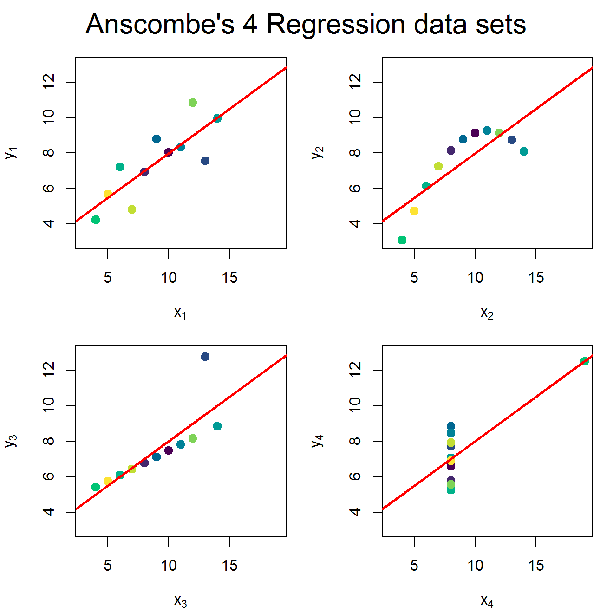

---
title: "数据可视化与R语言"
subtitle: "Data Visualization with R: Base Lattice GGplot2 Grid"
author: "黄湘云"
date: "2019-06-06 11:30:17 CST"
site: bookdown::bookdown_site
documentclass: book
toccolor: magenta
fontsize: 10pt
secnumdepth: 3
colorlinks: yes
classoption: "UTF8,oneside"
bibliography: [latex/book.bib, latex/refer.bib, latex/packages.bib]
biblio-style: apalike
link-citations: yes
subparagraph: true
description: "学习 R Graphics 部分的测试代码，函数各参数含义的查询手册，主要目的是帮助读者读懂参考手册，写作过程分步走：学习知识，记笔记，可写本书上，博客侧重在某个点的内容扩展上，书籍需要照顾覆盖面，各部分平衡一点，整理心得，再次修改笔记以符合书籍。所有的案例都基于真实数据集，基础 R 打包的数据集都是真实的，扩展案例就是在规模上进行扩展，选用基础 R 中的数据，原因是收集清洗真实数据是比较麻烦和费时间的事情。数据操作和数据清理部分以Base R为主，在sidebar中给出tidyverse的等价表示。数据可视化部分以ggplot2为主，在sidebar中给出Base R的等价表示"
keywords: ["Base", "Lattice", "GGplot2", "Grid"]
# cover-image: "images/dragon.png"
github-repo: XiangyunHuang/RGraphics
favicon: "images/favicon.ico"
url: 'https\://bookdown.org/xiangyun/RGraphics/'
# layout: default
# comments: true
---

 

# 欢迎 {#welcome .unnumbered}

写作动机，如何加入写作，版权声明

强调图的作用，检验模型的重要性

注意
: 本书要求复现环境是 R 3.6.0 因为书中涉及 `barplot` 新增的公式方法，新增多维数组操作函数 `asplit`， `axis` 函数的 `gap.axis` ，新增 `hcl.colors` 函数等，完整列表见官网 [What's New?](https://cran.r-project.org/doc/manuals/r-release/NEWS.html)

