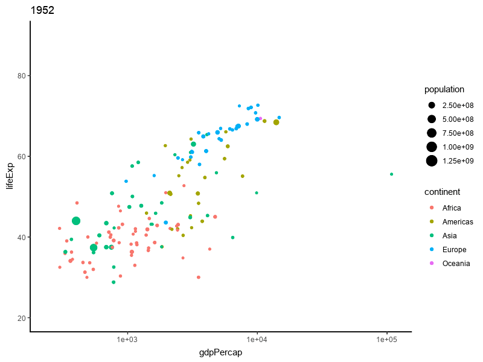

# 交互式图形 {#interactive-graphics}

这里的动态图形覆盖的范围是各种 JS 库，还包含 tcltk、 rgl 和 svg 里面的动图，包括由静态图形转化过来的图形如 animation 或者 magick 和 gganimate 制作的图形 

[htmlwidgets](http://www.htmlwidgets.org/) 将基于 JavaScript 的图形渲染库引入 R， [svgViewR](https://github.com/aaronolsen/svgViewR) 包制作基于 SVG 和 WebGL 的 3D 动画， [mapmate](https://github.com/leonawicz/mapmate) 制作地图方面的三维可视化图形

## gganimate

```{r,echo=TRUE}
library(ggplot2)
library(gganimate)
```


## magick

```{r,echo=TRUE,eval=FALSE}
library(gapminder)
library(magick)
img <- image_graph(res = 96)
datalist <- split(gapminder, gapminder$year)
out <- lapply(datalist, function(data) {
  p <- ggplot(data, aes(gdpPercap, lifeExp, size = pop, color = continent)) +
    scale_size("population", limits = range(gapminder$pop)) +
    scale_x_log10(limits = range(gapminder$gdpPercap)) +
    geom_point() + ylim(20, 90) + ggtitle(data$year) + theme_classic()
  print(p)
})
dev.off()
gapminder <- image_animate(img, fps = 2)
image_write(gapminder, "gapminder.gif")
```



tweenr 用于中间过渡，插值。

这个栗子叫 3D 版邪恶的曲线，源于 Y 叔的博客^[<https://guangchuangyu.github.io/cn/2017/09/3d-breast/>]。

$$f(x;\theta,\phi) = \theta x\log(x)-\frac{1}{\phi}\mathit{e}^{-\phi^4(x-\frac{1}{\mathit{e}})^4}$$

其中 $\theta \in (2,3), \phi \in (30,50), x \in (0,1)$

```{r,echo=TRUE,fig.cap="tweenr 添加过渡效果"}
f <- function(a, b) {
  function(y) {
    a * y * log(y, base = 10) - 1 / b * exp(-(b * y - b / exp(1))^4)
  }
}

y <- seq(0, 1, length.out = 100)
cols <- colorspace::rainbow_hcl(5)
d5 <- data.frame(x = f(3, 30)(y), y = y, color = cols[1])
d4 <- data.frame(x = f(2.8, 33)(y), y = y, color = cols[2])
d3 <- data.frame(x = f(2.5, 36)(y), y = y, color = cols[3])
d2 <- data.frame(x = f(2.2, 40)(y), y = y, color = cols[4])
d1 <- data.frame(x = f(2, 50)(y), y = y, color = cols[5])

df <- list(d5, d4, d3, d2, d1)

library(tweenr)
df2 <- tween_states(df,
  tweenlength = 2, statelength = 1,
  ease = rep("cubic-in-out", 4), nframes = 100
)

ggplot(data = df2, aes(x, y, color = I(color), frame = .frame)) +
  geom_path() +
  coord_flip() +
  theme_minimal() +
  labs(x = NULL, y = NULL)
```

## plotly

[plotly](https://plotly-r.com) 类似 GGplot2 提供了各种交互图形的绘制函数，其中 `plot_ly` 函数提供了两种风格的绘图方式，一种是 Base R 另一种是 GGplot2，我们主要考虑使用 GGplot2 这种风格的 

### 直方图 {#plotly-histogram}

```{r,echo=TRUE}
library(plotly, warn.conflicts = FALSE)
packageVersion("plotly")
# 生成一些随机数
days <- abs(rnorm(1000, 80, 125))

p1 <- plot_ly(as.data.frame(days), x = ~days) %>% add_histogram(name = "plotly.js")

# hist 的默认方法是 Sturges
price_hist <- function(method = "FD") {
  h <- hist(diamonds$price, breaks = method, plot = FALSE)
  plot_ly(x = h$mids, y = h$counts) %>% add_bars(name = method)
}

subplot(
  p1, price_hist(), price_hist("Sturges"),  price_hist("Scott"),
  nrows = 4, shareX = TRUE
)
```

### 地图 {#plotly-map}

```{r,echo=TRUE}
library(maps)
map_data("world", "canada") %>%
  group_by(group) %>%
  plot_geo(x = ~long, y = ~lat) %>%
  add_markers(size = I(1))
```

### 热力图 {#plotly-heatmap}

```{r,echo=TRUE}
data(geyser, package = "MASS")
den <- MASS::kde2d(geyser$waiting, geyser$duration)

# 热力图
plot_ly(x = den$x, y = den$y, z = den$z) %>%
  add_heatmap()

# 等高线图
plot_ly(x = den$x, y = den$y, z = den$z) %>%
  add_contour()
```

## leaflet {#leaflet}

leaflet 基于 leaflet.js 展示空间数据

```{r,echo=TRUE}
library(leaflet)
# a map with the default OSM tile layer
leaflet() %>% 
  addTiles() %>% 
  setView(-93.65, 42.0285, zoom = 17) %>% 
  addPopups(-93.65, 42.0285, 'Here is the <b>Department of Statistics</b>, ISU')
```

## highcharter

### 时序图 {#highcharter-ts}

可能需要研究下 highcharts.js 的 API <https://api.highcharts.com/highcharts/series>

```{r,echo=TRUE}
library(highcharter)
methods(hchart)
getAnywhere(hchart.mts)
class(EuStockMarkets)
# hchart(EuStockMarkets) # 为何不能绘制
```

```{r,echo=TRUE}
hchart(AirPassengers)
```


```{r,echo=TRUE}
highchart() %>% 
  hc_chart(type = "line") %>% 
  hc_title(text = "Monthly Average Temperature") %>% 
  hc_subtitle(text = "Source: WorldClimate.com") %>% 
  hc_xAxis(categories = c("Jan", "Feb", "Mar", "Apr", "May", "Jun",
                          "Jul", "Aug", "Sep", "Oct", "Nov", "Dec")) %>% 
  hc_yAxis(title = list(text = "Temperature (C)")) %>% 
  hc_plotOptions(line = list(
    dataLabels = list(enabled = TRUE),
    enableMouseTracking = FALSE)
    ) %>% 
  hc_series(
    list(
      name = "Tokyo",
      data = c(7.0, 6.9, 9.5, 14.5, 18.4, 21.5, 25.2, 26.5, 23.3, 18.3, 13.9, 9.6)
    ),
    list(
      name = "London",
      data = c(3.9, 4.2, 5.7, 8.5, 11.9, 15.2, 17.0, 16.6, 14.2, 10.3, 6.6, 4.8)
    )
  )
```

### 散点图 {#highcharter-scatter}

```{r,echo=TRUE}
data(diamonds, mpg, package = "ggplot2")
hchart(mpg, "scatter", hcaes(x = displ, y = hwy, group = class))
```

### 地图 {#highcharter-map}

美国失业率数据

```{r,eval=FALSE,echo=TRUE}
data(unemployment, package = "highcharter")
temp <- unlist(strsplit(unemployment[, 2], ",")) # 拆成两列
unique(temp[seq(from = 2, to = length(temp), by = 2)]) # 51 个州
# US Counties unemployment rate
# code: The county code.
#
# name: The county name.
#
# value: The unemployment.
# A data.frame with 3 variables and 3216 observations.
```

```{r,echo=TRUE}
data(unemployment)
hcmap("countries/us/us-all-all",
  data = unemployment,
  name = "Unemployment", value = "value", joinBy = c("hc-key", "code"),
  borderColor = "transparent"
) %>%
  hc_colorAxis(dataClasses = color_classes(c(seq(0, 10, by = 2), 50))) %>%
  hc_legend(
    layout = "vertical", align = "right",
    floating = TRUE, valueDecimals = 0, valueSuffix = "%"
  )
```

## vegawidget

动态交互图形包 vegawidget 基于 vega 支持导出 SVG 格式图片

```{r,echo=TRUE}
library("vegawidget")
spec_mtcars <-
  list(
    `$schema` = vega_schema(), # specifies Vega-Lite
    description = "An mtcars example.",
    data = list(values = mtcars),
    mark = "point",
    encoding = list(
      x = list(field = "wt", type = "quantitative"),
      y = list(field = "mpg", type = "quantitative"),
      color = list(field = "cyl", type = "nominal")
    )
  ) %>% 
  as_vegaspec()
spec_mtcars
```


## 网络图 {#network}

[visNetwork](https://github.com/datastorm-open/visNetwork) 基于 vis.js 库

```{r,echo=TRUE}
library(visNetwork)
nodes <- data.frame(id = 1:7, label = 1:7)
edges <- data.frame(
  from = c(1, 2, 2, 2, 3, 3, 2),
  to = c(2, 3, 4, 5, 6, 7, 7)
)
```

从上到下的方向

```{r,echo=TRUE}
visNetwork(nodes, edges, width = "100%") %>%
  visEdges(arrows = "from") %>%
  visHierarchicalLayout() # same as visLayout(hierarchical = TRUE)
```

从左到右的方向

```{r,echo=TRUE}
visNetwork(nodes, edges, width = "100%") %>%
  visEdges(arrows = "to") %>%
  visHierarchicalLayout(direction = "LR", levelSeparation = 500)
```


[DiagrammeR](https://github.com/rich-iannone/DiagrammeR) 优点是可以将网络图导出 SVG 格式


## threejs 

三维交互可视化库，比如交互式全球可视化 Building an Interactive Globe Visualization in R [threejs][r-threejs]


[r-threejs]: https://www.displayr.com/interactive-globe-r/
